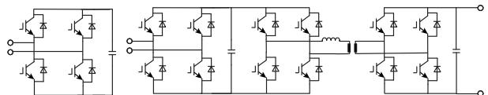
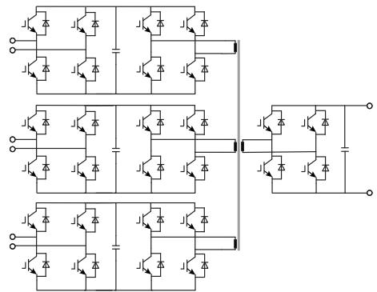
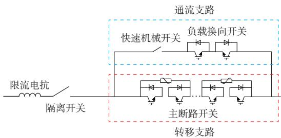
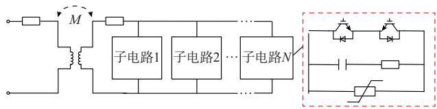
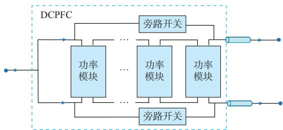
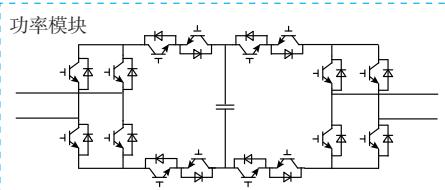
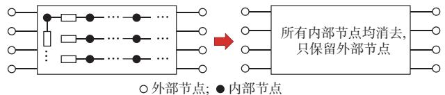
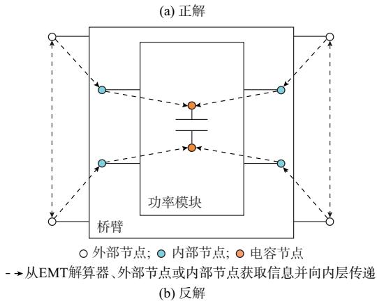
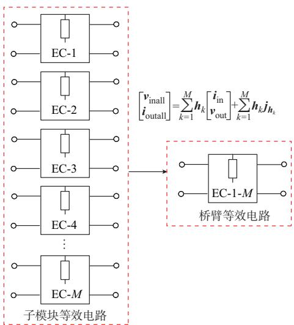

# 国产化电磁暂态仿真平台发展方向分析及展望

冯谟可，王傲群，袁 帅，许建中，赵成勇

（新能源电力系统国家重点实验室（华北电力大学），北京市 102206）

摘要：国产电磁暂态仿真平台存在用户群小、推广困难、难以面向工程的难题，亟须寻找合适的研究方向提升仿真性能。随着中国电网逐渐向大规模、高复杂度、电力电子化的方向发展，现有仿真平台的效率越来越难以满足需求。除此之外，现有仿真平台在软件内核、底层开放性和与硬件实物的交互能力上还存在提高空间，平台易用性还需进一步优化。总结了当前模块化电力电子装备的建模方法，提出了仿真技术的前瞻方向，并归纳出能够有效提高仿真效率的一般化加速仿真框架。最后，提出了国产平台易用性优化的具体建议，并指明了技术研究方向。

关键词：电力电子；电磁暂态仿真平台；建模方法；仿真效率

# 0 引 言

模 块 化 多 电 平 换 流 器（modular multi-levelconverter，MMC）和 电 力 电 子 变 压 器（powerelectronic transformer，PET）可 以 将 风 电 、光 伏 等 新能源电力汇集，并在不同端口间“按需分配”，从而实现能量路由的功能［1-2］ 。PET作为近年来兴起的热门设备，可以实现多电压等级的交直流电压转换、电气隔离、功率传输和大规模分布式新能源并网接入等功能，已经逐渐成为交直流配电网中的关键设备［3-5］。 除 此 之 外 ，直 流 断 路 器（DC circuit breaker，DCCB）、直 流 限 流 器（DC fault current limiter，DC-FCL）和直流潮流控制器（DC power flow controller，DC-PFC）对电网的稳态正常工作和故障清除功能有着重要作用，与MMC、PET一起构成了结构复杂的电力电子网络。

传统的电网仿真一般为机电暂态仿真，其仿真步长远大于暂态过程时间，难以分析变化迅速的电磁暂态过程［6］ ，无法适用于开关频率较高、非线性强的电力电子网络，因此，电力电子网络中通常采用电磁暂态仿真技术。电磁暂态仿真根据各类元件的不同特性精准地获取其动态特征，从而得到高精度模型［7］ 。通过将装备级模型连接为电网，可以通过电磁暂态仿真得到各电力电子装备的精确暂稳态特性。随着国内电网的快速发展，其规模和复杂度大

幅提高，导致各国外平台如器件级平台 SABER和Pspice、电 磁 暂 态 仿 真 平 台 VTB（virtual test bed）、实 时 控 制 工 具 箱 xPC Target 和 硬 件 仿 真 平 台Typhoon HIL等，以及在国内离线和实时仿真领域应 用 较 多 的 PSCAD/EMTDC、 MATLAB/Simulink 和二者对应的实时仿真平台 RTDS、RT-LAB的计算效率越来越难以满足国内科研和实际工程的需求。

在仿真平台中采用分立元件搭建设备详细模型是仿真的常用方法，但大规模电网详细模型的仿真十分缓慢。为提高仿真效率，各种以提速为目的的建模方法被相继提出。目前，在各仿真平台上已经有种类丰富的MMC模型可以使用，但对于PET的仿真，仅有PLECS平台上包含集成化非提速的级联H 桥 型 双 有 源 桥（cascaded H-type bridge based dualactive bridge，CHB-DAB）模型。MMC 和 PET 模型开发周期长，所需专业知识复杂，研究者自行开发相关模型较为困难。模型的匮乏将为高电平 PET等柔性模块化电力电子设备动态特性的研究带来不便，限制了电力电子网络的研究进展。

此外，随着仿真技术发展迅速，大数据技术、人工 智 能 技 术 在 电 力 系 统 仿 真 中 得 到 了 广 泛 应用［8-10］ ；多速率、异步并行技术可以适用于大规模的分 布 式 计 算 ，也 适 用 于 中 央 处 理 单 元（centralprocessing unit，CPU）及 图 形 处 理 单 元（graphicsprocessing unit，GPU）并行计算［11-14］，在极大程度上提高了仿真效率，使得仿真超大规模电网的详细电磁暂态过程成为可能。但国外平台尚未将这些技术

集成到仿真平台中，其预留的应用程序编程接口（application programming interface，API）不 足 以 支撑用户自定义此类复杂功能，使得仿真能力大为受限。

因此，亟须建设具有自主知识产权的仿真平台。在底层完全开放的国产化平台下，可以对标国内科研和工程的实际要求方便地开发各类装备模型。同时，将前瞻性的仿真技术集成到仿真平台中，能够解决大规模电网仿真效率的问题。

本文详细分析了国外仿真平台的现状，总结其优缺点，凝练出国外仿真平台所面临的两大问题：易用性问题和模型丰富性问题。在易用性方面，本文详细分析了国外平台的不足之处，为国产平台提升易用性提供了建议；在模型丰富性方面，本文介绍了当前柔性模块化电力电子设备仿真建模所面临的挑战，总结了当前的建模技术，并对后续建模方法进行了展望，为国产平台开发多种类型的电力电子装备模型提供了理论基础。

# 1 国外电磁暂态仿真平台现状

在商用领域，国外电磁暂态仿真平台种类多样，各平台特色功能也不尽相同。在世界范围的商用领域中，主要由国外平台占据市场。

# 1. 1 常用商业仿真平台

目前，在国内电磁暂态离线和实时仿真领域应用 较 多 的 是 加 拿 大 的 PSCAD/EMTDC、美 国MathWorks 公司的 MATLAB/Simulink 以及二者对应的实时仿真平台 RTDS 和 RT-LAB。本文主要对这4种平台进行介绍和分析。

# 1. 1. 1 PSCAD/EMTDC

PSCAD/EMTDC是由加拿大曼尼托巴水电局开发的电磁暂态仿真程序。它能够对包含复杂元件的电力系统进行全面的电磁暂态模拟。PSCAD/EMTDC拥有种类丰富的元件库、高效的计算内核和灵活的自定义能力，仿真结果在工业界得到了广泛认可，是电力电子系统中使用最广泛的仿真平台。

PSCAD/EMTDC的主要优势在于使用结构清晰的 EMTDC仿真框架，包含 BEGIN（用于初始化程序参数）、DSDYN（用于计算电力网络参数）、EMTDC解算（用于求解电力网络）、DSOUT（用于输出前一步长计算结果） 个主流程结构以及Computation、Branch、Check 等 辅 助 流 程 ，能 够 步 骤清晰地实现仿真过程。同时，PSCAD支持Fortran、C/C++语言的外部源文件扩展，可以灵活、方便地满足用户自定义仿真功能的需求。

# 1. 1. 2 MATLAB/Simulink

MATLAB/Simulink 是由美国 MathWorks 公司推出的 MATLAB程序中的一套可视化仿真工具。它不局限于电力系统领域的应用，而是被广泛应用于各类线性系统、非线性系统、数字控制及数字信号处理系统中。它支持连续时间采样、离散时间采样和变步长混合采样，并能为不同的子系统分配不同的采样速率以实现多速率仿真。

MATLAB/Simulink 在电力系统中的仿真基于状态空间方程，在实现变步长和多速率仿真时相较于 电 磁 暂 态 编 程 （electromagnetic transientprogramming，EMTP）方法更为方便。MATLAB/Simulink支持外部 C语言文件扩展，同时与硬件具有良好的接口，在仿真中使用的C文件可以便捷地嵌入硬件环境中使用。依托于强大的MATLAB库和完备的仿真内核，MATLAB/Simulink 可以实现复杂多样的仿真功能。

# 1. 1. 3 RTDS

RTDS是由加拿大RTDS公司开发的实时数字仿真系统，采用定制化硬件，利用多处理器的并行计算技术加速，其电磁暂态仿真底层原理与PSCAD/EMTDC 相同，是 PSCAD/EMTDC 的实时化版本。

RTDS装置具有丰富的输入输出硬件接口，可以处理模拟量、数字量及开关量等，与外部实物控制系统连接后还可实现闭环硬件在环仿真。RTDS在世界范围内得到了广泛应用，国内也有大量高校、企业使用RTDS平台进行仿真研究。

# 1. 1. 4 RT-LAB

RT-LAB 是由加拿大 Opal-RT 公司所开发的一套工业级实时仿真系统平台软件包。RT-LAB平台的计算底层基于 MATLAB/Simulink，用户可以直接将已有的 MATLAB/Simulink工程转化为可用于RT-LAB实时仿真的模型，并将模型传输到定制化仿真机上进行实时仿真。与 RTDS类似，RT-LAB平台同样具有基于CPU级别的并行实时仿真和基于现场可编程逻辑门阵列（field-programmablegate array，FPGA）的实时仿真，也可以通过硬件接口与外部物理装备互联进行硬件在环或动模仿真。RT-LAB具有丰富的电力电子元件模型库，可以用于逆变器、MMC、PET、柔性交流输电系统（flexibleAC transmission system，FACTS）等多种电力电子系统。

# 1. 1. 5 其他仿真平台

除上述主流的离线或实时仿真平台外，电力电子领域还有 、 等仿真平台。 平台聚焦于系统级特性，所有电力电子开关均忽略开

通电阻和开关过程，且关断电阻为无穷大。PLECS方便快捷、易于使用，常用于日常教学和简单的项目工程中。PSIM 平台也秉承简单易学的作风，界面简单友好，仿真时忽略了复杂的开关特性，便于实现高速仿真。

# 1. 2 国外平台优势成因及现有问题

国外商用仿真平台起步较早，已经形成了较为完整的商业生态和技术结构。市场方面，国外平台装机量大、知名度高，在世界范围内受到广泛认可。即使在国内，这些平台的使用率也具有优势，使得国产平台的推广和发展受阻，难以形成用户群体；技术方面，经过几十年的时间检验和市场考验，国外平台在技术细节方面的打磨已经较为完善，因此平台的稳定性和可靠性较高。国产平台起步较晚，还需要大量时间来积累经验，同时也需要根据大量用户在实际工程中使用软件的反馈来完善各种细节。

国外平台在市场和技术方面的先发优势使得用户缺乏动力更换研究平台，遏制了国产平台的发展。一旦国外平台停止对国内的服务，国内将缺乏高效、易用的电磁暂态仿真平台。

为摆脱这一现状，国产平台需要扬长避短，从国外平台的弱点出发，解决用户痛点。在当前国内直流输电快速发展的背景下，国外平台在仿真大规模电力电子网络方面存在不足，以 PSCAD/EMTDC为例，国外平台主要在模型丰富性和易用性方面存在不足。

模型方面，国外平台不能紧随国内发展趋势更新模型库，无法适应快速发展的电力电子直流电网。新型 PET等装备的拓扑及控制方式的研究已经趋于成熟，目前国内已有较多的 PET工程，如张家口崇礼 PET、张北小二台 PET、苏州同里 PET［15］等，但目前 PSCAD/EMTDC的最新发行版本中仍未包含可以进行快速仿真的DAB、CHB-DAB等结构的库模型，而通过 自定义接口编写模型开发门槛较高，开发成本和开发周期都难以接受。

易用性方面，国外平台对于模型开发人员和用户都有诸多不便之处，列举如下：

1）平台软件内核相对老旧，难以应用最新的计算机技术为模型研发提供便利。PSCAD/EMTDC的底层基于 Fortran语言，并提供了通过 Fortran调用 的功能。虽然 与 在计算性能上仍然保持较高水平，但学习难度较高，且缺乏方便易用的原生库，增大了开发难度。同时，人工智能技术已经在电力系统得到了广泛应用，其强大的数据挖掘能力在电力系统暂态计算中起到了显著的效果［16-18］ 。Python语言在人工智能等方向的编程

较为方便，但受限于仿真软件的内核，目前难以高效地 将 Python 集 成 到 PSCAD/EMTDC 等 仿 真 软件中。

2）软件底层开放性不高，自定义模型相对受限。虽然 PSCAD/EMTDC 开放了大部分 EMTDC过程的访问权限，但核心的EMTDC解算步骤是完全封闭的，用户无法应用任何形式的加速算法，也无法自定义有特殊数据接口的元件（如需要回溯插值的 二 极 管 、绝 缘 栅 双 极 型 晶 体 管（insulated gatebipolar transistor，IGBT）等）。当模型中包含此类元件时，自定义模型的实现将变得较为困难。  
3）软件缺乏与硬件的接口，进行硬件实验不便。虽然 RTDS 公司已经开发了基于 PSCAD 的RTDS实时仿真器，但该仿真器封装程度较高，必须使用特定设备进行仿真。对于普通用户，无法自行购置FPGA或其他硬件控制器与PC端的仿真软件互联通信，必须购买昂贵的仿真设备，仿真局限性较大。

# 2 柔性模块化电力电子装备电磁暂态仿真技术现状及展望

为完善不同类型模型的支持，解决仿真效率问题，必须研究切实可行的仿真技术，实现精确、快速仿真。

# 2. 1 当前面临的仿真挑战

柔性模块化电力电子装备主要面临仿真速度缓慢的问题。不同于传统的交流设备，为实现快速、灵活的控制，柔性电力电子装备中含有海量柔性开关器件，使得其拓扑结构复杂、电气节点数目庞大。

常见的子模块中通常包含数个如图 1（a）所示的 H桥结构，每个 H桥与电容搭配形成 AC/DC或电能变换环节。在一些含有高频隔离变压器的子模块中，数个 H桥与变压器协同合作，形成多端口变换网络。每个 H桥含有 4个电气节点，各类复杂功能的子模块通常将数个 H 桥以不同形式连接，导致子模块内部含有数十个节点，这些子模块再以特定形式级联为桥臂，最后形成包含上千个节点的复杂设备。

由于电磁暂态仿真的本质是循环求解节点电压方程，每个仿真步长中均需要对节点导纳矩阵求逆。一般求逆算法的复杂度为O（M3），其中M为待求逆矩阵的阶数。当节点数目大幅增加时，包含柔性模块化电力电子装备的仿真模型运行效率将呈指数级降低，难以满足实际研究的需求。

除此之外，出于体积和成本的考虑，单/多相变压器频率通常在 1~20 kHz，为保证移相控制的精

  
(a) 基本H桥结构  
(b) 双端口电能变换子模块

  
(c)多端口电能变换子模块   
图1 H桥及包含H桥的电能转换环节  
Fig. 1 H-bridge and energy conversion links containing H-bridges

度，其仿真步长需限制在1~10 μs［19-21］ 。电磁暂态解算器在每个步长中均需对节点导纳矩阵求逆，并对整个网络进行回溯插值，因此对步长十分敏感［22］，小步长将成倍增加解算和插值次数，进一步降低仿真速度。

# 2. 2 建模方法研究现状

传统的小信号模型和阻抗模型主要应用于稳态分析和控制系统设计，无法反映复杂工况下的详细暂态过程［23-25］。为解决电磁暂态仿真中存在的问题，文献［26］提出一种开关建模方法，使用电感和电容模拟开关，使得电力电子网络在开关切换时保持网络矩阵不变，从而在仿真开始前提前对网络矩阵求逆，以减少仿真过程中的计算量；文献［27］提出一种网络的快速嵌套求解法，通过数学等效的方式将大型网络矩阵的求逆分解为独立的小矩阵求逆以提高计算速度，同时避免了矩阵对角化带来的精度损失；文献［ ］提出一种半隐式延迟解耦电磁暂态建模方法，以引入半步长延时为代价，利用分网元件将大型网络在合适的位置分割，从而实现了网络矩阵对角化。各小网络可以分别求解戴维南/诺顿等效电路，求解速度大幅度提高。

上述仿真方法为柔性模块化电力电子设备的建模提供了理论基础。针对具体类型的拓扑，文献［ ］以快速嵌套求解法为基础，提出了 的高速、高精度建模方法；文献［30］提出了MMC的半隐式延迟解耦建模方法，在较小的精度损失下，可以达到数十甚至上百倍的加速效果；文献［31］提出一种模块解耦形式的 受控源模型。该模型以一个

步长差的精度损失为代价，将各子模块从桥臂中解耦开，实现电气网络矩阵的对角化处理；文献［32］提出了 MMC的任意端口精确等值方法，其理论精度损失为 0，且能实现较大的仿真加速。文献［33-35］提出了 PET功率模块的平均值模型，但此类模型有较大的内部精度损失；文献［36］提出 CHB-DAB 型 PET 的 半 隐 式 延 时 解 耦 方 法 ，能 实 现 与MMC 建模类似的高精度、高提速效果。文献［37-39］中依次提出 PET的变压器解耦模型、高频链解耦模型和非解耦模型，这些模型在精度和速度上各有取舍，从解耦的不同层次上总结了从变压器解耦、从 高 频 链 电 容 解 耦 以 及 不 解 耦 建 模 带 来 的 实 际效果。

除MMC和PET这2种结构复杂的并网装备以外，电力电子网络中还包含其他多种类型的复杂装备。为此，搭建了国际大电网会议（CIGRE）提出的23端直流电网数字-物理混合模型，总体架构如附录A 图 A1 所示，其中包含 DCCB、DC-FCL、DC-PFC等多类型的关键电力电子设备。这些设备中同样含有大量电力电子开关，对电子电子系统的提速建模提出了挑战。

# 2. 2. 1 DCCB

图 2 所 示 为 DCCB 结 构［40-41］。 为 承 受 故 障 电压，转移支路需串联大量 IGBT。在不考虑详细的开关瞬态过程的情况下，串联 IGBT的动态特性与单个 IGBT 相同，因此在仿真中可以使用“以一代多”的方法，用单个IGBT替换转移支路中的同方向串联IGBT，从而实现仿真加速。

  
图2 ABB直流断路器结构  
Fig. 2 Structure of ABB DC circuit breaker

# 2. 2. 2 FCL

图3所示为磁耦合型故障限流器。该限流器在故障时通过互感为 M 的耦合电感增大一次侧等效电抗值，实现故障电流的抑制。该装备中含有大量子模块，需要将并联的子模块简化等效，同时将电气隔离的耦合电感处理为 T 形等效电路来完成仿真加速。

  
图3 磁耦合型故障限流器结构  
Fig. 3 Structure of magnetic coupling fault current limiter

# 2. 2. 3 DC-PFC

图4所示为模块化潮流控制器拓扑结构。

  
图4 模块化直流潮流控制器结构  
Fig. 4 Structure of modularized DC power flow controller

该潮流控制器除可以进行正常的潮流分配功能外，还能通过级联子模块抑制故障电流。其子模块采用双全桥结构，可以使用文献［32］所提的双端口建模方法进行等效、级联，从而完成建模。

# 3 国产平台发展方向

第 1章指出，国产平台的突破应面向模型的丰富性和平台的易用性。在模型丰富性方面，基于第2章的研究现状，本章总结出仿真技术的前瞻方向，并梳理一般化的加速仿真的基本框架，为国产平台提供模型基础；在易用性方面，将基于国外平台的不足提出具体建议。

# 3. 1 国产仿真平台发展现状

近年来国内研究单位不断追求技术进步，开发了多个自研电力电子电磁暂态仿真平台。各平台既能保证基本的电磁暂态仿真功能，又各具特色，形成了独特的国产化平台市场格局。

# 3. 1. 1 ADPSS

中国电力科学研究院有限公司开发的 ADPSS新一代仿真平台基于高性能 PC机群，利用机群的多节点结构和高速本地通信，实现了计算任务的分解与网络并行计算。同时，对进程进行实时仿真和

同步控制，可以实现对多达 4 000台发电机、40 000个节点的大规模复杂交直流电力系统机电暂态和电磁 暂 态 的 实 时 和 超 实 时 仿 真 以 及 外 接 物 理 装 备试 验［42-43］ 。

# 3. 1. 2 DSIM

DSIM是由清华大学自主研发的基于离散状态事件驱动（discrete state event driven，DSED）仿真方法的国产电力电子仿真软件［44］。该软件突破了传统“时间离散”系统的仿真瓶颈问题，以系统状态的质变和切换为离散准则，自适应地实现时间离散，从而可以仿真跨越多个时间尺度（从纳秒到秒）的系统瞬态过程，大幅提高了仿真精度和仿真速度［45］ 。

# 3. 1. 3 CloudPSS

清华大学开发了基于云端计算的CloudPSS电磁暂态高性能仿真平台，可以进行电磁暂态仿真、移频暂态仿真、硬件在环仿真等［46］ 。该平台采用定制化硬件，实现了云端服务器或本地服务器的在线计算，并通过高度优化的并行化技术提高仿真效率。CloudPSS提供了能源互联网中多种设备的电、磁、热等多物理场详细模型，可实现多时间尺度下能源互联网的精确动态仿真、运行控制在环测试及信息物流和仿真等多种应用场景。

在充分学习国外商业平台的基础上，国内各仿真平台为克服 1.2 节所述各项问题已经作出了努力。例如：针对电力电子装备模型不足的问题，CloudPSS 平台已开发出 CHB-DAB 的加速仿真模型，并正在研发其他电力电子装备等效模型；三大平台均使用自主仿真内核，拥有完整的软件底层控制权限；同时，国产平台可以灵活地实现软硬件互联，便于进行硬件在环、动模等包含物理装置的试验和仿真。

# 3. 2 仿真技术前瞻展望

随着计算机技术的快速发展，除了从原理上使用高效算法建模以外，利用计算机技术在编程上对仿真模型进一步优化加速也逐渐成为电磁暂态仿真的关键。

Intel Math Kernel Library（Intel MKL）数 学 核心函数库是一套高度优化、线程安全的高效数学计算函数库，能够提高在解算大型计算问题时的程序性能。Intel MKL 提供 BLAS 和 LAPACK 高效线性代数库，并支持快速傅里叶变换、矢量化数学函数、随机数生成函数以及其他功能［47-48］ 。在电力系统领域，Intel MKL 可以优化模型等效计算过程、提升EMTDC 求解时的矩阵计算效率，从而提高程序性能。

OpenMP 是 由 OpenMP Architecture Review

Board牵头提出的一套基于共享内存的多处理器程序设计编译处理方案［49-51］ 。通过在源代码中添加特定的预处理指令，即可由编译器将程序并行化，所需的同步、互斥、通信等必要功能均由编译器自动完成，无须用户编写。当预处理指令被注释掉或编译器不支持OpenMP功能时，程序无须修改即退化为通常的串行程序，仍可正常运行。OpenMP使用简单，随着计算机性能的提高，其并行功能可以提供可观的加速效果。除了 OpenMP 外，还有基于共享内存的 pthread、基于分布式内存的 MPI 以及使用GPU计算等的并行化技术，合理使用后均能大幅提高程序性能。

应当意识到，计算机技术的快速发展为电力系统仿真注入了新的活力，也对该领域的科研人员提出了更高要求。合理使用计算机技术以改善各种仿真所面临的关键问题将成为后续发展的趋势。

# 3. 3 模块化电力电子装备加速仿真一般流程

电力电子装备的模型主要分为解析式模型和递推式模型。解析式模型如各类平均值模型，在适当简化假设的前提下给出装备动态特性的解析表达式，从而根据不同激励直接得到整个时域的全部响应；递推式模型则是构建当前时刻的响应与历史时刻状态、激励等的递推关系，从而通过历史值求得当前时刻的响应。递推式模型可以精确反映器件的暂稳态特性，无须预设大量前提条件，在电磁暂态仿真中得到了广泛应用。经典的 Dommel模型［52］、统一电 磁 等 值 电 路（unified magnetic equivalent circuit，UMEC）变压器模型［53］ 等均为递推式模型。

一般而言，电力电子装备的加速仿真按以下顺序进行：首先，建立开关器件模型及电阻、电容、电感、变压器等元器件的模型；然后，通过等效算法形成各子模块等效模型；最后，使用级联算法构建桥臂等效模型，并通过电磁暂态仿真程序将等效桥臂组合为电力电子装备模型。在得到等效模型后，使用并行化技术编程，最终完成加速仿真。

# 3. 3. 1 开关器件等效算法

电力电子开关是电力电子系统的核心设备，其结构复杂，含有较多寄生参数，建模难度较高。可以准确模拟开关设备动态行为的器件级模型相对复杂，不适合应用于大型电力电子系统中。电磁暂态仿真建模中，通常使用忽略开关瞬态特性和各类寄生参数的二值电阻模型。该模型根据触发信号为“导通”或“关断”，来决定等效电阻取较小值R 还是较大值 $R _ { \mathrm { o f f o } }$ 。文献［53-54］指出，在系统级仿真中，二值电阻模型的精确程度已经足以满足仿真的需求。

# 3. 3. 2 子模块提速建模算法

在众多等效建模算法中，快速嵌套求解法可以大幅提高仿真速度并降低精度损失，在电力电子装备建模领域得到了广泛应用［55］ 。如图 5所示，其核心思想为在正解时使用外部节点表示内部节点，将内部节点的“贡献”转移到外部节点上，从而在仿真时消去内部节点，以减少节点数量，提高 EMTDC的求解速度。所消去的内部节点的电压、电流信息可 以 根 据 电 磁 暂 态（electromagnetic transient，EMT）解算器中读取到的外节点状态与预先存储的拓扑信息反解求得，因此子模块的细节信息并不会缺失。快速嵌套求解法是一种精确的等效算法，适用于大部分拓扑结构，可以详实地反映模型的各类暂稳态特性。

  
图5 快速嵌套求解法示意图  
Fig. 5 Schematic diagram of fast nested solving method

# 3. 3. 3 子模块级联算法

对子模块提速建模后，桥臂中仍保留了大量等效电路，节点数目仍然较多，需要继续消去级联子模块内部节点。级联消去可以使用快速嵌套求解法完成，但计算速度较慢。文献［39］使用短路收缩法完成级联，但这种方式必须存储大量拓扑矩阵，且程序逻辑实现难度较大。

文献［ ］提出了一种参数矩阵的级联方法，可以将大量模块用矩阵加法直接级联，无须进行复杂计算。如图 所示，若需要对M个子模块等效电路EC-1到EC-M进行左串右并的级联，则在提前计算出各模块的参数矩阵 $h _ { k }$ 以及注入源 $j _ { h _ { k } }$ 后，直接将参数矩阵叠加即可得到桥臂输入侧总电压 $\pmb { \mathcal { V } } _ { \mathrm { i n a l l } }$ 、输出侧总电流 $ { \boldsymbol { i } } _ { \mathrm { o u t a l l } }$ 与输入侧总电流 $i _ { \mathrm { i n } } .$ 、输出侧总电压 $\boldsymbol { v } _ { \mathrm { { o u t } } }$ 之间的关系，形成桥臂等效电路EC-1-M。

  
图6 参数矩阵级联法示意图  
Fig. 6 Schematic diagram of parameter matrix cascade method

# 3. 3. 4 并行仿真优化编程方法

在实时仿真中，FPGA本身具备并行计算能力，程序的编写可以最大化利用这一性能提升仿真速度。而在离线仿真中，由于仿真设备性能和架构的差异，在编程初期很难为并行计算提供最优化方案，因此通常先编写串行程序，最后根据程序的结构、功能以及仿真机的硬件条件进行有针对性的并行优化。在级联式电力电子设备中，每个子模块的等效与反解都是独立的，可以并行计算；而桥臂的级联过程也可以分组求和，将加法并行，从而提升程序效率。

得益于当前电力电子装备的模块化特性，虽然不同装备的拓扑各异，但开发时都可以遵循一定的规律，通过代码复用缩短模型开发周期。

# 3. 4 平台易用性提升的针对性策略

平台的易用性包含面向第三方开发人员的易用性和面向用户的易用性。对于国外平台目前在开发和使用上存在的不足之处，本文提出 3点有针对性的策略，为国产平台提供建议：

1）针对平台软件内核老旧的问题，国产平台应使用最新的软件架构来完成电磁暂态仿真软件，同时 为 不 同 类 型 的 常 见 编 程 语 言 如 C/C++ 、Fortran、Python、Java 等提供简单明了的 API，以供开发人员在最小的学习成本下完成丰富的内容。同时，软件内部也可以提前集成常用的库功能，例如面向电力电子网络的人工智能算法、神经网络算法和其他参数优化算法，以便于国内用户享受最前沿的仿真技术带来的便利，提升用户黏度。

2）针对软件底层开放性问题，国产平台可与第

三方的平台开发人员（如使用平台的高校或其他单位）进行深度合作，按需定制 API，以确保开发人员能够享受底层 API的便利，降低开发的技术难度。同时需调研用户的使用情况，开放用户常用的API，提高仿真的便利性。

3）针对硬件接口方面，国产平台可设计高效的信号传输协议，理想情况下各平台可协同合作开发通用协议，从而提高国产平台之间的关联性，降低用户学习成本。这样还可提高代码的可移植性，一次开发、多平台使用，扩大各国产平台的市场范围。

# 4 结 语

新能源电网正处于蓬勃发展的新时期，随着MMC、PET以及各类新型模块化电力电子装备的加入，电网的复杂程度大幅增加。国外仿真平台对复杂电网的仿真效率越来越难以满足国内科研和工程实际的需求，且存在一定的易用性问题，不便于开发人员和用户使用，这为国产平台发展指明了方向。当前，合理利用已有技术成果，积极应用前瞻技术，从而打造国产化仿真平台生态迫在眉睫。

可以预见，未来的仿真平台将走向新型技术的大融合，以多类型电力电子装备为基础，围绕多速率技术、异步并行技术、先进计算机技术进行革新，实现电磁暂态仿真的新形态。这是中国自主知识产权发展的黄金时机，应当把握这一机遇，借鉴国外成熟平台的优点，深刻思考其不足之处，扬长避短，将国内自研仿真平台与电力电子装备深度融合，并与实际在建工程互相印证，推动工程与平台协同发展。在中国大电网的工程背景下，有望开发出能够与国外同类型平台竞争的自主知识产权平台，推动现有电磁暂态仿真平台的国产化替代，增强中国的科技竞争力。

附录见本刊网络版（http：//www.aeps-info.com/aeps/ch/index.aspx），扫英文摘要后二维码可以阅读网络全文。

# 参 考 文 献

［ ］林霖，裴忠晨，蔡国伟，等 基于电力电子变压器的中压直流互联配电网协调控制方法［J］. 电力系统自动化，2021，45（8）：51-59.  
LIN Lin， PEI Zhongchen， CAI Guowei， et al. Coordinatedcontrol method for medium-voltage DC interconnecteddistribution network based on power electronic transformer［J］.Automation of Electric Power Systems，2021，45（8）：51-59.  
［2］魏星，朱信舜，袁宇波，等 .级联型电力电子变压器分级解耦控制［］电力系统自动化， ，（ ）： -

WEI Xing，ZHU Xinshun，YUAN Yubo，et al. Hierarchicaldecoupling control of cascaded power electronic transformer［J］.Automation of Electric Power Systems，2021，45（8）：194-199.  
［3］梁得亮，柳轶彬，寇鹏，等.智能配电变压器发展趋势分析［J］.电力系统自动化，2020，44（7）：1-14.LIANG Deliang，LIU Yibin，KOU Peng，et al. Analysis ofdevelopment trend for intelligent distribution transformer［J］.Automation of Electric Power Systems，2020，44（7）：1-14.  
［4］COSTA L F， HOFFMANN F， BUTICCHI G， et al.Comparative analysis of multiple active bridge convertersconfigurations in modular smart transformer ［J］. IEEETransactions on Industrial Electronics，2019，66（1）：191-202.  
［5］涂春鸣，黄红，兰征，等 .微电网中电力电子变压器与储能的协调控制策略［J］. 电工技术学报，2019，34（12）：2627-2636.TU Chunming， HUANG Hong， LAN Zheng， et al.Coordinated control strategy of power electronic transformer andenergy storage in microgrid ［J］. Transactions of ChinaElectrotechnical Society，2019，34（12）：2627-2636.  
［6］郑庆浩 .交直流大电网的电磁暂态仿真研究［D］.西安：西安科技大学，2020.ZHENG Qinghao. Research on electromagnetic transientsimulation of AC/DC［D］. Xi’an：Xi’an University of Scienceand Technology，2020.  
［7］杨明，张永明，张子骞，等 .电力系统电磁暂态仿真算法研究综述［J/OL］. 电 测 与 仪 表 ：1-11［2021-05-21］.http：//kns.cnki.net/kcms/detail/23.1202.TH.20210415.1530.008.html.YANG Ming， ZHANG Yongming， ZHANG Ziqian， et al.Review on electromagnetic transient simulation algorithm ofpower system ［J/OL］. Electrical Measurement &Instrumentation：1-11[2021-O5-21].http://kns.cnki.net/kcms/detail/23.1202.TH.20210415.1530.008.html.  
［8］杨挺，赵黎媛，王成山.人工智能在电力系统及综合能源系统中的应用综述［］电力系统自动化， ，（ ）：-YANG Ting，ZHAO Liyuan，WANG Chengshan. Review onapplication of artificial intelligence in power system and integratedenergy system ［J］. Automation of Electric Power Systems，， （ ）： -  
［9］费有蝶，黄蔓云，卫志农，等 .深度学习辅助的区域交直流配电 网区间状态估计［J/OL］. 电力系统自动化：1-12［2021-09-09］. https：//kns-cnki-net. webvpn. ncepu. edu. cn/kcms/detail/32. 1180.TP.20210909.1338.005.html. FEI Youdie，HUANG Manyun，WEI Zhinong，et al. Interval state estimation of regional AC/DC distribution network assisted by deep learning ［J/OL］. Automation of Electric Power Systems： 1-12 ［2021-09-09］. https：//kns-cnki-net. webvpn. ncepu.edu.cn/kcms/detail/32.1180.TP.20210909.1338.005.html.   
［10］李亦言，胡荣兴，宋立冬，等.机器学习在智能配用电领域中的应用：北美工程实践概述［］电力系统自动化， ， （ ）：99-113.LI Yiyan，HU Rongxing，SONG Lidong，et al. Application ofmachine learning in field of smart power distribution and

utilization：overview of engineering practice in North America ［J］. Automation of Electric Power Systems，2021，45（16）： 99-113.   
［11］李永佳，李健，郝正航，等.基于传输线解耦法的MMC交直流系统多速率仿真［J］.现代电子技术，2021，44（4）：54-58.LI Yongjia，LI Jian，HAO Zhenghang，et al. MMC AC/DCsystem’s multi-rate simulation based on transmission linedecoupling method［J］. Modern Electronics Technique，2021，44（4）：54-58.  
［ ］韩佶，董毅峰，苗世洪，等 基于 的电力系统分网多速率电磁暂态并行仿真方法［J］.高电压技术，2019，45（6）：1857-1865.HAN Ji，DONG Yifeng，MIAO Shihong，et al. Multi-rateelectromagnetic transient parallel simulation of power systembased on MATE［J］. High Voltage Engineering，2019，45（6）：1857-1865.  
［13］穆清，李亚楼，周孝信，等 . 基于传输线分网的并行多速率电磁暂态仿真算法［J］.电力系统自动化，2014，38（7）：47-52.MU Qing，LI Yalou，ZHOU Xiaoxin，et al. A parallel multi-rate electromagnetic transient simulation algorithm based onnetwork division through transmission line［J］. Automation ofElectric Power Systems，2014，38（7）：47-52.  
［14］王路，李兴源，罗凯明，等.交直流混联系统的多速率混合仿真技术研究［J］. 电网技术，2005，29（15）：23-27.WANG Lu， LI Xingyuan， LUO Kaiming， et al. Study onmultirate hybrid simulation technology for AC/DC powersystem［J］. Power System Technology，2005，29（15）：23-27.  
［15］高范强，李子欣，李耀华，等 .面向交直流混合配电应用的10 kV-3 MVA 四端口电力电子变压器［J］. 电工技术学报，，（ ）： -GAO Fanqiang，LI Zixin，LI Yaohua，et al. 10 kV-3 MVAfour-port power electronic transformer for AC-DC hybrid powerdistribution applications ［J］. Transactions of ChinaElectrotechnical Society，2021，36（16）：3331-3341.  
［16］聂欢欢，张家琦，陈颖，等.基于双层强化学习方法的多能园区实时经济调度［J］. 电网技术，2021，45（4）：1330-1336.NIE Huanhuan，ZHANG Jiaqi，CHEN Ying，et al. Real-timeeconomic dispatch of community integrated energy system basedon a double-layer reinforcement learning method［J］. PowerSystem Technology，2021，45（4）：1330-1336.  
［17］关慧哲，陈颖，黄少伟，等.基于生成对抗网络的暂态稳定预防控制［］电力系统自动化， ，（ ）： -GUAN Huizhe， CHEN Ying， HUANG Shaowei， et al.Preventive control for transient stability based on generativeadversarial network ［J］. Automation of Electric PowerSystems，2020，44（24）：36-43.  
［18］胡青云，黄应敏，许翠珊，等.基于深度神经网络的电力电缆故障检测方法研究［］电子设计工程， ，（ ）： -HU Qingyun，HUANG Yingmin，XU Cuishan，et al. A cablefault detection method based on deep neural network ［J］.Electronic Design Engineering，2020，28（24）：165-168.

［19］许建中，高晨祥，丁江萍，等.高频隔离型电力电子变压器电磁暂态加速仿真方法与展望［J］.中国电机工程学报，2021，41（10）：3466-3479.  
XU Jianzhong， GAO Chenxiang， DING Jiangping， et al.Electromagnetic transient acceleration simulation methods andprospects of high-frequency isolated power electronic transformer［J］. Proceedings of the CSEE，2021，41（10）：3466-3479.  
［20］XU Jianzhong， ZHAO Chengyong， XIONG Yan， et al.Optimal design of MMC levels for electromagnetic transientstudies of MMC-HVDC［J］. IEEE Transactions on PowerDelivery，2016，31（4）：1663-1672.  
［21］GOLE A M，KERI A，KWANKPA C，et al. Guidelines for modeling power electronics in electric power engineering applications［J］. IEEE Transactions on Power Delivery，1997， 12（1）：505-514.   
［22］奕仲飞，张磊，曹树立，等.电力电子开关电路的保阻尼二阶精度 插 值 方 法［J/OL］. 现 代 电 子 技 术 ：1-5［2021-05-21］.http：//kns. cnki. net/kcms/detail/61.1224. TN. 20210330.0926.002.html.  
YI Zhongfei，ZHANG Lei，CAO Shuli，et al. Second order precision damping-preserving interpolation method for power electronic switching circuits ［J/OL］. Modern Electronics Technique：1-5［2021-05-21］. http：//kns.cnki.net/kcms/detail/ 61.1224.TN.20210330.0926.002.html.   
［23］SADAT A R， KRISHNAMOORTHY H S. Fault-tolerant ISOSP solid-state transformer for MVDC distribution［J/OL］. IEEE Journal of Emerging and Selected Topics in Power Electronics［2021-08-08］. http：//ieeexplore. ieee. org/stamp/ stamp.jsp？tp=&arnumber=9234458&isnumber=6507303.   
［24］YE Q，MO R，LI H. Impedance modeling and DC bus voltage stability assessment of a solid-state-transformer-enabled hybrid AC-DC grid considering bidirectional power flow［J］. IEEE Transactions on Industrial Electronics，2020，67（8）：6531- 6540.   
［25］SHI F， SHU D， YAN Z， et al. A shifted frequencyimpedance model of doubly fed induction generator （DFIG）-based wind farms and its applications on s2 si analysis［J］. IEEETransactions on Power Electronics，2021，36（1）：215-227.  
［26］PEJOVIC P， MAKSIMOVIC D. A method for fast time-domain simulation of networks with switches ［J］. IEEETransactions on Power Electronics，1994，9（4）：449-456.  
［27］STRUNZ K， CARLSON E. Nested fast and simultaneoussolution for time-domain simulation of integrative power-electricand electronic systems ［J］. IEEE Transactions on PowerDelivery，2007，22（1）：277-287.  
［28］姚蜀军，庞博涵，吴国旸，等.半隐式延迟解耦电磁暂态并行仿真方法：（一）原理及交流分网与并行［J/OL］.中国电机工程学报 ：1-11［2021-08-31］. https：//doi. org/10.13334/j. 0258-8013.pcsee.201891.  
YAO Shujun，PANG Bohan，WU Guoyang，et al. A method of parallel computing for electromagnetic transient simulation

based on semi-implicit latency decoupling technology：Part Ⅰ theory and AC network partitioning and parallel ［J/OL］. Proceedings of the CSEE：1-11［2021-08-31］. https：//doi.org/ 10.13334/j.0258-8013.pcsee.201891.   
［29］GNANARATHNA U N，GOLE A M，JAYASINGHE R P.Efficient modeling of modular multilevel HVDC converters（MMC） on electromagnetic transient simulation programs［J］.IEEE Transactions on Power Delivery， 2011， 26 （1） ：316-324.  
［30］姚蜀军，庞博涵，曾子文，等.半隐式延迟解耦电磁暂态仿真方法：（二）单端口子模块MMC通用解耦与快速仿真［J/OL］.中国电机工程学报：1-11［2021-08-31］.https：//doi.org/10.13334/j.0258-8013.pcsee.210064.  
YAO Shujun， PANG Bohan， ZENG Ziwen， et al. Semiimplicit latency decoupling technology based electromagnetic transient simulation： Part Ⅱ general decoupling and fast simulation for single-port sub-module MMC ［J/OL］. Proceedings of the CSEE：1-11［2021-08-31］. https：//doi.org/ 10.13334/j.0258-8013.pcsee.210064.   
［31］许建中，赵成勇，刘文静.超大规模MMC电磁暂态仿真提速模型［］中国电机工程学报， ，（ ）： -  
XU Jianzhong，ZHAO Chengyong，LIU Wenjing. Acceleratedmodel of ultra-large scale MMC in electromagnetic transientsimulations［J］. Proceedings of the CSEE，2013，33（10）：114-120.  
［32］许建中，徐义良，赵禹辰，等.多类型子模块MMC电磁暂态通用建模和实现方法［J］.电网技术，2019，43（6）：2039-2048.  
XU Jianzhong，XU Yiliang，ZHAO Yuchen，et al. Generalized electromagnetic transient equivalent modeling and implementation of MMC with arbitrary multi-type submodule structures［J］. Power System Technology，2019，43（6）：2039- 2048.   
［33］ZHAO Tiefu，ZENG Jie，BARAN M E，et al. An average model of solid state transformer for dynamic system simulation ［C］// 2009 IEEE Power and Energy Society General Meeting，July 26-30，2009，Calgary，Canada.   
［34］OUYANG Shaodi，LIU Xinyu，WANG Xiaojian，et al. Theaverage model of a three-phase three-stage power electronictransformer ［C］// 2014 International Power ElectronicsConference （IPEC-Hiroshima 2014-ECCE ASIA），May 18-21，2014，Hiroshima，Japan：2815-2820.  
［35］LI Zixin，QU Ping，WANG Ping，et al. DC terminal dynamic model of dual active bridge series resonant converters［C］// 2014 IEEE Conference and Expo Transportation Electrification Asia-Pacific （ITEC Asia-Pacific），August 31- September 3，2014，Beijing，China：1-5.   
［36］许明旺，庞博涵，曾子文，等.半隐式延迟解耦电磁暂态并行仿真方法：（三）级联 桥型电力电子变压器解耦与仿真［ ］中 国 电 机 工 程 学 报 ：1-12［2021-08-31］. https：//doi. org/10.13334/j.0258-8013.pcsee.210067.  
XU Mingwang，PANG Bohan，ZENG Ziwen，et al. Semi-

implicit latency decoupling technology based electromagnetic transient simulation： Part Ⅲ general decoupling and fast simulation for single-port sub-module MMC ［J/OL］. Proceedings of the CSEE：1-12［2021-08-31］. https：//doi.org/ 10.13334/j.0258-8013.pcsee.210067.   
［37］XU Jianzhong， GAO Chenxiang， DING Jiangping， et al.High-speed electromagnetic transient （EMT） equivalentmodelling of power electronic transformers ［J］. IEEETransactions on Power Delivery，2021，36（2）：975-986.  
［38］冯谟可，高晨祥，丁江萍，等.级联H桥电力电子变压器高频链端口解耦等效模型［J］.中国电机工程学报，2021，41（9）：2999-3012.FENG Moke，GAO Chenxiang，DING Jiangping，et al. Highfrequency link decoupling equivalent model of cascaded H-bridge type power electronic transformer［J］. Proceedings of theCSEE，2021，41（9）：2999-3012.  
［39］FENG M， GAO C， DING J， et al. Hierarchical modelingscheme for high-speed electromagnetic transient simulations ofpower electronic transformers ［J］. IEEE Transactions onPower Electronics，2021，36（9）：9994-10004.  
［40］HASSANPOOR A，HÄFNER J，JACOBSON B. Technicalassessment of load commutation switch in hybrid HVDC breaker［J］. IEEE Transactions on Power Electronics， 2015， 35（10）：5393-5400.  
［41］HAEFNER J， JACOBSON B. Proactive hybrid HVDC breakers—a key innovation for reliable HVDC grids［C］// CIGRE Symposium，September 13-15，2011，Bologna，Italy.   
［42］王玭，李亚楼，陈绪江，等 .基于 ADPSS新一代仿真平台的大规模交直流电网数模混合仿真［J］.电网技术，2021，45（1）：227-234.WANG Pin，LI Yalou，CHEN Xujiang，et al. Digital-analoghybrid simulation of large-scale AC-DC power grids based onADPSS next-generation simulation platform［J］. Power SystemTechnology，2021，45（1）：227-234.  
［43］莫振陇 .基于 ADPSS 的电力系统次同步振荡抑制技术研究［D］.南宁：广西大学，2020.MO Zhenlong. Research on subsynchronous oscillationsuppression technology of power system based on ADPSS［D］.Nanning：Guangxi University，2020.  
［44］ZHAO Z，TAN D，SHI B，et al. A breakthrough in design verification of megawatt power electronic systems［J］. IEEE Power Electronics Magazine，2020，7（3）：36-43.   
［45］SHI B，ZHAO Z，ZHU Y，et al. Discrete state event-driven simulation approach with a state-variable-interfaced decoupling strategy for large-scale power electronics systems［J］. IEEE Transactions on Industrial Electronics，2021，68（12）：11673- 11683.   
［46］SONG Yankan，CHEN Ying，YU Zhitong，et al. CloudPSS：a high-performance power system simulator based on cloudcomputing［J］. Energy Reports，2020，6（9）：1611-1618.  
［47］QI Shouliang，FENG Jie，ZHANG Ruiling，et al. Single and

multi threading MRI reconstruction based on FFTW 2. X and Intel MKL［C］// 2011 IEEE International Conference on Computer Science and Automation Engineering，June 10-12， 2011，Shanghai，China：124-127.   
［48］XU Wenli，CHA Hao，ZHOU Mo. Research and realization of software radar signal processing based on Intel MKL［C］// 2011 International Conference on Computer and Management （CAMAN），May 19-21，2011，Wuhan，China：1-6.   
［49］QAWASMEH A， MALIK A M， CHAPMAN B M. OpenMP task scheduling analysis via OpenMP runtime API and tool visualization［C］// 2014 IEEE International Parallel & Distributed Processing Symposium Workshops， May 19-23， 2014，Phoenix，USA：1049-1058.   
［50］NANDAMURI A，MALIK A M，QAWASMEH A，et al. Power and energy footprint of OpenMP programs using OpenMP runtime API ［C］// 2014 Energy Efficient Supercomputing Workshop， November 16， 2014， New Orleans，USA：79-88.   
［51］周挺辉，严正，唐聪，等.基于多核处理器技术的暂态稳定并行算法［J］.电力系统自动化，2013，37（8）：70-75.ZHOU Tinghui，YAN Zheng，TANG Cong，et al. A parallelalgorithm for transient stability computing based on multi-coreprocessor technology ［J］. Automation of Electric PowerSystems，2013，37（8）：70-75.  
［52］DOMMEL H W. Digital computation of electromagnetic transients in single and multi-phase networks ［J］. IEEE Transactions on Power Application，1969，88（4）：388-399.   
［53］WATSON N， ARRILLAGA J. Power systemselectromagnetic transients simulation［M］. London：Institutionof Electrical Engineers，2003：188.  
［54］PSCAD X4 User’s guide［M］. Winnipeg，Canada：ManitobaResearch Center，2009.  
［55］STRUNZ K， CARLSON E. Nested fast and simultaneoussolution for time-domain simulation of integrative power-electricand electronic systems ［J］. IEEE Transactions on PowerDelivery，2007，22（1）：277-287.

（编辑 章黎）

# Analysis and Prospect of Development of China’s Independent Electromagnetic Transient Simulation Platform

FENG Moke，WANG Aoqun，YUAN Shuai，XU Jianzhong，ZHAO Chengyong (State Key Laboratory of Alternate Electrical Power System with Renewable Energy Sources (North China Electric Power University), Beijing 102206, China)

Abstract: The domestic electromagnetic transient (EMT) simulation platform has the problems of small user base, difficulty in promotion, and difficulty in serving engineering. It is urgent to find a suitable research direction to improve the simulation performance. With the gradual development of China’s power grid in the direction of large scale, high complexity and power electronics, the efficiency of current simulation platforms is relatively low. In addition, there is still space for the improvement in the software kernel, underlying openness, and the ability to interact with hardware objects of the current simulation platforms, and the ease of use of the platform can be further optimized. This paper summarizes the current modeling methods of the modular power electronic equipment, puts forward the forward-looking direction of simulation technology, and summarizes a generalized acceleration simulation framework that can effectively improve simulation efficiency. Finally, specific suggestions on the ease-ofuse optimization of domestic platforms are put forward, and the technical research directions are pointed out.

This work is supported by National Key R&D Program of China (No. 2018YFB0904600).

Key words: power electronics; electromagnetic transient (EMT) simulation platform; modeling method; simulation efficiency

