# 双端口子模块MMC电磁暂态通用等效建模方法

徐义良，赵成勇，赵禹辰，石璐，许建中*

(新能源电力系统国家重点实验室(华北电力大学), 北京市昌平区 102206)

# Generalized Electromagnetic Transient (EMT) Equivalent Modeling of MMCs With Arbitrary Two-port Sub-module Structures

XU Yiliang, ZHAO Chengyong, ZHAO Yuchen, SHI Lu, XU Jianzhong*

(State Key Laboratory of Alternate Electrical Power System with Renewable Energy Sources (North China Electric Power University), Changping District, Beijing 102206, China)

ABSTRACT: This paper proposed an accurate and high-speed electromagnetic transient (EMT) equivalent modeling method for arbitrary novel two-port MMC by using paralleled full bridge sub-module (SMs) modular multilevel converter (MMC) topology. Unlike the previous equivalent method for single-port MMCs, the two-port MMC did not enjoy the feature that the same arm current flows through all the SMs. With respect to this issue, the recursive solution algorithm for two-port MMC was proposed. All the internal nodes both inside the SMs and between SMs were eliminated recursively, then the whole bridge arm was represented by 4 nodes in the main EMT solver. During this process, all the internal information was preserved though increased the bookkeeping effort. After solving the reduced order admittance matrix, the previously eliminated node information such as the capacitor voltages and interfacing node currents were updated. Therefore, the proposed algorithm is very time efficient yet satisfactorily accurate to reproduce identical external as well as internal dynamics. The EMT simulations on PSCAD/EMTDC validated the accuracy and speed up factor of the proposed model.

KEY WORDS: modular multilevel converter (MMC); electromagnetic transient (EMT); two-port sub-module (SM); equivalent model

摘要：针对一种新型并联全桥子模块构成的模块化多电平换流器(paralleled full bridge sub-module MMC，PFB-MMC)拓扑，提出一种适用于任意新型双端口MMC的电磁暂态通用等效建模方法。传统单端口子模块MMC的等效算法要求全部子模块流过相同的桥臂电流，这对双端口MMC不再适用。针对这一问题，适用于双端口MMC的迭代求解算法被提出。MMC桥臂中全部子模块的内部节点和模块间的互

联节点均被迭代消去，整个桥臂在电磁暂态解算器中被等效成仅含4个外部节点，尽管在这一过程中求解的步骤有所增加，但依然能够完整保留各桥臂全部的内部信息。对降阶导纳矩阵进行求解后，即可完成之前被等效消去的节点信息例如电容电压、连接节点电流的更新。因此，该文提出的建模方法，能够在精确仿真系统内、外部动态特性的同时，大幅提高其电磁暂态仿真速度。在PSCAD/EMTDC环境中验证所提出模型的精度和加速比。

关键词：模块化多电平换流器；电磁暂态；双端口子模块；等效模型

# 0 引言

模块化多电平换流器(modular multilevel converter，MMC)凭借其开关损耗低等优点，已在国内外各大柔性直流输电工程中得到了广泛应用[1-3]。但是，目前应用范围最广的半桥型子模块MMC在发生直流侧短路故障闭锁后，依然可以通过反并联二极管向直流短路点馈入电流，因而无法清除直流故障[4]。此外，当电平数较高时，半桥型子模块MMC的电容电压排序即使采用质因子分解法、希尔排序法等低排序复杂度的方法[5-9]，依然存在较大数量的排序运算。

针对这些问题，目前国内外不断有新型双端口子模块拓扑被提出[10-12]，相比于全桥及钳位双子模块等单端口子模块拓扑，这些新型双端口子模块拓扑在具备直流故障钳位能力的同时还具备自均压的能力，被视为MMC子模块未来的候选拓扑之一，具有一定的发展前景。文献[10]在并联IGBT开关组型全桥子模块(full-bridge sub-module，FBSM)的基础上，提出了开关分列运行的并联全桥子模块(paralleled full bridge sub-module，P-FBSM)拓扑，

该拓扑通过4个端子能够实现相邻子模块之间的并联均压，且能够有效的钳位直流故障，在电机等低压领域MMC中得到了应用，且呈现出向高压大容量MMC领域发展的趋势。在电磁暂态仿真中，由新型双端口子模块构成的MMC电平数越高，非线性换流器模型导纳矩阵阶数也将越高。这将使得对非线性换流器模型的导纳矩阵求逆的计算量很大，从而导致其电磁暂态仿真速度极其缓慢，无法满足科研需求。

目前国内外已有的关于MMC的电磁暂态等效模型全部针对单端口子模块拓扑，例如半桥、全桥、双钳位型子模块等[13-20]。这些等效模型适用的前提是全部子模块必须流过相同的桥臂电流，单端口子模块必然满足这一条件，而双端口子模块因为包含4个端子，相邻子模块间电流流通路径复杂多变，无法满足这一条件，因而现有的关于MMC的电磁暂态等效模型均不适用。文献[13-16]提出了一种戴维南等效模型，通过分别求解单个子模块的戴维南等效电路，进而直接求和得到单个桥臂的戴维南等效电路。新型双端口子模块有4个端子，无法求解其戴维南等效电路，且无法像单端口子模块那样将全部子模块等效电路直接求和得到桥臂等效电路。文献[16]提出了一种基于受控源的MMC通用建模方法，使用PSCAD软件中已有的器件搭建模型，具有一定的通用性。但是其使用的器件数目多于详细模型，且扩展的灵活性受限。文献[18]提出了一种改进平均值模型，该模型可以精确仿真换流器闭锁以及严重交、直流故障等工况，但忽略了各子模块电容的区别，无法求解桥臂内部子模块电容电压信息。文献[20]提出了一种高效等值建模方法，该方法将桥臂等效为一个桥臂导通压降模型和一个复合等值模型，具有一定的通用性。但该方法依赖于单个桥臂内各导通子模块电容流过的电流相等均为桥臂电流这一前提，而新型双端口子模块有4个端子，电流流通路径多样不满足这一前提。

为解决这一问题，本文提出一种适用于任意新型双端口子模块MMC的电磁暂态通用等效建模方法。该方法首先列写出单个双端口子模块的节点电压方程，之后采用循环迭代的方法消去MMC桥臂中全部双端口子模块的内部节点和模块间的互联节点，将整个桥臂等效成仅含4个外部节点的等效电路。

# 1 并联全桥子模块MMC

并联全桥子模块可以看做由一个全桥子模块

经对称翻转得到，其拓扑结构如图1所示。

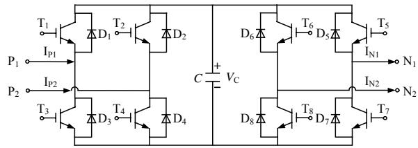  
图1 并联全桥子模块拓扑结构  
Fig. 1 Topology of the P-FBSM

由图1可知，与半桥、全桥等单端口(两端子)子模块不同，单个P-FBSM拥有4个端子： $\mathrm{P}_1$ 、 $\mathrm{P}_2$ 、 $\mathrm{N}_1$ 、 $\mathrm{N}_2$ ，是一种双端口子模块，它由8个IGBT开关器件及其反并联二极管和1个直流存储电容构成。通过8个开关器件的触发信号 $\mathrm{T}_1 - \mathrm{T}_8$ 工作状态的切换，单个P-FBSM一共有9种运行状态，具体的调制和电压平衡控制方法如文献[21]所示。文献[21]基于最近电平逼近调制，设计了一种P-FBSM动态分配均压控制策略，可同时实现子模块电容电压的自均衡和直流故障电流快速清除。

并联全桥子模块 MMC(paralleled full bridgesub-moduleMMC，PFB-MMC)拓扑如图2所示，它依然为三相、六桥臂对称结构。

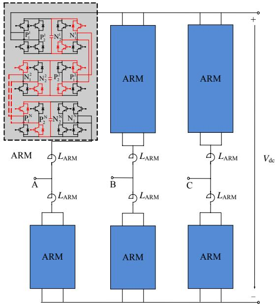  
图2 并联全桥子模块MMC示意图  
Fig. 2 Schematic diagram of the PFB-MMC

# 2 双端口MMC的通用等效建模方法

# 2.1 任意新型双端口子模块拓扑

目前国内外已提出的新型双端口子模块拓扑[10-12]均包含1个子模块电容及4个外部节点，将这些新型双端口子模块内部的IGBT及其反并联二极管用一可变电导 $G$ 等效代替，采用后退欧拉法将 $t$ 时刻单个子模块电容 $C$ 离散化为一个电导 $G_{\mathrm{C}}$ 与一

个历史电流源 $I_{\mathrm{CEQ}} (t - \Delta T)$ 并联，从而可将它们的伴随电路统一表示成图 3 的形式。

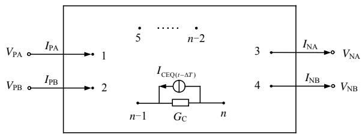  
图3新型双端口子模块伴随电路  
Fig. 3 Companion circuit of the novel two-port sub-module

由图3可知，该子模块共有 $n$ 个节点，其中第 $1\sim 4$ 节点为子模块的4个外部节点，第 $5\sim n$ 节点为内部节点，第 $n - 1$ 、 $n$ 个节点为子模块电容的两个端点。前一个子模块的3、4节点与后一个子模块的1、2节点对应相连，多个双端口子模块通过这种方式级联构成双端口MMC的6个桥臂。

# 2.2 电磁暂态通用等效建模方法

针对图3所示的任意新型双端口子模块构成的MMC，本文提出了一种电磁暂态通用等效建模方法，该方法在实现对外部等效的同时，能够完整保留单个桥臂的各种内部信息。该方法在每个仿真步长内的主要步骤如下：

1）步骤1：首先根据图3所示双端口子模块伴随电路列写出这一时刻全部双端口子模块各自对应的节点电压方程，之后等效消去各子模块的全部内部节点(第 $5\sim n$ 节点)，各子模块分别等效为只剩4个外部节点的等效电路。在此基础上，利用双端口子模块MMC单个桥臂内前一个子模块的3、4节点与后一个子模块的1、2节点对应相连，对应节点的电压、电流相等这一规律，将单个桥臂内第1、2个子模块的中间互联节点等效消去，得到只剩4个外部节点的等效电路block2，之后采用同样的方法等效消去block2与第3个子模块的中间互联节点得到block3，循环迭代最后将单个桥臂内全部 $N$ 个子模块之间的中间互联节点全部等效消去得到只剩4个外部节点的单个桥臂等效电路blockN。该等效电路相比于实际的MMC单个桥臂共等效消去 $N\cdot n - 2N - 2$ 个节点，以201电平PFB-MMC为例，消去节点数为 $200\cdot 6 - 400 - 2 = 798$ ，数目已经非常可观。  
2）步骤2：将MMC六个桥臂全部用单个桥臂等效电路blockN替换，完成双端口子模块MMC电磁暂态等效模型的搭建，之后由电磁暂态仿真软件的解算器对整个双端口子模块MMC电磁暂态等效

模型进行求解，更新得到此时等效模型各桥臂的4个外部节点的节点电压、电流值。

3）步骤3：步骤2中解算器无法直接求得各个桥臂被等效消去的内部节点的电压、电流值，此时可根据步骤1中的blockN-1及第 $N$ 个子模块的等效电路参数，由步骤2求得的各个桥臂等效电路blockN的4个外部节点的节点电压、电流值反解更新出blockN-1与第 $N$ 个子模块之间被等效消去的中间互联节点的电压、电流值。依此类推，循环迭代可将各个桥臂内全部 $N$ 个子模块之间的中间互联节点的电压、电流值求出，这样各个桥臂内每个子模块的4个外部节点的电压、电流值均已知，由此可进一步反解更新出每个子模块被等效消去的全部内部节点的电压、电流值，进而完成每个子模块电容电压的更新。之后进入下一仿真步长，重复步骤1。

本节提出的适用于任意双端口子模块MMC电磁暂态通用等效建模方法所体现出来的整体的建模思路对于全桥及钳位双子模块等单端口结构依然也是适用的。

# 3 PFB-MMC 电磁暂态等效模型

本节将以 PFB-MMC 为例，使用第 2 节提出的通用等效建模方法搭建 PFB-MMC 电磁暂态等效模型。

# 3.1 单个P-FBSM等效模型

将单个P-FBSM的8个IGBT及其反并联二极管分别用一可变电导 $(G_{1} - G_{8})$ 等效代替。采用后退欧拉法将 $t$ 时刻单个P-FBSM的子模块电容 $C$ 离散化为一个电导 $G_{\mathrm{C}}$ 与一个历史电流源 $I_{\mathrm{CEQ}}(t - \Delta T)$ 并联，从而得到了 $t$ 时刻单个P-FBSM的伴随电路如图4所示。也可采用梯形积分法离散化子模块电容，梯形积分法比后退欧拉法的仿真精度要高但二者的仿真精度差别不大[16,22]，且本文考虑到相比于梯形积分法，后退欧拉法不需要存储上一时刻的数值，因而采用后退欧拉法离散化子模块电容，以进一步提高等效模型的仿真速度。

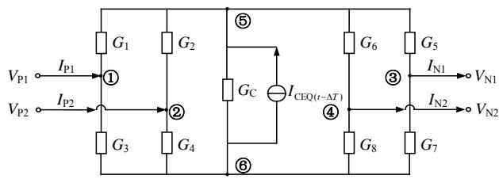  
图4P-FBSM伴随电路  
Fig. 4 Companion circuit of the P-FBSM

由图4可知，单个P-FBSM共有6个节点，其中1~4节点为外部节点、5~6节点为内部节点。假设1~6节点的节点电压分别为 $V_{\mathrm{PA}}$ 、 $V_{\mathrm{PB}}$ 、 $V_{\mathrm{NA}}$ 、 $V_{\mathrm{NB}}$ 、 $V_{\mathrm{CA}}$ 、 $V_{\mathrm{CB}}$ ，1~4节点的节点注入电流分别为 $I_{\mathrm{PA}}$ 、 $I_{\mathrm{PB}}$ 、 $-I_{\mathrm{NA}}$ 、 $-I_{\mathrm{NB}}$ ，正方向规定：流入节点为正。以大地为参考节点，对 $t$ 时刻单个P-FBSM伴随电路列节点电压方程如式(1)所示。

$$
\left[ \begin{array}{c c c c c c} G _ {1} + G _ {3} & 0 & 0 & 0 & - G _ {1} & - G _ {3} \\ 0 & G _ {2} + G _ {4} & 0 & 0 & - G _ {2} & - G _ {4} \\ 0 & 0 & G _ {5} + G _ {7} & 0 & - G _ {5} & - G _ {7} \\ 0 & 0 & 0 & G _ {6} + G _ {8} & - G _ {6} & - G _ {8} \\ \hline & & & & G _ {1} + G _ {2} \\ - G _ {1} & - G _ {2} & - G _ {5} & - G _ {6} & + G _ {5} & - G _ {\mathrm {C}} \\ & & & & + G _ {6} + G _ {\mathrm {C}} \\ & & & & & G _ {3} + G _ {4} \\ - G _ {3} & - G _ {4} & - G _ {7} & - G _ {8} & - G _ {\mathrm {C}} & + G _ {7} \\ & & & & & + G _ {8} + G _ {\mathrm {C}} \end{array} \right].
$$

$$
\begin{array}{l} \boldsymbol {V} _ {\mathrm {I F}} \left\{\left[ \begin{array}{c} V _ {\mathrm {P A}} \\ V _ {\mathrm {P B}} \\ V _ {\mathrm {N A}} \\ V _ {\mathrm {N B}} \\ V _ {\mathrm {C A}} \\ V _ {\mathrm {C B}} \end{array} \right] = \left[ \begin{array}{c} 0 \\ 0 \\ 0 \\ 0 \\ \dots \dots \dots \dots \dots \dots \dots \dots \dots \dots \dots \dots \dots \dots \dots \dots \dots \dots \dots \dots \dots \dots \dots \dots \dots \dots \dots \dots \dots \dots \dots \dots \dots \dots \dots \dots \dots \dots \dots \dots \dots \dots \dots \dots \dots \dots \dots \dots \dots \dots \end{array} + I _ {\mathrm {I F}} \left\{\left[ \begin{array}{c} I _ {\mathrm {P A}} \\ I _ {\mathrm {P B}} \\ - I _ {\mathrm {N A}} \\ - I _ {\mathrm {N B}} \\ 0 \\ 0 \end{array} \right] + I _ {\mathrm {I N}} \left\{\left[ \begin{array}{c} I _ {\mathrm {N A}} \\ I _ {\mathrm {N B}} \\ - I _ {\mathrm {N A}} \\ - I _ {\mathrm {N B}} \\ 0 \\ 0 \end{array} \right] + I _ {\mathrm {N B}} \left\{\left[ \begin{array}{c} I _ {\mathrm {N B}} \\ I _ {\mathrm {N A}} \\ - I _ {\mathrm {N B}} \\ - I _ {\mathrm {N B}} \\ 0 \\ 0 \end{array} \right] + I _ {\mathrm {N B}} \left\{\left[ \begin{array}{c} I _ {\mathrm {N B}} \\ I _ {\mathrm {N A}} \\ - I _ {\mathrm {N B}} \\ - I _ {\mathrm {N B}} \\ 0 \\ 0 \end{array} \right] + 1. 5 5 2 7 4 8 3 9 6 4 8 3 9 6 4 8 3 9 6 4 8 3 9 6 4 8 3 9 6 4 8 3 9 6 4 8 3 9 6 4 8 3 9 6 4 8 3 9 6 4 8 3 9 6 4 8 3 9 2 7 7 7 7 7 7 7 7 7 7 7 7 7 7 7 7 7 7 7 7 7 7 7 7 7 7 7 7 7 7 7 7 7 7 7 7 7 7 7 7 7 7 7 7 7 7 7 7 7 7 2. \right. \right. \right. \right.
$$

$$
\text {或} \boldsymbol {Y} \boldsymbol {V} = \boldsymbol {J} + \boldsymbol {I} \tag {1}
$$

式(1)中 $G_{1} - G_{8}$ 的取值由 $t$ 时刻P-FBSM的运行状态决定。 $G_{\mathrm{C}}$ 、 $I_{\mathrm{CEQ}}(t - \Delta T)$ 的取值如式(2)所示，其中 $V_{\mathrm{C}}(t)$ 、 $V_{\mathrm{C}}(t - \Delta T)$ 分别为 $t$ 、 $t - \Delta T$ 时刻子模块电容电压。

$$
\left\{ \begin{array}{l} V _ {\mathrm {C}} (t) = V _ {\mathrm {C}} (t - \Delta T) + I _ {\mathrm {C}} (t) \cdot R _ {\mathrm {C}} \\ G _ {\mathrm {C}} = \frac {1}{R _ {\mathrm {C}}} = \frac {C}{\Delta T} \\ I _ {\mathrm {C E Q}} (t - \Delta T) = G _ {\mathrm {C}} \cdot V _ {\mathrm {C}} (t - \Delta T) \end{array} \right. \tag {2}
$$

将式(1)中节点电压列向量 $\mathbf{V} = [V_{\mathrm{PA}}, V_{\mathrm{PB}}, \dots, V_{\mathrm{CB}}]^{\mathrm{T}}$ 、历史电流源向量 $J = [0, 0, 0, 0, I_{\mathrm{CEQ}}(t - \Delta \mathrm{T}), -I_{\mathrm{CEQ}}(t - \Delta \mathrm{T})]^{\mathrm{T}}$ 和外部系统注入节点的电流列向量 $I = [I_{\mathrm{PA}}, I_{\mathrm{PB}}, I_{\mathrm{NA}}, I_{\mathrm{NB}}, 0, 0]^{\mathrm{T}}$ ，分别按内外节点进行分块，改写为式(3)的形式。其中 $V_{\mathrm{IF}}$ 为4个外部节点(1~4节点)的节点电压向量， $V_{\mathrm{IN}}$ 为子模块内部节点(5~6节点)的节点电压向量。

$$
\left[ \begin{array}{l l} \mathbf {Y} _ {1 1} & \mathbf {Y} _ {1 2} \\ \overline {{\mathbf {Y}}} _ {2 1} & \overline {{\mathbf {Y}}} _ {2 2} \end{array} \right] \left[ \begin{array}{l} \mathbf {V} _ {\mathrm {I F}} \\ \overline {{\mathbf {V}}} _ {\mathrm {I N}} \end{array} \right] = \left[ \begin{array}{l} 0 \\ \mathbf {J} _ {\mathrm {I N}} \end{array} \right] + \left[ \begin{array}{l} \mathbf {I} _ {\mathrm {I F}} \\ 0 \end{array} \right] \tag {3}
$$

将式(3)展开并消去内部节点 $V_{\mathrm{IN}}$ ，得到4个外部节点 $(1\sim 4$ 节点)的等效节点电压方程如式(4)所示：

$$
\boldsymbol {Y} _ {\mathrm {I F}} \boldsymbol {V} _ {\mathrm {I F}} = \boldsymbol {J} _ {\mathrm {I F}} ^ {\mathrm {T s f}} + \boldsymbol {I} _ {\mathrm {I F}} \tag {4}
$$

式(4)即为单个P-FBSM消去内部节点后，等效为只有4个外部节点的等效电路(以大地为参考节点)对应的等效节点电压方程。其中， $Y_{\mathrm{IF}} = Y_{11} - Y_{12}Y_{22}^{-1}Y_{21},J_{\mathrm{IF}}^{\mathrm{Tsf}} = -Y_{12}Y_{22}^{-1}J_{\mathrm{IN}}$ 。t时刻单个P-FBSM的运行状态已知，因此 $Y_{\mathrm{IF}}$ 已知； $t - \Delta T$ 时刻的电容电压 $V_{\mathrm{C}}(t - \Delta T)$ 也已知，由式(1)、(2)可计算出 $J_{\mathrm{IN}}$ 进而求得 $J_{\mathrm{IF}}^{\mathrm{Tsf}}$ ，从而完成单个P-FBSM等效模型的搭建。

内部节点 $V_{\mathrm{IN}}$ 的表达式如式(5)所示：

$$
\boldsymbol {V} _ {\mathrm {I N}} = \boldsymbol {Y} _ {2 2} ^ {- 1} \left[ \boldsymbol {J} _ {\mathrm {I N}} - \boldsymbol {Y} _ {2 1} \boldsymbol {V} _ {\mathrm {I F}} \right] \tag {5}
$$

# 3.2 任意两个相邻P-FBSM等效模型

3.2.1 单个P-FBSM等效节点电压方程按左右分块改写

将式(1)中的 $V_{\mathrm{IF}}$ 、 $I_{\mathrm{IF}}$ 代入式(4)中可得

$$
\begin{array}{r} \boldsymbol {V} _ {\mathrm {L}} \left\{\left[ \begin{array}{l} \boldsymbol {V} _ {\mathrm {P A}} \\ \boldsymbol {V} _ {\mathrm {P B}} \\ \vdots \\ \boldsymbol {V} _ {\mathrm {N A}} \\ \boldsymbol {V} _ {\mathrm {N B}} \end{array} \right] = \boldsymbol {J} _ {\mathrm {L}} \left\{\left[ \begin{array}{l} \boldsymbol {J} _ {\mathrm {I F}, \mathrm {P A}} ^ {\mathrm {T s f}} \\ \boldsymbol {J} _ {\mathrm {I F}, \mathrm {P B}} ^ {\mathrm {T s f}} \\ \boldsymbol {J} _ {\mathrm {I F}, \mathrm {N B}} ^ {\mathrm {T s f}} \end{array} \right] + \boldsymbol {I} _ {\mathrm {L}} \left\{\left[ \begin{array}{l} \boldsymbol {I} _ {\mathrm {P A}} \\ \boldsymbol {I} _ {\mathrm {P B}} \\ - \boldsymbol {I} _ {\mathrm {N A}} \\ - \boldsymbol {I} _ {\mathrm {N B}} \end{array} \right] \right. \right. \right. \\ \boldsymbol {V} _ {\mathrm {R}} \left\{\left[ \begin{array}{l} \boldsymbol {V} _ {\mathrm {P A}} \\ \boldsymbol {V} _ {\mathrm {P B}} \\ \vdots \\ \boldsymbol {V} _ {\mathrm {N A}} \\ \boldsymbol {V} _ {\mathrm {N B}} \end{array} \right] = \boldsymbol {J} _ {\mathrm {R}} \left\{\left[ \begin{array}{l} \boldsymbol {J} _ {\mathrm {I F}, \mathrm {P A}} ^ {\mathrm {T s f}} \\ \boldsymbol {J} _ {\mathrm {I F}, \mathrm {P B}} ^ {\mathrm {T s f}} \\ \boldsymbol {J} _ {\mathrm {I F}, \mathrm {N B}} ^ {\mathrm {T s f}} \end{} \right] - \boldsymbol {I} _ {\mathrm {R}} \left\{\left[ \begin{array}{l} \boldsymbol {I} _ {\mathrm {P A}} \\ \boldsymbol {I} _ {\mathrm {P B}} \\ - \boldsymbol {I} _ {\mathrm {N A}} \\ - \boldsymbol {I} _ {\mathrm {N B}} \end{array} \right] \right. \right. \end{array} \tag {6}
$$

为便于之后对任意两个相邻P-FBSM进行连接节点的消去，将单个P-FBSM等效节点电压方程即式(6)，按左(PA、PB即1、2节点)、右(NA、NB即3、4节点)节点进行分块得到式(7)，其中 $4\times 4$ 矩阵 $\pmb{Y}_{\mathrm{IF}}$ 分成4个 $2\times 2$ 的子矩阵， $V_{\mathrm{IF}},I_{\mathrm{IF}},J_{\mathrm{IF}}^{\mathrm{Tsf}}$ 各自分为两个 $2\times 1$ 的子矩阵。

$$
\left[ \begin{array}{l l} \mathbf {Y} _ {\mathrm {L L}} & \mathbf {Y} _ {\mathrm {L R}} \\ \mathbf {Y} _ {\mathrm {R L}} & \mathbf {Y} _ {\mathrm {R R}} \end{array} \right] \left[ \begin{array}{l} \mathbf {V} _ {\mathrm {L}} \\ \mathbf {V} _ {\mathrm {R}} \end{array} \right] = \left[ \begin{array}{l} \mathbf {I} _ {\mathrm {L}} \\ - \mathbf {I} _ {\mathrm {R}} \end{array} \right] + \left[ \begin{array}{l} \mathbf {J} _ {\mathrm {L}} \\ \mathbf {J} _ {\mathrm {R}} \end{array} \right] \tag {7}
$$

之后将左、右节点各自的节点电压、电流放在一起，然后再严格按左(L)、右(R)进行分块，将式(7)改写为式(8)的形式：

$$
\left[ \begin{array}{c c c} \mathbf {Y} _ {\mathrm {L L}} & - \left[ \begin{array}{l l} 1 & 0 \\ 0 & 1 \end{array} \right] & \mathbf {Y} _ {\mathrm {L R}} \\ \dots & \dots & \dots \\ \mathbf {Y} _ {\mathrm {R L}} & \left[ \begin{array}{l l} 0 & 0 \\ 0 & 0 \end{array} \right] & \mathbf {Y} _ {\mathrm {R R}} \\ \dots & \dots & \dots \\ \mathbf {Y} _ {\mathrm {R}} & \dots & \dots \\ \dots & \dots & \dots \\ \mathbf {Y} _ {\mathrm {R L}} & \dots & \dots \\ \dots & \dots & \dots \\ \mathbf {Y} _ {\mathrm {R R}} & \dots & \dots \\ \dots & \dots & \dots \\ \mathbf {Y} _ {\mathrm {R R}} & \dots & \dots \\ \dots & \dots & \dots \\ \mathbf {Y} _ {\mathrm {R R}} & \dots & \dots \\ \dots & \dots & \dots \\ \mathbf {Y} _ {\mathrm {R R}} & \dots & \dots \\ \dots & \cdot & \cdot \\ \mathbf {Y} _ {\mathrm {R R}} & \cdot & \cdot \\ \dots & \cdot & \cdot \\ \mathbf {Y} _ {\mathrm {R R}} & \cdot & \cdot \\ \dots & \cdot & \cdot \\ \mathbf {Y} _ {\mathrm {R R}} & \cdot & \cdot \\ \dots & \cdot & \cdot \\ \mathbf {Y} _ {\mathrm {R R}} & \cdot & \cdot \\ \dots & \cdot & \cdot \\ \mathbb {I} _ {\mathrm {R}} ^ {- 1} = [ J _ {\mathrm {L}} ] ^ {- 1} = [ J _ {\mathrm {R}} ] ^ {- 1} (8) \\ \end{array} \right.
$$

对式(8)中的各子矩阵重新命名，得到式(9):

$$
\left[ \begin{array}{l l} \boldsymbol {A} _ {\mathrm {L L}} & \boldsymbol {A} _ {\mathrm {L R}} \\ \boldsymbol {A} _ {\mathrm {R L}} & \boldsymbol {A} _ {\mathrm {R R}} \end{array} \right] \left[ \begin{array}{l} \boldsymbol {X} _ {\mathrm {L}} \\ \boldsymbol {X} _ {\mathrm {R}} \end{array} \right] = \left[ \begin{array}{l} \boldsymbol {J} _ {\mathrm {L}} \\ \boldsymbol {J} _ {\mathrm {R}} \end{array} \right] \tag {9}
$$

式(9)即为按左右分块改写后的单个P-FBSM等效节点电压方程。式(9)与式(6)等效，只是形式不同。

# 3.2.2 任意两个相邻P-FBSM连接节点的消去

单个桥臂内第 $i, i + 1$ 个P-FBSM按左右分块后

的等效节点电压方程分别如式(10)、(11)所示：

$$
\left[ \begin{array}{c c} \boldsymbol {A} _ {\mathrm {L L}} ^ {i} & \boldsymbol {A} _ {\mathrm {L R}} ^ {i} \\ - \boldsymbol {A} _ {\mathrm {R L}} ^ {i} & \boldsymbol {A} _ {\mathrm {R R}} ^ {i} \end{array} \right] \left[ \begin{array}{c} \boldsymbol {X} _ {\mathrm {L}} ^ {i} \\ \boldsymbol {X} _ {\mathrm {R}} ^ {i} \end{array} \right] = \left[ \begin{array}{c} \boldsymbol {J} _ {\mathrm {L}} ^ {i} \\ \boldsymbol {J} _ {\mathrm {R}} ^ {i} \end{array} \right] \tag {10}
$$

$$
\left[ \begin{array}{c c} \boldsymbol {A} _ {\mathrm {L L}} ^ {i + 1} & \boldsymbol {A} _ {\mathrm {L R}} ^ {i + 1} \\ - \boldsymbol {A} _ {\mathrm {R L}} ^ {i + 1} & - \boldsymbol {A} _ {\mathrm {R R}} ^ {i + 1} \end{array} \right] \left[ \begin{array}{c} \boldsymbol {X} _ {\mathrm {L}} ^ {i + 1} \\ \boldsymbol {X} _ {\mathrm {R}} ^ {i + 1} \end{array} \right] = \left[ \begin{array}{c} \boldsymbol {J} _ {\mathrm {L}} ^ {i + 1} \\ \boldsymbol {J} _ {\mathrm {R}} ^ {i + 1} \end{array} \right] \tag {11}
$$

式中上标 $i$ 、 $i + 1$ 分别表示P-FBSM的序号。如图2所示，第 $i$ 个P-FBSM的右节点 $\left(\mathrm{N}_{\mathrm{A}}^{i},\mathrm{N}_{\mathrm{B}}^{i}\right)$ 与第 $i + 1$ 个P-FBSM的左节点 $\left(\mathrm{P}^{i + 1}_{\mathrm{A}},\mathrm{P}^{i + 1}_{\mathrm{B}}\right)$ 直接相连，根据图4规定的P-FBSM外部节点的节点电压、电流的方向可知，第 $i$ 个P-FBSM的右节点与第 $i + 1$ 个P-FBSM对应的左节点的节点电压、电流相等，如式(12)所示：

$$
\boldsymbol {X} _ {\mathrm {R L}} \triangleq \boldsymbol {X} _ {\mathrm {R}} ^ {i} = \boldsymbol {X} _ {\mathrm {L}} ^ {i + 1} \tag {12}
$$

将式(12)代入式(10)、(11)中联立展开并改写为矩阵方程形式，如式(13)所示：

$$
\left[ \begin{array}{c c c} \boldsymbol {A} _ {\mathrm {L L}} ^ {i} & 0 & \boldsymbol {A} _ {\mathrm {L R}} ^ {i} \\ 0 & \boldsymbol {A} _ {\mathrm {R R}} ^ {i + 1} & \boldsymbol {A} _ {\mathrm {R L}} ^ {i + 1} \\ - \boldsymbol {A} _ {\mathrm {R L}} ^ {i} & 0 & \boldsymbol {A} _ {\mathrm {R R}} ^ {i} \\ 0 & \boldsymbol {A} _ {\mathrm {L R}} ^ {i + 1} & \boldsymbol {A} _ {\mathrm {L L}} ^ {i + 1} \end{array} \right] \left[ \begin{array}{c} \boldsymbol {X} _ {\mathrm {L}} ^ {i} \\ \boldsymbol {X} _ {\mathrm {R}} ^ {i + 1} \\ - \boldsymbol {X} _ {\mathrm {R L}} ^ {-} \end{array} \right] = \left[ \begin{array}{c} \boldsymbol {J} _ {\mathrm {L}} ^ {i} \\ \boldsymbol {J} _ {\mathrm {R}} ^ {i + 1} \\ \boldsymbol {J} _ {\mathrm {L}} ^ {i + 1} \end{array} \right] \tag {13}
$$

将式(13)按第3、4行展开，求得 $X_{\mathrm{RL}}$ 的计算表达式如式(14)所示：

$$
\boldsymbol {X} _ {\mathrm {R L}} = \left[ \begin{array}{l} \boldsymbol {A} _ {\mathrm {R R}} ^ {i} \\ \boldsymbol {A} _ {\mathrm {L L}} ^ {i + 1} \end{array} \right] ^ {- 1} \left[ \begin{array}{l} \boldsymbol {J} _ {\mathrm {R}} ^ {i} \\ \boldsymbol {J} _ {\mathrm {L}} ^ {i + 1} \end{array} \right] - \left[ \begin{array}{l} \boldsymbol {A} _ {\mathrm {R R}} ^ {i} \\ \boldsymbol {A} _ {\mathrm {L L}} ^ {i + 1} \end{array} \right] ^ {- 1} \left[ \begin{array}{c c} \boldsymbol {A} _ {\mathrm {R L}} ^ {i} & 0 \\ 0 & \boldsymbol {A} _ {\mathrm {L R}} ^ {i + 1} \end{array} \right] \left[ \begin{array}{l} \boldsymbol {X} _ {\mathrm {L}} ^ {i} \\ \boldsymbol {X} _ {\mathrm {R}} ^ {i + 1} \end{array} \right] \tag {14}
$$

将式(13)按第1、2行展开并将式(14)代入，消去两个P-FBSM的连接节点对应的变量 $X_{\mathrm{RL}}$ ，得到

$$
\left\{\left[ \begin{array}{c c} \boldsymbol {A} _ {\mathrm {L L}} ^ {i} & 0 \\ 0 & \boldsymbol {A} _ {\mathrm {R R}} ^ {i + 1} \end{array} \right] - \left[ \begin{array}{l} \boldsymbol {A} _ {\mathrm {L R}} ^ {i} \\ \boldsymbol {A} _ {\mathrm {R L}} ^ {i + 1} \end{array} \right] \left[ \begin{array}{c} \boldsymbol {A} _ {\mathrm {R R}} ^ {i} \\ \boldsymbol {A} _ {\mathrm {L L}} ^ {i + 1} \end{array} \right] ^ {-} \left[ \begin{array}{c c} \boldsymbol {A} _ {\mathrm {R L}} ^ {i} & 0 \\ 0 & \boldsymbol {A} _ {\mathrm {L R}} ^ {i + 1} \end{array} \right] \right\}. \tag {15}
$$

$$
\left[ \begin{array}{l} \boldsymbol {X} _ {\mathrm {L}} ^ {i} \\ \boldsymbol {X} _ {\mathrm {R}} ^ {i + 1} \end{array} \right] = \left[ \begin{array}{l} \boldsymbol {J} _ {\mathrm {L}} ^ {i} \\ \boldsymbol {J} _ {\mathrm {R}} ^ {i + 1} \end{array} \right] - \left[ \begin{array}{l} \boldsymbol {A} _ {\mathrm {L R}} ^ {i} \\ \boldsymbol {A} _ {\mathrm {R L}} ^ {i + 1} \end{array} \right] \left[ \begin{array}{l} \boldsymbol {A} _ {\mathrm {R R}} ^ {i} \\ \boldsymbol {A} _ {\mathrm {L L}} ^ {i + 1} \end{array} \right] ^ {- 1} \left[ \begin{array}{l} \boldsymbol {J} _ {\mathrm {R}} ^ {i} \\ \boldsymbol {J} _ {\mathrm {L}} ^ {i + 1} \end{array} \right]
$$

对式(15)中各矩阵重新命名，改写为式(16)。式(16)中的上标“ $i-(i+1)$ ”表示将第 $i$ 、 $i+1$ 两个P-FBSM消去连接节点等效成一个模块。

$$
\left[ \begin{array}{c c} \boldsymbol {A} _ {\mathrm {L L}} ^ {i - (i + 1)} & \boldsymbol {A} _ {\mathrm {L R}} ^ {i - (i + 1)} \\ \boldsymbol {A} _ {\mathrm {R L}} ^ {i - (i + 1)} & \boldsymbol {A} _ {\mathrm {R R}} ^ {i - (i + 1)} \end{array} \right] \left[ \begin{array}{c} \boldsymbol {X} _ {\mathrm {L}} ^ {i} \\ \boldsymbol {X} _ {\mathrm {R}} ^ {i + 1} \end{array} \right] = \left[ \begin{array}{c} \boldsymbol {J} _ {\mathrm {L}} ^ {i - (i + 1)} \\ \boldsymbol {J} _ {\mathrm {R}} ^ {i - (i + 1)} \end{array} \right] \tag {16}
$$

式(16)即为第 $i$ 、 $i + 1$ 两个P-FBSM消去二者的连接节点等效成一个仅含4个节点的等效电路(以大地为参考节点)对应的按左右分块改写的等效节点电压方程。

本文用 $i - j$ 表示将单个桥臂(假设共有 $N$ 个

P-FBSM)内第 $i, i+1, \ldots, j$ 个 P-FBSM $(1 = <i, \ldots <= j <= N)$ 彼此之间的全部连接节点消去后得到的一个 4 节点等效电路。对比式(16)和式(10)、(11)可知， $i - (i + 1)$ 按左右分块改写的等效节点电压方程与第 $i, i + 1$ 两个 P-FBSM 按左右分块改写的等效节点电压方程在形式和各矩阵阶数上完全相同。因此，若要将 $i - (i + 1)$ 与其相邻的单个桥臂内第 $i + 2$ 个 P-FBSM 之间的连接节点消去，本小节提出的任意两个相邻 P-FBSM 之间连接节点的消去方法及对应的式完全适用。

# 3.3 PFB-MMC单个桥臂等效模型

将 PFB-MMC 单个桥臂内全部的 P-FBSM 都进行 3.1 节的等效，在此基础上对单个桥臂内全部的 P-FBSM 的等效节点电压方程按左右分块改写，之后将单个桥臂内第 1、2 个 P-FBSM 之间的连接节点消去得到 1-2，之后采用同样的方法循环迭代消去单个桥臂内全部 P-FBSM 之间的连接节点，最后得到单个桥臂的 4 节点等效电路 $1 - N$ 。

单个桥臂的4节点等效电路 $1 - N$ 按左右分块改写的等效节点电压方程如式(17)所示，形式与式(16)相同。

$$
\left[ \begin{array}{c c} \boldsymbol {A} _ {\mathrm {L L}} ^ {1 - N} & \boldsymbol {A} _ {\mathrm {L R}} ^ {1 - N} \\ \overline {{\boldsymbol {A}}} _ {\mathrm {R L}} ^ {1 - N} & \overline {{\boldsymbol {A}}} _ {\mathrm {R R}} ^ {1 - N} \end{array} \right] \left[ \begin{array}{c} \boldsymbol {X} _ {\mathrm {L}} ^ {1} \\ \boldsymbol {X} _ {\mathrm {R}} ^ {N} \end{array} \right] = \left[ \begin{array}{c} \boldsymbol {J} _ {\mathrm {L}} ^ {1 - N} \\ \boldsymbol {J} _ {\mathrm {R}} ^ {1 - N} \end{array} \right] \tag {17}
$$

该式并非严格意义上的等效节点电压方程，无法直接由式(17)确定单个桥臂的4节点等效电路 $1 - N$ 。因此需要将式(17)重新改写回严格意义上的等效节点电压方程。对式(17)中的 $\mathbf{A}$ 矩阵进行分块，如式(18)所示：

$$
\left[ \begin{array}{c c} A _ {\mathrm {L L}} ^ {1 - N} & A _ {\mathrm {L R}} ^ {1 - N} \\ A _ {\mathrm {R L}} ^ {1 - N} & A _ {\mathrm {R R}} ^ {1 - N} \end{array} \right] = \left[ \begin{array}{c c c c c} a _ {\mathrm {L L}} ^ {1 - N} & \alpha_ {\mathrm {L L}} ^ {1 - N} & a _ {\mathrm {L R}} ^ {1 - N} & \alpha_ {\mathrm {L R}} ^ {1 - N} \\ a _ {\mathrm {R L}} ^ {1 - N} & \alpha_ {\mathrm {R L}} ^ {1 - N} & a _ {\mathrm {R R}} ^ {1 - N} & \alpha_ {\mathrm {R R}} ^ {1 - N} \end{array} \right] \tag {18}
$$

将式(8)、(18)代入式(17)中，得到：

$$
\begin{array}{l} \left[ \begin{array}{l l} - \boldsymbol {\alpha} _ {\mathrm {L L}} ^ {1 - N} & \boldsymbol {\alpha} _ {\mathrm {L R}} ^ {1 - N} \\ - \boldsymbol {\alpha} _ {\mathrm {R L}} ^ {1 - N} & \boldsymbol {\alpha} _ {\mathrm {R R}} ^ {1 - N} \end{array} \right] ^ {- 1} \left[ \begin{array}{l l} \boldsymbol {\alpha} _ {\mathrm {L L}} ^ {1 - N} & \boldsymbol {\alpha} _ {\mathrm {L R}} ^ {1 - N} \\ \boldsymbol {\alpha} _ {\mathrm {R L}} ^ {1 - N} & \boldsymbol {\alpha} _ {\mathrm {R R}} ^ {1 - N} \end{array} \right] \left[ \begin{array}{l} \boldsymbol {V} _ {\mathrm {L}} ^ {1} \\ \boldsymbol {V} _ {\mathrm {R}} ^ {N} \end{array} \right] = \\ \left[ \begin{array}{l l} - \boldsymbol {\alpha} _ {\mathrm {L L}} ^ {1 - N} & \boldsymbol {\alpha} _ {\mathrm {L R}} ^ {1 - N} \\ - \boldsymbol {\alpha} _ {\mathrm {R L}} ^ {1 - N} & \boldsymbol {\alpha} _ {\mathrm {R R}} ^ {1 - N} \end{array} \right] ^ {- 1} \left[ \begin{array}{l} \boldsymbol {J} _ {\mathrm {L}} ^ {1 - N} \\ \boldsymbol {J} _ {\mathrm {R}} ^ {1 - N} \end{array} \right] + \left[ \begin{array}{l} \boldsymbol {I} _ {\mathrm {L}} ^ {1} \\ - \boldsymbol {I} _ {\mathrm {R}} ^ {N} \end{array} \right] \tag {19} \\ \end{array}
$$

对式(19)中的各矩阵重新命名，可得：

$$
\boldsymbol {Y} _ {\mathrm {I F}} ^ {1 - N} \boldsymbol {V} _ {\mathrm {I F}} ^ {1 - N} = \boldsymbol {J} _ {\mathrm {I F}} ^ {1 - N} + \boldsymbol {I} _ {\mathrm {I F}} ^ {1 - N} \tag {20}
$$

式(20)即为 PFB-MMC 单个桥臂的 4 节点等效电路对应的等效节点电压方程。由式(20)中的 $4 \times 4$ 等效节点导纳矩阵 $Y_{\mathrm{IF}}^{1-N}$ 、 $4 \times 1$ 等效节点注入电流源向量 $I_{\mathrm{IF}}^{1-N}$ ，根据节点自导纳、互导纳及节点注入电流源的定义，可分别计算出单个桥臂的 4 节点等效

电路(以大地为参考节点)中4个节点之间及4个节点和参考节点之间的互导纳、各节点注入电流源的值(具体计算方法详见本文附录A)，从而最终确定PFB-MMC单个桥臂的4节点等效电路，如图5所示。单个桥臂第1、2、...、 $N$ 个P-FBSM彼此之间的连接节点及各子模块的内部节点虽然被等效消去，但是连接节点的节点电压、电流及各子模块的内部节点电压信息并未丢失，可分别根据式(5)、(14)进行求解。

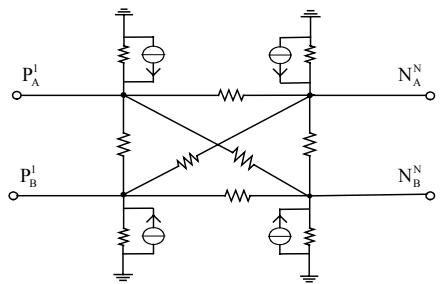  
图5 PFB-MMC单个桥臂的等效电路  
Fig. 5 Equivalent circuit of PFB-MMC single bridge arm

使用本节提出的单个桥臂4节点等效电路将PFB-MMC详细模型的6个桥臂全部替换，即可得到PFB-MMC的电磁暂态等效模型。

# 4 PFB-MMC等效模型的功能完善

本文通过采用PSCAD/EMTDC库文件中提供的IGBT及二极管模型结合电气开关在PFB-MMC电磁暂态等效模型的基础上，搭建了闭锁及启动时的PFB-MMC等效电路，很好地解决了PFB-MMC电磁暂态等效模型在闭锁、解锁及启动过程中仿真的准确性问题[20]。

PFB-MMC 启动时分为两个阶段：第 1 阶段 PFB-MMC 6 个桥臂全部 P-FBSM 闭锁，此时 IGBT 全部关断，桥臂电流通过反并联二极管向电容充电；第 2 阶段 PFB-MMC 6 个桥臂全部 P-FBSM 各自的 IGBT $\mathrm{T}_{7} 、 \mathrm{T}_{8}$ 导通(参考图 1)，其他所有 IGBT 依然关断，当桥臂电流为正时，桥臂电流通过反并联二极管向电容充电，当桥臂电流为负时，桥臂电流通过反并联二极管和 $\mathrm{T}_{7} 、 \mathrm{T}_{8}$ ，电容被旁路。

结合上文闭锁、启动时桥臂电流的流通规律，本文将单个桥臂内全部 $N$ 个P-FBSM相同位置处的的电容、二极管 $\mathrm{D}_1\mathrm{-D}_8$ 以及IGBT $\mathrm{T}_{7}$ 、 $\mathrm{T}_{8}$ 单独抽取出来分别进行集中等效。 $N$ 个P-FBSM的电容集中等效为电阻 $R_{\mathrm{CSUM}}$ 与电压源 $V_{\mathrm{CEQSUM}}$ 串联，如图6所示； $N$ 个P-FBSM的二极管 $\mathrm{D}_1\mathrm{-D}_8$ 、IGBT $\mathrm{T}_{7}$ 、 $\mathrm{T}_{8}$ 分别集中等效为 $\mathrm{D}_{1\mathrm{S}} - \mathrm{D}_{8\mathrm{S}}$ 和 $\mathrm{T}_{7\mathrm{S}}$ 、 $\mathrm{T}_{8\mathrm{S}}$ ，如图7所示， $\mathrm{D}_{1\mathrm{S}} - \mathrm{D}_{8\mathrm{S}}$ 和 $\mathrm{T}_{7\mathrm{S}}$ 、 $\mathrm{T}_{8\mathrm{S}}$ 的取值如下：导通时，导

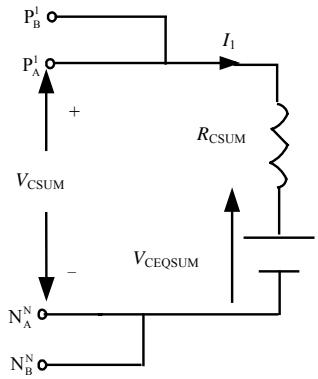  
图6 单个桥臂全部P-FBSM的电容集中等效电路

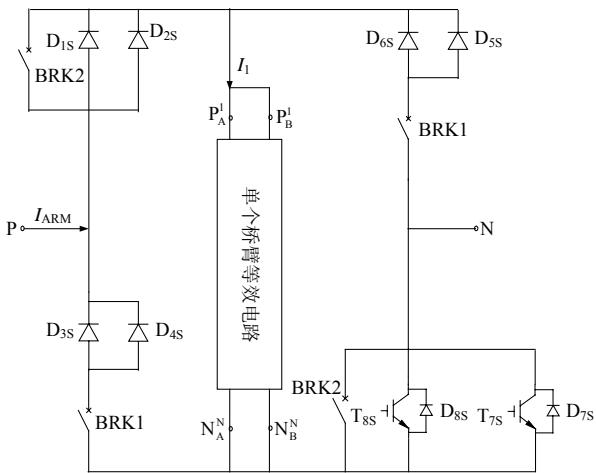  
Fig. 6 Concentrated equivalent circuit of single bridge arm all P-FBSM capacitor   
图7 PFB-MMC单个桥臂电磁暂态等效电路  
Fig. 7 Electromagnetic transient equivalent circuit of PFB-MMC single bridge arm

通电阻 $= N \times R_{\mathrm{ON}}$ ；关断时，关断电阻 $= N \times R_{\mathrm{OFF}}$ 。 $R_{\mathrm{ON}}$ 、 $R_{\mathrm{OFF}}$ 分别为单个二极管、IGBT 的导通及关断电阻。

闭锁及启动时 PFB-MMC 单个桥臂全部 $N$ 个 P-FBSM 的电容运行状态始终相同，相互间可视为串联连接。在集中等效前采用后退欧拉法将各子模块电容分别离散化成一个等效电阻 $R_{\mathrm{C}}$ 与历史电压源 $V_{\mathrm{CEQ}}$ 串联，之后对全部 $N$ 个 P-FBSM 电容各自的 $R_{\mathrm{C}}$ 、 $V_{\mathrm{CEQ}}$ 分别求和即可得到 $R_{\mathrm{CSUM}}$ 与 $V_{\mathrm{CEQSUM}}$ ，表达式如式(21)所示，从而完成了电容的集中等效。

$$
\left\{ \begin{array}{l} R _ {\mathrm {C S U M}} = \sum_ {i = 1} ^ {N} R _ {\mathrm {C}} ^ {i} = N \times R _ {\mathrm {C}} = \frac {N \times \Delta T}{C} \\ V _ {\mathrm {C E Q S U M}} = \sum_ {i = 1} ^ {N} V _ {\mathrm {C E Q}} ^ {i} (t - \Delta T) = \sum_ {i = 1} ^ {N} V _ {\mathrm {C}} ^ {i} (t - \Delta T) \end{array} \right. \tag {21}
$$

图7为完善后的PFB-MMC单个桥臂电磁暂态等效电路，能够精确仿真闭锁、启动等运行状态。

1）当 PFB-MMC 运行在非启动、非闭锁状态时，开关 BRK1 断开、BRK2 闭合，图 7 中单个桥臂等效电路的拓扑结构如图 5 所示。  
2）当 PFB-MMC 运行在闭锁或启动第 1 阶段

时, 开关 BRK1 闭合、BRK2 断开, IGBT $\mathrm{T}_{7 \mathrm{~S}}$ 、 $\mathrm{T}_{8 \mathrm{~S}}$ 关断, 图 7 中单个桥臂等效电路的拓扑结构如图 6 所示。

3）当 PFB-MMC 运行在启动第 2 阶段时，开关 BRK1 闭合、BRK2 断开，IGBT $\mathrm{T}_{7\mathrm{S}}$ 、 $\mathrm{T}_{8\mathrm{S}}$ 导通，图 7 中单个桥臂等效电路的拓扑结构如图 6 所示。

在 PSCAD/EMTDC 中，图 7 中的单个桥臂等效电路的计算求解是通过 Fortran 语言编程实现，单个桥臂等效电路的搭建则是使用 Fortran 语言中的 call 支路语句实现，因此在编程中通过设置 If、else 语句，可以实现图 7 中单个桥臂等效电路在 PFB-MMC 不同运行状态下拓扑结构的切换。

PFB-MMC 电磁暂态等效模型若要仿真桥臂内部故障，可以参考文献[16]中提到的方法：使用 PSCAD/EMTDC 库文件中提供的开关器件搭建的实际 P-FBSM，直接在该实际的 P-FBSM 上设置相应的内部故障即可。

# 5 仿真验证

# 5.1 PFB-MMC仿真模型

在PSCAD/EMTDC中分别搭建了11电平双端PFB-MMC详细模型和等效模型，模型的架构如图8所示。逆变站MMC1采用定有功、定无功控制，整流站MMC2采用定直流电压、定无功控制，系统详细参数如表1所示。

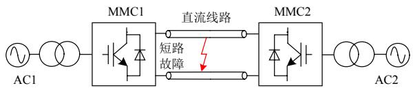  
图8 双端PFB-MMC测试系统  
Fig. 8 Point to point PFB-MMC test system.

表 1 11 电平 PFB-MMC 系统参数  
Tab. 1 Parameters of 11-level PFB-MMC system   

<table><tr><td>类别</td><td>参数</td><td>数值</td></tr><tr><td rowspan="7">系统</td><td>交流电压有效值/kV</td><td>230</td></tr><tr><td>变压器变比</td><td>230/210</td></tr><tr><td>变压器额定容量/MVA</td><td>350</td></tr><tr><td>变压器漏抗/15%</td><td>15</td></tr><tr><td>额定有功功率/MW</td><td>300</td></tr><tr><td>额定直流电压/kV</td><td>400</td></tr><tr><td>线路长度/km</td><td>50</td></tr><tr><td rowspan="5">换流器</td><td>桥臂电抗/H</td><td>0.06</td></tr><tr><td>平波电抗/H</td><td>0.15</td></tr><tr><td>桥臂子模块数</td><td>10</td></tr><tr><td>子模块额定电压/kV</td><td>40</td></tr><tr><td>子模块电容/μF</td><td>600</td></tr></table>

考虑到 PFB-MMC 详细模型在较高电平数时仿真速度极其缓慢，为节省仿真时间本文采用图 8 双端 PFB-MMC 系统中的 MMC1 搭建了 25、49、73、145、289、577 电平的单端 PFB-MMC 详细模型和等效模型，这些模型的系统参数除子模块数、子模块电容值和子模块额定电压之外都与表 1 完全相同，且这些模型各自对应的子模块数与子模块电容值的比值都与表 1 中 11 电平 PFB-MMC 的子模块数与子模块电容值的比值相等。仿真总时长 1s，仿真步长 $20\mu \mathrm{s}$ 。

11 电平双端 PFB-MMC 测试系统启动方案如下：  
1）在 $t = 0\sim 0.5s$ ：双端PFB-MMC闭锁充电，进入启动第1阶段。  
2）在 $t = 0.5\sim 1s$ ：令双端PFB-MMC全部的P-FBSM的 $\mathrm{T}_7$ 和 $\mathrm{T}_{8}$ (如图1所示)导通，其他IGBT全部关断，进入启动第2阶段。  
3）在 $t = 1\mathrm{s}$ ：双端PFB-MMC解锁。  
4）在 $t = 1 \sim 1.5 \mathrm{~s}$ ：整流、逆变侧均为定直流电压控制，直流电压斜率上升至 $400 \mathrm{kV}$ ，无功定值为 0。  
5）在 $t = 1.5\mathrm{s}$ ：接通直流侧，同时逆变侧转换为定有功控制。  
6）在 $t = 1.5 \sim 2 \mathrm{~s}$ ：逆变侧有功斜率上升至-300MW，启动过程基本结束。

# 5.2 PFB-MMC等效模型精度对比

本节将对双端11电平PFB-MMC详细模型和等效模型在启动、稳态、功率阶跃、直流故障处理以及直流故障恢复5种运行状态下的仿真精度进行对比。本节所有的仿真波形图纵坐标均为标幺值。

# 5.2.1 启动阶段

图9(a)、(b)分别为PFB-MMC启动时，直流电压 $U_{\mathrm{dc}}$ 和整流侧A相上桥臂单个P-FBSM的电容电压 $U_{\mathrm{C}}$ 的波形图。

由图9(a)可知，在PFB-MMC整个启动过程中，详细模型与等效模型的直流电压 $U_{\mathrm{dc}}$ 波形始终吻合的很好。即使在启动第1、2阶段的切换时刻出现

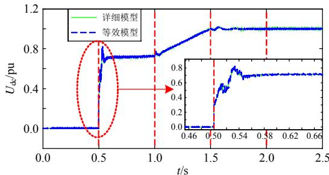  
(a) 直流电压

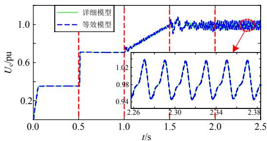  
(b）电容电压   
图9 启动  
Fig. 9 Start time

了阶跃和尖峰，但两种模型的直流电压 $U_{\mathrm{dc}}$ 波形依然高度吻合。由图9(b)可知，在PFB-MMC整个启动过程中，详细模型和等效模型同一个P-FBSM的电容电压 $U_{\mathrm{C}}$ 波形依然高度吻合。

# 5.2.2 稳态运行

在 $t = 3.0 \mathrm{~s}$ 时，双端 PFB-MMC 进入稳态运行状态。图 10(a)-(d) 分别为进入稳态后 PFB-MMC 整流侧 A 相上桥臂电压 $U_{\mathrm{pa}}$ 、整流侧 A 相上桥臂单个 P-FBSM 电容电压 $U_{\mathrm{C}}$ 、逆变侧 A 相交流电流 $I_{\mathrm{sa}}$ 、整流侧 A 相上桥臂单个 P-FBSM 电容电流 $I_{\mathrm{C}}$ 。

由图10可知，在PFB-MMC稳态运行期间详细模型与等效模型的桥臂电压 $U_{\mathrm{pa}}$ 、电容电压 $U_{\mathrm{C}}$ 、交流电流 $I_{\mathrm{sa}}$ 和电容电流 $I_{\mathrm{C}}$ 的波形均重合的很好，仿真精度很高。

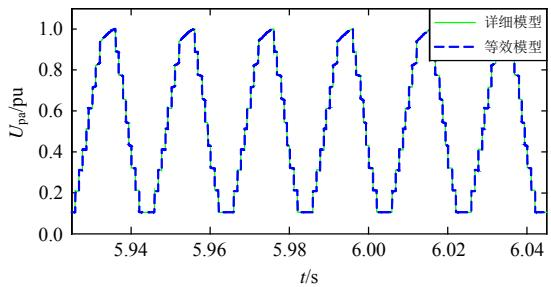

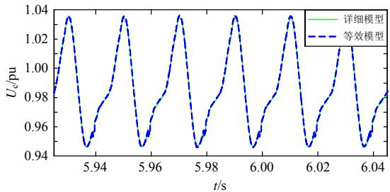  
(a) 桥臂电压

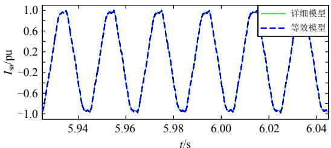  
(b) 电容电压  
(c) 交流电流

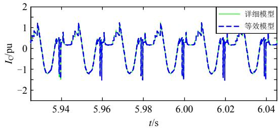  
(d) 电容电流   
图10 稳态  
Fig. 10 Steady state

# 5.2.3 功率阶跃

在 $t = 7 \mathrm{~s}$ 时，定有功侧发生功率阶跃(有功功率由300MW阶跃至260MW)，之后有功一直维持260MW。图11(a)—(c)分别为功率阶跃阶段PFB-MMC有功功率 $P_{\mathrm{m}}$ 、逆变侧A相上桥臂电流 $I_{\mathrm{aup}}$ 、整流侧A相交流电压 $E_{\mathrm{sa}}$ 的仿真波形图。

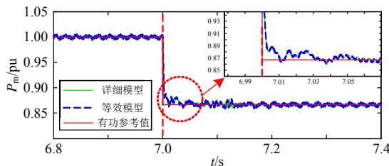  
(a) 有功功率

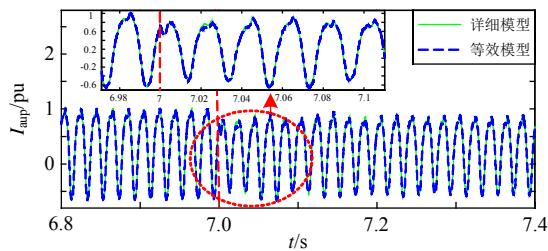  
(b) 桥臂电流

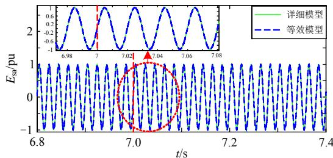  
(c) 交流电压  
图11 功率阶跃  
Fig. 11 Power step

由图11可知，在双端PFB-MMC发生功率阶跃的整个过程中，详细模型与等效模型的有功功率 $P_{\mathrm{m}}$ 、桥臂电流 $I_{\mathrm{aup}}$ 、交流电压 $E_{\mathrm{sa}}$ 的仿真波形均高度吻合，具有很高的仿真精度。

# 5.2.4直流故障处理

在 $t = 11.3\mathrm{s}$ 时，定直流电压侧发生瞬时直流双极短路故障， $3\mathrm{ms}$ 后闭锁，之后保持闭锁状态直至 $t = 11.56\mathrm{s}$ 解锁。图12(a)—(d)分别为直流故障处理期

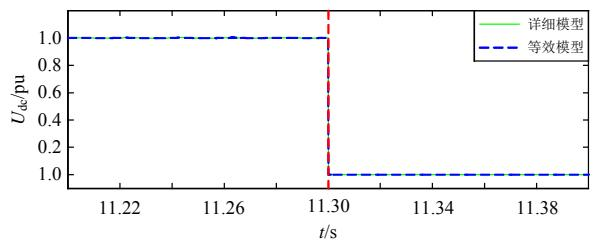

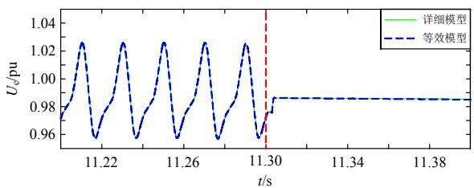  
(a)直流电压   
(b) 电容电压

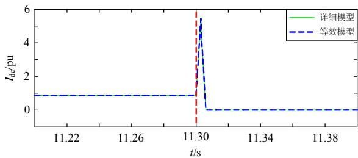  
(c) 直流电流

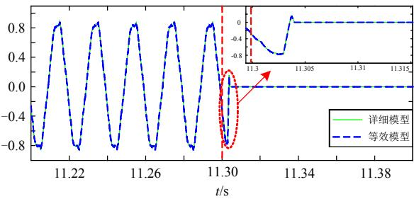  
(d) 交流电流   
图12 直流故障处理  
Fig. 12 DC fault processing

间 PFB-MMC 整流侧直流电压 $U_{\mathrm{dc}}$ 、逆变侧 A 相上桥臂单个 P-FBSM 电容电压 $U_{\mathrm{C}}$ 、整流侧直流电流 $I_{\mathrm{dc}}$ 、整流侧 A 相交流电流 $I_{\mathrm{sa}}$ 。

由图12可知，在PFB-MMC直流故障处理期间，详细模型与等效模型的直流电压 $U_{\mathrm{dc}}$ 、电容电压 $U_{\mathrm{C}}$ 、直流电流 $I_{\mathrm{dc}}$ 、交流电流 $I_{\mathrm{sa}}$ 的波形均重合的很好，具有很高的仿真精度。

# 5.2.5 直流故障恢复

在 $t = 11.5\mathrm{s}$ 时，定直流电压侧的直流双极短路故障被切除，在 $t = 11.56\mathrm{s}$ 时换流器解锁，之后一直保持解锁状态直至 $t = 14\mathrm{s}$ 仿真结束。图13(a)-(c)分别为直流故障恢复期间PFB-MMC整流侧直流电压 $U_{\mathrm{dc}}$ 、逆变侧A相上桥臂单个P-FBSM电容电压 $U_{\mathrm{C}}$ 、整流侧A相交流电流 $I_{\mathrm{sa}}$ 。

由图13可知，在PFB-MMC直流故障恢复期间，详细模型与等效模型的直流电压 $U_{\mathrm{dc}}$ 、电容电

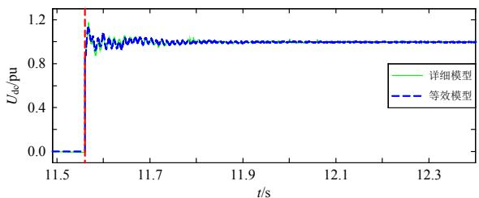  
(a)直流电压

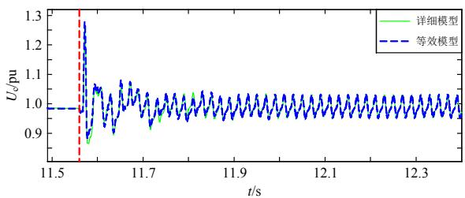

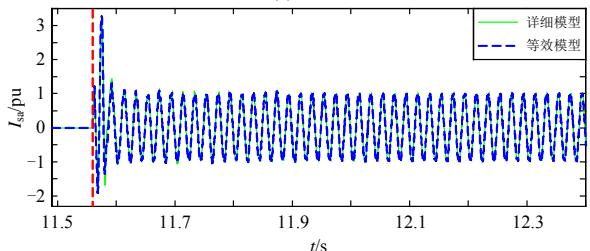  
(b) 电容电压  
(c) 交流电流  
图13 直流故障恢复  
Fig. 13 DC fault restoration

压 $U_{\mathrm{C}}$ 、交流电流 $I_{\mathrm{sa}}$ 的波形均重合的很好，具有很高的仿真精度。

综上，本文提出的 PFB-MMC 等效模型相比于对应的详细模型在启动、稳态、暂态等运行工况下均能取得很高的仿真精度，从而有效地验证了本文提出的 PFB-MMC 等效模型的精确性。

# 5.3 CPU时间对比

本节分别对搭建的25、49、73、145、289、577电平单端PFB-MMC详细模型和等效模型的CPU用时进行了仿真对比，并计算了对应的仿真加速比，如表2所示。

由表2可知，在73电平时，对应的加速比已经达到了2个数量级，随着电平数进一步升高，在577电平时，加速比为1245.6，达到了3个数量级，

表 2 详细模型与等效模型仿真时间对比  
Tab. 2 Simulation time comparison between detailed model and equivalent model   

<table><tr><td>子模块数/个</td><td>详细模型/s</td><td>等效模型/s</td><td>加速比</td></tr><tr><td>24</td><td>74.1</td><td>5.2</td><td>14.2</td></tr><tr><td>48</td><td>456.9</td><td>8.9</td><td>51.3</td></tr><tr><td>72</td><td>1125.1</td><td>10.6</td><td>106.1</td></tr><tr><td>144</td><td>5122.5</td><td>23.5</td><td>217.9</td></tr><tr><td>288</td><td>26722.8</td><td>45.2</td><td>591.2</td></tr><tr><td>576</td><td>110235.6</td><td>88.5</td><td>1245.6</td></tr></table>

这充分说明了本文提出的 PFB-MMC 等效模型相比于对应的详细模型能够有效的降低电磁暂态仿真用时，极大地提高仿真研究的效率，且电平数越高，仿真加速比越大。

# 6 结论

1）提出了一种适用于任意新型双端口子模块MMC的电磁暂态通用等效建模方法，该方法采用循环迭代的方式消去MMC桥臂中全部双端口子模块的内部节点和模块间的互联节点，将整个桥臂等效成仅含4个外部节点的等效电路，在实现对外部等效的同时，能够完整保留单个桥臂的各种内部信息，从而极大地提高了其电磁暂态仿真速度。  
2）以 PFB-MMC 为例，使用该通用等效建模方法搭建 PFB-MMC 的电磁暂态等效模型，进行仿真对比。仿真结果表明使用本文提出的通用等效建模方法搭建的 PFB-MMC 电磁暂态等效模型与其详细模型相比，在启动、闭锁、稳态及暂态时，具有很高的仿真精度，仿真加速比达到了 2~3 个数量级，充分验证了本文所提通用建模方法的正确性。

# 参考文献

[1] 汤广福，庞辉，贺之渊．先进交直流输电技术在中国的发展与应用[J]. 中国电机工程学报，2016，36(7)：1760-1771.  
Tang Guangfu, Pang Hui, He Zhiyuan. R&D and application of advanced power transmission technology in China[J]. Proceedings of the CSEE, 2016, 36(7): 1760-1771(in Chinese).   
[2] 徐政，薛英林，张哲任．大容量架空线柔性直流输电关键技术及前景展望[J].中国电机工程学报，2014，34(29)：5051-5062.  
Xu Zheng, Xue Yinglin, Zhang Zheren. VSC-HVDC technology suitable for bulk power overhead line transmission[J]. Proceedings of the CSEE, 2014, 34(29): 5051-5062(in Chinese).   
[3] Franquelo L G, Rodriguez J, Leon J I, et al. The age of multilevel converters arrives[J]. IEEE Industrial Electronics Magazine, 2008, 2(2): 28-39.   
[4] 赵成勇，陈晓芳，曹春刚，等．模块化多电平换流器HVDC直流侧故障控制保护策略[J].电力系统自动化，2011，35(23)：82-87.  
Zhao Chengyong, Chen Xiaofang, Cao Chungang, et al. Control and protection strategies for MMC-HVDC under DC faults[J]. Automation of Electric Power Systems, 2011, 35(23): 82-87(in Chinese).

[5] 彭茂兰，赵成勇，刘兴华，等. 采用质因子分解法的模块化多电平换流器电容电压平衡优化算法[J]. 中国电机工程学报，2014，34(33)：5846-5853.  
Peng Maolan, Zhao Chengyong, Liu Xinghua, et al. An optimized capacitor voltage balancing control algorithm for modular multilevel converter employing prime factorization method[J]. Proceedings of the CSEE, 2014, 34(33): 5846-5853(in Chinese).   
[6] 何智鹏，许建中，苑宾，等．采用质因子分解法与希尔排序算法的MMC电容均压策略[J].中国电机工程学报，2015，35(12)：2980-2988.  
He Zhipeng, Xu Jianzhong, Yuan Bin, et al. A capacitor voltage balancing strategy adopting prime factorization method and shell sorting algorithm for modular multilevel converter[J]. Proceedings of the CSEE, 2015, 35(12): 2980-2988(in Chinese).   
[7] Liu Pu, Wang Yue, Cong Wulong, et al. Grouping-sorting-optimized model predictive control for modular multilevel converter with reduced computational load [J]. IEEE Transactions on Power Electronics, 2016, 31(3): 1896-1907.   
[8] 徐义良，赵禹辰，赵成勇，等．适用于梯形法MMC等效模型的线性排序均压算法[J]．中国电机工程学报，2017，37(16)：4747-4757.  
Xu Yiliang, Zhao Yuchen, Zhao Chengyong, et al. A linear ranking algorithm for trapezoidal rule based MMC Equivalent models[J]. Proceedings of the CSEE, 2017, 37(16): 4747-4757(in Chinese).   
[9] 曲平，李耀华，高范强，等．参考波为梯形波的模块化多电平变流器模块电容电压均压策略[J]. 高电压技术，2017，43(1)：89-96.  
Qu Ping, Li Yaohua, Gao Fanqiang, et al. Sub-module capacitor voltage balancing control strategy of modular multilevel converter using trapezoidal reference voltages [J]. High Voltage Engineering, 2017, 43(1): 89-96(in Chinese).   
[10] Goetz SM, Peterchev AV, Weyh T. Modular multilevel converter with series and parallel module connectivity: topology and control[J]. IEEE Transactions on Power Electronics, 2015, 30(1): 203-215.   
[11] Goetz SM, Li Zhongxi, Liang Xinyu, et al. Control of modular multilevel converter with parallel connectivity application to battery systems[J]. IEEE Transactions on Power Electronics, 2017, 32(11): 8381-8392.   
[12] Gao Congzhe, Liu Xiangdong, Liu Jingyun, et al. Multilevel converter with capacitor voltage actively balanced using reduced number of voltage sensors for high power applications[J]. IET Power Electronics, 2016,

9(7): 1462-1473.   
[13] Gnanarathna U N, Gole A M, Jayasinghe R P. Efficient modeling of modular multilevel HVDC converters(MMC) on electromagnetic transient simulation programs[J]. IEEE Transactions on Power Delivery, 2011, 26(1): 316-324.   
[14] 许建中，赵成勇，Gole AM. 模块化多电平换流器戴维南等效整体建模方法[J]. 中国电机工程学报，2015，35(8): 1919-1929.  
Xu Jianzhong, Zhao Chengyong, Gole A M. Research on the Thévenin's equivalent based integral modelling method of the Modular Multilevel Converter(MMC) [J]. Proceedings of the CSEE, 2015, 35(8): 1919-1929(in Chinese).   
[15] 许建中，李承昱，熊岩，等．模块化多电平换流器高效建模方法研究综述[J]. 中国电机工程学报，2015，35(13)：3381-3392.  
Xu Jianzhong, Li Chengyu, Xiong Yan, et al. A review of efficient modeling methods for modular multilevel converters[J]. Proceedings of the CSEE, 2015, 35(13): 3381-3392(in Chinese).   
[16] Xu Jianzhong, Ding Hui, Fan Shengtao, et al. Enhanced high-speed electromagnetic transient simulation of MMC-MTdc grid[J]. International Journal of Electrical Power & Energy Systems, 2016, 83: 7-14.   
[17] Xu Jianzhong, Zhao Chengyong, Liu Wenjing, et al. Accelerated model of modular multilevel converters in PSCAD/EMTDC[J]. IEEE Transactions on Power Delivery, 2013, 28(1): 129-136.   
[18] Xu Jianzhong, Gole A M, Zhao Chengyong. The use of averaged-value model of modular multilevel converter in DC grid[J]. IEEE Transactions on Power Delivery, 2015, 30(2): 519-528.   
[19] Saad H, Dennetiere S, Mahseredjian J, et al. Modular multilevel converter models for electromagnetic transients [J]. IEEE Transactions on Power Delivery, 2014, 29(3): 1481-1489.   
[20] 周月宾，饶宏，许树楷，等．一种二极管钳位型MMC的高效等值建模方法[J]. 中国电机工程学报，2016，36(7): 1925-1932.  
Zhou Yuebin, Rao Hong, Xu Shukai, et al. An equivalent efficient modeling approach for diode clamp sub-module based MMC[J]. Proceedings of the CSEE, 2016, 36(7): 1925-1932(in Chinese).   
[21] 石璐，赵成勇，许建中，等．并联全桥子模块 MMC的自均压运行特性研究[J]. 中国电机工程学报，2018,38(08): 2419-2428+2551.  
Shi Lu, Zhao Chengyong, Xu Jianzhong, et al. Research on voltage self-balancing operating characteristics of

paralleled full-bridge sub-modules based MMC[J]. Proceedings of the CSEE, 2018, 38(08): 2419-2428+2551(in Chinese).   
[22] Xu Jianzhong, Xu Yiliang, Zhao Yuchen, et al. Linear time complexity sorting algorithms for electromagnetic transient simulation of MMC-HVdc system[J]. IET Generation, Transmission & Distribution, 2017, 11(16): 4059-4067.

# 附录A

本文通过一系列的矩阵运算等效消去单个桥臂内全部P-FBSM之间的连接节点，最终得到PFB-MMC单个桥臂的4节点等效电路对应的等效节点电压方程：

$$
\boldsymbol {Y} _ {\mathrm {I F}} ^ {1 - N} \cdot \boldsymbol {V} _ {\mathrm {I F}} ^ {1 - N} = \boldsymbol {J} _ {\mathrm {I F}} ^ {1 - N} + \boldsymbol {I} _ {\mathrm {I F}} ^ {1 - N} \tag {A1}
$$

由式(A1)中的 $4 \times 4$ 等效节点导纳矩阵 $\mathbf{Y}_{\mathrm{IF}}^{1 - N}$ 、 $4 \times 1$ 等效节点注入电流源向量 $J_{\mathrm{IF}}^{1 - N}$ ，根据节点自导纳、互导纳及节点注入电流源的定义，可以分别计算出单个桥臂的4节点等效电路(以大地为参考节点)中4个节点之间以及4个节点和参考节点之间的互导纳、各节点注入电流源的值，从而最终确定图A1 PFB-MMC单个桥臂的4节点等效电路，具体计算过程如下所示。

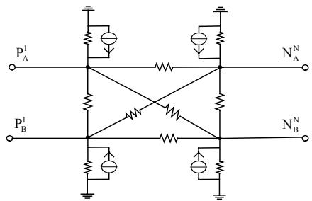  
图A1 PFB-MMC单个桥臂的等效电路  
Fig. A1 Equivalent circuit of   
PFB-MMC single bridge arm

$4\times 4$ 等效节点导纳矩阵 $\mathbf{Y}_{\mathrm{IF}}^{1 - N}$ 、 $4\times 1$ 等效节点注入电流源向量 $J_{\mathrm{IF}}^{1 - N}$ 表达式如下：

$$
\begin{array}{l} \mathbf {Y} _ {\mathrm {I F}} ^ {1 - N} = \left[ \begin{array}{l l l l} \mathbf {Y} _ {\mathrm {I F}} ^ {1 - N} (1, 1) & \mathbf {Y} _ {\mathrm {I F}} ^ {1 - N} (1, 2) & \mathbf {Y} _ {\mathrm {I F}} ^ {1 - N} (1, 3) & \mathbf {Y} _ {\mathrm {I F}} ^ {1 - N} (1, 4) \\ \mathbf {Y} _ {\mathrm {I F}} ^ {1 - N} (2, 1) & \mathbf {Y} _ {\mathrm {I F}} ^ {1 - N} (2, 2) & \mathbf {Y} _ {\mathrm {I F}} ^ {1 - N} (2, 3) & \mathbf {Y} _ {\mathrm {I F}} ^ {1 - N} (2, 4) \\ \mathbf {Y} _ {\mathrm {I F}} ^ {1 - N} (3, 1) & \mathbf {Y} _ {\mathrm {I F}} ^ {1 - N} (3, 2) & \mathbf {Y} _ {\mathrm {I F}} ^ {1 - N} (3, 3) & \mathbf {Y} _ {\mathrm {I F}} ^ {1 - N} (3, 4) \\ \mathbf {Y} _ {\mathrm {I F}} ^ {1 - N} (4, 1) & \mathbf {Y} _ {\mathrm {I F}} ^ {1 - N} (4, 2) & \mathbf {Y} _ {\mathrm {I F}} ^ {1 - N} (4, 3) & \mathbf {Y} _ {\mathrm {I F}} ^ {1 - N} (4, 4) \end{array} \right] \\ \boldsymbol {J} _ {\mathrm {I F}} ^ {1 - N} = \left[ \begin{array}{l} \boldsymbol {J} _ {\mathrm {I F}} ^ {1 - N} (1, 1) \\ \boldsymbol {J} _ {\mathrm {I F}} ^ {1 - N} (2, 1) \\ \boldsymbol {J} _ {\mathrm {I F}} ^ {1 - N} (3, 1) \\ \boldsymbol {J} _ {\mathrm {I F}} ^ {1 - N} (4, 1) \end{array} \right] \\ \end{array}
$$

其中： $Y_{\mathrm{IF}}^{1 - N}(1,1)$ 、 $\mathbf{Y}_{\mathrm{IF}}^{1 - N}(2,2)$ 、 $\mathbf{Y}_{\mathrm{IF}}^{1 - N}(3,3)$ 、 $\mathbf{Y}_{\mathrm{IF}}^{1 - N}(4,4)$ 分别为4个等效节点 $\mathrm{P_A^1}$ 、 $\mathrm{P_B^1}$ 、 $\mathrm{N_A^N}$ 、 $\mathrm{N_B^N}$ 的自导纳； $\mathbf{Y}_{\mathrm{IF}}^{1 - N}(1,2)$ 、 $\mathbf{Y}_{\mathrm{IF}}^{1 - N}(1,3)$ 、 $\mathbf{Y}_{\mathrm{IF}}^{1 - N}(3,4)$ 、 $\mathbf{Y}_{\mathrm{IF}}^{1 - N}(2,4)$ 、 $\mathbf{Y}_{\mathrm{IF}}^{1 - N}(1,4)$ 、 $\mathbf{Y}_{\mathrm{IF}}^{1 - N}(2,3)$ 分别为4个等效节点 $\mathrm{P_A^1}$ 、 $\mathrm{P_B^1}$ 、 $\mathrm{N_A^N}$ 、 $\mathrm{N_B^N}$ 之间的互导纳； $\mathbf{J}_{\mathrm{IF}}^{1 - N}(1,1)$ 、 $\mathbf{J}_{\mathrm{IF}}^{1 - N}(2,1)$ 、 $\mathbf{J}_{\mathrm{IF}}^{1 - N}(3,1)$ 、 $\mathbf{J}_{\mathrm{IF}}^{1 - N}(4,1)$ 分别为4个等效节点 $\mathrm{P_A^1}$ 、 $\mathrm{P_B^1}$ 、 $\mathrm{N_A^N}$ 、 $\mathrm{N_B^N}$ 的节点注入电流源的值。

1）根据互导纳的定义：两个节点之间支路导纳的负值。

可计算出4个等效节点 $\mathbf{P}_{\mathrm{A}}^{\mathrm{I}}$ 、 $\mathbf{P}_{\mathrm{B}}^{\mathrm{I}}$ 、 $\mathbf{N}_{\mathrm{A}}^{\mathrm{N}}$ 、 $\mathbf{N}_{\mathrm{B}}^{\mathrm{N}}$ 之间共6条支路的阻抗值如下：

① $\mathbf{P}_{\mathrm{A}}^{1}$ 、 $\mathbf{P}_{\mathrm{B}}^{1}$ 节点之间支路的阻抗值 $R(1) = -1 / Y_{\mathrm{IF}}^{1 - N}(1,2)$   
② $\mathrm{P_A^I}$ 、 $\mathrm{N}_{\mathrm{A}}^{\mathrm{N}}$ 节点之间支路的阻抗值 $R(2) = -1 / Y_{\mathrm{IF}}^{1 - N}(1,3)$   
③ $\mathrm{N}_{\mathrm{A}}^{\mathrm{N}}$ 、 $\mathrm{N_B^N}$ 节点之间支路的阻抗值 $R(3) = -1 / Y_{\mathrm{IF}}^{1 - N}(3,4)$   
④ $\mathrm{P_B^1}$ 、 $\mathrm{N_B^N}$ 节点之间支路的阻抗值 $R(4) = -1 / Y_{\mathrm{IF}}^{1 - N}(2,4)$   
⑤ $\mathrm{P_A^I}$ 、 $\mathrm{N_B^N}$ 节点之间支路的阻抗值 $R(5) = -1 / Y_{\mathrm{IF}}^{1 - N}(1,4)$   
⑥ $\mathrm{P_B^I}$ 、 $\mathrm{N_A^N}$ 节点之间支路的阻抗值 $R(6) = -1 / Y_{\mathrm{IF}}^{1 - N}(2,3)$

2）根据自导纳的定义：连接于该节点全部支路导纳之和。可计算出4个等效节点 $\mathrm{P_A^I}$ 、 $\mathrm{P_B^I}$ 、 $\mathrm{N_A^N}$ 、 $\mathrm{N_B^N}$ 分别与大地参考节点之间共4条支路的阻抗值如下：

① $\mathbf{P}_{\mathrm{A}}^{1}$ 与大地之间支路的阻抗值 $R_{\mathrm{G}}(1,1) = 1 / [Y_{\mathrm{IF}}^{1 - N}(1,1) + Y_{\mathrm{IF}}^{1 - N}(1,2) + Y_{\mathrm{IF}}^{1 - N}(1,3) + Y_{\mathrm{IF}}^{1 - N}(1,4)]$   
$② \mathrm { P } _ { \mathrm { B } } ^ { 1 } \text{与大地之间支路的阻抗值} R _ { \mathrm { G } } ( 2 , 1 ) = 1 / [ Y _ { \mathrm { I F } } ^ { 1 - N } ( 2 , 2 ) +$ $Y_{\mathrm{IF}}^{1 - N}(1,2) + Y_{\mathrm{IF}}^{1 - N}(2,3) + Y_{\mathrm{IF}}^{1 - N}(2,4)]$   
③ $\mathrm{N}_{\mathrm{A}}^{\mathrm{N}}$ 与大地之间支路的阻抗值 $R_{\mathbf{G}}(3,1) = 1 / [Y_{\mathrm{IF}}^{1 - N}(3,3) + Y_{\mathrm{IF}}^{1 - N}(1,3) + Y_{\mathrm{IF}}^{1 - N}(2,3) + Y_{\mathrm{IF}}^{1 - N}(3,4)]$   
$④ \mathrm { N } _ { \text{B} } ^ { \mathrm { N } }$ 与大地之间支路的阻抗值 $R_{\mathbf{G}}(4,1) = 1 / [Y_{\mathrm{IF}}^{1 - N}(4,4)+$ $\mathbf{Y}_{\mathrm{IF}}^{1 - N}(1,4) + \mathbf{Y}_{\mathrm{IF}}^{1 - N}(2,4) + \mathbf{Y}_{\mathrm{IF}}^{1 - N}(3,4)]$

3）4个等效节点 $\mathrm{P_A^I}$ 、 $\mathrm{P_B^I}$ 、 $\mathrm{N_{A}^{N}}$ 、 $\mathrm{N_B^N}$ 分别与大地参考节点之间共4个节点的注入电流源值如下：

① $\mathrm{P_A^1}$ 的节点注入电流源值 $J_{\mathbf{G}}(1,1) = J_{\mathrm{IF}}^{1 - N}(1,1)$   
② $\mathrm{P_B^1}$ 的节点注入电流源值 $J_{\mathbf{G}}(2,1) = J_{\mathrm{IF}}^{1 - N}(2,1)$

③ $\mathrm{N}_{\mathrm{A}}^{\mathrm{N}}$ 的节点注入电流源值 $J_{\mathbf{G}}(3,1) = J_{\mathrm{IF}}^{1 - N}(3,1)$   
④ $\mathrm{N_B^N}$ 的节点注入电流源值 $J_{\mathbf{G}}(4,1) = J_{\mathrm{IF}}^{1 - N}(4,1)$

  
徐义良

收稿日期：2017-10-11。

作者简介：

徐义良(1993)，男，硕士研究生，主要研究方向为柔性直流输电MMC电磁暂态建模，xuyiliangdq1103@163.com;

赵成勇(1964)，男，教授，博士生导师，主要从事直流输电方面研究，chengyongzhao@ncepu.edu.cn;

赵禹辰(1993)，男，硕士研究生，主要研究方向为柔性直流输电MMC电磁暂态建模，zhaoyuchen_1993@163.com;

石璐(1993)，男，硕士研究生，研究方向为柔性直流输电技术，ncepusl@163.com;

*通信作者：许建中(1987)，男，副教授，主要从事高压直流输电和直流电网技术研究，xujianzhong@ncepu.edu.cn。

(责任编辑 呂鲜艳)