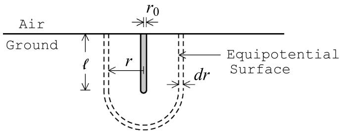
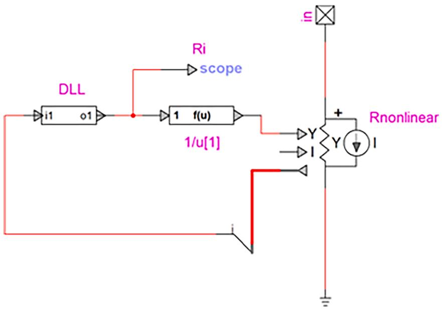
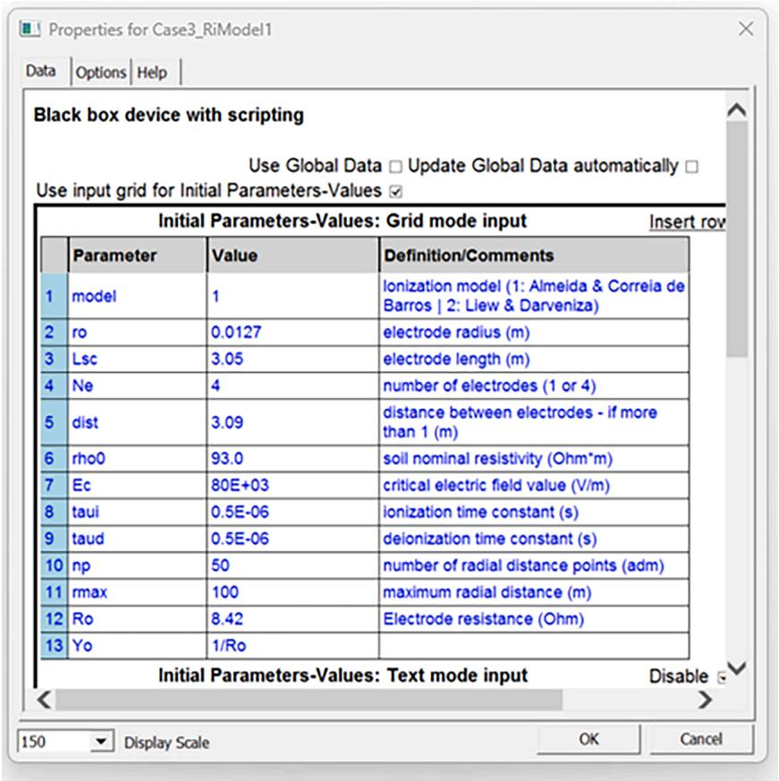
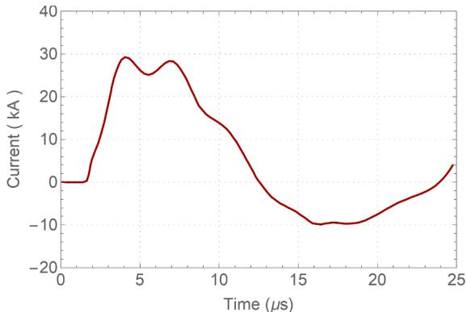
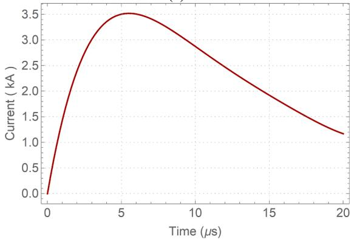
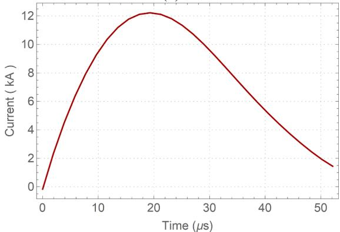
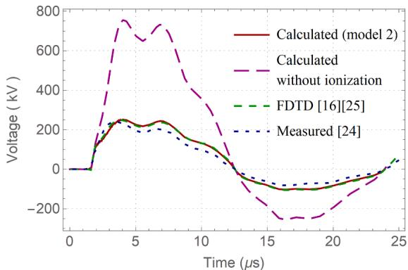
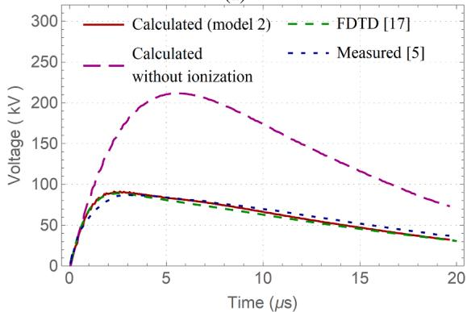
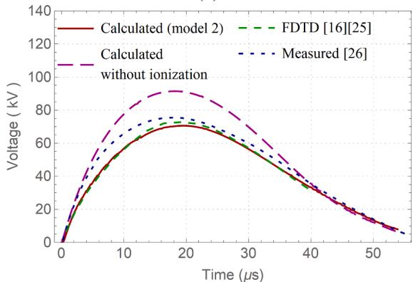

# Integrating dynamic soil ionization models in EMTP for time-domain simulation of grounding resistance

Ruyguara A. Meyberg a,* , Maria Teresa Correia de Barros c , Jean Mahseredjian b

a RTE International, 69007, Lyon, France   
b Polytechnique Montreal, Montreal, QC H3T 1J4, Canada   
c Instituto Superior Tecnico, Universidade de Lisboa, 1049-001 Lisbon, Portugal

# A R T I C L E I N F O

# Keywords:

Electromagnetic transient simulation

Grounding electrode

Simulation

Soil ionization

Surge

# A B S T R A C T

Soil ionization can have a significant impact on the surge characteristics of grounding electrodes and should be considered when assessing the lightning performance of concentrate arrangements of grounding electrodes in power systems. The dynamics of this phenomenon can be properly represented by the variation in soil resistivity, an approach successfully applied in finite-difference time-domain (FDTD) simulations. The FDTD method, however, has a high computational cost, making it unsuitable for large scale cases. This article presents the integration of existing soil ionization models, based on the variable resistivity approach, into the Electromagnetic Transients Program (EMTP®) via a dynamic link library (DLL), for calculating grounding resistance. Three application examples are presented, and the results are compared with measurements and values calculated in the literature using FDTD. Single vertical rods and four parallel rods with bipolar or unipolar injected currents are covered. The results show good accuracy and remarkable agreement with FDTD results, demonstrating their equivalence and great potential in representing the phenomenon accurately in high-performance electromagnetic transients software.

# 1. Introduction

LIGHTNING performance of power systems depends greatly on the surge characteristics of the grounding electrodes, whose representation can become particularly complex when the effects of soil ionization are considered. This phenomenon occurs when large current densities flow from the grounding electrode into the soil, leading to exceeding the disruptive electric field of the soil. Corona-type discharges occur around the electrode and the conductivity of the ionized region increases, reducing the electrode grounding resistance.

Different approaches for representing the impact of soil ionization on grounding resistance can be found in literature. Some authors represent it by increasing the electrode transversal dimensions [1–4]; others by varying the soil resistivity [5,6]; or by empirical expressions [7–9].

Empirical models represent a conservative simplification of the phenomenon [8] but are widely used (see [10–13]) due to their simplicity and easy implementation in electromagnetic transient (EMT)

simulation programs. The variable soil resistivity approach has been employed in finite-difference time-domain (FDTD) [14] simulations, and shows good accuracy for various electrode configurations and surges, see [15–17]. In this approach, proposed in [15], the electric field strength and the resulting resistivity variation are calculated in each FDTD cell depicting the soil, and the electrode resistance is modified due to the local soil resistivity variations. This FDTD method, however, has a high computational burden, as it requires the use of a refined mesh close to the electrode, and a small simulation time-step, which is related to the smallest cell size used. Therefore, despite its accuracy and the importance of representing the phenomenon, the method has not been used in larger-scale FDTD simulations, such as those involving lightning strikes on transmission towers, see [18–21]. In [22], a new method is proposed for representing the effect of soil ionization on grounding resistance in FDTD simulations. The method is also based on the variable soil resistivity approach, but avoids mesh refinement by using a dynamic soil ionization model ([5] or [6]), which assumes equipotential surfaces

  
Fig. 1. Scheme of cylindrical-hemisphere equipotential surface for a single vertical rod.

around the electrode to calculate the electrode resistance and whose variation is represented in FDTD using an equivalent radius. The method [22] allows for simulations hundreds of times faster than those of [15] while still accounting for soil ionization dynamics. However, the application of FDTD to large-scale networks remains unsuitable due to its computational cost.

The calculations of electrode resistance following the same dynamic soil ionization models $[ 5 , 6 ]$ can be integrated into the Electromagnetic Transients Program (EMTP®) via the dynamic link library (DLL) [23], thus taking advantage of both the program’s high performance and accuracy of the variable soil resistivity approach. In this article, two existing dynamic soil ionization models based on the variation of soil resistivity $[ 5 , 6 ]$ are integrated into the EMTP® using a DLL. Three experimental cases from the literature are used as application examples. The results obtained using the developed DLL are compared with the values measured and calculated in the literature using FDTD. The proposed approach could be realized in other EMT-type software. Note that the representation of the soil ionization effect by a variable resistance is widely used in electromagnetic simulation tools (see [10–13]). However, the novelty of this work lies in applying variable soil resistivity-based models, rather than empirical ones, to represent the grounding resistance variation - and in comparing results with those obtained in the literature using the same approach implemented in FDTD simulations.

This article is organized as follows. A background on soil ionization models is presented in Section II. The implementation of two soil ionization models is described in Section III. Three application examples are presented in Section IV and then conclusions are drawn in Section V.

# 2. Background on soil ionization modeling

# 2.1. The variable resistivity approach $^ { 1 5 , 6 ] }$

In this approach, the region around the electrode is considered to be composed of elementary shells of uniform thickness dr, defined by equipotential surfaces. For instance, Fig. 1 illustrates the cylindricalhemispherical equipotential surfaces considered for the case of a single vertical rod.

Each elemental shell j has a resistance dRj given by

$$
d R _ {j} = \frac {\rho_ {j}}{A _ {j}} d r \tag {1}
$$

where $\rho _ { j }$ and $A _ { j }$ are the resistivity and surface area of the shell $j ,$ respectively. The formulations of the area of equipotential surfaces for different configurations of vertical rods can be found in [5].

The resistivity in each shell is initially equal to its nominal value $\rho _ { 0 }$ . At each time instant, the value of the electric field in the shell j is evaluated as follows

$$
E _ {j} (t) = \rho_ {j} \frac {i (t)}{A _ {j}} \tag {2}
$$

where $i ( t )$ is the current injected into the electrode.

From the moment the electric field strength reaches the critical value $E _ { c } ,$ , the process of soil ionization begins and the value of the resistivity in the shell varies. In the widely used model [5], the variation in resistivity during soil ionization is represented by

$$
\rho (t) = \rho_ {0} \exp (- t / \tau_ {\mathrm {i}}) \tag {3}
$$

where $\tau _ { i }$ is the ionization time constant. As can be seen, resistivity in (3) only varies as a function of time. In [6] it is proposed that resistivity also varies with the strength of the local electric field, assuming a critical value $\rho _ { c j }$ given by

$$
\rho_ {\mathrm {c j}} = \frac {\mathrm {E} _ {\mathrm {c}}}{\mathrm {i} (\mathrm {t})} \mathrm {A} _ {\mathrm {j}} \tag {4}
$$

Eq. (4) represents the restoration of the critical field value $E _ { c }$ by the charges resulting from the soil ionization, which in turn has its own dynamics, that is represented by attributing an exponential variation to $\rho _ { c j }$ as follows

$$
\rho (t) = \rho_ {0} + \left(\rho_ {\mathrm {c j}} - \rho_ {0}\right) \left[ 1 - \exp (- t / \tau_ {\mathrm {i}}) \right] \tag {5}
$$

Once the electric field in the ionized region becomes lower than $E _ { c } ,$ the deionization process begins, and the resistivity tends to return to its nominal value. Both [5] and [6] describe the variation in resistivity during deionization by the following expression

$$
\rho (\mathbf {t}) = \rho_ {\mathrm {i j}} + \left(\rho_ {0} - \rho_ {\mathrm {i j}}\right) \left[ 1 - \exp (- t / \tau_ {\mathrm {d}}) \right] \left(1 - E / E _ {c}\right) ^ {2} \tag {6}
$$

where $\tau _ { d }$ is the deionization constant and $\rho _ { c j }$ is the lowest resistivity value reached in the shell j during the ionization process.

The electrode resistance is calculated by integrating dR from its surface to infinity.

Note that both models ([5] and [6]) rely on the value of $E _ { c } ,$ which depends on the dielectric properties and electrical conductivity of the soil, influenced by factors such as moisture, electrical resistivity, and composition. Since these properties vary with actual soil conditions, $E _ { c }$ is typically adjusted through experimental measurements to ensure the accuracy of the model. Furthermore, the values of $\tau _ { i }$ and $\tau _ { d }$ to be used depend on the soil ionization model, as they are based on different assumptions and describe the ionization process differently. Model [6] considers $\tau _ { i }$ and $\tau _ { d }$ to always be $0 . 5 \mu \mathrm { s } ,$ , on the basis that the magnitude of the simulation parameters related to the basic physical phenomena should not vary drastically from one application to another. Model [5], on the other hand, assumes that these parameters can vary and are adjusted according to experimental results.

# 2.2. Representation of soil ionization in FDTD simulations [15,22]

The concept of the FDTD method can be briefly described as the division of the space of interest into small cubic or rectangular cells, with electric field components tangential to their edges and magnetic field components perpendicular to their surfaces. Each field component is assigned the electrical parameters (conductivity, permeability, and permittivity) of the medium the cell represents. At each time step, the electric and then magnetic field components are calculated using Maxwell’s equations approximated by finite difference.

The method for representing soil ionization in FDTD simulations proposed in [15] is based on the variable resistivity approach, using the expressions proposed by [5]. At each simulation time instant, the electric field is evaluated in each cell representing the soil. If the electric field component is higher than the critical value $E _ { c }$ , the resistivity associated with this component varies according to (3), and if the electric field component reduces to a value lower than $E _ { c } ,$ , the variation in resistivity follows (6).

The method proposed in [22] calculates the electrode resistance at each time instant using a dynamic soil ionization model ([5] or [6]) described in Section II.A and represents this new resistance value by

  
Fig. 2. Circuit assembled in EMTP® with the developed DLL to represent the grounding electrode under the effect of soil ionization.

  
Fig. 3. Mask of the block containing the circuit with the dll, shown in Fig. 2.

varying the electrode radius in FDTD using a thin wire formulation. Method [22] therefore evaluates the electric field and the corresponding variation in soil resistivity on each equipotential surface around the electrode, rather than on each cell in the soil, as in [15]. This approximation makes it possible to avoid the cell refinement required in [15] and thus to carry out much faster simulations. Simulation speed gains of up to 539 times are obtained in [22]. The good agreement of the results in [22] with those obtained using method [15] demonstrate the validity

of the assumption of equipotential surfaces and the equivalence of the methods.

# 3. Integration of dynamic soil ionization models in EMTP

An object-oriented DLL written in Fortran was developed to calculate electrode resistance following the variable resistivity approach presented in section II.A. This approach allows the creation of an EMTP®

  
(a)

  
(b)   
(c)   
Fig. 4. Injected current in considered experiments: (a) case I [24], (b) case II [5], and (c) case III [26].

device that performs a desired function, which in this case consists of calculating the electrode resistance from the value of injected current and the characteristics of the electrode and soil using the dynamic soil ionization model of [5] or [6] described in section II.A. Note that the difference between the two models is the expression used for the resistivity variation during ionization. The model in [5] uses (3) and in [6] uses (5).

Fig. 2 shows the EMTP® device created using the DLL. Its input (i1) is the current value flowing through the R nonlinear controlled device, which is fed by the resistance calculated by the DLL device (o1), inverted by a control device. Note that the resistance calculation by integrating dR is done internally in the DLL.

The circuit shown in Fig. 2 is embedded in a block whose mask allows the user to determine the soil ionization model to be used ([5] or [6]) and enter the characteristics of the soil and the electrode, see Fig. 3.

Table I Soil and electrode configurations in each application example.   

<table><tr><td rowspan="2">Case</td><td colspan="4">Parameters</td></tr><tr><td>ρ0(Ωm)</td><td>Rods</td><td>r0(mm)</td><td>/ (m)</td></tr><tr><td>I</td><td>43.5</td><td>1</td><td>25.0</td><td>1.0</td></tr><tr><td>II</td><td>50.0</td><td>1</td><td>6.35</td><td>0.61</td></tr><tr><td>III</td><td>93.0</td><td>4</td><td>12.7</td><td>3.0</td></tr></table>

Table II Soil parameters considered in each application example.   

<table><tr><td rowspan="2">Case</td><td colspan="3">Model 2</td></tr><tr><td>EC(kV/m)</td><td>τi(μs)</td><td>τd(μs)</td></tr><tr><td>I</td><td>120</td><td>0.5</td><td>4.5</td></tr><tr><td>II</td><td>100</td><td>2.0</td><td>4.5</td></tr><tr><td>III</td><td>50</td><td>2.0</td><td>1.0</td></tr></table>

  
  
(b)

  
(c)   
Fig. 5. Waveform of the voltage at the top of the vertical rod, calculated with the developed DLL using model 2. (a) case I [24], (b) case II [5], and (c) case III [26].

# 4. Application examples

Three cases from the literature, for which the effect of soil ionization on grounding resistance has been observed experimentally and calculated using FDTD, are used as application examples. The results measured and calculated using FDTD are compared with those using the developed DLL in EMTP® simulations. Note that since method [22] also uses the simplifying assumptions of equipotential surfaces, only cases in the literature in which method [15] is used, which refines the FDTD cells and calculates the electric field and the variation in soil resistivity in small space steps, will be considered.

Case I represents the experiment presented in [24] and calculated using FDTD in [16,25]. The case consists of a vertical rod of 25 mm radius, buried 1 m deep in a 43 Ωm homogeneous soil. The current injected into the electrode is bipolar with two peaks as shown in Fig. 4 (a).

Case II corresponds to the measurements presented in [5] and calculated using FDTD in [17]. The vertical rod in this case has a radius of 6.35 mm and is buried at a depth of 0.61 m in a homogeneous soil of 50 Ωm. The injected current is single-peak unipolar as depicted in Fig. 4 (b).

Case III depicts the measurement presented in [26] and calculated using FDTD in [16,25]. In this case there are four parallel vertical rods of 12.7 mm radius, separated at a distance of 3.09 m, and buried 3 m deep in homogeneous soil with a resistivity of 93 Ωm. The rods have their upper end on the surface of the ground and are connected by bare conductors. The injected current is shown in Fig. 4(c).

The electrode and soil configurations are summarized in Table I.

The injected currents have a rise time of 2.4, 5.5 and 19.3 µs in cases I, II and III, respectively. The current in case I was represented by piecewise linear approximation and implemented in EMTP® using the Table Function Current Source device. The currents in cases II and III were represented using a polynomial function and implemented in EMTP® using a Controlled Current Source device. For the proper representation of the injected currents, a simulation time-step corresponding to 1/50 times the rise time of each current was used.

In each case, the EMTP® simulation was carried out using Model 2 (from [5]) implemented in the DLL and the parameters shown in Table II. Model 2 was used for comparison purposes with literature results using FDTD, as both are based on the same expressions for the variation in soil resistivity ((3) and (6)). Note that the parameters in Table II are the same as those used in literature with FDTD.

The results of the simulations are shown in Fig. 5(a)–(c), for cases I, II and III, respectively. Results without considering ionization, measured values, and calculated in the literature using FDTD are included in the figures.

Results show the reduction in voltage at the top of the rod due to soil ionization, as expected. There is a remarkable agreement between the results obtained using Model 2 and those in the literature using FDTD, demonstrating their equivalence. It is worth noting that the FDTD method has a much higher computational cost. Simulations using FDTD using a refined mesh, as required to represent soil ionization, can take hours of simulation with standard computing resources [22], while simulations of these cases using EMTP® take <0.3 s with a 2.4 GHz, Core i7–1200H computer with 16 GB of RAM.

# 5. Conclusions

This article presents the integration of existing dynamic soil ionization models in EMTP® using DLLs for calculating grounding resistance. The models are based on the variable soil resistivity approach, by which it is possible to represent the dynamics of soil ionization and deionization. This approach has been used with the FDTD method and has provided consistent results; however, the high computational cost of FDTD makes it unsuitable for simulating lightning-related events in large-scale networks. This is overcome by the DLL implemented in EMTP®, which

combines the good accuracy of the variable resistivity approach with the high performance of the electromagnetic transients program.

Three application examples are presented, where single vertical rods and four parallel rods are subjected to currents of different waveforms (two-peak bipolar and single-peak unipolar). The results obtained with the developed DLL are compared with literature values calculated using FDTD and measured, and show good accuracy. Results using the widely used soil ionization model [5], on which the FDTD method is based, show excellent agreement with the FDTD results, demonstrating their equivalence, even though the FDTD method has a high computational cost, with simulations taking hours, while the same simulation in EMTP® takes fractions of a second. The implemented DLL is, therefore, a powerful tool for using accurate soil ionization models in EMT-type software.

# CRediT authorship contribution statement

Ruyguara A. Meyberg: Validation, Investigation, Writing – original draft, Data curation, Methodology, Conceptualization, Software, Formal analysis. Maria Teresa Correia de Barros: Formal analysis, Supervision, Conceptualization, Writing – review & editing, Methodology. Jean Mahseredjian: Writing – review & editing, Supervision, Funding acquisition, Resources, Formal analysis, Methodology.

# Declaration of competing interest

The authors declare the following financial interests/personal relationships which may be considered as potential competing interests: Jean Mahseredjian reports financial support was provided by Natural Sciences and Engineering Research Council of Canada. Jean Mahseredjian reports financial support was provided by Hydro-Qu´ebec. Jean Mahseredjian reports financial support was provided by Electricite de France S.A. Jean Mahseredjian reports financial support was provided by OPAL-RT Technologies Inc. Jean Mahseredjian reports financial support was provided by RTE. Ruyguara A. Meyberg reports a relationship with Polytechnique Montr´eal that includes: employment. If there are other authors, they declare that they have no known competing financial interests or personal relationships that could have appeared to influence the work reported in this paper.

# Data availability

The authors do not have permission to share data.

# References

[1] C. Mazzetti, G.M. Veca, Impulse behaviour of ground electrodes, IEEE Trans. Power App. Syst. 102 (9) (1983) 3148–3156.   
[2] R. Velazquez, D. Mukhedkar, Analytical modelling of grounding electrodes transient behaviour, IEEE Trans. Power App. Syst. 103 (6) (1984) 1314–1322.   
[3] S.V. Filho, C.M. Portela, Modelling of earthing systems for lightning protection applications including propagation effects, in: Proc. ICLP, 1992, pp. 129–132.   
[4] F.E. Mentre, L. Grcev, EMTP-based model for grounding system analysis, IEEE   
[5] A.C. Liew, M. Darveniza, Dynamic model of impulse characteristics of concentrated earth, in: Proc. IEE 121, 1974, pp. 123–135.   
[6] M.E. Almeida, M.T. Correia de Barros, Modelling the hysteresis behaviour of the transmission tower footing, in: Proc. 9th Int. Symp. High Voltage Eng, 1995, pp. 67991–67994.   
[7] A.V. Korsuntsev, Application of the theory of similitude to the calculation of concentrated earth electrodes, Electrichestvo (5) (1958) 31–35 (in Russian).   
[8] CIGRE WG 33.01, Guide to Procedures for Estimating the Lightning Performance of Transmission Lines, 63, CIGRE TB, 1991.   
[9] IEEE WG on, Lightning Performance of Transmission Lines, Estimating lightning performance of transmission lines II: updates to analytical models, IEEE Trans. Power Deliv. 8 (3) (1993) 1254–1267.   
[10] N. Malcolm, R.K. Aggarwal, An analysis of reducing back flashover faults with surge arresters on 69/138 kV double circuit transmission lines due to direct lightning strikes on the shield wires, in: 12th IET International Conference on Developments in Power System Protection (DPSP 2014), Copenhagen, Denmark, 2014, pp. 1–6, https://doi.org/10.1049/cp.2014.0070.

[11] D. Stanchev, Limitation of lightning overvoltages in electrical substation 220 kV due to back flashover by installing surge arresters, in: 2019 11th Electrical Engineering Faculty Conference (BulEF), Varna, Bulgaria, 2019, pp. 1–4, https:// doi.org/10.1109/BulEF48056.2019.9030735.   
[12] S. Mohajeryami, M. Doostan, Probabilistic approach in evaluation of backflashover in 230kV double circuit transmission line, in: 2016 IEEE/PES Transmission and Distribution Conference and Exposition (T&D), Dallas, TX, USA, 2016, pp. 1–5, https://doi.org/10.1109/TDC.2016.7519993.   
[13] Z.G. Datsios, E. Stracqualursi, D.G. Patsalis, R. Araneo, P.N. Mikropoulos, T. E. Tsovilis, Evaluation of the backflashover performance of a 150 kV overhead transmission line considering frequency- and current-dependent effects of tower grounding systems, IEEe Trans. Ind. Appl. 60 (2) (2024) 2611–2620, https://doi. org/10.1109/TIA.2023.3338132.   
[14] K. Yee, Numerical solution of initial boundary value problems involving maxwell’s equations in isotropic media, IEEe Trans. Antennas. Propag. 14 (3) (1966) 302–307.   
[15] G. Ala, P.L. Buccheri, P. Romano, F. Viola, Finite difference time domain simulation of earth electrodes soil ionization under lightning surge condition, IET Proc. Sci. Meas. Technol. 2 (3) (2008) 134–145.   
[16] K. Otani, Y. Shiraki, Y. Baba, N. Nagaoka, A. Ametani, N. Itamoto, FDTD surge analysis of grounding electrodes considering soil ionization, Elect. Power Syst. Res. 113 (2014) 171–179.   
[17] F. Zhang, H. Tanaka, Y. Baba, N. Nagaoka, FDTD surge simulation of a vertical grounding rod considering soil ionization, in: Proc. Asia-Pac. Int. Symp. Electromagn. Compat, 2016, pp. 260–262, https://doi.org/10.1109/ APEMC.2016.7523027.

[18] T.H. Thang, Y. Baba, N. Nagaoka, A. Ametani, N. Itamoto, V.A. Rakov, FDTD simulation of insulator voltages at a lightning-struck tower considering groundwire corona, IEEE Trans. Power Delivery 28 (3) (2013) 1635–1642.   
[19] T.H. Thang, Y. Baba, N. Nagaoka, A. Ametani, N. Itamoto, V.A. Rakov, FDTD simulation of direct lightning strike to a phase conductor: influence of corona on transient voltages at the tower, Electr. Power Syst. Res. 123 (2015) 128–136.   
[20] T.H. Thang, Y. Baba, N. Itamoto, V.A. Rakov, FDTD simulation of back-flashover at the transmission-line tower struck by lightning considering ground-wire corona, in: 2016 33rd International Conference on Lightning Protection (ICLP), IEEE, 2016.   
[21] T.H. Thang, Y. Baba, N. Itamoto, V.A. Rakov, FDTD simulation of back-flashover at the transmission-line tower struck by lightning considering ground-wire corona and operating voltages, Elect. Power Syst. Res. 159 (2018) 17–23.   
[22] R.A. Meyberg, M.T. Correia de Barros, J. Mahseredjian, New Methodology for Representing Soil Ionization in FDTD Simulations of Grounding Electrodes, in IEEe Trans. Electromagn. Compat 67 (1) (2024) 277–285.   
[23] J. Mahseredjian, S. Denneti`ere, L. Dub´e, B. Khodabakhchian, L. G´erin-Lajoie, On a new approach for the simulation of transients in power systems, Elect. Power Syst. Res. 77 (11) (2007) 1514–1520.   
[24] A. Geri, G.M. Veca, E. Garbagnati, G. Sartorio, Non-linear behaviour of ground electrodes under lightning surge currents: computer modelling and comparison with experimental results, IEEE Trans. Magn. 28 (2) (1992) 1442–1445.   
[25] K. Otani, Y. Shiraki, Y. Baba, N. Nagaoka, A. Ametani, N. Itamoto, FDTD simulation of grounding electrodes considering soil ionization, in: Proc. Int. Conf. Lightning Protection, 2012, pp. 1–6, https://doi.org/10.1109/ICLP.2012.6344295.   
[26] P.L. Bellaschi, R.E. Armington, A.E. Snowden, Impulse and 60-cycle characteristics of driven grounds - II, Trans. AIEE 61 (6) (1942) 349–363.