# 基于 POD-αATS 的油浸变压器瞬态温升降阶自适应变步长计算方法

刘刚 1 ，郝世缘 1 ，胡万君 1 ，刘云鹏 1 ，李琳 2

(1．河北省输变电设备安全防御重点实验室(华北电力大学)，河北省 保定市 071003；

2．新能源电力系统国家重点实验室(华北电力大学)，北京市 昌平区 102206)

# Adaptive Variable Step Size Calculation Method for Transient Temperature Rise and Fall of Oil Immersed Transformer Based on POD-αATS

LIU Gang1 , HAO Shiyuan1 , HU Wanjun1 , LIU Yunpeng 1 , LI Lin2

(1. Hebei Provincial Key Laboratory of Power Transmission Equipment Security Defense (North China Electric Power University),

Baoding 071003, Hebei Province, China; 2. State Key Laboratory of Alternate Electrical Power System with Renewable Energy

Sources (North China Electric Power University), Changping District, Beijing 102206, China)

ABSTRACT: In response to the problem of low efficiency in calculating transient temperature rise of oil immersed power transformers, this paper proposes POD-αATS reduced order adaptive variable step size transient calculation method. First, the article briefly derives the finite element discrete equation for calculating the transient temperature rise of transformer windings. Next, the proper orthogonal decomposition (POD) order reduction algorithm is adopted to improve the problems of excessive number of conditions and equation orders in traditional transient calculations. Meanwhile, for the time step selection problem in transient calculations, this paper proposes a method suitable for nonlinear problems α ATS (adaptive time stepping based on α factor, αATS) variable step size strategy. Then, in order to verify the effectiveness of the method, this paper establishes a two-dimensional eight zone numerical calculation model based on the basic structure of the 110 kV oil-immersed power transformer winding, and compares the calculation results with the temperature rise experimental results based on the 110 kV winding. The numerical calculation and experimental results show that the accuracy of the proposed algorithm is almost the same as that of the full order fixed step algorithm in the flow field and temperature field, the efficiency of flow field calculation is improved by about 45 times, and the efficiency of temperature field calculation is improved by about 38 times, significantly improving the calculation speed. This has also been verified in temperature rise experiments, which fully demonstrates the accuracy,

efficiency, and certain engineering practicality of the algorithm proposed in this paper.

KEY WORDS: αATS variable step size algorithm; proper orthogonal decomposition (POD) order reduction method; transient flow thermal coupling problem; fast calculation method; temperature rise experiment

摘要：针对油浸式电力变压器瞬态温升计算效率过低的问题 ， 该 文 提 出 本 征 正 交 分 解 -αATS(proper orthogonaldecomposition- adaptive time stepping based on α factor，POD-αATS)降阶自适应变步长瞬态计算方法。首先，推导变压器绕组瞬态温升计算的有限元离散方程；其次，采用POD 降阶算法改善传统瞬态计算中存在的条件数过大及方程阶数过高的问题；同时对于瞬态计算中的时间步长选择问题，提出适用于非线性问题的αATS变步长策略；然后，为验证方法的有效性，基于 110kV 油浸式电力变压器绕组的基本结构建立二维八分区数值计算模型，同时将计算结果与基于 110kV 绕组的温升实验结果进行对比。数值计算及实验结果表明，所提算法与全阶定步长算法在流场和温度场中的精度几乎相同，且流场计算效率提升约 45 倍，温度场计算效率提升约 38 倍，计算速度得到显著提高。这一点在温升实验中同样得到验证，说明该文所提算法的准确性、高效性及一定的工程实用性。

关键词：αATS 变步长算法；本征正交分解降阶方法；瞬态流热耦合问题；快速计算方法；温升实验

# 0 引言

随着人工智能、大数据等现代计算机技术的不断发展，大型电力设备的数字化监测和管理已逐渐

成为当下电网建设的趋势。作为电力系统中重要的一次设备，油浸式电力变压器的稳定运行对电网的安全意义重大，温升热点作为变压器设计和运维关注的重要指标之一，其分布和变化规律也是广大设计和运维人员关注的重点。

数值分析法作为获取油浸式电力变压器温升及热点的主要手段之一，其一般采用有限元[1-3]及有限体积法[4-5]。其中，有限元法及其改良方法在处理边界条件时复杂程度较有限体积法低且易于编程实现。刘成远等[6]采用有限元法对变压器绕组内的油流和温度进行计算，将得到的计算结果与实验进行比较，取得较为满意的结果；李建勋等基于有限元法针对磁场、流体场-温度场的多场耦合问题展开仿真计算，结果表明，所得结果与流体力学的理论相符合，证明有限元模型的有效性[7]。同时，最小二乘有限元[8]及迎风有限元[9]等基于传统伽辽金有限元方法的改良方案近年来也逐渐应用于绕组温升的计算当中。刘刚等[10-11]应用混合有限元法分别解决油浸式电力变压器稳态及瞬态温升问题，研究表明，该方法能够在保证计算精度的条件下解决传统伽辽金有限元法存在的数值振荡问题。但是由于非线性材料属性、非周期边界条件等影响，加之实际模型尺寸一般较大，绕组的瞬态温升计算一般较慢，且当涉及快速的时间响应和场的急剧变化时，除非时间步长选择得很小，否则很难确定响应峰值；小的时间步长也意味着需要大量的时间步数，这就使得计算的整体效率偏低；较大规模的实际模型还会使得求解的离散方程组阶数偏高，导致产生难以接受的步进计算成本。

因此，为了提高绕组瞬态温升的计算效率，需要从两方面进行考量：针对单步求解时间过长的问题，目前已有如基于人工神经网络[12]、支持向量机回归[13]等代理模型方法，以及基于动态模态分解[14]、本征正交分解(proper orthogonal decomposition，POD)[15]等降阶计算方法，可以较大幅度地降低瞬态求解过程中的步进时间。其中，由于降阶算法特别是 POD 算法能够结合物理场控制方程实现快速计算，具有较强的物理意义，近年来在油浸式变压器绕组的温升计算中得到了广泛应用[11, 16]。然而，降阶算法仅提高了单步求解效率，若瞬态求解过程需要大量时间步数，则仍然无法有效减少整体计算时间，针对该问题可以通过自适应变步长方法进行改善[17]。 O

在其他工程领域，目前较为常用的为基于传统截断误差的变步长策略[18-19]，该方法在线性问题中的效率及精度较为可观，但对于非线性问题，该方法的计算速度、准确度及步长变化的合理性均需进一步提高[20]。且将传统变步长方法应用于有限元方程中时，由于刚度矩阵阶数较高且病态的特性，有时还会出现计算不稳定的情况。

因此，基于上述问题及目前已有的方案，本文提出了 POD-αATS 降阶自适应变步长瞬态计算方法，如图 1 所示。

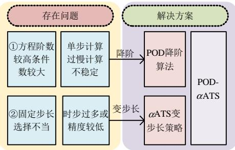  
图 1 POD-αATS 方法示意图  
Fig. 1 POD-αATS method diagram

首先，本文采用有限元方法推导油浸式电力变压器瞬态温升计算的控制方程，分析传统瞬态计算中的效率瓶颈；针对固定时步选择不当导致的时步过多或精度较低的问题，提出适用于非线性问题的αATS(adaptive time stepping based on α factor)变步长策略，并应用于油浸式电力变压器绕组的流-热耦合温升计算中；其次，采用 POD 降阶算法解决传统瞬态计算中存在的条件数过大及方程阶数过高的问题来降低单步计算时间；同时，基于 110kV油浸式电力变压器的基本结构建立二维八分区分匝绕组数值计算模型，在此基础上验证了 POD-αATS算法的有效性及高效性；最后，建立绕组的温升实验平台进行实验验证，说明该算法在工程实际中的应用价值。

# 1 基于 POD-αATS 降阶变步长瞬态温升计算原理

根据文献[8]，油浸式电力变压器绕组温升计算是一个流固耦合传热过程，其控制方程为：

$$
\nabla \cdot \boldsymbol {U} = 0 \tag {1}
$$

$$
\rho \frac {\partial \boldsymbol {U}}{\partial t} + (\rho \boldsymbol {U} \cdot \nabla) \boldsymbol {U} = - \nabla p + \eta \nabla^ {2} \boldsymbol {U} + \boldsymbol {f} \tag {2}
$$

$$
\rho C _ {p} \frac {\partial T}{\partial t} + \nabla \cdot (\rho C _ {p} \boldsymbol {U} T) - \nabla \cdot k \nabla T = S _ {T} \tag {3}
$$

式中：U 为油流的速度矢量，m/s；ρ为流体密度，

$\mathbf { k g } / \mathbf { m } ^ { 3 }$ ；p 为流体内部压强，Pa；η 为流体动力粘度，$\mathbf { N \cdot s } / \mathbf { m } ^ { 2 } ;$ ；T为温度场的温度，K；f为外力密度矢量，不考虑重力项时，可以取 0； $C _ { p }$ 为定压比热容，J/(kg·K)； $S _ { T }$ 为单位体积的产热， $\mathrm { { W / m } } ^ { 3 }$ ；k 为导热系数，W/(m·K)。式(1)、(2)为流场控制方程；式(3)为温度场控制方程；

将式(1)—(3)进行有限元离散，可得如下一般形式[10-11]：

$$
\boldsymbol {K} \boldsymbol {X} ^ {n + 1} = \boldsymbol {L} \boldsymbol {X} ^ {n} + \boldsymbol {B} \tag {4}
$$

式中：K、L 均为有限元刚度矩阵；X 为解向量；B为右端项矩阵；n 为时步数。

该方程在实际模型中一般规模较大，从而使得计算时间过慢，因此本文提出 POD-αATS 降阶自适应变步长瞬态算法，可提高整体计算效率。

# 1.1 αATS 变步长方法原理

传统的变步长算法以每时步的截断误差作为步长变化的依据，用泰勒展开的方式推导出其截断误差 $R _ { n }$ ，然后用 3~4 时间步的结果拟合 $R _ { n }$ 中导数值[17]，假设各时步的允许截断误差为 $R _ { p } ,$ ，则下一时步步长为

$$
t _ {n + 1} = C t _ {n} \sqrt [ 3 ]{R _ {p} / \left| R _ {n} \right|} \tag {5}
$$

式中 $t _ { n + 1 }$ 及 $t _ { n }$ 分别表示第n+1及第n时间步的步长。但该方法仅使用绝对误差作为时步判据，不适合复杂问题的变步长过程；另一方面，在采用此方法计算大规模问题时，有限元刚度阵的条件数一般很大，计算稳定性较差，容易造成计算误差过大甚至计算不收敛的情况，同时在非线性问题中该方法的变步长效果不佳[17,20]。

为改善传统截断误差变步长方法的缺陷，本文提出采用αATS 法进行步长调整。该方法将基于泰勒展开的一阶精度及二阶精度解的差值作为误差判别依据，并结合α因子判断瞬态问题的收敛速度，使其能够更好适用于非线性问题。

假设当前时步的计算结果是 $\pmb { X } ^ { n }$ ，则根据泰勒展开公式可得的下一时刻的估计值为

$$
\boldsymbol {X} _ {1} ^ {n + 1} \approx \boldsymbol {X} ^ {n} + \Delta t ^ {n} \dot {\boldsymbol {X}} ^ {n + 1} \tag {6}
$$

该估计值为一阶精度的估计值，在泰勒展开的基础上可将其扩展至二阶精度：

$$
\boldsymbol {X} _ {2} ^ {n + 1} \approx \boldsymbol {X} ^ {n} + \frac {1}{2} \Delta t ^ {n} \left(\dot {\boldsymbol {X}} ^ {n} + \dot {\boldsymbol {X}} ^ {n + 1}\right) \tag {7}
$$

那么每一时步的截断误差可表示为

$$
e ^ {n + 1} \approx \left| \boldsymbol {X} _ {2} ^ {n + 1} - \boldsymbol {X} _ {1} ^ {n + 1} \right| = \frac {1}{2} \Delta t ^ {n} \left| \dot {\boldsymbol {X}} ^ {n + 1} - \dot {\boldsymbol {X}} ^ {n} \right| \approx
$$

$$
\frac {1}{2} \left(\Delta t ^ {n}\right) ^ {2} \left| \ddot {\boldsymbol {X}} ^ {n} \right| \tag {8}
$$

基于绝对误差的传统变步长方法判断依据过于单一，无法合理判断复杂问题在瞬态过程中的变化趋势，本文采用绝对-相对误差混合判据：

$$
\max  _ {i} \left(e _ {i} ^ {n + 1} - \varepsilon_ {\mathrm {R}} \left| \boldsymbol {X} ^ {n + 1} \right| - \varepsilon_ {\mathrm {A}}\right) <   0 \tag {9}
$$

式中： $e ^ { n + 1 }$ 表示第 n+1 时步的截断误差；i 表示有限元节点标号； $\varepsilon _ { \mathrm { { R } } }$ 表示相对误差； $\varepsilon _ { \mathrm { A } }$ 表示绝对误差。可见当 $X ^ { n + 1 }$ 较大时， $\varepsilon _ { \mathrm { { R } } }$ 占误差判断的主导地位； $X ^ { n + 1 }$ 较小时， $\varepsilon _ { \mathrm { A } }$ 则决定步长的变化，由此即可针对复杂的瞬态变化工程进行合理的步长调整。若满足该判据，则下一时步将被调整为

$$
\Delta t _ {1} ^ {n + 1} = \Delta t ^ {n} \times \min  \left(S \sqrt {\frac {\varepsilon_ {\mathrm {R}} \left| \boldsymbol {X} _ {\text {n o d e}} ^ {n + 1} \right| + \varepsilon_ {\mathrm {A}}}{\max  \left(e _ {\text {n o d e}} ^ {n + 1} , Z _ {\text {E P S}}\right)}}, r _ {\max }\right) \tag {10}
$$

若不满足，则说明该步步长变化不合理即失败时步，需要调整该步步长进行回退计算：

$$
\Delta t _ {k + 1} ^ {n + 1} = \Delta t _ {k} ^ {n} \times \max  \left(S \sqrt {\frac {\varepsilon_ {R} \left| \boldsymbol {X} _ {\text {n o d e} , k} ^ {n + 1} \right| + \varepsilon_ {\mathrm {A}}}{\max  \left(e _ {\text {n o d e}} ^ {n + 1} , Z _ {\text {E P S}}\right)}}, r _ {\min }\right) \tag {11}
$$

对于非线性项 $\pmb { F } ( \pmb { x } ^ { k } ) { \in } \pmb { R } ^ { n ^ { \times 1 } }$ ，通过奇异值分解选取一组正交基 U，使其可以表示为

$$
\boldsymbol {F} \left(\boldsymbol {x} ^ {k}\right) = \boldsymbol {U} \boldsymbol {c}, \quad \boldsymbol {U} \in R ^ {m \times d}, \boldsymbol {c} \in R ^ {d \times 1} \tag {12}
$$

式中：k 为回退计算的次数；node 为满足判定条件的节点标号；S 为保守系数(0.8~0.9)； $Z _ { \mathrm { E P S } }$ 为机器零近似，其作用在于防止截断误差过小时导致的步长过大而出现计算不稳定的情况， $r _ { \mathrm { m a x } }$ 及 $r _ { \mathrm { m i n } }$ 为步长限制因子 $( r _ { \mathrm { m a x } }$ 通常设置为 4； $r _ { \mathrm { m i n } }$ 通常设置为 0.8)。

该方法虽然在截断误差的计算和判断上优于传统变步长方法，但对于非线性问题，仍然缺乏针对性的判断方法。本文在ATS的基础上引入α因子，该方法通过计算瞬态过程中的收敛速度判断物理场的非线性变化程度，并以此作为非线性问题的判断依据，相较于当前已有的经验性判据[21]，该方法的普适性较强，能够更好应用于各类非线性问题。非线性问题的收敛速度可由下式求得[22]：

$$
\alpha = \max  \alpha_ {n} = \max  _ {n} \frac {\left\| \boldsymbol {u} ^ {n} - \boldsymbol {u} ^ {n - 1} \right\|}{\left\| \boldsymbol {u} ^ {n - 1} - \boldsymbol {u} ^ {n - 2} \right\|} \tag {13}
$$

式中 $\pmb { u } ^ { n }$ 为第n 时步的计算结果。由式(13)可知，其本质为前一时间步与后一时间步 u的变化率比值，当α大于 1 时，说明下一时间步计算结果的变化相较于上一时间步大，那么步长应减少；反之，则步

长应增大。将式(13)作为修正因子加入 ATS中进行步长调整，则引入修正因子后的步长调整策略为

$$
\left\{ \begin{array}{r l} \Delta t _ {1} ^ {n + 1} & = \frac {\alpha_ {\text {r e f}}}{\alpha} \cdot \Delta t ^ {n} \times \min  (S \sqrt {\frac {\varepsilon_ {R} \left| \boldsymbol {X} _ {\text {n o d e}} ^ {n + 1} \right| + \varepsilon_ {A}}{\max  \left(e _ {\text {n o d e}} ^ {n + 1} , Y _ {\mathrm {M Z A}}\right)}}, r _ {\max },) \\ & \max  _ {i} \left(e _ {i} ^ {n + 1} - \varepsilon_ {R} \left| \dot {\boldsymbol {X}} ^ {n + 1} \right| - \varepsilon_ {A}\right) <   0 \\ \Delta t _ {k + 1} ^ {n + 1} & = \frac {\alpha_ {\text {r e f}}}{\alpha} \cdot \Delta t _ {k} ^ {n} \times \max  (S \sqrt {\frac {\varepsilon_ {R} \left| \boldsymbol {X} _ {\text {n o d e}} ^ {n + 1} \right| + \varepsilon_ {A}}{\max  \left(e _ {\text {n o d e}} ^ {n + 1} , Y _ {\mathrm {M Z A}}\right)}}, r _ {\min },) \\ & \max  _ {i} \left(e _ {i} ^ {n + 1} - \varepsilon_ {R} \left| \dot {\boldsymbol {X}} ^ {n + 1} \right| - \varepsilon_ {A}\right) > 0 \end{array} \right. \tag {14}
$$

式中 $\alpha _ { \mathrm { r e f } }$ 为收敛的参考速率。可知，在计算获得α因子之后，仅需设置一个收敛参考速率 $\alpha _ { \mathrm { r e f } }$ 即可对步长进行调整，算法的精确程度对经验性依赖较低。αATS 变步长方法能有效减少瞬态计算步数，提高计算效率，但对于大规模问题，由于有限元方程的阶数过高且条件数过大，其单步计算效率仍得不到有效提高，因此本文引入 POD法进行改善。

# 1.2 POD 方法原理

本征正交分解方法的原理如图 2 所示。

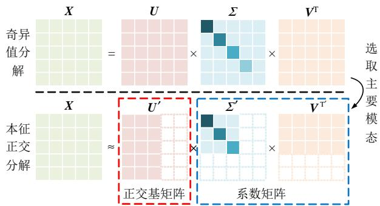  
图 2 POD 方法原理  
Fig. 2 POD method principle

由图 2 可知，本征正交分解方法的原理在于将s 个时间步的计算结果组成快照矩阵进行奇异值分解，选取前d 个较大的奇异值及其对应的奇异值矩阵近似表示原矩阵，获得原方程的降阶形式，即：

$$
\begin{array}{l} \boldsymbol {G} = \boldsymbol {U} \Sigma \boldsymbol {V} \approx \boldsymbol {U} ^ {\prime} \Sigma^ {\prime} \boldsymbol {V} ^ {\prime} (\boldsymbol {U} \in \boldsymbol {R} ^ {n \times n}, \Sigma \in \boldsymbol {R} ^ {n \times s}, \\ \boldsymbol {V} \in \boldsymbol {R} ^ {s \times s}, \boldsymbol {U} ^ {\prime} \in \boldsymbol {R} ^ {n \times d}, \Sigma^ {\prime} \in \boldsymbol {R} ^ {d \times d}, \boldsymbol {V} \in \boldsymbol {R} ^ {d \times s}) \tag {15} \\ \end{array}
$$

同时，大型有限元方程在计算过程中往往会陷入病态，从而导致迭代收敛过慢或计算误差过大，特别是在计算步长随时间自适应调整的过程当中影响更为显著。条件数的计算如下：

$$
\operatorname {c o n d} (\boldsymbol {G}) = \frac {\left| \sigma_ {\max } (\boldsymbol {G}) \right|}{\left| \sigma_ {\min } (\boldsymbol {G}) \right|} \tag {16}
$$

式中：cond 为条件数； $\sigma _ { \mathrm { m i n } }$ 、 $\sigma _ { \mathrm { m a x } }$ 分别为矩阵的最大及最小奇异值。从式(16)可看出，矩阵的条件数

由其最大及最小奇异值的比值决定，而从 POD 的原理可见，该方法能够使原矩阵的最小奇异值最大化，有限元刚度阵的条件数较全阶系统得到了大幅度降低，而较低的条件数使降阶方程的数值稳定性提高，更加适用于大规模计算当中。

综上，引入本征正交分解后的αATS 变步长方法，实现了对步长快速准确的调整，保证计算精度的同时大大提高了计算速度，且对于非线性问题具有良好的适应性。该方法流程如图 3 所示。

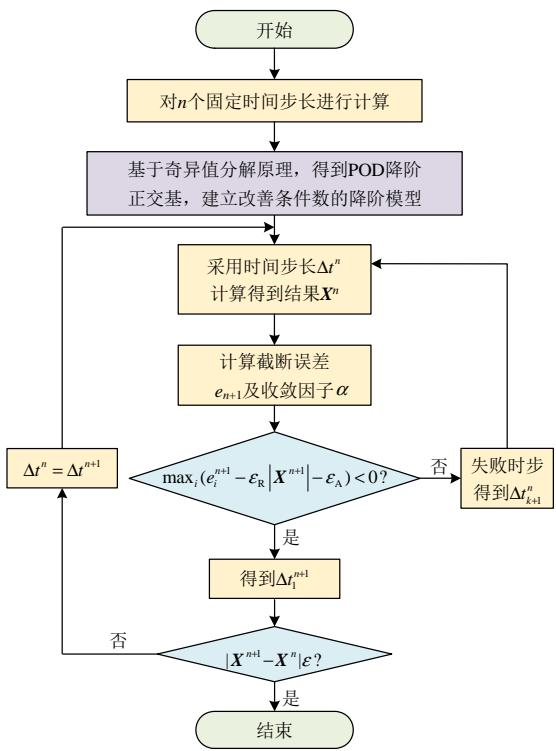  
图 3 POD-αATS 方法流程图  
Fig. 3 POD-αATS method flow chart

# 2 算例分析

# 2.1 二维八分区分匝绕组模型建立

本文根据油浸式电力变压器的结构特点，建立了二维八分区分匝绕组的传热模型，并将 POD-αATS 算法应用于该模型中，以验证其正确性及高效性。该模型由绝缘筒、绕组、挡板组成，绕组的整体尺寸及结构如图 4 所示。模型的物性参数如表 1 所示，由于油流物性参数受温度影响，故将其设置为温度的函数。

模型的边界条件设置如下：

1）将该模型的入口油流速度设置为 $u { = } 0$ ，v=0.1 m/s；  
2）将入口油温及绕组内部的初始温度设置为T=290 K；

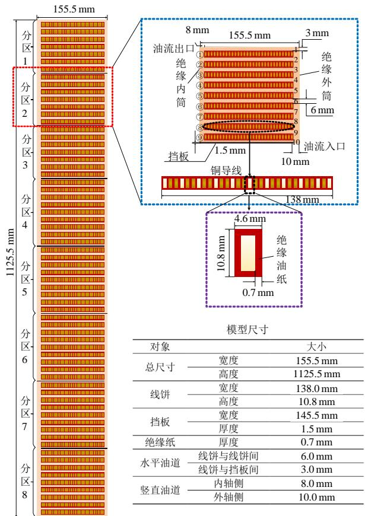  
图 4 油浸式电力变压器绕组一般结构  
Fig. 4 Two-dimensional winding model

表1 模型物性参数  
Table 1 Model physical parameters   

<table><tr><td>对象</td><td>物性参数</td><td>取值</td></tr><tr><td rowspan="4">变压器油</td><td>密度/(kg/m³)</td><td>1098.72-0.712T</td></tr><tr><td>比热容/(J/(kg·K))</td><td>807.163+3.28T</td></tr><tr><td>动力粘度/(Pa·s)</td><td>0.0846-4×10-4T+5×10-7T²</td></tr><tr><td>导热系数/(W/(m·K))</td><td>0.1509-7.101×10-5T</td></tr><tr><td rowspan="3">铜线匝</td><td>密度/(kg/m³)</td><td>8900</td></tr><tr><td>比热容/(J/(kg·K))</td><td>381</td></tr><tr><td>导热系数/(W/(m·K))</td><td>387.6</td></tr><tr><td rowspan="3">绝缘油纸</td><td>密度/(kg/m³)</td><td>980</td></tr><tr><td>比热容/(J/(kg·K))</td><td>2000</td></tr><tr><td>导热系数/(W/(m·K))</td><td>0.25</td></tr><tr><td rowspan="3">挡板</td><td>密度/(kg/m³)</td><td>700</td></tr><tr><td>比热容/(J/(kg·K))</td><td>2310</td></tr><tr><td>导热系数/(W/(m·K))</td><td>0.17</td></tr></table>

3）将绝缘筒壁及挡板设置为无滑移壁面边界条件，即 u=v=0；  
4）将出口设置为压力边界条件，即 $p { = } 0$ ；  
5）不考虑重力因素；  
6) 此处将热源设置为温度的函数[23]：

$$
S _ {T} = S _ {0} \left[ 1 + \beta \left(T - T _ {0}\right) \right]
$$

式中： $S _ { T } ,$ 、 $S _ { 0 }$ 分别为当前温度 T 下的热源密度及参

考温度 $T _ { 0 }$ 下的热源密度；β为导体温度系数，取0.003 93(1/K)。

# 2.2 POD-αATS 正确性验证

在 2.1 节设置的边界条件下，设置初始步长为Δt=0.02s，考虑到流场及温度场的时间尺度不同，采用变步长方法需要确定耦合时间点，参考目前已有的耦合方案[20,24]，本文选择将两场变步长过程中的较小步长作为整场的计算步长，同时当流场到达稳态后，将其结果直接代入温度场中进行计算。总仿真时间为 2000s。本文采用的算法编程与计算软件为 MATLAB R2021a，计算机配置：CPU Intel Corei9-12900KF，内存 128GB。图 5 所示为采用降阶变步长算法计算达到稳态时的温度场和流场云图。

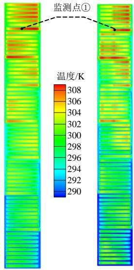  
(a) 流场云图对比

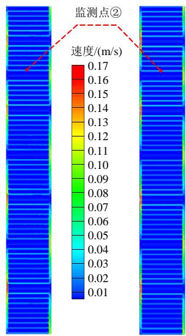  
(b) 温度场云图对比  
图5 POD-αATS 与全阶定步长温度场及流场对比图  
Fig. 5 Comparison diagram of temperature field and flow field between POD-αATS and full-order fixed-step

通过两者的云图可得，计算到达稳态时降阶变步长算法与全阶定步长算法的流场及温度场分布几乎完全一致，为了更加准确地对两者瞬态过程进行跟踪分析，分别在流场及温度场中选取两个监测点，将全阶定步长计算结果与降阶变步长计算结果对比如图 6、7 所示。

图 6 中，全阶定步长表示自编程计算结果，降阶变步长为在全阶定步长程序基础上引入变步长算法的计算结果。图 6(a)展示了流场监测点的速度变化及步长变化，可以看出，POD-αATS 计算得到的监测点速度变化与全阶定步长的计算结果几乎完全相同，且变步长算法的步长设置也能够根据流场的变化情况进行自适应调整。在计算过程中，最大误差出现在 0.1s附近为 0.00021m/s，最大相对误

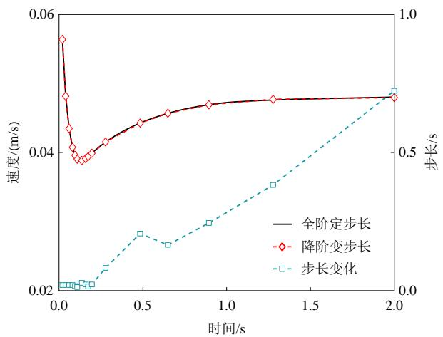  
(a) 流场速度-步长变化图

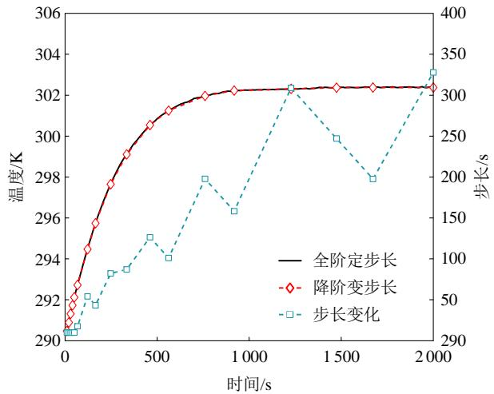  
(b) 温度场温度-步长变化图  
图6 流场及温度场步长变化图

Fig. 6 Flow Field and temperature field step change chart差为 0.54%。同理，图 6(b)展示的温度场监测点温度变化也能够得到类似结论，其最大绝对误差出现在 120s 附近，为 0.2638K，最大相对误差为 1.22%。可知，本文所提降阶变步长算法与传统全阶定步长之间的误差较小，可验证该算法的准确性。

同时，如图 7 所示，通过加入α因子对步长变α化进行修正使得本文算法针对诸如流场等强非线

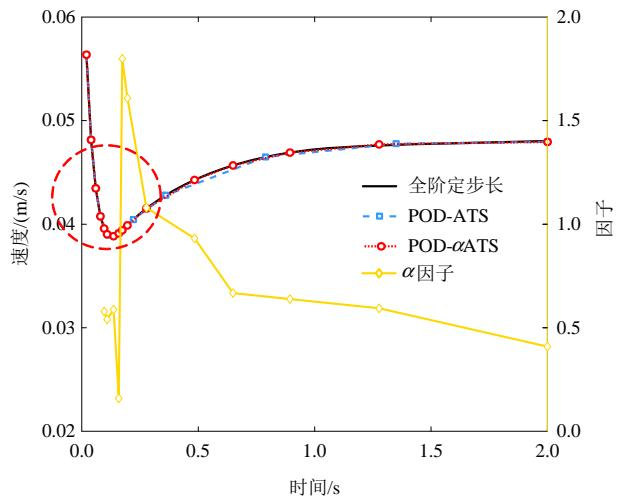  
(a) 流场速度-A因子结果变化图

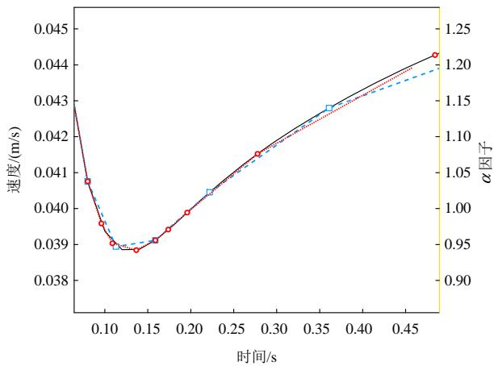  
(b) 放大对比图  
图7 流场变化对比及α因子变化图  
Fig. 7 Comparison of flow field changes and αFactor variation chart

性物理场具有更好的计算精度。由图 7(a)可知，α因子能够较好地反映流场的非线性变化，在流场速度剧烈变化的时段，α因子计算数值较大，根据式(13)，引入α因子对计算步长进行修正，能够适当减少步长以保证非线性瞬态变化过程的准确性；由图 7(b)可知，在相同的参数设置条件下，相较于未引入α因子的变步长算法，在剧烈变化的时段，本文所提算法的拟合精度更高。同理，在温度场中也能够得出类似的结论，由此可充分说明在非线性计算中引入α因子的必要性。

本文所提 POD-αATS 算法的优势在于能够在保证精度的同时，提高瞬态计算的效率。为了说明这一点，将全阶定步长与降阶变步长的瞬态计算在有限元刚度阵阶数、时步数、单步求解有限元方程时间及总计算时间 4 个方面进行对比，结果如表 2所示。

表2 各算法精度对比  
Table 2 Accuracy comparison of each algorithm   

<table><tr><td>计算方法</td><td>物理场</td><td>阶数</td><td>时步数</td><td>单步求解有限元方程时间/s</td><td>总计算时间/s</td></tr><tr><td>全阶</td><td>流场</td><td>1019216</td><td>100</td><td>33.43</td><td>42665.4</td></tr><tr><td>定步长</td><td>温度场</td><td>846211</td><td>200</td><td>9.02</td><td>107221.87</td></tr><tr><td>降阶</td><td>流场</td><td>20</td><td>16</td><td>0.000152</td><td>937.28</td></tr><tr><td>变步长</td><td>温度场</td><td>15</td><td>18</td><td>0.000244</td><td>2818.08</td></tr></table>

由表 2 可以看出，通过引入 POD 降阶算法使得方程阶数大大降低，其中流场由原先的 1019216阶降低到 20阶，温度场由原先的 846211 阶降低到15 阶，使得两者的方程求解时间得到了大幅度减少，其中流场的方程求解时间提升了约 137008 倍，温度场求解时间提升了约 36967 倍，有效地提高了

单步求解效率；同时通过引入αATS 变步长算法减少了瞬态过程计算时步数，其中流场的计算时步数由原先的 100 步减少到了 16 步，温度场的计算时步数由原先的 200 步减少到 18 步，较大地减少了时步冗余；将 POD降阶方法与αATS变步长算法进行结合较大程度地提高了整体求解效率，使其流场总计算时间由原先的 42 665.4 s 减少到 937.28 s，效率提升了约 45 倍，温度场总计算时间由原先的107 221.87 s 减少至 2 818.08 s，效率提升了约 38 倍，由此可充分说明本文所提 POD-αATS 降阶变步长方法能够有效提高瞬态计算效率。

根据 1.3 节的原理分析，POD的引入不仅可降低方程阶数，还可降低方程条件数，同时系统更加稳定。为验证这一点将加入 POD前与加入 POD后的有限元刚度阵条件数进行对比，如表 3 所示。

表 3 有限元刚度阵条件数对比  
Table 3 Comparison of condition numbers of finite element equations   

<table><tr><td>步长/s</td><td>传统定步长</td><td>POD 定步长</td></tr><tr><td>0.01</td><td>1.05×1011</td><td>4.34×106</td></tr><tr><td>0.02</td><td>2.04×1011</td><td>8.17×106</td></tr><tr><td>0.03</td><td>2.66×1011</td><td>1.19×107</td></tr><tr><td>0.04</td><td>3.31×1011</td><td>1.73×107</td></tr><tr><td>0.05</td><td>4.62×1011</td><td>2.12×107</td></tr></table>

从表 3 可得，POD的引入可显著降低方程的条件数，大大提高了有限元方程的计算稳定性，使其在变步长过程中有效避免了由于条件数过大而导致计算不收敛情况的发生。

# 3 温升实验验证

为更贴合工程实际，本文基于 110 kV 变压器绕组搭建温升实验平台，该实验平台的示意图及结构如图 8 所示。

如图 9 所示，实验平台包括空心无感绕组、油箱、散热片、功率测量仪、油泵等。绕组通过油泵泵入的油流实现强迫油循环散热，并配有蝶阀控制油速恒定，实验油流量控制在 14.4m3 /h，折算成油速为 0.117 3 m/s；由于绕组采用的是空心无感结构绕制，因此其发热源仅包含欧姆损耗(功率测量仪测得功率因数为 0.999 82)，功率测量仪测得绕组功率为 25.0004kW；实验所采用绕组的二维结构同图 4所示，实验中所涉及的物性参数同表 1 所示, 整个绕组分为 8个导向分区，其中 1~3分区中每个分区包含 7 个线饼，4~8 分区中每个分区包含 9 个线饼，

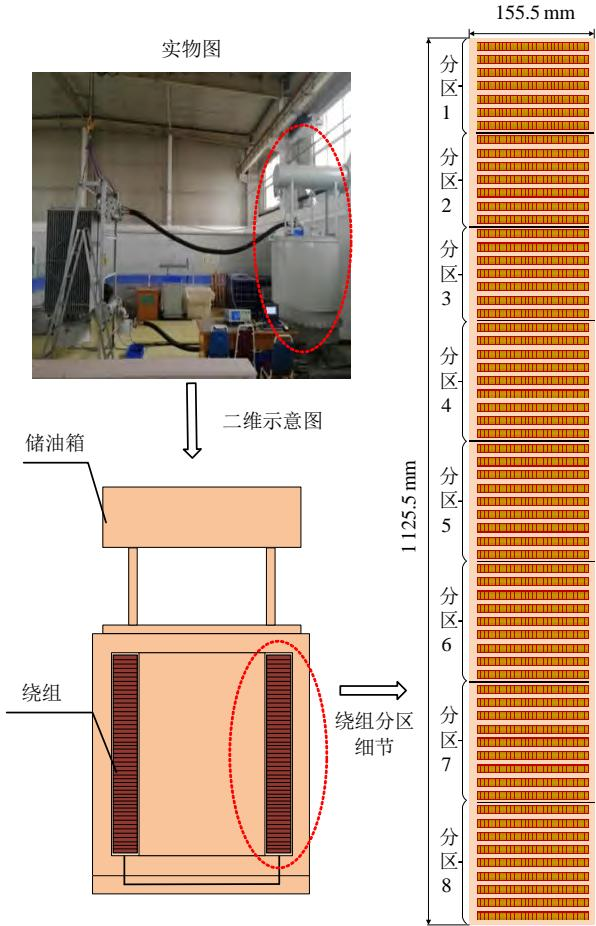  
图8 绕组模型示意图

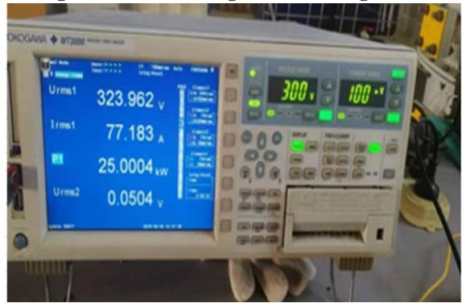  
Fig. 8 Schematic diagram of winding model   
图9 功率测量仪  
Fig. 9 Power measuring instrument

共计 66 个线饼，每个线饼在横向方向上有 30 根扁铜导线构成；实验通过提前布置在绕组上的热电偶实现温度的测量，共设置 4 个测量线饼，每个线饼在若干线匝上布设热电偶。测量线饼分别为从上到下第 12、20、30、38 线饼，除 38 线饼外，各线饼的测点分布于线匝 1、4、7、10、13、16、19、22、25、28、30上，38 线饼的测点分布于线匝 1、4、7、10、16、19、22、25、28、30。将顶层油温变化率小于 1K/h 视为绕组温升到达稳定的标志，实验共记录了绕组温升过程中的 70 个时间点数据。模型的节点数量为 846211，网格数量为 211613。

选取12线饼的4测温点，20线饼的10测温点，30 线饼的 16 测温点及 38 线饼的 28 测温点为参考点，对瞬态过程中的温度变化进行对比，如图 10所示。

图 10 中，实线为全阶固定步长的计算结果，圆圈标记为降阶变步长的计算结果，菱形标记为温升实验的计算结果。在各参考点的误差对比当中，误差 1 为温升实验与降阶变步长的计算误差，误差2 表示全阶定步长与降阶变步长的计算误差。从图中可看出，将本文所提算法应用于复杂模型中，其计算结果与温升实验结果对比大致相同，最大绝对

误差仅为 3.17K，出现在 12 线饼的 4测温点，同时可以看出，各参考点上全阶固定步长的计算结果与降阶变步长结果的最大绝对误差均不超过 0.50K。

综上所述，可说明降阶变步长算法在复杂模型当中仍然适用，其计算精度可得到保证，在计算效率方面，全阶固定步长算法的总计算时间为573.66h，计算步数为 2760 步，本文所提算法的总计算时间约为 10.91h，计算时步数为 58 步，计算时步是原先的 47.59 倍，计算效率是原先的 52.58倍，由此可充分说明本文所提算法的高效性，同时结合前文的正确性验证可充分说明本文算法在贴

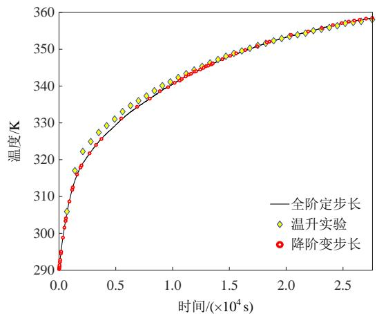

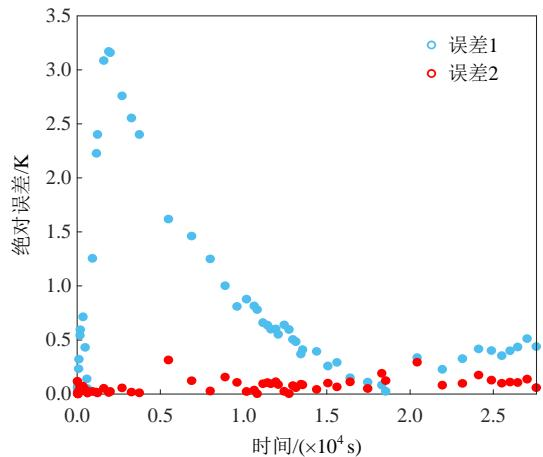

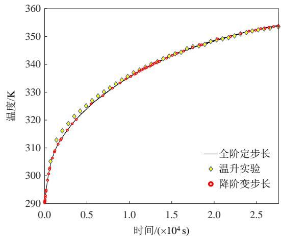  
(a) 12 线饼的4测温点温度变化对比图及误差图

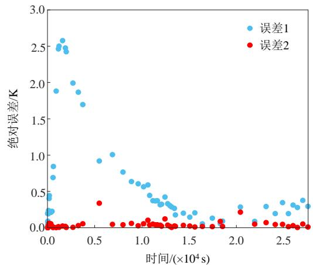

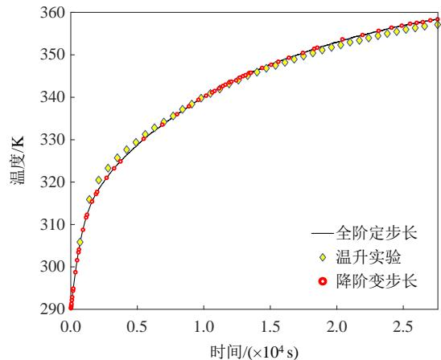  
(b) 20 线饼的 10 测温点温度变化对比图及误差图

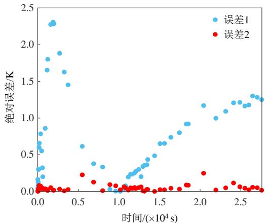  
(c) 30 线饼的16测温点温度变化对比图及误差图

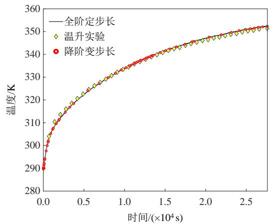

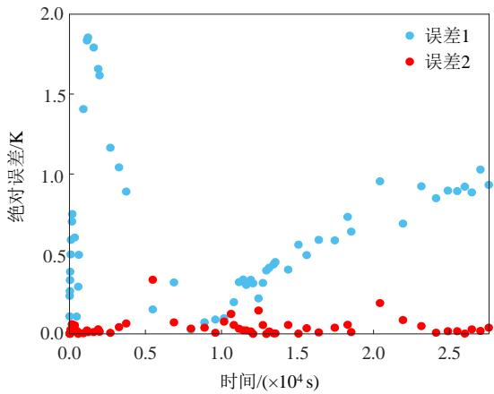  
(d) 38 线饼的28 测温点温度变化对比图及误差图   
图10 各测温点温度变化对比图及误差变化图  
Fig. 10 Comparison diagram of temperature change and error change diagram of each temperature measuring point

近工程实际的模型当中，具有较高的应用价值。

# 4 结论

本文针对油浸式电力变压器瞬态流-热耦合温升计算效率过低问题，提出将 POD 降阶算法与αATS变步长策略相结合的快速计算方法，文中的算例和试验结果表明：

1）在二维八分区绕组模型中，精度方面，本文所提算法与全阶定步长算法对于在场域中选取的监测点而言，流场最大绝对误差出现在 0.1 s 附近，为 0.00021m/s，最大相对误差为 0.54%；温度场最大绝对误差出现在 120s 附近，为 0.2638K，最大相对误差为 1.22%；效率方面，流场总计算时间由原先的 42 665.4 s 减少到 937.28 s，效率提升了约 45 倍，温度场总计算时间由原先的 107221.87s减少至 2818.08s，效率提升了约 38 倍；条件数方面，在相同的步长通过引入 POD 方法下能够将有限元方程的条件数降低 5~6 个数量级，提高了有限元方程的计算稳定性，有效避免了由于条件数过大而导致计算不收敛情况的发生。  
2）本文基于 110kV 变压器绕组搭建了温升实验平台，并将本文所提算法与传统全阶定步长算法应用于温升实验中进行对比，数值计算结果表明，精度方面，POD-αATS算法的计算结果与温升实验结果大致相同，最大绝对误差仅为 3.17K，效率方面，全阶固定步长算法的总计算时间为 573.66h，本文所提算法的总计算时间约为 10.91h，计算效率是原先的 52.58 倍。由此可充分说明本文所提算法在实际模型当中仍然适用，能够保持一定的数值稳定性，具有一定的工程应用价值。

# 参考文献

[1] 潘文霞，陈星池，赵坤，等．基于温度场计算的油浸式 变压器热点温度仿真分析方法[J/OL]．电测与仪表， (2022-10-19)[2023-08-14] ． https://kns.cnki.net/kcms/ detail/23.1202.TH.20221019.1050.006.html   
PAN Wenxia，CHEN Xingchi，ZHAO Kun，et al Simulation analysis method of hot spot temperature of oil-immersed transformer based on temperature field calculation[J/OL] ． Electrical Measurement & Instrumentation，(2022-10-19) [2023-08-14]．https://kns. cnki.net/kcms/detail/23.1202.TH.20221019.1050.006.html (in Chinese)   
[2] 雷成，王亚东，石岩，等．基于异构网格数据映射算法的干式变压器多物理场耦合分析[J]．电气应用，2022，41(4)：5-13  
LEI Cheng，WANG Yadong，SHI Yan，et al．Couplinganalysis of dry-type transformer multi-physics field basedon heterogeneous grid data mapping algorithm[J]Electrotechnical Application ， 2022 ， 41(4) ： 5-13(inChinese)  
[3] 唐钊，刘轩东，陈铭．考虑流体动力学的干式变压器热网络模型仿真分析[J]．电工技术学报，2022，37(18)：4777-4787  
TANG Zhao，LIU Xuandong，CHEN Ming．Simulation analysis of dry-type transformer thermal network model considering fluid dynamics[J] ． Transactions of China Electrotechnical Society，2022，37(18)：4777-4787(in Chinese)   
[4] 邓永清，阮江军，董旭柱，等．基于自适应网格控制的10 kV 油浸式变压器多物理场仿真计算[J]．高电压技术，2022，48(8)：2924-2933  
DENG Yongqing，RUAN Jiangjun，DONG Xuzhu，et al， Simulation of multi-physical field of 10 kV oil-immersed transformer based on adaptive grid control[J] ． High Voltage Engineering ， 2022 ， 48(8) ： 2924-2933(in

Chinese)   
[5] 武卫革，杜振斌，刘刚，等．大型油浸式变压器绕组温度场仿真及验证[J]．华北电力大学学报，2020，47(6)：68-74  
WU Weige，DU Zhenbin，LIU Gang，et al．Simulation and verification of winding temperature field for large oil immersed transformer[J]．Journal of North China Electric Power University，2020，47(6)：68-74(in Chinese)   
[6] 汤焱，刘成远，郝忠言，等．变压器绕组热点温升的计算与实验研究[J]．变压器，2001，38(2)：1-5  
TANG Yan，LIU Chengyuan，HAO Zhongyan，et alCalculation and test of hot-point temperature-rise intransformer windings[J]．Transformer，2001，38(2)：1-5(inChinese)  
[7] 李建勋，顾硕铭，王瑛龙，等．基于有限元法的换流变压器温度场影响因素研究[J]．电子测试，2022(19)：76-78，92  
LI Jianxun，GU Shuoming，WANG Yinglong，et al．Study on influencing factors of converter transformer temperature field based on finite element method[J] Electronic Test，2022(19)：76-78，92(in Chinese)   
[8] JIANG Bonan．The least-squares finite element method： theory and applications in computational fluid dynamics and electromagnetics[M]．New York：Springer Science & Business Media，2013：3-10   
[9] RUSSO A．Streamline-upwind Petrov/Galerkin method (SUPG) vs residual-free bubbles(RFB)[J] ． Computer Methods in Applied Mechanics and Engineering，2006， 195(13-16)：1608-1620   
[10] LIU Gang，ZHENG Zhi，MA Xun，et al．Numerical and experimental investigation of temperature distribution for oil-immersed transformer winding based on dimensionless least-squares and Upwind Finite Element method[J]．IEEE Access，2019，7：119110-119120   
[11] 刘刚，荣世昌，武卫革，等．基于混合有限元法和降阶技术的油浸式变压器绕组 2 维瞬态流-热耦合场分析[J]．高电压技术，2022，48(5)：1695-1704  
LIU Gang ， RONG Shichang ， WU Weige ， et alTwo-dimensional transient flow-thermal coupling fieldanalysis of oil-immersed transformer windings based onhybrid finite element method and reduced-ordertechnology[J]．High Voltage Engineering，2022，48(5)：1695-1704(in Chinese)

[12] 骆小满，阮江军，邓永清，等．基于多物理场计算和模糊神经网络算法的变压器热点温度反演[J]．高电压技术，2020，46(3)：860-866  
LUO Xiaoman，RUAN Jiangjun，DENG Yongqing，et al Transformer hot-spot temperature inversion based on multi-physics calculation and fuzzy neural network algorithm[J]．High Voltage Engineering，2020，46(3)： 860-866(in Chinese)   
[13] 彭道刚，陈跃伟，钱玉良，等．基于粒子群优化-支持向量回归的变压器绕组温度软测量模型[J]．电工技术学报，2018，33(8)：1742-1749，1761  
PENG Daogang，CHEN Yuewei，QIAN Yuliang，et al Transformer winding temperature soft measurement model based on particle swarm optimization-support vector regression[J] ． Transactions of China Electrotechnical Society，2018，33(8)：1742-1749，1761(in Chinese)   
[14] YANG Fan，WU Tao，JIANG Hui，et al．A new method for transformer hot-spot temperature prediction based on dynamic mode decomposition[J]．Case Studies in Thermal Engineering，2022，37：102268   
[15] JIANG Genghui，KANG Ming，CAI Zhenwei，et al Online reconstruction of 3D temperature field fused with POD-based reduced order approach and sparse sensor data[J]．International Journal of Thermal Sciences，2022， 175：107489   
[16] 胡万君，刘刚，朱章宸，等．油浸式电力变压器绕组稳态温升降阶计算方法研究[J]．中国电机工程学报，2023，43(16)：6505-6517  
HU Wanjun，LIU Gang，ZHU Zhangchen，et al．Study on calculation method of steady state temperature rise and reduced order of oil immersed power transformer winding [J]．Proceedings of the CSEE，2023，43(16)：6505-6517   
[17] 刘刚，郝世缘，胡万君，等．基于 SCAS 时间匹配算法油浸式变压器绕组瞬态温升计算方法[J/OL]．电工技术学 报 ， (2023-03-20) [2023-08-14] ． https://doi.org/10.19595/j.cnki.1000-6753.tces.222137  
LIU Gang，HAO Shiyuan，HU Wanjun，et al．Transient temperature rise calculation of oil immersed transformer winding based on SCAS time matching algorithmand [J/OL]．Transactions of China Electrotechnical Society， (2023-03-20) [2023-08-14] ． https://doi.org/10.19595/ j.cnki.1000-6753.tces.2221372(in Chinese)

[18] AHMED N，JOHN V．Adaptive time step control for higher order variational time discretizations applied to convection–diffusion–reaction equations[J]．Computer Methods in Applied Mechanics and Engineering，2015， 285：83-101   
[19] JOHN V，RANG J．Adaptive time step control for the incompressible Navier-Stokes equations[J] ． Computer Methods in Applied Mechanics and Engineering，2010， 199(9-12)：514-524   
[20] D’HAESE C M F，PUTTI M，PANICONI C，et al Assessment of adaptive and heuristic time stepping for variably saturated flow[J] ． International Journal for Numerical Methods in Fluids，2007，53(7)：1173-1193   
[21] VALLI A M P，CAREY G F，COUTINHO A L G A，et al Control strategies for timestep selection in simulation of coupled viscous flow and heat transfer[J] Communications in Numerical Methods in Engineering， 2002，18(2)：131-139   
[22] 刘刚，靳立鹏，胡万君，等．基于混合有限元法的油浸式变压器稳态流-热耦合场并行计算方法[J]．高电压技术，2024，50(5)：2259-2269LIU Gang，JIN Lipeng，HU Wanjun，et al．A parallelmethod for steady-state fluid-thermal coupling field ofoil-immersed transformer based on hybrid finite elementmethod[J]．High Voltage Engineering，2024，50(5)：2259-2269(in Chinese)  
[23] 张宇娇，汪振亮，徐彬昭，等．瞬态电磁-温度场耦合计算中自适应时间步长研究[J]．电工技术学报，2018，33(19)：4468-4475ZHANG Yujiao，WANG Zhenliang，XU Binzhao，et al

Research on the adaptive time step in transient calculation of coupled electromagnetic and thermal fields[J] Transactions of China Electrotechnical Society，2018， 33(19)：4468-4475(in Chinese)   
[24] KASSIOTIS C，IBRAHIMBEGOVIC A，NIEKAMP R， et al．Nonlinear fluid-structure interaction problem．Part I： implicit partitioned algorithm，nonlinear stability proof and validation examples[J]．Computational Mechanics， 2011，47(3)：305-323

  
刘刚

在线出版日期：2023-08-14。

收稿日期：2023-03-24。

作者简介：

刘刚(1985)，男，副教授，硕士研究生导师，研究方向为电气设备多物理场建模和仿真、基于多物理场的结构优化、电力装备数字孪生仿真模型以及电力系统时域仿真技术，liugang_em@163.com；

郝世缘(1999)，女，硕士研究生，主要研究方向为多物理场多时间尺度快速计算方法；

胡万君(1999)，男，硕士研究生，研究方向为电力装备数字孪生模型降阶技术；

刘云鹏(1976)，男，教授，博士生导师，研究方向为特高压输电及电力设备故障检测与诊断，liuyunpeng@ncepu.edu.cn；

李琳(1962)，男，博士，教授，博士生导师，研究方向为电磁场理论及应用、先进输变电技术与电力系统电磁兼容等。

(编辑 李婧妍，胡琳琳)

# Adaptive Variable Step Size Calculation Method for Transient Temperature Rise and Fall of Oil Immersed Transformer Based on POD-αATS

LIU Gang1 , HAO Shiyuan1 , HU Wanjun1 , LIU Yunpeng 1 , LI Lin2

(1.Hebei Provincial Key Laboratory of Power Transmission Equipment Security Defense (North China Electric Power University);   
2. State Key Laboratory of Alternate Electrical Power System with Renewable Energy Sources (North China Electric Power University))

KEY WORDS：αATS variable step size algorithm; POD order reduction method; transient flow thermal coupling problem; fast calculation method; temperature rise experiment.

The numerical calculation method is an important means to obtain the transient temperature rise of oil immersed power transformers. However, the calculation of transient temperature rise of windings is generally slow. Moreover, when it comes to fast time response and sharp changes in the field, it is difficult to determine the response peak unless the time step is chosen very small. At the same time, a small time step size also means a large number of time steps are required, which leads to a low overall efficiency of the calculation. In order to improve the above issues, this paper proposes PODαATS reduced order adaptive variable step size transient calculation method. The general structure of the article is:

1) Firstly, the control equation for transient temperature rise calculation of oil immersed power transformers is derived using finite element method, and the efficiency bottleneck in traditional transient calculation is analyzed.   
2) Secondly, in response to the problem of excessive time steps or low accuracy caused by improper selection of fixed time steps, this paper proposes a method suitable for nonlinear problems α ATS (adaptive time stepping based on α factor) variable step size strategy.   
3) Then, this article uses the POD (proper orthogonal decomposition) reduction algorithm to solve the problem of excessive number of conditions and equation orders in traditional transient calculations, in order to reduce the single step calculation time.

In order to verify the effectiveness of the method, the article establishes a two-dimensional eight zone split turn winding numerical calculation model based on the basic structure of 110 kV oil immersed power transformer, and conducts experimental verification based on the temperature rise experimental platform of the winding. As shown in Fig. 1 and Fig. 2, the numerical and experimental results show that the calculation accuracy of the proposed method in the flow field and temperature field is close to that of the full order fixed step length, with a maximum relative error of

no more than 1.22%. The calculation order of the flow field and temperature field is reduced from the original 1 019 216 and 846 211 orders to 20 and 15 orders, respectively. The calculation steps are reduced from the original 100 and 200 steps to 16 and 18 steps, respectively. The efficiency has been significantly improved. Comparing the algorithm proposed in this article with the traditional full order fixed step algorithm applied in temperature rise experiments, the maximum error of winding temperature in terms of accuracy does not exceed 3.17 K, and the efficiency of this method is improved by 52.58 times compared to the traditional finite element method.

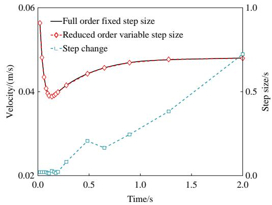  
Fig. 1 Flow Field step change chart

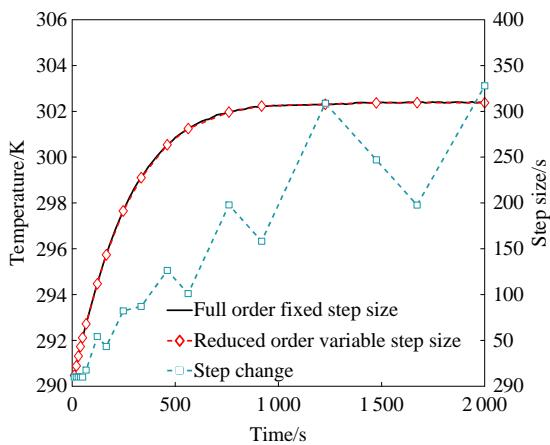  
Fig. 2 Temperature Field step change chart