# Tower-foot grounding model for EMT programs based on transmission line theory and Marti’s model

Rafael Alipio a,1,* , Alberto De Conti b , Felipe Vasconcellos c , Fernando Moreira c , Naiara Duarte a , Jos´e Martí d d

a Electromagnetic Compatibility Laboratory, Swiss Federal Institute of Technology in Lausanne (EPFL), 1015, Switzerland   
b Department of Electrical Engineering, Federal University of Minas Gerais, Belo Horizonte, MG, Brazil   
c Department of Electrical and Computer Engineering, Federal University of Bahia, Salvador, BA, Brazil   
d Electrical and Computer Engineering Department, University of British Columbia, Vancouver, Canada

# A R T I C L E I N F O

# Keywords:

Lightning transients

Transmission lines

EMT programs

Grounding

Transmission line theory

# A B S T R A C T

This paper proposes a tower-foot grounding system model compatible with EMT programs which might be useful for the simulation of lightning transients in overhead lines. The proposed model is based on the solution of the telegrapher’s equations and the application of the classical Marti’s transmission line model. The model is implemented in the Alternative Transients Program (ATP) and validated considering a benchmark electromagnetic model. Its accuracy is evaluated and shown both in terms of the simulated ground potential rise (GPR) and line overvoltages developed through the insulator strings due to lightning currents. Finally, the model accuracy is also demonstrated in terms of the line backflashover outage rate.

# 1. Introduction

FOR most overhead power transmission lines (TLs), lightning is the primary cause of unscheduled interruptions [1]. The assessment of the lightning performance of overhead TLs involves the calculation of the minimum lightning currents causing insulation flashover for strikes to phase conductors (shielding failure flashover) and to towers and shield wires (backflashover) [2]. Although the tower-foot grounding system does not affect the occurrence of shielding failure flashover, it does affect the backflashover by markedly changing the amplitude and steepness of the resulting overvoltages across line insulators [3].

Typically, the assessment of the lightning performance of transmission lines is carried out using time-domain transient simulators [4, 5]. Such platforms, however, do not have specific models for the tower-foot grounding system. Thus, in most cases, the grounding system is normally modeled simply as a lumped resistance. This approach disregards the frequency-dependent behavior of grounding input impedance which might be important in lightning transients [6]. An alternative and more accurate approach is the determination of the frequency-dependent response of the tower-foot grounding externally using an electromagnetic field approach and then including it in the

time-domain simulator through a pole-residue representation [7,8]. This second approach, however, is more laborious and time consuming. A third approach, which balances accuracy and computational effort, is the representation of the grounding electrodes as a buried transmission line. This approach, however, is generally used only for representing simple arrangements such as single horizontal or vertical grounding electrodes [9,10]. In [11], a pi-equivalent circuit model was proposed to represent general grounding system arrangements of transmission lines, based on an accurate circuit model and an optimization procedure to determine the pi-circuit parameters. Recently, the tower-foot grounding modeling through a lumped resistance with the same value as the so-called grounding impulse impedance was also suggested [3].

In this paper, a tower-foot grounding model based on the solution of the telegrapher’s equations is proposed and implemented in the Alternative Transients Program (ATP) using the classical Marti’s transmission line model [12]. The accuracy of the proposed model is evaluated using an electromagnetic model as a benchmark. The obtained results serve as a basis for implementing an electrical grounding component in time-domain simulators which might benefit the industry, allowing more accurate simulations of lightning overvoltages in overhead TLs. Thus, the main novelty of this paper consists in the use of a stable model

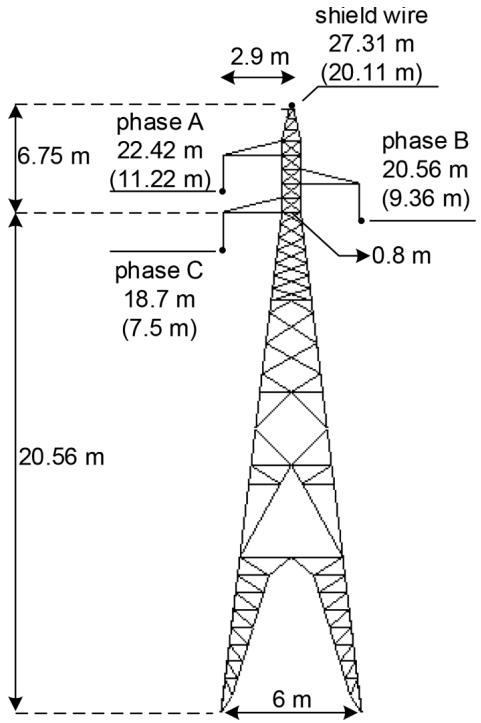  
Fig. 1. Tower geometry of the tested 138-kV line [8].

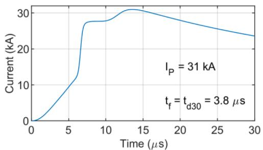  
Fig. 2. Representative lightning current waveform of first strokes measured at Mount San Salvatore [13,14].

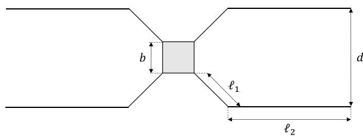  
Fig. 3. Tower-foot grounding.

widely available in EMT-type platforms, namely the FDLine model or Marti’s model, to simulate the transient response of grounding electrodes together with other electrical system components.

This paper is organized as follows. In Section 2 the case study consisting of a 138-kV line is presented. The proposed model for the towerfoot grounding system, along with its implementation in ATP and validation using a benchmark electromagnetic model, is presented in Section 3. In Section 4 the proposed tower-foot grounding model is applied to assess the lightning performance of the studied transmission line. Finally, Section 5 presents the main conclusions of the paper and makes a summary of it.

# 2. Case study

In the developments of this work, a case study corresponding to a typical 138-kV transmission line is considered. Fig. 1 shows the tower geometry, taken from [8], which has one ACSR conductor per phase (LINNET) and one $3 / 8 ^ { \prime \prime }$ EHS shield wire.

In the analysis of the lightning performance of overhead $\mathrm { T L } s ,$ the response to first return stroke currents associated with downward flashes is the most relevant aspect [5]. In the simulation results presented in this paper, the current waveform shown in Fig. 2 is assumed. This waveform is modeled as the sum of Heidler’s functions, as detailed in [13], and closely reproduces the median parameters of downward negative first return strokes measured at Mount San Salvatore station $[ 1 4 ] ,$ which is assumed as the international reference for lightning-related studies [15]. The first-stroke current is characterized by a peak value of 31 kA and a virtual front time (calculated as the time between 30% and 90% of its peak value, divided by 0.6) of 3.8 µs.

# 3. Tower-foot grounding modeling using transmission line theory and Marti’s model

# 3.1. Per-unit-length parameter calculation

Fig. 3 shows the typical electrode arrangement of the transmission line tower grounding. It consists of four bare conductors, known as counterpoise wires, that are buried on a depth and are laid parallel to the surface of the earth. The grounding electrodes start from the tower legs at a 45◦ angle. After reaching a length $\ell _ { 1 } ,$ they change their direction and become parallel to the right-of-way. The length $\boldsymbol { \mathscr { l } } _ { 2 }$ of the counterpoise wires running parallel to each other is adjusted to maximize the effectiveness of the grounding system according to the soil resistivity value. This means that the total length $\ell = \ell _ { 1 } + \ell _ { 2 }$ of each counterpoise wire is set such that the effective length of the grounding system is not exceeded.

From a theoretical standpoint, the four counterpoise wires are electromagnetically coupled and therefore a rigorous electromagnetic model should be used for their representation. However, a transmission line model may be adopted as long as some assumptions are made. First, the symmetry of the problem is taken into consideration and only the wires at one side of the tower are considered electromagnetically coupled. Second, each pair of wires is modeled using an equivalent uniform transmission line representation characterized by the following equations

$$
\frac {d V}{d x} = - \mathbf {Z} _ {i} - j \omega \mathbf {L I} \tag {1}
$$

$$
\frac {d \boldsymbol {I}}{d x} = - (\boldsymbol {G} + j \omega \boldsymbol {C}) \boldsymbol {V} \tag {2}
$$

where V and I are voltage and current vectors of size $2 \times 1 , Z _ { i }$ and L are $2 \times 2$ matrices respectively containing the internal impedance of the conductors and the external inductance per unit length, G and C are $2 \times$ 2 matrices respectively containing the shunt conductance and capacitance per unit length and ω is the angular frequency.

Matrix G is the inverse of the shunt resistance matrix $\scriptstyle { R , }$ whose maindiagonal elements $R _ { S }$ are identical. These elements are calculated using the equation proposed by Sunde for determining the grounding resistance of a buried bare conductor parallel to the surface of the earth [16]

$$
R _ {S} = \frac {1}{\pi \sigma_ {g}} \left[ \ln \left(\frac {2 \ell}{\sqrt {2 h r}}\right) - 1 \right] \tag {3}
$$

where $\sigma _ { g }$ is the ground conductivity, l is the total counterpoise length, $h = 0 . 8$ m is the burial depth, and $r = 4 . 7 6 2 5$ mm is the counterpoise radius.

The mutual shunt resistance corresponding to the off-diagonal ele-

Table 1 Length of the counterpoise wires as a function of low-frequency ground resistivity.   

<table><tr><td>ρg(Ωm)</td><td>250</td><td>500</td><td>1000</td><td>2500</td><td>5000</td></tr><tr><td>/ (m)</td><td>15</td><td>25</td><td>40</td><td>55</td><td>80</td></tr></table>

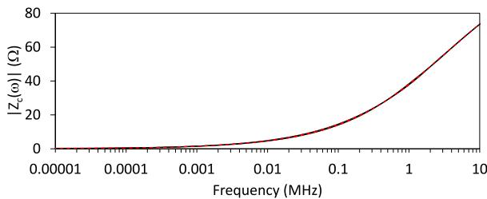

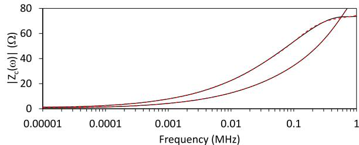

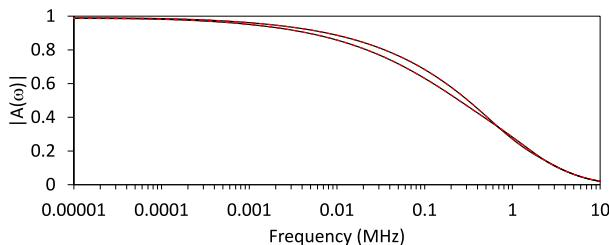  
Fig. 4. Absolute value of the modal characteristic impedance Z (ω) of the counterpoise wire model for soil resistivities of (a) 250 Ωm and (b) 2500 Ωm. Black solid lines: original curves; red dashed lines: fitted curves.

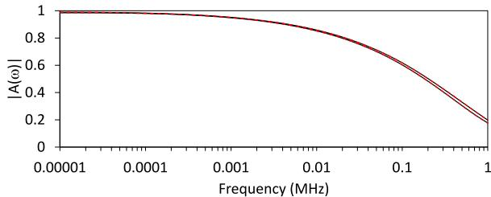  
  
  
Fig. 5. Absolute value of the modal propagation function A(ω) of the counterpoise wire model for soil resistivities of (a) 250 Ωm and (b) 2500 Ωm. Black solid lines: original curves; red dashed lines: fitted curves.

ments of R is proposed here to be calculated as

$$
R _ {M} = \frac {e ^ {- \gamma_ {g} \bar {d}}}{\pi \sigma_ {g}} \left[ \ln \left(\frac {2 \ell}{\sqrt {2 h \bar {d}}}\right) - 1 \right] \tag {4}
$$

where $\gamma _ { g } = \sqrt { j \omega \mu _ { 0 } ( \sigma _ { g } + j \omega \varepsilon _ { g } ) }$ is the intrinsic propagation constant of the ground, in which $\varepsilon _ { g }$ is the ground permittivity and $\mu _ { 0 }$ is the vacuum permeability, and d is given by

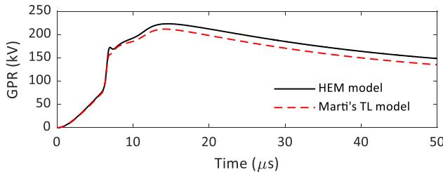

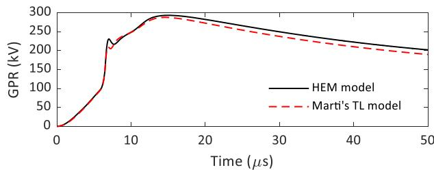

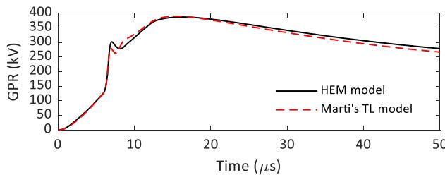  
  
（c）

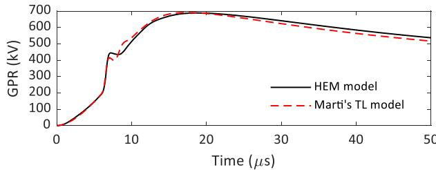

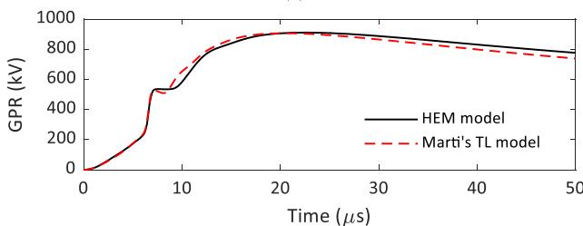  
  
Fig. 6. GPRs developed by the tower-foot grounding system in response to the injection of the current shown in Fig. 2 considering the proposed TL line model and the HEM model, and soil resistivities of (a) 250 Ωm, (b) 500 Ωm, (c) 1000 Ωm, (d) 2500 Ωm, and (e) 5000 Ωm.

Table 2 Peak value of the GPR.   

<table><tr><td>ρ (Ωm)</td><td>250</td><td>500</td><td>1000</td><td>2500</td><td>5000</td></tr><tr><td>Vp (kV) Marti&#x27;s TL model</td><td>212</td><td>288</td><td>390</td><td>691</td><td>906</td></tr><tr><td>Vp (kV) HEM model</td><td>223</td><td>293</td><td>387</td><td>688</td><td>911</td></tr><tr><td>|Δ| (%)</td><td>4.9</td><td>1.7</td><td>0.8</td><td>0.4</td><td>0.5</td></tr></table>

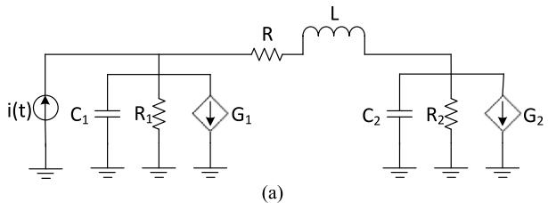

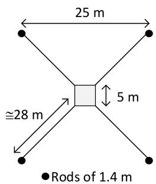  
(b)

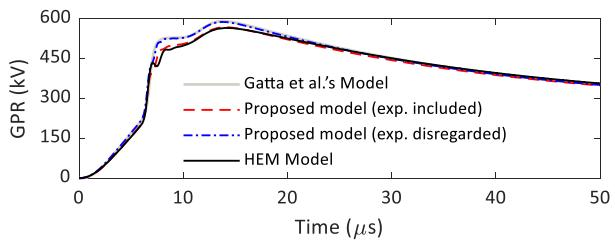  
Fig. 7. (a) Pi-equivalent circuit model. (b) Grounding system composed of four horizontal conductors made of strap iron (40 mm × 4 mm) buried at 0.8 m depth. In the proposed model, the length of the rods connected at the end were incorporated into the total length of the horizontal electrodes.   
Fig. 8. Comparison between the simulated GPRs developed by the grounding system shown in Fig. 7(b) in response to the current shown in Fig. 2, considering the proposed model and the pi-circuit model proposed in [11].

$$
\bar {d} = \frac {d _ {1} \ell_ {1} + d _ {2} \ell_ {2}}{\ell} \tag {5}
$$

where $d _ { 1 } = ( b + d ) / 2$ is the average horizontal separation between the diagonally oriented parts of the grounding electrodes, $d _ { 2 } = d = 2 0$ m is the total electrode separation, and 6 m is the tower base width. The exponential term is introduced in (4) to account for the propagation delay in the transversal direction. Once R is determined with (3) and (4), the shunt conductance and shunt capacitance matrices per unit length are simply calculated as ${ \bf G } = { \bf R } ^ { - 1 }$ and $C = ( \varepsilon _ { g } / \sigma _ { g } ) G$ [17].

It is worth mentioning that expression (4) for calculating the mutual shunt resistance, except for the exponential term, has been shown to be a good approximation for calculating the mutual effects between parallel electrodes with geometry as illustrated in Fig. 3, based on comparisons with several other models available in the literature [18,19]. This expression is obtained from (3) by replacing the conductor radius by the distance between the electrodes and the depth by the average depth of the electrodes.

The internal impedance $\mathbf { Z } _ { i }$ in (1) is a diagonal matrix that can be usually neglected in grounding impedance calculations. However, it was included for completeness considering the exact solution for the internal impedance of a solid cylindrical conductor [20]. Finally, the diagonal elements of matrix L are calculated using [17,21]

$$
L _ {S} = \frac {\mu_ {0}}{2 \pi} \left[ \ln \left(\frac {2 \ell}{\sqrt {2 h r}}\right) - 1 \right] \tag {6}
$$

while the off-diagonal elements of $L ,$ following an approach that is similar to the one adopted to compute the mutual shunt resistance, are proposed here to be calculated as

$$
L _ {M} = \frac {\mu_ {0}}{2 \pi} \left[ \ln \left(\frac {2 \ell_ {2}}{\sqrt {2 h d}}\right) - 1 \right] e ^ {- \gamma_ {g} d} \tag {7}
$$

It must be noted that only the length $\ell _ { 2 }$ related to the extension of the grounding electrodes that run parallel to each other is considered in (7). Moreover, the distance between the electrodes is that between the parallel section (d) and not the average horizontal separation (d). This is so because the non-parallel sections of the counterpoise wires are orthogonal and therefore not magnetically coupled. As in (4), Eq. (7) includes an exponential term that accounts for the propagation delay in the transversal direction. Since Eqs. (3)–(7) assume a homogeneous ground, the ground conductivity in (3) and (4) should be viewed as an apparent value intended to represent a multilayer ground equivalently.

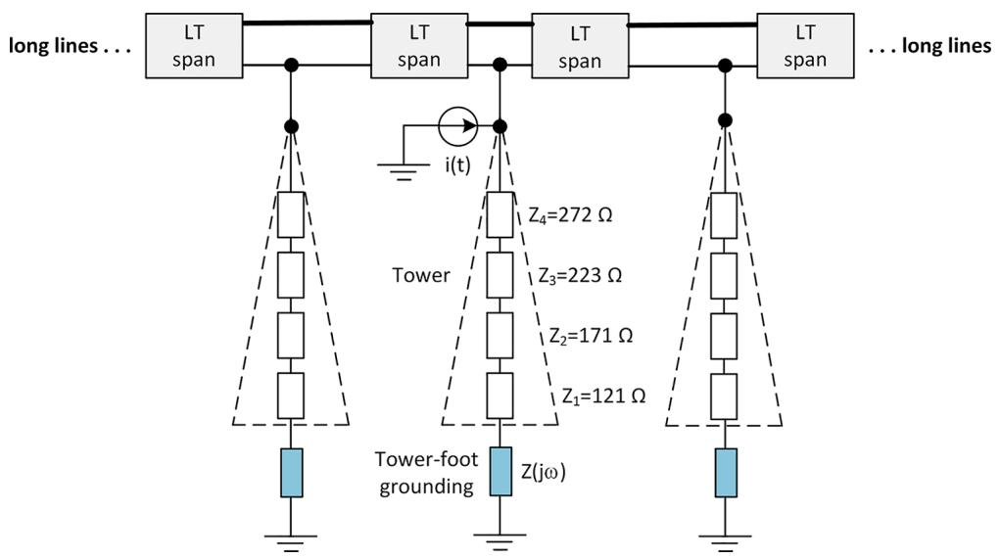  
Fig. 9. Schematic representation of the simulated system corresponding to a direct strike to the top of a tower flanked by adjacent towers (only two represented in the figure).

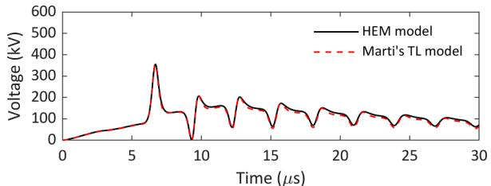

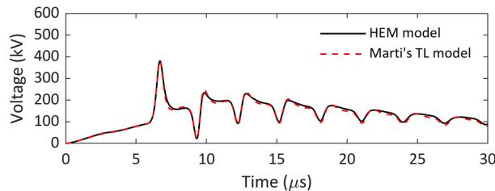  
(a)   
(b)

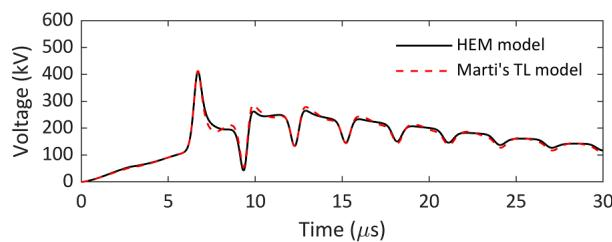

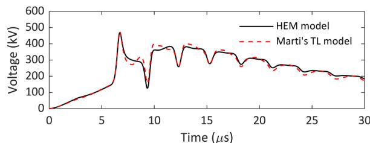  
(d)   
Fig. 10. Lightning overvoltages developed across the lower line insulator, considering the proposed TL line model and the HEM model, and soil resistivities of (a) 250 Ωm, (b) 500 Ωm, (c) 1000 Ωm, (d) 2500 Ωm, and (e) 5000 Ωm.

Table 3 Peak value of the overvoltages across the lower insulator.   

<table><tr><td>ρ (Ωm)</td><td>250</td><td>500</td><td>1000</td><td>2500</td><td>5000</td></tr><tr><td>Vp (kV) Marti&#x27;s TL model</td><td>353</td><td>381</td><td>414</td><td>476</td><td>512</td></tr><tr><td>Vp (kV) HEM model</td><td>356</td><td>382</td><td>411</td><td>470</td><td>498</td></tr><tr><td>|Δ| (%)</td><td>0.8</td><td>0.3</td><td>0.7</td><td>1.3</td><td>2.8</td></tr></table>

For representing a multilayer ground structure in detail, Eqs. (3)–(7) should be modified accordingly.

As discussed in [22], the transmission line approximation should be valid for buried wires provided the ground-return currents are confined in a region delimited by the wavelength in the ground. The following approximate expression is proposed in the same reference to determine the frequency limit, in Hz, below which the transmission line approximation should be valid

$$
f _ {\max } = \frac {\mu_ {0} \sigma_ {g} \pi c ^ {2}}{\sqrt {\varepsilon_ {r g} \left\{\varepsilon_ {r g} + \mu_ {0} \varepsilon_ {g} [ 2 \pi c ] ^ {2} \right\}}} \tag {8}
$$

where $\varepsilon _ { r g }$ is the ground relative permittivity and c is the speed of light. Eq. (8) predicts an inverse relationship between the ground resistivity $\rho _ { g } = 1 / \sigma _ { g }$ and $f _ { m a x } .$ . For example, for a constant ground resistivity of 250 Ωm and a ground relative permittivity of $^ { 1 0 , }$ this expression leads to $f _ { m a x } { = 2 2 }$ MHz, which greatly exceeds the range of frequencies expected to occur in lightning overvoltages. If the ground resistivity is increased to 5000 Ωm, this frequency limit is reduced to 1.1 MHz, which still covers the range of frequencies in which the bulk of the lightning energy is confined. If a more realistic frequency-dependent soil model is used, these limiting values will increase due to the reduction of the soil resistivity with frequency. This indicates that (1) and (2) can be used to model counterpoise wires with sufficient accuracy within the limits of transmission line theory.

# 3.2. ATP modeling of the grounding electrodes

Since the matrices $G , \ C , \ Z _ { i } ,$ and L are symmetric and perfectly balanced, a real and constant transformation matrix can be conveniently used to diagonalize the transmission line Eqs. (1) and (2) and write them in the modal domain in exact form. By defining $I = T _ { I } I _ { m }$ and $\begin{array} { r } { V = T _ { V } V _ { m } , } \end{array}$ , where $I _ { \mathbf { m } }$ and $V _ { m }$ are the modal-domain equivalents of I and $V ,$ respectively, and observing that $T _ { V } ^ { t } = T _ { I } ^ { - 1 }$ [23], the transformation matrix $T _ { I }$ can be simply written as

$$
\boldsymbol {T} _ {I} = \frac {1}{\sqrt {2}} \left[ \begin{array}{l l} 1 & 1 \\ 1 & - 1 \end{array} \right] \tag {9}
$$

After transformation to the modal domain, Eqs. (1) and (2) can be accurately solved in the time domain using Marti’s transmission line model [12] implemented in ATP. However, there is no model in ATP to calculate the per-unit-length parameters considering the equations presented in the previous section. For this reason, the line parameters were calculated in Matlab. The rational fitting of the characteristic impedance and propagation function of each mode required in Marti’s model was also performed in Matlab. This was done using the vector fitting technique [24] considering real poles only. The poles and residues obtained from the fitting as well as the transformation matrix $T _ { I }$ were written as a text file with the extension .pch and coupled with ATP following the approach described in detail in [25]. Using this approach, each pair of counterpoise wires shown in Fig. 3 can be modeled in ATP as a two-phase transmission line with Marti’s model.

Table 4 Estimated backflashover rates.   

<table><tr><td rowspan="2">Number</td><td colspan="5">Percentual distribution of soils with different resistivity along the transmission line route (%)</td><td colspan="2">BFR</td><td rowspan="2">|Δ| (%)</td></tr><tr><td>250</td><td>500</td><td>1000</td><td>2500</td><td>5000</td><td>TL Marti&#x27;s model</td><td>HEM model</td></tr><tr><td>1</td><td>30</td><td>40</td><td>30</td><td>0</td><td>0</td><td>0.62</td><td>0.63</td><td>1.6</td></tr><tr><td>2</td><td>0</td><td>0</td><td>40</td><td>30</td><td>30</td><td>2.03</td><td>1.97</td><td>3.0</td></tr><tr><td>3</td><td>20</td><td>20</td><td>20</td><td>20</td><td>20</td><td>1.47</td><td>1.45</td><td>1.4</td></tr><tr><td>4</td><td>10</td><td>25</td><td>30</td><td>25</td><td>10</td><td>1.36</td><td>1.33</td><td>2.3</td></tr></table>

# 3.3. Model validation

To demonstrate the validity of the transmission line modeling of the counterpoise wires using the approach proposed in this paper, simulations were performed considering the realistic current waveform shown in $\mathrm { F i g . } 2 .$ . In the simulations, the sending ends of the four counterpoise wires shown in Fig. 3 were connected to a single virtual node representing the tower bottom. An ideal current source injected the lightning return-stroke current at this node and the resulting ground potential rise (GPR) was calculated. Five low-frequency values of ground resistivity were considered, namely 250, 500, 1000, 2500, and 5000 Ωm. In all cases, the ground resistivity and permittivity were assumed to vary with frequency according to the Alipio-Visacro model [26]. The total length of each counterpoise wire was changed so that the effective length corresponding to each ground resistivity was not exceeded. The considered values are listed in Table 1.

Figs. 4 and 5 illustrate the absolute values of the modal characteristic impedance and the modal propagation function, respectively, associated with the counterpoise wires for ground resistivities of 250 Ωm and 2500 Ωm. Also shown in the figures are the fitted curves obtained with the vector fitting technique. These values were selected because they demonstrate the overall behavior of both parameters for the conditions indicated in Table 1.

In general, a good agreement is observed in Figs. 4 and 5 between the original and fitted curves. However, the fitting of the model parameters with real poles as required in the ATP implementation of Marti’s model becomes increasingly difficult with increasing values of ground resistivity and frequency. For this reason, although the fitting for the 250- Ωm and 500-Ωm soils could be performed up to 10 MHz, for ground resistivities equal to or greater than 1000 Ωm the fitting had to be limited to 1 MHz for best accuracy. Nevertheless, the performance of the grounding models was not severely affected because most of the energy associated with the return stroke current of Fig. 2 (and most lightning currents, in general) is well below 1 MHz.

Model passivity was checked by assuring that [27]

$$
e i g \left(\left(\mathbf {Y} _ {n} + \mathbf {Y} _ {n} ^ {H}\right) / 2\right) \rangle 0 \forall s, s = j \omega \tag {10}
$$

where $Y _ { n }$ is the nodal admittance matrix calculated from the fitted propagation function and characteristic admittance of the line, and superscript ‘H’ corresponds to the Hermitian of a matrix. In all cases indicated in Table 1, the inequality in (10) was confirmed for frequencies up to 10 MHz even if the model was accurately fitted up to 1 MHz only. This was done to investigate the occurrence of out-of-band passivity violations. In none of the cases any passivity violation was identified.

Fig. 6 illustrates the GPRs calculated with the implemented grounding models. Also included in the figure are voltage waveforms calculated using the hybrid electromagnetic model (HEM) [28], which provides a rigorous solution to the problem by considering the electromagnetic coupling of a system of arbitrarily oriented electrodes in the solution of the scalar potential and magnetic vector potential equations derived from Maxwell’s equations. As discussed in detail in [29], its acronym HEM reflects the hybrid electromagnetic-circuit approach of the model, since its formulation is based on EM theory to compute the coupling among grounding electrodes from a numerical implementation of basic EM equations (including propagation effects) and its results are expressed in terms of circuital quantities such as voltages and currents. It is noteworthy that the HEM model was extensively validated considering experimental results of the impulse response of different grounding configurations [30,31].

As seen in Fig. $^ { 6 , }$ the agreement between the waveforms calculated with the different methods is excellent in all cases. The most significant deviations are observed for the 250 Ωm ground resistivity. However, they do not exceed 5% in terms of the GPR peak, as shown in Table 2. For the high-resistivity soil cases, which are more determinant for the

estimation of the backflashover rate of the line, the deviations observed tend to reduce. This demonstrates the validity of the proposed counterpoise wire modeling approach using transmission line theory combined with Marti’s model in ATP.

# 3.4. Comparison with the Gatta et al.’s model

To further assess the applicability and the accuracy of the proposed model, the results it provides are compared with those obtained using a previous model available in literature. In [11], a pi-equivalent circuit, as shown in Fig. 7(a), is proposed to simulate the transient response of typical grounding configurations of Italian transmission lines. The parameters of the pi-circuit are estimated by an optimization procedure, taking as reference a full circuit model. Considering the configuration shown in Fig. 7(b), and constant ground parameters with $\rho _ { g } = 1 0 0 0$ Ω and $\varepsilon _ { r g } = 3 5 $ , the following parameters were determined [11]: $R _ { 1 } =$ 34.122 Ω, R2 = 43.266 Ω, $C _ { 1 } = 3 . 3 2$ nF, $C _ { 2 } = 9 . 0 0$ nF, $R = 0 ,$ , and $L =$ 12.50 μH. The voltage-controlled current sources $G _ { 1 }$ and $G _ { 2 }$ accounts for soil ionization and were not considered in this paper.

Fig. 8 compares the GPRs calculated with the proposed and the picircuit models in response to the current waveform depicted in Fig. 2. In the case of the proposed model, two curves are presented, one considering and the other disregarding the exponential term in (4). For comparison purposes, the result obtained with the HEM reference model is also included. In general, the obtained results are in good agreement. If the exponential term is considered a small difference of around 4% between the peaks of the GPRs computed using the proposed and the picircuit models is observed, although the former leads to better agreement with the HEM model. Along the tail, the models are nearly coincident, which indicates that they basically lead to the same value of the low-frequency grounding resistance.

Finally, it should be noted that, although the model proposed here has been applied to evaluate the typical grounding configuration of TL towers illustrated in Fig. 3, it can be applied to other grounding arrangements as long as they can be approximately represented by parallel conductors.

# 4. Assessment of the lightning performance of the transmission line

In order to further demonstrate the applicability and accuracy of the tower-foot grounding model, the lightning performance of the transmission line in terms of its outage rate is assessed in this Section. The transmission system is modeled in ATP and the resulting lightning overvoltages due to a direct strike to the tower are computed considering two grounding models, one based on the transmission line theory as proposed in this paper and the other based on the rigorous representation provided by HEM. Finally, the estimated outage rates are computed and compared.

# 4.1. Modeling of transmission line components

As detailed in [8], the tower geometry depicted in Fig. 1 was divided into four sections connected in cascade, each one modeled as a single-phase distributed-parameter line. Each section is represented by four vertical parallel conductors, and the equivalent surge impedance of the associated single-phase line is computed applying the modified Jordan’s formula [32]. The following surge impedances were obtained for each section from the bottom to the top of the tower: $Z _ { 1 } = 1 2 1 \Omega ,$ , $Z _ { 2 } = 1 7 1 \Omega , Z _ { 3 } = 2 2 3 \Omega ,$ and $Z _ { 4 } = 2 7 2 \Omega$ .

The simulations assume direct lightning strikes to the top of a central tower of the system and five spans at each side of the strike point are considered. Each span is represented as an untransposed line section with distributed/frequency-dependent parameters. Long lines are connected to the last towers of each side to avoid reflections that could affect the simulated overvoltages along the struck tower. Fig. 9 depicts a

schematic representation of the simulated system.

The tower-foot grounding system is modeled in two different ways. One is the model described in Section $^ { 3 , }$ which considers Sunde’s equations applied to bare buried conductors along with Marti’s line model (labeled henceforth as “Marti’s TL model”). The other model, assumed as a benchmark, corresponds to the grounding system representation by its frequency-dependent input impedance computed using the accurate electromagnetic model (labeled henceforth as “HEM model”) [28]. In this work, this impedance is calculated in a frequency range from 1 Hz to 10 MHz and incorporated in the ATP time-domain simulations through an equivalent circuit as detailed in [7,8,33].

# 4.2. Simulated overvoltages

Fig. 10 shows the lightning overvoltages across the lower phase insulator of the line, which is the critical phase, in response to a direct strike at the tower top considering the median first stroke current of Fig. 2. The lightning overvoltages were determined considering the two tower-foot grounding models investigated in this paper.

The results indicate an excellent agreement between the simulated overvoltages considering the proposed grounding model based on transmission line theory and the HEM model. As shown in Table $^ { 3 , }$ the differences between the peak values (VP) of the simulated overvoltages using the two different approaches for the tower-foot grounding modeling are less than 3% and show a slight increase with increasing soil resistivity. This steams from the fact that the overvoltages across line insulators are markedly influenced by the tower-foot impedance, notably by the reflection coefficient at the bottom of the tower given by $\Gamma = ( Z _ { G } - Z _ { T } ) / ( Z _ { G } + Z _ { T } )$ , where $Z _ { G }$ is the tower-foot grounding impedance and $Z _ { T }$ is the tower surge impedance. The relative sensitivity of the reflection coefficient, (∂Γ/∂ZG) , increases with ZG; thus, it is more $\frac { ( \partial \Gamma / \partial Z _ { G } ) } { \Gamma }$ $Z _ { G } ;$ sensitive in case of high-resistivity soils, which are associated with higher values of tower-foot impedance. Thus, even small deviations observed between the two grounding models for high-resistivity soils, as shown in Section 3.3, can lead to larger percentage differences between the simulated peak overvoltage values developed across the insulator strings. Anyway, the observed errors are quite small and are within the uncertainties present in the estimation of the lightning performance of transmission lines.

Finally, it is noteworthy that a good agreement between the simulated overvoltages is observed not only along the front of the waveforms, but also along their tails. This indicates that the proposed tower-foot grounding model may be also suitable for lightning studies involving energy stress, such as the energy dissipated by surge arresters [34].

# 4.3. Backflashover rate of the line

The main parameter that measures the TL performance is its outage rate per 100 km per year. To compute this rate, results similar to those shown in Fig. 10 were obtained by varying the peak current amplitude. For each peak current value, the integration method was applied to the impinging overvoltages across the line insulators to check whether insulation breakdown will occur or not [35]. The peak value of the lightning current that causes insulation breakdown leading to line outage is called critical current $I _ { C } .$ Then, the line backflashover rate assuming a given value of ground resistivity is computed as

$$
B F R _ {k} = 0. 6 \times N _ {L} \times P \left(I _ {P} > I _ {C k}\right) \tag {11}
$$

where $B F R _ { k }$ is the backflashover rate considering a ground resistivity $\rho _ { k } ,$ , $P ( I _ { P } > I _ { C k } )$ is the probability of the lightning peak current being greater than the minimum current that causes insulation breakdown, the factor 0.6 is used to disregard the effect of strokes along the span, and $N _ { L }$ is the expected number of flashes to the line per 100 km per year. Finally, the global line backflashover rate is given by

$$
B F R = \frac {1}{N} \sum_ {k = 1} ^ {N _ {\rho}} B F R _ {k} \times N _ {k} \tag {12}
$$

where $N _ { \rho }$ is the number of sections into which the line is divided with representative resistivity $\rho _ { k } , N _ { k }$ is the percentage of towers located in a section with resistivity $\rho _ { k } ,$ and $N = N _ { 1 } + N _ { 2 } + \cdots + N _ { k } = 1 0 0$ . More details on the calculation of line outage rate can be found in standards [1,5].

Table 4 presents the results of the expected backflashover rate, assuming four different possibilities of ground resistivity distributions along the line route and considering the two approaches for tower-foot grounding modeling. The results were obtained considering the Berger’s cumulative peak current distribution [14,15] and a normalized ground flash density of 1 flash/km2 /year. The parameter Δ in the table indicates the absolute percentage differences between the results obtained considering the two tower-foot grounding models.

According to the results, a good agreement between the estimated backflashover rates, considering the two approaches for the tower-foot grounding modeling, is observed. Notably, this good agreement is observed for all considered ground resistivity distributions which describe different scenarios. For instance, distribution 1 comprises soils of low and moderate resistivity, while in distribution 2 soils of high resistivity predominate. Distribution 3 describes a uniform ground resistivity scenario and distribution 4 presents a symmetry of ground resistivity values around 1000 Ωm.

# 5. Conclusions

This paper proposes a model for tower-foot grounding systems based on the application of transmission line theory and Marti’s model. The good accuracy of the proposed model is demonstrated using an electromagnetic model as a benchmark. The model is implemented in ATP, allowing the simulation of lightning overvoltages using models already available on this platform. It is shown that good results are obtained both along the front and tail of the overvoltage waveforms. This suggests that the proposed model can be conveniently used in general lightning transient studies without incurring in significant errors. Although a typical tower-foot grounding configuration composed of horizontal counterpoise wires was taken as reference, similar conclusions could be drawn for an arrangement composed of vertical rods, for instance. More importantly, the proposed model is EMT-program compatible, and might support the implementation of an electrical grounding component in time-domain simulators. Finally, since voltages and currents are readily available at both ends of the counterpoise wires, short grounding sections could be cascaded for determining current distributions required for calculating electromagnetic fields in the vicinity of the grounding electrodes, or for allowing multiple current injection points.

# CRediT authorship contribution statement

Rafael Alipio: Conceptualization, Methodology, Software, Validation, Formal analysis, Writing – original draft, Visualization, Funding acquisition. Alberto De Conti: Conceptualization, Methodology, Formal analysis, Writing – review & editing, Funding acquisition. Felipe Vasconcellos: Conceptualization, Methodology, Formal analysis, Writing – review & editing. Fernando Moreira: Conceptualization, Methodology, Formal analysis, Writing – review & editing. Naiara Duarte: Conceptualization, Methodology, Formal analysis, Writing – review & editing, Funding acquisition. Jose ´ Martí: Conceptualization, Formal analysis, Writing – review & editing, Supervision.

# Declaration of Competing Interest

The authors declare that they have no known competing financial interests or personal relationships that could have appeared to influence

the work reported in this paper.

# Data availability

Data will be made available on request.

# Acknowledgements

This paper was supported by the National Council for Scientific and Technological Development (CNPq) (306006/2019-7, 314849/2021-1 and 406177/2021-0) and by the State of Minas Gerais Research Foundation (FAPEMIG) (TEC-PPM-00280-17 and APQ-01081-21).

# References

[1] IEEE Std 1243-1997, IEEE Guide for Improving the Lightning Performance of Transmission Lines, 1997. New York.   
[2] Z.G. Datsios, P.N. Mikropoulos, T.E. Tsovilis, Closed-form expressions for the estimation of the minimum backflashover current of overhead transmission lines, IEEE Trans. Power Deliv. 36 (2) (2021) 522–532.   
[3] S. Visacro, F.H. Silveira, Lightning performance of transmission lines: requirements of tower-footing electrodes consisting of long counterpoise wires, IEEE Trans. Power Deliv. 31 (4) (2016) 1524–1532. Aug.   
[4] A. Ametani, T. Kawamura, A method of a lightning surge analysis recommended in japan using EMTP, IEEE Trans. Power Deliv. 20 (2) (2005) 867–875. Apr.   
[5] Working Group C4.23, CIGRE TB 839: Procedures for Estimating the Lightning Performance of Transmission Lines – New Aspects, 2021. Paris.   
[6] L. Grcev, Impulse efficiency of ground electrodes, IEEE Trans. Power Deliv. 24 (1) (2009) 441–451. Jan.   
[7] M.R. Alemi, K. Sheshyekani, Wide-band modeling of tower-footing grounding systems for the evaluation of lightning performance of transmission lines, IEEE Trans. Electromagn. Compat. 57 (6) (2015) 1627–1636. Dec.   
[8] R. Alipio, A. De Conti, N. Duarte, F. Rachidi, Influence of a lossy ground on the lightning performance of overhead transmission lines, Electr. Power Syst. Res. 214 (2023), 108951. Jan.   
[9] Y. Liu, N. Theethayi, R. Thottappillil, An engineering model for transient analysis of grounding system under lightning strikes: nonuniform transmission-line approach, IEEE Trans. Power Deliv. 20 (2) (2005) 722–730. Apr.   
[10] L. Grcev, M. Popov, On high-frequency circuit equivalents of a vertical ground rod, IEEE Trans. Power Deliv. 20 (2) (2005) 1598–1603. Apr.   
[11] F.M. Gatta, A. Geri, S. Lauria, M. Maccioni, Simplified HV tower grounding system model for backflashover simulation, Electr. Power Syst. Res. 85 (2012) 16–23. Apr.   
[12] J. Marti, Accurate modelling of frequency-dependent transmission lines in electromagnetic transient simulations, IEEE Trans. Power Appar. Syst. PAS-101 (1) (1982) 147–157. Jan.   
[13] A. De Conti, S. Visacro, Analytical representation of single- and double-peaked lightning current waveforms, IEEE Trans. Electromagn. Compat. 49 (2) (2007) 448–451. May.

[14] K. Berger, R.B. Anderson, H. Kroninger, Parameters of lightning flashes, Electra (80) (1975) 223–237.   
[15] Working Group C4.407, CIGRE TB 549: Lightning parameters For Engineering Applications, CIGRE, Paris, 2013.   
[16] E.D. Sunde, Earth Conduction Effects in Transmission Systems, Dover Publications, New York, 1968.   
[17] L. Grcev, S. Grceva, On HF circuit models of horizontal grounding electrodes, IEEE Trans. Electromagn. Compat. 51 (3) (2009) 873–875. Aug.   
[18] J. Osvaldo Saldanha Paulino, W. do C Boaventura, A. Barros Lima, Maurissone Ferreira Guimaraes, Transient voltage response of ground electrodes in the timedomain, in: 2012 International Conference on Lightning Protection (ICLP), 2012, pp. 1–6. Sep.   
[19] C.E.F. Caetano, A.B. Lima, J.O.S. Paulino, W.C. Boaventura, E.N. Cardoso, A conductor arrangement that overcomes the effective length issue in transmission line grounding, Electr. Power Syst. Res. 159 (2018) 31–39. Jun.   
[20] S.A. Schelkunoff, The electromagnetic theory of coaxial transmission lines and cylindrical shields, Bell Syst. Tech. J. 13 (4) (1934) 532–579. Oct.   
[21] R. King, Antennas in material media near boundaries with application to communication and geophysical exploration, part I: the bare metal dipole, IEEE Trans. Antennas Propag. 34 (4) (1986) 483–489. Apr.   
[22] F. Rachidi, S. Tkachenko, Electromagnetic Field Interaction With Transmission Lines – From Classical Theory to HF Radiation Effects, WIT Press, 2008.   
[23] L.M. Wedepohl, Application of matrix methods to the solution of travelling-wave phenomena in polyphase systems, Proc. Inst. Electr. Eng. 110 (12) (1963) 2200.   
[24] B. Gustavsen, A. Semlyen, Rational approximation of frequency domain responses by vector fitting, IEEE Trans. Power Deliv. 14 (3) (1999) 1052–1061. Jul.   
[25] A. De Conti, M.P.S. Emídio, Extension of a modal-domain transmission line model to include frequency-dependent ground parameters, Electr. Power Syst. Res. 138 (2016) 120–130. Sep.   
[26] R. Alipio, S. Visacro, Modeling the frequency dependence of electrical parameters of soil, IEEE Trans. Electromagn. Compat. 56 (5) (2014) 1163–1171. Oct.   
[27] B. Gustavsen, Passivity enforcement for transmission line models based on the method of characteristics, IEEE Trans. Power Deliv. 23 (4) (2008) 2286–2293. Oct.   
[28] S. Visacro, A. Soares, HEM: a model for simulation of lightning-related engineering problems, IEEE Trans. Power Deliv. 20 (2) (2005) 1206–1208. Apr.   
[29] Working Group C4.37, CIGRE TB 785: Electromagnetic Computation Methods For Lightning Surge Studies With Emphasis On the FDTD Method, 2019. Paris.   
[30] S. Visacro, R. Alipio, C. Pereira, M. Guimaraes, M.A.O. Schroeder, Lightning response of grounding grids: simulated and experimental results, IEEE Trans. Electromagn. Compat. 57 (1) (2015) 121–127. Feb.   
[31] R. Alipio, D. Conceiçao, ˜ A. De Conti, K. Yamamoto, R.N. Dias, S. Visacro, A comprehensive analysis of the effect of frequency-dependent soil electrical parameters on the lightning response of wind-turbine grounding systems, Electr. Power Syst. Res. 175 (2019), 105927. Oct.   
[32] A. De Conti, S. Visacro, A. Soares, M.A.O. Schroeder, Revision, extension, and validation of Jordan’s formula to calculate the surge impedance of vertical conductors, IEEE Trans. Electromagn. Compat. 48 (3) (2006) 530–536. Aug.   
[33] B. Gustavsen, Computer code for rational approximation of frequency dependent admittance matrices, IEEE Trans. Power Deliv. 17 (4) (2002) 1093–1098. Oct.   
[34] J.A. Martinez, F. Castro-Aranda, Lightning flashover rate of an overhead transmission line protected by surge arresters, in: 2007 IEEE Power Engineering Society General Meeting, 2007, pp. 1–6. Jun.   
[35] A.R. Hileman, Insulation Coordination for Power Systems, 1 Edition, CRC Press, 1999.