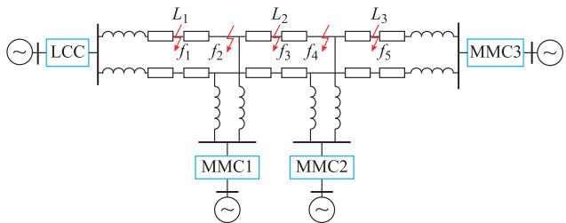
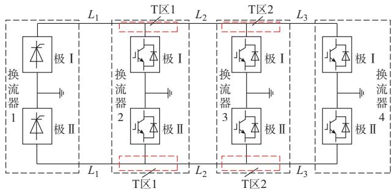
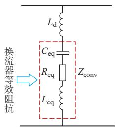
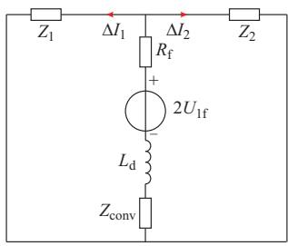
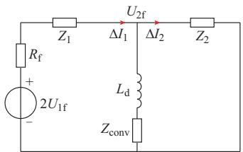
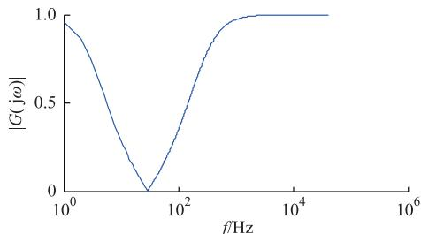
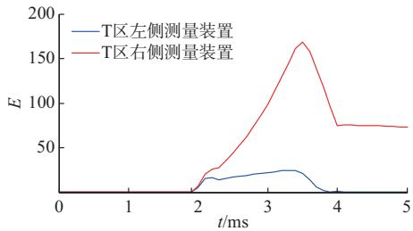
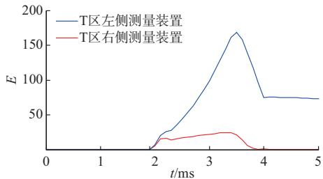
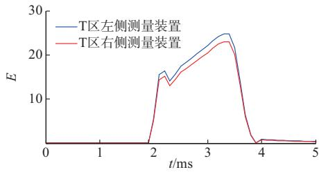

# 并联型多端混合高压直流线路故障区域判别方法

李海锋1,张 坤1,王 钢1,黄炟超1,李 明2,郭 铸2

华南理工大学电力学院 广东省广州市

直流输电技术国家重点实验室 南方电网科学研究院有限责任公司 广东省广州市

摘要:对于并联型多端混合高压直流输电系统,直流线路故障区域的判别对于最小限度地隔离故障从而提高直流系统的可用度具有重要意义。为此,针对并联型多端混合高压直流输电系统中换流站并联接入这一特有结构,分析了其对故障暂态行波的影响。研究表明,并联接入的换流器对中低频段的故障行波有大幅削减。因此,利用小波变换对暂态电流进行分析,提出了基于 区两侧暂态电流能量差的故障方向判别原理,进而利用各换流站故障方向信息确定故障区域。最后,建立了四端混合高压直流输电系统的 / 仿真模型,验证了所提方法的正确性和有效性。

关键词:多端混合直流;故障区域判别; 区;暂态电流能量

# 0 引言

近年来,直流输电技术在中国得到了迅速发展,但仍面临一些技术难题亟待解决 其中 多回直流的集中馈入容易引发多回直流系统换相失败 从而对交直流混合电网的安全稳定性造成严重影响 因此引起了业界的广泛关注 而多端混合直流输电技术则是解决上述问题的有效技术手段之一[1-3]。多端混合直流输电系统在送端采用传统的电网换相换流器 直流技术 而在受端则采用柔性直流技术 避免了换相失败问题 同时还可以向多个负荷中心送电 从而促进了送端能源的消纳 由于直流断路器的工程应用尚不成熟以及并联接入技术相对简单等原因 多端混合直流输电的多受端采用具有故障自清除能力的模块化多电平换流器 并联接入为主[1,4-6] 如南方电网计划于 年投运的特高压多端混合直流输电系统———乌东德送电广东广西直流输电工程[7]

直流架空线路是直流系统中故障概率最高的组成部分 因而直流线路保护显得尤为重要 实际上直流线路保护的配置与系统拓扑和其所采用的换流原理有关 对于传统的基于 的两端直流输电线路,其线路保护已较为成熟[8]。当保护检测出线路发生故障时 可通过整流侧的紧急移相 实现线路

弧道去游离和重启 若为永久性故障 则闭锁换流站 从而实现故障隔离

对于基于 的直流电网 其故障电流不可控 出于可靠性的要求 在直流线路两端应当都配有直流断路器,线路故障时要求保护装置能够有选择性地控制直流断路器快速动作 切除故障线路以保证系统剩余部分继续正常运行[9] 为此 一些基于直流断路器的故障线路判别方法被提出,如基于单端量的保护原理[10-13]、纵联保护原理[14]等。但这些保护均是利用了线路两端所具有的边界特性 如限流电抗器。

而对于并联型多端混合直流系统而言,直流线路故障时 由于不管故障发生在哪一段线路 其故障处理的方式都相同 即均是通过整流侧 的紧急移相 同时逆变侧 换流器闭锁或者主动控制故障电流 从而实现线路能量的释放和去游离 若为瞬时性故障则线路重启即可恢复[15]。在这种情况下 线路保护只需要检测出线路故障 而不需要定位故障线路 因此现有的行波保护即可满足要求 但若为永久性故障 则保护装置还必须可靠识别出具体的故障线路[16] 从而通过开关操作最小限度地隔离故障区域

由于并联型多端混合直流系统的不同线路之间直接相连 并没有如直流电网中直流线路两端的限流电抗器边界 因此基于 的直流电网故障定位原理[17-19]无法被直接应用 而采用基于纵联直流差动的原理 理论上可以有效定位故障线路[16,20]

但直流差动原理需要交换站间的同步电流信息 且当线路较长时,为了避免区外故障的误判,需要设定的延时也较长。若线路配置快速行波保护,则保护动作后,直流线路故障特征减弱,基于直流差动原理的判别方法将难以可靠定位故障线路 因此 如何在线路故障检测的基础上实现故障区域的准确快速判别是并联型多端混合直流线路保护亟须解决的问题之一。

为此 本文针对并联型多端混合直流输电系统中 区这一特有结构进行研究 从理论上分析线路故障时经过与未经过 区的暂态电流特性差异 在此基础上提出了一种基于 区两侧故障电流小波能量大小比较的快速故障方位识别原理 再综合各区故障方向信息锁定故障线路 此方法无需交换站间的同步电流信息 能够快速识别故障线路 进而与行波保护配合实现故障线路的快速隔离。最后,在 仿真平台上搭建四端混合直流输电系统模型,通过仿真算例验证所提出的线路故障区域识别方法的可行性

# 1 多端混合直流输电系统暂态分析模型

# 11 系统拓扑结构

不失一般性 本文以一个四端混合直流输电系统为例进行分析 如图 所示 图中 整流站采用换流器 两个逆变站均采用双极型具有故障穿越能力的 换流器 参考实际工程背景 每个换流站的线路侧均装设了平波电抗器[14] 各端逆变站采用并联的方式接入

  
图1 并联型四端混合直流输电系统结构  
Fig.1 Configurationofparallelfour-terminal hybridHVDCsystem

# 12 T区等值模型

对于并联型四端混合直流输电线路而言 其与传统直流输电线路相比 最大的结构差异是线路存在 区 如图 所示

由于直流线路故障时 换流器提供的故障电流发展很快 因此要求其保护系统能在很短的时间内检测出故障,进而闭锁 换流器或者进

行电流主动控制 从而实现故障穿越 所以对于故障行波暂态分析和相关保护原理研究,均只需考虑闭锁前的阶段 也就是电容放电占据主导的阶段[21-23] 此时 换流器可以等效成一个串联阻抗[24] 如图 所示 图中 $Z _ { \mathrm { c o n v } }$ 为换流器等值阻 抗; $R _ { \mathrm { { e q } } } , L _ { \mathrm { { e q } } } , C _ { \mathrm { { e q } } }$ 分 别 为 换 流 器 的 等 值 电阻 电感和电容 $L _ { \mathrm { ~ d ~ } }$ 为平波电抗器电抗值

  
图2 T区示意图

  
Fig.2 SchematicdiagramofTzone   
图3 T区故障等值模型  
Fig.3 EquivalentmodelofTzone

于是 区的等值阻抗为

$$
Z _ {\mathrm {e q}} = Z _ {\mathrm {c o n v}} + \mathrm {j} \omega L _ {\mathrm {d}} \tag {1}
$$

式中:ω 为角频率。

# 2 直流线路不同区域的故障特征分析

对于直流线路正负极线间所存在的电磁耦合关系 可以通过相模变换将其转变为相互独立的线模分量和零模分量进行分析 即

$$
\left[ \begin{array}{l} U _ {\mathrm {f 0}} \\ U _ {\mathrm {f l}} \end{array} \right] = \frac {1}{\sqrt {2}} \left[ \begin{array}{c c} 1 & 1 \\ 1 & - 1 \end{array} \right] \left[ \begin{array}{l} U _ {\mathrm {P f}} \\ U _ {\mathrm {N f}} \end{array} \right] \tag {2}
$$

式中 $: U _ { \mathrm { P f } }$ 和 $U _ { \mathrm { N f } }$ 分别为正极和负极的故障端口电压; $U _ { \mathrm { f l } }$ 和 $U _ { \mathrm { f 0 } }$ 分别为故障端口电压的线模量与地模量。

由于地模量参数不仅受频率的影响较大,而且在传播过程中 衰减比较严重[25] 此外 线模量在极间故障和接地故障均存在 而地模量则只存在于接地故障 利用线模量能够响应不同的故障类型 因此 本文只对线模量特性进行分析 进而利用其构成保护判据

# 21 T区内故障时的暂态电流特征

当 区内发生故障时 如图 中的 $f _ { 2 }$ 根据彼得逊等效法则和叠加定理 可以得出其故障分量等效电路如图 所示 图中 $R _ { \mathrm { ~ f ~ } }$ 为过渡电阻 $Z _ { \mathrm { ~ \scriptsize ~ . ~ } }$ 和 $Z _ { 2 }$ 分别为直流线路 $L _ { 1 }$ 和 $L _ { \textrm { 2 } }$ 的线模波阻抗; $U _ { \mathrm { 1 f } }$ 为故障点处附加的线模电压源 $\Delta I _ { 1 }$ 和 $\Delta I _ { 2 }$ 分别为经过区两侧的故障暂态电流线模分量 正方向取常规运行时的电流方向。

  
图4 T区内故障等效电路  
Fig.4 EquivalentcircuitoffaultsinTzone

可以得到 $\Delta I _ { 1 }$ 和 $\Delta I _ { \mathit { z } }$ 的关系为:

$$
\frac {\Delta I _ {2} (s)}{\Delta I _ {1} (s)} = - \frac {Z _ {1} (s)}{Z _ {2} (s)} \tag {3}
$$

式中 $Z _ { \mathrm { 1 } } \left( s \right)$ 和 $Z _ { 2 } \left( s \right)$ 分别为线路 $L _ { 1 }$ 和 $L _ { \textrm { 2 } }$ 的频域 线模波阻抗

一般情况下 由于线路 $L _ { 1 }$ 和线路 $L _ { \textrm { 2 } }$ 额定电流大小不同,故其线径有一定区别,靠近整流侧的线路$L _ { 1 }$ 线径较粗，所对应的波阻抗相对较小，但两者较为接近

以所搭建模型的直流线路为例 计算 时线路 $L _ { 1 }$ 线模波阻抗为 $Z _ { 1 } = 2 1 0 \ \Omega$ ,线路 $L _ { \textrm { 2 } }$ 线模波阻抗 $Z _ { 2 } = 2 4 0 \ \Omega$ 可以得到

$$
\frac {\Delta I _ {2} (s)}{\Delta I _ {1} (s)} = - 0. 8 7 5 \tag {4}
$$

所以,当 区内部故障时 $\Delta I$ 和 $\Delta I _ { : }$ 比较接近。

# 22 线路故障时的暂态电流特征

当直流线路发生故障时 同理可以得到其故障分量等效电路。由于对于 区而言,线路两侧的故障特征类似 下面不妨以图 中 区 左侧的 $f _ { 1 }$ 点故障为例进行分析 其故障分量等效电路如图所示。图中: $: U _ { \mathrm { 2 f } }$ 为线路 区线模电压。

  
图5 直流线路故障的等效电路  
Fig.5 EquivalentcircuitofDClinefault

此时 区两侧故障暂态电流分别为

$$
\Delta I _ {1} (s) = \frac {2 U _ {1 f} (s) - U _ {2 f} (s)}{Z _ {1} (s) + R _ {f}} \tag {5}
$$

$$
\Delta I _ {2} (s) = \frac {U _ {2 \mathrm {f}} (s)}{Z _ {2} (s)} \tag {6}
$$

则直流线路故障时 区非故障侧与故障侧的电流关系为:

$$
G (s) = \frac {\Delta I _ {2} (s)}{\Delta I _ {1} (s)} = \frac {Z _ {1} (s) + R _ {\mathrm {f}}}{Z _ {2} (s)} \frac {1}{\frac {2 U _ {1 \mathrm {f}} (s)}{U _ {2 \mathrm {f}} (s)} - 1} =
$$

$$
\frac {Z _ {3} (s)}{Z _ {3} (s) + Z _ {2} (s)} \tag {7}
$$

式中 $Z _ { 3 } \left( s \right)$ 为 区的等值阻抗 $Z _ { \textrm { 3 } } ( s ) = L _ { \textrm { d } } s \textrm { + }$ $Z _ { \mathrm { c o n v } } \left( s \right)$ ，其中 $Z _ { \mathrm { c o n v } } \left( s \right)$ 为换流器等值频域阻抗。

由式 $^ { ( 7 ) }$ 可知 线路故障时 区两侧电 流$\Delta I _ { 1 } ( s )$ 和 $\Delta I _ { 2 } \left( s \right)$ 大小不再接近 而是由线路故障时区的传递函数 $G ( s )$ )决定。

# 23 T区传递函数幅频特性

当假设直流线路无衰变 即其波阻抗为实数时式()可以简化为:

$$
\begin{array}{l} G (s) = 1 - \frac {Z _ {2}}{Z _ {3} (s) + Z _ {2}} = \\ 1 - \frac {Z _ {2}}{s \left(L _ {\mathrm {e q}} + L _ {\mathrm {d}}\right) + \frac {C _ {\mathrm {e q}}}{s} + R _ {\mathrm {e q}} + Z _ {2}} \tag {8} \\ \end{array}
$$

令 $s = \mathrm { j } \omega$ ,根据不等式性质易知 $G ( \mathrm { j } \omega )$ )存在最小值,从而可知 $G ( \mathrm { j } \omega )$ )具有带阻特性。为了定量分析其特性 根据所搭建的多端混合直流系统参数 将换流器等值电抗代入式 计算出具体的等值参数进而可得到其幅频特性如图 所示。

  
图6 T区传递函数幅频特性  
Fig.6 Magnitude-frequencycharacteristics oftransferfunctionofTzone

由图 可见 $G ( s )$ 在直流和高频段基本没有衰减 即 $\Delta I _ { 1 } ( s )$ 和 $\Delta I _ { 2 } \left( s \right)$ 近似相等 而在中低频段则迅速减少,此时 $\Delta I _ { 1 } ( s )$ )和 $\Delta I _ { 2 } \left( s \right)$ )将有很大差异,即区故障侧线路的暂态电流将远大于非故障侧线路的暂态电流 利用这一特性即可从单个 区的角度判断故障方向 进而利用多个 区的故障方向综合判定故障区段。

# 24 换流器等值参数对传递函数幅频特性的影响

由式 可看出 区的传递函数受多个参数影响 包括换流器等值电阻 $R _ { \mathrm { { e q } } }$ 等值电感 $L _ { \mathrm { e q } }$ 等值电容 $C _ { \mathrm { e q } }$ 和平波电抗 $L _ { \mathrm { ~ d ~ } }$ 下面逐一对各影响因素进行分析。

换流器等效电感 $L _ { \mathrm { e q } } = 2 L _ { \mathrm { 0 } } / 3$ 其大小取决于换流器桥臂电感 $L _ { \mathrm { ~ 0 ~ } }$ 所以 区的等值电感由平波电抗 $L _ { \mathrm { ~ d ~ } }$ 和桥臂电感共同决定; 区等值电容 $C _ { \mathrm { { e q } } } =$ $6 C _ { 0 } / N$ 由子模块电容 $C _ { 0 }$ 和子模块数 N 共同决定 区等值电阻 $R _ { \mathrm { e q } } = 2 R _ { \mathrm { a r m } } / 3$ 由桥臂等效电阻$R _ { \mathrm { a r m } }$ 决定。然而，不同工程所对应的参数均有所不同 但其参数均在一定范围之内 为了定量分析其特性 不妨先假设 T 区等值阻抗两个量已知 讨论另一参数变化对传递函数特性的影响

参考现有工程 子模块电容值一般在 以内 子模块个数在 以内 所以等效电容变化范围可以考虑在 之间变化 平波电抗值在之间 桥臂电抗在 左右 所以等值电感考虑其在 之间变化 桥臂电阻通常在 左右 所以考虑等值电阻在之间变化。

假设 $L _ { \mathrm { { e q } } } + L _ { \mathrm { { d } } } = 0 . 2 \ \mathrm { H } , R _ { \mathrm { { e q } } } = 0 . 2 \ \Omega$ 得到传递函数随等值电容与频率变化的幅频特性如附录图 所示 可知 区的传递函数总体对中低频带呈现带阻特性 且随着电容值的增加 其对低频的削减越严重 同时阻带带宽增大 中心频率减小

同理,假设 $C _ { \mathrm { e q } } = 0 . 3 \ \mathrm { m F } , R _ { \mathrm { e q } } = 0 . 2 \ \Omega$ ,得到传递函数随等值电感与频率变化的幅频特性如附录图 所示;假设 $L _ { \mathrm { e q } } + L _ { \mathrm { d } } = 0 . 2$ , $C _ { \mathrm { e q } } { = } 0 . 3 ~ \mathrm { m F }$ ,得到传递函数随等值电容与频率变化的幅频特性如附录 图 所示 可知 随着电感与电阻的改变 传递函数的幅频特性对中低频带的带阻特性依旧存在 随着电感的增大 阻带带宽范围减小 中心频率减小 随着电阻的变化 其幅频特性无明显变化

综上所述 区域的传递函数在中低频的频带上呈现明显的带阻特性 等值电容与等值电感会对其带阻特性的中心频率和阻带带宽有一定影响 但不会影响其本质特征 而等值电阻则无明显影响 由此可见 利用该特性对于不同的工程具有较好的普适性

# 3 故障区域识别原理

# 启动判据

根据实际工程的需要 区两侧线路均安装了电流互感器。当线路发生故障时, 区两侧直流线路电流都将发生突变

为提高灵敏性可以取变化大的一侧作为启动判据 具体公式如下

$$
\max  \left(\Delta I _ {j}\right) > \Delta_ {\text {s e t} 1} \quad j = \mathrm {L}, \mathrm {R} \tag {9}
$$

式中 $\Delta I _ { j }$ 为在 区左右两侧电流 $I _ { \mathrm { ~ L ~ } }$ 和 $I _ { \mathrm { ~ R ~ } }$ 线模突变量的幅值 $; \Delta _ { \mathrm { s e t 1 } }$ 为启动定值 与线路稳定运行电流$I _ { \mathrm { \Pi  r e f } }$ 相关，以适应不同的运行方式。为防止采样值抖动而导致保护频繁误启动 当 $\Delta I _ { j }$ 连续 个点大于$\varDelta _ { \mathrm { { s e t } 1 } }$ 时，保护启动判据动作。

由于在扰动 包括各种区内外故障 发生后 本文所提出的故障区域识别方法是与线路保护相配合 只有在线路保护动作的前提下 故障区域的判别结果才有效,因此误动不会对本文方法造成实质影响 其更关注的是拒动问题 即启动的灵敏性 对于电流变化量启动判据而言 躲过正常运行时直流线路电流的波动是其最灵敏的整定原则。由于平波电抗器的存在以及 输电波形质量好的特点 正常直流电流的波动较小,可以设置为 $\Delta _ { \mathrm { s e t 1 } } = 0 . 1 I _ { \mathrm { r e f } }$ (标幺值)。

# 32 故障方向识别判据

通过 节分析 经过 区的故障电流行波的中低频能量会被大幅削减。为此,利用 区线路两侧电流互感器得到的中低频带能量的含量差值作为指标适用于故障方向的判别

由于小波变换适合于处理非平稳 非周期信号能很好地反映信号突变处的特性 因此 本文利用小波变换对线模电流变化量进行处理 进而构成识别判据。

首先 根据 区传递函数幅频特性确定中低频带所对应的小波变换的层数 J

然后 在给定的数据窗内 对 区两侧的暂态电流进行小波变换,并计算其第 J 层小波能量 $E _ { \scriptscriptstyle \mathrm { L J } }$ 与 $E _ { \mathrm { R } J }$ 具体计算公式为

$$
E _ {j J} = \sum \left(d _ {J} (n)\right) ^ {2} \quad j = \mathrm {L}, \mathrm {R} \tag {10}
$$

式中 $: d _ { J }$ 为线模电流变化量小波变换后第 J 层的细节系数。

在此基础上 定义标准能量差为

$$
\Delta E _ {J} = \frac {E _ {\mathrm {L J}} - E _ {\mathrm {R J}}}{\max \left(E _ {\mathrm {L J}} , E _ {\mathrm {R J}}\right)} \tag {11}
$$

式中: $: \operatorname* { m a x } ( E _ { \mathrm { L } J } , E _ { \mathrm { R } J } )$ )为取两侧能量的最大值,作比来消除过渡电阻的影响

于是 可得到直流线路故障区域的识别判据如下式所示:

$$
\left\{ \begin{array}{l l} \left| \Delta E _ {J} \right| > \Delta_ {\text {s e t 2}}, \Delta E _ {J} > 0 & \text {故 障 发 生 在 T 区 左 侧} \\ \left| \Delta E _ {J} \right| > \Delta_ {\text {s e t 2}}, \Delta E _ {J} <   0 & \text {故 障 发 生 在 T 区 右 侧} \\ \left| \Delta E _ {J} \right| <   \Delta_ {\text {s e t 2}} & \text {故 障 发 生 在 T 接 区 域} \end{array} \right. \tag {12}
$$

式中: $\cdot \varDelta _ { \mathrm { s e t 2 } }$ 的选取要大于 区故障时标准能量差的最大值 $\Delta E _ { \mathrm { T / \thinspace \mathrm { , m a x } } }$ ,而小于 区两侧线路故障时标准能量差的最小值 $\Delta E _ { \mathrm { X } J , \operatorname* { m i n } }$ 即可取为

$$
\Delta_ {\text {s e t 2}} = 0. 5 \left(\Delta E _ {\mathrm {T} J, \max } + \Delta E _ {\mathrm {X} J, \min }\right) \tag {13}
$$

在实际应用时 由于 区母线上故障所对应的标准能量差较小 且远小于两侧故障时的标准能量差,因此 $\Delta E _ { \mathrm { T } J , \operatorname* { m a x } }$ 可以近似取为零;而 区两侧故障时的标准能量差的最小值 $\Delta E _ { \mathrm { X } J , \operatorname* { m i n } }$ 则可以根据 区传递函数的幅频特性以及所采用的频带进行估算

# 33 故障区域定位算法

对于只存在一个 区的三端直流系统而言 如乌东德直流工程 由于只有一个 接换流站 上述方法已经可以直接区分故障区域 而对于三端以上的多端混合直流线路 由于存在两个以上的 区则需要结合多个 区的故障方向判别结果进行故障线路的判定 其原理类似于方向纵联保护 具体方法如下

对于有 h 个 接换流站的系统 当故障发生时 令各 区故障方向元件对应于左端 母线上和右端故障的输出 $D _ { \textup { T } _ { j } }$ 分别为 其中不妨假定 $D _ { \mathrm { T } _ { 0 } } = - 1 , D _ { \mathrm { T } _ { h + 1 } } = 1$ 分别对应第1个换流站和最后一个换流站的虚拟方向元件输出

则纵联各换流站故障方向信息 得到故障区段判别结果为: 若有 $D _ { \mathbb { T } _ { i } } = 0 ( j = 1 , 2 , \cdots , h )$ ),则故障发 生 在 第 j 个 T 区 内;② 若 有 $D _ { \mathrm { { T } } _ { j } } \ D _ { \mathrm { { T } } _ { j + 1 } } =$ $1 ( j = 0 , 1 , \cdots , h )$ 则故障发生在第j 和第j 个换流站之间的线路上。

# 4 仿真验证

在 中搭建了如图 所示的四端混合直流输电系统进行仿真测试 该四端混合直流输电系统为双极接线方式 换流站均接地 系统额定 直 流 电 压 为 额 定 输 送 功 率 为8 000 MW,其中MMC1站接收200O MW,MMC2站接收2000MW,MMC3站接收4000MW。LCC换流站采用定直流电流控制 和 换流站采用定功率控制 换流站采用定电压控制 平波电抗取值为 直流线路采用频变参数模型,线路总长为 ,其中线路 $L _ { \textrm { 1 } } , L _ { \textrm { 2 } }$ 和 $L _ { 3 }$ 长度均为

本文保护采样率为 取 数据窗长度进行判据计算 小波函数采用 小波 取 尺度下能量差进行计算 对应的频带为78.125 0 Hz。

在线路 $L _ { 2 }$ 中点正极设置单极接地金属性故障 选择 作为冗余数据窗 计算出 区 和

区 的两侧故障电流暂态能量分别如图 和图 所示 可以看出 故障发生于线路 L 时 两侧的 区均对 层小波能量有明显的削减 同一个 区两侧的暂态电流能量差异明显 可以准确地显示故障方位信息。

  
图 区 测量故障暂态能量

  
Fig.7 MeasuredfaulttransientenergyofTzone1   
图 区 测量故障暂态能量  
Fig.8 MeasuredfaulttransientenergyofTzone2

在 区 母线正极设置单极接地金属性故障选择 作为冗余数据窗,计算出 区 两侧故障电流暂态能量 如图 所示 可以看出 故障发生在 区时 两侧的暂态电流能量近似相等 同时该计算方法并不需要获取准确的波头到达信息 故障后 内暂态电流能量均有明显差异

  
图 区故障暂态能量  
Fig.9 FaulttransientenergyofTzone

应用 仿真软件对所提故障区域识别方法进行了大量仿真 在常规的双极大地回线运行下 分别考虑各条线路 个位置 线路中点线路始端 线路末端 以 换流站方向为始端方向 每个位置故障类型考虑了金属性 过渡电阻和 的单极接地故障以及线路中点金属性和 极间故障;在双极/大地回线共存运行方式 见图 换流站 的极 闭锁 极 单极大地回

线运行 同时换流站 均双极大地回线运行下 在线路 L 中点考虑了金属性 过渡电阻和 的单极接地故障 种情况 取启动定值$\Delta _ { \mathrm { s e t 1 } } = 0 . 1$ ，故障区域识别定值 $\Delta _ { \mathrm { s e t 2 } } = 0 . 3 7 5$ 。仿真实验结果如附录 表 所示

可以看出 所提故障区域识别方法对高阻接地故障具有足够的灵敏性 在线路中点 线路始端和线路末端经过 过渡电阻接地故障时 暂态电流能量也可以保证远大于整定值 而 区发生不同过渡电阻单极故障时 暂态电流能量都远小于整定值 同时 在双极 大地回线共存运行方式下 仍然能正确判别故障区域

以上结果表明 该方法可以准确区分故障发生所在区域 动作快速可靠 不受系统运行方式的影响 灵敏度高 另外 本方法所用的中低频带远低于雷电波能量频带,不易受雷电干扰。

# 5 结语

多端混合直流输电系统是目前直流输电的发展趋势之一,而有效的直流线路故障区域判别方法是提供其运行可靠性和可用度的重要保障 本文针对并联型多端混合直流输电系统 提出基于 区两侧暂态电流能量差值的直流线路故障方向判别原理,该原理利用 区对故障暂态电流中低频分量的削减作用 通过小波变换提取 区两侧故障暂态电流能量差异 从而实现故障方位的快速 可靠识别 进而综合各 区的故障方向信息实现故障区域判定该方法具有以下优点。

动作速度快 能与行波保护相配合实现故障线路的快速隔离。  
能适用于直流系统不同的运行方式 且具有较强的抗过渡电阻能力  
应用于三端系统 如在建的乌东德三端直流系统 时无需站间通信 而对于四端及以上的系统则只需传递 接换流站的故障方向信息 对通信要求低 且不需要站间的同步  
所需采样频率较低 可基于现有高压 特高压直流工程的控制保护平台实现

因此 本文所提出的判别方法对于实际多端直流输电工程线路保护具有一定的理论和实用参考价值 然而 对于其在故障识别后的处理策略尚未考虑 后续将进一步研究多端混合直流线路的故障隔离与恢复策略

附录见本刊网络版 ( :/// / / )。

# 参 考 文 献

汤广福 罗湘 魏晓光 多端直流输电与直流电网技术 中国电机工程学报，2013，33(10)：8-17.  
TANG Guangfu，LUO Xiang，WEI Xiaoguang.Multi-terminal HVDC and DC-grid technology[J].Proceedings of the CSEE, 2013，33(10)：8-17.   
黄伟煌 饶宏 黄莹 等 一种基于常规直流输电系统的混合直流改造方案 中国电机工程学报  
HUANG Weihuang，RAO Hong，HUANG Ying，et al.A novel refurbishment scheme for reforming the existing LCC HVDC to hybrid HVDC[J].Proceedings of the CSEE，2017, ( ):   
许烽 宣晓华 江道灼 等 常规直流输电系统改造用的混合直流输电技术[J].电网技术，2017，41(10)：3209-3216.  
XU Feng，XUAN Xiaohua，JIANG Daozhuo，et al.Study on hybrid HVDC transmission technology used for the upgrading of conventional HVDC transmission system[J].Power System Technology，2017，41(10)：3209-3216.   
姚良忠 吴婧 王志冰 等 未来高压直流电网发展形态分析中国电机工程学报，2014，34(34)：6007-6020  
YAO Liangzhong，WU Jing，WANG Zhibing，et al.Pattern analysis of future HVDC grid development[J].Proceedings of , , ( ):   
徐政 胡永瑞 傅闯 并联型多端直流输电系统的控制策略与故障特征[J].高电压技术，2013，39(11)；2721-2729.  
XU Zheng，HU Yongrui，FU Chuang. Control strategy and fault characteristics of parallel MTDC transmission systems[J]. High Voltage Engineering，2013，39(11)：2721-2729.   
雷霄 王华伟 曾南超 等 并联型多端高压直流输电系统的控制与保护策略及仿真 电网技术  
LEI Xiao，WANG Huawei，ZENG Nanchao，et al.Control and protection strategies for parallel multi-terminal HVDC power transmission system and their simulation[J].Power System Technology，2012，36(2)：244-249.   
饶宏 洪潮 周保荣 等 乌东德特高压多端直流工程受端采用柔性直流对多直流集中馈入问题的改善作用研究 南方电网技术, , ():  
RAO Hong，HONG Chao，ZHOU Baorong，et al.Study onimprovement of VSC-HVDC at inverter side of Wudongde multiterminal UHVDC for the problem of centralized multi-infeedHVDC[J].Southern Power System Technology，2017，11(3)：  
宋国兵 高淑萍 蔡新雷 等 高压直流输电线路继电保护技术综述[J],电力系统自动化，2012,36(22)：123-129.  
SONG Guobing，GAO Shuping，CAI Xinlei，et al. Survey of relay protection technology for HVDC transmission lines[J]. Automation of Electric Power Systems， 20l2， 36(22): 123-129.   
董新洲 汤兰西 施慎行 等 柔性直流输电网线路保护配置方案[J].电网技术，2018，42(6)：1752-1759.  
DONG Xinzhou， TANG Lanxi， SHI Shenxing， et al.Configuration scheme of transmission line protection for flexibleHVDC grid[J]．Power System Technology，2018，42(6)：

1752-1759.   
王艳婷 张保会 范新凯 柔性直流电网架空线路快速保护方案[J].电力系统自动化，2016，40（21)：13-19.DOI：10.7500/AEPS20160612007.  
WANG Yanting， ZHANG Baohui， FAN Xinkai. Fast protection scheme for overhead transmission lines of VSCbased HVDC grid[J].Automation of Electric Power Systems, , ( ): : /   
[11]LIU J，TAI N，FAN C. Transient-voltage based protectionscheme for DC line faults in multi-terminal VSC-HVDC system[J]．IEEE Transactions on Power Delivery，2017，32（3）：1483-1494.  
[12]TZELEPISD，DYSKO A，FUSIEKG，et al.Single-endeddifferential protection in MTDC networks using optical sensors[J].IEEE Transactions on Power Delivery，20l7，32（3）：1605-1615.  
周家培 赵成勇 李承昱 等 基于直流电抗器电压的多端柔性直流电网边界保护方案 电力系统自动化89-94.DOI:10.7500/AEPS20170331005.  
ZHOU Jiapei， ZHAO Chengyong，LI Chengyu，et alBoundary protection scheme for multi-terminal flexible DC gridbased on voltage of DC reactor[J].Automation of ElectricPower Systems， 2017， 41(19)： 89-94．DOI： 10.7500/AEPS20170331005.  
何佳伟 李斌 李晔 等 多端柔性直流电网快速方向纵联保护方案[I].中国电机工程学报，2017，37（23)：6878-6887,  
HE Jiawei，LI Bin，LI Ye，et al.A fast directional pilot protection scheme for the MMC-based MTDC grid[J]. Proceedings of the CSEE，2017，37(23)：6878-6887.   
周煜智 徐政 唐庚 三种 直流故障处理方法下电力系统暂态稳定性分析 中国电机工程学报1621-1627.  
ZHOU Yuzhi，XU Zheng，TANG Geng. Analysis of power system transient stability characteristics under three different DC line fault clearance solutions of MMC-HVDC systems[J]. Proceedings of the CSEE，2015，35(7)：1621-1627.   
王俊生 傅闯 胡铭 等 并联型多端直流输电系统保护相关问题探讨[J.中国电机工程学报，2014，34(28)：4923-4931.  
WANG Junsheng，FU Chuang，HU Ming，et al.Discussion on the protection in parallel-type multi-terminal HVDC systems [] , , ( ):   
[17] LI Rui，XU Lie，YAO Liangzhong.DC fault detection and location in meshed multiterminal HVDC systems based on DC reactor voltage change rate[J].IEEE Transactions on Power Delivery，2017，32(3)：1516-1526.   
[18] SNEATH J， RAJAPAKSE A D. Fault detection and interruption in an earthed HVDC grid using ROCOV and hybrid DC breakers[J].IEEE Transactions on Power Delivery, 2016，31(3)：973-981.   
张明 和敬涵 罗国敏 等 基于本地信息的多端柔性直流电网故障定位方法 电力自动化设备  
ZHANG Ming，HE Jinghan，LUO Guomin，et al. Local

information-based fault location method for multi-terminal flexible DC grid[J].Electric Power Automation Equipment, 2018，38(3)：1-6.   
孙刚 时伯年 赵宇明 等 基于 的柔性直流配电网故障定位及保护配置研究 电力系统保护与控制127-133.  
SUNGang，SHI Bonian，ZHAO Yuming，et al.Research on the fault location method and protection configuration strategy of MMC based DC distribution grid[J].Power System Protection and Control，2015，43(22)：127-133.   
徐政 薛英林 张哲任 大容量架空线柔性直流输电关键技术及前景展望 中国电机工程学报  
XU Zheng，XUE Yinglin，ZHANG Zheren.VSC-HVDCtechnology suitable for bulk power overhead line transmission[J].Proceedings of the CSEE，2014，34(29)：5051-5062.  
[ ]王姗姗,周孝信,汤广福 模块化多电平换流器 直流双极短路子模块过电流分析 中国电机工程学报  
WANG Shanshan，ZHOU Xiaoxin，TANG Guangfu，et al. Analysis of submodule overcurrent caused by DC pole-to-pole fault in modular multilevel converter HVDC system [J]. Proceedings of the CSEE，2010，31(1)：1-7.   
罗永捷 李耀华 李子欣 等 全桥型 直流短路故障穿越控制保护策略 中国电机工程学报1933-1943.  
LUOYongjie，LI Yaohua，LI Zixin，et al.DC short-circuitfault ride-through control strategy of full-bridge MMC-HVDCsystems[J]．Proceedings of the CSEE，2016，36(7)：1933-1943.  
「24]LETERMEW，HERTEM D V.Reduced modular multilevel converter model to evaluate fault transients in DC grids[C]// IET International Conference on Developments in Power System Protection，March 31-April 3，2014，Copenhagen, Denmark：12-25.   
覃剑 陈祥训 郑健超 行波在输电线上传播的色散研究 中国电机工程学报，1999，19(9)：27-30.  
QIN Jian，CHEN Xiangxun，ZHENG Jianchao. Study ondispersion of travelling wave in transmission line [J]Proceedings of the CSEE，1999，19(9)：27-30.

(编辑 章黎)

(下转第 页 )

# FaultAreaDiscriminationMethodforParallelMulti-terminalHybridHVDCLine

1 ZHANG Kun1 WANG Gang1 HUANG Dachao1 LI Ming2 GUO Zhu2

(1. School of Electric Power，South China University of Technology，Guangzhou 5l0641,China;   
2.State Key Laboratory of HVDC(Electric Power Research Institute of China Southern Power Grid Company Limited)，Guangzhou 510663，China)

Abstract:Fortheparalelmulti-terminalhybrid HVDCtransmisionsystem，thediscriminationofDClinefaultareaisof great significance to minimize theisolationoffaultand improve theavailabityof DC system.In view of theunique structureof paralelconnectionofconverterstations intheprallmulti-terminal HVDC transmissionsystems，theinfluenceontransient travelin wavesisanalzed Theresearchshowsthatthe arallelconnectionconverterhas reatl reducedthefaulttravelin waveinthemiddleandlowfreuenc band Therefore thewavelettransformisusedtoanalzethetransientcurrent andthe faultdirectiondiscrimination rincilebasedontheener differenceoftransientcurrentonbothsidesoftheTzoneis proposed,andthefaultareais determined bythefault direction informationof eachconverterstation.Finaly，the PSCAD/ EMTDCsimulation modelof four-terminal hybrid HVDC transmission system is establishedtoverifythecorrectness and effectiveness of the proposed method.

Thisworkissu ortedb NationalNaturalScienceFoundationofChina No 51577072

Keywords multi-terminalhbridDC faultareadiscrimination Tzone transientcurrentener