# An Enhanced Average Value Model of Modular Multilevel Converter for Accurate Representation of Converter Blocking Operation

Xuekun Meng1 , Student Member, IEEE, Jintao Han1 , Student Member, IEEE, Joel Pfannschmidt1 , Liwei Wang1 , Member, IEEE, Wei Li2 , Member, IEEE, Jean Belanger 2 , Senior Member, IEEE

1. The University of British Columbia Okanagan, BC, Canada, liwei.wang@ubc.ca   
2. OPAL-RT Technologies, QC, Canada, wei.li@opal-rt.com

Abstract—Modular Multilevel Converter (MMC) has demonstrated significant advantage in harmonic elimination and improved converter efficiency due to the use of large number of submodules and low switching frequency of the submodules. However, the massive switching events of the Insulated-Gate Bipolar Transistors (IGBTs) in the MMC have also introduced high computational burden when modelling the MMC in electromagnetic transient tools. Various research efforts have dedicated to developing the numerically efficient average value models (AVMs) for the MMC. This paper gives an overview of the existing control signal based AVMs of the MMC and proposes an enhanced average value model with arm current initialization method to compensate for the initial condition issue in the previously developed AVMs. The proposed approach is evaluated in a point-to-point MMC HVDC system under Simulink/eMEGAsim environment.

Index Terms—Average value model, electromagnetic transient, high voltage direct current system, modular multilevel converter.

# I. INTRODUCTION

he development of Modular Multilevel Converter High T Voltage Direction Current (MMC-HVDC) system enables the interconnection between the existing AC power transmission grids and the remote renewable power plants with low harmonic distortion and reduced converter losses [1]. It utilizes a series of individual submodules; each can be inserted or bypassed to produce the nearly perfect-sinusoidal waveforms at the point of common coupling to the AC grids. However, the modelling the MMC in the Electromagnetic Transient (EMT) type tools is challenging due to the massive switching operations presented in the MMC. The fast and simultaneous switching events have to be modelled using micro-second time step to accurately account for the non-linear phenomenon in the power electronic components, including the Insulated-Gate Bipolar Transistors (IGBTs). The switching-based model can provide the most detailed representation of the behavior of MMC since each converter component is explicitly modelled and solved in a large matrix. However, the model with detailed semiconductor switching representation has also introduced tremendous computational burden for the dynamic simulation of the interconnected AC and HVDC systems. Therefore, developing a numerically efficient model for the MMC in EMT-type tools is essential for improving the overall simulation performance of the integrated power grids while maintaining the accurate representation of the MMC.

Switching-function-based Average Value Models (AVMs) are proposed in [2]–[4] to simplify the individual switching of IGBTs in the submodules. The submodule capacitors in the

MMC arms are lumped into equivalent arm capacitors. This simplification adapts the insersion indices from the modulation controller to predict the equivalent arm capacitances and corresponding arm voltages at each simulation time step. Arm voltage behavior, including arm voltage ripples and circulating current, can be accurately represented with improved simulation efficiency compared to the detailed switching-based MMC model. However, the use of switching function in the AVMs requires converter modulation controllers and may increase the complexity of the AVMs for different MMC topologies (e.g. full-bridge MMC, clamped-double submodule MMC [5], and alternate arm converter [6]).

A control-signal-based AVM is proposed in [7], where the switching operation in the submodules and the converter modulation are not required. The model uses six controlled voltage sources and a controlled current source to represent the fundamental frequency behavior of the converter as seen from the AC and DC sides of the MMC. The direct application of the reference signals in the AVMs enables simple model structure for various MMC topologies. The reference [8] further extends the concept in [7] and simplifies the voltage sources in the upper and lower arms into a three-phase Thevenin equivalent circuit. The model is very efficient and allows for straightforward implementation in various EMT-type software packages. However, the AVMs in [7] and [8] are insufficient to model the blocking mode operation of the MMC due to the lack of freewheeling diode representation. Several improved AVMs are proposed in [9] using the concept of Blocking Module (BM) to establish the connection between the AC and DC side during the converter blocking operations. The AVMs with BM improve the modeling accuracy for the blocking mode operations, however, increase their implementation complexity in EMT-type software packages.

This paper proposes an enhanced AVM (EAVM) of the MMC based on the state-of-the-art control-signal-enabled AVMs. The proposed EAVM features easy model implementation and improved modeling accuracy for EMTtype software tools. The proposed EAVM uses controlled current sources for the arm inductors in the BM to initialize the arm inductor currents at converter blocking instant. The current initializing method is used to compensate for the DC current discontinuity issue during the transition between normal operation and blocking mode of the AVMs with BM. The proposed method is validated using the detailed switchingbased model and the previously developed AVMs in a pointpoint HVDC system under Simulink/eMEGAsim platform [10].

# II. BASIC OPERATION OF MMC

The three-phase MMC circuit configuration is illustrated in Fig. 1a. Each phase includes an upper arm and a lower arm, which is composed of ???? numbers of submodules. The number of submodules depends on both DC-side voltage and the submodule voltage rating. An arm inductor is used in each arm to limit the circulating current and the fault current flowing in the converter. The arm resistors are used to represents the onstate resistance of the IGBTs.

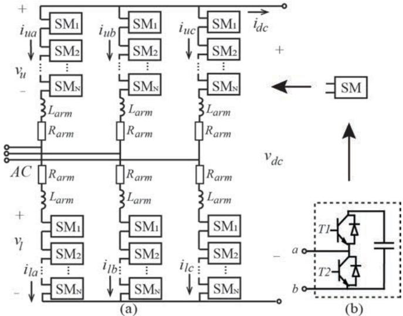  
Fig.1 MMC circuit configuration: (a) MMC circuit topology; (b) Half-bridge submodule.

For the half-bridge submodule shown in Fig. 1b, there are three operating modes: insert, bypass and blocking modes. Submodule capacitor is inserted when the upper IGBT (T1) is closed, and the lower IGBT (T2) is opened. The submodule capacitor is bypassed if T1 is opened and T2 is closed. When the two gate pulses T1 and T2 are blocked, the submodule capacitor is connected to a pair of free-wheeling diodes. The gate pulses are blocked during converter energizing operation or in the occurrence of DC side faults to protect the IGBTs from over current failure.

During normal operation, the gating signals for the individual submodules are established by the control system including inner current loop, outer power loop, modulation, submodule capacitor voltage balancing, and converter arm circulating current suppression controllers. Converter modulation controls [11], [12] generate switching signals based on the reference voltages produced by the converter inner current control loop. The stair-case sinusoidal waveform can be created with a sufficient number of submodules by inserting or passing the individual submodule capacitors in converter arms. Fig. 2 shows the switching and reference arm voltages and the AC voltages produced by an MMC with ten submodules per arm, i.e., N = 10 .

The submodule capacitors can be charged or discharged depending on the insertion status of the submodule capacitors and the direction of the arm current. Each submodule is subjected to its own switching signal and can be charged to different voltage levels than others. The difference in submodule voltages may cause large voltage ripples for the MMC during normal operation and should be precisely controlled. Voltage balancing controller is proposed in [1], [11]–[14] to reduce the differences among the submodule

voltages by sorting the submodule capacitor voltages. Additionally, submodule voltage ripples can produce circulating currents in the converter arms in the form of secondorder harmonic. Circulating current controller [13] can also be developed to suppress the second-order harmonics.

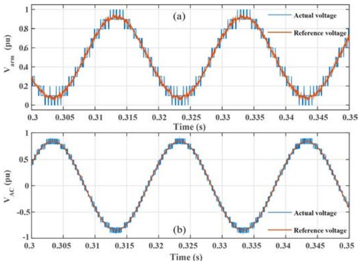  
Fig.2 Comparison of actual and reference voltage waveforms. (a) Arm voltage (b) AC-side voltage.

# III. PREVIOUS AND PROPOSED AVMS

Individual IGBT switching in the submodules of MMC can be ignored which leads to numerically efficient MMC models, i.e. AVMs, [7]-[9]. Since the AVMs [7]-[9] use control signals without IGBT switching of the converter arms, the submodule capacitor voltage balancing and converter arm circulating current suppression controllers are not required in AVMs. This section introduces several state-of-the-art AVMs of MMC. The advantage and disadvantage of each model is discussed. An enhanced AVM is proposed in the section which improves the simulation accuracy and simplify model structure compared to the available AVMs of MMC.

# A. Standard AVM (SAVM)

In the standard AVM (SAVM) [7], [8], the dynamic behavior of the MMC, as seen from the AC and DC terminals can be represented by the AC- and DC-side equivalents as shown in Fig. 3. The controlled voltage and current sources in SAVM are determined from the MMC’s internal current and power control loops.

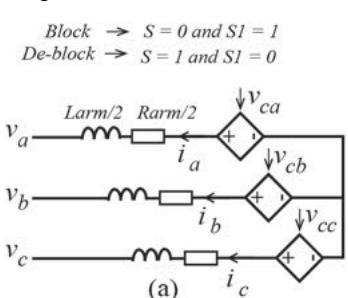

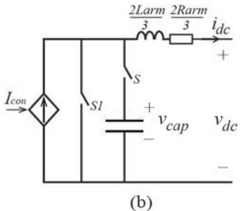  
Fig.3 Circuit topology for SAVM

The relation between the AC terminal voltage and the upper and lower arm voltages, shown in Fig. 2a, is expressed as [14]

$$
\frac {v _ {d c}}{2} - v _ {u _ {j}} - R _ {a r m} i _ {u _ {j}} - L _ {a r m} \frac {d i _ {u _ {j}}}{d t _ {\cdot}} = v _ {j} \tag {1}
$$

$$
- \frac {v _ {d c}}{2} + v _ {l j} + R _ {a r m} i _ {l j} + L _ {a r m} \frac {a l _ {j}}{d t} = v _ {j} \tag {2}
$$

where $v _ { j }$ is the per phase $( j = a , b , c )$ voltage seen from the AC side. Adding (1) and (2) gives the state-space equation of the AC output current $i _ { j }$ as

$$
\frac {L _ {\text {a r m}}}{2} \frac {d i _ {j}}{d t} = v _ {c j} - v _ {j} - \frac {R _ {\text {a r m}}}{2} i _ {j} \tag {3}
$$

$$
v _ {c j} = \frac {- v _ {u _ {j}} + v _ {l _ {j}}}{2} \tag {4}
$$

where $i _ { j }$ is the per-phase current flowing into the AC-side and $v _ { c j }$ is a mid-point virtual output voltage defined in [15]. It should be notice that the $v _ { c _ { j } }$ in (3) can be replaced by the reference voltage $v _ { r e f _ { j } }$ from the outer-loop controller as

$$
\frac {L _ {\text {a r m}}}{2} \frac {d i j}{d t} = v _ {\text {r e f} j} - v _ {j} - \frac {R _ {\text {a r m}}}{2} i _ {j} \tag {5}
$$

$$
v _ {r e f _ {j}} = e _ {r e f _ {j}} \frac {v _ {d c}}{2} \tag {6}
$$

where $e _ { r e f _ { j } }$ is the per unit value of the reference signals. Based on (6), the behavior of MMC as seen from the AC side can be represented by a Thevenin equivalent circuit, as illustrated in Fig. 3a.

The DC-side circuit, shown in Fig. 3b, is derived based on the power balance as [7]

$$
P _ {a c} = P _ {d c} \tag {7}
$$

$$
\sum_ {j = a, b, c} v _ {r e f j} i _ {j} = v _ {d c} i _ {d c} \tag {8}
$$

Substitute (6), the current input can be calculated for the controlled current source input at the DC side as [7]

$$
I _ {c o n} = \frac {\sum_ {j = a , b , c} v _ {r e f j} i _ {j}}{v _ {d c}} = \frac {1}{2} \sum_ {j = a, b, c} e _ {r e f j} i _ {j} \tag {9}
$$

The DC current is contributed from six arms thus the DC impedances are ${ \textstyle \frac { 2 } { 3 } } R _ { a r m }$ and ${ \frac { 2 } { 3 } } L _ { a r m }$ 2 . The DC side equivalent capacitance is derived using energy conservation principle $C _ { d c } = 6 C / N$ as illustrated in [7].

The model can accurately simulate the dynamic behavior of the MMC during normal operations using the reference signal and simple circuit structure. During the DC pole-to-pole fault, the converter is blocked after the DC fault is detected. The converter blocking operation is modeled by turning off the switch S to disconnect the equivalent DC capacitor and turning on the switch S1 to bypass the controlled DC current source. However, the SAVM is insufficient to accurately model DC pole-to-pole fault [9].

# B. MAVM-AIBM

The Modified Average Value Model (MAVM) with Arm Impedance Blocking Module (AIBM) is proposed in [9] to improve the modeling accuracy for converter blocking mode operations. The AIBM is composed of a six-pulse diode bridge and arm impedances. The use of AIBM provides an interconnection between the AC and DC side equivalent circuits using the 6-pulse diode bridge to represent the rectifying behavior during blocking operation. During normal operation, only the switches S are closed while the blocking module is completely bypassed. Similar to SAVM, the AC and DC controlled sources are used to represent the MMC dynamic behaviors.

During MMC blocking operation, the AC-side equivalent circuit and the DC-side capacitor are disconnected by opening the switches S. Additionally, the DC equivalent impedance is bypassed by the closing switches S1 to avoid redundant arm impedance representation in the AIBM and the DC side circuit.

However, the DC fault current was initially discharged from the DC capacitor through the DC equivalent impedance, ${ \frac { 2 } { 3 } } R _ { a r m }$ and $\frac { 2 } { 3 } L _ { a r m }$ . The arm inductors $L _ { a r m }$ in the AIBM, is not initialized (zero current) when the switches S are turned off and the switch S1 is turned on. Therefore, the simulated DC current by MVAM-AIBM will experience sudden change at the converter blocking instant due to the inconsistency between the DC equivalent impedance current and the arm inductor currents in the AIBM.

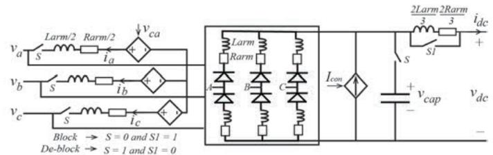  
Fig.4 Circuit topology of MAVM-AIBM

# C. MAVM-HBM

In order to improve the modeling accuracy of the DC poleto-pole fault, the MAVM with Hybrid Blocking Module (MAVM-HBM) is proposed in [9] as shown in Fig. 5.

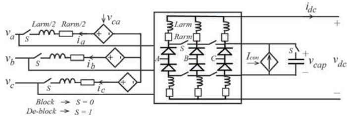  
Fig.5 Circuit topology of MAVM-HBM

The MAVM employs the HBM to connect the AC and DC side circuits. The HBM includes arm inductors, arm resistors, arm equivalent diodes and ideal switches. During normal operation, all switches S are closed, and HBM is isolated from the AC side due to the reverse blocking of the diodes. The arm current is flowing from the DC controlled current source through the switches and three-phase arm impedances.

During DC pole to pole fault, both AC and DC sources are set to zero and bypassed from the circuit. The DC equivalent capacitor $\nu _ { c a p }$ is discharged through the three-phase arm impedance until the converter is blocked. The switches S are opened to represent converter blocking operation. Therefore, the arm inductors have initial DC fault currents at the converter blocking instant which represents improvement in modeling accuracy compared to MAVM-AIBM. However, the MAVM-HBM has relatively complicated circuit structure to be implemented compared to SAVM and MAVM-AIBM.

# D. Proposed EAVM

This paper proposed an Enhanced AVM (EAVM) with an arm current initialization method to improve the numerical accuracy of the MAVM-AIBM at converter blocking instant. As shown in Fig. 6, the model uses the basic circuit structure of the MAVM-AIBM with additional controlled current sources placed in parallel with each of the six arm inductors in the MAVM-AIBM.

It is noticed that the arm inductor current in the AIBM can be calculated as

$$
i _ {L} = \int_ {t 0} ^ {t 0 + d \tau} v _ {L} d \tau + i _ {L _ {0}} \tag {10}
$$

where $v _ { L }$ is the inductor voltage and $i _ { L _ { 0 } }$ is the initial arm inductor current at the time instant, ????0. For the DC pole-to-pole fault, before the converter is blocked, the switch S is closed so that the DC equivalent capacitor is discharged to the DC fault. The 6-pulse diode bridge is reverse biased leading to zero arm inductor current, i.e., $i _ { L _ { 0 } } = 0$ at the converter blocking moment. However, the arm inductors in the original detailed switching-based model carry the DC fault current.

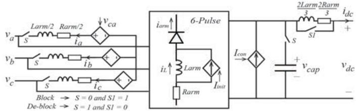  
Fig.6 Circuit topology of the EAVM

In order to correctly initialize the arm inductors, the DC current flowing through the DC equivalent impedance, $\frac { 2 } { 3 } R _ { a r m }$ ???????????????? and $\frac { 2 } { 3 } L _ { a r m }$ is used at the converter blocking time instant, $t _ { b l k }$ . The initial arm inductor current $i _ { L _ { 0 } }$ is assumed to be one third of the DC fault current as

$$
i _ {L _ {0}} = i _ {D C} \left(t _ {b l k}\right) / 3. \tag {11}
$$

Combine (10) and (11), the arm current can be accurately initialized. In the EMT-type simulation tools, the passive components, such as L and C, normally cannot be initialized during dynamic simulation. Therefore, controlled current sources are added in parallel to the arm inductors with the input given as

$$
I _ {\text {i n i t}} = i _ {D C} \left(t _ {b l k}\right) / 3 \tag {12}
$$

to represent the change in the initial condition at the converter blocking moment.

# IV. SIMULATION RESULTS

The proposed EAVM is verified using a test system of 41- level MMC point-to-point HVDC system as shown in Fig. 7. The detailed setup and parameters of the MMC-HVDC system are given in [9] and is not repeated in the paper for space consideration. The previous AVMs (MAVM-AIBM and MAVM-HBM) and the Detailed Model (DM) are also implemented for benchmark comparison purpose.

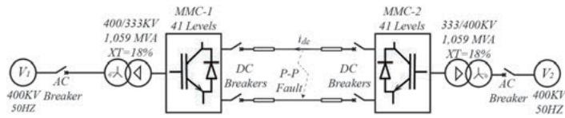  
Fig.7 Point-to-point MMC-HVDC test system.

The MMC energization study is used first to validate the proposed EAVM for converter blocking mode operation. It is assuming that the two MMCs are initially blocked with zero initial voltage of submodule capacitors. The MMC energization starts at 0.05 s when AC breakers are closed. The DC voltages and converter phase-A currents produced by the DM, the proposed EAVM, and the MAVM-HBM are shown in Fig. 8. Since the EAVM is the same as the MAVM-AIBM for the converter energization operation $( I _ { i n t }$ is zero), only the EAVM results are presented here.

It is observed in Fig. 8 that two charging stages are used for the energization, i.e. uncontrollable charging from 0.05 second

to 0.2 second and controllable charging from 0.2 second to 0.3 second. In uncontrollable charging stage, the submodule capacitors of the DM and the equivalent DC capacitors for the EAVM and MAVM-HBM are charged up by the AC side currents via the freewheeling diodes. As observed in Fig. 8, the converter DC voltage and AC current are accurately predicted by the EAVM and MAVM-HBM compared to the DM. The DC voltage at the beginning of the uncontrollable charging is magnified in Fig. 9. It is observed in Fig. 9 that the DC voltage predicted by the MAVM-HBM is slightly different than those of the EAVM and DM because the DC output voltage of the MAVM-HBM includes both the arm inductors voltages and the DC capacitor voltage. During the controllable charging stage, the Vdc control is activated to regulate the MMCs’ DC voltage to the rated value of 640kV. As shown in Fig. 8, the voltage ripples due to submodule capacitors in the DM are observed while the EAVM and MAVM-HBM predict the smooth average DC voltage.

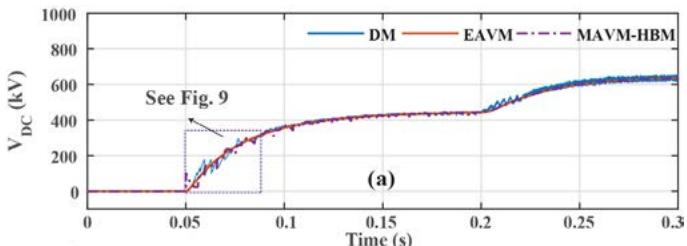

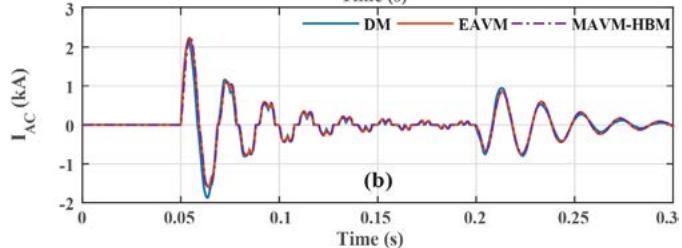  
Fig. 8. HB MMC energizing: (a). converter DC voltage; (b). converter phase-A current.

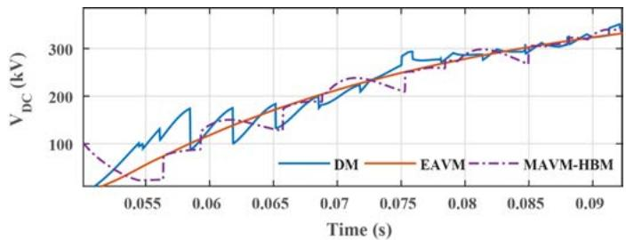  
Fig.9. Zoomed-in DC voltages during MMC energization

A DC pole-pole fault occurs in the middle of the DC cable at 1 s and the gate pulses are blocked 1200 µs later. Afterwards, AC breakers are opened at 1.04 s to clear the fault. During the DC pole-pole fault, the submodule capacitors are discharged which increases the fault current dramatically until the IGBT gate pulses are blocked. The submodule capacitors are bypassed by the submodule diodes. But the current will continue to increase due to the lack of fault blocking capability of halfbridge MMC. The AC breakers are opened at 1.04 s to disconnect the MMCs from the AC system. Therefore, the DC current will decay through the remaining arm and cable impedances. Figs. 10 and 11 presents the DC voltage and DC current produced by different MMC models. The proposed EAVM shows accurate results similar to the DM and MAVM-

HBM. The DC voltage and DC current predicted by the MAVM-AIBM has large errors at the moment of converter blocking since the arm inductors in Fig. 4 are not initialized with the short-circuit fault current.

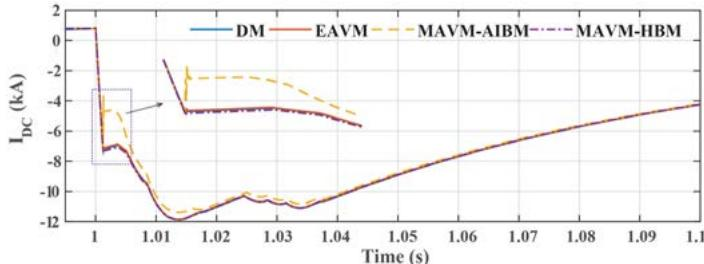  
Fig.10 MMC DC-side responses from DC pole-pole fault: (a) DC voltage; (b) DC current.

Fig. 11 shows the converter arm and AC currents produced by different MMC models. It is observed in Fig. 11 that the MAVM-AIBM has noticeable errors while the EAVM and MAVM-HBM produce very similar results to the DM after converter blocking. Fig. 12 illustrates the zoomed-in phase-A upper-arm current at the converter blocking moment. It is noticed in Fig. 12 that the arm inductor currents in BM of the MAVM-AIBM and EAVM are zero until the converter blocking moment. The EAVM correctly initialize the arm inductor currents and produce accurate DC fault currents in the arms while the MAVM-AIBM does not. The MAVM-HBM doesn’t require initializing the arm inductor currents since the DC fault current flows through the arm inductors. However, the MAVM-HBM has slightly more complicated model structure, compared to the EAVM.

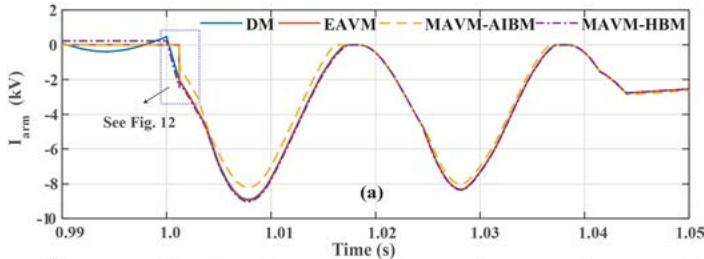

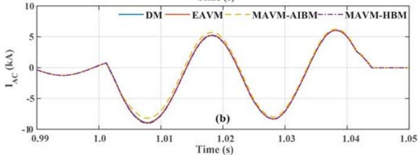  
Fig.11 MMC arm and AC currents due to DC pole-to-pole fault: (a) Phase-A upper-arm current; (b) Phase-A AC current.

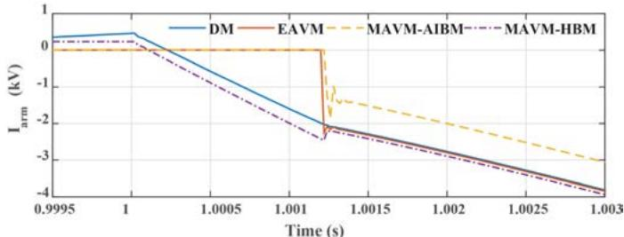  
Fig.12 Zoomed-in phase-A upper-arm current

# V. CONCLUSION

This paper analyzed the several state-of-the-art AVMs of MMC and proposed an EAVM to improve the modeling accuracy for converter blocking mode operation. The SAVM can efficiently model the MMC for normal operations but insufficient to model converter blocking mode. The MAVMs extended the SAVM to represent converter blocking operation using a blocking module, which however increased complexity of the model structure. This paper proposed an EAVM, which can accurately represent the converter blocking operation with reduced modeling complexity. The controlled current sources in parallel with converter arm inductors are proposed in the EAVM to accurately represent the converter DC pole-to-pole fault. The proposed EAVM is verified using a test system based on 41-level MMC point-to-point HVDC system developed in Simulink/eMEGAsim. The proposed EAVM demonstrated improved accuracy and enabled simple model structure compared to the previous AVMs for straightforward implementation in EMTP-type software packages.

# REFERENCES

[1] A. Lesnicar and R. Marquardt, “An Innovative Modular Multilevel Converter Topology Suitable for a Wide Power Range,” in Power Tech Conference Proceedings, 2003.   
[2] O. Venjakob, S. Kubera, P. A. Forsyth, and T. L. Maguire, “Setup and Performance of the Real-Time Simulator used for Hardware-in-Loop-Tests of a VSC-Based HVDC scheme for Offshore Applications,” in International Conference on Power Systems Transients (IPST), 2013.   
[3] S. Dennetière, S. Nguefeu, H. Saad, and J. Mahseredjian, “Modeling of modular multilevel converters for the France-Spain link,” Int. Conf. Power Syst. Transients - IPST, pp. 1–7, 2013.   
[4] N. Ahmed, L. Ängquist, S. Norrga, A. Antonopoulos, L. Harnefors, and H.-P. Nee, “A Computationally Efficient Continuous Model for the Modular Multilevel Converter,” IEEE J. Emerg. Sel. Top. Power Electron., vol. 2, no. 4, pp. 1139–1148, 2014.   
[5] R. Marquardt, “Modular Multilevel Converter topologies with DC-Short circuit current limitation,” 8th Int. Conf. Power Electron. - ECCE Asia "Green World with Power Electron, pp. 1425–1431, 2011.   
[6] M. M. C. Merlin, T. C. Green, P. D. Mitcheson, D. R. Trainer, D. R. Critchley, and R. W. Crookes, “A new hybrid multi-level voltage-source converter with DC fault blocking capability,” 9th IET Int. Conf. AC DC Power Transm, (ACDC), 2010.   
[7] J. Peralta, H. Saad, S. Dennetière, J. Mahseredjian, and S. Nguefeu, “Detailed and Averaged Models for a 401-Level MMC–HVDC System,” IEEE Trans. Power Deliv., vol. 27, no. 3, pp. 1501–1508, 2012.   
[8] H. Saad, S. Dennetière, J. Mahseredjian, P. Delarue, X. Guillaud, J. Peralta, and S. Nguefeu, “Modular multilevel converter models for electromagnetic transients,” IEEE Trans. Power Deliv., vol. 29, no. 3, pp. 1481–1489, 2014.   
[9] A. Beddard, C. Sheridan, M. Barnes, and T. Green, “Improved Accuracy Average Value Models of Modular Multilevel Converters,” IEEE Trans. Power Deliv., vol. 31, no. 5, 2016.   
[10]OPAL-RT Techniologies, “eMEGAsim TM Real-Time Digital Simulator for Power System Engineers” 2011.   
[11] E. Solas, G. Abad, J. A. Barrena, S. Aurtenetxea, A. Carcar, and L. Zajac, “Modular multilevel converter with different submodule concepts-part II: Experimental validation and comparison for HVDC application,” IEEE Trans. Ind. Electron., vol. 60, no. 10, pp. 4536–4545, 2013.   
[12]M. Saeedifard and R. Iravani, “Dynamic Performance of a Modular Multilevel Back-to-Back HVDC System,” IEEE Trans. Power Deliv., vol. 25, no. 4, pp. 2903–2912, 2010.   
[13]Q. Tu, Z. Xu, and L. Xu, “Reduced Switching-frequency modulation and circulating current suppression for modular multilevel converters,” IEEE Trans. Power Deliv., vol. 26, no. 3, pp. 2009–2017, 2011.   
[14] L. Angquist, A. Antonopoulos, D. Siemaszko, K. Ilves, M. Vasiladiotis, and H.-P. Nee, “Open-loop control of modular multilevel converters using estimation of stored energy,” IEEE Trans. on Ind. Appl., vol. 47, no. 6, pp. 2516–2524, 2011.   
[15]A. Yazdani and R. Iravani, Voltage Sourced Converters in Power Systems - Modeling, Control, and Applications. Wiley-IEEE Press, 2010.