# Interfacing -Factor Based White-Box Transformer Models With Electromagnetic Transients Programs

Bjørn Gustavsen, Fellow, IEEE, and Álvaro Portillo, Senior Member, IEEE

Abstract—White-box transformer models are used by transformer manufacturers during the dielectric design of windings. The models are often based on constant parameters (RLCG matrices) with the high-frequency losses accounted for by a scaling of the dc resistance ( -Factor). We show an efficient procedure for interfacing such models with Electromagnetic Transients Program (EMTP)-type circuit simulators via state equations and a Norton equivalent. The approach makes no approximations except for the discretization in the time domain. Diagonalization is utilized for achieving high computational efficiency. Proprietary information about internal voltages is optionally hidden from the user. Internal surge arresters are handled by the EMTP circuit solver by declaring their connection points as external nodes. The model interface includes automated initialization from 50/60-Hz initial conditions. The proposed interfacing capability permits manufacturers to apply their models in complete network simulations, and to share their models with users.

Index Terms—Electromagnetic Transients Program (EMTP), simulation, transformer, white-box model.

# I. INTRODUCTION

P OWER transformers have, in several instances, suf-fered dielectric failure with overvoltages as a suspected fered dielectric failure with overvoltages as a suspected cause, even when normal practices for insulation coordination and protection have been followed. CIGRE formed in 2008 Working Group (WG) A2/C4.39 “Electrical transient interaction between transformers and the power system” with the objective to clarify the underlying reason for such failures and if possible recommend procedures for avoiding their occurrence. One of the major conclusions from that work is the observation that oscillating overvoltages of relatively low amplitudes that impinge the transformer terminals can result in excessive overvoltages inside the transformer’s windings by resonance as has also been documented in a number of past studies [1]. The Working Group further recommends that the manufacturer should, by request from the customer, provide a terminal equivalent (black-box) model to permit the user to calculate the impinging overvoltages at the transformer terminals using EMTP-type circuit solvers. The impinging overvoltages can

then be used by the manufacturer as input for calculating internal overvoltages using its proprietary (white-box) software. That way, modifications can be made to the adjacent power system and/or transformer design to reduce the probability of future failures.

The white-box models can be categorized as lumped circuit models based on a spatial discretization of the windings, or traveling wave-type models. The extraction of the model’s parameters is, in all cases, based on a detailed description of the transformer’s geometry and material properties which, in practice, are only known to the manufacturer. From this information, the model’s parameters are extracted via formulae and/or finite-element method computations. Several levels of refinement are possible, including frequency dependency of the model’s parameters as well as the resolution of the spatial discretization.

In this paper, we demonstrate how to employ the recommended procedure by A2/C4.39 in practice. We consider the case of lumped-parameter white-box models based on constant RLCG parameters, commonly applied among manufacturers. Damping effects are included in the model by applying a constant multiplier factor ( -Factor) to all dc resistances. (One may alternatively calculate the resistances at a given, representative frequency.) Based on these matrices, we formulate a model in terms of state equations with current injection from ground to all nodes as input and internal node voltages and branch voltages as output. Next, we develop a computational approach for interfacing this model with EMTP-type circuit solvers, based on convolution and a Norton equivalent. The terminals of the Norton equivalent may include transformer internal nodes for the connection of internal surge arresters. Internal node voltages and branch currents are made available for monitoring as well. Diagonalization is introduced for faster simulations and hiding of proprietary information. Automated initialization from 50/60-Hz steady initial conditions is introduced, assuming the model has sufficiently accurate behavior at that frequency. We show one procedure for enforcing correct 50/60-Hz model behavior for single-phase transformers by introducing the magnetic core flux path in the inductance matrix. Finally, we show a number of pertinent examples demonstrating the new approach to the so-called “Fictitious Transformer” used in the studies by CIGRE Working Group A2/C4.39 [2].

# II. WHITE-BOX MODELING

# A. Lumped Parameter Transformer White-Box Models

White-box models are used for analyzing the internal response of the power transformer to a system voltage transient applied to its terminals. In the lumped parameter modeling

Manuscript received September 18, 2013; revised February 03, 2014; accepted June 19, 2014. Paper no. TPWRD-01070-2013. B. Gustavsen is with SINTEF Energy Research, Trondheim N-7465, Norway (e-mail: bjorn.gustavsen@sintef.no). Á. Portillo is with WEG Transformers, Blumenau SC 89068-001, Brazil (e-mail: acport@adinet.com.uy). Color versions of one or more of the figures in this paper are available online at http://ieeexplore.ieee.org. Digital Object Identifier 10.1109/TPWRD.2014.2332515

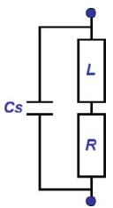

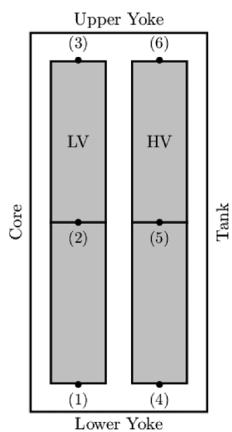  
Fig. 1. Inductive branch.   
Fig. 2. Example: two-winding transformer.

approach, the transformer windings are divided into a cascade of geometrical parts and each part is represented by an electrical branch. The most elementary part that we can consider as a branch is one turn. For disk windings, a branch can also represent one disk, a pair of disks, or an arbitrary number of disks in the winding. For layer windings, each branch can represent a layer, or a pair of layers, and so on for other different types of windings.

Each branch is defined by two nodes and can be represented by the equivalent circuit shown in Fig. 1. Elements , , and $C _ { S }$ , respectively, represent the branch series resistance, self inductance, and series capacitance.

To see how the matrices can be established, we consider as an example a two-winding transformer where each winding is divided into two equal branches. Fig. 2 shows a diagram of the transformer, and Fig. 3 shows the equivalent electrical circuit of the transformer with four branches and six nodes.

# B. Parameter Determination

In this paper, the series winding capacitances and shunt capacitances between windings, and between windings and core or tank, are calculated using detailed geometry of windings and insulating material properties (paper, pressboard, insulating liquid, etc.) via analytical formulae such as the ones described in [3]–[5]. The self and mutual inductances are calculated using the Rabin’s Method [6], [4]. The inductances are modified including a common iron core flux to adapt the model to power frequencies (50/60 Hz), as shown in Appendix A. Skin and proximity effect losses are included in the model by applying a constant multiplier factor ( -Factor) to all dc resistances [4], giving an approximate representation of the frequency-dependent resistances [7]. Core losses and dielectric losses are

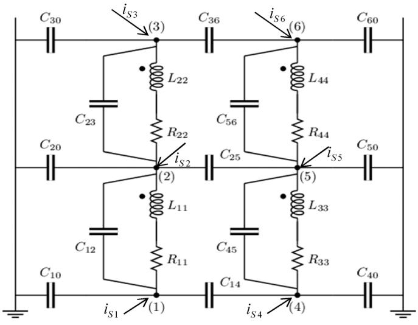  
Fig. 3. Equivalent circuit of the transformer in Fig. 2.

neglected. From these primitive electrical parameters, we establish matrices , , , and .

# C. State Equations

From the obtained matrices , , , and , we wish to calculate state equations in terms of node voltages ( nodes) and inductive branch currents ( branches). Equations (1) and (2) express, respectively, the relation between and $\mathbf { i } _ { C }$ (sum of capacitive currents flowing out each node), and between and (sum of conductive currents flowing out each node). The relation between inductive branch currents and associated branch voltages is given by (3)

$$
\mathbf {i} _ {C} = \mathbf {C} \dot {\mathbf {v}} \tag {1}
$$

$$
\mathbf {i} _ {G} = \mathbf {G} \mathbf {v} \tag {2}
$$

$$
\mathbf {e} = \dot {\mathbf {L i}} + \mathbf {R i}. \tag {3}
$$

We define an incidence matrix , dependent on the internal connections, for relating node voltages with inductive branch voltages (4), and for relating the inductive branch currents with the sum $\mathbf { i } _ { L }$ of all inductive branch currents flowing out of each of the branch reference nodes (5)

$$
\mathbf {e} = \mathbf {T v} \tag {4}
$$

$$
\mathbf {i} _ {L} = \mathbf {T} ^ {T} \mathbf {i}. \tag {5}
$$

At each node, according to Kirchhoff law, we have for the total current flowing into each node

$$
\mathbf {i} _ {C} + \mathbf {i} _ {L} + \mathbf {i} _ {G} = \mathbf {i} _ {S} \tag {6}
$$

where is a specified current injection from ground into all nodes. Inserting (1), (2), and (5) in (6) gives (7a) while combining (3) and (4) gives (7b)

$$
\mathbf {C} \dot {\mathbf {v}} = - \mathbf {G} \mathbf {v} - \mathbf {T} ^ {T} \mathbf {i} + \mathbf {i} _ {S} \tag {7a}
$$

$$
\mathbf {L} \dot {\mathbf {i}} = \mathbf {T} \mathbf {v} - \mathbf {R} \mathbf {i}. \tag {7b}
$$

Equations (7a) and (7b) are rewritten as state equations

$$
\left[ \begin{array}{c} \dot {\mathbf {v}} \\ \dot {\mathbf {i}} \end{array} \right] = \left[ \begin{array}{c c} - \mathbf {C} ^ {- 1} \mathbf {G} & - \mathbf {C} ^ {- 1} \mathbf {T} ^ {T} \\ \mathbf {L} ^ {- 1} \mathbf {T} & - \mathbf {L} ^ {- 1} \mathbf {R} \end{array} \right] \cdot \left[ \begin{array}{c} \mathbf {v} \\ \mathbf {i} \end{array} \right] + \left[ \begin{array}{c c} \mathbf {C} ^ {- 1} & \mathbf {0} \\ \mathbf {0} & \mathbf {0} \end{array} \right] \left[ \begin{array}{c} \mathbf {i} _ {S} \\ \mathbf {0} \end{array} \right]. \tag {8}
$$

Short circuits between nodes and the grounding of nodes are achieved by a modification of matrices , , and as described in Appendix B.

# III. INTERFACING WHITE-BOX MODEL WITH THE EMTP-TYPECIRCUIT SOLVER

In principle, the detailed RLCG network can be directly imported into EMTP-type tools. Such an approach is, however, undesirable for a number of reasons: 1) it will be computationally cumbersome because of the mutual coupling that exists between all RL branches and 2) it reveals all information about internal overvoltages in the transformer which may be unacceptable for the manufacturer. In the following text, we will develop an approach which overcomes all of these obstacles, based on the state equations (8).

# A. Node Reordering and Partitioning

The user of the model will require the ability to connect the transformer terminals to an external circuit and, in some cases, to also connect surge arresters between internal points (nodes) inside the transformer. All such points define the model’s external terminals. It is convenient to reorder the nodes in (8) so that the external $n _ { 1 }$ nodes come first and the internal $n _ { 2 }$ nodes last $( n _ { 1 } + n _ { 2 } = N )$ . Accordingly, only the first $n _ { 1 }$ entries of are permitted to be nonzero. The reordering is achieved by introducing a (square) reordering matrix

$$
\bar {\mathbf {v}} = \mathbf {Q} \mathbf {v}, \quad \bar {\mathbf {i}} _ {S} = \mathbf {Q} \mathbf {i} _ {S}. \tag {9}
$$

Each row of $\mathbf { Q }$ is zero except for a single element which is unity. Since $\mathbf { Q }$ is orthogonal, $\bar { \mathbf { Q } } ^ { - 1 } = \mathbf { Q } ^ { T }$ and we obtain for (8)

$$
\begin{array}{l} \left[ \begin{array}{c} \mathbf {Q} ^ {T} \dot {\bar {\mathbf {v}}} \\ \mathbf {i} \end{array} \right] = \left[ \begin{array}{c c} - \mathbf {C} ^ {- 1} \mathbf {G} & - \mathbf {C} ^ {- 1} \mathbf {T} ^ {T} \\ \mathbf {L} ^ {- 1} \mathbf {T} & - \mathbf {L} ^ {- 1} \mathbf {R} \end{array} \right] \\ \cdot \left[ \begin{array}{c} \mathbf {Q} ^ {T} \bar {\mathbf {v}} \\ \mathbf {i} \end{array} \right] + \left[ \begin{array}{c c} \mathbf {C} ^ {- 1} & \mathbf {0} \\ \mathbf {0} & \mathbf {0} \end{array} \right] \left[ \begin{array}{c} \mathbf {Q} ^ {T} \bar {\mathbf {i}} _ {S} \\ \mathbf {0} \end{array} \right] \tag {10} \\ \end{array}
$$

and so

$$
\begin{array}{l} \left[ \begin{array}{c} \dot {\bar {\mathbf {v}}} \\ \dot {\mathbf {i}} \end{array} \right] = \left[ \begin{array}{c c} - \mathbf {Q C} ^ {- 1} \mathbf {G Q} ^ {T} & - \mathbf {Q C} ^ {- 1} \mathbf {T} ^ {T} \\ \mathbf {L} ^ {- 1} \mathbf {T Q} ^ {T} & - \mathbf {L} ^ {- 1} \mathbf {R} \end{array} \right] \\ \cdot \left[ \begin{array}{c} \bar {\mathbf {v}} \\ \mathbf {i} \end{array} \right] + \left[ \begin{array}{c} \mathbf {Q C} ^ {- 1} \mathbf {Q} ^ {T} \\ \mathbf {0} \end{array} \right] \bar {\mathbf {i}} _ {S}. \tag {11} \\ \end{array}
$$

We simplify notation by rewriting (11) on a standard state-space form (12) where $\begin{array} { r l r } { \mathbf { A } } & { { } { \bf \Xi } } & { { \bf \Xi } \in { \bf \Xi } \mathbb { R } ^ { ( N + M ) \times ( N + M ) } } \end{array}$ , $\mathbf { B } \in  \bar { \mathbb { B } } ^ { ( N + M ) \times N } . \textbf { I } \in \mathbb { R } ^ { ( N + M ) \times ( N + M ) }$ is the identity matrix and the output contains all node voltages and branch currents $\mathbf { y } \stackrel { \cdot } { = } \mathbf { x } = \big [ \bar { \mathbf { v } } ^ { T } \quad \mathbf { i } ^ { T } \big ] ^ { T }$

$$
\dot {\mathbf {x}} = \mathbf {A} \mathbf {x} + \mathbf {B} \bar {\mathbf {I}} _ {S} \tag {12a}
$$

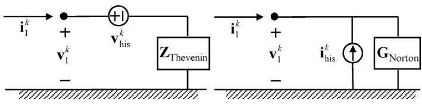  
Fig. 4. Thévenin equivalent (left panel) and Norton equivalent (right panel).

$$
\mathbf {y} = \mathbf {I x}. \tag {12b}
$$

# B. Time-Domain Discretization

The state equation (12) is solved using trapezoidal integration by the approach described in [8]

$$
\mathbf {x} ^ {k} = \boldsymbol {\alpha} \mathbf {x} ^ {k - 1} + \lambda \mathbf {B} \bar {\mathbf {i}} _ {S} ^ {k} + \boldsymbol {\mu} \mathbf {B} \bar {\mathbf {i}} _ {S} ^ {k - 1} \tag {13a}
$$

$$
\mathbf {y} ^ {k} = \mathbf {I} \mathbf {x} ^ {k} \tag {13b}
$$

where $\pmb { \alpha } , \lambda , \pmb { \mu } , \mathbf { I } \in \mathbb { R } ^ { ( N + M ) \times ( N + M ) }$ . These coefficient matrices are obtained as

$$
\boldsymbol {\alpha} = \left(\mathbf {I} - \mathbf {A} \frac {\Delta t}{2}\right) ^ {- 1} \left(\mathbf {I} + \mathbf {A} \frac {\Delta t}{2}\right) \tag {14a}
$$

$$
\boldsymbol {\lambda} = \boldsymbol {\mu} = \left(\mathbf {I} - \mathbf {A} \frac {\Delta t}{2}\right) ^ {- 1} \frac {\Delta t}{2}. \tag {14b}
$$

The simultaneous dependency of $\mathbf { \dot { x } } ^ { k }$ on $\overline { { \mathbf { i } } } _ { S } ^ { k }$ in (13a) is removed by introducing a modified state variable $\hat { \bf x }$

$$
\mathbf {x} ^ {k} = \hat {\mathbf {x}} ^ {k} + \lambda \mathbf {B} \overline {{\mathbf {I}}} _ {S} ^ {k} \tag {15}
$$

which gives for (13a) and (13b)

$$
\hat {\mathbf {x}} ^ {k} = \boldsymbol {\alpha} \hat {\mathbf {x}} ^ {k - 1} + (\boldsymbol {\alpha} \boldsymbol {\lambda} + \boldsymbol {\mu}) \mathbf {B} \overline {{\mathbf {i}}} _ {S} ^ {k - 1} \tag {16a}
$$

$$
\mathbf {y} ^ {k} = \mathbf {I} \hat {\mathbf {x}} ^ {k} + \lambda \mathbf {B} \overline {{\mathbf {I}}} _ {S} ^ {k}. \tag {16b}
$$

# C. Norton Equivalent for External Nodes

The first $n _ { 1 }$ rows of and $\overline { { \mathbf { i } } } _ { S }$ contain the external node voltages $\mathbf { v } _ { 1 }$ and external currents $\mathbf { i } _ { 1 }$ . For the corresponding partitioning of (16b), we accordingly get

$$
\mathbf {v} _ {1} ^ {k} = \mathbf {I} _ {1} \hat {\mathbf {x}} ^ {k} + (\boldsymbol {\lambda} \mathbf {B}) _ {1} \mathbf {i} _ {1} ^ {k} \tag {17}
$$

where ${ \bf { I } } _ { 1 }$ contains the first $n _ { 1 }$ rows of and $( \lambda \mathbf { B } ) _ { 1 }$ contains the first $n _ { 1 }$ rows and $n _ { 1 }$ columns of . Equation (17) defines the Thévenin equivalent in Fig. 4, left panel, with

$$
\mathbf {v} _ {\text {h i s}} ^ {k} = \mathbf {I} _ {1} \hat {\mathbf {x}} ^ {k} \tag {18a}
$$

$$
\mathbf {Z} _ {\text {T h e v e n i n}} = (\lambda \mathbf {B}) _ {1}. \tag {18b}
$$

To interface with EMTP-type tools, it is convenient to convert the Thévenin equivalent into a Norton equivalent (Fig. 4, right panel), where

$$
\mathbf {G} _ {\text {N o r t o n}} = \mathbf {Z} _ {\text {T h e v e n i n}} ^ {- 1} = (\lambda \mathbf {B}) _ {1} ^ {- 1} \tag {19a}
$$

$$
\mathbf {i} _ {\mathrm {h i s}} ^ {k} = \mathbf {G} _ {\text {N o r t o n}} \mathbf {v} _ {\mathrm {h i s}} ^ {k} = \mathbf {G} _ {\text {N o r t o n}} \mathbf {I} _ {1} \hat {\mathbf {x}} ^ {k}. \tag {19b}
$$

Thus, we use (16a) to update the state vector and the Norton equivalent (19) to interface the model with the circuit simulator. In $( 1 6 \mathrm { a } ) , \overline { { \mathbf { i } } } _ { S } ^ { k - 1 }$ is calculated from the Norton equivalent as

$$
\overline {{\mathbf {i}}} _ {S} ^ {k - 1} = \mathbf {G} _ {\text {N o r t o n}} \mathbf {v} _ {1} ^ {k - 1} - \mathbf {i} _ {\text {h i s}} ^ {k - 1}. \tag {20}
$$

All node voltages (external and internal) as well as the branch currents can be observed via the state vector . Using (15), we can calculate all voltages and currents

$$
\left[ \begin{array}{c} \mathbf {Q} \mathbf {v} ^ {k - 1} \\ \mathbf {i} ^ {k - 1} \end{array} \right] = \mathbf {x} ^ {k - 1} = \hat {\mathbf {x}} ^ {k - 1} + \lambda \mathbf {B} \overline {{\mathbf {i}}} _ {S} ^ {k - 1}. \tag {21}
$$

# D. Diagonalization

The state matrix is nonsparse, leading to a significant computational effort when updating the state variable in (16a) since results in nonsparse. This difficulty is avoided by subjecting to eigenvalue decomposition

$$
\mathbf {A} = \mathbf {S} \tilde {\mathbf {A}} \mathbf {S} ^ {- 1} \tag {22}
$$

where $\tilde { \mathbf { A } } \in \mathbb { C } ^ { ( N + M ) \times ( N + M ) }$ is diagonal. The eigenvector matrix $\mathbf { S } \in \mathbb { C } ^ { ( N + M ) \times ( N + M ) }$ is used as a variable transformation

$$
\mathbf {x} = \mathbf {S q}. \tag {23}
$$

This gives for (12)

$$
\dot {\mathbf {q}} = \tilde {\mathbf {A}} \mathbf {q} + \mathbf {S} ^ {- 1} \mathbf {B} \bar {\mathbf {i}} _ {S} \tag {24a}
$$

$$
\mathbf {y} = \mathbf {S q}. \tag {24b}
$$

After time-domain discretization of (24) and some manipulation, we obtain

$$
\hat {\mathbf {q}} ^ {k} = \tilde {\boldsymbol {\alpha}} \hat {\mathbf {q}} ^ {k - 1} + (\tilde {\boldsymbol {\alpha}} \tilde {\boldsymbol {\lambda}} + \tilde {\boldsymbol {\mu}}) \mathbf {S} ^ {- 1} \mathbf {B} \overline {{\mathbf {i}}} _ {S} ^ {k - 1} \tag {25a}
$$

$$
\mathbf {y} ^ {k} = \mathbf {S} \hat {\mathbf {q}} ^ {k} + (\mathbf {S} \tilde {\lambda} \mathbf {S} ^ {- 1} \mathbf {B}) \overline {{\mathbf {I}}} _ {S} ^ {k} \tag {25b}
$$

where $\tilde { \pmb { \alpha } } , \tilde { \pmb { \lambda } } ,$ , and $\tilde { \pmb { \mu } }$ are diagonal matrices that result by replacing in (14) with .

Only the first $n _ { 1 }$ rows of (25b) are used for the Norton equivalent. This gives (26), where $\mathbf { S } _ { 1 }$ and $( \mathbf { S } ^ { - 1 } \mathbf { B } ) _ { 1 }$ contain the first $n _ { 1 }$ rows of and $n _ { 1 }$ columns of $( \mathbf { S } ^ { - 1 } \mathbf { B } )$ , respectively

$$
\hat {\mathbf {q}} ^ {k} = \tilde {\boldsymbol {\alpha}} \hat {\mathbf {q}} ^ {k - 1} + (\tilde {\boldsymbol {\alpha}} \tilde {\boldsymbol {\lambda}} + \tilde {\boldsymbol {\mu}}) (\mathbf {S} ^ {- 1} \mathbf {B}) _ {1} \mathbf {i} _ {1} ^ {k - 1} \tag {26a}
$$

$$
\mathbf {v} _ {1} ^ {k} = \mathbf {S} _ {1} \hat {\mathbf {q}} ^ {k} + \mathbf {S} _ {1} \tilde {\boldsymbol {\lambda}} (\mathbf {S} ^ {- 1} \mathbf {B}) _ {1} \mathbf {i} _ {1} ^ {k}. \tag {26b}
$$

For the Norton equivalent, we accordingly obtain

$$
\mathbf {G} _ {\text {N o r t o n}} = \left[ \mathbf {S} _ {1} \tilde {\lambda} (\mathbf {S} ^ {- 1} \mathbf {B}) _ {1} \right] ^ {- 1} \tag {27a}
$$

$$
\mathbf {i} _ {\mathrm {h i s}} ^ {k} = \left(\mathbf {G} _ {\text {N o r t o n}} \mathbf {S} _ {1}\right) \hat {\mathbf {q}} ^ {k}. \tag {27b}
$$

Finally, from (25b), we obtain the internal voltages and currents via the state vector $\hat { \mathbf { q } }$ as

$$
\left[ \begin{array}{c} \mathbf {Q} \mathbf {v} ^ {k - 1} \\ \mathbf {i} ^ {k - 1} \end{array} \right] = \mathbf {x} ^ {k - 1} = \mathbf {S} [ \hat {\mathbf {q}} ^ {k - 1} + \tilde {\lambda} (\mathbf {S} ^ {- 1} \mathbf {B}) _ {1} \mathbf {i} _ {1} ^ {k - 1} ]. \tag {28}
$$

TABLE I EXECUTIONS IN EACH TIME STEP   

<table><tr><td>Step 1</td><td>Update qk by (26a)</td></tr><tr><td>Step 2</td><td>Calculate ihisk by (27b)</td></tr><tr><td>Step 3</td><td>Calculate internal voltages vk-1 by (28)</td></tr></table>

The computational requirements for each time step are summarized in Table I.

# E. Exchange of Data and Proprietary Information

The manufacturer may wish to provide the customer with only a terminal equivalent for the transformer, without revealing information about internal overvoltages. This restricted data exchange is achieved when the model interface is based on the diagonalization approach described in the previous subsection. The manufacturer only needs to provide the matrices for (26a), (27a), and (27b): (used for calculating , , and $\tilde { \pmb { \mu } } ) , ( \mathbf { S } ^ { - 1 } \mathbf { B } ) _ { 1 }$ , and $\mathbf { S } _ { 1 }$ . The Norton conductance matrix is obtained by (27a) as $\mathbf { G } _ { \mathrm { N o r t o n } } = [ \mathbf { S } _ { 1 } \tilde { \lambda } ( \mathbf { S } ^ { - 1 } \mathbf { B } ) _ { 1 } ] ^ { - 1 }$ .

Without the knowledge of the (full) , the user cannot compute any internal overvoltages via (28). If the manufacturer wishes to allow the user to observe internal overvoltages at points in a winding, it may simply treat these points as external terminals, that is, add them to the list of first $n _ { 1 }$ terminals so that they will appear in $\mathbf { v } _ { 1 }$ . Alternatively, it may provide the customer with the corresponding rows of in (28). [Equation (28) can be evaluated since and $( \mathbf { S } ^ { - 1 } \mathbf { B } ) _ { 1 }$ are known.] This latter option is computationally more efficient than adding external terminals.

# F. Offline Calculation of Internal Overvoltages

Once the user has performed the required transient simulations, the results can be sent to the manufacturer in the form of the time-domain samples for external currents $\mathbf { i } _ { 1 }$ . The manufacturer can then recover the internal overvoltages via (26) and (28).

# G. Internal Surge Arresters

Transformers are sometimes equipped with internal surge arresters to limit the overvoltage along critical parts of the windings, typically at regulating windings. Internal arresters are included in a simulation in the same way as external arresters. This is achieved by introducing their connection points as external terminals to which the arresters can be connected.

# IV. STEADY-STATE INITIALIZATION

# A. EMTP Approach

The following procedure is used by most EMTP-type solvers for initialization from $f _ { 0 } = 5 0 / 6 0 { \mathrm { - } } \mathrm { H z }$ stationary initial conditions. $\mathbf { A } \mathbf { t } \ t = 0$ , the EMTP program first establishes the global

nodal admittance matrix in the frequency domain $( s = j 2 \pi f _ { 0 } )$ , based on the admittance stamp from all linear devices. Then, the system node voltages (phasor solution) are calculated from the admittance matrix and independent (sinusoidal) sources. Finally, all internal variables used for updating the history sources associated with linear elements are initialized, using the terminal node voltages as input.

# B. Admittance Stamp

In the frequency domain, we can write for (11)

$$
\left[ \begin{array}{l} s \mathbf {v} _ {1} \\ s \mathbf {y} \end{array} \right] = \left[ \begin{array}{l l} \mathbf {A} _ {1 1} & \mathbf {A} _ {1 2} \\ \mathbf {A} _ {2 1} & \mathbf {A} _ {2 2} \end{array} \right] \cdot \left[ \begin{array}{l} \mathbf {v} _ {1} \\ \mathbf {y} \end{array} \right] + \left[ \begin{array}{l} \mathbf {B} _ {1} \\ \mathbf {B} _ {2} \end{array} \right] \mathbf {i} _ {1} \tag {29}
$$

where vector holds the internal node voltages and inductive branch currents. $\mathbf { B } _ { 1 }$ and $\mathbf { B } _ { 2 }$ retain the columns of in (12a) associated with $\mathbf { i } _ { 1 }$ . The elimination of $\mathbf { y }$ from (29) gives the terminal admittance matrix as (30), where ${ \bf { I } } _ { 1 }$ and $\mathbf { I } _ { 2 }$ are identity matrices of dimension $n _ { 1 }$ and $( N + M - n _ { 1 } )$ , respectively

$$
\begin{array}{l} \mathbf {Y} _ {1} = \left[ \mathbf {B} _ {1} + \mathbf {A} _ {1 2} (s \mathbf {I} _ {2} - \mathbf {A} _ {2 2}) ^ {- 1} \mathbf {B} _ {2} \right] ^ {- 1} \\ \cdot \left[ \left(s \mathbf {I} _ {1} - \mathbf {A} _ {1 1}\right) - \mathbf {A} _ {1 2} \left(s \mathbf {I} _ {2} - \mathbf {A} _ {2 2}\right) ^ {- 1} \mathbf {A} _ {2 1} \right]. \tag {30} \\ \end{array}
$$

${ \bf Y } _ { 1 }$ should be calculated by the manufacturer and given to the user, avoiding to pass the information and .

# C. Initialization

From the stationary terminal voltage $\mathbf { v } _ { 1 }$ calculated by the EMTP main program, we must initialize all variables associated with the model. First, consider a real-valued sinusoidal signal $x ( t ) = \bar { x } \cos ( \omega t + \theta )$ . This signal can also be expressed via the Fourier series in complex form as

$$
x (t) = \frac {1}{2} \left(\widehat {x} e ^ {j \omega t} + \widehat {x} ^ {*} e ^ {- j \omega t}\right) = \bar {x} \cos (\omega t + \theta) \tag {31}
$$

where ${ \widehat { \boldsymbol { x } } } ~ = ~ { \bar { x } } e ^ { j \theta }$ is the phasor and denotes the conjugate. In our case, the state variables $q _ { i }$ are complex quantities in the time domain. We therefore rewrite (31) in terms of general coefficients $\widehat { x } _ { + }$ and $\widehat { x } _ { - }$ to be determined

$$
x (t) = x _ {\text {r e a l}} (t) + j x _ {\text {i m a g}} (t) = \widehat {x} _ {+} e ^ {j \omega t} + \widehat {x} _ {-} e ^ {- j \omega t}. \tag {32}
$$

The update of the state variable in (26a) can be rewritten as

$$
\hat {\mathbf {q}} _ {\text {r e a l}} ^ {k} + j \hat {\mathbf {q}} _ {\text {i m a g}} ^ {k} = \tilde {\boldsymbol {\alpha}} \left(\hat {\mathbf {q}} _ {\text {r e a l}} ^ {k - 1} + j \hat {\mathbf {q}} _ {\text {i m a g}} ^ {k - 1}\right) + \mathbf {F} \mathbf {i} _ {1} ^ {k - 1} \tag {33}
$$

with $\mathbf { F } = ( \tilde { \pmb { \alpha } } \tilde { \pmb { \lambda } } + \tilde { \pmb { \mu } } ) ( \mathbf { S } ^ { - 1 } \mathbf { B } ) _ { 1 }$ . Introducing (31) for $\mathbf { i _ { 1 } }$ and (32) for $\hat { \mathbf { q } } ,$ we obtain for (33)

$$
\begin{array}{l} \widehat {\mathbf {q}} _ {+} e ^ {j \omega k \Delta t} + \widehat {\mathbf {q}} _ {-} e ^ {- j \omega k \Delta t} \\ = \tilde {\boldsymbol {\alpha}} \left(\widehat {\mathbf {q}} _ {+} e ^ {j \omega (k - 1) \Delta t} + \widehat {\mathbf {q}} _ {-} e ^ {- j \omega (k - 1) \Delta t}\right) \\ + \frac {1}{2} \mathbf {F} \left(\widehat {\mathbf {i}} _ {1} e ^ {j \omega (k - 1) \Delta t} + \widehat {\mathbf {i}} _ {1} ^ {*} e ^ {- j \omega (k - 1) \Delta t}\right). \tag {34} \\ \end{array}
$$

Solving (34) for $\widehat { \widehat { \mathbf { q } } } _ { + }$ and $\widehat { \widehat { \mathbf { q } } } .$ gives

$$
\widehat {\mathbf {q}} _ {+} = \frac {1}{2} \left(\mathbf {I} - \tilde {\boldsymbol {\alpha}} e ^ {- j \omega \Delta t}\right) ^ {- 1} \mathbf {F} \widehat {\mathbf {i}} _ {1} e ^ {- j \omega \Delta t} \tag {35a}
$$

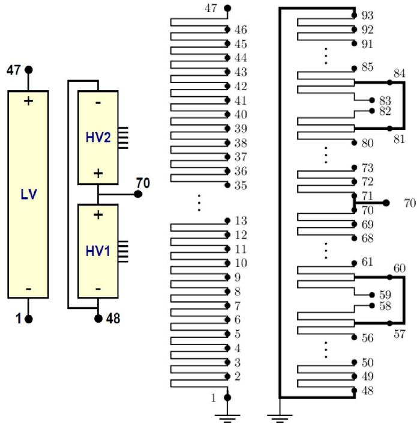  
Fig. 5. Fictitious transformer with external connection points (left panel) and detailed winding structure (right panel).

$$
\widehat {\mathbf {q}} _ {-} = \frac {1}{2} \left(\mathbf {I} - \tilde {\boldsymbol {\alpha}} e ^ {j \omega \Delta t}\right) ^ {- 1} \mathbf {F} \widehat {\mathbf {i}} _ {1} ^ {*} e ^ {j \omega \Delta t} \tag {35b}
$$

which by (32) defines the initialization at $t = 0$ ,

$$
\hat {\mathbf {q}} ^ {k = 0} = \widehat {\hat {\mathbf {q}}} _ {+} + \widehat {\hat {\mathbf {q}}} _ {-}. \tag {36}
$$

The history source current becomes

$$
\mathbf {i} _ {\text {h i s}} ^ {k = 0} = \left(\mathbf {G} _ {\text {N o r t o n}} \mathbf {S} _ {1}\right) \hat {\mathbf {q}} ^ {k = 0}. \tag {37}
$$

In the case that the white-box model is not accurate at 50/60 Hz, for example, because of a lack of core representation, the co-simulation approach in [9] can be used for initialization, where the 50/60-Hz behavior is provided by a separate model.

# V. EXAMPLE: FICTITIOUS TRANSFORMER

# A. White-Box Model

We consider the so-called “Fictitious Transformer” model described in [2], see Fig. 5. This is a 100-MVA, 230-kV singlephase unit with 1050 kV. The two windings are subdivided to give $N = 9 3$ nodes and $M = 9 2$ inductive branches. We wish to create a model with respect to the two external nodes #47 and #70 indicated in Fig. 5 as well as a few internal nodes.

Matrices $\mathbf { R } , \mathbf { L } , \mathbf { G }$ , and are computed for the winding structure in Fig. 5 using the approach outlined in Section II-B. We use an -matrix equal to its dc value scaled by a factor 1650 to approximately account for frequency-dependent losses.

The grounding of external nodes #1 and #48 and the connection between nodes #57 and #60 and nodes #81 and #84 is

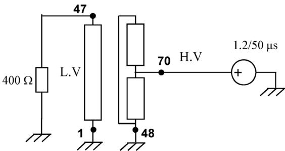  
Fig. 6. Application of impulse voltage to the transformer loaded with a 400- resistor.

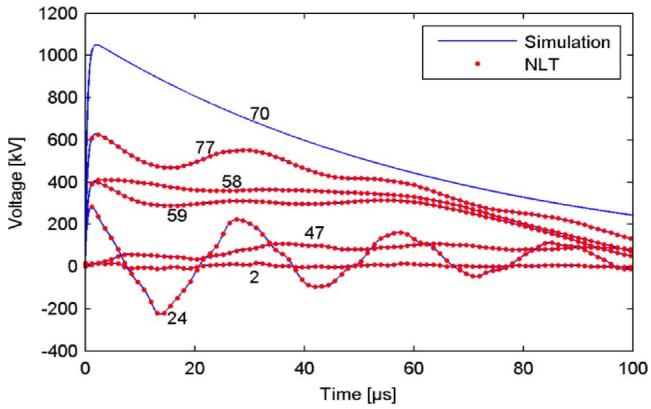  
Fig. 7. Overvoltages on the transformer. External nodes: #47, 70. Internal nodes: #2, 24 58, 59, and 77.

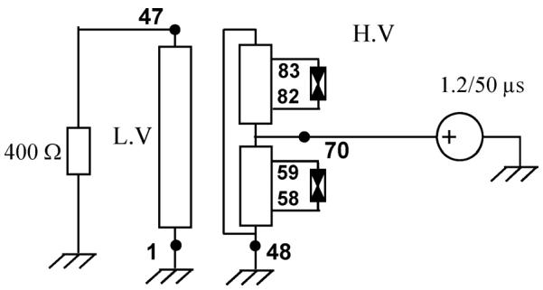  
Fig. 8. Placing surge arresters between nodes #58 and #59, and between #82 and #83.

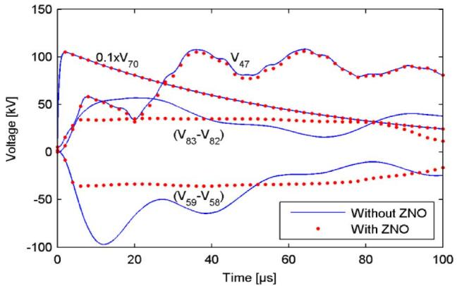  
Fig. 9. Overvoltages on the transformer with inclusion of internal surge arresters.

achieved by the procedure described in Appendix B. The reordering matrix (9) is introduced to make the $n _ { 1 } = 2$ external nodes appear first and the $n _ { 2 } = N - n _ { 1 } = 9 1$ internal nodes last.

# B. Implementation in the EMTP-Like Tool

In order to test the white-box model implementation in an EMTP-like environment, we interface it to an EMTP clone coded in Matlab [10].

# C. Validation Using the Numerical Laplace Transform

In the first example, we will validate the correctness of implementation. In the simulation, we apply a standard lightning voltage waveform (38) of 1050 kV peak value to external node #70

$$
v (t) = 1 0 5 0 c \left(e ^ {- a t} - e ^ {- b t}\right) \tag {38}
$$

with $c = 1 . 0 3 8 , a = 0 . 0 1 5 6 E 6 \mathrm { s } ^ { - 1 } , b = 2 . 4 7 E 6 \mathrm { s } ^ { - 1 }$ . External node #47 is grounded via a 400- resistor as shown in Fig. 6.

Fig. 7 shows the voltage waveforms on the external nodes #47 and #70, as well as internal nodes #2, 24, 58, 59, and 77. The simulation result is validated by comparison with a solution calculated via nodal analysis and the inverse Numerical Laplace Transform [11]. The nodal analysis is based on the full $( N \times N )$ nodal admittance matrix of the transformer

$$
\mathbf {Y} (s) = \left[ \left(\mathbf {G} + s \mathbf {C}\right) + \mathbf {T} ^ {T} \left(\mathbf {R} + s \mathbf {L}\right) ^ {- 1} \mathbf {T} \right]. \tag {39}
$$

# D. Use of Internal Surge Arresters

We next study the effect of placing surge arresters between nodes #58 and #59, and between nodes #82 and #83, see Fig. 8. To achieve this, we declare these nodes as external, giving $n _ { 1 } =$ 6 external nodes. The nonlinear surge arrester characteristic is assumed to obey (40) with $V _ { \mathrm { r e f } } = 4 5 \mathrm { k V } ,$ and $I _ { 0 } = 1 \ \mathrm { k A }$ , using a piecewise linear representation by 11 segments. The ability of the surge arresters to limit internal overvoltages is clearly demonstrated in Fig. 9

$$
V (t) = V _ {\text {r e f}} \left(\frac {I}{I _ {0}}\right) ^ {1 / 1 3}. \tag {40}
$$

# E. Initialization From Steady-State Conditions

An important feature of the model implementation is the compliance with steady-state initialization found in most EMTP tools, as described in Section IV. To demonstrate the feature, we initialized the model from 50-Hz initial conditions assuming the external circuit in Fig. 10. The simulated waveforms in Fig. 11 show that the simulation starts at $t \ : = \ : 0$ without any transients, until the switch closes at 10 ms.

# VI. EXAMPLE: TRANSFORMER RESONANT OVERVOLTAGES

In this example, we connect three single-phase transformers into a three-phase YNd unit as shown in Fig. 12. The rated voltage is 230 kV/69 kV and the BIL is 1050 kV/325 kV. It was verified by simulation that the model produces a voltage ratio of

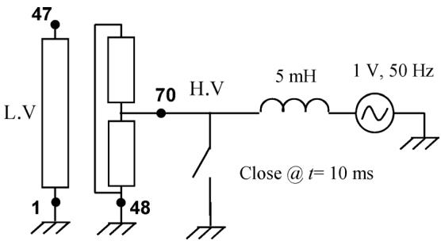  
Fig. 10. Starting simulation from 50-Hz initial conditions.

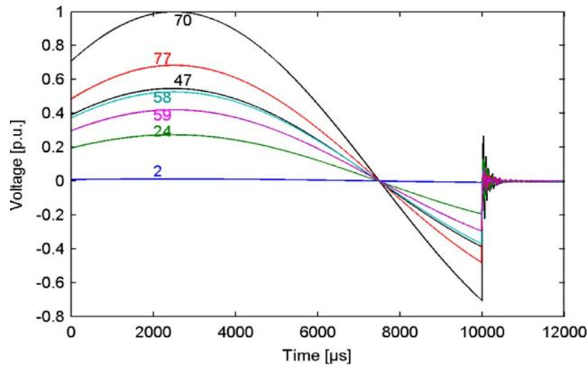  
Fig. 11. Transient response.

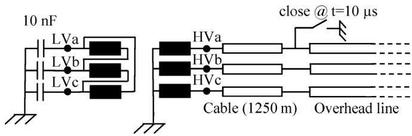  
Fig. 12. Ground fault initiation on the cable-overhead line joint.

230 kV/72.5 kV, which is 5% lower than the nominal. The 5% reduction is due to the two 2.5% tap-changer offsets in Fig. 5.

The transformer is assumed to be in stationary operation at 60 Hz and loaded with 10 nF capacitors which approximately corresponds to a 30 m stub cable connected to each phase. On the high-voltage side, the transformer is fed from an underground cable (Fig. 14) via an overhead line being at least 10 times longer than the cable. The cable is modeled using frequency-dependent parameters [12] while the overhead line is assumed to be lossless with a characteristic impedance of 400 .

${ \mathrm { A t ~ } } t \ = \ 1 0 \ \mu { \mathrm { s } } ,$ , an ideal ground fault takes place in phase “a” at voltage maximum. The ground fault causes a wave to start propagating along the cable toward the transformer where it meets the high transformer input impedance. The wave is reflected back where it meets zero impedance at the fault location, under the assumption that the arc impedance is negligible and that the arc is not interrupted.

Fig. 13 shows that the repeated wave reflections cause an oscillating overvoltage on phase “a” on the HV side. The nominal phase-ground peak voltage on the HV side is 1 p.u.

Fig. 14 shows the voltage on the midpoint of the three LV windings. It is observed that the voltage in phase “a” builds up

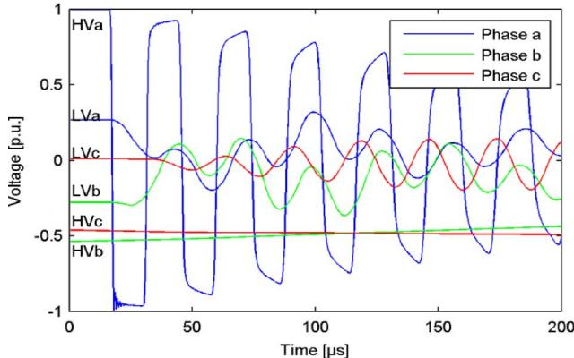  
Fig. 13. Transient overvoltage on transformer terminals.

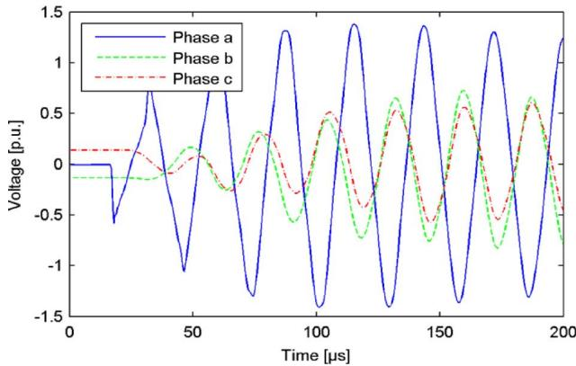  
Fig. 14. Resonant voltage buildup on LV winding midpoints.

to about 1.4 p.u. of the voltage on the HV side. Since the nominal voltage ratio is 230 kV/69 kV, this corresponds to 4.7 p.u. of the normal phase-ground voltage on the LV side, or a peak voltage of 455 kV. This is above the 325 kV BIL voltage for the 69 kV winding, and it is above the 300 kV peak voltage during the lightning impulse test in Fig. 7 (point 24 in the winding).

# VII. DISCUSSION

The constant-parameter model may alternatively be interfaced with the circuit simulator via a rational function-based model obtained by nodal analysis and curve fitting [13]. However, that approach involves a loss of accuracy due to the curve-fitting and subsequent passivity enforcement step.

# VIII. CONCLUSIONS

We presented a new approach for interfacing white-box transformer models that are based on constant matrices, with EMTP-type tools as follows.

1) The model is represented by a Norton equivalent via discretization of the ordinary differential equations in the time domain.   
2) Diagonalization is utilized for achieving high computational efficiency and for hiding information about internal overvoltages.   
3) Information about internal overvoltages is made available by passing an appropriate submatrix to the model. The size of the submatrix (number of rows) defines how many internal voltages are made available.

4) Internal surge arresters are taken into account by declaring the connection points as external and including the surge arresters in the conventional EMTP circuit.   
5) The model can automatically initialize from 50/60 Hz initial conditions.   
6) Comparison with an alternative solution method based on the inverse Numerical Laplace Transform has verified the accuracy of the approach.

Inclusion of the interface in EMTP circuit solvers will extend the capability of transformer manufacturers to study overvoltage stresses for transformers embedded in networks. It also permits the manufacturer to share its model while restricting information about internal overvoltages.

# APPENDIX A

In the case of the single-phase transformers, we can write for the elements of the inductance matrix in air

$$
e _ {i} (t) = \sum_ {j} L _ {i j} \frac {d i _ {j} (t)}{d t} = \sum_ {j} N _ {i} N _ {j} P _ {i j} \frac {d i _ {j} (t)}{d t}, i, j = 1 \dots M \tag {41}
$$

where $P _ { i , j }$ is magnetic permeance. Introducing a common flux in the core with cross-sectional area

$$
\phi (t) = B (t) A \tag {42}
$$

we obtain

$$
e _ {i} (t) = N _ {i} \frac {d \phi (t)}{d t} + \sum_ {j} N _ {i} N _ {j} P _ {i j} \frac {d i _ {j} (t)}{d t}, i, j = 1 \dots M. \tag {43}
$$

The observed magnetizing current $i _ { 0 }$ in one phase of the LV winding with $N _ { L V }$ turns and magnetizing permeance $P _ { 0 }$ are related to the core flux

$$
\phi (t) = P _ {0} N _ {L V} i _ {0} (t). \tag {44}
$$

The magnetizing current is defined by (45) which permits the flux in (44) to be expressed by (46)

$$
\sum_ {j} N _ {j} i _ {j} (t) = N _ {L V} i _ {0} (t) \tag {45}
$$

$$
\phi (t) = P _ {0} \sum_ {j} N _ {j} i _ {j} (t). \tag {46}
$$

Inserting (46) in (43), we can write

$$
e _ {i} (t) = N _ {i} \sum_ {j} \left(P _ {i j} + P _ {0}\right) N _ {j} \frac {d i _ {j} (t)}{d t}, i, j = 1 \dots M. \tag {47}
$$

Each term $( i , j )$ in (47) defines an element of the inductance matrix ${ \mathbf L } ^ { m }$ with inclusion of the magnetic core. We accordingly get

$$
L _ {i j} ^ {m} = N _ {i} \left(P _ {i j} + P _ {0}\right) N _ {j} = N _ {i} P _ {0} N _ {j} + L _ {i j}. \tag {48}
$$

Noting that ${ \cal L } _ { i j } = N _ { i } P _ { i j } N _ { j }$ in (41) we obtain the final result

$$
L _ {i j} ^ {m} = N _ {i} P _ {0} N _ {j} + L _ {i j}. \tag {49}
$$

$P _ { 0 }$ in (49) is calculated by combining (44) and (42) with known parameters $B _ { \mathrm { m a x } } , A$ and magnetizing current $i _ { 0 }$

$$
P _ {0} = \frac {B _ {\operatorname* {m a x}} A}{\sqrt {2} N _ {L V} i _ {0 , r m s}}. \tag {50}
$$

# APPENDIX B

This Appendix describes the adopted procedure for introducing short circuits between nodes, and for the grounding of nodes. We start with (7a), which we can rewrite as

$$
\mathbf {i} _ {S} = \mathbf {C} \dot {\mathbf {v}} + \mathbf {G} \mathbf {v} + \mathbf {T} ^ {T} \mathbf {i}. \tag {51}
$$

First, consider the connection of two nodes and . It follows from (51) that the total current injection becomes associated with the th node by replacing in , , and $\mathbf { T } ^ { T }$ the th row with the sum of the th and th row. The th node is not permitted to be connected to an external network, thereby enforcing the condition $\mathbf { i } _ { S } ( j ) = 0$ . To enforce the conditions $\dot { v } _ { i } = \dot { v } _ { j }$ and $v _ { i } = v _ { j }$ , we replace the th row in , and $\mathbf { T } ^ { T }$ with all zeros and we, respectively, introduce $\mathrm { ~ a ~ } ^ { \ast } { + } 1 ^ { \ast }$ and $\mathrm { ~ a ~ } ^ { \ast } { - } 1 ^ { \ast }$ in column and of the th row of and .

The grounding of a node is achieved by replacing the th row in , , and $\mathbf { T } ^ { \breve { T } }$ with all zeros. Element $\mathbf { C } ( i , i )$ is set equal to $^ { \ast } + 1 ^ { \ast }$ and the th node is not permitted to be connected to an external network, thereby enforcing the condition $\mathbf { i } _ { S } ( i ) = 0$ .

# ACKNOWLEDGMENT

The authors would like to thank the consortium participants of the SINTEF-led project “EM Transients”, and WEG Transformers, for sponsoring this research project. They would also like to thank their colleagues from CIGRE Working Group A2/C4.39 for the fruitful discussions on these issues.

# REFERENCES

[1] W. J. McNutt, T. J. Blalock, and R. A. Hinton, “Response of transformer windings to system transient voltages,” IEEE Trans. Power App. Syst., vol. PAS-93, no. 2, pp. 457–467, Mar. 1974.   
[2] JWG A2/C4.39, “Electrical transient interaction between transformers and the power system. Part 1—Expertise,” CIGRE Tech. Brochure 577A, Apr. 2014.   
[3] Karsai, Kerényi, and Kiss, Large Power Transformers. New York, USA: Elsevier, 1987, pp. 204–214.   
[4] Del Vecchio, Poulin, Feghali, Shah, and Ahuja, Transformer Design Principles – With Applications to Core-Type Transformers, 2nd ed. Boca Raton, FL, USA: CRC, 2010, pp. 239–267.   
[5] Kulkarni and Kharparde, Transformer Engineering – Design and Practice. New York, USA: Marcel Dekker, 2004, pp. 282–298.   
[6] Rabins, “Transformer reactance calculations with digital computers,” AIEE Trans., vol. 75, pt. I, pp. 261–267, 1956.   
[7] A. Semlyen and F. De León, “Eddy current and-on frequency dependent representation of winding losses in transformer models used in computing electromagnetic transients,” Proc. Inst. Elect. Eng., Gen. Transm. Distrib., vol. 141, no. 3, pp. 209–214, May 1994.   
[8] B. Gustavsen and J. De Silva, “Inclusion of rational models in an electromagnetic transients program: -parameters, -parametrs, -parameters, transfer functions,” IEEE Trans. Power Del., vol. 28, no. 2, pp. 1164–1174, Apr. 2013.   
[9] B. Gustavsen, A. P. Brede, and J. O. Tande, “Multivariate analysis of transformer resonant overvoltages in power stations,” IEEE Trans. Power Del., vol. 26, no. 4, pp. 2563–2572, Oct. 2011.

[10] J. Mahseredjian and F. Alvaredo, “Creating an electromagnetic transients program in Matlab: MatEMTP,” IEEE Trans. Power Del., vol. 12, no. 1, pp. 380–388, Jan. 1997.   
[11] P. Moreno and A. Ramirez, “Implementation of the Numerical Laplace Transform: A review task force on frequency domain methods for EMT Studies,” IEEE Trans. Power Del., vol. 23, no. 4, pp. 2599–2609, Oct. 2008.   
[12] A. Morched, B. Gustavsen, and M. Tartibi, “A universal model for accurate calculation of electromagnetic transients on overhead lines and underground cables,” IEEE Trans. Power Del., vol. 14, no. 3, pp. 1032–1038, Jul. 1999.   
[13] B. Gustavsen and A. Portillo, “A black-box approach for interfacing white-box transformer models with electromagnetic transients programs,” presented at the IEEE Power Eng. Soc. Gen. Meeting, Washington, DC, USA, 2014.

Bjørn Gustavsen (M’94–SM’03–F’14) was born in Norway in 1965. He received the M.Sc. and Dr.Ing. degrees in electrical engineering from the Norwegian Institute of Technology (NTH), Trondheim, Norway, in 1989 and 1993, respectively.

Since 1994, he has been with SINTEF Energy Research, Trondheim, Norway, where he is currently a Chief Research Scientist. He spent 1996 as a Visiting Researcher at the University of Toronto, Toronto, ON, Canada and the summer of 1998 at the Manitoba HVDC Research Centre, Winnipeg, MB, Canada. He was a Marie Curie Fellow at the University of Stuttgart, Stuttgart, Germany, from 2001 to 2002. His interests include the simulation of electromagnetic transients and modeling of frequency-dependent effects.

Álvaro Portillo (M’84–SM’01) was born in Uruguay in 1954. He graduated in Electrical Engineering from the Uruguayan Republic University, Montevideo, Uruguay, in 1979.

He was with the Uruguayan electrical utility (UTE) up until 1985 in activities related to transformers acceptance, installation, and maintenance. From 1985 to 1999, he was with MAK S.A. (a Uruguayan manufacturer of transformers); from 2000 to 2007, he was a Consultant with TRAFO (a Brazilian manufacturer of transformers); and since 2007, he has been a Consultant in the development of software tools for transformer design at WEG (a Brazilian manufacturer of transformers). He has been a Professor at the Uruguayan Republic University since 1977, and is now responsible for postgraduation courses about transformers (specification, design, operation, maintenance, etc.).