# 非隔离型直流变压器的快速电磁暂态等效建模方法

王渝红，周奕辰，高仕林，张 巍，廖建权，郑宗生（四川大学电气工程学院，四川省成都市 610000）

摘要：电磁暂态仿真对于掌握直流变压器的运行特性具有重要意义，但目前的模块化变流器高速等效建模方法对非隔离型变压器较少提及。同时，现有非隔离型直流变压器电磁暂态仿真模型存在开关状态计算复杂、内部节点数多的问题，导致系统仿真效率低下。为此，提出一种基于开关状态预测和戴维南等效的非隔离型直流变压器快速电磁暂态等效建模方法。首先，提出一种非隔离型直流变压器中子模块的开关状态预测方法。其次，基于开关状态得到直流变压器桥臂的等效电路，并对其进行戴维南等效，得到桥臂的两节点等效电路模型。然后，建立自耦变压器的等效电路模型，综合桥臂和自耦变压器等效电路，获得直流变压器的等效电路，并据此建立直流变压器的节点电压方程。最后，基于高斯消元对方程进行降阶，实现非隔离型直流变压器仿真模型的内节点收缩。算例分析表明，所提非隔离型直流变压器的快速电磁暂态等效建模方法与传统详细建模方法精度接近，仿真效率显著提升。

关键词：直流变压器；戴维南等效；电磁暂态仿真；等效建模；开关状态预测；内节点收缩

# 0 引 言

“碳达峰·碳中和”政策背景下［1］ ，高比例新能源广泛接入是未来电力系统发展趋势［2-3］ 。近年来，随着电力电子技术的发展，柔性直流输电技术在可再生能源并网和传输中得到广泛应用［4-5］。随着柔性直流电压等级和容量的不断发展，以柔性直流为核心的多电压等级直流电网有望在大规模可再生能源消纳等场景中发挥重要作用。对于多电压等级直流电网，集成了电压变换、功率传输等功能的直流变压器是枢纽设备。一般而言，根据输入输出直流侧是否具备电气隔离特性，可分为隔离型直流变压器和非隔离型直流变压器［6-7］ ，分别应用于不同场景。

为了掌握直流变压器的运行特性，需要借助电磁暂态仿真软件对其进行仿真分析。但是，在使用传统分立元件建模仿真方法［8］ 对直流变压器进行电磁暂态仿真时，由于直流变压器模型内部子模块数量多、节点数多［9］ ，面临系统维数较高、仿真效率低等问题［10］ 。因此，针对直流变压器类似的模块化变流器，对其进行快速电磁暂态等效建模引起了国内外学者的广泛关注。

对 于 模 块 化 多 电 平 换 流 器（modular multilevel

converter，MMC）的电磁暂态等效建模方法，文献［11］利用戴维南等效模型将MMC的桥臂降阶为电压源和电阻串联的两节点支路。同时，保留了每个子模块的充电和放电信息。文献［12］提出一种基于 Dommel等值并能够解决二极管插值、闭锁等问题的改进模型。文献［13］对 MMC 采用平均值模型，将换流器替换成受控源，忽略了换流器内部的特性，虽然仿真效率更高，但无法精确模拟出元件内部的特性。文献［14］在对 MMC仿真时，在详细等值模型、桥臂等值模型以及平均值模型中根据具体的仿真要求灵活切换。为进一步提升戴维南等效模型的仿真效率，文献［15］在子模块电容电压排序方面采用改进排序的电容电压平衡方法，对戴维南等效模型进行了优化，该算法显著提升了计算效率但未考虑部分运行工况。文献［16］考虑混合型MMC的全状态运行方式，在解锁状态下采用改进灵活堆排序的电容电压排序算法，提高了仿真效率，具有较好的通用性。文献［17］将混合数值积分的方法应用于半桥型 MMC的电磁暂态仿真中，不仅降低了系统维数，而且使得支路等效电导恒定。尽管上述文献对 的快速仿真建模展开了深入研究，但并未涉及仿真中复杂开关迭代计算问题，且侧重于MMC的等效建模，如何扩展至模块化直流变压器的建模还需进一步深入探究。对于模块化直流变压器而言，文献［18］针对多模块输入串联输出并联结

构的双有源桥变换器的电流以及电容电压进行解耦，实现了电磁暂态仿真中节点导纳矩阵的降阶，提高了系统仿真效率。文献［19］对于级联 H 桥型双有源桥变换器，利用端口解耦、节点导纳矩阵预处理的方法实现了内节点收缩，使得含有该变压器的系统仿真速度大大提升。

上述模块化变流器高速等效建模方法大多针对MMC和隔离型直流变压器，对非隔离型变压器较少提及。然而，与隔离型直流变压器相比，非隔离型直流变压器存在成本低、效率高等优点，在多级直流电网中具有广阔的应用前景，研究非隔离型直流变压器的快速等效建模对含非隔离型直流变压器的多级直流电网的电磁暂态特性分析具有重要意义。本文针对非隔离型模块化多电平直流变压器进行分析，提出一种非隔离型直流变压器的快速电磁暂态等效建模方法。首先，利用开关状态预测方法判断直流变压器电力电子开关状态，避免了开关状态的迭代求解。其次，利用戴维南等效、高斯消元等实现直流变压器电磁暂态仿真模型的降阶计算。该方法不仅保留了非隔离型直流变压器的所有电气特性，而且降低了仿真所需计算量，提升了仿真效率。

# 1 非隔离型直流变压器的拓扑及运行原理

典型非隔离型直流变压器的拓扑结构如图1所示［20］ 。可以发现，非隔离型直流变压器包含两个串组，每个串组由两组串联的子模块以及一个自耦变压器组成。交流测的电流可通过这两个串组形成环流，从而不进入直流侧。非隔离型直流变压器两个串组相同，每个串组均包含正栈、负栈、桥臂电感 $L _ { \mathrm { a } }$ 和自耦变压器 $L _ { \mathrm { T } }$ 。正栈包含 M 个全桥子模块（full-bridge submodule，FBSM）和 N 个 半 桥 子 模 块（half-bridge submodule，HBSM），负 栈 包 含 Z 个 HBSM。图中： $\mathrm { ; T _ { 1 } }$ 至T 为开关管； ${ \bf ; D } _ { 1 }$ 至 $\mathrm { D } _ { 4 }$ 为二级管； $\cdot \dot { \iota _ { \mathrm { L } } }$ 为流过桥臂电感的电流； $U _ { \mathrm { { L } } }$ 为低压侧电压； $U _ { \mathrm { H } }$ 为高压侧电压 $; u _ { \mathrm { C } }$ 为电容两端电压；变比 $K { = } U _ { \mathrm { { H } } } / U _ { \mathrm { { L } } }$ ，而自耦变压器的变比 $K _ { \mathrm { T } }$ 就可以表示为1/(K-1)。

直流变压器每个串组中，正栈和负栈都可以等效为串联的直流电压源和交流电压源。当正栈和负栈的交流电压源之间相位差超过180°时，交流有功功率从负栈转移到正栈，达到能量平衡目的。正栈吸收交流功率并释放直流功率，负栈吸收直流功率并释放交流功率。当正栈的直流电流大于 时，输出电流也大于 0，故整个变压器的功率流向是从低压侧到高压侧。相反，当正栈和负栈的交流电压源之间相位差小于180°时，交流有功功率从正栈转移到负栈。因此，整个变压器的功率流向是从高压侧

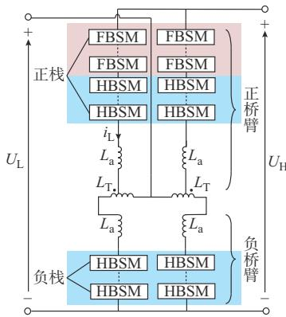  
(a) 	

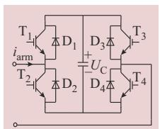  
(b) FBSM

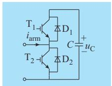  
(c) HBSM   
图1 非隔离型直流变压器的拓扑  
Fig. 1 Topology of non-isolated DC transformer

到低压侧。当高压侧或低压侧发生故障时，正栈还能提供故障限流的功能［20］ 。

上述非隔离型直流变压器具体的控制策略以及运行原理可参考文献［20］，相关细节本文不再赘述。

在对上述非隔离型直流变压器进行电磁暂态仿真时，由于该直流变压器的结构复杂，其电磁暂态仿真模型包含多个 HBSM 和 FBSM 以及自耦变压器等部分，子模块的开关状态难以判断，模型内部节点较多，子模块开关状态计算复杂，节点导纳矩阵的阶数较高，仿真效率低。

针对上述问题，下文提出一种非隔离型直流变压器的开关状态预测方法，并建立了非隔离型直流变压器的快速电磁暂态等效模型。

# 2 非隔离型直流变压器的开关状态预测

针对仿真中直流变压器电力电子开关状态判断难题，本章提出的开关状态预测方法根据局部的电气以及控制信息精准预测下一时刻子模块的开关状态。与传统方法在每一时步对系统的开关状态组合进行多次迭代计算相比，所提开关状态预测方法提升了系统仿真效率，其具体细节如下。由图1可知，该非隔离型直流变压器含有两种子模块，即HBSM和 FBSM。 对 于 FBSM，可 以 将 其 拆 分 为 两 个HBSM并分别对其进行开关预测。在HBSM中，子模块的开关状态相互之间不影响，其只取决于电容电压 $u _ { \mathrm { C } }$ 、桥臂电流 $i _ { \mathrm { a r m } }$ 和门触发信号 $G _ { \circ }$ 。由于电感和电容的存在，这些参数不会突变。基于此，在仿真中，可以利用上一个时步的桥臂电流和电容电压来预测当前时刻的开关状态［21］ 。

步骤 1：利用上一个时步的电气量和门触发信号来预测子模块中绝缘栅双极型晶体管（IGBT）/二极管组的开关状态。

步骤2：根据步骤1子模块中IGBT的状态切换情况，预测二极管状态的同步切换，实现 HBSM 中开关状态的协调性预测。

1）IGBT/二极管组的开关状态初步预测

设 $x _ { k } ( t )$ 为第k个IGBT/二极管组的开关状态： $x _ { k } \left( t \right)$ =

IGBT处于开通状态、二极管处于关断状态$\begin{array} { r l r } { \bigg \{ 2 } & { { } } & { \mathrm { I G B T } \mathcal { U } \mathrm { E } \mp \ddagger { M F I } \mathcal { U } \mathrm { T } \mathcal { U } \overline { { X } } . \ddagger { M Z } . } \end{array}$ $\begin{array} { r l r } { \big | 0 } & { { } } & { \mathrm { I G B T } , \mathop { \longrightarrow } \mathcal { Z } \mathcal { Z } \frac { \partial / } { \partial \mathrm { R } } \mathcal { Z } \frac { \partial / } { \partial \mathrm { R } } \mathcal { Z } \mathcal { Z } \mathcal { H } \mathcal { H } \mathrm { R } \mathcal { T } \mathcal { Z } \mathcal { K } \mathcal { W } \mathrm { R } \mathcal { Z } \mathcal { K } \mathcal { K } \mathcal { K } \mathcal { K } \mathcal { K } \mathcal { K } \mathcal { K } \mathcal { K } \mathcal { K } \mathcal { K } \mathcal { K } \mathcal { K } } \end{array}$

开关之间的状态转移关系如图 2 所 $\widehat { \overline { { A } } } ^ { [ 2 2 ] }$ 。 图中： $: u _ { \mathrm { C E , o n } }$ 为开关管的导通压降； $\mathfrak { ; } u _ { \mathrm { C E } } \left( t \right)$ 为 t 时刻集电极-发射极间的电压； $\operatorname { \mathrm { ; } } G ( t )$ 为t时刻门极信号； $i _ { \mathrm { C E } } \left( t \right)$ 为 t时刻集电极电流 $\mathbf { ; } \Delta t$ 为仿真步长。若上述开关状态转移关系没有被满足，则代表开关状态保持不变。

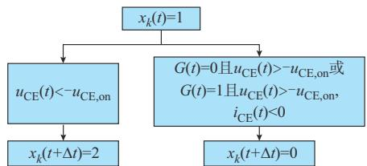  
(a) xk(t)=1'D/2

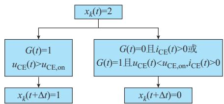

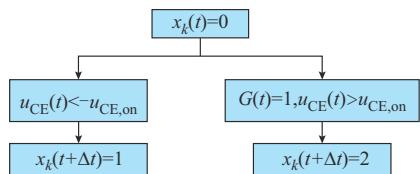  
(b) x (t)=2'D/2   
(c) x (t)=0'D/2   
图2　开关间的状态转移关系  
Fig. 2 State transition relationship among switches

以 $x _ { k } ( t ) = 1$ 为 例 ，当 $u _ { \mathrm { C E } } \left( t \right) < - u _ { \mathrm { C E , o n } }$ 时 ，$x _ { k } ( t + \Delta t ) { = } 2 ; \ Y G ( t ) { = } 0$ 且 $u _ { \mathrm { C E } } \left( t \right) > - u _ { \mathrm { C E , o n } }$ 或者$G ( t ) \mathrm { = } 1$ 且 $u _ { \mathrm { C E } } ( t ) > - u _ { \mathrm { C E , o n } } , i _ { \mathrm { C E } } ( t ) < 0$ 时 ， $x _ { k } ( t +$ $\Delta t ) { = } 0 _ { \circ }$ 。

在电磁暂态仿真中，通常将IGBT/二极管组等效为一个开关。 $x _ { k } ( t ) = 1$ 或 2时，开关管导通，为小电阻 ${ \ : } ; x _ { k } ( t ) { = } 0$ 时，开关管关断，等效为大电阻。

2）HBSM中开关状态的协调性预测

HBSM 包含上下两个桥臂，其中，上下桥臂的

IGBT的门极信号要满足不能同时为1的限定条件。同时，在 IGBT的开关变化会导致另一桥臂的二极管承受正压导通或反压关断。

以 $i _ { \mathrm { a r m } } \left( t \right) > 0$ 为例，具体判断流程如式（2）所示。开关管 $\mathrm { T } _ { 2 }$ 为电流的主动导通路径，当 $\mathrm { T } _ { 2 }$ 由关断切换为导通时，电流由T 流入，D 承受反压而关断。又因为 $\mathrm { T } _ { 1 \setminus } \mathrm { T } _ { 2 }$ 的两个门触发信号不同时为 1，T 处于关断状态。此时，T 、T 的开关状态就变成$x _ { 1 } ( t ) { = } 0 , x _ { 2 } ( t ) { = } 1$ 。当 $\mathrm { T _ { 2 } }$ 由导通切换为关断时，$\mathrm { D } _ { 1 }$ 由于二极管的续流作用而开通，T 由于承受反压而关断。此时， $x _ { 1 } ( t ) = 2 , x _ { 2 } ( t ) = 0 , \ i _ { \mathrm { a r m } } ( t ) < 0$ 时，开关管T 为电流的主动导通路径，具体判断流程如式（ ）所示［23］ 。

$$
i _ {\mathrm {a r m}} (t) > 0 \text {时 , 有}
$$

$$
\left\{\begin{array}{l l}\mathrm {T} _ {2} \text {导 通}&\rightarrow x _ {1} (t) = 0, x _ {2} (t) = 1\\\mathrm {T} _ {2} \text {关 断}&\rightarrow x _ {1} (t) = 2, x _ {2} (t) = 0\end{array}\right. \tag {2}
$$

$$
i _ {\mathrm {a r m}} (t) <   0 \text {时 , 有}
$$

$$
\left\{\begin{array}{l l}\mathrm {T} _ {1} \text {导 通}&\rightarrow x _ {1} (t) = 1, x _ {2} (t) = 0\\\mathrm {T} _ {1} \text {关 断}&\rightarrow x _ {1} (t) = 0, x _ {2} (t) = 2\end{array}\right. \tag {3}
$$

# 3 非隔离型直流变压器的快速等效建模方法

针对系统节点数过多导致节点导纳矩阵阶数过高的问题，本章在传统 MMC电磁暂态等效建模所关注的桥臂等效基础上，进一步对整个直流变压器模型进行降维，消去直流变压器电磁暂态仿真模型全部内节点。相较于传统MMC的电磁暂态等效建模方法，本文在进行节点收缩时，是将桥臂以及变压器一起进行节点收缩，而不是只考虑桥臂的节点收缩，所提降维方法可进一步降低仿真模型的计算量。

# 3. 1　桥臂正栈和负栈等效建模

首先，对非隔离型直流变压器的正栈和负栈（即桥臂串联子模块）进行戴维南等效处理，实现桥臂降阶建模。非隔离型直流变压器单个桥臂的子模块拓扑包括 HBSM 和 FBSM 两种，其结构如图 1（b）所示。

根据第2章的开关状态预测，可以将HBSM或FBSM 的 IGBT/二极管开关组在开通或关断状态下分别等效为小电阻或是大电阻。因此，将 $\mathrm { T } _ { 1 }$ 和 $\mathrm { D } _ { 1 }$ 组成的上开关组等效为可变电阻 $R _ { 1 } ; \mathrm { T }$ 和 D 组成的下开关组等效为可变电阻 $R _ { 2 } ; \mathrm { T _ { 3 } }$ 和 $\mathrm { D } _ { 4 }$ 组成的下开关组等效为可变电阻 $R _ { 3 } ; \mathrm { T _ { 4 } }$ 和 $\mathrm { D } _ { 4 }$ 组成的下开关组等效为可变电阻 $R _ { 4 } { \mathrm { ~ c ~ } }$ 。通常，处于开通状态时的可变电阻值取为 0.05 Ω，处于关断状态时的可变电阻值 取 为 $1 \times 1 0 ^ { 8 } ~ \Omega _ { \odot }$ 。 开 关 元 件 等 效 后 ，HBSM 和

FBSM的等效电路见附录A图 $\mathrm { A } 1 ^ { [ 2 4 ] }$ 。

电磁暂态仿真中，为了对系统微分方程进行求解，通常先利用梯形法对元件微分方程进行离散化，得到元件的差分方程［25］ ，并将其等效为诺顿等效电路，然后进行求解。下文采用梯形法对电容动态方程进行离散化［26］ 。电容的动态方程可以表示为：

$$
\frac {\mathrm {d} u _ {\mathrm {C}} (t)}{\mathrm {d} t} = \frac {1}{C} i _ {\mathrm {C}} (t) \tag {4}
$$

式中：C 为子模块电容 ${ \mathrm { ; } } u _ { \mathrm { c } } \left( t \right)$ 为 t时刻电容两端电压；i (t)为t时刻流过电容的电流。

采用梯形法对式（4）进行离散，可得

$$
u _ {\mathrm {C}} (t) = u _ {\mathrm {C}} (t - \Delta t) + \frac {\Delta t}{C} \left[ \frac {i _ {\mathrm {C}} (t) + i _ {\mathrm {C}} (t - \Delta t)}{2} \right] \tag {5}
$$

令

$$
\left\{ \begin{array}{l} R _ {\mathrm {c e q}} = \frac {\Delta t}{2 C} \\ u _ {\mathrm {c e q}} (t - \Delta t) = \frac {\Delta t}{2 C} i _ {\mathrm {C}} (t - \Delta t) + u _ {\mathrm {C}} (t - \Delta t) \end{array} \right. \tag {6}
$$

式中： $R _ { \mathrm { c e q } }$ 为电容等效电阻 ${ \bf \xi } _ { \bf { \xi } } u _ { \mathrm { c e q } } \left( { \bf \xi } _ { t } - \Delta t \right)$ 为电容等效的历史电压源。则式（5）可简化为：

$$
u _ {\mathrm {C}} (t) = R _ {\mathrm {c e q}} i _ {\mathrm {C}} (t) + u _ {\mathrm {c e q}} (t - \Delta t) \tag {7}
$$

进一步，根据式（7）及附录 A 图 A1 的等效拓扑，可以推得子模块戴维南等效电路见附录 A 图A2。可以发现，对于 HBSM和 FBSM，其戴维南等效电路结构一致。不同点在于，t时刻戴维南等效电路的开路电压 $u _ { \mathrm { s m e q } } \left( t \right)$ 和戴维南等效电阻 $R _ { \mathrm { s m e q } }$ 表达式不同。

对于 HBSM 和 FBSM， $u _ { \mathrm { s m e q } } \left( t \right)$ 和 $R _ { \mathrm { s m e q } }$ 可以分别表示为式（8）和式（9）所示的形式［24］ 。

$$
\left\{ \begin{array}{l} u _ {\text {s m e q}} (t) = \frac {R _ {2}}{R _ {1} + R _ {2} + R _ {\text {c e q}}} u _ {\text {c e q}} (t - \Delta t) \\ R _ {\text {s m e q}} = \frac {R _ {1} + R _ {\text {c e q}}}{R _ {1} + R _ {2} + R _ {\text {c e q}}} R _ {2} \end{array} \right. \tag {8}
$$

$$
\left\{ \begin{array}{l} u _ {\text {s m e q}} (t) = \frac {R _ {2} - R _ {4}}{R _ {1} + R _ {2} + 2 R _ {\text {c e q}}} u _ {\text {c e q}} (t - \Delta t) \\ R _ {\text {s m e q}} = \frac {R _ {1} R _ {\text {c e q}} + R _ {3} (R _ {1} + R _ {2} + R _ {\text {c e q}})}{(R _ {1} + R _ {2}) (R _ {1} + R _ {2} + 2 R _ {\text {c e q}})}. \\ \frac {R _ {2} R _ {\text {c e q}} + R _ {4} (R _ {1} + R _ {2} + R _ {\text {c e q}})}{(R _ {1} + R _ {2}) (R _ {1} + R _ {2} + 2 R _ {\text {c e q}})} + \frac {R _ {1} + R _ {2}}{R _ {1} + R _ {2} + R _ {\text {c e q}}} \end{array} \right. \tag {9}
$$

将正栈或负栈串联的子模块的戴维南等效电路叠加，可以得到正栈或负栈的等效电路，见附录 A图 $\mathrm { A } 3 _ { \circ }$ 。对于负栈，图A3中 $u _ { \mathrm { e q } } \left( t \right)$ 和 $R _ { \mathrm { e q } }$ 可以表示为式（10）。

$$
\left\{ \begin{array}{l} u _ {\mathrm {e q}} (t) = \sum_ {i = 1} ^ {Z} u _ {i, \text {s m e q}} (t) \\ R _ {\mathrm {e q}} = \sum_ {i = 1} ^ {Z} R _ {i, \text {s m e q}} \end{array} \right. \tag {10}
$$

式中： ${ \mathrm { : } } u _ { \mathrm { e q } } \left( t \right)$ 和 $R _ { \mathrm { e q } }$ 分别为串联子模块的戴维南等效电路的开路电压和等效电阻； $\mathbf { \sigma } _ { \mathbf { ; } u _ { i , \mathrm { s m e q } } } ( \mathit { t } )$ 和 $R _ { i , { \mathrm { s m e q } } }$ 分别为 t时刻第 i个子模块戴维南等效电路的开路电压和戴维南等效电阻；Z为子模块个数。

正 栈 等 效 电 路 中， $u _ { \mathrm { e q } } \left( t \right)$ 和 $R _ { \mathrm { e q } }$ 计 算 表 达 式 类似，不同之处仅在于子模块个数不一致，此处不再赘述。

# 3. 2　桥臂等效建模

桥臂电感L 的动态方程可以表示为：

$$
\frac {\mathrm {d} i _ {\mathrm {L}} (t)}{\mathrm {d} t} = \frac {1}{L _ {\mathrm {a}}} u _ {\mathrm {L}} (t) \tag {11}
$$

式中：i (t)为t时刻流过桥臂电感的电流； $u _ { \mathrm { { L } } } \left( t \right)$ 为 t时刻桥臂电感两端的电压。

采用梯形积分法对式（11）进行离散，可得［24］ ：

$$
i _ {\mathrm {L}} (t) = i _ {\mathrm {L}} (t - \Delta t) + \frac {\Delta t}{L _ {\mathrm {a}}} \left[ \frac {u _ {\mathrm {L}} (t) + u _ {\mathrm {L}} (t - \Delta t)}{2} \right] \tag {12}
$$

令

$$
\left\{ \begin{array}{l} R _ {\mathrm {L e q}} = \frac {2 L _ {\mathrm {a}}}{\Delta t} \\ I _ {\mathrm {L e q}} (t - \Delta t) = \frac {\Delta t}{2 L _ {\mathrm {a}}} u _ {\mathrm {L}} (t - \Delta t) + i _ {\mathrm {L}} (t - \Delta t) \end{array} \right. \tag {13}
$$

式中： $R _ { \mathrm { L e q } }$ 为电感等效电阻； $I _ { \mathrm { L e q } } \left( t - \Delta t \right)$ 为电感等效的历史电流源。则式（11）可简化为：

$$
i _ {\mathrm {L}} (t) = \frac {1}{R _ {\mathrm {L e q}}} u _ {\mathrm {L}} (t) + I _ {\mathrm {L e q}} (t - \Delta t) \tag {14}
$$

根据式（14）可以得到电感 $L _ { \mathrm { a } }$ 的离散化模型，见附录A图A4。根据电感等效电路和正、负栈等效电路，可以推出桥臂等效电路，见附录A图A5。

附录A图A5中，有

$$
\left\{ \begin{array}{l} Y _ {\text {e f f}} = \frac {1}{R _ {\mathrm {L e q}} + R _ {\mathrm {e q}}} \\ I _ {\text {h i s}} (t - \Delta t) = \frac {u _ {\mathrm {e q}} (t)}{R _ {\mathrm {e q}}} + I _ {\mathrm {L e q}} (t - \Delta t) \end{array} \right. \tag {15}
$$

式中： $Y _ { \mathrm { e f f } }$ 和 $I _ { \mathrm { h i s } } ( t - \Delta t )$ 分别表示桥臂等效电导和历史电流源。上述等效过程将包含多元件和多节点的桥臂等效为电阻和历史电流源并联的两节点支路，显著降低了桥臂动态方程的维数。

# 3. 3　自耦变压器的快速等效模型

非隔离型直流变压器中的自耦变压器结构如图3所示。图中： $: u _ { 1 1 } \Omega \wedge u _ { 2 2 }$ 分别表示一、二次侧的端电压；$i _ { 1 } , i _ { 2 }$ 分别表示流入一、二次侧的电流。

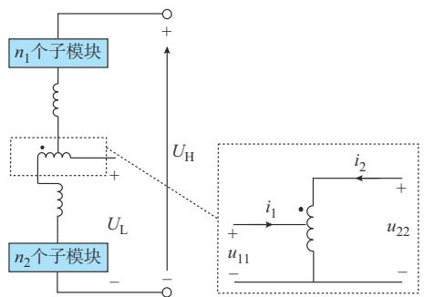  
图3 自耦变压器结构图  
Fig. 3 Structure diagram of autotransformer

变压器动态方程可以表示为：

$$
\frac {\mathrm {d} \boldsymbol {i}}{\mathrm {d} t} = L ^ {- 1} \boldsymbol {u} \tag {16}
$$

式中：

$$
\left\{ \begin{array}{l} \boldsymbol {u} = \left[ \begin{array}{l l} u _ {1 1} (t) & u _ {2 2} (t) \end{array} \right] ^ {\mathrm {T}} \\ \boldsymbol {i} = \left[ \begin{array}{l l} i _ {1} (t) & i _ {2} (t) \end{array} \right] ^ {\mathrm {T}} \\ L = \left[ \begin{array}{l l} L _ {1 1} & L _ {1 2} \\ L _ {1 2} & L _ {2 2} \end{array} \right] \end{array} \right. \tag {17}
$$

矩阵L的元素可以计算为：

$$
\left\{ \begin{array}{l} L _ {1 1} = L _ {1} + K L _ {1 2} \\ L _ {2 2} = \frac {L _ {2}}{K ^ {2}} + \frac {L _ {1 2}}{K} \end{array} \right. \tag {18}
$$

式中： $L _ { \textrm { 1 } , L _ { \textrm { 2 } } }$ 分别为变压器的一、二次侧漏电感；L为绕组间互感。

利用梯形法有：

$$
\frac {\mathrm {d} \boldsymbol {i}}{\mathrm {d} t} = L ^ {- 1} \boldsymbol {u} \tag {19}
$$

对式（16）进行离散化得：

$$
i = Y _ {\mathrm {t}} u + I _ {\mathrm {h}} \tag {20}
$$

式中：

$$
Y _ {\mathrm {t}} = \left[ \begin{array}{l l} Y _ {1 1} & Y _ {1 2} \\ Y _ {1 2} & Y _ {2 2} \end{array} \right] = L ^ {- 1} \frac {\Delta t}{2} \tag {21}
$$

$$
I _ {\mathrm {h}} = Y _ {\mathrm {t}} \boldsymbol {u} ^ {\prime} + \boldsymbol {i} ^ {\prime} = \left[ \begin{array}{l} I _ {\mathrm {h 1}} (t) \\ I _ {\mathrm {h 2}} (t) \end{array} \right] \tag {22}
$$

$$
\boldsymbol {u} ^ {\prime} = \left[ \begin{array}{l} u _ {1} (t - \Delta t) \\ u _ {2} (t - \Delta t) \end{array} \right] \tag {23}
$$

$$
i ^ {\prime} = \left[ \begin{array}{l} i _ {1} (t - \Delta t) \\ i _ {2} (t - \Delta t) \end{array} \right] \tag {24}
$$

式中： $Y _ { \mathrm { { t } } }$ 为变压器的导纳矩阵； $Y _ { 1 1 }$ 、 $Y _ { 2 2 }$ 分别为两个端口节点的自导纳； $Y _ { 1 2 }$ 为互导纳； $I _ { \mathrm { h } }$ 为历史电流源向量，在电磁暂态仿真中，可利用上一时步电压与电流向量求得。

基于式（20），可以得到自耦变压器的等效电路，见附录 图 $\mathrm { A } 6 ^ { [ 2 7 ] }$ 。

# 3. 4　非隔离型直流变压器等效电路构建

基于桥臂等效模型和自耦变压器等效模型，可得非隔离型直流变压器的等效电路，如图 4所示。图 中 ： $Y _ { \mathrm { e f f 1 } \setminus } \ Y _ { \mathrm { e f f 2 } \setminus } \ Y _ { \mathrm { e f f 3 } \setminus } \ Y _ { \mathrm { e f f 4 } }$ 为 桥 臂 等 效 电 导 ； $I _ { \mathrm { h i s 1 } } .$ 、$I _ { \mathrm { h i s 2 } } \setminus I _ { \mathrm { h i s 3 } } \setminus I _ { \mathrm { h i s 4 } }$ 则为对应的历史电流源；端口 $\textcircled{1} \sim \textcircled{3 }$ 表示非隔离型直流变压器的外部端口，端口④~⑦表示内部端口。

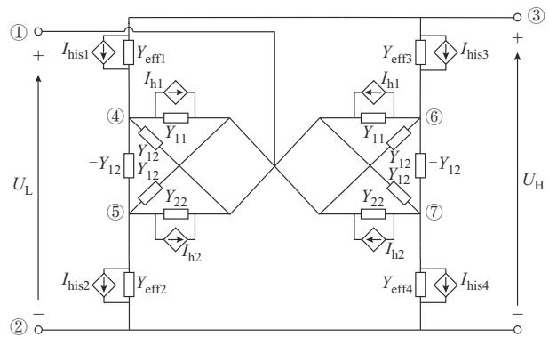  
图4 非隔离型直流变压器等效电路  
Fig. 4 Equivalent circuit of non-isolated DC transformer

根据图 4所示等效电路，可以建立非隔离型直流变压器的节点电压方程［27］ ：

$$
\left[ \begin{array}{l} \boldsymbol {i} _ {\mathrm {h o}} \\ \boldsymbol {i} _ {\mathrm {h i}} \end{array} \right] = \left[ \begin{array}{l l} Y _ {\mathrm {o}} & Y _ {\mathrm {o i}} \\ Y _ {\mathrm {o i}} ^ {\mathrm {T}} & Y _ {\mathrm {i}} \end{array} \right] \left[ \begin{array}{l} \boldsymbol {u} _ {\mathrm {o}} \\ \boldsymbol {u} _ {\mathrm {i}} \end{array} \right] \tag {25}
$$

式中： $Y _ { \mathrm { o } \setminus Y _ { \mathrm { i } } }$ 分别为边界和内部节点的自导纳矩阵；$Y _ { \mathrm { o i } }$ 为 外 部 和 边 界 节 点 的 互 导 纳 矩 阵 ； $\mathbf { \delta } _ { \mathbf { \alpha } _ { 0 } } =$ $[ \mathbf { \Psi } _ { u _ { 1 } } , u _ { 2 } , u _ { 3 } ] ^ { \mathrm { T } }$ 为 边 界 节 点 电 压 向 量 ； $\pmb { u } _ { \mathrm { i } } = [ u _ { 4 } , u _ { 5 } ,$ ，$u _ { 6 } , u _ { 7 } ] ^ { \mathrm { T } }$ 为内部节点电压向量； $; i _ { \mathrm { h i } }$ 和 $i _ { \mathrm { h o } }$ 分别为内部节点和边界节点的注入历史电流向量。节点导纳矩阵中， $Y _ { \mathrm { o } } \mathrm { , } Y _ { \mathrm { o i } } \mathrm { , } Y _ { \mathrm { i } }$ 的具体表达式分别如式（26）、式（27）、式（28）所示。

$$
\begin{array}{l} Y _ {0} = \\ \left[ \begin{array}{c c c} 2 Y _ {1 1} + 4 Y _ {1 2} + 2 Y _ {2 2} & & \\ & Y _ {\text {e f f} 2} + Y _ {\text {e f f} 4} & \\ & & Y _ {\text {e f f} 1} + Y _ {\text {e f f} 3} \end{array} \right] \tag {26} \\ \end{array}
$$

$$
\begin{array}{l} Y _ {\mathrm {o i}} = \\ \left[ \begin{array}{c c c c} - Y _ {1 1} - Y _ {1 2} & - Y _ {2 2} - Y _ {1 2} & - Y _ {1 1} - Y _ {1 2} & - Y _ {2 2} - Y _ {1 2} \\ & - Y _ {\text {e f f 2}} & & - Y _ {\text {e f f 4}} \\ - Y _ {\text {e f f 1}} & & - Y _ {\text {e f f 3}} \end{array} \right] \tag {27} \\ Y _ {i} = \\ \end{array}
$$

$$
\left[ \begin{array}{c c c c} Y _ {1 1} + Y _ {\text {e f f 1}} & Y _ {1 2} & & \\ Y _ {1 2} & Y _ {2 2} + Y _ {\text {e f f 2}} & & \\ & & Y _ {1 1} + Y _ {\text {e f f 3}} & Y _ {1 2} \\ & & Y _ {1 2} & Y _ {2 2} + Y _ {\text {e f f 4}} \end{array} \right] \tag {28}
$$

为实现模型降阶，利用高斯消元法，将式（25）变换为只含有边界节点的节点电压方程［27］ ：

$$
Y _ {\text {o u t}} \boldsymbol {u} _ {\mathrm {o}} = \boldsymbol {i} _ {\mathrm {e q}} \tag {29}
$$

式中：

$$
\begin{array}{l} Y _ {\text {o u t}} = Y _ {\mathrm {o}} - Y _ {\mathrm {o i}} Y _ {\mathrm {i}} ^ {- 1} Y _ {\mathrm {o i}} ^ {\mathrm {T}} = \left[ \begin{array}{l l l} Y _ {\mathrm {e q} 1 1} & Y _ {\mathrm {e q} 1 2} & Y _ {\mathrm {e q} 1 3} \\ Y _ {\mathrm {e q} 1 2} & Y _ {\mathrm {e q} 2 2} & Y _ {\mathrm {e q} 2 3} \\ Y _ {\mathrm {e q} 1 3} & Y _ {\mathrm {e q} 2 3} & Y _ {\mathrm {e q} 3 3} \end{array} \right] (30) \\ \boldsymbol {i} _ {\mathrm {e q}} = \boldsymbol {i} _ {\mathrm {h o}} - Y _ {\mathrm {o i}} Y _ {\mathrm {i}} ^ {- 1} \boldsymbol {i} _ {\mathrm {h i}} = \left[ \begin{array}{l} i _ {\mathrm {e q 1}} \\ i _ {\mathrm {e q 2}} \\ i _ {\mathrm {e q 3}} \end{array} \right] (31) \\ \end{array}
$$

式中： $Y _ { \mathrm { o u t } }$ 为节点导纳矩阵； $Y _ { \mathrm { e q 1 1 } }$ 为节点等效导纳； ${ \cdot } i _ { \mathrm { e q } }$ 为电流向量。

根据式（29），可以得到电磁暂态仿真中非隔离型直流变压器的等效电路，如图 5所示。非隔离型直流变压器等效为一个三端口电气元件，参与电磁暂态仿真计算。

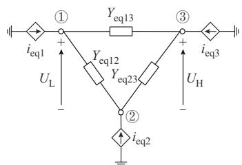  
图5 非隔离型直流变压器的简化等效电路  
Fig. 5 Simplified equivalent circuit of non-isolated DC transformer

电磁暂态仿真中，非隔离型直流变压器的节点电压方程式（30）及式（31）作为整体接入系统电磁暂态仿真的节点电压方程的分解。在仿真的每一时步中，根据开关状态修改子网络导纳矩阵（如 $Y _ { \mathrm { o } \setminus Y _ { \mathrm { i } } }$ 、$Y _ { \mathrm { o i } } )$ ，计算 $Y _ { \mathrm { o u t } }$ 和 $i _ { \mathrm { e q } }$ ，进一步求解系统节点电压方程得到节点电压，包括边界节点电压 $\pmb { u } _ { \textnormal { o o } }$ 。根据式（32）求解得到直流变压器内部节点电压 $\pmb { u } _ { \mathrm { i } } ^ { [ 2 8 ] }$ 。

$$
\boldsymbol {u} _ {\mathrm {i}} = Y _ {\mathrm {i}} ^ {- 1} \left(\boldsymbol {i} _ {\mathrm {h i}} - Y _ {\mathrm {o i}} ^ {\mathrm {T}} \boldsymbol {u} _ {\mathrm {o}}\right) \tag {32}
$$

最后，根据内部节点电压，计算自耦变压器、子模块的电压、电流。

值得注意的是，本文重点在于非隔离型直流变压器快速等效建模，暂未考虑内部接地故障及阀段故障［29］ 的情况。当发生以上两种故障时，所提方法也同样适用，只需根据短路处的子模块个数来更改3.1节的串联子模块等效模型中的 $u _ { \mathrm { e q } } \left( t \right)$ 和 $R _ { \mathrm { e q } }$ ，并修改对应的节点导纳矩阵，即可继续按照上文所述步骤完成等效建模的计算。例如，在直流变压器内部发生短路故障时，可以根据故障发生的位置修改式（28）中的 $Y _ { \mathrm { i } } ,$ ，并将修改后的 $Y _ { \mathrm { i } }$ 代入之后的计算过程，即可模拟出内部接地故障的情况。除能够适应内部故障外，若非隔离型直流变压器用其他子模块

（如三电平中点钳位半桥变换器和双钳位子模块）来构建，所提建模方法也同样适用。文献［21，30］分别分析了钳位型半桥变换器的开关状态预测和戴维南等效建模，说明基于三电平中点钳位半桥变换器的非隔离型直流变压器也可以根据本文建模思路进行快速电磁暂态等效建模。

# 4 含所提快速仿真模型的电力系统电磁暂态仿真流程

本文所提快速电磁暂态模型的电磁暂态仿真流程如图6所示。图中： $t _ { \mathrm { m a x } }$ 表示仿真终止的时间。首先，在每个时步计算开始时，对控制系统进行求解；其次，利用开关状态预测方法确定直流变压器内子模块的开关状态；然后，根据开关状态形成直流变压器等效导纳矩阵，利用内部节点收缩方法对直流变压器的节点导纳矩阵进行降维，并接入系统导纳矩阵；进一步，计算系统中各元件的历史电流源，并求解系统的节点电压方程；最后，根据内部节点电压，计算自耦变压器、子模块的电压、电流。

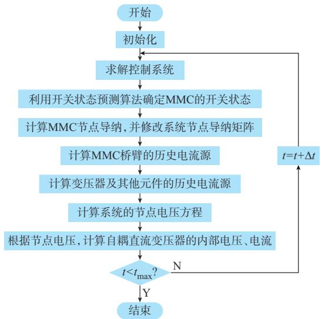  
图6 考虑所提快速电磁暂态模型的电磁暂态仿真流程  
Fig. 6 Flow chart of electromagnetic transient simulation with proposed fast electromagnetic transient model

# 5 算例验证

本章通过两个算例对所提直流变压器快速电磁暂态等效模型进行了验证。分析中涉及的参考结果为传统分立元件建模仿真结果。

# 5. 1　单端直流系统准确性验证

在单端多级直流系统上对所建立直流变压器快速电磁暂态模型进行验证。系统拓扑结构见附录A图 A7。直流变压器的电气参数见附录 B表 B1，控制策略及控制参数见文献［20］。

在步长为50 $\mu \mathrm { s }$ 情况下，对直流变压器三种典型

运行工况（即正常运行、短路故障、闭锁）进行了仿真，得到直流变压器高压直流侧的电压与电流，并与采用传统方法得到的电压、电流参考值进行对比，如图 7所示。其中，图 7（a）为正常运行工况下直流变压器高压侧的电压与电流。图 7（b）为故障工况下直流变压器高压侧的电压与电流，其中，t=0.4 s时F 处发生对地短路故障，t=0.1 s时故障清除，故障过渡电阻为 0.1 Ω。图 7（c）为闭锁工况下直流变压器高压侧的电压与电流，其中，t=0.5 s时直流变压器所有子模块闭锁。由图 7可知，所提直流变压器快速电磁暂态仿真模型仿真结果与传统分立元件建模仿真方法结果基本一致。

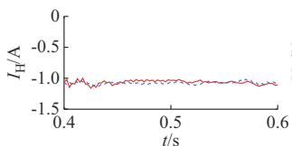

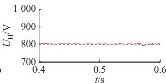  
(a) D=

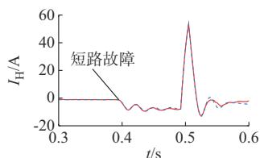

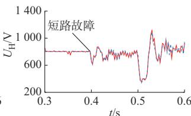  
(b) -CK

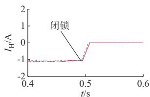

图7　单端多级直流系统的仿真结果  
Fig. 7 Simulation results of single-ended multilevel DC system   
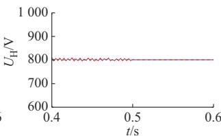  
4" E*-,"-

(c) KJ

为进一步说明所提直流变压器电磁暂态仿真模型的准确性，分析了不同运行工况下所提模型仿真结果的相对2范数累计偏差ε( y)，如式（33）所示。

$$
\varepsilon (y) = \frac {\left\| y _ {\text {ref}} - y \right\| _ {2}}{\left\| y _ {\text {ref}} \right\| _ {2}} \times 100 \% \tag{33}
$$

式中：y为所提模型得到的仿真结果； $; y _ { \mathrm { r e f } }$ 为参考结果； ${ y _ { \mathrm { r e f } } \parallel } _ { 2 }$ 表示 $y _ { \mathrm { r e f } }$ 的 2 范数。

根据式（ ）计算得到的三种工况下高压直流侧电压 $U _ { \mathrm { H } }$ 及电流 $I _ { \mathrm { H } }$ 的相对 2 范数累计偏差如表 1所示。

此外，假设在t=0.4 s时，非隔离型直流变压器的有功功率参考值从 900 MW 调整为 1 300 MW。

表1 单端多级直流系统三种运行工况下的偏差 Table 1 Deviation under three operating conditions of single-ended multilevel DC system   

<table><tr><td>运行工况</td><td>高压侧电压UH相对2范数累计偏差/%</td><td>高压侧电流IH相对2范数累计偏差/%</td></tr><tr><td>正常运行</td><td>2.331</td><td>1.724</td></tr><tr><td>短路故障</td><td>1.052</td><td>1.208</td></tr><tr><td>闭锁</td><td>2.021</td><td>0.809</td></tr></table>

分别利用所提直流变压器快速电磁暂态仿真模型与传统分立元件建模仿真方法对系统进行仿真，不同方法得到的直流变压器高压侧有功功率 $P _ { \mathrm { ~ H ~ } }$ 见附录A图 A8。可以发现，两种方法得到的结果接近，所计算得到的高压侧有功功率的相对2范数累计偏差为0.914%，进一步说明了所提模型的准确性。

可以发现，对于含直流变压器的单端多级直流系统，在多种运行工况下，所提方法的仿真模型都能保证较高的仿真精度。

# 5. 2　五端多级直流电网准确性验证

本节进一步在五端多级直流电网中验证所提非隔离型直流变压器快速仿真模型的准确性。五端多级直流电网的拓扑结构见附录A图A9，其主要电气参数见表B2，非隔离型直流变压器的参数见表B1。

对于该五端多级直流电网，在50 μs的步长下，首先，采用传统方法和所提方法对其正常运行工况进行仿真。将所提方法得到的低压侧电压 $U _ { \mathrm { L } }$ 、电流$I _ { \mathrm { L } }$ 以及线路 1上的母线电压 $U _ { 1 }$ 和有功功率 $P _ { 1 }$ 与采用传统方法仿真所得的参考值进行对比，结果如图8（a）所示。其次，将所提方法得到的该非隔离型直流变压器低压侧电压 $U _ { \mathrm { L } }$ 、电流 $I _ { \mathrm { L } }$ 以及线路1上的母线 电 压 $U _ { 1 }$ 和 有 功 功 率 $P _ { 1 }$ 与 参 考 值 进 行 对 比 。图8(b)为短路故障工况下直流变压器低压侧的电压与电流以及线路 1上的母线电压和有功功率，其中，t=0.4 s 时 $F _ { 1 }$ 处发生对地短路故障，故障过渡电阻为 0.1 Ω。图 8（c）为闭锁工况下直流变压器低压侧的电压与电流以及线路1上的母线电压和有功功率，其中，t=0.5 s时直流变压器所有子模块闭锁。

所提直流变压器快速仿真模型在上述三种运行工况下的相对 2范数累计偏差如表 2所示。由表 2可知，所提快速仿真模型的结果偏差很小，进一步说明了所提方法在各种运行工况下的准确性。

另外，分别设置了功率阶跃和电压阶跃扰动，并对仿真结果进行了分析。在t=0.4 s时，与单端直流系统类似，将非隔离型直流变压器的有功功率参考值从 900 MW 调整为 1 300 MW。分别利用所提直流变压器快速电磁暂态仿真模型与传统分立元件建

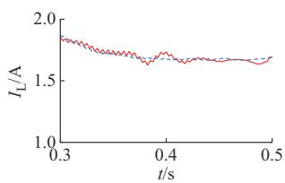

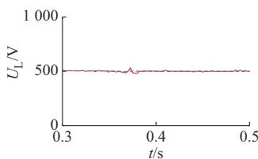

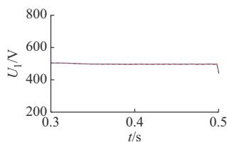

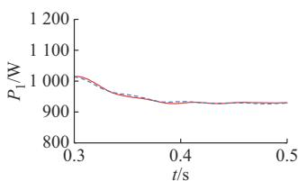  
(a) D=

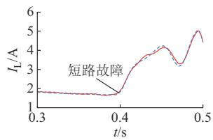

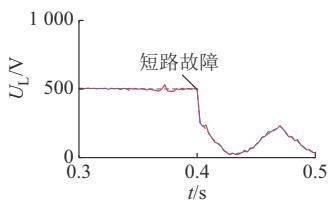

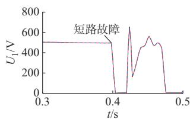

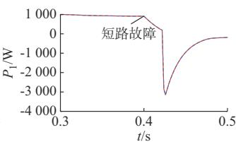  
(b) -CK

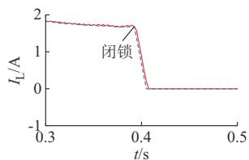

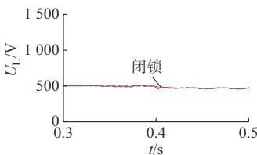

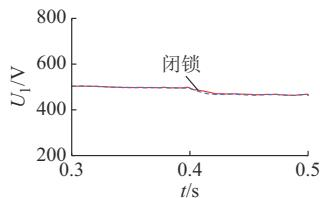

图8　五端多级直流电网的仿真结果  
Fig. 8 Simulation results of five-terminal multilevel DC grid   
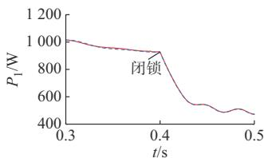  
4" E*-,"-

(c) KJ

表2 步长50 μs下五端多级直流电网三种运行工况下的偏差  
Table 2 Deviation under three operating conditions of five-terminal multilevel DC grid with a step size of 50 μs   

<table><tr><td>运行工况</td><td>UL相对2范数累计偏差/%</td><td>IL相对2范数累计偏差/%</td><td>U1相对2范数累计偏差/%</td><td>P1相对2范数累计偏差/%</td></tr><tr><td>正常运行</td><td>1.107</td><td>2.049</td><td>0.223</td><td>0.134</td></tr><tr><td>短路故障</td><td>1.026</td><td>1.503</td><td>0.267</td><td>0.135</td></tr><tr><td>闭锁</td><td>1.813</td><td>1.734</td><td>0.913</td><td>0.101</td></tr></table>

模仿真方法对系统进行仿真，不同方法得到的直流变压器高压侧有功功率 $P _ { \mathrm { ~ H ~ } }$ 见附录A图A10，两种方法的仿真结果基本一致。所提方法计算得到的高压侧有功功率的相对2范数累计偏差为0.836%，满足仿真精度要求，说明了所提直流变压器仿真模型在功率阶跃扰动工况下的准确性。

$t { = } 0 . 5 \mathrm { ~ s ~ }$ 时 ，将 五 端 直 流 电 网 中 的 换 流 站MMC3 的电压参考值从 840 kV 调整为 845 kV，并分别利用传统方法和所提方法对系统进行仿真。电压阶跃扰动下，不同方法计算得到的直流变压器高、低压侧电压 $U _ { \mathrm { H } } , U _ { \mathrm { L } }$ 见附录 A 图 A11。所计算得到的直流变压器高、低压侧电压的相对 2范数累计偏差分别为 0.476% 和 0.115%。可见，所提方法与传统方法所得模型仿真结果基本一致，说明了所提直流变压器快速电磁暂态等效模型在系统发生电压阶跃扰动时的准确性。

进一步，测试了步长分别为 20、100、150 μs时，所提快速仿真模型的偏差。仿真发现，在不同步长下，所提仿真模型都能保持较高精度。例如，在20 μs 和 $1 0 0 ~ { \mu \mathrm { s } }$ 的步长下，所提模型仿真依旧准确，其偏差分别如表3、表4所示。

表3 步长20 μs下五端多级直流电网三种运行工况下的偏差  
Table 3 Deviation under three operating conditions of five-terminal multilevel DC grid with a step size of 20 μs   
表4 步长100 μs下五端多级直流电网三种运行工况下的偏差  

<table><tr><td>运行工况</td><td>UL相对2范数累计偏差/%</td><td>IL相对2范数累计偏差/%</td><td>U1相对2范数累计偏差/%</td><td>P1相对2范数累计偏差/%</td></tr><tr><td>正常运行</td><td>0.873</td><td>1.236</td><td>0.117</td><td>0.075</td></tr><tr><td>短路故障</td><td>0.732</td><td>1.055</td><td>0.024</td><td>0.096</td></tr><tr><td>闭锁</td><td>1.159</td><td>0.963</td><td>0.537</td><td>0.068</td></tr></table>

Table 4 Deviation under three operating conditions of five-terminal multilevel DC grid with a step size of 100 μs   

<table><tr><td>运行工况</td><td>UL相对2范数累计偏差/%</td><td>IL相对2范数累计偏差/%</td><td>U1相对2范数累计偏差/%</td><td>P1相对2范数累计偏差/%</td></tr><tr><td>正常运行</td><td>1.293</td><td>2.814</td><td>0.371</td><td>0.276</td></tr><tr><td>短路故障</td><td>1.781</td><td>1.614</td><td>0.351</td><td>0.191</td></tr><tr><td>闭锁</td><td>2.107</td><td>2.031</td><td>1.093</td><td>0.127</td></tr></table>

本文中所提方法与传统方法之间存在偏差有以下两方面原因：

1）本文所提模型采用的开关状态判断方法与传统方法不一致。本文仿真模型引入一种开关状态预测方法［21］ ，而不是采用传统的通过迭代和插值方法来获得开关状态，与传统方法结果可能存在偏差。同时，开关状态预测方法中不考虑开关在非整时步的动作，这也将带来仿真结果的偏差。  
2）本文利用高斯消元法将直流变压器高维方程转化为低维方程。在运用数值计算方法求解不同维度的节点方程时，可能会导致数值误差。在直流变压器的仿真过程中，由于开关状态与元件电压、电流的正负息息相关，当电压、电流约为 0时，数值误差的累积可能还会导致开关状态计算结果的误差，进而也导致所提方法与传统方法之间存在偏差。

减小传统方法和所提建模方法之间偏差的典型办法为减小仿真步长，因为减小仿真步长会显著降低开关状态预测方法带来的偏差影响。本文在50、20、100 μs步长下分析了所提方法的偏差，分别如表2、表3、表4所示。根据表中结果可知，减小仿真步长可以减少仿真偏差。

# 5. 3　快速性验证

为验证所提直流变压器快速仿真模型的仿真效率，在 PSCAD/EMTDC上与传统分立元件仿真模型效率进行了对比。所有测试均在内存为32 GB的Intel（R） Core（TM） i7-13700 2.10 GHz 台式计算机上运行。

在仿真步长和仿真时长分别为50 μs和1 s的情况下，比较了传统方法和所提方法在对单端系统和五端系统进行仿真时所消耗的计算时间，如表 5所示。同时，表5也给出了所提仿真模型的加速比，加速比定义为所提快速等效建模方法和传统仿真方法的比值。由表5可知，在五端多级直流电网中，将非隔离型直流变压器进行快速电磁暂态等效建模后，仿真效率可提升 8倍。相比于传统建模仿真方法，非隔离型直流变压器快速电磁暂态等效模型显著提升了系统仿真效率。

表5 所提方法与传统方法在对五端多级直流电网进行仿真时的效率比较  
Table 5 Comparison of efficiency between the proposed method and conventional method in simulating a five-terminal multilevel DC grid   

<table><tr><td rowspan="2">方法</td><td colspan="2">计算时间/s</td></tr><tr><td>单机系统</td><td>五端系统</td></tr><tr><td>传统方法</td><td>7.286 9×10^4</td><td>2.309 6×10^5</td></tr><tr><td>所提方法</td><td>4.289 7×10^3</td><td>2.016 4×10^4</td></tr><tr><td>加速比</td><td>16.987</td><td>11.454</td></tr></table>

# 6 结 语

本文针对非隔离型直流变压器详细电磁暂态仿真模型效率低的问题，提出一种非隔离型直流变压器的开关状态预测方法，并建立了非隔离型直流变压器的快速电磁暂态等效模型。该快速等效模型与传统详细模型相比具有接近的仿真精度，能够在精确仿真系统不同运行工况的同时，显著降低系统方程 的 维 数，极 大 地 提 高 了 仿 真 效 率。在 PSCAD/EMTDC中的对比测试表明，五端多级直流电网在采用所提快速等效建模方法时，系统的仿真效率显著提升。

未来，所提直流变压器快速仿真模型还可以从以下两个方面进一步改进：首先，直流变压器的节点导纳矩阵时变，影响仿真速度，可以进一步采取恒导纳处理方法；其次，控制系统的计算对系统仿真效率的影响较大。针对直流变压器和 MMC，其控制系统非常复杂。特别地，在直流变压器和 MMC的控制系统求解中，子模块电容电压排序算法对计算效率影响很大。针对以上问题，可以采取的办法包括：1）对电力电子开关建模时，采用电感/电容等效的参数恒导纳开关模型，使得支路等效电导恒定；2）针对含有直流变压器的多级直流电网，针对其控制系统的高效计算可以采用多层次并行计算方法进行提速。同时，可以专门设计高效的子模块电容电压排序优化的方法，提高控制系统仿真效率。

附录见本刊网络版（http：//www.aeps-info.com/aeps/ch/index.aspx），扫英文摘要后二维码可以阅读网络全文。

# 参 考 文 献

［1］王增平，林一峰，王彤，等 .电力系统继电保护与安全控制面临的挑战与应对措施［J］. 电力系统保护与控制，2023，51（6）：10-20.  
WANG Zengping， LIN Yifeng， WANG Tong， et al.Challenges and countermeasures to power system relay protectionand safety control［J］. Power System Protection and Control，2023，51（6）：10-20.  
［2］张沈习，王丹阳，程浩忠，等 .双碳目标下低碳综合能源系统规划关键技术及挑战［］电力系统自动化， ，（ ）： -  
ZHANG Shenxi， WANG Danyang， CHENG Haozhong， et al.Key technologies and challenges of low-carbon integrated energysystem planning for carbon emission peak and carbon neutrality［J］. Automation of Electric Power Systems， 2022， 46（8）：189-207.  
［3］卓振宇，张宁，谢小荣，等 .高比例可再生能源电力系统关键技术及发展挑战［J］.电力系统自动化，2021，45（9）：171-191.  
ZHUO Zhenyu， ZHANG Ning， XIE Xiaorong， et al. Key technologies and developing challenges of power system with

high proportion of renewable energy［J］. Automation of ElectricPower Systems，2021，45（9）：171-191.  
［4］汤广福，贺之渊，庞辉 .柔性直流输电工程技术研究、应用及发展［J］.电力系统自动化，2013，37（15）：3-14.TANG Guangfu， HE Zhiyuan， PANG Hui. Research，application and development of VSC-HVDC engineeringtechnology［J］. Automation of Electric Power Systems，2013，37（15）：3-14.  
［5］雷顺广，束洪春，李志民.基于桥臂功率特征的全-半混合型柔性直流输电线路保护［J］.电工技术学报，2023，38（13）：3563-3575.LEI Shunguang， SHU Hongchun， LI Zhimin. Full-half bridgehybrid VSC-HVDC transmission line protection method based onpower characteristics of bridge arms［J］. Transactions of ChinaElectrotechnical Society，2023，38（13）：3563-3575.  
［6］PÁEZ J D，FREY D，MANEIRO J， et al. Overview of DC-DC converters dedicated to HVDC grids［J］. IEEE Transactionson Power Delivery，2019，34（1）：119-128.  
［7］赵彪，安峰，宋强，等.双有源桥式直流变压器发展与应用［J］.中国电机工程学报，2021，41（1）：288-298.ZHAO Biao， AN Feng， SONG Qiang， et al. Development andapplication of DC transformer based on dual-active-bridge［J］.Proceedings of the CSEE，2021，41（1）：288-298.  
［ ］徐晋，汪可友，李国杰 电力电子设备及含电力电子设备电力系统实时仿真研究综述［J］.电力系统自动化，2022，46（10）：3-17.XU Jin， WANG Keyou， LI Guojie. Review of real-timesimulation of power electronic devices and power systemsintegrated with power electronic devices ［J］. Automation ofElectric Power Systems，2022，46（10）：3-17.  
［9］姬伟江，汪可友，李国杰，等 .计及多重开关的电力电子实时仿真算法及其基于 PXI平台的实现［J］.电网技术，2017，41（2）：588-596.JI Weijiang， WANG Keyou， LI Guojie， et al. A real-timesimulation algorithm for power electronics circuit consideringmultiple switching events and its implementation on PXI platform［J］. Power System Technology，2017，41（2）：588-596.  
［10］安峰，崔彬，白睿航，等.高压大容量直流变压器模块化离散解耦等效建模方法［J］.电力系统自动化，2021，45（7）：79-86.AN Feng， CUI Bin， BAI Ruihang， et al. Modular discretedecoupling equivalent modeling method for high-voltage large-capacity DC transformer［J］. Automation of Electric Power， ， （ ）： -  
［11］唐庚，徐政，刘昇 .改进式模块化多电平换流器快速仿真方法［J］. 电力系统自动化，2014，38（24）：56-61.TANG Geng， XU Zheng， LIU Sheng. Improved fast model ofthe modular multilevel converter［J］. Automation of ElectricPower Systems，2014，38（24）：56-61.  
［ ］罗雨，饶宏，许树楷，等 级联多电平换流器的高效仿真模型［J］. 中国电机工程学报，2014，34（15）：2346-2352.LUO Yu， RAO Hong， XU Shukai， et al. Efficient modelingfor cascading multilevel converters ［J］. Proceedings of the， ， （ ）： -  
［ ］蒋霖，周诗嘉，李子寿，等 可仿真任意工况的 等值电磁暂态仿真模型与平均值模型［］南方电网技术， ， （ ）：10-17.JIANG Lin， ZHOU Shijia， LI Zishou， et al. Equivalent

electromagnetic model and averaged value model of MMC foroperating condition simulation［J］. Southern Power SystemTechnology，2016，10（2）：10-17.  
［14］STEPANOV A，MAHSEREDJIAN J，KARAAGAC U， etal. Adaptive modular multilevel converter model forelectromagnetic transient simulations［J］. IEEE Transactionson Power Delivery，2021，36（2）：803-813.  
［15］粟时平，魏新伟，牛鼎，等.模块化多电平换流器电容电压改进排序平衡方法［J］. 中国电机工程学报，2017，37（13）：3874-3882.SU Shiping， WEI Xinwei， NIU Ding， et al. A modified-sortingbalancing method of capacitor voltage for modular multilevelconverter［J］. Proceedings of the CSEE，2017，37（13）：3874-3882.  
［16］连攀杰，刘文焯，杨泽栋，等.混合型MMC全状态高效电磁暂态仿真方法研究［J］.中国电机工程学报，2021，41（24）：8520-8531.LIAN Panjie， LIU Wenzhuo， YANG Zedong， et al. Researchon hybrid MMC full-state efficient electromagnetic transientsimulation method［J］. Proceedings of the CSEE，2021，41（24）：8520-8531.  
［17］GAO S L，CHEN Y，SONG Y K， et al. An efficient half-bridge MMC model for EMTP-type simulation based on hybridnumerical integration ［J］. IEEE Transactions on PowerSystems，2024，39（1）：1162-1177.  
［18］SUN Z D，LI Y H，LI Z X， et al. An accelerated simulation model for the isolation stage of the smart energy router system ［C］// 2015 18th International Conference on Electrical Machines and Systems （ICEMS）， October 25-28， 2015， Pattaya， Thailand：1537-1540.   
［19］FENG M K， GAO C X， DING J P， et al. Hierarchicalmodeling scheme for high-speed electromagnetic transientsimulations of power electronic transformers ［J］. IEEETransactions on Power Electronics， 2021， 36（9）： 9994-10004.  
［20］YE Y N，ZHANG X T，JIN J Y， et al. Analysis and design of a nonisolated DC transformer with fault current limiting capability ［J］. IEEE Transactions on Power Electronics， 2022，37（8）：9876-9888.   
［21］GAO S L， SONG Y K， CHEN Y， et al. Fast simulationmodel of voltage source converters with arbitrary topology usingswitch-state prediction ［J］. IEEE Transactions on PowerElectronics，2022，37（10）：12167-12181.  
［ ］张芮，宋炎侃，于智同，等 基于同步开关预判的半桥型 快速电磁暂态建模方法［J］. 电力系统自动化，2021，45（20）：148-156.ZHANG Rui，SONG Yankan，YU Zhitong，et al．Fastelectromagnetic transient modeling method for half-bridge-typevoltage source converter based on synchronous switch prediction［J］. Automation of Electric Power Systems，2021，45（20）：148-156.  
［23］ZHANG R， SONG Y K， YU Z T， et al. A non-iterative switching status combination judgement algorithm for halfbridge sub-circuit based voltage-source converters in EMTPtype simulation program［C］// 2019 IEEE Innovative Smart

Grid Technologies-Asia （ISGT Asia） ， February 18-21，2019， Chengdu， China：2336-2340.  
［24］许建中，赵成勇， GOLE A M.模块化多电平换流器戴维南等效整体建模方法［J］.中国电机工程学报，2015，35（8）：1919-1929.  
XU Jianzhong， ZHAO Chengyong， GOLE A M. Research onthe Thevenin’s equivalent based integral modelling method ofthe modular multilevel converter （MMC）［J］. Proceedings ofthe CSEE，2015，35（8）：1919-1929.  
［25］高仕林，宋炎侃，陈颖，等.电力系统移频电磁暂态仿真原理及应用综述［J］.电力系统自动化，2021，45（14）：173-183.  
GAO Shilin， SONG Yankan， CHEN Ying， et al. Overview onprinciple and application of shifted frequency basedelectromagnetic transient simulation for power system ［J］.Automation of Electric Power Systems， 2021， 45 （14） ：173-183.  
［26］GNANARATHNA U N，GOLE A M，JAYASINGHE R P.Efficient modeling of modular multilevel HVDC converters（MMC） on electromagnetic transient simulation programs［J］.IEEE Transactions on Power Delivery， 2011， 26 （1） ：316-324.  
［27］GAO C X， FENG M K， DING J P， et al. Acceleratedelectromagnetic transient （EMT） equivalent model of solid-state transformer［J］. IEEE Journal of Emerging and SelectedTopics in Power Electronics，2022，10（4）：3721-3732.  
［28］LI Z R， XU J， WU P， et al. Unified real-time simulation method for DC/DC conversion systems consisting of cascaded

dual-port submodules［J］. IEEE Transactions on IndustrialElectronics，2023，70（11）：11368-11378.  
［29］朱良合，盛超，陈晓科，等.混合MMC电磁暂态高效建模和阀段故障特性分析［J］.华北电力大学学报（自然科学版），2019，46（1）：32-40.  
ZHU Lianghe， SHENG Chao， CHEN Xiaoke， et al. High-speed electromagnetic modeling and internal valve failureanalysis of hybrid MMC［J］. Journal of North China ElectricPower University （Natural Science Edition），2019，46（1）：32-40.  
［30］徐东旭，刘崇茹，王洁聪，等.钳位双子模块型MMC的电磁暂态等效模型［J］. 电网技术，2016，40（10）：3176-3183.  
XU Dongxu， LIU Chongru， WANG Jiecong， et al. Equivalentelectromagnetic transient model of CDSM-MMC［J］. PowerSystem Technology，2016，40（10）：3176-3183.

王渝红(1971—)，女，博士，教授，博士生导师，主要研究方向：高压直流输电、电力系统稳定与控制、新能源并网。E-mail：yuhongwang@scu.edu.cn

周奕辰 — ，男，硕士研究生，主要研究方向：电力系统电磁暂态建模与仿真。E-mail：zycc0106@163.com

高仕林(1994—)，男，通信作者，博士，副研究员，硕士生导师，主要研究方向：电力系统电磁暂态建模与仿真、交直流电力系统。E-mail：gaoshilin@scu.edu.cn

（编辑 章黎）

# Equivalent Modeling Method for Fast Electromagnetic Transient of Non-isolated DC Transformers

WANG Yuhong， ZHOU Yichen， GAO Shilin， ZHANG Wei， LIAO Jianquan， ZHENG Zongsheng(School of Electrical Engineering, Sichuan University, Chengdu 610000, China)

Abstract: Electromagnetic transient simulation is of great significance for mastering the operating characteristics of DC transformers. However, the current high-speed equivalent modeling methods for modular converters are rarely mentioned for nonisolated transformers. Meanwhile, the existing electromagnetic transient simulation models for non-isolated DC transformers suffer from complex switch-state calculation and a large number of internal nodes, leading to low system simulation efficiency. Therefore, a fast electromagnetic transient equivalent modeling method for non-isolated DC transformers based on switch-state prediction and Thevenin equivalence is proposed. Firstly, a switch-state prediction method for submodules of non-isolated DC transformers is proposed. Secondly, based on the switch states, an equivalent circuit for the bridge arms of the DC transformer is obtained, and the Thevenin equivalence is applied to obtain the two-node equivalent circuit model of the bridge arms. Then, the equivalent circuit model of the autotransformer is established, and the equivalent circuit of the bridge arm and autotransformer is combined to obtain the equivalent circuit of the DC transformer. Based on this, the node voltage equation of the DC transformer is established. Finally, based on the Gaussian elimination, the equation is simplified to achieve the internal node reduction of the simulation model of the non-isolated DC transformer. The case study shows that the proposed equivalent modeling method for fast electromagnetic transient of non-isolated DC transformers has similar accuracy to traditional detailed modeling methods, and the simulation efficiency is significantly improved.

This work is supported by National Natural Science Foundation of China (No. 52307127, No. 52207126).

Key words: DC transformer; Thevenin equivalence; electromagnetic transient simulation; equivalent modeling; switch-state prediction; internal node reduction