# A New Tool for Calculation of Line and Cable Parameters

J. Morales, H. Xue, J. Mahseredjian, I. Kocar

Abstract−This paper presents a new tool for the computation of per-unit-length parameters for transmission line and cable models used for simulating electromagnetic transients (EMT). The proposed methodology is based on the MoM-SO theory and state-of-the-art formulations for the computation of the series impedance and shunt admittance parameters. The new tool has major advantages compared to traditional approaches available in EMT-type software. These advantages include accurate skin and proximity effect modeling, above-ground cable modeling, modeling of stranded wires in cables, representation of multilayer soil, coupled overhead lines and underground cables, etc. This paper presents the new tool together with demonstrations of transient simulations for practical examples.

Keywords: EMTP, line, cable, transients, per-unit-length.

# I. INTRODUCTION

CCURATE transmission line models (including bothoverhead lines and underground cables) in EMT-typeA software require accounting for the distributed parameters nature and the frequency dependency of its parameters to properly represent transient phenomena. The computation of these models is usually a two-step process: 1) computation of per-unit-length (pul) parameters and 2) parametrization of the model. The parametrization depends on the targeted type of model. It is either for constant parameter or frequency dependent models. The frequency dependent modeling requires separate fitting procedures.

Since the pul parameters are the input data for the second step, the computation of these parameters is crucial for deriving accurate and reliable time-domain models. The pul parameters are denoted as

$$
\mathbf {Z} ^ {\prime} = \mathbf {R} ^ {\prime} + j \omega \mathbf {L} ^ {\prime} \tag {1}
$$

$$
\mathbf {Y} ^ {\prime} = \mathbf {G} ^ {\prime} + j \omega \mathbf {C} ^ {\prime} \tag {2}
$$

where Z' denotes the pul series impedance and Y ' denotes the pul shunt admittance, with  R ' , L' , G ' and  C ' being the pul resistance, inductance, conductance, and capacitance, respectively. Pul parameters describe the transmission line behavior through the well-known Telegrapher’s equations

$$
\frac {\partial \mathbf {V}}{\partial z} = - \left(\mathbf {R} ^ {\prime} + j \omega \mathbf {L} ^ {\prime}\right) \mathbf {I} = - \mathbf {Z} ^ {\prime} \mathbf {I} \tag {3}
$$

$$
\frac {\partial \mathbf {I}}{\partial z} = - \left(\mathbf {G} ^ {\prime} + j \omega \mathbf {C} ^ {\prime}\right) \mathbf {V} = - \mathbf {Y} ^ {\prime} \mathbf {V} \tag {4}
$$

The traditional Line Constants and Cable Constants routines [1]-[3] have been used for the computation of pul parameters for many years. These routines are included in most EMT-type software. Alternatively, pul parameters can be obtained via Finite Element Method (FEM) based techniques [4]-[6], which are considered more accurate, but usually demand a significantly higher computational burden. Therefore, the Line/Cable Constants routines are often preferred for their simplicity and efficiency.

The Line/Cable Constants tools, however, have limitations and have become out of date for today’s needs. For instance, they neglect proximity effects which can be relevant for cable simulations; they can handle only bare-aerial conductors (Line Constants) or only buried cables (Cable Constants), but mixed aerial and underground conductors cannot be modeled; they can only model two different mediums (air and ground), thus, they are not suitable for submarine cables, where the sea water representation is required in addition to ground and air mediums; also, above ground cables, such as required for gasinsulated substations or some above ground cable installations, may be poorly represented due to some simplifications in earth-return current formulas.

This paper presents a new tool named Line/Cable Data for the calculation of pul parameters that overcomes the limitations of the traditional Line/Cable Constants routines while performing a level of accuracy similar to FEM-based techniques. The proposed Line/Cable Data tool applies the MoM-SO theory [7]-[10] combined with state-of-the-art formulations [11], [12]. An early version of the new approach presented in this paper is reported in [13]. Since then, further developments and the complete integration into EMTP [14] have been achieved. A similar parameters calculation tool is proposed in [15], but only for tunnel installed cables.

One of the contributions of this paper is revisiting the techniques applied and explaining how they are reunited in the new Line/Cable Data package, which is important since until now the applied methods are spread in the literature. Another contribution is the demonstration of the capabilities of the new Line/Cable Data package through transient simulations with practical examples that would be impossible to reproduce with traditional techniques.

A brief review of the techniques involved in the new Line/Cable Data package is first presented in sections II and III, followed by case studies in section IV.

# II. SERIES IMPEDANCE COMPUTATION WITH MOM-SO

The new Line/Cable Data tool performs the computation of the pul series impedance parameters by applying the Methodof-Moments and Surface Admittance Operator (MoM-SO) technique [7]-[10]. To start revisiting the MoM-SO technique, let us first consider a solid conductor, surrounded by a lossless homogeneous medium as shown in Fig. 1.

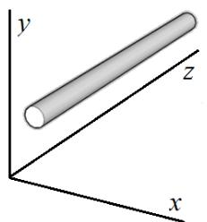  
Fig. 1. Single conductor and reference frame for the MoM-SO technique review.

Considering the setup of Fig. 1 and assuming an electric current flowing through the conductor, a longitudinal (on the z-axis) electric field E and a magnetic field H normal to the conductor’s surface are produced. The relationship between these two fields is given by

$$
H = \frac {1}{j \omega \mu_ {1}} \frac {\partial E}{\partial n} \tag {5}
$$

where  denotes the angular frequency, $\mu _ { 1 }$ represents the conductor permeability, and n the direction of H .

# A. Equivalencing theorem

The equivalencing theorem is a mathematical tool that consists of replacing the conductor space by the surrounding medium while introducing a density current J at the conductor’s surface to maintain the external fields unchanged [7], [16]. This is illustrated in Fig. 2 (a) and (b).

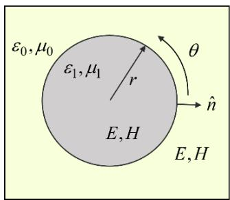  
(a)

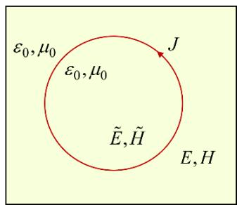  
  
Fig. 2. Illustration of the equivalencing theorem, (a) original problem, (b) equivalent (fictitious) representation.

The current density J introduced produces fictitious electric and magnetic fields $( \tilde { H }$ and $\tilde { E }$ in Fig. 2) internal to the conductor’s surface, related by

$$
\tilde {H} = \frac {1}{j \omega \mu_ {0}} \frac {\partial \tilde {E}}{\partial n} \tag {6}
$$

where $\mu _ { 0 }$ is the permeability of the surrounding medium.

According to the equivalencing theorem [7], [16], the density current required to maintain the electric and magnetic

fields external to the conductor volume ( H and E ) unchanged is given by

$$
J = H - \tilde {H} \tag {7}
$$

Substituting (5) and (6) into (7) leads to

$$
J = \frac {1}{j \omega} \left(\frac {1}{\mu_ {1}} \frac {\partial E}{\partial n} - \frac {1}{\mu_ {0}} \frac {\partial \tilde {E}}{\partial n}\right) \tag {8}
$$

This expression is key in the derivation of the pul impedance parameters, and it is recalled later in section II C.

# B. Electric-field integral equation

After the application of the equivalencing theorem, the medium has become homogeneous, which allows expressing the electric field E  (at the surface of the conductor) by the electric field integral equation [7]

$$
E = - j \omega A - \frac {\partial V}{\partial z} \tag {9}
$$

where  A is the vector potential component, defined by

$$
A = - \mu_ {0} \int_ {0} ^ {2 \pi} J (\theta) G (r, r ^ {\prime}) d \theta \tag {10}
$$

where $\boldsymbol { G } \big ( \boldsymbol { r } , \boldsymbol { r } ^ { \prime } \big )$ denotes the Green function that accounts for an infinite space [7]; and r correspond to polar coordinates as shown in Fig. 2 (a).

Substituting (10) and (3) into (9) leads to

$$
E = j \omega \mu_ {0} \int_ {0} ^ {2 \pi} J (\theta) G (r, r ^ {\prime}) d \theta + Z ^ {\prime} I \tag {11}
$$

Equation (11) is the second key relationship for the computation of the pul impedance and it is recalled below.

# C. Discrete form of electromagnetic fields

The cylindrical geometry of the conductors allows a spatial representation of the above-mentioned electric field and density current by means of low-order Fourier series, i.e.,

$$
E (\theta) = \sum_ {n = - N} ^ {N} E _ {n} e ^ {j n \theta} \tag {12}
$$

$$
J (\theta) = \frac {1}{2 \pi a} \sum_ {n = - N} ^ {N} J _ {n} e ^ {j n \theta} \tag {13}
$$

where  N denotes the Fourier series order. As previously reported in the literature, N  4 is considered enough for high accuracy. Note that setting N  0 is equivalent to neglecting proximity effects [9], which can be used to speed up computations in cases where proximity effects are irrelevant.

The above defined forms for  E and  J permit rewriting (8) in terms of their Fourier coefficients as

$$
J _ {n} = E _ {n} \frac {2 \pi}{j \omega} \left[ \frac {k a \Im_ {| n |} ^ {\prime} (k a)}{\mu \Im_ {| n |} (k a)} - \frac {k _ {o u t} a \Im_ {| n |} ^ {\prime} (k _ {o u t} a)}{\mu_ {0} \Im_ {| n |} (k _ {o u t} a)} \right] \tag {14}
$$

where $\Im _ { | n | } ( . )$ is the Bessel function of first kind and $\Im _ { | n | } \cdot ( . )$ its derivative; and  k and $k _ { o u t }$ denote the wavenumber. Refer to [7], [17] for details.

# D. Surface Admittance Operator

Based on (12) and (13), E and  J can be expressed as vectors in terms of their Fourier coefficients as

$$
\mathbf {E} = \left[ E _ {- N} \dots E _ {0} \dots E _ {N} \right] ^ {T} \tag {15}
$$

$$
\mathbf {J} = \left[ J _ {- N} \dots J _ {0} \dots J _ {N} \right] ^ {T} \tag {16}
$$

Then, an appropriate arrangement of the Fourier coefficients in (14) allows a vector/matrix relationship between the electric field and density current as

$$
\mathbf {J} = \mathbf {Y} _ {s} \mathbf {E} \tag {17}
$$

Since (17) is analogous to a current and voltage relationship, the resulting matrix ${ \bf Y } _ { s }$ is denoted as the surface admittance operator [7]-[10].

# E. Application of the Method of Moments

Substituting (12) and (13) into (11) leads to

$$
\sum_ {n = - N} ^ {N} E _ {n} e ^ {j n \theta} = \frac {j \omega \mu_ {0}}{2 \pi} \int_ {0} ^ {2 \pi} \sum_ {n = - N} ^ {N} J _ {n} e ^ {j n \theta} G (r, r ^ {\prime}) d \theta + Z ^ {\prime} I \tag {18}
$$

The analytical solution of (18) is obtained by application of the Method of Moments (MoM) as given in [7], and it is used to obtain a discrete version of (18) as

$$
\mathbf {E} = j \omega \mu_ {0} \mathbf {G J} + \mathbf {U Z ^ {\prime} I} \tag {19}
$$

where U is a matrix containing ones and zeros and relates the total current flowing in the conductor with the Fourier coefficients of J , which can be expressed as the zeroharmonic component base on (13), i.e.,

$$
I = J _ {0} \tag {20}
$$

or, equivalently

$$
\mathbf {I} = \mathbf {U} ^ {T} \mathbf {J} \tag {21}
$$

# F. Multiple conductors

To account for multiple conductors in the above formulations, the vector potential A in (10) must be modified to include the contributions of all the conductors involved [8]. At the same time, E , J , and V introduced above as scalars, become vectors to account for all conductors.

# G. Derivation of the pul series impedance matrix

Considering the general case with multiple conductors, the pul impedance matrix  Z' can be derived by simple algebraic operations using the above formulations as follows.

Substituting (19) in (17) and solving for  J leads to

$$
\mathbf {J} = \left(\mathbf {1} - j \omega \mu_ {0} \mathbf {Y} _ {s} \mathbf {G J}\right) ^ {- 1} \mathbf {Y} _ {s} \mathbf {U Z} ^ {\prime} \mathbf {I} \tag {22}
$$

where 1 denotes the unit matrix.

Then, substituting (22) in (21) we obtain

$$
\mathbf {I} = \mathbf {U} ^ {T} \left(\mathbf {1} - j \omega \mu_ {0} \mathbf {Y} _ {s} \mathbf {G J}\right) ^ {- 1} \mathbf {Y} _ {s} \mathbf {U Z} ^ {\prime} \mathbf {I} \tag {23}
$$

From (23), it can be observed that I is in both sides of the equation, therefore, we can write

$$
\mathbf {U} ^ {T} \left(\mathbf {1} - j \omega \mu_ {0} \mathbf {Y} _ {s} \mathbf {G J}\right) ^ {- 1} \mathbf {Y} _ {s} \mathbf {U Z} ^ {\prime} = \mathbf {1} \tag {24}
$$

Finally, the pul impedance matrix can be found from (24)

$$
\mathbf {Z} ^ {\prime} = \left[ \mathbf {U} ^ {T} \left(\mathbf {1} - j \omega \mu_ {0} \mathbf {Y} _ {s} \mathbf {G}\right) ^ {- 1} \mathbf {Y} _ {s} \mathbf {U} \right] ^ {- 1} \tag {25}
$$

# H. Hollow conductors

The derivation of the pul impedance parameters presented, can be easily extended to include hollow conductors by accounting for the internal surface of conductors in the same way as for their external surface [8]. This extension produces an increase in the size of the matrix relationship (25) by N rows/columns for each additional surface given by each hollow conductor involved.

# I. Ground return effects and multilayer soil

The representation of ground return currents in the impedance parameters of lines/cables is reported in the literature by Carson and Pollaczek equations [1], [2], which are implemented in the traditional Line/Cable Constants routines. It is worth to mention that these formulas are limited to a certain frequency range and recently, it has been found that they may produce unrealistic propagation modes at high frequencies as demonstrated in [18]-[20].

In the MoM-SO technique, ground return effects are represented through the Green function G introduced in (10). In the formulation of MoM-SO presented above, G is mentioned to represent an infinite space for simplicity, as initially proposed in [7]. However, the representation of airground medium as reported in [9] is adopted in the new Line/Cable Data tool. This technique provides a more accurate representation of the ground return currents compared to Carson/Pollaczek equation. Studies and validation of the novel approach can be found in [21]. A further extension of the Green function for modeling multilayer soils has been proposed in [10] (also implemented in the new Line/Cable Data tool). The representation of multilayer soil is useful for modeling stratified soils or submarine cables that require modeling the sea and seabed in addition to the air.

# J. Holes

The pul series impedance calculation for pipe-type or tunnel installed cables is possible through the concept of “holes” introduced in [9]. The concept of “holes” permits grouping a set of conductors contained within a larger circumference (the pipe/tunnel) by mapping the density current sources from all internal conductors to the pipe’s surface as illustrated in Fig. 3 for a two conductors’ case. This is achieved by a further application of the equivalencing theorem. Since the detailed formulation is extensive, we refer to [9] and references therein for details.

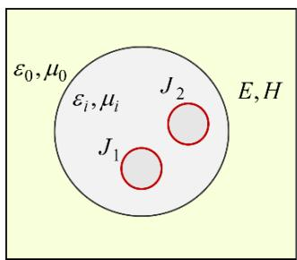

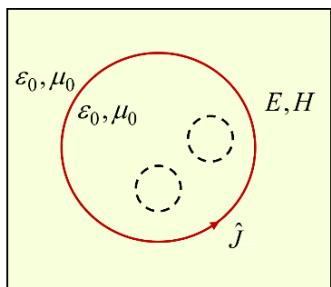  
  
Fig. 3. Illustration of the concept of holes, (a) representation after a first application of the equivalencing theorem (b) second application of the equivalencing theorem for a hole.

# III. SHUNT ADMITTANCE COMPUTATION

In the new Line/Cable Data tool, the shunt admittance parameters $\mathbf { Y } ^ { \prime }$ as given in (2) are computed by application of state-of-the-art formulations for round conductors. A major upgrade in respect to the traditional Line/Cable Constants routines is the inclusion of earth return effects as reported in [12] for overhead lines and in [11] for underground cables.

# A. Overhead lines (bare conductors)

The pul shunt admittance matrix for aerial conductors is computed as

$$
\mathbf {Y} ^ {\prime} = j \omega \left(\mathbf {P} _ {s} + \mathbf {P} _ {e}\right) ^ {- 1} \tag {26}
$$

where ${ \bf P } _ { s }$ denotes the spatial potentials matrix obtained by the images method [1], [2], and ${ \bf P } _ { e }$ denotes the potentials matrix that accounts for the earth return current for both homogeneous and multilayer soil (if required) [12].

As mentioned above, the traditional Line/Cable Constants routines neglect earth return effects in the pul admittance matrix, which can be of especial relevance in the high frequency region [12].

# B. Overhead pipe-type cables

The pul admittance calculation for cables is based on [22], [12], and [20]. A pipe-type cable above ground is the general case (the most complex) for which the pul admittance is

$$
\mathbf {Y} ^ {\prime} = j \omega \left(\mathbf {P} _ {i} + \mathbf {P} _ {p} + \mathbf {P} _ {c} + \mathbf {P} _ {o} + \mathbf {P} _ {e}\right) ^ {- 1} \tag {27}
$$

where $\mathbf { P } _ { i }$ denotes the internal potentials matrix, which accounts for all the cores and its surrounding metallic screens, $\mathbf { P } _ { i }$ is independent of the geometrical position of cables and it is a block diagonal matrix (one block per core) [22], [3]; $\mathbf { P } _ { p }$ denotes the potentials matrix of the pipe inner surface respect to the cable inner conductors [22], [3]; ${ \bf P } _ { c }$ denotes the potentials matrix between the pipe inner and outer surfaces [22], [3]; ${ \bf P } _ { o }$ denotes the spatial potentials matrix [22], [3]; and ${ \bf P } _ { e }$ denotes the potentials matrix of the earth-return component (ignored in traditional Cable Constants) calculated as reported in [12], [20].

Note that in the traditional Cable Constants routines in most EMT-type programs, overhead cables cannot be modeled.

# C. Overhead single-core cables

The case of overhead single-core cables is a particular case of the overhead pipe-type cable where the potential matrices related to the pipe conductor $\mathbf { P } _ { p }$ and ${ \bf P } _ { c }$ in (27) are zero.

An important application of single-core cables above ground is for modeling Gas Insulated Substations (GIS) as studied in [20].

# D. Underground cables

Underground cables (regardless if they are single-core or pipe-type cables) are also a particular case of (27) where the spatial component ${ \bf P } _ { o }$ is zero.

# E. Combined overhead and underground lines/cables

In the case of a combined transmission system where above- and under-ground lines/cables are involved, no potential matrix coupling is produced between above ground and buried lines/cables since the ground acts as a shield. Recent studies suggest that such coupling exists and can be relevant under certain conditions [23], [24], this is ongoing research to be included in a future implementation.

In such cases, coupling occurs only in the series impedance matrix through earth return currents [1].

# IV. CASE STUDIES

In this section, the new Line/Cable Data (LCD) tool is evaluated and compared with the traditional Line Constants (LC) and Cable Constants (CC) techniques.

# A. Proximity effect in underground cables

As a first case study, the three single-core cables shown in Fig. 4 (adopted from [8]) is considered for studying the impact of proximity effects. The pul impedance matrix of the proposed cable system is computed from 0.01 Hz to 10 MHz using the following modeling options:

a) Using the new LCD with proximity representation   
b) Using the new LCD without proximity representation (Fourier series with N = 0)   
c) Using the traditional CC (proximity effect is ignored)   
d) Using the new LCD with proximity representation, but increasing the distance between cables to 20 cm

Among the proposed options, models b) and c) are expected to be in close agreement since both neglect proximity, but off from model a) which considers proximity. Model d) is expected to lie between a) and b) since proximity effect is modeled but its effect should be weaker given the increased distance between the cables.

The above hypotheses are confirmed in Fig. 5 where the core-ground and core-sheath impedances are shown. Note that proximity effects are more relevant at high frequencies, therefore, the impedances in the range of MHz are observed.

<table><tr><td colspan="5">Single-core (SC) cables</td></tr><tr><td>Cable</td><td>Number of 
conductors</td><td>Horizontal 
position (m)</td><td>Vertical 
position (m)</td><td>Radius (cm)</td></tr><tr><td>1</td><td>2</td><td>-0.085</td><td>-1</td><td>4.25</td></tr><tr><td>2</td><td>2</td><td>0</td><td>-1</td><td>4.25</td></tr><tr><td>3</td><td>2</td><td>0.085</td><td>-1</td><td>4.25</td></tr></table>

SC-cables conductors/insulators   

<table><tr><td>Cable</td><td>Cond</td><td>Phase</td><td>Inner radius (cm)</td><td>Outer radius (cm)</td><td>Conductor resistivity (Ohm m)</td><td>Conductor relative permeability \( \left( {\mu }_{\mathrm{r}}\right) \)</td><td>Conductor relative permittivity \( \left( {\varepsilon }_{\mathrm{r}}\right) \)</td><td>Insulator relative permittivity \( \left( {\varepsilon }_{\mathrm{r}}\right) \)</td></tr><tr><td>1</td><td>1</td><td>1</td><td>0</td><td>1.95</td><td>3.365e-8</td><td>1</td><td>1</td><td>2.85</td></tr><tr><td>1</td><td>2</td><td>2</td><td>3.775</td><td>3.797</td><td>1.718e-8</td><td>1</td><td>1</td><td>2.51</td></tr><tr><td>2</td><td>1</td><td>3</td><td>0</td><td>1.95</td><td>3.365e-8</td><td>1</td><td>1</td><td>2.85</td></tr><tr><td>2</td><td>2</td><td>4</td><td>3.775</td><td>3.797</td><td>1.718e-8</td><td>1</td><td>1</td><td>2.51</td></tr><tr><td>3</td><td>1</td><td>5</td><td>0</td><td>1.95</td><td>3.365e-8</td><td>1</td><td>1</td><td>2.85</td></tr><tr><td>3</td><td>2</td><td>6</td><td>3.775</td><td>3.797</td><td>1.718e-8</td><td>1</td><td>1</td><td>2.51</td></tr></table>

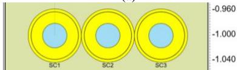  
  
  
Fig. 4. Underground cable system for proximity effect evaluation (a) cable geometry and conductors’ data; (b) cable system drawing.

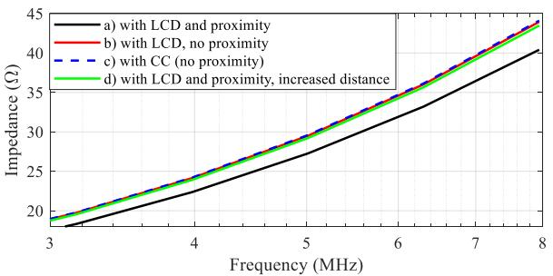

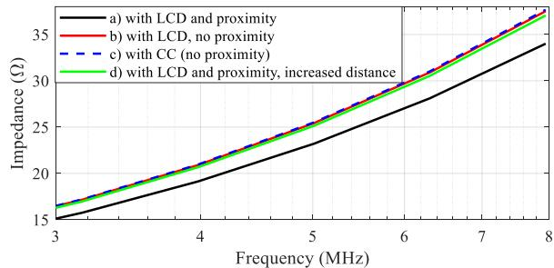  
(a)   
(b)   
Fig. 5. Pul impedance matrix entries for the cable system of Fig. 4; (a) coreto-ground impedance (b) core-to-sheath impedance.

To evaluate the impact of proximity effects on transient analysis, an insulation coordination simulation is performed using the circuit of Fig. 7. In this circuit, the cable system from Fig. 4 is used in a typical cross-bonded configuration and considering the modeling options proposed above. The cable is connected to a 169-kV network and to a 50MW, 15Mvars load. The 100-km transmission line is arbitrarily set long enough to avoid wave reflections from the network side, such that only the waves traveling along the cable are observed. The overhead line and tower are modeled with typical data. The lightning surge is modeled according to [28].

The simulation is initialized in steady state and the lightning stroke is injected at 10 μs, producing a flashover on the insulator of phase-a. The voltages measured by V1_sheath and Vm_Core1 are shown in Fig. 6 (a) and (b), respectively. Both, confirm a good match between models b) and c) which ignore proximity effects, whereas model a) with proximity effect, shows significantly different transient waveforms, with higher attenuation as reported in [11]. On the other hand, the transient response of model d) lies between the models with and without proximity effect as expected.

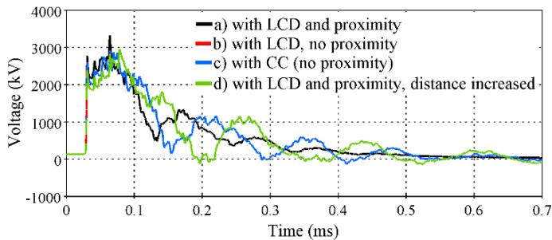

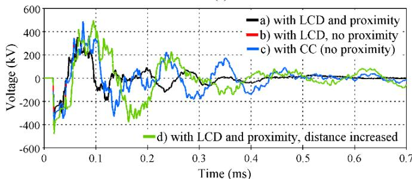  
  
  
Fig. 6. Transient overvoltages due to lightning stroke and flashover, (a) sheath induced voltage, (b) core voltage at the receiving end.

# B. Accurate shunt earth-return modelling

As mentioned in section III, the new LCD package presented in this paper accounts for the earth return currents not only for the series impedance but also for the shunt admittance matrix as given in (27) with ${ \bf P } _ { e }$ . To evaluate the impact of this component, the cable configuration of Fig. 8 (adopted from [11]) is modeled with and without considering the earth return path for the pul shunt admittance matrix. The cable length is 263 m. For this case, proximity effect is turned off for a pure evaluation of the earth return component.

As a first evaluation, the open-circuit impedance of the cable in Fig. 8 is measured from 1 to 150 kHz through a frequency-scan simulation. The resulting positive sequence impedance as a function of the frequency is shown in Fig. 9. In this figure, a significant difference is observed at the resonant peaks between the models with and without earth return modeling with the new LCD. Also, it is confirmed that neglecting the shunt earth-return and proximity effects with the new LCD is almost equivalent to using the traditional CC routine.

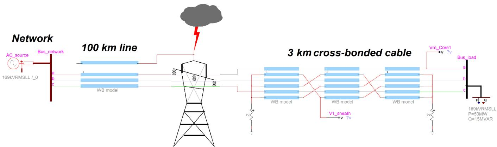  
Fig. 7. Lightning circuit test for evaluation of proximity effects in a cable system.

Single-core (SC) cables   

<table><tr><td>Cable</td><td>Number of conductors</td><td>Horizontal position (m)</td><td>Vertical position (m)</td><td>Radius (cm)</td></tr><tr><td>1</td><td>2</td><td>-0.35</td><td>-1</td><td>4.25</td></tr><tr><td>2</td><td>2</td><td>0</td><td>-1</td><td>4.25</td></tr><tr><td>3</td><td>2</td><td>0.35</td><td>-1</td><td>4.25</td></tr></table>

SC-cables conductors/insulators

(b)   

<table><tr><td>Cable</td><td>Cond</td><td>Phase</td><td>Inner radius (cm)</td><td>Outer radius (cm)</td><td>Conductor resistivity (Ohm m)</td><td>Conductor relative permeability (μr)</td><td>Conductor relative permittivity (εr)</td><td>Insulator relative permittivity (εr)</td></tr><tr><td>1</td><td>1</td><td>1</td><td>1.03</td><td>1.9</td><td>1.7e-8</td><td>1</td><td>1</td><td>3.5</td></tr><tr><td>1</td><td>2</td><td>2</td><td>3.45</td><td>3.85</td><td>2.1e-7</td><td>1</td><td>1</td><td>4</td></tr><tr><td>2</td><td>1</td><td>3</td><td>1.03</td><td>1.9</td><td>1.7e-8</td><td>1</td><td>1</td><td>3.5</td></tr><tr><td>2</td><td>2</td><td>4</td><td>3.45</td><td>3.85</td><td>2.1e-7</td><td>1</td><td>1</td><td>4</td></tr><tr><td>3</td><td>1</td><td>5</td><td>1.03</td><td>1.9</td><td>1.7e-8</td><td>1</td><td>1</td><td>3.5</td></tr><tr><td>3</td><td>2</td><td>6</td><td>3.45</td><td>3.85</td><td>2.1e-7</td><td>1</td><td>1</td><td>4</td></tr></table>

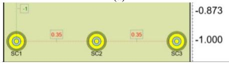

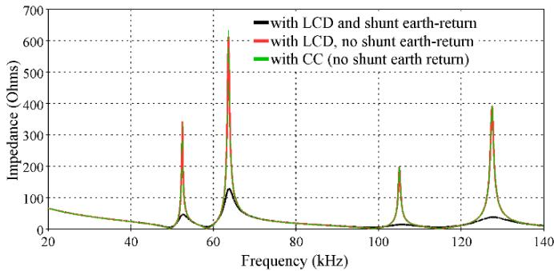  
Fig. 8. Three-phase cable for shunt earth return modeling evaluation.   
Fig. 9. Open-circuit positive-sequence impedance for the cable of Fig. 8.

To further evaluate the cable model of Fig. 8 with and without shunt earth return effects, the circuit of Fig. 10 is considered for a transient simulation. In the circuit of Fig. 10, a 41.8 Mvars capacitor bank is energized creating a switching surge travelling along the cable. The voltages measured on the sending end side are shown in Fig. 11.

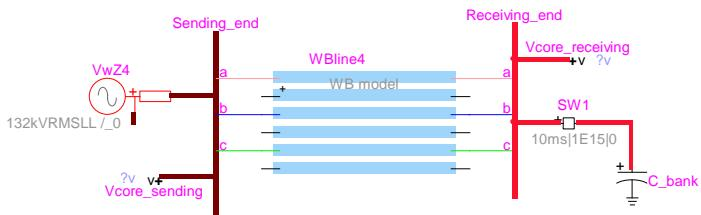  
Fig. 10. Circuit test for earth return modeling demonstration.

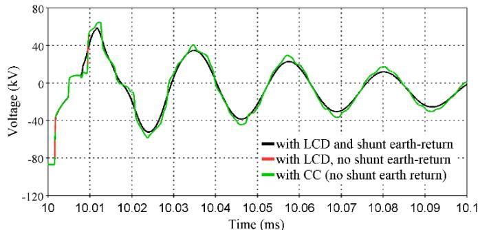  
Fig. 11. Transient voltages at the sending end of the cable system of Fig. 10.

The transient voltages in Fig. 11 show a good match between the models obtained with the new LCD tool ignoring shunt earth return effects and with the traditional CC routine. On the other hand, it is observed that the model with shunt earth return effects produces slightly different (smoother) transient waveforms and the maximum overvoltage is slightly smaller. Such differences may be relevant for certain studies such as insulation coordination or transient recovery voltage.

# C. Overhead line and underground cable

A unique capability of the new LCD package is the possibility to represent the electromagnetic coupling between aerial lines and underground cables. For instance, in some cases, new power lines require sharing the right of way with existing ones, such as reported in [25], [26].

In this section, the simulation of an overhead HVDC line in parallel with an AC underground cable is proposed. The DC line has been adopted from [27] and the AC cable from previous section is used. The resulting cross-section layout is shown in Fig. 12. Fig. 13 shows the circuit used in this test, where the aerial HVDC line is connected to a fictitious DC source and the AC underground cable is energized in the transient simulation at 5ms. Note that the purpose of the proposed scenario is simply to demonstrate the coupling between the two power lines.

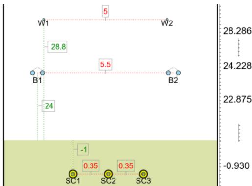  
Fig. 12. Parallel HVDC aerial line and AC underground cable.

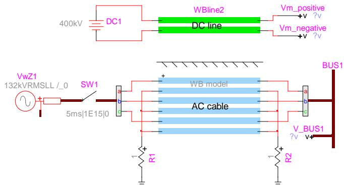  
Fig. 13. Circuit test for parallel HVDC aerial line and AC underground cable.

The resulting transient voltages on the HVDC line and on the AC underground cable are shown in Fig. 14 (a)-(c). These figures demonstrate that the AC line induces an AC voltage on the conductors of the HVDC line.

Note that such a simulation scenario cannot be modeled with the traditional LC or CC tools.

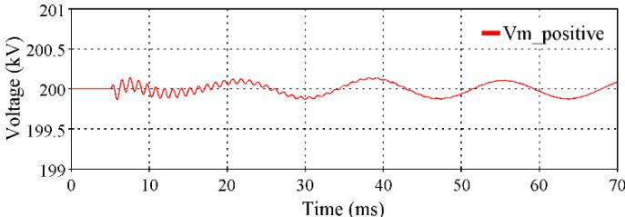  
(a)

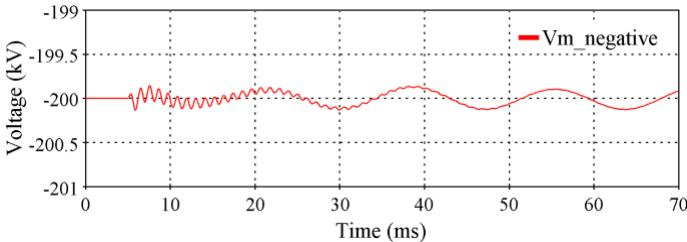

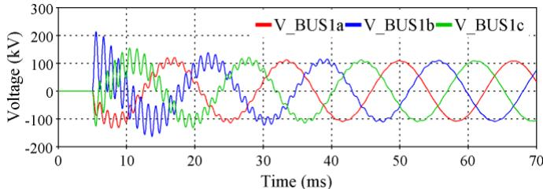  
(b)   
(c)   
Fig. 14. Transient responses by the parallel HVDC aerial line and AC underground cable; (a) positive polarity of the HVDC line; (b) negative polarity of the HVDC line; (c) AC line voltages.

# V. CONCLUSIONS

This paper presents a new tool named Line/Cable Data for the computation of pul parameters for power lines (both overhead and underground cables). The new tool reunites the MoM-SO technique for computing the series impedance with advanced formulations for the shunt admittance parameters. The applied techniques are briefly revisited highlighting the main differences in relation to traditional techniques. Some of the capabilities of the new Line/Cable Data package, such as modeling of proximity and earth-return effects are demonstrated with practical examples. Also, the possibility of modeling aerial lines in parallel with underground cables is demonstrated, which is restrictive with traditional techniques.

# VI. REFERENCES

[1] H. W. Dommel, EMTP Theory Book, Bonneville Power Administration, Portland, 1986.   
[2] J. Martinez-Velasco et al., Power System Transients, Parameter Determination, 1st ed., CRC Press, 2010.   
[3] A. Ametani, T. Ohno and N. Nagaoka, Cable System Transients: Theory, Modeling and Simulation, 1st ed., John Wiley and Sons, 2015.   
[4] D. G. Triantafyllidis, G. K. Papagiannis and D. P. Labridis, "Calculation of overhead transmission line impedances a finite element approach," in IEEE Transactions on Power Delivery, vol. 14, no. 1, pp. 287-293, Jan. 1999.   
[5] B. Gustavsen, A. Bruaset, J. J. Bremnes and A. Hassel, "A Finite-Element Approach for Calculating Electrical Parameters of Umbilical Cables," in IEEE Transactions on Power Delivery, vol. 24, no. 4, pp. 2375-2384, Oct. 2009.   
[6] J. Jin, The Finite Element Method in Electromagnetics, 3rd ed., John Wiley and Sons, 2014.   
[7] U. R. Patel, B. Gustavsen and P. Triverio, "An Equivalent Surface Current Approach for the Computation of the Series Impedance of

Power Cables with Inclusion of Skin and Proximity Effects," in IEEE Transactions on Power Delivery, vol. 28, no. 4, pp. 2474-2482, Oct. 2013.   
[8] U. R. Patel, B. Gustavsen and P. Triverio, "Proximity-Aware Calculation of Cable Series Impedance for Systems of Solid and Hollow Conductors," in IEEE Transactions on Power Delivery, vol. 29, no. 5, pp. 2101-2109, Oct. 2014.   
[9] U. R. Patel and P. Triverio, "MoM-SO: A Complete Method for Computing the Impedance of Cable Systems Including Skin, Proximity, and Ground Return Effects," in IEEE Transactions on Power Delivery, vol. 30, no. 5, pp. 2110-2118, Oct. 2015.   
[10] U. R. Patel and P. Triverio, "Accurate Impedance Calculation for Underground and Submarine Power Cables Using MoM-SO and a Multilayer Ground Model," in IEEE Transactions on Power Delivery, vol. 31, no. 3, pp. 1233-1241, June 2016.   
[11] H. Xue, A. Ametani, J. Mahseredjian and I. Kocar, "Generalized Formulation of Earth-Return Impedance/Admittance and Surge Analysis on Underground Cables," in IEEE Transactions on Power Delivery, vol. 33, no. 6, pp. 2654-2663, Dec. 2018.   
[12] H. Xue, J. Mahseredjian, A. Ametani, J. Morales, and I. Kocar, "Generalized Formulation and Surge Analysis on Overhead Lines: Impedance/Admittance of A Multi-Layer Earth," in IEEE Transactions on Power Delivery, vol. 36, no. 6, pp. 3834-3845, Dec. 2021.   
[13] H. Xue, A. Ametani, J. Mahserediian and I. Kocar, "Computation of Overhead Line/Underground Cable Parameters with Improved MoM-SO Method," 2018 Power Systems Computation Conference (PSCC), 2018, pp. 1-7.   
[14] J. Mahseredjian, S. Dennetiere, L. Dube, B. Khodabakhchian, and L. Gerin-Lajoie, "On a new approach for the simulation of transients in power systems," Electric Power Systems Research, vol. 77, pp. 1514- 1520, Sep. 2007.   
[15] Y. Tanaka, T. Noda, Y. Sekiba, E. Ito, K. Misawa and T. Chida, "Development of a Computer Program for Calculating the Transmission-Line Constants of Cables Installed in a Tunnel Taking the Skin and Proximity Effects into Account," 2017 International Conference on Power Systems Transients (IPST) 2017, Seoul, Republic of Korea, 2017.   
[16] W. C. Gibson, The Method of Moments in Electromagnetics, 1st ed., Chapman and Hall/CRC, 2008.   
[17] D. De Zutter and L. Knockaert, "Skin effect modeling based on a differential surface admittance operator," in IEEE Transactions on Microwave Theory and Techniques, vol. 53, no. 8, pp. 2526-2538, Aug. 2005.   
[18] H. Xue, J. Mahseredjian, J. Morales, I. Kocar and A. Xemard, "An Investigation of Electromagnetic Transients for a Mixed Transmission System with Overhead Lines and Buried Cables," in IEEE Transactions on Power Delivery, vol. 37, no. 6, pp. 4582-4592, Dec. 2022.   
[19] H. Xue, J. Mahseredjian, J. Morales and I. Kocar, "Analysis of Cross-Bonded Cables Using Accurate Model Parameters," in IEEE Transactions on Power Delivery, doi: 10.1109/TPWRD.2022.3179832.   
[20] H. Xue, A. Ametani, J. Mahseredjian, Y. Baba, F. Rachidi and I. Kocar, "Transient Responses of Overhead Cables Due to Mode Transition in High Frequencies," in IEEE Transactions on Electromagnetic Compatibility, vol. 60, no. 3, pp. 785-794, June 2018.   
[21] H. Xue, A. Ametani and J. Mahseredjian, "Very Fast Transients in a 500 kV Gas-Insulated Substation," in IEEE Transactions on Power Delivery, vol. 34, no. 2, pp. 627-637, April 2019.   
[22] A. Ametani, "A General Formulation of Impedance and Admittance of Cables," in IEEE Transactions on Power Apparatus and Systems, vol. PAS-99, no. 3, pp. 902-910, May 1980.   
[23] T. A. Papadopoulos, G. K. Papagiannis, D. P. Labridis, " A generalized model for the calculation of the impedances and admittances of overhead power lines above stratified earth," in Electric Power Systems Research, vol. 80, Issue 9, pp. 1160-1170, 2010.   
[24] A. G. Martins-Britto, T. A. Papadopoulos, Z. G. Datsios, A. I. Chrysochos and G. K. Papagiannis, "Influence of Lossy Ground on High-Frequency Induced Voltages on Aboveground Pipelines by Nearby Overhead Transmission Lines," in IEEE Transactions on Electromagnetic Compatibility, vol. 64, no. 6, pp. 2273-2282, Dec. 2022.   
[25] R. Uhl, A. Monti, J. Lichtinghagen and A. Moser, "Analysis of transient electromagnetic interference between medium voltage AC and DC overhead transmission lines and cables," 2016 IEEE International Energy Conference (ENERGYCON), 2016, pp. 1-6.   
[26] Z. A. Harun, M. Osman, A. M. Ariffin and M. Zainal Abidin Ab Kadir, "Effect of AC Interference on HV Underground Cables Buried Within

Transmission Lines Right of Way," 2021 IEEE International Conference on the Properties and Applications of Dielectric Materials (ICPADM), 2021, pp. 73-76.   
[27] Guide for Development of Models for HVDC Converters in a HVDC Grid, CIGRE Working Group B.4.57, Technical Brochure Ref: 604, Dec. 2014.   
[28] Guide to procedures for estimating the lightning performance of transmission lines, CIGRE Working Group 01 (Lightning) of Study Committee 33 (Overvoltages and Insulation Co-ordination), October 1991.