# Improved methods for optimization of power systems with renewable generation using electromagnetic transient simulators✩

D. Kuranage a, S. Filizadeh a,∗, D. Muthumuni b

a Department of Electrical and Computer Engineering, University of Manitoba, Winnipeg, MB, R3T 5V6, Canada   
b Manitoba HVDC Research Center, 211 Commerce Drive, Winnipeg, MB, R3P 1A3, Canada

# A R T I C L E I N F O

Keywords:

Electromagnetic transient simulation

Optimization algorithms

Parallel processing

Renewable generation

# A B S T R A C T

This paper introduces new techniques for efficient use of electromagnetic transient simulators combined with optimization algorithms to optimize power systems with converter-tied renewable resources. This work is motivated by several challenges that must be overcome for simulation-based optimal design, including high computational burden of simulating large switching systems, repetitive nature of the design cycle, and large number of variables that need to be handled. Two screening methods are proposed in this paper to identify the parameters that do not influence the optimal solution significantly and hence can be ignored. Moreover, hybridization of optimization algorithms and parallel processing techniques are explored to achieve additional computational benefits. Case studies of systems with different complexity and number of variables are used to demonstrate the effectiveness of the proposed techniques.

# 1. Introduction

With rising demand for electricity and radical changes brought about by converter-tied renewable resources and energy storage, power systems are becoming increasingly complex. The complexity of renewable-intensive power systems is spurred by the presence of switching converters, sophisticated control systems, and intricate dynamic behavior. Converter-based generation schemes have shown rapid growth resulting in challenges in the design and operation of the system [1]. Converter-tied resources not only diminish the system inertia, but also release high-frequency harmonics to the system [1]. These resources have sophisticated control systems whose parameters must be selected carefully and optimally [2]. It is cumbersome, if not entirely infeasible, to use analytical approaches to model and solve such parameter tuning and optimization problems [2]. Therefore, it is necessary to have simulation-based tools to model these systems accurately so that their dynamic performance can be successfully assessed, and their parameters be tuned before actual implementation [3,4].

Electromagnetic transient (EMT) simulation combined with optimization algorithms is a powerful tool for design and parameter-tuning of converter-intensive power systems [3]. There exists previous work that has used optimization-enabled EMT simulation (OE-EMTS) to optimize power system parameters, where the candidate parameter sets are generated by the optimization algorithm and the suitability of those

parameter sets is evaluated by the EMT simulator [4]. In [4], OE-EMTS is used to optimize the parameter values of a voltage source converter and a dc-dc converter while the same methodology has been used to design HVDC controllers in [5]. In both cases, Nelder–Mead’s Simplex algorithm is used since it performs well for optimization of a relatively small number of parameters [4,5]. Even though the Simplex algorithm is computationally efficient, it is prone to converging to a local optimum. Moreover, in the context of optimizing power systems with renewable resources with a large number of parameters, the Simplex algorithm may not be a suitable choice [6].

The authors in [7] have used genetic algorithms (GA) to obtain optimal designs for photovoltaic grid-connected systems. There is a high likelihood of GA converging into the global optimum since it considers several populations and includes operators such as mutation and crossover that tend to diversify the solution set [6]. However, GAs take considerable time to converge, particularly for optimization of a large number of parameters when it might be prohibitively long. Therefore, in the context of the large power systems, complexities such as high computational burden, repetitive nature of the design cycle, large number of parameters to be handled, and the inherent limitations of the optimization algorithms cause difficulties. Accordingly, it is necessary to develop new and computationally efficient methods to overcome these problems.

This paper introduces a number of novel methods to (i) perform screening that identifies and removes non-influential variables to lower the dimension of the optimization problem, and (ii) accelerate the design process using hybrid optimization algorithms and parallel processing methods. To demonstrate the efficacy of the proposed methods, design parameters of two different type-4 wind turbine generator controllers are optimized. The first case involves optimization of 8 parameters while the second case involves 18 parameters. Both cases prove to be extremely challenging for manual parameter tuning due to the number of parameters and the complexity of the dynamic behavior of the networks. The results confirm that the proposed approaches are effective in optimization using EMT simulators of power systems with converter-tied renewable resources. EMT simulations in this paper are conducted using PSCAD/EMTDC to which optimization algorithms are interfaced.

# 2. Optimization-enabled electromagnetic transient simulation (OE-EMTS)

OE-EMTS is an advanced tool for the design of complex power systems using an EMT solver in conjunction with a (nonlinear) optimization algorithm. The role of the optimization algorithm is to generate new candidate values for the parameters in the design. The system’s performance for a given set of trial parameters is measured by the EMT simulator, which requires a metric formulated in the form of an objective function (OF) to measure the closeness between the actual and desired outcomes [4]. Small OF values typically indicate that the actual and the expected performance of the system are closely matching, indicating a high-quality design. After every simulation run, the evaluated OF is given to the optimization algorithm, which judiciously generates new trial parameter sets. This process ends after obtaining a parameter set that gives a minimum OF with satisfactory performance.

GA and nonlinear Simplex have been widely adopted for simulationbased design of complex power systems. Despite their relative success, it is often noted that a GA’s excessive computational burden and Simplex’s inability to handle high-dimensional problems and its tendency to converge to a local optimum are critical bottlenecks in the optimal process. The following section proposes several methods that address these bottlenecks.

# 3. Improved methods for optimization

Improved EMT-based optimization methods proposed next aim to (i) reduce the number of optimization variables by identifying and removing non-influential variables, and (ii) enhance the computational efficiency of the design cycle by reducing unnecessary, time-consuming EMT simulations.

# 3.1. Screening methods

Screening methods are developed to reduce the size of the design problem by identifying the parameters that do not influence the final design and thus may be excluded.

# 3.1.1. Method 1 - initial screening

In this method, the initial value of each variable is changed by applying positive and negative increments; for each increment a simulation run is conducted to evaluate whether the increment has a significant impact on the OF. Variables that do not significantly affect the OF are excluded from the optimization process. While this method proves successful in many cases, its effectiveness depends on the initial values of the optimization variables. For a highly nonlinear system, if the initial multi-dimensional point is far from the optimum, this method may discard variables that may indeed be influential. (??1.??2) Therefore, this method for initial screening must be used with limited liberty. Selection of the initial values for the parameters to be optimized

is also a crucial task. The general expectation from the initial values is to produce a response that is stable even though it may feature poor dynamic performance. Improvement of the response is left to the simulation-based optimization.

The initial parameter values for the cases in this paper are selected using a few rounds of trial-and-error while utilizing basic insight about controller gains, e.g., that higher proportional gains generally tend to accelerate the response, but may lead to instability at large enough values, and that smaller integral time-constant values may settle the response faster, but may cause oscillations.

# 3.1.2. Method 2 - run-time screening

A second screening method is introduced for population-based optimization algorithms such as GA, which run for several generations. If the value of a parameter does not change noticeably in the first few generations, it can be argued that the parameter has already converged into its optimal interval and does not need further optimization. Parameters that vary considerably must be optimized further until they converge into a small interval. Moreover, these results may reveal insight about the range of the parameters values. If the designer has assigned larger search interval to the algorithm, they can be reduced so that smaller population are used, which leads to more computational benefits.

# 3.2. Parallel processing modification for GA

The sequential GA (normal GA) starts with the user-defined values for the parameter boundaries and the number of chromosomes in the initial, surviving, and mating populations. The algorithm then generates random number sets for the initial population considering parameter boundaries. The produced parameter sets are usually called chromosomes. Normally, the algorithm releases only one parameter set (one chromosome) at a time and the EMT simulator runs sequentially with different parameter values assigned to it in each run and gives the respective OF value back to the optimization algorithm. After evaluating the first generation, the chromosomes that have the lowest OF values will be selected for the next generation as the surviving population. The best solution sets from that surviving population are chosen as the mating pool to generate new chromosomes called offspring. This is done by using the crossover operator where the two parent chromosomes exchange their parameter values with respect to one or more randomly selected crossover points. The remaining surviving population after selecting the mating pool is replaced with the offspring. To prevent premature convergence, another operator called mutation is adopted [8], which randomly changes randomly selected parameters. The new generation will then be evaluated using EMT simulations. This continues for several generations until the algorithm converges into an optimal solution.

Although GA performs well with large parameter sets, its slow convergence rate requires considerable time to find the optimum. Thus many researchers have explored methods to parallelize GA, owing to the independence of its iterations from one another. Most of the research work found in literature (e.g., [9–11]) has adopted parallelism in GA by using sub-populations that evolve in parallel while sharing information among them at prescribed time intervals. However, in the simulation-based optimization approach discussed in this paper, calculation of the OF value causes the highest computational burden and far exceeds those of basic GA operations of selection, crossover, and mutation. Therefore, this paper adopts a specific parallel GA implementation, which focuses on parallelizing the iterations (i.e., OF calculations) in a single large population instead of among small sub-populations.

As shown in Fig. 1, parallel processing occurs within the PSCAD/EMTDC simulation set where it is externally controlled by the GA, coded in a Python script. All the simulation cases included in the simulation set are launched in parallel using all processor cores available [12].

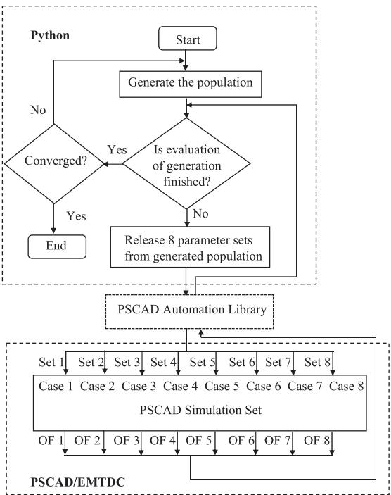  
Fig. 1. Schematic diagram of the parallel genetic algorithm.

In this paper, all the examples of parallel processing are done using eight simulation cases within one simulation set. Even though they are copies of the same simulation file, the parameter values in them are assigned independently by the GA. In the sequential implementation, only one parameter set is evaluated at a time, while in the parallel version, eight parameter sets are evaluated concurrently. After the EMT solver runs all eight cases in parallel, the OF values for every case are sent back to the Python GA script.

# 3.3. Hybridizing optimization algorithms

The main advantage of the GA is its ability to find the global optimum; this is at the expense of a large computational burden and slow convergence [13]. To overcome these, which become particularly pronounced in simulation-based optimization, this paper proposes a novel method by combining the GA with the nonlinear Simplex algorithm. In the proposed hybrid algorithm, the GA solver is used to identify the area wherein the global optimum exists, after which the search will continue in that area with the Simplex algorithm that has much better convergence properties. The exemplar cases shown in the next sections demonstrate that hybridization leads to significant reduction in computation time and complexity.

# 4. Example case I

# 4.1. System and controller configuration

The first test system is a 125 MW (5 MW × 25) type-4 wind generation plant connected to the grid as shown in Fig. 2. During normal operation, the short-circuit MVA (SCMVA) at the point of interconnection (POI) is 165 MVA indicating a weak system. A threephase-to-ground fault is applied at ?? = 5 s and is cleared after 0.2 s by disconnecting the faulted line, which drops the SCMVA to 78 MVA making the system even weaker and unstable for the initial controller parameter values shown in the second column of Table 1. Therefore, the objective is to optimize the wind farm controller parameters to obtain stable operation before and after the fault.

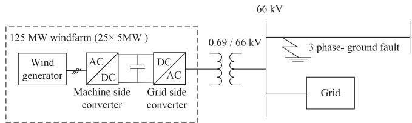  
Fig. 2. Schematic diagram of the system for Example I.

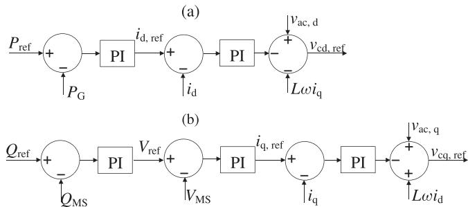  
Fig. 3. Block diagram of the machine-side controller (a) active power controller, (b) reactive power controller.

Decoupled controls are used for both converters as shown in Figs. 3 and 4. When the system becomes weaker after the line tripping, the active power that can be injected to the grid from the wind farm is reduced, which causes the voltage at the POI to collapse. It is determined that satisfactory performance is obtained if the gains and time-constants of proportional-integral (PI) controllers are tuned to maintain 5 MW output from the wind farm and to avoid overvoltages that are greater than selected overvoltage value at POI even after the fault. Therefore, an objective function is formed by adding the integral square error (ISE) of the active power and integral of overvoltage at POI (see (1)); minimization of this objective function yields optimal parameter values for the controllers.

$$
O F = K (t) \int_ {t _ {0}} ^ {T} \left(P - P _ {\text {r e f}}\right) ^ {2} d t + \int_ {t _ {1}} ^ {t _ {2}} \left| V _ {\text {o v e r}} - V _ {\text {r e f}} \right| d t \tag {1}
$$

where

$$
K (t) = \left\{ \begin{array}{l l} k _ {1} & t _ {0} <   t \leq T _ {1} \\ k _ {2} & T _ {1} <   t \leq T \end{array} \right. \tag {2}
$$

In $( 2 ) , [ t _ { 0 } , T ] , [ t _ { 0 } , T _ { 1 } ]$ and $[ t _ { 1 } , t _ { 2 } ]$ denote the entire OF evaluation time period, the time period when transients occur, and the time period when overvoltages occur, respectively. Note that this OF calculates the error during both transient and steady state conditions; thus the algorithm returns parameters that give improved transient and steady state response. In this paper, $k _ { 1 } ~ = ~ k _ { 2 } ~ = ~ 1$ is used, which places a balanced focus on both transient and steady state intervals. If $k _ { 1 } > k _ { 2 } ,$ the OF places a heavier penalty on the deviations during the transient period; therefore, if the designer wants to place more emphasis on the transient period of the response, a larger weighting factor may be assigned to the time period when transients occur.

In practice the inner loop controllers are expected to act rapidly, thus leaving the most significant dynamics to the external loop parameters. Hence in this example, the parameters of the capacitor voltage controller $( K _ { \mathrm { p . E d c } } , \ T _ { \mathrm { i . E d c } } )$ , grid reactive power controller $( K _ { \mathrm { p . Q } } ,$ $T _ { \mathrm { i . Q } } ) ,$ , grid-side rms voltage controller $( K _ { \mathrm { p _ { - } V a c } } , T _ { \mathrm { i _ { - } V a c } } ) _ { \it i }$ , and active power controller $( K _ { \mathrm { p } , \mathrm { P } } , T _ { \mathrm { i , P } } )$ are considered for optimization.

# 4.2. Optimization of parameters

# 4.2.1. Optimization using sequential GA

With the initial and surviving populations of 104 and 48 (see Table 2), respectively, the GA solver is launched for ten generations,

Table 1 Initial and optimized values for Example I.   

<table><tr><td rowspan="2">Parameter</td><td colspan="2">Initial</td><td rowspan="2">Sequential GA</td><td colspan="2">Hybrid GA-Simplex</td><td rowspan="2">Parallel GA</td><td colspan="2">Parallel GA + screening</td></tr><tr><td>Values</td><td>Limits</td><td>GA</td><td>Simplex</td><td>New limits</td><td>Results</td></tr><tr><td>Kp_Edc</td><td>4</td><td>(0,7)</td><td>6.39</td><td>5.434</td><td>5.749</td><td>6.505</td><td></td><td>6.935</td></tr><tr><td>T1_Edc</td><td>0.02</td><td>(0,2)</td><td>1.72</td><td>1.975</td><td>2.049</td><td>1.388</td><td>(0,2)</td><td>0.874</td></tr><tr><td>Kp_Q</td><td>1</td><td>(0,7)</td><td>0.346</td><td>2.631</td><td>2.734</td><td>5.97</td><td>(0,6.5)</td><td>1.342</td></tr><tr><td>T1_Q</td><td>0.2</td><td>(0,2)</td><td>1.314</td><td>0.849</td><td>0.922</td><td>0.534</td><td>(0,2)</td><td>0.559</td></tr><tr><td>Kp_Vac</td><td>4</td><td>(0,7)</td><td>1.48</td><td>1.527</td><td>1.584</td><td>1.203</td><td>(0,2.5)</td><td>2.087</td></tr><tr><td>T1_Vac</td><td>0.05</td><td>(0,2)</td><td>0.977</td><td>0.0714</td><td>0.0818</td><td>1.015</td><td></td><td>1.906</td></tr><tr><td>Kp_P</td><td>2</td><td>(0,7)</td><td>0.772</td><td>0.535</td><td>0.625</td><td>0.237</td><td>(0,2.5)</td><td>0.531</td></tr><tr><td>T1_P</td><td>0.05</td><td>(0,2)</td><td>0.133</td><td>0.906</td><td>0.926</td><td>0.046</td><td>(0,1)</td><td>0.081</td></tr><tr><td>OF value</td><td>211.654</td><td></td><td>16.407</td><td>25.58</td><td>22.49</td><td>16.87</td><td></td><td>17.023</td></tr></table>

Table 2 Comparison of population details and number of simulation runs for Example I.   

<table><tr><td rowspan="2"></td><td rowspan="2">Sequential GA</td><td colspan="2">Hybrid GA-Simplex</td><td rowspan="2">Parallel GA</td><td colspan="2">Parallel GA + screening</td></tr><tr><td>GA</td><td>Simplex</td><td>GA for screening</td><td>GA after screening</td></tr><tr><td>Initial population</td><td>104</td><td>104</td><td>-</td><td>104</td><td>104</td><td>72</td></tr><tr><td>Surviving population</td><td>48</td><td>48</td><td>-</td><td>48</td><td>48</td><td>24</td></tr><tr><td>Generations</td><td>10</td><td>2</td><td>-</td><td>10</td><td>3</td><td>5</td></tr><tr><td>Simulation runs</td><td>537</td><td>153</td><td>95</td><td>544</td><td>208</td><td>176</td></tr></table>

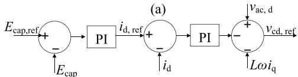

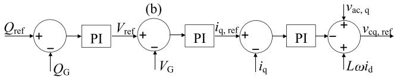  
Fig. 4. Block diagram of the grid-side controller (a) capacitor voltage controller, (b) reactive power controller.

with results shown in 4th column of Table 1. The parameter limits used in this case are shown in the 3rd column of the same table. The insight gained during the selection of initial values using trial-and-error also informs the designer of suitable, albeit approximate, parameter ranges. Such insight is used in selecting the ranges for the examples in this paper. In general, assigning larger limits does not affect the final solution since the GA is a global optimization algorithm; however, larger limits often require larger initial and surviving populations as the algorithm has to search a larger space. Conversely, narrow limits may adversely impact the solution by excluding the optimal area.

Fig. 5(a) and (b) show the initial and optimal rms voltage waveforms, respectively. Even though the optimized controllers produce markedly better results, the time taken by the algorithm to complete the task is 43.48 h, which is significant. To reduce this time, the proposed hybrid algorithm and parallel GA are used as described in the next sections. It should be noted that the steady state voltage at POI after the fault is higher than 66 kV due to insufficient reactive power compensation in the design, which is not included in optimization.

# 4.2.2. Optimization using hybrid GA-Simplex algorithm

The GA is run for two generations with the same populations and parameter boundaries as before. The best values obtained after the second generation are used as the initial values for the Simplex. The results obtained using this method are shown in 5th and 6th columns of Table 1. The waveforms of rms voltage at POI for intermediate GA optimized values and final results of simplex are shown in Fig. 5(c) and (d) respectively. Although the solution found by this method is slightly less optimal than the one found after 10 generations of sequential GA, it is still an acceptable solution, which gives better OF value than initial values in 21.31 h, which is almost half of the time consumed by the sequential GA.

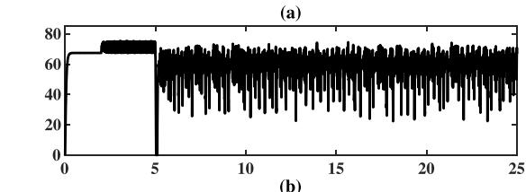

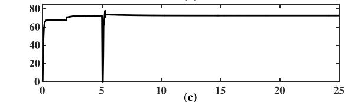

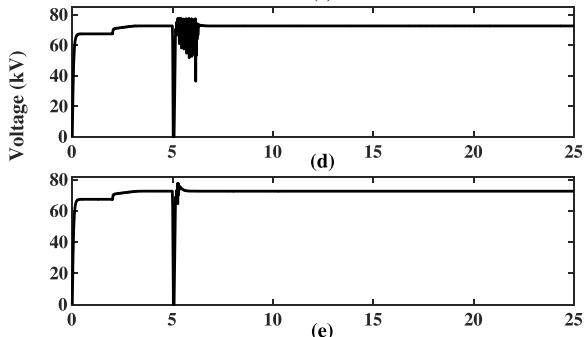

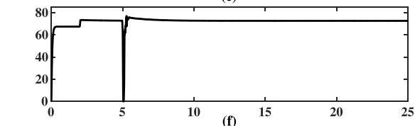

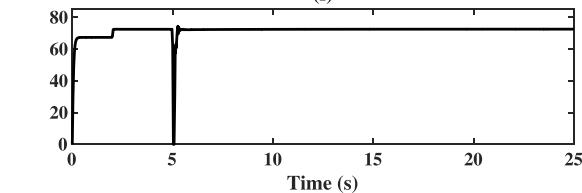  
Fig. 5. POI voltage for (a) initial values, (b) sequential GA optimized values, (c) intermediate GA values, (d) final Simplex optimized values, (e) parallel GA optimized values (f) optimized values after run-time screening.

Table 3 Run-time screening for Example I.   

<table><tr><td rowspan="2">Parameter</td><td colspan="3">Values after each generation</td></tr><tr><td>1st</td><td>2nd</td><td>3rd</td></tr><tr><td>Kp,Edc</td><td>6.045</td><td>5.516</td><td>6.935</td></tr><tr><td>Ti,Edc</td><td>0.888</td><td>1.277</td><td>1.853</td></tr><tr><td>Kp,Q</td><td>2.389</td><td>6.045</td><td>4.006</td></tr><tr><td>Tl,Q</td><td>1.566</td><td>0.379</td><td>0.843</td></tr><tr><td>Kp,Vac</td><td>2.243</td><td>1.366</td><td>1.788</td></tr><tr><td>Tl,Vac</td><td>1.906</td><td>1.497</td><td>1.906</td></tr><tr><td>Kp,P</td><td>1.826</td><td>0.269</td><td>1.826</td></tr><tr><td>Tl,P</td><td>0.483</td><td>0.778</td><td>0.483</td></tr></table>

Table 4 Time comparison of optimization methods — Example I.   

<table><tr><td>Sequential GA</td><td>43.48 h</td><td>Hybrid GA-Simplex</td><td>21.31 h</td></tr><tr><td>Parallel GA</td><td>13.11 h</td><td>Parallel GA + screening</td><td>9.74 h</td></tr></table>

# 4.2.3. Optimization using parallel GA

In this solution, eight instances of the same case are run in parallel, where the parameter values for the cases are generated by the GA, coded in a Python script. The solution using the same population numbers and parameter limits takes only 13.11 h (almost 3.3 times faster than the sequential GA). Optimization results are shown in 7th column of Table 1 and Fig. 5(e) illustrates the waveforms of the rms voltage at POI.

# 4.3. Screening of optimization variables

Run-time screening method may be applied in this example to reduce the simulation time further. The parallel GA solver is run for three generations with the same limits and population values as before. The best solutions after each generation (Table 3) are examined, which reveals that $T _ { \mathrm { i _ { \mathrm { - } } E d c } } , ~ K _ { \mathrm { p _ { - } Q } } , ~ T _ { \mathrm { i _ { - } Q } } , ~ K _ { \mathrm { p _ { - } V a c } } , ~ K _ { \mathrm { p _ { - } P } }$ and $T _ { \mathrm { i } , \mathrm { P } }$ require further optimization since they vary considerably, while $K _ { \mathrm { p . E d c } } , \ T _ { \mathrm { i . V a c } }$ show markedly lower variations. Hence, the best values obtained from GA up to this point are assigned to $K _ { \mathrm { p , E d c } }$ and $T _ { \mathrm { i , V a c } } ,$ while the remaining parameters are optimized further. With the knowledge acquired from screening, the search limits may also be reduced, thus smaller populations can be used. The remaining six parameters are optimized after running the parallel GA for five additional generations with initial and surviving populations of 72 and 24, respectively. The new limits and optimization results are shown in 8th and 9th columns of Table 1. The rms voltage at POI with optimized values is shown in Fig. 5(f). The total time taken for this process is 9.74 h and the results are as satisfactory as before, which confirms the efficiency of the proposed run-time screening method. Optimization time comparisons for the discussed four methods are shown in Table 4. A considerable amount of time is saved by using the enhanced methods proposed in this paper while obtaining high-quality optimal results.

# 5. Example case II

# 5.1. System and controller configuration

This example is a 2 MW type-4 wind turbine generator connected with the grid as shown in Fig. 6. The generator arrangement and the control system are the same as in Example I. Reactive power exchange in the wind power plant is maintained at zero and active power is changed as in (3).

$$
P = \left\{ \begin{array}{l l} 0. 2 5 \mathrm {p u} & t <   1 5 \mathrm {s} \\ 0. 4 \mathrm {p u} & t > 1 5 \mathrm {s} \end{array} \right. \tag {3}
$$

A three-phase-to-ground fault is applied at ?? = 5.5 s and cleared after 0.2 s. In this example all the PI control parameters, including the inner

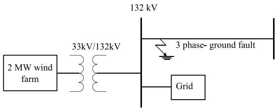  
Fig. 6. Schematic diagram of the system in Example II.

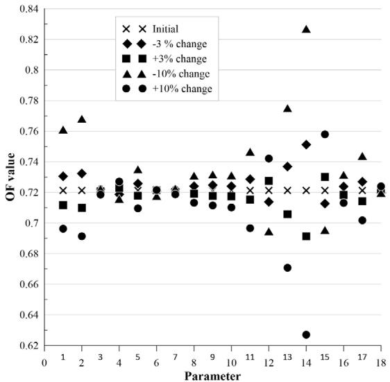  
Fig. 7. Distribution of OF values with parameter perturbations.

control loops, are optimized. The controllers and their parameters are shown in Table 5. The initial OF value of the system is 0.721. The objective of the controller is to control the active and reactive power output of the wind farm properly. Therefore, the addition of integral square errors of active and reactive power curves is used as the OF as in (4).

$$
O F = \int_ {0} ^ {T} \left(\left(P - P _ {\text {r e f}}\right) ^ {2} + \left(Q - Q _ {\text {r e f}}\right) ^ {2}\right) d t \tag {4}
$$

where [0, ?? ] is the simulation time period.

# 5.2. Screening of the parameters

There are 18 parameters to optimize in this example. Therefore, the screening method I (initial screening) is used with ±3% and ±10% changes applied to the initial parameter values in separate runs. After observing the obtained OF values in each run, which are shown in Fig. 7, parameters $K _ { \mathrm { p q \mathrm { _ M } } } , T _ { \mathrm { i q \mathrm { _ M } } } , T _ { \mathrm { i d \mathrm { _ M } } } , K _ { \mathrm { p \mathrm { _ A C } } } , T _ { \mathrm { i q \mathrm { _ G } } }$ are identified as noninfluential due to their small impact on the OF. Parameter numbers in Fig. 7 correspond to those in Table 6.

Table 5 Controllers parameters for optimization in Example II.   

<table><tr><td colspan="9">Machine-side converter</td></tr><tr><td>Controller</td><td>Parameter</td><td>Controller</td><td>Parameter</td><td>Controller</td><td>Parameter</td><td>Controller</td><td>Parameter</td><td>Parameter</td></tr><tr><td rowspan="2">Active power</td><td>Kp,P,M</td><td rowspan="2">Iq current</td><td>Kpq,M</td><td rowspan="2">Id current</td><td>Kpd,M</td><td rowspan="2">AC voltage</td><td rowspan="2">Kp,AC</td><td rowspan="2">T1,AC</td></tr><tr><td>Ti,P,M</td><td>Tiq,M</td><td>Tid,M</td></tr><tr><td colspan="9">Grid-side converter</td></tr><tr><td>Controller</td><td>Parameter</td><td>Controller</td><td>Parameter</td><td>Controller</td><td>Parameter</td><td>Controller</td><td>Parameter</td><td>Parameter</td></tr><tr><td rowspan="3">DC voltage</td><td>Kp,Edc</td><td rowspan="2">Reactive power</td><td>Kpq</td><td rowspan="2">AC voltage</td><td>Kp,Vac</td><td rowspan="2">Id current</td><td>Kpd,G</td><td>T1,EdG</td></tr><tr><td>Ti,Edc</td><td>TiQ</td><td>Tid,G</td><td>Iq current</td><td>Kpq,G</td></tr><tr><td></td><td></td><td></td><td></td><td></td><td></td><td></td><td>Tiq,G</td></tr></table>

Table 6 Initial and optimized values for Example II.   

<table><tr><td rowspan="2">Parameter number</td><td rowspan="2">Parameter</td><td colspan="2">Initial</td><td rowspan="2">Sequential GA</td><td colspan="2">Hybrid GA-Simplex</td><td rowspan="2">Parallel GA</td><td rowspan="2">Parallel GA + screening</td></tr><tr><td>Limits</td><td>Values</td><td>GA</td><td>Simplex</td></tr><tr><td>1</td><td>Kp,P,M</td><td>(0,5)</td><td>1</td><td>4.99</td><td>4.98</td><td>5.042</td><td>3.73</td><td>4.83</td></tr><tr><td>2</td><td>T1,P,M</td><td>(0,1)</td><td>0.01</td><td>0.073</td><td>0.25</td><td>0.0097</td><td>0.081</td><td>0.011</td></tr><tr><td>3</td><td>Kpq,M</td><td>(0,5)</td><td>1</td><td>4.83</td><td>4.83</td><td>4.92</td><td>3.95</td><td>1</td></tr><tr><td>4</td><td>Tiq,M</td><td>(0,1)</td><td>0.01</td><td>0.85</td><td>0.747</td><td>0.914</td><td>0.33</td><td>0.01</td></tr><tr><td>5</td><td>Kpd,M</td><td>(0,5)</td><td>1</td><td>1.836</td><td>1.836</td><td>2.01</td><td>3.66</td><td>2.15</td></tr><tr><td>6</td><td>Tid,M</td><td>(0,1)</td><td>0.01</td><td>0.48</td><td>0.48</td><td>0.66</td><td>0.065</td><td>0.01</td></tr><tr><td>7</td><td>Kp,AC</td><td>(0,5)</td><td>1</td><td>0.368</td><td>0.368</td><td>0.52</td><td>0.837</td><td>1</td></tr><tr><td>8</td><td>T1,AC</td><td>(0,1)</td><td>0.01</td><td>0.0206</td><td>0.081</td><td>0.21</td><td>1.14</td><td>0.167</td></tr><tr><td>9</td><td>Kp,Ecd</td><td>(0,5)</td><td>0.5</td><td>3.075</td><td>1.735</td><td>2.01</td><td>4.03</td><td>3.395</td></tr><tr><td>10</td><td>T1,Ecd</td><td>(0,1)</td><td>0.01</td><td>0.342</td><td>0.34</td><td>0.53</td><td>0.86</td><td>0.318</td></tr><tr><td>11</td><td>Kpq</td><td>(0,5)</td><td>0.5</td><td>1.089</td><td>1.85</td><td>2.24</td><td>4.29</td><td>4.78</td></tr><tr><td>12</td><td>T1Q</td><td>(0,1)</td><td>0.01</td><td>0.151</td><td>0.13</td><td>0.021</td><td>0.041</td><td>0.016</td></tr><tr><td>13</td><td>Kp,Vac</td><td>(0,5)</td><td>0.5</td><td>4.5</td><td>4.50</td><td>4.49</td><td>4.75</td><td>1.068</td></tr><tr><td>14</td><td>T1,Vac</td><td>(0,1)</td><td>0.01</td><td>0.796</td><td>0.95</td><td>1.11</td><td>0.935</td><td>0.681</td></tr><tr><td>15</td><td>Kpd,G</td><td>(0,5)</td><td>0.5</td><td>2.227</td><td>2.23</td><td>2.54</td><td>2.502</td><td>1.285</td></tr><tr><td>16</td><td>Tid,G</td><td>(0,1)</td><td>0.05</td><td>0.067</td><td>0.66</td><td>0.74</td><td>0.152</td><td>0.337</td></tr><tr><td>17</td><td>Kpq,G</td><td>(0,5)</td><td>0.5</td><td>0.0805</td><td>0.081</td><td>0.233</td><td>0.677</td><td>3.056</td></tr><tr><td>18</td><td>Tiq,G</td><td>(0,1)</td><td>0.05</td><td>0.664</td><td>0.97</td><td>1.321</td><td>0.247</td><td>0.05</td></tr><tr><td></td><td>OF value</td><td></td><td>0.721</td><td>0.011</td><td>0.0124</td><td>0.0085</td><td>0.0091</td><td>0.0089</td></tr></table>

Table 7 Comparison of population details and number of simulation runs for Example II.   

<table><tr><td rowspan="2"></td><td rowspan="2">Sequential GA</td><td colspan="2">Hybrid GA-Simplex</td><td rowspan="2">Parallel GA</td><td rowspan="2">Parallel GA + screening</td></tr><tr><td>GA</td><td>Simplex</td></tr><tr><td>Initial population</td><td>240</td><td>240</td><td>-</td><td>240</td><td>160</td></tr><tr><td>Surviving population</td><td>160</td><td>160</td><td>-</td><td>160</td><td>120</td></tr><tr><td>Generations</td><td>6</td><td>2</td><td>-</td><td>6</td><td>6</td></tr><tr><td>Simulation runs</td><td>1041</td><td>401</td><td>115</td><td>1048</td><td>768</td></tr></table>

# 5.3. Optimization of parameters

Even though initial screening identified the influential parameters, to demonstrate the efficiency of the other methods proposed and for comparison purposes, all 18 parameters are optimized in the first three parts of this section and optimization of the influential parameters only is shown in the last part.

# 5.3.1. Optimization using sequential GA

The GA is launched for six generations using initial and surviving populations of 240 and 160 (see Table 7), respectively. The parameter limits used in GA and their optimized values are shown in 3rd and 5th columns of Table 6, respectively. Parameter limits in this example are selected in the same manner as in the previous example. Active power variations before and after optimization are shown in Fig. 8(a) and (b), respectively. The design takes 25.47 h to complete, which shows the need for improved methods.

# 5.3.2. Optimization using hybrid GA-Simplex algorithm

The GA is launched for two generations and then the optimization is continued using Simplex with the best solution given by the GA. The optimization results after GA and after Simplex algorithm are shown in 6th and 7th columns of Table 6 . Fig. 8(c) and (d) show the dynamics of the active power in the system for optimized values obtained from

intermediate GA and simplex algorithm respectively. The time taken by this approach is 11.08 h, which is considerably lower than before.

# 5.3.3. Optimization using parallel GA

In this case, eight parameter sets are evaluated simultaneously. Optimal values obtained are shown in 8th column of Table 6, and Fig. 8(e) shows the dynamics of the active power output. The simulation time is markedly reduced to 9.8 h using this method.

# 5.3.4. Optimization of influential parameters

In this part, only the parameters identified as influential are optimized by the parallel GA. Since the dimension of the problem is reduced from 18 to 13, initial and surviving populations are reduced to 160 and 120, respectively, and the parallel GA is launched for six generations. Optimized results are shown in 9th columns of Table 6, and the optimal active power output is shown in Fig. 8(f). This design takes merely 7.4 h, which is a significant reduction of time. Time comparisons are shown in Table 8. In this case, both the hybrid algorithm and parallel GA give significant improvements. Time taken by the hybrid algorithm is further reduced by using the parallel GA. The results show that the time taken by sequential GA is be reduced by nearly 15 h using the methods proposed in this paper. Furthermore, this example demonstrates that the initial screening method is effective in reducing the simulation time without adversely affecting the quality of the final optimal design.

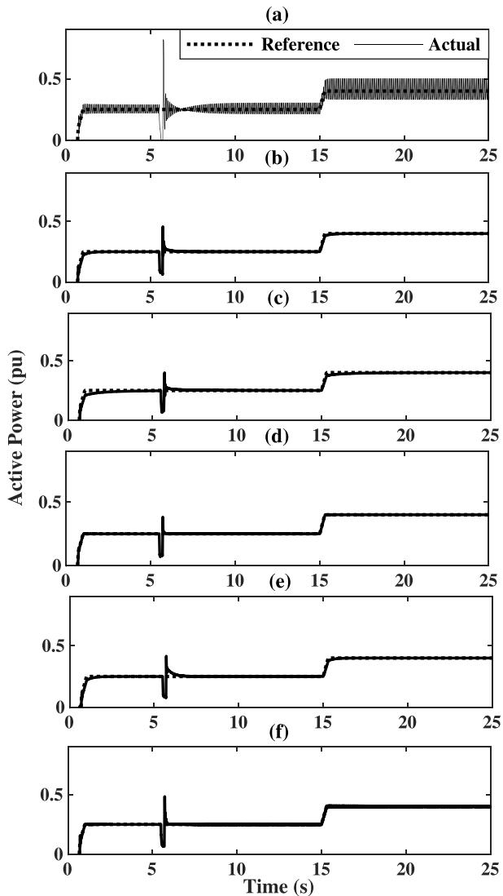  
Fig. 8. Active power output with (a) initial values, (b) sequential GA optimized values, (c) intermediate GA values, (d) final Simplex optimized values, (e) parallel GA optimized values (f) parallel GA optimization of 13 influential parameters.

Table 8 Time comparisons for Example II.   

<table><tr><td>Sequential GA</td><td>25.47 h</td><td>Hybrid GA-Simplex</td><td>11.08 h</td></tr><tr><td>Parallel GA</td><td>9.8 h</td><td>Parallel GA + screening</td><td>7.4 h</td></tr></table>

# 6. Conclusions

The paper addressed practical problems that engineers face when using EMT simulators for optimal design of power systems, e.g., controller tuning in multi-converter systems with renewable generation

sources. These problems stem from the large computational burden of both the EMT and optimization algorithms, and the repetitive nature of the design cycle wherein a large number of simulations need to be conducted. The paper proposed two screening methods and a hybrid GA-Simplex algorithm, and used parallel GA computations to overcome these challenges. Optimization results of two systems with several converters and multiple control loops revealed that the screening methods were able to correctly identify influential parameters to assist in reducing the dimension of problem, thereby lowering the burden of the optimization algorithm. The hybrid GA-Simplex and parallel GA solvers provided significant time savings in the design process without adversely affecting the quality of the final optimal designs.

# Declaration of competing interest

The authors declare that they have no known competing financial interests or personal relationships that could have appeared to influence the work reported in this paper.

# Data availability

No data was used for the research described in the article.

# References

[1] S. Subedi, M. Rauniyar, S. Ishaq, T.M. Hansen, R. Tonkoski, M. Shirazi, R. Wies, P. Cicilio, Review of methods to accelerate electromagnetic transient simulation of power systems, IEEE Access 9 (2021) 89714–89731.   
[2] K. Kobravi, Optimization-Enabled Transient Simulation for Design of Power Circuits with Multi- Modal Objective Functions (Ph.D. dissertation), University of Manitoba, 2007.   
[3] I.K. Park, Real- Time Application of Optimization- Enabled Electromagnetic Transient Simulation (Master’s thesis), University of Manitoba, 2012.   
[4] S. Filizadeh, Optimization- Enabled Electromagnetic Transient Simulation (Ph.D. dissertation), University of Manitoba, 2012.   
[5] S. Filizadeh, A.M. Gole, D.A. Woodford, G.D. Irwin, An optimization-enabled electromagnetic transient simulation-based methodology for HVDC controller design, IEEE Trans. Power Deliv. 22 (4) (2007) 2559–2566.   
[6] R.C. Bansal, Optimization methods for electric power systems: An overview, Int. J. Emerg. Electr. Power Syst. 2 (1) (2005).   
[7] H. Mejbri, K. Ammous, S. Abid, H. Morel, A. Ammous, Bi-objective sizing optimization of power converter using genetic algorithms: Application to photovoltaic systems, Compel 33 (2013) 398–422.   
[8] Introduction to optimization, in: Practical Genetic Algorithms, John Wiley & Sons, Ltd, 2003, pp. 1–66, ch. 1.   
[9] N. Adachi, Y. Yoshida, Accelerating genetic algorithms: protected chromosomes and parallel processing, in: First International Conference on Genetic Algorithms in Engineering Systems: Innovations and Applications, 1995, pp. 76–81.   
[10] Z. Wang, X. Yin, Z. Zhang, J. Yang, Pseudo-parallel genetic algorithm for reactive power optimization, in: 2003 IEEE Power Engineering Society General Meeting (IEEE Cat. No.03CH37491), Vol. 2, 2003, pp. 903–907.   
[11] Z.-X. Wang, G. Ju, A parallel genetic algorithm in multi-objective optimization, in: 2009 Chinese Control and Decision Conference, 2009, pp. 3497–3501.   
[12] [Online]. Available: https://www.pscad.com/webhelp-v5-ol/PSCAD/Parallel_ and_High_Performance_Computing/Simulation_Sets.htm.   
[13] R. Chelouah, P. Siarry, Genetic and Nelder–Mead algorithms hybridized for a more accurate global optimization of continuous multiminima functions, European J. Oper. Res. 148 (2) (2003) 335–348.