# An Extended Habedank’s Equation-Based EMTP Model of Pantograph Arcing Considering Pantograph-Catenary Interactions and Train Speeds

Ying Wang, Student Member, IEEE, Zhigang Liu, Member, IEEE, Xiuqing Mu, Ke Huang, Hongrui Wang, Student Member, IEEE, and Shibin Gao

Abstract—Pantograph arcing is a more and more common and prominent phenomenon in AC electrified railway system, especially with the increase of pantograph-catenary (PAC) interaction and train speed. In order to address this issue, an extended Habedank’s equation-based model, by means of electromagnetic transients program (EMTP), is presented to obtain equivalent modeling for pantograph arcing studies considering train speeds in this paper. First, the pantograph arcing phenomenon is investigated, such as transient mechanisms and influencing factors. Second, based on the features of existing and emerging pantograph arcing, Habedank’s arc equations are further derived and studied by improving voltage gradient and power dissipation. Next, due to the relationship among voltage gradient, power dissipation and arc length, the maximum detachment interval law between pantograph and contact wire is obtained by establishing the finite element model (FEM) for PAC interaction, and the ultimate extended Habedank’s equation-based EMTP model of pantograph arcing considering different train speeds is acquired. Then, the related model parameters are discussed and determined. Finally, based on the China Beijing-Yizhuang HSR line model in EMTP, the arc characteristic differences considering loads under different parameter values are compared and analyzed. The comparison results illustrate that the proposed model can be feasible for determining and revealing the pantograph arcing characteristics and influences in HSR system as well as the PAC contact loss problems.

Index Terms—High-speed railway (HSR), pantograph arcing, electromagnetic transients program (EMTP), finite element method (FEM), arc parameters

# I. INTRODUCTION

ANTOGRAPH arcing in electrified railways is a common phenomenon [1]. Its main cause is a variable air gap due to mechanical oscillation of the train, irregularity of the contact wire and influence of the high-speed airflow. Especially, along with the increasing train speed [2], such as the traveling CRH380CL-type locomotive speed 400km/h up to the beginning of 2015 in China, it prompts the vibrations of pantograph-catenary (PAC) system and leads to the electric contact performance getting worse, which will continuously bring about the pantograph arcing as shown in Fig.1.

The mechanisms and interferences of pantograph arcing, such as volt-ampere characteristics [1], [3], [7], electromagnetic effects [4]-[5], [9] and power quality influences [6]-[7], etc., have been studied to a great extent. In addition, different pantograph arcing equipments are also designed and analyzed (e.g., [7]-[12]).

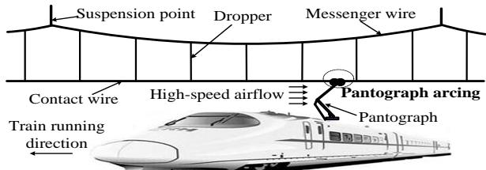  
Fig.1. Schematic of PAC sliding electric contact.

To illustrate and discuss pantograph arcing, based on experimental tests and simulated analysis, it is very necessary to establish proper arc model, especially considering different train speed in AC electrified railway system. Generally, arc models can be classified into three categories: black-box models, parameter models and physical models. First, for the black-box models, based on the Mayr’s [13] and Cassie’s [14] mathematical equations, some improved combinations of Mayr’s and Cassie’s equations are proposed mainly in order to extend the area of validity, such as Kema [15], Schwarz [16], Habedank [17] model, etc.. Second, the parameter models, can describe the arc characteristics of some special occasion, and are described by complex functions, such as numerical fitting formula [18], empirical formula [19] and so on. Last, the physical models [20] are depicted by the equations of fluid dynamics. However, the boundary condition derivation of this model needs the support of much experimental data.

More necessarily, the detailed understanding of how the pantograph arcing features interact with the rest of traction feeding system is very essential. Among common commercial software packages, electromagnetic transients program (EMTP) can realize the analysis of short-circuit faults, load-flow problems, transient circumstances, etc, and it can operate by solving the algebraic and differential equations associated with the various connections of electrical components [21]. Also, an improved Mayr's arc model is presented to observe the harmonic spectrum of pantograph arc by using time-controlled switches [22].

As an extension of the previous work, the purpose of this paper is to propose an effective black-arc model to study the AC pantograph arc behaviors in details. The rest of paper is organized as follows. In Section II, Habedank’s

equation-based arc model is introduced to discuss features of pantograph arcing and it is concluded that the model is closely related to pantograph arcing length. In Section III, maximum detachment interval law between pantograph and contact wire is obtained through establishing finite element model and an extended Habedank’s equation-based model for pantograph arcing, by improving voltage gradient and dissipated power, is proposed. Then, in Section IV, the parameters of extended arc model are determined through equivalent test circuit derivation. In Section V, based on the China Beijing-Yizhuang HSR line model in EMTP, the arc characteristic differences considering loads under different parameter values are analyzed. The conclusions are drawn in Section VI.

# II. FEATURES AND MODELING OF PANTOGRAPH ARCING

On one hand, according to several previous railway and power industries investigations [1], [7], [12] on current waveforms of AC pantograph arcing, it is noticed that pantograph arcing distorts the sinusoidal waveform and generates the transients during the current zero crossings (CZCs). For the characteristics of CZCs region aforementioned, the modeling of pantograph arcing is applicable to the Mayr’s black-box arc equation [13], [22].

On the other hand, with the high-speed and heavy-load development for electrified railway, the traction power of high-speed train is increasingly larger, i.e. the traction current for train-roof pantograph from catenary is larger and larger. Many pantograph arcing tests and the corresponding investigations are carried out for the pantograph current collection [1], [3], [7]-[12]. For the high current and low resitance state before CZCs, the initial Mayr arc model is not very suitable [17]. However, Cassie’s black-box arc equation is suitable for describing this process [14]. Then, the entire pantograph arc behavior can be divided into two different processes to establish. The used Habedank’s equation-based arc model [17] consists basically of a series association of Mayr’s model defined by Eq. (1) and Cassie’s model defined by Eq. (2). The arc conductance can be calculated by Eq. (3).

$$
\begin{array}{l} \frac {d g _ {\mathrm {m}}}{d t} = \frac {1}{\tau_ {1}} \left(\frac {i ^ {2}}{P _ {0}} - g _ {\mathrm {m}}\right) (1) \\ \frac {d g _ {\mathrm {c}}}{d t} = \frac {1}{\tau_ {2}} \left(\frac {i ^ {2}}{u _ {\mathrm {c}} ^ {2} \cdot g _ {\mathrm {c}}} - g _ {\mathrm {c}}\right) (2) \\ \frac {1}{g} = \frac {1}{g _ {\mathrm {m}}} + \frac {1}{g _ {\mathrm {c}}} (3) \\ \end{array}
$$

where $g$ is arc conductance, i is arc current, $g _ { \mathrm { m } }$ and $\tau _ { 1 }$ are respectively conductance and time constant of the Mayr part, $g _ { \mathrm { c } }$ and $\tau _ { 2 }$ are respectively conductance and time constant of the Cassie part, $P _ { 0 }$ and $u _ { \mathrm { c } }$ are arc dissipated power constant and arc voltage gradient constant respectively. Besides, $\tau _ { 1 } ,$ $\tau _ { 2 }$ are respectively required time during the CZCs region, which can be expressed as [23]

$$
\tau_ {1} = \tau_ {2} = \tau_ {0} g ^ {\alpha} \tag {4}
$$

where α is a constant, and $\tau _ { 0 }$ is the initial time constant.

The used Habedank model provides a possibility to observe and analyze entire pantograph arcing. However, due to the hypothesis that arc voltage gradient constant $u _ { \mathrm { c } }$ and the

dissipated power constant $P _ { 0 }$ are unchanged, the computer program for simulating is not in itself sufficient for analyzing the pantograph arcing characteristics. For acquiring accurate relatively pantograph arc behaviors, the related arc parameters, including $u _ { \mathrm { c } }$ and $P _ { 0 } ,$ should be extended.

# A. Extension of Arc Voltage Gradient $u _ { \mathrm { c } }$

For AC arc unit-length voltage drop (i.e. voltage gradient $u _ { \mathrm { c } } )$ , as peak value of arc current is relatively high, voltage gradient along arc column length is unrelated with arc current and is considered to be equal to voltage drop in arc column [24], where dissipation thermal along axial direction and electrode point is very small and can be ignored. A linear relation [25] between voltage gradient $u _ { \mathrm { c } }$ with arc length $L _ { \mathrm { a r c } }$ aiming at pantograph arcing has been approximately obtained.

$$
u _ {\mathrm {c}} = 1 5 L _ {\mathrm {a r c}} \tag {5}
$$

Actually, due to the relative motion of arc electrodes, such as running train, high-speed airflow, etc, the arc length $L _ { \mathrm { a r c } }$ is longer than the actual PAC detachment interval and is a varying value, also the pantograph arcing will be continuously pulled. Hence, the pantograph arcing generally keeps at long-arc state. Only under the extreme contact loss interval, it can be regarded that the arc length $L _ { \mathrm { a r c } }$ is approximately equal to maximum contact loss interval $d _ { \mathrm { m a x } }$ x.

# B. Extension of Arc Dissipated Power $P _ { 0 }$

By analyzing the switching process of AC high-airflow arc repeatedly, Kapetanonic M [26] concludes that dissipated power $P _ { 0 }$ is dependent on arc conductance $g$ and arc length $L _ { \mathrm { a r c } } ,$ which can be expressed as

$$
P _ {0} = k _ {1} g ^ {\beta} L _ {\text {a r c}} ^ {n} \tag {6}
$$

where n denotes index of arc length $L _ { \mathrm { a r c } } , \beta$ and $k _ { 1 }$ represent dissipation power factor and arc pyroelectric coefficient, respectively .

Similarly, considering that the pantograph arcing is constantly under the high-speed airflow, Eq. (6) can be also adopted and written as

$$
I _ {\mathrm {a r c}} R _ {\mathrm {a r c}} ^ {2} = P _ {0} = k _ {1} g ^ {\beta} L _ {\mathrm {a r c}} ^ {n} = \left(k _ {1} L _ {\mathrm {a r c}} ^ {n - 1}\right) g ^ {\beta} L _ {\mathrm {a r c}} = k g ^ {\beta} L _ {\mathrm {a r c}} \tag {7}
$$

where k refers to the arc pyroelectric coefficient.

From Eq. (5) and Eq. (7), it can be observed that both the extended arc parameters $u _ { \mathrm { c } }$ and $P _ { 0 }$ are entirely related with the arc length $L _ { \mathrm { a r c } }$ .

# III. DETERMINATION OF MAXIMUM CONTACT LOSS INTERVAL

In order to get the maximum detachment interval, the laws of whole contact loss between pantograph and contact wire should be studied and analyzed. Due to the vibrations and responses of PAC system, obtaining the actual contact loss law is extremely difficult through experimental tests.

Here, based on finite element method (FEM), a common PAC model is established and verified by using the European Standard EN 50318 [27]. Further, PAC contact loss law is acquired by adding aerodynamic forces and irregularities of contact wire to the PAC interaction model.

# A. PAC Modeling and Validation

Generally, a simple suspension catenary system with some degrees of freedom, including messenger wire, dropper,

contact wire, etc, is shown in Fig. 2. The necessary equilibrium equations [28] can be written as

$$
\mathbf {M} \cdot \mathbf {r} + \mathbf {C} \cdot \mathbf {r} + \mathbf {S} \cdot \mathbf {r} = \mathbf {F} \tag {8}
$$

where the displacement and external force vectors are defined by $\mathbf { r } { = } [ x , y , z ] ^ { \bar { T } }$ and ${ \bf F } = [ F _ { 1 } , F _ { 2 } , F _ { 3 } ] ^ { T }$ , and where the global mass, damping, and stiffness matrices are given by M, C and S. The rotations in z-axis and the deformations in x and y direction representing the contact wire zigzag shape and the catenary motion, which can be expressed by the equation aforementioned. In the process of FEM modeling, 2D Euler-Bernoulli beam element is adopted for the messenger wire and the contact wire. As depicted in Fig. 2, the mass element is used for the registration arm and steady arm, and the nonlinear spring element is adopted for the slacked droppers. For the simple suspension catenary widely used in China Beijing-Yizhuang HSR line, the adopted parameters in Eq. (8) are given in Fig. 2 and Table I.

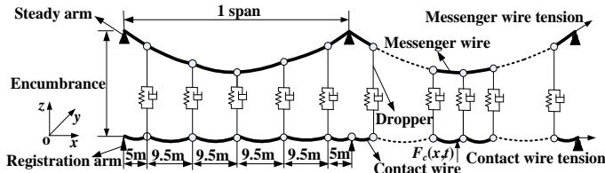  
Fig.2. Geometry parameters of a suspension catenary model.

TABLE I PHYSICAL PARAMETERS OF A SUSPENSION CATENARY   

<table><tr><td>Type</td><td>Value</td></tr><tr><td>Line density of CTMH120-type contact wire</td><td>1.082kg.m-1</td></tr><tr><td>Tensile rigidity of CTMH120-type contact wire</td><td>106N.m-1</td></tr><tr><td>Line density of JTMH120-type messenger wire</td><td>1.068kg.m-1</td></tr><tr><td>Tensile rigidity of JTMH120-type messenger wire</td><td>106N.m-1</td></tr><tr><td>Line density of dropper</td><td>0.14kg.m-1</td></tr><tr><td>Tensile rigidity of dropper</td><td>105N.m-1</td></tr><tr><td>Stagger</td><td>±0.3m</td></tr><tr><td>Encumbrance</td><td>1.6m</td></tr><tr><td>Contact wire tension</td><td>27kN</td></tr><tr><td>Messenger wire tension</td><td>21kN</td></tr></table>

Besides, high-speed train acquires currents through the up-lifting contact force of pantograph. And a high-speed pantograph can be regarded as a multi-body model or a lumped mass model [29]. Here, the pantograph is modeled as a three lumped mass-spring-damper system as shown in Fig .3, which can characterize the vertical motion of the pantograph effectively. Among this, $s _ { 1 } , \ s _ { 2 }$ and $s _ { 3 }$ represent the stiffness coefficients of pantograph pan-head $m _ { 1 }$ , the upper pantograph frame $m _ { 2 }$ and the lower pantograph frame $m _ { 3 } ;$ $c _ { 1 } , \ c _ { 2 }$ and $c _ { 3 }$ represent the damping coefficients of $m _ { 1 } , m _ { 2 }$ and m3. Thus, for the vertical motion of the pantograph, the dynamic equation can be expressed with the PAC contact force $F _ { \mathrm { c } } ( x , t )$ and the static up-lift force of pantograph $F _ { 0 }$ as

$$
m _ {1} \ddot {y} _ {1} + c _ {1} (\dot {y} _ {1} - \dot {y} _ {2}) + s _ {1} (y _ {1} - y _ {2}) = - F _ {\mathrm {c}} (x, t) \tag {9}
$$

$$
m _ {2} \ddot {y} _ {2} + c _ {1} (\dot {y} _ {2} - \dot {y} _ {1}) + c _ {2} (\dot {y} _ {2} - \dot {y} _ {3}) + s _ {1} (y _ {2} - y _ {1}) + s _ {2} (y _ {2} - y _ {3}) = 0 \tag {10}
$$

$$
m _ {3} \ddot {y} _ {3} + c _ {2} (\dot {y} _ {3} - \dot {y} _ {2}) + c _ {3} \dot {y} _ {3} + s _ {2} (y _ {3} - y _ {2}) + s _ {3} y _ {3} = F _ {0} \tag {11}
$$

where $y _ { 1 } , y _ { 2 }$ and $y _ { 3 }$ denote the vertical displacements of the three lumped masses. $F _ { 0 }$ refers to the static uplift force of pantograph, which is produced by train body vibration or spring load and is set to 70N in China. The other physical parameters in Eq. (9)-(11) of pantograph DSA380, which is used in China, are given in Table II.

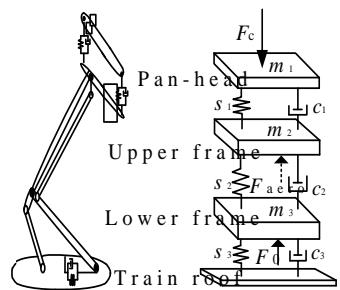  
Fig.3. Three lumped masses model of pantograph.

TABLE II PHYSICAL PARAMETERS OF PANTOGRAPH   

<table><tr><td>Parameter</td><td>DSA380-type</td></tr><tr><td>m1(kg)</td><td>7.12</td></tr><tr><td>m2(kg)</td><td>6.0</td></tr><tr><td>m3(kg)</td><td>5.8</td></tr><tr><td>s1(N.m-1)</td><td>9430</td></tr><tr><td>s2(N.m-1)</td><td>14100</td></tr><tr><td>s3(N.m-1)</td><td>0.1</td></tr><tr><td>c1(Ns.M-1)</td><td>0</td></tr><tr><td>c2(Ns.M-1)</td><td>0</td></tr><tr><td>c3(Ns.M-1)</td><td>70</td></tr></table>

Based on the above established suspension catenary model and pantograph model, the PAC sliding coupled model is regarded as a beam-beam contact using unilateral constraints, which introduces the kinematic condition of non-penetration between the contacting elements of contact wire and pantograph. The coupled PAC model is obtained in which the Lagrange multipliers concerning the unilateral constraints are used simultaneously. The implicit Newmark method [30] is adopted to solve the dynamic equations of the interaction model. Here, the special PAC interaction solving with 10 spans, i.e. 480m, is selected and the sampling is set to 0.2m. Note that it’s necessary to verify the dynamic performance of the established model, and the EN50318 is taken as a reference in this paper. Table III shows the results calculated by the PAC interaction model with parameters of EN50318. Compared with the main indexes for EN50318, it is verified that the simulated results are quite consistent with the standard.

TABLE IIITHE VALIDATION OF PAC MODEL ACORDING TO THE EN 50318  

<table><tr><td>Statistical index</td><td colspan="2">Ranges of EN 50318</td><td colspan="2">Simulated results</td></tr><tr><td>Train speed (km/h)</td><td>250</td><td>300</td><td>250</td><td>300</td></tr><tr><td>Mean contact force (N)</td><td>110~120</td><td>110~120</td><td>118.2</td><td>118.7</td></tr><tr><td>Standard deviation (N)</td><td>26~31</td><td>32~40</td><td>27.6</td><td>32.8</td></tr><tr><td>Max. statistic value (N)</td><td>190~210</td><td>210~230</td><td>201.1</td><td>213.2</td></tr><tr><td>Min. statistic value (N)</td><td>20~40</td><td>-5~20</td><td>35.5</td><td>19.2</td></tr><tr><td>Max. real value (N)</td><td>175~210</td><td>190~225</td><td>193.7</td><td>195.4</td></tr><tr><td>Min. real value (N)</td><td>50~75</td><td>30~55</td><td>70.3</td><td>54.7</td></tr><tr><td>Max. uplift at support (mm)</td><td>48~55</td><td>55~65</td><td>52.2</td><td>59.7</td></tr><tr><td>Contact loss (%)</td><td>0</td><td>0</td><td>0</td><td>0</td></tr></table>

# B. Contact Loss Simulations of PAC Interaction

Staple reasons for pantograph arcing are PAC vibration, aerodynamic effect, contact irregularity, etc., which may mainly lies in contact loss. So, during the calculation of FEM PAC interaction model aforementioned, the PAC contact loss analysis under different train speed can be further performed by utilizing aerodynamic effect on pantograph and adding irregularity data series on the initial conditions of contact wire.

On one hand, for the high-speed airflow effect, aerodynamic force is added in pantograph dynamic equation and Eq. (10) can be transformed as

$$
m _ {2} \ddot {y} _ {2} + c _ {1} (\dot {y} _ {2} - \dot {y} _ {1}) + c _ {2} (\dot {y} _ {2} - \dot {y} _ {3}) + s _ {1} (y _ {2} - y _ {1}) + s _ {2} (y _ {2} - y _ {3}) = F _ {\text {a e r o}} \tag {12}
$$

where $F _ { \mathrm { a e r o } }$ denotes the aerodynamic forces to which the pantograph is subjected. During the computation of Eq. (12), the aerodynamic force $F _ { \mathrm { a e r o } }$ can generally assumed to be static and increase in proportion to the square of train speed v. For a China pantograph, When pantograph is moving at speed v,

aerodynamic force $F _ { \mathrm { a e r o } }$ can be approximately given as [31]

$$
F _ {\text {a r e o}} = 0. 0 0 0 9 5 v ^ {2} + 0. 0 0 1 7 v - 0. 2 \tag {13}
$$

On the other hand, for solving PAC coupling model, the vertical displacement of contact wire [32] can be given as

$$
y _ {\mathrm {c}} (x, t) = \sum_ {\mathrm {m}} A _ {\mathrm {m}} (t) \sin \frac {m \pi x}{l} \tag {14}
$$

where $y _ { \mathrm { c } } ( x , t )$ denotes the vertical displacement of contact wire, m represents the amount of harmonics, l refers to the whole solving length of contact wire, $A _ { \mathrm { m } } ( t )$ is the vertical m sub-displacement of contact wire. From Eq. (14), it is obvious that the $y _ { \mathrm { c } } ( x , t )$ has the sine periodicity. So, in order to solve the interaction equation of PAC, the irregularities for contact wire can be also regarded as the sum of sine functions and be added to the initial displacement data of $y _ { \mathrm { c } } ( x , t )$ . And the irregularity data series can be performed as

$$
f (k \Delta x) = \sum_ {n = 1} ^ {N} A _ {n} \sin \left(\omega_ {n} k + \theta_ {n}\right) \tag {15}
$$

All the above definition sample number $k ,$ sampling interval $\Delta x$ , harmonic number N, and random variable $\theta _ { \mathfrak { n } }$ are known and the irregularity series function $f ( k \Delta x )$ is random. Besides, $A _ { \mathfrak { n } }$ is a normal random variable with zero mean.

TABLE IV PAC CONTACT STATISTIC RESULTS UNDER DIFFERENT TRAIN SPEEDS   

<table><tr><td rowspan="2">Train speed, v /(km/h)</td><td colspan="5">PAC contact force, Fc/N</td></tr><tr><td>Max. value, Fc/N</td><td>Min. value, Fc/N</td><td>Mean value, Fc/N</td><td>Contact loss/%</td><td>Max. vertical contact loss interval, dmax /cm</td></tr><tr><td>200</td><td>259.3800</td><td>0</td><td>102.0067</td><td>0.0042</td><td>1.954</td></tr><tr><td>208</td><td>268.4230</td><td>0</td><td>108.2565</td><td>0.0031</td><td>1.988</td></tr><tr><td>215</td><td>278.6520</td><td>0</td><td>110.9132</td><td>0.0021</td><td>2.135</td></tr><tr><td>225</td><td>291.0390</td><td>0</td><td>112.5447</td><td>0.0031</td><td>2.225</td></tr><tr><td>233</td><td>302.4510</td><td>0</td><td>121.5745</td><td>0.0083</td><td>2.357</td></tr><tr><td>240</td><td>318.5750</td><td>0</td><td>123.7220</td><td>0.0042</td><td>2.532</td></tr><tr><td>250</td><td>329.9390</td><td>0</td><td>124.1063</td><td>0.0021</td><td>2.779</td></tr><tr><td>258</td><td>332.4580</td><td>0</td><td>133.2358</td><td>0.0021</td><td>2.936</td></tr><tr><td>265</td><td>334.9150</td><td>0</td><td>135.7134</td><td>0.0042</td><td>3.295</td></tr><tr><td>275</td><td>340.0830</td><td>0</td><td>136.7765</td><td>0.0042</td><td>3.461</td></tr><tr><td>283</td><td>368.5210</td><td>0</td><td>146.0800</td><td>0.0042</td><td>3.891</td></tr><tr><td>290</td><td>387.4550</td><td>0</td><td>149.8516</td><td>0.0031</td><td>4.209</td></tr><tr><td>300</td><td>403.6650</td><td>0</td><td>150.2277</td><td>0.0065</td><td>4.503</td></tr><tr><td>308</td><td>428.4600</td><td>0</td><td>157.1608</td><td>0.0042</td><td>4.985</td></tr><tr><td>315</td><td>430.8520</td><td>0</td><td>163.2637</td><td>0.0083</td><td>5.339</td></tr><tr><td>325</td><td>433.4810</td><td>0</td><td>165.5950</td><td>0.0042</td><td>5.642</td></tr><tr><td>333</td><td>436.9430</td><td>0</td><td>173.3548</td><td>0.0031</td><td>6.062</td></tr><tr><td>340</td><td>442.1180</td><td>0</td><td>177.4600</td><td>0.0021</td><td>6.546</td></tr><tr><td>350</td><td>448.7020</td><td>0</td><td>181.0144</td><td>0.0063</td><td>6.924</td></tr><tr><td>358</td><td>457.4650</td><td>0</td><td>188.7558</td><td>0.0083</td><td>7.209</td></tr><tr><td>365</td><td>476.2290</td><td>0</td><td>192.5680</td><td>0.0042</td><td>7.865</td></tr><tr><td>375</td><td>487.2180</td><td>0</td><td>197.8894</td><td>0.0083</td><td>8.471</td></tr><tr><td>383</td><td>488.4600</td><td>0</td><td>199.4645</td><td>0.0021</td><td>8.953</td></tr><tr><td>390</td><td>492.2170</td><td>0</td><td>212.4650</td><td>0.0042</td><td>9.568</td></tr><tr><td>400</td><td>507.9430</td><td>0</td><td>215.3386</td><td>0.0083</td><td>10.309</td></tr></table>

Through the process aforementioned, the same vertical irregularity of PAC interaction under different speeds can be obtained. And the corresponding calculation results, concluding different contact forces and specific train speeds, are described in Table IV. Now, let us further consider the case of pure PAC vertical motion, i.e. the situation that $r _ { \mathrm { x } } ( x , t ) =$ $r _ { \mathrm { z } } ( x , t ) { = } 0$ in Eq. (8), then the PAC vertical contact loss interval under different train speeds can be acquired by solving the vertical displacement difference between contact wire and pantograph pan-head. The pantograph arcing length $L _ { \mathrm { a r c } }$ is statistically obtained by being approximately equal to the

corresponding maximum vertical interval $d _ { \mathrm { m a x } }$ caused by contact loss. It can be observed that, along with the increasing train speed, the PAC maximum contact loss interval $d _ { \mathrm { m a x } }$ (i.e. $L _ { \mathrm { a r c } } )$ becomes larger increasingly in Table IV.

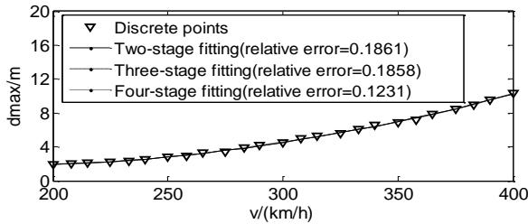  
Fig.4. Comparison results of different fitted curve based on v and $d _ { \mathrm { m a x } }$

Also, aiming at the 25 maximum contact loss intervals under different train speeds described in Table IV, through linear least-squares polynomial method, the fitting curve based on different stages is illustrated in Fig. 4. Obviously, the two-stage fitting polynomial has acceptable squared error, which is shown as

$$
d _ {\max } = 1. 5 3 5 \times 1 0 ^ {- 4} v ^ {2} - 0. 0 5 0 5 v + 5. 8 4 2 \tag {16}
$$

Eq. (16) illustrates the fitted curve of quadratic function by statistic PAC contact loss results of Table IV.

Hence, by combining Eq. (5) and Eq. (16) aforementioned, the arc voltage gradient can be approximately expressed as

$$
u _ {\mathrm {c}} ^ {\prime} = 2. 3 0 2 5 \times 1 0 ^ {- 3} v ^ {2} - 0. 7 5 7 5 v + 8 7. 6 3 \tag {17}
$$

where $u _ { \mathrm { c } } ^ { \prime }$ ，is the extended arc voltage gradient.

Similarly, applying Eq. (7) and Eq. (16), $P _ { 0 }$ can be computed as

$$
P _ {0} = k g ^ {\beta} \left(4. 5 7 1 \times 1 0 ^ {- 6} v ^ {2} + 0. 0 2 3 8 v - 0. 1 4 1 1\right) \tag {18}
$$

Based on Eq. (1)-(4), (17) and Eq. (18), after computing $\tau _ { 1 } ,$ $\tau _ { 2 } ,$ $u _ { \mathrm { c } }$ and $P _ { 0 } ,$ respectively, the extended pantograph arcing model considering train speed can further be derived as

$$
\left\{ \begin{array}{l} \frac {1}{g} = \frac {1}{g _ {\mathrm {m}}} + \frac {1}{g _ {\mathrm {c}}} \\ \frac {d g _ {\mathrm {m}}}{d t} = \frac {1}{\tau_ {0} g ^ {\alpha}} \left[ \frac {i ^ {2}}{k g ^ {\beta} (1 . 5 3 5 \times 1 0 ^ {- 4} v ^ {2} - 0 . 0 5 0 5 v + 5 . 8 4 2)} - g _ {\mathrm {m}} \right] \\ \frac {d g _ {\mathrm {c}}}{d t} = \frac {1}{\tau_ {0} g ^ {\alpha}} \left[ \frac {i ^ {2}}{(2 . 3 0 2 5 \times 1 0 ^ {- 3} v ^ {2} - 0 . 7 5 7 5 v + 8 7 . 6 3) ^ {2} \cdot g _ {C}} - g _ {\mathrm {C}} \right] \end{array} \right. \tag {19}
$$

# IV. ASCERTAINMENT OF ARCING MODEL PARAMETERS

Considering that the characteristics of pantograph arcing is influenced by internal parameters $\beta , k ,$ v and external loads. To analyze the extended arcing impacts on the AC HSR line, it can be further performed to determine the ranges of $\cdot _ { k , \cdot }$ v and $\beta$ combining the equivalent test circuit of HSR line.

# A. Simplified Test Circuit

Fig.5 depicts the simplified circuit for 27.5kV 50Hz China HSR line. As illustrated in Fig.5, the pantograph arcing model is embedded and integrated as a two-terminal nonlinear resistance $( R _ { \mathrm { a r c } } )$ . Single-phase traction substation is expressed by $U _ { \mathrm { s } } , R _ { \mathrm { s } }$ and $L _ { \mathrm { s } } ,$ where $U _ { \mathrm { s } }$ is equivalent power source, $R _ { \mathrm { s } }$ and $L _ { \mathrm { s } }$ are respectively equivalent resistance and equivalent inductance. Then, traction power supply network is equivalent to a π-type equivalent circuit, where $C _ { 1 }$ represents equivalent

grounding capacitance, $R _ { 1 }$ and $L _ { 1 }$ are equivalent resistance and equivalent inductance of PAC, respectively. $R _ { \mathrm { c } }$ and $L _ { \mathrm { c } }$ are equivalent resistance and inductance of train, respectively.

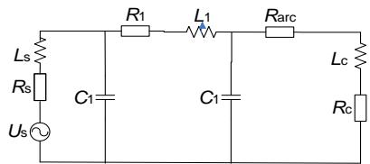  
Fig.5. The simplified equivalent circuit of China HSR line.

# B. Ascertainment of Arc Dissipation Power Factor β

Based on AC volt-ampere characteristic, as arc voltage remains invariant, arc conductance g increases with increased arc current $I _ { \mathrm { a r c } } .$ Then, in Eq. (7), the dissipated power $P _ { 0 }$ is varying in proportional to the arc conductance g when other arc parameters keep relatively unchanged. So, in Eq. (7), the arc dissipation power factor $\beta$ should be set positive, i.e. $\beta { > } 0$ .

In a time period T,

$$
\int_ {0} ^ {T} i ^ {2} r _ {\mathrm {a r c}} d t = T I _ {\mathrm {r m s}} ^ {2} R _ {\mathrm {a r c}} \tag {20}
$$

where $i , r _ { \mathrm { a r c } }$ respectively denote momentary arc current and resistance, $R _ { \mathrm { a r c } } , ~ I _ { \mathrm { r m s } }$ respectively represent equivalent arc resistance and root mean square (RMS) of arc current.

The arc current RMS $I _ { \mathrm { r m s } }$ can be written as

$$
I _ {\mathrm {r m s}} = \sqrt {\frac {1}{T} \int_ {0} ^ {T} i ^ {2} d t} \tag {21}
$$

Combining Eq. (7), the $I _ { \mathrm { r m s } }$ can also be expressed as

$$
I _ {\mathrm {r m s}} = \left(k R _ {\mathrm {a r c}} ^ {- \beta - 1} L _ {\mathrm {a r c}}\right) ^ {\frac {1}{2}} \tag {22}
$$

By applying Eq. (21)-(22), the equivalent arc resistance $R _ { \mathrm { a r c } }$ can be derived as

$$
R _ {\mathrm {a r c}} = \frac {\int_ {0} ^ {T} i ^ {2} r _ {\mathrm {a r c}} d t}{\int_ {0} ^ {T} i ^ {2} d t} = \frac {\int_ {0} ^ {T} i ^ {2} r _ {\mathrm {a r c}} d t}{I _ {\mathrm {r m s}} ^ {2} T} \tag {23}
$$

The equivalent arc resistance $R _ { \mathrm { a r c } }$ [33] can be also given as

$$
R _ {\mathrm {a r c}} = \frac {L _ {\mathrm {a r c}}}{\pi r ^ {2} \sigma} \tag {24}
$$

where r is arc column radius, is arc conductivity, $L _ { \mathrm { a r c } }$ is arc length.

Also, according to Ohm law, the relation [34] between arc conductivity  and arc current RMS $I _ { \mathrm { r m s } }$ is

$$
\sigma = A \sqrt {I _ {\mathrm {r m s}}} \tag {25}
$$

where A is a constant.

Consequently, by using Eq. (22)-(25), the relation between arc current RMS $I _ { \mathrm { r m s } }$ and arc length $L _ { \mathrm { a r c } }$ can be represented as

$$
I _ {r m s} = A L _ {\text {a r c}} ^ {\frac {2 \beta}{\beta - 3}} \tag {26}
$$

It can be found that the arc current RMS $I _ { \mathrm { r m s } }$ is inversely proportional to the arc length $L _ { \mathrm { a r c } }$ as the arc voltage keeps invariant. Therefore, merging with the above β>0, another limit condition for parameter β is also determined, i.e. β<3.

# C. Ascertainment of Arc Pyroelectric Coefficient k

Because catenary grounding capacitance $C _ { 1 }$ is extremely small compared with other circuit parameters in Fig.5, C1 can be ignored in solving power factor cos and it is obtained that

$$
\cos \varphi = \frac {R _ {\mathrm {s}} + R _ {\mathrm {l}} + R _ {\mathrm {c}} + R _ {\mathrm {a r c}}}{\sqrt {\left(R _ {\mathrm {s}} + R _ {\mathrm {l}} + R _ {\mathrm {c}} + R _ {\mathrm {a r c}}\right) ^ {2} + \left(\omega L _ {\mathrm {s}} + \omega L _ {\mathrm {l}} + \omega L _ {\mathrm {c}}\right) ^ {2}}} \tag {27}
$$

According to Eq. (27), the pantograph arcing resistance $R _ { a r c }$ can be expressed as

$$
R _ {\mathrm {a r c}} = \left(\omega L _ {\mathrm {s}} + \omega L _ {1} + \omega L _ {\mathrm {c}}\right) \cot \varphi - \left(R _ {\mathrm {s}} + R _ {1} + R _ {\mathrm {c}}\right) \tag {28}
$$

In addition, the RMS of arc current can also be given by

$$
I _ {\mathrm {r m s}} = \frac {U _ {\mathrm {s r m s}} \sin \varphi}{\omega L _ {\mathrm {s}} + \omega L _ {1} + \omega L _ {\mathrm {c}}} \tag {29}
$$

where $U _ { \mathrm { s r m s , } } I _ { \mathrm { r m s } }$ are the RMSs of arc voltage and arc current, respectively.

After the substitution and computations, by applying Eq. (22), (27)-(29), the arc pyroelectric coefficient k can be expressed as

$$
k = \frac {\left(U _ {\mathrm {s r m s}} \sin \varphi\right) ^ {2} \cdot \left[ \left(\omega L _ {\mathrm {s}} + \omega L _ {1} + \omega L _ {\mathrm {c}}\right) \cot \varphi - \left(R _ {\mathrm {s}} + R _ {1} + R _ {\mathrm {c}}\right) \right] ^ {\beta + 1}}{\left(\omega L _ {\mathrm {s}} + \omega L _ {1} + \omega L _ {\mathrm {c}}\right) ^ {2} \cdot L _ {\mathrm {a r c}}} \tag {30}
$$

So, it can be founded that the mutual relation exists in the arc model parameters $\beta , k , L _ { \mathrm { a r c } }$ as revealed in Eq. (30).

# V. ARC CHARACTERISTIC COMPARISONS CONSIDERING LOADS

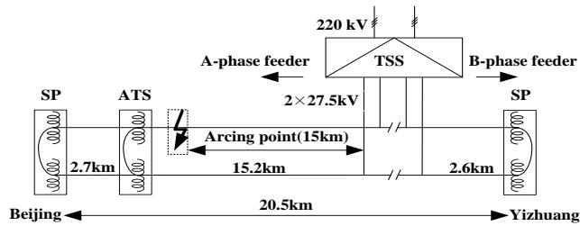  
Fig.6. The 2×27.5kV AT-fed scheme of Beijing-Yizhuang HSR line.

Based on the above Eq. (19), internal arc parameters, β, k and train speed v,are responsible for arc conductance g. Also, external loads can influence pantograph arcing. Here, several arcing comparisons considering actual load by ATP/EMTP are performed to analyze the special effect on the extended model. Fig. 6 illustrates a 50Hz, 2×27.5kV, 20.5km AT-fed railway line aiming at China Beijing-Yizhuang HSR system, which comprises a traction substation (TSS), an auto-transformer substation (ATS), two section posts (SPs), and an AT with an earth-connected central tap feeds two terminals. Transformer installed in the ESS is stepped down to two single-phase 27.5kV supply phases from three-phase power grid 220kV. Assuming that pantograph arcing occurs at A-phase feeder, and the distance between PAC contact loss point and TSS is 15km. Being similar with Fig.6, the power factor cosφ is 0.89, and the other parameters are us=27.5kV rms, Rs=0.177Ω, Ls=31.75mH, $R _ { 1 } { = } 2 . 9 5 \Omega$ , L1=23.5mH, $C _ { 1 } { = } 0 . 0 8 2 \mu F$ , Rc=56.19Ω, Lc=91.6mH, respectively.

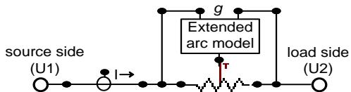  
Fig.7. Representation of the extended arc model in ATP-EMTP.

Fig.7 represents the extended pantograph arcing model in ATP-EMTP, whose code is given in Appendix. The range of extended arc model parameters is adopted by section IV. And

the initial parameters are as follows: $\tau _ { 0 } { = } 1 . 5 { \mu \mathrm { s } } , g _ { 0 } { = } 0 . 8 \mathrm { S }$ , and α=0.17. The arc inception is set to t=0.004s.

# A. Influence Comparisons of Model Parameters $k , \beta$

As shown in Eq. (19), model parameters $\beta$ and k will only partly play an impact on the improved Mayr’s arc conductivity $g _ { \mathbf { M } } .$ Different arc pyroelectric coefficient k $\left( k { = } 5 0 0 \mathrm { { W } } { \cdot } \Omega { \cdot } \mathrm { { c m } } ^ { - 1 } \right)$ , $k { = } 2 0 0 0 \mathrm { W } { \cdot } \Omega { \cdot } \mathrm { c m } ^ { - 1 } , k { = } 2 0 0 0 0 \mathrm { W } { \cdot } \Omega { \cdot } \mathrm { c m } ^ { - 1 } )$ are selected to all measurements regarding arc voltage and arc current in ${ \mathrm { F i g . } }$ ${ 8 ( \mathrm { a ) - ( c ) } }$ when arc dissipation power factor $\beta { = } 0 . 5$ and train speed $\nu { = } 3 0 0 \mathrm { k m / h }$ , simultaneously. In the range of each parameter, the results of arc conductance $g$ are depicted for different arc dissipation power factor $\beta$ in Fig. 8(d)-(f) and different train speed v in Fig. 8 (g)-(i), respectively.

Fig. 8(a)-(c) describes the typical u (t) and i(t) waveforms of few periods. It can be founded that the sudden change in the u(t) and $i ( t )$ curves appears just after the CZCs, which are almost similar with the OHL ICE team [1], [7]. Here, $\Delta t _ { 1 }$ denotes the interval of arc CZC region from negative to positive crossover and $\Delta t _ { 2 }$ indicates the duration of arc CZC region from positive to negative crossover. $u _ { 1 } ( t ) , u _ { 2 } ( t )$ respectively represent the

corresponding reigniting peak voltage and extinguishing peak voltage during CZCs. Obviously, $\Delta t _ { 1 }$ and $\Delta t _ { 2 }$ alternately appear in each time period, and $u _ { 1 } ( t ) , u _ { 2 } ( t )$ vary with $\Delta t _ { 1 } , \Delta t _ { 2 }$ . Besides, due to the comprehensive influence for the Mayr part of extended arc model, with the very inductive test circuit, i.e. the power factor only being 0.89, the overshoots after CZCs are not founded in some cases. Also, it cannot be clearly observed that the DC components exist in $\mathrm { F i g . 8 ( a ) - ( c ) }$ due to the non-obvious difference between $\Delta t _ { 1 }$ and $\Delta t _ { 2 }$ .

When the arc pyroelectric coefficient k and the train speed v keep unchanged, the arc dissipation power factor $\beta$ will play a critical role on the arc conductance $g$ as shown in $\mathrm { F i g . 8 ( d ) \mathrm { - ( f ) } }$ . We notice that, as arc dissipation power factor $\beta$ and train speed v keeping invariant, arc conductance $g$ decreases with increasing arc pyroelectric coefficient k. It can be found that the arc dissipation power factor $\beta$ and the arc pyroelectric coefficient k have converse effect on the arc conductance $g .$ . Compared with the influence of arc pyroelectric coefficient $k ,$ , arc dissipation power factor $\beta$ plays an opposite effect on arc conductance g.

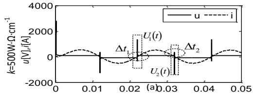

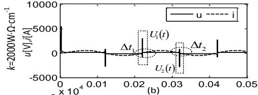

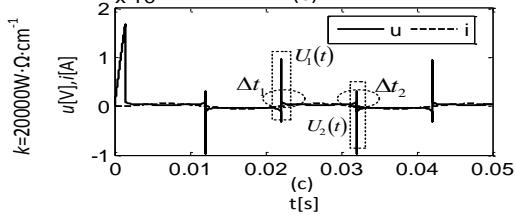

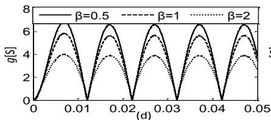

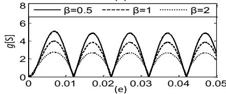

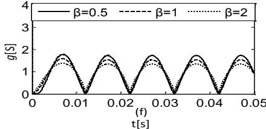

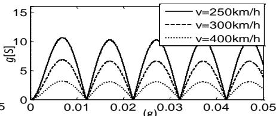

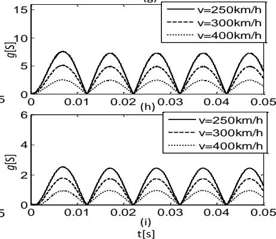  
Fig.8. (a)-(c) Arc voltage and arc current waveforms under different arc pyroelectric coefficient k (v=300km/h, β=0.5,respectively), (d)-(f) results comparison of arc conductance g under train speed v=300km/h (β=0.5, 1, 1.5 and k=500W·Ω·cm-1, 2000W·Ω·cm-1, 20000W·Ω·cm-1 ,respectively), (g)-(i) results comparison of arc conductance g under arc dissipation power factor β=0.5 (k=500W·Ω·cm-1, 2000W·Ω·cm-1, 20000W·Ω·cm-1 and v=250km/h, 300km/h, 400km/h, respectively).

Further, as k and $\beta$ are invariant, under the lower train speed v, the electric contact between pantograph and contact wire becomes more favorable and the corresponding arc conductance $g$ is higher, and vice versa. It is also in line with the simulated results as described in $\mathrm { F i g . 8 ( g ) \mathrm { - ( i ) } }$ .

# B. Influences Comparisons of Train Speed v

It can be noticed that, unlike parameters β and k, train speed v will entirely influence the extended Habedank’s arc conductivity g. Similarly, as illustrated in Fig.9, different train speed v (v=250km/h, v=300km/h, v=400km/h) are applied to all different measurements.

As illustrated in Fig.9(a)-(c), apart from the parameters k and $\beta ,$ the arc voltage and arc current waveforms during CZCs region are distinctly influenced by the train speed v. In these cases, train speed v plays an important role by controlling the

arc length $L _ { \mathrm { a r c } } ,$ i.e. maximum contact loss internal $d _ { \mathrm { m a x } }$ . As train speed v is under relative low-speed, the contact loss gap between pantograph and contact wire is relative lower, the CZCs region in arc current tends to non-obvious, and it maintains the sinusoidal waveform. However, due to the increasing train speed v, it can be founded that the arc voltage u (t) has higher spikes just after the CZCs and larger durations of CZCs regions. Obviously, this is quite consistent with the previous investigation [1], [7].

In Fig.9(d)-(f), as arc pyroelectric coefficient k and dissipation power factor $\beta$ keeping invariant, varying trend of arc conductance $g$ appears an inverse relationship with train speed v. Besides, in Fig. 9(g)-(i), for the same train speed v and unchanged arc pyroelectric coefficient k, the arc conductance g increases with the increased $\beta .$ Meanwhile, the arc conductance $g$ decreases with the increasing train speed v.

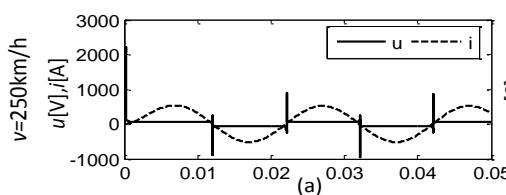

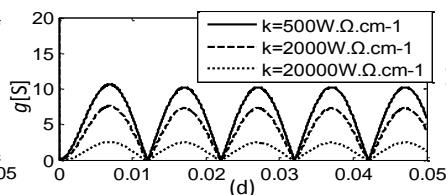

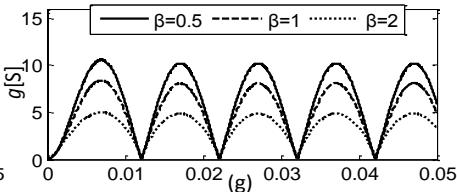

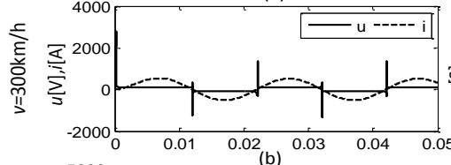

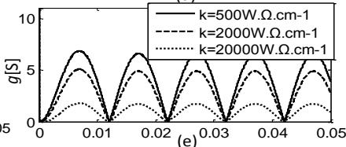

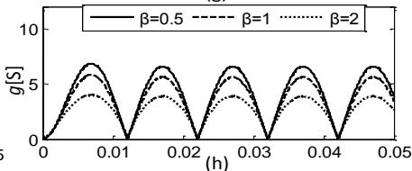

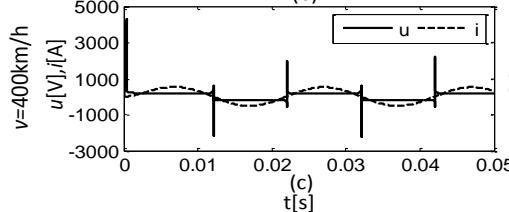

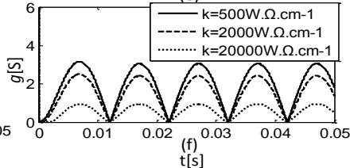

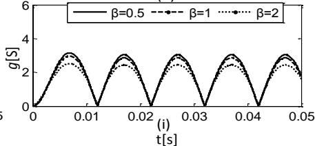  
Fig.9. (a)-(c) Arc voltage and arc current waveforms under different train speed v(k=500W·Ω·cm-1, β=0.5), (d)-(f) results comparison of arc conductance g under dissipation power factor β=0.5(v=250km/h, 300km/h, 400km/h and k=500W·Ω·cm-1, k=2000W·Ω·cm-1, k=20000W·Ω·cm-1,respectively), (g)-(i) results comparison of arc conductance g under arc pyroelectric coefficient k=500W·Ω·cm-1 (dissipation power factor β=0.5, 1, 2 and v=250km/h, 300km/h, 400km/h, respectively).

# VI. CONCLUSIONS

This paper presents the attempt on the extension of Habedank’s equation-based model for pantograph arcing by means of the EMTP software package, and corresponding code is given in the Appendix. The arc model not only combines the original Cassie and Mayr models, but also incorporates important modifications that can reveal the pantograph arcing under varying train speeds, and mirror the PAC interaction characteristics.

First, pantograph arc behaviors are investigated crossing zero-current waveforms and high-current curves, so that suitable extension can be implemented correspondingly by improving Habedank’s black-box arc equations.

Next, a common PAC model is established and verified to acquire contact loss law by applying aerodynamic effect on pantograph and adding irregularity on contact wire. And the fitting polynomial indicates the relation between maximum contact loss interval and train speed.

Finally, electrical characteristics of pantograph arcing are compared under improved arc model parameters. The analysis results show that the extended arc model is able to reveal the behaviors of pantograph arcing under different train speeds, and has capability to depict uncertain PAC contact loss.

Further investigation on actual PAC interaction systems is necessary to provide chance for studying the possible arcing process in terms of different traction current, electric contact material, normal train speed, train power factor, and PAC system at different vibration conditions. This will help to analyze the internal physical characteristics of arc model and evaluate the external impact of pantograph arcing in depth.

# APPENDIX

The full EMTP models code of the extended Habedank’s equation-based model considering PAC interactions and train speeds is given below.

# MODEL pantograph arcing

INPUT U1,U2

OUTPUT RB

DATA GO {DFLT: 0.8}

TAUO {DFLT: 1.5e-6}

k {DFLT:2500000}

β {DFLT:0.5}

v {DFLT:300}

VAR I,RB,G1,G1b,G2,G2b,RB1,RB2,P0,TAU1,TAU2

INIT

RB: =1/GO

G1: =2*GO

G2: =2*GO

ENDINIT

EXEC

I: = (U1-U2)/RB

IF (ABS (I)>1.E-12) THEN

P0:=k*((1/RB)**β)*(1.535*0.0001*(v**2)-0.0505*v+5.842)

TAU1: =TAUO*((1/RB) **0.17)

G1b: = ((I**2.)/ (P0)-G1)*(1.-1./ EXP (1.-timestep/TAU1))

TAU2: =TAUO*((1/RB) **0.17)

G2b: = ((I**2.)/ (G2*((2.3025*0.001*(v**2) -0.7575*v

+87.63) **2))-G2)*(1.-1./ EXP(1.-timestep/TAU2))

RB1:=1. / ABS (G1+G1b)

RB2:=1. / ABS (G2+G2b)

G1:=1. /RB1

G2:=1. /RB2

RB: =ABS (RB1+RB2)

ENDIF

ENDEXEC

ENDMODEL

# REFERENCES

[1] S. Midya, D. Bormann, T. Schutte, and R. Thottappillil, “DC component from pantograph arcing in AC traction system-influencing parameters,impact, and mitigation techniques,” IEEE Trans. on Power Del., vol. 53, no. 1, pp. 18-27, Feb. 2011.   
[2] Z. Y. He, H. T. Hu, J. F. Zhang, and S. B. Gao, “Harmonic resonance assessment to traction power supply system considering train Model in China high-speed railway,” IEEE Trans. on Power Del., vol. 29, no. 4, pp. 1735 - 1742, Aug. 2014.   
[3] Y. Wang, Z. G. Liu, F. Q. Fan, and S. B. Gao, “Review of research development of pantograph-catenary arc model and electrical characteristics,” Journal of the China Railway Society, vol. 35, no. 8, pp. 35 - 43, 2013.

[4] S. Midya, and R. Thottappillil, “An overview of electromagnetic compatibility challenges in european rail traffic management system,” Transportation Research Part C, vol. 16, no. 5, pp. 515-534, Oct. 2008.   
[5] B. Tellini, M. Macucci, R. Giannetti, and G. A. Antonacci, “Conducted and radiated interference measurements in the line-pantograph system,” IEEE Trans. Instrum. Meas., vol. 50, no. 6, pp. 1661–1664, Dec. 2001.   
[6] L. Buhrkall, “DC components due to ice on the overhead contact wire of ac electrified railways,” Electrische Bahnen, vol. 103, no. 8, pp. 380 - 389, Aug. 2005.   
[7] S. Midya, D. Bormann, T. Schutte, and R. Thottappillil, “Pantograph arcing in electrified railways-mechanism and influence of various parameters-part II: with AC traction power supply,” IEEE Trans. on Power Del., vol. 24, no. 4, pp. 1940 - 1950, Oct. 2009.   
[8] C.B. Rawlins, K. O. Papiliou, and G. Diana, “On the measurement of overhead transmission lines conductor self-damping,” IEEE Trans. on Power Del., vol. 15, no. 4, pp. 1329-1331, Feb. 2000.   
[9] B. Tellini, M. Macucci, R. Giannetti, and G. A. Antonacci, “Line-pantograph EMI in railway systems,” IEEE Instrumentation and Measurement Magazine, vol. 20, no. 2, pp. 772 - 779, Dec. 2001.   
[10] M. Lan, A. Marvin, E. Karadimou, R. Armstrong, and Y. H. Wen, “An experimental programme to determine the feasibility of using a reverberation chamber to measure the total power radiated by an arcing pantograph,” Electromagnetic Compatibility, Gothenburg, pp. 269-273, Sep. 2014.   
[11] T. Hiroshi, “Development of a new pantograph contact strip for ultrahigh-speed operations,” Railway Technology Avalanche, vol. 8, no. 1, pp. 83-85, 2006.   
[12] W. G. Wang, G. N. Wu, G. Q. Gao, B. Wang, Y. Cui, and D. L. Liu, “The pantograph-catenary arc test system for high-speed railways,” Journal of the China Railway Society, vol. 34, no. 4, pp. 22 - 27, Oct. 2012.   
[13] O. Mayr, “Contribution to the theory of static and dynamic arcs,” Arch. Elec, vol. 37, no. 1, pp. 589 - 608, 1943.   
[14] U. Habedank, “On the mathematical-description of arc behavior in the vicinity of current zero,” Etz. Archiv, vol. 10, no. 11, pp. 339 - 343, 1988.   
[15] V. Rashtchi, A. Lotfi, and A. Mousavi, “Identification of KEMA arc model parameters in high voltage circuit breaker by using of genetic algorithm,” 2nd IEEE International Conference on Power and Energy, Malaysia, pp. 1515 – 1517, Dec., 2008,   
[16] M. M. Walter, and C. M. Franck, “Improved method for direct black-box arc parameter determination and model validation,” IET Science, Measurement & Technology, vol. 148, no. 6, pp. 273 - 279, Nov. 2001.   
[17] M. T, Cassie, and D. B. Fang, “An Improved arc model before current zero based on the combined Mayr and Cassie arc models,” IEEE Trans. on Power Del., vol. 20, no. 1, pp. 138 - 142, July. 2005.   
[18] C. S. Kalra, A. F. Gutsol, and A. A. Fridman, “Gliding arc discharges as a source of intermediate plasma for methane partial oxidation,” IEEE Trans. on Plasma Science, vol. 33, no. 1 pp. 32 - 41, Feb. 2005.   
[19] C. F. Ocoleanu, G. Manolea, and G. Cividjian, “Numerical study of thermal field of pantograph contact strip-contact line wire assembly,” Advances in Energy Planning, Environmental Education and Sources, vol. 38, no. 4, pp. 139 - 143, 2010..   
[20] L. Mei, M. Y. Wu, Y. F. Wu, Y. F. Liu, and H. Yang, “MHD modeling of fault arc in a closed container,” IEEE Trans. on Plasma Science,, vol. 42, no. 10, pp. 2714 - 2715, Oct. 2014.   
[21] V. Terzija, G. Preston, M. Popov, and N. Terzija, “New static air-arc EMTP model of long arc in free air,” IEEE Trans. on Power Del., vol. 26, no. 3, pp. 1344 - 1353, July. 2011.   
[22] Y. J. Liu, G. W. Chang, and H. M. Huang, “Mayr’s equation-based model for pantograph arc of high-speed railway traction system,” IEEE Trans. on Power Del., vol. 25, no. 3, pp. 2025 - 2027, July. 2010.   
[23] S. Hutter, I. Uglesic, “Universal arc resistance model ‘zagreb’ for EMTP,” In Proceedings of the CIRED International Conference on Electricity Distribution, Vienna, Austria, May. 2007.   
[24] B. Swierczynski, J. J. Gonzalez, P. Teulet, P. Freton, and A. Gleizes, “Advances in low-voltage circuit breaker modelling,” Journal of Physics D: Applied Physics, vol. 37, no. 4, pp. 587 - 595, Jan. 2004.   
[25] Z. Z. Chen, “The analyse on the course of electric motive passing through phase separation,” Graduate Thesis of Southwest Jiaotong University, pp. 45-46, Apr. 2007.   
[26] M. Kapetanovic, “Analysis of cooling power and network interaction of a switching-arc in an SF6 high-voltage circuit-breaker,” The Colloquium of CIGRE SC 13, Sarajevo, Yugoslavia, May. 1989.

[27] Railway Applications—Current Collection Systems—Validation of Simulation of the Dynamic Interaction between Pantograph and Overhead Contact Line, European Standard EN 50318, Jul. 2002.   
[28] O. C. Zienkiewicz, and R. L. Taylor, “The Finite Element Method. Woburn, MA: Butterwort-Heinemann, 2000.   
[29] H. K. ShahinKia, B. Fablo, and M. M. Aubustin, “Pantographs-catenary interaction model comparison,” The Annual Conference of IEEE Industrial Electronics, Glendale, USA, Nov. 2010.   
[30] N. M. Newmark, “A method of computation for structural dynamics,” J. Eng. Mech., vol. 85, pp. 67-94, Jul. 1959.   
[31] Siemens, “Report on dynamic performance of pantograph/overhead contact line interaction--TPS/OCS portion,” Traction Power Supply and Distribution, pp. 12-13, Jul. 2006.   
[32] S.R. Anghel, C. Miklos, J. Averseng, and G.O. Tirian, “Control system for catenary-pantograph dynamic interaction force,” International Joint Conference on Computational Cybernetics and Technical Informatics, Timisoara, Romania, pp. 181-186, May. 2010.   
[33] B. Lionel, “Contact resistance calculations: generalizations of greenwood’s formula including interface films,” IEEE Trans. on Components and Packaging Technologies, vol. 24, no. 1, pp. 50-58, Mar. 2001.   
[34] C. Sandhya, and B. Shankaranarayanamoorthy, and V. Subramanian, “A mathematical approach to evaluate arc immobility time in low voltage circuit breakers,” 27th International Conference on Electric contacts, Dresden, Germany, pp. 313-318, June. 2014.

Ying Wang(S’15) received the B.S. and M.S. degrees in electrical engineering from Chongqing University, Chongqing, China, in 2000 and 2011, respectively. He is currently working toward the Ph.D. degree in electrical engineering from Southwest Jiaotong University, Chengdu, China. His research interests include electric contact of pantograph-catenary and power quality of electric traction system.

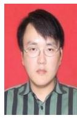

Zhigang Liu (M’06) received the Ph.D. degree in power system and its automation from the Southwest Jiaotong University, Sichuan, China, in 2003. He is currently a Full Professor with the School of Electrical Engineering, Southwest Jiaotong University. His current research interests include signal processing and its applications in power systems, pantograph-catenary dynamic performance and arcing theory.

Xiuqing Mu received the B.S. and M.S. degrees in electrical engineering from Xihua University, Chengdu, China, in 2008 and 2011, respectively. He is currently working toward the Ph.D. degree in electrical engineering from Southwest Jiaotong University, Chengdu, China. Her research interests include reliability analysis on the traction power supply system, and arc discharge technology.

Ke Huang received the B.S. degree in electrical engineering from Southwest Jiaotong University, Chengdu, China, in 2013. He is currently pursuing the Ph.D. degree in electrical engineering from Southwest Jiaotong University, Chengdu, China. His research interests include reliability analysis on the electric contact, and locomotive over-voltage and grounding technology.

Hongrui Wang (S’15) received the B.S. degree in Electrical Engineering and Automation from the “Mao Yisheng Class” in Southwest Jiaotong University, Chengdu, China, in 2012, where he is currently pursuing the Ph.D. degree with the School of Electrical Engineering. His current research interests include pantograph-catenary dynamics, signal filtering and their applications in electrified railway industry.

Shibin Gao received the B.Sc., M.Sc., and Ph.D. degrees in electrical engineering from Southwest Jiaotong University, Chengdu, China, in 1985, 1988, and 2004, respectively. He is currently a Professor and Ph.D. supervisor in the School of Electrical Engineering, Southwest Jiaotong University, Chengdu, China. His research interests include electric contact of pantograph-catenary, testing and monitoring of electrified vehicles,and relay protection and control.