# Wideband model based on constant transformation matrix and rational Krylov fitting

Emmanuel Francois a , Ilhan Kocar b, Jean Mahseredjian a

a Department of Electrical Engineering, Polytechnique Montreal, Montreal, H3T 1J4, QC Canada   
b Department of Electrical Engineering, The Hong Kong Polytechnic University, Hong Kong SAR

# A R T I C L E I N F O

Keywords:

Electromagnetic transients

Line constants

Cable constants

Rational Krylov approximation

Universal line model (ULM)

Wideband model (WB)

# A B S T R A C T

This paper analyzes the use of fitting techniques based on partial fraction expansions in the fitting of modal transmission line functions and the assumption of constant and real transformation matrix (constant T) in the transformation of modal functions into phase domain. The focus is on the fitting of the propagation function due to its complexity compared to the characteristic admittance function. It is demonstrated for the first time that using a constant T can intrinsically violate the passivity of the transmission line system depending on the choice of frequency point for assigning the constant T. Consequently, the final rational model violates passivity at certain frequency intervals. Second contribution is the evaluation of the fitting performance with a new solution strategy based on the recently introduced rational Krylov fitting (RKF). The case studies suggest that RKF results in accurate and less order models compared to the vector fitting (VF) algorithm which is the de facto method in electromagnetic transient-type models. Finally, the fitting accuracy of the legacy constant T model based on Bode fitting is presented in the phase frame giving a clear picture of its poor fitting performance compared to modern methods and explaining its inaccuracies in the time domain.

# 1. Introduction

The wideband (WB) line model in this paper refers to the implementation of the Universal Line Model (ULM) [1] and Frequency Dependent Cable Model (FDCM) [2]. These models identify frequency dependent transmission line functions, i.e., propagation H and characteristic admittance $\mathbf { Y } _ { c }$ functions, in the phase domain using a common format of rational functions in the complex domain. Although the final model is in the phase domain, the internal steps in the parametric identification of the models include some computations in the modal domain which basically refers to the eigenvalues of H and $\mathbf { Y } _ { \mathbf { c } } .$ For the implementation of the WB model in the time domain, the rational approximations of line functions are converted into discrete state space forms using the exact solution assuming that the input is piecewise linear [3]. Two step interpolation [4] to minimize the magnification of integration errors [5] is applied and the option of DC correction is available to help improving the accuracy and numerical stability of the model in some cases [6]. The original implementation of the ULM model used trapezoidal method for the discretization of state space forms [1]. This is still the case for legendary line models [8].

This paper integrates the option of using a constant transformation matrix (constant T) in the fitting of line functions, particularly H, into the WB model. Once the eigenvalues of line functions are computed and fitted to rational functions, they are simply transformed into the phase domain using a real and constant transformation matrix. This approach is like the approach used in the legendary frequency dependent (FD) line model $[ 7 , 8 ]$ but differs in three ways from the perspective of implementation: 1) The fitting techniques employed perform fitting in the complex domain using partial fraction expansions (PFEs). 2) The time domain implementation uses the numerically robust time domain solver of the WB model. 3) It is possible to fit ${ \bf Y _ { c } }$ directly in the phase domain and investigate whether this has an impact on the accuracy of transient waveforms.

The main advantage of the constant T wideband model (CTWB) is that it can handle transmission lines with large number of conductors since the propagation modes are decoupled. It is important to note that the time domain code of the WB model can also be adjusted to perform discrete computations in the modal domain and apply the real transformation matrix afterwards to find the phase domain voltages and currents very efficiently, i.e., with a smaller number of recursive con-

volutions. This is numerically equivalent to apply constant T in the frequency domain and perform time domain convolutions in the phase domain. On the other hand, this paper is an investigative paper in the use of different fitting techniques and integration methods when the constant T option is adopted. The presented implementation is a quick method for these purposes allowing also understanding the impact of using constant T in the fitting of ${ \bf Y _ { c } }$ .

An important finding disclosed in this paper is the observation that applying a constant T can change H in the phase domain in such a way that the intrinsic passivity of the system can be lost at certain frequency intervals. That is, the nodal admittance matrix of a line generated using H and $\mathbf { Y _ { c } c a n }$ have negative eigenvalues at certain frequency samples. This, on the other hand, depends on the frequency sample used to assign the constant T. In other words, not all the constant T choices will result in passivity violations.

This paper investigates the precision of the classical FD model which employs Bode fitting to fit the eigenvalues of H and characteristic impedance $\mathbf { Z } _ { c }$ . Bode fitting results in large number of zeros and poles compared to recent fitting techniques such as Vector Fitting (VF) [9], the de facto fitting algorithm used in recent line, transformer, and network equivalent models developed for electromagnetic transient (EMT) studies.

The use of VF in FD model is proposed in [10], but the focus is on numerical implementation and it is overlooked that VF can create a model with passivity violations since the reconstructed H and ${ \bf Y _ { c } }$ with a constant transformation matrix may no longer correspond to a passive system. In VF, residues and poles are fitted simultaneously in the phase domain without any constraint on the location of zeros of the eventual partial fraction expansion (PFE).

Another contribution of the paper is the use of recently proposed Rational Krylov Fitting (RKF) [11–15] in constant T models for the first time. VF is a robust and computationally straightforward to apply technique. The implementation of RKF is more complex but results in remarkably less poles according to the test cases presented in this work. The improvement is more noticeable compared to the ULM [16] and FDCM [17] applications of RKF. We also demonstrate a case where the classic FD presents inaccuracies whereas the CTWB doesn’t. The fitting performance of the classic FD is also shown in the phase domain to make rigorous and fair comparisons with the WB model and to clearly demonstrate the main source of the possible inaccuracies of FD.

# 2. Presentation of the CTWB

In this section, the adjustment of the WB model’s frequency domain fitting procedure to enable the option of constant T in the fitting of H is shown through basic line equations. The focus is on H because of the fitting complexity due to the existence of several modes with different time delay constants in a multiconductor system.

For ${ \bf Y _ { c } }$ the fitting is performed in the phase domain with a common set of poles for all entries. Constant-T option is only applied to see its impact on the precision of transient waveforms. The final form of $\mathbf { Y } _ { c }$ as a function of the complex angular frequency s is given as follows

$$
\mathbf {Y} _ {\mathrm {c}} \cong \mathbf {R} _ {0} + \sum_ {i = 1} ^ {M} \frac {1}{s - q _ {i}} \mathbf {R} _ {i} \tag {1}
$$

where $\mathbf { R } _ { 0 }$ is a constant matrix corresponding to ${ \bf Y _ { c } }$ when $s {  } \infty .$ , M is the fitting order, q represents the $i ^ { t h }$ pole and $\mathbf { R } _ { i }$ is the corresponding matrix of residues.

# 2.1. CTWB model

Fig. 1 illustrates a transmission line of length L with N parallel conductors. ${ \bf I } _ { 0 } = { \bf I } _ { 0 r } - { \bf I } _ { 0 i }$ and $\mathbf { I } _ { L } = \mathbf { I } _ { L r } - \mathbf { I } _ { L i }$ are the vectors of injected currents, ${ \bf V } _ { 0 }$ and $\mathbf { V } _ { L }$ are node voltages at line ends $x = 0$ and $x = \mathrm { L } .$ . Subscripts i and r stand for incident and reflected, respectively. The

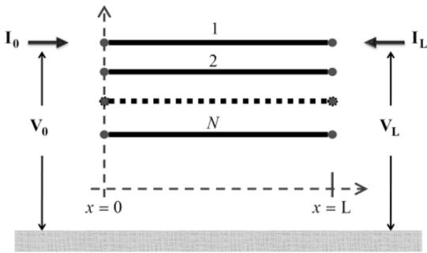  
Fig. 1. Multi-conductor line segment of length L.

fundamental equations of current and voltage phasors at each end of the transmission line can be related as follows:

$$
\mathbf {I} _ {0} - \mathbf {Y} _ {\mathrm {c}} \mathbf {V} _ {0} = - \mathbf {H} \left(\mathbf {I} _ {L} + \mathbf {Y} _ {\mathrm {c}} \mathbf {V} _ {L}\right) \tag {2}
$$

$$
\mathbf {I} _ {L} - \mathbf {Y} _ {\mathrm {c}} \mathbf {V} _ {L} = - \mathbf {H} \left(\mathbf {I} _ {0} + \mathbf {Y} _ {\mathrm {c}} \mathbf {V} _ {0}\right) \tag {3}
$$

The characteristic admittance matrix Yc is given by:

$$
\mathbf {Y} _ {\mathrm {c}} = \boldsymbol {\Gamma} \mathbf {Z} ^ {- 1} \tag {4}
$$

with $\Gamma = \sqrt { \mathbf { Y } \mathbf { Z } }$ and $\mathbf { Y } , \mathbf { Z }$ are $N \times N$ coupled matrices per unit length representing frequency dependent shunt admittance and series impedance matrices respectively.

The propagation matrix H is given by:

$$
\mathbf {H} = \mathrm {e} ^ {- \Gamma L} \tag {5}
$$

Note that (2) and (3) are in the frequency domain, and the time domain version results in computationally intensive convolutions. On the other hand, if they are represented with rational forms, efficient discrete state space forms can be obtained in the time domain.

The first step in the identification of H is to apply modal decomposition:

$$
\mathbf {H} = \mathbf {T H} _ {\mathrm {m}} \mathbf {T} ^ {- 1} \tag {6}
$$

where T is a frequency dependent matrix of eigenvectors of the YZ product and $\mathbf { H _ { m } }$ is the modal propagation function consisting of eigenvalues of H. It is a diagonal matrix expressed in the following form

$$
\mathbf {H} _ {\mathbf {m}} = \operatorname {d i a g} \left[ e ^ {\lambda_ {1}}, e ^ {\lambda_ {2}}, \dots , e ^ {\lambda_ {N}} \right] \tag {7}
$$

where $\lambda _ { i }$ are the eigenvalues of $- \sqrt { \mathbf { Y } \mathbf { Z } } L$ and $H _ { i } = e ^ { \lambda _ { i } }$ are the eigenvalues of H also called modal propagation functions or modes. Then each mode is fitted with RKF or VF and expressed in the following form:

$$
\widehat {H} _ {i} = \sum_ {k = 1} ^ {M _ {i}} \frac {r _ {k}}{s - p _ {i , k}} e ^ {(- s \tau_ {i})} \cong H _ {i} \tag {8}
$$

where M is the number of poles of the rational function for the i–th mode, τi is the time delay tweaked to reduce error [2] and $p _ { i , k }$ is k–th pole of the i–th mode with $r _ { k }$ being its residue.

The next step is to determine a constant $\mathbf { \eta } ^ { \ast } \left( \mathbf { T } _ { c o n s t } \right)$ in order to map the fitted modal propagation matrix back in the phase domain using the following expression

$$
\mathbf {H} _ {\text {f i t}} = \mathbf {T} _ {\text {c o n s t}} \mathbf {H} _ {\text {m o d e f i t}} \mathbf {T} _ {\text {c o n s t}} ^ {- 1} \tag {9}
$$

where

$$
\mathbf {H} _ {\text {m o d e f i t}} = \operatorname {d i a g} \left[ \widehat {H} _ {1}, \widehat {H} _ {2},..., \widehat {H} _ {N} \right] \tag {10}
$$

The real constant transformation matrix $\mathbf { T } _ { c o n s t }$ is chosen to be the real part of the matrix $\mathbf { T } _ { i }$ among all the frequency dependent transformation matrices $\mathbf { T } _ { i } , \ i = 1 , . . . , N _ { \omega } \ \mathrm { w i t h } \ i \in \{ 1 , 2 , . . . N _ { \omega } \}$ and $N _ { \omega }$ being the number of frequency samples used in the modal decomposition of H. The index i

can be manually set or chosen to give the smallest error of the expression

$$
e = \left\| \mathbf {H} - \mathbf {T} _ {\text {c o n s t}} \mathbf {H} _ {\text {m o d e f i t}} \mathbf {T} _ {\text {c o n s t}} \right\| _ {2} \tag {11}
$$

Considering the application of the line model in switching transients, EMT users typically pick $\mathbf { T } _ { c o n s t }$ at around 1000 Hz. This is the default value in this paper unless otherwise stated. Note that T is rotated to minimize the imaginary part.

# 2.2. FD model review

As mentioned, the classical FD line model employs Bode fitting to fit H and Z in the modal domain. The magnitude of the eigenvalues is fitted using real zeros and poles on the left hand side of the complex plane. The phase of the final fit is expected to match the fitted function assuming that it is a minimum phase shift function (MPS), and the phasemagnitude characteristics depends on the magnitude characteristics and vice versa. In other words, one can reconstruct the phase of an MPS function by just knowing its magnitude characteristics and vice versa.

In the case of an H mode, an exponential time delay term e(− sτ) should also be considered in the model to account for the excessive phase shift/ lag of the mode. When the exponential delay term is used to compensate the phase shift of the mode, the remaining part is considered to be an MPS function. Note that, the exponential delay term does not change the magnitude characteristics. Therefore, in the FD model, the time delay is attributed after the Bode fitting is completed in such a manner that the phase mismatch between the mode being fitted and the final fit is minimized.

The default frequency used to assign the constant T for the FD model is 1000 Hz. Given that the resulting rational forms are MPS functions, the line model will be passive independent of the choice of the constant transformation matrix, i.e., even if the input system approximated with a constant T is not passive. FD model has been limited to lines due to reported inaccuracies in modeling cables. This has been attributed to constant T approximation. The paper therefore focuses on lines.

# 3. Fitting accuracy and time domain simulation

This section presents four different cases to investigate the fitting performance of CTWB. The reference solution is the full phase frame WB model. The RMS errors in the fitting of H are also presented.

# 3.1. Case 1: 450 km long 3-phase overhead line

This case corresponds to a 230 kV 60 Hz overhead line. The geometrical configuration and corresponding data are presented in Fig. 2 and Table 1 . The line is not transposed. Each phase consists of a

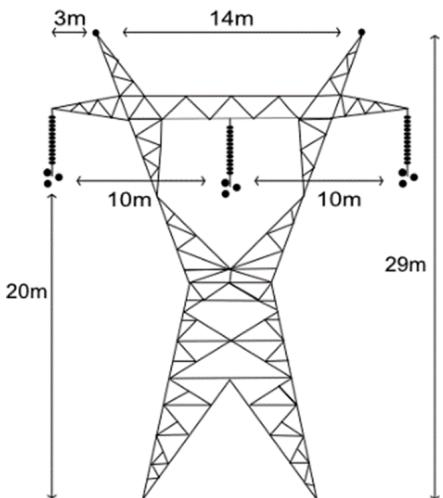  
Fig. 2. Case-1: 230 kV three-phase transmission line system.

Table 1 Case-1, conductor data.   

<table><tr><td colspan="2">Conductor Data</td></tr><tr><td>Ground wire radius</td><td>4.75 mm</td></tr><tr><td>Ground wire DC resistance</td><td>3.75 Ohm/km</td></tr><tr><td>Bundle radius</td><td>230.09 mm</td></tr><tr><td>Angle (deg)</td><td>0°</td></tr><tr><td>Conductor radius</td><td>15.29 mm</td></tr><tr><td>Conductor DC resistance</td><td>0.0701 Ohm/km</td></tr></table>

three-conductor bundle.

This case is a preliminary case used to demonstrate the fitting precisions and order of CTWB obtained with VF and RKF. A time domain switching study is also demonstrated to show the precision in generating voltage waveforms.

In Table 2, the model order of H is the sum of the order of the fit for each mode for CTWB obtained with VF or RKF. The results show that, RKFIT provides a model with a smaller number of poles. The WB results are provided for reference. Note that, in the WB model, all the poles contribute to each entry in the phase domain, therefore a high precision fit is obtained while the total number of poles used is less. However, due to the phase domain computations, the number of residues in the time domain will be many times higher. Assume that we perform computations in the time domain using modal quantities for the CTWB. In that case, the total number of residues or states in the time domain will be equal to the number of poles, i.e., the sum of the number of poles used for each mode. In case of CTWB with VF, this will be 29 residues. In the wideband model, there will be 12 residues for each entry of H, and a total of 108 given that H is a 3 by 3 matrix. For CTWB, a maximum absolute error of 0.01 is used as criterion to stop in the fitting of each mode. For WB, the criterion is applied in the phase domain. Therefore, the max error in the fitting for WB as given in Table 2 is less than 0.01.

The transient simulation scenario consists of applying a three-phase balanced source at 2 ms for phase-a, 6 ms for phase-b and 12 ms for phase-c. The simulation time is set to 200 ms. Since this is a very long line, the propagation delay is large (1.5 ms) and we can take a large time step such as 150 µs. However, a 50 µs time step is selected to increase the resolution of waveforms shown for phase-a in Fig. 3. All three models provide similar waveforms. Time domain simulations are performed in EMTP [18].

# 3.2. Case 2: 39.1 km long 3-phase overhead line

The second case is a shorter line taken from the IEEE-118 case [19]. Therefore, we can expect faster transient dynamics. This line is part of the 138 kV voltage level and is located between BUS 1 and BUS 2 in the IEEE-118 case. Its geometry and corresponding data are presented in Fig. 4 and Table 3 As in study case 1, this line has a horizontal configuration; however, it only has one wire per phase.

The fitting is performed considering a frequency band from 0.01 Hz to 100 MHz, using 10 points per decade, and a tolerance of 1%. The results are shown in Table 4. CTWB with RKF results in less order again. The classical FD model with Bode fitting [7] results in significantly large number of poles with a poor error performance.

Fig. 5(a) present the diagonal elements of H reconstructed in the phase domain using fitted modes and constant transformation matrices employed in the constant T models. In this case, H is a 3 × 3 matrix. Note

Table 2 Case-1, fittings results.   

<table><tr><td></td><td>CTWB VF</td><td>CTWB RKF</td><td>WB</td></tr><tr><td>Hmodel order</td><td>21 (modal sum)</td><td>25 (modal sum)</td><td>20 (per entry)</td></tr><tr><td>Number of residues</td><td>21</td><td>16</td><td>20 × 3 × 3 = 120</td></tr><tr><td>H rms error</td><td>4.91 × 10-4</td><td>5.93 × 10-4</td><td>2.49 × 10-4</td></tr><tr><td>H max error</td><td>0.0131</td><td>0.0134</td><td>0.0045</td></tr></table>

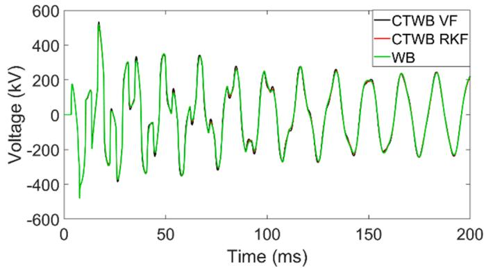  
Fig. 3. Case-1, line end voltage of phase-a.

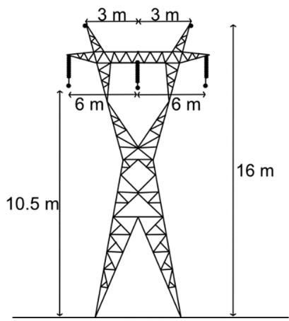  
Fig. 4. Case-2, 138 kV three-phase transmission line system.

Table 3 Case-2, conductor data.   

<table><tr><td colspan="2">Conductor data</td></tr><tr><td>Ground wire radius</td><td>14 mm</td></tr><tr><td>Ground wire DC resistance</td><td>0.71 Ohm/km</td></tr><tr><td>Conductor radius</td><td>23.92 mm</td></tr><tr><td>Conductor DC resistance</td><td>0.0574 Ohm/km</td></tr></table>

Table 4 Case-2, fittings results.   

<table><tr><td></td><td>CTWB VF</td><td>CTWB RKF</td><td>FD Bode</td></tr><tr><td>Hmodel order</td><td>19</td><td>13</td><td>82</td></tr><tr><td>H rms error</td><td>\( 9.07 \times 10^{-4} \)</td><td>0.001</td><td>0.14</td></tr></table>

that two diagonal elements overlap which explains why we only observe two different curves. CTWB with VF and RKF show good precision while we can observe deviations in the FD model particularly in the interval from ${ 1 0 } ^ { 5 }$ to $1 0 ^ { 7 }$ Hz. Fig. 5(b) present the fitting performance for nondiagonal elements.

In order to assess the passivity, H is reconstructed from its modes using a constant T. The passivity is assessed by looking at the eigenvalues of the Hermitian of the nodal admittance $\mathbf { Y } _ { n \mathbf { H } } = 0 . 5 ( \mathbf { Y } _ { n } + \mathbf { Y } _ { n } ^ { \mathbf { H } } )$ ) with ${ \bf Y } _ { n }$ being the nodal admittance matrix and $\mathbf { Y } _ { n } ^ { \mathbf { H } }$ its conjugate transpose. ${ \bf Y } _ { n }$ is calculated using the reconstructed H and $\mathbf { Y } _ { \mathbf { c } } .$ The eigenvalues of its Hermitian should be all positive at any arbitrary frequency sample in order for the line model to be passive.

Fig. 6 shows passivity violations for the eigenvalue in blue color. This is a minor passivity violation reaching down to minus $5 . 8 9 \times 1 0 ^ { - 7 }$ but

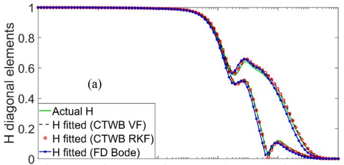

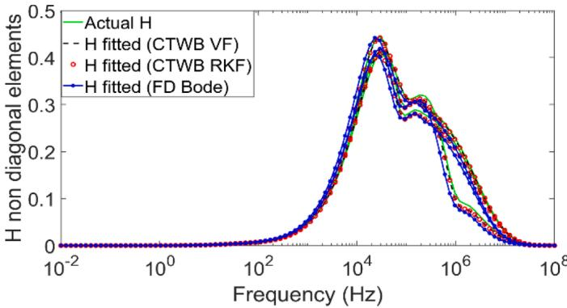  
Fig. 5. Case-2, comparison between the actual and fitted H.

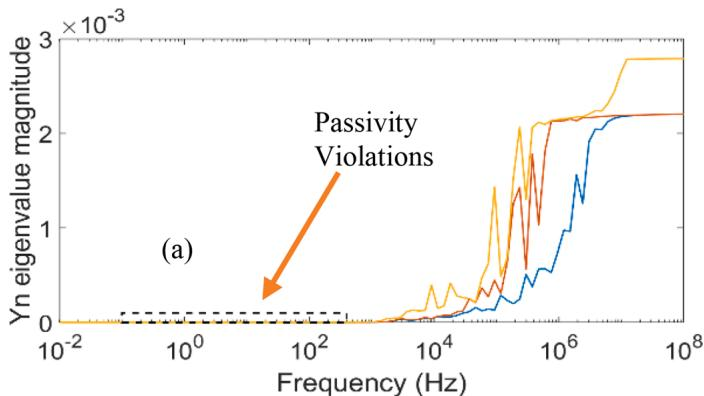

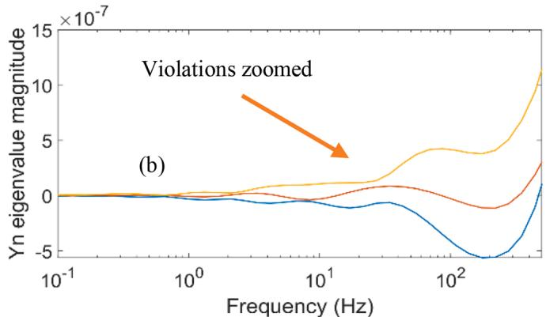  
Fig. 6. Eigenvalues of the nodal admittance matrix.

shows that the constant T induces a non-passive system. When $, \mathbf { Y } _ { n }$ is calculated using the reconstructed H from the fitted modes obtained with CTWB with VF and RKF, similar passivity violations are observed. FD model does not have passivity violations, Note that, the constant T is evaluated using the minimum distance equation in (11).

A similar transient scenario to case 1 is used in this case as well. The line is excited with a balanced source of 138 kV at 60 Hz. Fig. 7 presents

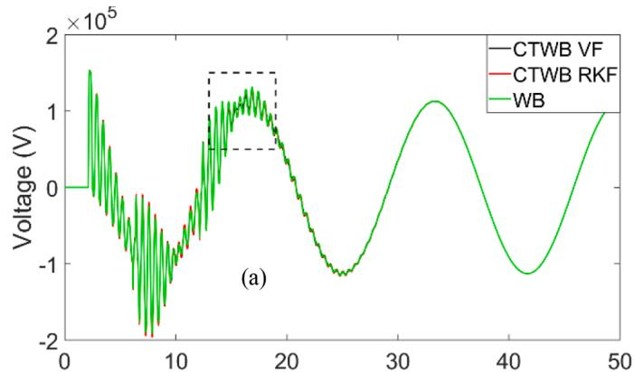

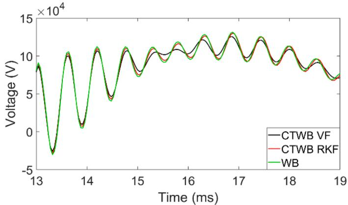  
Fig. 7. Case-2, line end voltage of phase-a.

the time domain simulation waveforms. The smallest time delay of the line is 130 $\mu \mathbf { S } .$ The simulation time step is 5 µs.

All three transient waveforms in Fig. 7(a) show a similar trend, however as seen in Fig. 7(b), the deviation of CTWB with VF from WB is more distinguishable.

The fact that the models violate passivity at certain frequency intervals does not result in unstable models in the time domain. This is the case for all study cases in this paper.

# 3.3. Case-3: double circuit line

This case is a double line case. Every phase is a 4-wire bundle except for the grounding wires. This line is 150 km long. The system is presented in Fig. 8 and Table 5.

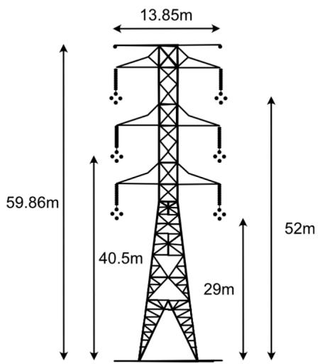  
Fig. 8. Case-3, double circuit.

Table 5 Case-3, conductor data.   

<table><tr><td colspan="2">Conductor data</td></tr><tr><td>Ground wire radius</td><td>6.4 mm</td></tr><tr><td>Ground wire DC resistance</td><td>0.864 Ohm/km</td></tr><tr><td>Bundle radius</td><td>248.56 mm</td></tr><tr><td>Bundle angle</td><td>0°</td></tr><tr><td>Conductor radius</td><td>14.65 mm</td></tr><tr><td>Conductor DC resistance</td><td>0.0646 Ohm/km</td></tr></table>

This case is interesting since the classical FD line model presents inaccurate waveforms in the time domain while the CTWB implementation does not. The fitting band is from 0.01 Hz to 10 MHz with 10 points per decade. The constant T is calculated at 1 kHz for all models. The fitting results are presented in Table 6. RKFIT provides a significant reduction in the order of fitting.

In addition, 3 methods in assigning the constant T are compared. The first one is by minimizing the distance between the actual H and its reconstructed version with a constant T. The second one puts an additional constraint of passivity to the first one, i.e., constant T minimizing the distance from actual Hwhile preserving the intrinsic passivity of the system. The third one is by picking the constant T around 1 kHz depending on the availability of the discrete sample.

Fig. 9 shows the reconstructed first diagonal element of H using various choices of constant T and fitting methods. CTWB with RKF and VF with a constant T providing minimum distance are the most accurate. FD with a constant T at 1 kHz is less accurate than CTWB with VF at 1 kHz particularly for frequencies beyond 1 kHz. Choosing a constant T that ensures that the approximated system is passive results in a less accurate model.

Fig. 10 shows the eigenvalues of ${ \bf Y } _ { n { \bf H } }$ which is calculated using the reconstructed H from its modes using the constant T that ensures minimum distance from the actual H satisfying the norm 2 relation of (11). The passivity violations for this case are more noticeable.

Fig. 11 shows the study circuit for Case 3. SW1 is closed at 20 ms. The waveforms show phase a of probe m1. Fig. 12 shows the waveform obtained with CTWB using VF and WB. For CTWB, two different Y models are considered. In one model, ${ \bf Y } _ { c }$ fitted in the phase domain as in the WB model is used. In the other case, Y is approximated with a constant T. Using a constant T for Yc has a minor impact on the accuracy of waveforms. The passivity violations of the CTWB model does not result in numerical stability problems in the time domain.

Fig. 13(a) is the general shape of the waveform over the whole simulation, (b) is a zoom over the rectangle shown in the (a). The zoomed figure shows that the FD curve (blue curve) has oscillations that don’t follow the WB curve (black curve). In this case, FD model isn’t as accurate as CTWB with RKF and VF. The inaccuracy of the FD model can be explained by its poor fitting performance as shown in Fig. 9 despite its excessive number of poles rather than the constant T approximation which has been considered as the main source of inaccuracy in FD model.

# 3.4. Case-4: 12 phase system

This case consists of a 12-phase system composed of 4 overhead lines of 1 km long as shown in Fig. 14. The wideband fitting for this case is performed in a larger frequency band from 0.01 Hz to 100 MHz to capture the decaying part of modal propagation functions given the short length of the line. The fitting results are presented in Table 7. This

Table 6 Case-3, fittings results.   

<table><tr><td></td><td>CTWB VF</td><td>CTWB RKF</td><td>FD Bode</td></tr><tr><td>Hmodel order</td><td>39</td><td>29</td><td>159</td></tr><tr><td>Hrms error</td><td>0.0048</td><td>0.0048</td><td>0.16</td></tr></table>

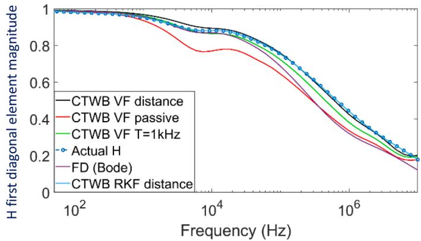  
Fig. 9. H first diagonal element.

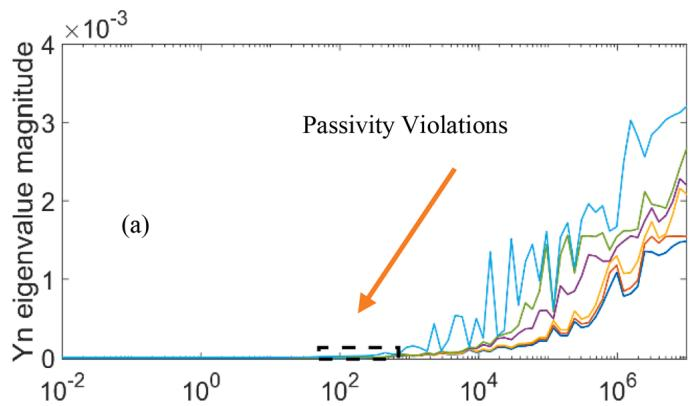

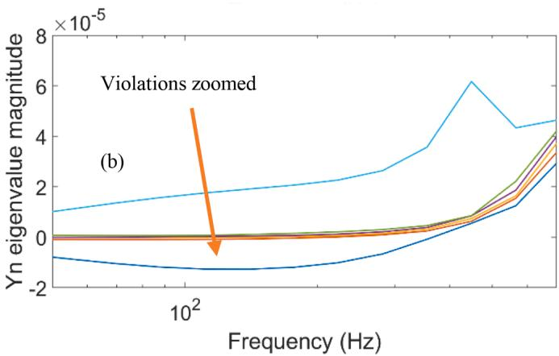  
Fig. 10. Eigenvalues of the nodal admittance matrix.

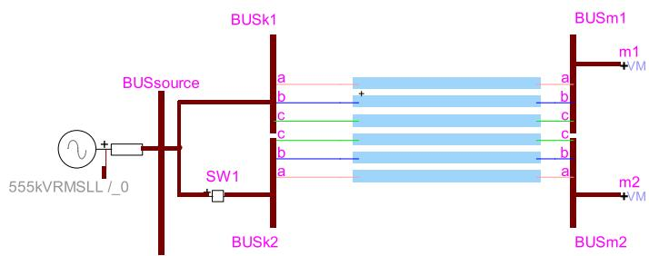  
Fig. 11. Case-3, study circuit.

case suggests again that RKF is more efficient than VF in terms of fitting order.

The second transmission line, from left to right, is excited with a 69

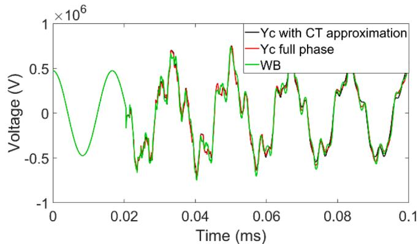  
Fig. 12. Impact of Constant T (labeled CT in the figure) approximation in $\mathbf { Y } _ { c }$ within CTVF.

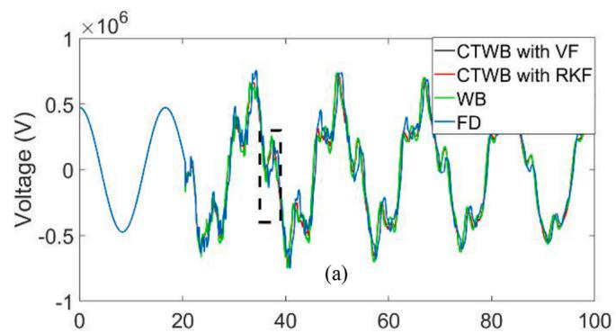

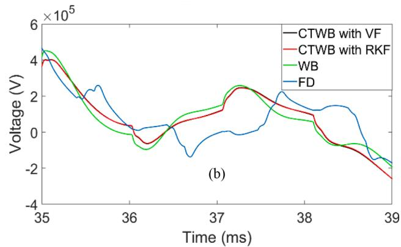  
Fig. 13. Voltage of the top left end phase in Fig. 8.

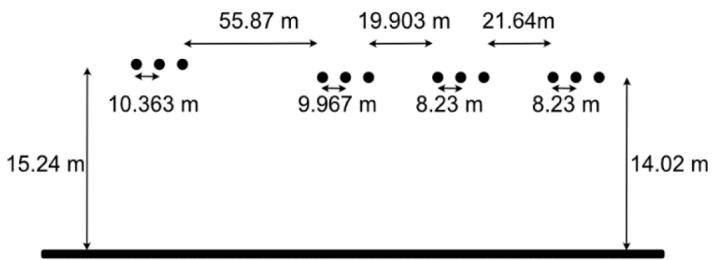  
Fig. 14. Case-4, 12-phase transmission system.

kV sinusoidal source at 60 Hz. The lowest time delay of this system is 3.3 µs, therefore we chose a time step of 300 ns. The waveform presented in Fig. 15 corresponds to the endline voltage of phase a of the first line on the left. We observe that CTWB models have a slightly less damping in the time domain than the WB model probably due to the high degree of asymmetry in the transmission system resulting in larger errors due to

Table 7 Case-4, fittings results.   

<table><tr><td></td><td>CTWB VF</td><td>CTWB RKF</td><td>WB</td></tr><tr><td>H model order</td><td>52</td><td>46</td><td>15</td></tr><tr><td>Residues</td><td>52</td><td>46</td><td>12 × 12 × 15 = 2160</td></tr><tr><td>H rms error</td><td>0.0023</td><td>0.0023</td><td>3.21 × 10-4</td></tr></table>

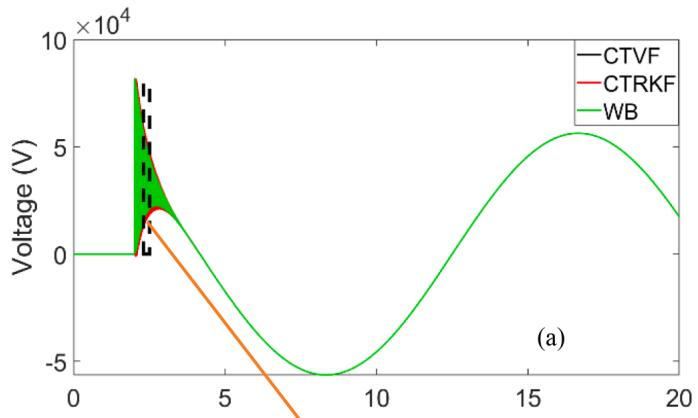

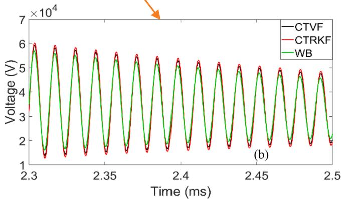  
Fig. 15. Case-4, end line voltage of phase-a.

constant T assumption at 1 kHz.

# 4. Conclusion

This paper has investigated the approximation of constant T in transmission line modeling together with new fitting options including the RKF which has not been considered for this application before. The use of RKF reduces the number of poles in the model significantly, whereas the Bode fitting employed in the classical FD model produces very large number of poles compared to VF and RKF in addition to displaying poor fitting performance. It is shown for the first time that the precision problems of the FD model in time domain simulations and poor reproduction of H in the phase domain are rather attributable to the Bode fitting than the constant T approximation. It is also shown that, the approximation of Ycwith a constant T has a minor impact on the precision of time domain simulations.

An important discovery of the paper is the fact that using a constant T may result in an approximated line system that is not passive anymore. Accordingly, the models generated using VF and RKF fitting techniques cannot maintain passivity. The case studies presented in the paper did not show any unstable behavior in the time domain due to the lack of passivity of the line model. On the other hand, this finding can be used to explain any unstable behavior encountered in the future. Since the

fitting is only performed in the modal domain, it is possible to introduce simpler passivity enforcement schemes if needed as future work.

# CRediT authorship contribution statement

Emmanuel Francois: Writing – original draft, Writing – review & editing, Investigation, Validation, Visualization, Methodology. Ilhan Kocar: Conceptualization, Formal analysis, Methodology, Investigation, Writing – original draft, Writing – review & editing, Software, Supervision, Project administration. Jean Mahseredjian: Writing – review & editing, Supervision, Funding acquisition, Project administration.

# Declaration of Competing Interest

The authors declare that they have no known competing financial interests or personal relationships that could have appeared to influence the work reported in this paper.

# Data availability

No data was used for the research described in the article.

# References

[1] A. Morched, B. Gustavsen, M. Tartibi, A universal model for accurate calculation of electromagnetic transients on overhead lines and underground cables, IEEE Trans. Power Deliv. 14 (3) (1999) 1032–1038, https://doi.org/10.1109/61.772350. July.   
[2] I. Kocar, J. Mahseredjian, Accurate frequency dependent cable model for electromagnetic transient studies, IEEE Trans. Power Del. 31 (3) (2016) 1281–1288. Jun.   
[3] L.O. Chua, P.M. Lin, Computer-Aided Analysis of Electronic Circuits: Algorithms and Computational Techniques, Prentice Hall, Englewood Cliffs, New Jersey, 1975.   
[4] B. Gustavsen, Avoiding numerical instabilities in the universal line model by a twosegment interpolation scheme, IEEE Trans. Power Deliv. 28 (3) (2013) 1643–1651. July.   
[5] I. Kocar, J. Mahseredjian, G. Olivier, Improvement of numerical stability for the computation of transients in lines and cables, IEEE Trans. Power Deliv. 25 (2) (2010) 1104–1111. April.   
[6] M. Cervantes, I. Kocar, J. Mahseredjian, A. Ramirez, Partitioned fitting and DC correction for the simulation of electromagnetic transients in HVDC systems, IEEE Trans. Power Deliv. 33 (6) (2018) 3246–3248. Dec.   
[7] J.R. M.artí, The Problem of Frequency Dependence in Transmission Line Modelling, University of British Columbia, 1980. Ph.D.   
[8] J.R. M.arti, Accurate modeling of frequency dependent transmission lines in electromagnetic transient simulations, IEEE Trans. Power App. Syst. PAS-101 (1) (1982) 147–155. Jan.   
[9] B. Gustavsen, A. Semlyen, Rational approximation of frequency domain responses by vector fitting, IEEE Trans. Power Deliv. 14 (3) (Jul. 1999) 1052–1061.   
[10] R. Iracheta, O. Ramos-Leanos, ˜ Improving computational efficiency of FD line model for real-time simulation of emts, N. Am. Power Symposium (2010) 1–8, 2010.   
[11] M. Berljafa, Rational Krylov Decompositions: Theory and Applications, 10806732, The University of Manchester (United Kingdom, Ann Arbor, 2017. Ph.D.   
[12] A. Ruhe, "Rational Krylov algorithms for nonsymmetric eigenvalue problems. II. Matrix pairs," Linear Algebra Appl., vol. 197-198, pp. 283–295, 1994/01/01.   
[13] A. Ruhe, The rational Krylov algorithm for nonsymmetric eigenvalue problems. III: complex shifts for real matrices, BIT Numer. Math. 34 (1) (1994) 165–176.   
[14] A. Ruhe, Rational Krylov: a practical algorithm for large sparse nonsymmetric matrix pencils, SIAM J. Sci. Comput. 19 (5) (1998) 1535–1551, 1998/01/01.   
[15] A. Ruhe, The rational Krylov algorithm for nonlinear matrix eigenvalue problems, J. Math. Sci. 114 (6) (2003) 1854–1856.   
[16] A. Mouhaidali,D. Tromeur-Dervout, O. Chadebec, J.-.M. Guichon, S. Silvant, Electromagnetic transient analysis of transmission line based on rational Krylov approximation, IEEE Trans. Power Deliv. 36 (5) (2021) 2913–2920. Oct.   
[17] A. Gueye, I. Kocar, E. Francois, J. Mahseredjian, Comparison of rational Krylov and vector fitting in transient simulation of transmission lines and cables,, Revised and submitted, IEEE Trans. Power Deliv. (2022). Dec..   
[18] J. Mahseredjian, S. Denneti`ere, L. Dub´e, B. Khodabakhchian, L. G´erin-Lajoie, On a new approach for the simulation of transients in power systems, Electric Power Syst. Res. 77 (11) (2007) 1514–1520.   
[19] Haddadi, Aboutaleb, and J. Mahseredjian. "Power system test cases for EMT-type simulation studies." CIGRE, Paris, France, Tech. Rep. CIGRE WG C 4.2018 (2018): 1–142.