# A Numerically Efficient and Accurate Model for Real-Time Simulation of Solid-State Transformer Using Implicit-Explicit Integration Methods

Hengyu Li , Member, IEEE, Walid Hatahet , Graduate Student Member, IEEE, Jared J. Paull , Graduate Student Member, IEEE, Fei Zhang , Member, IEEE, Yuanshi Zhang , Member, IEEE, Liwei Wang , Senior Member, IEEE, and Wei Li , Member, IEEE

Abstract—Electromagnetic transient (EMT) models of power electronic converters are essential for converter design, control, and fault analysis. This article proposes a switching-function-based detailed equivalent model (SFB-DEM) using combined implicit and explicit (ImEx) multistep Gear’s integration methods for numerically efficient and accurate EMT simulation. The proposed SFB-DEM integrates the benefits of ImEx solvers, featuring converter circuit decoupling, node number reduction, and constant nodal-network conductance(G)-matrix in the EMT model. The SFB-DEMs employing the ImEx 2nd and 3rd order Gear’s (i.e., ImEx-G2O and ImEx-G3O) methods are implemented for solidstate transformer (SST) simulation. In addition, a switching interpolation technique is proposed and integrated with the ImEx-G2O and ImEx-G3O solvers to account for intra-time-step switching events. The proposed SST SFB-DEMs greatly accelerate the EMT simulation, compared to the conventional detailed model (DM) and variable conductance(G)-matrix DEM (VG-DEM). For the SST with 60 SMs, the proposed SFB-DEM with ImEx-G3O method achieves the EMT simulation speedup by 171 and 7.5 folds, compared to the DM and VG-DEM, respectively.

Index Terms—Constant G-matrix, electromagnetic transient (EMT) program, implicit-explicit backward differentiation formula, solid-state transformer (SST), switching interpolation technique, switching-function-based detailed equivalent model (SFB-DEM).

# NOMENCLATURE

SFB-DEM Switching-function-based detailed equivalent model.

VG-DEM Variable G-matrix detailed equivalent model.

A-stability Absolute stability.

Received 13 August 2025; revised 30 November 2025; accepted 27 December 2025. Date of publication 2 January 2026; date of current version 20 March 2026. This work was supported by the Natural Sciences and Engineering Research Council (NSERC) of Canada. Recommended for publication by Associate Editor Z. Li. (Corresponding author: Liwei Wang.)

Hengyu Li, Walid Hatahet, Jared J. Paull, and Liwei Wang are with the School of Engineering, The University of British Columbia Okanagan, Kelowna, BC V1V 1V7, Canada (e-mail: liwei.wang@ubc.ca).

Fei Zhang and Yuanshi Zhang are with the School of Electrical Engineering, Southeast University, Nanjing 210096, China.

Wei Li is with OPAL-RT Technologies, Montreal, QC H3K 1G6, Canada (e-mail: wei.li@opal-rt.com).

Color versions of one or more figures in this article are available at https://doi.org/10.1109/TPEL.2025.3650144.

Digital Object Identifier 10.1109/TPEL.2025.3650144

L-stability Strong form of A-stability with limit of $\begin{array} { r } { \operatorname* { l i m } _ { z  - \infty } R ( z ) = 0 . } \end{array}$

BDF Backward differentiation formula.

TBE Trapezoidal rule switching to Backward Euler.

ImEx-G2O Implicit-explicit Gear’s 2nd order method.

ImEx-G3O Implicit-explicit Gear’s 3rd order method.

ISOP Input-series-output-parallel.

MFT Medium-frequency transformer.

# I. INTRODUCTION

T HE development of solid-state transformer (SST) (alsoknown as a power electronic transformer) has attracted known as a power electronic transformer） has atracted much attention from industry and academia [1], [2], [3], [4], [5]. The SST circuit topologies are commonly categorized into four types, i.e., single-stage, two-stage with low voltage dc (LVdc) link, two-stage with medium voltage dc (MVdc), and three-stage topologies [3], [4], [5], as presented in Fig. 1. An ISOP configuration is typically employed for the SST, realizing medium voltage ac (MVac) to LVdc conversion [2]. A threephase SST following ISOP configuration often uses multilevel ac–dc converter as its Stage I, composed of ac chain-links with cascaded full-bridge submodules (FBSMs). Meanwhile, multiple dual-active-bridge (DAB) dc–dc converters are coupled with the cascaded FBSMs through MVdc capacitors as its Stage II. The DAB dc–dc converters play an important role to provide galvanic isolation between the MVdc and LVdc through MFTs, enabling bidirectional power flow and achieves high power density [6], [7].

However, the detailed model (DM) of the SST imposes tremendous computational burdens to electromagnetic transient (EMT) simulation due to its detailed representation of massive semiconductor switches and discrete circuit components. In order to enhance the numerical accuracy and simulation efficiency of the SST, various equivalent circuit modeling approaches were introduced in the prior art. A high-speed EMT modeling strategy of the SST was proposed in [8] and [9], which uses Norton equivalents to simplify the SST circuit into a two-port system for node number reduction. However, the SST system is decoupled through the ac voltages of the MFTs, which may lead to numerical inaccuracy for fast switching state changes of the FBSMs in DABs. An alternative circuit decoupling through a

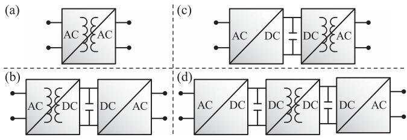  
Fig. 1. SST configurations. (a) Single-stage. (b) Two-stage with LVdc link. (c) Two-stage with MVdc link. (d) Three-stage topology.

dc-link capacitor was achieved by employing the cut-set-matrix algorithm in [10], which boosted the simulation efficiency of the SST. However, the network G-matrix of this approach is time-variant since the semiconductor switches are represented by binary-value resistors, imposing a high computational burden due to frequent re-factorization of the G-matrix.

To address the abovementioned issues, various modeling efforts have been carried out to realize a constant network G-matrix. A discrete-time switch model was developed in [11] and [12], which features constant G-matrix by representing a semiconductor switch as an L or C element, depending on its switching states. However, the use of $L / C$ incurs undesired fictitious voltage and current oscillations during switching transitions. Moreover, it can introduce unrealistically high virtual power losses [13]. In [14], [15], [16], [17], another type of modeling approach that leads to a constant G-matrix, namely, SFB-DEMs were proposed for modular multilevel converter (MMC) and multimodule SST. Thevenin equivalent circuit is used to represent cascaded submodules (SMs) in discrete-time domain and is updated based on switching functions and capacitor voltages of the SMs. Combined implicit- and explicit-type (ImEx-type) integration methods are employed in [14], [15], [16], [17] to discretize circuit components, i.e., the SM capacitor voltages using Forward Euler’s (FE) method for network decoupling, and the rest of the network by implicit trapezoidal rule (TR) for the 2nd order numerical accuracy and absolute stability (A-stability).

However, there are two drawbacks when employing the TR-FE method in the EMT simulation of power converters. First, the numerical accuracy is limited due to the use of the 1st order solver, i.e., FE method. Second, the TR method may experience numerical oscillations due to its A-stability, but not L-stability [18], when system discontinuity presents, e.g., switching operations. The numerical oscillations can be eliminated by changing the solver from TR to Backward Euler (BE), namely TBE when switching transition occurs (also known as critical damping adjustment) [19], [20]. However, the numerical accuracy has to be sacrificed especially when the switching frequency is high, since the BE method has 1st-order accuracy [21].

To circumvent the abovementioned drawbacks, this article employs combined implicit and explicit (ImEx) Gear’s 2nd or 3rd order methods (i.e., namely ImEx-G2O or ImEx-G3O) to discretize the circuit elements of the SST. Implicit Gear’s method, (also known as backward differentiation formula, i.e., BDF), is a linear multistep ordinary differential equation (ODE)

solver, especially designed for stiff ODEs [18]. While Gear’s 2nd order method has both A- and L-stability, the stability region of Gear’s 3rd order method contains a large part of the left half-plane and in particular the whole negative real axis. Thus, the high-order implicit Gear’s methods have much larger numerical stability regions than other implicit multistep methods, such as Adams-Moulton methods. Similarly, the explicit Gear’s methods (also known as explicit BDF methods [22], [23]) have larger numerical stability regions than the explicit Adams methods (Adams-Bashforth methods) with the same order. Therefore, combined ImEx Gear’s methods integrate the merits of superior numerical accuracy due to the use of high-order multistep Gear’s solvers and SST circuit decoupling because explicit Gear’s method is used to discretize the dc-link capacitors of the SST.

For fixed-time-step EMT simulation of power converters, switching events may occur in between two consecutive integer time steps. Inaccurate switching event location will introduce significant numerical errors to the simulation results. Switching interpolation techniques were proposed and implemented in [24], [25], [26], [27], [28], [29], [30] to account for intrastep switching for the TR method. However, a switching interpolation technique for the SFB-DEMs with combined ImEx multistep ODE solvers is missing in the literature.

As shown in Table I, the comparisons of different modeling approaches are performed regarding their computational efforts, capability of representing converter blocking mode, and numerical accuracy by high-order integration rules and switching interpolation. Most of the prior-art equivalent circuit models, e.g., [8], [9], [10], [31], and [32], achieve internal node elimination to accelerate the EMT-type simulation for large-scale converter system. However, these methods commonly represent the semiconductor switches by two-value resistors. Consequently, refactorization of the network conductance (G)-matrix becomes inevitable, which result in tremendous computational burdens. The EMT modeling strategy in [31] achieves a constant Gmatrix by adopting conventional L/C-associated discrete circuit [11]. Nevertheless, it introduces spurious numerical ringing in voltages and currents when encountering switching transients. In addition, several efficient EMT modeling approaches have been compared and analyzed in [29] and [30], where dynamic behaviors of the power converters are represented by switching functions which achieve a constant network G-matrix. Nevertheless, these modeling approaches in [29] and [30] use basic two-level power converters and have not achieved a reduction in circuit nodes and circuit decoupling. A high-fidelity device-level EMT modeling strategy has been proposed for numerically efficient parallel simulation of MMC in [33]. It is assumed that the MMC arm current is constant for two adjacent time steps to decouple the SMs from a converter arm. This equivalent circuit model achieves a constant G-matrix using the transmission line model (TLM) technique [34]. However, the efficient parallel MMC model in [33] cannot represent the converter in the IGBTblocked state and has four node voltages to be solved in each SM.

From the perspective of numerical accuracy, the prior-art equivalent circuit models use either implicit TR, which leads to a coupled network with a high-dimensional G-matrix, or employ a

TABLE I COMPARISON OF EQUIVALENT CIRCUIT MODELS FOR EFFICIENT EMT SIMULATION   

<table><tr><td>Model Type</td><td>Internal Node Reduction</td><td>Converter Stage Decoupling</td><td>Constant Network G-matrix</td><td>IGBT blocked Mode</td><td>2nd-order or Higher Numerical Accuracy</td><td>Switching Interpolation</td></tr><tr><td>VG-DEM in [8]-[10]</td><td>✓</td><td>✓</td><td>✗</td><td>✓</td><td>✓</td><td>✗</td></tr><tr><td>FPGA DEM in [31]</td><td>✓</td><td>✓</td><td>✓</td><td>✗</td><td>✗</td><td>✗</td></tr><tr><td>FPGA DEM in [32]</td><td>✓</td><td>✓</td><td>✗</td><td>✗</td><td>✗</td><td>✗</td></tr><tr><td>Multitimescale EMT Model in [35]</td><td>✓</td><td>✓</td><td>✗</td><td>✗</td><td>✗</td><td>✗</td></tr><tr><td>Inverter Model in [29]</td><td>✗</td><td>✗</td><td>✓</td><td>✗</td><td>✓</td><td>✓</td></tr><tr><td>Efficient EMT Models in [30]</td><td>✗</td><td>✗</td><td>✓</td><td>✓</td><td>✓</td><td>✓</td></tr><tr><td>High-Fidelity EMT Model in [33]</td><td>✓</td><td>✓</td><td>✓</td><td>✗</td><td>✓</td><td>✗</td></tr><tr><td>SFB-DEM in [16]</td><td>✓</td><td>✓</td><td>✓</td><td>✓</td><td>✗</td><td>✓</td></tr><tr><td>Proposed SFB-DEMs</td><td>✓</td><td>✓</td><td>✓</td><td>✓</td><td>✓</td><td>✓</td></tr></table>

combination of TR and FE to achieve circuit decoupling, which sacrifices numerical accuracy since the FE method achieves only 1st-order accuracy. Compared to the prior-art EMT modeling strategies, the proposed SFB-DEMs with combined implicitexplicit-type multistep solvers fulfill all the modeling features listed in Table I, which achieve superior 2nd-order (ImEx-G2O) or 3rd-order (ImEx-G3O) accuracy and accelerated simulation speed simultaneously. The novelty and main contributions of this article are summarized below.

1) A combined multistep ImEx Gear’s solver is proposed to discretize the circuit elements of the multimodule SST. The use of explicit Gear’s method to discretize DC-link capacitors enables converter decoupling and constant nodalnetwork G-matrix, which greatly accelerates the EMT simulation.   
2) The proposed high-order ImEx Gear’s (ImEx-G2O or ImEx-G3O) solver offers better numerical accuracy compared to the first-order solvers, e.g., BE+FE or mixed 1st and 2nd order solver, TBE. Numerical oscillations because of the TR solver to simulate switching operations are also avoided by the implicit Gear’s solvers.   
3) Switching interpolation technique is proposed for the ImEx-Gear’s solver in the SST. The simulation accuracy is enhanced for the cases of large time-step EMT simulation.   
4) The proposed SFB-DEM with ImEx Gear’s solver provides a universal modeling framework for an arbitrary voltage source converter with a dc-link capacitor. It permits high flexibility in representing de-blocking and blocking modes of the power converters with a reduced number of nodes, compared to the binary-value resistor or $L / C$ switch modeling.

# II. COMPARISON OF DEMS WITH VARIOUS NUMERICAL INTEGRATION METHODS

From the perspective of nodal-network G-matrices, the detailed equivalent models (DEMs) can be broadly categorized into two groups, i.e., DEMs with variable G-matrices (VG-DEMs), and switching-function-based DEMs (SFB-DEMs) with constant G-matrices. Meanwhile, it is also crucial to select numerical integration methods that provide high numerical accuracy, stability, and low computational complexity for the EMT simulation.

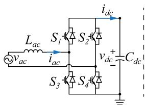  
(a)

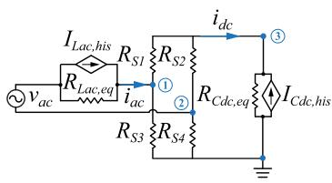  
(b）  
Fig. 2. Schematic of FB converter. (a) Circuit in continuous-time domain. (b) RSM in discrete-time domain.

# A. Full-Bridge Converter

This subsection compares two EMT modeling strategies, i.e., the resistive switch model (RSM) and SFB-DEM for a fullbridge (FB) converter.

1) Resistive Switch Model: In the RSM, two-value (ON/OFF) resistor with a small resistance for ON state and a large resistance for OFF state is used to represent a semiconductor switch [36]. Fig. 2 shows the schematic of the FB converter and its RSM, where the line inductor $L _ { \mathrm { a c } }$ and dc-link capacitor $C _ { \mathrm { d c } }$ are discretized using implicit integration methods (e.g., BE or TR) and are expressed in Norton equivalent. As shown in Fig. 2(b), the historical terms of the ac line inductor $L _ { \mathrm { a c } }$ and dc capacitor $C _ { \mathrm { d c } }$ are denoted by $I _ { \mathrm { L a c , h i s } }$ and $I _ { \mathrm { C d c , h i s } } ,$ which are in parallel with their equivalent resistors, $R _ { \mathrm { L a c , e q } }$ and $R _ { \mathrm { C d c , e q } }$ , in the discrete-time domain. $R _ { S 1 } - R _ { S 4 }$ are the binary-value resistors, corresponding to the switches $S _ { 1 } - S _ { 4 }$ . As presented in Fig. 2(b), the RSM of the FB converter has 3 node voltages $v _ { 1 } - v _ { 3 }$ to be solved. The nodal equation G-matrix is time-variant due to the semiconductor switching and has to be refactorized when switching states are changed.

2) SFB-DEM: An FB converter can operate in positive insertion, negative insertion, bypass, and IGBT-blocked (diode) modes, as shown in Fig. 3. The proposed SFB-DEM is derived by using the ac-side output voltages of the FB converter for positive and negative ac current directions. As shown in Fig. 3(e), the proposed SFB-DEM consists of two equivalent voltage sources, $V _ { s p }$ and $V _ { s n }$ corresponding to positive and negative ac current directions. Two diodes are in series with the two equivalent voltage sources to represent the blocking mode of the FB converter.

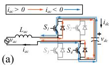

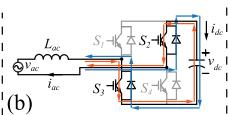

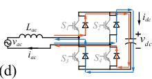

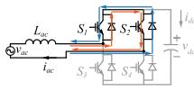

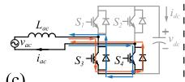

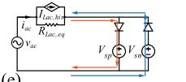  
(c）  
Fig. 3. Switching modes of SFB-DEM for FB converter. (a) Positive insertion. (b) Negative insertion. (c) Bypass. (d) Blocking. (e) Circuit of SFB-DEM.

TABLE II EQUIVALENT SOURCE VOLTAGES UNDER DIFFERENT SWITCHING STATES   

<table><tr><td>Switching Mode</td><td>S1</td><td>S2</td><td>S3</td><td>S4</td><td>Vsp</td><td>Vsn</td></tr><tr><td>Positive Insertion</td><td>1</td><td>0</td><td>0</td><td>1</td><td colspan="2">vdc</td></tr><tr><td>Negative Insertion</td><td>0</td><td>1</td><td>1</td><td>0</td><td colspan="2">-vdc</td></tr><tr><td rowspan="2">Bypass</td><td>1</td><td>1</td><td>0</td><td>0</td><td colspan="2">0</td></tr><tr><td>0</td><td>0</td><td>1</td><td>1</td><td colspan="2">0</td></tr><tr><td>Blocking (Diode)</td><td>0</td><td>0</td><td>0</td><td>0</td><td>vdc</td><td>-vdc</td></tr></table>

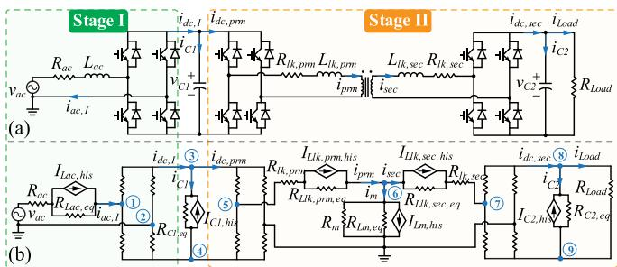  
Fig. 4. Schematic of 2-stage AC–DC–DC converter. (a) DM. (b) VG-DEM.

For the purpose of network decoupling, the dc-link capacitor is discretized by using an explicit integration solver, e.g., FE as

$$
v _ {\mathrm {d c}} (t + \Delta t) = v _ {\mathrm {d c}} (t) + \frac {\Delta t}{C _ {\mathrm {d c}}} i _ {\mathrm {d c}} (t) \tag {1}
$$

where $\Delta t$ denotes the simulation time step. In the deblocking mode, as shown in Fig. 3(a)–(c), the values of $V _ { s p }$ and $V _ { s n }$ are derived according to the switching modes in Table II. When the FB converter operates in the IGBT-blocking mode, as shown in Fig. 3(d), the ac current conducts through the diodes. Therefore, the values of $V _ { s p }$ and $V _ { s n }$ are opposite according to the ac current direction as shown in Fig. 3(e).

# B. 2-Stage AC–DC–DC Converter

This section proposes the SFB-DEM and compares it with the conventional VG-DEMs in a two-stage ac–dc–dc converter, which is recognized as a single module of the multilevel multimodule SST converter.

1) Detailed Model: As presented in Fig. 4(a), the converter DM comprises two converter stages, i.e., an FB ac/dc converter in Stage I and a DAB dc–dc converter in Stage II, coupled through MVdc-link capacitor $C _ { 1 }$ .

In Stage I, MVac terminal of the FB converter is connected to an ac voltage source $v _ { \mathrm { a c } }$ through line resistance $R _ { \mathrm { a c } }$ and inductance $L _ { \mathrm { a c } }$ while $i _ { \mathrm { a c } , I }$ and $i _ { \mathrm { d c } , I }$ are the ac and dc currents. In Stage II, the DAB converter contains an MFT whose winding resistances and leakage inductances on primary and secondary sides are denoted by $R _ { l k , \mathrm { p r m } } , L _ { l k , \mathrm { p r m } } , R _ { l k , \mathrm { s e c } }$ ,and $L _ { l k , \mathrm { s e c } } , \mathrm { r e s p e c } -$ tively. In Stage II, $C _ { 2 }$ denotes the LVdc-link capacitor, which is in parallel with a resistive load $R _ { \mathrm { L o a d } } . i _ { \mathrm { p r m } } , i _ { \mathrm { s e c } } ,$ and $i _ { \mathrm { d c , p r m } } , i _ { \mathrm { d c } }$ ,sec are the ac and dc currents on both sides of the MFT, respectively.

2) VG-DEM of 2-Stage Converter: This section evaluates the VG-DEMs implemented by various implicit-type solvers, such as BE, TR, implicit G2O (Im-G2O), and G3O (Im-G3O). As depicted in Fig. 4(b), the VG-DEM is formulated by the companion circuits of inductors and capacitors in the discrete-time domain, i.e., historical current sources in parallel with equivalent resistances. A semiconductor switch is represented using a binary-value resistor with its resistance equal to $R _ { \mathrm { O N } }$ or $R _ { \mathrm { O F F } }$ , which is time-variant in accordance with the switching states of the semiconductor device. In Stage II, a T-equivalent circuit is employed to model the MFT with all secondary variables referred to the primary side.

Initially, the historical current and equivalent resistance of each circuit component are computed, based on a selected solver. Table III provides a detailed summary of the Norton equivalents of inductors and capacitors in the discrete-time domain for various implicit-type solvers. In Table III, $t _ { k + 1 }$ denotes the present simulation time step and $t _ { k + 1 - n }$ represents the previous nth time step. As depicted in Fig. 4(b), $I _ { \mathrm { L a c , h i s } }$ and $I _ { C 1 , \mathrm { { h i s } } }$ s are the historical currents of the Stage I ac line inductor and MVdc-link capacitor, respectively. In Stage II, $I _ { L l k , \mathrm { p r m } , \mathrm { h i s } } ,$ $I _ { L l k , \mathrm { s e c } }$ ,his, $I _ { L m }$ his, and $I _ { C 2 , \mathrm { h i s } }$ are the historical currents of $L _ { l k , \mathrm { p r m } } , L _ { l k , \mathrm { s e c } } ,$ Lm, and $C _ { 2 }$ , which are in parallel with their equivalent resistances, correspondingly.

Since the discretization of the MVdc-link capacitor $C _ { 1 }$ using an implicit solver produces $R _ { C 1 , \mathrm { { e q } } }$ in parallel with $I _ { C 1 , \mathrm { h i s } }$ as shown in Fig. 4(b), the two converter stages become inherently coupled and must be solved all together in one nodal equation. Thereafter, the nodal equation is formulated as

$$
\boldsymbol {G} _ {N \times N} \boldsymbol {V} _ {\text {n o d e}, N \times 1} \left(t _ {k + 1}\right) = \boldsymbol {I} _ {\text {h i s}, N \times 1} \left(t _ {k}\right) \tag {2}
$$

wherein N denotes the node number.

The node voltages V node, ${ \bf \mathcal { N } } \times { \bf \mathrm { 1 } }$ at $t _ { k + 1 }$ can be solved from the linear system (2) using matrix factorization such as LU factorization. It is noted in Fig. 4(b) that the VG-DEM contains nine nodes in total, leading to a high-dimensional network G-matrix. With $V _ { \mathrm { n o d e } , N \times 1 } ( t _ { k + 1 } )$ known, the present time-step network solutions, including the voltages and currents from the ac and dc sides of the converter, can be updated accordingly. In summary, both frequent refactorization of the network G-matrix and computation of the high-dimensional nodal equation of the VG-DEM impose large computational burdens.

3) SFB-DEM of 2-Stage Converter: This subsection proposes the SFB-DEM for the two-stage ac–dc–dc converter, which combines the implicit-type (see Table III) and explicittype solvers (see Table IV) (i.e., ImEx-type solvers) to discretize different circuit components. As depicted in Fig. 5, the inductors from the two converter stages are commonly discretized and

TABLE III NORTON EQUIVALENT BY IMPLICIT-TYPE NUMERICAL INTEGRATION METHODS   

<table><tr><td>Component</td><td>R_eq &amp;I_his</td><td>BE</td><td>TR</td><td>Implicit G2O (Im-G2O)</td><td>Implicit G3O (Im-G3O)</td></tr><tr><td rowspan="2">Capacitor</td><td>RC,eq</td><td>Δt/C</td><td>Δt/2C</td><td>2Δt/3C</td><td>6Δt/11C</td></tr><tr><td>IC,his</td><td>-1/R_C,eqvC(t_k)</td><td>-i_C(t_k)-1/R_C,eqvC(t_k)</td><td>-1/R_C,eq(4/3vC(t_k)-1/3vC(t_{k-1}))</td><td>-1/R_C,eq(18/11vC(t_k)-9/11vC(t_{k-1})+(2/11vC(t_{k-2}))</td></tr><tr><td rowspan="2">Inductor</td><td>RL,eq</td><td>L/Δt</td><td>2L/Δt</td><td>3L/2Δt</td><td>11L/6Δt</td></tr><tr><td>IL,his</td><td>iL(t_k)</td><td>iL(t_k)+(1/R_L,eq)·vL(t_k)</td><td>4/3iL(t_k)-1/3iL(t_{k-1})</td><td>18/11iL(t_k)-9/11iL(t_{k-1})+2/11iL(t_{k-2})</td></tr></table>

TABLE IV DISCRETIZATION OF CAPACITOR VOLTAGE EQUATION USING EXPLICIT-TYPE NUMERICAL INTEGRATION METHODS   

<table><tr><td></td><td>FE</td><td>Explicit G2O (Ex-G2O)</td><td>Explicit G3O (Ex-G3O)</td></tr><tr><td rowspan="2">vc(tk+1)</td><td rowspan="2">vc(tk)+Δt/CiC(tk)</td><td>4/3vc(tk)-1/3vc(tk-1)</td><td>18/11vc(tk)-9/11vc(tk-1)+2/11vc(tk-2)</td></tr><tr><td>+2Δt/3C(2iC(tk)-iC(tk-1))</td><td>+6Δt/11C(3iC(tk)-3iC(tk-1)+iC(tk-2))</td></tr></table>

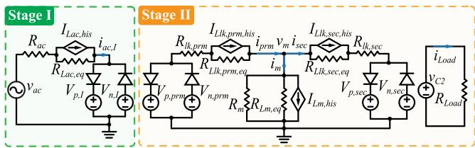  
Fig. 5. Schematic of SFB-DEM for 2-stage AC–DC–DC converter.

TABLE V VALUES OF EQUIVALENT AC VOLTAGE SOURCES   

<table><tr><td>Converter Stage</td><td colspan="2">Stage I</td><td colspan="4">Stage II</td></tr><tr><td>Equivalent Voltage</td><td>\(V_{p,I}\)</td><td>\(V_{n,I}\)</td><td>\(V_{p,pm}\)</td><td>\(V_{n,pm}\)</td><td>\(V_{p,sec}\)</td><td>\(V_{n,sec}\)</td></tr><tr><td>Positive Insertion</td><td colspan="2">\(v_{C1}\)</td><td colspan="2">\(v_{C1}\)</td><td colspan="2">\(v_{C2}\)</td></tr><tr><td>Negative Insertion</td><td colspan="2">\(-v_{C1}\)</td><td colspan="2">\(-v_{C1}\)</td><td colspan="2">\(-v_{C2}\)</td></tr><tr><td>Bypass</td><td colspan="2">0</td><td colspan="2">0</td><td colspan="2">0</td></tr><tr><td>Blocking</td><td>\(v_{C1}\)</td><td>\(-v_{C1}\)</td><td>\(v_{C1}\)</td><td>\(-v_{C1}\)</td><td>\(v_{C2}\)</td><td>\(-v_{C2}\)</td></tr></table>

expressed in the form of Norton equivalents in discrete-time domain using the implicit-type solvers in Table III. Different from the VG-DEM, the MV- and LVdc-link capacitor voltages in the SFB-DEM are integrated employing explicit-type solvers, as shown in Table IV. Hence, circuit decoupling between the two converter stages can be achieved through the dc-link capacitors since only historical information from the previous time steps are required while integrating the capacitor voltages.

As presented in Fig. 5, the SFB-DEM simplifies the circuit by representing the FB converter’s ac terminals with positive and negative equivalent voltage sources in series with anti-parallel diodes, wherein $V _ { p , I }$ and $V _ { n , I }$ are the positive and negative equivalent ac voltage sources in Stage I. $V _ { p , \mathrm { p r m } } , V _ { n , \mathrm { p r m } } , V _ { p , \mathrm { s e c } }$ and $V _ { n , \mathrm { s e c } }$ represent the equivalent voltages on primary- and secondary-side of the DAB in Stage II.

Table V illustrates the values of the equivalent ac voltage sources regarding the switching modes of the FB converter,

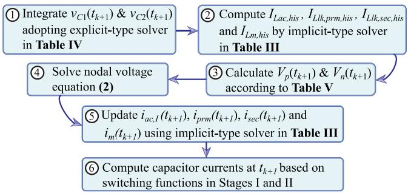  
Fig. 6. Simulation flowchart of SFB-DEM for 2-stage AC–DC–DC converter.

i.e., positive insertion, negative insertion, bypass, and IGBTblocking modes. In the deblocking mode, the ac voltage is computed by multiplying dc-link voltage with the switching function correspondingly. In the blocking mode, the ac current only flows through one of the two antiparallel diodes, which connects the equivalent voltage source, i.e., $V _ { p }$ or $V _ { n }$ to the circuit.

Fig. 6 outlines the simulation algorithm of the SFB-DEM with ImEx-type solvers. As discussed hereinbefore, the two converter stages are decoupled through MVdc-link using explicit-type solver. Therefore, it is noted in Fig. 5 that Stage II contains only one node which is connected to the DAB primary-, secondaryand magnetizing-branches, where the nodal voltage is denoted by $V _ { m } .$ . With the nodal voltage solved, the latest time-step values of $i _ { \mathrm { p r m } } , i _ { \mathrm { s e c } } .$ , and $i _ { m }$ can be updated using the implicit-type integration rules in the two converter stages, respectively. Finally, the dc-link capacitor currents can be derived by multiplying ac currents with their switching functions in each stage, correspondingly.

The proposed SFB-DEM with ImEx-type solver can improve simulation efficiency as it alleviates computational burdens due to circuit decoupling through dc-link capacitors, constant network G-matrix, and significant node reduction. Meanwhile, its

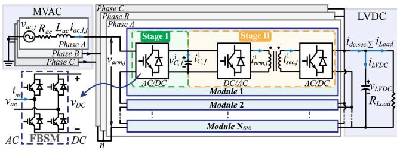  
Fig. 7. Schematic diagram of multimodule SST.

numerical accuracy can be improved by adopting high-order numerical solver as elaborated in Tables III and IV. The illustration of the SFB-DEM strategy in the two-stage converter functions as a stepping stone for the numerically efficient and accurate modeling of multilevel multimodule SST to be introduced in the next section.

# III. SFB-DEM WITH MULTISTEP IMEX-TYPE INTEGRATION METHODS FOR MULTIMODULE SST

This section proposes the SFB-DEM for the multilevel multimodule SST based on aforementioned ImEx-type solvers. First, the multimodule SST circuit configuration and its control strategy are introduced in Section III-A. Then, the proposed SFB-DEMs with multistep ImEx-G2O and ImEx-G3O solvers are derived in Sections III-B and III-C, respectively. Finally, Section III-D proposes the switching interpolation technique for the SFB-DEMs with multistep ImEx-type solvers.

# A. Multimodule SST Circuit Topology

As illustrated in Fig. 7, the multimodule SST is composed of two converter stages, which are coupled through MVdc-link capacitors. The multimodule SST Stage I contains a chainlink ac–dc converter with cascaded FBSMs. Throughout this article, the subscript index $j \in \{ A , B , C \}$ is reserved to denote the phases. In Stage $\operatorname { I } , i _ { \mathrm { a c } , I , j }$ and $i _ { \mathrm { d c } , I , j } ^ { i }$ are the ac and dc currents, while $v _ { C , j } ^ { i }$ and $i _ { C , j } ^ { i }$ are the MVdc-link capacitor voltage and current of the ith FBSM in phase $j ,$ , respectively. $v _ { \mathrm { a r m } , j }$ denotes the arm voltage of the ac/dc converter. In Stage II, $i _ { \mathrm { p r m } , j } ^ { i }$ and i isec,j are the primary- and secondary-side ac currents of the ith $i _ { \mathrm { s e c } , j } ^ { i }$ DAB module.

Following the ISOP configuration, all the DAB secondary dc terminals are connected in parallel to the LVdc-link capacitor whose voltage is vLVDC. $R _ { \mathrm { L o a d } }$ denotes a resistive load, in parallel to the LVdc-link capacitor. Thus, vLVDC can be integrated using the summation of DAB secondary dc currents $i _ { \mathrm { d c , s e c , \Sigma } }$ and load current $i _ { \mathrm { L o a d } }$ .

# B. SST Control Strategy and Operation Principle

As demonstrated in Fig. 8, higher- and lower-level control strategies are applied to Stages I and II, independently. In Stage I, MVdc-link energy balance control is implemented by comparing the measured average value of MVdc-link capacitor voltages of $N _ { \mathrm { S M } }$ cascaded FBSMs in three phases with the MVdc reference voltage, $v _ { \mathrm { M V D C } } ^ { \ast }$ . The difference between the

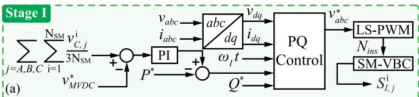

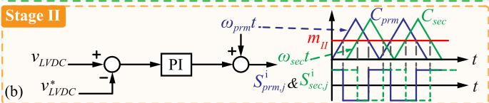  
Fig. 8. Control strategy of SST. (a) Stage I voltage and reactive power controls. (b) Stage II LVdc-link voltage control.

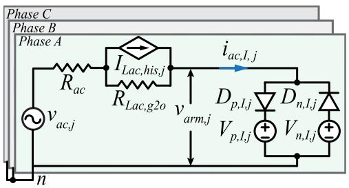  
Fig. 9. SFB-DEM of multimodule SST Stage I AC–DC converter.

measured and reference voltage is processed by PI controller and then considered as a part of real power reference $P ^ { * }$ . Thus, the VQ-control in dq-frame is employed to regulate active and reactive power at point of common coupling on MVac-grid side [15]. The modulating signals $v _ { a b c } ^ { * }$ are generated and sent to a level-shifted PWM (LS-PWM) scheme to produce the number of inserted chainlink SMs, $N _ { \mathrm { i n s } }$ which comprises $2 N _ { \mathrm { S M } } + 1$ discrete voltage steps. Subsequently, a sorting algorithm-based SM voltage-balance-control is implemented to balance the MVdclink capacitor voltages. Finally, Stage I switching function for each individual FBSM, $S _ { I , j } ^ { i } ,$ , can be generated accordingly.

In Stage II, as Fig. 8(b) depicts, an outer-loop LVdc-link voltage control is employed to regulate active power transfer in the DAB modules. $\omega _ { \mathrm { p r m } } t$ and $\omega _ { \mathrm { s e c } } t$ represent the phase angles of DAB primary- and secondary-side carrier signals, $C _ { \mathrm { p r m } }$ and $C _ { \mathrm { s e c } }$ are carriers in a single-phase-shift PWM scheme, respectively. $m _ { I I }$ denotes a constant modulating signal whose duty ratio is 50% . Thus, DAB primary- and secondary-side switching functions, $S _ { \mathrm { p r m } , j } ^ { i }$ and $S _ { \mathrm { s e c } , j } ^ { i }$ can be obtained accordingly.

# C. SFB-DEM With ImEx-G2O Solver

This section provides the mathematical derivation of the proposed SFB-DEM for the multimodule SST. The circuit components of the SST are discretized using ImEx-G2O solver. More specifically, the MV and LVdc-link capacitors are discretized using explicit G2O solver while the other circuit components are discretized using implicit G2O method, according to Tables III and IV.

1) Stage I AC–DC Converter With Cascaded FBSMs: Fig. 9 depicts a schematic diagram of the proposed multimodule SST SFB-DEM for Stage I. First, the MVdc-link capacitor voltages

are integrated using explicit G2O method as

$$
\begin{array}{l} v _ {C, j} ^ {i} (t _ {k + 1}) = \frac {4}{3} v _ {C, j} ^ {i} (t _ {k}) - \frac {1}{3} v _ {C, j} ^ {i} (t _ {k - 1}) + \frac {2 \Delta t}{3 C _ {1}} \\ \cdot \left(2 i _ {C, j} ^ {i} \left(t _ {k}\right) - i _ {C, j} ^ {i} \left(t _ {k - 1}\right)\right) \tag {3} \\ \end{array}
$$

where $C _ { 1 }$ is MVdc-link SM capacitance and the ith MVdc capacitor current $i _ { C , j } ^ { i }$ from the previous two steps, i.e., $t _ { k }$ and $t _ { k - 1 }$ is solved in (4), assuming de-blocking mode operation

$$
i _ {C, j} ^ {i} = S _ {I, j} ^ {i} \cdot i _ {\mathrm {a c}, I, j} - S _ {\mathrm {p r m}, j} ^ {i} \cdot i _ {\mathrm {p r m}, j} ^ {i} \tag {4}
$$

where $S _ { I , j } ^ { i } \in \{ 1 , - 1 , 0 \}$ is the switching function of the ith FBSM in Stage I and side switching functio $S _ { \mathrm { p r m } , j } ^ { i } \in \{ 1 , - 1 , 0 \}$ denotes the primary-odule, corresponding to the switch modes of positive insertion, negative insertion and bypass. As shown in (3), the integration of $v _ { C , j } ^ { i } ( t _ { k + 1 } )$ only requires historical terms from previous time steps such that decoupling between two converter stages can be achieved through MVdc-link capacitor of each module.

While the system is operating in the de-blocking mode, the arm voltage $v _ { \mathrm { a r m } , j }$ is computed as

$$
v _ {\text {a r m}, j} \left(t _ {k + 1}\right) = \sum_ {i = 1} ^ {N _ {S M}} S _ {I, j} ^ {i} \left(t _ {k + 1}\right) \cdot v _ {C, j} ^ {i} \left(t _ {k + 1}\right). \tag {5}
$$

As depicted in Fig. 9, $V _ { p , I , j }$ and $V _ { n , I , j }$ denote the positive and negative ac equivalent voltages in phase $j ,$ which are in series with the antiparallel diodes, $D _ { p , I , j }$ and $D _ { n , I , j }$ , respectively. The flowing direction of $i _ { \mathrm { a c } , I , j }$ determines either $V _ { p , I , j }$ or $V _ { n , I , j }$ is connected to the equivalent circuit. In deblocking mode, values of the equivalent voltages are computed as

$$
V _ {p, I, j} \left(t _ {k + 1}\right) = V _ {n, I, j} \left(t _ {k + 1}\right) = v _ {\text {a r m}, j} \left(t _ {k + 1}\right). \tag {6}
$$

In blocking mode, the equivalent voltage sources are derived as

$$
\left\{ \begin{array}{l} V _ {p, I, j} \left(t _ {k + 1}\right) = \sum_ {i = 1} ^ {N _ {\mathrm {S M}}} v _ {C, j} ^ {i} \left(t _ {k + 1}\right) \\ V _ {n, I, j} \left(t _ {k + 1}\right) = - \sum_ {i = 1} ^ {N _ {\mathrm {S M}}} v _ {C, j} ^ {i} \left(t _ {k + 1}\right) \end{array} \right. \tag {7}
$$

Accordingly, the MVdc-link capacitor current is computed as

$$
i _ {C, j} ^ {i} = \left| i _ {\mathrm {a c}, I, j} \right| + \left| i _ {\mathrm {p r m}, j} ^ {i} \right|. \tag {8}
$$

Based on Fig. 9 and Table III, the MVac line inductor $L _ { \mathrm { a c } }$ is discretized using implicit G2O method and expressed as a historical current source $I _ { \mathrm { L a c } , \mathrm { h i s } , j }$ in parallel with its equivalent resistance $R _ { \mathrm { L a c } , g 2 o }$ . Subsequently, the present time-step solution of the Stage I ac current $i _ { \mathrm { a c } , I , j } ( t _ { k + 1 } )$ is solved as

$$
\begin{array}{l} i _ {\mathrm {a c}, I, j} \left(t _ {k + 1}\right) = \frac {R _ {\mathrm {L a c} , g 2 o}}{R _ {\mathrm {L a c} , g 2 o} + R _ {\mathrm {a c}}} \left(\frac {4}{3} i _ {\mathrm {a c}, I, j} \left(t _ {k}\right) - \frac {1}{3} i _ {\mathrm {a c}, I, j} \left(t _ {k - 1}\right)\right) \\ + \frac {1}{R _ {\mathrm {L a c} , g 2 o} + R _ {\mathrm {a c}}} \left(v _ {\mathrm {a c}, j} \left(t _ {k + 1}\right) - V _ {x, I, j} \left(t _ {k + 1}\right)\right) \tag {9} \\ \end{array}
$$

where $V _ { x , I , j } ~ ( x \in \{ p , n \} )$ corresponds to the positive and negative ac voltages in Stage I, as derived in (6) or (7).

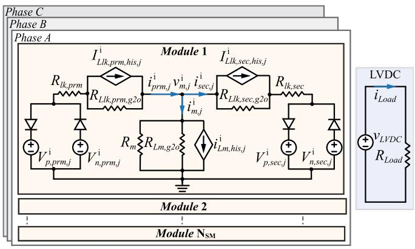  
Fig. 10. SFB-DEM of multimodule SST Stage Ⅱ DAB DC–DC converter.

2) Stage II DAB DC–DC Converter: Fig. 10 depicts a schematic diagram of the proposed SST SFB-DEM for Stage II. Similarly, the derivation of the Stage II SFB-DEM commences with integration of the dc-link capacitor voltages using Ex-G2O method. With the MVdc-link voltage solved in (3), the LVdc-link capacitor voltage at $t _ { k + 1 }$ can also be derived as

$$
\begin{array}{l} v _ {\mathrm {L V D C}} \left(t _ {k + 1}\right) = \frac {4}{3} v _ {\mathrm {L V D C}} \left(t _ {k}\right) - \frac {1}{3} v _ {\mathrm {L V D C}} \left(t _ {k - 1}\right) + \frac {2 \Delta t}{3 C _ {2}} \\ \cdot \left(2 i _ {\mathrm {L V D C}} \left(t _ {k}\right) - i _ {\mathrm {L V D C}} \left(t _ {k - 1}\right)\right) \tag {10} \\ \end{array}
$$

where $C _ { 2 }$ is LVdc-link SM capacitance and iLVDC is the LVdclink capacitor current.

In deblocking mode, iLVDC from the previous two steps, i.e., $i _ { \mathrm { L V D C } } ( t _ { k } )$ and $i _ { \mathrm { L V D C } } ( t _ { k - 1 } )$ can be computed by applying KCL at the LVdc terminal as

$$
i _ {\mathrm {L V D C}} = i _ {\mathrm {d c , s e c}, \Sigma} - v _ {\mathrm {L V D C}} / R _ {\text {L o a d}} \tag {11}
$$

where $i _ { \mathrm { d c , s e c , \Sigma } }$ is derived as

$$
i _ {\mathrm {d c}, \sec , \Sigma} = \sum_ {j = A, B, C} \sum_ {i = 1} ^ {N _ {\mathrm {S M}}} S _ {\sec , j} ^ {i} \cdot i _ {\sec , j} ^ {i}. \tag {12}
$$

Here, $S _ { \mathrm { s e c } , j } ^ { i } \in \{ 1 , - 1 , 0 \}$ is the secondary-side switching function of the ith DAB module corresponding to positive insertion, negative insertion, and bypass modes. Subsequently, the present time-step values of the DAB primary and secondary ac voltages, i.e., $v _ { \mathrm { p r m } , j } ^ { i } ( t _ { k + 1 } )$ and $v _ { \mathrm { s e c } , j } ^ { i } ( t _ { k + 1 } )$ are computed by

$$
\left\{ \begin{array}{l} v _ {\operatorname {p r m}, j} ^ {i} \left(t _ {k + 1}\right) = S _ {\operatorname {p r m}, j} ^ {i} \left(t _ {k + 1}\right) \cdot v _ {C, j} ^ {i} \left(t _ {k + 1}\right) \\ v _ {\sec , j} ^ {i} \left(t _ {k + 1}\right) = S _ {\sec , j} ^ {i} \left(t _ {k + 1}\right) \cdot v _ {\mathrm {L V D C}} \left(t _ {k + 1}\right). \end{array} \right. \tag {13}
$$

In deblocking mode, the DAB primary and secondary equivalent ac voltages are derived as

$$
\left\{ \begin{array}{l} V _ {p, \operatorname {p r m}, j} ^ {i} \left(t _ {k + 1}\right) = V _ {n, \operatorname {p r m}, j} ^ {i} \left(t _ {k + 1}\right) = v _ {\operatorname {p r m}, j} ^ {i} \left(t _ {k + 1}\right) \\ V _ {p, \sec , j} ^ {i} \left(t _ {k + 1}\right) = V _ {n, \sec , j} ^ {i} \left(t _ {k + 1}\right) = v _ {\sec , j} ^ {i} \left(t _ {k + 1}\right). \end{array} \right. \tag {14}
$$

In the blocking mode, the equivalent ac voltages are computed following the identical formulae in the Table V, which are not derived here for space consideration. The LVdc-link capacitor

current is calculated as

$$
i _ {\mathrm {L V D C}} = \sum_ {j = A, B, C} \sum_ {i = 1} ^ {N _ {\mathrm {S M}}} \left| i _ {\sec , j} ^ {i} \right| - v _ {\mathrm {L V D C}} / R _ {\mathrm {L o a d}}. \tag {15}
$$

As demonstrated in Fig. 10, the inductors from three circuit branches in the DAB transformer T-equivalent circuit are discretized using the implicit G2O method and expressed in the form of Norton equivalents, given in Table III. The equivalent resistors of the primary leakage, secondary leakage and magnetizing inductors of the MFT are denoted by $R _ { L l k , \mathrm { p r m } , g 2 o } ,$ $R _ { L l k , \mathrm { s e c } , g 2 o }$ and $R _ { L m , g 2 o }$ , which are in parallel with their corresponding historical current sources $I _ { L l k , \mathrm { p r m } , \mathrm { h i s } , j } ^ { i } , I _ { L l k , \mathrm { s e c } , \mathrm { h i s } , j } ^ { i }$ and $I _ { L m , \mathrm { h i s } , j } ^ { i }$ . To simplify the derivation of nodal voltage equation, circuit component reduction is realized in each RL-branch to further reduce number of nodes in the DAB equivalent circuit of Fig. 10. Thus, the equivalent conductance and historical currents from the primary- and secondary-side branches are formulated as

$$
\left\{ \begin{array}{l} G _ {\mathrm {p r m}, g 2 o} = 1 / \left(R _ {L l k, \mathrm {p r m}, g 2 o} + R _ {l k, \mathrm {p r m}}\right) \\ G _ {\sec , g 2 o} = 1 / \left(R _ {L l k, \sec , g 2 o} + R _ {l k, \sec}\right) \end{array} \right. \tag {16}
$$

$$
\left\{ \begin{array}{l} I _ {\operatorname {p r m}, \operatorname {h i s}, j} ^ {i} = G _ {\operatorname {p r m}, g 2 o} \cdot R _ {L l k, \operatorname {p r m}, g 2 o} \cdot I _ {L l k, \operatorname {p r m}, \operatorname {h i s}, j} ^ {i} \\ I _ {\sec , \operatorname {h i s}, j} ^ {i} = G _ {\sec , g 2 o} \cdot R _ {L l k, \sec , g 2 o} \cdot I _ {L l k, \sec , \operatorname {h i s}, j} ^ {i}. \end{array} \right. \tag {17}
$$

Similarly, the magnetizing-branch equivalent conductance $G _ { m , g 2 o }$ can also be derived as

$$
G _ {m, g 2 o} = \frac {R _ {L m , g 2 o} + R _ {m}}{R _ {L m , g 2 o} \cdot R _ {m}}. \tag {18}
$$

Using (16)–(18) to formulate nodal voltage equation, the magnetizing-branch node voltage $v _ { m , j } ^ { i } ( t _ { k + 1 } )$ is computed as

$$
v _ {m, j} ^ {i} \left(t _ {k + 1}\right) = \left(G _ {\mathrm {p r m}, g 2 o} + G _ {\mathrm {s e c}, g 2 o} + G _ {m, g 2 o}\right) ^ {- 1}
$$

$$
\left(I _ {\operatorname {p r m}, \operatorname {h i s}, j} ^ {i} - I _ {\operatorname {s e c}, \operatorname {h i s}, j} ^ {i} - I _ {L m, \operatorname {h i s}, j} ^ {i} + G _ {\operatorname {p r m}, g 2 o} \right.
$$

$$
\cdot V _ {x, \operatorname {p r m}, j} ^ {i} \left(t _ {k + 1}\right) + G _ {\sec , g 2 o} \cdot V _ {x, \sec , j} ^ {i} \left(t _ {k + 1}\right)) \tag {19}
$$

where V i $V _ { x , \mathrm { p r m } , j } ^ { i }$ x, prm,j and V ix,s $V _ { x , \mathrm { s e c } , j } ^ { i } ~ ( x \in \{ p , n \} )$ are the positive and negative equivalent ac voltages on primary- and secondary-sides of the DAB in accordance with (14) and Table V.

Finally, with $v _ { m } ^ { i } ( t _ { k + 1 } )$ obtained, the ac current from each circuit branch can be updated as

$$
\left\{ \begin{array}{l} i _ {\mathrm {p r m}, j} ^ {i} \left(t _ {k + 1}\right) = I _ {\mathrm {p r m}, \mathrm {h i s}, j} ^ {i} + G _ {\mathrm {p r m}, g 2 o} \\ \cdot \left(V _ {x, \mathrm {p r m}, j} ^ {i} \left(t _ {k + 1}\right) - v _ {m, j} ^ {i} \left(t _ {k + 1}\right)\right) \\ i _ {\sec , j} ^ {i} \left(t _ {k + 1}\right) = I _ {\sec , \mathrm {h i s}, j} ^ {i} + G _ {\sec , g 2 o} \\ \cdot \left(v _ {m, j} ^ {i} \left(t _ {k + 1}\right) - V _ {x, \sec , j} ^ {i} \left(t _ {k + 1}\right)\right) \\ i _ {m, j} ^ {i} \left(t _ {k + 1}\right) = I _ {L m, \mathrm {h i s}, j} ^ {i} + G _ {m, g 2 o} \cdot v _ {m} ^ {i} \left(t _ {k + 1}\right) \end{array} . \right. \tag {20}
$$

# D. SFB-DEM With ImEx-G3O Solver

To further improve numerical accuracy, an SST SFB-DEM with the 3rd-order solver, i.e., ImEx-G3O method is illustrated in this section. Since the derivations of network solutions for the SFB-DEM with ImEx-G3O method are very similar to those of the ImEx-G2O solver, this section only focuses on the

discretization of circuit components adopting the ImEx-G3O method, particularly.

1) Stage I AC–DC Converter With Cascaded FBSMs: The MVdc-link capacitor voltage is integrated using the explicit G3O method, which requires historical information from previous 3 time steps as

$$
\begin{array}{l} v _ {C, j} ^ {i} \left(t _ {k + 1}\right) = \frac {1 8}{1 1} v _ {C, j} ^ {i} \left(t _ {k}\right) - \frac {9}{1 1} v _ {C, j} ^ {i} \left(t _ {k - 1}\right) + \frac {2}{1 1} v _ {C, j} ^ {i} \left(t _ {k - 2}\right) \\ + \frac {6 \Delta t}{1 1 C _ {1}} \cdot \left(3 i _ {C, j} ^ {i} (t _ {k}) - 3 i _ {C, j} ^ {i} (t _ {k - 1}) + i _ {C, j} ^ {i} (t _ {k - 2})\right). \tag {21} \\ \end{array}
$$

Different from Section III-C.1, the Stage I inductors are discretized using implicit G3O method, where the historical current $I _ { \mathrm { L a c } , \mathrm { h i s } , j }$ and equivalent resistance $R _ { \mathrm { L a c } , g 3 o }$ are derived following Table III. Therefore, the Stage I circuit solution can be sought using (4)−(8), similarly. The Stage I ac current is derived as

$$
\begin{array}{l} i _ {\mathrm {a c}, I, j} (t _ {k + 1}) \\ = \frac {R _ {\mathrm {L a c} , g 3 o}}{R _ {\mathrm {L a c} , g 3 o} + R _ {\mathrm {a c}}} \left(\frac {1 8}{1 1} i _ {\mathrm {a c}, I, j} (t _ {k}) - \frac {9}{1 1} i _ {\mathrm {a c}, I, j} (t _ {k - 1}) \right. \\ \left. + \frac {2}{1 1} i _ {\mathrm {a c}, I, j} (t _ {k - 2})\right) + \frac {1}{R _ {\mathrm {L a c} , g 3 o} + R _ {\mathrm {a c}}} \\ \cdot \left(v _ {\mathrm {a c}, j} \left(t _ {k + 1}\right) - V _ {x, I, j} \left(t _ {k + 1}\right)\right). \tag {22} \\ \end{array}
$$

2) Stage II DAB DC–DC Converter: In this section, circuit components in the DAB modules are discretized using ImEx-G3O method. Similar to Stage I, the derivation of Stage II SFB-DEM starts with the integration of LVdc-link capacitor voltages employing the Ex-G3O method as

$$
\begin{array}{l} v _ {\mathrm {L V D C}} \left(t _ {k + 1}\right) = \frac {1 8}{1 1} v _ {\mathrm {L V D C}} \left(t _ {k}\right) \\ - \frac {9}{1 1} v _ {\mathrm {L V D C}} \left(t _ {k - 1}\right) + \frac {2}{1 1} v _ {\mathrm {L V D C}} \left(t _ {k - 2}\right) \\ + \frac {6 \Delta t}{1 1 C _ {2}} \cdot \left(3 i _ {\mathrm {L V D C}} \left(t _ {k}\right) - 3 i _ {\mathrm {L V D C}} \left(t _ {k - 1}\right) + i _ {\mathrm {L V D C}} \left(t _ {k - 2}\right)\right) \tag {23} \\ \end{array}
$$

where iLVDC is computed by (11) and (12) in deblocking mode or (15) in blocking mode.

As shown in Fig. 10 and Table III, the inductors from three DAB circuit branches are discretized using implicit G3O method and expressed in form of companion circuits. Since the derivation of the DAB SFB-DEM using the ImEx-G3O is similar to what had been discussed in Section III-C.2, the derivation detail is omitted here for space consideration.

Compared to the 2nd-order solvers such as ImEx-G2O and TR, the ImEx-G3O improves numerical accuracy of the network solutions as it achieves the 3rd order accuracy in dynamic simulation. It is noted that the modeling complexity of the ImEx-G3O increases slightly, compared to the 2nd-order solvers since the use of ImEx-G3O requires historical information from 3 consecutive time steps to extrapolate the present time-step solution. Also, there are additional requirements for storages of circuits’ historical information during the simulation execution. Hence, this paper proposes both ImEx-G2O and ImEx-G3O methods

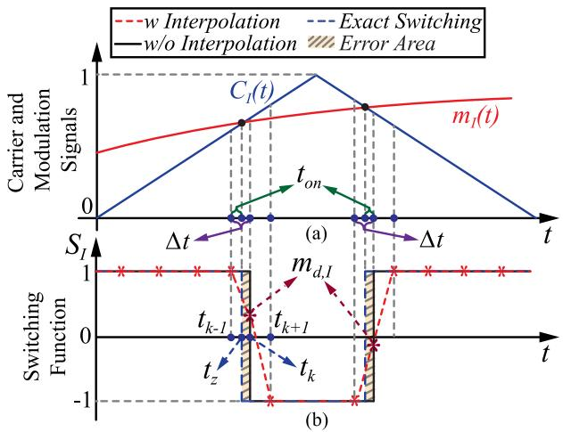  
Fig. 11. Switching interpolation technique in Stage I. (a) Carrier and modulation signals of single FBSM. (b) Switching function of single FBSM.

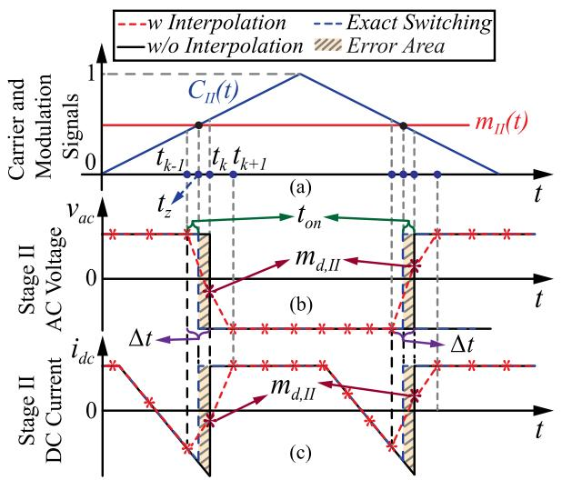  
Fig. 12. Switching interpolation technique in Stage II. (a) Carrier and modulation signals. (b) AC voltage. (c) DC current.

for implementing the SFB-DEMs such that users can flexibly choose solver preferences based on specific requirements for numerical accuracy or modeling simplicity.

# E. Switching Interpolation for Multistep ImEx-Type Solver

This section proposes a switching interpolation technique for the SFB-DEMs and illustrates its application to the multistep ImEx-type solvers. Figs. 11 and 12 show the PWM scheme for a single FBSM in the SST as an example to demonstrate switching interpolation technique. In Figs. 11 and 12, the legends, w and $w / o$ are corresponding to the SFB-DEMs with and without switching interpolation applied, respectively. $t _ { z }$ represents the precise switching event instance which occurs in between two integer time steps, i.e., $t _ { k - 1 }$ and $t _ { k }$ . Black-solid line denotes the switching function without employing switching interpolation. It is noted that the switching status variation can only be detected at next integer time point $t _ { k }$ . Accordingly, the yellow-shaded

TABLE VI POSITIVE INSERTION TIME WITHIN ONE INTEGRATION INTERVAL   

<table><tr><td>Relationship between m and C</td><td>tON</td></tr><tr><td>m(tk) &gt; C(tk) &amp; m(tk-1) &lt; C(tk-1)</td><td>Δt/(1 - (C(tk-1) - m(tk-1)/C(tk) - m(tk))</td></tr><tr><td>m(tk) &gt; C(tk) &amp; m(tk-1) &gt; C(tk-1)</td><td>Δt</td></tr><tr><td>m(tk) &lt; C(tk) &amp; m(tk-1) &gt; C(tk-1)</td><td>Δt/(1 - (C(tk) - m(tk)/C(tk-1) - m(tk-1))</td></tr><tr><td>m(tk) &lt; C(tk) &amp; m(tk-1) &lt; C(tk-1)</td><td>0</td></tr></table>

areas in Figs. 11 and 12 indicate the errors between original and exact switching functions within one simulation time interval.

As presented in Fig. 11(b), $t _ { \mathrm { o n } }$ denotes positive insertion time within one integration interval within which a switching event occurs. $t _ { \mathrm { o n } }$ can be derived based on modulating signal $m _ { I } ( t )$ and carrier signal $C _ { I } ( t )$ at the time steps of $t _ { k }$ and $t _ { k - 1 }$ , as shown in Table VI. The average value of the exact switching function within the interval $[ t _ { k - 1 } , t _ { k } ]$ is expressed as

$$
S _ {I} ^ {*} = m _ {d, I} = \frac {2 t _ {\text {o n}}}{\Delta t} - 1 \tag {24}
$$

where Δt is integration time step. It is noted that (24) can be used to modify the switching function $S _ { I }$ at $t _ { k } .$ , as shown in Fig. 11(b) by the red dotted curve. The switching function $S _ { I , j } ^ { i }$ in the ith FBSM in phase j of Stage I ac–dc converter can also be modified by the corresponding interpolated ratio $m _ { d , I }$ within the interval where a switching event occurs. Thus, the interpolated ratio $m _ { d , I }$ is applied to (4) and (5) to account for intra-step switching event in the cascaded FBSMs in Stage I of the SST.

Fig. 12(b) and (c) shows the ac voltage and dc current in an FBSM in either primary or secondary side of a DAB module in Stage II of the SST. The derivation of $t _ { \mathrm { o n } }$ in Fig. 12(b) is the same as in Fig. 11 and Table VI. The interpolated ratio $m _ { d , I I }$ [as shown in Fig. 12(b) and (c)] is calculateused to replace the original switching functions $S _ { \mathrm { p r m } , j } ^ { i * }$ (24) and $S _ { \mathrm { s e c } , j } ^ { i * }$ in (4), (12), and (13). The proposed switching interpolation technique is designed for the SFB-DEM and can be integrated into the proposed multistep ImEx-type solvers to improve both numerical accuracy and simulation efficiency for large-time-step simulation.

# IV. SIMULATION STUDIES

This section validates the model accuracy and efficiency of the proposed SFB-DEMs with various numerical solvers for singlemodule ac–dc–dc converter and multimodule SST, respectively. All converter models are executed on a PC with 3.20 GHz Intel Core i9-12900k CPU, 128 GB RAM, and Microsoft Windows 11 operating system. In the case studies, the DM is implemented using MATLAB/Simulink/Simscape Electrical Toolbox while the VG-DEMs and SFB-DEMs are programmed by MATLAB scripts (m-files). Initially, all models are simulated using a small time step, i.e., $T _ { s } = 1 \mu \mathrm { s }$ to validate their numerical accuracy. It is verified that the simulation results of all SFB-DEMs converge with the DM. Thus, the DM with $T _ { s } = ~ 1$ μs is selected as the reference (Ref) to validate the numerical accuracy of the

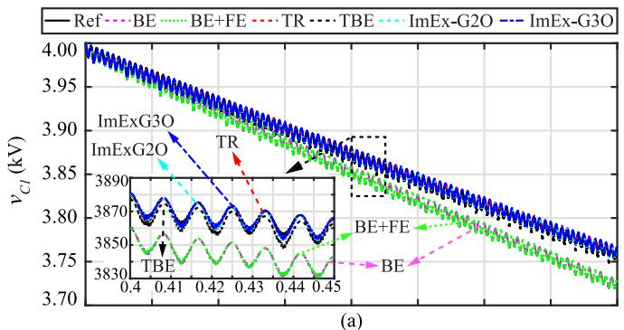

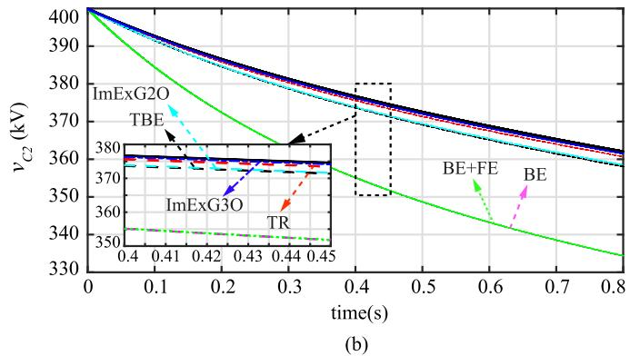  
Fig. 13. DC-link capacitor voltages. (a) MVdc-link capacitor voltage. (b) LVdc-link capacitor voltages.

DEMs. The tested SFB-DEMs use a large time step of $T _ { s } =$ 10 μs in the case studies in Sections IV-A and B.1)–6) and $T _ { s } =$ 5 μs in B.7). Meanwhile, the switching interpolation technique is implemented in all tested models to locate switching events precisely.

# A. Validation of 2-Stage AC–DC–DC Converter SFB-DEM

The numerical accuracy of the proposed SFB-DEMs with the ImEx-type methods including BE+FE, ImEx-G2O and ImEx-G3O are compared to the VG-DEMs with implicit-type solvers including BE, TR, and TBE. For straightforward comparison and benchmarking of model accuracy, the MV and LVdc-link capacitors discharging transients are used in the simulation study of 2-stage ac–dc–dc converter.

As observed in Fig. 13, the numerical accuracy of the MV- and LVdc-link capacitor voltages using various integration rules are ranked as follows: SFB-DEM (ImEx-G3O) > VG-DEM (TR) > SFB-DEM (ImEx-G2O) > VG-DEM (TBE) > SFB-DEM (BE-FE) ≈ VG-DEM (BE). In Fig. 13(b), minor numerical oscillations are observed in the DAB magnetizing branch voltage when using the TR method (red dashed curve) during abrupt variations in the switching states of FB converters at both sides of the MFT. Although, the numerical oscillations can be damped out by switching TR back to BE, i.e., TBE method (black dashed curve), the numerical accuracy is reduced consequently.

It is observed in Figs. 13 and 14 that the simulation results of the proposed SFB-DEM with ImEx-G3O method match well to the reference solution, whereas the performance of the 1st-order BE+FE solver exhibits significant numerical error throughout

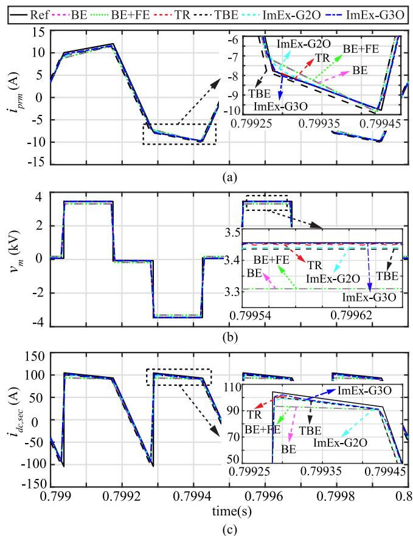  
Fig. 14. Stage II DAB simulation performance. (a) Primary-side AC current. (b) Magnetizing-branch voltage. (c) Secondary-side DC current.

the simulation. Meanwhile, it has also been validated that the proposed SFB-DEM solved by ImEx-G3O solver is immune to numerical oscillations even when the system stiffness is high.

# B. Validation of Multimodule SST SFB-DEMs

This subsection validates the proposed SFB-DEMs with ImEx-G2O and ImEx-G3O methods for simulating multimodule SST. The system parameters are provided in Table IX of the Appendix. Without loss of generality, dynamic performances of the proposed SFB-DEMs are presented with different operating scenarios, including steady-state, real-power-change, LVdc-link pole-to-pole fault, and single-phase ac fault. The effectiveness of the proposed switching interpolation technique is verified in Case Study 7) along with the multistep ImEx-type solver. Finally, simulation efficiency of the VG-DEMs and the proposed SFB-DEMs are compared to the MATLAB/Simulink DMs for different numbers of SMs in the multimodule SST.

1) Steady State Performance: As presented in Fig. 15, the Stage I arm voltages and currents using the 2nd-order methods i.e., TR+Ex-G2O (yellow dashed curve), ImEx-G2O (magenta dotted curve), and ImEx-G3O (cyan dashed curve) match with the reference solutions (black solid curve) very well. On the other hand, the SFB-DEM with BE+FE solver (blue dashed curve) has noticeable difference to the reference solution. Compared to TR+Ex-G2O, the SFB-DEM with ImEx-G2O or ImEx-G3O

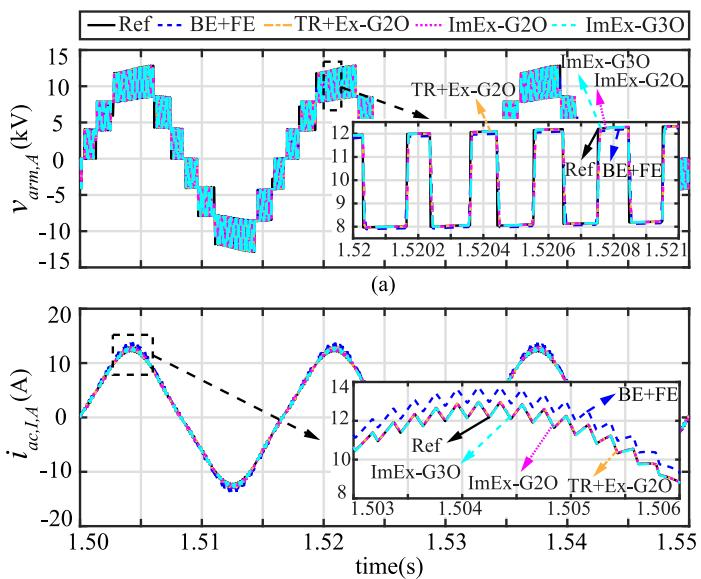  
(b)   
Fig. 15. SST Stage I arm voltage and current. (a) Stage I arm voltage. (b) Stage I arm current.

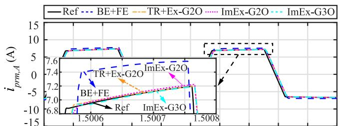  
(a)

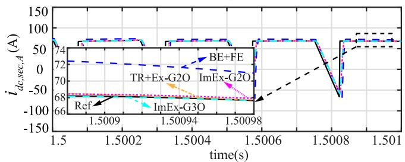  
(b)   
Fig. 16. Stage II DAB AC and DC currents. (a) Primary-side AC current. (b) Secondary-side DC current.

emerge as preferred modeling strategy since it achieves high numerical accuracy without numerical oscillation.

Fig. 16 presents the SST Stage II DAB simulation results. It is noted in the primary ac and secondary dc currents that the SFB-DEM solved by ImEx-G3O method achieves the best numerical accuracy as it converges with the reference solutions well, while the two SFB-DEMs solved by the 2nd-order methods, i.e., TR+Ex-G2O and ImEx-G2O are slightly less accurate. More importantly, the simulation results by the 1st-order BE+FE method present noticeable magnitude differences compared to the other solutions.

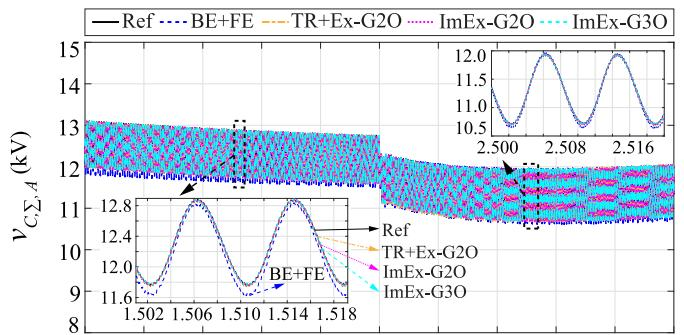  
(a)

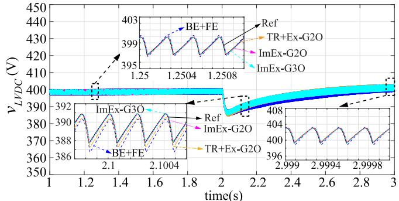  
(b)   
Fig. 17. SST dc-link voltages. (a) Summation of MVdc-link capacitor voltages. (b) LVdc-link capacitor voltage.

2) Real Power Change Operation: The real power reference is initialized at 1 p.u. and commanded to vary from 1 to 0.8 p.u. at $t ~ = ~ 2 ~ \mathrm { s } .$ . This case study is used to validate the numerical accuracy of the proposed SFB-DEMs solved by ImEx-G2O and ImEx-G3O methods when the system experiences powerchange transient. It is observed in Fig. 17 that both the 2ndand 3rd-order methods achieve superior numerical accuracy in MVdc- and LVdc-link capacitor voltages compared to 1st-order BE+FE method during the steady-state periods before and after the real-power-change operation. Furthermore, as observed in Fig. 17(b) at $t \ = \ 2 \mathrm { { s } } .$ the LVdc-link capacitor voltage is gradually regulated back to its rated value due to the effectiveness of outer-loop voltage control. During this transient period, it is noted that the proposed SFB-DEMs solved by both ImEx-G2O and ImEx-G3O converge with the reference better than that of the BE+FE solver, which validates the merit of the proposed modeling approach in numerical accuracy.

# 3) Load Change Operation:

a) Dynamic performance: This section presents a case study with a higher step load change of real power from 0.5 to 1 p.u. The real power reference is given in Parameter List of Case 1 in Table IX in the Appendix. Fig. 18(a) presents dynamic performance of individual MVdc-link capacitor voltages produced by the DEMs with different ODE solvers and the DM reference. It is noted in Fig. 18(a) that the MVdc capacitor voltages experience fast transient when the load-change occurs at t = 3 s. After that, the magnitudes of the MVdc capacitor voltages are regulated back to its rated value due to the MVdclink voltage/energy control and SM capacitor voltage balancing control. In addition, as demonstrated in Fig. 18(b), the magnitude

TABLE VII RELATIVE ERRORS OF SFB-DEMS WITH VARIOUS IMEX-TYPE INTEGRATION METHODS   

<table><tr><td rowspan="2">Simulation Time Step</td><td colspan="3">Stage I Arm Current εiarm,j(%)</td><td colspan="3">Sum of MVDC Capacitor Voltages εvc,Σj(%)</td><td colspan="3">LVDC-link Capacitor Voltages εlvdc(%)</td></tr><tr><td>BE+FE</td><td>ImEx-G2O</td><td>ImEx-G3O</td><td>BE+FE</td><td>ImEx-G2O</td><td>ImEx-G3O</td><td>BE+FE</td><td>ImEx-G2O</td><td>ImEx-G3O</td></tr><tr><td>2 μs</td><td>2.731</td><td>0.102</td><td>0.101</td><td>0.224</td><td>0.005</td><td>0.003</td><td>0.200</td><td>0.006</td><td>0.006</td></tr><tr><td>5 μs</td><td>7.257</td><td>0.464</td><td>0.440</td><td>0.306</td><td>0.037</td><td>0.032</td><td>0.458</td><td>0.033</td><td>0.027</td></tr><tr><td>10 μs</td><td>16.064</td><td>1.023</td><td>0.921</td><td>1.982</td><td>0.106</td><td>0.095</td><td>2.120</td><td>0.099</td><td>0.084</td></tr></table>

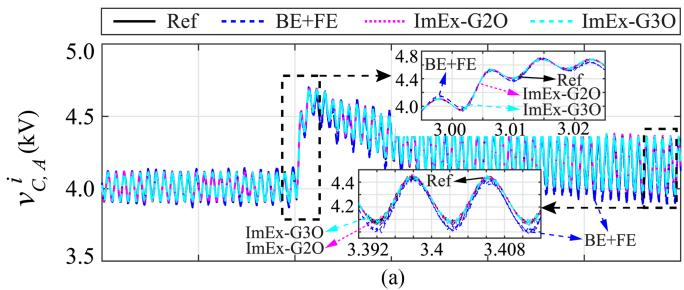

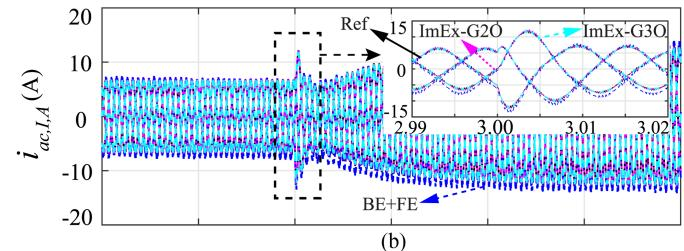

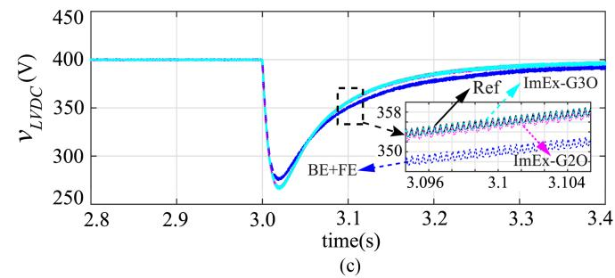  
Fig. 18. Dynamic performances of load-change operation. (a) MVdc-link capacitor voltages. (b) Stage I arm current. (c) LVdc-link capacitor voltage.

of Stage I arm current is doubled in its magnitude in the steady state due to the real power change. Meanwhile, it is also observed in Fig. 18(c) that the LVdc-link capacitor voltage drops instantaneously when the load power is increased. Thereafter, the LVdc-link voltage gradually recovers back to its rated value, owing to the effective outer-loop voltage controller. It is observed in Fig. 18 that the proposed DEMs employing ImEx-G2O and ImEx-G3O demonstrate superior numerical accuracy compared to the DEM with 1st-order BE+FE method, especially during the transient period of the load change.

b) Sensitivity analysis regarding simulation time step: This section presents the relative errors for the proposed SFB-DEMs with the BE+FE, ImEx-G2O and ImEx-G3O integration methods at different time steps, i.e., Δt = 2, 5, and 10 μs, and compare them with the DM reference simulated with the small time step of 1 μs. The real power reference is initialized with 0.5 p.u. and is commanded to step up to 1 p.u at t = 3 s. The

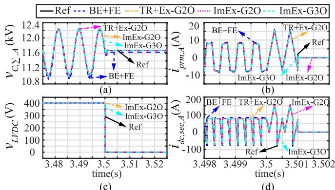  
Fig. 19. LVdc-link pole-to-pole short-circuit fault operation. (a) Summation of MVdc-link capacitor voltages. (b) DAB primary-side AC current. (c) LVdc-link capacitor voltage. (d) DAB secondary-side DC current.

relative errors for the proposed SFB-DEM with different solvers are calculated as

$$
\varepsilon_ {r} (\%) = \frac {\sum_ {i = N 1} ^ {i = N 2} | x _ {\mathrm {DEM}} (i) - \hat {x} (i) |}{\sum_ {i = N 1} ^ {i = N 2} | \hat {x} (i) |} \times 100 \% \tag{25}
$$

where xˆ(i) denotes reference solution at the ith time step; $N _ { 1 }$ and $N _ { 2 }$ are corresponding to the starting and ending points of the time window where the relative errors are calculated.

Table VII demonstrates the relative errors for Stage I arm current $\varepsilon _ { i _ { \mathrm { a m } } , \ j }$ , the sum of MVdc capacitor voltages $\varepsilon _ { v _ { C , \Sigma , \ j } }$ and LVdc-link capacitor voltages $\varepsilon _ { v _ { \mathrm { L V D C } } }$ . It is noted in Table VII that the relative errors of the SFB-DEM using 1st-order BE+FE solver are always the largest, compared to the higher order multistep integration methods. In particular, the relative error of the Stage I arm current $\varepsilon _ { i _ { \mathrm { a r m } } , }$ j using the BE+FE method is around 16 folds larger than those employing ImEx-G2O and ImEx-G3O methods. It is also noted that the relative errors of the BE+FE method grow significantly as the time step-sizes increase from 2 to 10 $\mu \mathbf { S } ,$ whereas the errors of the proposed multistep methods exhibit only a slight increase. Overall, the SFB-DEM with ImEx-G3O demonstrates the best numerical accuracy within all tested cases.

4) LVDC Pole-to-Pole Fault Operation: This section validates the blocking mode operation in the proposed SST SFB-DEMs using a dc-link pole-to-pole short-circuit fault case study. As presented in Fig. 19, the LVdc-link pole-to-pole fault occurs at 3.5 s and is detected 1 ms later at 3.501 s. Hereafter, the FBSMs in the SFB-DEMs are switched into blocking mode and the ac currents are only conducted through the antiparallel diodes as depicted in Figs. 5, 9, and 10. Therefore, the flowing directions of

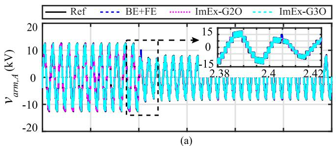

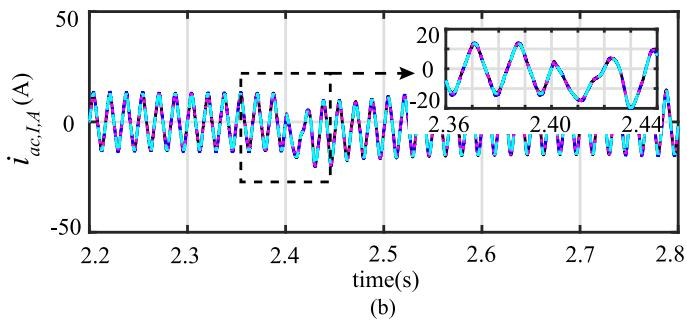  
Fig. 20. SST Stage I arm voltage and current under single-phase-to-ground AC fault in phase-A. (a) Arm voltage. (b) Arm current.

the ac currents in Stages I and II are determined by the switching states of the diodes.

In Stage I, the ac–dc converter’s FBSMs counteract with the MVac grid voltage to suppress the short-circuit fault current flowing from the MVac to the MVdc-link. In stage II, the DAB primary-side ac currents and secondary-side dc currents drop to zero instantaneously when the fault occurs at 3.5 s, as presented in Fig. 19(b) and (d). It is noted that the proposed multistep ImEx-G2O and ImEx-G3O methods demonstrate superior numerical accuracy, compared to the 1st-order BE+FE method.

5) Single-Phase AC Fault Simulation: Asymmetrical system faults are identified as the major causes of the unbalanced voltage sags [37], [38], [39]. Accordingly, an additional operating scenario with asymmetrical single-phase-to-ground fault is used to further validate the proposed SFB-DEM and the numerical accuracy improvement by employing the combined multistep integration methods, i.e., ImEx-G2O and ImEx-G3O. In the asymmetric fault case, as presented in Fig. 20(a) and (b), MVac grid is subject to a short-circuit fault between phase-A and the ground at $t ~ = ~ 2 . 4 ~ \mathrm { s } .$ . Meanwhile, the real power reference is maintained constant at 1 p.u. throughout the dynamic simulation.

As shown in Figs. 20(a) and 21(a), voltage sags are observed in the SST Stage I arm voltages when the asymmetrical ac fault occurs, and meanwhile the summations of MVdc-link capacitor voltages experience abrupt reduction in magnitude. It is also noted in Fig. 20(b) that the magnitude of MVac fault current increases when the fault happens. In addition, the LVdc-link capacitor voltage drops instantaneously due to the ac fault at t = 2.4 s and afterwards gradually recovers to its rated value due to the outer-loop voltage controller. It is observed in Figs. 20 and 21 that the proposed SFB-DEMs with multistep methods, i.e., ImEx-G2O and ImEx-G3O achieve better numerical accuracy

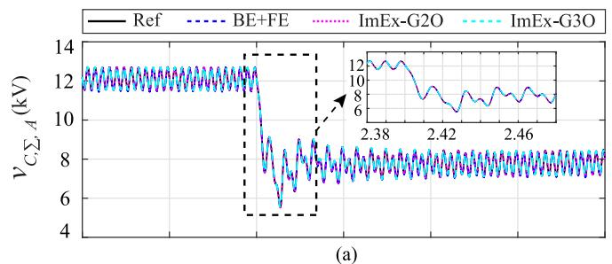

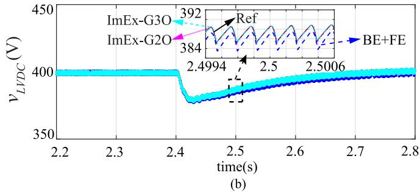  
Fig. 21. SST DC-link voltages under single-phase-to-ground AC fault in phase-A. (a) Summation of MVdc-link capacitor voltage. (b) LVdc-link capacitor voltage.

during both the steady-state period and voltage sag transient than that of the BE+FE solver.

6) Validation of SFB-DEM With High Switching Frequency: To further validate the modeling accuracy of the proposed DEMs, a case study is conducted with increased switching frequency of the DAB modules, i.e., 40 kHz, as presented in Case 2 of Table IX in the Appendix. To ensure there is a sufficient number of computation points in each switching cycle, the simulation time step in Case 2 is reduced to 500 ns in accordance with the smaller switching period of 40 kHz. Thus, there are 50 computation points per switching cycle for the proposed DEMs, which is consistent with Case 1. The reference model is simulated with a small time step of 200 ns, leading to 125 computation points per switching cycle.

The simulation results of the SST with increased switching frequency (40 kHz) of the DAB modules are illustrated in Fig. 22, where the discrepancy in numerical accuracy for the DEMs with different ODE solvers, i.e., BE+FE, ImEx-G2O, and ImEx-G3O are observed. As shown in Fig. 22, the SFB-DEM using ImEx-G3O demonstrates the best accuracy. On the contrary, obvious magnitude differences are observed in the simulation results using the BE+FE solver compared to the reference, since it only achieves 1st-order numerical accuracy.

7) Validation of Switching Interpolation Technique: This section validates the effectiveness of the switching interpolation technique in the SST SFB-DEM using ImEx-G3O method. The dynamic performance with and without switching interpolation is compared in the case study. The real power reference is commanded to step down from 1 to 0.8 p.u. at t = 2 s. The tested models are simulated with the time step of $5 ~ \mu \mathrm { s }$ and compared against a reference model with the time step of 1 μs.

It is noted in Fig. 23 that the simulation results without interpolation (blue dashed curve) get distorted dramatically

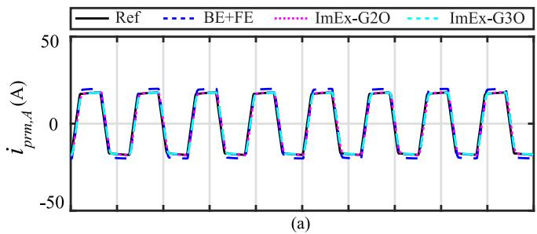

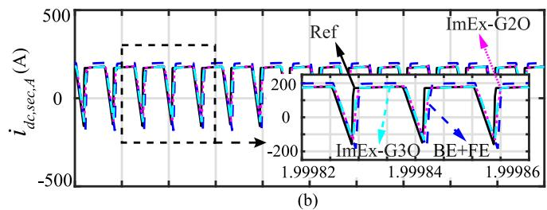

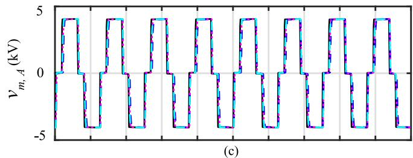

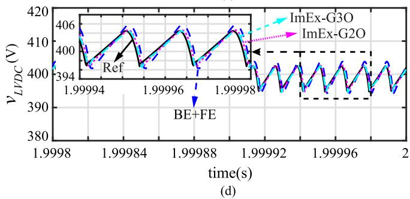  
Fig. 22. Simulation performances of SST with 40 kHz switching frequency. (a) DAB primary AC current. (b) DAB secondary DC current. (c) DAB magnetizing-branch voltage. (d) LVdc-link capacitor voltage.

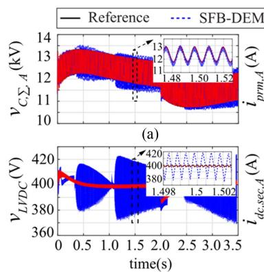  
（C）

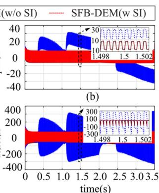  
(d)   
Fig. 23. Validation of switching interpolation technique. (a) Summation of MVdc-link capacitor voltages. (b) DAB primary AC current. (c) LVdc-link capacitor voltage. (d) DAB secondary-side DC current.

TABLE VIII CPU EXECUTION TIME COMPARISONS FOR MULTIMODULE SST SIMULATION   

<table><tr><td>Number of SMs (3 phases)</td><td>15</td><td>30</td><td>45</td><td>60</td></tr><tr><td>MATLAB/Simulink
DM reference (TR)</td><td>134.71 s</td><td>571.67 s</td><td>1589.44 s</td><td>4065.89 s</td></tr><tr><td>VG-DEM (TR)</td><td>44.69 s</td><td>89.53 s</td><td>133.97 s</td><td>179.47 s</td></tr><tr><td>SFB-DEM (BE+FE)</td><td>15.80 s</td><td>18.21 s</td><td>20.64 s</td><td>23.18 s</td></tr><tr><td>SFB-DEM (ImEx-G2O)</td><td>15.97 s</td><td>18.65 s</td><td>21.00 s</td><td>23.47 s</td></tr><tr><td>SFB-DEM (ImEx-G3O)</td><td>16.49 s</td><td>19.18 s</td><td>21.45 s</td><td>23.76 s</td></tr></table>

due to inaccurate switching events detection. Comparatively, the SFB-DEM with switching interpolation (red dotted curve) demonstrates high numerical accuracy, since it matches with the reference solution, shown in Fig. 23. Moreover, this conclusion holds true across the two SST converter stages. By integrating the proposed multistep ImEx-type methods with the switching interpolation technique, the numerical accuracy of the EMT simulation is noticeably improved in the SFB-DEMs, particularly for a large time-step size.

8) Simulation Efficiency Comparison: The proposed SFB-DEMs with ImEx-type solvers not only achieve high numerical accuracy but also boost simulation efficiency significantly. As discussed previously, the computational burdens are alleviated in the proposed SFB-DEMs as they feature circuit decoupling, node elimination, and most importantly, constant nodal-network G-matrices.

Table VIII compares the CPU execution times of the SST SFB-DEMs with various ImEx-type solvers against the DM and VG-DEMs by increasing the scale of the SST with more SMs, i.e., 15, 30, 45 and 60 SMs (in three phases). For the VG-DEMs implementation, the circuit components are discretized using TR method while the semiconductor switches are represented by binary-value resistors, as demonstrated in Section II-B. Furthermore, the VG-DEMs are developed based on a 2-port Norton’s equivalent circuits to accelerate the EMT simulation [8], [9]. For all tested models, the simulation duration is set to 1 s and the time step is 1 μs.

A nearest-level-control scheme is implemented in Stage I instead of LS-PWM to approximate the insertion number of the cascaded FBSMs of ac–dc converter in Stage I. As observed in Table VIII, the execution time of the SST DM increases exponentially with the numbers of SMs. Comparatively, the VG-DEM accelerates the EMT simulation significantly. However, its variable conductance matrix limits further improvement in simulation efficiency. On the other hand, the proposed SFB-DEMs with ImEx-type solvers are shown to be superior in boosting the simulation efficiency, especially when the SST scale is large. For the SST with 60 SMs, the proposed SFB-DEM with ImEx-G3O method greatly accelerates the EMT simulation by 171 and 7.5 folds, compared to the DM and VG-DEM, respectively. Meanwhile, the simulation efficiency of the SFB-DEMs with different orders of solvers are comparable. It is noted in Table VIII that the SFB-DEMs using ImEx-G2O and ImEx-G3O methods only incur less than 3% increase in execution time compared to the one with BE+FE solver. This characteristic holds true regardless of the increase in the number of SMs of the SST.

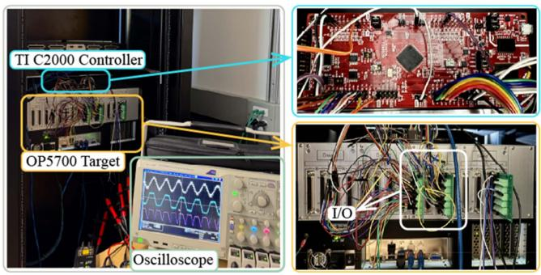  
Fig. 24. CHIL real-time simulation platform setup.

# V. DYNAMIC PERFORMANCE OF CHIL EXPERIMENTS

In order to further validate the modeling fidelity of the proposed SFB-DEMs with multistep integration methods, experimental tests of controller-hardware-in-the-loop (CHIL) simulation are performed in this section. In the CHIL case study, an SST SFB-DEM (3 SMs per phase) is programmed using MATLAB script (m-file) and executed in CPU of OPAL-RT OP5700 real-time simulator. The network solution of the SFB-DEM is formulated using the ImEx-G2O method. Meanwhile, the switching interpolation technique is implemented to locate the switching events accurately.

As shown in Fig. 24, voltage mode controls of the SST are prototyped in a digital control platform (TI DSP) to regulate MVdcand LVdc-link voltages. A Texas Instruments (TI) C2000 realtime digital microcontroller, i.e., TI LAUNCHXL-F280025C hardware is interfaced with the OP5700 real-time simulator through digital IOs.

Initially, dynamic performance of the real-time simulation has been validated against the off-line reference. Furthermore, as depicted in Fig. 8, the Stage I MVdc-link energy balance control and Stage II LVdc-link outer-loop voltage control have been replaced with the TI LAUNCHXL-F280025C digital controllers for the CHIL implementation. In this case study, the real-time simulation of the proposed SST SFB-DEM is tested with the time step of 20 μs. The real power reference is initialized at 1 p.u. and commanded to vary to 0.75 p.u. at t = 20 s, and restored back to 1 p.u. at t = 22 s.

Fig. 25 presents comparison of simulation results between CHIL tests acquired from the oscilloscope and the off-line reference. As shown in Fig. 25(a) and (b), the summation of MVdc-link capacitor voltages drops instantaneously at t = 20 s when the power reference steps down. Thereafter, the voltage magnitude gradually recovers to its rated value due to the effectiveness of the MVdc-link energy balance control. As Fig. 25(i) and (j) present, similar responses can be observed in the performances of the LVdc-link voltage, which is regulated by the outer-loop voltage control. Afterwards, both MVdc- and LVdc-link voltages recover back to their nominal values after the power reference is restored to 1 p.u. at t = 22 s. Overall, it has been validated that the performance of the CHIL experiments match well with the off-line reference during both steady-state periods and transients of the real-power-change operation.

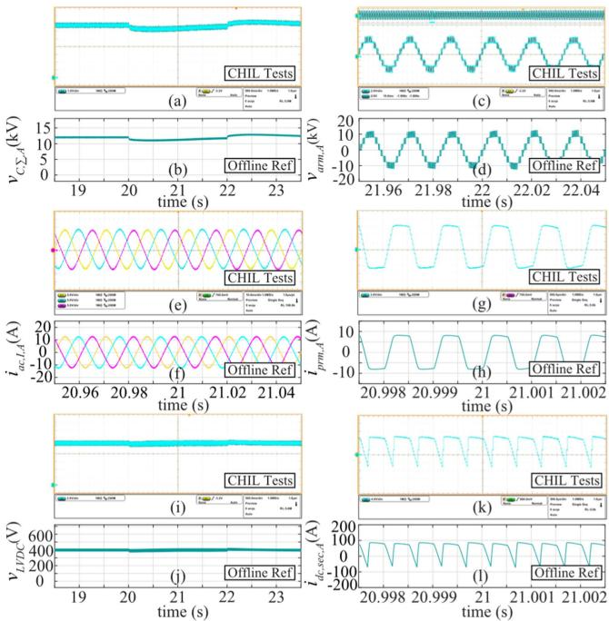  
Fig. 25. Validation of CHIL experimental results. Sum of MVdc capacitor voltages in (a) CHIL test and (b) off-line simulation. Stage I arm voltage in (c) CHIL test and (d) off-line simulation. Stage I arm current in (e) CHIL test and (f) off-line simulation. Stage II DAB primary AC current in (g) CHIL test and (h) off-line simulation. LVdc-link voltage in (i) CHIL test and (j) off-line simulation. Stage II DAB secondary-side DC current in (k) CHIL test and (l) off-line simulation.

# VI. HARDWARE VERIFICATION

This section validates the proposed DEMs using hardware tests of a scaled-down SST prototype circuit, which has singlephase chainlink circuit with three full-bridge SMs and three DAB dc–dc modules in the chainlink. A dc power supply is applied to the parallel-connected LVdc-link capacitor of the SST to send the power to the ac–dc chainlink converter in the MVac side. The hardware setup is built using Imperix power electronics testbench, controlled by OPAL-RT OP5707XG FPGA and digital I/Os, as shown in Fig. 26. The SST FB converters are realized using nine Imperix PEH4010 FB converters that are connected to external transformers, a dc power supply, and an ac-side inductive-resistive load. The OPAL-RT OP5707XG is used as a real-time controller to balance the capacitor voltages of the FBSMs and to regulate the power transferred across the DABs. The switching frequency of the DAB converter is 2 kHz, while the chainlink FBSMs use nearest level control to modulate the ac-side voltage.

Fig. 27 shows the measured ac-side chainlink (arm) voltage and current as well as the DAB primary-side current. In order to validate the proposed DEM in a dynamic case study, the ac-side modulating signal increases its frequency from 60 to 120 Hz once the steady state is reached. As shown in Fig. 27(a), the ac-side frequency step-change causes a corresponding change in the arm voltage and ac current waveforms. The hardware waveforms obtained in Fig. 27 are overlapped with the simulation results of the DM reference obtained by Simulink/Simscape

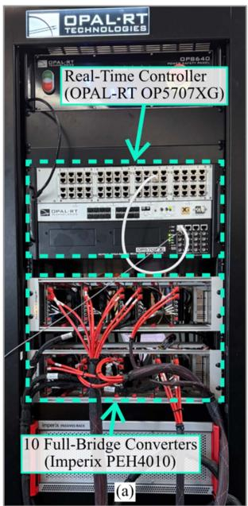

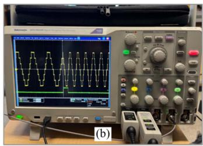

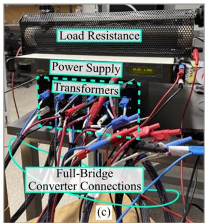  
Fig. 26. Laboratory hardware setup. (a) OPAL-RT power electronics testbench. (b) Oscilloscope measurement. (c) Electrical hardware components.

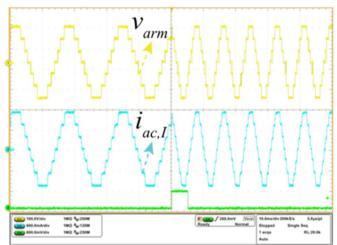

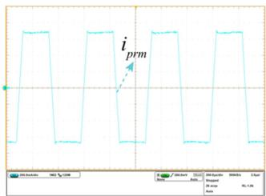  
（b)  
Fig. 27. Dynamic frequency-change system response. (a) Arm current and arm voltage. (b) DAB primary ac current.

Electrical Toolbox and the proposed SFB-DEM employing a multistep ImEx-G3O solver, as shown in Fig. 28. As shown in Fig. 28, the simulation results of the proposed SFB-DEM align well with those of the hardware and the DM reference. Hence, the modeling fidelity of the proposed SFB-DEM has been further validated by laboratory hardware results.

# VII. DISCUSSION

This section presents the analysis of the stability regions for various explicit-type integration methods including FE, 2nd-order Adams-Bashforth, 3rd-order Adams-Bashforth, the Ex-G2O, the Ex-G3O, and the implicit-type solvers including implicit Gear’s 2nd-order (Im-G2O) and implicit Gear’s 3rdorder methods, as shown in Fig. 29. The derivation of numerical stability regions of the Ex-G2O is given below as example. The derivation of numerical stability regions of the Ex-G3O is omitted for space consideration, but can be derived following the same procedure for Ex-G2O stability analysis. A general

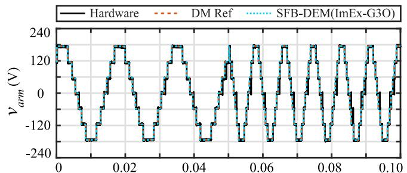

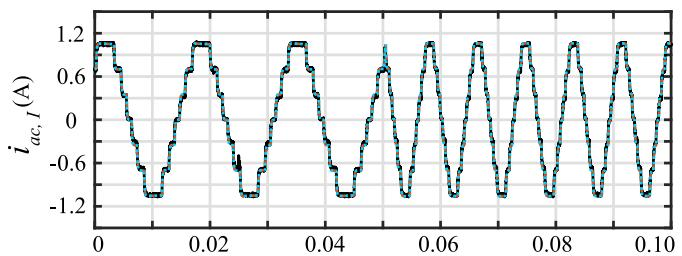

  
  
Fig. 28. Hardware validation results. (a) AC-side arm voltage. (b) AC-side current. (c) DAB AC primary transformer current.

  
Fig. 29. Stability regions of numerical integration methods. (a) Explicit integration methods. (b) Implicit Gear’s 2nd order method. (c) Implicit Gear’s 3rd order method.

formula of Ex-G2O integration method is provided in (26), where $t _ { k + 1 }$ 1 denotes the present simulation step

$$
\begin{array}{l} y \left(t _ {k + 1}\right) = \left(\frac {4}{3} y \left(t _ {k}\right) - \frac {1}{3} y \left(t _ {k - 1}\right)\right) + \frac {2 \Delta t}{3} \\ \cdot \left(2 f \left(y \left(t _ {k}\right)\right) - f \left(y \left(t _ {k - 1}\right)\right)\right). \tag {26} \\ \end{array}
$$

The stability parameter is denoted by $Z _ { \mathrm { E x G 2 O } }$ and computed in (27), where $\lambda _ { \mathrm { E x G 2 O } }$ denotes the eigenvalue of the ODE system using Ex-G2O method

$$
Z _ {\mathrm {E x G 2 O}} = \lambda_ {\mathrm {E x G 2 O}} \Delta t. \tag {27}
$$

By employing standard linear equation, $\begin{array} { r l } { f } & { { } ( y ) = { \frac { d y } { d t } } } \end{array} =$ λExG2O y in (26)

$$
\begin{array}{l} y \left(t _ {k + 1}\right) = \left(\frac {4}{3} y \left(t _ {k}\right) - \frac {1}{3} y \left(t _ {k - 1}\right)\right) + \frac {2 \Delta t}{3} \\ \cdot \left(2 \lambda_ {\mathrm {E x G 2 O}} \cdot y \left(t _ {k}\right) - \lambda_ {\mathrm {E x G 2 O}} \cdot y \left(t _ {k - 1}\right)\right) \\ = \frac {1}{3} \left[ \left(4 + 4 Z _ {\mathrm {E x G 2 O}}\right) \cdot y \left(t _ {k}\right) - \left(1 + 2 Z _ {\mathrm {E x G 2 O}}\right) \cdot y \left(t _ {k - 1}\right) \right]. \tag {28} \\ \end{array}
$$

Substituting $y ( t _ { k + 1 } )$ with $\xi ^ { k + 1 }$ where $\xi$ is amplification factor, the characteristic equation can be derived from (28) as

$$
\begin{array}{l} \xi^ {k + 1} - \frac {1}{3} \cdot (4 + 4 Z _ {\mathrm {E x G 2 O}}) \cdot \xi^ {k} + \frac {1}{3} \\ \cdot \left(1 + 2 Z _ {\mathrm {E x G} 2 \mathrm {O}}\right) \cdot \xi^ {k - 1} = 0. \tag {29} \\ \end{array}
$$

The characteristic equation of Ex-G2O can be obtained by dividing $\xi ^ { k - 1 }$ at both sides of (29) as

$$
3 \xi^ {2} - \left(4 + 4 Z _ {\mathrm {E x G} 2 \mathrm {O}}\right) \cdot \xi + \left(1 + 2 Z _ {\mathrm {E x G} 2 \mathrm {O}}\right) = 0. \tag {30}
$$

The stability region of the Ex-G2O method can be plotted in complex z-plane. This method is stable for all values of z when the roots of the characteristic (30) satisfy

$$
\left| \xi \left(Z _ {\mathrm {E x G} 2 \mathrm {O}}\right) \right| \leq 1. \tag {31}
$$

The numerical stability regions of various integration methods are plotted in Fig. 29 as the shaded areas. As shown in Fig. 29, the stability regions decrease when the orders of the explicit integration methods increase. In comparison of various explicit integration methods, the 1st-order FE method processes the largest stability region. It is also noted that the Explicit Gear’s methods always have larger stability region than those of the AB methods with the same numerical order. Meanwhile, as observed in Fig. 29(b) and (c), the stability region of the Im-G2O occupies the whole left-half plane while the stability region of the Im-G3O covers a majority of the left-half plane. Hence, it further explains why the combined ImEx-type multistep Gear’s methods become an appropriate choice for formulating network solutions of the proposed SFB-DEMs. However, when a dc-link capacitor is subjected to fast transient, such as short-circuit/shoot-through fault, numerical instability may occur when the multistep explicit-type methods are used to discretize the dc-link capacitors. In order to avoid numerical instability, either the simulation time steps have to be reduced to capture the fast short-circuit transient or the explicit integration method needs to be replaced by an implicit integration method, such as TR for discretizing the dc-link capacitor.

# VIII. CONCLUSION

This article proposes an SFB-DEM with multistep ImEx Gear’s solver for numerically efficient and accurate EMT simulation of multimodule SST. Converter circuit decoupling is achieved by applying explicit G2O or G3O to integrate dc-link capacitor voltages. The use of switching function to model the FBSMs achieves significant node number reduction and constant nodal-network G-matrix, which accelerates the EMT simulation of the SST. Meanwhile, the use of implicit G2O or G3O methods for the other circuit elements than the dc-link capacitors improve the numerical accuracy, compared to the 1st order methods, e.g., FE and BE methods and is immune to fictitious numerical oscillations compared to the TR method. The switching interpolation technique is proposed and integrated to the ImEx-G2O and ImEx-G3O solvers to improve numerical accuracy for large-time-step simulation. The simulation accuracy and efficiency of the proposed SFB-DEMs are validated by performing multiple off-line case studies and CHIL experiment tests. It is shown in the case studies that the proposed SFB-DEM with ImEx-Gear’s methods achieve significant speedups in EMT simulation (e.g., 171 and 7.5 folds by ImEx-G3O), compared to the DM and VG-DEM for the SST with 60 SMs, respectively.

# APPENDIX

TABLE IX SYSTEM PARAMETERS OF MULTIMODULE SST   

<table><tr><td>Items</td><td>Symbols</td><td colspan="2">Values</td></tr><tr><td>MVDC-link rated voltage</td><td>vMVDC</td><td colspan="2">4 kV</td></tr><tr><td>LVDC-link rated voltage</td><td>vLVDC</td><td colspan="2">0.4 kV</td></tr><tr><td>Number of SMs per phase</td><td>Nsm</td><td colspan="2">3</td></tr><tr><td>MVAC line inductance</td><td>Lac</td><td colspan="2">250 mH</td></tr><tr><td>Stage I carrier frequency</td><td>fI</td><td colspan="2">5 kHz</td></tr><tr><td>Transformer turns ratio</td><td>Nr</td><td colspan="2">10</td></tr><tr><td rowspan="2">Transformer primary and secondary leakage inductances</td><td>Llk,pm</td><td rowspan="2" colspan="2">21 mH</td></tr><tr><td>Llk,sec</td></tr><tr><td colspan="2">Case Studies</td><td>Case 1</td><td>Case 2</td></tr><tr><td>Stage II DAB switching frequency</td><td>fDAB</td><td>2 kHz</td><td>40 kHz</td></tr><tr><td>MVDC-link capacitance</td><td>C1</td><td>37.5 μF</td><td>187.5 μF</td></tr><tr><td>LVDC-link capacitance</td><td>C2</td><td>11.2 mF</td><td>0.56 mF</td></tr><tr><td>Real power rating</td><td>Pref</td><td>180 kW</td><td>450 kW</td></tr><tr><td>LVDC-side load</td><td>RLoad</td><td>0.889 Ω</td><td>0.3556 Ω</td></tr><tr><td>Time step of reference</td><td>Ts,ref</td><td>1 μs</td><td>200 ns</td></tr><tr><td>Time step of tested models</td><td>Ts</td><td>10 μs</td><td>500 ns</td></tr></table>

# REFERENCES

[1] X. She, A. Q. Huang, and R. Burgos, “Review of Solid-State Transformer technologies and their application in power distribution systems,” IEEE J. Emerg. Sel. Topics Power Electron., vol. 1, no. 3, pp. 186–198, Sep. 2013.   
[2] J. E. Huber and J. W. Kolar, “Applicability of solid-State transformers in today’s and future distribution grids,” IEEE Trans. Smart Grid, vol. 10, no. 1, pp. 317–326, Jan. 2019.   
[3] S. Falcones, X. Mao, and R. Ayyanar, “Topology comparison for solid state transformer implementation,” in Proc. IEEE PES Gen. Meeting, 2010, pp. 1–8.   
[4] M. A. Hannan, P. J. Ker, M. S. H. Lipu, Z. H. Choi, M. S. A. Rahman, and K. M. Muttaqi, “State of the art of solid-State transformers: Advanced topologies, implementation issues, recent progress and improvements,” IEEE Access, vol. 8, pp. 19113–19132, 2020.

[5] K. G. D, S. T N, and N. N, “Solid State transformers for smart grid control and applications — A review,” in Proc. Int. Conf. Futuristic Tech. Control Sys. Renewable Energy, 2022, pp. 1–6.   
[6] A. R. Rodríguez Alonso, J. Sebastian, D. G. Lamar, M. M. Hernando, and A. Vazquez, “An overall study of a dual active bridge for bidirectional DC/DC conversion,” in Proc. IEEE Energy Convers. Congr. Expo., 2010, pp. 1129–1135.   
[7] B. Zhao, Q. Song, W. Liu, and Y. Sun, “Overview of dual-activebridge isolated bidirectional DC–DC converter for high-frequency-link power-conversion system,” IEEE Trans. Power Electron., vol. 29, no. 8, pp. 4091–4106, Aug. 2014.   
[8] J. Xu et al., “High-speed electromagnetic transient (EMT) equivalent modelling of power electronic transformers,” IEEE Trans. Power Del., vol. 36, no. 2, pp. 975–986, Apr. 2021.   
[9] C. Gao, M. Feng, J. Ding, H. Zhang, J. Xu, and C. Zhao, “Accelerated electromagnetic transient (EMT) equivalent model of solid-state transformer,” IEEE J. Emerg. Sel. Topics Power Electron., vol. 10, no. 4, pp. 3721–3732, Aug. 2022.   
[10] M. Feng, C. Gao, J. Xu, C. Zhao, and G. Li, “A novel decoupled EMT approach and parallel simulation framework for modularized solid-state transformers,” IEEE Trans. Power Del., vol. 38, no. 5, pp. 3285–3295, Oct. 2023.   
[11] P. Pejovic and D. Maksimovic, “A method for fast time-domain simulation of networks with switches,” IEEE Trans. Power Electron., vol. 9, no. 4, pp. 449–456, Jul. 1994.   
[12] P. Pejovic and D. Maksimovic, “A new algorithm for simulation of power electronic systems using piecewise-linear device models,” IEEE Trans. Power Electron, vol. 10, no. 3, pp. 340–348, May 1995.   
[13] L. Qi, S. Woodruff, and M. Steurer, “Study of power loss of small time-step VSC model in RTDS,” in Proc. IEEE Power Eng. Soc. Gen. Meeting, 2007, pp. 1–7.   
[14] W. Li and J. Bélanger, “An equivalent circuit method for modelling and simulation of modular multilevel converters in real-time HIL test bench,” IEEE Trans. Power Del., vol. 31, no. 5, pp. 2401–2409, Oct. 2016.   
[15] R. Parvari, S. Filizadeh, and D. Muthumuni, “An accelerated detailed equivalent model for modular multilevel converters,” Electric Power Syst. Res., vol. 223, 2023, Art. no. 109648.   
[16] F. Zhang and W. Li, “An equivalent circuit method for modeling and simulation of dual active bridge converter based marine distribution system,” in Proc. IEEE Electric Ship Technol. Symp., 2019, pp. 382–387.   
[17] X. Meng and W. Li, “Equivalent circuit modeling method for real-time simulation of multi-active bridge based solid-state transformer,” in Proc. IEEE Appl. Power Electron. Conf. Expo., 2022, pp. 798–802.   
[18] E. Hairer and G. Wanner, Solving Ordinary Differential Equations II: Stiff and Differential Algebraic Problems (Springer Series in Computational Mathematics), 2nd rev. ed. New York, NY, USA: Springer, 2002.   
[19] J. R. Marti and J. Lin, “Suppression of numerical oscillations in the EMTP power systems,” IEEE Trans. Power Syst., vol. 4, no. 2, pp. 739–747, May 1989.   
[20] L. F. R. Ferreira et al., “Comparative solutions of numerical oscillations in the trapezoidal method used by EMTP-based programs,” in Proc. Int. Conf. Power Syst. Transients, 2015, pp. 147–153.   
[21] J. Tant and J. Driesen, “On the numerical accuracy of electromagnetic transient simulation with power electronics,” IEEE Trans. Power Del., vol. 33, no. 5, pp. 2492–2501, Oct. 2018.   
[22] U. M. Asher, S. J. Ruuth, and B. T. R. Wetton, “Implicit-explicit methods for time-dependent partial differential equations,” SIAM J. Numer. Anal., vol. 32, no. 3, pp. 797–823, 1995.   
[23] B. Li, K. Wang, and Z. Zhou, “Long-time accurate symmetrized implicitexplicit BDF methods for a class of parabolic equations with non-selfadjoint operators,” SIAM J. Numer. Anal., vol. 58, no. 1, pp. 189–210, 2000.   
[24] B. De Kelper, L. A. Dessaint, V. Q. Do, and J. C. Soumagne, “An algorithm for accurate switching representation in fixed-step simulation of power electronics,” in Proc. IEEE Power Eng. Soc. Winter Meeting. Conf. Proc., 2000, pp. 762–767.   
[25] B. De Kelper, L. A. Dessaint, K. Al-Haddad, and H. Nakra, “A comprehensive approach to fixed-step simulation of switched circuits,” IEEE Trans. Power Electron., vol. 17, no. 2, pp. 216–224, Mar. 2002.   
[26] A. M. Gole, I. T. Fernando, G. D. Irwin, and O. B. Nayak, “Modeling of power electronic apparatus: Additional interpolation issues,” in Proc. Int. Conf. Power Syst. Transients, Jun. 1997, pp. 23–28.   
[27] C. Dufour, J. Mahseredjian, and J. Bélanger, “A combined State-space nodal method for the simulation of power system transients,” IEEE Trans. Power Del., vol. 26, no. 2, pp. 928–935, Apr. 2011.

[28] W. Li and F. Zhang, “A general interpolated model of voltage source converters for real-time simulation and HIL test applications,” in Proc. IEEE Energy Convers. Congr. Expo., 2020, pp. 6155–6616.   
[29] S. Horiuchi, K. Sano, and T. Noda, “An inverter model simulating accurate harmonics with low computational burden for electromagnetic transient simulations,” IEEE Trans. Power Electron., vol. 36, no. 5, pp. 5389–5397, May 2021.   
[30] K. Sano, S. Horiuchi, and T. Noda, “Comparison and selection of grid-tied inverter models for accurate and efficient EMT simulations,” IEEE Trans. Power Electron., vol. 37, no. 3, pp. 3462–3472, Mar. 2022.   
[31] J. Xu et al., “FPGA-based submicrosecond-level real-time simulation of solid-State transformer with a switching frequency of 50 kHz,” IEEE J. Emerg. Sel. Top. Power Electron., vol. 9, no. 4, pp. 4212–4224, Aug. 2021.   
[32] Z. Li, J. Xu, K. Wang, G. Li, P. Wu, and L. Zhang, “An FPGA-based hierarchical parallel real-time simulation method for cascaded solid-State transformer,” IEEE Trans. Ind. Electron., vol. 70, no. 4, pp. 3847–3856, Apr. 2023.   
[33] B. Shang, N. Lin, and V. Dinavahi, “Detailed nonlinear modeling and high-fidelity parallel simulation of MMC with embedded energy storage for wind farm grid integration,” IEEE Open Access J. Power Energy, vol. 11, pp. 196–206, 2024.   
[34] K. Fung and S. Hui, “Fast simulation of multistage power electronic systems with widely separated operating frequencies,” IEEE Trans. Power Electron., vol. 11, no. 3, pp. 405–412, May 1996.   
[35] Z. Guo, L. Li, Z. Liu, K.-J. Li, K. Sun, and J. Feng, “Multi-time-scale electromagnetic modeling of a battery-integrated solid-State transformer,” IEEE Trans. Ind. Appl., vol. 61, no. 5, pp. 7903–7915, Sept./Oct. 2025.   
[36] H. W. Dommel, “Digital computer solution of electromagnetic transients in single-and multiphase networks,” IEEE Trans. Power App. Syst., vol. PAS-88, no. 4, pp. 388–399, Apr. 1969.   
[37] M. McGranaghan, D. Mueller, and M. Samotyj, “Voltage sags in industrial systems,” in Proc. Conf. Rec. Ind. Commercial Power Syst. Tech. Conf., 1991, pp. 18–24.   
[38] J. Pedra, L. Sainz, F. Corcoles, and L. Guasch, “Symmetrical and unsymmetrical voltage sag effects on three-phase transformers,” IEEE Trans. Power Del., vol. 20, no. 2, pp. 1683–1691, Apr. 2005.   
[39] M. T. Aung and J. V. Milanovic, “The influence of transformer winding connections on the propagation of voltage sags,” IEEE Trans. Power Del., vol. 21, no. 1, pp. 262–269, Jan. 2006.

Hengyu Li (Member, IEEE) received the B.Eng. degree in electrical engineering from Hunan University, Changsha, China, in 2018, the M.A.Sc. and Ph.D. degrees in electrical engineering from the University of British Columbia, Kelowna, BC, Canada, in 2020 and 2025, respectively.

His research interests include efficient modeling and simulation of solid-state transformer, and modular multilevel converter HVdc systems.

Walid Hatahet (Graduate Student Member, IEEE) received the B.Eng. and M.Sc. degrees in electrical engineering from Ain Shams University, Egypt, in 2016 and 2020, respectively. He is currently working toward the Ph.D. degree in electrical engineering with the University of British Columbia, Kelowna, BC, Canada.

His research interests include modular multilevel converter, HVdc applications, high-performance computing, and numerically efficient model development.

Jared J. Paull (Graduate Student Member, IEEE) received the B.A.Sc. degree in electrical engineering from the University of British Columbia, Kelowna, BC, Canada, in 2022. He is currently working toward the Ph.D. degree in electrical engineering and specialized in power electronics modeling, control, and real-time simulation with the University of British Columbia, Kelowna, BC, Canada.

His research interests include simulation of power electronic systems for offline and real-time applications, power converter modeling, and efficient power

electronic converter topologies.

Fei Zhang (Member, IEEE) received the B.S. and M.S. degrees in electrical engineering from Tsinghua University, Beijing, China, in 2009 and 2012, respectively, and the Ph.D. degree in electrical engineering from McGill University, Montreal, Canada, in 2018.

From 2018 to 2020, he was a specialist in modeling and electrical simulation with Opal-RT Technologies, Montreal, Canada. Since 2020, he has been an Associate Professor with School of Electrical Engineering, Southeast University, Nanjing, China. His research interests include HVdc converters, high power electronics, and real-time simulation.

Yuanshi Zhang (Member, IEEE) received the B.Eng. and M.A.Sc. degrees in electrical engineering from the Harbin Institute of Technology, Harbin, China, in 2013 and 2015, respectively, and the Ph.D. degree in electrical engineering from the University of British Columbia, Vancouver, BC, Canada, in 2021.

Since 2021, he has been an Associate Professor with the School of Electrical Engineering, Southeast University, Nanjing, China. His research interests include power system optimization and control, HVDC system, and demand side management.

Liwei Wang (Senior Member, IEEE) received the Ph.D. degree in electrical and computer engineering from the University of British Columbia, Vancouver, BC, Canada, in 2010.

In 2010, he joined the ABB Corporate Research Center, Västerås, Sweden, as a Scientist and then as a Senior Scientist. Since 2014, he has been with the School of Engineering, the University of British Columbia, Kelowna, BC, Canada, where he is presently an Associate Professor. His research interests include power system modeling and simulation;

electrical machines and drives; utility power electronics applications and distributed generation.

Wei Li (Member, IEEE) received the B.Eng. degree in electrical engineering from Zhejiang University, Hangzhou, China, in 1996, the M.Eng. degree in electrical engineering from the National University of Singapore, Singapore, in 2003, and the Ph.D. degree in electrical engineering from McGill University, Montreal, QC, Canada, in 2010.

He is a Senior Power System Simulation Specialist with Opal-RT Technologies, Montréal. His fields of interests include power electronics, renewable energy, and distributed generation. His current research

focuses mainly on real-time simulation and controls of modular multilevel converter HVDC systems and FACTS devices.