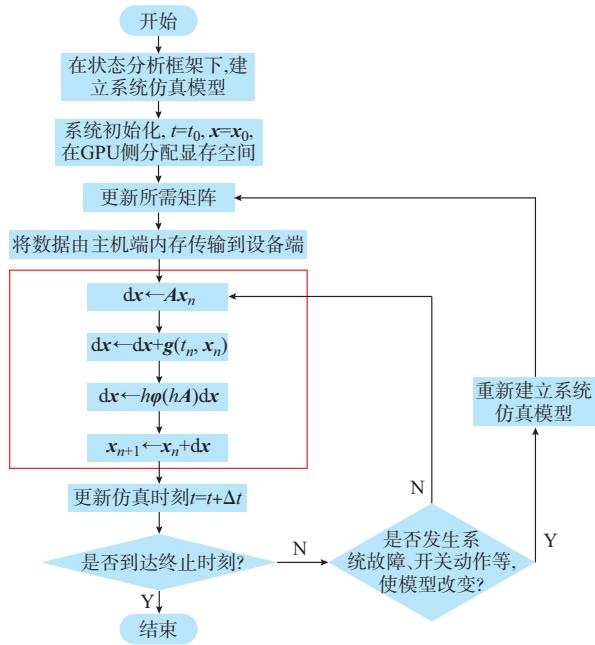
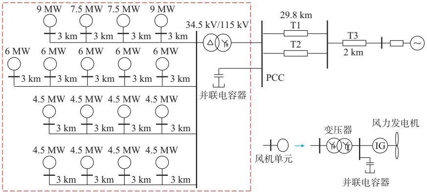
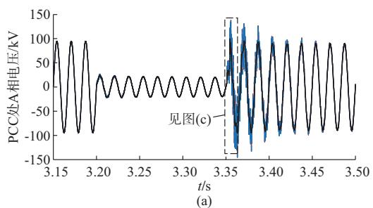
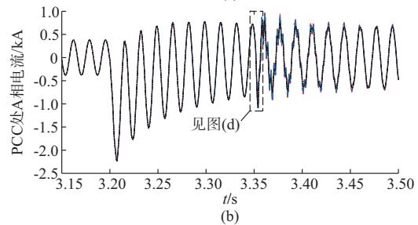
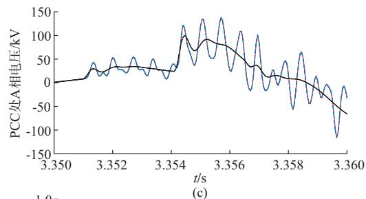
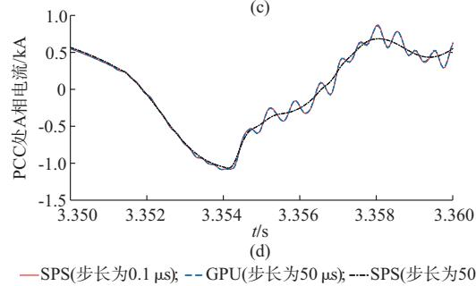

# 面向指数积分方法的电磁暂态仿真GPU并行算法

赵金利1,刘君陶1,李 鹏1,富晓鹏1,王成山1,宋 毅2

智能电网教育部重点实验室 天津大学 天津市 国网经济技术研究院有限公司 北京市

摘要:为满足对大规模可再生能源接入的电力系统进行快速电磁暂态仿真的需求,提出了一种面向指数积分方法的电力系统电磁暂态仿真图形处理器( )并行算法.首先,分析了矩阵指数积分算法求解过程所具有的高度数据并行性,进而将该特性与 计算资源相结合;利用 处理指数积分方法求解时所需的大规模矩阵运算,而将较为复杂的系统状态判别与更新保留在中完成,有效提升了仿真计算速度.最后,分别针对 台和 台风机的风电场算例进行了测试,验证了所提并行算法的正确性和有效性,同时也说明了算法的加速效果会随着系统规模的增加而愈发明显.

关键词:指数积分;电磁暂态仿真;图形处理器( );并行计算

# 0 引言

近年来,随着可再生能源的大规模接入及交直流互联电网的运行规模不断增加 同时考虑到电力电子化电力系统的发展趋势 电力能源系统正面临着前所未有的复杂动态特性的耦合及其运行控制方面的挑战[1].而基于元件详细动态特性建模的电力系统电磁暂态仿真因其能够准确刻画微秒级的系统快动态过程 正逐渐在新能源电力系统的分析 设计与运行等方面获得更加广泛的重视与应用[2].同时 电磁暂态仿真在计算效率方面的矛盾也随着电网规模及复杂性的增加和所关注动态过程时间尺度的延伸而愈发突出 传统的电磁暂态仿真方法已很难满足要求[3]

目前 提高电磁暂态仿真的效率主要从以下两个维度考虑 一是通过仿真算法的改进 如采用模型化简[4] 高效的数值算法[5]等 二是利用并行的硬件环境 如 集 群 计 算[6] 现 场 可 编 程 门 阵 列[7] 图形处理器 [8]等并行计算资源提高计算效率 由于电磁暂态仿真的计算量随系统规模迅速增大 单纯依靠算法的改进可能较难取得满意的加速效果[9] 因此 并行计算资源及方法便成为解决电磁暂态仿真效率问题的重要手段 相比于 , 的计算单元更丰富、峰值性能更强

大,更适合处理规模较大但流程简单的计算问题[10] 此外 的软件开发可以基于等成熟的编程语言 设计方式更加灵活简单 近年来, 的性能得到了飞速的发展,由于拥有数量众多的计算核心 它在通用科学计算方面展示出了强大的计算潜力 其性能已超越同时期的 [10]此外 统一计算设备架构 [11]的问世也推动了 在一般通用计算中的应用 提供的并行计算资源是当前及未来高性能计算的重要发展方向之一[10,12]

在电力领域 并行计算方法近年来被广泛应用于包括潮流计算[13]、暂态稳定性分析[14]、电磁暂态仿真[15G17]等多种场合 文献 根据电磁暂态仿真的原理与特点设计了一种 与 混合的仿真方法 利用 求解节点电导方程 明显提高了仿真效率.文献[ ]在文献[ ]的基础上,提出了基于 的细粒度并行仿真方法 减少了与 之间的数据通信 进一步加快了仿真速度 文献 提出一种高效的节点映射结构将待求解的电导矩阵转化为适于 处理的稀疏格式进行并行处理

在暂态仿真算法的效率提升方面 主要的思路包括系统等值[18]、电磁机电混合仿真[19]、多速率方法[20],以及对于电力电子装置采用动态平均模型[21] 等值加速模型[22]等 对于数值算法 矩阵指数类积分方法[23]的基本思想是使用矩阵指数算子对微分方程中线性部分的演化进行精确处理 具有良好的数值精度和数值稳定性 基于该思想可以发

展出一系列拥有同梯形法一样 稳定的指数积分方法,较为适宜处理刚性问题[24G25].此外,该方法由于涉及大量矩阵向量的乘法 向量加法等运算 具有很高的数据并行度 为此 本文提出了一种面向指数积分方法的电磁暂态仿真 并行算法 首先 分析了指数积分算法的特点及数据的并行性 进而将其与 的并行处理相结合 并针对大规模风电场算例进行了分析验证,通过与 脚本语言实现的指数积分串行程序和在( )上搭建的相同算例进行对比 说明本文方法的正确性和有效性

# 1 高数据并行度的指数积分方法

# 1??1 基于矩阵指数算子的数值积分公式

现代电力系统中 随着系统模型复杂程度的增加 动态过程的多时间尺度特性更加明显 系统模型表现出较强的刚性[26] 随着电磁暂态仿真的复杂程度不断提升,更多高效的数值算法不断被提出并获得应用 其中 文献 提出了基于指数积分的电磁暂态仿真方法 并取得了良好的数值精度和计算效率 该方法是一种适合处理电磁暂态模型刚性特征的数值积分方法 通过矩阵指数算子的引入克服了系统刚性对算法数值稳定性的影响 使得仿真过程可以采用较大的步长进行计算 同时 通过对系统的线性动态过程进行精确求解,避免了传统数值积分方法所遇到的局部截断误差问题,使算法具有很高的数值精度[28G29].此外,该方法尤其适于类似风电场等大规模高维非线性问题 且具有良好的数值性能 仿真计算速度得到明显提升[30]

不同于 类程序 指数积分方法主要基于状态分析框架[28],此时系统的仿真模型可以用式 所示的非线性微分方程组描述

$$
\left\{ \begin{array}{l} \dot {\boldsymbol {x}} (t) = \boldsymbol {F} (t, \boldsymbol {x} (t)) = \boldsymbol {A} \boldsymbol {x} (t) + \boldsymbol {g} (t, \boldsymbol {x} (t)) \\ \boldsymbol {x} (t _ {0}) = \boldsymbol {x} _ {0} \end{array} \right. \tag {1}
$$

式中 x 为系统的状态变量 $x _ { 0 }$ 为状态量的初值 矩阵 A 代表原微分方程组中的线性部分 其含义是状态量之间的相互耦合关系 包含了模型中的主要信息 ${ \bf \nabla } _ { \bf { \cdot } } g _ { \bf { \sigma } } ( t , { \bf { \cdot } } x )$ 代表状态量耦合的非线性部分

该系统的准确动态响应可用矩阵指数算子和卷积运算解析表示为式 所示的 积分方[31] 。

$$
\boldsymbol {x} (t) = \mathrm {e} ^ {(t - t _ {0}) \boldsymbol {A}} \boldsymbol {x} _ {0} + \int_ {t _ {0}} ^ {t} \mathrm {e} ^ {(t - \tau) \boldsymbol {A}} \boldsymbol {g} (\tau , \boldsymbol {x} (\tau)) \mathrm {d} \tau \tag {2}
$$

指数积分算法将矩阵指数算子 $\mathrm { e } ^ { t A }$ 引入积分方案得到式 所示积分方程 由于式 对于 x t是隐式的 需要数值近似来计算涉及非线性部分

${ \pmb g } \left( \tau , { \pmb x } \left( \tau \right) \right)$ 的卷积项。基于此，文献[23]还提出了指数 法,指数梯形法和指数一般线性方法等不同算法.在保证计算精度的前提下,由于指数 为单步法 且可利用 函数将积分方程化为不含矩阵指数的形式 极大提升了计算效率特别是指数 公式涉及的矩阵计算的高度并行性 极为适合采用 并行求解 因此 本文将重点面向该方法提出其 并行计算策略 其他的指数类积分方法在 并行策略方面具有相似性.

# 1??2 指数Euler方法

指数 公式在时间间隔 $[ t _ { n } , t _ { n + 1 } ]$ 内 对式()中随时间变化的非线性部分 ${ \pmb g } \left( \tau , { \pmb x } \left( \tau \right) \right)$ )近似处理为不变量 $\mathbf { g } \left( t _ { n } , \pmb { x } _ { n } \right)$ ),并将 φ 族函数 $\pmb { \varphi } _ { k } \left( t \pmb { A } \right)$ )引入积分公式.其中 ${ \pmb x } _ { n } \in { \pmb R } ^ { N }$ 是精确值 $\textstyle { x \left( t _ { n } \right) }$ )的数值近似 指数 积分公式如下

$$
\boldsymbol {x} _ {n + 1} = \mathrm {e} ^ {h _ {n} \boldsymbol {A}} \boldsymbol {x} _ {n} + h _ {n} \boldsymbol {\varphi} _ {1} \left(h _ {n} \boldsymbol {A}\right) \boldsymbol {g} \left(t _ {n}, \boldsymbol {x} _ {n}\right) \tag {3}
$$

式中: $\smash { \mathsf { \ell } _ { 2 } h _ { n } = t _ { n + 1 } - t _ { n } }$ 为该步的仿真步长.

$\pmb { \varphi } _ { 1 }$ 为 $\varphi$ 族函数的第一函数，定义如下[32]：

$$
\boldsymbol {\varphi} _ {k} (h \mathbf {A}) = \int_ {0} ^ {1} \mathrm {e} ^ {h (1 - \theta) \mathbf {A}} \frac {\theta^ {k - 1}}{(k - 1) !} \mathrm {d} \theta \quad k \geqslant 1 \tag {4}
$$

族函数的递推关系如式 所示

$$
z \boldsymbol {\varphi} _ {k + 1} (z) = \boldsymbol {\varphi} _ {k} (z) - \boldsymbol {\varphi} _ {k} (0) \tag {5}
$$

其中,令 $\pmb { \varphi } _ { \mathrm { 0 } } \left( z \right) = \mathrm { e } ^ { z }$ ,则式()可以推导为如下形式:

$$
\boldsymbol {x} _ {n + 1} = \boldsymbol {x} _ {n} + h _ {n} \boldsymbol {\varphi} _ {1} \left(h _ {n} \boldsymbol {A}\right) \left(\boldsymbol {A} \boldsymbol {x} _ {n} + \boldsymbol {g} \left(t _ {n}, \boldsymbol {x} _ {n}\right)\right) \tag {6}
$$

指数 法是显式方法,拥有同隐式梯形法一样的 稳定性,适合处理刚性问题[33].此外,该方法采用数值近似求解基于指数函数的积分方程式 等 价 于 原 始 的 非 线 性 微 分 方 程式 [28] 可以看到 式 中仅涉及矩阵与向量乘法及加法运算 在实际编程实现过程中 式 可被分为以下 个部分

1 $\scriptstyle \ d \mathbf { d } \mathbf { x }  \mathbf { A } \mathbf { x } _ { n }$ 为稀疏矩阵向量乘法  
) $\vert \pmb { x } \ll \mathrm { d } \pmb { x } + \pmb { g } \left( t _ { n } , \pmb { x } _ { n } \right)$ )为向量更新与向量加法 环节.   
3 $\mathrm { d } \boldsymbol { x }  h \varphi ( h A ) \mathrm { d } \boldsymbol { x }$ 为稠密矩阵向量乘法  
) $\mathbf { x } _ { n + 1 } {  } \mathbf { x } _ { n } + \mathrm { d } \mathbf { x }$ 为向量加法,得到下一时步的状态向量.

在式 中 对于矩阵向量乘法 若 $n \times n$ 阶矩阵与n 维向量相乘 一次乘法和加法运算时间为一个单位时间,则串行算法的时间复杂度为 $O \left( n ^ { 2 } \right)$ ).在计算过程中 矩阵每一行与向量间的运算互不影响 且矩阵每一行中的各个元素与向量中元素相乘亦可同时独立计算 具有很高的数据并行度 而对于向量间的加法 其各个元素间相加也相互独立 拥

有较高的并行度 面向指数积分方法的计算求解过程整体上具有很高的数据并行度 可以将被求解问题分解为若干任务 有助于充分利用大规模处理器同时处理 将该方法与 并行计算资源相结合 可极大程度地发挥 的高效计算能力 对于大规模电磁暂态仿真效率的提升将具有很大帮助此外 对于较复杂的系统状态判断和更新环节 可将其保留在 中进行计算 以节约计算时间 在整体上提升了计算效率

# 2 指数积分方法的GPU并行策略

根据 的结构及工作原理 其更适合处理可拆解为海量的数据不相关 高并行度及流程控制等简单的计算问题 而对一些复杂的串行计算 逻辑判断等任务的计算效率则相对较低 由于前述式 的高数据并行度 且其中的矩阵 A 为稀疏矩阵,hφ(hA)为稠密矩阵,特别适合在 上实现并行处理 由于 与 之间的数据传输需要消耗较长的时间 因此电磁暂态仿真的大部分计算过程将在 中完成.具体的算法流程如下.

步骤 在状态分析框架下 对待仿真的电力系统建立电磁暂态仿真模型

步骤 :完成系统初始化过程,分别在主机端分配内存空间 在设备端分配显存空间 用于存放矩阵 状态变量 输出向量等

步骤 更新计算所需矩阵

步骤 :将数据从主机端传输到设备端.

步骤 在 中并行计算当前 t 时刻稀疏矩阵A 与向量 x 的乘法运算 结果存放在 存储空间.

步骤 完成向量 ${ \bf g } \left( t , { \bf x } _ { n } \right)$ 的更新 以及向量 x和 之间的相加运算

步骤 :计算稠密矩阵向量乘法 $h \pmb { \varphi } ( h \pmb { A } ) \mathrm { d } \pmb { x }$ .

步骤 进行向量加法 x x 运算 从而得到下一时刻的状态变量 x

步骤 :更新仿真时刻 $t = t + \Delta t$ .

步骤 判断仿真时间是否到达终止时刻 若是则转到步骤 否则转到下一步

步骤 进行系统状态判断 是否有故障或开关操作发生

步骤 若系统状态发生改变 则重新建立系统仿真模型,转至步骤 ,否则直接转到步骤 .

步骤 仿真结束

图 给出了本文提出的面向指数积分方法的电磁暂态仿真 并行算法的计算流程 在该算法中 式 的计算时间所占比重较大 加速该过程可

有效提高仿真速度 因此 将其分为 步 分别在上完成计算 并将结果保存在 的存储空间 图 中方框内的部分 步骤 至步骤 即代表此过程 并与上节所述的 个计算步骤对应 对于稀疏矩阵 A 还可以利用压缩稀疏行 格式存储处理 以进一步提升计算效率 对其他的计算步骤 如判断系统状态 更新仿真模型及矩阵 由于涉及较为复杂的串行计算和逻辑判断 在 上的计算效率较低 因此这些部分仍在 上执行 并将更新后的矩阵传输到设备端上 进行 的并行处理

  
图1 面向指数积分方法的电磁暂态仿真GPU并行算法流程  
Fig．1 FlowchartofGPUbasedparallelalgorithm orientedtoexponentialintegrationmethodfor electromagnetictransientsimulation

在 中 线程被抽象为线程格 线程块 线程 个层次 每个线程格由若干线程块组成 而每个线程块又由若干个线程组成 在资源分配过程中 需要考虑选择合适的和 大小以实现高效的并行处理性能 对于本文提出的并行方法 通过调用 的高性能函数库 以及 ,可自动完成对线程的分配与设置

# 3 算例验证与分析

本文选取文献 中的风电场测试算例 其结构如图 所示 其系统参数在附录 中给出 该风电场共包含 台风机 经功率因数校正的并联电容器与外部电网连接 其中 各元件子系统的电磁暂

态仿真建模过程详见附录 至附录 附录 为异步发电机( )组成的风机的单元建模;附录 为功率因数校正并联电容器的暂态模型 附录 为风电场中其他无源元件的模型 附录 为整体的状态方程模型 本文采用的 硬件配置和主要参数在附录 表 中给出 仿真测试环境为操作系统 采用双精度进行计算 为验证程序的正确性 在 平台上采用步长为的小步长积分作为仿真比较的基准 此外设定仿真步长 h 为 $5 0 ~ \mu \mathrm { s }$ 比较 程序与 在相同步长下的仿真精度和计算效率.其中 采

用 模式 选取 法作为差分公式.同时为了验证 并行计算的加速效果 比较了同为状态变量分析框架的指数积分算法串行程序的计算时间 语言相对于 或 语言较为低效 可能会存在计算速度偏于保守的问题 不过 脚本语言的数值算法本身也是经过高度优化的 在矩阵计算方面效率很高 而文献 等关于指数积分仿真的论文也是基于 脚本实现 因此该仿真结果也具有一定的参考意义

  
图2 改进测试风电场系统的结构  
Fig．2 Structureofthemodifiedwindfarmtestsystem

系统从零时刻以零状态启动 设定仿真时间,仿真步长 $5 0 ~ \mu \mathrm { s }$ .其中该系统在距公共连接点的 处发生三相接地短路故障 故障时刻为 t 故障持续 图 为算例中风电场状态变量的仿真结果 分别给出了在故障和故障切除过程中, 的 相瞬时电压、电流波形和仿真结果的局部放大图 图中 红色实线为小步长的基准仿真结果 蓝色虚线为 算法的仿真结果,黑色点划线为 步长 仿真结果.从图 中可以看出 指数积分算法的仿真结果与小步长仿真的结果极为接近 有着很好的一致性 而相同步长下的传统暂态仿真方法结果则有着较大的偏差.附录 图 为不同算法相对于 小步长仿真的误差曲线 由于使用相同的算法 指数积分算法在 和在 上运行的结果基本一致 均可以保证良好的数值精度 图中仅给出了 仿真的结果.而相同步长下的传统积分方法误差则要比该算法大一个数量级 因此 可以看到本文采用的指数积分算法在数值精度方面的良好特性.

在不同算法的仿真计算时间以及加速效果方面,对于矩阵维数为 的 台风机测试系统,指数积分方法仿真耗时 而相同步长及硬件

条件下的传统积分方法则需要 加速比达到了 而本文提出的 算法由于充分利用了矩阵指数运算高并行性的特点 计算效率得到了进一步提升 仿真时间可以缩短到 相对于串行的指数积分算法的加速比为 对于传统积分方法加速比可达到 说明指数积分算法相比于传统的暂态仿真程序 有着较明显的加速效果而在此基础上基于 硬件资源对基于指数积分算法的电磁暂态仿真效率实现了进一步提升

使用指数积分算法的 程序和程序的各个步骤计算所消耗的具体时间在附录表 中给出 该算例的 步骤 x x$\mathbf { g } \left( t _ { n } , \pmb { x } _ { n } \right)$ 所消耗的时间远大于MATLAB程序。但由于该部分所占比重不大 因此对程序时间影响较小 而消耗绝大部分计算时间的矩阵向量乘法部分 在 下加速效果明显 稠密矩阵乘法的计算速度提升了一倍 而稀疏矩阵乘法得到了 倍以上的加速比 这表明在数据规模较小 并行程度较低时 上的计算效率要低于 对于矩阵向量乘法等较大规模的数据 的计算效率更高 而向量加法运算由于运算量相对较小 各自的运算时间相差很小 通过上述分析 可以想象在

  
图3 PCC处A相电压、电流波形  
Fig．3 VoltageandcurrentwaveformsofphaseAatPCC

更大的规模系统下 算法将具有更大的优势为此 对具有 台风机的更大规模风电场进行仿真测试 该系统是基于文献 的简化进行扩充而得到的[35] 同样 系统从初始零时刻以零状态启动,仿真时间 ,仿真步长 $h = 5 0 ~ \mu \mathrm { s }$ ,故障时刻为$t = 3 . 2 \mathrm { ~ s ~ }$ ,故障持续150 ms。

在该大规模系统算例中 串行程序计算时间为 ,而 并行算法仅需达到了 的加速比 计算效率得到大幅提升 与 风机系统相比 处理大规模矩阵运算的计算能力得到了更高效的利用 随着系统规模的增大 并行计算的优势会更加明显 此外 若采用更高性能的函数库和 进行计算 计算速度有望得到进一步的提升

# 4 结语

本文将指数积分方法的高数据并行度与提供的并行计算资源相结合,实现了电力系统电磁暂态过程的快速仿真 通过与 实现的指数积分算法和 算例的比较 验证了并行算法的正确性与高效性 本文的算法对不同规模的测试算例都实现了较好的加速效果,扩展了指数积分方法在大规模电力系统电磁暂态仿真领域的应用 同时可以看到 基于 的并行特性当系统规模增大时 其加速效果更加显著 由于指数积分算法拥有良好的数值精度和数值稳定性,加之其高并行度在 高性能计算领域蕴含的巨大潜力 基于 的电磁暂态仿真方法在电力系统暂态研究中具有良好的应用前景

本文的工作主要立足于采用 资源加速指数积分算法实现具有大量连续非线性特征的动力学系统的快速暂态仿真 当前 随着可再生能源的广泛接入和系统电力电子化的演变趋势 采用详细开关模型的电力电子电路暂态仿真 具有大量离散非线性特征 这不仅是传统积分算法面临的挑战 同时也对指数积分方法提出了更高要求 此时 包括考虑采用近似解耦方法 避免矩阵指数函数随开关状态变化更新 以降低矩阵更新的计算时间 或寻找一种模型自动切换策略 在快动态时采用详细开关模型 慢动态时使用平均值模型从而充分发挥算法的大步长求解能力等思路可能是未来指数积分方法在相关问题求解上的可行方案 在此基础上可以考虑通过 资源进一步加速仿真计算效率

附录见本刊网络版 ( :/// / / ).

# 参 考 文 献

王成山 李鹏 分布式发电 微网与智能配电网的发展与挑战电力系统自动化，2010，34(2)：10-14.  
WANG Chengshan，LI Peng. Development and challenges of distributed generation，the micro-grid and smart distribution system[J].Automation of Electric Power Systems，2010, 34(2):10-14.   
王成山 李鹏 王立伟 电力系统电磁暂态仿真算法研究进展电力系统自动化，2009，33(7)：97-103.  
WANG Chengshan，LI Peng，WANG Liwei. Progresses on algorithm of electromagnetic transient simulation for electric power system[J]．Automation of Electric Power Systems, 2009，33(7)：97-103.   
田芳 黄彦浩 史东宇 等 电力系统仿真分析技术的发展趋势

[J].中国电机工程学报，2014,34(13)：2151-2163.  
TIAN Fang，HUANG Yanhao，SHI Dongyu,et al. Developing trend of power system simulation and analysis technology[J]. Proceedings of the CSEE，2014，34(13)：2151-2163.   
[4] CHANIOTIS D,PAI M A. Model reduction in power systems using Krylov subspace methods[J].IEEE Transactions on Power Systems，2005，20(2)：888-894.   
[5] CELIK M,CANGELLARIS A C. Simulation of multiconductor transmission linesusing Krylov subspace order-reduction techniques[J]. IEEE Transactions on Computer-Aided Design of Integrated Circuits and Systems，1997，16(5)：485-496.   
薛巍 舒继武 严剑峰 等 基于集群机的大规模电力系统暂态过程并行仿真 中国电机工程学报  
XUEWei，SHU Jiwu，YAN Jianfeng，et al.Cluster-based parallel simulation for power system transient stability analysis [] , , ():   
[7] MATAR M, IRAVANI R.FPGA implementation of the power electronic convertermodel forreal-timesimulationof electromagnetic transients [J].IEEE Transactions on Power Delivery，2010，25(2)：852-860.   
宋炎侃 陈颖 黄少伟 等 大规模电力系统电磁暂态并行仿真算法和实现 电力建设  
SONG Yankan，CHEN Ying，HUANG Shaowei，et al. Electromagnetic transient parallel simulation algorithm and implementation for large-scale power system[J].Electric Power Construction，2015，36(12)：9-15.   
[9]JALILI-MARANDI V，ZHOU Zhiyin，DINAVAHI V.Largescale transient stability simulation of electrical power systems onparallel GPUs[J].IEEE Transactions on ParallelandDistributed Systems，2012，23(7)：1255-1266.  
[10]NICKOLLSJ,DALLY W J．THE GPUcom utin era[J] , , ():   
[11] NVIDIA.CUDA toolkit documentation v5.5[EB/OL].（2016- )[ ] :// / / html.   
[12]KECKLERSW，DALLYWJ，KHAILANYB，etal.GPUsand the future of parallel computing[J]. IEEE Micro，2011,31(5)：7-17.  
夏俊峰 杨帆 李静 等 基于 的电力系统并行潮流计算的实现 电力系统保护与控制  
XIA Junfeng，YANG Fan，LI Jing，et al. Implementation of parallel power flow calculation based on GPU[J]．Power System Protection and Control，201o，38(18)：100-103.   
江涵 江全元 基于 计算平台的大规模电力系统暂态稳定计算[]电力系统保护与控制, , ():  
JIANG Han，JIANG Quanyuan.A parallel transient stability algorithm for large-scale power system based on GPU platform [J].Power System Protection and Control，2013，41(4)：   
陈来军 陈颖 许寅 等 基于 的电磁暂态仿真可行性研究[J.电力系统保护与控制，2013，41(2)：107-112.

CHEN Laijun，CHEN Ying，XU Yin，et al.Feasibility study of GPU based electromagnetic transient simulation[J].Power System Protection and Control，20l3，41(2)：107-112.   
[16] SONG Y，CHEN Y，YU Z，et al. A fine-grained parallel EMTP algorithm compatible to graphic processing units[C]// IEEE Power & Energy Society General Meeting，July 27-31, 2014，National Harbor，USA：6p.   
[17] ZHOU Zhiyin， DINAVAHI V. Parallel massive-threadelectromagnetic transient simulation on GPU[J].IEEETransactions on Power Delivery，2014，29(3)：1045-1053.  
[18]ANNAKKAGEUD，NAIR NKC,LIANG Yuefeng，et al Dynamic system equivalents:a survey of available techniques [] , , (): 411-420.   
[19] ZHANG Yi,GOLE A M,WU Wenchuan，et al.Developmentand analysis of applicability of a hybrid transient simulationplatform combining TSA and EMT elements[J].IEEETransactions on Power Systems，2013，28(1)：357-366.  
穆清 李亚楼 周孝信 等 基于传输线分网的并行多速率电磁暂态仿真算法 电力系统自动化10.7500/AEPS20130221001.  
MUQing，LI Yalou，ZHOU Xiaoxin，et al.A parallel multi rate electromagnetic transient simulation algorithm based on network division through transmission line[J].Automation of Electric Power Systems，2014，38(7)：47-52.DOI：10.7500/ AEPS20130221001.   
许寅 陈颖 陈来军 等 基于平均化理论的 变流器电磁暂态快速仿真方法 二 适用 变流器分段平均模型的改进EMTP算法[J].电力系统自动化，2013，37(12)：51-56.  
XU Yin， CHENYing，CHEN Laijun， et al.Fast electromagnetic transientsimulation method for PWM converters based on averaging theory：Part twoimproved EMTP algorithm suitable for piecewise averaged model of PWM converters[J]. Automation of Electric Power Systems, 2013，37(12)：51-56.   
许建中 赵成勇 刘文静 超大规模 电磁暂态仿真提速模型[J].中国电机工程学报，2013，33(10)：114-120.  
XU Jianzhong，ZHAO Chengyong，LIU Wenjing.Acceleratedmodel of ultra-large scale MMC in electromagnetic transientsimulations[J].Proceedings of the CSEE，2013，33(10）：114-120.  
[23]OSTERMANN A. Exponential integrators [J].ActaNumerica，2010，19(19)：209-286.  
[24］HOCHBRUCK M，OSTERMANN A，SCHWEITZER JExponential rosenbrock-type methods[J].SIAM Journal onNumerical Analysis，2008，47(1)：786-803.  
[25]CALIARI M, OSTERMANN A． Imlementation ofexponential Rosenbrock-typeintegrators [J].AppliedNumerical Mathematics，2009，59(3/4)：568-581.  
王成山 原凯 李鹏 等 一种适于有源配电网随机动态仿真的滚动 投 影 积 分 方 法 中 国 电 机 工 程 学 报

1096-1106.   
WANG Chengshan，YUAN Kai，LI Peng，et al.A rolling projective integration method for stochastic dynamic simulation of active distribution networks[J].Proceedings of the CSEE, 2017，37(4)：1096-1106.   
[27]WANG Chengshan，FU Xiaopeng，LI Peng，et al. Accurate dense output formula for exponential integrators using the scaling and squaring method[J].Applied Mathematics Letters, 2015，43：101-107.   
[28] WANG Chengshan，FU Xiaopeng，LI Peng，et al.Multiscale simulation of power system transients based on the matrix exponential function [J].IEEE Transactions on Power , , ():   
[29]WANG C，FU X，LI P，et al.Matrix exponential based electromagnetic transients simulation algorithm with Krylov subspace approximation and accurate dense output[C]// IEEE Power &. Energy Society General Meeting，July 27-31，2014, National Harbor，USA：5p.   
[30] LI Peng，FU Xiaopeng，WANG Chengshan，et al. Matrix exponential based algorithm for electromagnetic transient modeling and simulation of large-scale induction generator wind farms[C]// IEEE Power &. Energy Society General Meeting, , , , :   
[31]ALMOHY A H，HIGHAMNJ.Computing the action of the matrix exponential， with an application to exponential integrators[J].SIAM Journal on Scientific Computing，2011,

33(2):488-511.   
[32]NIESENJ，WRIGHT WM.Algorithm 919：a Krylov subspace algorithm for evaluating the $-functions appearing in exponential integrators[J].ACMTransactionson Mathematical Software，2012，38(3)：1-19.   
[33]BEYLKING，KEISER JM，VOZOVOI L.A new class of time discretization schemes for the solution of nonlinear PDEs [J]．Journal of Computational Physics，1998，147(2): 362-387.   
[34]HUSSEIND N，MATAR M，IRAVANI R.A type-4 wind powerplantequivalentmodelfortheanalysisof electromagnetic transients in power systems [J].IEEE Transactions on Power Systems，2013，28(3)：3096-3104.   
[35] IESO.Erie Shores wind farm system impact study July 2004 final report[R]. 2004.

(编辑 蔡静雯)

# GPUBasedParallelAlgorithmOrientedtoExponentialIntegrationMethodfor ElectromagneticTransientSimulation

1 FU Xiaopeng1 WANG Chengshan1 SONG Yi2

1敭Ke Laborator oftheMinistr ofEducationonSmartPowerGrids TianinUniversit Tianin300072 China   
2． State Grid Economic and Technological Research Institute Co. Ltd.，Beijing l02209,China)

Abstract Inordertorealizefastelectromagnetictransientsimulationfortheelectricpowersystem withlargeGscalerenewable energy integration,this paper proposes agraphicsprocessngunit （GPU）based paralelalgorithmorientedtothe exponential interationmethodforelectromanetictransientsimulation敭Firstl thehihdereeofdata arallelisminthesolvin rocess ofmatrixexonentialinterationalorithmisanalzed敭Then thisfeatureiscombinedwithGPUcom utin resources敭LareG scale matrixoperations required bythe exponential integration method areprocessed byGPU while thecomplex parts suchas sstemstatuscalculationandudateremaininCPU敭Thesimulationseediseffectivel imrovedthrouhthesemeasures敭 Finally,theparalelalgorithmistested inthe windfarm with17andlOowindturbines，respectively.Thecorrectessand efciencyoftheproposed paralelalgorithmareverified.Italsoshows thattheacelerationof thealgorithmwill be more obviousforlareGscalesstems敭

This work is supported by National Natural Science Foundationof China（No．51577127）and State Grid Corporation of China.

Keywords:exponential integration；electromagnetic transient simulation；graphicsprocesingunit（GPU）；palel computation