# Approximate Voltage-Behind-Reactance Induction Machine Model for Efficient Interface With EMTP Network Solution

Liwei Wang, Student Member, IEEE, and Juri Jatskevich, Senior Member, IEEE

Abstract—A so-called voltage-behind-reactance (VBR) induction machine model has recently been proposed for the Electro-Magnetic Transient Program (EMTP) solution as an advantageous alternative to the traditional and phase-domain (PD) models. This paper focuses on achieving an efficient interface of the machine models with the EMTP network. It is shown first that a discretized PD model can be formulated to have a constant machine conductance submatrix, which is a very desirable numerical property that allows avoiding the re-factorization of the network conductance matrix at every time step. Furthermore, an approximate voltage-behind-reactance (AVBR) model is proposed where the rotor-speed-dependent coefficients are neglected, thus leading to a similar constant machine conductance submatrix and efficient interface. Case studies demonstrate that the new AVBR model represents a significant improvement in terms of numerical accuracy and efficiency over other established models used in EMTP.

Index Terms—Approximate voltage-behind-reactance model, constant conductance matrix, Electro-Magnetic Transient Program (EMTP), G matrix, induction machine, phase-domain model, voltage-behind-reactance model.

# I. INTRODUCTION

E FFICIENT and accurate machine models for the powersystem Electro-Magnetic Transient Program (EMTP) [1] system Electro-Magnetic Transient Program (EMTP) [1] have received an extensive attention since the late 1970s. EMTP and its derivative programs are used extensively by engineers and researchers in industry and academia as powerful and standard simulation tools. Improving the numerical efficiency and accuracy of the induction machine models for EMTP-type solutions has been attractive for a long time and will potentially have a very significant impact, since these models and tools are widely used. Numerous machine models have been proposed and implemented in various software packages including Micro-Tran [2], ATP/EMTP [3], PSCAD/EMTDC [4], and EMTP-RV [5], where models are typically used.

Manuscript received November 05, 2008; revised June 30, 2009. First published November 24, 2009; current version published April 21, 2010. This work was supported in part by the Natural Sciences and Engineering Research Council (NSERC) of Canada under the Discovery Grant, and in part by the Educational Grant from British Columbia Transmission Corporation and BC Hydro. Paper no. TPWRS-00910-2008.

The authors are with the Department of Electrical and Computer Engineering, University of British Columbia, Vancouver, BC V6T 1Z4, Canada (e-mail: liweiw@ece.ubc.ca; jurij@ece.ubc.ca).

Color versions of one or more of the figures in this paper are available online at http://ieeexplore.ieee.org.

Digital Object Identifier 10.1109/TPWRS.2009.2034526

Since power system networks are often represented in physical phase coordinates, the interface between machine models and the external physical network-circuit imposes additional challenges. In MicroTran (Type-50) and ATP (Type 59), the machine models are interfaced using the Thevenin equivalent circuit of the machine in coordinates and the predicted machine electrical and mechanical variables [6]. The machine models in PSCAD/EMTDC are represented as three-phase Norton current sources, which are predicted according to the terminal voltages from the previous time step [7]. The main advantage of these methods is that they result in a constant machine conductance submatrix, and do not require re-factorization of the entire network conductance matrix at every time step. However, predicting relatively fast electrical variables introduces interfacing errors that significantly reduce the numerical accuracy of the model, and may potentially cause convergence problem [8]–[10]. In ATP, the Universal Machine (UM) models are used to represent various types of machines [11]. These machines are treated as nonlinear devices and are interfaced with the Thevenin equivalent of the external network in coordinates. However, this interfacing method requires machines to be separated by transmission lines, or artificially inserted “stub-lines” to avoid solving a system of nonlinear equations [1]. A newer package, EMTP-RV, eliminates this constraint by allowing the Newton iterations to achieve the simultaneous solution of machine and network variables [12], [13]. However, iterative solution of the machine and network equations at every time step generally reduces the overall simulation efficiency.

In order to achieve a direct interface between the machine model and the external network, coupled-circuit phase-domain (PD) models have been proposed [14]–[16]. The direct interface of the PD model has definitely improved numerical accuracy and stability compared with the conventional model [8]–[10]. However, the existence of rotor-position-dependent mutual inductances increases the computational burden.

Recently, so-called voltage-behind-reactance (VBR) machine models have been proposed for the state-space approach [17], [18] and EMTP-type solutions [19], [20]. The VBR model formulation represents the stator circuit in phase coordinates and the rotor subsystem in arbitrary reference frame. This formulation incorporates the advantages of the PD model, in terms of its direct interface with the external network as well as its utilization of the numerically efficient model structure, since the rotor subsystem is modeled in coordinates. It was shown in [20] that due to its improved accuracy, the VBR model

also enables a non-iterative network solution for the mechanical and electrical variables, even at very large time steps.

However, the advantages of these PD [14], [15] and VBR [20] induction machine models come at the price of having a rotor-speed-dependent machine conductance submatrix, which generally requires re-factorization of the entire network conductance matrix at every time step as the rotor speed changes. The main focus and goal of this paper is to propose a new approximate voltage-behind-reactance (AVBR) induction machine model that overcomes this problem. The properties of the proposed AVBR model and the overall contributions of the paper are summarized as follows.

• This paper shows that the discretized PD model for the symmetrical squirrel-cage induction machine can be formulated to have a constant machine conductance submatrix (assuming a magnetically linear machine).   
• Similar to the VBR induction machine model [20], the new AVBR model achieves simultaneous solution of the machine-network electrical variables and enables a non-iterative solution of the machine mechanical and electrical variables.   
• To achieve a constant machine conductance submatrix in the AVBR model, the rotor-speed-dependent coefficients in the equivalent resistance matrix of the machine interface equations are neglected. It is further shown that this approximation is very reasonable for a large range of machines (from 3 to 2250 HP), and that the resulting numerical errors are relatively small, have a very tight error bound, and may be acceptable even for large integration time-steps.   
• The proposed AVBR model is demonstrated to be appreciably more efficient (faster) than the previously documented PD and VBR models. Meanwhile, the numerical accuracy achieved by the AVBR model represents a significant improvement over the established and PD models.

# II. MACHINE-NETWORK CONDUCTANCE MATRIX

A detailed discussion of interfacing the machine models with an external network for the EMTP solution may be found in [20]. An important step in interfacing the machine-network is the formulation of the so-called network conductance matrix , which is discussed here. In a general framework shown in Fig. 1, an arbitrary number of machine models may be connected to the network circuit to model a multi-machine power system. To better understand the challenges of model interfacing, a single machine is singled-out in Fig. 1 as an example. To illustrate the formulation of the matrix for this machine, the stator voltages and currents are denoted by the vectors $\mathbf { v } _ { a b c s }$ and $\mathbf { i } _ { a b c s } ,$ respectively.

To achieve the EMTP solution, it is assumed that the machine differential equations are discretized using the implicit trapezoidal rule. The resulting discretized machine equation in physical variables and coordinates has the following form [20]:

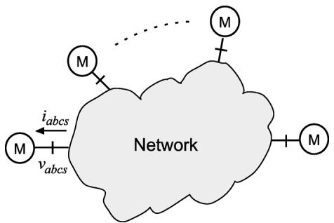  
Fig. 1. Diagram depicting interface of machines and external network.

where $\mathbf { R } _ { e q }$ is the equivalent resistance matrix and $\mathbf { e } _ { h }$ is the equivalent voltage history term.

In the paper, models of induction machines are derived based on the assumption that the rotor terminals are short-circuited by end-rings, i.e., squirrel-cage machine. If the rotor terminals are required to be interfaced with the external circuit-network in phase coordinates to represent a doubly-fed induction machine, the interface (1) should be re-derived with both stator and rotor voltages included. However, this is beyond the scope of this paper. Thus, the machine branch voltage (1) is then replaced by the machine nodal equation to enable the machine-network interface, as

$$
\mathbf {G} _ {e q} \mathbf {v} _ {a b c s} = \dot {\mathbf {i}} _ {a b c s} + \dot {\mathbf {i}} _ {h} \tag {2}
$$

where the machine equivalent conductance submatrix is

$$
\mathbf {G} _ {e q} = \mathbf {R} _ {e q} ^ {- 1} \tag {3}
$$

and the current history term is

$$
\mathbf {i} _ {h} = \mathbf {R} _ {e q} ^ {- 1} \mathbf {e} _ {h}. \qquad (4)
$$

The power system network is described by a nodal equation that may be written as follows:

$$
\mathbf {G} _ {n} \mathbf {V} _ {n} = \mathbf {I} _ {n h} - \left[ 0 \dots 0, \mathbf {i} _ {a b c s} ^ {T}, 0 \dots 0 \right] ^ {T}. \qquad (5)
$$

Here, ${ \bf G } _ { n }$ denotes the overall network conductance matrix without incorporating the machine conductance submatrix; ${ \bf V } _ { n }$ represents the nodal voltages; ${ \bf { I } } _ { { n h } }$ represents the network’s history current sources, assuming the machine is disconnected from the EMTP network. Therefore, the stator currents $\mathbf { i } _ { a b c s }$ injected into the EMTP network represent the contribution from the machine’s discretized equivalent circuit.

Solving (2) for the stator currents $\mathbf { i } _ { a b c s }$ and then substituting it into (5), the final linear system of equations in terms of nodal voltages $\mathbf { V } _ { n }$ has the following standard form:

$$
\mathbf {v} _ {a b c s} = \mathbf {R} _ {e q} \mathbf {i} _ {a b c s} + \mathbf {e} _ {h} \tag {1}
$$

$$
\mathbf {G V} _ {n} = \mathbf {I} _ {h}. \tag {6}
$$

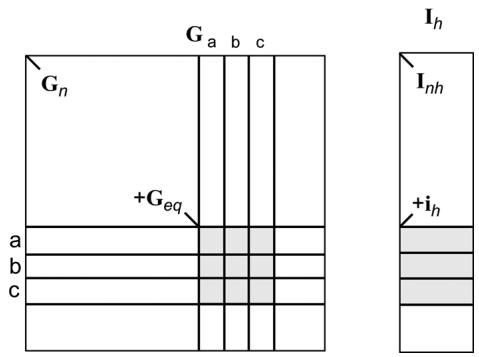  
Fig. 2. Network nodal equation including machine equivalent conductance submatrix and history current source.

The formulation of (6) is illustrated in Fig. 2, where it is shown that ${ \bf G } _ { n }$ and ${ \mathbf { I } } _ { { n h } }$ are modified by including the 3-by-3 machine equivalent conductance submatrix $\mathbf { G } _ { e q }$ and the machine equivalent history current sources $\mathbf { i } _ { h }$ to the corresponding machine nodes.

The solution of (6) is one of the key factors that has made the EMTP languages so efficient and ultimately widely used. As the matrix in (6) is usually sparse, specially designed techniques such as optimal reordering schemes and partial LU factorization [21], [22] are often used to solve this linear system instead of inverting the matrix directly. Branches with variable parameters are typically ordered in such a way that their equivalent conductance submatrices appear in the bottom-right corner of to minimize to re-factorization effort [1]. The interested reader will find detailed discussions on this subject in classical references [1], [21], [22].

Generally speaking, if the machine submatrix $\mathbf { G } _ { e q }$ is time-variant, the matrix has to be re-factorized or partially re-factorized at every time step, which will significantly increase overall computational overhead. Therefore, to maintain the efficient EMTP solution, it is highly desirable to formulate the machine model such that its equivalent conductance submatrix $\mathbf { G } _ { e q }$ is constant. In this case, the LU factorization can be carried out only once outside of the main time-stepping loop. This property is typically achieved for the models [6], [7], but not for the models with a direct circuit interface, i.e., PD and VBR models.

# III. DISCRETIZED MACHINE MODELS

To give the reader a consistent view on the subject, the discretized PD model and VBR model are presented and discussed in this section. As usual, it is assumed that the rotor parameters and variables are all referred to the stator side using an appropriate turns-ratio. The expressions for the induced electromagnetic torque and mechanical variables can be found in [20], and are not included here due to space limitation. Instead, the discussion focuses on the electrical part of the machine.

# A. Discretized Phase-Domain Model

The PD machine model is interfaced with the external EMTP network using the following equation [20]:

$$
\mathbf {v} _ {a b c s} (t) = \mathbf {R} _ {e q} ^ {p d} \mathbf {i} _ {a b c s} (t) + \mathbf {e} _ {h} ^ {p d} (t) \tag {7}
$$

Authorized licensed use limited to: Tsinghua University. Downloaded on April 09,2026 at 12:48:21 UTC from IEEE Xplore. Restrictions apply.

where the equivalent resistance matrix $\mathbf { R } _ { e q } ^ { p d }$ is expressed as

$$
\mathbf {R} _ {e q} ^ {p d} = \mathbf {r} _ {s} + \frac {2}{\Delta t} \mathbf {L} _ {s} - \frac {4}{\Delta t ^ {2}} \mathbf {L} _ {s r} (t) \left(\mathbf {r} _ {r} + \frac {2}{\Delta t} \mathbf {L} _ {r}\right) ^ {- 1} \mathbf {L} _ {r s} (t). \tag {8}
$$

The history term $\mathbf { e } _ { h } ^ { p d } ( t )$ is represented as

$$
\mathbf {e} _ {h} ^ {p d} (t) = - \frac {2}{\Delta t} \mathbf {L} _ {s r} (t) \left(\mathbf {r} _ {r} + \frac {2}{\Delta t} \mathbf {L} _ {r}\right) ^ {- 1} \mathbf {e} _ {r h} ^ {p d} (t) + \mathbf {e} _ {s h} ^ {p d} (t). \tag {9}
$$

Other relevant matrices and variables in (8) and (9) are defined in [20], and are less important for our discussion. However, the machine equivalent resistance matrix $\mathbf { R } _ { e q } ^ { p d }$ in (7) and (8) is of our particular interest and will be investigated further.

Based on (8) it is noted that $\mathbf { R } _ { e q } ^ { p d }$ is the result of the summation of three terms: the stator resistance matrix $\mathbf { r } _ { s } .$ , the stator inductance matrix term $( 2 / \Delta t ) \mathbf { L } _ { s } ,$ and the third term $- ( 4 / \Delta t ^ { 2 } ) { \bf L } _ { s r } ( t ) ( { \bf r } _ { r } ~ + ~ ( 2 / \Delta t ) { \bf L } _ { r } ) ^ { - 1 } { \bf L } _ { r s } ( t )$ . The first two terms are constant, as the matrices $\mathbf { r } _ { s }$ and $\mathbf { L } _ { s }$ are constant due to the symmetry of the induction machine [23]. The third term involves the triple matrix product ${ \bf L } _ { s r } ( t ) ( { \bf r } _ { r } ~ + ~ ( 2 / \Delta t ) { \bf L } _ { r } ) ^ { - 1 } { \bf L } _ { r s } ( t )$ , which may seem to be time-variant as the mutual inductance matrices $\mathbf { L } _ { s r } ( t )$ and $\mathbf { L } _ { r s } ( t )$ are rotor-position-dependent, as shown in (A1) and (A2) of Appendix A.

However, a careful examination of this triple matrix product reveals that it is independent of the rotor angle $\theta _ { r }$ and therefore time-invariant, assuming that the machine’s three-phase windings and associated parameters are symmetrical and the magnetic saturation is ignored. These assumptions result in symmetrical and constant rotor resistance and inductance matrices and , respectively. Therefore, the second matrix in the triple matrix product may be evaluated using the analytical inverse formula [24], as follows:

$$
\left(\mathbf {r} _ {r} + \frac {2}{\Delta t} \mathbf {L} _ {r}\right) ^ {- 1} = \left[ \begin{array}{l l l} a & b & b \\ b & a & b \\ b & b & a \end{array} \right]. \tag {10}
$$

Note that this matrix is also symmetric with only two distinct entries. Substituting (10) into (8) and using the trigonometric identities (A3) and (A4) listed in Appendix A, the final form of the triple matrix product evaluates to the following:

$$
\begin{array}{l} \mathbf {L} _ {s r} (t) \left(\mathbf {r} _ {r} + \frac {2}{\Delta t} \mathbf {L} _ {r}\right) ^ {- 1} \mathbf {L} _ {r s} (t) \\ = \frac {3}{4} L _ {m s} ^ {2} (a - b) \left[ \begin{array}{c c c} 2 & - 1 & - 1 \\ - 1 & 2 & - 1 \\ - 1 & - 1 & 2 \end{array} \right] \quad (1 1) \\ \end{array}
$$

which is also a constant and symmetric matrix. Therefore, the entire equivalent resistance matrix $\mathbf { R } _ { e q } ^ { p d }$ is constant.

This is a very desirable property for the PD model, as it removes the need for re-factorizing the entire network matrix every time step. However, as is shown in [20], an iterative solution of the machine-network equations may still be required for

the PD model to reduce the interfacing errors below a certain desired tolerance when large integration time steps are used.

# B. Discretized Voltage-Behind-Reactance Model

The interface of the VBR model is very similar to that of the PD model, and has the following equation [20]:

$$
\mathbf {v} _ {a b c s} (t) = \mathbf {R} _ {e q} ^ {v b r} (t) \mathbf {i} _ {a b c s} (t) + \mathbf {e} _ {h} ^ {v b r} (t) \tag {12}
$$

where the history term $\mathbf { e } _ { h } ^ { v b r } ( t )$ is given as

$$
\mathbf {e} _ {h} ^ {v b r} (t) = \mathbf {e} _ {r} ^ {v b r} (t) + \mathbf {e} _ {s h} ^ {v b r} (t). \tag {13}
$$

Here, ${ \bf e } _ { r } ^ { v b r } ( t )$ and ${ \bf e } _ { s h } ^ { v b r } ( t )$ denote the rotor and stator history terms, respectively, and are given in [20]. The equivalent resistance matrix ${ \bf R } _ { e q } ^ { v b r } ( t )$ is expressed as [20]

$$
\mathbf {R} _ {e q} ^ {v b r} (t) = \mathbf {R} _ {D} + \frac {2}{\Delta t} \mathbf {L} _ {D} + \mathbf {K} (t) \tag {14}
$$

with

$$
\mathbf {R} _ {D} = \operatorname {d i a g} \left(r _ {D}, r _ {D}, r _ {D}\right) \tag {15}
$$

and

$$
\mathbf {L} _ {D} = \operatorname {d i a g} \left(L _ {D}, L _ {D}, L _ {D}\right) \tag {16}
$$

where the diagonal elements $r _ { D }$ and $L _ { D }$ are given by (A5) in Appendix A for completeness. The coefficient matrix in (14) in arbitrary reference frame may be represented by $k _ { 1 } , k _ { 2 }$ , and $k _ { 3 }$ as [20]

$$
\mathbf {K} (t) = \left[ \begin{array}{l l l} k _ {1} & k _ {2} & k _ {3} \\ k _ {3} & k _ {1} & k _ {2} \\ k _ {2} & k _ {3} & k _ {1} \end{array} \right] \tag {17}
$$

where

$$
k _ {1} = \frac {2}{3} m _ {1}, k _ {2} = - \frac {1}{3} m _ {1} - \frac {\sqrt {3}}{3} m _ {2}, k _ {3} = - \frac {1}{3} m _ {1} + \frac {\sqrt {3}}{3} m _ {2}. \tag {18}
$$

The coefficients $m _ { 1 }$ and $m _ { 2 }$ are obtained in terms of machine parameters by the following equation [20]:

$$
\begin{array}{l} \left[ \begin{array}{c c} m _ {1} & m _ {2} \\ - m _ {2} & m _ {1} \end{array} \right] = \left[ \begin{array}{c c} c _ {1} & c _ {2} \\ - c _ {2} & c _ {1} \end{array} \right] \left[ \begin{array}{c c} 2 - \Delta t b _ {1} & - \Delta t b _ {2} \\ \Delta t b _ {2} & 2 - \Delta t b _ {1} \end{array} \right] ^ {- 1} \\ \times \left[ \begin{array}{c c} \Delta t b _ {3} & 0 \\ 0 & \Delta t b _ {3} \end{array} \right] \tag {19} \\ \end{array}
$$

where the constant coefficients $b _ { 1 } , b _ { 3 } ,$ and $c _ { 1 }$ are as given by (A6) in Appendix A. As the coefficients $b _ { 2 }$ and $c _ { 2 }$ may be rotor-

speed-dependent, particular attention is given to them. The two coefficients $b _ { 2 }$ and $c _ { 2 }$ are listed here as

$$
b _ {2} = \omega_ {r} - \omega \tag {20}
$$

$$
c _ {2} = \frac {\omega_ {r} L _ {m} ^ {\prime \prime}}{L _ {l r}}. \tag {21}
$$

Therefore, using (15)–(17), the equivalent resistance matrix $\mathbf { R } _ { e q } ^ { v b r } ( t )$ of the VBR model may be represented as

$$
\mathbf {R} _ {e q} ^ {v b r} (t) = \left[ \begin{array}{l l l} d & k _ {2} & k _ {3} \\ k _ {3} & d & k _ {2} \\ k _ {2} & k _ {3} & d \end{array} \right] \tag {22}
$$

where

$$
d = r _ {D} + \frac {2}{\Delta t} L _ {D} + k _ {1}. \tag {23}
$$

Accordingly, the machine conductance matrix $\mathbf { G } _ { g } ^ { v b r }$ of the VBR model is derived from (22) using the analytical inverse formula [24], as

$$
\mathbf {G} _ {e q} ^ {v b r} (t) = \frac {1}{\det \mathbf {R} _ {e q} ^ {v b r} (t)} \left[ \begin{array}{l l l} g _ {1} & g _ {2} & g _ {3} \\ g _ {3} & g _ {1} & g _ {2} \\ g _ {2} & g _ {3} & g _ {1} \end{array} \right] \tag {24}
$$

where

$$
g _ {1} = d ^ {2} - k _ {2} k _ {3}, g _ {2} = k _ {3} ^ {2} - d k _ {2}, g _ {3} = k _ {2} ^ {2} - d k _ {3} \tag {25}
$$

and

$$
\det  \mathbf {R} _ {e q} ^ {v b r} (t) = d g _ {1} + k _ {3} g _ {2} + k _ {2} g _ {3}. \tag {26}
$$

As shown in [20], the diagonalized stator equivalent resistance and inductance matrices $\mathbf { R } _ { D }$ and $\mathbf { L } _ { D }$ in (14) are time-invariant, assuming a symmetrical and magnetically linear induction machine. However, since the associated parameters $b _ { 2 }$ and $c _ { 2 }$ in (20) and (21) contain the rotor speed and affect (19), the matrix becomes rotor-speed-dependent. Consequently, the machine conductance matrix $\mathbf { G } _ { e q } ^ { v b r } ( t )$ is time-variant.

# IV. APPROXIMATE VOLTAGE-BEHIND-REACTANCE MODEL

The primary focus of this paper is to obtain a constant conductance matrix $\mathbf { G } _ { e q }$ for the previously established VBR model. In order to achieve that, the rotor-speed-dependency of coefficients $k _ { 1 } , k _ { 2 }$ , and $k _ { 3 }$ in equivalent resistance matrix $\mathbf { R } _ { e q } ^ { v b r } ( t )$ has to be eliminated. This leads to the so-called AVBR model with constant conductance matrix $\mathbf { G } _ { e q }$ as described in this section.

# A. AVBR Model Formulation

The AVBR machine model is derived here using the rotor reference frame. For the stationary and synchronous reference

frames, the same goal may be achieved using a similar derivation procedure. Thus, the reference frame speed is equal to $\omega _ { r }$ , which simplifies (20) as

$$
b _ {2} = 0. \tag {27}
$$

Substituting this result into (19) and solving the triple matrix product gives

$$
m _ {1} = \frac {c _ {1} \Delta t b _ {3}}{2 - \Delta t b _ {1}} \tag {28}
$$

and

$$
m _ {2} = \frac {c _ {2} \Delta t b _ {3}}{2 - \Delta t b _ {1}} \tag {29}
$$

where the coefficient $m _ { 1 }$ is now constant, and the coefficient $m _ { 2 }$ is still linearly dependent on the rotor speed $\omega _ { r }$ due to $c _ { 2 }$ .

It is noted from (28) and (29) that $m _ { 1 }$ and $m _ { 2 }$ have the same order as the discretization time step $\Delta t ,$ which symbolically may be expressed as

$$
m _ {1} = O (\Delta t) \tag {30}
$$

$$
m _ {2} = O (\Delta t). \tag {31}
$$

Moreover, the coefficients $k _ { 1 } , k _ { 2 }$ , and $k _ { 3 }$ in (18) are linear combinations of $m _ { 1 }$ and/or $m _ { 2 } .$ . Therefore, the elements of $\mathbf { K } ( t )$ shown in (17) also possess the same order as $\Delta t ,$ which gives

$$
k _ {1} = O (\Delta t) \tag {32}
$$

$$
k _ {2} = O (\Delta t) \tag {33}
$$

$$
k _ {3} = O (\Delta t). \tag {34}
$$

Here the coefficient $k _ { 1 }$ depends only on $\Delta t$ and is constant for a fixed time step, and the coefficients $k _ { 2 }$ and $k _ { 3 }$ also depend linearly on the rotor speed $\omega _ { r }$ .

It is also observed from (23) that the diagonal element $d$ in the equivalent resistance matrix ${ \bf R } _ { e q } ^ { v b r } ( t )$ has an order inversely proportional to $\Delta t ,$ , and is expressed as

$$
d = O \left(\frac {1}{\Delta t}\right). \tag {35}
$$

Since the integration time step $\Delta t$ is usually small, the diagonal elements in $\mathbf { R } _ { e q } ^ { v b r } ( t )$ are much larger than the off-diagonal elements $k _ { 2 }$ and $k _ { 3 }$ , which means that

$$
d \gg k _ {2} \tag {36}
$$

and

$$
d \gg k _ {3}. \tag {37}
$$

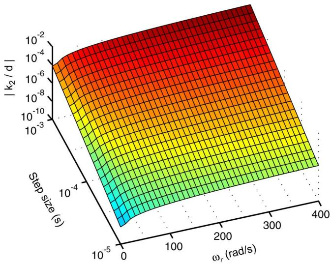  
Fig. 3. Ratio of $| k _ { 2 } / d |$  for the machine M2.

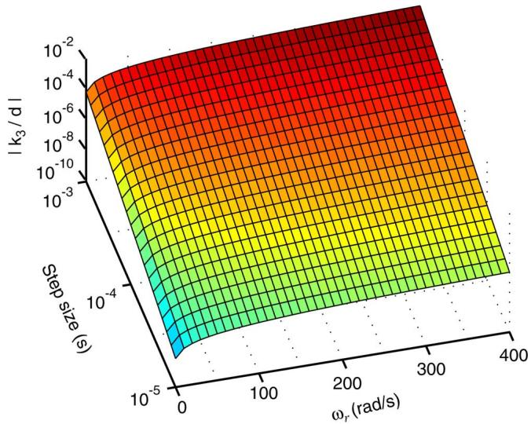  
Fig. 4. Ratio of $| k _ { 3 } / d |$ for the machine M2.

Therefore, the ratios $| k _ { 2 } / d |$ and $| k _ { 3 } / d |$ have quadratic order with respect to the time step:

$$
\left| k _ {2} / d \right| = O \left(\Delta t ^ {2}\right) \tag {38}
$$

$$
\left| k _ {3} / d \right| = O \left(\Delta t ^ {2}\right). \tag {39}
$$

This important diagonally dominant property of the equivalent resistance matrix ${ \bf R } _ { e q } ^ { v b r } ( t )$ becomes pronounced very quickly for small time steps. To demonstrate this phenomenon, we consider four typical induction machines ranging from 3 to 2250 HP [23], which are representative for power applications. The corresponding machine parameters are summarized in Appendix B. The coefficients $k _ { 2 } , k _ { 3 }$ , and $d ,$ and matrices used in the VBR model have been calculated according to the methodology described in this paper and [20].

For a typical 50 HP machine (M2), the ratios of $| k _ { 2 } / d |$ and $| k _ { 3 } / d |$ have been calculated for different time steps $\Delta t$ and rotor speed $\omega _ { r } ;$ ; the results are shown in Figs. 3 and 4. As revealed by (38) and (39) and seen in Figs. 3 and 4, the decreased integration

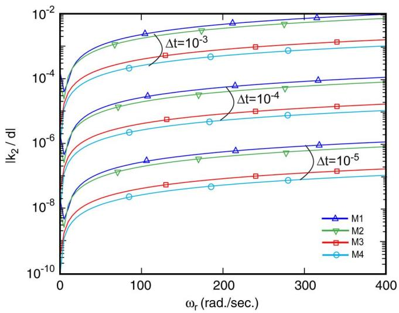  
Fig. 5. Ratio of $| k _ { 2 } / d |$ for the four machines with three different time-steps.

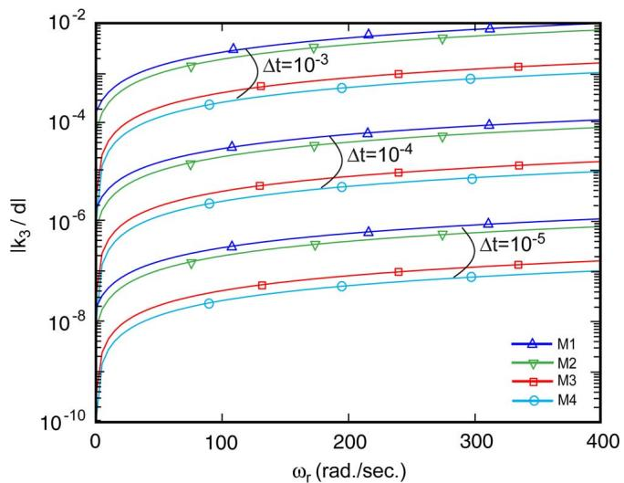  
Fig. 6. Ratio of $| k _ { 3 } / d |$ for the four machines with three different time-steps.

time-step makes the two ratios very small. In addition to the time-step, these ratios are also affected by the rotor speed [see (21), (29), and (18)], and as Figs. 3 and 4 show, decrease with $\omega _ { r }$ .

For the purpose of further comparison, Figs. 5 and 6 show these ratios for all four sample machines, calculated using the integration time steps of $1 0 ^ { - 3 } , 1 0 ^ { - 4 }$ , and $1 0 ^ { - 5 }$ , respectively. Figs. 5 and 6 further verify this important property, namely that the equivalent resistance matrix very quickly becomes diagonally dominant for sufficiently small time steps. The log scale has been used for the vertical axis in Figs. 3–6 to show this rapid trend.

For the same time step, the larger power rating of the machine results in smaller ratios, as demonstrated in Figs. 5 and 6. This may be attributed to the relative decrease of the rotor resistance $r _ { r }$ , which impacts the coefficients $b _ { 1 } , b _ { 3 } ,$ and $c _ { 1 }$ , as shown in (A6), and leads to smaller $k _ { 2 }$ and $k _ { 3 }$ . A more detailed analysis of how the machine’s rating and winding parameters affect the approximation accuracy is given in Section VI.

Based on the observation that the ratios $| k _ { 2 } / d |$ and $| k _ { 3 } / d |$ are sufficiently small, the off-diagonal elements $k _ { 2 }$ and $k _ { 3 }$ may be neglected altogether. If this is done, the approximate equivalent resistance matrix becomes

$$
\mathbf {R} _ {e q} ^ {a v b r} = \mathbf {D} \tag {40}
$$

where

$$
\mathbf {D} = \operatorname {d i a g} (d, d, d). \tag {41}
$$

It is noted that the coefficient is constant as $k _ { 1 }$ in (23) is constant due to rotor reference frame. The corresponding conductance matrix is

$$
\mathbf {G} _ {e q} ^ {a v b r} = \mathbf {D} ^ {- 1}. \tag {42}
$$

Therefore, the approximate VBR model is defined by the exact VBR model, with the exception that (40)–(42) are used instead of (22)–(26).

# B. Approximation Error Bound

Neglecting the off-diagonal elements will introduce some additional numeric $k _ { 2 }$ and error $k _ { 3 }$ $\mathbf { R } _ { e q } ^ { v b r } ( t )$ ural question that arises is whether these additional errors can be made sufficiently small for this approach to be practical. In this subsection, these additional errors caused by approximation (42) are investigated and quantified in terms of error bounds. For the purpose for discussion, let us assume a linear system of equations of the general form

$$
\mathbf {A} \mathbf {x} = \mathbf {b} \tag {43}
$$

where is an n-by-n nonsingular matrix, and is an n-by-1 vector, and that both are known. The exact solution is then unique and is given as

$$
\mathbf {x} = \mathbf {A} ^ {- 1} \mathbf {b}. \tag {44}
$$

If the original matrix is approximated by a nonsingular matrix , the resultant approximated linear system becomes

$$
\mathbf {D} \mathbf {x} = \mathbf {b}. \tag {45}
$$

Thus, the approximated solution is expressed as

$$
\hat {\mathbf {x}} = \mathbf {D} ^ {- 1} \mathbf {b}. \tag {46}
$$

The approximation error $\varepsilon$ is defined in terms of an arbitrary vector norm [25] as

$$
\varepsilon = \frac {\left\| \mathbf {x} - \hat {\mathbf {x}} \right\|}{\left\| \mathbf {x} \right\|}. \tag {47}
$$

The numerator $| | \mathbf { x } - \hat { \mathbf { x } } | |$ in (47) is further manipulated by substituting (44) and (46) and then applying the matrix norm consistency condition $\| \mathbf { A B } \| \leq \| \mathbf { A } \| \| \mathbf { B } \|$ [25]. These steps result in the following:

$$
\left\| \mathbf {x} - \hat {\mathbf {x}} \right\| = \left\| \left(\mathbf {A} ^ {- 1} - \mathbf {D} ^ {- 1}\right) \mathbf {b} \right\| \leq \| \mathbf {A} ^ {- 1} - \mathbf {D} ^ {- 1} \| \| \mathbf {b} \|. \tag {48}
$$

Similarly, applying the matrix norm consistency condition gives

$$
\left\| \mathbf {b} \right\| = \left\| \mathbf {A} \mathbf {x} \right\| \leq \left\| \mathbf {A} \right\| \| \mathbf {x} \|. \tag {49}
$$

It is noted that (49) can be rewritten as

$$
\frac {1}{\| \mathbf {x} \|} \leq \frac {\| \mathbf {A} \|}{\| \mathbf {b} \|}. \tag {50}
$$

Multiplying (48) and (50), it is shown that the approximating error (47) is bounded as

$$
\frac {\left\| \mathbf {x} - \hat {\mathbf {x}} \right\|}{\left\| \mathbf {x} \right\|} \leq \left\| \mathbf {A} ^ {- 1} - \mathbf {D} ^ {- 1} \right\| \left\| \mathbf {A} \right\|. \tag {51}
$$

Thus, the error bound can be calculated as

$$
\varepsilon_ {\text {b o u n d}} = \left\| \mathbf {A} ^ {- 1} - \mathbf {D} ^ {- 1} \right\| \left\| \mathbf {A} \right\|. \tag {52}
$$

The error bound $\varepsilon _ { b o u n d }$ can be used not only to guarantee the convergence of the proposed approach, but also to provide a good estimate of the approximation error. To demonstrate this, the matrices $\mathbf { R } _ { e q } ^ { v b r }$ and $\mathbf { \bar { R } } _ { e q } ^ { a v b r }$ were calculated for the four typical machines summarized in Appendix B, for a speed range from zero to synchronous speed $\omega _ { b }$ . The approximation error bound $\varepsilon _ { b o u n d }$ was calculated according to (52) with $\mathbf { R } _ { e q } ^ { v b r } = \mathbf { A }$ eq and $\mathbf { R } _ { e q } ^ { a v b r } = \mathbf { D } _ { : }$ eq , as per (43) and (45), respectively, using the 2-norm [26]. Fig. 7 shows the error-bound plots calculated for the three different time-steps $1 0 ^ { - 3 } , 1 0 ^ { - 4 }$ , and $\mathrm { 1 0 ^ { - 5 } s }$ . As can be seen from Fig. 7, the error bound behaves very similarly to the ratios of the off-diagonal versus main-diagonal element shown in Figs. 3–6. This result is expected, since $\mathbf { R } _ { e q } ^ { a v b r }$ is diagonal and $\mathbf { R } _ { e q } ^ { v b r }$ has a strong diagonally dominant structure. For example, as Fig. 7 shows, the largest error bound of about 0.012 (1.2%) may be observed for the 3-HP machine (M1) at synchronous speed when the time-step is $\mathrm { 1 0 ^ { - 3 } s }$ .

# V. CASE STUDIES

In this section, a no-load startup transient study is described that was used to evaluate the models of the four induction machines listed in Appendix B. This study was chosen because it also spans the rotor speed $\omega _ { r }$ in a wide range, which impacts the approximation accuracy, as shown in Section IV. The proposed AVBR, PD and the exact VBR models were all implemented according to the methodology presented in Sections II–IV as well as [20]. For validation and comparison purposes, the built-in model of EMTP-RV in rotor reference

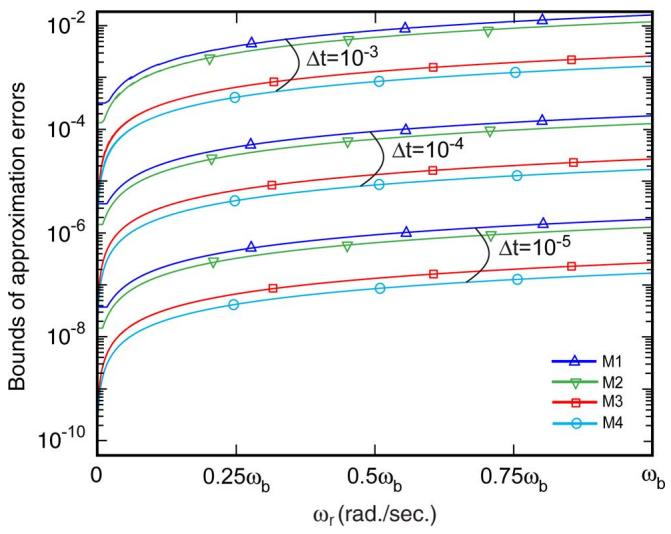  
Fig. 7. Approximation error bounds for the four machines considered.

frame was used as the standard EMTP machine model. Since the exact analytical solution of the machine differential equations is not available, a state-space model was implemented in MATLAB/Simulink [27]. For the purpose of consistency, the voltage and flux linkage equations of the full-order model are also listed in Appendix C. The model is solved using 4th-order Runge–Kutta method with a very small time step of 1 $\mu \mathrm { s } .$ . This solution is therefore considered as a numerical reference. For consistency among the models, the rotor reference frame was used in all of them.

# A. Large Time-Step Study

The integration time-step size plays an important role in simulation accuracy and speed. The larger the time-step can be made, the faster the simulation speeds that will be achieved, which is always very desirable. However, this may come at the price of reduced accuracy and possibly even a loss of numerical stability. To demonstrate the accuracy of AVBR, VBR, PD, and the model of EMTP-RV, in this section a relatively large time-step of 500 is considered.

Case studies for the 50-HP machine (M2) are presented and discussed first in this subsection. The transient responses produced by various models are shown in Figs. 8–13. The stator current $i _ { a s }$ is plotted in Fig. 8, where one can observe that the AVBR, VBR, PD, and models of EMTP-RV all produce qualitatively similar responses that are close to the reference solution (solid black line). However, a more detailed analysis reveals that the accuracy of these models is in fact different. To illustrate this point, two fragments of this study are shown magnified in Figs. 9 and 10 corresponding to the middle and end of the transient, respectively. As can be easily seen in Figs. 9 and 10, the accuracy of the models improves from the model, to PD, to the VBR model, with VBR being the most accurate. This observation is consistent with the results of [20] and justifies improving the machine-network interface. However, it is important to notice that the proposed AVBR model also achieves a visibly good performance that is very close to that of the exact VBR model.

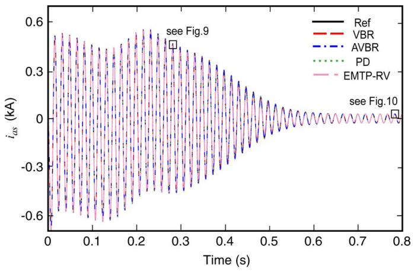  
Fig. 8. Stator current transient for 50-HP machine using time-step of $5 0 0 \mu \mathrm { s } .$

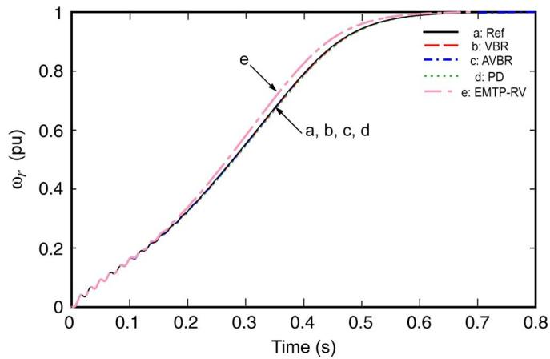  
Fig. 11. Rotor speed transient for 50-HP machine using time-step of $5 0 0 \mu \mathrm { s } .$ .

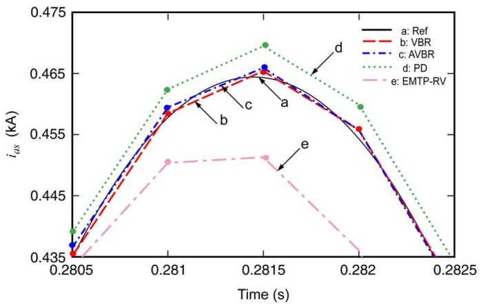  
Fig. 9. Magnified fragment of transient stator currents from Fig. 8.

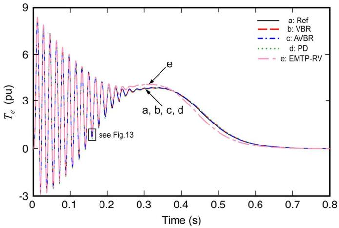  
Fig. 12. Electromagnetic torque for 50-HP machine using time-step of $5 0 0 \mu \mathrm { s }$

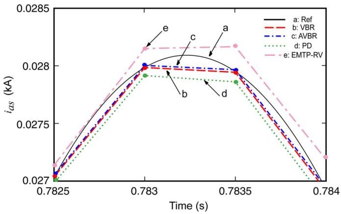  
Fig. 10. Magnified fragment of steady-state stator currents from Fig. 8.

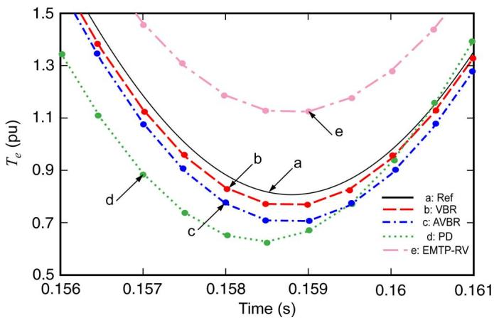  
Fig. 13. Magnified fragment of electromagnetic torque from Fig. 12.

Other variables of interest that are included here are rotor speeds $\omega _ { r }$ and the induced electromagnetic torque , which are shown in Figs. 11 and 12. Here, it is seen that the transient responses predicted by the model of EMTP-RV are noticeably different from those of the other models. In contrast, the PD and VBR models, and even the AVBR, all produce nearly the same results as the reference solution. A magnified fragment of the electromagnetic torque is shown in Fig. 13. This figure also

reveals the same consistent trend of improvement in accuracy, from the model of EMTP-RV, to $\mathrm { P D , }$ to AVBR, to the exact VBR model which is the most accurate.

# B. Model Accuracy

The numerical accuracy of the PD, VBR and AVBR models are further analyzed in this subsection by comparing the relative

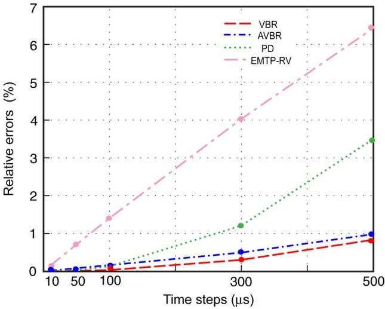  
Fig. 14. Relative numerical errors observed in electromagnetic torque $T _ { e }$

errors between the numerical solutions and the reference solution. Without loss of generality, the electromagnetic torque is considered here, whereas other machine variables demonstrate a similar trend and are not included due to limited space. Thus, the relative error of the trajectory solution is calculated using the 2-norm [26] as

$$
e (\Delta t) = \frac {\left\| \widetilde {T} _ {e} - T _ {e} \right\| _ {2}}{\left\| \widetilde {T} _ {e} \right\| _ {2}} \cdot 100 \% \tag{53}
$$

where $\widetilde { T } _ { e }$ denotes the reference solution as defined in Section ${ \mathrm { V } } ,$ and $T _ { e }$ is the given numerical solution obtained using time step $\Delta t$ and a given subject model, respectively.

The results of comparing the four models are summarized in Fig. 14. As expected, the relative error of all models increases with the time-step $\Delta t ,$ and all models produce responses that converge to the same reference solution for sufficiently small step size. This result also verifies that all these models are correct and consistent, provided they use the same set of machine parameters.

However, it can be seen from Fig. 14 that the models with a direct circuit interface, namely the PD, VBR, and AVBR models, all demonstrate lower relative errors compared with the conventional model of EMTP-RV. This improved numerical accuracy is attributed to the direct machine-network interface, as has been documented in [20]. It is also observed in Fig. 14 that although the AVBR model is slightly less accurate than the exact VBR model, it is still noticeably better than the PD, especially for large time steps. For example, if a 1% accuracy is required, either the approximate or the exact VBR model can achieve this with the time-step as large as 500 . The PD model will require a time step on the order of $2 6 0 \mu \mathrm { s }$ (which will take almost twice the number of steps to complete the same study). The model of EMTP-RV will require an even smaller time step, on the order of $7 0 ~ \mu \mathrm { s }$ (which will take more than seven times the number of steps required by the AVBR model).

TABLE I COMPARISON OF CPU TIMES PER TIME STEP   

<table><tr><td>Model</td><td>PD</td><td>VBR</td><td>AVBR</td></tr><tr><td>Per time-step</td><td>3.6μs</td><td>2.2μs</td><td>1.9μs</td></tr></table>

# C. Model Efficiency

In order to further compare the numerical efficiency of the proposed AVBR model with the other models with a direct interface (PD, VBR), all three were implemented using the ANSI C language and executed on a personal computer (PC) with a Pentium-4 2.66-GHz processor and 512 MB of RAM. All three models were carefully coded to minimize the number of flops and evaluations of trigonometric functions, as documented in [20]. To make a fair comparison among the models, the same start-up transient study was carried out. The measured CPU times per step are summarized in Table I.

Table I shows that the PD model presented in this paper represents a slight improvement (3.6 ) compared with the previously reported result $( 4 . 6 \mu \mathrm { s } )$ [20]. This has been achieved due to the constant equivalent resistance (conductance) matrix, as explained in Section III-A. However, the PD model still requires a fair amount of calculations in its history terms, torque equation, etc., and is therefore quite computationally expensive. The exact VBR model is structurally more efficient and requires less CPU time (2.2 ). However, the proposed AVBR model outperforms the previous models by being noticeably faster (1.9 ). It is important to note that although the improvement of the AVBR model over the VBR model is relatively modest (13.6% as shown in Table I), a very significant structural advantage of the AVBR model is in its constant equivalent conductance submatrix $\mathbf { G } _ { e q } ,$ , which has many benefits as explained in Section II.

# VI. APPROXIMATION ACCURACY ANALYSIS

# A. Effect of Machine Parameters and Rotor Speed

As can be seen in Figs. 5–7, various induction machines possess different off-to-main-diagonal ratios in $\mathbf { R } _ { e q } ^ { v b r }$ , i.e., $| k _ { 2 } / d |$ and $| k _ { 3 } / d |$ . More specifically, higher-power-rating machines tend to have small ratios of $| k _ { 2 } / d |$ and $| k _ { 3 } / d |$ making the proposed approximation more favorable and producing the results closer to the exact VBR model. To better understand how the parameters (i.e., winding resistances and inductances) affect the approximation accuracy, the same four machines from Appendix B are carefully examined here. Specifically, the model internal parameters $b _ { 1 } , c _ { 1 } , b _ { 3 } , c _ { 2 } , m _ { 1 }$ , and have been calculated and are summarized in Appendix C. For comparison purpose, the machine parameters $L _ { l s } , \ L _ { l r }$ , and $L _ { m } ^ { \prime \prime } / L _ { l r }$ are also listed in Appendix C.

In the table of Appendix C, it is first observed that $L _ { m } ^ { \prime \prime } / L _ { l r } \approx$ , which implies that in all four induction machines the subtransient inductance is close to the rotor leakage inductance

$$
L _ {m} ^ {\prime \prime} \approx L _ {l r}. \tag {54}
$$

This observation is consistent with definition of $L _ { m } ^ { \prime \prime }$ in $( \mathsf { A } 5 )$ and suggests that the term $( ( L _ { m } ^ { \prime \prime } / L _ { l r } ) - 1 )$ in $( \mathsf { A } 6 )$ is small. Furthermore, based on the definitions of $b _ { 1 } , c _ { 1 }$ , and $b _ { 3 }$ in (A6) and definition of $c _ { 2 }$ in (21), it is concluded that

$$
b _ {1} \approx c _ {1}, b _ {3} \approx r _ {r}, \text {a n d} c _ {2} \approx \omega_ {r}. \tag {55}
$$

As the time step $\Delta t$ is usually small (on the order of tens to hundreds of microsecond), the denominator in (28) and (29) is $2 - \Delta t b _ { 1 } \approx 2$ . Therefore, the $m _ { 1 }$ and defined by (28) and (29) can be approximated as follows:

$$
m _ {1} \approx \frac {c _ {1} \Delta t b _ {3}}{2} \text {a n d} m _ {2} \approx \frac {c _ {2} \Delta t b _ {3}}{2}. \tag {56}
$$

Using (18), (23), (54), and (A5), and assuming that $L _ { l s } = L _ { l r }$ , the diagonal element can be further approximated as

$$
d = r _ {D} + \frac {2}{\Delta t} L _ {D} + k _ {1} \approx \frac {2}{\Delta t} L _ {D} \approx \frac {4}{\Delta t} L _ {l r} \tag {57}
$$

which clearly shows that this element will increase as the time step is made smaller.

Furthermore, as seen in Appendix C, when the rotor speed $\omega _ { r }$ is high (close to nominal) we have $\left| c _ { 1 } \right| \ll c _ { 2 }$ , which of course leads to $| m _ { 1 } | \ll m _ { 2 }$ . This result allows neglecting $m _ { 1 }$ in (18) and approximating the coefficients $k _ { 2 }$ and $k _ { 3 }$ in terms of the dominant coefficient $m _ { 2 }$ only as follows:

$$
k _ {2} \approx - \frac {\sqrt {3}}{3} m _ {2} \text {a n d} k _ {3} \approx \frac {\sqrt {3}}{3} m _ {2}. \tag {58}
$$

Combing the results of (55)–(58), it can be shown that the ratios $| k _ { 2 } / d |$ and $| k _ { 3 } / d |$ can be further approximated as

$$
\left| k _ {2} / d \right| \approx \left| k _ {3} / d \right| \approx \frac {\Delta t ^ {2} \omega_ {r} r _ {r}}{8 \sqrt {3} L _ {l r}}. \tag {59}
$$

The result (59) shows that, in addition to the time step $\Delta t ,$ the ratio $r _ { r } / L _ { l \tau }$ plays a great role in determining the diagonal dominance of $\mathbf { R } _ { e q } ^ { v b r }$ and the accuracy of its approximation $\mathbf { R } _ { e q } ^ { a v b r }$ as defined by (40).

When the rotor speed is very low $( \mathrm { e . g . }$ , close to zero at starting) such that $| c _ { 1 } | \gg c _ { 2 }$ , the off diagonal elements $k _ { 2 }$ and $k _ { 3 }$ may be approximated differently as

$$
k _ {2} \approx - \frac {1}{3} m _ {1} \quad \text {a n d} \quad k _ {3} \approx - \frac {1}{3} m _ {1}. \tag {60}
$$

For this case, the ratios $| k _ { 2 } / d |$ and $| k _ { 3 } / d |$ can be approximated using (60) and (57) as

$$
\left| k _ {2} / d \right| \approx \left| k _ {3} / d \right| \approx \left| \frac {\Delta t m _ {1}}{1 2 L _ {l r}} \right|. \tag {61}
$$

Substituting (56), (55), (A6), and (A5) into (61), the ratios $| k _ { 2 } / d |$ and $| k _ { 3 } / d |$ can then be represented as

$$
\left| k _ {2} / d \right| \approx \left| k _ {3} / d \right| \approx \frac {\Delta t ^ {2} r _ {r} ^ {2}}{2 4 L _ {l r} \left(L _ {l r} + L _ {m}\right)}. \tag {62}
$$

It is seen from (59) and (62) that $r _ { r } / L _ { l r }$ and $r _ { r } ^ { 2 } / ( L _ { l r } ( L _ { l r } +$ $L _ { m } ) )$ determine the off-to-main-diagonal ratios in high and low rotor speed regions, respectively. For the purpose of comparison, these two ratios have been calculated for the four induction machines and are also summarized in Appendix C (see last two columns). As seen in Appendix C, the machines with higher power ratings usually have smaller $r _ { r } / L _ { l r }$ and $r _ { r } ^ { 2 } / ( L _ { l r } ( L _ { l r } +$ $L _ { m } ) )$ ratios which result in smaller off-to-main-diagonal ratios in their matrix $\mathbf { R } _ { e q } ^ { v b r }$ . So, the smaller these ratios are the more diagonally-dominate $\mathbf { R } _ { e q } ^ { v b r }$ will be, which in turn makes the approximation (40) more accurate.

For example, the 3-HP (M1) and 2250-HP (M4) induction machines have the $r _ { r } / L _ { l r }$ ratios of 407.9904 and 36.6983, respectively. This implies that the diagonal-dominant property of $\mathbf { R } _ { e q } ^ { v b r }$ is 11.1 times stronger for the 2250-HP (M4) machine compared to 3-HP (M1) machine [assuming the same discretization time step is used; see (59)]. This observation is consistent with the calculated ratios and error bound analysis shown in Figs. 5–7, where an order of magnitude improvement in approximation accuracy is seen for the 2250-HP machine over the 3-HP machine for the same time-step size and rotor speed.

# B. Case Studies With Machines of Different Ratings

The case studies in Section V consider the 50-HP machine. In order to demonstrate the validity of AVBR model for a wide range of power ratings, this Section presents the studies with 3-HP (M1), 500-HP (M3), and 2250-HP (M4) induction machines (see Appendix B). For the purpose of consistency, the start-up transients are investigated here as well. The exact VBR and AVBR models are implemented and compared against the reference solution. The reference solution is obtained by solving the state-space model with the 4th-order Runge–Kutta method and the time step of 1 .

Without loss of generality, the 3-HP machine is investigated first using a large time step of 1 ms. Figs. 15–19 show the computed transient responses during start-up period. It is seen in Fig. 15 that both VBR and AVBR models predict similar and accurate stator current responses. A magnified plot of the stator currents is also shown in Fig. 16 where it is visibly observed that the VBR model produces slightly more accurate results than the AVBR model; however, this difference is very small. Fig. 17 shows that the rotor speeds predicted by the VBR and AVBR models are almost identical to the reference solution. Figs. 18 and 19 depict the developed electromagnetic torque, and show that the AVBR model produces very good numerical results and accuracy comparable to the exact VBR model.

Next, the startup transients of the 500-HP (M3) and 2250-HP (M4) machines are also investigated using a large time step of 500 $\mu \mathrm { s }$ . Due to space limitation, only the stator currents are

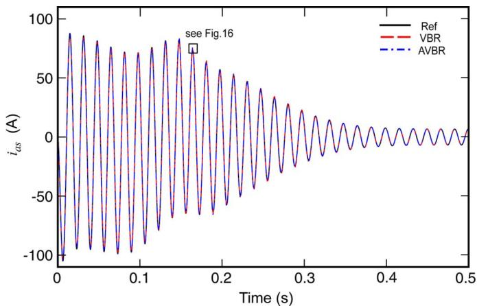  
Fig. 15. Stator current transient for 3-HP machine using time-step of 1 ms.

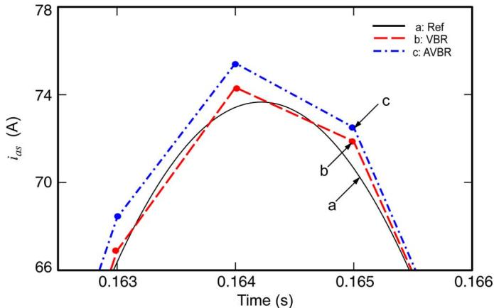  
Fig. 16. Magnified fragment of transient stator currents from Fig. 15 for 3-HP machine using time-step of 1 ms.

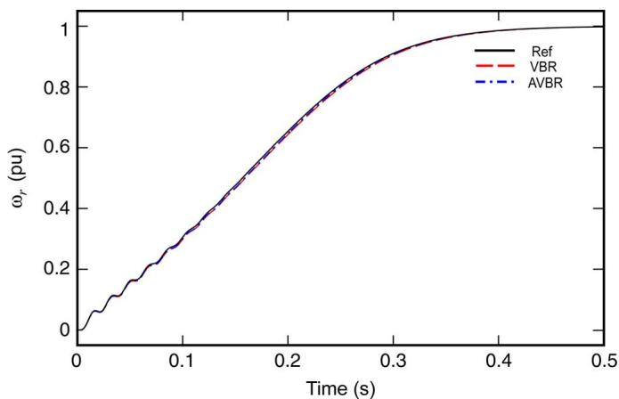  
Fig. 17. Rotor speed transient for 3-HP machine using time-step of 1 ms.

shown in Figs. 20–25. Specifically, Figs. 20–22 show the stator currents as predicted by the reference, VBR, and AVBR models for the 500-HP machine. Figs. 23–25 show the stator currents for the 2250-HP machine. Since these machines take longer to accelerate, it is difficult to differentiate among the models in Figs. 20 and 23. To give the reader a better view of the match, the magnified fragments of the transient as well as the steady-state stator currents are also shown in more detail in Figs. 21 and 22, and 24 and 25 for the two machines, respectively. It is observed

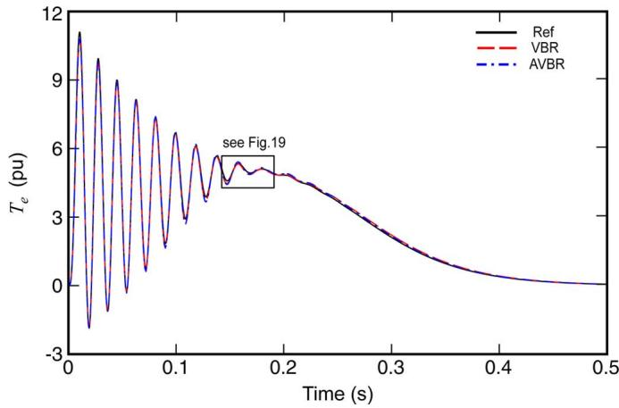  
Fig. 18. Electromagnetic torque for 3-HP machine using time-step of 1 ms.

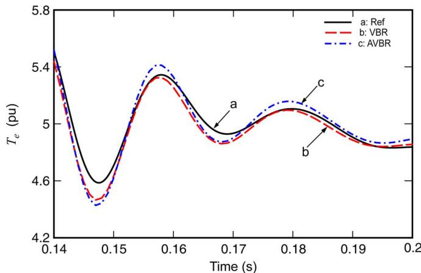  
Fig. 19. Magnified fragment of electromagnetic torque from Fig. 18 for 3-HP machine using time-step of 1 ms.

from Figs. 20–25 that the VBR and AVBR models produce almost identical and very accurate results that are very close to the reference solution. Other variables such as rotor currents, speeds and electromagnetic torques predicted by the AVBR model also demonstrated similar accuracy and closeness to the VBR model.

# VII. DISCUSSION

# A. Genesis of the VBR Model

The concept of voltage-behind-reactance is very intuitive and natural for representing electrical machines, and it is not surprising that it has deep roots going into the beginning of 20th century. It seems that Doherty and Nickle [28] were the first to establish this concept in 1927 for representation of synchronous machines. In [28], a simple method of approximating the transient torque-angle characteristic was developed based on the assumption that the rotor flux linkage may be considered constant right after the transient happens. In this way, a constant voltage source behind a series reactance was used to represent a synchronous machine. In 1929, Park [29] proposed a coordinate transformation technique (now widely known as Park’s Transformation) which projects the stator physical variables onto the coordinates that are fixed on the rotor and yields a greatly simplified model for the synchronous machine. Later, Thomas

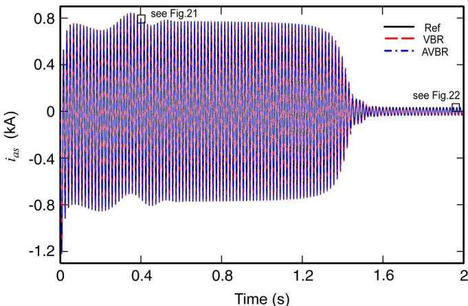  
Fig. 20. Stator currents for 500-HP machine using time-step of 500 .

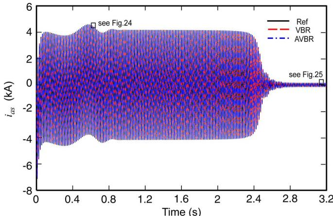  
Fig. 23. Stator currents for 2250-HP machine using time-step of $5 0 0 \mu \mathrm { s } .$

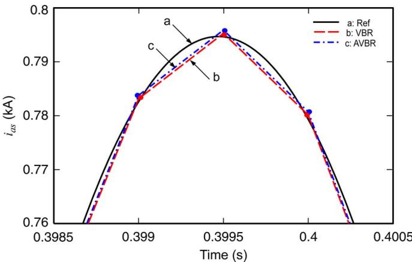  
Fig. 21. Magnified fragment of transient stator currents from Fig. 20 for 500-HP machine using time-step of 500 .

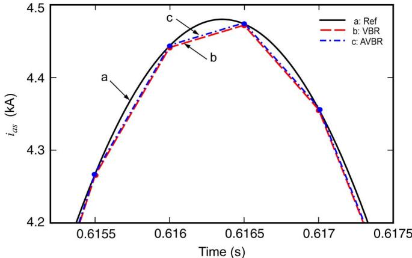  
Fig. 24. Magnified fragment of transient stator currents from Fig. 23 for 2250-HP machine using time-step of 500 .

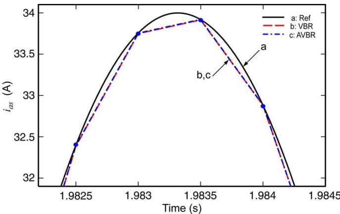  
Fig. 22. Magnified fragment of steady-state stator currents from Fig. 20 for 500-HP machine using time-step of $5 0 { \dot { 0 } } \mu \mathbf { s } .$ .

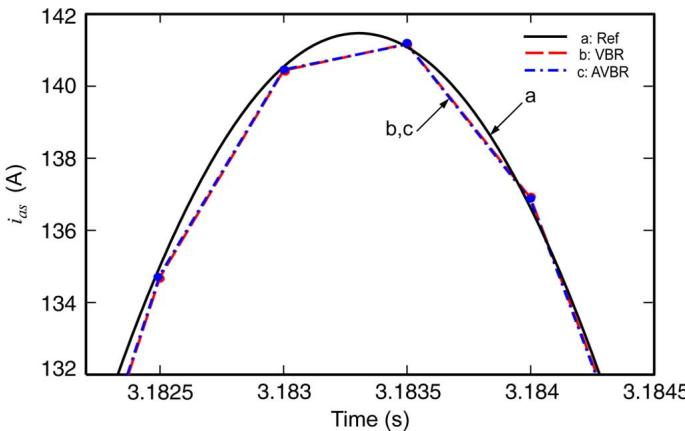  
Fig. 25. Magnified fragment of steady-state stator currents from Fig. 23 for 2250-HP machine using time-step of 500 .

[30] manipulated the Park’s equations and expressed the state model with flux linkages as the independent variables, which became the basis for many computer simulations including that of induction machines [31].

Further simplification of Park’s equations by neglecting the fast stator transients (the terms $p \lambda _ { d s }$ and $p \lambda _ { q s } )$ and the rotor speed variation have been extensively used in power systems

and transient stability analysis [32]–[36]. Depending on representation of rotor flux linkages and amortisseur windings, several reduced-order models have been derived and used in the literature resulting in constant and/or time-variant voltage behind transient and/or subtransient reactance formulations. The VBR formulation was also found very convenient for simulations of synchronous-machine converter systems [37], [38], where an

approximate model with stator transients included was used for obtaining the average-value models.

The full-order voltage-behind-reactance state-variable model was first developed by Pekarek in [39] and [17], where it was proposed for efficient and accurate simulation of synchronous machine converter systems. This work was further extended by including the saturation into the -axis [40]. The full-order VBR model also partitions the machine into fast (stator) and slow (rotor) subsystems, which has been utilized very effectively for multi-rate integration and simulation of multi-machine power systems [41]. The full-order VBR model was also used for real-time and hardware-in-the-loop (HIL) simulations [42], as well as for elimination of dynamic saliency of synchronous machines [43], [44]. A higher-order VBR synchronous machine model for representation of arbitrary rotor network and saturation effects has been proposed in [45]. A full-order voltage-behind-reactance induction machine model was proposed recently in [18] for state-variable-based simulation languages.

For nodal-analysis-based simulation approach, such as EMTP-type languages, the classical Type-59 synchronous machine model and the model of PSCAD/EMTDC were developed as three-phase Thevenin and Norton equivalent circuits in discrete-time domain, respectively. When the machine model is discretized according to the EMTP solution approach, the final interfacing equivalent circuit very closely resembles the voltage-behind-reactance or source in parallel with conductance form. However, these classical machine models have indirect interface with the external circuit-network in EMTP leading to degradation of numerical accuracy and potential stability problems as has been documented in [8]–[10] and [18]–[20].

The PD model, when discretized for interfacing with the EMTP solution, also has the voltage-behind-reactance equivalent circuit form as has been shown in previous publications. However, the VBR synchronous and induction machine models were then implemented for EMTP-type solution in [19] and [20], respectively, where it was shown that the numerical accuracy and stability of solution can be greatly improved even compared to the PD model. This paper represents an important extension of the previous work on machine models with direct/simultaneous EMTP interface (i.e., the PD and VBR machine modeling approaches) by achieving a constant conductance submatrix is discrete-time-domain EMTP solution. To the best of our knowledge, this has not been achieved in the prior literature.

# B. Accuracy and Numerical Stability of the AVBR Model

The extensive case studies presented in this paper demonstrate good numerical accuracy achieved by the AVBR and its closeness to the exact VBR model for a wide range of induction machines when using small and large integration time steps. Similar to the classical $q d$ and PD models implemented in EMTP software packages, the VBR and AVBR models use implicit Trapezoidal rule for the discretization of machine differential equations. Therefore, the absolute numerical stability (A-stability [1, Appendix I.8], [26]) offered by the implicit Trapezoidal rule is preserved for both the VBR and AVBR

models. When the integration time-step is sufficiently small such that the interfacing of machine models does not represent a problem, the EMTP-based simulators can be used for online and/or hardware-in-the-loop applications that require continuous execution in real time for indefinite period. Although some level of numerical errors will always be present due to digitization of solution and finite precision arithmetic [46], interested reader will find many publications documenting such applications of the EMTP. When the entire system is solved together/simultaneously and the underlying physical system is stable, such errors should not grow over time causing global numerical instability if the system is properly conditioned [26], [46].

Both previously established PD and VBR models achieve direct interface and simultaneous solution with the EMTP network, although the VBR model improves the numerical accuracy due to the better scaled eigenvalues [17, Table 2], [19, Table III] as well as being computationally more efficient due to its structure [19, Tables I and II], [20, Tables II and III]. The proposed approximation, i.e., AVBR model, does not introduce anything that would make the model and/or interface less stable compared to the original-exact VBR model. The AVBR model achieves the direct interface and simultaneous solution with the EMTP network in the same way, but produces a solution that somewhat deviates from that obtained by the exact VBR model as if the machine parameters were slightly altered.

However, what may significantly influence the numerical stability of the overall simulation is the interfacing method of machine models with the external system [47]. The EMTP models are often interfaced indirectly (i.e., requiring either predictions or iterations of machine electrical variables [6], or a time-step-delay [7], etc.). The errors due to interfacing increase very rapidly with the increase of the time-step size, and in sever cases may result in degradation of accuracy and loss of convergence as has been shown in [8]–[10] and [18]–[20]. This has generally been the main motivation for researching the machine models, such as PD and VBR, which have direct interface with the EMTP circuit-network and achieve simultaneous solution. Interested readers will find more detailed analysis of machine models, simulation time step and numerical stability in [8]–[10], [18]–[20], and the references therein. The interfacing of machine models with nodal-analysis- and state-variable-based programs is an important subject that is of interest to many researchers and engineers and will also be covered by the work of IEEE Task Force on Interfacing Techniques for Simulation Tools, in the upcoming document [47].

# C. Effect of Short-Circuit Ratio

It has been suggested by one of the reviewers that the stability of the proposed model should be investigated more extensively for the network with different short-circuit ratios (SCR) while executing the simulations for very long times. We agree that such investigation would be very useful, and to the best of our knowledge, none of the previously published and/or existing EMTP machine models have been subjected to this level of interrogation. Moreover, to make such studies objective an informative to the readers, both types the traditional models and

the PD/VBR models should be considered and benchmarked together. It is also important to keep in mind that it is not the SCR per se, but rather the eigenvalues of the underlying system and machine-network interface method that will affect the numerical stability of the overall system solution. Therefore, considering just the SCR will not be sufficient as the systems’ eigenvalues will also be affected by the composition of the network (i.e., inductance, resistance, capacitance, lumped parameter versus distributed parameter, etc.). The analysis of numerical stability will be further complicated by the time-varying nature of the systems with rotating machines. To assess this problem analytically would be much harder than investigation of numerical stability of integration methods [26], which is typically carried out considering a simple constant/time-invariant system.

Although conducting such studies is outside of the scope and possible page limit of this paper, in general, the models with direct interface with the EMTP network (i.e., PD, VBR, and AVBR) should not pose any problems for different SCRs since these models achieve simultaneous solution and in this way preserve the A-stability of the implicit trapezoidal rule (which is in this case applied to the overall electrical system). However, the traditional models, depending on the method of interfacing (i.e., direct versus indirect, Thevenin equivalent, Norton equivalent, compensation, iterative, etc.) [47] are likely to demonstrate different level of “numerical sensitivity” to the type of network and its SCRs. For example, in a weak power grid (low SCR) larger fluctuations of the network voltages may increase prediction errors of the machine variables.

At the same time, the derivations and studies included in this paper are focused to show the closeness of the proposed AVBR model to the original VBR model for a wide range of machines, which has been the focal point of this paper. In this regard, the material presented in this paper is inline with the previously published work on this subject as summarized in the references.

# D. Application of the Proposed AVBR Model

The proposed AVBR model belongs to the class of the so-called general-purpose squirrel-cage induction machine models which are based on classical assumptions. The key principle of the proposed approximation lays in eliminating the rotor-speed-dependency of coefficients $k _ { 1 } , k _ { 2 } .$ and $k _ { 3 }$ in equivalent resistance matrix ${ \bf R } _ { e q } ^ { v b r } ( t )$ . Moreover, as has been shown in Section VI, the approximation seems to favor larger machines with small rotor resistance that result in small ratios of $r _ { r } / L _ { l r }$ and $r _ { r } ^ { 2 } / ( L _ { l r } ( L _ { l r } + L _ { m } ) )$ . Therefore, approximation accuracy is expected get worse for machines with large rotor resistance, e.g., NEMA Design D motors. However, as has been shown in Figs. 15–25, the proposed approximation gives very reasonable results for a wide range of machines.

Also, if it is required to change the rotor resistance dynamically during the simulation, it can be accomplished in both VBR and AVBR models. On the one hand, in the exact VBR model, the matrix $\mathbf { R } _ { e q } ^ { v b r } ( t )$ has to be updated at each time-step, and therefore changing the rotor resistance can be readily included without any difficulties. On the other hand, the accuracy of approximation in the AVBR model depends on the rotor resistance. Moreover, the diagonal element of $\mathbf { R } _ { e q } ^ { a v b r }$ also contains the

rotor resistance as defined by (23) and (A5). However, as shown in (57), the diagonal element is also dominated by $4 L _ { l r } / \Delta t$ , which suggests that keeping $\mathbf { R } _ { e q } ^ { a v b r }$ constant while changing the rotor resistance inside the model may still be a valid approximation for small time-step sizes.

To represent a doubly-fed induction machine, the rotor terminals are required to be interfaced with the external circuit-network in phase coordinates. Therefore, the interface (1) should be re-derived with both stator and rotor voltages included, as for example has been done in PD model in [14]. However, this is beyond the scope of this paper.

# VIII. CONCLUSION

In this paper, we have presented an approximate voltage-behind-reactance induction machine model for the discretized EMTP solution. The new model has a constant equivalent conductance matrix in the machine-network interface equation, which is achieved by neglecting the rotor-speed-dependent coefficients in the equivalent resistance matrix of the previously established (original) voltage-behind-reactance model derived for the EMTP. This constant equivalent conductance matrix is desirable since it avoids the re-factorization of the network conductance matrix at every time step. This feature may make the new model very attractive for possible use in various EMTP packages. A detailed analysis of such approximation for machines from 3 to 2250 HP has shown that the resulting numerical errors are relatively small, have a very tight error bound, and therefore may be acceptable for a wide range of integration time steps.

It has also been shown that a discretized phase-domain model can be formulated to have a constant machine conductance submatrix due to the commonly assumed geometrical symmetry of squirrel-cage induction machines. However, as demonstrated in this paper, the new approximate voltage-behind-reactance model preserves the numerical accuracy of the exact voltage-behind-reactance model and represents an appreciable improvement over the established phase-domain model and the conventional model of EMTP-RV.

# APPENDIX A

$$
\begin{array}{l} \mathbf {L} _ {s r} = L _ {m s} \left[ \begin{array}{c c c} \cos \theta_ {r} & \cos \left(\theta_ {r} + \frac {2 \pi}{3}\right) & \cos \left(\theta_ {r} - \frac {2 \pi}{3}\right) \\ \cos \left(\theta_ {r} - \frac {2 \pi}{3}\right) & \cos \theta_ {r} & \cos \left(\theta_ {r} + \frac {2 \pi}{3}\right) \\ \cos \left(\theta_ {r} + \frac {2 \pi}{3}\right) & \cos \left(\theta_ {r} - \frac {2 \pi}{3}\right) & \cos \theta_ {r} \end{array} \right] (A1) \\ \mathbf {L} _ {r s} = \mathbf {L} _ {s r} ^ {T}. (A2) \\ \end{array}
$$

Trigonometric Identities:

$$
\cos^ {2} \theta_ {r} + \cos^ {2} \left(\theta_ {r} - \frac {2 \pi}{3}\right) + \cos^ {2} \left(\theta_ {r} + \frac {2 \pi}{3}\right) = \frac {3}{2} \tag {A3}
$$

$$
\begin{array}{l} \cos \theta_ {r} \cos \left(\theta_ {r} - \frac {2 \pi}{3}\right) + \cos \theta_ {r} \cos \left(\theta_ {r} + \frac {2 \pi}{3}\right) \\ + \cos \left(\theta_ {r} - \frac {2 \pi}{3}\right) \cos \left(\theta_ {r} + \frac {2 \pi}{3}\right) = - \frac {3}{4}. \tag {A4} \\ \end{array}
$$

TABLE II PARAMETERS OF INDUCTION MACHINES [23]   

<table><tr><td>Machine Number</td><td>Power (HP)</td><td>Voltage (V)</td><td>Speed (rpm)</td><td>TB(N·m)</td><td>IB(abc)(A)</td><td>rs(Ω)</td><td>Xls(Ω)</td><td>Xm(Ω)</td><td>Xlr(Ω)</td><td>r(Ω)</td><td>J(kg·m2)</td></tr><tr><td>M1</td><td>3</td><td>220</td><td>1710</td><td>11.9</td><td>5.8</td><td>0.435</td><td>0.754</td><td>26.13</td><td>0.754</td><td>0.816</td><td>0.089</td></tr><tr><td>M2</td><td>50</td><td>460</td><td>1705</td><td>198</td><td>46.8</td><td>0.087</td><td>0.302</td><td>13.08</td><td>0.302</td><td>0.228</td><td>1.662</td></tr><tr><td>M3</td><td>500</td><td>2300</td><td>1773</td><td>1.98×103</td><td>93.6</td><td>0.262</td><td>1.206</td><td>54.02</td><td>1.206</td><td>0.187</td><td>11.06</td></tr><tr><td>M4</td><td>2250</td><td>2300</td><td>1786</td><td>8.9×103</td><td>421.2</td><td>0.029</td><td>0.226</td><td>13.04</td><td>0.226</td><td>0.022</td><td>63.87</td></tr></table>

Here, the rotor parameters are all referred to the stator side by appropriate turns-ratios.

TABLE III PARAMETERS OF EXACT VBR MODEL FOR INDUCTION MACHINES   

<table><tr><td>Machine Number</td><td>\( \frac{L_m&#x27;&#x27;}{L_{lr}} \)</td><td>\( L_{ls} \),\( L_{lr} \)(H)</td><td>\( b_1 \)</td><td>\( c_1 \)</td><td>\( b_3 \)</td><td>\( c_2(\omega_b) \)</td><td>\( m_1 \)</td><td>\( m_2(\omega_b) \)</td><td>\( \frac{r_r}{L_{lr}} \)</td><td>\( \frac{r_r^2}{L_{lr}(L_{lr} + L_m)} \)</td></tr><tr><td>M1</td><td>0.972</td><td>0.002</td><td>-11.44</td><td>-11.12</td><td>0.7931</td><td>366.4</td><td>-4.385e-3</td><td>1.445e-1</td><td>407.9904</td><td>4.6685e3</td></tr><tr><td>M2</td><td>0.977</td><td>8.011e-4</td><td>-6.423</td><td>-6.278</td><td>0.2229</td><td>368.5</td><td>-6.973e-4</td><td>4.093e-2</td><td>284.6158</td><td>1.8281e3</td></tr><tr><td>M3</td><td>0.978</td><td>0.0032</td><td>-1.277</td><td>-1.249</td><td>0.1829</td><td>368.8</td><td>-1.141e-4</td><td>3.37e-2</td><td>58.4555</td><td>74.6199</td></tr><tr><td>M4</td><td>0.983</td><td>5.995e-4</td><td>-0.6252</td><td>-0.6145</td><td>0.0216</td><td>370.7</td><td>-6.643e-6</td><td>4.007e-3</td><td>36.6983</td><td>22.9435</td></tr></table>

Coefficients of the VBR model:

$$
\lambda_ {d s} = L _ {l s} i _ {d s} + \lambda_ {m d} \tag {D8}
$$

$$
\lambda_ {0 s} = L _ {l s} i _ {0 s} \tag {D9}
$$

$$
r _ {D} = r _ {s} + \frac {L _ {m} ^ {\prime \prime 2}}{L _ {l r} ^ {2}} r _ {r}, L _ {D} = L _ {l s} + L _ {m} ^ {\prime \prime}
$$

$$
L _ {m} ^ {\prime \prime} = \left(\frac {1}{L _ {m}} + \frac {1}{L _ {l r}}\right) ^ {- 1} \tag {A5}
$$

$$
b _ {1} = \frac {r _ {r}}{L _ {l r}} \left(\frac {L _ {m} ^ {\prime \prime}}{L _ {l r}} - 1\right), c _ {1} = \frac {L _ {m} ^ {\prime \prime} r _ {r}}{L _ {l r} ^ {2}} \left(\frac {L _ {m} ^ {\prime \prime}}{L _ {l r}} - 1\right)
$$

$$
b _ {3} = \frac {r _ {r} L _ {m} ^ {\prime \prime}}{L _ {l r}}. \tag {A6}
$$

# APPENDIX B

Table II lists the parameters of induction machines [23].

# APPENDIX C

Table III lists the parameters of exact VBR model for induction machines.

# APPENDIX D

The voltage equations of the full-order machine model in the arbitrary reference frame are given as [23]

$$
v _ {q s} = r _ {s} i _ {q s} + \omega \lambda_ {d s} + p \lambda_ {q s} \tag {D1}
$$

$$
v _ {d s} = r _ {s} i _ {d s} - \omega \lambda_ {q s} + p \lambda_ {d s} \tag {D2}
$$

$$
v _ {0 s} = r _ {s} i _ {0 s} + p \lambda_ {0 s} \tag {D3}
$$

$$
v _ {q r} = r _ {r} i _ {q r} + \left(\omega - \omega_ {r}\right) \lambda_ {d r} + p \lambda_ {q r} \tag {D4}
$$

$$
v _ {d r} = r _ {r} i _ {d r} - \left(\omega - \omega_ {r}\right) \lambda_ {q r} + p \lambda_ {d r} \tag {D5}
$$

$$
v _ {0 r} = r _ {r} i _ {0 r} + p \lambda_ {0 r} \tag {D6}
$$

where $\omega _ { r }$ and are the speeds of rotor and arbitrary reference frame, respectively. The flux linkage equations are expressed as

$$
\lambda_ {q s} = L _ {l s} i _ {q s} + \lambda_ {m q} \tag {D7}
$$

where magnetizing fluxes are defined as

$$
\lambda_ {m q} = L _ {m} \left(i _ {q s} + i _ {q r}\right) \tag {D13}
$$

$$
\lambda_ {m d} = L _ {m} \left(i _ {d s} + i _ {d r}\right) \tag {D14}
$$

and

$$
L _ {m} = \frac {3}{2} L _ {m s}. \tag {D15}
$$

The developed electromagnetic torque is given as

$$
T _ {e} = \frac {3 P}{4} \left(\lambda_ {d s} i _ {q s} - \lambda_ {q s} i _ {d s}\right). \tag {D16}
$$

# REFERENCES

[1] H. W. Dommel, EMTP Theory Book. Vancouver, BC, Canada: MicroTran Power System Analysis Corp., May 1992.   
[2] “MicroTran Reference Manual” MicroTran Power System Analysis Corp., Vancouver, BC, Canada, 1997. [Online]. Available: http://www. microtran.com.   
[3] Alternative Transients Programs, ATP-EMTP, ATP User Group, 2007. [Online]. Available: http://www.emtp.org.   
[4] PSCAD/EMTDC, Manitoba HVDC Research Centre and RTDS Technologies Inc., 2007. [Online]. Available: http://www.pscad.com.   
[5] Electromagnetic Transient Program, EMTP RV, CEA Technologies Inc., 2007. [Online]. Available: http://www.emtp.com.   
[6] V. Brandwajn, “Synchronous generator models for the analysis of electromagnetic transients,” Ph.D. dissertation, Univ. British Columbia, Vancouver, BC, Canada, 1977.   
[7] PSCAD/EMTDC V4.0 On-Line Help, Manitoba HVDC Research Centre and RTDS Technologies Inc., 2005.

[8] X. Cao, A. Kurita, H. Mitsuma, Y. Tada, and H. Okamoto, “Improvements of numerical stability of electromagnetic transient simulation by use of phase-domain synchronous machine models,” Elect. Eng. Jpn., vol. 128, no. 3, pp. 53–62, Apr. 1999.   
[9] A. B. Dehkordi, A. M. Gole, and T. L. Maguire, “Permanent magnet synchronous machine model for real-time simulation,” in Proc. Int. Conf. Power Systems Transients (IPST’05), Montreal, QC, Canada, Jun. 2005.   
[10] L. Wang, J. Jatskevich, and H. W. Dommel, “Reexamination of synchronous machine modeling techniques for electromagnetic transient simulations,” IEEE Trans. Power Syst., vol. 22, no. 3, pp. 1221–1230, Aug. 2007.   
[11] H. K. Lauw and W. S. Meyer, “Universal machine modeling for the representation of rotating electrical machinery in an electromagnetic transients program,” IEEE Trans. Power App. Syst., vol. PAS-101, pp. 1342–1351, 1982.   
[12] J. Mahseredjian, L. Dube, M. Zou, S. Dennetiere, and G. Joos, “Simultaneous solution of control system equations in EMTP,” IEEE Trans. Power Syst., vol. 21, no. 1, pp. 117–124, Feb. 2006.   
[13] J. Mahseredjian, S. Dennetiere, L. Dube, B. Khodabakhchian, and L. Gerin-Lajoie, “On a new approach for the simulation of transients in power systems,” in Proc. Int. Conf. Power Systems Transients (IPST’05), Montreal, QC, Canada, Jun. 2005.   
[14] J. R. Marti and T. O. Myers, “Phase-domain induction motor model for power system simulators,” in Proc. IEEE Conf. Communications, Power, and Computing, May 1995, vol. 2, pp. 276–282.   
[15] R. Takahashi, J. Tamura, Y. Tada, and A. Kurita, “Derivation of phase-domain model of an induction generator in terms of instantaneous values,” in Proc. IEEE Power Eng. Soc. Winter Meeting, Jan. 2000, vol. 1, pp. 359–364, 23–27.   
[16] W. Gao, E. V. Solodovnik, and R. A. Dougal, “Symbolically aided model development for an induction machine in virtual test bed,” IEEE Trans. Energy Convers., vol. 19, no. 1, pp. 125–135, Mar. 2004.   
[17] S. D. Pekarek, O. Wasynczuk, and H. J. Hegner, “An efficient and accurate model for the simulation and analysis of synchronous machine/converter systems,” IEEE Trans. Energy Convers., vol. 13, no. 1, pp. 42–48, Mar. 1998.   
[18] L. Wang, J. Jatskevich, and S. Pekarek, “Modeling of induction machines using a voltage-behind-reactance formulation,” IEEE Trans. Energy Convers., vol. 23, no. 2, pp. 382–392, Jun. 2008.   
[19] L. Wang and J. Jatskevich, “A voltage-behind-reactance synchronous machine model for the EMTP-type solution,” IEEE Trans. Power Syst., vol. 21, no. 4, pp. 1539–1549, Nov. 2006.   
[20] L. Wang, J. Jatskevich, C. Wang, and P. Li, “A voltage-behind-reactance induction machine model for the EMTP-type solution,” IEEE Trans. Power Syst., vol. 23, no. 3, pp. 1226–1238, Aug. 2008.   
[21] H. W. Dommel, “Nonlinear and time-varying elements in digital simulation of electromagnetic transients,” IEEE Trans. Power App. Syst., vol. PAS-90, pp. 2561–2567, Nov./Dec. 1971.   
[22] S. M. Chan and V. Brandwajn, “Partial matrix refactorization,” IEEE Trans. Power Syst., vol. 1, no. 1, pp. 193–200, Feb. 1986.   
[23] P. C. Krause, O. Wasynczuk, and S. D. Sudhoff, Analysis of Electric Machine, 2nd ed. Piscataway, NJ: IEEE Press, 2002.   
[24] E. Weisstein, Wolfram Mathworld, Wolfram Research, Jun. 2007. [Online]. Available: http://mathworld.wolfram.com/MatrixInverse.html.   
[25] J. W. Demmel, Applied Numerical Linear Algebra. Philadelphia, PA: SIAM, 1997.   
[26] W. Gautchi, Numerical Analysis: An Introduction. Boston, MA: Birkhauser, 1997.   
[27] “Simulink Dynamic System Simulation Software—Users Manual,” MathWorks, Natick, MA, 2007.   
[28] R. E. Doherty and C. A. Nickle, “Synchronous machines—III, torqueangle characteristics under transient conditions,” AIEE Trans., vol. 46, pp. 1–8, Jan. 1927.   
[29] R. H. Park, “Two-reaction theory of synchronous machines—Generalized method of analysis,” AIEE Trans., vol. 48, pt. I, pp. 716–727, Jul. 1929.   
[30] C. H. Thomas, “Discussion of analog computer representations of synchronous generators in voltage-regulation studies,” AIEE Trans., vol. 75, pp. 1182–1184, Dec. 1956.   
[31] P. C. Krause and C. H. Thomas, “Simulation of symmetrical induction machinery,” IEEE Trans. Power App. Syst., vol. PAS-84, pp. 1038–1053, Nov. 1965.   
[32] P. Kundur, Power System Stability and Control. New York: McGraw-Hill, 1994.   
[33] E. W. Kimbark, Power System Stability: Synchronous Machines. New York: Dover, 1956.   
[34] B. Adkins, General Theory of Electrical Machines. London, U.K.: Chapman & Hall, 1964.   
[35] W. Janischewskyj and P. Kundur, “Simulation of the nonlinear dynamic response of interconnected synchronous machines Part I,” IEEE Trans. Power App. Syst., vol. PAS-91, pp. 2064–2069, Sep./Oct. 1972.

[36] F. P. deMello and J. R. Ribeiro, “Derivation of synchronous machine parameters from tests,” IEEE Trans. Power App. Syst., vol. PAS-96, no. 4, pp. 1211–1218, Jul./Aug. 1977.   
[37] S. D. Sudhoff and O. Wasynczuk, “Analysis of average value modeling of line commuted converter-synchronous machine systems,” IEEE Trans. Energy Convers., vol. 8, no. 1, pp. 92–99, Mar. 1993.   
[38] S. D. Sudhoff, “Waveform reconstruction from the average-value model of line commuted converter-synchronous machine systems,” IEEE Trans. Energy Convers., vol. 8, no. 1, pp. 404–410, Mar. 1993.   
[39] S. D. Pekarek, “A partitioned state model of synchronous machines for simulation and analysis of power/drive systems,” Ph.D. dissertation, Purdue Univ., West Lafayette, IN, 1996.   
[40] S. D. Pekarek, E. A. Walters, and B. T. Kuhn, “An efficient and accurate method of representing magnetic saturation in physical-variable models of synchronous machines,” IEEE Trans. Energy Convers., vol. 14, no. 1, pp. 72–79, Mar. 1999.   
[41] S. D. Pekarek, O. Wasynczuk, E. A. Walters, J. Jatskevich, C. E. Lucas, N. Wu, and P. T. Lamm, “An efficient multi-rate simulation technique for power-electronic-based systems,” IEEE Trans. Power Syst., vol. 19, no. 1, pp. 399–409, Feb. 2004.   
[42] W. Zhu, S. D. Pekarek, J. Jatskevich, O. Wasynczuk, and D. Delisle, “A model-in-the-loop interface to emulate source dynamics in a zonal DC distribution system,” IEEE Trans. Power Electron., vol. 20, no. 2, pp. 438–445, Mar. 2005.   
[43] S. D. Pekarek and E. A. Walters, “An accurate method of neglecting dynamic saliency of synchronous machines in power electronic based systems,” IEEE Trans. Energy Convers., vol. 14, no. 4, pp. 1177–1183, Dec. 1999.   
[44] S. D. Pekarek, M. T. Lemanski, and E. A. Walters, “On the use of singular perturbations to neglect the dynamic saliency of synchronous machines,” IEEE Trans. Energy Convers., vol. 17, no. 3, pp. 385–391, Sep. 2002.   
[45] D. C. Aliprantis, O. Wasynczuk, and C. D. Rodriguez Valdez, “A voltage-behind-reactance synchronous machine model with saturation and arbitrary rotor network representation,” IEEE Trans. Energy Convers., vol. 23, no. 2, pp. 499–508, Jun. 2008.   
[46] M. L. Overton, Numerical Computing With IEEE Floating Point Arithmetic. Philadelphia, PA: SIAM, 2001.   
[47] L. Wang, J. Jatskevich, V. Dinavahi, H. W. Dommel, J. A. Martinez, K. Strunz, M. Rioual, G. W. Chang, and R. Iravani, IEEE Task Force on Interfacing Techniques for Simulation Tools, “Methods of interfacing rotating machine models in transient simulation programs,” IEEE Trans. Power Del., to be published.

  
systems.

Liwei Wang (S’04) received the M.S. degree in electrical engineering from Tianjin University, Tianjin, China, in 2004. He is currently pursuing the Ph.D. degree in electrical and computer engineering at the University of British Columbia, Vancouver, BC, Canada.

From February 2009 to July 2009, he was an internship researcher at the ABB Switzerland Corporate Research, Baden, Switzerland. His research interests include power system analysis and operation, electrical machine and drives, and power electronic

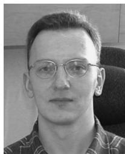

Juri Jatskevich (M’99–SM’07) received the M.S.E.E. and Ph.D. degrees in electrical engineering from Purdue University, West Lafayette, IN, in 1997 and 1999, respectively.

Since 2002, he has been a faculty member at the University of British Columbia, Vancouver, BC, Canada, where he is now an Associate Professor of electrical and computer engineering. His research interests include electrical machines, power electronic systems, average-value modeling, and simulation.

Dr. Jatskevich is presently a Chair of the IEEE

CAS Power Systems & Power Electronic Circuits Technical Committee, an Editor of the IEEE TRANSACTIONS ON ENERGY CONVERSION, an Editor of IEEE POWER ENGINEERING LETTERS, and an Associate Editor of the IEEE POWER ELECTRONICS LETTERS. He is also chairing the IEEE Task Force on Dynamic Average Modeling, under Working Group on Modeling and Analysis of System Transients Using Digital Programs.