# Frequency and transient responses of A 275 kV pressure oil-filled cable: Model validation

Yanfei Liu a , Haoyan Xue c,* , Jesus Morales b , Jean Mahseredjian a , Ilhan Kocar a

a Department of Electrical Engineering, Polytechnique Montr´eal, Montr´eal, QC, H3T 0A3, Canada   
b R&D Division, PGSTech, Montr´eal, QC, H2K 1C3, Canada   
c Power System Division, Powertech Labs Inc, Surrey, BC, V3W 7R7, Canada

# A R T I C L E I N F O

Keywords:

Transients

Frequency responses

POF cable

Model validation

# A B S T R A C T

This paper investigates frequency and transient responses on a 275 kV pressure oil-filled (POF) cable. The modeling methods of the POF cable are discussed. The internal propagation characteristics, i.e., inter-sheath and sheath-pipe modes are further investigated. The reduced model of the POF cable is also studied and compared with the results obtained using the detailed model. The input impedance of the POF cable is evaluated based on various mode currents. Electromagnetic transients are also studied, i.e., energization, fault and lightning stroke. Finally, the results of field measurement are used to validate the transient simulation results.

# 1. Introduction

ELECTROMAGNETIC transient (EMT) simulation plays a significant role in the evaluation of power systems for dynamic and transient responses [1]. Depending on the type of study, the required levels of modeling techniques can be different for the components of power systems.

For high voltage power cables, various models can be used, including a PI section, a constant parameter or a frequency dependent model [2]. In EMT-type simulations, the related simulation models should be selected mainly based on frequency consideration and time-step requirement. In this paper, the focus is on accurate frequency dependent modeling for a 275 kV pressure oil-filled (POF) cable [3], which is a typical pipe-type (PT) configuration [4].

The POF cable is implemented in transmission systems. It has three cable cores with oil-impregnated paper insulation, and the cores are drawn into a steel pipe at the construction site. Each core is equipped with helical skid wires, which facilitate the installation of the cores within the pipe. Once the cores are installed and evacuated, the pipe is filled with pressurized oil up to approximate 1.5 kPa. In the engineering applications, the POF cable is typically used for voltages from 69 kV to 345 kV.

In recent years, the POF cables are largely being replaced by XLPE

cables for new installations due to their superior performance, lower maintenance requirements, and environmental benefits. However, the POF cables remain relevant in specific high voltage legacy systems and some specialized applications where their robustness and long-term reliability are essential.

In the traditional technique, i.e., Cable Constants, the parameters of POF cable can be evaluated using its PT cable function [5]. It basically assumes the infinite pipe thickness without earth-return loop. If the penetration depth is less than the pipe thickness, the voltage is not induced on the outside of the pipe. As a result, the earth-return current loop (pipe to earth) can be assumed to be zero. Then, the pipe serves as the sole return circuit. This method permits to find the internal parameters of different cores using a PT cable model which is based on the formulas initially proposed in [6], and then improved by [7]. These formulas can deal with the eccentricity of multiple cores within a common metallic pipe based on a filament current assumption in each core. The external parameter (earth-return) represented by Pollaczek’s formula [2] is approximately cascaded with internal parameter to set up full matrices of parameters on a PT cable. It leaves a significant assumption that the internal parameters are evaluated using infinite thickness of pipe with superposition of external parameters calculated by an isolated pipe buried in earth. This method is applicable to conductors when proximity effects can be neglected. However, significant

challenges arise in accounting for mutual couplings among the three sheaths and between each sheath and the pipe.

The FEM technique is an alternative approach to overcome the limitations of traditional calculation methods. However, FEM requires dramatically larger computing times which makes it less practical [5].

The recently developed Line/Cable Data (LCD) technique is also available for the computation of the per-unit-length (pul) parameters for PT cables, offering similar accuracy to the FEM method but with much better efficiency. The proposed tool applies the Method of Moments - Surface Admittance Operator (MoM-SO) theory combined with state-ofthe-art formulations [8,9]. As explained in [8], a complete integration of LCD into EMTP® has been realized. The LCD method could be regarded as the most accurate and efficient technique in existing EMT-type simulation software [1] for parameter evaluation of a PT cable. The model validation and study of PT cable in this paper, are based on the LCD technique [8] in EMTP® [10].

In this paper, it presents a model validation study for a 275 kV POF cable using EMTP®. The main study focuses on the internal mode characteristics of the POF cable. In Section III, the configuration and geometrical data of a 275 kV POF cable are introduced. The frequency domain study is performed based on the LCD method. The eccentricity effect and asymmetrical impact of PT cable cores are further investi gated. The influence of the proximity effect is studied using calculated input impedance due to various energized modes. Also, the reduced cable model, which only consists of 3 cores, is validated and compared to the results obtained by the detailed model. In Section IV, the transients due to a three-phase energization, a single-phase to-ground fault and lightning are simulated. Moreover, a set of field measurements is used to validate the cable transient waveforms produced by the LCD method. It further validates the effectiveness of the LCD technique in the study of PT cable.

# 2. Frequency domain study

# 2.1. Description of a 275 kV POF cable

The configuration of a typical POF cable is shown in Fig. 1. Regarding the internal structure of POF cable [3], the resistivities of core, sheath and metallic enclosure (pipe) are $1 . 7 \times 1 0 ^ { - 8 } \Omega \mathrm { m } , 7 . 3 \times 1 0 ^ { - 7 }$ Ωm and $1 . 0 \times 1 0 ^ { - 7 }$ Ωm, respectively. The pipe is a tubular conductor, and its relative permeability is 100. The core radius is 3.11 cm, and the inner and outer radii of the sheath are 5.155 cm and 5.17 cm, respectively. Moreover, the inner and outer radii of the pipe are 15.085 cm and 15.925 cm. The thickness of the outer anti-corrosion cover is 0.45 cm. The relative permittivities of core insulator, pipe filling oil and anticorrosion cover are 3.83, 2.3 and 3.5, respectively. The loss factor of insulation is assumed to be 0.0001.

It should be noted that the sheath of the core (see metallic tapes in Fig. 1) in the POF cable is much thinner than the one used in a singlecore (SC) cable. The skid wire is used to protect the sheath in the core

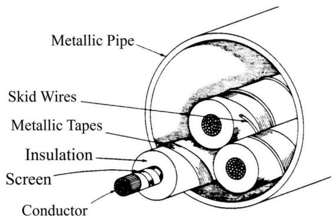  
Fig. 1. A typical pressure liquid-filled high-voltage PT cable [4].

of the POF cable. As a result, the skid wire holds the same potential level on the sheath since it is closely adhered to the cable sheath. Moreover, the cross-sectional area of the skid wire is smaller than that of the cable sheath, with the majority of the current primarily flowing through the sheath. Therefore, the skid wires are neglected in the following study.

The 275 kV POF cable studied in this paper is modelled as buried 3.22 m underground and the soil resistivity of 100 Ωm is assumed to be frequency-independent. The cable length is 3.384 km.

As shown in Fig. 2, four different cable configurations are studied considering various scenarios.

Case 1 and Case 2 are designed to investigate the eccentricity effect due to core positions in the POF cable.

Case 3 is used to study the influence of the asymmetrical configuration of cores in the POF cable.

Case 4 is a full representation of POF cable, which is used to validate the reduced model and field measurement results. The reduced model can be obtained using Kron reduction, and only three cores are left.

Furthermore, the calculation of Z and Y of the POF cable is based on the methods discussed below.

• Method 1: LCD with proximity effect.   
• Method 2: LCD without proximity effect.

Also, the wide-band (WB) cable model [11] is used in the study of this paper.

# 2.2. Influence of eccentricity

Based on the modal analysis in [5,12], the current transformation matrix T at 1 MHz can be obtained using series and shunt parameters of the POF cable. It should be noted that Method 2 is adopted into the calculation of T. The matrix T calculated using Case 1 and Case 2 is given below.

$$
\mathbf {T} _ {\text {C a s e 1}} = \begin{array}{l} \text {C o r e A} \\ \text {S h e a t h A} \\ \text {P i p e} \end{array} \left[ \begin{array}{c c c} 0 & 0 & - 0. 7 \\ 0 & 0. 1 & 0. 7 \\ 1 & - 0. 1 & 0 \end{array} \right] \tag {1}
$$

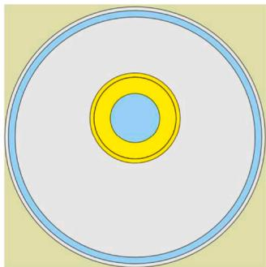  
(a) Case 1

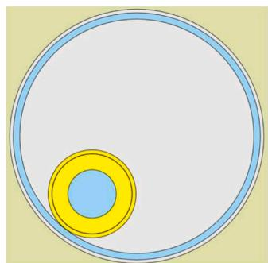  
(b) Case 2

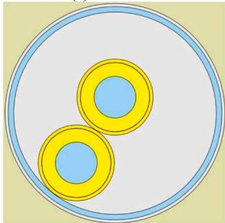  
(c) Case 3

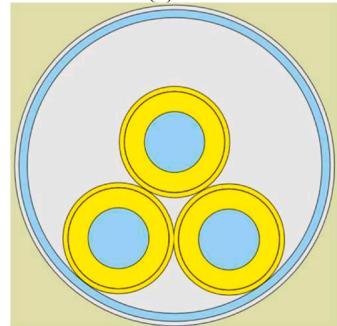  
(d) Case 4   
Fig. 2. Configurations for studying the eccentricity effect and core symmetrical impact in the frequency domain.

$$
\mathbf {T} _ {\text {C a s e 2}} = \begin{array}{l} \text {C o r e A} \\ \text {S h e a t h A} \\ \text {P i p e} \end{array} \left[ \begin{array}{c c c} 0 & 0 & - 0. 7 \\ 0 & - 0. 1 & 0. 7 \\ 1 & 0. 1 & 0 \end{array} \right] \tag {2}
$$

The columns of (1) and (2) represent paths of mode current in the conductor, which corresponds to the rows of (1) and (2). Thus, there are 3 current paths, representing pipe-earth, sheath-pipe, and co-axial modes.

Since the eccentrical effect mainly appears in the sheath-pipe mode, the input impedance is evaluated using the excitation of the current mode shown in Fig. 3. The letters A, B and C represent the phases of the cable respectively.

The input impedance of the sheath-pipe mode on the POF cable is illustrated in Fig. 4. No significant difference is observed for the results calculated using Method 1 and Method 2 on Case 1, because the core is nearly in the center of the cable, and the proximity effect is neglibible.

The input impedance of Case 2 shows a significant influence of eccentricity since a strong proximity effect occurs between sheath and pipe. The impedance with Method 1 (with proximity effect) shows a more stable behavior compared to Method 2. Also, abnormal high frequency oscillations can be observed on the impedance of Method 2 (proximity effect is ignored).

# 2.3. Asymmetrical effect of cores

The matrix T for Case 3 is given in (3), and it has 2 additional modes, co-axial and inter-sheath modes, when compared to Case 1 and Case 2.

$$
\mathbf {T} _ {\text {C a s e 3}} = \begin{array}{c} \text {C o r e A} \\ \text {S h e a t h A} \\ \text {C o r e B} \\ \text {S h e a t h B} \\ \text {P i p e} \end{array} \left[ \begin{array}{l l l l l} 0 & 0 & 0 & - 0. 6 & - 0. 3 \\ 0 & - 0. 7 & - 0. 1 & 0. 6 & 0. 3 \\ 0 & 0 & 0 & - 0. 4 & 0. 5 \\ 0 & 0. 7 & - 0. 1 & 0. 4 & - 0. 5 \\ 1 & 0 & 0. 2 & 0 & 0 \end{array} \right] \tag {3}
$$

The inter-sheath and sheath-pipe mode currents shown in Fig. 5 are used to evaluate the corresponding input impedance.

The calculated input impedances for Case 3 are presented in Fig. 6. The impedances obtained using Method 1 are almost frequencyindependent above 100 kHz for inter-sheath and sheath-pipe modes. Again, the impedance oscillations appeared if the proximity effect is neglected in the calculation.

The full expression of the current transformation matrix on the 275 kV POF cable is given below. It has 2 inter-sheath modes and 1 sheathpipe mode. It should be noted that the current of the inter-sheath mode 2 (the 4th column in (4)) also partially flows through the pipe of the cable, and it becomes a more complex mixed mode due to the asymmetrical configuration of cores.

$$
\mathbf {T} _ {\text {C a s e 4}} = \begin{array}{l} \text {C o r e A} \\ \text {S h e a t h A} \\ \text {C o r e B} \\ \text {S h e a t h B} \\ \text {C o r e C} \\ \text {S h e a t h C} \\ \text {P i p e} \end{array} \left[ \begin{array}{c c c c c c c} 0 & 0 & 0 & 0 & 0. 4 & - 0. 3 & 0. 4 \\ 0 & 0. 1 & 0. 7 & - 0. 3 & - 0. 4 & 0. 3 & - 0. 4 \\ 0 & 0 & 0 & 0 & 0. 4 & - 0. 3 & - 0. 4 \\ 0 & 0. 1 & - 0. 7 & - 0. 3 & - 0. 4 & 0. 3 & 0. 4 \\ 0 & 0 & 0 & 0 & - 0. 4 & - 0. 5 & 0 \\ 0 & 0. 1 & 0 & 0. 4 & 0. 4 & 0. 5 & 0 \\ 1 & - 0. 3 & 0 & 0. 2 & 0 & 0 & 0 \end{array} \right] \tag {4}
$$

The input impedance is calculated based on the mode currents of the sheath-pipe and inter-sheath modes illustrated in Fig. 7. It should be noted that Fig. 7 is referred to Case 4 (see Fig. 2(d)).

As shown in Fig. 8, up to 5 kHz, the input impedances of 3 modes neglecting proximity effect approximately agree to the results obtained

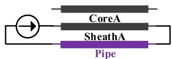  
Fig. 3. Sheath-pipe mode current for Case 1 and Case 2.

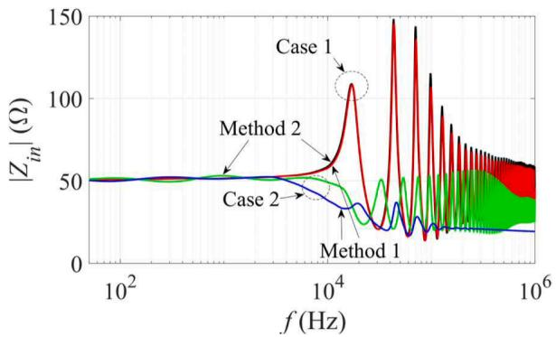  
Fig. 4. Calculated input impedance based on mode current shown in Fig. 3, Method 1: red and blue, Method 2: black and green.

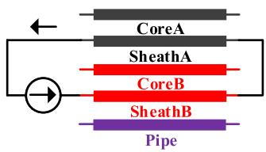  
(a) Inter-sheath

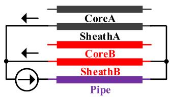  
(b) Sheath-pipe  
Fig. 5. Mode currents for Case 3.

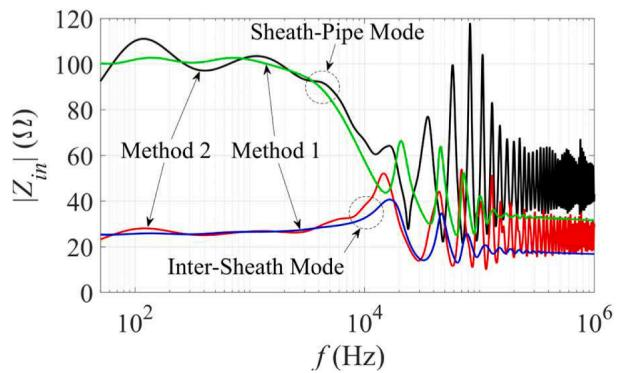  
Fig. 6. Calculated input impedance based on mode currents shown in Fig. 5, Method 1: green and blue, Method 2: black and red.

by Method 1. If the frequency exceeds 50 kHz, the impedance oscillations are observed for Method 2. However, if the proximity effect is considered, the impedances become frequency-independent in the highfrequency, i.e., f > 100 kHz.

# 2.4. Performance of model reduction

In addition to a detailed model of POF cable, the sheath and pipe are assumed to be grounded and reduced from the impedance and admittance matrices using Kron reduction logic [2]. Thus, only 3 core modes are left in the reduced model. If the core voltages are the main study objectives, the reduced model can be more efficient for time-domain computations and its wideband version can be derived more efficiently [11].

As shown in Fig. 9, the input impedances are calculated using positive sequence current in cores. The impedance evaluated by the reduced model shows some differences in comparison to results obtained by the detailed model.

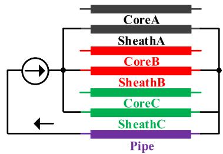

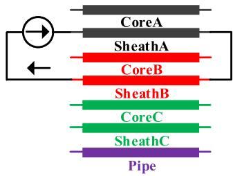  
(a) Sheath-pipe mode   
(b) Inter-sheath mode 1

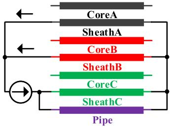  
(c) Inter-sheath mode 2

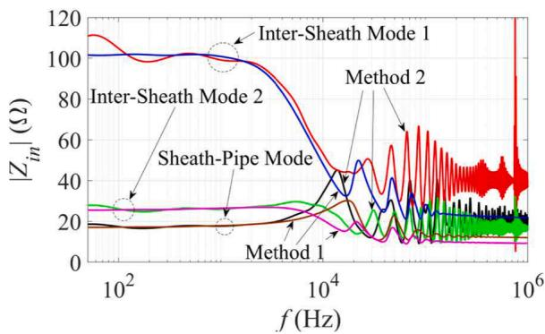  
Fig. 7. Mode currents based on Case 4.   
Fig. 8. Calculated input impedance based on mode currents shown in Fig. $^ { 7 , }$ Method 1: brown, magenta and blue, Method 2: black, red and green.

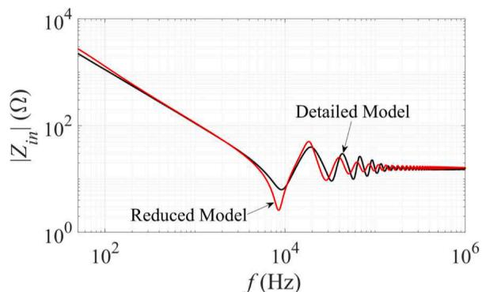  
Fig. 9. Calculated input impedance based on positive sequence currents, detailed model: black, reduced model: red.

# 3. Transient simulations

The transient simulations of 275 kV POF cable are conducted using EMTP with its wideband model. Three-phase energization, single-phase fault, validation with measured results and lightning transient are investigated. The earth’s resistivity and relative permittivity are set to 100 Ωm and 1, respectively.

# 3.1. Three-phase energization

The three-phase energization circuit on the 275 kV POF cable is illustrated in Fig. 10. The AC voltage source is 60 Hz at 275 kV. The switch closing times are 1.652, 1.369, and 1.836 ms for Phase A, Phase B, and Phase C. Also, the sheath and the pipe are grounded through a grounding resistance 1 Ω at both ends.

A comparison of the studied transient models is shown in Fig. 11 and Fig. 12. The reduced model is also used to calculate the core voltages at the receiving end of the cable. The voltages obtained by the reduced model agree qualitatively well with the results calculated by Method 1. The deviation of positive and negative peaks reaches 9.6 % and 2.9 %, respectively, if it is referred to Method 1. Thus, the reduced model can be an appropriate solution for core voltage studies during energization.

The sheath voltages at the receiving end of the cable are shown in Fig. 12. A comparison is made between the results obtained by Method 1 and Method 2. The deviation of positive and negative peaks reaches 8 % and 10.9 %, respectively, if it is referred to Method 1. The waveform of Method 2 still agrees qualitatively well with the waveform of Method 1. It should be noted that the major frequency of the transient wave shown in Fig. 12 is approximately 2.6 kHz. Also, at 2.6 kHz, only minor differences are observed for input impedances shown in Fig. 8 using the two methods.

# 3.2. Single-phase to ground fault

The fault circuit is shown in Fig. 13. Basically, it is the same as the three-phase energization circuit. Phase A fault is applied to the load bus at the receiving end of the cable for a duration of 20 ms. In the steady state, the three phase active power P is 50 MW, and reactive power Q is 24 MVar.

The core voltages of Phase B and Phase C during the fault period are shown in Fig. 14. The reduced model is unable to produce accurate results for low-frequency transients. At 60 Hz, the positive sequence input impedances evaluated by detailed and reduced models are $Z _ { 1 } ~ =$ 1862∠ − 89.7∘ Ω and $Z _ { 1 } = 2 2 6 5 \angle - 8 2 . 4 ^ { \circ } \Omega _ { \scriptscriptstyle }$ , respectively. This major deviation in impedance causes the mismatch for the core voltages shown in Fig. 14. The sheath voltages at the far end of the cable are shown in Fig. 15. No differences are observed between the results evaluated by Method 1 and Method 2. The impact of the proximity effect can be ignored in this case since the transient frequency is low, $\mathrm { i . e . , }$ , around 60 Hz. The time-domain results are consistent with the impedance in the frequency domain shown in Fig. 8.

# 3.3. Impact of grounding resistance

The core voltages at the receiving end of the POF cable are illustrated in Fig. 16. The grounding resistance of sheath and pipe is varied to 1 Ω and 10 Ω. The performance of the reduced cable model is further verified. Method 1 is used in simulations.

More deviations are observed for the results obtained by the reduced model, if the grounding resistance is increased to 10 Ω. As illustrated in

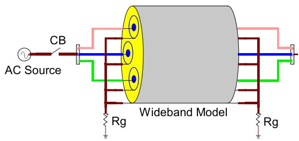  
Fig. 10. Three-phase energization circuit.

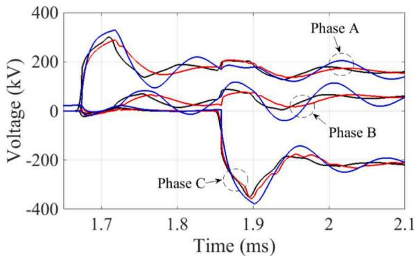  
Fig. 11. Core voltages at the receiving end of the cable, Method 1: black, Method 2: red, reduced model: blue.

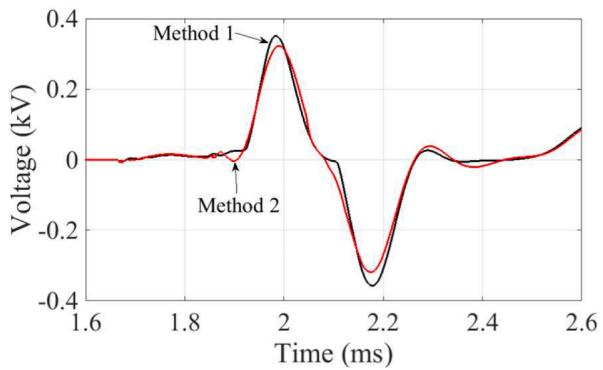  
Fig. 12. Sheath voltages at the receiving end of the cable, Method 1: black, Method 2: red.

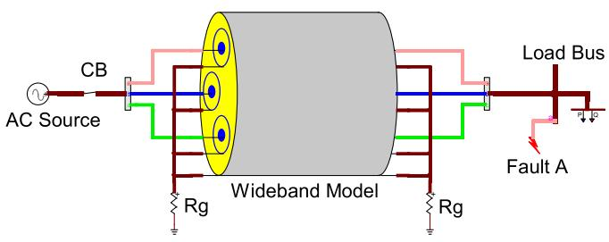  
Fig. 13. Single-phase fault circuit.

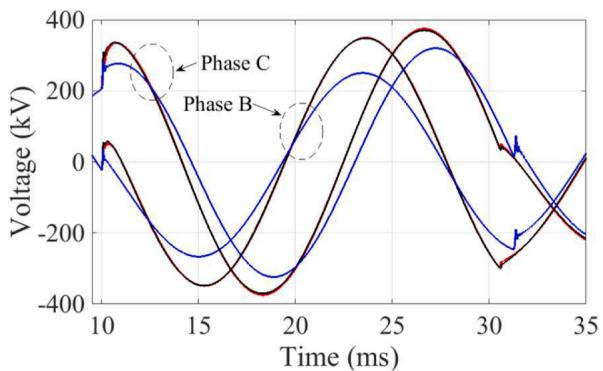  
Fig. 14. Core voltages at the receiving end of the cable, Method 1: black, Method 2: red, reduced model: blue.

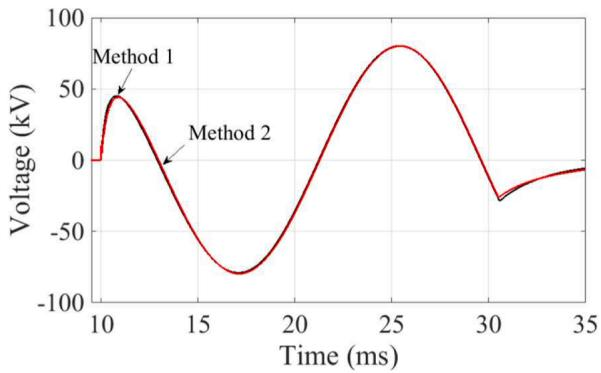  
Fig. 15. Sheath voltages at the receiving end of the cable, Method 1: black, Method 2: red.

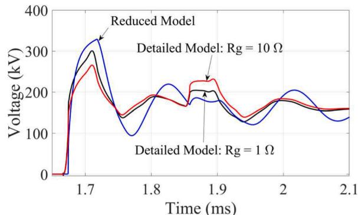

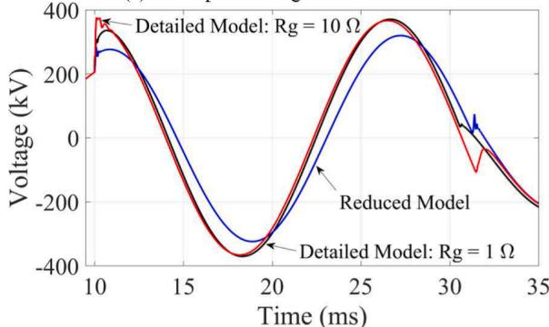  
(a) Three-phase energization: Phase A   
(b) Single-phase fault: Phase C   
Fig. 16. Core voltages at the receiving end of the cable, reduced model: blue, detailed model with Rg = 1 Ω: black, detailed model with Rg = 10 Ω: red.

Fig. 16(a), for $\mathrm { R } g = 1 0 \ \Omega$ the first peak voltage reaches 329.4 kV and 265.4 kV for the reduced model and detailed model, respectively. The Phase C voltage due to single-phase fault is illustrated in Fig. 16(b). A significant difference is also observed for the results obtained by detailed and reduced models. The deviation of first peak value reaches 25.6 % for reduced model with $\mathrm { R } g = 1 0 \ \Omega ,$ , if it is referred to detailed model.

# 3.4. Validation with field measurements

The test circuit of field measurement is shown in Fig. 17. For detailed information on these measurements please refer to [2,3] and references therein. A few minor errata in $[ 2 , 3 ]$ have been further corrected.

Some key features of the test are summarized below. As reported in [2] and [3], two tests are conducted to analyze impulse voltage behavior in the POF cable.

• Grounded pipe

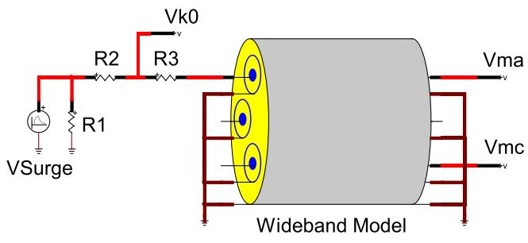  
Fig. 17. Test circuit of 275 kV POF cable.

The metallic pipe is grounded. An impulse voltage with − 4.5 V front peak (2/40 μs wave) is applied between a core conductor and the ground. The impulse voltage is introduced through resistances R1, R2 and R3, as illustrated in Fig. 17. The other two cores are open circuited at the sending and receiving ends. The induced voltage responses can be used to study the impact of internal structure of the cable.

# • Isolated pipe

The metallic pipe is electrically isolated from the ground. The same impulse voltage is applied between the pipe and the ground. All the core and sheath are connected to the pipe. This test mainly involves earthreturn mode energization, and it is out of the scope of this paper.

Considering the grounded pipe situation, the circuit resistances R1 = 800 Ω, R2 = 360 Ω and R3 = 22 Ω. The voltages are measured at sending and receiving ends of the cable, i.e., Vk0 (Phase A), Vma (Phase A) and Vmc (Phase C). The measured points are illustrated in Fig. 17.

The measured and simulated voltages at Vk0 are shown in Fig. 18. The voltage measured at Vk0 can be used to check the time delay and inflection point due to reflection wave superposed on the original impulse wave. The voltage calculated by Method 1 agrees qualitatively well with the measured result, especially the inflection point around 45 ms. A visible deviation of time delay at the inflection point is less than 4 ms between the measured result and Method 1.

The energized core voltage at the receiving end of the cable is shown in Fig. 19. The voltage waveform produced by Method 1 generally agrees well with the measured result. The proximity effect on voltage waveforms is clearly observed around 50 ms. In fact, mixed propagation characteristics that combine co-axial, inter-sheath and sheath-pipe modes occur, and therefore, it leads to an impact of proximity effect on the core voltage.

The induced Phase C voltage at the receiving end is illustrated in Fig. 20. The voltage calculated by Method 1 agrees qualitatively well with the measurement. The major deviation is from the first peak of induced voltage at 7 ms.

It is generally difficult to perfectly reproduce the measurements

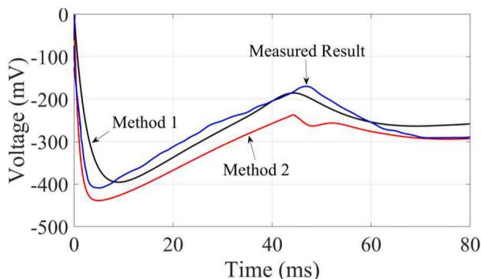  
Fig. 18. Voltages measured at Vk0 shown in Fig. 17, Method 1: black, Method 2: red, Measured Result: blue.

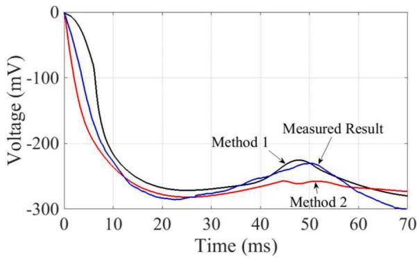  
Fig. 19. Voltages measured at Vma shown in Fig. 17, Method 1: black, Method 2: red, Measured Result: blue.

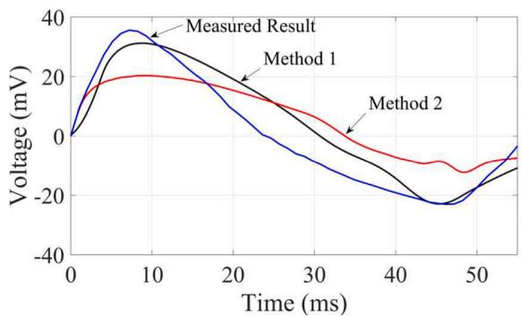  
Fig. 20. Voltages measured at Vmc shown in Fig. 17, Method 1: black, Method 2: red, Measured Result: blue.

using simulations due to numerous uncertainties. Thus, it inevitably generates mismatches and discrepancies between measured and simulated results. However, generally speaking, Method 1 can reproduce the major and key transient characteristics within the POF cable, and the results are much better than those obtained by Method 2.

# 3.5. Lightning transients

In this section, a single lightning stroke analysis with back flashover transient on the 275 kV transmission system is conducted. The circuit in simulation tool is illustrated in Fig. 21 (EMTP® schematic).

Again, the WB model is used to represent the 275 kV overhead lines and the POF cable. The 275 kV double circuit overhead line with its tower [13] is adopted in the study. Each phase consists of 2 bundled conductors. The bundle radius is 15.24 cm, and the radius of each individual conductor is 0.9765 cm. The DC resistances are 0.0643 Ω/km and 0.0684 Ω/km for grounding wire and phase conductor [14], respectively.

The tower is modeled by a Constant Parameter (CP) line model with a pre-defined surge impedance. Considering tower used in this study, the tower surge impedance 173 Ω is obtained based on the equation below [13].

$$
Z _ {\text {t o w e r}} = 6 0 \ln \left\{\cot \left[ \frac {1}{2} \tan^ {- 1} \left(\frac {r _ {\text {a v g}}}{h _ {1} + h _ {2}}\right) \right] \right\} \tag {5}
$$

where $r _ { \tt a v g }$ is the weighted average tower radius, and it is

$$
r _ {\text {a v g}} = \frac {r _ {1} h _ {2} + r _ {2} \left(h _ {1} + h _ {2}\right) + r _ {3} h _ {1}}{h _ {1} + h _ {2}} \tag {6}
$$

with $r _ { 1 } , r _ { 2 }$ and $r _ { 3 }$ represent the radius at top, midsection and base of tower, and h and h represent the height of tower from base to midsection and from midsection to top, respectively.

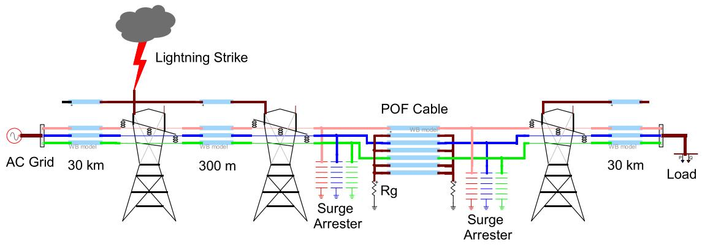  
Fig. 21. A lightning stroke circuit with 275 kV overhead lines and POF cable.

The flashover switch with critical flashover voltage (CFO) 1646 kV is adopted in the simulation. It is a typical value for a 275 kV overhead line [13]. Also, the tower footing resistance is non-linearly represented in EMTP® with an initial low current resistance of 10 Ω.

Moreover, the IEEE frequency dependent surge arrester model is built in the simulation based on standard model parameters in references [15,16].

In fact, the configuration shown in Fig. 21 becomes a typical mixed transmission system which consists of an overhead line and an underground cable [17]. Thus, it experiences more serious transient stress due to impedance discontinuity at the boundary between overhead lines and underground cable.

A 200-kA lightning impulse (3/100 μs wave) is injected on the grounding wire at the first tower. The back flashover can be initiated by the lightning impulse. A 300-m-long overhead line span is inserted at the position before the sending end of the POF cable. The transient core voltages at the sending and receiving ends of the cable due to back flashover at Phase C on the first tower are shown in Fig. 22.

A minor impact due to proximity effect within the cable is observed

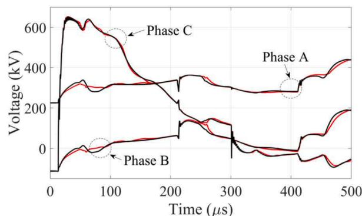

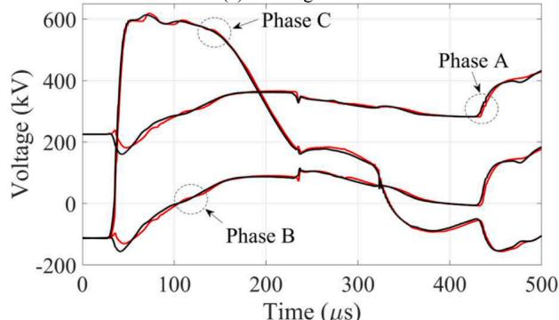  
(a) Sending end   
(b) Receiving end   
Fig. 22. Core voltages of the cable, Method 1: black, Method 2: red.

on the transient core voltages at both ends of the cable.

In fact, the results are based on a single lighting stroke. Thus, a thorough study based on statistical and sensitivity analysis would be performed as future work.

# 4. Conclusions

This paper studies frequency and transient responses on a 275 kV POF cable. The WB model with the LCD method is used in simulations. The following general points are observed.

- The eccentricity and asymmetrical impact of cores have a significant influence on the input impedance of POF cable.   
- The proximity effect shows a major impact on inter-sheath and sheath-pipe modes in the POF cable if the frequency is higher than several kHz.   
- The proximity effect has no significant impact on core voltages during energization and single-phase to ground fault.   
- The simulation waveforms obtained using LCD with proximity effect generally agree with measured results.   
- The reduced model of the POF cable shows better performance for energization than for the single-phase fault. It is also sensitive to the grounding resistance at both ends of cable.   
- The reduced model of the POF cable could be used for core voltage studies.   
- A single lightning stroke analysis is performed. The proximity effect shows a minor impact on core transient voltages.   
- This paper further verifies the effectiveness of LCD method.

# CRediT authorship contribution statement

Yanfei Liu: Investigation, Data curation, Software, Methodology. Haoyan Xue: Software, Methodology, Formal analysis, Conceptualization. Jesus Morales: Validation, Software, Methodology. Jean Mahseredjian: Validation, Supervision. Ilhan Kocar: Validation, Supervision.

# Declaration of competing interest

The authors declare that they have no known competing financial interests or personal relationships that could have appeared to influence the work reported in this paper.

# Appendix

The fitting details of WB model are given in the following Table.

Table I WB model fitting details.   

<table><tr><td>fmin</td><td>0.1 Hz</td></tr><tr><td>fmax</td><td>10 MHz</td></tr><tr><td>Points/Decade</td><td>13</td></tr><tr><td>Decades</td><td>8</td></tr><tr><td>Convergence Tolerance</td><td>2 %</td></tr><tr><td>Fitting Characteristic Admittance Function (Ye)</td><td>0.014989</td></tr><tr><td>Maximum Relative Error</td><td></td></tr><tr><td>Fitting Propagation Function (H)</td><td>27,184.5695</td></tr><tr><td>Maximum Residue/Pole Ratio</td><td></td></tr><tr><td>Fitting Propagation Function (H)</td><td>0.01223</td></tr><tr><td>Maximum Relative Error</td><td></td></tr></table>

# Data availability

No data was used for the research described in the article.

# References

[1] A. Ametani, Numerical Analysis of Power System Transients and Dynamics, editors, IET, 2015.   
[2] A. Ametani, T. Ohno, N. Nagaoka, Cable System Transients: Theory, Modeling and Simulation, Wiley-IEEE Press, 2015.   
[3] N. Nagaoka, M. Yamamoto, A. Ametani, Surge propagation characteristics of a POF cable, Electr. Eng. Japan 105 (5) (1985) 67–75.   
[4] H.W. Dommel, Electromagnetic Transients Program Reference Manual: (EMTP) Theory Book, BPA, 1995.   
[5] A. Ametani, H. Xue, T. Ohno, H. Khalilnezhad, Electromagnetic Transients in Large HV Cable Networks: Modeling and Calculations, IET, 2021.   
[6] J.A. Tegopoulos, E.E. Kriezis, Eddy current distribution in cylindrical shells of infinite length due to axial currents, part II - shells of finite thickness, IEEE Trans. Power Appar. Syst. PAS-90 (1971) 1287–1294.   
[7] G.W. Brown, R.G. Rocamora, Surge propagation in three-phase pipe-type cables, part I ߞUnsaturated pipe, IEE Trans. Power Appar. & Syst. PAS-95 (1) (1976) 89–95.   
[8] J. Morales, H. Xue, J. Mahseredjian, I. Kocar, A new tool for calculation of line and cable parameters, Electr. Power Syst. Res. 220 (2023).

[9] H. Xue, A. Ametani, J. Mahseredjian, I. Kocar, Computation of overhead line /underground cable parameters with improved MoM - SO method, in: Power Systems Computation Conference (PSCC), Dublin, 2018.   
[10] J. Mahseredjian, S. Denneti`ere, L. Dub´e, B. Khodabakhchian, L. G´erin-Lajoie, On a new approach for the simulation of transients in power systems, Electr. Power Syst. Res. 77 (11) (2007) 1514–1520.   
[11] A. Ramirez, J. Morales, J. Mahseredjian, I. Kocar, Advanced wideband line /cable modeling for transient studies, IEEE Trans. Power Delivery 39 (5) (2024) 2956–2964.   
[12] I. Lafaia, J. Mahseredjian, A. Ametani, M.T. Correia de Barros, I. Koçar, Y. Fillion, Frequency and time domain responses of cross-bonded cables, IEEE Trans. Power Delivery 33 (2) (2018) 640–648.   
[13] R. Bhattarai, R. Rashedin, S. Venkatesan, A. Haddad, H. Griffiths, N. Harid, Lightning performance of 275 kV transmission lines, in: 43rd International Universities Power Engineering Conference, Padua, Italy, 2008.   
[14] W.A. Chisholm, Y.L. Chow, K.D. Srivastava, Travel time of transmission towers, IEEE Trans. Power Appar. & Syst. PAS-104 (1985) 2922–2928.   
[15] Working Group 3.4.11, Modeling of metal oxide surge arresters, IEEE Trans. Power Delivery 7 (1) (1992) 302–309.   
[16] EMTP® Tutorial Course, Metal-oxide surge arrester (ZnO) modeling for EMT simulations. https://www.youtube.com/watch?v=fDuEg80aKwI, 2020.   
[17] H. Xue, J. Mahseredjian, J. Morales, I. Kocar, A. Xemard, An investigation of electromagnetic transients for a mixed transmission system with overhead lines and buried cables, IEEE Trans. Power Delivery 37 (6) (2022) 4582–4592.