# Adaptive-Grained Exponential Integrator Algorithm for Efficient Simulation of Power Converter Systems

Jared Paull , Graduate Student Member, IEEE, Carl Knickle , Member, IEEE, Nicole Lofroth , Member, IEEE, Liwei Wang , Senior Member, IEEE, and Wei Li , Member, IEEE

Abstract—Electromagnetic transient (EMT) simulation is increasingly important for complex power electronic converter system design and validation. This paper proposes an adaptive-grained exponential integrator (AGEI) algorithm designed to efficiently simulate power electronic networks. The AGEI algorithm relies on precomputation of carefully-chosen discretization steps to reduce memory burden. It then performs sequential intermediate integrations between discrete switching events to accelerate transient simulation. The variable time-step, high-order integration algorithm finds a balance between simulation run-time and computational overhead. The AGEI algorithm varies the number of the forcing function terms to meet desirable error thresholds. The proposed algorithm is L-stable and can be flexibly applied to stiff and non-stiff circuit systems, rendering it suitable for a wide arrange of power converter topologies and parameters. A hardware experimental study validates the AGEI algorithm’s accuracy while simulation case studies demonstrate the AGEI algorithm significantly improves numerical efficiency. It is shown in the typical converter case studies that the proposed algorithm enables more than 8-fold and 3-fold simulation speedup compared to popular simulation tools, i.e., Simulink and PLECS, respectively. The numerical efficiency gains of the proposed algorithm become more apparent for power converter circuits with only-DC input sources or stiff circuit systems.

Index Terms—Adaptive-grained exponential integrator (AGEI), discrete-state event-driven (DSED) simulation, state-space equation, electromagnetic transient simulation, power electronic system.

# I. INTRODUCTION

E LECTRO-MAGNETIC transient (EMT) simulation ofpower electronic converter circuit is a historically challenging task. Power converter circuits contain switching elements that rapidly change the circuit topologies. Frequent switching events introduce complex transients and alters the system matrices used to express the circuit. Demand for numerically

Received 16 March 2024; revised 23 July 2024 and 22 October 2024; accepted 1 February 2025. Date of publication 7 February 2025; date of current version 20 March 2025. This work was supported by the Natural Sciences and Engineering Research Council (NSERC) of Canada. Paper no. TPWRD-00424-2024. (Corresponding author: Liwei Wang.)

Jared Paull, Carl Knickle, Nicole Lofroth, and Liwei Wang are with the School of Engineering, University of British Columbia Okanagan, Kelowna, BC V1V 1V7, Canada (e-mail: jared.paull@ubc.ca; carlknickle@gmail.com; nicolelofroth@icloud.com; liwei.wang@ubc.ca).

Wei Li is with the OPAL-RT Technologies, Montréal, QC H3K 1G6, Canada (e-mail: wei.li@opal-rt.com).

Color versions of one or more figures in this article are available at https://doi.org/10.1109/TPWRD.2025.3539681.

Digital Object Identifier 10.1109/TPWRD.2025.3539681

efficient EMT simulation algorithms increases as power electronic systems grow increasingly complex. Fast EMT simulation aids in design and validation of existing or emerging power converter technologies [1]. Simulation of power electronic circuits involves in the integration of continuous state variables (currents and voltages), while accurately capturing converter switching behavior. Power electronic circuits often present numerically stiff problems, making the solver choice non-trivial. Low order implicit integration methods such as trapezoidal rule, backwards Euler method, or low order numerical differentiation formula are often used to guarantee numerical stability. These low order methods generally require a small discretization time-step to ensure accuracy, leading to many computed points. Additionally, small fixed time-step solvers are often implemented to accurately capture switching events [2]. Imprecise switching event detection can inject low order harmonics into waveforms or introduce unrealistic jitter, noise, and inductive current chopping [2], [3]. Switching interpolation techniques can be used to greatly reduce errors associated with switching event detection in fixed step solvers [3].

Variable time-step solvers serve as an alternative to fixed time-step solvers. Variable time-step solvers have been used to accurately pinpoint discrete switching events, eliminating the need for switching interpolation [4]. Variable step solvers reduce the step size when transients occur and then increase the step size once steady state is achieved [5]. By adapting the step size according to system transient behavior, both fast and slow transient phenomena can be captured with maximum efficiency [6]. The challenge with variable step solvers lies in choosing the suitable step size. It is not always clear when transient ends, or if all frequency transients have ended [6]. In [6], variable step algorithms are proposed which analyze transient trends to adapt the step size accordingly. Variable step solvers typically implement low order integration techniques which limit the maximum step size that they can use [4], [5], [6], [7], [8]. Although the variable-step techniques [4], [5], [6], [7], [8] in general compute fewer points than fixed-step solvers, these low-order variable-step solvers still require numerous computed points between switching events to ensure numerical accuracy. Still, variable step solvers are prevalent for offline EMT simulation of power electronic systems. Popular EMT simulation tool such as PLECS is equipped with the variable step Dormand-Prince (DOPRI) solver, while Simulink/Simscape Electrical toolbox utilizes Simulink suite of variable step ODE solvers including ode45, ode15s, ode23tb, amongst others. Recently, a variable

step Taylor-series-based ODE solver has found success for EMT simulation [9], [10]. The Taylor series ODE solver is well suited for both step-size and numerical order adjustments. However, since the Taylor-series-based ODE solver is explicit, their numerical efficiency is affected by its limited numerical stability region (being not A-stable) [9], especially for stiff circuit network where a small time step is required to maintain numerical stability.

Nowadays, commercial circuit simulators incorporate either a nodal analysis approach or a state-space equation approach. The nodal analysis approach discretizes the circuit at the branch level with low order techniques such as trapezoidal or Euler’s method. The state-space equation approach provides a complete system description in the form of state-equations. Higher order discrete time formula can then be applied to the state-equation representation. Accordingly, state-equation based solvers can benefit from more accurate solver techniques [11]. In the presence of switching, nodal-based approaches have benefited from system equations that are easy to obtain and recalculate [1]. State-equation solvers rely on the system’s state-space matrices to solve the system of ordinary differential equations (ODEs). Obtaining the system matrices is a non-trivial task as traditional automatic state equation generation methods are not equipped to efficiently handle switching elements [12]. However, many techniques exist and are commonly used in simulation tools for automatic state equation generation of power electronic converters [12], [13], [14], [15]. Recently, an automated semi-symbolic state equation generation method is presented which greatly reduces the cost to find the system matrices per computation point [16]. Using this methodology, state equations can be automatically derived as a function of switch state before simulation runtime, making recalculation trivial.

Numerical integration algorithms are not the only factor influencing simulation efficiency. Simulation framework is equally important. Traditionally, transient simulations were entirely time driven, meaning the discretization time-steps were based on a predetermined scheme. In [17], a discrete-state event-driven (DSED) simulation framework was proposed which adjusts integration order and time-step size dynamically, based on an eventdriven mechanism. The DSED solver determines discretization time-step using a converter’s digital control signals, allowing for intelligent step size selection, based on predicted switching events. The DSED method has served as an essential framework for other innovative power electronic circuit solvers in [9], [18].

In [9], the DSED method works in conjunction with the developed flexible-adaptive (FA) algorithm, resulting in a highspeed non-stiff circuit solver. The FA algorithm accepts variable time-step sizes from the DSED framework and adjusts the integration order to ensure an error threshold is met. The DSED solver only re-calculates the system states whenever a switching or control event occurs within the circuit, reducing the total number of intermediate calculated points between the events. It is shown in [18] and [9] that the DSED framework paired with the FA algorithm is orders of magnitude faster than commercial power converter circuit simulators, e.g., PLECS and Simulink/Simscape Electrical toolbox. However, the FA algorithm proposed in the DSED framework is not suitable

for stiff ODE system, leading to slow simulation speed in the event of small system time constants. In [19], a backward differentiation formula (BDF)-based DSED solver is proposed to handle network stiffness when discretizing state equations. The backwards DSED (BDSED) solver is slightly more computationally efficient than Simulink’s existing ode15s solver. The BDSED solver requires many discretization steps between switching events, reducing the speedup and making it non-ideal for non-stiff systems.

Exponential integrators are an alternative to both low order discretization methods, and Taylor-series-based approximations. Given that low order discretization methods are based on truncated Padé approximations, increasing the discretization order can serve to increase accuracy, stability, and to eliminate numerical oscillation. This concept was first introduced into EMT simulation by Watson in [20], where the so-called root-matching (exponential) method was proposed to replace the trapezoidal rule in nodal analysis. By using high order exponentials, the solver eliminated numerical oscillation while retaining stability, which enables better handling of discrete events. However, the root matching methods in [13] and [14] rely on small, fixed time-step to maintain numerical accuracy.

Prior-art implementations of the exponential integrator are typically for power system transient simulations, which uses either a phasor model or an average value model (AVM) of power converters. In [21], [22], [23], the exponential integrator algorithm was used for time domain simulation of verylarge-scale-integration (VLSI). However, the formulation and scale of these circuits are not comparable to the detailed model (DM) formulation of power electronic converters. In [24], the exponential integrator is applied to large-scale power delivery networks, which are formulated as differential-algebraic equations (DAEs). The network was formulated as a simple RLC network with time-varying supply voltage and current sources [24], i.e., without semiconductor switching involved. In [25], the exponential integrator is implemented specifically for simulation of large-scale nonlinear circuits. The method was designed specifically for DAE formulation of VLSI systems. In [26] and [27], exponential integrator is applied to a large-scale network for electromagnetic transient simulation using GPU and AVM of power converters. Within the limited quantity of existing literature on exponential integrator algorithms for DMs of power converters, all the prior-art solvers are fixed-step fixedforcing function term solvers. In [28], exponential integrator is used for simulation of large-scale wind farms using detailed models of a wind farm. The solver is fixed step, fixed order, and specifically designed for large-scale networks, i.e., scale of hundreds to thousands of system states. In [29] and [30], exponential integrator is utilized for DM of power electronic converters. However, the proposed ART solver [29], [30] is of fixed step, fixed order, and specifically designed for real-time simulation. Meaning, the ART solver uses a limited maximum step size due to the use of single forcing function term, hence limiting its simulation efficiency. There is no prior-art work on DM exponential integrator solvers using variable time-step and incorporating the DSED framework. The proposed solver in this

paper focuses specifically on DM simulation of power electronic converters.

This paper proposes a new power converter simulation algorithm based on the exponential integrator. The key attributes of the proposed algorithm, and overall contributions of this paper are summarized as follows.

1) A high-order, variable time-step, variable forcing function term exponential integrator solver is proposed with computation techniques that enables numerically efficient simulation of complex power converter systems. The proposed exponential integrator algorithm utilizes the DSED framework to implement variable time-step solver, which decreases the number of computed points, leading to a significant speedup compared to existing solvers.   
2) An adaptive-grained approach is proposed to precompute the matrix exponentials before simulation execution. The proposed adaptive-grained precomputation method greatly accelerates the simulation efficiency of the proposed exponential integrator. The adaptive-grained approach separates an overarching time-step size into sequential grained step sizes, drastically reducing the number of precomputed terms.   
3) The proposed algorithm is fully explicit, L-stable, and suitable for dynamic topology or step-size adjustments. For stiff circuits, the proposed algorithm demonstrates significant speedup of simulation efficient, compared to commonly used power electronic circuit solvers. For non-stiff circuits, the proposed algorithm has comparable efficiency to the fastest explicit solvers, proposed in [9], [10], [11].

# II. BACKGROUND ON EXPONENTIAL INTEGRATOR

This section introduces exponential integrator for solving state space equations. Recent progress in numerical computation of matrix exponential techniques is applied to the proposed power electronic circuit solver. The numerical stability of the exponential integrator is discussed in this section to illustrate the advantage of the proposed power electronic circuit solver for the efficient simulation of stiff ordinary differential equation (ODE) system.

# A. Exponential Integrator for Solving State-Space Equation

A power converter system consists of passive elements, independent sources, switches, controllers, and other electrical components, which can be modeled by a piece-wise linear system in the form of state-space equation as

$$
\dot {x} (t) = A _ {k} x (t) + B _ {k} u (t)
$$

$$
y (t) = C _ {k} x (t) + D _ {k} u (t) \tag {1}
$$

where x is a set of independent system states, u is a set of the independent inputs of the system, y is a set of the outputs of the system, and $A _ { k } , B _ { k } , C _ { k } , D _ { k }$ are the state-space matrices which are temporal and dependent on switch states.

The state-space equation in (1) can be solved analytically using the exponential integrator as

$$
x _ {n + 1} = e ^ {A _ {k} h} x _ {n} + \int_ {t _ {n}} ^ {t _ {n} + h} e ^ {A _ {k} \left(t _ {n} + h - \tau\right)} B _ {k} u (\tau) d \tau \tag {2}
$$

where the integration time step is $h ; x _ { n }$ and $x _ { n + 1 }$ are the states at $t _ { n }$ and $t _ { n + 1 }$ , respectively.

The solution of $x _ { n + 1 }$ in (2) is composed of two parts in summation, i.e., homogenous solution and forcing-functiondependent solution, involving the input source vector $u ( t )$ . The forcing-function-dependent solution in (2) can be expanded using Taylor series as [31]

$$
x _ {n + 1} = e ^ {A _ {k} h} x _ {n} + \sum_ {j = 1} ^ {\infty} \varphi_ {j} \left(A _ {k} h\right) h ^ {j} B _ {k} \frac {d ^ {(j - 1)} u _ {n}}{d t ^ {(j - 1)}} \tag {3}
$$

where the so-called ϕ-function is defined as

$$
\varphi_ {j} (z) = \frac {1}{(j - 1) !} \int_ {0} ^ {1} e ^ {(1 - \theta) z} \theta^ {j - 1} d \theta , j \geq 1. \tag {4}
$$

It is noted that the exponential integrator (3) is an explicit ODE solver of state-space (1). Calculations of the matrix exponential $e ^ { A _ { k } h }$ and the ϕ-functions in (4) are essential for the exponential integrator (3). Many numerical techniques have been developed for the calculation of both the matrix exponential and accompanying ϕ-functions, as summarized below.

1) Computing the Matrix Exponential: Calculation of the matrix exponential is a classic problem. There are two common ways to calculate the matrix exponential, either by a Padé approximation, or by using Krylov subspace. Krylov subspaces have been shown to be effective in exceptionally large systems [21]. For smaller systems involving detailed power-electronic switching transients, the Padé-based methods are more efficient [32]. A Padé approximation is a rational function that represents the ratio of two power series. The order of a Padé approximation is defined by a $( p , q )$ pair representing the order of the numerator and denominator power series, respectively. For example, a (3, 3) Padé approximation to the matrix exponential is expressed as

$$
e ^ {A _ {k} h} = \frac {I + A _ {k} h / 2 + \left(A _ {k} h\right) ^ {2} / 1 0 + \left(A _ {k} h\right) ^ {3} / 1 2 0}{I - A _ {k} h / 2 + \left(A _ {k} h\right) ^ {2} / 1 0 - \left(A _ {k} h\right) ^ {3} / 1 2 0}. \tag {5}
$$

For power converter circuit solvers, the discretization order is referred to as $p + q$ for its equivalent $( p , q )$ Padé approximation. For instance, the $2 ^ { \mathrm { n d } } .$ -order trapezoidal rule approximates the homogeneous solution in (2) using a (1, 1) Padé approximation [29]. Fixed high-order discretization methods are introduced in [29], [30] which use a (2, 3) Padé and (4, 5) Padé approximations, respectively. It is well understood that Padé approximations of the matrix exponential are optimally computed by selecting diagonal approximates, i.e., $p \ = \ q \ [ 3 3 ]$ ]. Commonly denoted to as a $( q , q )$ Padé approximation or referred to as a diagonal Padé approximation. The algorithm proposed in [34], and [35] utilizes a scaling and squaring technique alongside an optimized Padé approximation algorithm. The algorithm varies the diagonal Padé approximation order to optimally reduce

truncation error. The minimum order used in [34], [35] is a (3, 3) Padé approximation making it a $6 ^ { \mathrm { { t h } } }$ order discretization technique. With respect to power electronic converter transient simulation, this technique is considered a high-order solver.

2) Computing the ϕ-Functions: Computing the ϕ-functions are more challenging than computing the matrix exponential due to its exponential integration form. The $\varphi \cdot$ -functions are defined in (4), which is commonly solved by a recursive formula as

$$
\varphi_ {j} (z) = z \varphi_ {j + 1} (z) + \frac {1}{j !}, \quad \varphi_ {0} = e ^ {z}, \tag {6}
$$

or by a pth order Taylor series expansion as [31]

$$
\varphi_ {j} (z) = \sum_ {n = 0} ^ {p} \frac {z ^ {n}}{(j + n) !}. \tag {7}
$$

The recursive form in (6) is suitable when the eigenvalues of z are large but fails as the determinant of z approaches or becomes zero [36]. The Taylor series in (7) is accurate when the eigenvalues of z are small but requires excessive terms for stiff systems. Studies have shown that there are additional scenarios where both methods yield incorrect approximations [37], making a conjoined approach infeasible. In [36], a scaling and modified squaring approach is presented alongside other more novel methods. However, the computation is higher than the scaling and squaring method for matrix exponential. Recently, a simultaneous computation algorithm is presented in [38] based on the work in [39]. The proposed algorithm calculates the matrix exponential and accompanying $\varphi$ functions simultaneously by performing the matrix exponential of a modified matrix. The most efficient method to calculate $\varphi$ functions involve a composite approach implementing scaling and modified squaring alongside a simultaneous computation approach [38]. Using this methodology, there are no restrictions on the form of the $A _ { k }$ matrix, making it widely applicable for electric circuit simulation.

# B. Numerical Stability of Exponential Integrator

The ϕ-function-based exponential integrator in (3) is fully explicit, eliminating the need to solve an implicit algebraic equation. Conventional explicit ODE solvers make trade-off between computation complexity and numerical stability. However, the exponential integrator is both explicit and numerically stable. Numerical stability of a given numerical ODE solver is defined based on the behavior of a test system as [40]

$$
\dot {x} = \lambda x. \tag {8}
$$

The stability region R is defined as the set of complex numbers z, with $z ~ = ~ h \lambda$ such that $\vert x _ { n + 1 } \vert < \vert x _ { n } \vert$ in the test system of (8). Intuitively, the stability region is where the homogeneous solution converges to zero. An algorithm is called A-stable if the stability region contains the entire left-half plane, the algorithm is further L-stable if the decay speed increases as $\mathrm { R e } \{ \lambda \}$ moves further negative. The exponential integrator’s stability region is found by applying the homogeneous solution of (3) to the test

system in (8), producing

$$
x _ {n + 1} = e ^ {h \lambda} x _ {n} \Rightarrow \frac {\left| x _ {n + 1} \right|}{\left| x _ {n} \right|} = \left| e ^ {h \lambda} \right|. \tag {9}
$$

The cases for all $\mathrm { R e } \{ \lambda \} < 0$ in (9) results in $\frac { | x _ { n + 1 } | } { | x _ { n } | } < 1$ or |xn | $\vert x _ { n + 1 } \vert < \vert x _ { n } \vert$ , demonstrating the exponential integrator is Astable. Furthermore, the exponential integrator is L-stable, given the decay rate increases as $\mathrm { R e } \{ \lambda \}$ moves further negative.

In power electronic converter simulations A-stable methods guarantee converging numerical solution regardless of step-size or system stiffness. However, A-stable methods may exhibit numerical oscillation due to circuit topology switching, discontinuity, or the presence of small network time constants. On the other hand, L-stable methods (e.g., Backward Euler or Gear’s 2nd order method) will converge regardless of step-size or stiffness with no numerical oscillation, which makes L-stable algorithms the most desirable solvers for power electronic converter simulation due to fast-transients associated with high frequency switching.

# III. ADAPTIVE-GRAINED SIMULATION FRAMEWORK

The proposed adaptive-grained exponential integrator (AGEI) algorithm is a variable time-step ODE solver based on an adaptive-grained precomputations of matrix exponential and ϕ-functions. The resulting algorithm has all the benefits of the exponential integrator’s numerical stability and gains significant simulation speedup due to the precomputations. This section focuses on the simulation framework of the AGEI algorithm, combined with discrete state event scheduling of power converter systems.

# A. Variable Time-Step Simulation Using Exponential Integrator With Fixed-Order Scheme

The state-equation matrices of a power electronic circuit are time-variant and depend on the states of both controllable and uncontrollable switches. The general semi-symbolic state equations can be pre-generated using the algorithm proposed in [16], while the specific state equations at $t \ = t _ { k }$ can be found by extracting the switching states using the DSED technique in [17]. The technique utilizes a digital controller’s zero-orderhold (ZOH) placed on the modulation signal within a control cycle $( T _ { \mathrm { S W } } )$ ). By comparing the constant modulation signal with the carrier signal all discrete switching events are known for an entire control cycle, illustrated in Fig. 1. The step size is then adjusted precisely to when the switching event occurs for maximum accuracy, as shown in Fig. 1(c).

The proposed high-order ODE solver incorporates both variable step-size and variable forcing-function terms in (3). While the proposed algorithm does not vary the discretization order (i.e., the order of a Padé approximation) of the matrix exponential in the homogeneous solution in (3), the number of forcing-function terms in (3) varies to meet desired error thresholds. Thus, the proposed algorithm is a variable step-size fixed high-order ODE solver with variable forcing-function terms. Variable step-size algorithms may be the optimal framework

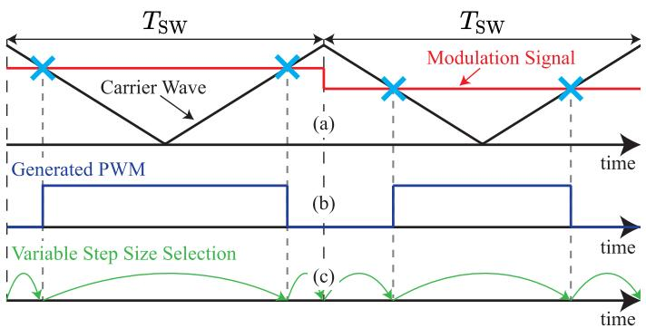  
Fig. 1. Variable step selection scheme of high order EI solver. (a) Carrier and modulation wave overlapped to show switching instants. (b) Generated PWM. (c) Step-size selection scheme based on generated PWM.

for efficient simulation of power electronic converter systems, compared to a fixed step-size low-order ODE solver [9]. The advantages are well understood, variable step-sizes allow the solver to calculate only at switching points, decreasing the total number of simulated points. Additionally, dynamic controllable accuracy allows the solver to incorporate supplementary forcingfunction terms for large steps or a minimal number of terms for smaller step sizes, eliminating unnecessary computation and reducing the need for step-size adjustments.

The proposed variable time-step, high-order, variableforcing-function-term exponential integrator is shown in the flowchart of Fig. 2. The solver starts by receiving a variable step-size using the DSED scheme, then truncating the analytical series in (3) up to the pth term such that the LTE is less than a desired error tolerance $\left( \varepsilon _ { t o l } \right)$ . For a series up to the pth term, the LTE is the remaining terms from $( p + 1 )$ and beyond. For numerically non-stiff systems, the terms in the series of (3) are strictly decreasing at a rapid rate, for stiff systems the rate of decrease is slower. Accordingly, the LTE can be approximated using the $( p + 1 )$ th term of the original series, as in

$$
\begin{array}{l} \varepsilon = \sum_ {j = p + 1} ^ {\infty} \varphi_ {j} \left(A _ {k} h\right) h ^ {j} B _ {k} \frac {d ^ {(j - 1)} u _ {n}}{d t ^ {(j - 1)}} \\ \approx \varphi_ {p + 1} \left(A _ {k} h\right) h ^ {p + 1} B _ {k} \frac {d ^ {(p)} u _ {n}}{d t ^ {(p)}}. \tag {10} \\ \end{array}
$$

The evaluation of the LTE equation in (10) is numerically efficient as the error estimate is also the next term in the series of the forcing-function solution in (3), eliminating additional computation to approximate the LTE. For an incredibly stiff system with a low switching frequency, the number of terms may become large, a maximum number of permitted $\varphi$ functions $\left( q _ { \mathrm { m a x } } \right)$ is assigned for practical implementation. If the maximum number of terms is reached and the error has not converged, the step-size is decreased by half to redo the exponential integration calculation. The exponential integrator effectively captures the eigen-structure of the system in the matrix exponential and $\varphi$ functions, thus the number of terms required is normally small. Furthermore, the input function u is often DC or AC with a relatively low fundamental frequency (e.g., 50 or 60 Hz),

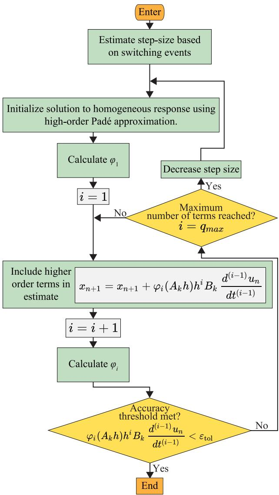  
Fig. 2. Flowchart of variable-step high-order variable-forcing-function-term exponential integrator algorithm.

leading to small number of forcing-function terms in the exponential integrator solution in (3). Regardless of the number of forcing-function terms needed, the numerical errors introduced in the calculation of matrix exponential and $\varphi -$ functions are very small since a high-order Padé approximation technique is used to calculate the matrix exponential and the $\varphi \cdot$ functions. This algorithm serves as the building block for the AGEI solver with precomputation, introduced in the following subsection.

# B. Adaptive-Grained Algorithm With Precomputations of Matrix Exponential and ϕ-Functions

The matrix exponential and the $\varphi -$ functions need to be recalculated whenever the power electronic circuit topology or the simulation time step changes. Updating the matrix exponential and ϕ-functions during simulation execution is numerically expensive, leading to excessive simulation burden. Since switching time and the corresponding step size are only known once a

switching event or discrete-control event occurs, precomputations of the matrix exponential and the ϕ-functions for arbitrary integration step size are impossible.

However, power converter circuit topologies and pre-defined simulation time-step sizes can be used for the precomputations of these terms, prior to simulation execution. For a given converter circuit, all possible switching topologies are found in advance by cycling through the allowable switching configurations. For a circuit with n switches, there are $2 ^ { n }$ possible topologies. However, power electronic circuits often contain complimentary pairs of switches, significantly decreasing the total number of unique topologies. Additionally, the range of possible discretization step-sizes can be found in advance. The minimum possible step size is determined by the user or by the granularity of the switching signals, whereas the maximum possible step size is determined by the highest switching frequency (smallest switching period) in the system. It is critical to know the maximum step-size to avoid unnecessary precomputation and storage. The carrier signal with the smallest switching period will determine the maximum step-size, since a switching event must occur within a control cycle for each carrier signal. In a multifrequency carrier system, the switching events from the smallest switching period carrier will then occur continuously and repeatedly within the switching period of lower frequency converters. With both the minimum and maximum time-step sizes known, all intermediate step sizes are simply a multiple of the minimum step size up to the maximum step size. This range could be potentially large depending on the minimum step-size granularity and the switching frequency. With the possible circuit topologies and the range of discretization step sizes known, all possible $A _ { k } h$ combinations can be used to precompute the matrix exponential and ϕ-functions. A circuit with $2 ^ { n }$ unique topologies, and m unique discretization step sizes requires $2 ^ { n } m$ precomputed matrix exponential terms and $2 ^ { n } m q _ { \mathrm { m a x } }$ precomputed ϕ-function, where $q _ { \mathrm { m a x } }$ is the maximum ϕ-function term used in the numerical integration.

If n or m is large, the number of precomputed terms can be enormous, which motivates an adaptive-grained step-size precomputations approach. The adaptive-grained algorithm drastically reduces the total number of precomputed terms by decreasing the number of pre-defined discretization time-steps. It functions by decomposing a single large time-step into multiple smaller time-steps of different orders of magnitude. Then, instead of precomputing for every possible step-size between the minimum and maximum step-sizes, only the scaling factors of 1–9 for each magnitude step size are used for the precomputations of the matrix exponential and the ϕ-functions.

Consider a fictitious power converter circuit, where there are 100 unique topologies with a minimum step-size granularity of $0 . 1 \mu \mathrm { s }$ and a maximum step-size of 99.9 μs. Thus, there are $( \frac { 9 9 . 9 \mu \mathrm { s } } { 0 . 1 \mu \mathrm { s } } ) = 9 9 9$ possible discretization time-steps. Without the adaptive-grained approach, there are 99, 900 matrix exponential terms, and $9 9 , 9 0 0 q _ { \mathrm { m a x } }$ ϕ-function terms that must be precomputed. On the other hand, the adaptive-grained approach only requires the precomputations at the following discretizing steps: $( 0 . 1 \mu \mathrm { s } , 0 . 2 \mu \mathrm { s } , . . . 0 . 9 \mu \mathrm { s } , 1 \mu s , 2 \mu \mathrm { s } , . . . , 9 \mu \mathrm { s } , 1 0 \mu \mathrm { s } , 2 0 \mu \mathrm { s } , . . . \mathrm { . } .$ $9 0 \mu \mathrm { s } )$ . By only computing each order of magnitude scaled

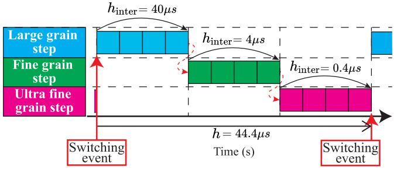  
Fig. 3. Adaptive-grained algorithm example.

by one through nine, the total number of discretization steps decreases from 999 to 27. Now, only 2700 matrix exponential and $2 7 0 0 q _ { \mathrm { { m a x } } }$ ϕ-functions will be precalculated, decreasing the total number of precalculated terms by $9 7 , 2 0 0 ( 1 + q _ { \mathrm { m a x } } )$ , a decrease of 92%. The consequence of this approach is that a single discretization time-step between switching events may not be applied. Instead, sequential integrations will be performed, where each integration corresponds to the pre-defined time steps with different orders of magnitude. The AGEI algorithm greatly reduces precomputation burden by carefully selecting of large, fine, and ultra-fine grain step-sizes, however, precomputation may still be challenging for circuits with many switches. For larger power converter network or complicated converters with many switching elements such as modular multilevel converters (MMCs) or solid-state transformers (SSTs), circuit network decoupling via DC link capacitors can be applied to explore network matrix sparsity property to reduce precomputation and overall simulation burden, as proposed in [18]. Furthermore, while this paper focuses exclusively on the exponential-integrator-based solver, lower-order ODE solvers can be used for ultra-fine grain steps to further decrease precomputations.

Consider a fictitious scenario where two switching events occurring 44.4 μs apart, as illustrated in Fig. 3, the total time step of 44.4 μs is decomposed into three back-to-back consecutive time steps for intermediate integrations. The first integration has a step size of $h _ { \mathrm { i n t e r } } = 4 0 \mu \mathrm { s } ;$ the second step size is $h _ { \mathrm { { i n t e r } } } = 4 \mu \mathrm { { s } } ;$ and the final smallest step size is $h _ { \mathrm { i n t e r } } = 0 . 4 \mu \mathrm { s }$ . Changing the step size magnitude, as shown in Fig. 3, can be thought of as changing the granularity of the solver. The algorithm will begin with a large grain step, then decrease to fine grain, then ultra-fine grain steps. It is noted that the proposed exponential integrator algorithm has high numerical accuracy, thanks to the high-order Padé approximation and variable number of forcing function terms, determined by the error tolerance. Therefore, the use of large step size, e.g., $h _ { \mathrm { i n t e r } } = 4 0 \mu \mathrm { s }$ , still provides accurate simulation results. A flowchart of the AGEI algorithm is illustrated in Fig. 4.

# IV. CASE STUDIES

In this section, case studies are presented to illustrate the numerical accuracy and efficiency of the proposed AGEI algorithm. Firstly, the numerical accuracy of the AGEI solver is validated against the Simulink/Simscape Electrical model solved by Simulink solver, i.e., ode8 and a small time-step of

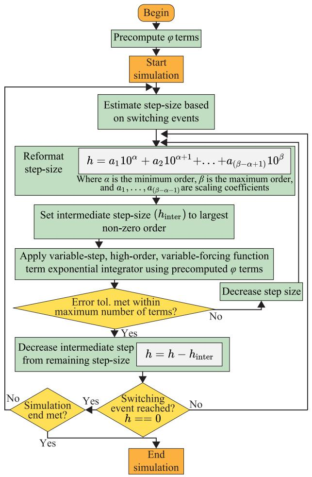  
Fig. 4. Flowchart of proposed adaptive grained exponential integrator solver.

0.1 μs for a non-stiff system with DC input sources and a stiff system with both AC and DC input sources. The numerical accuracy of the proposed AGEI solver is also verified using hardware experimental results. In Section B, the numerical efficiency of the proposed AGEI solver is compared against other commonly used solvers, using three typical power converter circuits, i.e., a non-stiff circuit with DC input sources, a non-stiff circuit with DC and AC input sources, and a stiff circuit with DC and AC input sources. Each circuit topology has its unique features and showcases important advantages of the proposed AGEI algorithm.

# A. Numerical Accuracy Comparison

Numerical accuracy of the proposed AGEI algorithm is validated by comparing with a small time-step size (0.1μs) solution obtained from Simulink/Simscape Electrical model using Simulink solver, i.e., ode8. It is then compared against hardware experimental results. Fig. 5 illustrates the circuit structure of the DC input case study. It is composed of two interleaved boost converters interfaced with two three-phase two-level converters via a DC link capacitor.

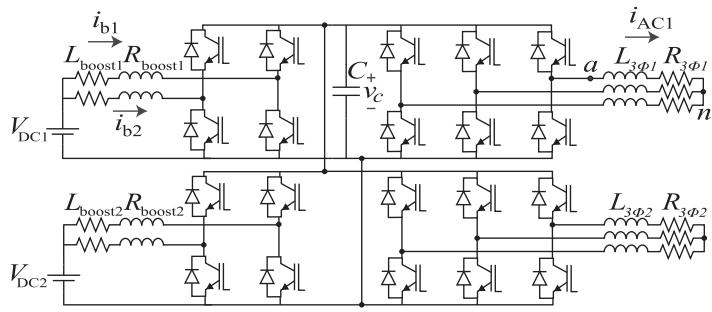  
Fig. 5. Non-stiff converter circuit with DC source input.

This case study demonstrates the most significant gains on accuracy and efficiency of the AGEI algorithm. Since the input sources are constant, a single term forcing-function in (3) can be used, leading to zero truncation error in (3). Thus, the (3) represents exact/analytical solution to (2). The circuit is simulated from time t = 0 to 0.06 s, using the proposed AGEI algorithm. The resulting waveforms compared to a small time-step Simulink reference solution are shown in Fig. 6, where the AGEI algorithm solutions match the Simulink reference solutions very well. The adaptive-grained step-size technique is further illustrated in Fig. 7 using the simulation results of the DC input case study as an example. As shown in Fig. 7, the AGEI discretization step-size is plotted against simulation time for the system state variable ib1. Fig. 7(c) and (d) show zoomed-in subfigures from 0.9 ms to 0.91 ms for better visualization of the simulated points as noted by the markers in Fig. 7(d) and the corresponding step-sizes as shown in Fig. 7(c). In these subplots, it is shown that a large 5.56 μs step-size between two switching events is broken into three variable grained step-sizes of 5 μs, 0.5 μs and 60 ns that are simulated sequentially. The step-sizes of the AGEI solver are shown between the markers on Fig. 7(d). It is noted that the proposed variable-step high-order EI solver can accommodate much larger step sizes, compared to the conventional variablestep low-order solvers due to its higher numerical order. The proposed EI solver modulates the number of forcing function terms (3) to further increase its numerical accuracy, allowing the maximum possible step size to be equal to a pulse width. The proposed AGEI solver decomposes a maximum possible step size (i.e., a pulse width) into the combination of large, fine, and ultrafine grained time steps, as shown in Fig. 7(c) and (d). This adaptivegrained arrangement is only for memory saving consideration and not because of numerical accuracy limitation of the EI solver. Therefore, the AGEI solver achieves less simulated points due to the use of large grained steps, leading to a higher overall numerical efficiency than the prior art low-order variable-step solvers.

An error analysis on the simulation data is performed using relative (percentage) error. The relative error of the AGEI solution is evaluated for each system state variable using the 2-norm (Euclidean norm) of the error vector divided by the 2-norm of the reference solution vector as

$$
\varepsilon_ {\text {r e l}, \mathrm {i}} = \frac {\left| \left| x _ {\mathrm {A G E I} , \mathrm {i}} - x _ {\mathrm {r e f} , \mathrm {i}} \right| \right| _ {2}}{\left| \left| x _ {\text {r e f} , \mathrm {i}} \right| \right| _ {2}}, \forall i \in \{1, 2, \dots , n \} \tag {11}
$$

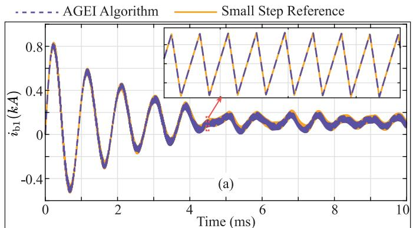  
Phase a Phase a AGEI Phase b Small Step Phase b

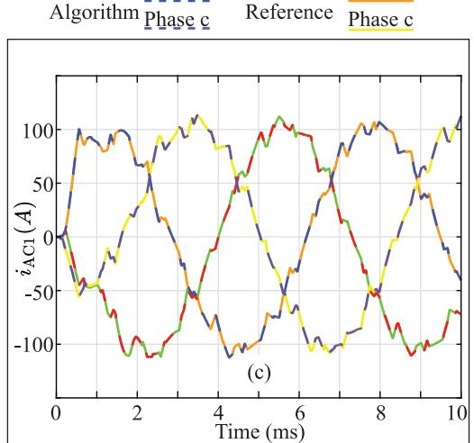

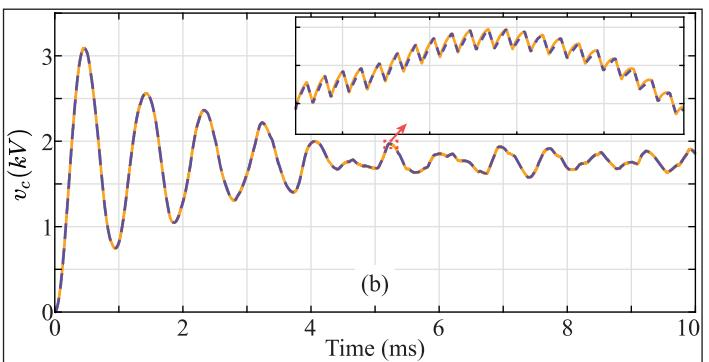

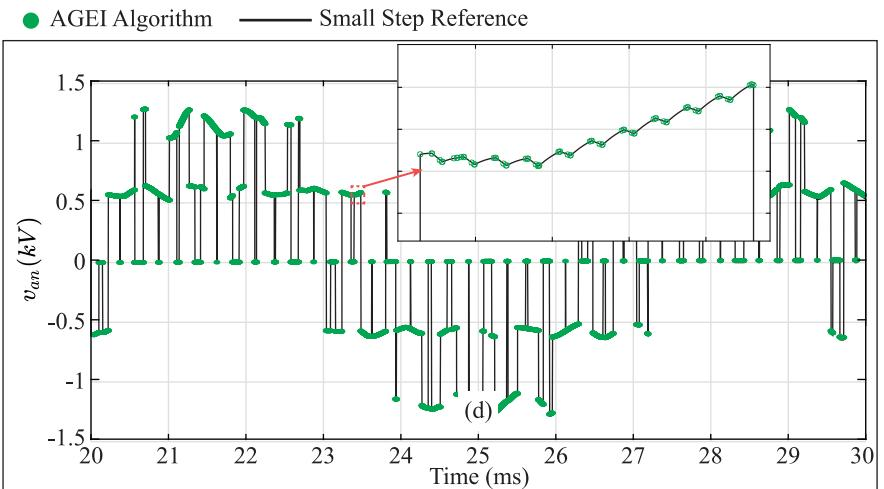  
Fig. 6. DC input case study waveform results. (a) Boost converter upper leg current. (b) DC link capacitor voltage. (c) Three-phase inductor currents. (d) AC phase voltage.

where n is the number of system states and $x _ { A G E I , i } , x _ { r e f , i }$ i are vectors of the ith system state for AGEI and the reference signal, respectively.

The geometric mean of all system state variables is taken to find the overall relative error of the AGEI solution as

$$
\varepsilon_ {\text {t o t}} = \sqrt [ n ]{\varepsilon_ {\text {r e l ,} 1} \cdot \varepsilon_ {\text {r e l ,} 2} \cdot \dots \cdot \varepsilon_ {\text {r e l ,} n}}. \tag {12}
$$

For the DC input case study, the overall relative error is 2.34e-7, indicating the high accuracy of the proposed AGEI algorithm.

The next accuracy comparison is a circuit which presents high stiffness designed to demonstrate the numerical stability of the AGEI algorithm. The circuit is shown in Fig. 8, the topology is a modified version of Fig. 5 with the addition of a neutral to ground RC common-mode (CM) circuit and AC side independent voltage sources.

The circuit in Fig. 8 is simulated from time t = 0 to 0.25s. The CM capacitor voltage, CM current, and AC line voltage are shown in Fig. 9 where it is compared with a small time-step Simulink reference. As shown in Fig. 9, the AGEI algorithm maintains numerical accuracy and stability for the case study with high stiffness and fast transient. Interestingly, in Fig. 9 the AGEI algorithm doesn’t capture the entire high frequency oscillations of the RC CM circuit, due to the large time steps

used for the power converter circuit simulation. However, the proposed AGEI solver still produces accurate simulation results for the high frequency CM voltage and current at the simulated points in Fig. 9, because of the high discretization order of Padé approximation and variable term forcing function in (3). It is noted that an optional small maximum time step can be introduced to the proposed AGEI algorithm over a desired short window of time to capture high frequency converter dynamics that are missed in Fig. 9. This waveform “zoom-in” option aims to increase output waveform quality for a specific time window while maintaining numerical stability during the entire simulation. The insights from a small-step-size window are meaningful since the high frequency transients typically repeat themselves. Alternatively, the proposed AGEI algorithm is well suited for parallel simulation in time. Each discretization step between two switching events only requires information on the step-size, system inputs, and the system states at the previous computed point. Therefore, multiple different time steps can be simulated between two switching events concurrently using parallel computing hardware, such as multicore CPU or GPU threads. Additionally, it is possible to precompute the ϕ-terms in parallel before the time-domain simulation loop starts, since the ϕ-terms are independent of each other. Parallel simulation of the AGEI algorithm can be utilized for multiple subsystems of a

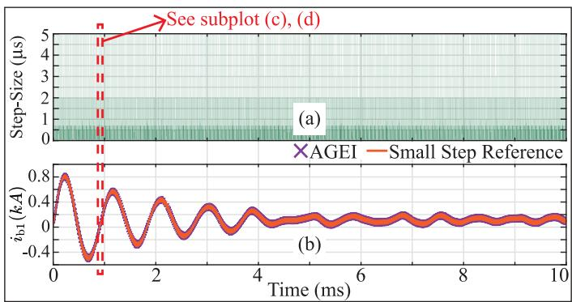

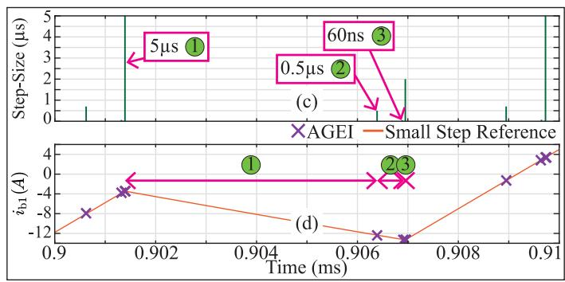  
Fig. 7. Adaptive-grained step-size visualization. (a) Step-size through simulation. (b) Boost converter upper leg current. (c) Step-size through simulation – zoom-in. (d) Boost converter upper leg current – zoom-in.

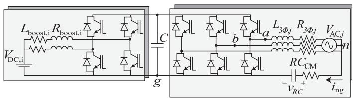  
Fig. 8. Stiff converter circuit with neutral-ground RC CM circuit and AC sources added to Fig. 5.

large power converter network decoupled through the DC-link capacitors.

It is also important to note that oftentimes stiffness is not the point of interest in a power electronics circuit; instead, it is hidden out of plain sight. Stiffness can be present, for instance, due to semiconductor switch representation in state-space equation generation, where numerical snubber resistors, inductors and capacitors are used to facilitate state-space equation generation. These numerical snubber components often take very small or large values which can cause significant stiffness. In these cases, the high frequency oscillations due to numerical snubbers are completely irrelevant. However, the AGEI algorithm will perform much better than the other explicit numerical algorithms (including FA), which do not have the property of Absolute stability, i.e., A-stability.

Next, the simulated waveforms, obtained from the AGEI algorithm, are verified by hardware experimental results. The circuit topology contains an interleaved boost converter interfaced to a three-phase two-level converter via a DC link capacitor. It

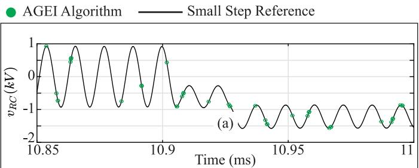

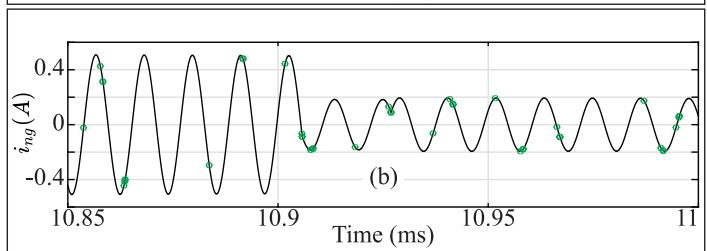

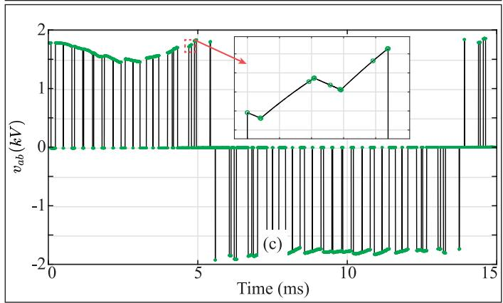  
Fig. 9. Stiff case study results. (a) CM capacitor voltage. (b) CM current. (c) AC line voltage.

is the same configuration as Fig. 5, except for only one interleaved boost, and one three-phase two-level converter. Fig. 10 presents the comparison between the AGEI algorithm and the experimental waveforms. As shown in Fig. 10, the simulation results faithfully reflect the experimental waveforms. The accurate simulation results demonstrated in Fig. 10 are as expected, since the AGEI algorithm is based on high-order exponential integrator. The benefits associated with the proposed AGEI algorithm largely lies in the numerical efficiency improvement, compared to the existing numerical integration techniques.

# B. Numerical Efficiency Comparison

To demonstrate the efficiency of the proposed AGEI algorithm it is compared against the FA algorithm of [9], Simulink ode23t (a modified trapezoidal rule), Simulink ode15s, based on variable order NDFs [41], Simulink ode45 (Dormand-Prince), and PLECS DOPRI (Dormand-Prince). The algorithms used for comparison are all variable time-step solvers. The FA algorithm and ode15s are variable order solvers, whereas ode23t, ode45, and DOPRI are fixed order solvers. All solvers are set with a common relative error tolerance of $1 0 ^ { - 4 }$ . The chosen algorithms are common and popular for simulation of power electronic circuits, making the case study results highly relevant. Other

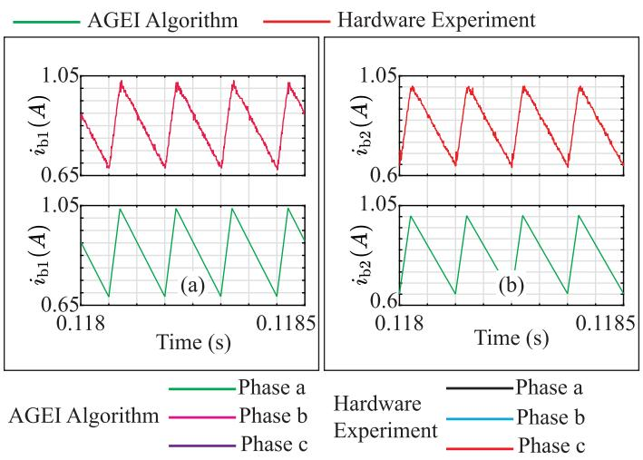

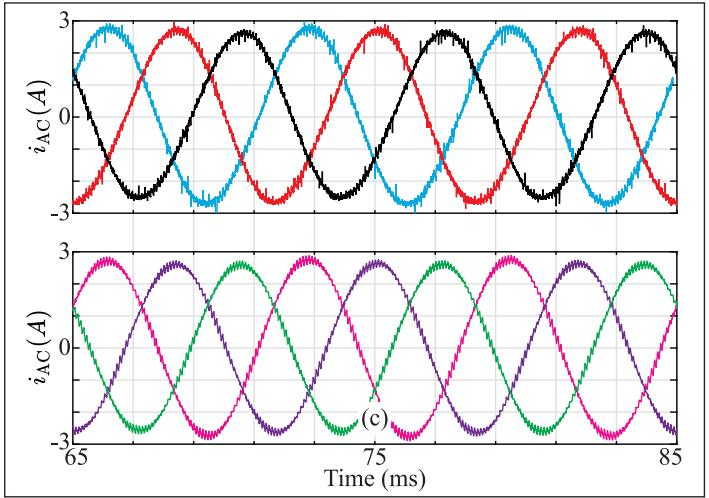  
Fig. 10. Hardware validation results. (a) Boost converter upper-leg current. (b) Boost converter lower-leg current. (c) Three-phase inductor currents.

simulation software vendors such as as OPAL-RT, EMTP-RV, PSCAD, PSIM, Simba, Typhoon, and ASMG provide competitive offerings depending on the users’ needs and the focused applications. For general purpose comparison with well-known software, we opt to compare AGEI solver to Simulink and PLECS. The AGEI algorithm efficiency is presented both with and without the precomputation time included. Simulink based models are simulated using Simulink/ Simscape Electrical toolbox while the AGEI and FA algorithms are coded using MAT-LAB script. The AGEI and FA algorithm code are identical aside from the numerical integration scheme.

The purpose of the case studies is to demonstrate the AGEI algorithm’s numerical efficiency for different circuit topologies. The efficiency comparison will be performed using four converter topologies. The first topology was introduced in Fig. 5, i.e., the DC input source case study. The second case study focuses on a circuit that contains AC and DC input sources. Including AC sources provides a general efficiency comparison between the AGEI algorithm and the competitors. Unlike the DC input case study, the solver must vary the number of forcing-function terms to meet the desired accuracy threshold. The circuit structure of this case study is similar to the first case

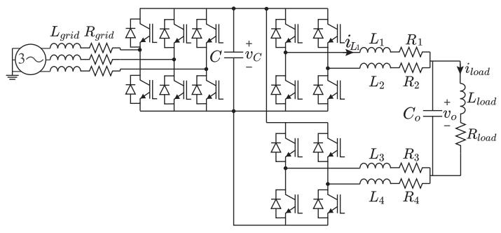  
Fig. 11. MFB-CDA converter topology.

in Fig. 5, except for additional independent AC-side three-phase voltage sources in series with the three-phase RL loads. The third case study circuit of interest was previously introduced in Fig. 8. This case study will demonstrate the AGEI algorithm’s efficiency compared to other solving methods when solving an extremely stiff system. These three topologies are simulated from $t = 0 t 0 0 . 2 5 \mathrm { s } .$ Aside from the stiff CM branch, all passive element values and switching frequencies are shared among topologies.

The fourth and final case study circuit involves an active rectifier coupled to a multileg full-bridge Class-D amplifier (MFB-CDA), shown in Fig. 11. The AC-DC converter is operated to maintain a constant DC link voltage while the MFB-CDA output voltage follows the reference signal. The converters feature a 100 kHz and 2 kHz switching frequency for the MFB-CDA and active rectifier, respectively. The reference signal has a 1 kHz frequency. For the first 1ms the reference signal is a triangle signal, it then changes to a sinusoidal signal. The converter is simulated for 2.5 ms. The output capacitor $\left( C _ { o } \right)$ is subjected to a short-circuit fault at 0.75 ms for a duration of 50 us. That is, the short-circuit fault at $C _ { o }$ is cleared at 0.8 ms. At 0.75 ms when the short-circuit fault occurs, the system is subjected to output capacitor fast discharging transient with a small time constant, which dramatically increases network stiffness. The output simulation waveforms comparing AGEI to a 1ns small step reference signal is shown in Fig. 12. From Fig. 12, it is clear the AGEI algorithm matches well will the small step reference and maintains accuracy though the brief short circuit fault.

The numerical efficiency results are presented for each case study in Table I, where each algorithm is applied to the three case studies to demonstrate the flexibility of the AGEI algorithm. The results in Table I show that the AGEI algorithm is effective across a diverse set of case studies, demonstrating its general applicability. In the DC input case study, the AGEI algorithm is at its maximum efficiency due to exact solution of the forcing function terms in (3). The CPU times show the AGEI algorithm is the most efficient algorithm tested, both including or excluding the precomputation time. The AC and DC input case study represents a general application of the algorithm in a non-stiff system. In this case study, the AGEI algorithm is comparable to the FA algorithm but much faster than the Simulink solvers, or PLECS. The FA algorithm is shown to be the fastest numerical integration technique in [9], thus the results are significant. The third case study demonstrates that the unique property and significant

TABLE ICOMPUTATIONAL EFFICIENCY COMPARISON AMONG NUMERICAL INTEGRATION TECHNIQUES  

<table><tr><td rowspan="2">Algorithm</td><td colspan="4">CPU Computation Time (s)</td></tr><tr><td>DC Input Case</td><td>AC and DC Inputs Case</td><td>Stiff System Case</td><td>MFB-CDA with Fault Case</td></tr><tr><td>AGEI excluding precomputation time</td><td>0.3718</td><td>1.9968</td><td>2.4375</td><td>0.9625</td></tr><tr><td>AGEI including precomputation time</td><td>0.7500</td><td>2.6906</td><td>6.9062</td><td>1.6187</td></tr><tr><td>FA of [9]</td><td>2.3718</td><td>2.5531</td><td>94.9937</td><td>15.9868</td></tr><tr><td>PLECS DOPRI</td><td>6.8468</td><td>8.6718</td><td>14.6968</td><td>5.3687</td></tr><tr><td>Simulink ode23t</td><td>20.850</td><td>21.1718</td><td>90.6187</td><td>12.9625</td></tr><tr><td>Simulink ode15s</td><td>22.325</td><td>40.6250</td><td>43.9812</td><td>8.0687</td></tr><tr><td>Simulink ode45</td><td>19.043</td><td>24.8312</td><td>59.52812</td><td>N/A</td></tr></table>

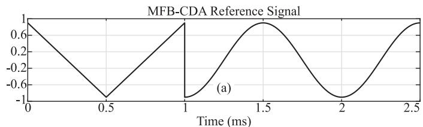

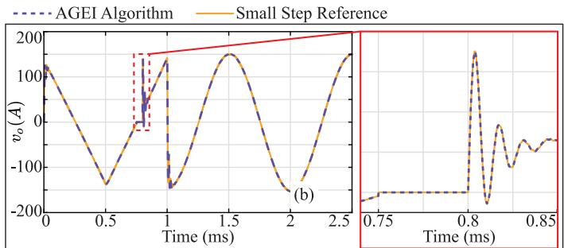

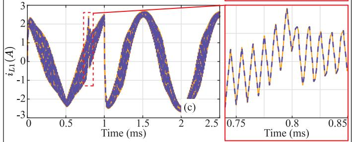  
Fig. 12. MFB-CDA case study waveforms. (a) MFB-CDA reference signal. (b) Output capacitor voltage vo. (c) Inductor L1 current.

advancement of the AGEI algorithm resides in its numerical stability. This case study is extremely stiff due to the RC CM circuit. Typically, a low order, slow implicit method must be used to ensure numerical stability. The AGEI algorithm, while being accurate, shows a significant speed advantage against prominent Simulink or PLECS solvers. The final case study is generally non-stiff, however, it experiences significant stiffness during the imposed short circuit fault. During the fault, FA solver struggles to achieve a large step size due to its limited stability region. The FA algorithm needs to reduce its step size and increase the number of computed points. The AGEI algorithm, however, is unaffected by the network stiffness and does not require a step size adjustment. Compared to PLECS and Simulink ode15s solvers, the proposed AGEI solver is still 3-fold and 5-fold faster than each of them respectively. Simulink ode45 notably was not able (N/A) to finish the simulation. These case studies illustrate

TABLE II COMPUTATION COMPARISON BETWEEN AGEI AND FA PER COMPUTED POINT   

<table><tr><td>Solver</td><td>Multiplications</td><td>Additions</td></tr><tr><td>AGEI</td><td>(p+1)n2+pnl</td><td>(p+1)n(n-1)+pnl</td></tr><tr><td>FA</td><td>qn2+qnl+q</td><td>qn(n-1)+qnl+qn</td></tr></table>

Note: n is the length of state vectorx,listhelength ofinput vectoru,andp is the number of forcing-function terms for AGEI,and q is integration order of FA.

the significance of the proposed AGEI algorithm. The AGEI algorithm is as fast as the best explicit solvers for non-stiff systems, and faster than the quickest stiff systems solvers. Often there is a large trade-off between numerical stability and numerical efficiency. Explicit methods are used for quick simulation on non-stiff systems, while slow implicit methods handle stiff systems. The AGEI algorithm excels regardless of the stiffness of the network, lending it to be a generally applicable algorithm with high simulation efficiency.

The presented efficiency results in Table I provide commensurable comparison given AGEI is implemented within MATLAB. Thus, AGEI and Simulink’s solvers share a similar computational overhead inside the MATLAB framework. The speedup results can easily be amplified by implementing AGEI in C++ or a similar language with minimal computational overhead. The efficiency improvements of the AGEI algorithm are attributed to the adaptive grained approach with precomputation. Precomputation accelerates the simulation runtime, while the adaptive-grained technique minimizes the total time and memory allocated on precomputation. The algorithm’s efficiency per computed point is compared with the FA algorithm of [9] in Table II.

It is noted that the proposed AGEI algorithm often requires fewer forcing function terms than the order of the FA algorithm (i.e., $p < q )$ . A power system’s independent source input is typically slow changing, i.e., DC or 50/60Hz, compared to power converter switching frequency. Thus, the forcing function solution in (3) requires very few terms to achieve high accuracy. A high numerical order may be needed for the FA algorithm to capture the homogeneous solution dynamics, even if the independent source input is slow changing. This is especially true for stiff systems where the FA algorithm often requires step size adjustment. Thus, since the AGEI algorithm generally requires fewer forcing function terms than the order of the Taylor series expansion in FA algorithm, the AGEI algorithm requires fewer multiplications and additions comparable to the FA algorithm per computed point. For power converter circuits

TABLE III COMPUTATION COMPARISON BETWEEN AGEI AND FA PER COMPUTED POINT FOR ONLY-DC INPUT CASE   

<table><tr><td>Solver</td><td>Multiplications</td><td>Additions</td></tr><tr><td>AGEI</td><td>2n2 + nl</td><td>n(n-1) + n(l-1) + n</td></tr><tr><td>FA</td><td>qn2 + nl + q</td><td>qn(n-1) + n(l-1) + qn + n</td></tr></table>

Note: nisthelengthofstate vector x,lis thelengthofinputvectoru,andq is theintegration order for the FAalgorithm.

featuring only-DC input sources, the efficiency per point of the AGEI algorithm surpasses the FA algorithm, as shown in Table III.

The only-DC input case study presents the largest efficiency advantage of the AGEI algorithm over the FA algorithm for either stiff or non-stiff system. This is explained in Table III where the AGEI algorithm in (3) only needs a single term forcing function approximation without any truncation error. The AGEI algorithm produces an analytical solution given the high order of the Padé approximation. This single term forcing function leads to little computation effort per time step, manifesting in significant efficiency advantage. The AGEI algorithm often requires multiple consecutive computed points between each switching event, thus, while the per point computation is less, the total computation varies. The case studies presented show that the proposed algorithm accommodates multiple sequential steps given that the AGEI algorithm efficiencies are faster that, or as fast as the FA algorithm.

# V. DISCUSSION

With the advancement of multimodule and multilevel converters such as solid-state transformer (power electronic transformer), the number of switches can be as large as a few hundreds. EMT simulation of such complex and large-scale converter system represents a significant challenge for the stateof-the-art EMT simulation tools. Power converter system decoupling technique [18] can be used to accelerate EMT simulation. Decoupling the entire converter system into several smaller subsystems enables smaller dimensions of state-space equations and faster simulation speed. It can also drastically reduce the number of converter circuit topologies that are precomputed for the proposed AGEI method. Power converter systems can be analytically decoupled through either series inductor or parallel DC-link capacitor [18]. In this manuscript, parallel DC-link capacitor is used as an illustrative example. A depiction of the decoupling principle is shown in Fig. 13.

As shown in Fig. 13, the original converter system is decoupled at its DC-link capacitor into two separate subsystems that share an interface with the coupling system (i.e., the middle circuit of Fig. 13(b)) through a system input. The original converter system can be expressed mathematically as

$$
\dot {x} = A x + B u. \tag {13}
$$

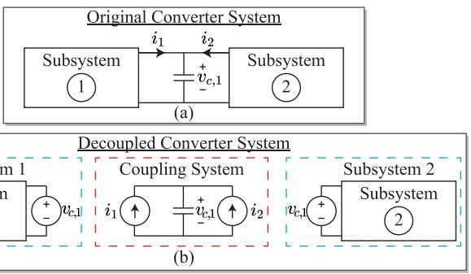  
Fig. 13. Decoupling decomposition technique. (a) Original converter system. (b) Decoupled converter system.

while subsystem s and coupling system m can be expressed as (14) and (15), respectively.

$$
\dot {x} _ {s} = A _ {s} x _ {s} + B _ {s} u _ {s} + E _ {s} \left[ \begin{array}{c} v _ {c, 1} \\ v _ {c, 2} \\ \vdots \\ v _ {c, r} \end{array} \right] \tag {14}
$$

$$
\dot {v} _ {c, m} = E _ {c, m} \left[ \begin{array}{l} i _ {1} \\ i _ {2} \\ \vdots \\ i _ {k} \end{array} \right] \tag {15}
$$

In (14), $A _ { s } , B _ { s }$ are the cofficient matrices of subsystem s; $x _ { s } , u _ { s }$ are the state variables and inputs of subsystem $s ; E _ { s }$ is the matrix representing the connection between the coupling capacitors and the subsystems’ state variables; and $v _ { c , 1 } , v _ { c , 2 } \ldots v _ { c , r }$ are the coupling capacitor’s input voltages for a system with r coupling capacitors. Equation (15) is the state-space equation representation of coupling system $m ,$ where $E _ { c , m }$ is the matrix representing the connection between subsystem interfacing currents $( \mathrm { i . e . , } i _ { 1 } , i _ { 2 } , \dots i _ { k } )$ and coupling capacitor voltage $v _ { c , m } .$

The interfacing currents $i _ { 1 } , i _ { 2 } , \dots i _ { k }$ may be subsystem statevariables, but are generally subsystem outputs to be calculated as

$$
\mathrm {y} _ {s} = C _ {s} x _ {s} + D _ {s} u _ {s} + F _ {s} \left[ \begin{array}{c} v _ {c, 1} \\ v _ {c, 2} \\ \vdots \\ v _ {c, r} \end{array} \right] \tag {16}
$$

where $y _ { s }$ is a vector containing one or more interfacing currents for submodule $s ; C _ { s }$ and $D _ { s }$ are coefficient matrices relating state variables and inputs to output variables, and $F _ { s }$ links the coupling capacitor inputs to the interfacing currents.

The proposed high-order AGEI algorithm can be applied to (14) to generate a time-domain solution using the step-size h as

$$
x _ {s} (t + h) = e ^ {A _ {s} h} x _ {s} (t) + \sum_ {j = 1} ^ {p _ {1}} \varphi_ {j} (A _ {s} h) h ^ {j} B _ {s} \frac {d ^ {(j - 1)} u _ {s} (t)}{d t ^ {(j - 1)}}
$$

$$
+ \sum_ {j = 1} ^ {p _ {2}} \varphi_ {j} \left(A _ {s} h\right) h ^ {j} E _ {s} \frac {d ^ {(j - 1)}}{d t ^ {(j - 1)}} \left(\left[ \begin{array}{c} v _ {c, 1} (t) \\ v _ {c, 2} (t) \\ \vdots \\ v _ {c, r} (t) \end{array} \right]\right). \tag {17}
$$

Similarly, (15) can be discretized using AGEI with step-size h as

$$
\begin{array}{l} v _ {c, m} (t + h) = e ^ {0 h} v _ {c, m} (t) \\ + \sum_ {j = 1} ^ {p} \varphi_ {j} (0 h) h ^ {j} E _ {c, m} \frac {d ^ {(j - 1)}}{d t ^ {(j - 1)}} \left(\left[ \begin{array}{l} i _ {1} (t) \\ i _ {2} (t) \\ \vdots \\ i _ {k} (t) \end{array} \right]\right). \tag {18} \\ \end{array}
$$

Equation (18) can be simplified to Taylor series expansion as

$$
v _ {c, m} (t + h) = v _ {c, m} (t) + \sum_ {j = 1} ^ {p} \frac {h ^ {j}}{j !} E _ {c, m} \frac {d ^ {(j - 1)}}{d t ^ {(j - 1)}} \left(\left[ \begin{array}{l} i _ {1} (t) \\ i _ {2} (t) \\ \vdots \\ i _ {k} (t) \end{array} \right]\right). \tag {19}
$$

Equations (17) and (19) requires the higher order derivatives of the system inputs, i.e., the coupling capacitor voltage and the subsystem injection currents. Recursive substitution and differentiation of (14), (16), and (15) allow for convenient calculation of all higher order derivatives. Once all high order derivatives of interfacing variables are known, (17) and (19) can be effectively applied for every subsystem and each coupling system. Complete knowledge of initial conditions, including high order derivatives allows for independent calculation of each subsystem and the coupling system. For CPU implementation, the calculations for each subsystem or coupling system are performed in sequential order. On parallel computing hardware such as GPU or FPGA, the calculations can be performed simultaneously, which has the potential to further increase simulation efficiency.

In the context of precomputing ϕ-functions, system decoupling allows for precomputation of each subsystem individually, which significantly reduces the precomputation efforts of the AGEI algorithm for large systems. For instance, considering 10 three-phase two-level converters connected to a single coupling capacitor. Each three-phase two-level converter is assumed to have 7 possible circuit topologies. Without system decoupling, there are $7 ^ { 1 0 } = ~ 2 8 2 , 4 7 5 , 2 4 9$ possible circuit topologies that must be precomputed. With system decoupling, the ϕ-terms for each topology are computed independently. Thus, the total number of precomputed topologies becomes a summation of the number of precomputed topologies for each subsystem, i.e., $7 \times 1 0 ~ = ~ 7 0$ precomputed topologies. In this fictitious example, decoupling results in a 99.9999784% decrease in precomputed topologies. This feature allows the AGEI algorithm to be applied to very large converter systems such as solid-state transformer.

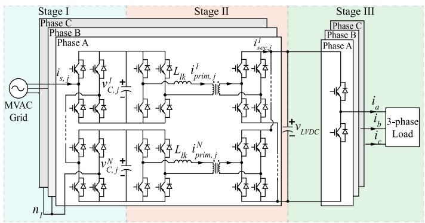  
Fig. 14. Supplementary SST case study using network decoupling.

TABLE IV COMPUTATIONAL EFFICIENCY COMPARISON OF SOLID-STATE TRANSFORMER WITH 30 SUBMODULES   

<table><tr><td>Solver</td><td>CPU Computation Time (s)</td></tr><tr><td>AGEI excluding precomputation time</td><td>3.02</td></tr><tr><td>AGEI including precomputation time</td><td>3.04</td></tr><tr><td>PLECS DOPRI</td><td>52.98</td></tr><tr><td>Simulink ode23t</td><td>252.13</td></tr><tr><td>Simulink ode15s</td><td>487.98</td></tr><tr><td>Simulink ode45</td><td>293.74</td></tr></table>

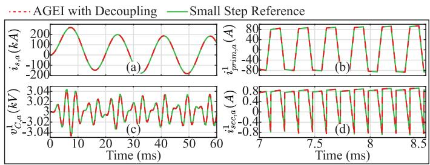  
Fig. 15. SST case study waveforms. (a) HVAC phase-a source current. (b) Phase-a module-1 transformer primary current. (c) Phase-a module 1 MVDC capacitor voltage. (d) Phase-a module-1 secondary DC current.

In order to demonstrate the viability of the proposed decoupling technique for the proposed AGEI solver, a large-scale converter system is simulated. The case study features a three-stage input-series output-parallel 3-phase solid-state transformer with 10 dual active bridge (DAB) modules per phase, as shown in Fig. 14. Without converter decoupling, there are over $1 2 ^ { 3 0 }$ · 7 possible topologies. With converter decoupling, there are only 30 topologies that must be precomputed.

The Solid-state transformer in Fig. 14 is simulated for 60ms using several variable-step-size solvers, i.e., the proposed AGEI, PLECS, and Simulink/SimPowerSystems (SPS). The simulation times of different solvers are shown in Table IV.

When system decoupling is implemented, the proposed AGEI solver achieves 17-fold and 83-fold speedups compared to PLECS and Simulink ode23t, respectively. The simulation results are overlapped with a small step Simulink/SPS reference solution for comparison in Fig. 15. As shown in Fig. 15, the AGEI with decoupling overlaps well with the small stepsize SPS reference waveform. This supplementary case study

demonstrates that system decoupling technique can be implemented alongside the AGEI algorithm. Decoupling significantly reduces the precomputation burden, allowing the AGEI algorithm to solve very large converter systems.

# VI. CONCLUSION

In this paper, an adaptive-grained exponential-integratorbased numerical integration technique is presented. The algorithm incorporates adaptive precomputation and sequential integrations to dynamically change the simulation time-step while retaining fast simulation speed with significantly reduced overhead. Sequential intermediate integration steps between discrete events are used to drastically reduce the set of possible discretization step sizes allowing for practical precomputation of matrix exponential and ϕ-functions. The precomputation is done using optimized computation techniques, enabling accelerated simulation run-time. The algorithm’s flexibility with variable step-size and a variable term forcing function, along with its L-stability makes it well-suited for power electronic converter systems. The algorithm maintains a high numerical efficiency and stability, making it suitable for stiff or non-stiff systems alike. The introduced computation techniques render the algorithm robust across various circuit topologies and input sources, enhancing its broad applicability.

# REFERENCES

[1] J. Mahseredjian, V. Dinavahi, and J. A. Martinez, “Simulation tools for electromagnetic transients in power systems: Overview and challenges,” IEEE Trans. Power Del., vol. 24, no. 3, pp. 1657–1669, Jul. 2009.   
[2] A. M. Gole, I. T. Fernando, G. D. Irwin, and O. Nayak, “Modeling of power electronic apparatus: Additional interpolation issues,” in Proc. Int. Conf. Power Syst. Transients, 1997, pp. 455–459.   
[3] G. Sybille, H. Le-Huy, R. Gagnon, and P. Brunelle, “Analysis and implementation of an interpolation algorithm for fixed time-step digital simulation of PWM converters,” in Proc. IEEE Int. Symp. Ind. Electron., 2007, pp. 793–798.   
[4] J. M. Zavahir, J. Arrillaga, and N. R. Watson, “Hybrid electromagnetic transient simulation with the state variable representation of HVDC converter plant,” IEEE Trans. Power Del., vol. 8, no. 3, pp. 1591–1598, Jul. 1993.   
[5] J. J. Sanchez-Gasca, R. D’Aquila, W. W. Price, and J. J. Paserba, “Variable time step, implicit integration for extended-term power system dynamic simulation,” in Proc. Power Ind. Comput. Appl. Conf., 1995, pp. 183–189.   
[6] W. Nzale, J. Mahseredjian, I. Kocar, X. Fu, and C. Dufour, “Two variable time-step algorithms for simulation of transients,” in Proc. IEEE Milan PowerTech, 2019, pp. 1–6.   
[7] N. Lin and V. Dinavahi, “Variable time-stepping modular multilevel converter model for fast and parallel transient simulation of multiterminal DC grid,” IEEE Trans. Ind. Electron., vol. 66, no. 9, pp. 6661–6670, Sep. 2019.   
[8] J. Y. Astic, A. Bihain, and M. Jerosolimski, “The mixed Adams - BDF variable step size algorithm to simulate transient and long term phenomena in power systems,” IEEE Trans. Power Syst., vol. 9, no. 2, pp. 929–935, May 1994.   
[9] Y. Zhu, Z. Zhao, B. Shi, and Z. Yu, “Discrete state event-driven framework with a flexible adaptive algorithm for simulation of power electronic systems,” IEEE Trans. Power Electron., vol. 34, no. 12, pp. 11692–11705, Dec. 2019.   
[10] N. Gabriela, V. Petr, and Š. Václav, “Modern Taylor series method in numerical integration: PART 2,” in Proc. Czech-Polish Conf. Modern Math. Methods Eng., 2018, pp. 211–220.   
[11] S. Bhattacharya, L. -A. Gregoire, J. Kallo, M. Stevic, M. Garg, and C. Willich, “FPGA-based real-time simulation for LLC resonant converter prototyping,” in Proc. IEEE 13th Int. Symp. Power Electron. Distrib. Gener. Syst., 2022, pp. 1–6.

[12] J. Jatskevich and T. Aboul-Seoud, “Automated state-variable formulation for power electronic circuits and systems,” in Proc. IEEE Int. Symp. Circuits Syst., 2004, pp. 952–955.   
[13] O. Wasynczuk and S. D. Sudhoff, “Automated state model generation algorithm for power circuits and systems,” IEEE Trans. Power Syst., vol. 11, no. 4, pp. 1951–1956, Nov. 1996.   
[14] J. H. Allmeling and W. P. Hammer, “PLECS-piece-wise linear electrical circuit simulation for simulink,” in Proc. IEEE Int. Conf. Power Electron. Drive Syst., 1999, vol. 1, pp. 355–360.   
[15] N. Watson and J. Arrillaga, Power Systems Electromagnetic Transients Simulation, 2nd ed. London, U.K.: IET, 2019.   
[16] Z. Yu, Z. Zhao, B. Shi, Y. Zhu, and J. Ju, “An automated semi-symbolic state equation generation method for simulation of power electronic systems,” IEEE Trans. Power Electron., vol. 36, no. 4, pp. 3946–3956, Apr. 2021.   
[17] B. Li, Z. Zhao, Y. Yang, Y. Zhu, and Z. Yu, “A novel simulation method for power electronics: Discrete state event driven method,” CES Trans. Elect. Mach. Syst., vol. 1, no. 3, pp. 273–282, Jul. 2020.   
[18] B. Shi, Z. Zhao, Y. Zhu, Z. Yu, and J. Ju, “Discrete state event-driven simulation approach with a state-variable-interfaced decoupling strategy for large-scale power electronics systems,” IEEE Trans. Ind. Electron., vol. 68, no. 12, pp. 11673–11683, Dec. 2021.   
[19] J. Ju, B. Shi, Z. Yu, Y. Zhu, and Z. Zhao, “Backward discrete state eventdriven approach for simulation of stiff power electronic systems,” IEEE Access, vol. 9, pp. 28573–28581, 2021.   
[20] N. R. Watson and G. D. Irwin, “Accurate and stable electromagnetic transient simulation using root-matching techniques,” Int. J. Elect. Power Energy Syst., vol. 21, no. 3, pp. 225–234, Mar. 1999.   
[21] S. -H. Weng, Q. Chen, and C. -K. Cheng, “Time-domain analysis of large-scale circuits by matrix exponential method with adaptive control,” IEEE Trans. Comput.-Aided Des. Integr. Circuits Syst., vol. 31, no. 8, pp. 1180–1193, Aug. 2012.   
[22] P. Chen, C. -K. Cheng, D. Park, and X. Wang, “Transient circuit simulation for differential algebraic systems using matrix exponential,” in Proc. IEEE/ACM Int. Conf. Comput.-Aided Des., 2018, pp. 1–6.   
[23] H. Zhuang et al., “Simulation algorithms with exponential integration for time-domain analysis of large-scale power delivery networks,” IEEE Trans. Comput.-Aided Des. Integr. Circuits Syst., vol. 35, no. 10, pp. 1681–1694, Oct. 2016.   
[24] X. Wang, P. Chen, and C. -K. Cheng, “Stability and convergency exploration of matrix exponential integration on power delivery network transient simulation,” IEEE Trans. Comput.-Aided Des. Integr. Circuits Syst., vol. 39, no. 10, pp. 2735–2748, Oct. 2020.   
[25] Q. Chen, “EI-NK: A robust exponential integrator method with singularity removal and Newton-Raphson iterations for transient nonlinear circuit simulation,” IEEE Trans. Comput.-Aided Des. Integr. Circuits Syst., vol. 41, no. 6, pp. 1693–1703, Jun. 2022.   
[26] J. Zhao, J. Liu, P. Li, X. Fu, G. Song, and C. Wang, “GPU based parallel matrix exponential algorithm for large scale power system electromagnetic transient simulation,” in Proc. IEEE Innov. Smart Grid Technol. - Asia, 2016, pp. 110–114.   
[27] C. Wang, X. Fu, P. Li, J. Wu, and L. Wang, “Multiscale simulation of power system transients based on the matrix exponential function,” IEEE Trans. Power Syst., vol. 32, no. 3, pp. 1913–1926, May 2017.   
[28] X. Fu, C. Wang, P. Li, and L. Wang, “Exponential integration algorithm for large-scale wind farm simulation with Krylov subspace acceleration,” Appl. Energy, vol. 254, Nov. 2019, Art. no. 113692.   
[29] C. Dufour, H. Saad, J. Mahseredjian, and J. Bélanger, “Custom-coded models in the state space Nodal Solver of ARTEMiS,” in Proc. Int. Conf. Power Syst. Transients, 2013, pp. 1–6.   
[30] L. -A. Gregoire, S. Cense, M. Ndungu, and J. Belanger, “Design and implementation of real-time simulation solver for high frequency power,” in Proc. IEEE Transp. Electrific. Conf. Expo., 2022, pp. 462–466.   
[31] A. H. Al-Mohy and N. J. Higham, “Computing the action of the matrix exponential, with an application to exponential integrators,” SIAM J. Sci. Comput., vol. 33, no. 2, pp. 488–511, 2011.   
[32] W. Wu, P. Li, X. Fu, Z. Wang, J. Wu, and C. Wang, “GPU-based power converter transient simulation with matrix exponential integration and memory management,” Int. J. Elect. Power Energy Syst., vol. 122, Nov. 2020, Art. no. 106186.   
[33] C. Moler and C. Van Loans, “Nineteen dubious ways to compute the exponential of a matrix,” SIAM Rev., vol. 20, no. 4, pp. 801–836, 1978.   
[34] N. J. Higham, “The scaling and squaring method for the matrix exponential revisited,” SIAM J. Matrix Anal. Appl., vol. 26, no. 4, pp. 1179–1193, Jul. 2005.

[35] A. H. Al-Mohy and N. J. Higham, “A new scaling and squaring algorithm for the matrix exponential,” SIAM J. Matrix Anal. Appl., vol. 31, no. 3, pp. 970–989, Aug. 2009.   
[36] B. Skaflestad and W. M. Wright, “The scaling and modified squaring method for matrix functions related to the exponential,” Appl. Numer. Math., vol. 59, no. 3/4, pp. 783–799, Mar. 2009.   
[37] S. M. Cox and P. C. Matthews, “Exponential time differencing for stiff systems,” J. Comput. Phys., vol. 176, no. 2, pp. 430–455, Mar. 2002.   
[38] J. C. Jimenez, H. de la Cruz, and P. A. De Maio, “Efficient computation of phi-functions in exponential integrators,” J. Comput. Appl. Math., vol. 374, Aug. 2020, Art. no. 112758.   
[39] R. B. Sidje, “Expokit: A software package for computing matrix exponentials,” ACM Trans. Math. Softw., vol. 24, no. 1, pp. 130–156, Mar. 1998.   
[40] U. M. Ascher and C. Greif, A First Course in Numerical Methods. Philadelphia, PA, USA: SIAM, 2011.   
[41] The MathWorks Inc., “Simulink user’s guide,” R2023a, 2023. [Online]. Available: https://www.mathworks.com/help/pdf_doc/simulink/ simulink_ug.pdf

Jared Paull (Graduate Student Member, IEEE) received the B.A.Sc. degree in electrical engineering from the University of British Columbia, Kelowna, BC, Canada, in 2022. He is currently working toward the Ph.D. degree with the University of British Columbia, Kelowna, BC. His research interests include simulation of power electronic systems for offline and real-time applications, power converter modelling, and efficient power electronic converter topologies.

Nicole Lofroth (Member, IEEE) received the B.Sc. (Hons.) degree in physics from the University of Northern British Columbia, Prince George, BC, Canada, in 2022, and the M.A.Sc. degree in electrical engineering from the University of British Columbia, Kelowna, BC, in 2024. She is currently working toward the Ph.D. degree in biomedical engineering with the University of Calgary, Calgary, AB, Canada. Her research interests include power system modeling and offline simulation, and magnetic resonance imaging pulse sequence development for stroke imaging.

Liwei Wang (Senior Member, IEEE) received the Ph.D. degree in electrical and computer engineering from the University of British Columbia, Vancouver, BC, Canada, in 2010. In 2010, he joined the ABB Corporate Research Center, Västerås, Sweden, as a Scientist and then as a Senior Scientist. Since 2014, he has been with the School of Engineering, the University of British Columbia, Kelowna, BC, where he is currently an Associate Professor. His research interests include power system modeling and simulation, electrical machines and drives, utility power

electronics applications and distributed generation.

Carl Knickle (Member, IEEE) received the B.A.Sc. degree in electrical engineering from the University of British Columbia, Kelowna, BC, Canada, in 2024. He is currently a Protection and Controls Engineer-in-Training, Calgary, AB, Canada. His research interests include power electronics and high voltage power system design.

Wei Li (Member, IEEE) received the B.Eng. degree from Zhejiang University, Hangzhou, China, the M.Eng. degree from the National University of Singapore, Singapore, and the Ph.D. degree from McGill University, Montreal, QC, Canada. He is currently a Senior Power System Simulation Specialist with Opal-RT Technologies, Montréal, QC. His research interests include power electronics, renewable energy, and distributed generation. His current research focuses mainly on real-time simulation and controls of modular multilevel converter HVDC systems and FACTS devices.