# An Efficient Half-Bridge MMC Model for EMTP-Type Simulation Based on Hybrid Numerical Integration

Shilin Gao , Member, IEEE, Ying Chen , Senior Member, IEEE, Yankan Song, Member, IEEE, Zhitong Yu, Member, IEEE, and Yenan Wang

Abstract—Electromagnetic transient (EMT) simulation is critical and fundamental in the design and operation of the modular multilevel converter (MMC). This article proposes a highly efficient EMT simulation model for MMC based on hybrid numerical integration. The topology and operational principle of MMC are elaborated first. Based on this, an efficient simulation model for MMC is proposed. Each arm of the MMC is reduced to a two-node Norton equivalent circuit in the main network simulation. The computation of the capacitor dynamic equations is decoupled from that of the arm inductor dynamic equation. They are computed in a leapfrog manner. This makes the equivalent conductance of the MMC arm constant and greatly improves the simulation efficiency. Moreover, the dynamic equations of the capacitors are also decoupled from each other. Various operational conditions of the MMC are also considered, and accuracy and adaptability are thus ensured. Extensive studies on power systems with different scales verify the accuracy and improved efficiency of the proposed EMT simulation model for MMC.

Index Terms—Constant conductance, electromagnetic transient simulation, hybrid numerical integration, midpoint rule, modular multilevel converter.

# I. INTRODUCTION

W ITH the improved current and voltage ratings of theinsulated gate bipolar transistor (IGBT), the voltage insulated gate bipolar transistor (IGBT),the voltage source converter (VSC) expands rapidly in the fields of power generation, transmission and distribution [1], [2]. This is mainly due to their flexibility and immunity against commutation failure in comparison with the line-commutated converters. Within the VSCs, the modular multilevel converter (MMC) is one of

Manuscript received 6 July 2022; revised 26 November 2022 and 15 March 2023; accepted 22 March 2023. Date of publication 28 March 2023; date of current version 26 December 2023. This work was supported by the Natural Science Foundation of China under Grants U22B2096, 52211530051, and 52007101. Paper no. TPWRS-01001-2022. (Corresponding author: Ying Chen.)

Shilin Gao is with the College of Electrical Engineering, Sichuan University, Chengdu 610065, China (e-mail: gaoshilin@scu.edu.cn).

Ying Chen and Yenan Wang are with the Department of Electrical Engineering, Tsinghua University, Beijing 100084, China (e-mail: chen_ying@tsinghua.edu.cn; wangyena18@tsinghua.org.cn).

Yankan Song and Zhitong Yu are with the Sichuan Energy Research Internet Institute, Tsinghua University, Chengdu 610213, China (e-mail: songyankan@cloudpss.net; yuzhitong@cloudpss.net).

Color versions of one or more figures in this article are available at https://doi.org/10.1109/TPWRS.2023.3262584.

Digital Object Identifier 10.1109/TPWRS.2023.3262584

the most promising because of its high voltage ratings, small harmonic components and low losses [3]. In recent years, MMCs are widely used in wind energy and photovoltaic plant integration systems, high voltage direct current (HVDC) transmission systems, flexible ac transmission systems and medium voltage distribution grids [4], [5], [6], [7].

For the design and operation of MMC systems, the electromagnetic transient (EMT) simulation is indispensable [8], [9]. In [10], a real-time EMT simulator for hardware-in-the-loop (HIL) testing of modular multilevel converter controller is presented based on RTLAB, a state-space method-based simulator. A 1500-SM MMC system, along with the I/O protocol driver, is simulated using the simulator with a time step of 500 ns. In [11], a real-time simulation of MMC systems is presented under the framework of the nodal analysis method (i.e., EMTP-type simulation). By constructing a fictitious Bergeron transmission line model on the MMC arm, the MMC arm and the main network are decoupled and the computational burden is reduced. In EMT simulation with a time step smaller than 1.5 μs, the fictitious Bergeron transmission line model does not affect the accuracy. When the time-step increases, the accuracy may not be ensured. Both of the above two simulation methods are applicable for real-time simulation and HIL tests of MMC with a very small time-step, and give results close to reality. So far, the computational time of offline EMT simulation for the power system with MMCs may be unacceptable [12]. There are two main reasons for the low efficiency. First, an MMC system will add thousands of electric nodes to the power system in EMT simulation. Thus, the nodal equations of the system are high-dimensional. Second, due to the switching of converters, the system equivalent conductance matrix is time-varying and changed frequently during the simulation. This leads to frequent LU decomposition for the equivalent conductance matrix. For the first problem, the averaged-value model (AVM) of MMC [13], [14], [15] is an effective solution, where each arm of an MMC is simplified as a controlled current source. Nevertheless, the AVM is dependent on the operational conditions and is unable to simulate the inner dynamics of MMC accurately. In addition to AVMs, the Thévenin equivalence-based (TE-based) models of MMC are presented in [16], [17], [18], which consider the dynamics of the submodule (SM) of the MMC. Each MMC is equivalent to six Thévenin circuits in the main network solution. When

the voltages and currents of the Thévenin ports are obtained in the main network solution, the inner dynamic equations of the MMCs are calculated for updating parameters of the Thévenin equivalent circuits in the next time step. This method improves simulation efficiency under the premise of accuracy. For the second cause of low efficiency mentioned above, it is rarely raised and solved in the TE-based model of MMC because the equivalent conductance of MMC is inherently changing due to the switching of converters.

To address the above problem, this article proposes an efficient EMT simulation model for MMC based on hybrid numerical integration of midpoint rule and trapezoidal rule. The midpoint rule has traditionally been used in the simulation of large passive transmission networks in semiconductor devices for more than ten years, which is called the latency insertion method (LIM) [19], [20]. Following the idea of LIM in integrated circuit simulation, the real-time simulation of power converters based on LIM is proposed [21]. It is highly parallelizable and can be implemented on the field-programmable gate array (FPGA) with simulation step sizes of dozens of nanoseconds. Further, the LIM-based power system EMT simulation is proposed [22], [23], [24], which is highly efficient. In these methods, power system components are modeled and solved in the LIM framework. The distributed LIM is rather different from the EMTP-type solution and it has limitations in modeling some power system components. In contrast to LIM, the EMTP-type simulation programs are extensively used by power engineers and researchers in industry and academia all over the world as standard simulation tools. Thus, it is of great significance to integrate the LIM-based models into the existing EMTP-type solution. In [25], a real-time hybrid simulation is proposed for the microgrid based on the LIM and EMTP-type method, where the ac lines are modeled and simulated by LIM. It has good accuracy and scalability. The disadvantage is that the critical damping adjustment (CDA) of the system solution is not considered, which makes it difficult to deal with switches and faults in the EMTP network. This article aims to formulate an MMC model for the EMTP-type solution based on the hybrid numerical integration method. In the proposed model, the dynamic equations of the arm inductor and SM capacitors are decoupled. In the EMTP-type solution of the main network, each arm is reduced to a two-node Norton equivalent circuit and the equivalent conductance of the arm is constant. In the solution to the SM capacitor equations, the dynamic equations of the SM capacitors are decoupled from each other. Moreover, note that the CDA process is considered in the modeling of the MMC.

Contributions and features of the proposed method are threefold. 1) A dynamic model of the MMC is constructed, where the normal and abnormal operating conditions of the HBSMs in the MMC are all considered. The proposed model is accurate in various operational conditions. 2) A hybrid numerical integration of midpoint rule and trapezoidal rule is used to discretize the MMC model and the difference equation is represented as the Norton equivalence form. This not only reduces the dimension of the nodal equation but also makes the equivalent conductance matrix of the system constant, which will improve the EMT simulation efficiency of a power system with MMCs. 3) The EMTP-type

solution with the proposed LIM-based MMC model is presented, where the CDA process is involved. It presents a demonstration of the integration of LIM-based models into the EMTP-type solution framework and can be adopted in the modeling of other power system components.

The remainder of this article is organized as follows. Section II presents an efficient MMC model for the EMTP-type solution based on the hybrid numerical integration, obtaining a two-node Norton equivalent circuit for each arm with constant conductance. Section III gives the flowchart of the EMT simulation for a power system with the proposed MMC, where the CDA is elaborated carefully. Section IV validates the accuracy and efficiency of the proposed method. Conclusions are drawn in Section V.

# II. EFFICIENT EMT MODELING AND SIMULATION OF MMCUSING HYBRID NUMERICAL INTEGRATION

# A. Limitations of EMT Simulation for Power Systems With MMCs

In modern power systems, MMCs are widely used in the power generation, transmission and distribution system. To simulate the power system with a number of MMCs, the EMT model of the MMC should be constructed and integrated into the existing EMTP-type simulation tools. When MMCs are integrated into the power systems, electric nodes in the network will increase dramatically because there are thousands of switches in each MMC. Moreover, since massive switches exist in the MMCs, the equivalent nodal conductance matrix is timevarying, resulting in frequent LU decomposition for the system equivalent conductance matrix. Since the LU decomposition of the large-scale matrix is time-consuming, the computational time of power system EMT simulation will increase sharply with MMCs integrated [26], [27]. Aiming at improving the simulation efficiency of EMT simulation of power systems with MMCs, this article proposes an efficient EMT simulation model of MMC with constant equivalent conductance for EMTP-type solution.

# B. System Structure and Operation Principles of an MMC

The topology of a three-phase MMC is shown in Fig. 1(a). Each arm is composed of N half-bridge SMs (HBSM) in series. The structure of an HBSM is shown in Fig. 1(b), which consists of two groups of IGBT/diode switches and a capacitor. In Fig. 1, $L _ { 0 }$ represents the arm inductance, $C _ { \mathrm { s m } }$ represents the SM capacitance, $I _ { \mathrm { d c } }$ represents dc-side current of the MMC, $i _ { 1 }$ and $i _ { 2 }$ represent the currents of the upper and lower legs of the HBSM, respectively, $\mathrm { T _ { 1 } }$ and $\mathrm { D _ { 1 } }$ represent the IGBT and diode in the first IGBT/diode group (upper leg in Fig. 1(b)), respectively, $\mathrm { T _ { 2 } }$ and $\mathrm { D _ { 2 } }$ represent the IGBT and diode in the second IGBT/diode group (lower leg in Fig. 1(b)).

For the HBSMs, it can be found that there are four states in the normal operation, according to the analyses of switching states of the two IGBT/diode groups in the HBSM. The four states and the corresponding details of the IGBTs, diodes and arm voltages and currents are presented in Table I, where $i _ { \mathrm { s m } }$ and $v _ { \mathrm { s m } }$ are the output current and voltage of the HBSM, respectively, and $v _ { \mathrm { c } i }$ is

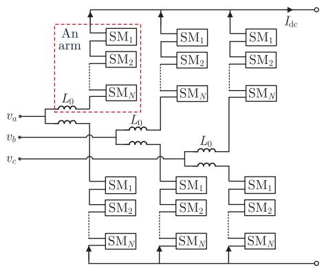

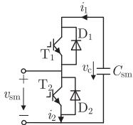  
(b)   
Fig. 1. (a) Structure of an MMC, where $\mathrm { S M } _ { i }$ represents an HBSM. (b) Topology of an HBSM.

TABLE IOPERATIONAL MODES OF THE HBSMS AND THE CORRESPONDING SWITCHSTATES  

<table><tr><td>States of the two legs</td><td>T1</td><td>T2</td><td>D1</td><td>D2</td><td>ism</td><td>vc</td><td>vsm</td></tr><tr><td rowspan="2">Upper leg ON</td><td>1</td><td>0</td><td>0</td><td>0</td><td>&lt;0</td><td>&gt;0</td><td>vci</td></tr><tr><td>0</td><td>0</td><td>1</td><td>0</td><td>&gt;0</td><td>&gt;0</td><td>vci</td></tr><tr><td rowspan="2">Lower leg ON</td><td>0</td><td>1</td><td>0</td><td>0</td><td>&gt;0</td><td>&gt;0</td><td>0</td></tr><tr><td>0</td><td>0</td><td>0</td><td>1</td><td>&lt;0</td><td>&gt;0</td><td>0</td></tr><tr><td>Two legs ON</td><td>0</td><td>0</td><td>1</td><td>0</td><td>&lt;0</td><td>&gt;0</td><td>&lt;0 ∧ &gt;vc</td></tr><tr><td>Zero legs ON</td><td>0</td><td>0</td><td>0</td><td>1</td><td>≈0</td><td>&gt;0</td><td>&gt;0 ∧ &lt;vc</td></tr></table>

the capacitor voltage [28]. According to Table I, it can be found that during normal operation, only one of the four switches in the HBSM is ON, which means that there is only one leg conducting in the SM. Moreover, $v _ { \mathrm { s m } }$ is equal to $v _ { \mathrm { c } i }$ or zero, which can be determined according to the switching state of the HBSM [29].

In some abnormal operating conditions, the two legs of the HBSM may turn on or off at the same time. For example, if $v _ { \mathrm { s m } } > 0$ and $v _ { \mathrm { c } } > v _ { \mathrm { s m } }$ and the IGBTs are blocked, both legs will turn off. If $i _ { \mathrm { s m } } < 0 , v _ { \mathrm { c } } < v _ { \mathrm { s m } } , v _ { \mathrm { s m } } < 0$ and $v _ { \mathrm { c } } < 0 , \mathrm { D 1 }$ and D2 conduct at the same time. When both legs of the HBSM turn on or off at the same time, the dynamic equations of the arm inductor and SM capacitors are different from those in normal conditions. Note that the ON/OFF states of the IGBTs and diodes in HBSMs can be determined by using the gate signals, currents and voltages of the switches in the EMT simulation [30], [31].

# C. Modeling of MMC Arm With Trapezoidal and Midpoint Rules

In the EMT simulation, the switch can be represented by a two-value resistance. When the switch is ON, it is equivalent to a small resistance, and when the switch is OFF, it is equivalent to a large resistance. Therefore, the HBSM shown in Fig. 1(b) can be equivalent to the circuit shown in Fig. 2(a) in the EMT simulation, where $R _ { \mathrm { T 1 } } , R _ { \mathrm { D 1 } } , R _ { \mathrm { T 2 } }$ and $R _ { \mathrm { D 2 } }$ are the resistance of the switches, respectively. Furthermore, let $R _ { 1 } = { R } _ { \mathrm { T 1 } } | | { R } _ { \mathrm { D 1 } }$ and $R _ { 2 } = R _ { \mathrm { T 2 } } | | R _ { \mathrm { D 2 } }$ where || represents the parallel operator, the HBSM can be equivalent to the circuit illustrated in Fig. 2(b).

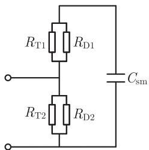  
(a)

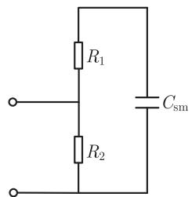

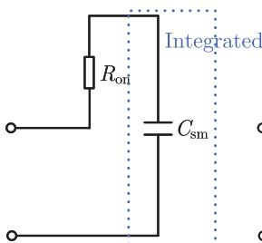  
Fig. 2. (a) Equivalent circuit of an SM in the EMT simulation. (b) Equivalent circuit of the SM with $R _ { 1 } = { R _ { \mathrm { T 1 } } } | | R _ { \mathrm { D 1 } }$ and $R _ { 2 } = R _ { \mathrm { T 2 } } | | R _ { \mathrm { D 2 } }$ .   
(a)

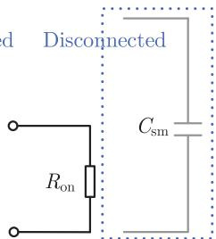  
  
Fig. 3. Further equivalent circuit of the HBSM in the EMT simulation under normal operational conditions. (a) The upper leg of the HBSM conducts. (b) The lower leg of the HBSM conducts.

1) Normal Condition: In normal operational conditions, there is only one leg conducting in the HBSM. Based on this and the equivalent circuit of HBSM in Fig. 2(b), the HBSM can be further equivalent to the circuit shown in Fig. 3 if the OFF-resistance of the switch $( R _ { \mathrm { o f f } } )$ is considered to be ∞. When $\mathrm { T _ { 1 } }$ or $\mathrm { D _ { 1 } }$ turns on, the HBSM is equivalent to the circuit shown in Fig. 3(a). When $\mathrm { T _ { 2 } }$ or $\mathrm { D _ { 2 } }$ turns on, the HBSM is equivalent to the circuit illustrated in Fig. 3(b), where the SM capacitor is bypassed and its voltage remains unchanged in this circumstance.

According to the equivalent circuit of HBSMs shown in Fig. 3, the dynamic equation of an MMC arm can be written as:

$$
L _ {0} \frac {\mathrm {d} i _ {\text {a r m}} (t)}{\mathrm {d} t} = v _ {\text {a r m}} (t) - R _ {\text {e q l}} i _ {\text {a r m}} (t) - K _ {1} \mathbf {v} _ {\mathrm {c}} (t) \tag {1}
$$

with

$$
R _ {\mathrm {e q l}} = \sum_ {j = 1} ^ {N} R _ {\mathrm {o n} j} \tag {2}
$$

$$
\boldsymbol {v} _ {c} (t) = \left[ \begin{array}{l l l l} v _ {c 1} (t) & \dots & v _ {c i} (t) & \dots & v _ {c N} (t) \end{array} \right] ^ {\mathrm {T}} \tag {3}
$$

$$
K _ {1} = \left\{k _ {1} ^ {i} \right\} _ {1 \times N} \tag {4}
$$

where ${ \pmb v } _ { \mathrm { c } } ( t )$ is the SM capacitor voltage vector, $N$ is the number of HBSMs in an MMC arm and $K _ { 1 }$ is a coefficient vector that represents the SM with the upper leg conducting. $k _ { 1 } ^ { i }$ equals 0 or 1 according to the SM state. For the ith HBSM, if only the upper leg is ON, $k _ { 1 } ^ { i } = 1$ . Otherwise, $k _ { 1 } ^ { i } = 0 . ~ k _ { 1 } ^ { i }$ is calculated according to the switch states of the MMC and it is obtained before the solution of the electric network in the simulation. $i _ { \mathrm { a r m } }$

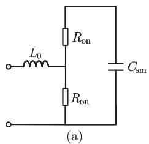

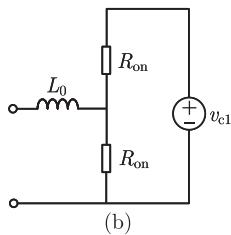

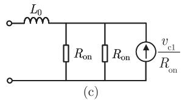

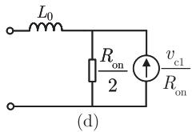  
Fig. 4. Equivalent circuits of an HBSM when the two legs conduct at the same time.

is the arm current, $v _ { \mathrm { a r m } }$ is the branch voltage of the arm and $v _ { \mathrm { c } i }$ is the capacitor voltage in ith HBSM. $R _ { \mathrm { o n j } }$ is the ON-resistance of the ON-state switch in the jth HBSM. If the IGBT conducts, $R _ { \mathrm { o n } j } = R _ { \mathrm { o n T } }$ . If the diode turns ON, $R _ { \mathrm { o n } j } = R _ { \mathrm { o n D } }$ . Here, $R _ { \mathrm { o n T } }$ represents the ON-resistance of the IGBT and $R _ { \mathrm { o n D } }$ represents the ON-resistance of the diode. In the power system transient analysis, $R _ { \mathrm { o n T } }$ and $R _ { \mathrm { o n D } }$ can be assumed to be equal [32], [33], and both of them can be assumed to be $R _ { \mathrm { o n } }$ . Then, $R _ { \mathrm { e q 1 } }$ will keep constant in the EMT simulation. The EMT simulation results obtained with equal switch ON-resistances and unequal switch ON-resistance are nearly the same because the ON-resistances of the power switches are all very small.

The modeling of the MMC arm above is based on the premise that there is exactly one leg of the HBSM conducting during the operation of MMC. When there are HBSMs with zero ON legs or two ON legs, the proposed model needs to be modified. The details are elaborated as follows.

2) Two Legs of HBSM Conducting at the Same Time: Assuming that there is only an HBSM in an arm of the MMC, each arm can be equivalent to a circuit illustrated in Fig. 4(a). According to Kirchhoff’s law, the SM capacitor can be equivalent to a voltage source with the same voltage when calculating the currents of the inductance and resistance. Thus, Fig. 4(a) can be equivalent to Fig. 4(b) [34], where $v _ { \mathrm { c 1 } }$ is the capacitor voltage. Note that the voltage of the controlled voltage source is variable, which contains the capacitor dynamics. It varies with capacitor voltage. Further, it can be equivalent to the circuit in Fig. 4(c) by Norton equivalence [35]. The parallel resistances in Fig. 4(c) are equivalent to one resistance, obtaining the equivalent circuit in Fig. 4(d). According to the equivalent circuit, the dynamic equation of the arm inductor can be written as:

$$
v _ {\mathrm {a r m}} (t) = L _ {0} \frac {\mathrm {d} i _ {\mathrm {a r m}} (t)}{\mathrm {d} t} + \frac {R _ {\mathrm {o n}}}{2} \left(i _ {\mathrm {a r m}} (t) + \frac {v _ {\mathrm {c l}} (t)}{R _ {\mathrm {o n}}}\right). \tag {5}
$$

Let $R _ { \mathrm { e q o n } } = R _ { \mathrm { o n } } / 2$ and $v _ { \mathrm { c e q 1 } } = v _ { \mathrm { c 1 } } ( t ) / 2$ , (5) can be rewritten as:

$$
L _ {0} \frac {\mathrm {d} i _ {\text {a r m}} (t)}{\mathrm {d} t} = v _ {\text {a r m}} (t) - R _ {\text {e q o n}} i _ {\text {a r m}} (t) - v _ {\text {c e q 1}} (t). \tag {6}
$$

It can be found that (6) has the same form as (1). According to (1), (6) and the superposition theorem [36], the dynamic

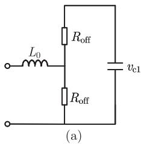

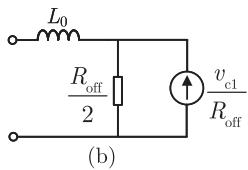  
Fig. 5. Equivalent circuits of an HBSM when zero legs conduct.

equation of arm inductor can be readily obtained and represented as:

$$
L _ {0} \frac {\mathrm {d} i _ {\text {a r m}} (t)}{\mathrm {d} t} = v _ {\text {a r m}} (t) - R _ {\mathrm {e q} 2} i _ {\text {a r m}} (t) - K _ {1} \mathbf {v} _ {\mathrm {c}} (t) - K _ {2} \mathbf {v} _ {\mathrm {c e q}} (t) \tag {7}
$$

with

$$
\boldsymbol {K} _ {2} = \left\{k _ {2} ^ {i} \right\} _ {1 \times N} \tag {8}
$$

$$
\boldsymbol {v} _ {\mathrm {c e q}} (t) = \left[ v _ {\mathrm {c e q} 1} (t) \quad \dots \quad v _ {\mathrm {c e q} i} (t) \quad \dots \quad v _ {\mathrm {c e q} N} (t) \right] ^ {\mathrm {T}} \tag {9}
$$

$$
R _ {\mathrm {e q} 2} = R _ {\mathrm {e q} 1} - n _ {2} R _ {\mathrm {e q o n}} \tag {10}
$$

where $k _ { 2 } ^ { i }$ equals 0 or 1 according to the SM state. For the ith HBSM, if both legs of the HBSM are ON, $k _ { 2 } ^ { i } = 1$ . Otherwise, $k _ { 2 } ^ { i } = 0 . \ v _ { \mathrm { c e q } i } ( t ) = v _ { \mathrm { c } i } ( t ) / 2$ is the equivalent source voltage of the ith SM and $n _ { 2 }$ is the number of HBSMs with two conducting legs. $R _ { \mathrm { e q 1 } }$ , $K _ { 1 }$ and ${ \pmb v } _ { \mathrm { c } } ( t )$ can be found in (2)–(3). It is worth noting that (1) is included in (7). When $n _ { 2 }$ is zero, (7) is equal to (1).

3) Two Legs of HBSM Turning Off at the Same Time: If the two legs of an HBSM turn off simultaneously, the HBSM can be equivalent to the circuit shown in Fig. 5(a). It can be readily found that this HBSM can be equivalent to an open circuit. It is regarded as a huge impedance in the simulation, which can be modeled as the Norton circuit in Fig. 5(b). It is worth noting that there are some differences between Figs. 5(b) and 3(b) although both cases can be regarded as open circuits. For the equivalent circuit in Fig. 3(b) where the lower leg of the HBSM turns on and the upper leg turns off, the resistance of the lower leg is much smaller than that of the upper leg. When the resistance of the one leg is millions of times more than that of the other leg, the leg with much larger resistance can be neglected. For the equivalent circuit in Fig. 5(a) where both legs of the HBSM turn off, the resistances of the upper leg and the lower leg are the same. In such a situation, no leg can be ignored. The SM capacitor voltage will influence the dynamic of the system.

According to Fig. 5(b), the dynamic equation of the arm inductor $L _ { 0 }$ can be written as:

$$
v _ {\mathrm {a r m}} (t) = L _ {0} \frac {\mathrm {d} i _ {\mathrm {a r m}} (t)}{\mathrm {d} t} + \frac {R _ {\mathrm {o f f}}}{2} \left(i _ {\mathrm {a r m}} (t) + \frac {v _ {\mathrm {c 1}} (t)}{R _ {\mathrm {o f f}}}\right). \tag {11}
$$

Let $R _ { \mathrm { e q o f f } } = R _ { \mathrm { o f f } } / 2 , ( 1 1 )$ ) can be rewritten as:

$$
L _ {0} \frac {\mathrm {d} i _ {\text {a r m}} (t)}{\mathrm {d} t} = v _ {\text {a r m}} (t) - R _ {\text {e q o f f}} i _ {\text {a r m}} (t) - v _ {\text {c e q 1}} (t). \tag {12}
$$

For the purpose of unifying the form, when there is an HBSM with two legs OFF simultaneously in the MMC arm at time instant t, the arm dynamic equation can be simplified as

$$
L _ {0} \frac {\mathrm {d} i _ {\text {a r m}} (t)}{\mathrm {d} t} = v _ {\text {a r m}} (t) - R _ {\mathrm {e q} 3} i _ {\text {a r m}} (t) - K _ {1} \mathbf {v} _ {\mathrm {c}} (t) - K _ {2} \mathbf {v} _ {\mathrm {c e q}} (t) \tag {13}
$$

where

$$
R _ {\mathrm {e q} 3} = R _ {\mathrm {e q} 1} - \left(N - n _ {2} - n _ {0}\right) R _ {\mathrm {o n}} + \frac {n _ {2}}{2} R _ {\mathrm {o n}} + \frac {n _ {0}}{2} R _ {\mathrm {o f f}} \tag {14}
$$

$$
\boldsymbol {K} _ {2} = \left\{k _ {2} ^ {i} \right\} _ {1 \times N} \tag {15}
$$

where $n _ { 0 }$ is the number of HBSMs with zero legs conducting. $k _ { 2 } ^ { i } = 1$ if both legs of the HBSM are ON or both legs of the HBSM are OFF. Otherwise, $k _ { 2 } ^ { i } = 0$ .

# D. Discretization of the Dynamic Model and EMTP-Type Solution

According to Section II-C, it can be found that the dynamic equation of an MMC arm can be represented as a unified form:

$$
L _ {0} \frac {\mathrm {d} i _ {\mathrm {a r m}} (t)}{\mathrm {d} t} = v _ {\mathrm {a r m}} (t) - R _ {\mathrm {e q}} i _ {\mathrm {a r m}} (t) - K _ {1} \boldsymbol {v} _ {\mathrm {c}} (t) - K _ {2} \boldsymbol {v} _ {\mathrm {c e q}} (t) \tag {16}
$$

where $R _ { \mathrm { e q } }$ equals $R _ { \mathrm { e q 1 } } , R _ { \mathrm { e q 2 } }$ or $R _ { \mathrm { e q 3 } }$ according to the switch states of the HBSMs.

To obtain the numerical solution of the dynamic equations of MMC arms, the differential equations need to be discretized first. The trapezoidal rule is widely used in modern EMTP-type simulators for discretization. By using the trapezoidal rule, (16) can be discretized as:

$$
\begin{array}{l} i _ {\mathrm {a r m}} (t) = i _ {\mathrm {a r m}} (t - \Delta t) + \frac {\Delta t}{2 L _ {0}} \left(v _ {\mathrm {a r m}} (t) - R _ {\mathrm {e q}} i _ {\mathrm {a r m}} (t) \right. \\ + v _ {\mathrm {a r m}} (t - \Delta t) - R _ {\mathrm {e q}} i _ {\mathrm {a r m}} (t - \Delta t)) - \frac {\Delta t}{2 L _ {0}} \left. \boldsymbol {K} _ {1} \boldsymbol {v} _ {\mathrm {c}} (t) \right. \\ + \boldsymbol {K} _ {1} \boldsymbol {v} _ {\mathrm {c}} (t - \Delta t) + \boldsymbol {K} _ {2} \boldsymbol {v} _ {\mathrm {c e q}} (t) + \boldsymbol {K} _ {2} \boldsymbol {v} _ {\mathrm {c e q}} (t - \Delta t)) \tag {17} \\ \end{array}
$$

where $\Delta t$ is the integration time step. For EMTP-type solution, (17) should be represented as the Norton equivalent circuit form. (17) is represented as (18) when all the HBSMs have ON legs:

$$
i _ {\mathrm {a r m}} (t) = G _ {\mathrm {t r}} v _ {\mathrm {a r m}} (t) + i _ {\mathrm {h i s t}} ^ {\mathrm {t r}} (t) \tag {18}
$$

where

$$
G _ {\mathrm {t r}} = \frac {1}{R _ {\mathrm {N o r t o n}}}, \tag {19}
$$

$$
\begin{array}{l} i _ {\text {h i s t}} ^ {\mathrm {t r}} (t) = G _ {\mathrm {t r}} v _ {\text {a r m}} (t - \Delta t) \\ - \frac {1 - \frac {\Delta t}{2 L _ {0}} \sum_ {i = 1} ^ {N} k _ {1 i} \frac {\Delta t}{2 C _ {\mathrm {s m} i}} - \frac {R _ {\mathrm {e q}} \Delta t}{2 L _ {0}}}{\frac {\Delta t}{2 L _ {0}}} G _ {\mathrm {t r}} i _ {\mathrm {a r m}} (t - \Delta t) \\ + G _ {\mathrm {t r}} \sum_ {i = 1} ^ {N} k _ {2 i} \left(\left(\frac {2 R _ {\mathrm {o n}} C _ {\mathrm {s m i}}}{4 R _ {\mathrm {o n}} C _ {\mathrm {s m i}} + \Delta t} - \frac {1}{2}\right) v _ {\mathrm {c i}} (t - \Delta t) \right. \\ \left. - \frac {R _ {\mathrm {o n}} \Delta t}{4 R _ {\mathrm {o n}} C _ {\mathrm {s m} i} + \Delta t} i _ {1 i} (t - \Delta t)\right) \tag {20} \\ \end{array}
$$

with

$$
\begin{array}{l} R _ {\text {N o r t o n}} = \frac {\Delta t}{2 L _ {0}} + R _ {\text {e q}} + \sum_ {i = 1} ^ {N} \frac {\Delta t}{2 C _ {\text {s m i}}} k _ {1 i} \\ + \sum_ {i = 1} ^ {N} \frac {R _ {\mathrm {o n}} \Delta t}{8 R _ {\mathrm {o n}} C _ {\mathrm {s m} i} + 2 \Delta t} k _ {2 i}. \tag {21} \\ \end{array}
$$

It can be found from (19) that the equivalent conductance $G _ { \mathrm { t r } }$ is related to $k _ { 1 i } , k _ { 2 i }$ and $R _ { \mathrm { e q } }$ . In the normal operation of MMC, $R _ { \mathrm { e q } } = R _ { \mathrm { e q 1 } } , k _ { 2 i } = 0$ , but $k _ { 1 i }$ changes frequently. It means that the equivalent conductance is variable in the normal operation, which will lead to frequent LU decomposition of the network equivalent conductance matrix. Note that although $R _ { \mathrm { o n } }$ in (20) and (21) should be replaced by $R _ { \mathrm { o f f } }$ if the ith HBSM has zero ON legs, the conclusion of the variable equivalent conductance $G _ { \mathrm { t r } }$ will not change. The derivation of (18)–(21) is presented in Appendix A.

To cope with the problem of variable equivalent conductance, the midpoint rule is introduced to the discretization of the MMC arm dynamic equation. With the midpoint rule, the part $\Delta t ( K _ { \mathrm { 1 } } { v _ { \mathrm { c } } } ( t ) + K _ { \mathrm { 1 } } { v _ { \mathrm { c } } } ( t - \Delta t ) ) / ( 2 L _ { 0 } )$ in (17) can be replaced by $( K _ { 1 } { v _ { \mathrm { c } } } ( t - \frac { \Delta t } { 2 } ) ) \Delta t / L _ { 0 }$ and the part $\Delta t ( K _ { 2 } { v _ { \mathrm { c e q } } } ( t ) + K _ { 2 } { v _ { \mathrm { c e q } } } ( t - \Delta t ) ) / ( 2 \tilde { L } _ { 0 } )$ can be replaced by $( K _ { 2 } { \pmb v } _ { \mathrm { c e q } } ( t - \frac { \Delta t } { 2 } ) ) \Delta t / L _ { 0 }$ . Then, (17) can be rewritten as:

$$
\begin{array}{l} i _ {\mathrm {a r m}} (t) = i _ {\mathrm {a r m}} (t - \Delta t) + \frac {\Delta t}{2 L _ {0}} \left(v _ {\mathrm {a r m}} (t) - R _ {\mathrm {e q}} i _ {\mathrm {a r m}} (t) \right. \\ + v _ {\text {a r m}} (t - \Delta t) - R _ {\text {e q}} i _ {\text {a r m}} (t - \Delta t)) \\ - \frac {\Delta t}{L _ {0}} \left(\boldsymbol {K} _ {1} \boldsymbol {v} _ {\mathrm {c}} \left(t - \frac {\Delta t}{2}\right) + \boldsymbol {K} _ {2} \boldsymbol {v} _ {\mathrm {c e q}} \left(t - \frac {\Delta t}{2}\right)\right). \tag {22} \\ \end{array}
$$

For EMTP-type solution, (22) can be represented as the Norton equivalent circuit form:

$$
i _ {\mathrm {a r m}} (t) = G v _ {\mathrm {a r m}} (t) + i _ {\mathrm {h i s t}} (t) \tag {23}
$$

where G is the equivalent conductance, and $i _ { \mathrm { h i s t } } ( t )$ is the history current source. They can be respectively represented as:

$$
G = \frac {\Delta t}{2 L _ {0} + R _ {\mathrm {e q}} \Delta t}, \tag {24}
$$

$$
\begin{array}{l} i _ {\mathrm {h i s t}} (t) = \frac {\Delta t}{2 L _ {0} + R _ {\mathrm {e q}} \Delta t} v _ {\mathrm {a r m}} (t - \Delta t) \\ + \frac {2 L _ {0} - R _ {\mathrm {e q}} \Delta t}{2 L _ {0} + R _ {\mathrm {e q}} \Delta t} i _ {\mathrm {a r m}} (t - \Delta t) \\ - \frac {2 \Delta t}{2 L _ {0} + R _ {\mathrm {e q}} \Delta t} K _ {1} v _ {\mathrm {c}} \left(t - \frac {\Delta t}{2}\right) \\ - \frac {2 \Delta t}{2 L _ {0} + R _ {\mathrm {e q}} \Delta t} K _ {2} v _ {\mathrm {c e q}} \left(t - \frac {\Delta t}{2}\right). \tag {25} \\ \end{array}
$$

In normal operation, G keeps constant because $R _ { \mathrm { e q } } = R _ { \mathrm { e q 1 } }$ . It only changes when the number of conducting legs of the HBSM varies. Note that G keeps constant on the premise that the ON-resistances of IGBT and diode are the same according

to Section II-C. If unequal resistances of the IGBTs and diodes are considered, $R _ { \mathrm { e q } }$ will not keep constant any more.

# E. SM Capacitor Dynamics Modeling

1) Capacitor Dynamic Modeling of the HBSM With One Leg on: According to the equivalent circuit of HBSM in Fig. 3, the dynamic equations of the capacitors in the HBSMs with the upper leg ON can be represented as:

$$
C _ {\mathrm {s m} i} \frac {\mathrm {d} v _ {\mathrm {c} i} (t)}{\mathrm {d} t} = i _ {\mathrm {a r m}} (t) \tag {26}
$$

where $C _ { \mathrm { s m } i }$ is the capacitance of the ith SM with the upper leg on.

Using the midpoint rule, (26) can be discretized as:

$$
v _ {\mathrm {c} i} \left(t + \frac {\Delta t}{2}\right) = v _ {\mathrm {c} i} \left(t - \frac {\Delta t}{2}\right) + \frac {\Delta t}{C _ {\mathrm {s m} i}} i _ {\mathrm {a r m}} (t). \tag {27}
$$

For the HBSM with the lower leg ON, the SM capacitor is bypassed and its voltage keeps unchanged: $\begin{array} { r l } { v _ { \mathrm { c } i } ( t + \frac { \Delta t } { 2 } ) = } & { { } } \end{array}$ $\begin{array} { r l } { v _ { \mathrm { c } i } ( t - \frac { \Delta t } { 2 } ) } & { { } } \end{array}$ .

2) Capacitor Dynamic Modeling of the HBSM With Two on Legs: According to the equivalent circuit of HBSM in Fig. 4, to obtain the capacitor voltages of the HBSMs with two legs conducting, the current of the upper leg in the HBSM (denoted as $i _ { 1 i } )$ should be calculated first by:

$$
\left\{ \begin{array}{l} v _ {\mathrm {c} i} (t) = R _ {\mathrm {o n}} \left(i _ {1 i} (t) + i _ {2 i} (t)\right) \\ i _ {\mathrm {a r m}} (t) = i _ {2 i} (t) - i _ {1 i} (t) \end{array} \right. \tag {28}
$$

where $i _ { 2 i } ( t )$ is the current of the lower leg in the ith HBSM. In $( 2 8 ) , v _ { \mathrm { c } i } ( t )$ is hard to be calculated, which makes it difficult to obtain $i _ { 1 i } ( t )$ . Fortunately, $v _ { \mathrm { c } i }$ will not change suddenly in the simulation. In contrast, it remains roughly unchanged during a time step of Δt. Thus, $v _ { \mathrm { c } i } ( t )$ can be replaced by $\begin{array} { r } { v _ { \mathrm { c } i } ( t - \frac { \bar { \Delta } t } { 2 } ) } \end{array}$ with a latency of $\Delta t / 2 .$ . Then, $i _ { 1 i } ( t )$ is obtained by solving (28):

$$
i _ {1 i} (t) = \frac {1}{2} \left(\frac {v _ {\mathrm {c} i} \left(t - \frac {\Delta t}{2}\right)}{R _ {\mathrm {o n}}} - i _ {\mathrm {a r m}} (t)\right). \tag {29}
$$

Next, the capacitor voltage of the ith HBSM with two ON legs is obtained.

$$
v _ {c i} \left(t + \frac {\Delta t}{2}\right) = v _ {c i} \left(t - \frac {\Delta t}{2}\right) - \frac {\Delta t}{C _ {\mathrm {s m} i}} i _ {1 i} (t). \tag {30}
$$

3) Capacitor Dynamic Modeling of the HBSM With Zero ON Legs: The capacitor voltage of the HBSM with zero ON legs will remain constant.

$$
v _ {c i} \left(t + \frac {\Delta t}{2}\right) = v _ {c i} \left(t - \frac {\Delta t}{2}\right). \tag {31}
$$

# III. PROCEDURE OF EMT SIMULATION FOR POWER SYSTEM WITH THE PRESENTED EFFICIENT MMC MODEL

# A. Efficient Leapfrog Solution to the Discretized Models of Arm Inductor and SM Capacitor

For the solution of the discretized model of arm inductor (i.e., (23)) and the discretized model of SM capacitor (i.e., (27), (30) and (31)), they can be computed alternately in a leapfrog manner

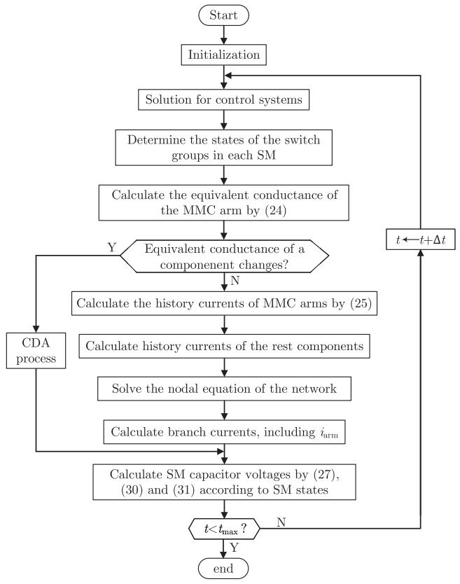  
Fig. 6. Flowchart of EMT simulation with the proposed hybrid numerical integration-based MMC model.

as time progresses [37] because there is a latency of $\Delta t / 2$ . After the capacitor voltage of the HBSM at $\begin{array} { r } { t - \frac { \Delta t } { 2 } ( \mathrm { i . e . , } v _ { \mathrm { c } i } ( t - \frac { \Delta t } { 2 } ) ) } \end{array}$ is calculated, the arm inductor current at $\overline { { t } } \ ( \mathrm { i . e . , } \ i _ { \mathrm { a r m } } ( t ) )$ can be calculated, then the capacitor voltage at $\begin{array} { r } { t + \frac { \Delta t } { 2 } \ ( \mathrm { i . e . , } v _ { \mathrm { c } i } ( t + } \end{array}$ $\begin{array} { r l r } {  { \frac { \Delta t } { 2 } \big ) \big ) } } \end{array}$ is calculated. This process will repeat until the simulation end time is reached. During the simulation, the computations of HBSM capacitor dynamic equations and the arm inductor dynamic equation are decoupled completely due to the latency of $\Delta t / 2$ between the two parts. Specifically, the dynamic model of the arm inductor is calculated within the EMTP-type solution of the main electric network. Moreover, it can be found that the computations of HBSM capacitance dynamics are decoupled from each other and can be readily and efficiently implemented.

# B. Flowchart of EMT Simulation With the Proposed MMC Model

The flowchart of the EMT simulation with the proposed MMC model is shown in Fig. 6, where only some critical steps are presented. As Fig. 6 shows, at the beginning of the computation for each time step, the control system is solved. Based on this, the switch states are judged and the SM states are further determined. Then, the equivalent conductance of the MMC is calculated according to the switch states. Next, the simulation engine checks whether the equivalent conductance of a component changes. If the equivalent conductance of a component changes at time t, the CDA process is executed. The

details of the CDA process are elaborated in Section III-C. If the conductance matrix does not change, the history currents of HBSMs and the network components are computed. After that, the network nodal equations are solved and the branch currents are calculated (including $i _ { \mathrm { a r m } } )$ . Last, the SM capacitor voltages are computed according to $i _ { \mathrm { a r m } } .$ . After the computation of each time step, the program checks whether the simulation duration is reached. If it is not touched, the simulation time instant is updated $( \mathrm { i . e . , } t \gets t + \Delta t )$ and the computation of the next time step is implemented.

# C. CDA for the Proposed MMC Model

In the EMT simulation, the CDA [38] is implemented to suppress numerical oscillation when there is a network switch. In the CDA process of the main network, the proposed MMC model above needs to be modified. The CDA process includes the numerical integration of two half-time-step with the backward Euler method. Assume that a network switch occurred in the power system at the time t, (16) can be discretized with a time step of $\Delta t / 2$ and $i _ { \mathrm { a r m } } ( t - \frac { \Delta t } { 2 } )$ are calculated as:

$$
i _ {\mathrm {a r m}} \left(t - \frac {\Delta t}{2}\right) = G v _ {\mathrm {a r m}} \left(t - \frac {\Delta t}{2}\right) + i _ {\mathrm {h i s t}} \left(t - \frac {\Delta t}{2}\right) \tag {32}
$$

with

$$
G = \frac {\Delta t}{2 L _ {0} + R _ {\mathrm {e q}} \Delta t}, \tag {33}
$$

$$
\begin{array}{l} i _ {\mathrm {h i s t}} \left(t - \frac {\Delta t}{2}\right) = \frac {2 L _ {0}}{2 L _ {0} + R _ {\mathrm {e q}} \Delta t} i _ {\mathrm {a r m}} (t - \Delta t) \\ - \frac {\Delta t}{2 L _ {0} + R _ {\mathrm {e q}} \Delta t} K _ {1} v _ {\mathrm {c}} \left(t - \frac {\Delta t}{2}\right) \\ - \frac {\Delta t}{2 L _ {0} + R _ {\mathrm {e q}} \Delta t} \boldsymbol {K} _ {2} \boldsymbol {v} _ {\mathrm {c e q}} \left(t - \frac {\Delta t}{2}\right) \tag {34} \\ \end{array}
$$

where the capacitor voltages at the time $\begin{array} { r } { t - \frac { \Delta t } { 2 } \ ( \mathrm { i . e . , } \ v _ { \mathrm { c } i } ( t - } \end{array}$ $\scriptstyle { \frac { \Delta t } { 2 } } ) )$ are calculated by (27) or (30).

Then, the numerical integration from $\begin{array} { r } { t - \frac { \Delta t } { 2 } } \end{array}$ to t is implemented and the discretized dynamic equation of the MMC is written as:

$$
i _ {\mathrm {a r m}} (t) = G v _ {\mathrm {a r m}} (t) + i _ {\mathrm {h i s t}} (t) \tag {35}
$$

with

$$
G = \frac {\Delta t}{2 L _ {0} + R _ {\mathrm {e q}} \Delta t}, \tag {36}
$$

$$
\begin{array}{l} i _ {\mathrm {h i s t}} (t) = \frac {2 L _ {0}}{2 L _ {0} + R _ {\mathrm {e q}} \Delta t} i _ {\mathrm {a r m}} \left(t - \frac {\Delta t}{2}\right) \\ - \frac {\Delta t}{2 L _ {0} + R _ {\mathrm {e q}} \Delta t} \pmb {K} _ {1} \pmb {v} _ {\mathrm {c}} \left(t - \frac {\Delta t}{2}\right) \\ - \frac {\Delta t}{2 L _ {0} + R _ {\mathrm {e q}} \Delta t} \boldsymbol {K} _ {2} \boldsymbol {v} _ {\mathrm {c e q}} \left(t - \frac {\Delta t}{2}\right). \tag {37} \\ \end{array}
$$

To sum up, the flowchart of the CDA process is illustrated in Fig. 7. It includes the calculation of two half-steps. After

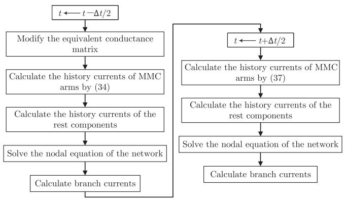  
Fig. 7. Flowchart of the CDA process.

the two half-time-step computations of the main network, the system switches to the normal simulation process, as shown in Fig. 6.

# D. Features of the Proposed Model

The features of the proposed model are briefly explained as follows.

1) Each arm of the MMC is equivalent to a Norton circuit in the EMTP-type solution of the main network, greatly reducing the dimension of nodal equations. The computations for capacitor and inductor dynamic equations of MMC are decoupled. If the inductor current is obtained, the capacitor voltages can be calculated explicitly. Furthermore, the computations of capacitor voltages of the HBSMs are independent of each other, which also improves computational efficiency.   
2) With the hybrid numerical integration of the midpoint rule and trapezoidal rule, the equivalent conductance of an MMC arm keeps constant under normal operational conditions. It only changes when the number of conducting legs varies. Compared with the existing models (e.g., the TE-based model), this model avoids the frequent LU decomposition of the equivalent conductance matrix of the power system in the EMT simulation and greatly accelerates the simulation.   
3) The midpoint rule is second-order, which is the same as the trapezoidal rule. Compared with the traditional first-order one-step delay method (i.e., forward Euler method), the midpoint rule is more accurate. In addition to the accuracy, the midpoint rule has a larger absolute stability region than the forward Euler method, which means that the midpoint rule is more numerically stable [39].   
4) The proposed model is convenient to interface with the trapezoidal rule-based EMTP-type simulation. In contrast to the hybrid numerical integration, the Runge-Kutta method or Huen’s method-based models cannot make the equivalent conductance constant and is hard to interface with the existing trapezoidal rule-based EMTP-type simulation program.

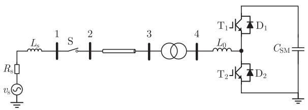  
Fig. 8. Schematic diagram of the single-HBSM test system.

TABLE IIPARAMETERS OF THE SINGLE-HBSM SYSTEM  

<table><tr><td>Quantity</td><td>Value</td><td>Quantity</td><td>Value</td></tr><tr><td>RMS Voltage of source (kV)</td><td>1</td><td>Frequency of source (Hz)</td><td>50</td></tr><tr><td>Source resistance Rs(Ω)</td><td>10</td><td>Source inductance Ls(H)</td><td>0.001</td></tr><tr><td>Resistance of line 2-3 (Ω)</td><td>1</td><td>Inductance of line 2-3 (H)</td><td>0.01</td></tr><tr><td>Capacitance of line 2-3 (μF)</td><td>10</td><td>Transformer inductance (pu)</td><td>0.01</td></tr><tr><td>Transformer voltages (kV/kV)</td><td>1/0.8</td><td>SM capacitor Csm(μF)</td><td>1000</td></tr><tr><td>SM arm inductor L0(H)</td><td>0.01</td><td>ON-resistance of switches (Ω)</td><td>0.005</td></tr></table>

# IV. CASE STUDIES

In this section, the accuracy and efficiency of the presented MMC model are demonstrated on several test systems by comparing it with the TE-based model [16]. The schematic diagram of the TE-based model and the corresponding description are presented in Appendix B. The accuracy and efficiency of the TEbased model have already been validated by theoretical analyses and tests in the literature. It is considered as the reference here. The two models are implemented on the EMTP-type simulation program CloudPSS [40]. The CloudPSS is developed using C++ programming language. It is widely used by researchers and engineers in academia and industry [41], [42].

# A. Accuracy Validation for the Proposed Model

1) The Single HBSM: The proposed model is first tested on the single-HBSM system shown in Fig. 8. The PWM modulation (called open-loop control) is adopted for the HBSM, with a duty ratio $d = 0 . 5$ . Parameters of the test system are listed in Table II.

First, the IGBTs of the single HBSM system are blocked at t = 0.05s. This test system is simulated by the TE-based model [16] and the proposed model with a $\Delta t$ of 10 μs, respectively. The arm inductor currents and the capacitor voltages obtained by the two ways are illustrated in Figs. 9 and 10. Note that the blue dash-dot lines represent the results obtained from the proposed model without considering the cases of zero ON legs and two ON legs of the HBSM. It can be found that the results obtained from the proposed model and the TE-based model are coincident with each other, which illustrates the accuracy of the proposed model. This is because the midpoint rule and trapezoidal rule have similar accuracy. It is worth noting that noticeable errors will emerge in the results obtained from the proposed model if the case of zero conducting legs is not considered. In this case study, the two legs of the HBSM turn off simultaneously during some time intervals (e.g., [0.0827, 0.0846] s).

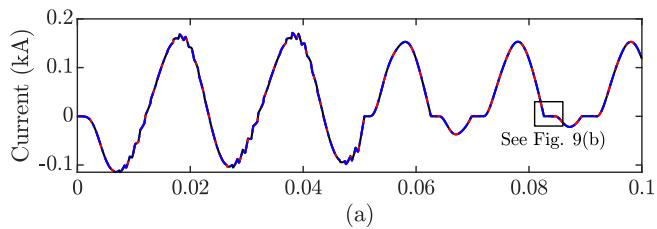

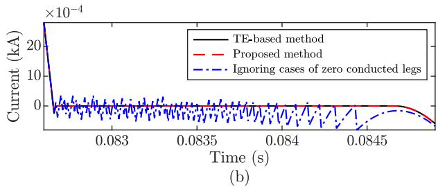  
Fig. 9. Currents of the arm inductor $L _ { 0 }$ obtained from the TE-based model and the proposed model. (a) A global perspective. (b) A magnified view of the arm inductor currents.

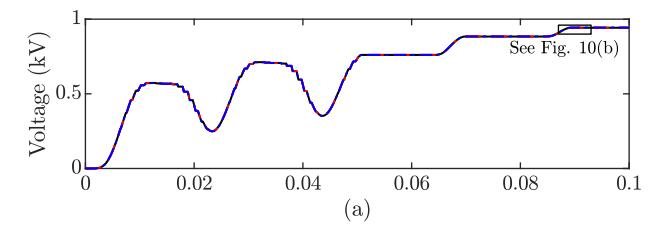

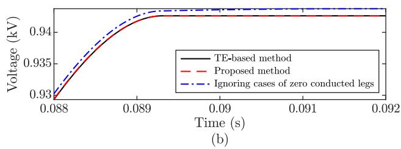  
Fig. 10. Voltages of the SM capacitor obtained from the TE-based model and the proposed model. (a) A global perspective. (b) A magnified view of the capacitor voltages.

Next, a network switch action is considered. In the beginning, the switch S is ON, it turns OFF at t = 0.11 s. The test system is simulated with the proposed model and traditional TE-based model, respectively. Voltages of the inductor $L _ { s }$ obtained by different models are depicted in Fig. 11. It can be found from Fig. 11(b) that incorrect simulation results will be obtained if the CDA is not considered. The numerical oscillation occurs in the EMT simulation without the CDA. In contrast, with the CDA process, accurate results will be obtained from the proposed model, as shown in Fig. 11(a).

2) An MMC With Ten HBSMs: Following the case of a single-HBSM system, different operational conditions of an MMC with ten HBSMs (shown in Fig. 12) are studied. Parameters of the test system are listed in Table III.

With a time step of $1 0 \mu \mathrm { s } ,$ the currents of arm inductor $L _ { 0 }$ and capacitor voltages of SM1 are calculated by the proposed model and the TE-based model, respectively. They are then illustrated

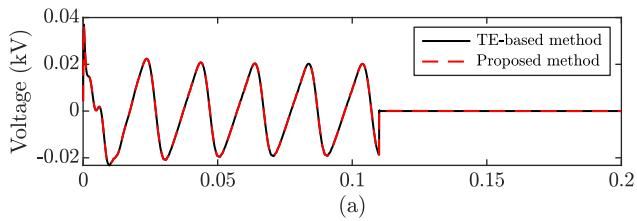

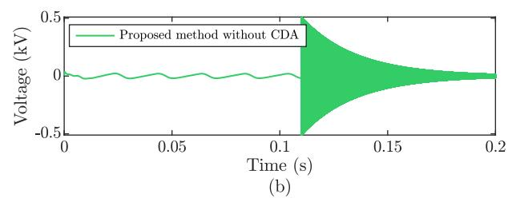  
Fig. 11. Voltages of inductor $L _ { \mathrm { s } } . \mathrm { ( a ) }$ Voltages of inductor $L _ { \mathrm { s } }$ obtained with the TE-based model and the proposed model. (b) Voltage of the inductor $L _ { \mathrm { s } }$ obtained with the proposed model when the CDA is not considered.

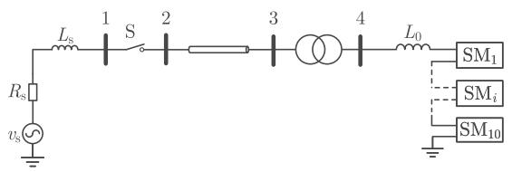  
Fig. 12. Schematic diagram of the ten-HBSM system.

TABLE III PARAMETERS OF THE TEN-HBSM SYSTEM   

<table><tr><td>Quantity</td><td>Value</td><td>Quantity</td><td>Value</td></tr><tr><td>RMS Voltage of source (kV)</td><td>2</td><td>Frequency of source (Hz)</td><td>50</td></tr><tr><td>Source resistance Rs(Ω)</td><td>2</td><td>Source inductance Ls(H)</td><td>0.001</td></tr><tr><td>Resistance of line 2-3 (Ω)</td><td>1</td><td>Inductance of line 2-3 (H)</td><td>0.01</td></tr><tr><td>Capacitance of line 2-3 (μF)</td><td>10</td><td>Transformer inductance (pu)</td><td>0.01</td></tr><tr><td>Transformer voltages (kV/kV)</td><td>2/1.6</td><td>SM capacitance (μF)</td><td>1000</td></tr><tr><td>SM arm inductance L0(H)</td><td>0.01</td><td>ON-resistance of switch (Ω)</td><td>0.005</td></tr></table>

in Fig. 13, where the blue dash-dot lines represent the results obtained from the proposed model without considering the cases of zero ON leg and two ON legs of the HBSM. As Fig. 13 shows, the same conclusion as that in the single-HBSM case can be drawn in this case. The proposed model is accurate. Moreover, it is worth noting that the SM capacitor is charged from t = 0 s to $t = 0 . 0 0 7 ~ \mathrm { s } .$ Then, it gradually discharges to 0 V. From $t = 0 . 0 1 7 \mathrm { ~ s ~ t o ~ } t = 0 . 0 2 5 \mathrm { ~ s ~ }$ , both the two legs of the HBSM are ON and the capacitor voltage is near 0 V. In this case, if the scenario of two ON legs is not considered, the proposed model will be inaccurate from t = 0.017 s.

Next, similar to the single-HBSM test system, the switch S in the ten-module system turns off at t = 0.11s. The test system is simulated using the proposed model and the TE-based model, respectively. Voltages of Bus 1 obtained from different models are shown in Fig. 14. The numerical oscillation also happens when the CDA is not considered. If there is still a numerical

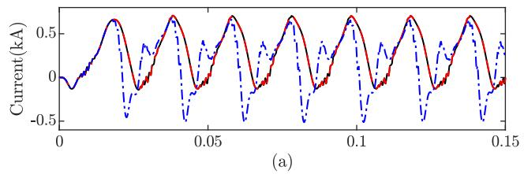

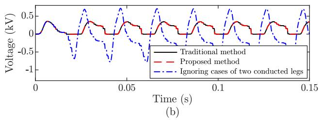  
${ \mathrm { F i g . } }$ 13. Currents of the arm inductor $L _ { 0 } .$ . (a) Currents of the arm inductor $L _ { 0 }$ obtained from the TE-based model and the proposed model (b) Capacitor voltages of the SM1 obtained from different models.

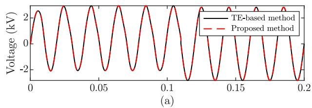

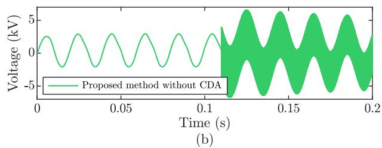  
Fig. 14. Voltage of Bus 1 in the ten-SM system. (a) Voltage of Bus 1 in the ten-SM system obtained from the TE-based and the presented model. (b) Voltage of Bus 1 obtained with the proposed model when the CDA is not considered.

oscillation, a very large resistance can be connected to the arm inductor in parallel to suppress the oscillation.

As for numerical stability, the numerical stability of LIM has been discussed in many works [43], [44]. Further, the numerical stability of the hybrid LIM-EMTP solution is analyzed in [25]. The numerical stability is related to the time step size and the capacitance and inductance of the MMC. Usually, under the premise of numerical stability, the larger the node capacitance and branch inductance in the LIM network, the larger the timestep size can be selected. The capacitance and inductance of the MMC are typically thousands of microfarads and dozens of millihenries, respectively [45], which means that they are relatively large. The proposed MMC model is numerically stable even with a time step of more than ten microseconds.

3) Two-Terminal MMC-HVDC: In this subsection, a twoterminal MMC-HVDC system with closed-loop control is utilized to validate the accuracy of the proposed model. The

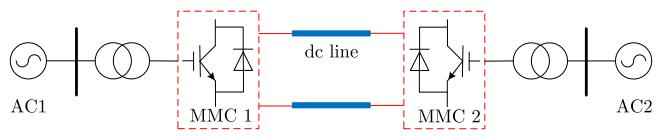  
Fig. 15. Schematic diagram of the two-terminal MMC-HVDC system.

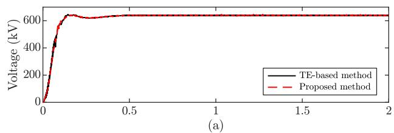

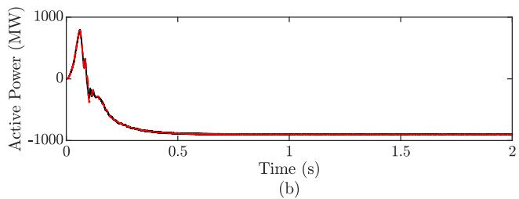  
Fig. 16. Simulation results of the two-terminal MMC-HVDC where the SM capacitors are charged from 0 V by antiparallel diodes.

schematic diagram of the two-terminal MMC-HVDC system is shown in Fig. 15. In this test system, MMC1 works as the rectifier and MMC2 works as the inverter. By the way, the capacitor voltage balancing strategy [46] is also considered for the MMCs in all the following tests. Parameters of the two-terminal MMC-HVDC system are listed in Appendix C.

First, the steady state of the two-terminal system is considered. The whole system is started up from zero. Before $t = 0 . 0 8 { \mathrm { s } } ,$ all the IGBTs and controllers of the two MMCs are blocked and the SM capacitors are charged from 0 V by antiparallel diodes. After $t = 0 . 0 8 ~ \mathrm { s } ,$ , the IGBTs and the controllers are triggered. The parameters of the controllers can be found in Table VI. The two-terminal MMC-HVDC is simulated using the TE-based model and the proposed model, respectively, with a time step of $1 0 \mu \mathbf { s } .$ . The simulation results are illustrated in Fig. 16. It can be found that the results obtained with the proposed model and the TE-based model are coincident with each other, which illustrates the accuracy of the proposed model in both the start-up process and the steady-state. By the way, in this case, G changes 159 times before $t = 0 . 0 8 \ \mathrm { s } .$ . From $t = 0 . 0 8 \ \mathrm { s } , G$ keeps constant. Therefore, in the whole simulation, G changes 159 times in total. The number of simulation steps of the whole simulation is 200000. Therefore, the percentage of constant G in this case is 99.9205%.

Then, the operational condition of $P _ { \mathrm { s r e f } } = 0$ and $Q _ { \mathrm { s r e f } } = 0$ is considered. For the two-terminal MMC-HVDC system, the reference of the active power of MMC station 2 steps from 900 MW to 0 MW at t = 1 s. This is simulated using the proposed model and the TE-based model, respectively, both with a time-step of $1 0 \mu \mathrm { s }$ . Note that the initialization of the MMC is also considered in this case and the initial capacitor voltages of

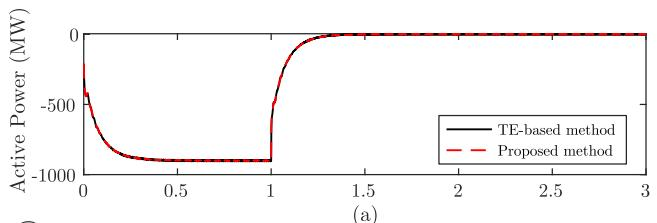

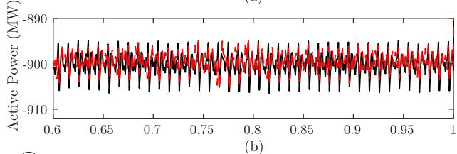

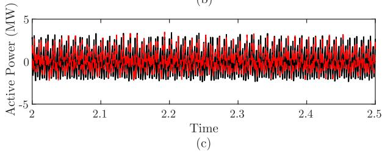  
Fig. 17. AC-side (i.e., PCC bus) active power of the MMC2 obtained from different models, respectively, when the active power reference steps from −900 MW to 0 MW. (a) A global perspective. (b)-(c) zoomed-in views.

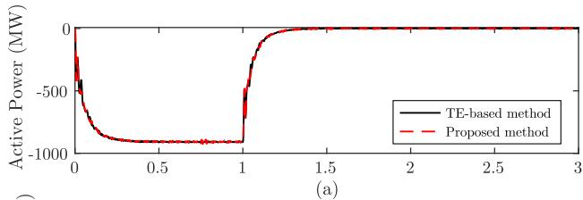

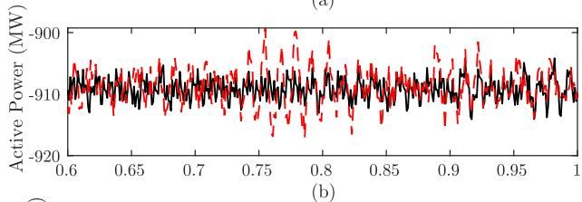

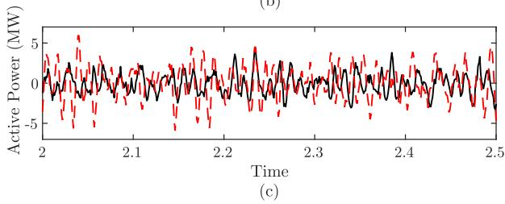  
Fig. 18. C-side active power of the MMC2 obtained from different models, respectively, when the active power reference steps from 900 MW to 0 MW. (a) A global perspective. (b)-(c) zoomed-in views.

the two MMCs are 8.421 kV. The simulation results respectively obtained from the proposed model and the TE-based model are shown in Figs. 17 and 18, where the black curves represent the results obtained by the TE-based model and the red curves represent the results obtained by the proposed model. It can be found that both the ac-side power and dc-side power obtained by the two models are nearly the same as each other. This shows

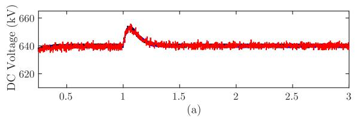

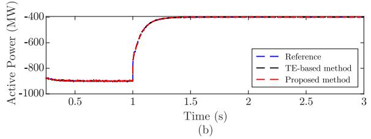  
Fig. 19. Simulation results obtained from different MMC models and with a time-step of 50 µs. (a) AC-side active power of MMC station 2. (b) DC voltage of MMC station 1.

that the delay of $\Delta t / 2$ in the proposed model does not cause energy loss/creation. Furthermore, the active power efficiencies of MMC2 with different models are calculated by comparing Figs. 17(b) and 18(b). The active power efficiency of MMC2 obtained with the TE-based model is 98.988% and the active power efficiency of MMC2 obtained with the proposed model is 98.999%. They are nearly the same. It further validates that there is no energy loss/creation in the proposed model. By the way, in this case and hereafter, the MMC capacitors are initialized and the percentage of constant G in the simulations is 100%.

Furthermore, to illustrate the accuracy of the proposed mode in large-step EMT simulation, the two-terminal MMC-HVDC are simulated with time steps of 50 μs and 100 μs, respectively. First, the two-terminal MMC-HVDC system is simulated with a time step of 50 μs. At t = 1.0 s, the active power reference of MMC station 2 steps from 900 MW to 400 MW. The ac-side active power of MMC station 2 and the dc voltage of MMC station 1 are shown in Fig. 19. The reference result is obtained by the TE-based model with a time-step of 1 μs. It can be found that the results obtained from the TE-based model and the proposed model are nearly the same and both of them are near to the reference. This demonstrates the accuracy of the proposed model in the EMT simulation of the two-terminal MMC-HVDC with a relatively large time-step. Then, the twoterminal MMC-HVDC system is simulated with a time step of 100 μs. The ac-side active power of MMC station 2 and the dc voltage of MMC station 1 are shown in Fig. 20. It can be found that the proposed model is also accurate in large-step simulation of the two-terminal MMC-HVDC. In summary, the proposed model with a latency of Δt/2 does not affect the accuracy of the EMT simulation of MMC-HVDC.   
4) Multi-Terminal MMC-HVDC: Next, the proposed model is tested on the CIGRE four-terminal five-node MMC-HVDC system. Its schematic diagram is shown in Fig. 21. In this test system, the dc voltage-active power (V-P) droop control is considered. The d-axis of the converter stations 1 and 2 are V-P droop control. Detailed parameters of this test system are listed in Appendix D.

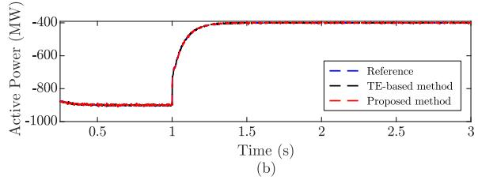  
Fig. 20. Simulation results obtained from different MMC models and with a time-step of 100 µs. (a) AC-side active power of MMC station 2. (b) DC voltage of MMC station 1.

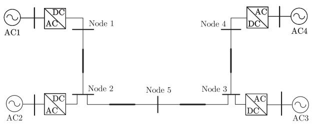  
Fig. 21. Schematic diagram of the CIGRE four-terminal five-node dc grid.

At t = 1.5s, the active power reference of converter station 3 steps from −500 MW to −400 MW. With a time-step of 10 μs, the four-terminal five-node MMC-HVDC system is simulated using the TE-based model and the proposed model, respectively. The test results obtained from the two models are illustrated in Fig. 22. As can be seen from Fig. 22, the presented model is accurate and the results obtained from the proposed model coincide with those computed by TE-based models. Moreover, it can be found that the dc voltage drops to another steady-state value. This is because the dc voltage-active power control is adopted. When there is a power shortage, the dc voltage decreases. This also shows the correctness of the proposed model. In a word, the proposed model is accurate in the multi-terminal dc grid with various control modes.   
5) Large-Scale AC/DC Power System With MMC-HVDC: Finally, the proposed model is tested on a large-scale power grid with an MMC-HVDC system. The one-line diagram of the test system is shown in Fig. 23. This test system has 10594 single-phase nodes, including 134 generators, 1442 transmission lines, 1124 transformers, 1676 loads and an MMC-HVDC system. The test system is abstracted from the huge real-life power system of Southwest China. It is a subsystem of the whole power system of Southwest China, obtained by distributed transmission line-based task decoupling. Thus, the subsystem here under test is simulated without any task decoupling. The EMT model of the large-scale power system is built up by transferring the transient stability (TS) model of the studied power system automatically. The transient stability model is created using PSASP [47].

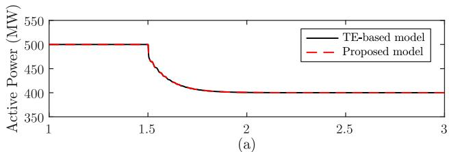

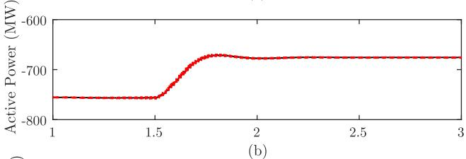

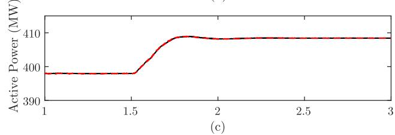

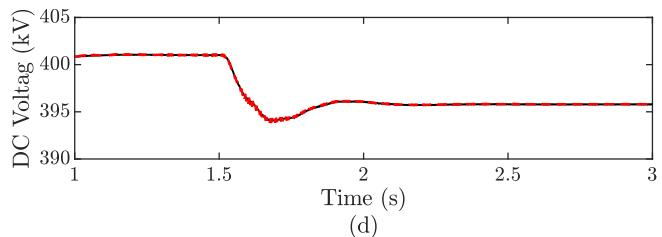  
Fig. 22. Simulation results of the CIGRE four-terminal five-node dc grid when the active power of converter station 3 steps from −500 MW to 400 MW. (a) Active power of converter station 3 obtained from the TE-based model and the proposed model, respectively. (b) Active power of converter station 2. (c) Active power of converter station 1. (d) DC voltage of converter station 1.

In [48] and [49], the automatic model transformation method from the TS model on PSASP to the EMT model on CloudPSS has been introduced carefully. Parameters of the MMC-HVDC system are the same as those in Table VI.

At t = 1.5 s, a phase-C-to-ground fault occurs at Bus ZM of the receiving-end system. The short-circuit fault is cleared at $t = 1 . 5 5 ~ \mathrm { s }$ . This test system is simulated using the proposed model and TE-based model. The results are depicted in Fig. 24. It can be found that, for the large-scale power system, the results obtained with the two models are nearly the same as each other, which further illustrates the accuracy of the proposed model. Besides, as Fig. 24 shows, the sending-end converter station is not affected by the fault occurring at the receiving-end converter station due to the isolation of the MMC-HVDC. It is worth noting that there are four CDA steps in this case. Specifically, when the short-circuit fault occurs, there are two CDA steps. When the short-circuit fault is cleared, there are another two CDA steps. If the CDA of the MMC model is not considered, the EMT simulation of this test system cannot be implemented.

In summary, according to the test results above, it can be found that the proposed model has the same accuracy as the traditional

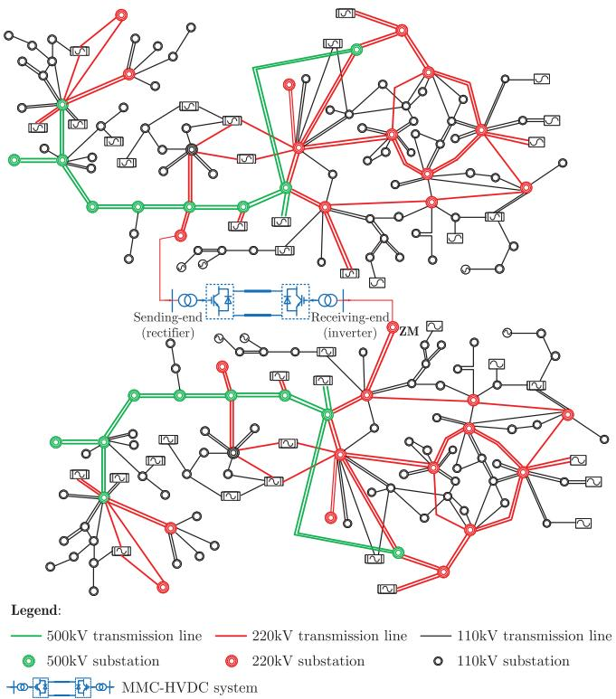  
Fig. 23. One-line diagram of a large-scale power grid with MMC-HVDC system.

TABLE IV COMPUTATIONAL TIME COMPARISON BETWEEN DIFFERENT MODELS (s)   

<table><tr><td>Test systems</td><td>TE-based model</td><td>Proposed model</td><td>Speedup</td></tr><tr><td>Two-terminal MMC-HVDC</td><td>44.29</td><td>29.12</td><td>1.52</td></tr><tr><td>Four-terminal MMC-HVDC</td><td>184.41</td><td>158.62</td><td>1.16</td></tr><tr><td>Large-scale ac/dc system</td><td>2688.23</td><td>274.65</td><td>9.79</td></tr></table>

TE-based model in various test systems and different operational conditions.

# B. Efficiency Validation of the Proposed Model

1) Efficiency Enhancement: The CPU computational time of the TE-based model and the proposed model in simulating the above power systems with MMC-HVDC is tested and summarized in Table IV. The tests are carried out on a desktop computer with an Intel i7 CPU processor and 32 GB RAM. The time step for the simulations is $1 0 \mu \mathrm { s }$ and the simulation duration is 3 s.

It can be found that the proposed model is much faster than the TE-based model. For the large-scale ac/dc power system under test, the speedup of the proposed model is about 9.79. which shows the high efficiency of the proposed model in large-scale power systems simulation. The root cause is that the proposed MMC model has a constant equivalent conductance. It avoids the frequent LU decomposition of the high-dimensional nodal conductance matrix. Note that there is no task decoupling in the

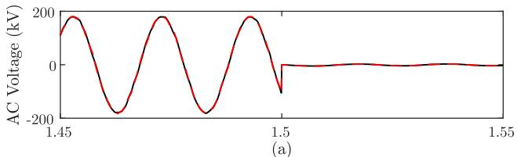

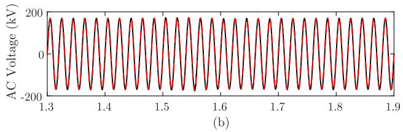

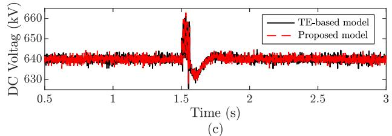  
Fig. 24. Simulation results of the large-scale ac/dc power system when a phase-C-to-ground fault occurs at the receiving-end converter station. (a) Voltage of phase C of PCC bus at receiving-end converter station. (b) Voltage of phase C of PCC bus at sending-end converter station. (c) DC voltage.

EMT simulation of the large network. If a distributed transmission line model is used for task decoupling in the EMT simulation of a large-scale system, the system will be divided into several small networks. When the network is relatively small, the speedup gain of constant conductance will decrease because the computational complexity of LU decomposition is relatively low compared to the overall computational complexity of the system. This can be seen in the two-terminal MMC-HVDC and four-terminal MMC-HVDC test systems, where the electric networks and the dimension of the network equivalent conductance matrices are small while the scales of the controllers are huge. Especially, for the four-terminal CIGRE MMC-HVDC grid, the total number of electric nodes is 193, while the number of control nodes is more than 15000. The computational burden of the controllers is much larger than the electric network. Therefore, the acceleration of electrical network computation only provides a relatively small improvement in the computational efficiency of the whole system.

2) Impact of the Number of SMs on the Efficiency: Furthermore, the efficiency of the proposed model is tested on the two-terminal MMC-HVDC system with different numbers of SMs. The time step for the simulations is also $1 0 \mu \mathrm { s }$ . The CPU time consumption is listed in Table V.

As Table V shows, the proposed model is more efficient than the TE-based model in the MMCs with arbitrary numbers of SMs. The speedup of the proposed model decreases when the number of SMs increases. This is because the computational time of the control system increases dramatically as the number of SMs increases. In this circumstance, although the proposed

TABLE V COMPUTATIONAL TIME OF THE TE-BASED MODEL AND PROPOSED MODEL WITH DIFFERENT NUMBER OF SMS (s)   

<table><tr><td>The number of SMs</td><td>30</td><td>50</td><td>76</td><td>100</td><td>120</td></tr><tr><td>TE-based model</td><td>30.64</td><td>36.47</td><td>44.29</td><td>52.38</td><td>61.03</td></tr><tr><td>Proposed model</td><td>17.08</td><td>22.31</td><td>29.12</td><td>36.93</td><td>45.46</td></tr></table>

model can improve the computational efficiency of the electric network, it has a relatively low speedup for the whole system.

# V. CONCLUSION

This article proposes an efficient MMC model for EMTP-type simulation. Each arm of the MMC is reduced to a two-node Norton circuit with constant conductance in the main network solution and the dynamic equations of the SM capacitors are decoupled from each other. These endow the model with higher simulation speed under the premise of similar accuracy compared with the TE-based model. In future research, due to the advantages of the leapfrog computation framework, the presented method can also be applied to the EMTP-type modeling and simulation of other VSCs.

# ACKNOWLEDGMENT

The authors would like to thank Prof. Shujun Yao from North China Electric Power University, China for the helpful discussion and also the editor and anonymous reviewers for the valuable comments and suggestions.

# APPENDIX A DERIVATION OF (18)–(21)

According to (17), the difference equation of the MMC arm is:

$$
\begin{array}{l} i _ {\mathrm {a r m}} (t) = i _ {\mathrm {a r m}} (t - \Delta t) + \frac {\Delta t}{2 L _ {0}} \left(v _ {\mathrm {a r m}} (t) - R _ {\mathrm {e q}} i _ {\mathrm {a r m}} (t) \right. \\ + v _ {\mathrm {a r m}} (t - \Delta t) - R _ {\mathrm {e q}} i _ {\mathrm {a r m}} (t - \Delta t)) - \frac {\Delta t}{2 L _ {0}} \left(\boldsymbol {K} _ {1} \boldsymbol {v} _ {\mathrm {c}} (t) \right. \\ + \boldsymbol {K} _ {1} \boldsymbol {v} _ {\mathrm {c}} (t - \Delta t) + \boldsymbol {K} _ {2} \boldsymbol {v} _ {\mathrm {c e q}} (t) + \boldsymbol {K} _ {2} \boldsymbol {v} _ {\mathrm {c e q}} (t - \Delta t)). \tag {A1} \\ \end{array}
$$

In (A1), ${ \pmb v } _ { \mathrm { c } } ( t )$ and $v _ { \mathrm { c e q } } ( t )$ are unknown. It makes that (A1) cannot be represented as a Norton equivalent circuit. Thus, ${ \pmb v } _ { \mathrm { c } } ( t )$ and $v _ { \mathrm { c e q } } ( t )$ are derived first by using $i _ { \mathrm { a r m } } ( t ) , v _ { \mathrm { a r m } } ( t )$ and the history variables at time instant $t - \Delta t$ .

For the ith HBSM with the upper leg ON, according to the trapezoidal rule, the difference equation of the SM capacitor can be represented as:

$$
v _ {\mathrm {c} i} (t) = v _ {\mathrm {c} i} (t - \Delta t) + \frac {\Delta t}{2 C _ {\mathrm {s m} i}} \left(i _ {\mathrm {a r m}} (t) + i _ {\mathrm {a r m}} (t - \Delta t)\right). \tag {A2}
$$

For the ith HBSM with both legs ON, the difference equation of the SM capacitor can be represented as:

$$
v _ {\mathrm {c} i} (t) = v _ {\mathrm {c} i} (t - \Delta t) - \frac {\Delta t}{2 C _ {\mathrm {s m} i}} \left(i _ {1 i} (t) + i _ {1 i} (t - \Delta t)\right) \quad (\mathrm {A 3})
$$

where $i _ { 1 i } ( t )$ represents the current of the upper leg of the HBSM and can also be calculated by:

$$
\left\{ \begin{array}{l} v _ {c i} (t) = R _ {\text {o n}} \left(i _ {1 i} (t) + i _ {2 i} (t)\right) \\ i _ {\text {a r m}} (t) = i _ {2 i} (t) - i _ {1 i} (t) \end{array} \right. \tag {A4}
$$

where $i _ { 2 i } ( t )$ represents the current of the lower leg of the HBSM. By solving the simultaneous equations (A3) and $( \mathbf { A } 4 ) , v _ { \mathrm { c } i } ( t )$ can be obtained:

$$
\begin{array}{l} v _ {c i} (t) = \frac {4 R _ {\mathrm {o n}} C _ {\mathrm {s m} i}}{4 R _ {\mathrm {o n}} C _ {\mathrm {s m} i} + \Delta t} v _ {c i} (t - \Delta t) + \frac {R _ {\mathrm {o n}} \Delta t}{4 R _ {\mathrm {o n}} C _ {\mathrm {s m} i} + \Delta t} i _ {\mathrm {a r m}} (t) \\ - \frac {2 R _ {\mathrm {o n}} \Delta t}{4 R _ {\mathrm {o n}} C _ {\mathrm {s m} i} + \Delta t} i _ {\mathrm {l} i} (t - \Delta t). \tag {A5} \\ \end{array}
$$

Then, $\begin{array} { r } { v _ { \mathrm { c e q } i } ( t ) = \frac { v _ { \mathrm { c } i } ( t ) } { 2 } } \end{array}$ can be derived:

$$
\begin{array}{l} v _ {\mathrm {c e q} i} (t) = \frac {2 R _ {\mathrm {o n}} C _ {\mathrm {s m} i}}{4 R _ {\mathrm {o n}} C _ {\mathrm {s m} i} + \Delta t} v _ {\mathrm {c} i} (t - \Delta t) \\ + \frac {R _ {\mathrm {o n}} \Delta t}{8 R _ {\mathrm {o n}} C _ {\mathrm {s m} i} + 2 \Delta t} i _ {\mathrm {a r m}} (t) \\ - \frac {R _ {\mathrm {o n}} \Delta t}{4 R _ {\mathrm {o n}} C _ {\mathrm {s m i}} + \Delta t} i _ {1 i} (t - \Delta t). \tag {A6} \\ \end{array}
$$

By substituting (A2) and (A6) into (A1), (A1) can be represented as the Norton equivalent circuit form in (A7) when all the HBSMs have ON legs:

$$
i _ {\mathrm {a r m}} (t) = G _ {\mathrm {t r}} v _ {\mathrm {a r m}} (t) + i _ {\mathrm {h i s t}} ^ {\mathrm {t r}} (t) \tag {A7}
$$

where

$$
G _ {\mathrm {t r}} = \frac {1}{R _ {\mathrm {N o r t o n}}}, \tag {A8}
$$

$$
\begin{array}{l} i _ {\text {h i s t}} ^ {\operatorname {t r}} (t) = G _ {\operatorname {t r}} v _ {\operatorname {a r m}} (t - \Delta t) \\ - \frac {1 - \frac {\Delta t}{2 L _ {0}} \sum_ {i = 1} ^ {N} k _ {1 i} \frac {\Delta t}{2 C _ {\mathrm {s m} i}} - \frac {R _ {\mathrm {e q}} \Delta t}{2 L _ {0}}}{\frac {\Delta t}{2 L _ {0}}} G _ {\mathrm {t r}} i _ {\mathrm {a r m}} (t - \Delta t) \\ + G _ {\mathrm {t r}} \sum_ {i = 1} ^ {N} k _ {2 i} \left(\left(\frac {2 R _ {\mathrm {o n}} C _ {\mathrm {s m} i}}{4 R _ {\mathrm {o n}} C _ {\mathrm {s m} i} + \Delta t} - \frac {1}{2}\right) v _ {\mathrm {c} i} (t - \Delta t) \right. \\ \left. - \frac {R _ {\mathrm {o n}} \Delta t}{4 R _ {\mathrm {o n}} C _ {\mathrm {s m i}} + \Delta t} i _ {1 i} (t - \Delta t)\right) \tag {A9} \\ \end{array}
$$

with

$$
\begin{array}{l} R _ {\text {N o r t o n}} = \frac {\Delta t}{2 L _ {0}} + R _ {\text {e q}} + \sum_ {i = 1} ^ {N} \frac {\Delta t}{2 C _ {\text {s m} i}} k _ {1 i} \\ + \sum_ {i = 1} ^ {N} \frac {R _ {\mathrm {o n}} \Delta t}{8 R _ {\mathrm {o n}} C _ {\mathrm {s m i}} + 2 \Delta t} k _ {2 i}. \tag {A10} \\ \end{array}
$$

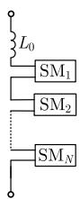

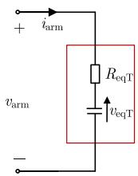  
(b)

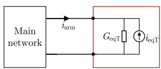  
  
Fig. 25. Schematic diagram of the TE-based model. (a) An MMC arm. (b) TE-based model of the MMC arm. (c) Two-part network with a reduced number of nodes in the main network.

TABLE VIPARAMETERS OF THE TWO-TERMINAL MMC-HVDC SYSTEM  

<table><tr><td>Quantity</td><td>Rectifier</td><td>Inverter</td></tr><tr><td>Control mode</td><td>VdcQ</td><td>PQ</td></tr><tr><td>Rating capacity</td><td>1000 MVA</td><td>1000 MVA</td></tr><tr><td>D-axis control references</td><td>Vdc=640 kV</td><td>P=0.9 pu</td></tr><tr><td>Q-axis control references</td><td>Q=0 pu</td><td>Q=0 pu</td></tr><tr><td>PI parameters d-axis outer loop (Kp, Ki)</td><td>(6, 100)</td><td>(0.25, 10)</td></tr><tr><td>PI parameters q-axis outer loop (Kp, Ki)</td><td>(4, 20)</td><td>(0.5, 5)</td></tr><tr><td>PI parameters d-axis inner loop (Kp, Ki)</td><td>(0.65, 100)</td><td>(0.6, 100)</td></tr><tr><td>PI parameters q-axis inner loop (Kp, Ki)</td><td>(0.65, 100)</td><td>(0.6, 100)</td></tr><tr><td>The number of SMs in an MMC arm</td><td>76</td><td>76</td></tr><tr><td>Arm inductance</td><td>0.05 H</td><td>0.05 H</td></tr><tr><td>SM capacitance</td><td>0.0028 F</td><td>0.0028 F</td></tr><tr><td>AC source voltage</td><td>230 kV</td><td>230 kV</td></tr><tr><td>AC system nominal frequency</td><td>50 Hz</td><td>50 Hz</td></tr><tr><td>Transformer voltage rating</td><td>230kV/370kV</td><td>230kV/370kV</td></tr><tr><td>Transformer leakage inductance</td><td>0.15</td><td>0.15</td></tr><tr><td>Initial voltage of the capacitors</td><td>8.421 kV</td><td>8.421 kV</td></tr><tr><td>Resistance of the dc lines</td><td colspan="2">0.01 Ω</td></tr><tr><td>Inductance of the dc lines</td><td colspan="2">0.001 H</td></tr></table>

# APPENDIX B

# DESCRIPTION OF THE TE-BASED MODEL

The schematic diagram of the TE-based model is shown in Fig. 25 [16]. In the TE-based model, each MMC arm is established as a TE circuit, like the proposed model. Different from the proposed model, the TE-based model has a variable equivalent conductance.

# APPENDIX C

# PARAMETERS OF THE TWO-TERMINAL MMC-HVDC

Parameters of the two-terminal MMC-HVDC system are listed in Table VI.

# APPENDIX DPARAMETERS OF THE CIGRE FOUR-TERMINAL FIVE-NODE DCGRID

Parameters of the converter stations in the CIGRE fourterminal five-node MMC-HVDC are listed in Table VII.

TABLE VIIPARAMETERS OF CONVERTER STATIONS IN THE FOUR-TERMINAL FIVE-NODEMMC-HVDC  

<table><tr><td>Parameters</td><td>Station s1</td><td>Station s2</td><td>Station s3</td><td>Station s4</td></tr><tr><td>Control mode</td><td>V-P droop/Q</td><td>V-P droop/Q</td><td>P/Q</td><td>V/f</td></tr><tr><td>Rated capacity (MW)</td><td>800</td><td>1200</td><td>800</td><td>200</td></tr><tr><td>Rated dc voltage (kV)</td><td>400</td><td>400</td><td>400</td><td>400</td></tr><tr><td>Operating condition</td><td>400 MW</td><td>-800 MW</td><td>500 MW</td><td>-100MW</td></tr><tr><td>Arm inductance (H)</td><td>0.029</td><td>0.019</td><td>0.019</td><td>0.116</td></tr><tr><td>SM capacitance (μF)</td><td>10000</td><td>10000</td><td>10000</td><td>10000</td></tr><tr><td>The number of SMs in an MMC arm</td><td>200</td><td>200</td><td>200</td><td>200</td></tr><tr><td>Initial voltages of the SM capacitors (kV)</td><td>2.0</td><td>2.0</td><td>2.0</td><td>2.0</td></tr><tr><td>Transformer voltages (kV)</td><td>380/220</td><td>380/220</td><td>145/220</td><td>145/220</td></tr><tr><td>Transformer leakage inductance (pu)</td><td>0.18</td><td>0.18</td><td>0.18</td><td>0.18</td></tr></table>

TABLE VIIIPARAMETERS OF THE TRANSMISSION LINES IN THE FOUR-TERMINALFIVE-NODE MMC-HVDC  

<table><tr><td>Transmission lines</td><td>Resistance (Ω)</td><td>Inductance (H)</td><td>Capacitance (μF)</td></tr><tr><td>Line 1-2</td><td>2</td><td>0.2</td><td>200</td></tr><tr><td>Line 3-4</td><td>1</td><td>0.1</td><td>100</td></tr><tr><td>Line 2-5</td><td>0.1</td><td>0.05</td><td>5</td></tr><tr><td>Line 3-5</td><td>1</td><td>0.1</td><td>100</td></tr></table>

In the four-terminal five-node MMC-HVDC system, the transmission lines are modeled using the π-section circuit. Parameters of the transmission lines are listed in Table VIII.

# REFERENCES

[1] N. R. Chaudhuri, B. Chaudhuri, R. Majumder, and A. Yazdani, Multi-Terminal Direct-Current Grids: Modeling, Analysis, and Control. Hoboken, NJ, USA: Wiley, 2014.   
[2] D. Wang, L. Liang, L. Shi, J. Hu, and Y. Hou, “Analysis of modal resonance between PLL and DC-link voltage control in weak-grid tied VSCs,” IEEE Trans. Power Syst., vol. 34, no. 2, pp. 1127–1138, Mar. 2019.   
[3] S. Liu, Z. Xu, W. Hua, G. Tang, and Y. Xue, “Electromechanical transient modeling of modular multilevel converter based multi-terminal HVDC systems,” IEEE Trans. Power Syst., vol. 29, no. 1, pp. 72–83, Jan. 2014.   
[4] T. Xue, J. Lyu, H. Wang, and X. Cai, “A complete impedance model of a PMSG-based wind energy conversion system and its effect on the stability analysis of MMC-HVDC connected offshore wind farms,” IEEE Trans. Energy Convers., vol. 36, no. 4, pp. 3449–3461, Dec. 2021.   
[5] Q. Hao, J. Man, F. Gao, and M. Guan, “Voltage limit control of modular multilevel converter based unified power flow controller under unbalanced grid conditions,” IEEE Trans. Power Del., vol. 33, no. 3, pp. 1319–1327, Jun. 2018.   
[6] Z. Wang, J. He, Y. Xu, and F. Zhang, “Distributed control of VSC-MTDC systems considering tradeoff between voltage regulation and power sharing,” IEEE Trans. Power Syst., vol. 35, no. 3, pp. 1812–1821, May 2020.   
[7] J. Li, B. Zhao, Q. Song, Y. Huang, and W. Liu, “Minimum voltage tracking balance control based on switched resistor for modular cascaded converter in MVDC distribution grid,” IEEE Trans. Ind. Electron., vol. 63, no. 9, pp. 5437–5441, Sep. 2016.   
[8] H. Saad et al., “Modular multilevel converter models for electromagnetic transients,” IEEE Trans. Power Del., vol. 29, no. 3, pp. 1481–1489, Jun. 2014.   
[9] N. Herath, S. Filizadeh, and M. S. Toulabi, “Modeling of a modular multilevel converter with embedded energy storage for electromagnetic transient simulations,” IEEE Trans. Energy Convers., vol. 34, no. 4, pp. 2096–2105, Dec. 2019.

[10] W. Li, L.-A. Grégoire, S. Souvanlasy, and J. Bélanger, “An FPGAbased real-time simulator for HIL testing of modular multilevel converter controller,” in Proc. IEEE Energy Convers. Congr. Expo., 2014, pp. 2088–2094.   
[11] T. Maguire, B. Warkentin, Y. Chen, and J. Hasler, “Efficient techniques for real time simulation of MMC systems,” in Proc. Int. Conf. Power Syst. Transients, 2013, pp. 1–7.   
[12] J. Peralta, H. Saad, S. Dennetiere, J. Mahseredjian, and S. Nguefeu, “Detailed and averaged models for a 401-level MMC–HVDC system,” IEEE Trans. Power Del., vol. 27, no. 3, pp. 1501–1508, Jul. 2012.   
[13] J. Xu, A. M. Gole, and C. Zhao, “The use of averaged-value model of modular multilevel converter in DC grid,” IEEE Trans. Power Del., vol. 30, no. 2, pp. 519–528, Apr. 2015.   
[14] A. Beddard, C. E. Sheridan, M. Barnes, and T. C. Green, “Improved accuracy average value models of modular multilevel converters,” IEEE Trans. Power Del., vol. 31, no. 5, pp. 2260–2269, Oct. 2016.   
[15] N. T. Trinh, M. Zeller, K. Wuerflinger, and I. Erlich, “Generic model of MMC-VSC-HVDC for interaction study with AC power system,” IEEE Trans. Power Syst., vol. 31, no. 1, pp. 27–34, Jan. 2016.   
[16] U. N. Gnanarathna, A. M. Gole, and R. P. Jayasinghe, “Efficient modeling of modular multilevel HVDC converters (MMC) on electromagnetic transient simulation programs,” IEEE Trans. Power Del., vol. 26, no. 1, pp. 316–324, Jan. 2011.   
[17] F. B. Ajaei and R. Iravani, “Enhanced equivalent model of the modular multilevel converter,” IEEE Trans. Power Del., vol. 30, no. 2, pp. 666–673, Apr. 2015.   
[18] J. Xu, S. Fan, C. Zhao, and A. M. Gole, “High-speed EMT modeling of MMCs with arbitrary multiport submodule structures using generalized Norton equivalents,” IEEE Trans. Power Del., vol. 33, no. 3, pp. 1299–1307, Jun. 2018.   
[19] J. Schutt-Aine, “Latency insertion method (LIM) for the fast transient simulation of large networks,” IEEE Trans. Circuits Syst. I., Fundam. Theory Appl., vol. 48, no. 1, pp. 81–89, Jan. 2001.   
[20] T. Sekine and H. Asai, “Block-latency insertion method (Block-LIM) for fast transient simulation of tightly coupled transmission lines,” IEEE Trans. Electromagn. Compat., vol. 53, no. 1, pp. 193–201, Feb. 2011.   
[21] M. Milton and A. Benigni, “Latency insertion method based real-time simulation of power electronic systems,” IEEE Trans. Power Electron., vol. 33, no. 8, pp. 7166–7177, Aug. 2018.   
[22] S. Yao, B. Pang, G. Wu, H. Dai, Y. Wang, and M. Han, “A method of parallel computing for electromagnetic transient simulation based on semi-implicit latency decoupling technology–Part I: Theory and AC network partitioning and parallel,” Chin. Soc. Elect. Eng., vol. 42, no. 7, pp. 2486–2497, Apr. 2022.   
[23] S. Yao et al., “Semi-implicit latency decoupling technology based electromagnetic transient simulation–Part II: General decoupling and fast simulation for single-port sub-module MMC,” Chin. Soc. Elect. Eng., vol. 42, no. 13, pp. 4775–4785, Jul. 2022.   
[24] W. Chen, J. Xu, K. Wang, G. Li, and Q. Wang, “Fine-grained parallel electromagnetic transient simulation of three-phase transmission network based on block latency insertion method,” Chin. Soc. Elect. Eng., vol. 42, no. 7, pp. 2577–2588, Apr. 2022.   
[25] J. Xu, K. Wang, P. Wu, and G. Li, “FPGA-based sub-microsecond-level real-time simulation for microgrids with a network-decoupled algorithm,” IEEE Trans. Power Del., vol. 35, no. 2, pp. 987–998, Apr. 2020.   
[26] L. Wang and J. Jatskevich, “Approximate voltage-behind-reactance induction machine model for efficient interface with EMTP network solution,” IEEE Trans. Power Syst., vol. 25, no. 2, pp. 1016–1031, May 2010.   
[27] Y. Xia and K. Strunz, “Multi-scale induction machine model in the phase domain with constant inner impedance,” IEEE Trans. Power Syst., vol. 35, no. 3, pp. 2120–2132, May 2020.   
[28] B. D. Gemmell, J. Dorn, D. Retzmann, and D. Soerangr, “Prospects of multilevel VSC technologies for power transmission,” in Proc. IEEE PES Transmiss. Distrib. Expo. Conf., 2008, pp. 1–16.   
[29] M. Guan and Z. Xu, “Modeling and control of a modular multilevel converter-based HVDC system under unbalanced grid conditions,” IEEE Trans. Power Electron., vol. 27, no. 12, pp. 4858–4867, Dec. 2012.   
[30] S. Gao, Y. Song, Y. Chen, Z. Yu, and R. Zhang, “Fast simulation model of voltage source converters with arbitrary topology using switch state prediction,” IEEE Trans. Power Electron., vol. 37, no. 10, pp. 12167–12181, 2022.   
[31] T. Maguire, S. Elimban, E. Tara, and Y. Zhang, “Predicting switch ON/OFF statuses in real time electromagnetic transients simulations with voltage source converters,” in Proc. IEEE Conf. Energy Internet Energy Syst. Integr., 2018, pp. 1–7.

[32] Manitoba Hydro International Ltd., “CIGRE B4-57 working group developed models,” Feb. 2015. [Online]. Available: https://www.pscad.com/ knowledge-base/article/57   
[33] Manitoba Hydro International Ltd., “HVDC VSC transmission linking an (offshore) islanded wind farm with (onshore) AC grid,” Jan. 2022. [Online]. Available: https://www.pscad.com/knowledge-base/article/223   
[34] D. Johnson, “Origins of the equivalent circuit concept: The voltage-source equivalent,” Proc. IEEE, vol. 91, no. 4, pp. 636–640, Apr. 2003.   
[35] D. Johnson, “Origins of the equivalent circuit concept: The current-source equivalent,” Proc. IEEE, vol. 91, no. 5, pp. 817–821, May 2003.   
[36] J. A. Svoboda and R. C. Dorf, Introduction to Electric Circuits. Hoboken, NJ, USA: Wiley, 2013.   
[37] A. Iserles, “Generalized leapfrog methods,” IMA J. Numer. Anal., vol. 6, no. 4, pp. 381–392, Oct. 1986.   
[38] J. Lin and J. R. Marti, “Implementation of the CDA procedure in the EMTP,” IEEE Trans. Power Syst., vol. 5, no. 2, pp. 394–402, May 1990.   
[39] A. Greenbaum and T. P. Chartier, Numerical Methods: Design, Analysis, and Computer Implementation of Algorithms. Princeton, NJ, USA: Princeton Univ. Press, 2012.   
[40] Y. Song, Y. Chen, Z. Yu, S. Huang, and C. Shen, “CloudPSS: A highperformance power system simulator based on cloud computing,” Energy Rep., vol. 6, pp. 1611–1618, Dec. 2020.   
[41] Y. Liu, Y. Song, Z. Wang, and C. Shen, “Optimal emergency frequency control based on coordinated droop in multi-infeed hybrid AC-DC system,” IEEE Tran. Power Syst., vol. 36, no. 4, pp. 3305–3316, Jul. 2021.   
[42] Y. Li et al., “Siting and sizing of synchronous compensator based on electromagnetic transient simulation,” Energy Rep., vol. 8, pp. 1350–1357, Jul. 2022.   
[43] S. N. Lalgudi, M. Swaminathan, and Y. Kretchmer, “On-chip power-grid simulation using latency insertion method,” IEEE Trans. Circuits Syst. I: Reg. Papers, vol. 55, no. 3, pp. 914–931, Apr. 2008.   
[44] S. N. Lalgudi and M. Swaminathan, “Analytical stability condition of the latency insertion method for nonuniform GLC circuits,” IEEE Trans. Circuits Syst. II: Exp. Briefs, vol. 55, no. 9, pp. 937–941, Sep. 2008.   
[45] H. Ye, S. Gao, G. Li, and Y. Liu, “Efficient estimation and characteristic analysis of short-circuit currents for MMC-MTDC grids,” IEEE Trans. Ind. Electron., vol. 68, no. 1, pp. 258–269, Jan. 2021.   
[46] M. Saeedifard and R. Iravani, “Dynamic performance of a modular multilevel back-to-back HVDC system,” IEEE Trans. Power Del., vol. 25, no. 4, pp. 2903–2912, Oct. 2010.   
[47] Z. Wu and X. Zhou, “Power system analysis software package (PSASP)-an integrated power system analysis tool,” in Proc. Int. Conf. Power Syst. Technol., 1998, pp. 7–11.   
[48] Z. Tan, Y. Song, S. Gao, Z. Liu, C. Ying, and S. Chen, “Automatic generation and parameter verification of large-scale EMT simulation models based on TSP projects,” in Proc. Power Syst. Green Energy Conf., 2021, pp. 107–111.   
[49] D. Zhang et al., “Generating large-scale electromagnetic transient simulation model on CloudPSS using PSASP projects,” in Proc. IEEE Sustain. Power Energy Conf., 2020, pp. 781–786.

Ying Chen (Senior Member, IEEE) received the B.S. and Ph.D. degrees in electrical engineering from Tsinghua University, Beijing, China, in 2001 and 2006, respectively. He is currently a Professor with the Department of Electrical Engineering, Tsinghua University.

His research interests include parallel and distributed computing, electromagnetic transient simulation, cyber-physical system modeling, and cyber security of smart grids.

Yankan Song (Member, IEEE) received the Ph.D. degree in electrical engineering from Tsinghua University, Beijing, China, in 2018. From 2018 to 2020, he was a Postdoctoral Scholar with Tsinghua University. He is currently the R&D Manager with the Center of Cloud-Based Simulation and Intelligent Decision-Making (CSAID), Sichuan Energy Internet Research Institute, Tsinghua University.

His research interests include power system modeling and electromagnetic transient simulation, parallel computing, and hybrid simulation of interconnected AC-DC systems.

Zhitong Yu (Member, IEEE) received the B.S. and M.S. degrees in electrical engineering from Tsinghua University, Beijing, China, in 2014 and 2017, respectively. He is currently the Executive Director with the Center of Cloud-Based Simulation and Intelligent Decision-Making, Sichuan Energy Internet Research Institute, Tsinghua University.

His research interests include electromagnetic transient simulation, GPU-based high-performance computing, and digital twin of power system.

Shilin Gao (Member, IEEE) received the B.S. and M.S. degrees in electrical engineering from Shandong University, Jinan, China, in 2017 and 2019, respectively, and the Ph.D. degree in electrical engineering from the Department of Electrical Engineering, Tsinghua University, Beijing, China, in 2023. He is currently an Associate Professor with the College of Electrical Engineering, Sichuan University, Chengdu, China.

His research interests include power system electromagnetic transient simulation, power system sta-

bility analysis and control, and MTDC grid.

Yenan Wang received the B.S. degree in electrical engineering from Tsinghua University, Beijing, China, in 2022, where she is working toward the M.S. degree.

Her research interests include modeling, simulation and analysis of modular multilevel converterbased high voltage direct current systems.