# 基于电流轨迹相似度的

# 双馈风电机群电磁暂态同调分群方法

欧阳金鑫1, 刁艳波2, 郑迪1, 肖超1, 熊小伏1

(1. 输配电装备及系统安全与新技术国家重点实验室(重庆大学), 重庆市 沙坪坝区 400030;

2. 重庆城市管理职业学院，重庆市沙坪坝区401331)

# A Clustering Method of Coherent Generators During Electromagnetic Transient Process Based on Similar Degrees of Current Trajectories for Doubly Fed Wind Farms

OUYANG Jinxin $^{1}$ , DIAO Yanbo $^{2}$ , ZHENG Di $^{1}$ , XIAO Chao $^{1}$ , XIONG Xiaofu $^{1}$

(1. State Key Laboratory of Power Transmission Equipment & System Security and New Technology (Chongqing University), Shapingba District, Chongqing 400030, China;

2. Chongqing City Management College, Shapingba District, Chongqing 401331, China)

ABSTRACT: The reasonable modeling of a wind farm is the basis of power system research and operation. The transient characteristics of a single doubly-fed induction generator (DFIG) cannot reflect the overall characteristics of a wind farm because the normal conditions, transient response of controllers, protection operation of DFIGs can be different in the wind farm. The equivalent model of a doubly-fed wind farm needs to be studied for the protection and control of power systems. The feature information of short-circuit currents of a DFIG was excavated based on its transient behaviors. The evaluation indexes of structure similar degree were built for the envelope curve of short-circuit currents. A clustering method based on the similar degree was proposed to distinguish coherent DFIGs in the wind farm. The simulations indicated that the proposed method can effectively recognize the differences among the transient processes. The method meets the requirements of transient analysis and has the advantages of easy implementation.

KEY WORDS: wind generation; doubly-fed induction generator; electromagnetic transient; dynamic equivalence; short-circuit current

摘要：合理的风电场等值建模是风电并网研究与运行的基

础。双馈风电机群中各机组的正常运行状态、控制器暂态响应、保护动作情况可能不同，单个双馈感应发电机(doubly fed induction generator, DFIG)的暂态特性不能代表机群的整体特性。电力系统保护和控制的实施仍需解决风电机群暂态等值模型的欠缺。基于DFIG故障暂态过程的行为特征，充分考虑DFIG短路电流的特征信息，建立短路电流包络线轨迹结构相似度的评价指标，提出基于轨迹结构相似度的电磁暂态同调机群划分方法。算例表明，该方法能够有效辨别DFIG暂态过程的差别，满足电磁暂态分析机群等值的需求，且原理简单，易于实现。

关键词：风力发电；双馈感应发电机；电磁暂态；动态等值；短路电流

# 0 引言

双馈感应发电机(doubly fed induction generator，DFIG)是风力发电的主要机型。DFIG采用异步发电机和具有快速调控能力的电力电子器件，是一种与同步发电机异构的电源形态，在电网故障冲击下的能量转换机理、调控模式、暂态响应速度方面，均表现出与同步发电机很大的差异[1-2]。在DFIG规模化应用的背景下，如何准确分析故障冲击下电网与双馈风电机群(doubly fed wind farm, DFWF)的暂态特征，进而更好地实施安全分析、暂态控制和故障保护已成为风电并网的焦点问题[3]。

目前，DFIG的暂态分析集中于单机并网系统方面[4-7]。与传统发电厂不同，风电场一般由几十甚至几百台小容量机组构成[8]。DFIG的暂态行为与机

端电压密切相关，风电场中DFIG正常运行风速的不同以及与故障点电气距离的不等，会造成各DFIG暂态输出存在差异[9]。特别是在转子保护未动作时，闭环的励磁控制可能使得各DFIG的暂态运行状态出现更大的不同[10]。现有的DFIG单机暂态特性并不足以代表大量机组共同作用的DFWF整体性特征。采用详细的风电机群模型即对每台风电机组和集电系统进行建模，可以较准确地反映机群并网运行的暂态特性[11]。但是，风电机群的详细模型具有多元、高阶和非线性的特点，不仅无法利用解析的方法对故障特征量进行分析，在进行数值计算时，数据准备和计算量非常可观，可能造成仿真时间过长，甚至难以获得合适的解。采用一定的简化方法对DFWF进行等值，是大规模机群暂态分析的必然选择[12]。

传统发电厂中同步机在强励作用下的故障运行状态差异很小，因此常利用容量加权的方式进行等值。在DFWF中，机组空间分布、控制方式等的不同使得DFIG的运行点具有不同的变化轨迹，因此通过容量加权来建立暂态等值模型将产生较大的误差[13]。目前，研究人员对电网正常运行下的风电场等值开展了大量研究，主要根据风速分布不均造成的稳定运行状态差异进行机群的分群和等值[14]。但是，DFIG故障运行状态的差异取决于控制方式、转子保护动作情况等诸多因素，已有的方法难以适用于DFWF的暂态等值。

对于DFIG暂态特征量可能出现的不均匀分布数据集及噪声，利用聚类算法进行暂态同调机群的划分，然后对同群的机组进行参数聚合，是DFWF暂态等值的有效方法。文献[15]利用故障前瞬间的转子转速作为分群指标，然后采用容量加权建立了DFWF等值模型，但是忽略了故障过程中DFIG调控和相互影响造成的运行点变化。文献[16]利用DFIG的13个状态变量进行同调机群的划分，但是冗余的数据可能造成机群的类难以被发现[17]。此外，现有研究采用K-means算法进行机群暂态分群，而这类硬划分聚类算法并不适用于现实世界中的数据集，难以正确反映对象与类的关系[17]。

为此，从DFIG故障过程的行为出发，充分考虑DFIG短路电流的内在信息，抽取短路电流波形的结构性特征，提出基于短路电流包络线轨迹结构相似度的电磁暂态同调机群划分方法。通过故障过渡和持续阶段轨迹段的划分，建立电流轨迹的结构

相似度评价指标，较全面地考虑了影响短路电流轨迹的各种因素，能够有效辨识DFIG暂态过程的差别，满足DFWF电磁暂态分析的需求。

# 1 双馈风电机组电磁暂态模型

双馈风电机组由风力机、齿轮箱以及DFIG构成。由于故障持续时间很短，发电机转速的变化一般忽略不计，即风机电磁暂态特性主要由DFIG决定。DFIG定子直接与电网相连，转子通过三相交直交变流器实现交流励磁。转子侧变流器(rotor-sideconverter，RSC)常采用磁链定向矢量控制，网侧变流器采用电压定向矢量控制，通过 $d$ 、 $q$ 轴电流的独立调节，实现有功、无功功率解耦控制。电网发生故障时，机端电压跌落产生的转子电流冲击可能损坏变流器。在电压深度跌落下，一般采用有源Crowbar保护，利用具有强迫换流功能的可关断器件将转子回路经旁路电阻短路。当电网电压非深度跌落时，转子冲击电流相对较小，此时尽可能地保持变流器与转子绕组连接，可提高风电机组运行性能。

忽略发电机磁路非线性饱和、铁心损耗的影响，定转子均采用电动机惯例，在定子磁链定向的同步旋转坐标系中，DFIG的矢量模型可写为[18]

$$
\left\{ \begin{array}{l} \boldsymbol {u} _ {\mathrm {s}} = R _ {\mathrm {s}} \boldsymbol {i} _ {\mathrm {s}} + \mathrm {j} \omega_ {\mathrm {s}} \boldsymbol {\psi} _ {\mathrm {s}} + \frac {\mathrm {d} \boldsymbol {\psi} _ {\mathrm {s}}}{\mathrm {d} t} \\ \boldsymbol {k} _ {\mathrm {c r}} \boldsymbol {u} _ {\mathrm {r}} = \left(R _ {\mathrm {r}} + k _ {\mathrm {c r}} ^ {\prime} R _ {\mathrm {p}}\right) \boldsymbol {i} _ {\mathrm {r}} + j \omega_ {\mathrm {p}} \boldsymbol {\psi} _ {\mathrm {r}} + \frac {\mathrm {d} \boldsymbol {\psi} _ {\mathrm {r}}}{\mathrm {d} t} \\ \boldsymbol {\psi} _ {\mathrm {s}} = L _ {\mathrm {s}} \boldsymbol {i} _ {\mathrm {s}} + L _ {\mathrm {m}} \boldsymbol {i} _ {\mathrm {r}} \\ \boldsymbol {\psi} _ {\mathrm {r}} = L _ {\mathrm {m}} \boldsymbol {i} _ {\mathrm {s}} + L _ {\mathrm {r}} \boldsymbol {i} _ {\mathrm {r}} \end{array} \right. \tag {1}
$$

式中： $\pmb{u}$ 、 $i$ 和 $\psi$ 分别为电压、电流和磁链矢量； $R$ 和 $L$ 分别为电阻和电感；下标s和r分别表示定子和转子； $\omega_{\mathrm{p}}$ 为转差角速度； $\omega_{\mathrm{s}}$ 为同步角频率； $L_{\mathrm{m}}$ 为激磁电感； $R_{\mathrm{p}}$ 为Crowbar保护电阻； $k_{\mathrm{cr}}^{\prime} = 1 - k_{\mathrm{cr}}$ 系数 $k_{\mathrm{cr}}$ 表征Crowbar保护状态：

$$
k _ {\mathrm {c r}} = \left\{ \begin{array}{l l} 1, & \text {C r o w b a r 保 护 未 动 作} \\ 0, & \text {C r o w b a r 保 护 动 作} \end{array} \right. \tag {2}
$$

当Crowbar保护未动作时，转子电压 $\pmb{u}_{\mathrm{r}}$ 由RSC输出决定。忽略高次开关谐波，当RSC控制无差的跟踪指令值时，转子电压可写为

$$
\boldsymbol {u} _ {\mathrm {r}} = k _ {\mathrm {p i}} \left(i _ {\mathrm {r}} - i _ {\mathrm {r} ^ {*}}\right) + k _ {\mathrm {i i}} \int \left(i _ {\mathrm {r}} - i _ {\mathrm {r} ^ {*}}\right) \mathrm {d} t + j \omega \sigma L _ {\mathrm {r}} i _ {\mathrm {r}} \tag {3}
$$

式中： $k_{\mathrm{pi}}$ 、 $k_{\mathrm{ii}}$ 分别为RSC内环控制的比例、积分系数； $\sigma = 1 - L_{\mathrm{m}}^{2} / (L_{\mathrm{s}}L_{\mathrm{r}})$ 为漏电系数； $i_{\mathrm{r}^*}$ 为转子电流指

令值：

$$
\boldsymbol {i} _ {\mathrm {r} ^ {*}} = \frac {\psi_ {\mathrm {s}}}{L _ {\mathrm {m}}} + \frac {L _ {\mathrm {s}} \boldsymbol {i} _ {\mathrm {c}}}{L _ {\mathrm {m}}} \tag {4}
$$

式中 $i_{\mathrm{c}} = S_{*} / u_{s}$ ，其中 $S_{*} = P_{\mathrm{s}} * - jQ_{\mathrm{s}} *$ ， $P_{\mathrm{s}} *$ 、 $Q_{\mathrm{s}} *$ 分别为定子输出有功、无功功率的指令值。

# 2 双馈风电机群暂态特征量

# 2.1 单机电磁暂态特性

忽略短路瞬间系统频率波动和机端电压相角跳变。若在 $t = t_0$ 时刻发生三相永久性短路，DFIG机端电压从 $\pmb{u}_{\mathrm{s0}}$ 跌落至 $\mu u_{s0}$ ，由式(1)可得短路后的DFIG定子磁链为

$$
\boldsymbol {\psi} _ {\mathrm {s f}} = \frac {\mu \boldsymbol {u} _ {\mathrm {s 0}} + \Delta \boldsymbol {u} _ {\mathrm {s 0}} \mathrm {e} ^ {- \tau_ {\mathrm {s n}} t}}{\mathrm {j} \omega_ {\mathrm {s}}} \tag {5}
$$

式中： $\Delta \pmb{u}_{\mathrm{s0}} = (1 - \mu)\pmb{u}_{\mathrm{s0}}\mathrm{e}^{\tau_{\mathrm{sn}}t_0}$ ； $\tau_{\mathrm{sn}} = \tau_{\mathrm{s}} + \mathrm{j}\omega_{\mathrm{s}}$ ，其中 $\tau_{s}$ 为定子暂态时间常数；下标f表示故障电气量。

发生故障后，转子绕组的动态行为与Crowbar保护的动作情况相关。当Crowbar动作时，RSC被短接，转子电压变为0，由DFIG电压和磁链方程，可得转子动态方程为

$$
\frac {\mathrm {d} \boldsymbol {i} _ {\mathrm {r f}}}{\mathrm {d} t} + \tau_ {\mathrm {r u}} \boldsymbol {i} _ {\mathrm {r f}} = G _ {\mathrm {r u}} \Delta \boldsymbol {u} _ {\mathrm {s 0}} \mathrm {e} ^ {- \tau_ {\mathrm {s n}} t} \tag {6}
$$

其中：

$$
G _ {\mathrm {r u}} = - \frac {(s - 1) L _ {\mathrm {m}}}{\sigma L _ {\mathrm {s}} L _ {\mathrm {r}}} \tag {7}
$$

$$
\boldsymbol {\tau} _ {\mathrm {r u}} = \frac {R _ {\mathrm {r}} + R _ {\mathrm {p}}}{\sigma L _ {\mathrm {r}}} + \mathrm {j} \omega_ {\mathrm {p}} \tag {8}
$$

当Crowbar未动作，机端电压跌落通过电枢反应改变转子电流，同时在RSC反馈控制作用下使得转子电压发生变化，此时转子动态方程变为

$$
\frac {\mathrm {d} ^ {2} i _ {\mathrm {r f}}}{\mathrm {d} t ^ {2}} + \tau_ {\mathrm {r w}} \frac {\mathrm {d} i _ {\mathrm {r f}}}{\mathrm {d} t} + \frac {k _ {\mathrm {i i}}}{\sigma L _ {\mathrm {r}}} i _ {\mathrm {r f}} =
$$

$$
G _ {\mathrm {w} 1} \Delta \boldsymbol {u} _ {\mathrm {s} 0} \mathrm {e} ^ {- \tau_ {\mathrm {s} 0} t} - G _ {\mathrm {w} 2} \boldsymbol {u} _ {\mathrm {s} 0} + X _ {\mathrm {w} 1} \boldsymbol {i} _ {\mathrm {c}} \tag {9}
$$

其中：

$$
G _ {\mathrm {w} 1} = \frac {k _ {\mathrm {p i}} \mathrm {j} \omega_ {\mathrm {s}} L _ {\mathrm {s}} - k _ {\mathrm {i i}} L _ {\mathrm {s}} - (s - 1) \omega_ {\mathrm {s}} ^ {2} L _ {\mathrm {m}} ^ {2}}{\mathrm {j} \omega_ {\mathrm {s}} \sigma L _ {\mathrm {s}} L _ {\mathrm {r}} L _ {\mathrm {m}}} \tag {10}
$$

$$
G _ {\mathrm {w} 2} = \frac {k _ {\mathrm {i i}}}{\mathrm {j} \omega_ {\mathrm {s}} \sigma L _ {\mathrm {r}} L _ {\mathrm {m}}} \tag {11}
$$

$$
X _ {\mathrm {w} 1} = \frac {k _ {\mathrm {i i}} L _ {\mathrm {s}}}{\sigma L _ {\mathrm {r}} L _ {\mathrm {m}}} \tag {12}
$$

$$
\boldsymbol {\tau} _ {\mathrm {r w}} = \frac {R _ {\mathrm {r}}}{\sigma L _ {\mathrm {r}}} + \frac {k _ {\mathrm {p i}}}{\sigma L _ {\mathrm {r}}} \tag {13}
$$

由式(6)和式(9)可分别解得转子短路电流，进而利用磁链方程可以导出定子短路电流的表达式。当Crowbar动作时，定子短路电流包括工频分量 $i_{\mathrm{sf,fu}}$ 、直流分量 $i_{\mathrm{sf,dc}}$ 以及转频分量 $i_{\mathrm{sf,sp}}$

$$
\boldsymbol {i} _ {\mathrm {s f , f u}} = \frac {\mu \boldsymbol {u} _ {\mathrm {s 0}}}{\mathrm {j} \omega_ {\mathrm {s}}} \tag {14}
$$

$$
\boldsymbol {i} _ {\mathrm {s f , d c}} = \left[ \frac {1}{\mathrm {j} \omega_ {\mathrm {s}}} + \frac {(s - 1) L _ {\mathrm {m}} ^ {2}}{\sigma L _ {\mathrm {s}} L _ {\mathrm {r}} L _ {\mathrm {s}} \left(\tau_ {\mathrm {r u}} - \tau_ {\mathrm {s n}}\right)} \right] \Delta \boldsymbol {u} _ {\mathrm {s 0}} \mathrm {e} ^ {- \tau_ {\mathrm {s n}} t} \tag {15}
$$

$$
\boldsymbol {i} _ {\mathrm {s f}, \mathrm {s p}} = - \left[ \boldsymbol {i} _ {\mathrm {r 0}} + \frac {(s - 1) L _ {\mathrm {m}} ^ {2} \Delta \boldsymbol {u} _ {\mathrm {s 0}}}{\sigma L _ {\mathrm {s}} ^ {2} L _ {\mathrm {r}} \left(\tau_ {\mathrm {r u}} - \tau_ {\mathrm {s n}}\right)} \right] \frac {L _ {\mathrm {m}}}{L _ {\mathrm {s}}} \mathrm {e} ^ {- \tau_ {\mathrm {n}} t} \tag {16}
$$

当Crowbar未动作时，短路电流除包含工频分量 $i_{\mathrm{sf,fu}}^{\prime}$ 、直流分量 $i_{\mathrm{sf,dc}}^{\prime}$ 外，还包括电枢反应与RSC控制形成的2阶系统的零输入响应 $i_{\mathrm{sf,fr}}^{\prime}$ ，具体为

$$
\boldsymbol {i} _ {\mathrm {s f}, \mathrm {f u}} ^ {\prime} = \frac {\mu \boldsymbol {u} _ {\mathrm {s 0}}}{\mathrm {j} \omega_ {\mathrm {s}}} + \frac {\boldsymbol {u} _ {\mathrm {s 0}} + \mathrm {j} \omega_ {\mathrm {s}} L _ {\mathrm {s}} \boldsymbol {i} _ {\mathrm {c}}}{\mathrm {j} \omega_ {\mathrm {s}} L _ {\mathrm {s}}} \tag {17}
$$

$$
i _ {\mathrm {s f}, \mathrm {d c}} ^ {\prime} = \left\{\frac {1}{\mathrm {j} \omega_ {\mathrm {s}}} - \right.
$$

$$
\frac {L _ {\mathrm {m}} \left[ k _ {p i} j \omega_ {\mathrm {s}} L _ {\mathrm {s}} - k _ {\mathrm {i i}} L _ {\mathrm {s}} - (s - 1) \omega_ {\mathrm {s}} ^ {2} L _ {\mathrm {m}} ^ {2} \right]}{\mathrm {j} \omega_ {\mathrm {s}} \sigma L _ {\mathrm {s}} ^ {2} L _ {\mathrm {r}} L _ {\mathrm {m}} \left(\tau_ {\mathrm {s n}} ^ {2} - \tau_ {\mathrm {s n}} \tau_ {\mathrm {r w}} + \frac {k _ {\mathrm {i i}}}{\sigma L _ {\mathrm {r}}}\right)} \} \Delta u _ {\mathrm {s 0}} e ^ {- \tau_ {\mathrm {s n}} t} \tag {18}
$$

$$
\boldsymbol {i} _ {\mathrm {s f}, \mathrm {f r}} ^ {\prime} = - \frac {L _ {\mathrm {m}} \boldsymbol {i} _ {\mathrm {r 0}} \left(\lambda_ {2} \mathrm {e} ^ {\lambda_ {1} t} + \lambda_ {1} \mathrm {e} ^ {\lambda_ {2} t}\right)}{L _ {\mathrm {s}} \left(\lambda_ {2} - \lambda_ {1}\right)} \tag {19}
$$

式中 $\lambda_{1}$ 和 $\lambda_{2}$ 为转子动态方程的特征根：

$$
\lambda_ {1, 2} = \frac {- \left(R _ {\mathrm {r}} - k _ {\mathrm {p i}}\right) \pm \sqrt {\left(R _ {\mathrm {r}} - k _ {\mathrm {p i}}\right) ^ {2} - 4 \sigma L _ {\mathrm {r}} k _ {\mathrm {i i}}}}{2 \sigma L _ {\mathrm {r}}} \tag {20}
$$

由短路电流表达式可见，除机端电压外，短路电流与其他运行参量均无关。这是由于DFIG无外加励磁电源，转子励磁由机端电压反馈产生，发电机电枢反应、转子反应以及励磁控制响应的变化均由机端电压的跌落所触发。在不考虑机械运动的电磁暂态过程中，定子短路电流反应了DFIG运行点的变化。

# 2.2 分群特征量选取

DFIG 短路电流的大小、成分以及衰减时间决定于机组参数、控制方式和正常运行状态，因此DFIG 在电网故障期间运行状态的差异可以通过短路电流予以反应。但是，DFIG 短路电流含有工频、直流和转频等分量，各分量具有不同的衰减速度，

其电流轨迹呈现显著的分段特点，不同部分的轨迹数据包含了衰减速度、保护状态和励磁响应等丰富的信息，利用短路电流所有采样点进行机群的划分并不能从局部角度把握机组状态的差异。因此，本文利用短路电流在故障过渡和持续2个阶段的上包络线轨迹的运动模式和特征信息来确定不同机组暂态特征的相似程度，如图1所示。

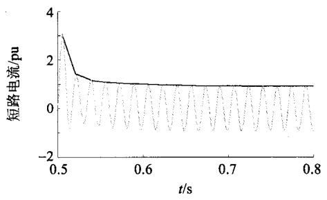  
图1 短路电流包络线轨迹  
Fig. 1 Envelope trajectory of short-circuit current

考虑到电网三相不平衡或发生三相不对称故障时三相短路电流的不同，采用三相短路电流上包络线的均值作为暂态分群指标：

$$
\left\{ \begin{array}{l} L _ {\text {i n}} = \frac {1}{3} \sum_ {k = 1} ^ {t - 1} \left[ P _ {\mathrm {a}, k (k + 1)} + P _ {\mathrm {b}, k (k + 1)} + P _ {\mathrm {c}, k (k + 1)} \right] \\ L _ {\text {s t}} = \frac {1}{3} \sum_ {k = t} ^ {m - 1} \left[ P _ {\mathrm {a}, k (k + 1)} + P _ {\mathrm {b}, k (k + 1)} + P _ {\mathrm {c}, k (k + 1)} \right] \end{array} \right. \tag {21}
$$

式中：下标a、b、c分别表示三相电流；下标in和st分别表示故障过渡和持续阶段； $P_{k(k + 1)}$ 为短路电流波峰 $s_k$ 和 $s_{k + 1}$ 之间的轨迹，其中 $k = 1,2,\dots ,m$ 为采样点编号， $m$ 为波峰个数； $t$ 为轨迹分断点 $s_t$ 编号。

轨迹分断点是暂态电流衰减为零的采样点，故障起始点至轨迹分断点为故障过渡阶段，轨迹分断点之后为故障持续阶段。持续阶段的电流幅值基本相等，因此任意采样点与相邻2个采样点的轨迹段的转角等于零时，该采样点位于持续阶段，即第一个转角为零的采样点之前的点为轨迹分断点。考虑到高频分量影响下，稳态短路电流的波峰可能不等，所以选择转角阈值 $\theta_{\mathrm{min}}$ ，当 $|\theta_k| < \theta_{\mathrm{min}}$ 时，轨迹分断点为

$$
s _ {t} = s _ {k - 1} \tag {22}
$$

式中 $\theta_{k}$ 为第 $s_k$ 个采样点处的转角，可根据该采样点的邻边 $\overline{a}_k$ 、 $\overline{b}_k$ 和对边 $\overline{c}_k$ 进行计算：

$$
\theta_ {k} = \left\{ \begin{array}{l l} \pi - \arccos  \left(\bar {a} _ {k} ^ {2} + \bar {b} _ {k} ^ {2} - \bar {c} _ {k} ^ {2}\right), & \bar {a} _ {k} \bar {b} _ {k} \geq 0 \\ \arccos  \left(\bar {a} _ {k} ^ {2} + \bar {b} _ {k} ^ {2} - \bar {c} _ {k} ^ {2}\right) - \pi , & \bar {a} _ {k} \bar {b} _ {k} <   0 \end{array} \right. \tag {23}
$$

# 3 基于轨迹结构相似度的机群划分

# 3.1 轨迹相似度评价指标

对于不同的短路电流轨迹段，通过定义轨迹段的结构信息，计算轨迹段的结构相似度来确定轨迹段的相似程度，进而完成DFIG的分群。结构相似度的评价指标包括：方向指标InDir、转角指标InAng，速度指标InSpe和位置指标InLoc。

1）方向指标InDir：反应暂态电流幅值变化趋势的差异程度，即反应发电机和控制器参数不同产生的短路电流成分差别。方向指标用2个电流轨迹的第1和第 $t$ 个采样点连接线的夹角 $\varphi_{ij}$ 描述(如图2所示)， $\varphi_{ij}$ 越小，方向指标 $\mathrm{InDir}(L_i,L_j)$ 越小。由于短路电流总是沿时间轴正方向变化，即 $0^{\circ}\leq |\varphi_{ij}|\leq$ $90^{\circ}$ ，所以方向指标可由式(24)计算：

$$
\operatorname {I n D i r} \left(L _ {i}, L _ {j}\right) = \min  \left(\left\| \bar {P} _ {i, 1 t} \right\|, \left\| \bar {P} _ {j, 1 t} \right\|\right) \cdot \sin | \varphi_ {i j} | \tag {24}
$$

式中 $\overline{P}_{i,1t}$ 和 $\overline{P}_{j,1t}$ 分别表示连接 $L_{i}$ 和 $L_{j}$ 的第1和第 $t$ 个采样点的线段，其中 $1\leq i,j\leq m(i\neq j),m$ 为轨迹数。

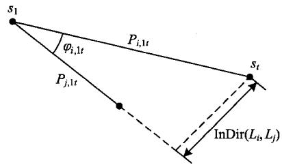  
图2 轨迹方向指标  
Fig. 2 Index of trajectory direction

2)转角指标InAng:反应电流幅值的波动情况。由式(17)-(19)可见，DFIG的工频短路电流为稳态分量，直流和转频电流为指数衰减分量，因此InAng反映了过渡阶段短路电流非工频分量的差异。转角指标由各采样点转角的累加量予以确定，其中内向变化的角为正角，外向变化的角为负角。如图3所

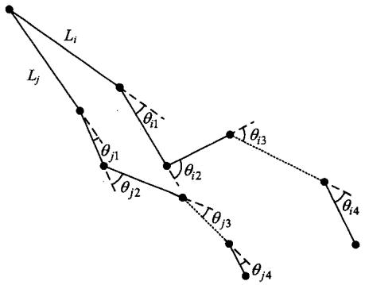  
图3 轨迹转角指标  
Fig. 3 Index of trajectory angle

示， $\theta_{j3}$ 为正角， $\theta_{i3}$ 为负角。所以，轨迹 $L_{i}$ 和 $L_{j}$ 的转角指标可写为

$$
\operatorname {I n A n g} \left(L _ {i}, L _ {j}\right) = \left| \sum_ {k _ {i} = 1} ^ {n _ {i}} \theta_ {i k _ {i}} - \sum_ {k _ {j} = 1} ^ {n _ {j}} \theta_ {j k _ {j}} \right| \tag {25}
$$

式中： $\theta_{ik_i}$ 和 $\theta_{jk_j}$ 分别表示轨迹 $L_{i}$ 和 $L_{j}$ 上第 $s_{ik_i}$ 和 $s_{jk_j}$ 个采样点的转角，可由式(23)计算； $n_i$ 和 $n_j$ 分别为 $L_{i}$ 和 $L_{j}$ 的采样点数量。

3）速度指标InSpe：反应电流轨迹到达分断点的速度。DFIG暂态短路电流包含直流、转速频以及其他非工频分量，而每一种分量的衰减时间不同，由正常运行状态、参数甚至控制器决定，所以通过InSpe表征短路电流衰减速度的不同，可以反映故障过渡阶段DFIG状态的差异。轨迹 $L_{i}$ 和 $L_{j}$ 的速度指标由(25)计算：

$$
\operatorname {I n S p e} \left(L _ {i}, L _ {j}\right) = \left| t _ {i t} - t _ {j t} \right| \tag {26}
$$

式中 $t_{it}$ 和 $t_{jt}$ 分别为轨迹 $L_{i}$ 和 $L_{j}$ 分断点的采样时间。

4)位置指标InLoc：反应轨迹之间的相对距离。本文采用Haudorff距离，通过计算任意2个轨迹点集之间的最大距离来表征轨迹的相似程度。对于轨迹 $L_{i}$ 和 $L_{j}$ ，其位置指标定义为

$$
\operatorname {I n L o c} \left(L _ {i}, L _ {j}\right) = \max  \left(h \left(L _ {i}, L _ {j}\right), h \left(L _ {j}, L _ {i}\right)\right) \tag {27}
$$

其中：

$$
h \left(L _ {i}, L _ {j}\right) = \max  _ {p _ {i} \in L _ {i}} \min  _ {p _ {j} \in L _ {j}} \| p _ {i} - p _ {j} \| \tag {28}
$$

$$
h \left(L _ {j}, L _ {i}\right) = \max  _ {p _ {j} \in L _ {j}} \min  _ {p _ {i} \in L _ {i}} \| p _ {j} - p _ {i} \| \tag {29}
$$

式中： $\|\cdot\|$ 表示轨迹采样点集之间的距离范数；函数 $h(L_i, L_j)$ 和 $h(L_j, L_i)$ 分别称为前向和后向Haudorff距离，若 $h(L_i, L_j) = d_{ij}$ ，则表示 $L_i$ 中所有点到 $L_j$ 任意点的距离不超过 $d_{ij}$ 。

故障过渡阶段的电流轨迹包含方向和幅值的变化，其结构相似度TSIN包含InDir、InAng、InSpe和InLoc这4个指标的比较。在故障持续阶段，电流幅值基本不变，电流轨迹的方向、转角和速度特征保持一致，可仅利用InLoc来比较轨迹的相似程度。若计及短路电流高频分量的影响，也可利用InAng和InLoc共同计算TSIN。考虑到各指标值域的非一致性，采用每个指标的归一化来计算轨迹结构相似度：

$$
\begin{array}{l} \mathrm {T S I N} _ {\text {i n}} \left(L _ {i}, L _ {j}\right) = 1 - \left(\ln \operatorname {D i r} _ {\text {i n}} ^ {\prime} \left(L _ {i}, L _ {j}\right) + \right. \\ \operatorname {I n A n g} _ {\text {i n}} ^ {\prime} \left(L _ {i}, L _ {j}\right) + \operatorname {I n S p e} _ {\text {i n}} ^ {\prime} \left(L _ {i}, L _ {j}\right) + \\ \operatorname {I n L o c} _ {\text {i n}} ^ {\prime} \left(L _ {i}, L _ {j}\right)) \tag {30} \\ \end{array}
$$

$$
\mathrm {T S I N} _ {\mathrm {s t}} \left(L _ {i}, L _ {j}\right) = 1 - \operatorname {I n L o c} _ {\mathrm {s t}} ^ {\prime} \left(L _ {i}, L _ {j}\right) \tag {31}
$$

式中上标“'”表示归一化的指标。

由于电流轨迹具有分段特点，在机群划分时，可以基于轨迹的相似度分别在故障过渡和持续阶段进行分群，也可基于轨迹段结构整体上的相似程度进行全故障过程的机群划分。DFIG短路电流在故障过渡和持续阶段的演变过程具有不同的决定因素，其轨迹段的结构相似度呈现不同特点，因此定义 $W = \{W_{\mathrm{in}},W_{\mathrm{st}}\}$ ，其中 $W_{\mathrm{in}} + W_{\mathrm{st}} = 1$ ，为2个轨迹段结构相似度的权重，所以轨迹结构的整体相似度为 $\mathrm{TSIN}(L_i,L_j) = W_{\mathrm{in}}\mathrm{TSIN}_{\mathrm{in}}(L_i,L_j) + W_{\mathrm{st}}\mathrm{TSIN}_{\mathrm{st}}(L_i,L_j)$ (32)

TSIN反映了短路电流轨迹在结构上的相似程度，因此TSIN越大，即各指标之间的差异越小，电流轨迹越相似。考虑到2个轨迹段相似度的差异性较大，采用变异系数法来确定权重 $W_{\mathrm{in}}$ 和 $W_{\mathrm{st}}$ ，即某个轨迹段结构相似度在不同DFIG之间的差异越大，表明该轨迹段的辨识能力越强，则其权重也应越大。

定义矩阵 $\pmb{Y}$ ，其中 $\mathrm{TSIN}_{\mathrm{in}}$ 和 $\mathrm{TSIN}_{\mathrm{st}}$ 分别为矩阵 $\pmb{Y}$ 的第1和第2列。矩阵 $\pmb{Y}$ 的行数 $p = m(m - 1) / 2$ 。所以，2个轨迹段的权重为

$$
W _ {\beta} = \frac {\sqrt {\frac {1}{p - 1} \sum_ {\alpha = 1} ^ {p} \left(y _ {\alpha \beta} - \frac {1}{p} \sum_ {\alpha = 1} ^ {p} y _ {\alpha \beta}\right)}}{\frac {1}{p} \sum_ {\alpha = 1} ^ {p} y _ {\alpha \beta}} \tag {33}
$$

式中： $\alpha = 1,2,\dots ,p;\beta = 1,2$

# 3.2 暂态同调机群划分流程

根据轨迹结构相似度及权重的计算式，采用层次聚类进行暂态同调机群的划分，具体流程如下。

1）搜索短路电流波形的波峰，提取短路电流的上包络线轨迹，然后计算轨迹采样点 $s_k$ 的转角 $\theta_{k}$ 并根据转角阈值 $\theta_{\mathrm{min}}$ 确定分断点，将电流轨迹划分为故障过渡和持续阶段的2个轨迹段。  
2）对于故障过渡阶段的轨迹段，依次计算轨迹段之间的 $\mathrm{InDir}_{\mathrm{in}}$ 、 $\mathrm{InAng}_{\mathrm{in}}$ 、 $\mathrm{InSpe}_{\mathrm{in}}$ 和 $\mathrm{InLoc}_{\mathrm{in}}$ ；对于故障持续阶段，计算轨迹段间的位置指标 $\mathrm{InLoc}_{\mathrm{st}}$ ，然后形成 $p\times 2$ 维的矩阵 $\mathbf{Y}$ 。  
3）利用矩阵 $\pmb{Y}$ ，由式(30)和式(31)计算故障过渡和持续阶段的轨迹结构相似度，然后计算2个阶段相似度的权重，进而得到轨迹结构整体相似度，形成 $p\times 1$ 维的结构相似度矩阵 $\pmb{T}$ 。

4）采样层次聚类，初始时将样本点 $T$ 归为同一类簇，将轨迹结构整体相似度最小的一对样本点分为2个簇，然后将临近样本点纳入这2个簇，并根据其他样本点的相似度形成新的簇，以此逐渐分解，形成最终分群结果。其中，同调机群数等于簇的数量，由分群阈值确定，分群阈值则根据应用场景、允许误差范围和计算量进行选择。

# 4 算例分析

以如图4所示的包含3条集电线、9台DFIG的风电场为对象，利用Matlab/Simulink搭建风电场详细模型，并根据机群划分流程利用Matlab程序进行仿真验证。系统接线如图4所示。风电场电压为 $10\mathrm{kV}$ ，馈线单位长度电阻为 $0.132\Omega$ ，电抗为 $0.357\Omega$ ，馈线1上DFIG以 $0.5\mathrm{km}$ 等间距分布，馈线2和3上DFIG相距 $0.75\mathrm{km}$ 。DFIG配备Crowbar保护，Crowbar电阻为20倍转子电阻。同一集电线接入的DFIG型号相同，而不同集电线路上的DFIG型号不同，DFIG参数如表1—3所示。不考虑故障期间风速波动的影响，但计及故障瞬间风速分布的不同。WT1、WT4和WT7输入风速均为 $15\mathrm{m / s}$

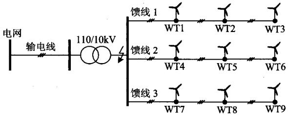  
图4仿真系统  
Fig.4 Simulation system

表 1 馈线 1 接入的 DFIG 参数  
Tab. 1 Parameters of DFIG connected to feeder 1   
表 2 馈线 2 接入的 DFIG 参数  

<table><tr><td>参数</td><td>数值</td><td>参数</td><td>数值</td></tr><tr><td>额度容量/MW</td><td>1.5</td><td>机端电压/V</td><td>575</td></tr><tr><td>定子电阻/pu</td><td>0.023</td><td>转子电阻/pu</td><td>0.016</td></tr><tr><td>定子漏感/pu</td><td>0.18</td><td>转子漏感/pu</td><td>0.16</td></tr><tr><td>激磁电感/pu</td><td>2.9</td><td>惯性常数/s</td><td>0.685</td></tr><tr><td>网侧变流器最大电流/pu</td><td>0.8</td><td>-</td><td>-</td></tr></table>

Tab. 2 Parameters of DFIG connected to feeder 2   

<table><tr><td>参数</td><td>数值</td><td>参数</td><td>数值</td></tr><tr><td>额度容量/MW</td><td>1</td><td>机端电压/V</td><td>575</td></tr><tr><td>定子电阻/pu</td><td>0.053</td><td>转子电阻/pu</td><td>0.036</td></tr><tr><td>定子漏感/pu</td><td>0.11</td><td>转子漏感/pu</td><td>0.15</td></tr><tr><td>激磁电感/pu</td><td>3.5</td><td>惯性常数/s</td><td>0.685</td></tr><tr><td>网侧变流器最大电流/pu</td><td>1</td><td>-</td><td>-</td></tr></table>

表 3 馈线 3 接入的 DFIG 参数  
Tab. 3 Parameters of DFIG connected to feeder 3   

<table><tr><td>参数</td><td>数值</td><td>参数</td><td>数值</td></tr><tr><td>额度容量/MW</td><td>3.5</td><td>机端电压/V</td><td>575</td></tr><tr><td>定子电阻/pu</td><td>0.073</td><td>转子电阻/pu</td><td>0.066</td></tr><tr><td>定子漏感/pu</td><td>0.24</td><td>转子漏感/pu</td><td>0.29</td></tr><tr><td>激磁电感/pu</td><td>4.5</td><td>惯性常数/s</td><td>0.985</td></tr><tr><td>网侧变流器最大电流/pu</td><td>1.2</td><td>-</td><td>-</td></tr></table>

WT2、WT5和WT8风速为 $8\mathrm{m / s}$ ；WT3、WT6和WT9风速为 $12\mathrm{m / s}$ 。考虑无功功率参考值的影响，WT1、WT4和WT7的无功指令值均为零，其余DFIG无功指令值均为0.2pu

风电场低压母线发生三相永久性短路，过渡电阻为 $7\Omega$ ，故障后电压跌落至约 $50\%$ 。WT3、WT6和WT9的Crowbar保护在故障瞬间动作，其余DFIG转子保持与RSC相连。图5为各DFIG的三相短路电流波形。在Crowbar动作和非动作下，DFIG的短路电流变化趋势完全不同，即使在相同

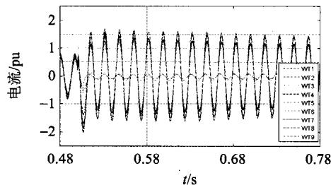  
(a) A相电流

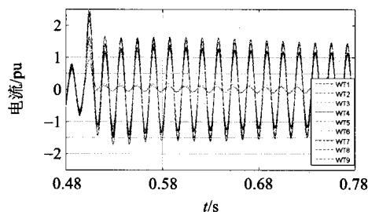  
(b) B相电流

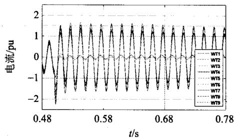  
(c) C相电流   
图5 风电场DFIG短路电流  
Fig. 5 Short-circuit current contributed by DFIG in wind farm

的Crowbar状态下，各DFIG的短路电流幅值也出现很大的不同。与理论分析一致，各DFIG短路电流之间的差异呈现分段特点，在故障过渡阶段，相同Crowbar状态下的DFIG最大幅值差额超过 $100\%$ ，而在故障稳态阶段，各机组幅值之差在 $50\%$ 以内。

如图6所示为各DFIG三相短路电流的上包络线轨迹。利用短路电流的整体轨迹进行分群，由式(33)得故障过渡和持续阶段轨迹结构相似度的权重分别为0.4471和0.2503。由于故障过渡阶段电流轨迹的方向、转角和位置差异更为显著，所以其计算权重也相对较大。分别计算方向、转角、速度和位置指标，得到基于整体电流轨迹的聚类树如图7所示。选择不同的分群阈值，可以得到分群结果如表4所示。

WT3、WT6、WT9的Crowbar保护动作，其运行状态与其余DFIG差异很大，而这些DFIG尽管由于参数和初始状态的差别造成暂态运行状态有所不同，但它们之间的差异度远小于与WT3、

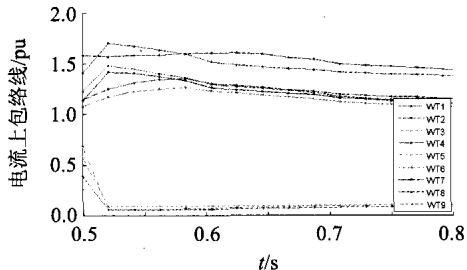  
(a) A 相

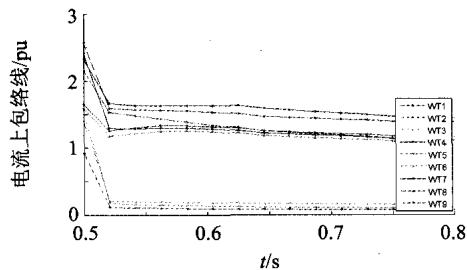  
(b) B相

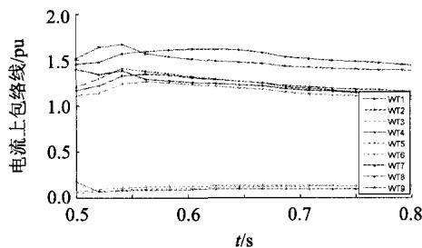  
(c) C相   
图6 短路电流轨迹  
Fig. 6 Trajectory of short-circuit current

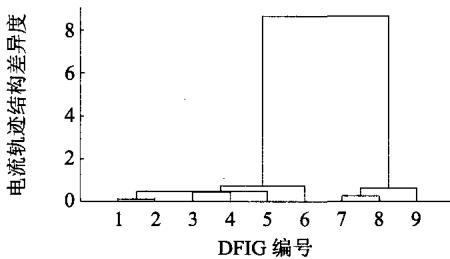  
图7 基于整体电流轨迹的聚类树形图  
Fig. 7 Clustering tree based on entire current trajectory

表 4 不同阈值下的分群结果  
Tab. 4 Clustering results under different threshold   

<table><tr><td>分群阈值</td><td>分群数</td><td>分群结果</td></tr><tr><td>0.8</td><td>2</td><td>{1,2,4,5,7,8}, {3,6,9}</td></tr><tr><td>0.7</td><td>3</td><td>{1,2,5,7,8}, {4}, {3,6,9}</td></tr><tr><td>0.5</td><td>4</td><td>{1,2,5,7,8}, {4}, {3,6}, {9}</td></tr></table>

WT6、WT9之间的差异度。在分群阈值 $\varepsilon = 0.8$ 时，风电场可以划分为2个机群，分别为{1,2,4,5,7,8}和{3,6,9}。此时，短路电流轨迹反映了DFIG运作状态的突变，所以分群结果较好区分了故障运行状态的差异。

选择分群阈值为0.7，WT3、WT6、WT9号仍可划分为1个同调机群。WT4电流轨迹的位置与WT1、WT2、WT5、WT7、WT8相近，但是其方向、转角指标均不同，表明其在故障过渡阶段的状态演变与其他机组相比呈现明显区别，因此在较大阈值下，WT4可单独作为一个机群，WT1、WT2、WT5、WT7、WT8作为另一个机群。若减小分群阈值至0.5，WT9号从WT3、WT6号机组中分离，形成独立机群，风电场分为4个同调机群。由图6(c)可见，WT9的C相暂态短路电流变化趋势和方向与WT3和WT6机组不同，基于分段的电流轨迹结构相似度的分群很好地反映了故障过渡阶段参数和励磁控制造成的机组状态差异。

按照故障过渡和稳态阶段的电流轨迹结构相似度分别进行分群，聚类树型如图8所示。与整体轨迹相比，故障过渡阶段WT2、WT7、WT8与WT1、WT5的相似度更高，其在较小阈值下的分群结果将发生变化。在故障持续阶段，由于只比较轨迹的位置，所以WT1、WT2、WT4、WT5、WT7、WT8的相似度增加。其中，WT1、WT2、WT5、WT7稳态电流基本相同，其相似度也最为接近，而它们与WT4和WT8的相似度与整体电流轨迹的聚类相比更小，这与稳态短路电流波形幅值的关系吻合。由图8可见，故障过渡和持续阶段的分群结果与全

故障过程分群的差别较大。基于电流轨迹段的分群能够在更小时间尺度内提高精度，可以满足故障过渡或持续阶段电磁暂态分析的不同需求。

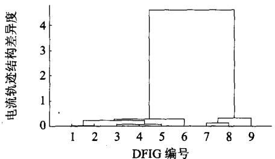  
(a) 过渡阶段

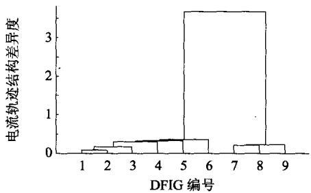  
(b) 稳态阶段  
图8 基于分段电流轨迹的聚类树形图  
Fig. 8 Clustering tree based on segmented current trajectory

# 5 结论

同调机群的划分是建立大容量DFWF等值模型的基础。针对现有风电场同调机群划分尚无法准确考虑机组电磁暂态过程相似性的问题，提出了基于短路电流轨迹结构相似度的DFIG电磁暂态同调机群的划分方法。该方法定义DFIG短路电流轨迹的方向、转角、速度和位置4个状态作为同调机组划分的指标，计及了影响DFIG电磁暂态特性的正常运行工况、控制器响应特性、转子保护动作等因素，分群结果能够较准确地反应风电场中DFIG电磁暂态过程中运行点的变化。此外，所提出方法考虑了DFIG电磁暂态过渡过程和稳定过程的分段特点，特征量的获取较容易，且原理和算法简单，可以满足电力系统电磁暂态分析的需求，适用于双馈风力发电系统保护、暂态控制等的研究和实施。

# 参考文献

[1] Lopez J, Sanchis P, Roboam X. Dynamic behavior of the doubly fed induction generator during three-phase voltage dips[J]. IEEE Transactions on Energy Conversion, 2007, 22(3): 709-717.   
[2] Pena R, Clare J C, Asher G M. Doubly fed induction

generator using back-to-back PWM converters and its application to variable speed wind-energy generation[J]. IEEE Proceedings on Electric Power Applications, 1996, 143(3): 231-241.   
[3] 焦在强. 大规模风电接入的继电保护问题综述[J]. 电网技术, 2012, 36(7): 195-201.  
Jiao Zaiqiang. A survey on relay protection for grid-connection of large-scale wind farm[J]. Power System Technology, 2012, 36(7): 195-201 (in Chinese).   
[4] 欧阳金鑫，熊小伏，张涵轶．电网短路时并网双馈风电机组的特性研究[J]. 中国电机工程学报，2011，31(22)：17-25.  
Ouyang Jinxin, Xiong Xiaofu, Zhang Hanyi. Characteristics of DFIG-based wind generation under grid short circuit[J]. Proceedings of the CSEE, 2011, 31(22): 17-25(in Chinese).   
[5] Morren J, De-Haan S W H. Short-circuit current of wind turbines with doubly fed induction generator[J]. IEEE Transactions on Energy Conversion, 2007, 22(1): 174-180.   
[6] Slootweg J G, Kling W L. The impact of large scale wind power generation on power system oscillations[J]. Electric Power System Research, 2003, 67(1): 9-20.   
[7] 迟永宁，王伟胜，刘燕华．大型风电场对电力系统暂态稳定性的影响[J].电力系统自动化，2006,30(15):10-14. Chi Yongning，Wang Weisheng，Liu Yanhua．Impact of large scale wind farm integration on power system transient stability[J]．Automation of Electric Power System，2006，30(15):10-14(in Chinese).   
[8] Deng Y C, Yu Z, Liu S. A review on scale and siting of wind farms in China[J]. Wind Energy, 2011, 14(3): 463-470.   
[9] 欧阳金鑫，熊小伏. 计及转子励磁控制的双馈感应发电机短路电流研究[J]. 中国电机工程学报，2014，34(34)：6083-6092.  
Ouyang Jinxin, XiongXiaofu. Research on short-circuit current of doubly-fed induction generators under rotor excitation control[J]. Proceedings of the CSEE, 2014, 34(34): 6083-6092(in Chinese).   
[10] Jinxin Ouyang, XiaofuXiong, Xiaoguang Qi. Correlation among the transient characteristics of doubly fed induction generators under grid fault[J]. Journal of Renewable and Sustainable Energy, 2014, 6(1): 1-16.   
[11] 常勇，徐政，郑玉平．大型风电场接入系统方式的仿真比较[J].电力系统自动化，2007，31(14)：70-75.  
Chang Yong, Xu Zheng, Zheng Yuping. A comparison of the integration types of large wind farm[J]. Automation of Electric Power System, 2007, 31(14): 70-75(in Chinese).   
[12] 刘丽霞，罗敏，李晓辉，等．电力系统常用动态等值方法的比较与改进[J].电力系统及其自动化学报，2011，

23(1): 149-154.   
Liu Lixia, Luomin, Li Xiaohui, et al. Comparison and improvement of common methodsof dynamic equivalence in power system[J]. Proceedings of the CSU EPSA, 2011, 23(1): 149-154(in Chinese).   
[13] 孙建锋，焦连伟，吴俊岭，等．风电场发电机动态等值问题的研究[J]. 电网技术，2004，28(7)：58-61.  
Sun Jianfeng, Jiao Lianwei, Wu Junling, et al. Research on multi-machine dynamic aggregation in wind farm[J].   
Power System Technology, 2004, 28(7): 58-61(in Chinese).   
[14] 林俐，赵会龙，陈迎，等．风电场建模研究综述[J].现代电力，2014，31(2)：1-10.  
Lin Li, Zhao Huilong, Chen Ying, et al. Research summary of wind farm modeling[J]. Modern Electric Power, 2014, 31(2): 1-10(in Chinese).   
[15] 陈树勇，王聪，申洪，等．基于聚类算法的风电场动态等值[J]. 中国电机工程学报，2012，32(4)：11-18.  
Chen Shuyong, Wang Cong, Shen Hong, et al. Dynamic equivalence for wind farms based on clustering algorithm[J]. Proceedings of the CSEE, 2012, 32(4): 11-18(in Chinese).   
[16] 张保会，李光辉，王进，等．风电接入对继电保护的影响(二)：双馈式风电场电磁暂态等值建模研究[J].电力自动化设备，2013，33(2)：1-7.  
Zhang Baohui, Li Guanghui, Wang Jin, et al. Impact of wind farm integration on relay protection (2): DFIG-based wind farm electromagnetic transient equivalent model[J].

Electric Power Automation Equipment, 2013, 33(2): 1-7(in Chinese).   
[17] 刘丽．聚类算法的研究与应用[D]. 无锡：江南大学，2013.  
Liu Li. Research on clustering algorithms and its application[D]. Wuxi: Jiangnan University, 2013(in Chinese).   
[18] 欧阳金鑫, 变速恒频风电机组并网故障机理与分析模型研究[D]. 重庆: 重庆大学, 2012.  
Ouyang Jinxin. Studies on fault characteristics and analytical models of integrated variable-speed constant-frequency wind powergenerator[D]. Chongqing: Chongqing University, Chongqing University (in Chinese).

  
欧阳金鑫

收稿日期：2016-10-08。

作者简介：

欧阳金鑫(1984)，男，博士，副教授，硕士生导师，主要研究方向为电力系统保护与控制，jinxinoy@163.com;

刁艳波(1984),女,博士,主要研究方向为大数据分析与应用，dyb0820@163.com;

郑迪(1991)，男，博士研究生，主要研究方向为新能源电力系统暂态分析。

(编辑 李蕊)