# Independent power producer parallel operation modeling in transient network simulations for interconnected distributed generation studies

Fabrício A.M. Moura a, José R. Camacho a,∗,1, Marcelo L.R. Chaves b, Geraldo C. Guimarães b

a Universidade Federal de Uberlândia, School of Electrical Engineering, Rural Electricity and Alternative Sources Lab, PO Box 593, 38400.902 Uberlândia, MG, Brazil   
b Universidade Federal de Uberlândia, School of Electrical Engineering, Power Systems Dynamics Group, PO Box: 593, 38400.902 Uberlândia, MG, Brazil

# a r t i c l e i n f o

Article history:

Received 19 January 2009

Received in revised form 25 August 2009

Accepted 26 August 2009

Available online 8 October 2009

Keywords:

Synchronous generator

Voltage regulator

Speed governor

# a b s t r a c t

The main task in this paper is to present a performance analysis of a distribution network in the presence of an independent power producer (IP) synchronous generator with its speed governor and voltage regulator modeled using TACS – Transient Analysis of Control Systems, for distributed generation studies. Regulators were implemented through their transfer functions in the S domain. However, since ATP-EMTP (Electromagnetic Transient Program) works in the time domain, a discretization is necessary to return the TACS output to time domain. It must be highlighted that this generator is driven by a steam turbine, and the whole system with regulators and the equivalent of the power authority system at the common coupling point (CCP) are modeled in the “ATP-EMTP – Alternative Transients Program”.

© 2009 Elsevier B.V. All rights reserved.

# 1. Introduction

The interest for distributed generation has increased considerably over the years due to the restructuring in the Brazilian energy sector.

With the growing demand for biofuels it has become common the ethanol production in sugar mill production plants, with the electrical energy generation in such plants gaining focus as an important asset in the national energy scene. Such plants are increasing their production and are building larger installations all over the country. Consequently, an increase exists in the number of synchronous generators owned by sugar mill plants. Some of them are connected to the local power authorities’ medium level voltage. This fact, added to the current need to benefit from different forms of primary energy, technological advances and the awareness on environment conservation, is the way to induce and contribute to the dissemination of independent electrical power production.

Therefore, it is an emerging force the need to understand the influence of such aspects in the operation and design of electrical energy distribution networks. Among the analysis to be made, the monitoring of voltage levels at the common coupling point (CCP), before and after the presence of the independent power producer (IP), as well as the analysis of load rejection, the outage of dis-

tribution lines and balanced three-phase short-circuit are made necessary. Moreover, the response of the synchronous machine controls, such as the speed governor and voltage regulator, are the subject of the studies in this paper.

# 2. System modeling

# 2.1. Voltage regulator

The synchronous generator used to represent the independent power producer is the type SM 59 with eight controls in the ATP model databank [1]. The voltage regulator is modeled according to accepted references for speed governors and excitation regulators [2–4].

According to the data input, this model can be reduced to four basic forms. The model used in this work for the voltage regulator can be seen in Fig. 1, which is the type I model, one of the most complete and compact designs recommended by the IEEE [5].

# 2.2. Speed governor

The speed governor was implemented based on one of the simplest IEEE models, and often used in transient stability studies programs.

Fig. 2 presents the generic block diagram for the speed governor associated to the steam turbine $\left( \mathrm { i f } T _ { 4 } = 0 \right)$ or to the hydro turbine (if $T _ { 4 } \neq 0 ) .$ .

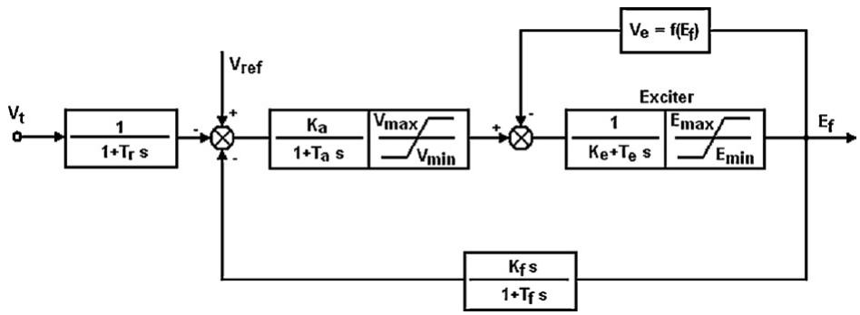  
Fig. 1. Voltage regulator model.

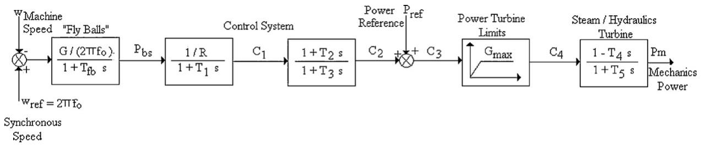  
Fig. 2. Model for the speed governor for a thermal/hydro turbine.

# 2.3. Electrical system

The independent power producer generator becomes part of the electrical system of a power authority distribution network, as illustrated in Fig. 3. Such system is connected to the independent power producer through an interconnecting circuit breaker, following instructions established in [6]. Data depicted in Fig. 3 refer to the system rated values; however, particularly for the independent power producer generator, after performing a load flow for the initial conditions, it can be verified that a 0.8 lagging power factor is not a suitable operating situation (because of fines for low power factor).

The source type representing the power authority was defined as a three-phase ideal source, being considered, therefore, as an infinite busbar. To use such controllable model in ATP, it will be necessary to define the data listed in Table 1.

The rated parameters obtained for the machine voltage and speed governors, as well as data referred to the independent

Table 1 Synchronous machine parameters for the independent generator.   

<table><tr><td colspan="2">Data needed for G2</td></tr><tr><td>Sn=5 MVA</td><td>x0=0.046 pu</td></tr><tr><td>Un=6.6 kV</td><td>T′d0=1.754 s</td></tr><tr><td>RA=0.004 pu</td><td>T′q0=0 s</td></tr><tr><td>XL=0.1 pu</td><td>T″d0=0.019 s</td></tr><tr><td>Xd=1.8 pu</td><td>T″q0=0.164 s</td></tr><tr><td>Xq=1.793 pu</td><td>H=74.8 kg m2</td></tr><tr><td>Xd′=0.166 pu</td><td>P=4 poles</td></tr><tr><td>X′q=0.98 pu</td><td>f=60 Hz</td></tr><tr><td>Xd″=0.119 pu</td><td>ωs=188.5 rad/s</td></tr><tr><td>X″q=0.17 pu</td><td>-</td></tr></table>

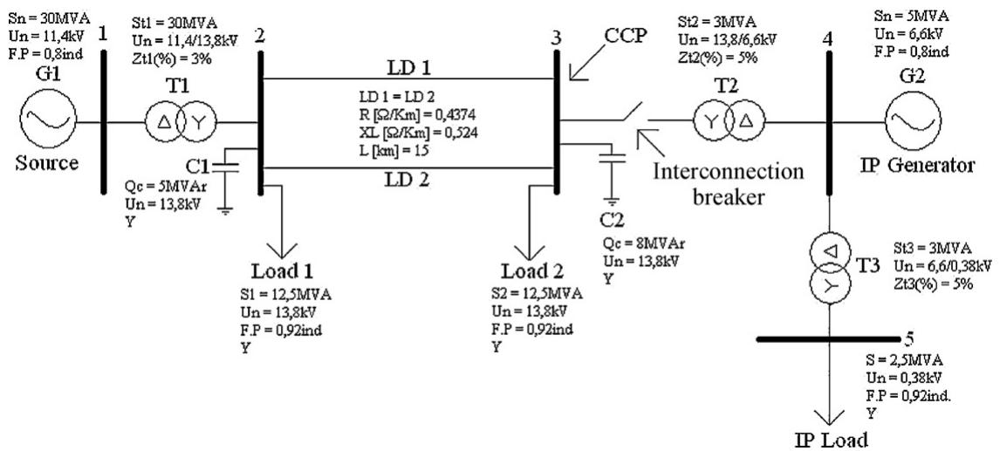  
Fig. 3. Single line diagram for the electrical system in the case considered.

Table 2 Active and reactive power generated by the system power sources.   

<table><tr><td>Source</td><td>PG [MW]</td><td>QG [MVAr]</td></tr><tr><td>G1</td><td>24.384</td><td>5.4</td></tr><tr><td>G2</td><td>3.531</td><td>1.2</td></tr></table>

power producer synchronous generator, were obtained directly from manufacturers.

# 2.4. Power flow

The independent energy generation provides a total power of 1 MVA to the interconnection with the power authority electrical system, through the coupling transformer, T2.

Furthermore, the independent power producer provides energy to its internal demand, rated in 2.5 MVA.

Active and reactive powers produced by the power authority (G1) and the Independent Producer (G2) can be seen in Table 2.

Before the presentation of the studied cases, it is necessary to highlight that the results found here are specific to the considered levels of generation and load. Depending upon the distributed generation “penetration”, the obtained results will be affected differently.

# 3. Case studies

Beforehand it must be emphasized that similar studies, with different software, were made in [7]. Ref. [8] shows the use of ATP for the modeling of a synchronous generator voltage regulator that is driven by a hydraulic turbine.

# 3.1. Load rejection at the independent power producer

Fig. 4 shows the voltage behavior at the connection point (busbar 3) after a load rejection of 2.5 MVA in the independent power producer area.

Voltage at busbar 3, just below 1.05 pu, is rapidly increased to its maximum of 1.08 pu in a fraction of a second after the load rejection. However, in sequence the voltage reaches the steady state in 1.06 pu, this is 14.628 kV between phases. This value is well above the recommendation in the standard mentioned in Ref. [9].

This overvoltage is due to the effect of the reactive power that was needed inside the independent power producer premises, and that, in this condition is transferred to the power authority electrical system. Consequently, one of the quality energy indices becomes jeopardized in respect to the voltage magnitude.

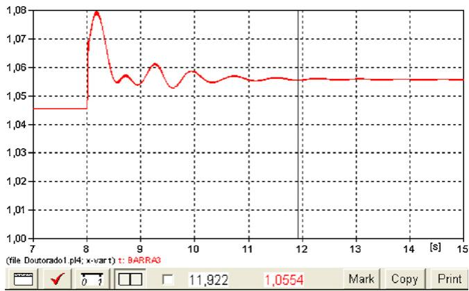  
Fig. 4. Voltage at busbar 3 with the load rejection at the independent power generation.

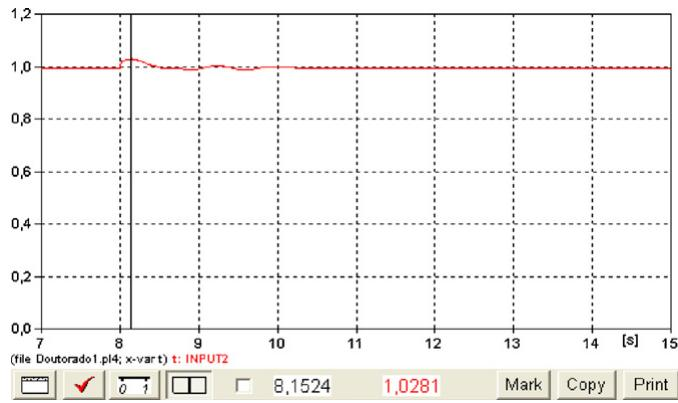  
Fig. 5. Voltage at busbar 4 with the load rejection at the independent power generation.

A very efficient measure in this case to mitigate the effects of such contingency, could be the installation of a saturated core reactor to be positioned at the independent power producer busbar. With such solution, the reactor could absorb the excess of reactive energy, granting, in such a way, a voltage within acceptable limits [9].

Fig. 5 shows the behavior of voltage at busbar 4 (independent power generation busbar). Immediately after the load rejection, the voltage magnitude at this busbar reaches 1.03 pu, 7.128 kV phase–phase. Accordingly, an adequate protection must be designed to disconnect the independent power producer generator, in order that the remaining equipment of the independent power producer may not be affected by such disturbance [10,11].

Ref. [9] establishes the guidelines for the allowed variation of voltage at the independent power producer busbar. In this way, if the voltage at the busbar is not kept inside a 10% range of the rated voltage, the independent power producer should disconnect its generator from the system in 1 s.

It should be emphasized the importance of voltage regulator model for the results obtained facing the applied contingencies. In Refs. [10,11] similar simulations were performed. However, in such references a simpler voltage regulator model was used. It can be observed that the results obtained in [10,11] are more oscillatory. This fact was not present in the simulations made here, due to the fact that a more efficient voltage regulator model was used, showing that in previous studies the results obtained had pessimistic responses. The electrical system here simulated is more stable in the presence of the more detailed voltage regulator.

Fig. 6 depicts the response of the independent power producer machine’s voltage regulator.

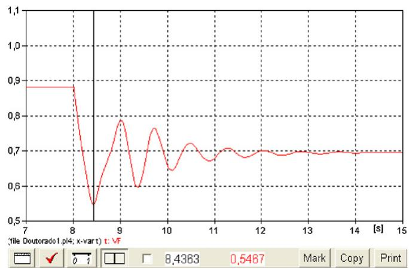  
Fig. 6. Voltage regulator response.

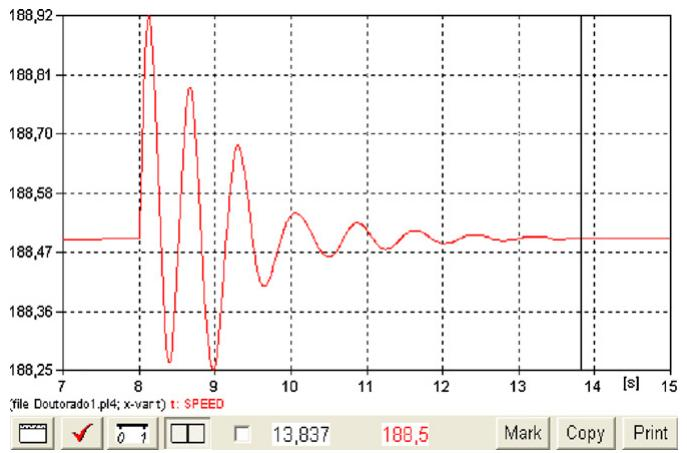  
Fig. 7. Speed response of synchronous machine of the independent producer.

The voltage regulator reduced the machine excitation, trying to mitigate the increase in voltage at the independent power producer busbar (busbar 4). It can be observed that the machine excitation become stable around 70% of its nominal voltage.

Fig. 7 shows the speed response for the independent power producer generator. The machine has the tendency to oscillate strongly immediately after the load rejection, with the maximum speed ω = 188.92 rad/s (f = 60.14 Hz), and the minimum speed ω = 188.25 rad/s (f = 59.92 Hz).

As can be seen in Fig. 7 the frequency does not remain for 0.5 s in 60.14 Hz and do not reach 58 Hz, therefore the frequency protection does not have any involvement in such results [12].

Due to the power system global inertia and the intervention of the speed governor, the speed is stabilized near the synchronous speed. The machine speed oscillations occur around 188.49 rad/s (60 Hz). Consequently, the speed governor will not act significantly, since, due to the regulator dead band, the signal is not enough to excite it in an expressive amount. Due to this fact, it is not necessary to present the response of this regulator.

# 3.2. Three-phase short-circuit at the CCP with a delay in the operation of the interconnecting circuit breaker

In this case it is evaluated the behavior of the system shown in Fig. 3, with a three-phase short-circuit applied at the CCP, however, the focus of this analysis consists to watch how the system will behave if the interconnection breaker does not open at the designated time.

In the LIPA [12] technical reference, it is mentioned that the producer shall be responsible for disconnecting its generating equipment from the power authority system within six cycles of the occurrence of a fault on the power authority side, in other words, the interconnection breaker must be opened in six cycles after the fault [13].

In this case, after the application of the fault in t = 8 s, with the delay, the interconnection breaker is opened in t = 8.2 s. This is time equivalent to 12 cycles.

Fig. 8 shows the behavior of the voltage at busbar 4 of the independent power producer.

It can be observed that, during the fault, strong voltage sag is experienced by the electrical installations of the independent producer. A voltage sag of, approximately, 30% can take to collapse computers and another information processes.

This can be very dangerous and uneconomical for the industry, here called independent producer, due to the fact that some equipment are extremely sensible to voltage variations and consequently all industrial processes can be affected.

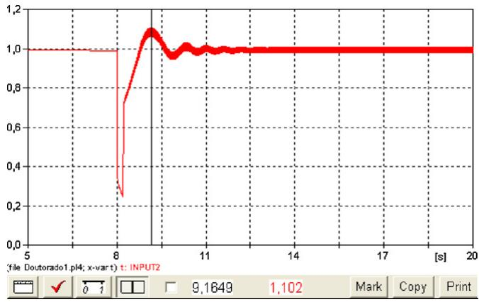  
Fig. 8. Voltage at the independent generation busbar with the opening of interconnecting circuit breaker.

At time t = 8.2 s, the interconnection breaker is opened with the independent power producer synchronous machine excitation system trying to re-establish the voltage at the generation busbar (busbar 4) to the pre-disturbance condition. In such a way, the machine presents an increase in excitation. This fact makes the voltage at the busbar 4, to show a voltage swell, however this transient will be present only during the action of the machine excitation control. The voltage governor reduced the machine excitation in order to assure the voltage level at this busbar to be back to approximately 1.00 pu. It can be observed at the post-disturbance situation a new steady-state excitation is reached, that is approximately 70% of the original excitation.

Fig. 9 shows the response of the independent power producer machine’s voltage regulator.

As pictured in Fig. 9, during the fault the excitation level increases considerably, and after the opening of the interconnection breaker, in order to reduce voltage level at busbar 4, the synchronous machine voltage regulator at the IP reduce its excitation.

The next step is to proceed to the analysis of the speed response of the IP synchronous machine.

In Fig. 10 it can be observed that due to the loss of load, in the system, the IP machine increase its speed. However, after the interconnection is lost, the IP electrical machine finds its stability at ω = 194.31 rad/s, this is equivalent to f = 61.85 Hz, well above the normal operating frequency.

Consequently, the IP synchronous machine will be out of standards suggested frequency bounds with its own electrical system operating at a high frequency what may be harmful to sophisticated industrial processes.

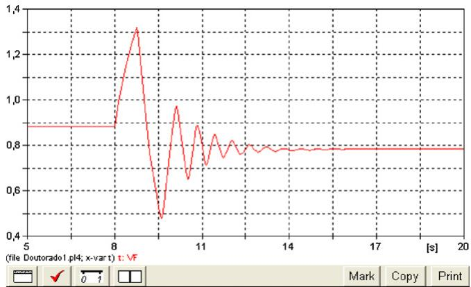  
Fig. 9. Voltage regulator response.

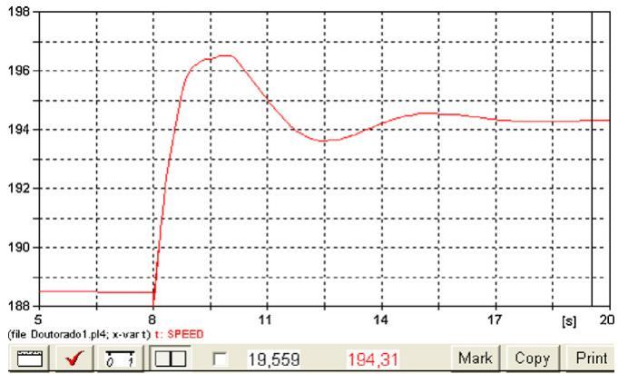  
Fig. 10. Speed response of the independent power producer synchronous machine.

It must be stated that if the IP wants to return to operate in parallel with the power authority system it is necessary to reduce the speed, furthermore, the IP voltage magnitude and phase must be adjusted in order to assure synchronism [12].

According to Fig. 11, the speed governor must retrieve turbine mechanical power to recover the initial conditions at f = 60 Hz. This fact can be observed in Fig. 11, before the application of the contingency, 1.0 pu was the mechanical power necessary to keep the IP delivering approximately 2.5 MVA power to its own installation and selling 1 MVA to the power authority. However, with the opening of the interconnection circuit breaker, at t = 8.2 s, the mechanical power is then reduced to 0.65 pu. The IP synchronous generator and turbine inertial energy is not enough to keep up the speed closer to its nominal value.

# 3.3. Outage of the LD 2 distribution line

Figs. 12 and 13 depict the behavior of the voltage at busbar 3 (CCP) respectively without and with the presence of the independent power producer (IP).

In both figures, with the outage of LD 2, a voltage drop comes into picture; this is related to the increase in the electrical losses caused by the increase in the impedance for the distribution line, when taking off the LD 2.

In Fig. 13 after a small time period, voltage starts to increase again in a transient fashion, and becomes stable around 1.02 pu. This is due to the fact that this busbar is electrically connected to the independent power producer busbar.

Fig. 14 depicts the behavior of the voltage at the independent power producer busbar and Fig. 15 reveals the behavior of the voltage regulator for the machine at the independent power producer. A careful analysis of Figs. 14 and 15 shows that when the busbar 4

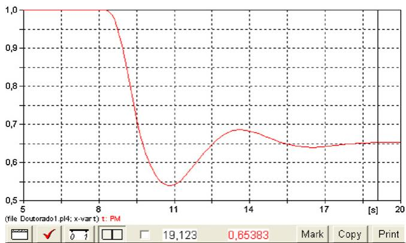  
Fig. 11. Speed governor response.

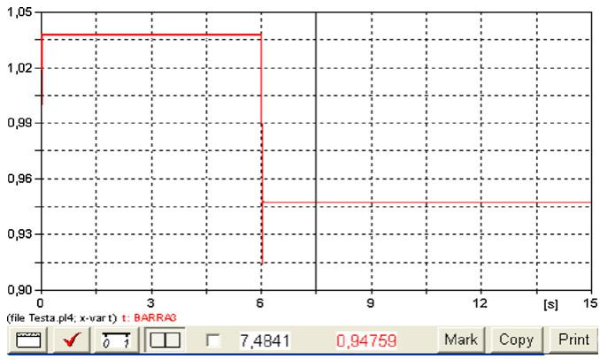

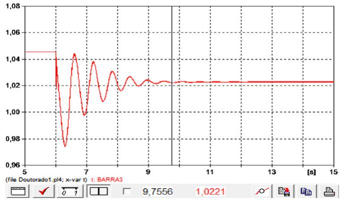  
Fig. 12. Voltage at the PAC with the outage of LD 2 without the presence of the independent power producer.   
Fig. 13. Voltage at the CCP with the outage of LD 2 with the presence of the independent power producer.

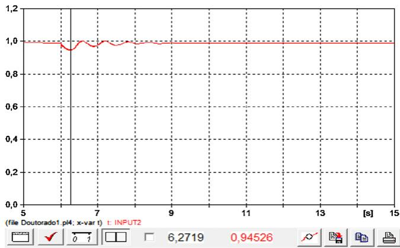

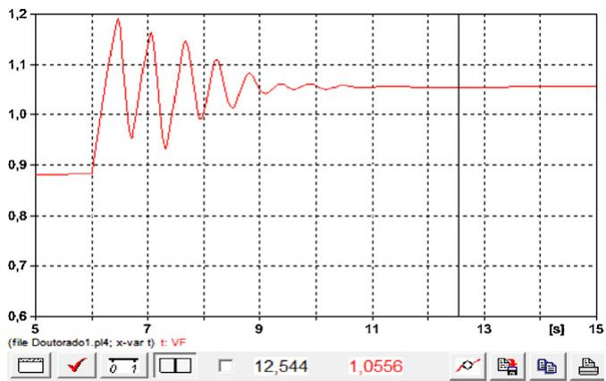  
Fig. 14. Voltage at busbar 4 with the outage of LD 2.   
Fig. 15. Voltage regulator response with the outage of line LD 2.

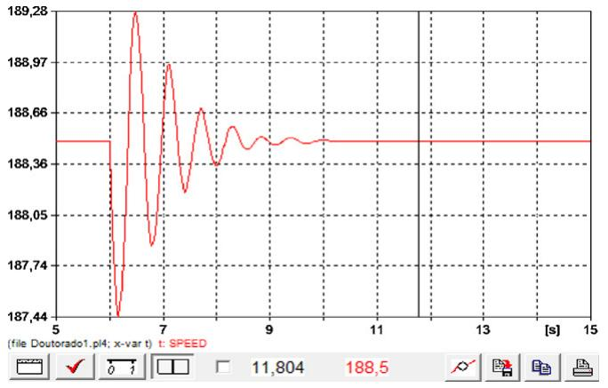  
Fig. 16. Speed response for the independent power producer generator.

shows a voltage dip, the voltage regulator raises the excitation in order to return to the established voltage at the generator busbar to 1.0 pu.

Once the voltage at busbar 4 is back to 1.0 pu, the machine at the IP starts to have a new steady-state excitation level (approximately 1.06 pu), as can be seen in Fig. 15, meaning that the machine is 6% overexcited.

At the instant of the LD 2 outage, the impedance, seen by the power authority, increases. However, the independent power producer is electrically closer to load 2; and then assumes a larger slice of the power to be delivered to those power authority consumers.

Fig. 16 portrays the response of the synchronous machine speed at the independent power producer premises in the case of the outage of LD 2. It should be observed that immediately after the opening of LD 2, the generator speed decreases to reach $\omega = 1 8 7 . 4 4 \Gamma \mathrm { a d } / s ,$ equivalent to a frequency of 59.66 Hz. Therefore, the machine shows a deceleration. However, this under frequency, when compared with the under frequency limit established by standards [12], is not enough to activate the under frequency protection. It must be emphasized that the load rejection viability studies are necessary in cases in which the frequency at the IP system are not able to return to 60 Hz. Therefore, priority of industrial processes must be taken into consideration, as well the modeling of industrial loads [3,4].

# 4. Conclusions

This work shows the main changes in voltage profile, at an electrical power authority system, more specifically in its distribution level network, due to the presence of an independent power producer.

The possibility of a delay in the interconnection breaker can be more harmful to the IP electrical equipment if its electrical system devices experience such voltage sag. This contingency can make computers and controller processes to shutdown. Consequently it is possible with this tool to study the contingency impact concerning the IP installations. The operating frequency of the IP synchronous generator shows important changes that will affect the whole IP network, which will be operating in a non-nominal frequency when isolated from the main grid system. Hence, after removing the fault it will be necessary to reduce its speed, to adjust the voltage magnitude and phase in order to make possible the synchronism with the power authority.

The voltage regulator has a dramatic influence in the system behavior when facing the proposed contingencies. Therefore, an efficient and correct model of its control system is necessary for the efficiency and accuracy of computer simulations.

With the occurrence of under voltage at the CCP (as in the last case of Section 3) the presence of the independent power producer is beneficial to the system, since the excitation regulator acts to improve the voltage at the generation busbar, due to its proximity to the CCP. Therefore, it can be inferred that the quality of the protection and machine controls can be a major influence in the system adequate operation.

# Acknowledgments

We would like to acknowledge the support of CNPq – Brazilian Research Council for Technological and Scientific Development from the Brazilian Science and Technology Ministry for providing to Mr. Moura the monetary means for the continuation of his research on the connection of independent power producers to the electrical grid.

# Appendix A. List of symbols

$V_{t}$ voltage at the independent generator busbar (pu) $V_{ref}$ reference voltage (pu) $K_{a}$ regulator gain $K_{e}$ exciter gain related to self-excited field $K_{f}$ time gain for the regulator stabilizer circuit $T_{a}$ regulator amplifier time constant (s) $T_{e}$ time constant for the regulator exciter circuit (s) $T_{f}$ time constant for the regulator stabilizer circuit (s) $T_{r}$ time constant for the regulator input filter (s) $V_{max}$ maximum limit for the regulator output voltage (pu) $V_{min}$ minimum limit for the regulator output voltage (pu) $E_{f}$ field voltage (pu) $S_{n}$ rated apparent power $U_{n}$ rated voltage $L$ line length (km) $R_{A}$ armature resistance (pu) $x_{L}$ armature reactance (pu) $x_{d}$ direct axis reactance (pu) $x_{q}$ quadrature axis reactance (pu) $x_{d}^{\prime}$ direct axis transient reactance (pu) $x_{q}^{\prime}$ quadrature axis transient reactance (pu) $x_{d}^{\prime \prime}$ direct axis sub-transient reactance (pu) $x_{q}^{\prime \prime}$ quadrature axis sub-transient reactance (pu) $x_{0}$ zero sequence reactance (pu) $T_{d0}^{\prime}$ direct axis transient short-circuit time constant (s) $T_{q0}^{\prime}$ quadrature axis transient short-circuit time constant (s) $T_{d0}^{\prime \prime}$ direct axis sub-transient short-circuit time constant (s) $T_{q0}^{\prime \prime}$ quadrature axis sub-transient short-circuit time constant (s) $H$ inertia moment ( $\mathrm{kg~m}^{2}$ ) $P$ number of poles $f$ frequency (Hz) $\omega_{s}$ synchronous speed ( $\mathrm{rad/s}$ )

# References

[1] ATP-EMTP – Alternative Transients Program, accessed in the internet in 22/11/2007, http://www.emtp.org.   
[2] G.C. Guimarães, Computer methods for transient stability analysis of isolated power generation systems with special reference to prime mover and induction motor modelling, PhD Thesis, University of Aberdeen, 1990.   
[3] P.M. Anderson, A.A. Fouad, Power System Control and Stability, vol. I, John Wiley & Sons, USA, Iowa, 1977.   
[4] P. Kundur, Power Systems Stability and Control, McGraw-Hill, EPRI Power Systems Engineering Series, New York, 1994.   
[5] IEEE Std 421.5-2005, IEEE Recommended Practice for Excitation System Models for Power System Stability Studies, Piscataway, New Jersey, USA.

[6] IEEE Standard for Interconnecting Distributed Resources with Electric Power Systems, IEEE Std. 1547, New York, USA, 2003.   
[7] W. Freitas, A.M. Franc¸ a, J.C.M. Vieira Jr., L.C.P. da Silva, Comparative analysis between synchronous and squirrel cage induction generators for distributed generation applications, IEEE Trans. Power Syst. 21 (February (1)) (2006).   
[8] C. Saldana, G. Calzolari, G. Cerecetto, ATP modeling and field tests of the ac˜ voltage regulator in the Palmar hydroelectric power plant, Electric Power Syst. Res. 76 (2006) 681–687.   
[9] ONS-Operador Nacional do Sistema Elétrico, Sub module 2.2, The Basic Network Performance Standards, Brasília, DF, 2002, accessed at the Internet, 22/11/2007, at http://tinyurl.com/ypdyhc (in Portuguese).   
[10] F.A.M. Moura, J.R. Camacho, J.W. Resende, W.R. Mendes, Synchronous generator, excitation and speed governor modeling in ATP-EMTP for interconnected

DG studies, in: ICEM2008 – XVIII International Conference on Electrical Machines, Vilamoura, Portugal, September, 2008.   
[11] F.A.M. Moura, J.R. Camacho, J.W. Resende, W.R. Mendes, ATP on the impact analysis of an independent power producer in a distribution network, in: ICHQP 2008 – XIII International Conference on Harmonics and Quality of Power, Wollongong, Australia, 2008.   
[12] LIPA-Long Island Power Authority, Control and Protection Requirements for Independent Power Producers, Transmission Interconnections, found at the internet in 22/11/2007, at http://tinyurl.com/33clq4.   
[13] IEEE Std 1547-2003, IEEE Standard for Interconnecting Distributed Resources with Electric Power Systems, Standards Coordinating Committee 21, Piscataway, New Jersey, USA.