# 适用于高频电力电子电路的分数步长电磁暂态仿真方法

吴盼 1 ，徐晋 1*，汪可友 1 ，李子润 2 ，李国杰 1 ，周建其 3 ，王宏韬 3

(1．电力传输与功率变换控制教育部重点实验室(上海交通大学)，上海市 闵行区 200240；2．国家电网公司华北分部，北京市 西城区 100053；3．国网浙江省电力有限公司嘉兴供电公司，浙江省 嘉兴市 314001)

# The Fractional Time-step Electromagnetic Transient Simulation Method Suitable for High-frequency Power Electronic Circuits

WU Pan1 , XU Jin1*, WANG Keyou1 , LI Zirun2 , LI Guojie1 , ZHOU Jianqi3 , WANG Hongtao3

(1. Key Laboratory of Control of Power Transmission and Conversion, Ministry of Education (Shanghai Jiao Tong University),

Minhang District, Shanghai 200240, China; 2. North China Branch of State Grid Corporation of China, Xicheng District,

Beijing 100053, China; 3. State Grid Jiaxing Power Supply Company, Jiaxing 314001, Zhejiang Province, China)

ABSTRACT: In recent years, high-frequency power electronic circuits, represented by power electronic transformer, has attracted wide attention, and the dual active bridge part usually owns the switching frequency as high as tens of kHz. For electromagnetic transient simulation of high-frequency power electronic circuits, while adopting the constant admittance switch model is helpful to simplify the computation, there are still challenges to the simulation precision and efficiency. One is that the switch virtual loss brought by constant admittance switch model under high frequency switching actions seriously influences the simulation precision, while the other is that the required quite small simulation time-step will increase computing burden and affect the simulation efficiency. To cope with this, the paper proposes a fractional time-step simulation method (FTSSM), which adopts the improved highly-paralleled electromagnetic transient program (EMTP) algorithm for discretization modeling, and the simulation calculation is implemented as the iteration of a series of small step synthesis calculation process with different fractional time-steps. Here, the small step synthesis (SSS) with the idea of “modeling with small time-step while calculating with big time-step” can reduce the virtual loss, and the fractional time-steps are designed to exactly locate the switching actions so as to support the accurate simulation with larger time-step. Simulation results analysis shows that the proposed method can

effectively improve the simulation precision of high-frequency power electronic circuits and support the larger time-step simulation with enough accuracy, which is helpful to accelerate the offline simulation and improve the real-time simulation performance.

KEY WORDS: high-frequency power electronic circuits; electromagnetic transient simulation; constant admittance switch model; small-step synthesis; fractional time-step simulation method

摘要：近年来，以电力电子变压器为典型代表的高频电力电子电路受到广泛关注，其中双有源桥结构的开关频率往往达数十 kHz。针对高频电力电子电路的电磁暂态仿真，采用恒导纳开关模型有助于降低计算量，但仍面临仿真精度和效率上的双重挑战：一是恒导纳开关模型在高频开关动作下的虚拟损耗严重影响仿真精度；二是仿真所要求纳秒级仿真步长将加重计算负担而影响仿真效率。为此，该文提出分数步长电磁暂态仿真方法，基于改进的高并行电磁暂态仿真程序算法进行离散化建模，并将仿真计算分解为一系列不同分数步长下的小步合成计算过程的叠加，其中小步合成采用“小步建模，大步计算”思想可降低虚拟损耗，而分数步长则用于准确定位开关动作时刻，以支持较大步长下精确仿真。算例分析表明，所提方法可有效提升高频电力电子电路的仿真精度，且能在保证准确性的同时支持其大步长仿真，从而实现离线仿真加速，还有助于提升实时仿真性能。

关键词：高频电力电子电路；电磁暂态仿真；恒导纳开关模型；小步合成；分数步仿真方法

# 0 引言

“双碳”目标下，随着以新能源为主体的新型

电力系统的建设推进，现代电力系统中已包含微电网[1]、可再生能源发电[2]、电动汽车[3]等的大量接入，“双高”特征日益显著，对电网的灵活可控性、安全稳定性等方面提出了更高要求。在此背景下，适用于新型电力系统的电磁暂态仿真技术的重要性愈发凸显，其可在保证安全性的前提下大大降低电力系统试验难度与成本，可广泛应用于电力系统运行模拟、能量管理等控制系统的调试与测试，相应的实时仿真技术在电力电子设备的研发测试、硬件在环控制验证等方面也得到应用[4]。

近年来，高频电力电子设备已在现代电力系统的电能变换及传输等方面得以应用，相应的电磁暂态仿真研究亟待开展。恒导纳开关模型[5]常用于电力电子设备电磁暂态仿真，其用等效导纳相同的L/C 元件来表示开关闭合/断开状态，从而避免了系统导纳矩阵的频繁更新，有助于降低仿真计算量。然而当应用于高频电力电子电路电磁暂态仿真时，仍面临着 2 个技术瓶颈：一是开关动作后的开关电压/电流的暂态过程与理想开关有很大不同，会带来额外的虚拟功率损耗，且随开关频率升高而大幅增加，严重影响仿真准确性[6]；二是高频开关动作下，恒导纳模型一般需要采用纳秒级步长来保证仿真精度，这一方面增加了总的计算量，使离线仿真耗时增加，另一方面也会增加单位现实时间的计算量，从而使得实时仿真的实时性更难满足。作为高频电力电子电路的典型代表，电力电子变压器凭借体积小、质量轻、可提供中低压可控交直流端口等优点[7-8]受到广泛关注，是交直流混合配电架构的关键装置，可极大提升电力系统电能传输及控制灵活性。电力电子变压器通常采用包含前级整流模块、中间级 DC-DC 隔离变换模块以及后级逆变模块的多级隔离型结构[9]，以实现能量传输灵活控制，并降低控制耦合复杂度。而为了保证功率密度，中间级如采用双有源桥(dual active bridge，DAB)结构，其开关频率往往高达几十 kHz[10-11]，高频下开关虚拟损耗影响仿真精度、小步长限制影响仿真效率这两个瓶颈问题尤为显著，给针对电力电子变压器的电磁暂态仿真提出了巨大挑战。

面对上述瓶颈问题，在仿真精度方面，目前已有研究成果可用于改善开关虚拟损耗，包括设置最优 L/C 模型参数[12]、使用响应匹配恒导纳模型[13]以保证开关模型的最优阻尼特性，或是应用初始化

技术[14]优化开关动作后的初始状态等，均有助于降低开关虚拟损耗，提升高频系统仿真精度，但仍没有解决小步长限制的问题。仿真效率方面，相关大步长及变步长仿真研究也有开展。其中文献[15]建立了考虑高频开关分量的动态相量模型；文献[16]提出基于时频变换的多尺度建模，可根据仿真场景切换频移模型并修改仿真步长，两者均能支撑较大步长仿真，但难以精确反映开关级动态。为此立足于开关，文献[17]提出基于线性插值的考虑多重开关动作的变步长仿真算法，可提高较大步长仿真的精度和数值稳定性，但因存在插值回退过程不适用于实时仿真。而同样针对开关动作的离散状态事件驱动仿真方法[18-19]，其提出基于状态离散的多时间尺度混杂模型，配合开关事件驱动进行开关模型和仿真步长的自适应选择，从而能显著提升仿真效率，已应用于国内 DSIM 仿真软件。

此外，相关研究也在电力电子变压器中高频变换器的建模仿真方面做了大量工作[20-22]，其中文献[20]建立了双有源桥的半隐式延迟解耦模型以及级联系统等值解耦电路，可实现系统快速仿真；文献[21-22]分别针对不同的级联型电力电子变压器结构，采用广义戴维南/诺顿等效端口子模块模型对系统进行降维等效，实现仿真加速同时保证仿真精度。上述方法均能有效提升仿真效率，但本质上却是对电力电子变压器做了等效简化而回避了高频开关动态，难以用于开关层面的动态特性仿真研究。综上，针对高频电力电子电路的电磁暂态仿真，目前仍缺少较为成熟的仿真方法能同时解决上述仿真精度和效率的瓶颈问题。

为此，本文以电力电子变压器系统为例，在采用恒导纳开关模型情况下，提出了适用于高频电力电子电路的分数步长电磁暂态仿真方法，能兼顾仿真精度与仿真效率进行高效电磁暂态仿真。具体地，以紧凑型电磁暂态仿真算法框架(compactelectromagnetic transient program，C-EMTP)为基础，利 用 不 同 分 数 步 长 下 的 小 步 合 成 (small-stepsynthesis，SSS)计算来完成仿真迭代，从而在降低虚拟损耗、保证仿真精度的前提下，能支持大步长的仿真，进而提升仿真效率，同时有助于改善实时仿真性能。

# 1 典型高频电力电子电路

本文考虑如图 1 所示的高频电力电子电路。

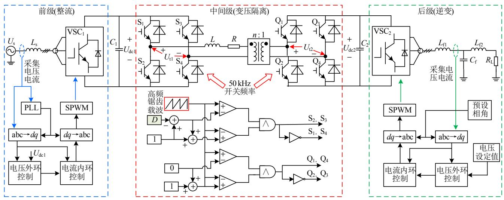  
图1 高频电力电子电路(以电力电子变压器系统为例)  
Fig. 1 High-frequency power electronic circuit (taking power electronic transformer system as an example)

# 1.1 拓扑结构

图 1 系统包含前级、中间级、后级三部分，分别实现整流、变压隔离及逆变功能，如表 1 所示。

表 1 系统各部分说明  
Table 1 Description of each part in the system   

<table><tr><td>环节</td><td>功能描述</td><td>开关频率/kHz</td><td>控制模式</td></tr><tr><td>前级</td><td>整流:依托交流电网维持输入侧直流母线电压</td><td>5</td><td>UdcQ控制</td></tr><tr><td>中间级</td><td>变压隔离:进行两侧直流母线电压变换,同时具备隔离功能</td><td>50</td><td>单移相控制</td></tr><tr><td>后级</td><td>逆变:依托输出侧直流母线为交流负载供电</td><td>5</td><td>VF控制</td></tr></table>

图 1 中： $U _ { \mathrm { s } }$ 为交流电网电压； $U _ { \mathrm { d c l } }$ 、 $U _ { \mathrm { d c } 2 }$ 分别为中间级 DAB 模块两侧直流母线电压； $U _ { \mathrm { t l } }$ 、 $U _ { \uparrow 2 }$ 分别为中间级内高频变压器两端开关电压；R、 $R _ { \mathrm { L } }$ 分别为中间级内电阻、后级负载电阻； $L _ { \mathrm { s } } ,$ 、L、 $L _ { \mathrm { f l } }$ 、$L _ { \mathrm { f } 2 }$ 分别为前级网侧电感、中间级内电感及后级滤波电感； $C _ { 1 }$ 、 $C _ { 2 }$ 、 $C _ { \mathrm { f } }$ 分别为中间级两侧直流母线稳压电容、后级滤波电容； $\mathrm { V S C } _ { 1 }$ 、 $\mathrm { V S C } _ { 2 }$ 均为三相全控变流桥；n 为中间级高频变压器变比。

# 1.2 控制原理

图 1 系统中前级整流、后级逆变分别采用典型$\mathrm { U } _ { \mathrm { d c } } \mathrm { Q }$ 控制、VF 控制，以维持直流母线电压 $U _ { \mathrm { d c l } }$ 恒定及负载电压恒定。

中间级 DAB 模块采用典型单移相(single phaseshift，SPS)控制方式[23]。具体调制方式如图 1 所示，其中两侧 H桥电路同一桥臂的开关脉冲信号互补，不同桥臂对角位置的开关脉冲信号相同，所用调制载波信号为对应开关频率的锯齿波，输入 D为两侧H桥的移相比，经控制环节得到，采用定输出侧直

流母线电压的控制方式，如图 2 所示。

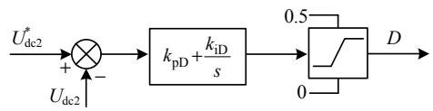  
图2 DAB 模块控制框图  
Fig. 2 Control block diagram of DAB block

图 2 中，以输出侧直流母线电压 $U _ { \mathrm { d c } 2 }$ 为控制目标，与参考值比较，经 PI 环节 $( k _ { \mathrm { p D } }$ ， $k _ { \mathrm { i D } }$ 为增益、积分系数)后得到移相比 D，并限幅处理。

# 2 分数步方法基本思想

如前所述，恒导纳开关模型分别用很小的 L/C元件来表示开关闭合/断开状态，主要是保证两者离散化后的支路导纳一致，从而避免修改系统导纳矩阵。然而不同于理想开关，这里电感、电容本身都是储能元件，当发生开关状态切换时，L/C 元件的互换会损失各自原本积累的那部分能量，也即开关虚拟损耗，可近似计算为

$$
E _ {\text {l o s s}} \approx \frac {1}{2} L _ {\mathrm {s w}} I ^ {2} + \frac {1}{2} C _ {\mathrm {s w}} U ^ {2} = \frac {1}{2} \frac {\Delta t}{Y _ {\mathrm {s w}}} I ^ {2} + \frac {1}{2} \Delta t Y _ {\mathrm {s w}} U ^ {2} \tag {1}
$$

式中： $L _ { \mathrm { s w } }$ 、 $C _ { \mathrm { s w } } .$ 、 $Y _ { \mathrm { s w } }$ 分别为等效的小电感、小电容及恒支路导纳；I、U 为相应开关支路电流、电压。

可见，开关虚拟损耗随仿真步长增大而越显著。另一方面，随开关频率提升，开关动作次数增加，开关虚拟损耗也会愈加累计[6]。因此，针对高频电力电子电路的电磁暂态仿真，为尽量降低开关虚拟损耗，保证数十 kHz开关频率下的仿真结果精度，往往要求仿真步长小至 ns 级。

如图 3 所示，采用 ns 级步长进行仿真，可以保

证高仿真精度，但计算负担大；而采用 $\mu \mathrm { s }$ 级步长进行仿真，虽然计算负担小，但仿真精度难以保证，一方面是大步长下开关的虚拟损耗增加，另一方面则是大步长下仿真数据点密度不够，从而难以精确定位开关动作。为此，可提出分数步长仿真方法(fractional time-step simulation method，FTSSM)，其具备步长自适应特点，可在没有开关动作时，以 μs级单位步长仿真，提升整体效率；而发生开关动作时，则通过若干个分数步长组合，使得开关动作时刻尽可能落在离散的仿真时刻上，此时开关动作附近为 ns 级小步长仿真，从而保证精度。

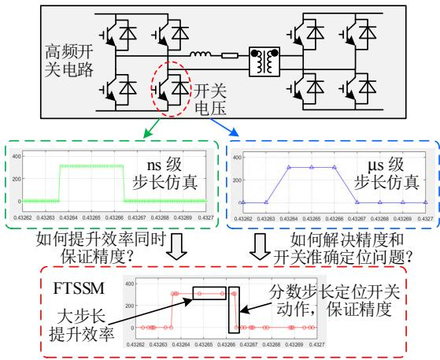  
图3 不同步长仿真效果  
Fig. 3 Simulation results under different time-steps

所述分数步长是相对于单位步长(也即一般概念的仿真步长)而言的一系列步长，结合“找零钱”思想(用 1/2/5 元可以凑出任意整数金额)和二分法思路(保证每一级最多只出现 1 次)，设置为单位步长的 2 的顺序次负幂，从而通过组合可以表示精度范围内任意时间段，以方便定位开关动作。具体定义如表 2 所示，还定义了量化步长作为最小计量单位，并用于电路离散化建模。额外定义了 2 个粒

表 2 关键参数定义  
Table 2 Definition of vital parameters   

<table><tr><td>参数</td><td>定义</td></tr><tr><td>量化步长 Δtq</td><td>用于仿真电路的离散化,一般为ns级,以降低开关虚拟损耗</td></tr><tr><td>单位步长 Δtu</td><td>基于一定量化步长 Δtq合成得到,一般为μs级</td></tr><tr><td>分数步长</td><td>分别是单位步长的1/2、1/4、1/8、…,</td></tr><tr><td>Δt1/2、Δt1/4、Δt1/8、…</td><td>用于组合确定准确的开关动作时刻</td></tr><tr><td>量化步长粒度化</td><td>用2的Nq次幂表示单位步长Δtu中所含</td></tr><tr><td>阶数Nq</td><td>量化步长 Δtq的数量</td></tr><tr><td>分数步长粒度化</td><td>用2的Nf次幂表示单位步长Δtu中所含</td></tr><tr><td>阶数Nf</td><td>最小分数步长的数量,一般Nq≥Nf</td></tr></table>

度化阶数参数 $N _ { \mathfrak { q } } , N _ { \mathrm { f } }$ 来分别衡量量化步长的精细程度、分数步长的分辨率精度。

下面结合图 4 作进一步说明。图中以单位步长为基准，取 $N _ { \mathrm { q } } = 7$ ，此时量化步长足够小，可以保证单步仿真计算的准确性，但同时也会带来巨大计算量。取 $N _ { \mathrm { f } } { = } 3$ ，此时包括单位步长共有 4 级分数步长，那么结合小步合成，可以将原极小步长下单步计算合成为各级分数步长下单步计算，并且仍保证精度。那么，对于开关动作分隔开的任意仿真时间段，可以用上述 4 级分数步长的组合来表示，相应的仿真过程也将是各级分数步长下单步计算的组合。图中具体构造原理，将在下一节说明。

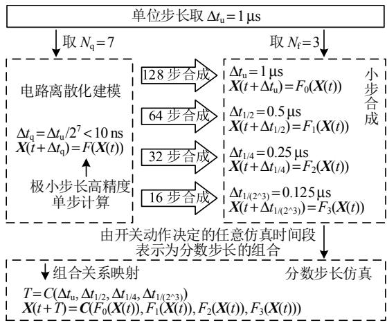  
图4 分数步长构造过程  
Fig. 4 Construction process of fractional time-steps

# 3 分数步方法构造原理

图 4 中还有几个要点需要明确：一是电路离散化建模的方式，即 F 的构造；二是小步合成的实现，即如何由 F构造 $F _ { 0 } { \mathrm { - } } F _ { 3 } ;$ ；三是仿真时间段如何表示为各级分数步长的组合映射，即 C的构造。本节将逐一说明。

# 3.1 离散电路状态空间建模

针对采用恒导纳开关模型的仿真系统，团队前期在传统 EMTP框架基础上进行改进，提出了一种紧凑型算法框架[24](C-EMTP)，其以离散电路状态空间表达式对整个系统电路进行离散化建模如下：

$$
\left\{ \begin{array}{l} \boldsymbol {X} ^ {(k + 1)} = \boldsymbol {A} \boldsymbol {X} ^ {(k)} + \boldsymbol {B} \boldsymbol {U} ^ {(k)} \\ \boldsymbol {Y} ^ {(k + 1)} = \boldsymbol {C} \boldsymbol {X} ^ {(k + 1)} + \boldsymbol {D} \boldsymbol {U} ^ {(k)} \end{array} \right. \tag {2}
$$

式中：X 为历史电流(压)源向量；U 为独立电源向量(直流量或工频信号源)；Y 为观测量组成的向量；上标(k+1)、(k)分别表示第 k+1、k 个仿真步的结果；A、B、C、D为与开关状态相关的系数矩阵，可在

初始化阶段进行预计算与预存储。

由式(2)，系统电路的求解计算可分解为状态量更新、观测量计算两部分并行进行，且均为矩阵运算，算法并行度高，有助于提升仿真效率。因此，所述分数步仿真方法将以此为基础进一步展开。

# 3.2 基于小步合成的大步长求解模型构建

如前所述，小步长建模的准确性与小步长仿真的仿真效率难以兼顾。那么，借鉴运载火箭姿态运动仿真[25-26]方面的研究成果，可应用小步合成仿真方法，即在采用小步长进行系统建模的基础上，将多步底层计算合并成单个大步长计算。

考虑将 m步式(2)中计算过程进行合并，可得：

$$
\left\{ \begin{array}{l} \boldsymbol {X} ^ {(k + m)} = \boldsymbol {A} ^ {m} \boldsymbol {X} ^ {(k)} + \boldsymbol {A} ^ {m - 1} \boldsymbol {B} \boldsymbol {U} ^ {(k)} + \\ \boldsymbol {A} ^ {m - 2} \boldsymbol {B} \boldsymbol {U} ^ {(k + 1)} + \dots + \boldsymbol {B} \boldsymbol {U} ^ {(k + m - 1)} \\ \boldsymbol {Y} ^ {(k + m)} = \boldsymbol {C} \boldsymbol {X} ^ {(k + m)} + \boldsymbol {D} \boldsymbol {U} ^ {(k + m - 1)} \end{array} \right. \tag {3}
$$

式中 m即为小步合成的步数。

考虑到小步合成的时间跨度一般仅持续数微秒，这里可近似假设独立电源向量 U 在第 k 到$k + m - 1$ 仿真步间为恒定常量，已证明所引入的误差是可以接受的[27]。此时上式变为

$$
\left\{ \begin{array}{l} \boldsymbol {X} ^ {(k + m)} = \boldsymbol {A} _ {m} \boldsymbol {X} ^ {(k)} + \boldsymbol {B} _ {m} \boldsymbol {U} ^ {(k)} \\ \boldsymbol {Y} ^ {(k + m)} = \boldsymbol {C} \boldsymbol {X} ^ {(k + m)} + \boldsymbol {D} \boldsymbol {U} ^ {(k)} \end{array} \right. \tag {4}
$$

式中 $A _ { m } .$ 、 $\pmb { B _ { m } }$ 为由 A、B 计算得到的参数矩阵，可计算如下：

$$
\left\{ \begin{array}{l} \boldsymbol {A} _ {m} = \boldsymbol {A} ^ {m} \\ \boldsymbol {B} _ {m} = \boldsymbol {A} ^ {m - 1} \boldsymbol {B} + \boldsymbol {A} ^ {m - 2} \boldsymbol {B} + \dots + \boldsymbol {B} \end{array} \right. \tag {5}
$$

上述 $A _ { m }$ 、 $\pmb { B _ { m } }$ 与开关状态、采用的合成步长均相关，在分数步长序列已配置(由分数步长阶数 $N _ { \mathrm { f } }$ 决定)的情况下，可在初始化阶段进行预计算和预存储，后续在仿真主循环中即可直接调用参与计算。应用小步合成方法，可以有效缓解恒导纳开关模型的虚拟损耗问题[27]，保证仿真精度，同时按合成的大步长仿真，也能提高仿真效率。

# 3.3 任意时间段和分数步长组合间映射关系建立

系统仿真是以单位步长 $\Delta t _ { \mathrm { u } }$ 进行，但单个 $\Delta t _ { \mathrm { u } }$ 内的更新过程却是由若干次开关动作分隔为多个区间分别进行，如图 5所示。假设第 1 个单位步长$\Delta t _ { \mathrm { u } }$ 由 2 次开关动作分隔为 3 个区间，每段区间(相对于单位步长 $\Delta t _ { \mathrm { u } } )$ 的时间长度可用二进制向量 $f$ 来表示。f 包含 1 个整数位和 $N _ { \mathrm { f } }$ 个小数位，数值上分别代表各级分数步长 $/ \Delta t _ { \mathrm { u } }$ ，可将各段区间的时间长

度以逐次逼近的思路拆解为这些数值的组合，进而确定二进制向量 $f$ 的各位取值。如图中第 1 段区间长 度 为 $0 . 6 \Delta t _ { \mathrm { u } }$ ， 若 取 $N _ { \mathrm { f } } { = } 4$ 位 小 数 ， 则 有$0 . 6 \approx { 0 \times 2 ^ { 0 } + 1 \times 2 ^ { - 1 } + 0 \times 2 ^ { - 2 } + 0 \times 2 ^ { - 3 } + 1 \times 2 ^ { - 4 } }$ ，对应的向量 $f$ 即为 $^ { 6 6 } 0 1 0 0 1 \prime \mathrm { ~ } _ { \mathrm { ~ c ~ } }$ 。假设图中第 2 个 $\Delta t _ { \mathrm { u } }$ 内无开关动作，区间长度为 $\Delta t _ { \mathrm { u } }$ ，对应的向量 f仅整数位为1。这样即建立仿真区间长度和分数步长组合间的映射关系，后续可按此进行各级小步合成计算迭代。

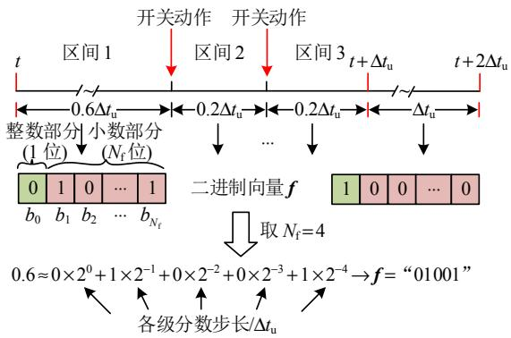  
图 5 区间段时间和分数步长组合间映射  
Fig. 5 Mapping between interval time and fractional steps

# 3.4 网络解耦分区处理

除上述 3 个要点之外，结合图 1 系统的特点，还需要考虑解耦分区。由前所述，所提分数步仿真方法本质上是一种预处理方法，需要预计算、预存储相应参数矩阵，而这些矩阵的大小、数量和系统规模、开关数量紧密相关，那么针对图 1 中多级复杂系统，利用网络解耦将其拆分为多部分并行处理，将有助于降低预处理工作量，并提升仿真过程中计算效率。分析图 1中电力电子变压器系统，其由 3 个部分组成，通过直流母线稳压电容 $C _ { 1 } , \ C _ { 2 }$ 进行联通。相比电力电子开关，稳压电容的动态相对慢得多，因而可从稳压电容处进行网络解耦。

考虑到电容电压不会突变且变化动态较慢，可将电容连接的 2 个子系统解耦开，接口处用两个受控电压源来等效。受控电压源的电压输入可基于电容的微分特性方程采用欧拉法进行离散化后推导得到，如式(6)所示。

$$
C \dot {u} _ {\mathrm {C}} = i _ {1} + i _ {2} \Rightarrow u (t) = u (t - \Delta t) + \frac {\Delta t}{C} \sum_ {k = 1} ^ {2} i _ {k} (t - \Delta t) \tag {6}
$$

式中：C 为接口电容； $i _ { 1 } .$ 、 $i _ { 2 }$ 为两侧子系统流向接口电容的注入电流； $u _ { \mathrm { C } } .$ 、u 分别为电容电压、解耦后两侧受控电压源电压。

由式(6)，根据上一仿真步子系统注入电流更新接口电容电压，并作为接口两侧受控电压源的电压

输入返回，再分别参与两侧子系统当前步内部更新计算，即实现子系统间的解耦并行，如图 6 所示。

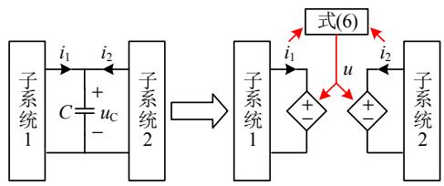  
图6 基于电容的网络解耦示意图  
Fig. 6 Diagram of capacitor-based circuit decoupling

# 4 分数步方法整体流程

所提分数步仿真方法算法框架如下图 7 所示，包含初始化、主循环 2个阶段。

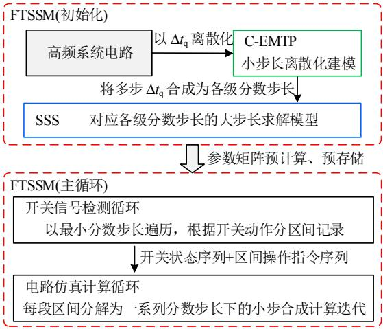  
图7 分数步仿真方法算法框架  
Fig. 7 Algorithm framework of proposed FTSSM

由图，对于高频系统电路，可基于量化步长 $\Delta t _ { \mathrm { q } }$ 按紧凑型 EMTP 算法(C-EMTP)为框架进行离散化建模，因为 $\Delta t _ { \mathrm { q } }$ 足够小，可以有效保证仿真的准确性。在此基础上，应用小步合成算法(SSS)来合成更大仿真步长(各级分数步长)下的仿真，以提升计算效率。初始化阶段将建立对应各级分数步长的大步长求解模型，从而支撑相关参数矩阵预计算、预存储。仿真主循环过程主要包括两步：一是基于开关动作定位的预处理过程，确定开关状态序列和由分数步长表示的区间操作指令序列；二是根据区间操作指令序列，完成包含一系列小步合成迭代计算的迭代更新过程。

# 4.1 算法初始化

对于图 1 中电力电子变压器系统，先结合 3.4节方法进行系统网络解耦，分为 3个子系统进行并行处理。各子系统给定同样的量化步长粒度化阶数$N _ { \mathfrak { q } }$ 及分数步长粒度化阶数 $N _ { \mathrm { f } } ,$ ，当仿真步长 $\Delta t _ { \mathrm { u } }$ 固定

时，前者决定量化步长 $\Delta t _ { \mathrm { q } }$ 的大小，而后者决定采用多少级分数步长与最小分数步长的大小。对于每个子系统，当 $N _ { \mathfrak { q } }$ 确定后，先按 $\Delta t _ { \mathrm { q } }$ 进行电路离散化，接着可按式(2)对应不同的开关状态组合计算相应的参数矩阵 A、B、C、D；再对应 $N _ { \mathrm { f } }$ 级的分数步长，分别计算相应的合成步数 $m$ ，并按式(5)计算对应的参数矩阵 Af、 $\mathbf { \delta } _ { B _ { \mathrm { f } } } ,$ ，预存储后以备主循环调用。

# 4.2 仿真主循环

初始化阶段预计算的参数矩阵均和开关状态有关，因而主循环中需要根据当前所有开关状态来选择计算需要的参数矩阵。由图 5所示，用开关状态向量 $\pmb { S } _ { 1 } - \pmb { S } _ { 3 }$ 记录 3 段区间内所有开关的当前状态。此时，各段区间对应的二进制向量 f 与开关状态向量 S需要分别记录到区间操作指令序列 $\pmb { L } _ { \mathrm { f } } .$ 、开关状态序列 $\pmb { L } _ { \mathrm { S } }$ 中。以此为依据，单段区间内的更新计算可拆解为一系列采用各级分数步长的小步合成计算过程的叠加，此时迭代计算过程可表示为

$$
\boldsymbol {X} ^ {(k + 2 ^ {- i})} = \boldsymbol {A} _ {\mathrm {f}} \boldsymbol {X} ^ {(k)} + \boldsymbol {B} _ {\mathrm {f}} \boldsymbol {U} ^ {(k)}, \quad i = 0, 1, \dots , N _ {\mathrm {f}} \tag {7}
$$

式中：上标(k+2−i)是相对单位步长 $\Delta t _ { \mathrm { u } }$ 而言；不同i 对应涉及的各级分数步长情形； $A _ { \mathrm { { f } } } , ~ B _ { \mathrm { { f } } }$ 按照式(5)所示，代入相应小步合成步数(根据采用的分数步长计算)所计算的参数矩阵。

由图 7，在开始当次循环迭代更新过程之前，需要先确定区间操作指令序列 $\pmb { L } _ { \mathrm { f } }$ 及开关状态序列$\pmb { L } _ { \mathrm { S } }$ ，具体操作如图 8 所示。

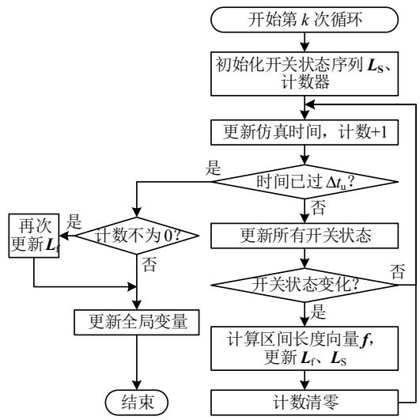  
图8 主循环预处理流程图  
Fig. 8 Flow chart of pretreatment process in main loop

在第 k 次仿真循环中，首先初始化开关状态序列 $\pmb { L } _ { \mathrm { S } }$ 以及计数器，然后进入以最小的分数步长为时间间隔的 for 循环遍历，更新仿真时间及计数(加

1)，控制环节随仿真时间变化生成调制波信号，与载波比较更新所有开关状态；在每一步遍历中，均对比当前和上一步的所有开关状态，判断是否有开关动作；若发生开关动作，此时计数值即反映距离上一次开关动作的区间长度，将计数值由十进制转为二进制，即得到对应的前述二进制向量 $f ,$ ，可将其和当前的开关状态向量分别添加入区间操作指令序列 $\pmb { L } _ { \mathrm { f } } .$ 、开关状态序列 $L _ { \mathrm { S } }$ 完成更新，并重新初始化计数器(计数清零)；继续遍历，重复上述过程，直到遍历时间达到单位步长 $\Delta t _ { \mathrm { u } }$ ，即结束 for循环遍历。需要注意的是，往往此时计数器还有计数，也即还存在一个结尾区间，则需要额外再更新一次区间操作指令序列 $\pmb { L } _ { \mathrm { f } } ;$ ；最后更新系统仿真时间、开关状态寄存器等全局变量，为下次流程做准备，即结束主循环预处理阶段。后续如图 9进行迭代更新过程，以完成当次循环。

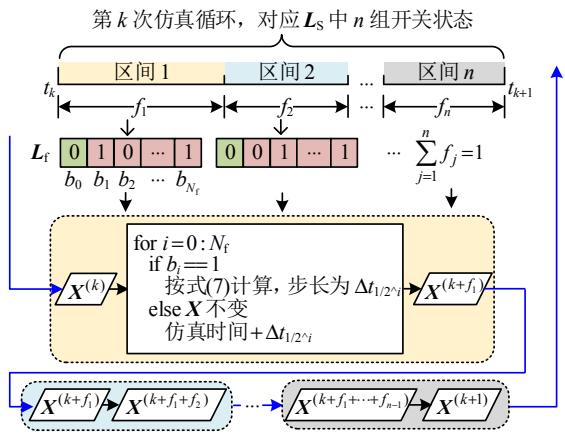  
图9 主循环迭代更新过程  
Fig. 9 Updating iteration process in main loop

图中，第 k 次仿真循环时间跨度为 $[ t _ { k } , t _ { k + 1 } ]$ $\left( { { t } _ { k + 1 } } = { { t } _ { k } } + \Delta { { t } _ { \mathrm { u } } } \right)$ ，假设由 n−1 次开关动作分为 $\overline { { \textit { J } } } n$ 个时间区间，对应有开关状态序列 $\pmb { L } _ { \mathrm { S } }$ 中 n 组开关状态，每段区间的时间长度可用不大于 1 的比例系数(相对于 ${ \Delta } t _ { \mathrm { u } } ) f _ { j } , \ j = 1 , 2 , \cdots , n$ 来表示。这里， $f _ { j }$ 与区间操作指令序列 $\pmb { L } _ { \mathrm { f } }$ 中各段区间的向量 f 相对应，且满足：

$$
\sum_ {j = 1} ^ {n} f _ {j} = 1 \tag {8}
$$

具体计算中，从时刻 $t _ { k }$ 开始，待计算量初值为$\boldsymbol { X } ^ { ( k ) }$ ，针对由开关动作分隔的 n 段时间区间，逐一进行 n 次迭代计算。每一次迭代均有相应的用二进制向量 f 表示的区间操作指令和开关状态向量 S，并针对 f 依次分析其各位 $b _ { 0 } , \ b _ { 1 } , \ b _ { 2 } , \ \cdots$ ，若该位为

1，则按式(7)进行对应分数步长的小步合成计算，(相应参数矩阵 A、 $B _ { \mathrm { f } }$ 根据当前区间的开关状态向量 S及对应分数步长确定，从预存储数据中提取)，结果作为下一步计算的输入，同时仿真时间累加上该步所用分数步长。这样进行 $N _ { \mathrm { f } } { + 1 }$ 步判断、计算，即完成一段区间的迭代计算。重复这一过程，从$X ^ { ( k ) }$ 开始，依次计算每次开关动作时刻的结果 $X ^ { ( k + f _ { 1 } ) }$ ，$X ^ { ( k + f _ { 1 } + f _ { 2 } ) }$ 直到 $X ^ { ( k + 1 ) }$ ，完成 n 段区间迭代计算，此时仿真时间也由 $t _ { k }$ 到 $t _ { k + 1 }$ 1，即结束当次仿真循环。

# 5 算例分析

基于图 1 电力电子变压器系统，结合浙江嘉兴某低碳园区场景，给出拓扑及控制参数如下表 3 所示。基于上述分数步仿真方法进行仿真实验，分别对所提方法的仿真精度、结果准确性和仿真效率进行分析验证，并分析关键参数 $N _ { \mathrm { f } }$ 的影响。

表3 仿真系统参数  
Table 3 Parameters of simulation system   

<table><tr><td>仿真系统参数</td><td>数值</td></tr><tr><td>交流电网电压Us(L-L,RMS)/V</td><td>190</td></tr><tr><td>前级网侧电感Ls/mH</td><td>1</td></tr><tr><td>输入侧稳压电容C1/μF</td><td>800</td></tr><tr><td>中间级内电感L/mH</td><td>0.16</td></tr><tr><td>中间级内电阻R/Ω</td><td>0.3</td></tr><tr><td>中间级高频变压器变比n</td><td>2</td></tr><tr><td>输出侧稳压电容C2/μF</td><td>800</td></tr><tr><td>后级滤波电感Lf1、Lf2/mH</td><td>1</td></tr><tr><td>后级滤波电容Cf/μF</td><td>200</td></tr><tr><td>负载电阻R1/Ω</td><td>6</td></tr><tr><td>DAB模块控制PI参数kpD、kiD</td><td>0.02、0.5</td></tr></table>

# 5.1 步长设置对仿真精度影响分析

设计 2 个仿真场景如下，观测电力电子变压器高频开关电压、输出直流电压波形，分别进行小步合成和分数步长算法效果验证。

场景 1：单位步长 $\Delta t _ { \mathrm { u } } = 0 . 2 5$ μs， $N _ { \mathrm { f } } { = } 0 ($ (不采用分数步长)，设置不同 $N _ { \mathfrak { q } }$ 使量化步长 $\Delta t _ { \mathrm { q } }$ 变化，仿真结果如图 10所示。

对于第一种情况 $( N _ { \mathrm { f } } { = } 0 , N _ { \mathrm { q } } { = } 0$ ，代表传统仿真)，

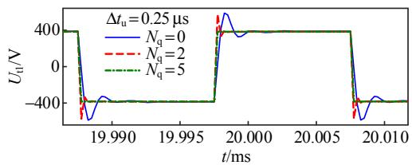  
(a) 中间级内高频变压器输入侧开关电压

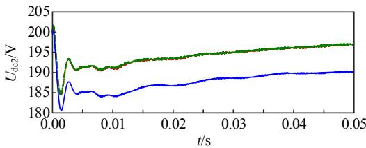  
(b) 中间级输出侧直流母线电压  
图 10 场景 1 结果波形(不使用分数步)  
Fig. 10 Result waveforms under scenario 1 $\mathbf { ( } N _ { \mathbf { f } } \mathbf { = } \mathbf { 0 } )$

开关电压波形包含明显的振荡过程，相比理想开关带来额外的虚拟损耗，从而引起输出直流电压的误差。而随着 $N _ { \mathfrak { q } }$ 参数的不断增大，应用小步合成，在仿真步长不变的前提下缩小建模的量化步长，使得开关波形的振荡逐渐减弱，降低了虚拟损耗，输出直流电压结果也更为准确。因此，采用小步合成可无需减小仿真步长而有效抑制高频系统开关振荡及降低虚拟损耗，改善仿真精度。

场景 2：采用不同的单位步长 $\Delta t _ { \mathrm { u } } .$ 、分数步长阶数 $N _ { \mathrm { f } } ,$ ， $N _ { \mathrm { q } } { = } N _ { \mathrm { f } } { + } 5$ ，结果如图 11 所示。

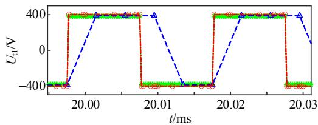  
(a) 中间级内高频变压器输入侧开关电压

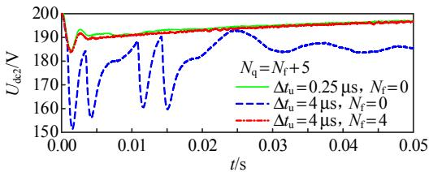  
(b) 中间级输出侧直流母线电压  
图 11 场景 2 结果波形(不同阶数分数步)  
Fig. 11 Result waveforms under scenario 2(different Nf)

对于第一种情况 $( N _ { \mathrm { f } } { = } 0$ ，不采用分数步长)，当$\Delta t _ { \mathrm { u } }$ 较小时还能保证波形的准确。但当仿真步长 $\Delta t _ { \mathrm { u } }$ 进一步增大到 4μs，此时将因为难以准确定位高频开关动作时刻而造成开关波形变得不准确，进而影响输出电压。这时，采用分数步长 $( N _ { \mathrm { f } } { = } 4$ ，以保证最小的分数步长仍为 0.25 μs)，可使仿真结果再次恢复准确。对比开关电压波形，可见分数步方法在开关动作前后采用一系列分数步长来准确定位开关动作时刻，其他时候则仍采用顶层单位步长以提升效率。由此，结合小步合成和分数步长算法，可在保证仿真精度的同时实现更大步长下电力电子

变压器系统仿真。

# 5.2 和 PSCAD仿真结果准确性对比

分别基于分数步仿真方法(FTSSM)及在PSCAD上进行仿真，设计仿真场景如下：1）0.2s 时，直流电压指令 $U _ { \mathrm { d c l } } ^ { * }$ 阶跃：400 V→500 V；2）0.4 s 时，直流电压指令 ${ \boldsymbol { U } } _ { \mathrm { d c } 2 } ^ { * }$ 阶跃：200 V→250 V；3）0.6 s时，负载电压指令 $U _ { \mathrm { l o a d } } ^ { * }$ 阶跃：80V→90V。

仿真持续 0.8 s，其中 FTSSM 参数为： $\Delta t _ { \mathrm { u } } = 8 \mu \mathrm { s }$ ，$N _ { \mathrm { q } } = 1 0$ ， $N _ { \mathrm { f } } { = } 5$ ，PSCAD 仿真步长为 0.25 μs，相应仿真结果对比如图 12 所示。

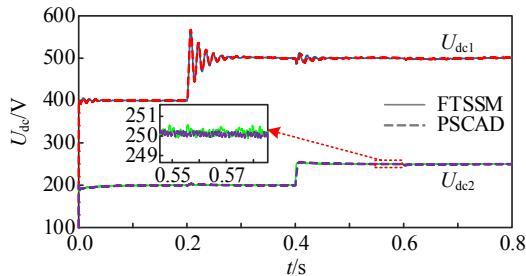  
(a) 中间级两侧直流母线电压

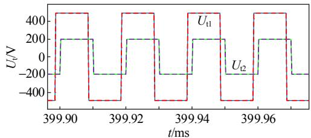  
(b) 中间级内高频变压器两端开关电压

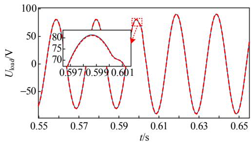  
(c) 后级负载电压   
图 12 FTSSM 法和 PSCAD 仿真结果对比  
Fig. 12 Results comparison between FTSSM and PSCAD

由图，电力电子变压器系统中直流电压波形、开关电压波形及交流负载电压波形均基本一致，即证明所提分数步仿真方法能够有效支撑高频电力电子变压器系统在大步长下的精确仿真，有助于实现仿真加速。

# 5.3 Nf设置对仿真效率影响分析

为分析分数步阶数 $N _ { \mathrm { f } }$ 的影响，进行一系列不同$N _ { \mathrm { f } }$ 参数下的仿真，设置仿真 0.05s， $N _ { \mathrm { q } } { = } N _ { \mathrm { f } } { + } 5$ ，同时顶层单位步长 $\Delta t _ { \mathrm { u } }$ 随 $N _ { \mathrm { f } }$ 增大而增大，以保证量化

步长 $\Delta t _ { \mathrm { q } }$ 及最小分数步长不变。

结果数据如表 4 所示，可见随 $N _ { \mathrm { f } }$ 增大，仿真需要的耗时明显减小，这与仿真步长增大、降低了计算量密切相关。进一步分析仿真时间消耗随 $N _ { \mathrm { f } }$ 增大的变化趋势，可见较大的 $N _ { \mathrm { f } }$ 有助于减轻计算负担以实现仿真加速，但这一效果随 $N _ { \mathrm { f } }$ 增大而持续削弱；另一方面，考虑数值积分截断误差随离散化分数步长增大而加剧， $N _ { \mathrm { f } }$ 增大会引入更大的潜在误差。因此，可以通过分析 $N _ { \mathrm { f } } .$ 仿真耗时曲线的加速变化率，并综合考虑误差等负面影响来大概确定最佳 $N _ { \mathrm { f } }$ 参数范围，在仿真误差可接受的前提下获取较好的仿真加速效果。

表4 不同 $N _ { \mathbf { f } }$ 下仿真结果  
Table 4 Simulation statistics under different $N _ { \mathbf { f } }$   

<table><tr><td>Nf</td><td>Δt0/μs</td><td>仿真耗时/s</td><td>单位步长最大更新计算次数</td><td>每微秒最大更新计算次数</td></tr><tr><td>0</td><td>0.25</td><td>40.16970</td><td>1</td><td>4.0000</td></tr><tr><td>1</td><td>0.50</td><td>23.76200</td><td>2</td><td>4.0000</td></tr><tr><td>2</td><td>1.00</td><td>13.28100</td><td>4</td><td>4.0000</td></tr><tr><td>3</td><td>2.00</td><td>7.55905</td><td>6</td><td>3.0000</td></tr><tr><td>4</td><td>4.00</td><td>5.00455</td><td>8</td><td>2.0000</td></tr><tr><td>5</td><td>8.00</td><td>3.58537</td><td>10</td><td>1.2500</td></tr><tr><td>6</td><td>16.00</td><td>2.86268</td><td>19</td><td>1.1875</td></tr><tr><td>7</td><td>32.00</td><td>2.45038</td><td>34</td><td>1.0625</td></tr></table>

表4中还记录了单位步长里需要按式(7)更新X的最大次数，并结合仿真步长换算每微秒最大更新计算次数，可见随 $N _ { \mathrm { f } }$ 增大，1μs 内需执行的更新计算越少。因此，所提方法可应用于实时仿真中，有助于降低单位现实时间内的计算负担，缩短每一步仿真需要的现实时间，使得实时仿真的实时性更容易满足。另一方面，在应用本方法增加了单步仿真时间裕度的情况下，可以适当提升计算串行度从而降低硬件资源消耗，反过来又能用于计算更大规模的仿真系统，即提升了同一仿真硬件的性能水平。

# 6 结论

本文提出一种分数步仿真方法(FTSSM)，以解决高频电力电子电路电磁暂态仿真所面临的精度与效率方面瓶颈问题，得到结论如下。

1）以高并行度的紧凑型 EMTP 算法为框架进行离散化小步长建模，结合“小步建模+大步计算”的小步合成思想进行变量更新计算，同时利用一系列分数步长来辅助准确定位开关动作，将由开关动作分隔的各段区间的计算过程分解为一系列采用

不同级分数步长的小步合成计算过程的叠加，从而完成单次仿真循环的更新计算。

2）所提方法可以克服恒导纳开关模型存在的暂态振荡和虚拟功率损耗问题以提升仿真精度，与PSCAD 的仿真对比也验证所提方法能在保证仿真准确性的同时支持较大步长下的高频电力电子电路仿真以提升仿真效率。  
3）参数分析则表明，可以选择合适的 $N _ { \mathrm { f } }$ 参数以获取较好的离线仿真加速效果，另外也有助于降低实时仿真的实时性保障难度、扩大仿真硬件支持的仿真规模，实现实时仿真性能的提升。

# 参考文献

[1] MURTY V V S N，KUMAR A．RETRACTED ARTICLE： multi-objective energy management in microgrids with hybrid energy sources and battery energy storage systems[J]．Protection and Control of Modern Power Systems，2020，5(1)：2   
[2] WANG Wei ， LIU Liu ， LIU Jizhen ， et al． Energymanagement and optimization of vehicle-to-grid systemsfor wind power integration[J]．CSEE Journal of Power andEnergy Systems，2021，7(1)：172-180  
[3] LI Zirun，XU Jin，WANG Keyou，et al．FPGA-based real-time simulation for EV station with multiple high-frequency chargers based on C-EMTP algorithm[J] Protection and Control of Modern Power Systems，2020， 5(4)：1-11   
[4] XU Jin，WANG Keyou，WU Pan，et al．FPGA-based submicrosecond-level real-time simulation of solid-state transformer with a switching frequency of 50 kHz[J] IEEE Journal of Emerging and Selected Topics in Power Electronics，2021，9(4)：4212-4224   
[5] DAGBAGI M，HEMDANI A，IDKHAJINE L，et al ADC-based embedded real-time simulator of a power converter implemented in a low-cost FPGA：application to a fault-tolerant control of a grid-connected voltage-source rectifier[J]．IEEE Transactions on Industrial Electronics， 2016，63(2)：1179-1190   
[6] WANG Keyou，XU Jin，LI Guojie，et al．A generalized associated discrete circuit model of power converters in real-time simulation[J] ． IEEE Transactions on Power Electronics，2019，34(3)：2220-2233   
[7] 王晓婷，冯谟可，许建中，等．多有源桥型 PET 开关死区的电磁暂态等效建模方法[J]．中国电机工程学报，2023，43(15)：5995-6005  
WANG Xiaoting，FENG Moke，XU Jianzhong，et al Electromagnetic transient equivalent modeling method for switching dead time of multi active bridge PET[J]

Proceedings of the CSEE，2023，43(15)：5995-6005(inChinese)  
[8] 张建文，周剑桥，施刚，等．基于环流注入控制的MMC型固态变压器低压直流真双极运行方案[J]．中国电机工程学报，2021，41(7)：2350-2362  
ZHANG Jianwen，ZHOU Jianqiao，SHI Gang，et al Operation and control of MMC-type solid state transformer with bipolar LVDC port based on active circulating current injection[J]．Proceedings of the CSEE， 2021，41(7)：2350-2362(in Chinese)   
[9] 张国澎，李子汉，王浩，等．不平衡电网下隔离型固态变压器非线性一体化控制[J]．电网技术，2022，46(6)：2317-2326  
ZHANG Guopeng，LI Zihan，WANG Hao，et al．Nonlinear integrated control of isolated solid state transformer under unbalanced grid[J]．Power System Technology，2022， 46(6)：2317-2326(in Chinese)   
[10] WANG Li，ZHU Qianlai，YU Wensong ，et al．A medium-voltage medium-frequency isolated DC-DC converter based on 15-kV SiC MOSFETs[J]．IEEE Journal of Emerging and Selected Topics in Power Electronics， 2017，5(1)：100-109   
[11] 龚邻骁，李文辉，徐军忠，等．基于多目标优化的高频DAB 变换器混合多重移相控制策略[J]．中国电机工程学报，2024，44(4)：1517-1533  
GONG Linxiao，LI Wenhui，XU Junzhong，et al．Hybrid phase shift control strategy for high-frequency DAB converter based on multi-objective optimization[J] Proceedings of the CSEE，2024，44(4)：1517-1533(in Chinese)   
[12] SONG Yankan，CHEN Laijun，CHEN Ying，et al．A general parameter configuration algorithm for associate discrete circuit switch model[C]//2014 International Conference on Power System Technology．Chengdu， China：IEEE，2014：956-961   
[13] 徐晋，汪可友，李国杰，等．基于响应匹配的电力电子换流器恒导纳建模[J]．中国电机工程学报，2019，39(13)：3879-3888  
XU Jin，WANG Keyou，LI Guojie，et al．Fixed-admittancemodeling of power electronic converters usingresponse-matching technique[J] ． Proceedings of theCSEE，2019，39(13)：3879-3888(in Chinese)  
[14] DUFOUR C．Method and system for reducing power losses and state-overshoots in simulators for switched power electronic circuit：US，09665672B2[P]．2017   
[15] 姚蜀军，屈秋梦，蔡焱蒙，等．基于多频段动态相量法的MMC换流器建模方法[J]．中国电机工程学报，2020，40(18)：5932-5941  
YAO Shujun，QU Qiumeng，CAI Yanmeng，et al Research of modeling method of modular multilevel

converter based on multi-frequency bands dynamic phasor[J]．Proceedings of the CSEE，2020，40(18)： 5932-5941(in Chinese)   
[16] YE Hua，GAO Feng，PEI Wei，et al．Wave function and multiscale modeling of MMC-HVDC system for wide-frequency transient simulation[J]．IEEE Journal of Emerging and Selected Topics in Power Electronics， 2021，9(5)：5906-5917   
[17] 赵帅，贾宏杰，李建设，等．一种考虑多重开关动作的变步长电磁暂态仿真算法[J]．电工技术学报，2016，31(12)：177-183，192  
ZHAO Shuai，JIA Hongjie，LI Jianshe，et al．Variable step integration method on power system transient simulation with multiple switching events[J]．Transactions of China Electrotechnical Society，2016，31(12)：177-183，192(in Chinese)   
[18] SHI Bochen，CHEN Yonglin，CHEN Kainan，et al Event-driven approach with time-scale hierarchical automaton for switching transient simulation of SiC-based high-frequency converter[J] ． IEEE Transactions on Circuits and Systems I：Regular Papers，2021，68(11)： 4746-4759   
[19] 施博辰，赵争鸣，朱义诚，等．电力电子混杂系统多时间尺度离散状态事件驱动仿真方法[J]．中国电机工程学报，2021，41(9)：2980-2989  
SHI Bochen，ZHAO Zhengming，ZHU Yicheng，et al Discrete-state event-driven simulation approach for multi-time-scale power electronic hybrid system[J] Proceedings of the CSEE，2021，41(9)：2980-2989(in Chinese)   
[20] 许明旺，马嘉昊，李蕴红，等．一种级联 H 桥型电力电子变压器电磁暂态解耦与仿真模型[J]．电网技术，2023，47(6)：2503-2511  
XU Mingwang ， MA Jiahao ， LI Yunhong ， et alElectromagnetic transient decoupling and simulationmodel of cascaded H-bridge power electronictransformer[J]．Power System Technology，2023，47(6)：2503-2511(in Chinese)  
[21] 徐义良，赵成勇，赵禹辰，等．双端口子模块 MMC 电磁暂态通用等效建模方法[J]．中国电机工程学报，2018，38(20)：6079-6090  
XU Yiliang，ZHAO Chengyong，ZHAO Yuchen，et al Generalized electromagnetic transient (EMT) equivalent modeling of MMCs with arbitrary two-port sub-module structures[J]．Proceedings of the CSEE，2018，38(20)： 6079-6090(in Chinese)   
[22] 丁江萍，高晨祥，许建中，等．级联 H 桥型电力电子变压器的电磁暂态等效建模方法[J]．中国电机工程学报，2020，40(21)：7047-7055  
DING Jiangping，GAO Chenxiang，XU Jianzhong，et al

Electromagnetic transient equivalent modeling method of cascaded H-bridge power electronic transformer[J] Proceedings of the CSEE，2020，40(21)：7047-7055(in Chinese)   
[23] 李卓蓝，张宇．双有源桥串联谐振变换器的暂态过程与控制[J]．中国电机工程学报，2024，44(8)：3189-3201LI Zhuolan，ZHANG Yu．Transient process and control ofdual-bridge series resonant converter[J]．Proceedings ofthe CSEE，2024，44(8)：3189-3201(in Chinese)  
[24] XU Jin，WANG Keyou，WU Pan，et al．FPGA-based sub-microsecond-level real-time simulation for microgrids with a network-decoupled algorithm[J] ． IEEE Transactions on Power Delivery，2020，35(2)：987-998   
[25] 费景高．运载火箭姿态运动实时仿真建模的小步合成方法[J]．导弹与航天运载技术，1996(3)：26-33FEI Jinggao ． The small step synthesis method formodelling for real-time digital simulation of the attitudemotion of a launch vehicle[J] ． Missiles and SpaceVehicles，1996(3)：26-33(in Chinese)  
[26] 费景高．计算机仿真建模方法(三)[J]．计算机仿真，1996(2)：53-58，40FEI Jinggao．Lectures in modelling methods for computersimulation (3)[J]．Computer Simulation，1996(2)：53-58，40(in Chinese)  
[27] LI Zirun，XU Jin，WANG Keyou，et al．A discrete small-step synthesis real-time simulation method for power converters[J] ． IEEE Transactions on Industrial Electronics，2022，69(4)：3667-3676

  
吴盼

在线出版日期：2025-04-16。

收稿日期：2023-12-14。

作者简介：

吴盼(1995)，男，博士研究生，研究方向为新能源并网控制与建模仿真，Panghuwu@sjtu.edu.cn；

* 通信作者：徐晋(1991)，男，副教授，研究方向为电力系统分析、新能源接入、实时仿真与建模，xujin20506@sjtu.edu.cn；

汪可友(1979)，男，教授，博士生导师，研究方向为电力能源系统建模计算、分析与控制及仿真，wangkeyou@sjtu.edu.cn；

李子润(1996)，男，博士，研究方向为新能源接入与分析、电力电子化系统建模与仿真，lzrbit@foxmail.com；

李国杰(1965)，男，研究员，研究方向为新能源控制与接入、微电网分析与控制，liguojie@sjtu.edu.cn；

周建其(1963)，男，高级工程师，研究方向为智能电网、智慧能源、智慧城市、配电网规划等，zhoucity@vip.sina.com；

王宏韬(1981)，男，高级工程师，熟悉电力调度和配网管理，具有丰富的电网运行管理经验，10260323@qq.com。

(编辑 刘雪莹)

# The Fractional Time-step Electromagnetic Transient Simulation Method Suitable for High-frequency Power Electronic Circuits

WU Pan1 , XU Jin1*, WANG Keyou1 , LI Zirun2 , LI Guojie1 , ZHOU Jianqi3 , WANG Hongtao3

(1. Key Laboratory of Control of Power Transmission and Conversion, Ministry of Education (Shanghai Jiao Tong University);   
2. North China Branch of State Grid Corporation of China; 3. State Grid Jiaxing Power Supply Company)

KEY WORDS: high-frequency power electronic circuits; electromagnetic transient simulation; constant admittance switch model; small-step synthesis; fractional time-step simulation method

In recent years, high-frequency power electronic equipment has been applied in the conversion and transmission of electric energy in modern power systems. As a typical representative of high-frequency power electronic circuit, the power electronic transformer contains the dual active bridge part, which usually owns the switching frequency as high as tens of kHz. For electromagnetic transient simulation of high-frequency power electronic circuits, while adopting the constant admittance switch model is helpful to simplify the computation, there are still challenges to the simulation precision and efficiency. One is that the switch virtual loss brought by constant admittance switch model under high frequency switching actions seriously influences the simulation precision, while the other is that the required quite small simulation time-step will increase computing burden and affect the simulation efficiency.

This paper proposes a fractional time-step simulation method (FTSSM), which can support efficient electromagnetic transient simulation of high-frequency power electronic circuits guaranteeing both the simulation precision and efficiency. The method defines the fractional time-step granularity order $N _ { \mathrm { f } }$ to determine the fractional time-steps series, which are designed to exactly locate the switching actions so as to support the accurate simulation with larger time-step. The simulation process of FTSSM has two stages, including the initialization part and main loop. In initialization stage, the improved highly-paralleled electromagnetic transient program (EMTP) algorithm is used for discretization modeling, along with the step synthesis (SSS) algorithm, which adopt the idea of "modeling with small time-step while calculating with big time-step" to reduce the virtual loss. Then in the main loop, as shown in Fig. 1, the simulation calculation is implemented as the iteration of a series of small step synthesis calculation process with different fractional time-steps, and the state

variables can be updated as follows.

$$
\boldsymbol {X} ^ {(k + 2 ^ {- i})} = \boldsymbol {A} _ {\mathrm {f}} \boldsymbol {X} ^ {(k)} + \boldsymbol {B} _ {\mathrm {f}} \boldsymbol {U} ^ {(k)}, \quad i = 0, 1, \dots , N _ {\mathrm {f}} \tag {1}
$$

where: the superscript $k + 2 ^ { - i }$ is relative to $\Delta t _ { \mathrm { u } } \mathrm { ; }$ X is the vector of state variables; U is the vector of external sources; while $A _ { \mathrm { f } } , \ B _ { \mathrm { f } }$ are matrices related to both the switch states and current fractional time-step $\Delta t _ { 1 / 2 ^ { i } }$ , which are pre-calculated in the initialization stage.

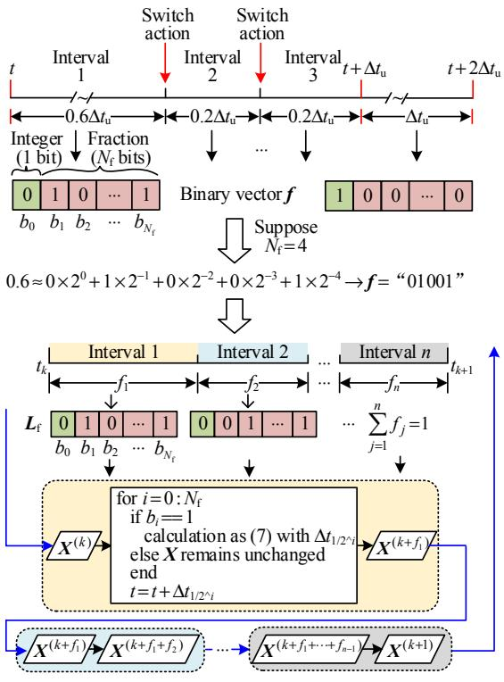  
Fig. 1 Fractional steps mapping and calculation iteration process

Case studies have been done based on the power electronic transformer system. Simulation results analysis shows that the proposed method can effectively improve the simulation precision of high-frequency power electronic circuits and support the larger time-step simulation with enough accuracy, which is helpful to accelerate the offline simulation and improve the real-time simulation performance.