# 适用于级联型电力电子拓扑电磁暂态仿真的 $N$ 端口网络通用等效建模方法

徐晋，吴盼，汪可友\*，高晨祥，李子润

(电力传输与功率变换控制教育部重点实验室(上海交通大学), 上海市 闵行区 200240)

# A General Equivalent Modeling Method of $N$ -port Networks Suitable for the Electromagnetic Transient Simulation of Cascading Power Electronic Topologies

XU Jin, WU Pan, WANG Keyou*, GAO Chenxiang, LI Zirun

(Key Laboratory of Control of Power Transmission and Conversion, Ministry of Education (Shanghai Jiao Tong University),

Minhang District, Shanghai 200240, China)

ABSTRACT: The complex topology of cascaded power electronic devices brings huge computational pressure to electromagnetic transient simulation. The equivalent modeling method of the common-used modular multilevel converter (MMC) is relatively mature. However, a large number of complex new cascaded topologies have appeared in recent years, and there is still a lack of universal equivalent modeling methods. Therefore, this paper proposes a general equivalent modeling method for power electronic equipment which is suitable for the $N$ -terminal submodule of any topology and cascading in any mode. The port characteristics of the original circuit are extracted by using the form of state space expression, and then the equivalent circuit model is reverse-constructed according to the obtained state space expression. The case study shows that the proposed method can not only improve the simulation efficiency by eliminating the internal nodes of the submodule, but also apply to the customized topology structure and cascading mode of the submodule, which is more flexible and general than the traditional equivalent modeling method. The existing modular multilevel converter (MMC) equivalent modeling method can be regarded as a special case of the general method proposed in this paper.

KEY WORDS: cascaded; power electronic; electromagnetic transient simulation; $N$ -port networks; equivalent modeling

摘要：级联型电力电子设备复杂的拓扑结构给电磁暂态仿真

带来巨大的计算压力。常见的模块化多电平换流器(modular multilevel converter, MMC)的等效建模方法相对成熟。然而, 近年来出现大量复杂的新型级联型拓扑, 目前仍缺乏通用的等效建模方法。为此, 该文提出一种适用于任意拓扑 $N$ 端口子模块、以任意级联方式组成的电力电子设备通用等效建模方法, 利用状态空间表达式的形式将原始电路经数值积分代换后的端口特性提取出来, 再根据得到的状态空间表达式反向构造等效电路模型。算例分析表明, 所提方法不仅能消去子模块内部节点、提升仿真效率, 还可自定义子模块拓扑结构和级联方式, 相比传统等效建模方法更加灵活、通用, 已有的 MMC 等效建模方法可以视为本文所提通用方法的一种特例。

关键词：级联；电力电子；电磁暂态仿真； $N$ 端口网络；等效建模

# 0 引言

电磁暂态仿真是研究电力系统的重要手段。尤其是在新能源经电力电子设备大量接入电力系统后，所引起的复杂、宽频带电磁暂态现象更加依赖仿真技术进行复现和分析[1-3]。

20世纪60年代，H.W.Dommel提出电力系统电磁暂态仿真程序(electro-magnetic transient program，EMTP)的基本理论[4-5]，为后世主流电磁暂态仿真软件奠定算法框架。该框架下，电感、电容等动态元件离散化后表示成等效导纳和历史电流源组成的Norton电路形式，其与电阻等静态元件共同构造节点电压方程。EMTP建模与仿真解算的基本单元大多是单一元件支路或三相耦合元件支路。近年来，接入电力系统的电力电子设备，很多

呈现多模块级联的形式来适应高电压、大容量的应用场景，如柔性直流换流站常采用的模块化多电平换流器[6](modular multilevel converter, MMC)，直流固态变压器[7](solid state transformer, SST)常采用的级联型双有源桥(dual active bridge, DAB)等。如果仍以元件支路为基本单元构建节点电压方程解算，将引入大量子模块内部节点。这对于电网级仿真常常是不必要的，而在实时仿真当中又会带来巨大计算压力。相比之下，平均值模型具有较高的仿真效率，但不能反映子模块电容电压充、放电过程或开关故障过程[8-9]。

因此，文献[10]提出针对MMC的桥臂等效模型，其基本思想是先对单一子模块进行一次消去内部节点的等效建模，然后将整个桥臂上所有子模块模型进行聚合等效，每个桥臂得到一个Norton形式或Thevenin形式的等效电路模型[11-14]。在该方法下，每个桥臂模型只保留2个端口节点，极大降低节点电压方程求解的计算量。随着基于MMC的柔性直流输电工程应用到实际电网，RTDS公司和OPAL-RT公司也都基于自家实时仿真产品开发针对不同子模块结构的MMC桥臂等效模型[15-16]。传统MMC的子模块通常是单端口网络。近年来，基于双端口子模块，甚至是三端口、四端口子模块的MMC拓扑被大量提出[17-19]。针对这些新型拓扑，已有学者开展相关研究，文献[20-22]分别针对单端口子模块、双端口子模块和多类型子模块组成的MMC开展通用电磁暂态建模，可以实现任意拓扑的子模块等效模型构建，但尚未形成以任意方式级联的复杂 $N$ 端口级联电路的仿真算例。

除柔性直流换流器，固态变压器SST也常采用级联型的电力电子拓扑。级联SST的子模块通常也是双端口网络或更多端口网络[23-25]。对于SST的实时仿真，也可采用类似MMC的等效建模思想[26-27]。相比于传统MMC，这些新型级联电路的子模块拓扑结构更加复杂多变，子模块间的级联方式也更加灵活。如果参考传统MMC模型的开发和集成方式，实时仿真厂商只能针对几种常见子模块在典型级联方式下的级联电路进行等效建模封装。这种方式开发工作量大、周期长，模型灵活性差，难以持续覆盖今后的科研和工程需求。

为此，本文提出一种适用于任意拓扑的 $N$ 端口子模块以任意级联方式组成的电力电子设备通用等效建模方法，不仅能消去子模块内部节点、提升

仿真效率，还可自定义子模块拓扑和级联方式，相比传统等效建模方法更加灵活。已有的MMC桥臂等效建模可以视为本文所提通用方法的一种特例。

在模型描述上，本文引入离散系统的视角，同时采用等效电路图与离散状态空间表达式2种形式。为便于理解，本文将逐步归纳出通用等效建模方法的基本要素，证明所提方法的灵活性与通用性。

# 1 典型单端口网络的通用等效模型

# 1.1 单一元件组成的单端口网络

在传统EMTP的视角下，单一元件常被视作1个支路(Branch)，也是最基本的建模单元。在本文建模方法的视角下，单一元件将被视作1个最简单的单端口网络，如图1所示。

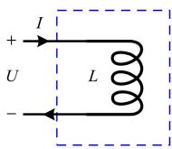  
(a）电感元件

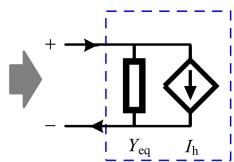  
(b）等效电路  
图1 电感元件的等效电路模型  
Fig. 1 Equivalent circuit model of inductance component

本文中，1个端口由1个电压正极和1个电压负极构成，电流正方向定义为从正极流入，从负极流出。以图1(a)所示的电感元件为例，按照EMTP的数值积分代换思想，将电感的微分方程用后向欧拉法进行离散化，可表示为

$$
I (t) = Y _ {\mathrm {e q}} U (t) + I _ {\mathrm {h}} (t) \tag {1}
$$

式中： $Y_{\mathrm{eq}}$ 为等效导纳， $Y_{\mathrm{eq}} = \Delta t / L$ ； $I_{\mathrm{h}}$ 为图1(b)中的历史电流源，可表示为

$$
I _ {\mathrm {h}} (t) = I (t - \Delta t) \tag {2}
$$

在控制理论的视角下，数值积分代换的本质是用1个一阶离散系统去近似1个一阶连续系统，隐式梯形法的代换过程对应控制理论中的双线性变换(Tustin变换)。受此启发，本文将采用离散系统的状态空间表达式来描述 $N$ 端口网络的通用等效模型。

将式(1)代入式(2)可以得到电感元件的历史电流源的递推公式，与式(1)共同组成一阶离散系统的状态空间，可表示为

$$
\left\{ \begin{array}{l} I _ {\mathrm {h}} (t) = I _ {\mathrm {h}} (t - \Delta t) + Y _ {\mathrm {e q}} U (t - \Delta t) \\ I (t) = I _ {\mathrm {h}} (t) + Y _ {\mathrm {e q}} U (t) \end{array} \right. \tag {3}
$$

式中：端口电压 $U$ 为输入；端口电流 $I$ 为输出；电感历史电流 $I_{\mathrm{h}}$ 为状态变量；状态矩阵为1；输入矩阵为 $Y_{\mathrm{eq}}$ ；输出矩阵为1；前馈矩阵为 $Y_{\mathrm{eq}}$ 。

# 1.2 多个元件组成的单端口网络

图2为半桥子模块的等效电路模型。将离散状态空间表达式模型推广至更为一般化的单端口网络，以图2(a)中所示的MMC半桥子模块为例。其中，IGBT与反并联二极管组成的电力电子开关可以用二值电阻进行建模，子模块电容可以离散化成等效导纳和历史电流源组成的Norton电路，如图2(b)所示。

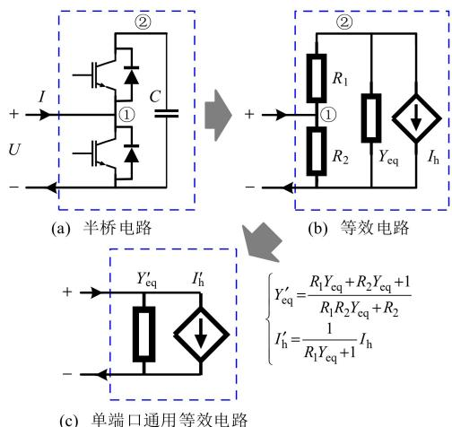  
图2 半桥子模块的等效电路模型  
Fig. 2 Equivalent circuit model of half-bridge submodule

根据基本电路定理，可以消去图2(b)中的内部节点，进一步得到图2(c)的等效电路。手工推导过程见附录A，而适用于计算机编程实现的建模过程将在2.2节中介绍。

和电感元件一样，半桥子模块的等效离散系统也可用一阶离散系统的状态空间进行描述，可表示为

$$
\left\{ \begin{array}{l} I _ {\mathrm {h}} (t) = \frac {R _ {1} Y _ {\mathrm {e q}}}{R _ {1} Y _ {\mathrm {e q}} + 1} I _ {\mathrm {h}} (t - \Delta t) + \frac {- Y _ {\mathrm {e q}}}{R _ {1} Y _ {\mathrm {e q}} + 1} U (t - \Delta t) \\ I (t) = \frac {1}{R _ {1} Y _ {\mathrm {e q}} + 1} I _ {\mathrm {h}} (t) + \frac {R _ {1} Y _ {\mathrm {e q}} + R _ {2} Y _ {\mathrm {e q}} + 1}{R _ {1} R _ {2} Y _ {\mathrm {e q}} + R _ {2}} U (t) \end{array} \right. \tag {4}
$$

该离散系统以子模块的端口电压 $U$ 为输入，以端口电流 $I$ 为输出，以子模块电容的历史电流 $I_{\mathrm{h}}$ 为状态变量。

如果MMC仿真需要考虑均压控制，则可以增补1个以子模块电容电压UC为输出的输出方程，可表示为

$$
U _ {\mathrm {C}} (t) = - \frac {R _ {1}}{R _ {1} Y _ {\mathrm {e q}} + 1} I _ {\mathrm {h}} (t) + \frac {1}{R _ {1} Y _ {\mathrm {e q}} + 1} U (t) \tag {5}
$$

此时，半桥子模块的等效模型由1个单输入单输出系统变为1个单输入双输出系统。

# 2 典型双端口网络的通用等效模型

如图3所示，以图3(a)中的DAB电路为例，进一步验证等效建模方法对双端口网络的适用性。

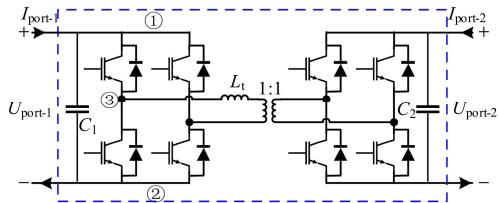  
(a) DAB 电路

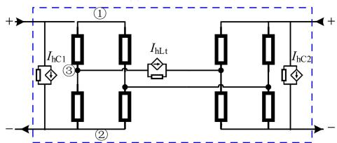

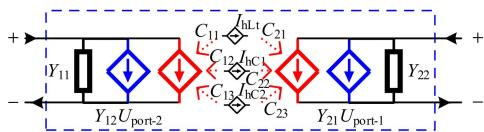  
(b) 等效电路  
(c) 双端口通用等效电路  
图3 DAB的等效电路模型  
Fig. 3 Equivalent circuit model of DAB

图3(a)的DAB经过离散化后，可以得到图3(b)的等效电路。如果不考虑DAB内部其他变量的输出，则该离散电路可以视为1个双输入双输出的三阶离散系统，状态空间表达式如式(6)所示：

$$
\left\{ \begin{array}{l} \boldsymbol {I} _ {\mathrm {h}} (t) = \boldsymbol {A} _ {3 \times 3} \boldsymbol {I} _ {\mathrm {h}} (t - \Delta t) + \boldsymbol {B} _ {3 \times 2} \boldsymbol {U} _ {\text {p o r t}} (t - \Delta t) \\ \boldsymbol {I} _ {\text {p o r t}} (t) = \boldsymbol {C} _ {2 \times 3} \boldsymbol {I} _ {\mathrm {h}} (t) + \boldsymbol {D} _ {2 \times 2} \boldsymbol {U} _ {\text {p o r t}} (t) \end{array} \right. \tag {6}
$$

式中： $A$ 为状态矩阵； $B$ 为输入矩阵； $C$ 为输出矩阵； $D$ 为前馈矩阵；输入变量 $U_{\mathrm{port}}$ 和输出变量 $I_{\mathrm{port}}$ 分别表示端口电压和端口电流，各含有2个元素；状态变量 $I_{\mathrm{h}}$ 含有3个元素 $I_{\mathrm{hC1}}$ 、 $I_{\mathrm{hC2}}$ 、 $I_{\mathrm{hL}}$ ，分别为原边电容、副边电容和变压器漏感的历史电流源。

根据式(6)可以构建DAB等效电路的基本形式：前馈矩阵 $\pmb{D}$ 的对角元分别描述2个端口的自导纳，对应图3(c)中的 $Y_{11}$ 、 $Y_{22}$ ； $\pmb{D}$ 的非对角元描述2个端口间的转移导纳，对应图3(c)中的2个电压控制电流源(voltagecontrolledcurrentsource，VCCS)

的参数 $Y_{12}$ 、 $Y_{21}$ ；输出矩阵 $\pmb{C}$ 的元素分别描述各个历史电流源对端口电流的贡献度，对应图3(c)中的2个电流控制电流源(current controlled current source, CCCS)的参数。历史电流源的更新过程只和自身以及端口电压有关，不参与双端口网络外部节点电压方程的构建，因此式(6)的状态方程不体现在图3(c)中。

相比图1和2，图3对应的状态空间表达式的手动推导过程较为复杂，且手动推导不利于计算机实现。下文将推导一种适用于计算机实现的、针对任意拓扑 $N$ 端口网络的通用等效建模方法。

# 3 任意拓扑的 $N$ 端口网络通用等效模型

# 3.1 通用等效电路与状态空间表达式

参照2节的DAB电路进行推广可以发现，对于有 $N$ 个端口、 $N_{\mathrm{dyn}}$ 个动态元件的网络，经过数值积分代换后可以视为 $N$ 输入 $N$ 输出的 $N_{\mathrm{dyn}}$ 阶离散系统(暂不计入网络内部其他变量的输出)，且该离散系统必然存在如式(7)所示的状态空间表达式。如果能得到具体的状态空间表达式(即知道系数矩阵 $A$ 、 $B$ 、 $C$ 、 $D$ 的值)，则可以反向构造出形如图4所示的等效电路模型，并且得到各个端口的自导纳、端口间的转移导纳、内部历史电流源对各个端口注入电流的贡献比例等电路参数。这些电路参数与 $A$ 、 $B$ 、 $C$ 、 $D$ 元素值的对应关系也可参考2节，此处不再赘述。

$$
\left\{ \begin{array}{l} \boldsymbol {I} _ {\mathrm {h}} (t) = \boldsymbol {A} \boldsymbol {I} _ {\mathrm {h}} (t - \Delta t) + \boldsymbol {B} \boldsymbol {U} _ {\text {p o r t}} (t - \Delta t) \\ \boldsymbol {I} _ {\text {p o r t}} (t) = \boldsymbol {C} \boldsymbol {I} _ {\mathrm {h}} (t) + \boldsymbol {D} \boldsymbol {U} _ {\text {p o r t}} (t) \end{array} \right. \tag {7}
$$

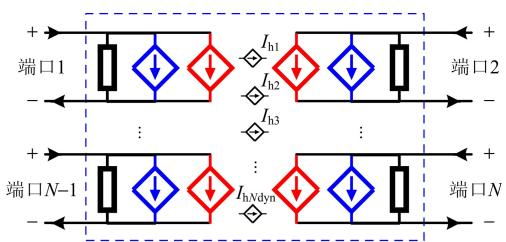  
图4 $N$ 端口网络的等效电路模型  
Fig. 4 Equivalent circuit model of $N$ -port network

因此，本文推导出系数矩阵 $A$ 、 $B$ 、 $C$ 、 $D$ 的一般化计算方式，便于计算机根据 $N$ 端口网络内部的网表信息(元件类型、元件参数及连接方式等)直接计算得到 $N$ 端口网络等效模型的各个系数矩阵。

# 3.2 状态空间表达式的系数矩阵

首先，对 $N$ 端口网络内部的 $N_{\mathrm{dyn}}$ 个动态元件进行差分化，历史电流源向量 $\pmb{I}_{\mathrm{h}}$ 可以用动态元件的电

压向量 $U_{\mathrm{b}}$ 和电流向量 $\pmb{I}_{\mathrm{b}}$ 表示：

$$
\boldsymbol {I} _ {\mathrm {h}} (t) = \boldsymbol {Y} _ {\text {c o e f}} \boldsymbol {U} _ {\mathrm {b}} (t - \Delta t) + \boldsymbol {K} _ {\text {c o e f}} \boldsymbol {I} _ {\mathrm {b}} (t - \Delta t) \tag {8}
$$

式中： $Y_{\mathrm{coef}}$ 为导纳量纲的系数矩阵； $K_{\mathrm{coef}}$ 为无量纲的系数矩阵；它们的元素可以根据动态元件类型、参数构建而成，可参考传统EMTP数值积分代换过程；不考虑元件间的耦合作用时， $Y_{\mathrm{coef}}$ 和 $K_{\mathrm{coef}}$ 都为对角阵。

对于内部无源的 $N$ 端口网络，其离散化后的节点注入电流向量可以由历史电流向量 $I_{\mathrm{h}}$ 和端口电流向量 $I_{\mathrm{port}}$ 根据拓扑连接关系计算得到：

$$
\boldsymbol {I} _ {\mathrm {n}} = \boldsymbol {M} _ {\mathrm {n h}} \boldsymbol {I} _ {\mathrm {h}} + \boldsymbol {M} _ {\mathrm {n p}} \boldsymbol {I} _ {\mathrm {p o r t}} \tag {9}
$$

式中： $N$ 端口网络内部的拓扑连接关系由关联矩阵 $M_{\mathrm{nh}}$ 和 $M_{\mathrm{np}}$ 描述； $M_{\mathrm{nh}}$ 描述动态元件的历史电流源与网络内部节点的连接关系： $M_{\mathrm{nh}}(i,j) = 1$ 表示 $I_{\mathrm{h}}$ 中第 $j$ 个历史电流流入节点 $i$ ； $M_{\mathrm{nh}}(i,j) = -1$ 表示第 $j$ 个历史电流流出节点 $i$ ； $M_{\mathrm{nh}}(i,j) = 0$ 表示第 $j$ 个动态元件与节点 $i$ 无关。 $M_{\mathrm{np}}$ 描述网络端口与其内部节点的连接关系，每个元素的定义和 $M_{\mathrm{nh}}$ 类似；未特别标注时间的变量均为 $t$ 时刻的值，如 $I_{\mathrm{n}},I_{\mathrm{h}},I_{\mathrm{port}}$ 等。

已知 $N$ 端口网络内部的网表信息，可以构建节点导纳矩阵 $\mathbf{Y}_{\mathrm{n}}$ ，该过程也属于传统EMTP范畴。节点电压向量 $V_{\mathrm{n}}$ 可表示为

$$
\boldsymbol {V} _ {\mathrm {n}} = \boldsymbol {Y} _ {\mathrm {n}} ^ {- 1} \boldsymbol {I} _ {\mathrm {n}} \tag {10}
$$

根据拓扑连接关系可列出动态元件支路电压 $U_{\mathrm{b}}$ 和网络端口电压 $U_{\mathrm{port}}$ ，可表示为

$$
\boldsymbol {U} _ {\text {p o r t}} = \boldsymbol {M} _ {\mathrm {p n}} \boldsymbol {V} _ {\mathrm {n}} \tag {11}
$$

$$
\boldsymbol {U} _ {\mathrm {b}} = \boldsymbol {M} _ {\mathrm {h n}} \boldsymbol {V} _ {\mathrm {n}} \tag {12}
$$

式中： $M_{\mathrm{pn}}$ 为 $M_{\mathrm{np}}$ 的转置； $M_{\mathrm{hn}}$ 为 $-M_{\mathrm{nh}}$ 的转置。

根据支路电压 $U_{\mathrm{b}}$ ，可解出支路电流：

$$
\boldsymbol {I} _ {\mathrm {b}} = \boldsymbol {Y} _ {\mathrm {c q}} \boldsymbol {U} _ {\mathrm {b}} + \boldsymbol {I} _ {\mathrm {h}} \tag {13}
$$

为将式(8)—(13)整理成式(7)的形式，需要消去 $U_{\mathrm{b}}$ 、 $I_{\mathrm{b}}$ 、 $I_{\mathrm{n}}$ 、 $V_{\mathrm{n}}$ 等中间变量，只留下反映离散系统动态特性的 $I_{\mathrm{h}}(t - \Delta t)$ 、 $I_{\mathrm{h}}(t)$ 和端口特性的 $U_{\mathrm{port}}$ 、 $I_{\mathrm{port}}$ 推导可得：

$$
\left\{ \begin{array}{l} \boldsymbol {A} = \left(\boldsymbol {Y} _ {\text {c o e f}} + \boldsymbol {K} _ {\text {c o e f}} \boldsymbol {Y} _ {\text {c q}}\right) \left(\boldsymbol {Z} _ {\text {h h}} - \boldsymbol {Z} _ {\text {h p}} \boldsymbol {Z} _ {\text {p p}} ^ {- 1} \boldsymbol {Z} _ {\text {p h}}\right) + \boldsymbol {K} _ {\text {c o e f}} \\ \boldsymbol {B} = \left(\boldsymbol {Y} _ {\text {c o e f}} + \boldsymbol {K} _ {\text {c o e f}} \boldsymbol {Y} _ {\text {c q}}\right) \boldsymbol {Z} _ {\text {h p}} \boldsymbol {Z} _ {\text {p p}} ^ {- 1} \\ \boldsymbol {C} = - \boldsymbol {Z} _ {\text {p p}} ^ {- 1} \boldsymbol {Z} _ {\text {p h}} \\ \boldsymbol {D} = \boldsymbol {Z} _ {\text {p p}} ^ {- 1} \end{array} \right. \tag {14}
$$

式中： $Z_{\mathrm{pp}}$ 为端口到端口的阻抗矩阵； $Z_{\mathrm{ph}}$ 为动态元件支路到端口的阻抗矩阵； $Z_{\mathrm{hp}}$ 为端口到动态元件支路的阻抗矩阵； $Z_{\mathrm{hh}}$ 为动态元件支路到动态元件

支路的阻抗矩阵。

$$
\left\{ \begin{array}{l} \boldsymbol {Z} _ {\mathrm {p p}} = \boldsymbol {M} _ {\mathrm {p n}} \boldsymbol {Y} _ {\mathrm {n}} ^ {- 1} \boldsymbol {M} _ {\mathrm {n p}} \\ \boldsymbol {Z} _ {\mathrm {p h}} = \boldsymbol {M} _ {\mathrm {p n}} \boldsymbol {Y} _ {\mathrm {n}} ^ {- 1} \boldsymbol {M} _ {\mathrm {n h}} \\ \boldsymbol {Z} _ {\mathrm {h p}} = \boldsymbol {M} _ {\mathrm {h n}} \boldsymbol {Y} _ {\mathrm {n}} ^ {- 1} \boldsymbol {M} _ {\mathrm {n p}} \\ \boldsymbol {Z} _ {\mathrm {h h}} = \boldsymbol {M} _ {\mathrm {h n}} \boldsymbol {Y} _ {\mathrm {n}} ^ {- 1} \boldsymbol {M} _ {\mathrm {n h}} \end{array} \right. \tag {15}
$$

依次将式(9)代入式(10)、(11)，可得：

$$
\begin{array}{l} \boldsymbol {U} _ {\text {p o r t}} = \boldsymbol {M} _ {\text {p n}} \boldsymbol {Y} _ {\mathrm {n}} ^ {- 1} \boldsymbol {M} _ {\text {n h}} \boldsymbol {I} _ {\mathrm {h}} + \boldsymbol {M} _ {\text {p n}} \boldsymbol {Y} _ {\mathrm {n}} ^ {- 1} \boldsymbol {M} _ {\text {n p}} \boldsymbol {I} _ {\text {p o r t}} = \\ \boldsymbol {Z} _ {\mathrm {p h}} \boldsymbol {I} _ {\mathrm {h}} + \boldsymbol {Z} _ {\mathrm {p p}} \boldsymbol {I} _ {\mathrm {p o r t}} \tag {16} \\ \end{array}
$$

$Z_{\mathrm{pp}}$ 衡量的是单位端口电流对端口电压大小的贡献，对角元为各个端口的自导纳，非对角元为端口之间的转移导纳。 $Z_{\mathrm{ph}}$ 衡量的是单位历史电流对端口电压大小的贡献，其元素可以理解为动态元件支路与端口之间的转移导纳。类似地，可以得到 $Z_{\mathrm{hp}}$ 和 $Z_{\mathrm{hh}}$ 物理含义。

在仿真开始前， $N$ 端口网络内部的拓扑连接方式、元件类型和参数、开关元件可能的状态等网表信息均为已知，所以系数矩阵 $A$ 、 $B$ 、 $C$ 、 $D$ 可以事先由式(14)、(15)确定所有开关状态对应的值。由此可见，该等效建模方法适用于任意 $N$ 端口网络，无论其内部原始拓扑如何复杂，都可以用类似图4的等效电路和形如式(7)的状态空间表达式描述，最终将对外节点数降为 $2N$ 个，从而降低仿真循环过程中求解节点电压方程的计算量。

为便于直观理解如何用式(14)、(15)构造状态空间表达式，附录B以图3中的DAB为例进行了说明。

# 3.3 状态空间表达式描述等效模型的意义

不同结构参数的电路，可能具有相同的端口特性；不同控制框图的系统，也可能具有相同的输入输出特性。状态空间表达式可以完整地描述系统的输入输出特性(或电路的端口特性)，而不用考虑具体是由什么样的控制框图(或电路结构)实现的。电路视角下缺少这种与具体实现方式无关的描述工具，因此借用控制理论中的状态空间表达式这一概念。

本文构造通用等效模型的思路就是利用状态空间表达式的形式将原始电路经数值积分代换后的端口特性提取出来，再根据得到的状态空间表达式反向构造等效电路。等效电路和原始电路尽管拥有不同的结构参数，但是状态空间表达式是相同的，因此保证具有相同的端口特性。

# 4 $N$ 端口网络级联电路的EMTP仿真

# 4.1 ISOP方式级联的DAB电路

直流固态变压器通常由多个DAB电路级联而

成。以图5所示的ISOP方式级联的DAB电路为例，对双端口网络级联电路的EMTP仿真方法进行说明。该电路中，含内阻电压源和电阻负载将视为单端口网络，每个DAB模块将视为1个双端口网络。

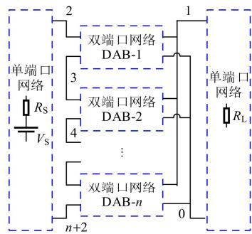  
图5 级联DAB电路(ISOP)  
Fig. 5 Cascaded DAB circuit (ISOP)

考虑到只有DAB模块含动态元件，对所有DAB进行差分化后，各个DAB的历史电流源向量表达式如式(17)所示：

$$
\begin{array}{l} I _ {\mathrm {h}} ^ {\mathrm {D A B} - i} (t) = A ^ {\mathrm {D A B} - i} I _ {\mathrm {h}} ^ {\mathrm {D A B} - i} (t - \Delta t) + \\ \boldsymbol {B} ^ {\mathrm {D A B} - i} \boldsymbol {U} _ {\text {p o r t}} ^ {\mathrm {D A B} - i} (t - \Delta t), \quad i = 1, 2, \dots , n \tag {17} \\ \end{array}
$$

对图5的级联电路进行节点编号。为和 $N$ 端口网络内部带圈的节点编号区分， $N$ 端口网络外部的级联电路节点编号采用不带圈的数字表示。

仿真循环中，级联电路的节点注入电流 $I_{\mathrm{nEX}}$ 可以首先由各个DAB的端口电流和电压源的Norton等效电流 $I_{\mathrm{S}}$ 计算可得：

$$
\boldsymbol {I} _ {\mathrm {n E X}} = \boldsymbol {M} _ {\mathrm {n S}} \boldsymbol {I} _ {\mathrm {S}} + \sum_ {i = 1} ^ {n} \boldsymbol {M} _ {\mathrm {n p}} ^ {\mathrm {D A B} - i} \boldsymbol {I} _ {\text {p o r t}} ^ {\mathrm {D A B} - i} \tag {18}
$$

式中：DAB间的拓扑连接关系由 $M_{\mathrm{nS}}$ 和 $M_{\mathrm{np}}^{\mathrm{DAB - i}}$ 描述；列向量 $M_{\mathrm{nS}}$ 为含内阻电压源与外部节点的连接关系： $M_{\mathrm{nS}}(i) = 1$ 表示 $I_{\mathrm{S}}$ 流入节点 $i$ ； $M_{\mathrm{nS}}(i) = -1$ 表示 $I_{\mathrm{S}}$ 流出节点 $i$ ； $M_{\mathrm{nS}}(i) = 0$ 表示 $I_{\mathrm{S}}$ 与节点 $i$ 无关； $M_{\mathrm{np}}^{\mathrm{DAB - i}}$ 描述第 $i$ 个DAB的各个端口与外部节点的连接关系： $M_{\mathrm{np}}^{\mathrm{DAB - i}}(k,j) = 1$ 表示第 $j$ 个端口电流流入节点 $k$ ； $M_{\mathrm{np}}^{\mathrm{DAB - i}}(k,j) = -1$ 表示第 $j$ 个端口电流流出节点 $k$ ； $M_{\mathrm{np}}^{\mathrm{DAB - i}}(k,j) = 0$ 表示第 $j$ 个端口电流与节点 $k$ 无关。

已知各个DAB的等效模型及相互之间的连接关系，就可以构建外部节点的导纳矩阵 $Y_{\mathrm{nEX}}$ 。进而可通过求解节点电压方程得到外部节点电压 $V_{\mathrm{nEX}}$ 为

$$
Y _ {\mathrm {n E X}} V _ {\mathrm {n E X}} = I _ {\mathrm {n E X}} \tag {19}
$$

解出 $V_{\mathrm{nEX}}$ 后，根据拓扑连接关系解出DAB的端口电压，可表示为

$$
\boldsymbol {U} _ {\text {p o r t}} ^ {\mathrm {D A B - i}} = \boldsymbol {M} _ {\mathrm {n p}} ^ {\mathrm {D A B - i}} \boldsymbol {V} _ {\mathrm {n E X}}, \quad i = 1, 2, \dots , n \tag {20}
$$

除端口电压，端口电流可以通过状态空间表达式中的输出方程计算可得：

$$
\boldsymbol {I} _ {\text {p o r t}} ^ {\mathrm {D A B} - i} = \boldsymbol {C} ^ {\mathrm {D A B} - i} \boldsymbol {I} _ {\mathrm {h}} ^ {\mathrm {D A B} - i} + \boldsymbol {D} ^ {\mathrm {D A B} - i} \boldsymbol {U} _ {\text {p o r t}} ^ {\mathrm {D A B} - i} \tag {21}
$$

最后，根据式(17)重新计算下一仿真时刻的历史电流后，可以进入下一个仿真循环。整个仿真循环的示意图如图6所示。

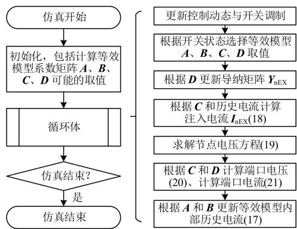  
图6基于 $N$ 端口等效模型的EMTP仿真  
Fig. 6 EMTP based on $N$ -port network equivalent model

与传统EMTP算法对比，建模思想和流程框架基本兼容，各个步骤上的主要区别已用下划线标注，体现在：1）传统算法中开关动作只会影响开关模型参数(如二值电阻阻值)，而本文中会影响子模块等效模型4个矩阵参数，其中 $D$ 参数和传统等效导纳相对应；2）传统算法中历史电流可以直接注入各个节点，本文算法中历史电流需乘以输出矩阵 $C$ 后，才能注入节点；3）传统算法以支路为基本单元，计算支路电压、支路电流和支路历史电流，本文算法以 $N$ 端口网络为基本单元，计算端口电压、端口电流和网络内部历史电流。

# 4.2 $N$ 端口网络以任意方式级联组成的电路

在本文的EMTP算法中，可以像连接支路一样，任意连接各个 $N$ 端口网络。通过外部节点与网络端口的关联矩阵 $M_{\mathrm{npEX}}^{\mathrm{DAB - i}}$ 可以较为完备地描述各类级联方式。先仍以图5所示的ISOP方式级联的DAB电路为例，其任意一个DAB的 $M_{\mathrm{npEX}}^{\mathrm{DAB - i}}$ 均为 $N_{\mathrm{EX}}\times 2$ 的矩阵，第1列表示左侧端口与各个外部节点的关联关系，第2列表示右侧端口与各个外部节

点的关联关系。ISOP方式下，各个DAB的 $M_{\mathrm{npEX}}^{\mathrm{DAB - i}}$ 如图7所示，1表示端口电流流入这个节点，-1表示端口电流流出这个节点。当DAB-1的左侧端口电流流出节点2，流入节点3；而DAB-2的左侧端口电流流出节点3，流入节点4；以此类推，这表明各个DAB的左侧端口是串联的。各个DAB的右侧端口电流都是流入节点0，流出节点1，这表明各个DAB的右侧端口都是并联的。为避免导纳矩阵奇异，导纳矩阵和关联矩阵都会截除0节点(地节点)对应的行和列。右侧端口电流的注入位置如图7所示。

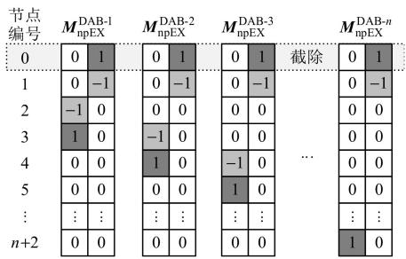  
图7 外部节点与DAB端口的关联矩阵(ISOP)  
Fig. 7 Incidence matrices between external nodes and DAB ports (ISOP)

类似地，可以分别构造出描述ISOS、IPOS、IPOP等级联方式的 $M_{\mathrm{npEX}}^{\mathrm{DAB - i}}$ ，此处不再赘述。

# 4.3 $N$ 端口网络的二次等效

对于某些级联电路，各个 $N$ 端口网络内部拓扑不算复杂，但 $N$ 端口网络数量众多，仅通过一次等效消去 $N$ 端口网络内部节点，计算量降低有限，MMC 就属于这种情况。因此，需要对 1 个桥臂上的子模块等效电路进行第 2 次等效，从而消去更多节点。桥臂等效过程可视为本文所提方法中 $N = 1$ 且级联方式为串联的特例，如图 8 所示。

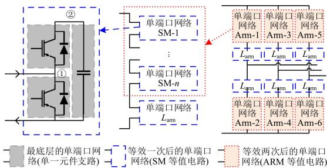  
图8 单端口网络的两次等效建模  
Fig. 8 Twice equivalent modeling of single-port networks

第2次等效过程和第1次等效过程方法基本相

同，最终得到第2次等效模型的系数矩阵 $A, B, C, D$ ，因此不再赘述。

# 5 通用等效模型的其他几种变形

# 5.1 通用等效模型的变形

到目前为止，本文对动态元件及 $N$ 端口网络的等效电路模型及其状态空间表达式的推导都是基于以下2个设定：1）等效电路模型采用Norton形式；2）状态空间表达式以端口电压作为输入，端口电流作为输出。

改变上述任何一个设定，都可以得到本文所提通用等效模型的一种变形。例如，采用Thevenin形式的、以端口电流为输入、端口电压为输出的 $N$ 端口等效电路如图9所示。

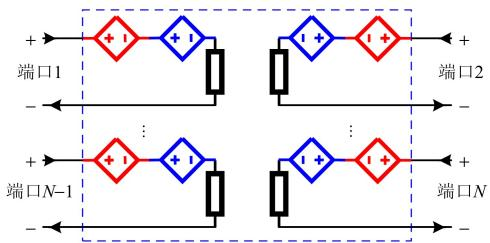  
图9 $N$ 端口网络的等效电路模型(Thevenin形式)  
Fig. 9 Equivalent circuit model of $N$ -port network (Thevenin form)

状态空间表达式(电流输入、电压输出)如式(22)所示：

$$
\left\{ \begin{array}{l} \boldsymbol {U} _ {\mathrm {h}} (t) = \boldsymbol {A} \boldsymbol {U} _ {\mathrm {h}} (t - \Delta t) + \boldsymbol {B} \boldsymbol {I} _ {\text {p o r t}} (t - \Delta t) \\ \boldsymbol {U} _ {\text {p o r t}} (t) = \boldsymbol {C} \boldsymbol {U} _ {\mathrm {h}} (t) + \boldsymbol {D} \boldsymbol {I} _ {\text {p o r t}} (t) \end{array} \right. \tag {22}
$$

式中： $U_{\mathrm{h}}$ 为历史电压源； $A, B, C, D$ 为系数矩阵的表达式，推导过程不再给出。

最一般化的场景下，甚至可以对部分动态元件采用Thevenin等效、部分端口以电流为输入、电压为输出，此时 $N$ 端口网络的状态空间表达式为

$$
\left\{ \begin{array}{l} \boldsymbol {X} _ {\mathrm {h}} (t) = \boldsymbol {A} \boldsymbol {X} _ {\mathrm {h}} (t - \Delta t) + \left[ \begin{array}{l l} \boldsymbol {B} _ {1} & \boldsymbol {B} _ {\mathrm {I I}} \end{array} \right] \left[ \begin{array}{l} \boldsymbol {I} _ {\text {s - p o r t}} (t - \Delta t) \\ \boldsymbol {U} _ {\text {p - p o r t}} (t - \Delta t) \end{array} \right] \\ \left[ \begin{array}{l} \boldsymbol {U} _ {\text {s - p o r t}} (t) \\ \boldsymbol {I} _ {\text {p - p o r t}} (t) \end{array} \right] = \left[ \begin{array}{l} \boldsymbol {C} _ {\mathrm {I}} \\ \boldsymbol {C} _ {\mathrm {I I}} \end{array} \right] \boldsymbol {X} _ {\mathrm {h}} (t) + \left[ \begin{array}{l l} \boldsymbol {D} _ {1 1} & \boldsymbol {D} _ {1 2} \\ \boldsymbol {D} _ {2 1} & \boldsymbol {D} _ {2 2} \end{array} \right] \left[ \begin{array}{l} \boldsymbol {I} _ {\text {s - p o r t}} (t) \\ \boldsymbol {U} _ {\text {p - p o r t}} (t) \end{array} \right] \end{array} \right. \tag {23}
$$

式中：状态变量向量 $X_{\mathrm{h}}$ 中既包含历史电流量纲的元素，又包含历史电压量纲的元素； $I_{\mathrm{s - port}}$ 和 $U_{\mathrm{s - port}}$ 分别表示s型端口的输入电流和输出电压； $U_{\mathrm{p - port}}$ 和 $I_{\mathrm{p - port}}$ 分别表示 $\mathfrak{p}$ 型端口的输入电压和输出电流。

# 5.2 变形的优势及其与已有等效建模方法的关系

# 5.2.1 MMC子模块等效与桥臂等效

本文1.2节中已经推导出MMC半桥子模块的

一种通用等效模型。若采用Thevenin等效、以电流为输入、电压为输出的形式重新推导，则子模块 $\mathrm{SM}_i$ 的状态空间表达式为

$$
\left\{ \begin{array}{r l} U _ {\mathrm {h} i} (t) & = \frac {R _ {1 i} + R _ {2 i} - R _ {\mathrm {e q} i}}{R _ {1 i} + R _ {2 i} + R _ {\mathrm {e q} i}} U _ {\mathrm {h} i} (t - \Delta t) + \\ & \frac {2 R _ {2 i} R _ {\mathrm {e q} i}}{R _ {1 i} + R _ {2 i} + R _ {\mathrm {e q} i}} I _ {\mathrm {S M} i} (t - \Delta t) \\ U _ {\mathrm {S M} i} (t) & = \frac {R _ {2 i}}{R _ {1 i} + R _ {2 i} + R _ {\mathrm {e q} i}} U _ {\mathrm {h} i} (t) + \\ & \frac {R _ {2 i} \left(R _ {1 i} + R _ {\mathrm {e q} i}\right)}{R _ {1 i} + R _ {2 i} + R _ {\mathrm {e q} i}} I _ {\mathrm {S M} i} (t) \end{array} \right. \tag {24}
$$

由于子模块采用Thevenin等效，且子模块端口间属于串联连接，在第2次等效(即桥臂等效)过程中，等效阻抗和等效电压源可以直接相加，更容易得出桥臂等效模型的表达式，可表示为

$$
\left\{ \begin{array}{l} U _ {\mathrm {h} i} (t) = \frac {R _ {1 i} + R _ {2 i} - R _ {\mathrm {e q} i}}{R _ {1 i} + R _ {2 i} + R _ {\mathrm {e q} i}} U _ {\mathrm {h} i} (t - \Delta t) + \\ \frac {2 R _ {2 i} R _ {\mathrm {e q} i}}{R _ {1 i} + R _ {2 i} + R _ {\mathrm {e q} i}} I _ {\mathrm {A R M}} (t - \Delta t) \\ U _ {\mathrm {A R M}} (t) = \sum_ {i = 1} ^ {N _ {\mathrm {S M}}} \frac {R _ {2 i}}{R _ {1 i} + R _ {2 i} + R _ {\mathrm {e q} i}} U _ {\mathrm {h} i} (t) + \\ \sum_ {i = 1} ^ {N _ {\mathrm {S M}}} \frac {R _ {2 i} \left(R _ {1 i} + R _ {\mathrm {e q} i}\right)}{R _ {1 i} + R _ {2 i} + R _ {\mathrm {e q} i}} I _ {\mathrm {A R M}} (t) \end{array} , i = 1, 2, \dots , N _ {\mathrm {S M}} \right. \tag {25}
$$

式(24)、(25)分别和MMC最经典的桥臂等效模型中的子模块等效模型与桥臂等效模型相同。由此可见，MMC的桥臂等效建模是本文所提 $N$ 端口网络通用等效建模方法一种变形的特例。

# 5.2.2 不同变形的优势

通过前面MMC的例子可以发现：

对于子模块的串联端口，适合采用Thevenin形式、以电流为输入、电压为输出的等效模型，这样在第2次等效时可以直接将所有子模块的输出方程相加就得到了串联后的总电压输出，且稳态时Thevenin电路的历史电压源等于子模块端口电压，可以使得第二次等效过程更加简单、直观。

同理，对于子模块的并联端口，适合采用Norton形式、以电压为输入、电流为输出的等效模型，这样在第2次等效时可以直接将所有子模块的输出方程相加就得到并联后的总电流输出，且稳态时Norton电路的历史电流源等于子模块端口电流，可以使得第2次等效过程更加简单、直观。

因此，级联的DAB可以根据具体级联方式

(ISOP、ISOS、IPOS、IPOP 等), 采用不同变形的通用等效模型, 从而可以通过等效阻抗和等效电压源直接求和, 或等效导纳和等效电流源直接求和的方式直接获得第 2 次等效后的模型。所提方法的这些变形已在前期工作的级联 DAB 实时仿真中得到应用[26]。

# 6 仿真分析

# 6.1 多端口级联电路

为验证所提方法对复杂多端口级联电路的适用性，本文算例首先选取文献[25]提出的基于MMC的双直流母线固态变压器(dual bus MMC-basedSST， $\mathrm{DBM}^2\mathrm{C}$ -SST)，其电路拓扑如图10所示。上桥臂和下桥臂各有 $N_{\mathrm{FPN}}$ 个四端口网络级联而成。四端口网络内部有1个全桥(full bridge，FB)、1个高频变压器和3个组合子模块(combinedSM，C-SM)。所有四端口网络的FB端口都并联在低压直流母线上。四端口网络的C-SM端口分别串联组成MMC的A、B、C三相桥臂。3个C-SM中的H桥部分与高频变压器、FB可以视为一个四有源桥

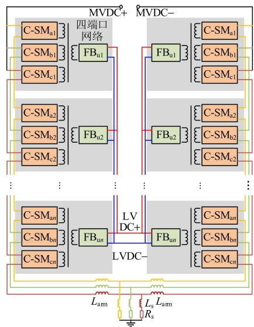  
(a) DBM²C-SST

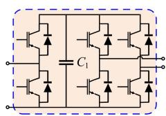  
(b) C-SM

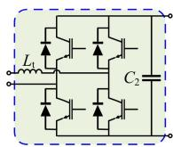  
(c) FB   
图10 四端口网络组成的级联电路  
Fig. 10 A cascaded circuit composed of four-port networks

(quadruple active bridge，QAB)，用来维持C-SM中的电容电压平衡。具体参数见附录C。

本文中，对QAB部分采用移相调制。不同于文献[25]中对C-SM采用的CPS-SPWM调制，本文算例要考虑四端口网络数 $N_{\mathrm{FPN}}$ 非常大的场景，故采用NLC调制。

# 6.1.1 详细建模与等效建模的波形对比

$N_{\mathrm{FPN}}$ 定义为图10(a)中上桥臂或下桥臂拥有的四端口网络(灰底区域)的个数。首先考虑 $N_{\mathrm{FPN}} = 10$ 的情况，对该四端口级联电路分别采用支路级详细建模和四端口网络等效建模。2种模型所采用的仿真算法均用Matlab编写而成。仿真开始前，所有电容电压均初始化至稳态值。仿真开始 $0.05\mathrm{s}$ 后启动子模块电容电压控制。

仿真开始后 $0.1\mathrm{s}$ 内的波形如图11所示，仿真步长为 $2\mu \mathrm{s}$ 。图11(a)为三相桥臂中点电压，图11(b)为A相上桥臂前3个子模块电容电压，图11(c)分

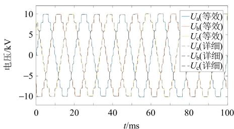  
(a) 三相桥臂中点电压波形对比

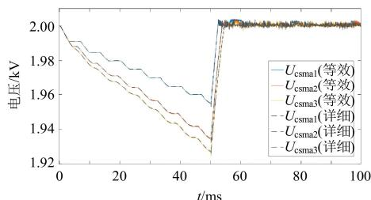  
(b) 子模块电容电压波形对比

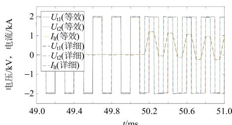  
(c) 高频变压器原、副边电压和漏抗电流波形对比  
图11 $\mathbf{DBM}^2\mathbf{C}$ -SST的等效模型与详细模型的波形对比  
Fig. 11 Waveform comparisons of the equivalent model and the detail model of $\mathbf{DBM}^2\mathbf{C}$ -SST

别是上桥臂第1个四端口网络内高频变压器原、副边电压和漏抗 $L_{\mathrm{t}}$ 上的电流。

由图11可知，等效模型与详细模型具有完全相同的仿真波形。这是由于等效建模过程中，没有采用任何近似处理，只是消去内部节点，并未改变任何电路的代数约束与动态特性。此外，等效后的四端口网络内部的电压电流波形也可通过附加输出方程计算得出。因此等效过程并不影响模型的可观测性，可以满足均压控制等需要等效模型内部状态信息的需求。

# 6.1.2 详细建模与等效建模的效率对比

在一个支路级详细建模的仿真循环中，求解节点电压方程组占据大部分耗时，而电路的节点数对应节点电压方程组的阶数，因此和仿真耗时具有强正相关性。此外，支路数会影响节点导纳矩阵的稀疏度，对求解节点电压方程组效率也有一定影响。更新节点导纳矩阵也会占据一定耗时，因此开关元件数对仿真耗时也有一定的影响。

在一个 $N$ 端口网络等效建模的仿真循环中，由于内部节点已经消去，外部节点数量成为影响求解节点电压方程耗时的主要因素。又由于开关元件被隐藏到 $N$ 端口网络等效电路内部，节点导纳矩阵更新过程从以开关为单元变成以等效电路为单元，因此等效电路的个数和端口数也会影响仿真耗时。

仿真时长重新设置为 $0.01\mathrm{s}$ ，仿真步长选取为 $2\mu \mathrm{s}$ 。四端口网络数 $N_{\mathrm{FPN}}$ 分别取10、20、50、100、200、500时，对详细模型和等效模型的仿真耗时进行测试统计。详细模型所有仿真循环的整体耗时以及各个部分耗时如表1所示。等效模型所有仿真循环的整体耗时以及各个部分耗时如表2所示。

由表1可知，对于详细模型而言，仿真过程中计算节点电压方程组占据 $50\% \sim 80\%$ 左右的耗时，

表 1 DBM²C-SST 详细模型仿真耗时  
Table 1 Time cost of the DBM²C-SST detail model   

<table><tr><td>参数</td><td colspan="6">NFPN=10NFPN=20NFPN=50NFPN=100NFPN=200NFPN=500</td></tr><tr><td>总耗时/s</td><td>4.92</td><td>6.74</td><td>12.10</td><td>21.25</td><td>42.71</td><td>121.44</td></tr><tr><td>控制系统/s</td><td>0.11</td><td>0.11</td><td>0.11</td><td>0.11</td><td>0.14</td><td>0.14</td></tr><tr><td>开关调制/s</td><td>0.63</td><td>0.63</td><td>0.66</td><td>0.80</td><td>1.13</td><td>1.61</td></tr><tr><td>重构YN/s</td><td>0.35</td><td>0.38</td><td>0.56</td><td>1.10</td><td>2.79</td><td>11.34</td></tr><tr><td>计算IN/s</td><td>0.39</td><td>0.42</td><td>0.47</td><td>0.58</td><td>0.91</td><td>1.60</td></tr><tr><td>求解VN/s</td><td>2.43</td><td>4.14</td><td>8.92</td><td>16.70</td><td>34.48</td><td>100.23</td></tr><tr><td>计算Ub、Ib/s</td><td>0.55</td><td>0.61</td><td>0.93</td><td>1.49</td><td>2.69</td><td>5.87</td></tr><tr><td>计算Ib/s</td><td>0.18</td><td>0.17</td><td>0.17</td><td>0.19</td><td>0.23</td><td>0.28</td></tr><tr><td>更新记录/s</td><td>0.24</td><td>0.24</td><td>0.23</td><td>0.25</td><td>0.30</td><td>0.33</td></tr></table>

表 2 DBM²C-SST 等效模型仿真耗时  
Table 2 Time cost of the DBM ${}^{2}\mathrm{C}$ -SST equivalent model   

<table><tr><td>参数</td><td colspan="6">NFPN=10NFPN=20NFPN=50NFPN=100NFPN=200NFPN=500</td></tr><tr><td>总耗时/s</td><td>3.73</td><td>3.92</td><td>4.62</td><td>5.61</td><td>8.05</td><td>16.75</td></tr><tr><td>控制系统/s</td><td>0.11</td><td>0.11</td><td>0.11</td><td>0.11</td><td>0.11</td><td>0.11</td></tr><tr><td>开关调制/s</td><td>0.54</td><td>0.56</td><td>0.62</td><td>0.66</td><td>0.81</td><td>1.32</td></tr><tr><td>选择ABCD/s</td><td>0.74</td><td>0.74</td><td>0.77</td><td>0.83</td><td>0.97</td><td>1.70</td></tr><tr><td>重构Yn/s</td><td>0.19</td><td>0.21</td><td>0.26</td><td>0.40</td><td>0.86</td><td>3.38</td></tr><tr><td>计算In/s</td><td>0.42</td><td>0.43</td><td>0.46</td><td>0.50</td><td>0.62</td><td>0.97</td></tr><tr><td>求解Vn/s</td><td>0.38</td><td>0.45</td><td>0.72</td><td>1.12</td><td>1.97</td><td>4.36</td></tr><tr><td>计算Up、Ip/s</td><td>0.54</td><td>0.60</td><td>0.81</td><td>1.11</td><td>1.74</td><td>3.69</td></tr><tr><td>计算Uo、Io/s</td><td>0.23</td><td>0.23</td><td>0.23</td><td>0.24</td><td>0.26</td><td>0.32</td></tr><tr><td>计算Ih/s</td><td>0.40</td><td>0.41</td><td>0.44</td><td>0.45</td><td>0.51</td><td>0.70</td></tr><tr><td>更新记录/s</td><td>0.15</td><td>0.15</td><td>0.16</td><td>0.15</td><td>0.16</td><td>0.17</td></tr><tr><td>总体加速比</td><td>1.32</td><td>1.72</td><td>2.62</td><td>3.79</td><td>5.31</td><td>7.25</td></tr><tr><td>求解Vn加速比</td><td>6.35</td><td>9.11</td><td>12.34</td><td>14.92</td><td>17.46</td><td>23.00</td></tr></table>

且规模越大比例越高。由表2可知，同样拓扑下，等效模型求解节点电压方程组所用时间远小于详细模型，且规模越大，等效模型相比详细模型的加速比越大。

# 6.2 三相MMC

本文所提通用等效建模方法同样适用于单端口级联的MMC，具体参数见附录C。根据等效范围不同，可以分别建立子模块等效模型和桥臂等效模型。由于MMC的子模块本身只有3个节点，等效后剩余2个端口节点，对于降低计算量有限，仅作为对比。经典的MMC桥臂等效模型将各个桥臂上的所有子模块等效为一个单端口网络等效模型，。

# 6.2.1 详细建模与等效建模的波形对比

算例拓扑采用典型的半桥子模块组成的三相MMC。仿真开始前，所有电容电压均初始化至稳态值。仿真开始 $0.05\mathrm{s}$ 后交流负载电阻缩小1/2。仿真开始后 $0.1\mathrm{s}$ 内的波形如图12所示，仿真步长为 $2\mu \mathrm{s}$ 。图12(a)为三相桥臂中点电压，图12(b)为三相交流负载上的电流，图12(c)为A相上桥臂前3个子模块电容电压。

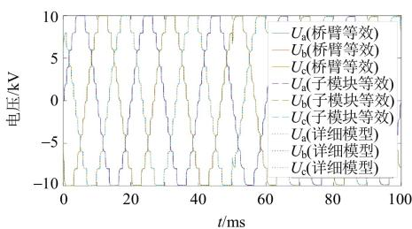  
(a) 三相桥臂中点电压波形对比

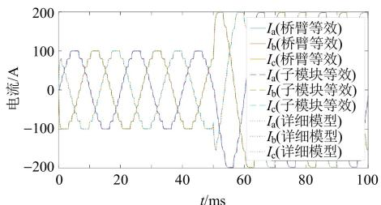  
(b) 交流负载电流波形对比

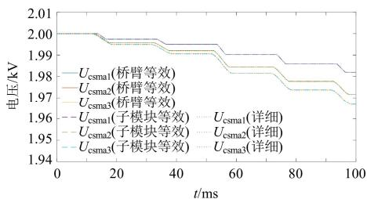  
(c) 子模块电容电压波形对比  
图12 MMC的等效模型与详细模型的波形对比  
Fig. 12 Waveform comparisons of the equivalent model and the detail model of MMC

同前文算例结果一样，2种等效模型与详细模型具有完全相同的仿真波形，再次验证等效方法不改变模型精度的结论。

# 6.2.2 详细建模与等效建模的效率对比

仿真时长设置为 $0.1\mathrm{s}$ ，仿真步长选取为 $2\mu \mathrm{s}$ 。子模块数NSM分别取10、20、50、100、200、500时，对详细模型和2种等效模型的仿真耗时进行测试统计。3种模型所有仿真循环的整体耗时以及各个部分耗时如表3所示。

表 3 MMC 的 2 种等效模型与详细模型的效率对比  
Table 3 Efficiency comparisons of two equivalent models and the detail model of MMC   

<table><tr><td>模型</td><td>NSM</td><td>总耗时/s</td><td>求解Vn/s</td><td>总体加速比</td></tr><tr><td rowspan="6">详细模型</td><td>10</td><td>12.03</td><td>2.44</td><td>—</td></tr><tr><td>20</td><td>15.63</td><td>3.83</td><td>—</td></tr><tr><td>50</td><td>27.24</td><td>8.14</td><td>—</td></tr><tr><td>100</td><td>43.08</td><td>14.43</td><td>—</td></tr><tr><td>200</td><td>79.06</td><td>28.17</td><td>—</td></tr><tr><td>500</td><td>216.90</td><td>79.60</td><td>—</td></tr><tr><td rowspan="6">子模块等效模型</td><td>10</td><td>8.78</td><td>1.82</td><td>1.37</td></tr><tr><td>20</td><td>10.89</td><td>2.58</td><td>1.44</td></tr><tr><td>50</td><td>17.29</td><td>4.89</td><td>1.58</td></tr><tr><td>100</td><td>27.25</td><td>8.59</td><td>1.58</td></tr><tr><td>200</td><td>50.14</td><td>17.12</td><td>1.58</td></tr><tr><td>500</td><td>133.4</td><td>47.16</td><td>1.63</td></tr></table>

续表  

<table><tr><td>模型</td><td>NSM</td><td>总耗时/s</td><td>求解Vn/s</td><td>总体加速比</td></tr><tr><td rowspan="6">桥臂等效模型</td><td>10</td><td>5.47</td><td>0.86</td><td>2.20</td></tr><tr><td>20</td><td>5.87</td><td>0.92</td><td>2.66</td></tr><tr><td>50</td><td>5.17</td><td>0.79</td><td>5.27</td></tr><tr><td>100</td><td>5.7</td><td>0.87</td><td>7.56</td></tr><tr><td>200</td><td>6.06</td><td>0.9</td><td>13.05</td></tr><tr><td>500</td><td>7.36</td><td>1.01</td><td>29.47</td></tr></table>

由表3可知，MMC详细模型在仿真循环中求解节点电压方程组的耗时仍占据较大比重；子模块等效模型对仿真效率提升有限，加速比不超过2倍；而桥臂等效模型能显著降低求解节点电压方程组的耗时，在500个子模块时的加速比接近30倍。

# 7 结论

本文从电路和离散系统的双重视角出发，推导出 $N$ 端口网络的等效电路模型与离散状态空间模型，并得到如下结论：

1）本文所提等效建模方法既可以用于单端口子模块级联形成的MMC拓扑，也可以用于多端口子模块级联形成的DBM²C-SST拓扑；  
2)在 $\mathrm{DBM}^2\mathrm{C}$ -SST和MMC两种级联拓扑的仿真中，本文所提等效模型与原始的详细模型具有相同的仿真精度；  
3）本文所提等效模型相比原始的详细模型具有更高的仿真效率，且子模块数越多，等效模型的加速效果约明显。

本文所提方法可以为电磁暂态仿真平台开发者提供一种新的模型开发思路，使得用户自定义等效模块的内部拓扑以及级联方式成为可能，无需再由厂家对各类级联型设备分别开发专用等效模型，可以提升电磁暂态仿真平台对各类新型复杂电力电子系统的适用性。

# 参考文献

[1] 王成山，李鹏，王立伟．电力系统电磁暂态仿真算法研究进展[J].电力系统自动化，2009，33(7)：97-103.WANGChengshan，LI Peng，WANG Liwei．Progresseson algorithm of electromagnetic transient simulation forelectric power system[J].Automation of Electric Power Systems，2009，33(7):97-103 (in Chinese).  
[2] 沈沉，黄少伟，陈颖. 未来电网的快速建模与仿真方法初探[J]. 电力系统自动化，2011，35(10)：8-15，29. SHEN Chen, HUANG Shaowei, CHEN Ying. Primary studies on fast simulation and modeling for future power systems[J]. Automation of Electric Power Systems, 2011,

35(10): 8-15, 29 (in Chinese).   
[3] 陈颖，高仕林，宋炎侃，等黄少伟，沈沉，于智同．面向新型电力系统的高性能电磁暂态云仿真技术[J].中国电机工程学报，2022，42(8)：2854-2863.  
CHEN Ying, GAO Shilin, SONG Yankan, et al. High-performance electromagnetic transient simulation for new-type power system based on cloud computing [J]. Proceedings of the CSEE, 2022, 42(8): 2854-2863 (in Chinese).   
[4] DOMMEL H W. Digital computer solution of electromagnetic transients in single-and multiphase networks[J]. IEEE Transactions on Power Apparatus and Systems, 1969, PAS-88(4): 388-399.   
[5] DOMMEL H W. EMTP theory book second edition[M]. Comlombia: Micro Tran Power System Analysis Corporation. Comlombia, 1992.   
[6] DEBNATH S, QIN Jiangchao, BAHRANI B, et al. Operation, control, and applications of the modular multilevel converter: a review[J]. IEEE Transactions on Power Electronics, 20154, 30(1): 37-53.   
[7] 赵彪，安峰，宋强，等余占清，曾嵘．双有源桥式直流变压器发展与应用[J].中国电机工程学报，2021，41(1)：288-298.  
ZHAO Biao, AN Feng, SONG Qiang, et al. Development and application of DC transformer based on dual-active-bridge[J]. Proceedings of the CSEE, 2021, 41(1): 288-298 (in Chinese).   
[8] PERALTA J, SAAD H, DENNETIÈRE S, et al. Detailed and averaged models for a 401-level MMC-HVDC system[J]. IEEE Transactions on Power Delivery, 2012, 27(3): 1501-1508.   
[9] 陈武晖，吴明哲，张军，等余浩，梁定康．模块化多电平换流器电磁暂态模型研究综述[J].电网技术，2020，44(12)：4755-4765.  
CHEN Wuhui, WU Mingzhe, ZHANG Jun, et alYU Hao. Review of Electromagnetic transient modeling of modular multilevel converters[J]. Power System Technology, 2020, 44(12): 4755-4765 (in Chinese).   
[10] GNANARATHNA UN, GOLE A M, JAYASINGHE R P. Efficient modeling of modular multilevel HVDC converters (MMC) on electromagnetic transient simulation programs[J]. IEEE Transactions on Power Delivery, 20110, 26(1): 316-324.   
[11] 罗雨，饶宏，许树楷，等黎小林. 级联多电平换流器的高效仿真模型[J]. 中国电机工程学报，2014，34(15)：2346-2352.  
LUO Yu, RAO Hong, XU Shukai, et al. Efficient modeling for cascading multilevel converters [J]. Proceedings of the CSEE, 2014, 34(15): 2346-2352 (in Chinese).   
[12] 许建中，赵成勇，Aniruddha M GOLE A M. 模块化多电平换流器戴维南等效整体建模方法[J]. 中国电机工程学报，2015，35(8)：1919-1929.  
XU Jianzhong, ZHAO Chengyong, GOLE A M. Research

on the ThevenonThévenin's equivalent based integral modelling method of the modular multilevel converter (MMC)[J]. Proceedings of the CSEE, 2015, 35(8): 1919-1929 (in Chinese).   
[13] 周月宾，饶宏，许树楷，等罗雨，黎小林．一种二极管箱位型MMC的高效等值建模方法[J].中国电机工程学报，2016，36(7)：1925-1932.  
ZHOU Yuebin, RAO Hong, XU Shukai, et al. An equivalent efficient modeling approach for diode clamp sub-module based MMC[J]. Proceedings of the CSEE, 2016, 36(7): 1925-1932 (in Chinese).   
[14] XIANG Wang, LIN Weixing, AN Ting, et al. Equivalent electromagnetic transient simulation model and fast recovery control of overhead VSC-HVDC based on SB-MMC[J]. IEEE Transactions on Power Delivery, 20176, 32(2): 778-788.   
[15] OU Kaijian, RAO Hong, CAI Zexiang, et al. MMC-HVDC simulation and testing based on real-time digital simulator and physical control system[J]. IEEE Journal of Emerging and Selected Topics in Power Electronics, 2014, 2(4): 1109-1116.   
[16] SAAD H, OULD-BACHIR T, MAHSEREDJIAN J, et al. Real-time simulation of MMCs using CPU and FPGA[J]. IEEE Transactions on Power Electronics, 20153, 30(1): 259-267.   
[17] GOETZ S M, PETERCHEV A V, WEYH T. Modular multilevel converter with series and parallel module connectivity: topology and control[J]. IEEE Transactions on Power Electronics, 20154, 30(1): 203-215.   
[18] GOETZ S M, LI Zhongxi, LIANG Xinyu, et al. Control of modular multilevel converter with parallel connectivity —: application to battery systems[J]. IEEE Transactions on Power Electronics, 20176, 32(11): 8381-8392.   
[19] GAO Congzhe, LIU Xiangdong, LIU Jingyun, et al. Multilevel converter with capacitor voltage actively balanced using reduced number of voltage sensors for high power applications[J]. IET Power Electronics, 2016, 9(7): 1462-1473.   
[20] 赵禹辰，徐义良，赵成勇，等许建中．单端口子模块MMC电磁暂态通用等效建模方法[J].中国电机工程学报，2018，38(167)：4658-4667.  
ZHAO Yuchen, XU Yiliang, ZHAO Chengyong, et al. Generalized electromagnetic transient (EMT) equivalent modeling of MMCs with arbitrary single-port sub-module structures[J]. Proceedings of the CSEE, 2018, 38(16): 4658-4667 (in Chinese).   
[21] 徐义良，赵成勇，赵禹辰，等石璐，许建中．双端口子模块MMC电磁暂态通用等效建模方法[J].中国电机工程学报，2018，38(20)：6079-6090.  
XU Yiliang, ZHAO Chengyong, ZHAO Yuchen, et al. Generalized electromagnetic transient (EMT) equivalent modeling of MMCs with arbitrary two-port sub-module structures[J]. Proceedings of the CSEE, 2018, 38(20): 6079-6090 (in Chinese).

[22] 许建中，徐义良，赵禹辰，等赵成勇．多类型子模块MMC电磁暂态通用建模和实现方法[J].电网技术，2019，43(6)：2039-2048.  
XU Jianzhong, XU Yiliang, ZHAO Yuchen, et al. Generalized electromagnetic transient equivalent modeling and implementation of MMC with arbitrary multi-type submodule structures[J]. Power System Technology, 2019, 43(6): 2039-2048 (in Chinese).   
[23] GU Chunyang, ZHENG Zedong, XU Lie, et al. Modeling and control of a multiport power electronic transformer (PET) for electric traction applications[J]. IEEE Transactions on Power Electronics, 20165, 31(2): 915-927.   
[24] FALCONES S, AYYANAR R, MAO Xiaolin. A DC-DC multiport-converter-based solid-state transformer integrating distributed generation and storage[J]. IEEE Transactions on Power Electronics, 20132, 28(5): 2192-2203.   
[25] TENG Jiaxun, SUN Xiaofeng, ZHANG Yongrui, et al. Two types of common-mode voltage suppression in medium voltage motor speed regulation system based on solid state transformer with dual DC bus[J]. IEEE Transactions on Power Electronics, 20221, 37(6): 7082-7099.   
[26] LI Zirun, XU Jin, WANG Keyou, et al. An FPGA-based hierarchical parallel real-time simulation method for cascaded solid-state transformer[J]. IEEE Transactions on Industrial Electronics, 20232, 70(4): 3847-3856.   
[27] 许建中，高晨祥，丁江萍，等冯谟可，王晓婷，赵成勇. 高频隔离型电力电子变压器电磁暂态加速仿真方法与展望[J]. 中国电机工程学报，2021，41(10)：3466-3479. XU Jianzhong, GAO Chenxiang, DING Jiangping, et al. Electromagnetic transient acceleration simulation methods and prospects of high-frequency isolated power electronic transformer[J]. Proceedings of the CSEE, 2021, 41(10): 3466-3479 (in Chinese).

# 附录A 半桥子模块状态空间表达式的推导过程

对于图2(b)中的半桥子模块的等效电路，不考虑历史电流源时，端口注入电流 $I$ 在 $R_{2}$ 上产生的电压为

$$
R _ {2} \frac {R _ {1} + 1 / Y _ {\mathrm {e q}}}{R _ {1} + 1 / Y _ {\mathrm {e q}} + R _ {2}} I
$$

不考虑端口注入电流时，历史电流源 $I_{\mathrm{h}}$ 在 $R_{2}$ 上产生的电压为

$$
- R _ {2} \frac {1 / (R _ {1} + R _ {2})}{1 / (R _ {1} + R _ {2}) + Y _ {\mathrm {e q}}} I _ {\mathrm {h}}
$$

根据电路的叠加定律，得：

$$
U = R _ {2} \frac {R _ {1} + 1 / Y _ {\mathrm {e q}}}{R _ {1} + 1 / Y _ {\mathrm {e q}} + R _ {2}} I - R _ {2} \frac {1 / (R _ {1} + R _ {2})}{1 / (R _ {1} + R _ {2}) + Y _ {\mathrm {e q}}} I _ {\mathrm {h}} \tag {A1}
$$

整理得：

$$
I (t) = \frac {1}{R _ {1} Y _ {\mathrm {e q}} + 1} I _ {\mathrm {h}} (t) + \frac {R _ {1} Y _ {\mathrm {e q}} + R _ {2} Y _ {\mathrm {e q}} + 1}{R _ {1} R _ {2} Y _ {\mathrm {e q}} + R _ {2}} U (t) \tag {A2}
$$

状态空间方程中的输出方程证毕。

另外，若采用后向欧拉法进行数值积分代换，则子模块电容电压的历史电流源可以表示为

$$
I _ {\mathrm {h}} (t) = - Y _ {\mathrm {e q}} U _ {\mathrm {C}} (t - \Delta t) \tag {A3}
$$

同样根据电路的叠加定律，可得：

$$
U _ {\mathrm {C}} = \frac {1}{Y _ {\mathrm {e q}}} \frac {R _ {2}}{R _ {1} + 1 / Y _ {\mathrm {e q}} + R _ {2}} I - \frac {1}{1 / (R _ {1} + R _ {2}) + Y _ {\mathrm {e q}}} I _ {\mathrm {h}} \tag {A4}
$$

代入式(A3)，可得：

$$
I _ {\mathrm {h}} (t) = - \frac {R _ {2}}{\left(R _ {1} + R _ {2}\right) + 1 / Y _ {\mathrm {e q}}} I (t - \Delta t) +
$$

$$
\frac {Y _ {\mathrm {e q}}}{1 / \left(R _ {1} + R _ {2}\right) + Y _ {\mathrm {e q}}} I _ {\mathrm {h}} (t - \Delta t) \tag {A5}
$$

将式(A2)代入式(A5)，可得：

$$
I _ {\mathrm {h}} (t) = \frac {R _ {1} Y _ {\mathrm {e q}}}{R _ {1} Y _ {\mathrm {e q}} + 1} I _ {\mathrm {h}} (t - \Delta t) + \frac {- Y _ {\mathrm {e q}}}{R _ {1} Y _ {\mathrm {e q}} + 1} U (t - \Delta t) \tag {A6}
$$

状态空间方程中的状态方程证毕。式(A2)和(A6)共同组成了式(4)的一阶离散系统的状态空间表达式。

# 附录BDAB状态空间表达式的推导过程

完整的等效建模需要对不同开关状态下的状态空间表达式系数矩阵分别进行计算。此处只以图B1(a)所示的开关状态为例(灰色开关断开，其他开关闭合)进行说明。

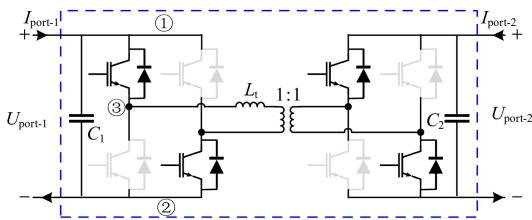

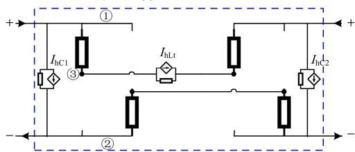  
(a) DAB 电路  
(b) 等效电路  
图B1 DAB的电路模型  
Fig. B1 Circuit model of DAB

开关二值电阻模型参数：导通导纳 $Y_{\mathrm{swon}}$ ，关断导纳0；左端电容 $C_1$ ，右端电容 $C_2$ ；变压器漏感 $L_{\mathrm{t}}$ 。动态元件编号顺序为 $C_1$ ， $C_2$ ， $L_{\mathrm{t}}$ 。

$M_{\mathrm{nh}}$ 描述动态元件的历史电流源与网络内部节点的连接关系：

$$
\boldsymbol {M} _ {\mathrm {n h}} = \left[ \begin{array}{c c c} - 1 & 0 & 0 \\ 1 & 0 & 0 \\ 0 & 0 & - 1 \\ 0 & 0 & 1 \\ 0 & - 1 & 0 \\ 0 & 1 & 0 \end{array} \right]
$$

第1列表示 $C_1$ 的历史电流源流出节点1，流入节点2；第2列表示 $C_2$ 的历史电流源流出节点5，流入节点6；第3列表示 $L_{\mathrm{t}}$ 的历史电流源流出节点3，流入节点4。 $M_{\mathrm{np}}$ 描述了网络端口与其内部节点的连接关系：

$$
\boldsymbol {M} _ {\mathrm {n p}} = \left[ \begin{array}{l l} 1 & 0 \\ - 1 & 0 \\ 0 & 0 \\ 0 & 0 \\ 0 & 1 \\ 0 & - 1 \end{array} \right]
$$

第1列表示端口1(左)的电流正方向为流入节点1，流出节点2；

第2列表示端口2(右)的历史正方向为流入节点5，流出节点6。

以上信息均属于网表信息，为已知信息。以下属于计算机在仿真开始前构建等效模型的预处理过程。

如果采用后向欧拉法，则左端电容等效导纳 $Y_{\mathrm{cl}} = C_1 / \mathrm{d}t$

$$
\boldsymbol {Y} _ {\mathrm {n}} = \left[ \begin{array}{c c c} Y _ {\mathrm {c l}} + Y _ {\mathrm {s w o n}} & - Y _ {\mathrm {c l}} & - Y _ {\mathrm {s w o n}} \\ - Y _ {\mathrm {c l}} & Y _ {\mathrm {c l}} + Y _ {\mathrm {s w o n}} & \\ - Y _ {\mathrm {s w o n}} & & Y _ {\mathrm {L t}} + Y _ {\mathrm {s w o n}} \\ & & - Y _ {\mathrm {L t}} \end{array} \right.
$$

根据定义， $M_{\mathrm{hn}} = -M_{\mathrm{nh}}^{\mathrm{T}}, M_{\mathrm{pn}} = M_{\mathrm{np}}^{\mathrm{T}}$ ，进而可以计算出4个阻抗矩阵：

$$
\left\{ \begin{array}{l} \boldsymbol {Z} _ {\mathrm {p p}} = \boldsymbol {M} _ {\mathrm {p n}} \boldsymbol {Y} _ {\mathrm {n}} ^ {- 1} \boldsymbol {M} _ {\mathrm {n p}} \\ \boldsymbol {Z} _ {\mathrm {p h}} = \boldsymbol {M} _ {\mathrm {p n}} \boldsymbol {Y} _ {\mathrm {n}} ^ {- 1} \boldsymbol {M} _ {\mathrm {n h}} \\ \boldsymbol {Z} _ {\mathrm {h p}} = \boldsymbol {M} _ {\mathrm {h n}} \boldsymbol {Y} _ {\mathrm {n}} ^ {- 1} \boldsymbol {M} _ {\mathrm {n p}} \\ \boldsymbol {Z} _ {\mathrm {h h}} = \boldsymbol {M} _ {\mathrm {h n}} \boldsymbol {Y} _ {\mathrm {n}} ^ {- 1} \boldsymbol {M} _ {\mathrm {n h}} \end{array} \right.
$$

最终可以计算出图B1(a)开关状态下，状态方程表达式的4个系数矩阵：

$$
\left\{ \begin{array}{l} \boldsymbol {A} = (\boldsymbol {Y} _ {\text {c o e f}} + \boldsymbol {K} _ {\text {c o e f}} \boldsymbol {Y} _ {\text {e q}}) (\boldsymbol {Z} _ {\text {h h}} - \boldsymbol {Z} _ {\text {h p}} \boldsymbol {Z} _ {\text {p p}} ^ {- 1} \boldsymbol {Z} _ {\text {p h}}) + \boldsymbol {K} _ {\text {c o e f}} \\ \boldsymbol {B} = (\boldsymbol {Y} _ {\text {c o e f}} + \boldsymbol {K} _ {\text {c o e f}} \boldsymbol {Y} _ {\text {e q}}) \boldsymbol {Z} _ {\text {h p}} \boldsymbol {Z} _ {\text {p p}} ^ {- 1} \\ \boldsymbol {C} = - \boldsymbol {Z} _ {\text {p p}} ^ {- 1} \boldsymbol {Z} _ {\text {p h}} \\ \boldsymbol {D} = \boldsymbol {Z} _ {\text {p p}} ^ {- 1} \end{array} \right.
$$

按照以上步骤，遍历所有可能的开关状态，得到所有开关状态对应的状态空间表达式，才算完成该DAB电路的通用等效建模。

仿真循环过程中，计算机根据开关状态选择调用对应的系数矩阵即可，无需重复计算 $A$ 、 $B$ 、 $C$ 、 $D$ 。

# 附录C算例拓扑电路参数

表 C1 DBM²C-SST 模型参数  
Table A1 Model parameters of the DBM²C-SST   

<table><tr><td>参数</td><td>数值</td><td>参数</td><td>数值</td></tr><tr><td>桥臂电感 Larm/mH</td><td>10</td><td>C-SM电容 C1/mF</td><td>5</td></tr><tr><td>交流侧电感 Ls/mH</td><td>10</td><td>FB电容 C2/mF</td><td>5</td></tr><tr><td>交流侧电阻 Rs/Ω</td><td>100</td><td>高频变压器变比 K1/μH</td><td>1:1</td></tr></table>

右端电容 $Y_{\mathrm{c2}} = C_2 / \mathrm{d}t$ ；变压器漏感等效导纳 $Y_{\mathrm{Lt}} = \mathrm{d}t / L_{\mathrm{t}}$ 。这3个动态元件等效导纳组成的矩阵为

$$
\boldsymbol {Y} _ {\mathrm {e q}} = \left[ \begin{array}{c c c} Y _ {\mathrm {c} 1} & & \\ & Y _ {\mathrm {c} 2} & \\ & & Y _ {\mathrm {L} \mathrm {t}} \end{array} \right]
$$

这3个动态元件的历史电流源表达式的矩阵形式如下：

$$
\boldsymbol {I} _ {\mathrm {h}} (t) = \boldsymbol {Y} _ {\text {c o e f}} \boldsymbol {U} _ {\mathrm {b}} (t - \Delta t) + \boldsymbol {K} _ {\text {c o e f}} \boldsymbol {I} _ {\mathrm {b}} (t - \Delta t)
$$

其中：

$$
\left\{ \begin{array}{l} \boldsymbol {Y} _ {\text {c o e f}} = \left[ \begin{array}{c c c} - Y _ {\mathrm {c} 1} & & \\ & - Y _ {\mathrm {c} 2} & \\ & & 0 \end{array} \right] \\ \boldsymbol {K} _ {\text {c o e f}} = \left[ \begin{array}{c c c} 0 & & \\ & 0 & \\ & & 1 \end{array} \right] \end{array} \right.
$$

节点导纳矩阵可根据图B1(b)构建，其过程和传统EMTP相同，不再赘述，直接列写结果：

$$
\left. \begin{array}{c c c} - Y _ {\mathrm {L t}} & & \\ Y _ {\mathrm {L t}} + Y _ {\mathrm {s w o n}} & - Y _ {\mathrm {s w o n}} & \\ - Y _ {\mathrm {s w o n}} & Y _ {\mathrm {c 2}} + Y _ {\mathrm {s w o n}} & - Y _ {\mathrm {c 2}} \\ & - Y _ {\mathrm {c 2}} & Y _ {\mathrm {c 2}} + Y _ {\mathrm {s w o n}} \end{array} \right]
$$

续表  
表 C2 MMC 模型参数  

<table><tr><td>参数</td><td>数值</td><td>参数</td><td>数值</td></tr><tr><td>中压DC母线Umtdc/kV</td><td>20</td><td>高频变压器漏感Lt</td><td>160</td></tr><tr><td>低压DC母线Ulvde/kV</td><td>20/NFPN</td><td>高频变压器频率/kHz</td><td>5</td></tr></table>

Table C2 Model parameters of the MMC   

<table><tr><td>参数</td><td>数值</td><td>参数</td><td>数值</td></tr><tr><td>桥臂电感 Larm/mH</td><td>10</td><td>子模块电容 Csm/mF</td><td>50</td></tr><tr><td>交流侧电感 Ls/mH</td><td>10</td><td>DC母线电压/kV</td><td>20</td></tr><tr><td>交流侧电阻 Rk/Ω</td><td>100</td><td>-</td><td>-</td></tr></table>

  
徐晋

收稿日期：2022-11-23。

作者简介：

徐晋(1991)，男，助理教授，研究方向为电力系统分析、新能源接入、实时仿真与建模等，xujin20506@sjtu.edu.cn;

吴盼(1995)，男，博士研究生，研究方向为新能源建模与实时仿真，Panghuwu@sjtu.edu.cn;

*通信作者：汪可友(1979)，男，博士，教授，研究方向为电力系统动态与稳定计算方法、柔性输电等，wangkeyou@sjtu.edu.cn。

(编辑 刘雪莹，李璇)

# A General Equivalent Modeling Method of $N$ -port Networks Suitable for the Electromagnetic Transient Simulation of Cascading Power Electronic Topologies

XU Jin, WU Pan, WANG Keyou, GAO Chenxiang., LI Zirun

(Key Laboratory of Control of Power Transmission and Conversion, Ministry of Education (Shanghai Jiao Tong University))

KEY WORDS: cascaded; power electronic; electromagnetic transient simulation; $N$ -port networks; equivalent modeling

Cascaded power electronic devices can withstand high voltage and large capacity, thus having a wide potential application in the power system. The Modular Multilevel Converter (MMC) has a mature equivalent modeling method and is masked in the model library of the main real-time simulation platforms. In the meanwhile, more other cascaded topologies are lack of support for the equivalent modeling. This paper proposes a general equivalent modeling method for power electronic devices which are cascaded in any way with submodules of any topologies.

Taking a dual active bridge (DAB) circuit as an example (in Fig. 1), the equivalent discretized circuit can be regarded as a three-order discrete system with two inputs and two outputs. The state space expression of this discrete system can be written as follows:

$$
\left\{ \begin{array}{l} \boldsymbol {I} _ {\mathrm {h}} (t) = \boldsymbol {A} _ {3 \times 3} \boldsymbol {I} _ {\mathrm {h}} (t - \Delta t) + \boldsymbol {B} _ {3 \times 2} \boldsymbol {U} _ {\text {p o r t}} (t - \Delta t) \\ \boldsymbol {I} _ {\text {p o r t}} (t) = \boldsymbol {C} _ {2 \times 3} \boldsymbol {I} _ {\mathrm {h}} (t) + \boldsymbol {D} _ {2 \times 2} \boldsymbol {U} _ {\text {p o r t}} (t) \end{array} \right. \tag {1}
$$

where the bold italic symbol represents a matrix or vector; State matrix $A$ , input matrix $B$ , output matrix $C$ and feedforward matrix $D$ are all described by subscripts. The input variable $U_{\mathrm{port}}$ and the output variable $I_{\mathrm{port}}$ represent port voltage and port current respectively, and each contains two elements. The state variable $I_{\mathrm{h}}$ contains three elements $I_{\mathrm{hC1}}$ , $I_{\mathrm{hC2}}$ and $I_{\mathrm{hL}}$ , which are the

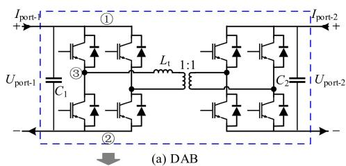

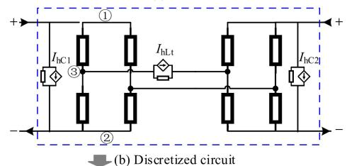

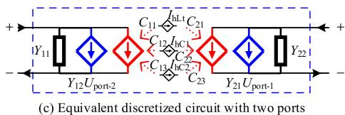  
Fig. 1 Equivalent circuit model of DAB

primary side capacitance, secondary side capacitance and the historical current source of transformer leakage inductance respectively.

The case study shows that the proposed method can not only improve the simulation efficiency by eliminating the internal nodes of the submodule, but also apply to the customized topology structure and cascading mode of the submodule, which is more flexible and general than the traditional equivalent modeling method. The existing MMC equivalent modeling method can be regarded as a special case of the general method proposed in this paper.