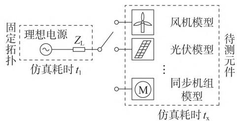
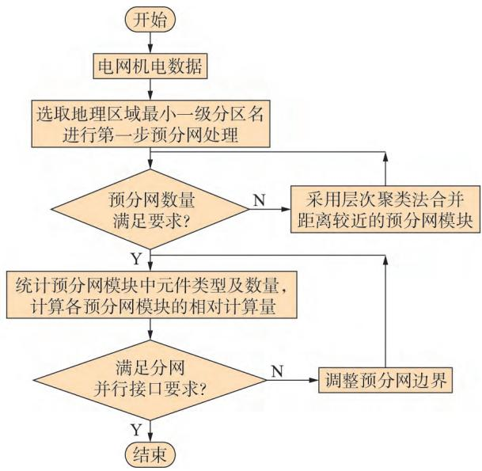
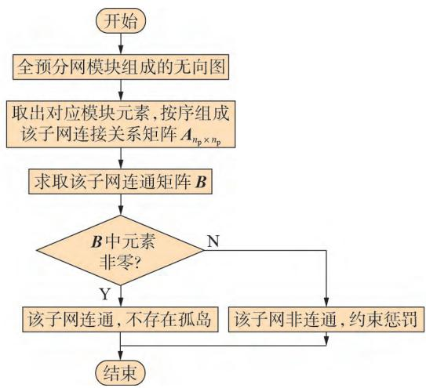
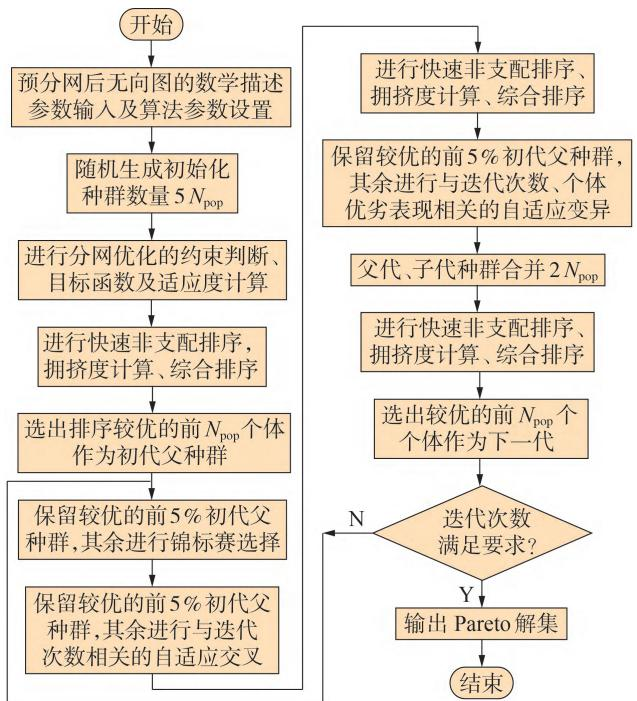
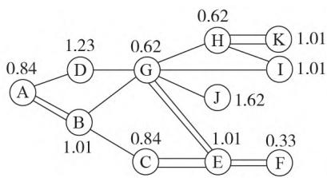
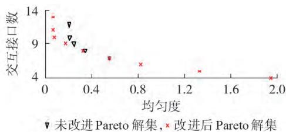
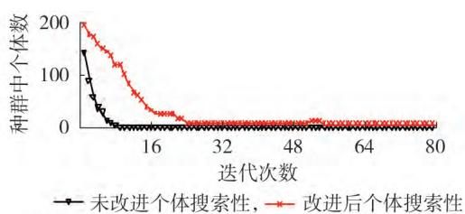

# 新能源高占比电力系统电磁暂态并行仿真的优化分网方法

崔晓丹1，2 ，吴家龙1 ，许剑冰1，2 ，冯佳期1 ，王彦品1 ，邓 馗1

（1. 南瑞集团（国网电力科学研究院）有限公司，江苏 南京 211106；  
智能电网保护和运行控制国家重点实验室，江苏 南京 ）

摘要：为提升含大规模多类型电力电子设备的大型电力系统电磁暂态仿真效率，提出基于层次聚类预分网、预分网下的聚合分网优化问题数学建模和基于改进非支配排序遗传算法（ - ）优化求解的并行仿真优化分网框架及方法。首先基于层次聚类网络约减对大型系统进行化简，降低原始系统的复杂程度。然后基于典型仿真耗时实测对元件相对计算量进行统一表征，将预分网后的聚合分网问题转化为多目标优化问题。并通过改进 - 得到优化分网的 解集，再基于加权欧氏距离最小值法获得最优分网方案。最后通过对比同一算例系统下不分网、基于 工具的分网以及所提方法的分网结果，验证了所提方法的有效性。

关键词：电磁暂态仿真；并行仿真；分网； - ；多目标优化

中图分类号：

文献标志码：

DOI：10.16081/j.epae.202303011

# 0 引言

随着跨区域联网规模持续扩大和新能源占比不断攀升，电力系统的动态响应多时间尺度耦合且大范围交互影响［1］ 。为准确刻画系统特性，电磁暂态仿真逐步成为把握电网特性的必要手段［2］ 。电磁暂态仿真步长小、计算量大，且采用等值或约减模型又不能准确反映系统动态特性［3］ 。为解决仿真精度及效率相互制约的矛盾，可采用电磁暂态并行仿真技术［4］ ，通过将大系统拆分成多个子系统，充分利用多核处理器并行能力提升仿真效率。当前主流软件、 - 、 、 等均具备并行仿真能力，满足其解耦要求下的并行仿真结果具有很高可信度［5］ 。

在硬件条件一定的情况下，提高并行仿真效率一般有 种途径：改进软件底层并行仿真算法或优化可视化建模界面的网络划分。电磁暂态并行仿真算法通常采用长输电线解耦法［6］ 、多端口戴维南等值法［7⁃8］ 以及节点分裂法［9］ 。并行仿真算法集成于仿真软件底层程序，一般的应用人员难以干预并提升，而依靠优化网络划分的方式提升并行仿真速度却易于在应用层面实现。文献［ ］研究了分网并行仿真时间的表征形式及影响因素，但未提出可行的电网络划分方法；文献［ ］提出一种基于 并行仿真的交流网络划分优化策略，其分区均匀度以交流母线节点数量为依据，该方法仅适用于传统交流电

网。随着风电、光伏、储能等非线性电力电子元件大量接入电力系统，对电网进行小步长电磁暂态仿真时，电网导纳矩阵需要频繁修正，并执行复杂的开关处理算法，以母线节点数来衡量子网计算量的做法，已无法体现新能源模型在仿真过程中的实际资源占用及计算耗时，从而可能导致分网不合理。文献［ ］采用风机模型内部电气节点个数表示其仿真计算资源，虽然比直接用机电尺度的母线节点数量表征更精确，但是缺乏理论或实践依据。文献［ ］基于 进行电网络划分，但所提基于母线节点权重的评估方法不适用于电力电子设备元件。总之，当前的并行网络划分方法存在单纯以节点数进行划分对接口通信效率考虑不足、对于多样化模型的仿真计算量表征不准确等问题，当其应用于新能源高占比电力系统的电磁暂态仿真并行计算时，仍可能存在对大型系统效率提升有限、对不同系统适应性差异大等问题。

为此，本文基于并行仿真原理，分析影响仿真效率的主要因素，并基于典型仿真耗时实测量化评估不同元件相对计算量。针对实际系统规模庞大、节点数多、拓扑复杂等特点，提出面向工程应用的基于层次聚类网络约减的预分网措施，以降低分网问题的复杂程度。在此基础上构建分网优化问题的数学模型，并基于改进非支配排序遗传算法（ -- ， - ）［14］ 和加权欧氏距离最小值法求取最优分网方案。

# 分网并行仿真效率主导因素分析及元件仿真计算量统一表征

# 并行仿真效率的主要影响因素分析

电力系统仿真软件包含可视化模型界面和底层

计算单元，如附录A图A1所示，通过在可视化建模界面将电力系统网络划分为子网 $A _ { 1 } { - } A _ { n _ { \varepsilon } }$ ，然后基于交互接口方式实现并行仿真。其底层运算处理逻辑为：将每个子网生成独立的仿真进程；每个进程在不同的计算核上独立解算；子网之间通过并行接口算法进行解算数据的交互，从而提升仿真速率。

假设将电力系统网络划分为 $n _ { \mathrm { g } }$ 个子网，并且设$\alpha _ { 1 } \backsim \alpha _ { 2 }  \vartriangle { \alpha } _ { 3 }$ 分别为子网 $A _ { 1 } \setminus A _ { 2 } \setminus \cdots \setminus A _ { n _ { a } }$ 的边界点（边界点可以为长线路或者节点）集合，分网并行时将各边界点一分为二，各子网通过边界点进行数据交互。选取任意具有互联关系的3个子网 $A _ { i _ { \mathrm { g } } \setminus A _ { j _ { \mathrm { g } } } \setminus A _ { k _ { \mathrm { g } } } }$ $( i _ { \mathrm { g } } , j _ { \mathrm { g } } , k _ { \mathrm { g } } { \in } [ 1 , n _ { \mathrm { g } } ] )$ ），其中 $A _ { k _ { g } }$ 仅与 $A _ { i _ { \mathrm { g } } } \ A _ { j _ { \mathrm { g } } }$ 有连接关系，如附录A图A2所示。电磁暂态子网 $A _ { k _ { z } }$ 的网络方程［8］可表示为：

$$
\boldsymbol {G} _ {A _ {k _ {\mathrm {g}}}} \boldsymbol {V} _ {A _ {k _ {\mathrm {g}}}} + \boldsymbol {P} _ {A _ {k _ {\mathrm {g}}} A _ {i _ {\mathrm {g}}}} \boldsymbol {i} _ {\alpha_ {i _ {\mathrm {g}}}} - \boldsymbol {P} _ {A _ {k _ {\mathrm {g}}} A _ {j _ {\mathrm {g}}}} \boldsymbol {i} _ {\alpha_ {j _ {\mathrm {g}}}} = \boldsymbol {h} _ {A _ {k _ {\mathrm {g}}}} \tag {1}
$$

式中： $G _ { { A _ { k _ { s } } } }$ 为子网 $A _ { k _ { \mathrm { g } } }$ 的节点导纳矩阵； $V _ { A _ { k _ { s } } }$ 为子网 $A _ { k _ { s } }$ 的节点电压相量； $\mathbf { ; } h _ { { \scriptscriptstyle A } _ { k } }$ 为子网 $A _ { k _ { z } }$ 的等值历史电流源相量； $; i _ { \alpha _ { i _ { \mathrm { g } } } } , i _ { \alpha _ { j _ { \mathrm { g } } } }$ 分别为子网 $A _ { k _ { z } }$ 仅与 $A _ { i _ { \mathrm { s } } } \mathcal { A } _ { j _ { \mathrm { s } } }$ 之间联络电流相量； $P _ { A _ { k _ { g } } A _ { i _ { g } } \setminus P _ { A _ { k _ { g } } A _ { j _ { g } } } }$ 分别为反映 $A _ { k _ { z } }$ 中某些节点与连接电流相量 $i _ { \alpha _ { i _ { s } } } \setminus i _ { \alpha _ { j _ { s } } }$ 关联关系的关联阵。

由式（）可知，影响并行仿真耗时的因素包括如下两部分： $G _ { { _ { A _ { k _ { \mathrm { ~ s ~ } } } } } } V _ { _ { A _ { k _ { \mathrm { ~ s ~ } } } } }$ 表示 $A _ { k _ { s } }$ 的节点电流相量（反映了节点矩阵解算的规模），其复杂程度影响 $A _ { k _ { x } }$ 的仿真时间； $P _ { { A _ { k } } _ { _ { g } } { A _ { i } } _ { _ { g } } } i _ { \alpha _ { i _ { g } } } - P _ { { A _ { k } } _ { _ { g } } { A _ { j _ { g } } } } i _ { \alpha _ { j _ { g } } }$ 表示 $A _ { k _ { x } }$ 与 $A _ { i _ { \mathrm { g } } } \setminus A _ { j _ { \mathrm { g } } }$ 的数据交互，其耗时受并行算法的影响。

令每个子网仿真占用时间为 $t _ { A _ { i . } }$ ，每个子网与外部子网数据交互的时间为 $t _ { \mathrm { c o n } A _ { i _ { * } } }$ ，则并行仿真时间T 为：

$$
T \propto \left[ \max  \left(t _ {A _ {1}}, t _ {A _ {2}}, \dots , t _ {A _ {n _ {\mathrm {g}}}}\right) + \frac {1}{2} \sum_ {i _ {\mathrm {g}} = 1} ^ {n _ {\mathrm {g}}} t _ {\operatorname {c o n} A _ {i _ {\mathrm {g}}}} \right] \tag {2}
$$

由式（）可知，并行仿真总时长受各子网仿真时间和各子网之间数据交互时间的影响。

# 基于典型仿真耗时实测的元件相对计算量统一表征

由 节分析可知，各子网间的仿真规模应尽量均匀，避免不同计算核之间的等待时间。工程上，仿真规模可以通过子网中所有元件的仿真计算量来表征，因此，量化评估元件的仿真计算量是优化分网的前提。

实际电网中各元件因电气主回路、控制环节、控制策略差异，其仿真计算耗时均不同。但从机理或数学模型复杂度以及大量实际仿真结果来看，同一类型（例如传统同步机和新能源机组不同，新能源机

组中风电和光伏不同）且相同详细程度元件（例如新能源模型，一般分为详细模型和平均值模型）的计算复杂度相当，计算量差距很小，而不同类型或同一类型但不同详细程度元件计算量差距较大。因此从实际应用的需求精度考虑，本文认为同一类型且相同详细程度的元件计算复杂度相同，不同类型或同一类型但不同详细程度的元件计算复杂度通过最小仿真系统环境下其实际的相对计算量来表征。

以测量双馈风机模型的相对仿真计算量为例。构建被测元件正常运行的最小仿真系统，由固定拓扑网络和待测元件组成，仿真时接入不同待测元件就可以测出对应元件的相对仿真计算量，如图 所示，图中 $Z _ { \mathrm { L } }$ 为线路阻抗。

  
图1　待测元件相对仿真计算量评估小系统  
Fig.1 Evaluating small system for relative simulation calculation of components to be tested

设置相同的 $\ B / \ B$ 真步长 $t _ { \mathrm { s t e p } }$ 和仿真时长 $T _ { \mathrm { d u r a } }$ 。假设图 小系统的仿真总耗时为 $T _ { \mathrm { c P U } }$ ，是与被测元件无关的固定拓扑的解算耗时 $t _ { 1 }$ 以及待测元件微分代数方程求解耗时 $t _ { \textrm { x } }$ 之和，那么待测元件微分代数方程求解耗时 $t _ { \textrm { x } }$ 为：

$$
t _ {\mathrm {x}} = T _ {\mathrm {C P U}} - t _ {1} \tag {3}
$$

若实际系统有 $n _ { \mathrm { m o d e l } }$ 种待测元件模型，采用上述方法测量出各种待测元件的相对仿真耗时，并将其中最大元件耗时作为基准值 $T _ { \mathrm { { B } } }$ 对各待测元件相对仿真耗时进行标幺化，得到各种元件相对仿真计算量，如式（）所示。

$$
c _ {i _ {\text {m o d e l}} \mathrm {p u}} = \frac {t _ {\mathrm {x} i _ {\text {m o d e l}}}}{T _ {\mathrm {B}}} = \frac {T _ {\mathrm {C P U} i _ {\text {m o d e l}}} - t _ {1}}{T _ {\mathrm {B}}} \tag {4}
$$

式中： $: c _ { i _ { \mathrm { m o d e l } } } \mathrm { l e l } : \left. \begin{array} { r l } & { \cdot } \\ & { \cdot } \end{array} \right. \overline { { 1 , { n } _ { \mathrm { m o d e l } } } } \mathrm { l } \left) \right)$ 为第 $i _ { \mathrm { m o d e l } }$ 种待测元件相对仿真计算量 $\mathbf { ; } t _ { \mathrm { x } i _ { \mathrm { m o d e l } } }$ 为第 $i _ { \mathrm { m o d e l } }$ 种待测元件仿真耗时；$T _ { \mathrm { { c P U } } i _ { \mathrm { { m o d e l } } } }$ 为第 $i _ { \mathrm { m o d e l } }$ 种待测元件仿真总耗时。

以 仿真工具为例，测试各复杂元件的相对仿真计算量。为使结果具有可比性，测试条件设置一致，仿真时长为 ，仿真步长为 $5 0 ~ \mu \mathrm { s }$ ，结果如附录 表 所示。

由表可知，不同元件或同一元件不同详细程度模型的仿真计算量差异较大，后文对元件仿真计算量均采用附录 表 中标幺值进行量化表征。另外，对应用精度较高的场合，还可以将元件的种类划

分为更细致的分类，例如，需要体现出不同厂家因控制原理、控制策略差异较大导致元件模型计算复杂度有所差异的情况。

# 2 分网优化框架及数学建模

# 2.1　总体思路

本文优化分网的总体思路是：首先基于层次聚类约减对系统预分网进行化简，并且基于元件相对计算量获得每个预分网模块的仿真计算量，采用图论法将预分网后的网络拓扑图表示为顶点赋权的无向图；然后对预分网后的化简网络进行分网问题数学描述，构建目标函数及约束条件；最后基于改进- 求解 解集［15］，并且基于加权欧氏距离最小从 解集中选取最优分网方案。

# 2.2　基于层次聚类的预分网方法

实际大型电力系统的节点数和元件数往往有几千个以上，如果在原始网络基础上对其进行优化分网，则该优化划分问题阶数高、约束条件多，问题求解将变得非常复杂。为此，先将具有指标关联特性（例如电气联系紧密，属于同一地理区域或行政管辖范围等）的节点和元件聚合在一起，对大系统进行预分网。如附录 图 的 节点系统，通过将关联节点聚合成不同预分网模块后，复杂系统得以大幅简化。

为解决大型复杂电网的聚类约减问题，本文提出基于层次聚类［16］ 的预分网方法，具体做法是：对于附录A图A4所示含 $m _ { \mathrm { n o d e } }$ 个节点的大系统，从电力系统所有节点 $N { = } \{ N _ { 1 } , N _ { 2 } , \cdots , N _ { m _ { \mathrm { n o d e } } } \}$ 开始，将具有关联特性的样本划分为不同的簇 $C _ { 1 }$ ；然后对簇 $C _ { 1 }$ 指标关联特性合并成一个更上一层的簇 $C _ { 2 } ;$ ；最后整体合并成一个类别，这样整合后的类别即为一个预分网模块，整个过程为层次聚类过程。

实际省级以上电网的仿真数据包含了电力系统网络连接关系、地理分区名、元件类型等信息，将电气距离或／且地理距离较近的进行聚合（根据仿真资源和工程经验综合设置聚合尺度阈值，即预分网后的模块数目标值）。具体流程如图 所示。

# 基于图论的网络拓扑表征

对原始网络进行预分网化简后，数学上可以采用顶点赋权无向图来表征化简后的网络拓扑图［17］ 。设该无向图为 $\scriptstyle { G = \left( V , M \right) }$ ，其中V表示图形中各顶点权重的一维数组，各顶点权重值为各预分网模块相对仿真计算量；M表示图中各顶点之间关系的邻接矩阵，可以表示出各顶点间的连接关系和连接线数量。假设对实际系统预分网后有n个预分网模块，可以转换成一个含n个顶点的无向图，i、j 为图中任意 个顶点（即为预分网模块）， $V _ { i }$ 为预分网模块i的

  
图2　基于层次聚类约减的预分网流程图  
Fig.2 Grid pre-division flowchart based on hierarchical clustering reduction

相对仿真计算量，则该无向图G的数学表达式如下。

$$
\boldsymbol {G} = \left\{ \begin{array}{l} \boldsymbol {V} = \left\{V _ {1}, V _ {2}, \dots , V _ {i}, \dots , V _ {n} \right\} \\ \boldsymbol {M} = \left(m _ {i j}\right) _ {n \times n} \end{array} \right. \tag {5}
$$

式（5）中矩阵M内各元素 $m _ { i j } ($ （表示i与j之间连接线数量）的定义如下：

$$
m _ {i j} = \left\{ \begin{array}{l l} 0 & i \text {与} j \text {之 间 无 连 接 或} i = j \\ m _ {i j} & i \text {与} j \text {之 间 有 连 接 且} i \neq j \end{array} \right.
$$

# 分网优化问题的数学描述

本文优化分网是对预分网下约减网络中的所有预分网模块进一步聚合，最终划分成适合并行仿真的多个子网。根据 节并行仿真时间表达式（），在构建大电网电磁暂态并行仿真分网优化数学模型时，需同时考虑 个关键因素：一是各个子网间的仿真计算量尽量相对均匀，以减少仿真中各子网的等待时长；二是各子网间的数据交互接口数量尽量少，以减少接口数据交互的时间。为此，可以将该问题归为双目标优化问题。

）目标 ：分网后各子网的仿真计算量尽量均匀。  
基于各子网的相对仿真计算量的标准差来表征子网间仿真计算量的均匀程度，标准差越小，代表各子网之间仿真计算量越均匀。  
2）目标 $2 :$ 各子网间数据交互接口数尽量少。  
一般认为子网间数据交互接口（如长线路接口或交互节点）在每个步长内传递交换的信息相同，各个数据交互接口的传输耗时相同，故各子网之间的数据交互耗时与交互接口数量正相关。  
）约束条件：考虑到计算机计算核数量有限，分

网运行要求每个子网均由单独的线程进行仿真，所以分网总数不能超过计算核数；每个子网的计算量不能超过计算核规定的总计算量，否则会造成数据溢出；保证每个预分网模块能且只能分配到一个子网。

综上，并行仿真分网优化问题的数学描述为：

$$
\left\{ \begin{array}{l} \min  f _ {1} = \sqrt {\frac {1}{n _ {\mathrm {g}}} \sum_ {k = 1} ^ {n _ {\mathrm {g}}} \left(\sum_ {i \in \Phi (k)} V _ {i} - \frac {\sum_ {i \in \Omega} V _ {i}}{n _ {\mathrm {g}}}\right) ^ {2}} \\ \min  f _ {2} = \frac {1}{2} \sum_ {i \in \Omega} \sum_ {j \in \Omega} m _ {i j} \\ \text {s . t .} \quad \left\{ \begin{array}{l l} n _ {\mathrm {g}} \leqslant N _ {\mathrm {C P U}} & \\ \sum_ {i \in \Phi (k)} V _ {i} \leqslant V _ {\mathrm {c o r e}} & \Phi (k) \subset \Phi \\ m _ {i j} = \left\{ \begin{array}{l l} 0 & i \in \Phi (k) \text {且} j \in \Phi (k), \Phi (k) \subset \Phi \\ m _ {i j} & i \in \Phi (k) \text {且} j \notin \Phi (k), \Phi (k) \subset \Phi \\ i \in \Phi (k) \text {且} i \notin \{\Phi - \Phi (k) \} & \end{array} \right. & \\ & i \in \Phi (k) \text {且} i \notin \{\Phi - \Phi (k) \} \end{array} \right. \tag {6}
$$

式中： $f _ { 1 } , f _ { 2 }$ 分别为优化目标函数 $\cdot 2 { : } N _ { \mathrm { c P U } }$ 为计算核的数量； $V _ { \mathrm { c o r e } }$ 为计算核的总计算量上限；Ω为全部预分网模块的集合；Φ为最终划分子网的集合；Φ k为第k个子网中的所有预分网模块集合。

# 基于改进 - 的分网优化问题求解

为求解式（）多目标优化问题，采用基于最优概念的 - 求解。针对并行仿真优化分网这一实际问题，本文在 - 基础上，对编码方式、惩罚约束、变异交叉环节进行了改进。

# 个体编码方式及惩罚机制改进

对于遗传算法，选择适当的编码将会自然满足特定的约束条件。针对并行仿真分网中预分网模块能且只能分配到一个子网的约束，本文采用了自然数编码方式，每种分网方案采用多维向量表示，种群中的每个个体（即每组向量）表示相应的网络划分方案，此种编码方式自然保证了一个模块只能划分到一个子网这个约束。

另外，子网中尽量不出现孤岛预分网模块（即同一个子网内，该预分网模块不与其他任意预分网模块存在连接关系），需要保证同一子网内的预分网模块之间尽可能存在连通性（孤岛模块过多会造成子网间数据交互接口大量增加，增加并行仿真时间）。因此算法进化过程中，需要先判定子网内网络的连通性，再选取合适的惩罚机制，将不符合要求的解在后续遗传进化中淘汰。

针对子网连通性判断问题，提出基于无向图连通矩阵的子网模块连通性判断方法。假设某一子网中含 $n _ { \mathrm { p } } \left( n _ { \mathrm { p } } > 1 , n _ { \mathrm { p } } = 1 \right.$ 的情况单独处理）个预分网模

块，则由式（5）的邻接矩阵M中提取该子网的连接关系矩阵A，矩阵A元素的取值为：

$$
\boldsymbol {A} = \left(m _ {l q}\right) _ {n _ {\mathrm {p}} \times n _ {\mathrm {p}}} \tag {7}
$$

式中：l和q分别为某一子网中的任意2个预分网模块编号（即 $l , q \in \Phi ( k ) )$ ）。

由矩阵A可求得连通矩阵B，计算公式为：

$$
\boldsymbol {B} = \sum_ {i _ {\mathrm {p}} = 1} ^ {n _ {\mathrm {p}}} \boldsymbol {A} ^ {i _ {\mathrm {p}}} \tag {8}
$$

对B中元素进行判定，即可得到该子网的连通性信息。若B中存在零元素，则该子网非连通，反之，该子网是连通的，具体流程如图3所示。

  
图3　子网内部预分网模块连通性判断流程  
Fig.3 Connectivity judgment flowchart of internal grid pre-division module of sub-grid

对于不满足连通判定的解设定惩罚机制。假设该划分方案中内部不连通的子网个数为 $N _ { \mathrm { c } }$ ，连通性判定前后的适应度函数分别为 $F _ { \mathrm { b e f o r e } }$ 和 $F _ { \mathrm { a f t e r } } .$ ，则：

$$
F _ {\text {a f t e r}} = F _ {\text {b e f o r e}} + k _ {\text {p u n}} N _ {\mathrm {C}} \tag {9}
$$

式中： $: k _ { \mathrm { p u n } }$ 为惩罚系数，通常取一较大正数。

若划分方案中存在子网内部不连通，则该组个体在快速非支配排序中由于适应度函数值太大，在后续遗传进化操作中将会被淘汰。同理，也可以保证每个子网中至少有一个预分网模块。

# 变异与交叉环节改进

由于遗传算法的随机性，其可能会使每一代进化所得到的较优良个体在进化过程中丢失。为了防止最好的解被抛弃，使优良个体遗传至下一代的概率增加，本文通过二元锦标赛随机抽样及两两交叉排序，增加了算法的随机性，更能保留较优的个体。

另外，传统 - 采用固定的交叉和变异概率，未考虑种群进化不同阶段群体变化情况。本文采用式（ ）表示进化迭代进程中的自适应交叉、变异概率，可以使得在种群进化初期，交叉率的变化相对较慢，在初期扩大分网优化解搜索的范围。同时，

在种群迭代后期适当增大变异概率，扩大随机性的作用产生多样性，跳出局部最优。

$$
\left\{ \begin{array}{l} P _ {\mathrm {c}} \left(i _ {\mathrm {e}}\right) = P _ {\mathrm {c 0}} - \rho_ {\mathrm {c 1}} \cos \left(\frac {i _ {\mathrm {e}}}{\xi_ {\mathrm {g e n}}} \times \frac {\pi}{2}\right) \\ P _ {\mathrm {m}} \left(i _ {\mathrm {e}}\right) = P _ {\mathrm {m 0}} + \rho_ {\mathrm {m 1}} \sin \left(\frac {i _ {\mathrm {e}}}{\xi_ {\mathrm {g e n}}} \times \frac {\pi}{2}\right) \end{array} \right. \tag {10}
$$

式中： $: i _ { \mathrm { e } }$ 为当前进化迭代次数； $P _ { \mathrm { c } } \left( i _ { \mathrm { e } } \right)$ 为第 $i _ { \mathrm { e } }$ 代个体交叉概率 ${ \ ; } P _ { \mathrm { c 0 } }$ 为初始交叉概率； $\rho _ { \mathrm { c l } }$ 为设定的交叉概率最大值； ${ \bf \nabla } _ { \bf \psi } \cdot { \cal P } _ { \mathrm { ~ m ~ } } ( i _ { \mathrm { ~ e ~ } } )$ 为第 $i _ { \mathrm { e } }$ 代个体变异概率； $P _ { \mathrm { { m 0 } } }$ 为初始变异概率； $; \rho _ { { \mathrm { m l } } }$ 为设定的与迭代进程相关的变异概率最大值； $\boldsymbol { \xi } _ { \mathrm { g e n } }$ 为总迭代次数。

上述是对迭代进化中的种群层面进行改进，未考虑个体的优劣变化情况。由图 可知，在第i代的迭代过程中，改进算法在变异环节前增加了非支配排序等步骤，可使得进入变异环节的种群和个体均已按优劣顺序排序。本文采用式（11）表示与种群个体优劣程度相关的动态变异概率，适当增大劣势个体的变异率以改善劣势基因。

$$
P _ {\mathrm {m}} \left(i _ {\mathrm {e}}, j _ {\mathrm {e}}\right) = P _ {\mathrm {m}} \left(i _ {\mathrm {e}}\right) + \rho_ {\mathrm {m} 2} \frac {j _ {\mathrm {e}}}{N _ {\mathrm {p o p}}} \tag {11}
$$

式中： $: \boldsymbol { P } _ { \mathrm { { m } } } ( i _ { \mathrm { { e } } } , j _ { \mathrm { { e } } } )$ 为当前第 $i _ { \mathrm { e } }$ 代迭代过程中种群非支配排序个体 $j _ { \mathrm { e } }$ 的变异概率； ${ \bf \nabla } _ { ; } P _ { \mathrm { ~ m ~ } } ( i _ { \mathrm { ~ e ~ } } )$ 为当前第 $i _ { \mathrm { e } }$ 次迭代的变异概率； $j _ { \mathrm { e } }$ 为个体在种群中从优到劣排序的序号；$N _ { \mathrm { p o p } }$ 为种群中个体数目。

# 改进 - 流程图

综上，基于改进 - 的并行仿真分网优化流程如图 所示。

  
图4　改进NSGA- 流程图  
Fig.4 Flowchart of improved NSGA-Ⅱ

# 3.4　分网方案最优解的选取

在上述算法求解过程中，可得Pareto解集，每个Pareto解代表了不同的网络划分方案，需从中选取一个最优解。本文采用基于加权欧氏距离最小［18］ 的最优解选取方法，下面介绍分网方案最优解选取流程。

假设分网优化数学描述有 H 个目标函数$f _ { 1 } ( x ) \mathrm { , } \cdots \mathrm { , } f _ { h } ( x ) \mathrm { , } \cdots \mathrm { , } f _ { H } ( x )$ ，Pareto 解集含 $m _ { \mathrm { p } }$ 个解，表示为 $X _ { \mathrm { p } } { = } [ x _ { 1 } , x _ { 2 } , \cdots , x _ { m _ { \mathrm { p } } } ]$ 。每个目标函数先采用归一化消除各目标值之间的量纲，如式（12）所示。

$$
f _ {\mathrm {p u h}} \left(x _ {i _ {\mathrm {s}}}\right) = \frac {f _ {h} \left(x _ {i _ {\mathrm {s}}}\right) - f _ {h \min }}{f _ {h \max} - f _ {h \min}} \tag {12}
$$

式中： $f _ { \mathrm { p u } h } \left( x _ { i _ { \mathrm { s } } } \right) \mathrm { , } f _ { h } \left( x _ { i _ { \mathrm { s } } } \right)$ 分别为 Pareto 解集中 $x _ { i , \ast }$ 对应的第 $h$ 个目标函数的归一化值和实际值； $f _ { h \operatorname* { m i n } } \cdot f _ { h \operatorname* { m a x } }$ 分别为遍历 Pareto 解集 $X _ { \mathrm { p } }$ 得到的第 h个目标函数的最小值、最大值。

设 目 标 函 数 归 一 化 值 的 坐 标 为 $( f _ { \mathrm { p u l } } \left( x _ { i _ { \mathrm { s } } } \right)$ ，$f _ { \mathrm { p u 2 } } ( x _ { i _ { \mathrm { s } } } ) , \cdots , f _ { \mathrm { p u } h } ( x _ { i _ { \mathrm { s } } } ) , \cdots , f _ { \mathrm { p u } H } ( x _ { i _ { \mathrm { s } } } ) )$ ，则定义该点到坐标原点为加权欧氏距离 $d _ { i _ { \mathrm { s } } }$ 为：

$$
\left\{ \begin{array}{l} d _ {i _ {\mathrm {s}}} = \sqrt {\sum_ {h = 1} ^ {H} \beta_ {h} f _ {\mathrm {p u h}} ^ {2} \left(x _ {i _ {\mathrm {s}}}\right)} \\ \sum_ {h = 1} ^ {H} \beta_ {h} = 1, x _ {i _ {\mathrm {s}}} \in X _ {\mathrm {p}} \end{array} \right. \tag {13}
$$

式中： $: \beta _ { h } \left( h \in \left[ 1 , H \right] \right)$ 为各优化目标的权重分配，H为目标函数总数。选取加权欧氏距离最小时对应的Pareto解为方案最优解 $d _ { \operatorname* { m i n } i _ { s } }$ 为：

$$
\left\{ \begin{array}{l} d _ {\min  i _ {s}} = \min  \left\{\sqrt {\sum_ {h = 1} ^ {H} \beta_ {h} f _ {\mathrm {p u h}} ^ {2} \left(x _ {i _ {s}}\right)} \right\} \\ \sum_ {h = 1} ^ {H} \beta_ {h} = 1, x _ {i _ {s}} \in X _ {\mathrm {p}} \end{array} \right. \tag {14}
$$

综上，分网优化目标式（）中的各子网仿真计算量 $f _ { 1 }$ 和各子网间数据交互接口数 $f _ { 2 }$ 二者按一定权重分配后，采用基于加权欧氏距离最小值法即可获得所有 解集下最优解，此最优解即为最佳分网方案。

# 仿真验证

以 系统为例，采用 ／对系统并行分网效果验证，如附录 图 所示。将电网模型分成若干子网，各子网相应计算进程分配到不同处理器核，各子网通过长线路模型进行数据交互，实现并行仿真。

# 预分网过程

基于元件仿真计算量统一表征和层次聚类约减预分网，得到图 所示各预分网模块 — （数字编号分别对应为 — ）。

  
图5　预分网后的简化网络图  
Fig.5 Simplified network diagram after grid pre-division

各预分网模块的相对仿真计算量和连接信息如附录 表 所示，括号内数值为各预分网模块间的连接线数量。经过预分网约减后的图 可以用附录式（ ）邻接矩阵M和附录 式（ ）顶点权重数组V完整表征。

# 4.2　基于改进NSGA-Ⅱ的求解过程及分网结果

以图 所示预分网约减系统为基础进一步划分网络，图形基础数据信息由附录 式（ ）邻接矩阵M和附录A式（A2）顶点权重数组V组成。改进NSGA-Ⅱ通过MATLAB编程实现，设置种群数量为200个，进化迭代次数为80代。NSGA-Ⅱ改进前、后解集和种群个体搜索性对比分别见图 、。由图可知，改进后的 - 使用了自适应交叉率和变异率，并且加入了基于个体优劣表现的动态变异概率，种群搜索能力更强。

  
图6 NSGA- 改进前、后Pareto解集对比

  
Fig.6 Comparison of Pareto solution sets before and after NSGA-Ⅱ improvement   
图7 NSGA- 改进前、后种群个体搜索性对比  
Fig.7 Comparison of individual search ability of popula‐ tion before and after NSGA-Ⅱ improvement

采用 节的加权欧氏距离最小值法选取最优分网方案，得到 中各子网间联络线数为 的划分方式为最优分网方案，具体分网结果如附录 表A3所示。

# 4.3　基于Metis图划分工具的分网结果

为了验证本文改进 - 分网方案的效果，同时获取了基于Metis图划分工具的分网方案。Me⁃tis是一款非常适用于顶点赋权无向图划分的成熟软件工具，其算法设计主要基于多层次递归二分切分法以及多约束划分机制，划分结果可信度高，是工程上常用的划分方法。具体过程见附录B。

以图5所示预分网后简化图为例，通过在VisualStudio 中调用 $\mathrm { M e t i s }$ 提供的API接口，得到基于Metis的划分结果，详见附录C表C1。

# 4.4　不同分网方案的比较

引入仿真加速比 $S _ { \mathrm { { p } } }$ 量化比较不同分网方案的效果，如式（15）所示。

$$
S _ {\mathrm {p}} = \frac {T _ {\mathrm {s}}}{T _ {\mathrm {p}}} \tag {15}
$$

式中：T 为不分网情况下的串行仿真时间； $T _ { \mathrm { p } }$ 为某一分网方案下并行仿真时间。 $S _ { \mathrm { { p } } }$ 越大，代表该分网方案的仿真速度越快，效果越好。

不分网、基于 工具的分网和基于改进- 的分网结果比较如表 所示。由表可见，与Metis方法比，本分网方案仿真加速比更大，仿真效率更高。 种分网方案得到的各子网间联络线数相同，说明2种分网方案各子网间通信所耗的计算量相同，但本文方法的均匀性更好，等待同步时间更短。

表1　不同划分方式相关信息对比  
Table 1 Comparison of information related to different partitioning methods   

<table><tr><td>分网方式</td><td>仿真耗时/s</td><td>加速比</td><td>均匀度</td></tr><tr><td>串行,不分网</td><td>1950.137</td><td>1.00</td><td></td></tr><tr><td>Metis工具分网</td><td>1255.368</td><td>1.55</td><td>0.361</td></tr><tr><td>改进NSGA-II分网</td><td>1198.275</td><td>1.63</td><td>0.325</td></tr></table>

# 5 结论

科学合理的分网能够有效提升大型新能源高占比电力系统的仿真效率。不考虑底层算法、并行仿真机制和硬件差异，并行仿真效率主要受各子网仿真计算量和多子网数据交互时间的影响。为此，本文综合协调子网仿真计算量和多子网数据交互时间的关系，提出基于典型仿真耗时实测的元件仿真计算量评估、基于层次聚类约减网络的预分网，以及基于改进 - 优化求解的优化分网框架及方法。其中，基于典型仿真耗时实测的元件相对计算量统一表征，为评估子网仿真计算量、建立分网优化问题数学模型提供依据；基于层次聚类约减的预分网对原始大型网络适度化简，再基于图论表征，大幅降低了原始网络划分问题的建模和求解复杂程度。

大型电力系统的优化分网在面临实际应用时要考虑的要素可能很多，可进一步修改目标函数或加

约束条件的形式体现的数学模型及求解算法中；分网优化的效果在不同仿真软件应用中的表现也需要全面比较。这些是未来需要进一步深化研究的内容。

附录见本刊网络版（http：∥www.epae.cn）。

# 参考文献：

［ ］康重庆，姚良忠 高比例可再生能源电力系统的关键科学问题与理论研究框架［J］. 电力系统自动化，2017，41（9）：2-11.  
KANG Chongqing，YAO Liangzhong. Key scientific issues and theoretical research framework for power systems with high proportion of renewable energy［J］. Automation of Electric Power Systems，2017，41（9）：2-11.   
［ ］訾鹏，李轶群，谭贝斯，等 大电网仿真工具现状及其在华北电网推广应用的思考［J］. 电力自动化设备，2019，39（9）：199-205.  
ZI Peng，LI Yiqun，TAN Beisi，et al. Current situation of largescale power grid simulation tools and their popularization and application in North China Power Grid[J]．Electric Power Automation Equipment，2019，39（9）：199-205.   
［ ］李亚楼，张星，胡善华，等 含高比例电力电子装备电力系统安全稳定分析建模仿真技术［J］. 电力系统自动化，2022，46（10）：33-42.  
LI Yalou，ZHANG Xing，HU Shanhua，et al. Modeling and simulation technology for stability analysis of power system with high proportion of power electronics[J]．Automation of ， ，（ ）： -   
[4]WANG Zhaoqi,TANG Wei,WANG Yue,et al.A network-decomposition-based multi-rate parallel transient simulationtechnique for active distribution networks[J].IET GenerationTransmission & Distribution，2022，16（2）：233-246.  
［ ］徐政，李宁璨，肖晃庆，等 大规模交直流电力系统并行计算数字仿真综述［］ 电力建设， ，（）：-  
XU Zheng，LI Ningcan，XIAO Huangqing，et al. A review ofparallel computing digital simulation of large-scale AC／DCpower system［J］. Electric Power Construction，2016，37（2）：1-9.  
[6]WATSON N R,ARRILLAGA J.Power systems electromagnetic transients simulation[M]．2nd ed.London,UK:Institution of Engineering and Technology,2019.   
［7］ MARTI J R，LINARES L R，CALVINO J，et al. OVNI：an object approach to real-time power system simulators［C］∥ Proceedings of the 1998 International Conference on Power System Technology.Beijing,China:IEEE,1998:977-981.   
［ ］ ， ， ， ：integrated software/hardware solution for real-time simulationof large power systems［C］∥Proceedings of the 14th PSCC.， ： ， ：-7.  
［ ］岳程燕，周孝信，李若梅 电力系统电磁暂态实时仿真中并行算法的研究［］ 中国电机工程学报， ，（ ）：-  
YUE Chengyan,ZHOU Xiaoxin,LI Ruomei.Study of parallelapproaches to power system electromagnetic transient real-time simulation［J］. Proceedings of the CSEE，2004，24（12）：-  
［ ］薛英林，吴方劼，张涛，等 基于 ／ 的多端柔性直流输电系统并行仿真计算［］ 电力建设， ，（）： -  
XUE Yinglin,WU Fangjie,ZHANG Tao,et al.Parallel simula-tion of multi-terminal MMC-HVDC system based on PSCAD/［］ ， ，（）： -  
［ ］李高望，陈锐智，陈艳波 考虑网络划分优化的交直流系统并行电磁暂态仿真研究［］ 电力系统保护与控制， ，（）：

72-80.   
LI Gaowang，CHEN Ruizhi，CHEN Yanbo. Research on paral⁃ lel electromagnetic transient simulation of an AC-DC system considering optimization of network division［J］. Power System Protection and Control，2021，49（4）：72-80.   
［ ］曹斌，王立强，赵永飞，等 基于 ／ 的大规模新能源并网电磁暂态并行仿真［］ 中国电力， ， （ ）：154-161.  
CAO Bin，WANG Liqiang，ZHAO Yongfei，et al. Electromag⁃netic transient parallel simulation of large-scale new energygrid connection based on PSCAD／EMTDC［J］. Electric Po-， ，（ ）： -  
［13］徐箭，陈允平，万黎. 基于改进数据结构的电力系统暂态稳定并行仿真［］ 电力系统自动化， ，（ ）： -  
XU Jian，CHEN Yunping，WAN Li. Parallel simulation forpower system transient stability based on improved data struc⁃［］ ， ， （ ）：32-38.  
［ ］江岳春，曾诚玉，郇嘉嘉，等 基于改进 - 的综合能源多主体利益均衡优化调度［］ 电力自动化设备， ， （）：17-25.  
JIANG Yuechun，ZENG Chengyu，HUAN Jiajia，et al. Multiagent interest balance optimization scheduling of integrated energy based on improved NSGA- I[J].Electric Power Auto-， ，（）： -   
［ ］王育飞，蔡传高，薛花 基于改进 - 的社区电动汽车充电站优化充电策略［］ 电力自动化设备， ，（ ）： -  
WANG Yufei，CAI Chuangao，XUE Hua. Optimized chargingstrategy of community electric vehicle charging station basedon improved NSGA- Ⅱ［J］. Electric Power Automation Equip⁃， ，（ ）： -  
［ ］张旭，陈云龙，王仪贤，等 基于潮流断面修正的含风电电网无功 电压分区方法［］ 电力自动化设备， ，（ ）： -  
ZHANG Xu，CHEN Yunlong，WANG Yixian，et al. Reactive power-voltage partitioning of power grid with wind power based on correction of power flow section［J］. Electric Power Automation Equipment，2019，39（10）：48-54.   
［ ］罗贤海，王佳宁，李涛 赋权无向图的顶点素数分类与同构判别［］ 机械设计与研究， ，（）： -  
LUO Xianhai，WANG Jianing，LI Tao. Vertex prime classifica⁃ tion and isomorphism identification of weighted undirected graph［J］. Machine Design & Research，2014，30（4）：17-20.   
［ ］陈烨，吴浩，史俊祎，等 奇异值分解方法在日负荷曲线降维聚类分析中的应用［］ 电力系统自动化， ，（）： -  
CHEN Ye,WU Hao,SHI Junyi,et al.Application of singularvalue decomposition algorithm to dimension-reduced cluste-ring analysis of daily load profiles［J］. Automation of Electric， ，（）： -

# 作者简介：

崔晓丹（ —），男，研究员级高级工程师，博士，主要研究方向为电力系统安全稳定分析与控制、电力系统建模仿真（E-mail： ）；

吴家龙（ —），男，高级工程师，硕士，通信作者，主要研究方向为高比例新能源电力系统的建模与仿真分析（E-mail：wujialong@sgepri.sgcc.com.cn）；

许剑冰（ —），男，研究员级高级工程师，博士，主要研究方向为电力系统安全稳定分析及控制技术（E-mail：xujianbing@sgepri.sgcc.com.cn）。

（编辑 王欣竹）

analog.com.   
［ ］王志华，时伯年，刘灏，等 提高配电网 测量精度的全景补偿方法［］ 电力系统自动化， ，（ ）： -  
WANG Zhihua，SHI Bonian，LIU Hao，et al. All-applicationfield compensation method for improving measurement accuracy ofsynchrophasor measurement unit for distribution network ［J］. Automation of Electric Power Systems，2020，44（18）： 39-45.   
［23］ IEC. Measuring relays and protection equipment-part 118-1： synchrophasor for power systems measurements：IEC／IEEE

60255-118-1 industrial electronics［S］. ［S.l.］：IEC，2021.

# 作者简介：

王志华（ —），男，高级工程师，硕士，研究方向为电力系统自动化及电力二次设备开发（E-mail：wangzhihua@sf-auto.com）；

郑 涛（ —），男，教授，博士，主要研究方向为新能源电力系统保护与控制（E-mail： ）。

（编辑 王欣竹）

# Wide-frequency measurement technology solution and prospect of power system

WANG Zhihua1 ，ZHENG Tao2 ，DOU Renhui3 ，JIN Yangjun1 ，GUO Fang1 ，LIU Chang2

（1. Beijing Sifang Jibao Engineering Technology Co.，Ltd.，Beijing 100086，China；   
2. School of Electrical and Electronic Engineering，North China Electric Power University，Beijing 102206，China；   
3. China Electric Power Research Institute（Nanjing），Nanjing 210003，China）

Abstract：With the introduction of high proportion renewable energy and high proportion power electronic equipment into the power grid，the demand for wide-frequency observability and measurability is becoming increasingly urgent. It is urgent to establish a set of wide-frequency measurement device suitable for power system. On the basis of investigating the domestic recent research situation，the scientific problems of widefrequency unifying high precision measurement are expounded，focusing on the engineering and technical problems encountered in the current wide-frequency measurement. The research idea and framework of power system wide-frequency measurement technology are proposed from five aspects：high-precision acquisition of multi-component signals，accurate identification of instant，transient and steady-state signals，highly efficient transmission of signal measurement and analysis results，wide-frequency testing technology and testing plat⁃ form，regulation mode and regulation effect monitoring. At the same time，wide-frequency measurement device is developed on the basis of phasor measurement unit. The implementation effect of the technology is pre⁃ liminarily verified and the key research directions of the follow-up research are pointed out.

Key words：wide-frequency measurement；high precision acquisition；measurement algorithm；test calibration

（上接第 180 页 continued from page 180）

# Optimal grid-division method of electromagnetic transient parallel simulation for high proportion of renewable energy power systems

CUI Xiaodan1，2 ，WU Jialong1 ，XU Jianbing1，2 ，FENG Jiaqi1 ，WANG Yanpin1 ，DENG Kui1

（1. NARI Group Corporation（State Grid Electric Power Research Institute），Nanjing 211106，China；  
2. State Key Laboratory of Smart Grid Protection and Control，Nanjing 211106，China）

Abstract：In order to improve the efficiency of electromagnetic transient simulation of large-scale power sys⁃ tem with large-scale and multi-type power electronic equipment，a parallel simulation optimal grid-division framework and method based on hierarchical clustering grid pre-division，mathematical modeling of aggrega⁃ tion grid-division optimization problem under pre-division and optimization solution based on improved nondominated sorting genetic algorithm-Ⅱ（NSGA-Ⅱ） are proposed. Firstly，the large-scale system is simplified based on hierarchical clustering grid-reduction to reduce the complexity of the original system. Then，based on the time-consuming actual measurement of typical simulation，the relative calculation of components is characterized in a unified way，and the aggregation grid division problem after grid pre-division is trans⁃ formed into a multi-objective optimization problem. The Pareto solution set of optimal grid-division is obtained by improving NSGA-Ⅱ，and then the optimal grid-division method is obtained based on the minimum weighted Euclidean distance. Finally，the effectiveness of the proposed method is verified by comparing the results of the same example system under the situation of no grid-division，grid-division by Metis tool and griddivision by the proposed method.

Key words：electromagnetic transient simulation；parallel simulation；grid-division；NSGA-Ⅱ；multi-objective op⁃ timization