# A Julia-based simulation platform for power system transients

A. Alsabbagh , M. Naïdjate * , J. Mahseredjian , M.J. Matehkolaei

Polytechnique Montr´eal, Department of Electrical Engineering, Montr´eal-QC, H3T 1J4, Canada

# A R T I C L E I N F O

Keywords:

Electromagnetic transients

Julia high-performance programming language

Parallelization

# A B S T R A C T

This paper implements and tests an EMT-type simulator, using Julia, a high-level and high-performance programming language. The designed simulator is compared with EMTP® in terms of accuracy and performance. Several developments are applied to enhance the performance of the designed Julia simulator. The presented tests confirm its value for modeling and simulation of electromagnetic transients.

# 1. Introduction

Power system engineers heavily rely on computer-aided analysis and simulation tools to conduct in-depth studies of power networks, given the intricate nature of these systems. The power system simulation tools are typically classified into two main categories: Phasor-Domain (PD) and Electromagnetic Transient (EMT) simulation tools, serving distinct purposes in power system analysis. Traditional tools predominantly relied on PD models (also known as dynamic models), offering sufficient accuracy for classical stability studies. However, as power systems integrate more power electronic converters and inverter-based distributed generation, PD models lose precision and reliability. In contrast, EMT simulation tools provide higher accuracy but are computationally slower due to the complexity of handling numerous EMT models. As a result, ongoing research focuses on enhancing the speed and efficiency of EMT simulators to address these limitations.

The EMT-type simulators are circuit-oriented and use lumped models, which are mathematically represented by sets of algebraic and differential equations [1,2]. Differential equations undergo discretization using numerical integration techniques to construct the equivalent companion model of the elements. Two primary methods exist for formulating the network equations: state-space-based and nodal-analysis-based. For large-scale EMT-type simulations, nodal-analysis-based methods (NAM) are favored due to their simplicity and versatility compared to state-space-based methods. Within this framework, a particularly efficient nodal-analysis formulation known as Modified-Augmented-Nodal-Analysis (MANA) [3–5] is applied in EMTP®.

The existing EMT-type simulation tools [2], such as EMTP® [3,4], are implemented by compiled codes using compiled programming languages, such as C++ and Fortran. While these environments are highly powerful, they often pose challenges in terms of modifiability and accessibility for researchers and developers.

High-level programming can substantially decrease the time required for research and development, all the while enhancing code flexibility and robustness. Several studies in the literature have explored the utilization of high-level programming to simulate EMTs in power systems. Reference [6] used the declarative-based Modelica language to build an EMT simulator. Although Modelica is vastly high-level and demonstrates a powerful methodology, it falls short in achieving satisfactory performance compared to compiled code software. Furthermore, the solvers in Open-Modelica and Dymola environments are hardcoded, preventing modification or adaptation. Another approach, detailed in Reference [7] implemented an EMT simulator using m-files in MATLAB, which enables high-level constructs, but delivers poor performance. In reference [8], initial efforts were made to develop an EMT-type tool using the Python programming language. This tool suffers from a restricted set of components and lacks thorough performance and accuracy comparisons with established simulators. Similarly, in another study [9] Python was employed for EMT simulation in power systems. Nevertheless, the model’s scope remains limited, with transmission lines represented using a basic lumped pi model. Moreover, to mitigate spurious oscillations generated by the trapezoidal method, artificial resistances are introduced in parallel or series with all inductors and capacitors, adversely impacting simulation accuracy. While Python offers the flexibility of dynamically typed languages, its interpreted nature

can compromise the performance of codes.

Considering the paramount importance of performance in EMT-type simulations, it becomes imperative to investigate programming languages capable of delivering both high productivity and superior performance. In this perspective, Julia emerges as a promising candidate for achieving a balance between high-level abstraction and highperformance computing. Known for its productivity, versatility, and a plethora of features tailored for computational science and numerical analysis, Julia presents as a compelling option for developing EMT simulators [10]. One notable advantage of Julia is its rich ecosystem of libraries, including KLU [11], which provides efficient solutions for linear algebra problems commonly encountered in power system simulation. Additionally, Julia supports dynamic model exchange and co-simulation through the functional mock-up interface (FMI) [12], facilitating the integration of externally designed models into the simulation environment.

Several Julia packages have emerged to tackle critical tasks in power systems [13] or to handle phasor-domain approaches for simulating power system electromechanical transients [14]. In [15], two simulation toolboxes of quasi-static phasor (QSP) employing admittance matrix formulation and dynamic dq formulation of reference [16] are presented for the dynamic simulation of power systems. Despite their utility, both tools employ phasor-domain-based methodologies, often neglecting details such as harmonics and non-linearities. Furthermore, these methods are typically limited to simulating positive sequence mode and balanced networks. In [17], authors present a Julia package dedicated to stability analysis, while [18] focuses on load-flow and optimization studies. Others like [19] and [20], lack standardized libraries to deal with EMT simulations in power systems, and were not compared to reference tools. Table 1 recapitulate various Julia based packages relevant to power systems simulation.

This article aims to extend the works in the literature by imple menting an EMT simulator using high-level programming languages. The proposed Julia package is named Julia Simulator for Electromagnetic Transients (JSEMT). JSEMT results are compared with EMTP® [21] using the IEEE 39-bus network as a test case. To enhance JSEMT’s performance, several techniques are introduced and evaluated sequentially. These include the utilization of the KLU library for sparse matrix solving, and optimization of the re-factorization process to avoid repeating symbolic phases. Additionally, parallelization techniques are explored to enhance performance.

# 2. Formulation of network equations

The modified-augmented-nodal-analysis (MANA) method is selected to formulate the power network equations due to its ability to be expanded for diverse component models and to handle arbitrary

network topologies $[ 3 , 4 ]$ . MANA formulation has a generic nonsymmetric system of equations:

$$
\mathbf {A} \mathbf {x} = \mathbf {b} \tag {1}
$$

in which the bold characters represent vectors and matrices, Ais the system coefficient matrix, x is the vector of unknown variables, and b is the vector of known variables. An extended view of this formulation is written as:

$$
\left[ \begin{array}{l l} \mathbf {Y} _ {n} & \mathbf {A} _ {c} \\ \mathbf {A} _ {r} & \mathbf {A} _ {d} \end{array} \right] \left[ \begin{array}{l} \mathbf {V} _ {n} \\ \mathbf {I} _ {x} \end{array} \right] = \left[ \begin{array}{l} \mathbf {I} _ {n} \\ \mathbf {V} _ {x} \end{array} \right] \tag {2}
$$

where ${ \bf Y } _ { n }$ is the classical nodal admittance matrix; $\mathbf { A } _ { r } , \mathbf { A } _ { c } ,$ and $\mathbf { A } _ { d }$ are the augmented portions; ${ \bf V } _ { n }$ and $\mathbf { I } _ { x }$ are the vectors of unknown nodal voltages and component currents, respectively; ${ \mathbf I } _ { n }$ and $\mathbf { V } _ { x }$ are the vectors of known nodal currents and component voltages, respectively. It is noticed that other types (not necessarily voltages or currents) of unknowns can be directly included in MANA.

Switch equations are explicitly incorporated in the augmented part of MANA formulation, which allows MANA to model the switch states without reformulation of the main nodal equations i.e. ${ \bf Y } _ { n }$ in (2). Notably, MANA allows for the direct inclusion of various types of unknowns, not limited to voltages or currents. Its versatility extends to both steady-state and time-domain solutions [3,4].

# 2.1. Component types and models

The currently implemented models in JSEMT are RLC branches, voltage sources, current sources, ideal transformers, switches, nonlinear inductors, nonlinear resistors, dependent sources, transmission lines, synchronous machines, and synchronous machine controls. These components are symbolized as RLC, Vsine, Isine, Trans, SW, Lnon, Rnon, TL, SM and ${ \mathrm { s M C } } ,$ respectively. Based on these components, nonlinear transformers and loads are implemented [7]. In JSEMT, all the differential equations, including RLC elements, non-linear inductor flux [7], synchronous machine equations and control block diagrams [22], undergo discretization using the trapezoidal integration method. For the nonlinear inductor, capacitor, and resistor, piecewise linear representations (i.e., multiple segments) are used to linearize their functions. Norton’s companion model of each segment is used through an iterative Newton solution [4] that guarantees operation on the proper segment to achieve a simultaneous/accurate solution.

The transmission lines are frequency-independent distributed parameter models. For modeling the losses, the line is separated into two equal lossless lines with a halved propagation delay.

The synchronous machine (SM) model is of dq0-type [23]. In the utilized model, machine equations are solved in the dq0-domain and

Table 1 Comparison of Julia packages for electrical engineering and power systems simulation.   

<table><tr><td>Package name</td><td>ElectricalEngineering</td><td>NREL packages</td><td>PowerDynamics</td><td>PowerModels</td><td>ElectricGrid</td><td>Julia-based EMT</td><td>JSEMT</td></tr><tr><td>Reference</td><td>[13]</td><td>[14,15]</td><td>[17]</td><td>[18]</td><td>[19]</td><td>[20]</td><td>This paper</td></tr><tr><td>Formulation</td><td>phasors</td><td>State-space + phasor + dq</td><td>ODE functions + dq-model</td><td>Phasors / NAM</td><td>State-space</td><td>NAM + latency insertion</td><td>MANA</td></tr><tr><td>Load-flow solver</td><td>-</td><td>yes</td><td>no</td><td>yes</td><td>-</td><td>-</td><td>no</td></tr><tr><td>Steady-state solver</td><td>yes</td><td>yes</td><td>yes</td><td>yes</td><td>yes</td><td>-</td><td>yes</td></tr><tr><td>Parallel computing</td><td>no</td><td>-</td><td>no</td><td>no</td><td>no</td><td>CPU-GPU co-simulation</td><td>CPU</td></tr><tr><td>Numerical Integration</td><td>-</td><td>Julia library</td><td>DifferentialEquations.jl package</td><td>-</td><td>-</td><td>semi-implicit method</td><td>trapezoidal</td></tr><tr><td>Include Switch model</td><td>no</td><td>-</td><td>no</td><td>yes</td><td>-</td><td>no</td><td>yes</td></tr><tr><td>Transmission lines model</td><td>no</td><td>Π-model</td><td>static or dynamic admittance, Π-model</td><td>Π-model</td><td>Π-model</td><td>-</td><td>Π-model, CP-model</td></tr><tr><td>Machines with governors</td><td>no</td><td>yes</td><td>no</td><td>no</td><td>yes</td><td>no</td><td>yes</td></tr><tr><td>Dependents sources</td><td>no</td><td>no</td><td>no</td><td>no</td><td>no</td><td>no</td><td>yes</td></tr></table>

transferred to the abc frame with Park’s transformation. These equations are then integrated into the main network equation using Norton’s equivalent circuit. In this method, machine terminal voltages and currents are calculated based on the predicted speed of the machine. Consequently, iterations are implemented in synchronous machine calculations to improve [23]. The represented SM controls are the auto matic voltage regulator (AVR) and the governor. Namely, the exciter ST1, the power system stabilizer PSS1A, and the governor-turbine IEEEG1, are modeled as in [24].

# 3. Implementation of JSEMT

The design of JSEMT follows an object-oriented approach, offering numerous advantages for code development, maintenance, and read ability. Modern programming concepts such as encapsulation and abstraction mitigate the risk of data corruption and promote a transparent coding methodology. As Julia is the chosen platform for constructing the simulator, this framework capitalizes on its distinctive features tailored to enhance EMT-type applications.

# 3.1. Advantages of Julia programming language

Julia is a free, open-source, high-level, and dynamic programming language. Unlike several mainstream dynamic languages like Python, Julia is uniquely crafted to deliver both productivity and highperformance [25]. Essentially, it resolves the "two language problem" by offering a high-level coding syntax coupled with fast execution. As a just-in-time compiled language, Julia automatically undergoes compilation upon the initial code execution. Subsequent runs then call upon the compiled code unless modifications have been made.

Julia has a special type of array called a static array [26], optimized for fast array operations. Additionally, Julia empowers users with macros, streamlining coding processes and enhancing efficiency. Furthermore, Julia boasts a rich collection of libraries facilitating direct visualization of simulation outcomes, including "PlotlyJS," and seamless exportation to other platforms, exemplified by the "MAT" library [27].

Julia offers a variety of valuable libraries for solving (1)within JSEMT. The "SparseArrays" library facilitates the handling of sparse vectors and matrices, while the "LinearAlgebra" library provides native implementations of algebraic operations, including matrix manipulations and eigenvalue analysis. In addition to numerous sparse solvers, the "KLU" library [11] stands out for its capacity to accelerate circuit-type systems [28]. Moreover, it has several libraries to implement CPU-based parallelization. All these features collectively make Julia suitable for computational science and numerical analysis [10], and for building JSEMT.

# 3.2. Configuration of JSEMT

The JSEMT simulator is structured across multiple Julia files, organized into four distinct sections: the translator, Test Case Data (TCD), solver engine and component structures. The translator serves as standalone software dedicated to constructing the TCD for JSEMT. Meanwhile, the solver engine acts as the central computational core, orchestrating the execution of other files. Within the "component structures" folder reside all the modeled power components and associated controls. Each file within this folder delineates the composition of the component and its operational functions. Further elaboration on these components is provided in subsequent sections.

# 3.3. Building TCD

JSEMT serves as a simulation engine devoid of a graphical user interface or schematic capture capability. Inputs are accepted in the form of netlist text files formatted in Julia (.jl) or component data lists in Excel files (.xlsx). Additionally, users have the option to import circuits

constructed in EMTP® software using the Translator module. This module can be configured to translate netlist data from various other EMT-type software programs. The TCD is stored in JLD2 binary file format, encapsulating power system information within Julia data structures.

# 3.4. Solver engine

The solver engine is the main code of JSEMT. It consists of three stages: initialization, solution and visualization. In the first stage, the engine imports the needed libraries to run the simulation. The solution stage finds the steady-state solution of the network starting from the load-flow solution. Currently, the load-flow solution is imported from EMTP®, but in future versions of JSEMT, it will be internally implemented. The steady-state solution is obtained through frequency domain formulation, utilizing (2). The primary aim of the steady-state solution is to initialize network variables, minimizing the natural response time during the start of time-domain simulation. Following the steady-state solution, the time-domain solution is obtained. The visualization phase then plots the results within Julia or exports them to external tools.

Parts of the initialization and solution stages of the solver engine in Julia syntax are shown in Fig. 1. The implemented functions have indicative meanings, in which the prefix refers to the procedure run by the component mentioned in the suffix. For example, the function

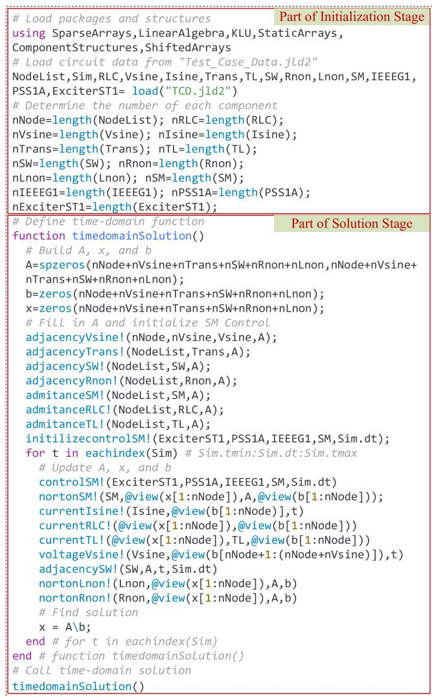  
Fig. 1. Julia syntax for parts of initialization and solution stages in the solver engine.

“adjacencyVsine!” means that Vsine sets its adjacency matrix in (1). Note that in Julia, it is a convention to append an exclamation mark to the names of functions that modify their arguments. JSEMT utilizes some helpful macros (start with @) that reduce the coding burden and keep the visuality of the code. For example, “@view” is a defined macro for slicing operations on arrays. It references the data of the original array in place without making a copy, to improve performance. JSEMT has also several efficiently designed functions in high-level syntax that are frequently executed, such as the two examples in Fig. 2. These examples are for updating the history buffer associated with the CP-line (constant parameter line or cable model with propagation delay) model.

# 3.5. Component structures

Each file in the Component Structures assembles the component model, which consists of the composition (structure) definition and operating functions. Julia uses the keyword “structure” to compose a component which is like a class in other languages. This includes declarations about the set of fields that define the component properties. These structures are followed by operating function(s), i.e., applied method(s) to manipulate their fields. Each component has a certain number of functions based on its behavior.

An example of Julia’s syntax for implementing the voltage source component is illustrated in Fig. 3. As seen in the component composition section, the name of the structure is “VoltageSource” and it has six fields, namely “amplitude”, “frequency” and “angle” that refer to the cosine waveform parameters, “starttime” and “endtime” that define the active duration time in the network, and “adjacency” which refers to the location (connection) in the network. It should be noted that these fields are implemented by two array types for speed evaluation, namely dynamic and static arrays. The latter is discussed in section IV. B. , in which “MVector {nVsine,Float64}” constructs a vector of type Float64 and length of “nVsine” that represents the number of voltage sources in the power network. The “adjacencyVsine!” function sets the locations of these voltage sources in A and “voltageVsine!” updates their voltages in b. Another example of the high-level syntax of Julia in implementing parallel computing will be shown in Section 4.4.

# 4. Simulation cases

The simulation results of JSEMT are validated by comparisons with EMTP® [3]. The IEEE 39-bus network is adopted as a test case [29]. It has 357 nodes, 90 ideal transformers, 273 RLC branches, 102 transmission lines, 15 ideal switches, 90 nonlinear inductors of nonlinear transformers, 54 loads, and 10 synchronous machines with controls. Each control includes exciter ST1, stabilizer PSS1A, and governor-turbine IEEEG1. The network is fully initialized, whereby the

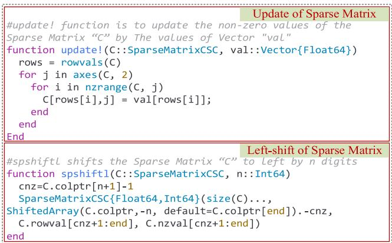  
Fig. 2. Two implemented functions in JSEMT for updating the values of sparse matrices and shifting their values to the left by n digits.

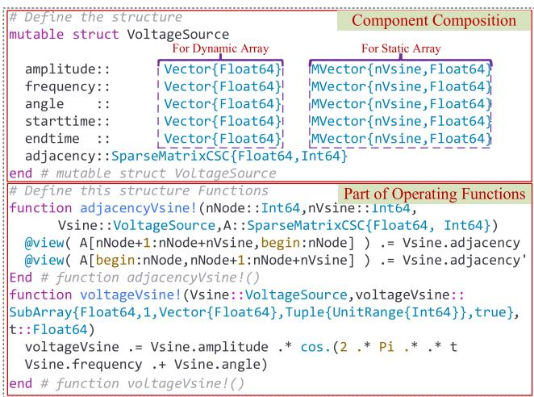  
Fig. 3. Julia syntax to implement a voltage source component.

load-flow solution is extracted from EMTP® and the simulation begins from the steady-state condition. The simulation interval τ is 600 ms with a time-step Δt = 25µs using the trapezoidal integration method. A three-phase to ground fault occurs at the m-end of the transmission Line_16_19 at t = 100 ms followed by an isolation at t = 200 ms via breakers BRm and BRk after 6 cycles. The fault is cleared at t = 300 ms and the Line_16_19 is reconnected at t = 50 ms, as illustrated in Fig. 4.

# 4.1. Accuracy analysis

The three-phase voltage waveforms at the m-end of Line_16_19 are presented in Fig. 5. As observed, the simulation starts from steady-state until the occurrence of the fault. It can be stated here that the results obtained from JSEMT match those from EMTP®. An accuracy evaluation is shown in Fig. 6 by calculating the relative errors of voltage waveforms in Fig. 5.

The magnetization current-flux curve of the nonlinear inductor of the transformer in PowerPlant_04 near the fault in the interval of 448–454 ms is shown in Fig. 7. As seen, the results of JSEMT and EMTP are identical with no overshoot or instabilities at the boundary points of the linear segments.

To check the behavior of the modeled SMs (generators here), the nearest one to the fault in PowerPlant_04 on B19 is selected, as seen in Fig. 4. The terminal current waveforms of this generator’s stator are depicted in Fig. 8. It can be said again that these results are identical between EMTP and JSEMT.

The operation of the studied SM controls is investigated here as well.

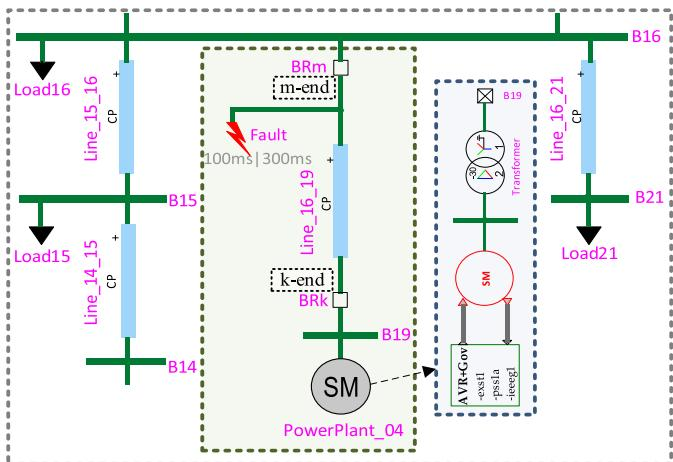  
Fig. 4. Configuration of the assumed faulted in the IEEE 39-bus network.

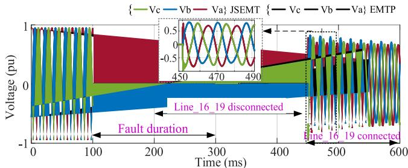  
Fig. 5. Voltage waveforms at the m-end of Line_16_19.

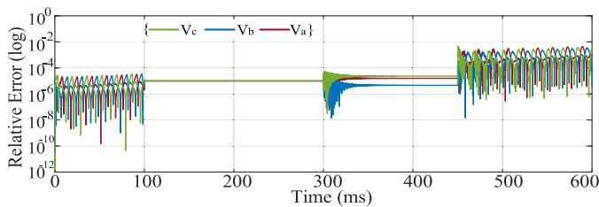  
Fig. 6. Relative errors of the voltages at the m-end of Line_16_19 by JSEMT.

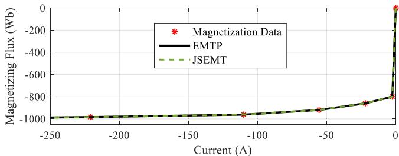  
Fig. 7. Superimposition of nonlinear inductance results in the transformer of PowerPlant_04, phase-c.

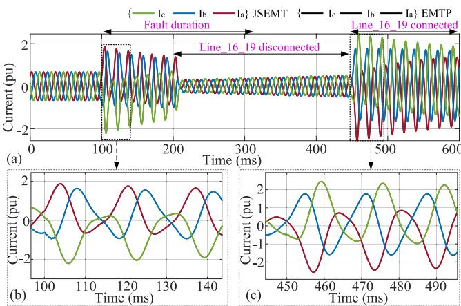  
Fig. 8. (a): Terminal current waveforms of SM in PowerPlant_04 (b): close-up view after the fault occurrence at Line_16_19 (c): close-up view after reconnection of Line_16_19.

The output of the SM’s exciter that controls its field voltageE changes largely after the fault, as shown in Fig. 9a.

On the other hand, Fig. 9b illustrates the output of the generator’s governor that drives its mechanical power $P _ { m e c h } .$ The rotor speed ωr is presented in Fig. 9c. Although the speed is increased during the fault, it is regulated to head back to its reference value of 1 pu. All the matched results between JSEMT and EMTP prove the accuracy of JSEMT.

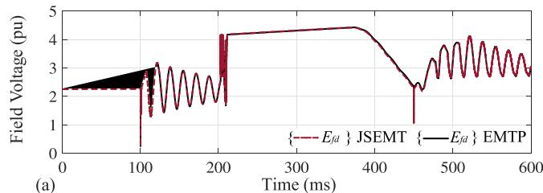

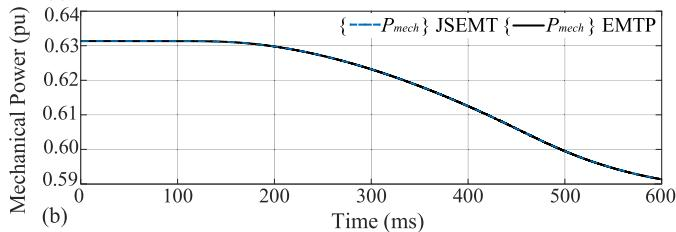

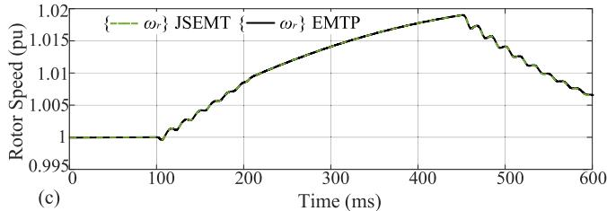  
Fig. 9. SM of PowerPlant_04 (a): field voltage (b): mechanical power (c): rotor angular velocity.

# 4.2. Performance analysis

The performance of JSEMT is compared with EMTP®. This analysis is carried out on a machine with the following specifications: Intel (R) Core (TM) i7–10750H CPU, 2.60 GHz 2.59 GHz, 6 cores (CPUs), and 32 GB RAM. Three criteria are introduced for the comparison: the number of solution points in the time-domain, CPU time for running the simulation, and CPU time per time-point. As shown in Table 2, EMTP is faster than JSEMT by 10.58 times. JSEMT performance improvement is presented in the following subsections.

# 4.3. Techniques to improve JSEMT performance

The techniques are applied sequentially on the first version of JSEMT, which is named hereinafter JSEMT_v1. The improved versions are named:

1. JSEMT_v2: JSEMT_v1 with StaticArrays library.   
2. JSEMT_v3: JSEMT_v2 with KLU library.   
3. JSEMT_v4: JSEMT_v3 with KLU fast re-factorization of Amatrix to avoid repeating the symbolic phase.

Contrary to dynamic arrays, Julia can deal with special types of vectors and matrices through the “StaticArrays” library that permits a framework to build statically sized arrays. It can provide fast implementations for common array and linear algebra operations and thus can improve computational speed. Utilizing this type for constructing the component structures (see Fig. 3) results in having JSEMT_v2, which is faster by 1.2 times when compared to JSEMT_v1, as listed in Table 3.

The sparse solution of (1) in the previous versions of JSEMT is

Table 2 Performance analysis between EMTP and JSEMT.   

<table><tr><td></td><td>EMTP</td><td>JSEMT_v1</td></tr><tr><td>No. of time points</td><td>24,001</td><td>24,001</td></tr><tr><td>CPU time per time-point (ms)</td><td>0.087</td><td>0.926</td></tr><tr><td>CPU Time (s)</td><td>2.10</td><td>22.22</td></tr></table>

Table 3 Performance speedup for developed versions of JSEMT.   

<table><tr><td></td><td>JSEMT_v2</td><td>JSEMT_v3</td><td>JSEMT_v4</td></tr><tr><td>CPU Time (s)</td><td>18.50</td><td>6.71</td><td>2.42</td></tr><tr><td>Speedup</td><td>1.20</td><td>2.75</td><td>2.77</td></tr></table>

calculated by LU factorization using the backslash function in the “LinearAlgebra” library in Julia, as shown in Fig. 1. KLU is another choice of sparse matrix solver that is successfully used in [28], and it is available in Julia [11]. The updating JSEMT_v2 to include KLU results into JSEMT_v3 and a speedup of 2.75, as reported in Table 3.

Since some network models may modify A in the time-domain loop, JSEMT_v3 must compute the KLU of A at each modification. This process has several phases, and each one consumes a certain amount of time. It is noticed that only the switches as well as the nonlinear inductors and resistors can modify the non-zero values of A. In other words, the KLU symbolic analysis phase can be reserved and only the numerical factorization needs to be updated, i.e., re-factorization of A (Aˆ). This is implemented in JSEMT_v3 to give JSEMT_v4. The outcome of this work makes JSEMT_v4 faster than JSEMT_v3 by 2.77, as indicated in Table 3. As can be seen, the performance of JSEMT_v4 becomes comparable to EMTP (Table 2).

To perform a test with a larger grid, the IEEE-39 network is independently reproduced 10 times with no connections between them and hereinafter called the multiplied IEEE-39 network. Although this generated grid is not realistic, it becomes a test for a grid size with 3704 nodes and 4854 equations. The resulting CPU time for EMTP is 23.04 s while for JSEMT-v4 it is 26.54 s, which shows a good performance for Julia. One reason behind this is the fact that running the Julia code implies running a compiled code as explained in the section III. A. This is a clear advantage of Julia programming.

Note that in the following sections, JSEMT_v4 is considered the reference simulator for performance comparisons with the proposed and implemented techniques.

# 4.4. Parallelization of the KLU sparse matrix solver

During the KLU symbolic analysis phase, row permutation P and column permutation $\mathbf { P } _ { c }$ matrices are computed. When transmission lines with propagation delays exist in the simulated network, these two permutation matrices can transform theAmatrix into a block diagonal form (BTF), in which the blocks are independent submatrices.

$$
\mathbf {A} _ {B T F} = \mathbf {P} _ {r} \mathbf {A P} _ {c} \tag {3}
$$

For the IEEE-39 case, 27 blocks are found in the pattern, in which the smallest block size is 3 × 3 and the largest one is $7 5 \times 7 5$ . The latter block constitutes the limiting factor for parallelizing the solver as it forms a dense network region that does not have any transmission line. Note that the KLU symbolic analysis phase to find $\mathbf { A } _ { B T F }$ is calculated only once. The other two phases of numerical factorization and solution might need recalculations, and they can be implemented in parallel during their repetitive calls within the time-loop. The degree of parallelization depends on the size of $\mathbf { A } _ { B T F }$ blocks as well as the available CPU numbers in each computer. In this article, the blocks are automatically and evenly distributed according to the number of CPUs.

There are several libraries and directives in Julia to implement CPUbased parallelization. After several tests, it was found that the “@batch per=core” macro in “Polyester” library is the most suitable one to implement the parallel solver in terms of higher performance and lower memory allocations. Its implementation is shown in Fig. 10, as an example of Julia’s syntax to implement a parallel task. The code within the “@batch” block includes the re-factorization ofA(if needed) and the solution. It is executed in parallel by the pre-defined number of threads (CPUs): nThreads. Here, ${ \pmb { \mathrm { p } } } / { \pmb { \mathrm { q } } }$ is the KLU right/left permutation vector.

The speedup is listed in Table 4, for 10 s of simulation time with $\Delta t =$

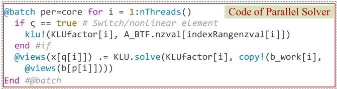  
Fig. 10. Implementation of parallel solver in Julia syntax.

Table 4 Speedup comparison between sequential and parallel solvers.   

<table><tr><td rowspan="2">Number of CPUs</td><td colspan="2">IEEE 39-bus</td><td colspan="2">Multiplied IEEE 39-bus</td></tr><tr><td>CPU Time (s)</td><td>Speedup</td><td>CPU Time (s)</td><td>Speedup</td></tr><tr><td>1 CPU</td><td>48.63</td><td>-</td><td>865.07</td><td>-</td></tr><tr><td>2 CPUs</td><td>46.27</td><td>1.05</td><td>753.38</td><td>1.14</td></tr><tr><td>3 CPUs</td><td>47.67</td><td>1.02</td><td>575.01</td><td>1.50</td></tr><tr><td>4 CPUs</td><td>48.14</td><td>1.01</td><td>596.77</td><td>1.44</td></tr><tr><td>5 CPUs</td><td>54.06</td><td>0.89</td><td>614.22</td><td>1.40</td></tr></table>

25µs. When the network is relatively small, the advantage of solving (1) in parallel is mitigated by the CPU overheads and the consumed time for mapping between the individual block arrays and the parent ones. However, the gain is noticeable in larger networks, as in the multiplied network. And it reaches the maximum of 1.5 with 3 CPUs.

# 4.5. Parallelization with component models

This is another parallelization technique, in which the network is divided into several subnetworks through transmission lines that can run individually on separate CPUs. In our work, subnetworks are extracted from $\mathbf { A } _ { B T F }$ for determining firstly the nodes that are in the same block, and then, grouping all component equations that are connected to them. If the number of these subnetworks is greater than the number of available CPUs, some of them can be combined to ensure that each aggregated subnetwork runs on a separate CPU.

This parallelization technique is implemented in Julia via CPU-based directives, in which the “@threads” macro in “Threads” library is found to be the most suitable one. The result speedup by this parallelization utilizing several CPUs is listed in Table 5. As seen, the speedup here is higher than the one in Table 4. This is because the parallelization here is not only applied to the solution of (1), but also on the component (models) equations. The speedup gains are higher than the number of CPUs because each code running an aggregated subnetwork can be cached in a CPU. Moreover, a segment change in a nonlinear component necessitates iterating the solution only within its aggregated network.

# 5. Conclusion

There is an increasing need for the creation of electromagnetic transient (EMT) simulation tools developed using modern programming languages that run on high-performance architectures, employ highlevel constructs, and enable seamless manipulation of data and matrices. Since the Julia programming language can support these features without compromising performance, it was used in this article to implement an EMT simulator, called JSEMT. It was benchmarked

Table 5 Speedup comparison between sequential and parallel networks.   

<table><tr><td rowspan="2">Number of CPUs</td><td colspan="2">IEEE 39-bus</td><td colspan="2">Multiplied IEEE 39-bus</td></tr><tr><td>CPU Time (s)</td><td>Speedup</td><td>CPU Time (s)</td><td>Speedup</td></tr><tr><td>1 CPU</td><td>48.63</td><td>-</td><td>865.07</td><td>-</td></tr><tr><td>2 CPUs</td><td>44.49</td><td>1.09</td><td>292.04</td><td>2.96</td></tr><tr><td>5 CPUs</td><td>50.29</td><td>0.96</td><td>150.88</td><td>5.73</td></tr></table>

against the EMTP® software and detailed comparisons proved its accuracy and performance. This paper serves as the foundation for constructing a comprehensive EMT simulator using Julia. Future iterations will include an expanded model library, a variable time-step solver, an adaptative switching of integration method during runtime, GPU parallelization, and an optimized CPU parallelization.

# CRediT authorship contribution statement

A. Alsabbagh: Conceptualization, Software, Writing – original draft, Formal analysis, Methodology, Data curation. M. Naïdjate: Validation, Software, Methodology, Data curation, Project administration, Conceptualization, Supervision, Resources, Writing – review & editing, Investigation. J. Mahseredjian: Validation, Investigation, Visualization, Software, Funding acquisition, Project administration, Writing – review & editing, Supervision, Resources, Conceptualization. M.J. Matehkolaei: Formal analysis, Writing – original draft.

# Declaration of competing interest

The authors declare that they have no financial or personal conflicts of interest related to the work presented in this paper. If there are other authors, they declare that they have no known competing financial interests or personal relationships that could have appeared to influence the work reported in this paper.

# Data availability

No data was used for the research described in the article.

# References

[1] J. Mahseredjian, V. Dinavahi, and J.A. Martinez, "Simulation tools for electromagnetic transients in power systems: overview and challenges," vol. 24, no. 3, pp. 1657–1669, 2009.   
[2] A. Ametani, N. Nagaoka, Y. Baba, T. Ohno, K. Yamabuki, Power System Transients: Theory and Applications, CRC Press, 2016.   
[3] J. Mahseredjian, S. Denneti`ere, L. Dub´e, B. Khodabakhchian, L. G´erin-Lajoie, On a new approach for the simulation of transients in power systems, Elect. Power Syst. Res. 77 (11) (2007) 1514–1520.   
[4] J. Mahseredjian, U. Karaagac, S. Denneti`ere, H. Saad, Simulation of electromagnetic transients with EMTP-RV, Numer. Anal. Power Syst. Transient. Dynam. (2015) 103–134.   
[5] J. Mahseredjian, Simulation des transitoires ´electromagn´etiques dans les r´eseaux ´electriques, Edition ´ Les Techniques de l’Ing´enieur (2008).   
[6] A. Masoom, J. Mahseredjian, T. Ould-Bachir, A. Guironnet, MSEMT: an advanced modelica library for power system electromagnetic transient studies, IEEE Trans. Power Delivery (2021), 1-1.   
[7] J. Mahseredjian, F. Alvarado, Creating an electromagnetic transients program in MATLAB: matEMTP, IEEE Trans. Power Delivery 12 (1) (1997) 380–388.

[8] H.C.A. Tavante, B.D. Bonatto, M.P. Coutinho, Open source implementations of electromagnetic transient algorithms, in: 2018 13th IEEE International Conference on Industry Applications (INDUSCON), 2018, pp. 825–828.   
[9] M. Xiong, et al., ParaEMT: an open source, parallelizable, and HPC-compatible EMT simulator for large-scale IBR-rich power grids, in: IEEE Transactions on Power Delivery, 39, April 2024, pp. 911–921, https://doi.org/10.1109/ TPWRD.2023.3342715.   
[10] J. Bezanson, A. Edelman, S. Karpinski, V.B. Shah, Julia: a fresh approach to numerical computing, Society Indust. Appl. Math. (SIAM) Rev. 59 (1) (2017) 65–98.   
[11] T.A. Davis, E. Palamadai Natarajan, Algorithm 907: KLU, a direct sparse solver for circuit simulation problems, ACM Trans. Mathemat. Software 37 (3) (2010) 1–17.   
[12] T. Thummerer, J. Kircher, and L. Mikelsons, "NeuralFMU: towards structural integration of FMUs into neural networks," arXiv preprint, 2021.   
[13] Electrical engineering package in Julia [Online]. Available, https://github.com/ch ristiankral/ElectricalEngineering.jl, Sep. 2022.   
[14] Scalable integrated infrastructure planning initiative at the national renewable energy laboratory [Online]. Available, https://github.com/NREL-Sienna, Sep. 2022.   
[15] J.D. Lara, R. Henriquez-Auba, M. Bossart, D.S. Callaway, and C. Barrows, " PowerSimulationsDynamics. Jl–an open source modeling package for modern power systems with inverter-based resources," arXiv preprint arXiv:2308.02921, 2023.   
[16] F. Milano, Complex frequency, IEEE Transactions on Power Systems 37 (2) (March 2022) 1230–1240, https://doi.org/10.1109/TPWRS.2021.3107501.   
[17] A. Plietzsch, R. Kogler, S. Auer, J. Merino, A. Gil-de-Muro, J. Liße, C. Vogel, F. Hellmann, PowerDynamics. Jl—An experimentally validated open-source package for the dynamical analysis of power grids, SoftwareX. 17 (2022) 100861.   
[18] C. Coffrin, R. Bent, K. Sundar, Y. Ng, M. Lubin, PowerModels. JL: an open-source framework for exploring power flow formulations, in: 2018 Power Systems Computation Conference (PSCC), Dublin, Ireland, 2018, pp. 1–8, https://doi.org/ 10.23919/PSCC.2018.8442948.   
[19] O. Wallscheid, S. Peitz, J. Stenner, D. Weber, S. Boshoff, M. Meyer, V. Chidananda, O. Schweins, ElectricGrid.Jl -A Julia-based modeling and simulation tool for power electronics-driven electric energy grids, J. Open. Source Softw. 8 (89) (2023) 5616.   
[20] X. Yan, Q. Wang, Z. Zhong, T. Ren, K. Wang, Julia-based high-performance electromagnetic transient simulation method and platform for large power grid, in: 2021 6th Asia Conference on Power and Electrical Engineering (ACPEE), 2021, pp. 252–257.   
[21] Electromagnetic transients program [Online]. Available, https://www.emtp.com/, Nov. 2022.   
[22] J. Mahseredjian, L. Dube, M. Zou, S. Dennetiere, G. Joos, Simultaneous solution of control system equations in EMTP, IEEE Trans. Power Syst. 21 (1) (2006) 117–124.   
[23] U. Karaagac, J. Mahseredjian, O. Saad, An efficient synchronous machine model for electromagnetic transients, IEEE Trans. Power Delivery 26 (4) (2011) 2456–2465.   
[24] IEEE, "IEEE recommended practice for excitation system models for power system stability studies," pp. 1–207, 2016.   
[25] I. Balbaert, Getting Started with Julia, Packt Publishing Ltd, 2015.   
[26] Static array package in Julia [Online]. Available, https://github.com/JuliaArrays/ StaticArrays.jl, Sep. 2022.   
[27] Data visualizations package in Julia [Online]. Available, https://www.analyticsvi dhya.com/blog/2021/05/data-visualizations-in-julia-using-plots-jl-with-practic al-implementation/, Sep. 2022.   
[28] A. Abusalah, O. Saad, J. Mahseredjian, U. Karaagac, I. Kocar, Accelerated sparse matrix-based computation of electromagnetic transients, IEEE Open Access J. Power Energy 7 (2020) 13–21.   
[29] A. Haddadi, J. Mahseredjian, Power system test cases for EMT-type simulation studies, CIGRE, Paris, France, Tech. Rep.CIGREWG C 4 (2018) (2018) 1–142.