# Fine-Grained Optimal Allocation of Wind Farm Decoupled Models for CPU-GPU Parallel EMT Simulation

Tengfei Liu, Yibao Jiang, Member, IEEE, Haoran Zhao, Senior Member, IEEE, Bing Li, Kai Strunz, Fellow, IEEE

Abstract—Parallel simulation based on CPU-GPU heterogeneous hardware, owing to its high speed-up ratio, has emerged as an effective approach for accelerating electromagnetic transient (EMT) simulation of wind farms. However, most existing studies rely mainly on hardware multi-threading capabilities, with limited quantitative analysis of model–hardware adaptability, resulting in insufficient exploitation of the complementary advantages of CPUs and GPUs. To this end, this paper proposes a finegrained optimal allocation method (FGOAM) that formulates the hardware assignment of each subsystem in wind farms as a constrained optimization problem for maximal simulation efficiency. Firstly, a bottom-up quantification method is developed to accurately assess the computational resources and solution time of decoupled models by decomposing the computation process into sequential and parallelizable steps. Secondly, a FGOAM for decoupled wind farm models is proposed, for the first time, by formulating an integer nonlinear programming (INLP) problem for step-level computation allocation. Finally, to further improve solution efficiency of FGOAM, an enhanced FGOAM (E-FGOAM) is derived via integer variable reduction without sacrificing allocation optimality. The accuracy of the proposed quantification method and the improvement on simulation efficiency after optimal allocation are validated. Simulation results demonstrate that the simulation speed is increased by two orders of magnitude for a wind farm consisting of 400 turbines.

Index Terms—CPU-GPU, electromagnetic transient, optimal allocation, parallel simulation, wind farm.

# I. INTRODUCTION

W ITH the rapid development of renewable energy, windpower has become a dominant contributor to the grid power has become a dominant contributor to the grid decarbonization [1]. As wind farms are integrated into power systems at scale, their converter-driven dynamics bring significant challenges to grid stability. Electromagnetic transient (EMT) simulation is essential in capturing fast dynamics and identifying potential issues [2], [3]. However, the growing scale of wind farms and the increasing switching frequency of wind power converters [4], [5] demands smaller simulation steps [6], which impose higher efficiency requirements on EMT simulators of wind farms [7].

Parallel simulation is widely adopted in current wind farm simulators, where a wind farm is decoupled into multiple subsystems and simulated using multi-threaded hardware. Multi-

This paper was supported by the National Natural Science Foundation of China (grant numbers 52307112).

Tengfei Liu, Yibao Jiang, Haoran Zhao and Bing Li are with the School of Electrical Engineering, Shandong University, 250061 Jinan, China. (e-mail: 202420770@mail.sdu.edu.cn, {yjiang, hzhao}@sdu.edu.cn, bingli@mail.sdu.edu.cn)

Kai Strunz is with the Chair of Sustainable Electric Networks and Sources of Energy, Technische Universitat Berlin, 10587 Berlin, Germany (e-mail:¨ kai.strunz@tu-berlin.de).

threaded simulators can be categorized into those constructed on single-type hardware and those built on heterogeneous hardware. The simulators based on single-type hardware, typically consisting of one or more central processing units (CPUs), are limited by finite threads [8], [9] and exhibit low parallelism when simulating large-scale wind farms. To enhance parallel computing, heterogeneous hardware platforms combining CPUs with graphics processing units (GPUs) or field programmable gate arrays (FPGAs) have been developed with numerous parallel processing units. The FPGAbased heterogeneous simulators have strong capabilities of parallel processing and pipelinable execution [10]. However, the number of FPGAs in the simulator must scale linearly with the size of the wind farm [11], [12], leading to high implementation costs [13], [14]. In contrast, GPUs enable parallel processing capabilities by significantly increasing the number of computational units compared to FPGAs. A single GPU can accelerate EMT simulation of large-scale wind farms with hundreds of wind turbines, offering a practical and costeffective solution [15]. Moreover, the compute unified device architecture (CUDA) architecture offers greater flexibility and scalability for numerical simulations, avoiding the need for time-consuming hardware-specific design in Verilog, as required by FPGA development. While GPUs offer significant advantages in parallel EMT simulation, their low clock frequency (for consumer desktop GPUs, typically within 3 GHz) results in longer simulation times for small-scale systems compared to simulators relying solely on CPUs [16]. Therefore, combining CPUs and GPUs to construct heterogeneous simulation platforms is an effective solution for wind farm simulation. However, simply combining CPUs and GPUs is insufficient to fully exploit the high clock frequency of CPUs and the massive parallelism of GPUs. How to properly allocate the decoupled model to appropriate hardware is also critical for maximizing the utilization of CPU-GPU heterogeneous acceleration capabilities. The optimal allocation of a decoupled wind farm model is essentially a problem of optimal load distribution [17]. To date, researchers in fields such as artificial intelligence, machine learning, edge and cloud computing, and signal processing have investigated how to allocate computational loads to appropriate hardware platforms in an efficient manner [9]. However, due to differences in the underlying problem settings, the corresponding optimization objectives also vary, making these approaches difficult to directly apply to the simulation of decoupled wind farm models.

At present, the optimal allocation for decoupled wind farm models is typically determined based on simple rules or experiments. The rule-based model allocation method usually assigns the control system and the electrical system to CPUs

and GPUs (or FPGAs), respectively [11], [13], [18], [19]. Refs. [13] and [18] implement turbine model and control system computations on CPUs, while conducting electrical model simulations on GPUs. This division is based on qualitative analysis of the computational characteristics of each model component. In the experiment-based model allocation method, wind farms with varying numbers of wind turbines are repeatedly tested to either a CPU or a GPU [20]. By comparing the measured solution time of wind farm on the CPU and the GPU, a threshold is identified to decide the appropriate hardware for simulation. Specifically, the threshold is defined as a number of wind turbines, beyond which the entire model is simulated on GPUs; otherwise, the simulation is executed on CPUs [20]. Although above methods provides criteria for model allocation, their allocation rules are too simplified to achieve maximal simulation efficiency, especially with the increasing scale of wind farms.

Particularly, current approaches often fall short in leveraging the full computational potential of CPU-GPU heterogeneous platforms, due to the following limitations. i) Case-by-case allocation: Some methods require extensive experimentation to re-establish the allocation thresholds as turbine types, farm layouts, and other configurations change. ii) Coarse-grained allocation: Current allocation methods are limited to assigning hardware at the wind turbine level, even though each wind turbine has already been decoupled into component-level subsystems. iii) Qualitative analysis: The above method lacks a rigorous theoretical derivation for the optimal allocation of models. As a result, the derived allocation schemes often fail to fully exploit the architectural advantages of the CPU-GPU heterogeneous platform. iv) GPU memory overflow: Rule-based and experiment-based allocation methods do not consider the memory constraints of different GPU memory hierarchies, resulting in potential memory overflow and simulation termination.

To this end, this paper proposes a fine-grained optimal allocation method (FGOAM) for decoupled wind farm models based on the CPU-GPU heterogeneous architecture. The proposed method enables optimal adaptation between simulation models and heterogeneous hardware by rigorously formulating, for the first time, a constrained optimization problem specifically tailored for hardware-model assignment. The main contributions of this paper are summarized as follows:

(1) For the decoupled wind farm model, a bottom-up method is proposed to accurately quantify the computational resource requirements and solution time by decomposing the subsystem computation process into sequential and parallelizable steps. The quantification results are subsequently integrated into the model allocation optimization problem to formulate the corresponding constraints and the objective function.   
(2) By minimizing solution time as the objective and incorporating hardware resource constraints, the model allocation problem is formulated as an integer nonlinear programming (INLP) problem, leading to the development of the FGOAM for the decoupled wind farm model. This approach fully exploits the computational resources and architectural advantages of CPUs and GPUs, achieving a step-level optimal allocation of each subsystem.

(3) To address the computational complexity associated with integer programming in the proposed FGOAM, an enhanced FGOAM (E-FGOAM) is developed via integer variable reduction. E-FGOAM performs unified allocation of simulation steps within each subsystem, effectively reducing the computational complexity of the allocation process without compromising optimality.

The remainder of this paper is organized as follows: Section II introduces the decoupled models based on the capacitanceinductance branch decoupling method, along with the architectural characteristics of CPUs and GPUs; Section III illustrates the bottom-up quantification method for the computational resource requirements and solution time of the decoupled model; Section IV develops the formulation of FGOAM by utilizing the quantified results from Section III, and introduces the principle and formulation of E-FGOAM; Section V validates the proposed method through a large-scale wind farm case study, followed by conclusions drawn in Section VI.

# II. DECOUPLED WIND FARM MODELS AND CPU-GPUHETEROGENEOUS ARCHITECTURE

The optimal allocation of wind farm models for CPU-GPU heterogeneous architectures highly depends on the model’s parallelizability and the hardware characteristics. Therefore, Sections II-A and II-B respectively introduce the fine-grained decoupling method for the wind farm and the CPU and GPU hardware architecture.

# A. Decoupled Wind Farm Models

This paper takes the doubly-fed induction generator (DFIG) wind turbine for illustration without loss of generality. In addition, the EMT simulation is conducted based on the widely used nodal analysis method. To improve the solution efficiency of the node analysis method for large-scale wind farms, previous studies propose several decoupled parallel simulation methods, including the Bergeron transmission line method (TLM) [21], compensation method [22], multi-area Thevenin equivalent [23], latency insertion method [24], and ´ capacitance-inductance branch decoupling methods [5].

Compared with decoupling approaches such as the TLM, the compensation method, and the multi-area Thevenin equivalent ´ method, the capacitor–inductor branch decoupling method enables device-level decoupling within wind farms. In addition, unlike the latency insertion method, the capacitor–inductor branch method does not require the introduction of small inductors or capacitors, thereby preserving simulation accuracy under dynamic operating conditions. Therefore, this study adopts the capacitor–inductor branch decoupling method to decouple key components of wind turbines, including the generator, converters, filter, transformer, and collector system. To balance simulation accuracy and computational efficiency, a semi-implicit integration method is employed for the decoupling of the generator, filter, and transformer [25]. Meanwhile, an explicit integration method is applied to the decoupling of converters and the collector system. Consequently, the wind farm is decoupled into 8W +1 subsystems, as shown in Fig. 1(b), where W represents the number of wind turbines; w denotes the w-th wind turbine. Based on the adopted

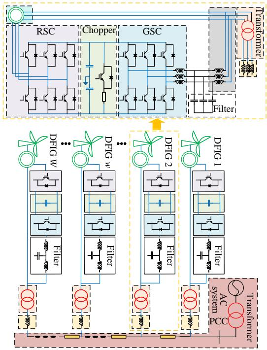  
(a)

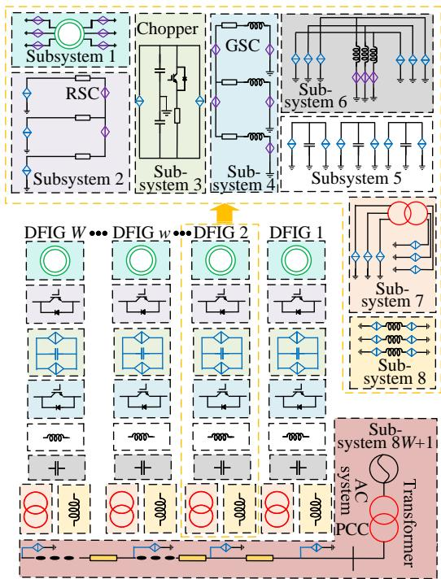  
(b)   
Fig. 1. Original and decoupled models of a DFIG wind farm. (a) Topology of the DFIG-based wind farm. (b) Decoupled models of the wind farm.

decoupling method, controlled current sources and controlled voltage sources are introduced into each subsystem to realize the electrical interconnection between the subsystem and its neighboring subsystems. In the figure, the blue diamond and the purple diamond denote the controlled current source and the controlled voltage source, respectively. Eight subsystems of the w-th wind turbine are named as subsystems 8w-7 ∼ 8w, and the power collection system is regarded as the subsystem 8W +1.

# B. CPU-GPU Heterogeneous Architecture

Chopper An optimal allocation strategy for decoupled models de-GSC Subsystem 1 pends on quantitative analyses of the computational perfor-Sub-RSCmance of heterogeneous hardware. Here, we introduce the architecture of CPUs and GPUs by illustrating their basic units: the control unit, the arithmetic unit, and the storage Sub- system 3 Sub- system 4 SubsySubsystem 2 unit. Note that the proportions of these three units differ significantly between CPUs and GPUs. Fig. 2 presents the DFIG W DFIG w DFIG 2 DFIG 1CPU and the GPU hardware architecture and their main differences [26].

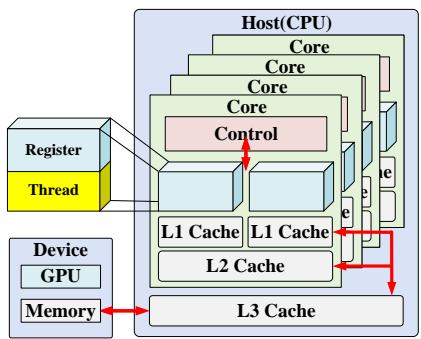  
(a)

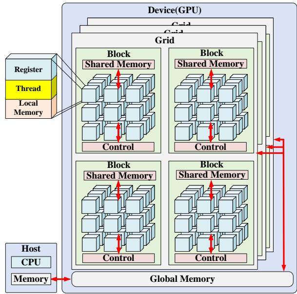  
  
Fig. 2. Hardware architecture. (a) CPU. (b) GPU.

As shown in Fig. 2, in terms of computational units, CPUs typically feature a smaller number of cores, with each core assigned only two threads. However, CPUs operate at a relatively high clock frequency between 3.0 GHz and 5.0 GHz. Therefore, for subsystems with fewer nodes and branches, CPUs achieve higher simulation efficiency. In contrast, GPUs have a large number of threads. With CUDA programming, each GPU block supports thousands of threads that allow efficient simulation of large-scale wind farms. To fully exploit the high clock frequency of CPUs and the massive multi-threaded capability of GPUs, each subsystem should be allocated to the most suitable hardware. Accordingly, Section IV-A formulates the objective function of the model allocation optimization problem, aiming to minimize the total simulation time.

In terms of memory architecture, both CPUs and GPUs

are organized into multi-level memory hierarchies. The CPU memory is typically divided into L1, L2, and L3 caches. Data are first stored in the L1 cache, and when overflow occurs, the excess data are automatically placed into the L2 and then the L3 cache. However, these cache levels cannot be independently controlled through software. In the GPU memory hierarchy, the primary types of memory are registers, shared memory, and global memory. Unlike CPUs, the different GPU memory levels can be explicitly managed through CUDA programming. Registers are individually allocated to each thread and offer the fastest access speed. However, if all simulation results are stored in registers, register overflow may occur. The overflowed data will then be stored in the global memory, which has the highest latency and largest capacity, thereby limiting simulation efficiency [27]. The access latency and capacity of shared memory are between registers and global memory. Nevertheless, overflow in shared memory may result in more critical issues, such as compilation errors or kernel launch failures. To enhance the efficiency of wind farm simulation while preventing GPU memory overflow, memory access latencies across different hierarchy levels are jointly considered to accurately model the wind farm computation time. In addition, GPU memory capacity constraints are incorporated into the optimization problem formulated in Section IV-A.

# III. BOTTOM-UP QUANTIFICATION METHOD FOR DECOUPLED WIND FARM MODELS

To leverage the advantages of the CPU–GPU heterogeneous architecture, it is necessary to quantify the computational resource requirements and solution time of each subsystem. Accordingly, Section III-A decomposes the computational process into sequential and parallelizable steps. By analyzing the order of matrices to be solved in each step, the number of threads and the memory capacity required for solving each subsystem on the CPU and GPU are quantitatively determined. Section III-B further quantifies the solution time of each subsystem from a bottom-up perspective. Specifically, by quantifying the memory access time and matrix computation time of each simulation step, the overall solution time of each subsystem is derived.

# A. Bottom-Up Quantification Method for Resource Requirement

Since subsystems 8w-7, 8w-3, 8w-1 and 8W +1 are decoupled using the semi-implicit integration method, their state variables serve as interconnection variables involved in the simulation of the remaining subsystems. Accordingly, a conflict-free parallel simulation workflow is designed, as illustrated in Fig. 3 [5]. $T _ { \mathrm { e n d } }$ is the total simulation time and $\Delta t$ is the simulation time step. Process A performs model parameter initialization, followed by process B that solves subsystems 8w-7, 8w-3, 8w-1 and 8W +1. Finally, process C executes the computation for subsystems 8w-6, 8w-5, 8w-4, 8w-2 and 8w, for all $w \in \{ 1 , 2 , \dots , W \}$ .

Since the nodal analysis method is employed in this paper, the computational tasks required by a single subsystem can be divided into three steps [13], denoted as step i (i=1, 2, 3). Step

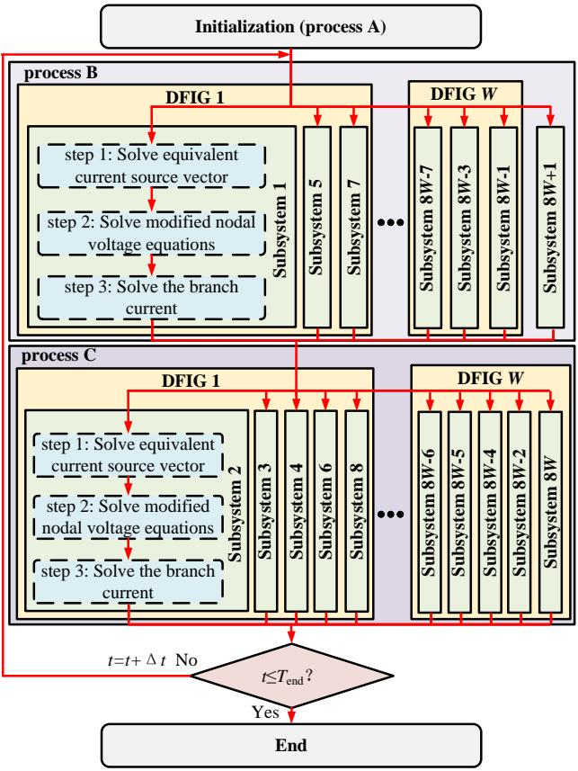  
Fig. 3. Simulation flowchart for the decoupled wind farm models.

1 is to solve the equivalent current source vector formed by discretizing capacitive and inductive elements and connecting them in parallel. Step 2 is to solve the node voltage equation of each decoupled subsystem, and step 3 is to solve the branch current equation. The three simulation steps correspond to the following matrix calculation

$$
\boldsymbol {I} _ {\mathrm {h}} (t) = \sigma \boldsymbol {I} _ {\mathrm {h}} (t - \Delta t) + \eta \boldsymbol {V} _ {\mathrm {n}} (t - \Delta t) \tag {1}
$$

$$
\boldsymbol {V} _ {\mathrm {n}} (t) = \boldsymbol {G} ^ {- 1} \boldsymbol {I} _ {\mathrm {n}} (t) \tag {2}
$$

$$
\boldsymbol {I} _ {\mathrm {b}} (t) = \boldsymbol {G} _ {\mathrm {e q}} \boldsymbol {V} _ {\mathrm {m}} (t) \tag {3}
$$

where $I _ { \mathrm { h } } ( t )$ represents the equivalent current source vector; σ is the historical current coefficient; η denotes the historical voltage coefficient, $V _ { \mathrm { n } } ( t )$ indicates the voltage vector of each node of the subsystem; G is the admittance matrix; $I _ { \mathrm { n } } ( t )$ is the branch current vector; $I _ { \mathrm { b } } ( t )$ represents the branch current vector; $G _ { \mathrm { e q } }$ denotes the matrix formed by the admittances of all branches; $V _ { \mathrm { m } } ( t )$ denotes the voltage difference vector across the branch terminals.

Considering the presence of electric machines in the wind farm, Subsystem 1 should also include the calculations of magnetic flux, electromagnetic torque, rotor motion equations, and dq0-axis voltages and currents [28]. Accordingly, Step 1 in Subsystem 1 additionally includes the computation of equations (4)-(5), while Step 3 also incorporates the computation of equations (6)-(8).

$$
\left[ \begin{array}{l} v _ {\mathrm {s d}} (t - \Delta t) \\ v _ {\mathrm {s q}} (t - \Delta t) \\ v _ {\mathrm {s 0}} (t - \Delta t) \end{array} \right] = \mathbf {T} _ {\mathbf {P}} (\theta) \mathbf {T} _ {\mathbf {C}} \left[ \begin{array}{l} v _ {\mathrm {s a}} (t - \Delta t) \\ v _ {\mathrm {s b}} (t - \Delta t) \\ v _ {\mathrm {s c}} (t - \Delta t) \end{array} \right] \tag {4}
$$

$$
\left[ \begin{array}{l} v _ {\mathrm {r d}} (t - \Delta t) \\ v _ {\mathrm {r q}} (t - \Delta t) \\ v _ {\mathrm {r 0}} (t - \Delta t) \end{array} \right] = \mathbf {T} _ {\mathbf {P}} (\theta) \mathbf {T} _ {\mathbf {C}} \left[ \begin{array}{l} v _ {\mathrm {r a}} (t - \Delta t) \\ v _ {\mathrm {r b}} (t - \Delta t) \\ v _ {\mathrm {r c}} (t - \Delta t) \end{array} \right] \tag {5}
$$

$$
\left\{ \begin{array}{l} \psi_ {\mathrm {s d}} (t) = L _ {\mathrm {s}} i _ {\mathrm {s d}} (t) + L _ {\mathrm {m}} i _ {\mathrm {r d}} (t) \\ \psi_ {\mathrm {s q}} (t) = L _ {\mathrm {s}} i _ {\mathrm {s q}} (t) + L _ {\mathrm {m}} i _ {\mathrm {r q}} (t) \\ \psi_ {\mathrm {s 0}} (t) = L _ {\mathrm {s}} i _ {\mathrm {s 0}} (t) + L _ {\mathrm {m}} i _ {\mathrm {r 0}} (t) \\ \psi_ {\mathrm {r d}} (t) = L _ {\mathrm {m}} i _ {\mathrm {s d}} (t) + L _ {\mathrm {r}} i _ {\mathrm {r d}} (t) \\ \psi_ {\mathrm {r q}} (t) = L _ {\mathrm {m}} i _ {\mathrm {s q}} (t) + L _ {\mathrm {r}} i _ {\mathrm {r q}} (t) \\ \psi_ {\mathrm {r 0}} (t) = L _ {\mathrm {m}} i _ {\mathrm {s 0}} (t) + L _ {\mathrm {r}} i _ {\mathrm {r 0}} (t) \end{array} \right. \tag {6}
$$

$$
T _ {\mathrm {e}} = \frac {3}{2} n _ {\mathrm {p}} \left(\psi_ {\mathrm {s d}} i _ {\mathrm {s q}} - \psi_ {\mathrm {s q}} i _ {\mathrm {s d}}\right) \tag {7}
$$

$$
\left\{ \begin{array}{l} T _ {\mathrm {e}} - T _ {\mathrm {L}} = \frac {J}{n _ {\mathrm {p}}} \frac {\omega_ {\mathrm {r}} (t) - \omega_ {\mathrm {r}} (t - \Delta t)}{\Delta t} \\ \omega = \frac {\theta (t) - \theta (t - \Delta t)}{\Delta t}, \omega_ {\mathrm {r}} = \frac {\theta_ {\mathrm {r}} (t) - \theta_ {\mathrm {r}} (t - \Delta t)}{\Delta t} \end{array} \right. \tag {8}
$$

where $\mathbf { T } _ { \mathbf { P } } ( \theta )$ and $\mathbf { T _ { C } }$ denote the coefficient matrices of the Park and Clarke transformations, respectively.The subscripts $d ,$ $q ,$ and 0 denote the d-axis, q-axis, and zero-axis components of the DFIG, respectively, while the subscripts s and r refer to the stator and rotor of the DFIG. The variable v represents the voltage of each winding; i represents the current; and ψ denotes the flux linkage. $R$ denotes the resistance of each winding, while $L _ { \mathrm { l } }$ and $L _ { \mathrm { m } }$ represent the self-inductance and mutual inductance, respectively. ω represents the electrical angular velocity of the rotating $d q 0$ coordinate system, and $\omega _ { \mathrm { r } }$ represents the electrical angular velocity of the rotor. $n _ { p }$ denotes the number of pole pairs of the DFIG; $T _ { \mathrm { L } }$ is the load torque; $T _ { \mathrm { e } }$ is the electromagnetic torque; J is the rotor’s moment of inertia; $\theta$ denotes the electrical angle of the reference frame; and $\theta _ { \mathrm { r } }$ represents the electrical angle of the rotor.

To fully leverage multi-threaded resources in CPUs and GPUs, threads are first allocated according to the matrix order. Then, the matrix is partitioned based on the allocated threads. Finally, the matrix is solved in parallel using multi-threading. Here, the matrix in step 2 is selected as an example, and the thread allocation and matrix partitioning methods are also applicable to steps 1 and 3.

If the matrix is solved on the CPU, the limited number of computational cores and threads must be fully utilized. In addition, considering the thread demands of other concurrently computed subsystems on the CPU, the number of threads assigned to each matrix must be proportionally determined according to its order. Since the voltage of the ground node does not need to be computed, a subsystem with $n _ { j }$ nodes requires solving a matrix of order $n _ { j } - 1$ in Step 2. Therefore, the number of threads $p _ { j , 2 }$ allocated to solve this matrix can be expressed as,

$$
p _ {j, 2} \left(n _ {j}\right) = \operatorname {c e i l} \left[ \frac {N _ {\mathrm {C P U}} \left(n _ {j} - 1\right)}{\sum_ {e = 1} ^ {E} \left(n _ {e} - 1\right)} \right] \tag {9}
$$

where $N _ { \mathrm { C P U } }$ denotes the maximum number of threads available on the CPU; E represents the total number of subsystems computed in parallel on the CPU; ceil(x) returns the smallest integer greater than or equal to x; $n _ { j }$ and $n _ { e }$ denote the number of nodes in subsystems $j$ and e, respectively.

If the matrix is solved in the GPU, the matrix is allocated to the same thread block. Threads are allocated according to the number of matrix elements. Additionally, considering that the threads within a GPU thread block are scheduled in units of $g _ { \mathrm { w } }$ -thread warps [9], the number of threads $p _ { j , 2 }$ for step 2 should be configured according to the following principles

$$
p _ {j, 2} \left(n _ {j}\right) = g _ {\mathrm {w}} \text {c e i l} \left[ \frac {N _ {\mathrm {G P U}} \left(n _ {j} - 1\right)}{g _ {\mathrm {w}} \sum_ {e = 1} ^ {E} \left(n _ {e} - 1\right)} \right] \tag {10}
$$

Based on the allocated threads, the matrices in (1)–(3) are partitioned accordingly. Taking (2) as an example, as illustrated in Fig. 4, two partitioning methods are proposed depending on the number of allocated threads. When the number of threads allocated to the matrix is less than the total number of matrix elements, the matrix is partitioned rowwise and executed as multiple row-based multiply-accumulate operations. Conversely, when the number of allocated threads exceeds the number of matrix elements, the matrix undergoes element-wise partitioning. In this case, each row of the admittance matrix is multiplied element-wise with the corresponding nodal current injection vector, and the resulting values are summed row-by-row to construct the result vector.

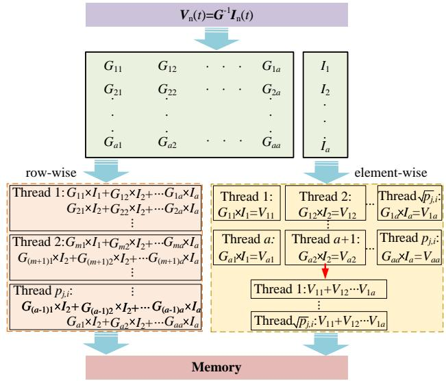  
Fig. 4. Schematic diagram of matrix partition by row-wise and element-wise for step 2.

To accurately quantify the impact of hardware on the solving time of a wind farm, the memory access time during subsystem solution must also be taken into account. This memory access time is closely related to the amount of memory occupied by the matrix elements involved in each subsystem. Moreover, when a subsystem is solved on a GPU, storing all matrix elements in registers may result in memory overflow due to the limited register capacity. Therefore, it is necessary to model the memory capacity requirements of subsystems. Meanwhile, the compressed sparse row (CSR) and compressed

sparse column (CSC) formats, as commonly used sparse matrix storage techniques, can substantially reduce the memory footprint of matrices, thereby facilitating the placement of data in memory regions that offer smaller capacity but faster access. Accordingly, when CSR or CSC formats are employed, the memory requirements of Steps 1, 2, and 3 can be expressed respectively as [29]

$$
\left\{ \begin{array}{l} M _ {j, 1} = B \cdot 4 l _ {j} \\ M _ {j, 2} = B \cdot \left(4 n _ {j} + 2 E _ {j} - 2\right) \\ M _ {j, 3} = B \cdot 2 k _ {j} \end{array} \right. \tag {11}
$$

where $M _ { j , i }$ are the GPU memory capacity requirements for step i in subsystem $j ; ~ l _ { j }$ is the number of inductors and capacitors contained in the subsystem $j ; ~ k _ { j }$ refers to the number of branches included in the subsystem j; B denotes the number of bytes occupied by a single matrix element. $E _ { j }$ represents the count of node pairs in the subsystem for which a branch connection exists.

# B. Bottom-Up Quantification Method for Solution Time

To fully utilize hardware resources while accurately assess-Memory capacity requirements (byte) Threa ing the hardware’s efficiency, it is necessary to quantify the…  …  …… computation time for each simulation step. j +

Fig. 5 generally illustrates the solution process for step iste Access  Multi-thread Parallel Write MAn in subsystem $j ,$ where the simulation steps in all subsystemsent ubs  Computing  Commun follow the same routine. The step routine is characterized as:ire S t… (i) the required matrix element values are retrieved from thereq tj+1,i,cal CPU or GPU memory; (ii) the matrix is solved using eitherurc step i the CPU or GPU; and (iii) the resulting matrix is writtenres em back to the CPU or GPU memory. In addition, to account forar sy Access Memory Parallel  And Mj,i pj,i Mj,i the communication requirements between this step and otherard Su simulation processes, a communication time is included. LettrM  t (trW+tcom) … the time to read 1 byte of data from memory be denoted asstep i $t _ { \mathrm { r M } }$ . Multiplying this by the amount of data to be read yieldsCalculating time (μs) the total memory read time. The computation time is denoted as $t _ { j , i , \mathrm { c a l } }$ . The time to write 1 byte of data is denoted as $t _ { \mathrm { w M } }$ , and the communication time between CPUs and GPUs via PCIe is denoted as $t _ { \mathrm { c o m } } .$ . Multiplying these parameters by the data volume of the matrix in this step yields the total time for memory writing and data communication.

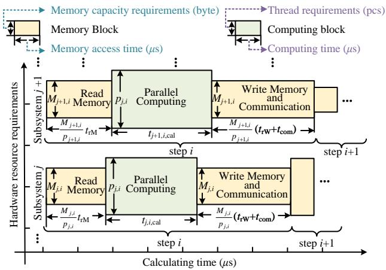  
Fig. 5. Schematic diagram of solution process for each step in all subsystem.

The matrix computation in both the CPU and the GPU is closely related to the hardware clock cycle and computational

performance. Therefore, the computation time for the matrix in step i of subsystem j can be expressed as [30]

$$
\left\{ \begin{array}{c} t _ {j, 1, \mathrm {h}} = T _ {\mathrm {h}} \cdot F _ {\mathrm {h}} \cdot \left(N _ {\mathrm {T}} \left(1, 2 l _ {j}, p _ {j, 2}, \right. \right. \\ \left. u _ {j, 1, \text {a d d}}, u _ {j, 1, \text {m u l}}, 0, u _ {j, 1, \text {t r i}}\right) + l _ {j}) / B \\ t _ {j, 2, \mathrm {h}} = T _ {\mathrm {h}} \cdot F _ {\mathrm {h}} \cdot N _ {\mathrm {T}} \left(n _ {j} - 1, n _ {j} - 1, p _ {j, 2}, 0, 0, 0, 0\right) / B \\ t _ {j, 3, \mathrm {h}} = T _ {\mathrm {h}} \cdot F _ {\mathrm {h}} \cdot N _ {\mathrm {T}} \left(1, k _ {j}, p _ {j, 2}, \right. \\ \left. u _ {j, 3, \text {a d d}}, u _ {j, 3, \text {m u l}}, u _ {j, 3, \text {d i v}}, u _ {j, 3, \text {t r i}}\right) / B \end{array} \right. \tag {12}
$$

Here, $h \in \{ \mathrm { C P U } , \mathrm { G P U } \}$ . When simulation step i of subsystem $j$ is solved on the CPU, $t _ { j , i , \mathrm { c a l } } = t _ { j , i , \mathrm { C P U } } ;$ when it is solved on the GPU, $t _ { j , i , \mathrm { c a l } } = t _ { j , i , \mathrm { G P U } } . \ T _ { \mathrm { C P U } }$ and $T _ { \mathrm { G P U } }$ denote the clock cycles of the CPU and GPU, respectively. $F _ { \mathrm { C P U } }$ and $F _ { \mathrm { G P U } }$ represent the number of Fused Multiply Add (FMA) units in the CPU and GPU, respectively. $u _ { j , 1 }$ ,add, $u _ { j , 1 }$ ,mul, $u _ { j , 1 , \mathrm { t r i } } ,$ , uj,3,add,uj,1,mul, $u _ { j , 3 , \mathrm { t r i } }$ and $u _ { j , 3 , \mathrm { d i v } } \mathrm { d }$ enote the numbers of addition, multiplication, trigonometric and division operations that need to be computed in step 1 and step $^ { 3 , }$ respectively. $N _ { \mathrm { T } }$ the maximum number of computations required by the threads to complete the solution of this step, $\mathrm { i . e . }$ , the number of execution cycles required for a single thread. Since the numbers of cycles required by the hardware to perform addition, multiplication, division, and trigonometric operations are all different, $N _ { \mathrm { T } }$ can be expressed as

$$
\begin{array}{l} N _ {\mathrm {T}} \left(a, b, p _ {j, i}, u _ {\mathrm {a d d}}, u _ {\mathrm {m u l}}, u _ {\mathrm {d i v}}, u _ {\mathrm {t r i}}\right) = q _ {\mathrm {m u l}} \operatorname {c e i l} \left(\frac {a \times b}{p _ {j , i}}\right) + \\ q _ {\mathrm {a d d}} \operatorname {c e i l} \left[ \frac {a \times (b - 1)}{p _ {j , i}} \right] + q _ {\mathrm {a d d}} u _ {\mathrm {a d d}} + q _ {\mathrm {m u l}} u _ {\mathrm {m u l}} \\ + q _ {\mathrm {d i v}} u _ {\mathrm {d i v}} + q _ {\mathrm {t r i}} u _ {\mathrm {t r i}} \tag {13} \\ \end{array}
$$

where, a and b denote the number of rows and columns of step i+1the left matrix in the matrix multiplication, respectively. $u _ { \mathrm { a d d } } ,$ $u _ { \mathrm { m u l } } , \ u _ { \mathrm { d i v } }$ and $u _ { \mathrm { t r i } }$ denote the numbers of additional addition, multiplication, division, and trigonometric operations executed in the step, respectively. The coefficients qadd, qmul, qdiv, and $q _ { \mathrm { t r i } }$ represent the hardware cycle counts associated with a single addition, multiplication, division, and trigonometric operation, respectively, and can be characterized using the microbenchmarking methodology presented in [31].

Considering the intrinsic memory access latency in the CPU and GPU, the total computation time for step i of subsystem j can be expressed as

$$
\left\{ \begin{array}{c} t _ {j, 1} = \left(t _ {\mathrm {r M}} + t _ {\mathrm {w M}} + t _ {\mathrm {c o m}}\right) \frac {M _ {j , 1}}{p _ {j , 1}} \\ \quad + 2 t _ {\mathrm {l t c}, \mathrm {M}} + t _ {\mathrm {l t c}, \mathrm {C}} + t _ {j, 1, \mathrm {c a l}} \\ t _ {j, 2} = \left(t _ {\mathrm {r M}} + t _ {\mathrm {w M}} + t _ {\mathrm {c o m}}\right) \frac {M _ {j , 2}}{p _ {j , 2}} \\ \quad + 2 t _ {\mathrm {l t c}, \mathrm {M}} + t _ {\mathrm {l t c}, \mathrm {C}} + t _ {j, 2, \mathrm {c a l}} \\ t _ {j, 3} = \left(t _ {\mathrm {r M}} + t _ {\mathrm {w M}} + t _ {\mathrm {c o m}}\right) \frac {M _ {j , 3}}{p _ {j , 3}} \\ \quad + 2 t _ {\mathrm {l t c}, \mathrm {M}} + t _ {\mathrm {l t c}, \mathrm {C}} + t _ {j, 3, \mathrm {c a l}} \end{array} \right. \tag {14}
$$

where $t _ { { \mathrm { l t c } } , \mathbf { M } }$ denotes the intrinsic latency associated with memory access, and $t _ { \mathrm { l t c , C } }$ represents the intrinsic latency introduced by CPU–GPU communication over PCIe.

When the computation time of a single element in the result matrix is less than its storage time, the hardware releases thread resources after each round of computation is completed for the next round of computation. In this case, writing data to memory is the bottleneck during the execution of step i. Therefore, (14) can be reformulated in a more precise way,

$$
\left\{ \begin{array}{r l} \bar {t} _ {j, 1} & = \left(t _ {\mathrm {r M}} + t _ {\mathrm {w M}} + t _ {\mathrm {c o m}} - t _ {j, 1, \mathrm {c a l}}\right) \frac {M _ {j , 1}}{p _ {j , 1}} \\ & + 2 t _ {\mathrm {l t c}, \mathrm {M}} + t _ {\mathrm {l t c}, \mathrm {C}} + t _ {j, 1, \mathrm {c a l}} \\ \bar {t} _ {j, 2} & = \left(t _ {\mathrm {r M}} + t _ {\mathrm {w M}} + t _ {\mathrm {c o m}} - t _ {j, 2, \mathrm {c a l}}\right) \frac {M _ {j , 2}}{p _ {j , 2}} \\ & + 2 t _ {\mathrm {l t c}, \mathrm {M}} + t _ {\mathrm {l t c}, \mathrm {C}} + t _ {j, 2, \mathrm {c a l}} \\ \bar {t} _ {j, 3} & = \left(t _ {\mathrm {r M}} + t _ {\mathrm {w M}} + t _ {\mathrm {c o m}} - t _ {j, 3, \mathrm {c a l}}\right) \frac {M _ {j , 3}}{p _ {j , 3}} \\ & + 2 t _ {\mathrm {l t c}, \mathrm {M}} + t _ {\mathrm {l t c}, \mathrm {C}} + t _ {j, 3, \mathrm {c a l}} \end{array} \right. \tag {15}
$$

When the computation time for a single element in the result matrix is greater than or equal to its storage time, the storage operation in each round is overlapped with the computation operation of that round. In this case, matrix computation becomes the bottleneck in the execution process of step i. Consequently, (14) can be reformulated in a precise form as follows

$$
\left\{ \begin{array}{r l} \tilde {t} _ {j, 1} & = t _ {\mathrm {r M}} + t _ {\mathrm {w M}} + t _ {\mathrm {c o m}} + 2 t _ {\mathrm {l t c}, \mathrm {M}} + t _ {\mathrm {l t c}, \mathrm {C}} + t _ {j, 1, \mathrm {c a l}} \\ \tilde {t} _ {j, 2} & = + (n _ {j} - 1) t _ {\mathrm {r M}} + t _ {\mathrm {w M}} + t _ {\mathrm {c o m}} \\ & + 2 t _ {\mathrm {l t c}, \mathrm {M}} + t _ {\mathrm {l t c}, \mathrm {C}} + t _ {j, 2, \mathrm {c a l}} \\ \tilde {t} _ {j, 3} & = t _ {\mathrm {r M}} + t _ {\mathrm {w M}} + t _ {\mathrm {c o m}} + 2 t _ {\mathrm {l t c}, \mathrm {M}} + t _ {\mathrm {l t c}, \mathrm {C}} + t _ {j, 3, \mathrm {c a l}} \end{array} \right. \tag {16}
$$

# IV. FORMULATION OF ENHANCEMENT OF FGOAM

To optimally allocate the simulation models to suitable hardware, it is necessary to formulate a fine-grained optimal allocation model based on the computational resource requirements and solution time. To this end, Section IV-A formulates the model optimization and allocation problem as an INLP problem and constructs the FGOAM, with the objective of minimizing the solution time at each step. To accelerate the solution of the optimal allocation strategy, Section IV-B proposes the E-FGOAM, which is developed based on the principle of minimizing communication time.

# A. Fine-Grained Optimal Allocation Method

To enable a fine-grained optimal allocation of each step within a subsystem, three types of decision variables are defined. (i) The decision variable used to determine the computing hardware for each simulation step is denoted as $x _ { j , i } ^ { w }$ . Here, $x _ { j , i } ^ { w } = 0$ indicates that step i of subsystem $j$ of the w-th wind turbine is assigned to the CPU for computation, while $x _ { j , i } ^ { w } = 1$ indicates that the step is assigned to the GPU for computation. (ii) The decision variables used to determine the data storage location is denoted as ywCj,i $y _ { j , i } ^ { w C }$ and 1 $y _ { j , i } ^ { w G }$ When $y _ { j , i } ^ { w C } = 0$ and $y _ { j , i } ^ { w G } = 0$ , the solution data of subsystem $j$ at step i are stored in the CPU L1 cache or GPU registers, respectively. When ywCj,i $y _ { j , i } ^ { w C } = 1$ and $y _ { j , i } ^ { w G } = 1$ , the data are stored in the CPU L2 cache or GPU shared memory, respectively. When ywCj,i $y _ { j , i } ^ { w C } = 2$ and $y _ { j , i } ^ { w G } = 2$ , the data are stored in the CPU L3 cache or GPU global memory, respectively. (iii) The

decision variable used to identify whether computation time or storage time is the bottleneck is denoted as $z _ { j , i }$ , where $z _ { j , i } ^ { w } = 0$ indicates that the computation time is greater than or equal to the storage time, and $z _ { j , i } ^ { w } = 1$ indicates that the computation time is less than the storage time.

After introducing the decision variables, the memory access latency $t _ { \mathrm { r M } }$ and the write latency $t _ { \mathrm { w M } }$ can be expressed as follows

$$
t _ {\mathrm {r M}} = \left(1 - x _ {j, i} ^ {w}\right) t _ {\mathrm {r M C} y _ {j, i} ^ {C}} + x _ {j, i} ^ {w} t _ {\mathrm {r M G} y _ {j, i} ^ {G}} \tag {17}
$$

$$
t _ {\mathrm {w M}} = \left(1 - x _ {j, i} ^ {w}\right) t _ {\mathrm {w M C} y _ {j, i} ^ {C}} + x _ {j, i} ^ {w} t _ {\mathrm {w M G} y _ {j, i} ^ {G}} \tag {18}
$$

$$
t _ {\mathrm {l t c}, \mathbf {M}} = \left(1 - x _ {j, i} ^ {w}\right) t _ {\mathrm {l t c}, \mathrm {M} y _ {j, i} ^ {C}} ^ {C} + x _ {j, i} ^ {w} t _ {\mathrm {l t c}, \mathrm {M} y _ {j, i} ^ {G}} ^ {G} \tag {19}
$$

where $t _ { \mathrm { r M C } i }$ and $t _ { \mathrm { w M C } i } ~ ( i = 1 , 2 , 3 )$ denote the access latency and write latency to the CPU L1 cache, L2 cache and L3 cache, respectively [29]; $t _ { \mathrm { r M G } i }$ and $t _ { \mathrm { w M G } i } ~ ( i = 1 , 2 , 3 )$ denote the access latency and write latency to GPU register, shared memory, and global memory, respectively [31]. $t _ { \mathrm { l t c , } \mathrm { M } i } ^ { C }$ and $t _ { \mathrm { l t c , M } i } ^ { G } ~ ( i = 1 , 2 , 3 ~ )$ denote the intrinsic access latencies of the CPU cache levels and the GPU memory levels, respectively.

Based on (12) and decision variables, the calculation time of $t _ { j , i , \mathrm { c a l } }$ hardware for each step of the same topology subsystem can be expressed as

$$
t _ {j, i, \text {c a l}} = \left[ \left(1 - x _ {j, i} ^ {w}\right) t _ {j, i, \text {C P U}} + x _ {j, i} ^ {w} t _ {j, i, \text {G P U}} \right] \tag {20}
$$

Considering both hardware thread constraints and memory constraints, FGOAM can be formulated as an INLP problem, given as

$$
\begin{array}{l} \min . \left\{\max  _ {j \in \{1, 5, 7, 8 W + 1 \}} \sum_ {i = 1} ^ {3} \left[ z _ {j, i} ^ {w} \bar {t} _ {j, i} + \left(1 - z _ {j, i} ^ {w}\right) \tilde {t} _ {j, i} \right] \right. \\ \left. + \max  _ {j \in \{2, 3, 4, 6, 8 \}} \sum_ {i = 1} ^ {3} \left[ z _ {j, i} ^ {w} \tilde {t} _ {j, i} + \left(1 - z _ {j, i} ^ {w}\right) \tilde {t} _ {j, i} \right] \right\} \tag {21a} \\ \end{array}
$$

$$
\begin{array}{l} \sum_ {j = 1} ^ {8 W + 1} \sum_ {i = 1} ^ {3} x _ {j, i} ^ {w} p _ {j, i} \leq N _ {\mathrm {G P U}} (21c) \\ \sum_ {j = 1} ^ {8 W + 1} \sum_ {i = 1} ^ {3} \left(1 - x _ {j, i} ^ {w}\right) f _ {0} \left(y _ {j, i} ^ {w C}\right) M _ {j, i} \leq M _ {\mathrm {C P U}, 1} (21d) \\ \sum_ {j = 1} ^ {8 W + 1} \sum_ {i = 1} ^ {3} \left(1 - x _ {j, i} ^ {w}\right) f _ {1} \left(y _ {j, i} ^ {w C}\right) M _ {j, i} \leq M _ {\mathrm {C P U}, 2} (21e) \\ \sum_ {j = 1} ^ {8 W + 1} \sum_ {i = 1} ^ {3} \left(1 - x _ {j, i} ^ {w}\right) f _ {2} \left(y _ {j, i} ^ {w C}\right) M _ {j, i} \leq M _ {\mathrm {C P U}, 3} (21f) \\ \sum_ {j = 1} ^ {8 W + 1} \sum_ {i = 1} ^ {3} x _ {j, i} ^ {w} f _ {0} \left(y _ {j, i} ^ {w G}\right) M _ {j, i} \leq M _ {\mathrm {G P U}, 1} (21g) \\ \sum_ {j = 1} ^ {8 W + 1} \sum_ {i = 1} ^ {3} x _ {j, i} ^ {w} f _ {1} \left(y _ {j, i} ^ {w G}\right) M _ {j, i} \leq M _ {\mathrm {G P U}, 2} (21h) \\ \end{array}
$$

$$
\sum_ {j = 1} ^ {8 W + 1} \sum_ {i = 1} ^ {3} x _ {j, i} ^ {w} f _ {2} \left(y _ {j, i} ^ {w G}\right) M _ {j, i} \leq M _ {\mathrm {G P U}, 3} \tag {21i}
$$

$$
t _ {j, i, \text {c a l}} - t _ {\mathrm {w M}} \geq - z _ {j, i} ^ {w} \cdot M \quad \forall j, i \tag {21j}
$$

$$
t _ {j, i, \text {c a l}} - t _ {\mathrm {w M}} <   \left(1 - z _ {j, i} ^ {w}\right) \cdot M \quad \forall j, i \tag {21k}
$$

where $N _ { \mathrm { G P U } }$ represents the maximum number of threads on the GPU; $M _ { \mathrm { G P U } , i } ~ ( i ~ = ~ 1 , ~ 2 , ~ 3 )$ are GPU register, shared memory and global memory capacity respectively. $M _ { \mathrm { C P U } , i }$ $( i = 1 , 2 , 3 )$ denote the L1, L2, and L3 caches of the CPU, respectively. (21a) is the objective function set to minimize the solution time of the wind farm model. It adopts a minmax structure to capture the time characteristics of both serial and parallel simulation steps. Constraints (21b) - (21c) define the thread limitations of the CPU and GPU, respectively. Constraints (21d) - (21f) are introduced to determine the selected CPU cache level and its associated intrinsic latency and bandwidth in the objective function. Constraints (21g) - (21i) are introduced to determine the selected GPU memory level and its associated intrinsic latency and bandwidth in the objective function, while preventing memory overflow across the GPU memory hierarchy. Constraints (21j) – (21k) are designed to identify whether the bottleneck lies in computation time or storage time, thereby determining whether (15) or (16) should be used to calculate the simulation time of a step. These constraints are formulated using the big M method, where M denotes a sufficiently large constant. $f _ { e } ( y ) ~ ( e = 0 , 1 , 2 )$ is an auxiliary decision variable set to avoid CPU and GPU memory overflow at all levels, which can be expressed as

$$
f _ {0} \left(y _ {j, i}\right) = \left\{ \begin{array}{l} 1, y _ {j, i} = 0 \\ 0, y _ {j, i} \neq 0 \end{array} , f _ {1} \left(y _ {j, i}\right) = \left\{ \begin{array}{l} 1, y _ {j, i} = 1 \\ 0, y _ {j, i} \neq 1 \end{array} , \right. \right. \tag {22}
$$

$$
f _ {2} \left(y _ {j, i}\right) = \left\{ \begin{array}{l l} 1, y _ {j, i} = 2 \\ 0, y _ {j, i} \neq 2 \end{array} \right.
$$

After constructing FGOAM, the fine-grained allocation problem of the decoupled wind farm model is formulated as an integer linear programming (ILP) problem. By solving the decision variables, each simulation step of every subsystem is bound to a specific hardware device, while the corresponding memory hierarchy level for storing voltage and current data, as well as the number of hardware threads to be launched, are determined. This enables different simulation steps of different wind farm subsystems to be executed on the most suitable hardware, thereby achieving optimal acceleration of the overall wind farm simulation.

# B. Enhanced Fine-Grained Optimal Allocation Method

By decoupling wind turbines, the decision variables in FGOAM are extended to each step within subsystems, making the method applicable to various types of wind turbines. However, since different types of wind turbines can each be decoupled into approximately 7 to 8 subsystems, and each subsystem can be further divided into 3 simulation steps, the number of integer decision variables in FGOAM increases multiplicatively as the number of wind turbines in the wind farm grows. According to (23), for a wind farm consisting of only three turbines, the number of integer variables to be solved can reach nearly 300. Given the relatively low effi-

ciency of commonly used solvers in handling integer programming problems, this leads to prolonged model allocation times. To address this issue, this section optimizes FGOAM and introduces an enhanced approach, referred to as E-FGOAM.

$$
\text {F G O A M :} \underbrace {W} _ {\text {N o . o f}} \times \underbrace {8} _ {\text {N o . o f s u b s y s t e m s}} \times \underbrace {3} _ {\text {N o . o f s t e p s}} \times \underbrace {4} _ {\text {N o . o f v a r i a b l e t y p e s}} = 9 6 W
$$

$$
\text {E - F G O A M :} \underbrace {W} _ {\text {N o . o f}} \times \underbrace {8} _ {\text {N o . o f s u b s y s t e m s}} \times \underbrace {4} _ {\text {N o . o f v a r i a b l e t y p e s}} = 3 2 W
$$

(23)

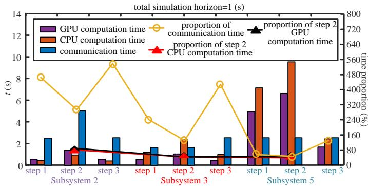  
Fig. 6. Bar chart of simulation and communication time for subsystems 2, 3, and 5.

Fig. 6 records the computing time (tested either on a GPU or a CPU) and the communication overhead for each simulation step for subsystems 2, 3 and 5, where subsystems 2 and 3 have relatively lower computational and communication demands, and the subsystem 5 is characterized with higher demands. Communication overhead accounts for approximately 50% of the total solution time in each step, indicating that the acceleration achieved by high-performance simulation hardware is insufficient to offset the communication cost. Therefore, further reduce communication time would benefit overall simulation efficiency It is important to minimize the communication frequency between the CPU and GPU for each step. Furthermore, an analysis of matrix sizes to be solved in steps 1, 2, and 3 reveals that step 2 contributes more than half of the total computational load, as shown in Fig. 6. The optimization of allocation leads to a more significant improvement in the simulation efficiency of step 2.

Therefore, to reduce the number of decision variables without compromising the optimality of the allocation, E-FGOAM is constructed based on the following principles. (i) Minimization of communication time: Allocate subsystems as a whole to the solving hardware. (ii) Efficient simulation: To ensure that the reduction in decision variables does not impact allocation optimality and simulation efficiency, allocate step 1 and step 3 to the same hardware as step 2. (iii) Uniform allocation for subsystems with the same node count: For subsystems within the decoupled wind turbine model that have the same number of nodes and identical matrix order and computational loads in step 2, allocate them to the same hardware.

Finally, the E-FGOAM can reduce the number of integer decision variables by performing subsystem-level model allocation for wind farms. As shown in (23), the proposed approach reduces the number of integer variables required by

approximately 66%. This reduction significantly enhances thecation results efficiency of solving the allocation problem.ND

The allocation process of E-FGOAM is illustrated in Fig.GOAM: + 7. First, the wind farm is decoupled, and the numbers of inductors, capacitors, nodes, and branches contained in each subsystem are analyzed. Then, decision variables are assigned to each step of each subsystem. Finally, after merging the decision variables, the ILP problem is solved.

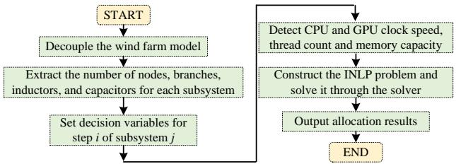  
Fig. 7. The flowchart of FGOAM and E-FGOAM.

# V. CASE STUDY

The simulation studies are conducted on a wind farm with varying numbers of wind turbines, as illustrated in Fig. 1. The key parameters of wind turbines and wind farms are given in Table I. The decoupled models of the wind farm are implemented using CUDA code and parallel simulations are performed on a workstation equipped with an AMD Ryzen 7 5800H CPU and a GeForce RTX 3060 GPU. Comprehensive studies are carried out to validate the accuracy and efficiency of the proposed quantification and allocation methods. In particular, Section V-A verifies the quantification accuracy of solution time and hardware resources by comparing the real simulation time and the quantified time. Section V-B presents the model allocation results using the proposed FGOAM, E-FGOAM and rule-based allocation method. Additionally, the effectiveness of the proposed allocation method on improving simulation efficiency is fully validated from several to hunderds of wind turbines. Finally, the simulation results of the wind farm under startup, steady-state, and fault conditions are given in Section V-C to demonstrate the effectiveness of CPU-GPU parallel simulation after optimal model allocation.

Since controller design is not the focus of this work, identical control settings are adopted for all wind turbines in the subsequent simulations. In addition, to prevent the computational cost of solving the control system from consuming excessive resources and thereby affecting the solution of the electrical system and the accuracy of simulation time measurements, the control system is assigned to the GPU in the CPU–GPU heterogeneous simulation platform. Owing to the large number of available threads on the GPU, a dedicated thread is allocated to each controller to enable efficient parallel solution of the control system. In contrast, for the multi-threaded CPU-based simulation platform used as the baseline, the control system is still assigned to the CPU, with corresponding CPU threads allocated for its solution.

# A. Accuracy of Bottom-Up Quantification

We compare the real simulation time (ST) and quantified time (QT) from a few wind turbines to 200 wind turbines to validate the accuracy of the proposed bottom-up quantification

TABLE I KEY PARAMETERS OF THE WIND FARM   

<table><tr><td>Category</td><td>Parameters</td><td>Value</td></tr><tr><td rowspan="6">DFIG</td><td>Nominal power (W)</td><td>1.5×10^6</td></tr><tr><td>Nominal voltage (V)</td><td>690</td></tr><tr><td>Stator leakage inductance (H)</td><td>0.087×10^-3</td></tr><tr><td>Rotor leakage inductance (H)</td><td>0.087×10^-3</td></tr><tr><td>Mutual inductance (H)</td><td>2.5×10^-3</td></tr><tr><td>Stator and rotor resistance (Ω)</td><td>2.6×10^-3</td></tr><tr><td rowspan="3">Converter</td><td>DC-side capacitance (F)</td><td>0.16</td></tr><tr><td>Switching frequency (Hz)</td><td>4000</td></tr><tr><td>On-state resistance (Ω)</td><td>1×10^-3</td></tr><tr><td rowspan="3">10kV/0.69kV Transformer</td><td>Connection mode</td><td>D/yn</td></tr><tr><td>Winding resistance (Ω)</td><td>1×10^-5</td></tr><tr><td>Winding inductance (H)</td><td>1×10^-3</td></tr><tr><td rowspan="3">Filter</td><td>Grid-side inductance (H)</td><td>8×10^-4</td></tr><tr><td>Rotor-side inductance (H)</td><td>4×10^-4</td></tr><tr><td>Capacitance (F)</td><td>6×10^-5</td></tr><tr><td rowspan="3">Transmission Line</td><td>Resistance (Ω/km)</td><td>0.211</td></tr><tr><td>Inductance (H/km)</td><td>3.8×10^-4</td></tr><tr><td>Capacitance (F/km)</td><td>2×10^-7</td></tr><tr><td rowspan="3">220kV/10kV Transformer</td><td>Connection mode</td><td>YN/yn</td></tr><tr><td>Winding resistance (Ω)</td><td>1×10^-5</td></tr><tr><td>Winding inductance (H)</td><td>1×10^-3</td></tr></table>

method. Fig. 8 depicts ST and QT of each subsystem for various wind farm scales on the CPU, while Fig. 9 presents ST and QT on the GPU. The step size is set to 5 µs with a total simulation horizon of 1 s. For subsystems indexed as 8w − z (z = 0 ∼ 7), ST and QT represent the total ST and QT values, respectively, aggregated across all such subsystems under the corresponding number of wind turbines shown on the x-axis. The results demonstrate that the proposed solution time quantification method aligns well with the real-world simulation timelines. However, due to slight fluctuations in the hardware clock cycle, a small discrepancy is observed in Fig. 8 and Fig. 9 between the measured and quantified time.

In Fig. 8, the CPU has higher efficiency with small numbers of wind turbines due to the higher clock frequency. However, the solution time increases linearly with the number of wind turbines since the total number of CPU threads is limited. The SR and QT for subsystems with a large number of nodes, e.g., the subsystem 8W + 1, increase more rapidly.

In contrast, the GPU operates at a lower clock frequency with the advantage of tens of thousands of threads. Consequently, for simulation involving a smaller number of turbines, the GPU efficiency is lower than that of the CPU. However, as the number of wind turbines increases, the multi-threaded advantage of the GPU is leveraged. Element-wise partitioning can still be applied to steps 1∼3 of the subsystem, allowing for parallel execution. As a result, the computational time on the GPU only increases marginally from scenarios with fewer turbines to large-scale wind farms. Nevertheless, when the number of wind turbines reaches 230, the number of elements in the wind farm admittance matrix exceeds the total number

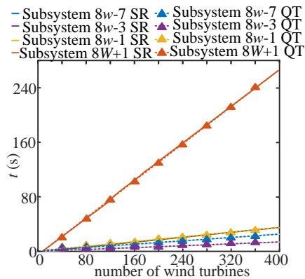  
(a)

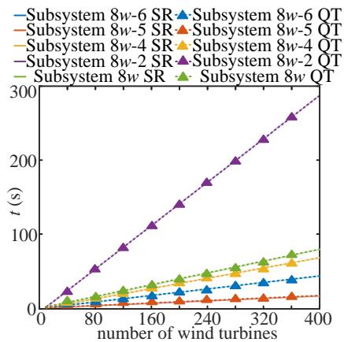  
  
Fig. 8. ST and QT of decoupled wind farm models in CPU. (a) ST and QT for subsystems 8w-7, 8w-3, 8w-1 and 8W +1. (b) ST and QT for subsystems 8w-6, 8w-5, 8w-4, 8w-2 and 8w.

of available GPU threads. Under this condition, the newly added turbines prevent the GPU from maintaining the elementwise parallel solution of step 2 in each subsystem, as illustrated in Fig. 4. Consequently, the computational workload of some GPU threads increases substantially, thereby slowing down the overall solution time of the subsystem.

# B. Efficiency of FGOAM and E-FGOAM

Fig. 10 illustrates the allocation results for each subsystem of various wind farms using FGOAM, E-FGOAM, and the rule-based allocation method. In the figure, the GPU execution ratio represents the proportion of subsystems that are solved on the GPU. A GPU execution ratio of 100% indicates that the corresponding subsystem is entirely assigned to the GPU for computation, whereas a value of 0% indicates that it is entirely assigned to the CPU. Particularly, the final solution of the decision variables for computing hardware assignment, namely $x _ { j , i }$ , is presented to visually highlight the allocation of subsystems to computing hardware under varying numbers of wind turbines. Table II reports the simulation times of the decoupled model for varying turbine counts under CPU-only and CPU-GPU heterogeneous allocation methods. The rulebased allocation method overlooks the influence of wind farm scales on model allocation. It simply allocate wind turbine models to the GPU and the collection system to the CPU. As a result, when the number of wind turbines is small, the use of the GPU significantly increases the simulation time.

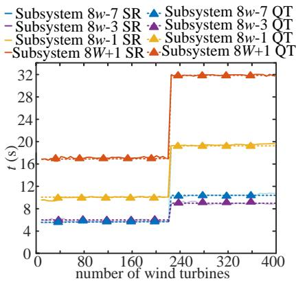  
(a)

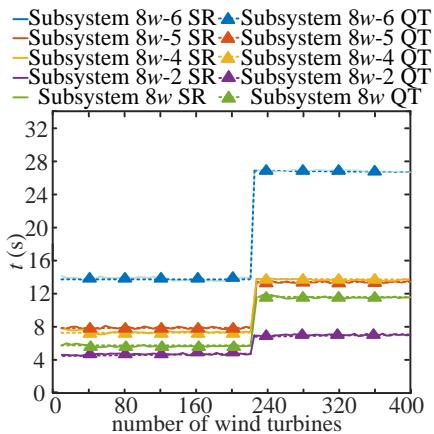

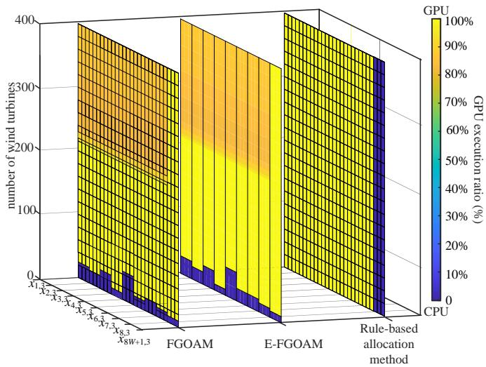  
Fig. 9. ST and QT of decoupled wind farm models in GPU. (a) ST and QT of subsystems 8w-7, 8w-3, 8w-1 and 8W +1. (b) ST and QT of subsystems 8w-6, 8w-5, 8w-4, 8w-2 and 8w.   
Fig. 10. Model allocation results using FGOAM, E-FGOAM, and the rulebased allocation method.

Compared with the rule-based allocation method, the proposed FGOAM fully accounts for the heterogeneous hardware’s efficiency in solving different subsystems and the influence of turbine numbers on simulation time. By targeting minimum computing costs, wind farm simulation models are allocated at fine-grained step level with appropriately assigned threads and memory resources. As shown in Fig. 10, because steps 1 and 3 involve relatively small computational loads, the performance improvements afforded by high-performance

hardware cannot compensate for the communication overhead. Accordingly, under the FGOAM, steps 1 and 3 are co-located with step 2 on the same hardware for solution.

Compared to FGOAM, E-FGOAM allocates subsystems as a whole, reducing the computational load during allocation. In addition, subsystems 8w-7, 8w-2, and 8w-1 have the same number of nodes. As a result, the Step 2 solution locations of these three subsystems are identical, and they are therefore assigned to the same computing hardware. As shown in the Fig. 10, E-FGOAM differs from FGOAM only in the allocation location of subsystems 8w-2 and 8w-1 when the number of wind turbines ranges from 15 to 30.

As shown in Table II, compared with the CPU-only simulator, the CPU-GPU simulator demonstrates significantly higher simulation efficiency when dealing with large-scale wind farms. However, for small- and medium-scale wind farms, an improperly designed allocation strategy can lead to much longer simulation times on the CPU-GPU simulator than on the CPU simulator. After applying the proposed FGOAM and E-FGOAM, the CPU–GPU simulator achieves high simulation efficiency across wind farms of different scales. When the wind farm scale is small, FGOAM and E-FGOAM fully exploit the high clock frequency of the CPU by assigning a larger portion of subsystems to the CPU. Compared with the rulebased allocation method, the simulation efficiency is improved by up to 4.76 times. As the wind farm scale gradually increases to 50–200 wind turbines, the proposed methods further leverage the massive parallelism of the GPU by allocating more subsystems to the GPU. Compared with CPU-based parallel simulation, the wind farm model achieves a speedup of up to 12 times after fine-grained deployment. When the wind farm scale further increases to 230 wind turbines, the number of elements in the wind farm admittance matrix exceeds the total number of available GPU threads. Under this condition, the rule-based allocation method still assigns all wind turbines to the GPU, which causes the computational workload of some GPU threads to increase significantly and slows down the overall simulation. In contrast, FGOAM and E-FGOAM dynamically reuse the idle CPU resources by assigning the newly added wind turbines to the CPU until the CPU solution time becomes comparable to that of the GPU. To avoid the CPU becoming the performance bottleneck, subsequent turbines are then reassigned to the GPU, thereby maintaining a balanced workload and sustaining high simulation efficiency.

TABLE II COMPARISON OF SIMULATION TIME   

<table><tr><td rowspan="2">Number of wind turbines</td><td colspan="2">CPU</td><td colspan="2">CPU-GPU</td></tr><tr><td>Multi-threaded (s)</td><td>FGOAM (s)</td><td>E-FGOAM (s)</td><td>Rule-based allocation method (s)</td></tr><tr><td>1</td><td>6.41</td><td>6.41</td><td>6.71</td><td>30.51</td></tr><tr><td>10</td><td>23.99</td><td>12.47</td><td>12.71</td><td>30.81</td></tr><tr><td>20</td><td>43.57</td><td>15.95</td><td>16.64</td><td>30.84</td></tr><tr><td>30</td><td>63.03</td><td>18.26</td><td>18.67</td><td>30.88</td></tr><tr><td>50</td><td>103.12</td><td>24.48</td><td>25.48</td><td>33.07</td></tr><tr><td>100</td><td>199.78</td><td>33.27</td><td>33.78</td><td>34.28</td></tr><tr><td>200</td><td>407.38</td><td>33.33</td><td>34.50</td><td>35.66</td></tr><tr><td>250</td><td>507.39</td><td>38.69</td><td>39.41</td><td>58.91</td></tr><tr><td>300</td><td>608.60</td><td>57.19</td><td>58.01</td><td>59.72</td></tr><tr><td>400</td><td>801.12</td><td>57.28</td><td>58.79</td><td>59.69</td></tr></table>

Table III summarizes the allocation time of FGOAM and

E-FGOAM for wind farms with different numbers of wind turbines and different turbine types. Three turbine types are considered: a DFIG-based wind turbine decoupled into eight subsystems, a three-level-converter-based DFIG wind turbine decoupled into eight subsystems, and a PMSG-based wind turbine decoupled into seven subsystems.

As shown in Table III, when the number of wind turbines is small, both FGOAM and E-FGOAM incur relatively short allocation times. However, as the number of wind turbines increases, the number of decision variables grows accordingly. When the number of wind turbines reaches 250, the allocation time of FGOAM increases to a level close to the execution time of the wind farm simulation at 1 s. The efficiency advantage of FGOAM over the rule-based allocation method is gradually reduced.

In contrast, the allocation time of E-FGOAM remains at a relatively low level. Compared with FGOAM, E-FGOAM reduces the allocation time by approximately 70%. Consequently, even at large wind farm scales, the performance gains achieved by optimized allocation using E-FGOAM are sufficient to compensate for the additional allocation overhead.

TABLE III ALLOCATION TIME OF FGOAM AND E-FGOAM UNDER DIFFERENT WIND FARM CONFIGURATIONS   

<table><tr><td rowspan="2">Number of wind turbines</td><td colspan="3">FGOAM (s)</td><td colspan="3">E-FGOAM (s)</td></tr><tr><td>Single-type wind farm</td><td>Two-type wind farm</td><td>Three-type wind farm</td><td>Single-type wind farm</td><td>Two-type wind farm</td><td>Three-type wind farm</td></tr><tr><td>1</td><td>0.11</td><td>0.12</td><td>0.10</td><td>0.04</td><td>0.05</td><td>0.04</td></tr><tr><td>10</td><td>0.96</td><td>0.95</td><td>0.87</td><td>0.37</td><td>0.38</td><td>0.33</td></tr><tr><td>50</td><td>4.76</td><td>4.70</td><td>4.29</td><td>1.85</td><td>1.79</td><td>1.62</td></tr><tr><td>100</td><td>9.51</td><td>9.61</td><td>8.57</td><td>3.69</td><td>3.81</td><td>3.23</td></tr><tr><td>200</td><td>19.00</td><td>19.52</td><td>17.12</td><td>7.38</td><td>7.52</td><td>6.46</td></tr><tr><td>250</td><td>23.79</td><td>23.49</td><td>21.40</td><td>9.22</td><td>9.63</td><td>8.07</td></tr><tr><td>300</td><td>28.50</td><td>27.40</td><td>25.68</td><td>11.07</td><td>11.75</td><td>9.68</td></tr><tr><td>400</td><td>38.00</td><td>38.54</td><td>34.23</td><td>14.75</td><td>14.95</td><td>12.91</td></tr></table>

# C. Simulation Results after Fine-Grained Optimal Allocation

To evaluate the impact of the proposed FGOAM and E-FGOAM on simulation accuracy, the detailed wind farm model implemented in MATLAB/Simulink is compared with the decoupled model after optimal allocation. For the wind farm topology shown in Fig. 1(a), the number of wind turbines is selected as 6. The simulation is conducted with a time step of 5 µs and a total simulation horizon of 10 s.

Fig. 11 shows the simulated waveforms of the DC side voltage and stator side current during the startup and steadystate operation of the wind farm. The comparison demonstrates that the proposed FGOAM and E-FGOAM maintain excellent agreement with the detailed model. The maximum simulation error is below 1%. To further evaluate simulation accuracy under fault conditions, a voltage drop fault contingency occurs at the point of common coupling at t=9 s. The resulting waveforms are presented in Fig. 12. A comparison with the detailed model indicates that the proposed allocation methods preserve high simulation accuracy at both fault initiation and clearance stages, with a maximum deviation of 0.81%.

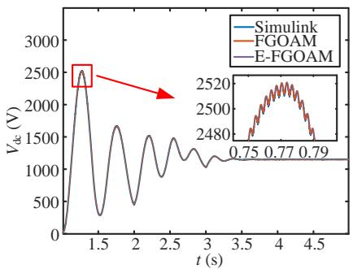  
(a)

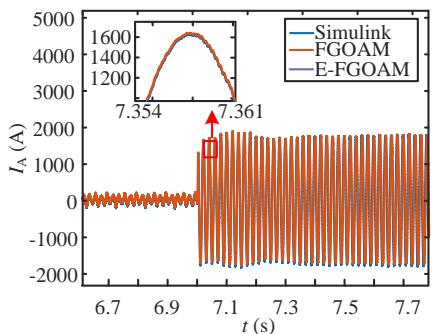

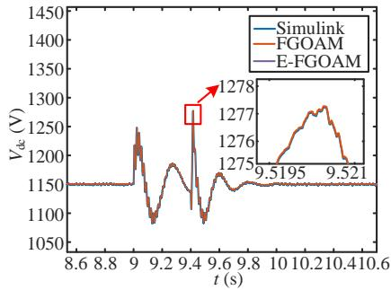  
Fig. 11. Simulation waveforms during wind farm startup and steady stages. (a) DC side voltage of DFIG 1. (b) Stator side current of DFIG 1.   
(a)

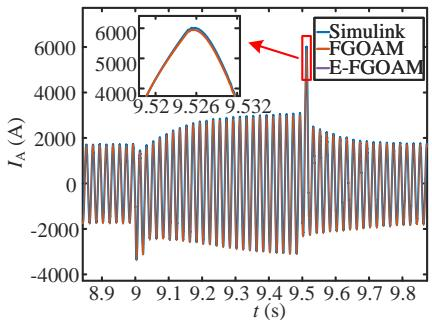  
  
Fig. 12. Simulation waveforms during the wind farm fault stage. (a) DC side voltage of DFIG 1. (b) Stator side current of DFIG 1.

# VI. CONCLUSION

To accelerate wind farm EMT simulation on the CPU–GPU heterogeneous architecture, this paper presents a fine-grained optimal allocation method for decoupled wind farm models. By analyzing the decoupled subsystem scales, computational workloads, and hardware matrix solution efficiency, we precisely quantify the model’s solution time and computing resource requirements. Targeting the minimization of simu-

lation time under hardware thread and memory constraints, we develop the FGOAM to achieve the optimal adaptation between the model and the hardware. To reduce the solving complexity of integer programming of FGOAM, the proposed E-FGOAM reduces the number of integer decision variables, thereby enabling efficient allocation of the wind farm decoupled models. Finally, simulation results verify the accuracy of the proposed quantification method and demonstrate the improvements on simulation efficiency achieved by both FGOAM and E-FGOAM across wind farms of varying scales. For a wind farm with 400 turbines, the optimal allocation on a CPU–GPU heterogeneous simulation platform increases simulation speed by two orders of magnitude compared to a CPU-only parallel solution.

However, the proposed FGOAM and E-FGOAM require the optimization objective functions and constraints to be reconstructed when applied to different types of wind farms. Future work will focus on further improving the formulation process of the objective functions and constraints.

# REFERENCES

[1] L. M. Castro and E. Acha, “On the dynamic modeling of marine VSC-HVDC power grids including offshore wind farms,” IEEE Trans. Sustain. Energy, vol. 11, no. 4, pp. 2889–2900, Oct. 2020.   
[2] N. Shabanikia, A. A. Nia, A. Tabesh, and S. A. Khajehoddin, “Weighted dynamic aggregation modeling of induction machine-based wind farms,” IEEE Trans. Sustain. Energy, vol. 12, no. 3, pp. 1604–1614, Jul. 2021.   
[3] S. C. Pryor, R. J. Barthelmie, M. S. Bukovsky, L. R. Leung, and K. Sakaguchi, “Climate change impacts on wind power generation,” Nature Reviews Earth & Environment, Oct. 2020.   
[4] D. Cirio, F. Conte, B. Gabriele, C. Gandolfi, S. Massucco, M. R. Rapizza, and F. Silvestro, “Fast frequency regulation from a wind farm-BESS unit by model predictive control: Method and hardware-in-theloop validation,” IEEE Trans. Sustain. Energy, vol. 14, no. 4, pp. 2049– 2061, Oct. 2023.   
[5] J. Yu, H. Zhao, Y. Jiang, B. Li, L. Meng, and F. Yang, “Efficient electromagnetic transient simulation for DFIG-based wind farms using fine-grained network partitioning,” Int. J. Electr. Power Energy Syst., vol. 162, p. 110297, Oct. 2024.   
[6] Y. Dong, J. Guo, S. Miao, J. Hou, J. Han, S. Ma, and T. Wang, “A novel electromagnetic transient simulation method of large-scale AC power system with high penetrations of DFIG-based wind farms,” IEEE Access, vol. 10, pp. 53 188–53 199, May 2022.   
[7] R. Chen, T. Cheng, N. Lin, T. Liang, and V. Dinavahi, “Hardware-inthe-loop real-time transient emulation of large-scale renewable energy installations based on hybrid machine learning modeling,” IEEE J. Emerg. Sel. Top. Ind. Electron., vol. 6, no. 2, pp. 468–478, Apr. 2025.   
[8] N. Lin, S. Cao, and V. Dinavahi, “Massively parallel modeling of battery energy storage systems for AC/DC grid high-performance transient simulation,” IEEE Trans. Power Syst., vol. 38, no. 3, pp. 2736–2747, May 2023.   
[9] M. Alaei and F. Yazdanpanah, “A survey on heterogeneous CPU–GPU architectures and simulators,” Concurrency Computat. Pract. Exp., vol. 37, no. 1, p. e8318, Oct. 2025.   
[10] W. Chen, V. Dinavahi, and N. Lin, “Detailed multi-domain modeling and faster-than-real-time hardware emulation of small modular reactor for EMT studies,” IEEE Trans. Energy Convers., vol. 39, no. 3, pp. 1644–1657, Sep. 2024.   
[11] B. Shang, N. Lin, and V. Dinavahi, “Detailed nonlinear modeling and high-fidelity parallel simulation of MMC with embedded energy storage for wind farm grid integration,” IEEE Open Access J. Power Energy, vol. 11, pp. 196–206, Apr. 2024.   
[12] S. Cao, N. Lin, and V. Dinavahi, “Faster-than-real-time hardware emulation of extensive contingencies for dynamic security analysis of largescale integrated AC/DC grid,” IEEE Trans. Power Syst., vol. 38, no. 1, pp. 861–871, Jan. 2023.   
[13] B. Li, H. Zhao, Y. Jiang, and L. Meng, “Real-time simulation for detailed wind turbine model based on heterogeneous computing,” Int. J. Electr. Power Energy Syst., vol. 155, p. 109486, Jan. 2024.

[14] Z. Wang, C. Wang, P. Li, X. Fu, and J. Wu, “Extendable multirate real-time simulation of active distribution networks based on field programmable gate arrays,” Applied Energy, vol. 228, pp. 2422–2436, Oct. 2018.   
[15] N. Lin and V. Dinavahi, “Exact nonlinear micromodeling for fine-grained parallel EMT simulation of MTDC grid interaction with wind farm,” IEEE Trans. Ind. Electron., vol. 66, no. 8, pp. 6427–6436, Aug. 2019.   
[16] N. Lin, S. Cao, and V. Dinavahi, “Comprehensive modeling of large photovoltaic systems for heterogeneous parallel transient simulation of integrated AC/DC grid,” IEEE Trans. Energy Convers., vol. 35, no. 2, pp. 917–927, Jun. 2020.   
[17] S. Mittal and J. S. Vetter, “A survey of CPU-GPU heterogeneous computing techniques,” ACM Comput. Surv., vol. 47, no. 4, Jul. 2015.   
[18] B. Li, H. Zhao, and K. Zhang, “A heterogeneous accelerated simulation framework for wind field dynamic model,” IET Renew. Power Gen., vol. 17, no. 1, pp. 137–149, May 2023.   
[19] T. Cheng, R. Chen, N. Lin, T. Liang, and V. Dinavahi, “Machinelearning-reinforced massively parallel transient simulation for large-scale renewable-energy-integrated power systems,” IEEE Trans. Power Syst., vol. 40, no. 1, pp. 970–981, Jan. 2025.   
[20] N. Lin, S. Cao, and V. Dinavahi, “Adaptive heterogeneous transient analysis of wind farm integrated comprehensive AC/DC grids,” IEEE Trans. Energy Convers., vol. 36, no. 3, pp. 2370–2379, Sep. 2021.   
[21] Q. Li, H. Bai, X. Tang, S. Pan, J. Long, W. Li, J. Chen, and Z. Yuan, “Real-time simulation of large-scale wind farm based on improved transmission line decoupling model,” in 2022 China International Conference on Electricity Distribution (CICED), 2022, pp. 983–988.   
[22] B. Bruned, J. Mahseredjian, S. Dennetiere, J. Michel, M. Schudel, and` N. Bracikowski, “Compensation method for parallel and iterative realtime simulation of electromagnetic transients,” IEEE Trans. Power Del., vol. 38, no. 4, pp. 2302–2310, Aug. 2023.   
[23] B. D. Bonatto, M. L. Armstrong, J. R. Mart´ı, and H. W. Dommel, “Current and voltage dependent sources modelling in MATE–multi-area thevenin equivalent concept,” ´ Electr. Power Sys. Res., vol. 138, pp. 138– 145, Sep. 2016.   
[24] Q. Wang, J. Xu, K. Wang, P. Wu, W. Chen, and Z. Li, “Parallel electromagnetic transient simulation of power systems with a high proportion of renewable energy based on latency insertion method,” IET Renewable Power Generation, vol. 17, no. 1, pp. 110–123, Jan. 2023.   
[25] Y. Xiao, Y. Han, and S. Yao, “Simulation modeling of MMC modules based on a semi-implicit latency decoupling method,” in 2025 6th International Conference on Mechatronics Technology and Intelligent Manufacturing (ICMTIM), 2025, pp. 327–331.   
[26] J. Sun, S. Debnath, M. Saeedifard, and P. R. Marthi, “Real-time electromagnetic transient simulation of multi-terminal HVDC–AC grids based on GPU,” IEEE Trans. Ind. Electron., vol. 68, no. 8, pp. 7002– 7011, Jul. 2021.   
[27] P. Enfedaque, F. Aul´ı-Llinas, and J. C. Moure, “Implementation of the ` DWT in a GPU through a register-based strategy,” IEEE Trans. Parallel Distrib. Syst., vol. 26, no. 12, pp. 3394–3406, Dec. 2015.   
[28] L. Wang, J. Jatskevich, V. Dinavahi, H. W. Dommel, J. A. Martinez, K. Strunz, M. Rioual, G. W. Chang, and R. Iravani, “Methods of interfacing rotating machine models in transient simulation programs,” IEEE Transactions on Power Delivery, vol. 25, no. 2, pp. 891–903, Apr. 2010.   
[29] N. Talati, K. May, A. Behroozi, Y. Yang, K. Kaszyk, C. Vasiladiotis, T. Verma, L. Li, B. Nguyen, J. Sun, J. M. Morton, A. Ahmadi, T. Austin, M. O’Boyle, S. Mahlke, T. Mudge, and R. Dreslinski, “Prodigy: Improving the memory latency of data-indirect irregular workloads using hardware-software co-design,” in 2021 IEEE International Symposium on High-Performance Computer Architecture (HPCA), 2021, pp. 654– 667.   
[30] S.-K. Shekofteh, H. Noori, M. Naghibzadeh, H. S. Yazdi, and H. Froning, “Metric selection for GPU kernel classification,”¨ ACM Trans. Archit. Code Optim., vol. 15, no. 4, Jan. 2019.   
[31] H. Wong, M.-M. Papadopoulou, M. Sadooghi-Alvandi, and A. Moshovos, “Demystifying GPU microarchitecture through microbenchmarking,” in 2010 IEEE International Symposium on Performance Analysis of Systems Software (ISPASS), 2010, pp. 235–246.