# Co-simulation applied to power systems with high penetration of distributed energy resources

Igor Borges de Oliveira Chagas ∗, Marcelo Aroca Tomim

Department of Electrical Energy, Federal University of Juiz de Fora (UFJF), MG, Brazil

# A R T I C L E I N F O

Keywords:

Co-simulation

Power systems simulation

Functional mock-up interface

# A B S T R A C T

Although co-simulation in power systems has not been widely explored yet, it has been shown to be a powerful tool for dynamic studies, especially with the growth of the insertion of distributed energy resources in electrical networks. In this work, a form of co-simulation based on fictitious transmission lines was proposed. Results show that the co-simulation scenarios coherently reproduce results of a complete system using two co-simulation packages. Computational timings are also reduced. Co-simulation interfacing OpenModelica-generated code and OpenDSS is also discussed.

# 1. Introduction

Over the past two decades, power systems have been undergoing major changes in their topology, due to new generation and consumption needs, that required the connection of new sources of generation and loads. Generation connected at distribution systems level and based on mostly renewable sources usually known as Distributed Energy Resources (DERs), started being harvested at such a rapid rate that concerns have arisen with respect to their impact on the operation of modern electrical systems.

In this context, there is a need for more advanced power systems analysis tools. One of the reasons is that DERs interconnection with a power system can be quite heterogeneous, requiring specific modeling and computing techniques. The second is that simulations of such systems can be quite complex and very time-consuming, not to mention their intermittent characteristic, which may require even stochastic approaches for their proper evaluation. Thus, co-simulation appears as an alternative to evaluate power systems highly penetrated by DERs.

Thus, the co-simulation strategy allows complex and heterogeneous systems to be divided into smaller subsystems, whose modeling and solution can be implemented on the most appropriate platforms.

As one advantage, co-simulation allows integrating subsystems that can even be modeled in different domains (e.g., time and frequency domain). Another advantage would be the reduced computational time when compared to the simulation of a given system using a single tool.

Based on the aforementioned advantages, co-simulation techniques allow the integration of models through the standardized FMI interface, Functional Mock-up Interface. This interface ensures coupling compatibility among heterogeneous systems. Subsystems generated in

compliance with the FMI interface are encapsulated within a Functional Mock-up Unit (FMU) [1,2].

In [1], the potential of using co-simulation was demonstrated in the simulation of a wind farm collector system with 50 generators of 10 [MW] each. The simulations became possible within the context of co-simulation, given the natural partition of the system into smaller and simpler parts, which simultaneously favors the precision of the calculations as well as the reduction of computational time for the simulations. Furthermore, the subsystems were processed as FMUs interconnected by means of fictitious transmission lines. This strategy is independent of electrical frequency and is based on traveling wave theory. Communication between subsystems occurs through the exchange of only historical terms computed at the interconnection nodes.

In [3] a co-simulation tool is presented, which combines a simulation tool for transmission systems through single-phase equivalents, with electromagnetic transients (EMT) study programs, for the evaluation of the dynamic behavior of transmission systems with high penetration of electronic-based devices. A similar technique can be found in [4] with two solar photo-voltaic generation plants modeled according to EMT paradigm in two different instances of Matlab. These models communicate with the distribution system modeled in OpenDSS [5]. Results showed reduced computational time for cosimulation when compared to simulation in a single EMT simulation environment.

Co-simulation between transmission and distribution systems has also been shown to be a promising technique. In this case, the systems can be simulated on different computational platforms, with their more

efficient solution techniques, which now exchange data with each other in a cyclical way.

In [6], a form of co-simulation for dynamic studies is presented, where a transmission system, with dynamically modeled generators, is connected to distribution systems penetrated by inverter-based distributed generations, also dynamically represented. The study showed that stability can be better assessed by co-simulation, rather than evaluating each system separately, showing the need for a co-simulation platform for stability analysis. Other co-simulation studies of this nature can be found in [7,8].

Differently from other previously reported studies, this work aims at shedding some light on investigations carried out on the application of co-simulation in power systems dynamic assessment in purely complex domains. The usage of fictitious transmission lines in order to interconnect transmission and distribution systems, both modeled in complex frequency domain, and tackled by distinct numerical solvers is evaluated. A methodology for selecting parameters for the fictitious transmission line based on discrete-system numerical stability is also covered.

In a first test, the co-simulation was applied for the dynamic solution of an 11-bus transmission system coupled to a 38-bus distribution system. Both systems were modeled by means of their positive sequence in Modelica language and converted into FMUs for latter cosimulation. Results for the co-simulation carried out with subsystems interconnections modeled as ideal transmission lines are presented.

In a second study aspects related to the integration of different simulation tools will be discussed. For this discussion, the co-simulation was applied to the same positive-sequence-based 11-bus system which is now connected to an instance of the IEEE 34-bus distribution system modeled in OpenDSS. This distribution system was modeled in the phase domain, considering only static power plants and loads, as usually considered in load flow studies.

In both study cases, the co-simulation master algorithm was implemented in Python, with the aid of the modules PyFMI [9] and OMSimulator [10], for comparison purposes. PyFMI module is integrated with JModelica, whereas OMSimulator is part of the OpenModelica software framework.

This article is organized as follows: a Section 2 presents some fundamentals on co-simulation. In Section 3, the strategy for managing the co-simulation that relies on fictitious ideal transmission lines as subsystems interconnections will be presented. In Section 4 the steps followed to perform a co-simulation will be presented. In Section 5, the steps that enabled a co-simulation between OpenModelica and OpenDSS will be presented. In Section 6, the test systems for both transmission and distribution levels will be also presented. Finally, the results obtained from tests will be discussed in Section 7. Last, but not least, conclusions drawn from the presented investigation will set forth in Section 8.

# 2. Co-simulation

According to [2], co-simulation is a general approach for simulating coupled systems and physical phenomena in engineering with a focus on time-dependent analysis .

In order to improve the means of exchanging simulation models between suppliers and manufacturers and to avoid coupling incompatibilities, the FMI (Functional Mock-up Interface) standard was developed. The FMI 2.0 specification defines criteria for two types of interfaces: co-simulation and model exchange [2].

• Model Exchange (ME): a modeling environment generates a representation in C code, for the dynamic model, so that it can used by other simulation environments. In this mode, a solver implemented in the host simulation environment must be able to solve the imported system.

• Co-Simulation (CS): a standard interface for coupling a system model to simulation tools in a co-simulation environment is provided. Data exchange between subsystems is restricted to discrete communication points. In the time between communication points, subsystems are solved independently of each other by their individual solvers. Co-simulation subsystems are internally represented by state variables ??(??) that communicate with each other through inputs ??(??) and outputs ??(??).

Through the FMI interface, a subsystem model can be generated for both Model Exchange and Co-Simulation. This model is then called FMU, which stands for Functional Mock-up Unit.

A FMU is a zipped file with several other files:

• an XML file containing the definition of all exposed variables and other structural information.   
• a set of C functions with all necessary equations for solving a system or accessing co-simulation tools. This set can be provided in binary form, as a shared library, or in plain source code.   
• potential additional features for coupling a specific system to other simulation tools.

A main difference between the co-simulation and model-exchange modes is that, in CS mode, the solver is integrated into the FMU. The host environment is responsible for initializing the FMU, defining its inputs, simulation step, as well as reading the outputs. In the case of ME FMU, the solver is native to the host simulation environment.

The core of a FMU is distributed as machine-compiled dynamic access libraries, which allow them to be shared while intellectual property remains protected [1,9].

The choice of the FMU solution method also deserves attention. There is a need to observe which methods are available in a FMU exporting tool and whether they are suitable for the solution of the system under study. In the present development, the FMUs were generated by OpenModelica simulation platform with the SUNDIALS’ CVODE solver, which integrates BDF, based on Backward Differentiation Formulas, and Adams–Moulton methods [9,11].

In order to establish a proper communication amongst FMUs, a master algorithm must be implemented, as there is no direct communication between subsystems. This algorithm should be responsible for defining interconnections among subsystems, initializing variables, assigning parameters and synchronizing data flow among the various subsystems that compose a simulation. The FMI standard defines the interface routines that enable the interaction between the master algorithm and the FMU units, although the master algorithm is not part of the FMI standard [1,2].

# 3. Phasor-domain co-simulation strategy

In the present work, the interconnection among electrical subsystems is realized by means of a Bergeron model for a lossless transmission line. This model is widely used in many electromagnetic transients simulators in the time domain.

Considering the ideal line with terminals ?? and $m ,$ the current injections, $i _ { k } ( t )$ and $i _ { m } ( t ) ,$ , can be described as the set of equations given in (1), where ?? and ?? correspond to the characteristic admittance of the line and its propagation time, respectively. This set of equations forms the well-known Bergeron model for a single-phase lossless transmission line and that can also arranged in an equivalent circuit as illustrated in Fig. 1. In this model, the terms $h _ { k } ( t - \tau )$ and $h _ { m } ( t - \tau )$ depend solely on past values and, thus, are known as historical currents.

$$
\left\{ \begin{array}{l} i _ {k} (t) = Y _ {c} v _ {k} (t) - h _ {k} (t) \\ i _ {m} (t) = Y _ {c} v _ {m} (t) - h _ {m} (t) \\ h _ {k} (t) = Y _ {c} v _ {m} (t - \tau) + i _ {m} (t - \tau) \\ h _ {m} (t) = Y _ {c} v _ {k} (t - \tau) + i _ {k} (t - \tau) \end{array} \right. \tag {1}
$$

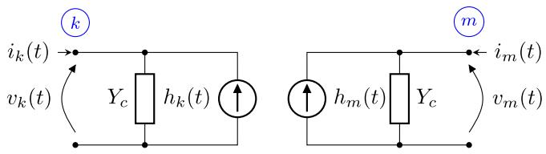  
Fig. 1. Equivalent circuit of an ideal transmission line.

As a consequence, in the Bergeron model the propagation time ?? of the transmission line naturally introduces a time delay between terminals ?? and ??, enabling one to solve systems connected to each terminal independently from each other, as long as no other interconnection between the two systems is observed. From a co-simulation point of view, this characteristic alone would suffice to completely decouple large portions of an heterogeneous system that could, in turn, solved independently.

In EMT-like simulations, this characteristic has already been put to good use, enabling even real-time simulators such as the ones commercialized by RTDS e OpalRT. In such real-time simulators, already existing transmission lines can be modeled according to the Bergeron model, which end up decoupling parts of the systems and considerably improving the computational efficiency of the simulations.

In phasor domain simulations, such as the ones of interest in the present development, however, time-delayed transmission lines do not exist anymore, since such systems are now considered to be operating very close to their steady-state condition. Under such circumstances, transmission line are represented by nominal-frequency ??-circuits, turning all subsystems fully interconnected again.

In this context, a co-simulation environment that relies on fictitious transmission lines interconnecting phasor-domain-based subsystems is proposed. Such fictitious lines re-introduce transport delays among subsystems, enabling one to compute them independently. Although some extra oscillations are expected to occur, mostly in the interconnection neighborhood, it is also expected that soon after higher-frequency disturbances, the fictitious transmission line ends up operating in steadystate and excited by constant complex quantities. In such a situation, the effect of the fictitious transmission line practically disappear, remaining only the pre-existing parts of the system. In this way, relations of (1) can be placed in phasor-domain, as shown in (2).

$$
\left\{ \begin{array}{l} \bar {I} _ {k} (t) = \bar {Y} _ {c} \bar {V} _ {k} (t) - \bar {H} _ {k} (t) \\ \bar {I} _ {m} (t) = \bar {Y} _ {c} \bar {V} _ {m} (t) - \bar {H} _ {m} (t) \\ \bar {H} _ {k} (t) = \bar {Y} _ {c} \bar {V} _ {m} (t - \tau) + \bar {I} _ {m} (t - \tau) \\ \bar {H} _ {m} (t) = \bar {Y} _ {c} \bar {V} _ {k} (t - \tau) + \bar {I} _ {k} (t - \tau) \end{array} \right. \tag {2}
$$

For the present work, all fictitious propagation delays are made equal to the fixed time step used in the simulations, leaving its characteristic admittance $\overline { { Y } } _ { c }$ undefined. Properly defining values for $\overline { { Y } } _ { c }$ still remains a challenging investigation point.

For this task, one can consider one Thévenin equivalent connected to each terminal, ?? and $m ,$ of the line given in Fig. 1. Each equivalent is defined by its own voltage and impedance; $\overline { { E } } _ { k }$ and $\overline { { Z } } _ { k }$ for terminal ?? and, $\overline { { E } } _ { m }$ and ${ \overline { { Z } } } _ { m }$ for terminal ??. Considering, now, that the system of Eqs. (2) can be discretized with a fixed time step $\varDelta t = \tau ,$ the currents $\overline { { I } } _ { k } [ n ]$ and $\overline { { I } } _ { m } [ n ]$ , injected into the line at both terminals, can be written in a discrete-time state-space form as given in (3).

$$
\mathbf {x} [ n ] = \mathbf {A x} [ n - 1 ] + \mathbf {B u} [ n ] \tag {3}
$$

where,

$$
\mathbf {x} = \left[ \begin{array}{l} \bar {I} _ {k} \\ \bar {I} _ {m} \end{array} \right] \quad \mathbf {A} = \left[ \begin{array}{c c} 0 & \frac {\overline {{Z}} _ {m} - \overline {{Z}} _ {c}}{\overline {{Z}} _ {k} + \overline {{Z}} _ {c}} \\ \frac {\overline {{Z}} _ {k} - \overline {{Z}} _ {c}}{\overline {{Z}} _ {m} + \overline {{Z}} _ {c}} & 0 \end{array} \right] \tag {4a}
$$

$$
\mathbf {u} = \left[ \begin{array}{l} \overline {{E}} _ {k} \\ \overline {{E}} _ {m} \end{array} \right] \quad \mathbf {B} = \left[ \begin{array}{c c} \frac {1}{\overline {{Z}} _ {k} + \overline {{Z}} _ {c}} & - \frac {1}{\overline {{Z}} _ {k} + \overline {{Z}} _ {c}} \\ - \frac {1}{\overline {{Z}} _ {m} + \overline {{Z}} _ {c}} & \frac {1}{\overline {{Z}} _ {m} + \overline {{Z}} _ {c}} \end{array} \right] \tag {4b}
$$

The stability of a discrete system is determined by the magnitude of the eigenvalues $\overline { { \lambda } } _ { i }$ of the transition matrix ??. If all eigenvalues $\overline { { \lambda } } _ { i }$ satisfy the condition $| { \overline { { \lambda } } } _ { i } | < 1 ,$ , the system is asymptotically stable. On the other hand, it is unstable if $\left| \overline { { \lambda } } _ { i } \right| > 1 . \mathrm { I f } | \overline { { \lambda } } _ { i } | = 1$ , the system can be stable or unstable, depending on the structure of ??.

Thus, returning to the system defined in $( 3 ) ,$ the eigenvalues of ??, given in $( 5 ) ,$ , correspond to the geometric mean of the reflection coefficients, $\overline { { \boldsymbol { { \cal T } } } } _ { k }$ and ${ \overline { { \boldsymbol { { \cal T } } } } } _ { m } ,$ , obtained, separately, for each terminal ?? and ?? of the line.

$$
\bar {\lambda} _ {1, 2} = \pm \sqrt {\bar {T} _ {k} \bar {T} _ {m}} \tag {5}
$$

$$
\bar {T} _ {k} = \frac {\bar {Z} _ {k} - \bar {Z} _ {c}}{\bar {Z} _ {k} + \bar {Z} _ {c}} \quad \bar {T} _ {m} = \frac {\bar {Z} _ {m} - \bar {Z} _ {c}}{\bar {Z} _ {m} + \bar {Z} _ {c}} \tag {6}
$$

Thus, the impedance $\overline { { Z } } _ { c }$ can be selected with the aid of the function $f ( Z _ { c } , \theta _ { c } )$ , as shown $( 7 ) ,$ which is required to be lower than the unity, in order to maintain the system to be co-simulated stable. In $f ( Z _ { c } , \theta _ { c } ) _ { : }$ , the specific choice $\overline { { Z } } _ { c } = Z _ { c } / \theta _ { c }$ , whereas $\overline { { Z } } _ { k } = Z _ { k } \mathord { \left/ { \vphantom { \sum _ { k } } } \right. \kern - delimiterspace } \theta _ { k }$ and $\overline { { Z } } _ { m } = Z _ { m } / \theta _ { m } .$ . Results will demonstrate such a result.

$$
\begin{array}{l} f \left(Z _ {c}, \theta_ {c}\right) = \\ \sqrt {\frac {\sqrt {Z _ {c} ^ {2} - 2 Z _ {c} Z _ {k} \cos (\theta_ {c} - \theta_ {k}) + Z _ {k} ^ {2}} \sqrt {Z _ {c} ^ {2} - 2 Z _ {c} Z _ {m} \cos (\theta_ {c} - \theta_ {m}) + Z _ {m} ^ {2}}}{\sqrt {Z _ {c} ^ {2} + 2 Z _ {c} Z _ {k} \cos (\theta_ {c} - \theta_ {k}) + Z _ {k} ^ {2}} \sqrt {Z _ {c} ^ {2} + 2 Z _ {c} Z _ {m} \cos (\theta_ {c} - \theta_ {m}) + Z _ {m} ^ {2}}}} \tag {7} \\ \end{array}
$$

# 4. Co-simulation procedure

In this section the steps used for the proposed phasor-domain cosimulation is set forth. A flowchart describing the whole procedure can be seen in Fig. 2, along with a algorithm intended to realize it in Fig. 3. Each task in the flowchart are described next.

# 4.1. Data pre-processing

At the beginning, systems are prepared to be imported into the cosimulation environment. For the present co-simulation based FMUs, each system was modeled by means of the Modelica language in OMEdit’s graphical environment. The fictitious lines are coupled to the dynamic model at the interconnection node, which defines their associated inputs and outputs.

FMUs were be generated using the OMPython module, which is part of the OpenModelica simulation platform. This module provides components for creating a complete environment for modeling, compiling and simulating Modelica-language-based models. Additionally, OMPython allows exporting FMUs in both model exchange and cosimulation modes. Specifically for the co-simulation mode, the OMPython module allows FMUs to be exported with one of two distinct solvers: explicit Euler and SUNDIALS CVODE [11]. After FMU generation, it can be imported and simulated within a Python environment wiht the aid of the modules PyFMI or OMSimulator.

# 4.2. Initialization mode

In this mode, an initial simulation time $t _ { 0 }$ is set and the initial conditions for the FMU’s internal state variables are computed. At this step, a set of algebraic equations, with all derivatives set to zero, is solved so a steady-state solution for the system is obtained. All FMUs involved require to be properly initialized. During this phase, the FMI

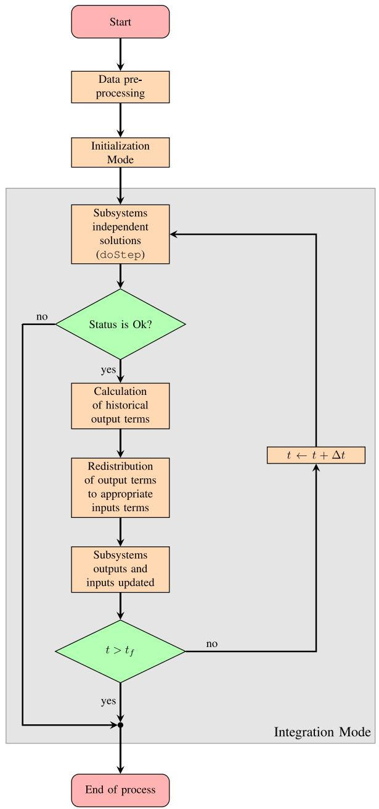  
Fig. 2. Fluxogram of the proposed co-simulation procedure.

standard also allows the assignment of initial values to internal FMU state variables and inputs.

More specifically for the present co-simulation scheme, it is necessary to supply to the FMUs their inputs, so the initial value of the historical currents can be defined.

The steps taken for the initialization of the system are as follows:

• Estimation of the subsystems Thevenin impedances seen from the interconnection nodes. Reasonable estimates can be obtained by a short-circuit calculation carried out at the interconnection nodes.   
• Each fictitious transmission line is defined by means of the characteristic impedance $\overline { { Z } } _ { c }$ analyzing (7).   
• From a load flow calculation, and bearing in mind that $\overline { { V } } _ { m } = \overline { { V } } _ { k }$ and $\overline { { I } } _ { m } = - \overline { { I } } _ { k }$ , the initial historical currents can be obtained from (8).

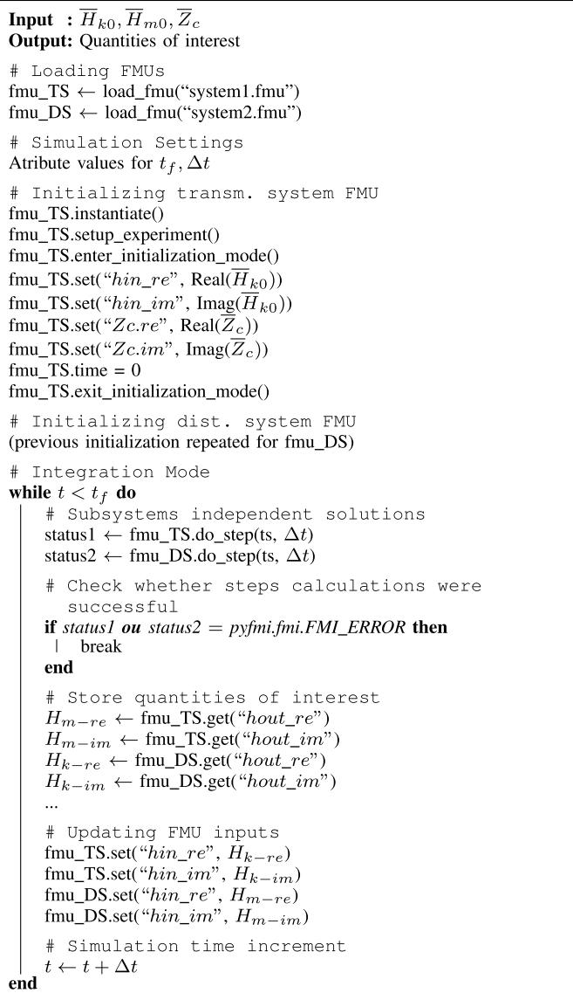  
Fig. 3. Co-simulation with two FMUs.

$$
\bar {H} _ {k} (0) = \bar {Y} _ {c} \bar {V} _ {k} (0) + \bar {I} _ {k} (0) \tag {8a}
$$

$$
\bar {H} _ {m} (0) = \bar {Y} _ {c} \bar {V} _ {k} (0) - \bar {I} _ {k} (0) \tag {8b}
$$

# 4.3. Integration mode

In this mode, values for all real continuous and discrete time variables are numerically calculated by means of adequate differential– algebraic equations solvers. The following steps gives an overview of the integration mode, according to [2]:

(1) At an instant ??, an integration step ???? is calculated through the function doStep, that calls the FMU-embedded solver.   
(2) The co-simulation status is checked.   
(3) If the step calculation is OK, outputs are collected (historical output currents, for example);   
(4) Historical currents are sent to the master algorithm, which redistributes them to the associated subsystems;   
(5) FMU input values are now updated;

(6) Step time forward ?? ← ?? + ???? with a fixed communication step size.   
(7) Items (1) to (6) are repeated until the simulation ends.

# 5. Co-simulation interfacing OpenModelica and OpenDSS

In the proposed approach, a Python environment serves as the bridge between a transmission system embedded in a FMU and the OpenDSS that solves a three-phase distribution system. Both FMU and OpenDSS still model their corresponding systems in phasor domain. The steps performed for the co-simulation in this case are similar to those presented in Figs. 2 and 3. As for the communication between OpenDSS and Python, the OpenDSSDirect module is used. Internally, this module calls a C-interface that actually calls for functions implemented in the OpenDSS shared library [5,12].

The basic algorithm employed for co-simulating the FMU with an instance of the OpenDSS is shown in Fig. 4. Comparing the algorithm with Fig. 3, one can notice that the only differences lie on the treatment of the subsystem related to the distribution system, which is solved by OpenDSS.

In the sequence, each section of the co-simulation will be set forth.

# 5.1. Initialization mode

At this stage, a proper initial condition is only possible combining the two systems in a single power flow solution strategy. The problem here is that the transmission system cannot determine precisely the complex power drained by the distribution system and, the distribution system cannot determine the voltage at which it is supplied. The only restrictions that can be enforced is that the voltage at the common coupling point (PCC) must be the same for both systems, transmission and distribution, and the complex power that is drained from the transmission system must be inject into the distribution one.

For this restriction enforcement, an iterative process can be carried out between OpenModelica and OpenDSS according to Fig. 7. The steps can be listed below [13]:

(1) Set the voltage $\overline { { V } } _ { s }$ of the OpenDSS reference bus to a known starting value (for instance, 1 0◦ [pu]);   
(2) For the given ${ \overline { { V } } } _ { s } ,$ , OpenDSS solves the power flow for the distribution system (DS) and the positive-sequence complex power drained from the slack bus, $\overline { { S } } _ { D S } ,$ , is returned;   
(3) In turn, $\overline { { S } } _ { D S }$ is injected as a load into the TS system;   
(4) Now, another power flow for the transmission system (TS) is calculated, and the voltage $\overline { { V } } _ { P C C - O M }$ at the interface bus as well as the current flowing in the interface $\overline { { I } } _ { m - O M }$ are returned;   
(5) Set voltage $\overline { { V } } _ { s } = \overline { { V } } _ { P C C - O M } - \overline { { Z } } _ { s } \overline { { I } } _ { m - O M } .$   
(6) Steps (2) to (5) are repeated until convergence is attained, i.e., $\| \overline { { V } } _ { P C C - O M } - \overline { { V } } _ { P C C - O p e n D S S } \| < \varepsilon$ , where ?? is an acceptable tolerance.

With the interface voltage calculated, initial values for historical terms of the fictitious transmission line can be computed according to (8).

# 5.2. Integration mode

During the time solution of the models implemented in the FMU and OpenDSS, the adopted strategy kept the fictitious transmission line external to OpenDSS, as part of the co-simulation environment itself. In this case, an iterative process between the fictitious transmission line and OpenDSS was implemented for each time-step calculation.

Due to convergence issues, instead of Norton equivalents, the fictitious transmission line was modeled by means of Thévenin equivalents.

The steps taken for the iterative solution between the fictitious transmission line and the OpenDSS power flow, performed at each time-step, are shown in Fig. 6 and described below:

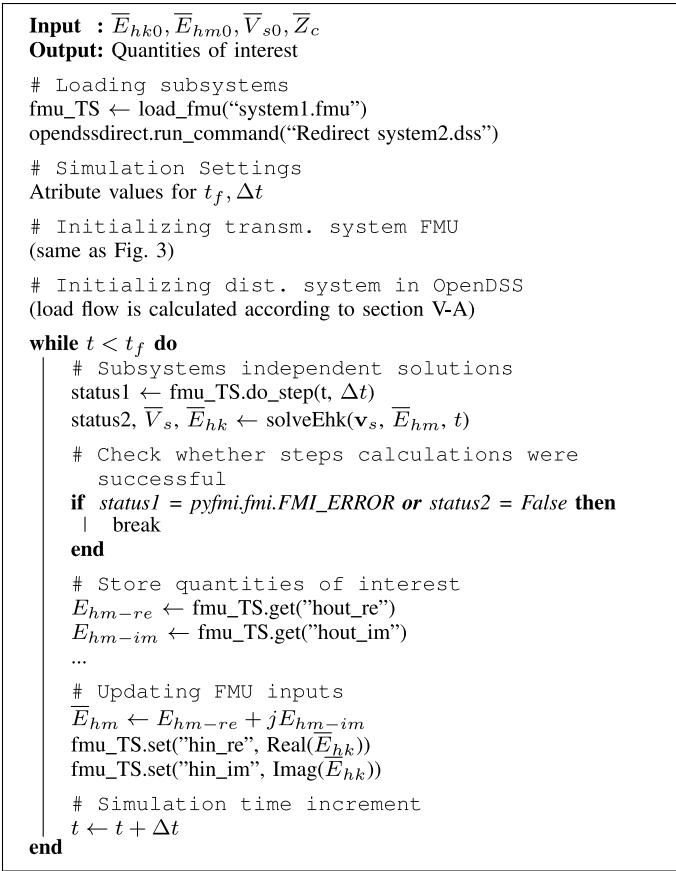  
Fig. 4. Co-simulation between FMU and OpenDSS.

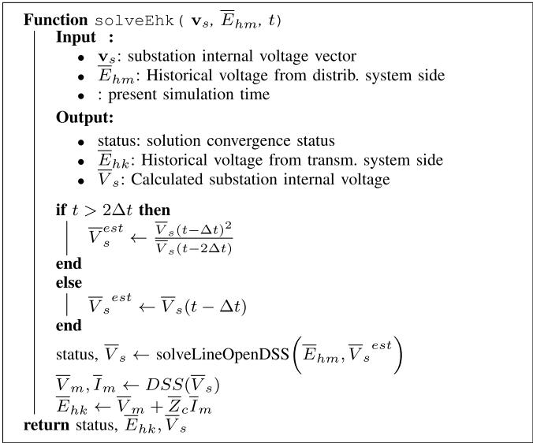  
Fig. 5. Algoritmo para cálculo da tensão histórica $\overline { { E } } _ { h k } .$

(1) Set $\overline { { V } } _ { s }$ to its initial condition;   
(2) OpenDSS solves the power flow of the distribution system with fixed $\overline { { V } } _ { s }$ . This step results the current drained from the slack bus $\overline { { I } } _ { m }$ .   
(3) The current $\overline { { I } } _ { m }$ is now injected into the ?? terminal of the fictitious transmission line, as depicted in Fig. 8, so voltage $\overline { { V } } _ { m - B e r g }$ is calculated.

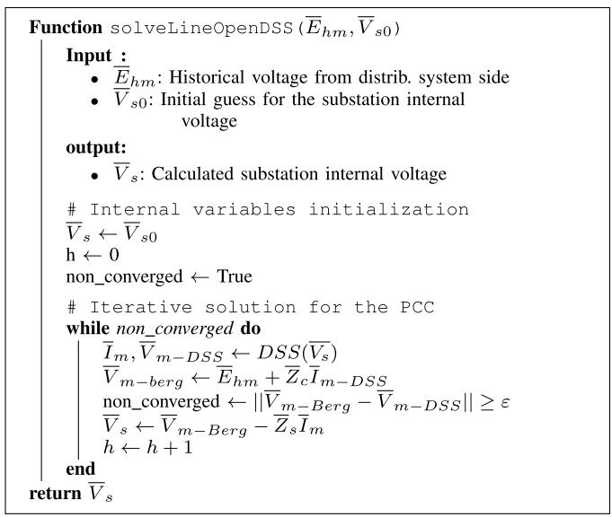  
Fig. 6. Iterative solution for a fictitious line and OpenDSS.

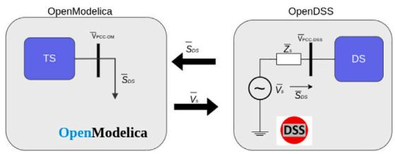  
Fig. 7. OpenModelica Initialization - OpenDSS.

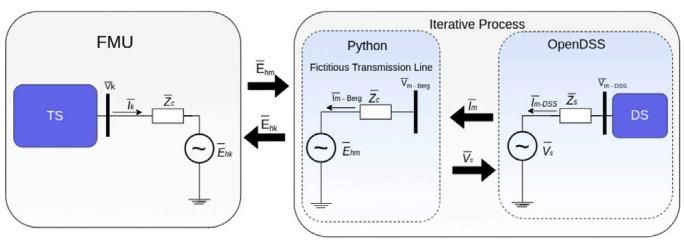  
Fig. 8. Co-simulation interfacing an FMU with OpenDSS.

(4) Steps (2) to (3) are repeated until convergence is attained, i.e., $\| \overline { { V } } _ { m - B e r g } ~ - ~ \overline { { V } } _ { m - O p e n D S S } \| ~ < ~ \varepsilon ,$ where ?? is an acceptable tolerance.

It is important to emphasize that during the just described iterative procedure for calculating the voltage at the interconnection point between the fictitious transmission line and the OpenDSS, historical terms are kept constant. These terms only get updated when time truly advances.

The function solveEhk, given in Fig. 5, in turn, serves a twofold task. It firstly wraps the function solveLineOpenDSS, which actually calculates the voltage at the coupling bus, between the transmission and distribution systems. And secondly, it also calculates the historical voltage $\overline { { E } } _ { h k }$ of the transmission side of the fictitious line, that depends solely on distribution side variables (i.e., ${ \overline { { V } } _ { m } }$ and $\overline { { I } } _ { m } )$ .

# 6. Modeling of test systems

In this section, the test systems, used in the results section, will be described.

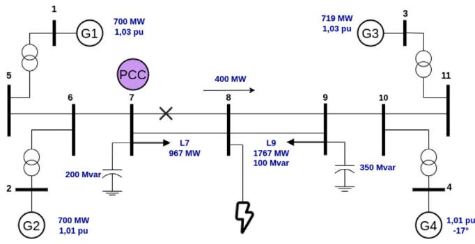  
Fig. 9. 11-bus test system.

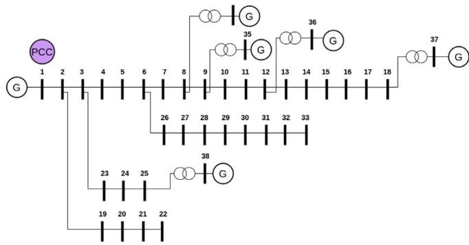  
Fig. 10. 38-bus test system.

# 6.1. Transmission system

The 11-bus transmission system, illustrated in Fig. 9 and reported in [14], was used for present study. The system consists of four power plants represented by $G _ { 1 } , G _ { 2 } , G _ { 3 } ,$ and $G _ { 4 }$ . The plants $G _ { 1 } , G _ { 2 }$ and $G _ { 3 }$ are dispatched at 700 MW, 700 MW and 719 MW, respectively, while $G _ { 4 }$ assume a slack role in the system.

As for the simulations, a three-phase short-circuit is applied at bus 7 and cleared 100 ms later when the faulty line is tripped.

# 6.2. Distribution systems

# 6.2.1. 38-bus system

The first employed distribution system is the 38-bus shown in Fig. 10. For this study, the system is represented through its singlephase equivalent. It is worth mentioning that this system also counts with five generation units connected buses 34 to 38. Further details on this system can be found in [15].

For this work, the distribution system was considered in a static mode, without any dynamics. Moreover, this system is supplied by a large system, modeled as an infinite bus, connected to bus 1. Under such conditions, the system demands 187 MW and 123 Mvar.

For coupling the 38-bus distribution system to the 11-bus transmission system, the distribution system was considered part of the load connected at bus 7 of the transmission system that totals 936 MW.

Considering the total load of the 11-bus system at the coupling bus, tests were carried out with the replacement of up to five equal distribution feeders. Each feeder is connect to the 11-bus transmission system with its own dedicated fictitious transmission line.

As for the fictitious transmission lines, needed for establishing the proposed co-simulation scheme, estimates for the Thevenin impedances seen from both transmission and distribution systems are required and shown in Table 1. In this table, case I is related to the impedance estimates for the 11-bus transmission system and 38-bus distribution systems.

Table 1 Impedance estimates in [pu].   

<table><tr><td>Cases</td><td>Transmission system Zk</td><td>Distribution system Zk</td><td>Fictitious line Zc</td><td>f(Zc, θc)</td></tr><tr><td>I</td><td>0.0345/87.08°</td><td>0.0165/36.10°</td><td>0.0351/86.73°</td><td>0.068</td></tr><tr><td>II</td><td>0.0322/87.16°</td><td>48.87/8.16°</td><td>0.0350/87.38°</td><td>0.051</td></tr></table>

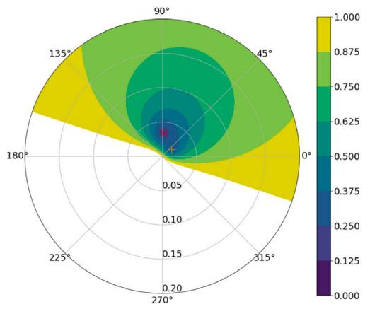  
Fig. 11. Eigenvalue magnitude for co-simulation between 11 and 38-bus systems.

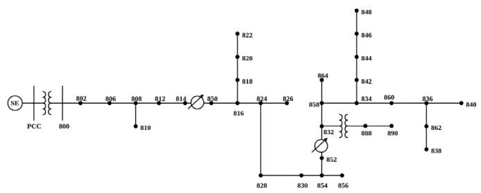  
Fig. 12. IEEE 34-bus transmission system.

Applying the estimates for $\overline { { Z } } _ { k }$ and ${ \overline { { Z } } } _ { m } ,$ given in Table 1, to $( 7 ) ,$ , one can obtain a polar graph, shown in Fig. 11, for the function $f ( Z _ { c } , \theta _ { c } ) _ { }$ . As it can be noticed, the closer $\overline { { Z } } _ { c }$ gets from either $\overline { { Z } } _ { k }$ and $Z _ { m } ,$ represented by the markers × and $+ ,$ respectively, the lower the absolute values of the eigenvalues becomes. For the present work, $\overline { { Z } } _ { c }$ was set to 0.0351 86.73◦, as presented in Table 1, resulting in an eigenvalue magnitude close to 0.07.

# 6.2.2. IEEE 34-bus system

The second distribution system considered here is the IEEE 34- bus system shown in Fig. 12. It corresponds to a 69-kV unbalanced three-phase system that consumes roughly 2026.29 kW and 311.94 kvar. Further details on this system can be found in [16].

Analogously to the first case, a single fictitious transmission line was included in the model.

In order to choose the impedance $\overline { { Z } } _ { c }$ for the fictitious line, the same analysis performed for the previous test will be set forth. The impedance estimates for the 11-bus transmission system and the IEEE 34-bus distribution systems are shown in the second row of Table 1.

The polar graph for the function $f ( Z _ { c } , \theta _ { c } )$ is depicted in Fig. 13. One can see, once more, that the magnitude of the eigenvalue reduces significantly as $\overline { { Z } } _ { c }$ approaches either $\overline { { Z } } _ { k }$ or ${ \overline { { Z } } } _ { m } .$ . Due to the large difference between the Thévenin impedances magnitudes, Fig. 13(a) shows in detail the region surrounding $\overline { { Z } } _ { k }$ .

Values for $\overline { { Z } } _ { c }$ in the neighborhood of both $\overline { { Z } } _ { k }$ and ${ \overline { { Z } } } _ { m }$ were tested. Values closer to ${ \overline { { Z } } } _ { m } ,$ however, imposed convergence problems, probably, due to its large value in comparison to the ones observed for in the vicinity of ${ \overline { { Z } } } _ { k } ,$ , related to the transmission system.

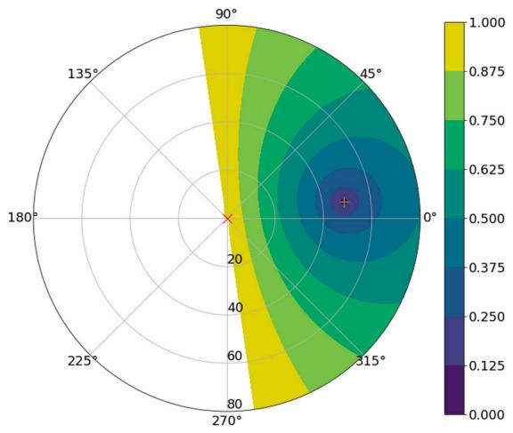  
(a) Region for $\overline { { Z } } _ { c }$ next to ${ \overline { { Z } } } _ { m } .$ .

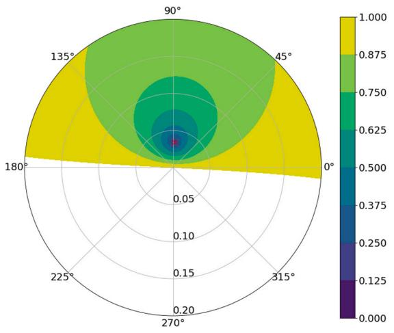  
(b) Magnified region for $\overline { { Z } } _ { c }$ next to $\overline { { Z } } _ { k }$ .   
Fig. 13. Magnitude of eigenvalues for the 34-bus transmission and distribution system.

Thus, for subsequent analyses, $\overline { { Z } } _ { c }$ will be considered close to $\overline { { Z } } _ { k }$ . For the present work, the choice of $\overline { { Z } } _ { c }$ is also shown in Table 1, which led to an eigenvalue magnitude of 0.051.

# 6.3. Error analysis

A criterion that was used for the error analysis of the co-simulation is the Normalized Integral Absolute Error (NIAE). This error is a variation of the integral absolute error (IAE) normalized by the reference signal integral. The NIAE criteria, can be described by (9). According to [17], when ???????? ≥ 0.95, the model can be considered adequate.

$$
N I A E = 1 - \frac {\int_ {0} ^ {t} | x ^ {*} - x | d t}{\int_ {0} ^ {t} x ^ {*} d t} \tag {9}
$$

# 7. Results

Tests for the proposed co-simulation approach were performed using both PyFMI and OMSimulator, which yielded practically the same

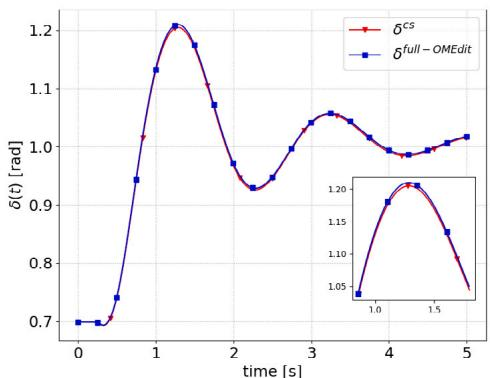  
(a) Relative angle between G1 and G4.

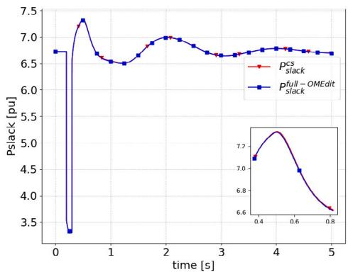  
(b) Power on the slack bus.

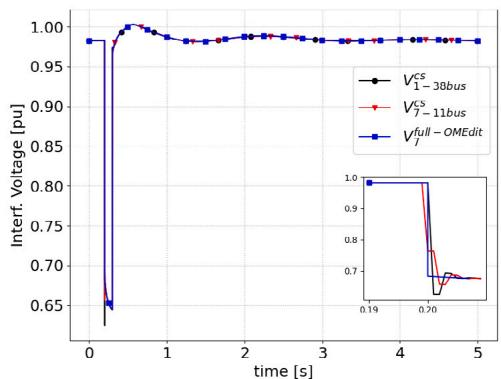  
(c) Voltage on the interface bus.   
Fig. 14. Quantities during the fault for 11-bus transmission system connected to the 38-bus distribution system.

results. The integration step of 1 [ms] was used in the present simulations. Dynamic quantities presented in the sequence compare simulation results obtained by the co-simulation of the 11-bus system and a single 38-bus feeder with the results obtained with a single system modeled in OpenModelica’s OMEdit. Fig. 14(a) shows the relative angle of $G _ { 1 }$ with respect to $G _ { 4 } ,$ while Fig. 14(b) shows the power flowing through the reference bus of the transmission system. And finally, Fig. 14(c) show the voltage flowing through the interface bus.

Error analysis using the NIAE criterion for the curves related to the relative angle $\delta _ { 1 4 } :$ , interface voltage $( V _ { b u s 7 } )$ and active power flowing

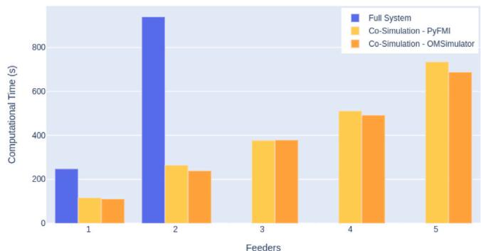  
Fig. 15. Computational timings for the 11-bus transmission system connected to multiple 38-bus feeders.

the interface $( P _ { s l a c k } )$ were also performed. Results showed that the proposed co-simulation approach can be considered adequate based on the fact that all NIAE values exceeded 99.5%.

# 7.1. Multiple feeders

Co-simulation tests with multiple feeders were also performed. Two to five 38-bus feeders were connected to the 11-bus transmission system. Co-simulation results were closely related to those shown in Fig. 14.

It is important to point out, however, that for three feeders or more, no results could be obtained for the simulation of the complete system, due to the high computational time and convergence problems. Thus, for such cases, co-simulation became the only alternative for conducting the dynamic studies with the insertion of multiple feeders.

Additionally, the co-simulation also reduced computational time compared to the full system simulation. For the sake of comparison, Fig. 15 presents the computational timings attained with PyFMI and OMSimulator modules and Openmodelica’s OMEdit for the full system. As one can observe timings for PyFMI and OMSimulator are quite similar.

In spite of the co-simulation scalability suggested by Fig. 15, further investigations are still required in order to reduce the absolute timings of the simulation of power systems by means of FMUs.

# 7.2. Co-simulation interfacing OpenModelica and OpenDSS

Finally, results were obtained with the co-simulation interfacing OpenModelica-generated FMUs and OpenDSS. Fig. 16(a) compares the relative angle between G1 and G4 of the 11-bus transmission system obtained by both co-simulation and simulation of system as whole, while Figs. 16(b) and 16(c) show the voltage and power flowing through the interface bus.

For the co-simulation a single instance of the IEEE 34-bus distribution system modeled in OpenDSS was interfaced with the transmission system FMU. For comparison purposes, co-simulation results are compared with the ones obtained for the 11-bus transmission system with only constant power loads.

As can be seen, the results for the relative angle between $G _ { 1 }$ and $G _ { 4 } ,$ as well as the power in the reference bus of the transmission system, were very close to the results obtained with the complete system, in the same way as the voltage in the transmission system at the common coupling point and the power at the reference bus. The computational time profile can be seen in Table 2, which shows a total run-time of approximately 9 [s]. As one can observe, the attained computational timing combining the FMU with OpenDSS significantly dropped in comparison with the co-simulation between only FMUs, as shown in Fig. 15.

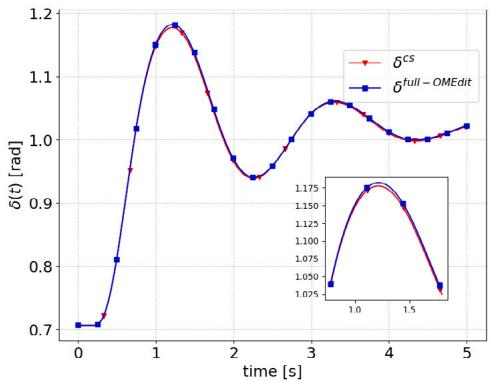  
(a) Relative angle between G1 and G4.

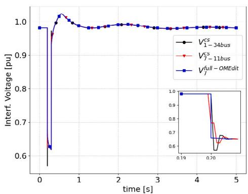  
(b) Voltage on the interface bus.

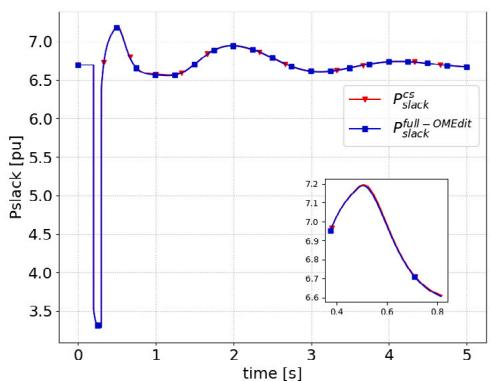  
(c) Power on the slack bus.   
Fig. 16. Quantities during the fault for 11-bus transmission system connected to the IEEE 34-bus distribution system.

Table 2 Co-simulation profile - Transmission systems and IEEE 34-bus (Time in [s]).   

<table><tr><td>FMU runtime</td><td>OpenDSS runtime</td><td>Variables processing</td><td>Total runtime</td></tr><tr><td>3.9</td><td>1.5</td><td>3.6</td><td>9</td></tr></table>

# 8. Conclusions

This work presented a co-simulation methodology for dynamic studies of transmission systems coupled to distribution systems. Both systems are firstly modeled in Modelica language, while the co-simulation is performed in a Python environment, with the aid of the modules PyFMI and OMSimulator.

The results showed co-simulation to be suitable for conducting dynamic studies. Results were very close to those obtained with the simulation of the complete system modeled in OpenModelica’s OMEdit. Error analysis reinforced the accuracy of the results. Furthermore, the proposed strategy presented reduced computational timings, compared to the simulation of the complete system when tested with up to two feeders. From three feeders on, the co-simulation presented itself as the only strategy capable of carrying out the proposed studies.

Co-simulation was also tested interfacing OpenModelica-generated FMUs and OpenDSS through Python. Results validated the effectiveness of the integration of specialist tools, enabled by the co-simulation.

As future developments, dynamic models of DERs are planned to be coupled to the distribution systems modeled in OpenDSS, allowing the evaluation of such resources and their dynamic impacts of the power system as a whole.

# CRediT authorship contribution statement

Igor Borges de Oliveira Chagas: Conceptualization, Methodology, Writing – original draft, Visualization, Investigation, Software. Marcelo Aroca Tomim: Supervision, Conceptualization, Methodology, Project administration, Writing – review & editing, Investigation, Resources.

# Declaration of competing interest

The authors declare the following financial interests/personal relationships which may be considered as potential competing interests: Igor Borges de Oliveira Chagas reports financial support was provided by Petrobras. Marcelo Aroca Tomim reports financial support was provided by Petrobras. Igor Borges de Oliveira Chagas reports a relationship with Petrobras that includes: funding grants. Marcelo Aroca Tomim reports a relationship with Petrobras that includes: funding grants.

# Acknowledgments

This study was financed in part by PETROBRAS (Cooperation Contract: 5900.0112828.19.9) and the Coordenação de Aperfeiçoamento de Pessoal de Nível Superior - Brasil (CAPES) - Finance Code 001. The authors would like to thank the Project ‘‘Management of Distributed Energy Resources for the Provision of New Services to the Electric Grid’’, PD-00553-0064/2019, within the scope of the R&D program of the electric system regulated by ANEEL even as National Council for Scientific and Technological Development (CNPq), the State Funding Agency of Minas Gerais (FAPEMIG), and the National Institute for Electric Energy (INERGE).

# References

[1] L.T. Silva, Modelagem e Simulação de Sistemas de Geração de Energia Eólica através de Co-simulação (Master’s thesis), Universidade Federal de Juiz de Fora (UFJF), 2020.   
[2] Functional Mock-up Interface for model exchange and co-simulation, Modelica Association Project FMI, 2021, [Online]. Available: https://fmi-standard.org/.   
[3] T.S. Theodoro, M.A. Tomim, P.G. Barbosa, A.C.S. de Lima, M.T.C. de Barros, Cosimulation of a doubly fed induction generator connected to a power network: The use of DSOGI for phasor extraction, IEEE Lat. Amer. Trans. 17 (07) (2019) 1070–1079.   
[4] T.S. Theodoro, P. Barbosa, M. Tomim, A. de Lima, M.C. de Barros, MatLab-OpenDSS co-simulation environment: An alternative tool to investigate DSG connection, in: 2018 Simposio Brasileiro de Sistemas Eletricos (SBSE), IEEE, 2018, pp. 1–7.

[5] R. Dugan, Reference Guide: The Open Distribution System Simulator (OpenDSS).   
[6] R. Venkatraman, S.K. Khaitan, V. Ajjarapu, A combined transmission-distribution system dynamic model with grid-connected DG inverter, in: 2017 IEEE Power & Energy Society General Meeting, IEEE, 2017, pp. 1–5.   
[7] R. Venkatraman, S.K. Khaitan, V. Ajjarapu, Dynamic co-simulation methods for combined transmission-distribution system with integration time step impact on convergence, IEEE Trans. Power Syst. 34 (2) (2019) 1171–1181.   
[8] W. Wang, X. Fang, H. Cui, F. Li, Transmission-and-distribution frequency dynamic co-simulation framework for distributed energy resources frequency response, 2021, arXiv preprint arXiv:2101.05894.   
[9] C. Andersson, Methods and Tools for Co-Simulation of Dynamic Systems with the Functional Mock-Up Interface (Ph.D. dissertation), Lund University, 2016.   
[10] OpenModelica Simulator (OMSimulator), Open Source Modelica Consortium, 2021, [Online]. Available: https://openmodelica.org/uncategorised/191- omsimulator.   
[11] SUNDIALS: SUite of Nonlinear and DIfferential/ALgebraic Equation Solvers, Lawrence Livermore National Laboratory, 2021, [Online]. Available: https:// computing.llnl.gov/projects/sundials.

[12] D. Krishnamurthy, OpenDSSDirect.py 0.5.0, 2017, [Online]. Available: https: //dss-extensions.org/OpenDSSDirect.py/index.html.   
[13] H. Sun, Q. Guo, B. Zhang, Y. Guo, Z. Li, J. Wang, Master–slave-splitting based distributed global power flow method for integrated transmission and distribution analysis, IEEE Trans. Smart Grid 6 (3) (2014) 1484–1492.   
[14] P. Kundur, Power System Stability and Control, McGraw-Hill, New York, 1994, p. 1176.   
[15] D. Singh, R.K. Misra, D. Singh, Effect of load models in distributed generation planning, IEEE Trans. Power Syst. 22 (4) (2007) 2204–2212.   
[16] IEEE PES Test Feeder, IEEE Power & Energy Society, [Online]. Available: http: //sites.ieee.org/pes-testfeeders/resources.   
[17] T.S. Theodoro, Simulação Híbrida no Domínio do Tempo de Transitórios Eletromecânicos e Eletromagnéticos: Integração de um Aerogerador de Indução Duplamente Excitado (Master’s thesis), Universidade Federal de Juiz de Fora (UFJF), 2016.