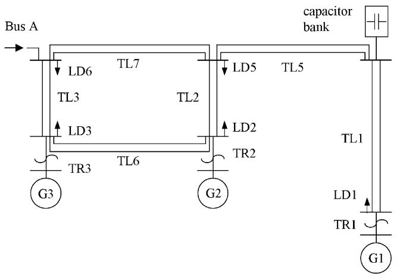
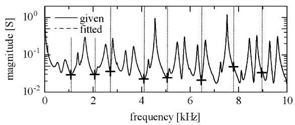
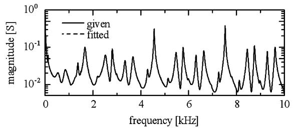
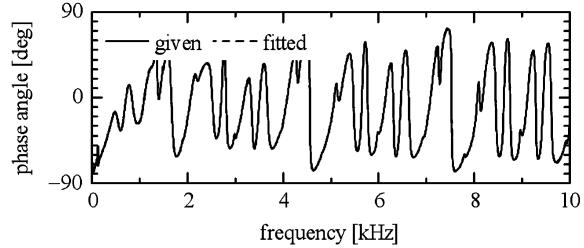
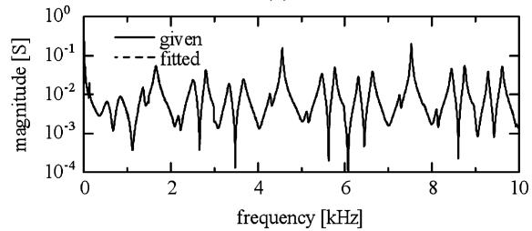
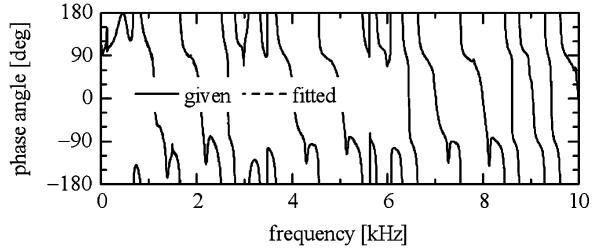

# A Binary Frequency-Region Partitioning Algorithm for the Identification of a Multiphase Network Equivalent for EMT Studies

Taku Noda, Member, IEEE

Abstract—Previously, a method for identifying a multiphase network equivalent for electromagnetic transient calculations using partitioned frequency response has been proposed. The method accurately and robustly identifies an equivalent of the target network by dividing its frequency response into sections, but no specific algorithm for the frequency-region partitioning has been proposed. To make the entire identification process automatic, this letter proposes a binary partitioning algorithm.

Index Terms—Electromagnetic transient analysis, equivalent circuits, frequency response, interconnected power systems, power system modeling, power system simulation.

# I. INTRODUCTION

LECTROMAGNETIC TRANSIENT (EMT) simulations Ehave become crucial for the design and operation of a power system. For reducing the computational burden, it is often desirable to replace a large part of a power system far from the source of a transient with a reduced-order network equivalent. Obtaining a network equivalent of an apparatus, such as a transformer, whose equivalent circuit is not obvious but its frequency response is available by measurement, is also desirable. To these ends, a method for identifying a multiphase network equivalent for EMT calculations utilizing partitioned frequency response has been proposed [1]. The method divides the frequency response of the target network into sections, and by applying enhanced rational fitting to each section, it accurately and robustly identifies equivalent poles of the target and, thus, a network equivalent. However, no specific algorithm for the frequency-region partitioning has been proposed. To make the entire identification process automatic, this technical letter proposes a binary algorithm of frequency-region partitioning for the identification method.

# II. REVIEW OF THE IDENTIFICATION METHOD

The identification method proposed in [1] assumes that the frequency response of the target network is given in the form of an $N _ { p h } { \mathrm { - b y - } } N _ { p h }$ transfer function matrix $H _ { k }$ defined at discrete angular frequencies $( k = 1 , 2 , . . . , K )$ . If the input to the network is the voltages of the terminals and the output is their currents, $H _ { k }$ is an admittance matrix. The identification method first identifies the poles $p _ { n } \ ( n = 1 , 2 , \cdots , N )$ by the frequency response of $\mathrm { t r } \{ H _ { k } \}$ (i.e., the matrix trace of $H _ { k } )$ . In this pole identification process, the frequency response is divided into sections and enhanced rational fitting is applied to each section. Since the frequency range of each section is limited, the $s ^ { n }$ terms in the rational function do not cause ill conditioning in the fitting process $( s = j \omega )$ . The residue matrices $R _ { n }$

Manuscript received August 29, 2006. Paper no. PESL-00062-2006.

The author is with the Electric Power Engineering Research Laboratory, Central Research Institute of Electric Power Industry (CRIEPI), Kanagawa 240- 0196, Japan (e-mail: takunoda@ieee.org).

Digital Object Identifier 10.1109/TPWRD.2007.893382

TABLE I PROPOSED BINARY PARTITIONING ALGORITHM   

<table><tr><td>Step 1: Set the current section to the entire frequency region.</td></tr><tr><td>Step 2: Apply the rational fitting to the current section.</td></tr><tr><td>Step 3: If specified accuracy is achieved in the current section, this section is completed. Otherwise, go to Step 4.</td></tr><tr><td>Step 4: Divide the current section into two subsections, and go to Step 2 for both subsections.</td></tr><tr><td>If all subsections achieve specified accuracy in Step 3, the algorithm is completed.</td></tr></table>

of size $N _ { p h }$ by $N _ { p h }$ can be identified by a least-squares method using the entire frequency response with the known poles. Finally, we obtain the matrix partial fraction expansion (MPFE ) model

$$
H (s) \cong \sum_ {n = 1} ^ {N} \frac {R _ {n}}{s - p _ {n}} + D \tag {1}
$$

of the target network, where is a constant $N _ { p h } { \mathrm { - b y - } } N _ { p h }$ matrix.

# III. BINARY PARTITIONING ALGORITHM

# A. Algorithm

The bandwidth of each frequency section in the pole identification process should be narrow enough so that the $s ^ { n }$ terms in the rational function do not cause ill conditioning in the least-squares fitting process. However, ill conditioning comes not only from the bandwidth but also from the shape of the frequency response in the section. Thus, explicitly calculating an appropriate bandwidth would be difficult.

The proposed binary partitioning algorithm is based on a trial-and-error process. First, the rational fitting for the pole identification is applied to the entire frequency region without partitioning. If the rational fitting achieves specified accuracy, the pole identification is completed. Otherwise, the frequency region is divided into two sections and the same procedure is recursively applied to both sections. The subdivision is repeated until all subsections achieve specified accuracy. The algorithmic description of the proposed binary partitioning is shown in Table I. In this way, it is ensured that all poles are identified within specified accuracy.

# B. Treatment of Boundary

In the algorithm description above, how a section is divided into two subsections is not mentioned. Since two neighboring subsections should not identify (share) the same poles, the boundary of two subsections should be placed at a local minimum of the magnitude of $H _ { k }$ . Therefore, the following procedure is used. First, the boundary is placed at the midpoint of the frequency section of interest (“current section” in Table I). Starting from the midpoint, the closest local minimum

  
Fig. 1. Test network.

  
Fig. 2. Result of the pole identification process with the result of frequencyregion partitioning by the proposed binary algorithm.

is searched for. This search can be coded by a simple loop with a comparison of values. If a local minimum is found within a distance from the midpoint closer than the half the bandwidth of the section, then the boundary is moved to the local minimum. Otherwise, (if a local minimum is not found nearby), the boundary remains at the midpoint.

# IV. NUMERICAL EXAMPLE

Fig. 1 is the 500-kV test network that was also used in [1]. The test network includes three generators with transformers, five loads, a capacitor bank with a transformer, and six double-circuit transmission lines. Although Fig. 1 is shown on a one-line diagram, the network is represented by full three-phase models. The frequency dependence and the imbalance of the network components are taken into account. The detailed conditions are found in [1].

A network equivalent of the three-phase admittance seen from Bus A is identified. Fig. 2 shows the result of the pole identification process, and it compares the given and the fitted frequency response of the trace of the admittance matrix. The deviation is too small to distinguish the two curves. In the pole identification process, the proposed binary frequency-region partitioning algorithm has been applied, and the frequency response, as a result, has been partitioned into nine sections, with a specified relative tolerance of 1%. The boundaries, shown by the “ ” symbols, are placed on a local minimum if it exists nearby as mentioned in Section III-B. The poles are obtained by the result of the rational fittings in the nine frequency subsections and, finally, the residue matrices of the poles are obtained by a least-squares method. Fig. 3 compares the given

  
(a)

  
(b)   
Fig. 3. Identification result for some elements of the admittance matrix. (a) The (1,1) element is shown. (b) The (1,2) element is shown.

and the identified frequency responses of the elements (1,1) and (1,2) of the admittance matrix. The identified MPFE model reproduces the given frequency response very accurately, and the deviations cannot be distinguished. The other elements of the admittance matrix are also reproduced with similar accuracy. The obtained MPFE model has been used for the switching transient case shown in [1], and the result confirms that the MPFE model reproduces almost the identical result to the full system representation. Since the obtained result is very similar to the one shown in [1], it is not repeated here.

# V. CONCLUSION

This technical letter has presented a binary frequency-region partitioning algorithm which is used with a method for identifying a multiphase network equivalent for EMT calculations. With the partitioning algorithm, the entire identification process is now automatic.

# REFERENCES

[1] T. Noda, “Identification of a multiphase network equivalent for electromagnetic transient calculations using partitioned frequency response,”   
IEEE Trans. Power Del., vol. 20, no. 2, pt. 1, pp. 1134–1142, Apr. 2005.