# 柔性直流输电系统高频振荡特性分析及抑制策略研究

郭贤珊 1 ，刘泽洪1 ，李云丰 2*，卢亚军 3

(1．国家电网有限公司，北京市 西城区 100031；2．国网湖南省电力有限公司经济技术研究院，湖南省 长沙市 410004；3．国网经济技术研究院有限公司，北京市 昌平区 102200)

# Characteristic Analysis of High-frequency Resonance of Flexible High Voltage Direct Current and Research on Its Damping Control Strategy

GUO Xianshan1 , LIU Zehong1 , LI Yunfeng2*, LU Yajun3

(1. State Grid Corporation of China, Xicheng District, Beijing 100031, China; 2. State Grid Hunan Electric Power Company Limited Economic & Technical Research Institute, Changsha 410004, Hunan Province, China;

3. State Grid Economic and Technological Research Institute CO. LTD., Changping District, Beijing 102200, China)

ABSTRACT: Time delay is the inherent feature of MMC-based HVDC transmission system which makes the output impedance of MMC presented “negative resistance and inductance” characteristics in high frequency ranges. Those characteristics may easily cause high-frequency resonant instability interacting with the capacitance feature of long AC lines. Firstly, the equivalent model of MMC and AC lines were derived. Secondly, the impedance model of MMC under dq coordinate was established considering the factors such as internal dynamic processes of MMC, PLL, circulating current suppression controller, time delay, etc. Thirdly, the effect of corresponding factors on impedance matrix in high-frequency ranges as well as resonant characteristics was analyzed. Fourthly, a damping control strategy was proposed to suppress the high-frequency resonant instability. Parameters of damping controller to keep the system stable operation have been designed carefully using the simplified MMC model. Finally, the validity of the proposed strategy and the correctness of the parameters designing were proofed by the electromagnetic transient simulation model.

KEY WORDS: flexible high voltage direct current; modular multilevel convert (MMC); impedance model; high-frequency resonance; damping control; voltage feed forward

摘要：柔性直流输电系统的链路延时是其固有特性，使柔直高频阻抗呈现“负电阻电感”特性，可能与长交流线路的分布电容相互作用导致高频振荡失稳现象发生。文章首先建立

柔直系统和交流线路等效数学模型。其次，考虑模块化多电平换流器(modular multilevel convert，MMC)内部动态特性、锁相环、环流抑制控制器、延时等因素在内，建立MMC 在dq 坐标系下的阻抗模型，分析相关环节对柔直高频阻抗特性的影响及高频振荡特性。再次，提出高频振荡阻尼控制策略，采用MMC 简化模型分析阻尼控制器参数对阻抗高频特性的影响，并设计保持系统稳定的控制器参数。最后，利用电磁暂态仿真模型验证所提策略的有效性及参数设计的正确性。

关键词：柔性直流输电；模块化多电平换流器；阻抗模型； 高频振荡；阻尼控制；电压前馈

# 0 引言

基于模块化多电平换流器(modular multilevelconverter，MMC)的柔性直流输电技术(flexible highvoltage direct current，HVDC)凭借在增压扩容、低频谐波、可控特性、弱电网联网及孤岛供电等方面的优越特性得到了快速发展[1-3]。伴随着柔性直流工程单个换流站电压和容量等级从最初30kV/18MW 到800kV/5000MW 的提升，换流站已经从35kV 配网接入转变为 500kV 主网接入，其安全稳定运行对交流大电网的影响逐渐增大[4-6]。

随着柔直基础理论深入研究及工程应用出现的问题，科研人员逐步揭示了柔直控制系统相关参数，例如锁相环(phase-locked loop，PLL)、内外环、环流抑制，对柔直阻抗特性及稳定性的影响[7-10]，

然而上述影响的研究主要集中在低频段，对柔直高频段的影响研究少有文献报道。柔直工程在新能源接入、城市供电、大电网互联等应用方面已经出现了次同步振荡、中频振荡和高频振荡现象[11-15]。次同步振荡的频率范围大致在 10~30Hz 范围；中频振荡频率在 250~350Hz；而高频振荡的频率主要出现在 550~2kHz 范围，例如厦门工程直流侧 550Hz 振荡、鲁西工程 1270Hz 以及渝鄂联网工程的 700Hz和 1.8kHz 附近的高频振荡。高频振荡发生之后，若在一段时间内不能及时消除，柔直换流站将执行闭锁逻辑保护相关设备安全[13]。由此产生的功率缺额或盈余对交流主网将产生严重的冲击，因此，研究柔直高频振荡及其抑制方案对提高工程安全性和可靠性具有重大促进作用。

当前研究电压源换流器的方法主要基于小信号法，例如状态空间[16-17]和阻抗法[18-21]。大量文献针对装置并网稳定性问题，建立了单/三相两电平换流器的阻抗模型，并将延时所导致的相位滞后特性考虑在内，提出了多种解决方案[22-25]。这些方案之所能解决小功率装置并网稳定性问题，主要有 2 个方面的原因：一是接入电网电压较低且线路较短，系统阻抗呈现正电阻电感特性；二是并网装置整体延时相比柔直系统来说更小。柔直工程高频振荡问题发现时间较短，国内外仅有少量文献进行了报道[12-14]，文献[12]较完整地分析了南网鲁西工程高频振荡现象，提出了在电压前馈环节加入低通滤波器和公共耦合点(point of common coupling，PCC)加装无源滤波器的解决方案，然而该文没有在控制系统中提出额外的阻尼控制方案。

本文针对实际柔直工程出现的高频振荡现象，以 $d q$ 阻抗法为主，从建模、高频振荡特性分析、阻尼控制及验证等几个方面进行阐述，分析相关环节对柔直高频阻抗及振荡特性的影响，提出一种高频振荡阻尼控制策略并设计相关参数，为工程应用提供一种可供选择的潜在解决方案。

# 1 柔直数学模型及验证

本文所研究的场景如图 1 所示，图中 MMC 经换流变压器接入 PCC 点，并经过一段交流线路之后与等效交流电网互联。

# 1.1 柔直本体数学模型

关于 MMC子模块电容电压直流分量、基波分量、二倍频分量以及 MMC 交直流侧动态方程的表

  
图1 柔直系统主电路示意图  
Fig. 1 Main circuit diagram of HVDC system

达式请参考文献[16]。其中：C 为子模块电容；T为桥臂子模块总数； $i _ { \mathrm { a r m } }$ 为桥臂电流； $u _ { \mathrm { d c } }$ 和 $i _ { \mathrm { d c } }$ 分别直流电压和直流电流； $i _ { \mathrm { s } j }$ 为 j 相电流； $i _ { \mathrm { c i r } j }$ 为 j 相环流； $e _ { \nu \mathrm { j } } ^ { * }$ 和 $u _ { \mathrm { c i r } j } ^ { * }$ 为控制系统输出的基波和二倍频电压的参考值； $R _ { \mathrm { e q } } = R _ { \mathrm { t } } + R _ { \mathrm { a r m } } / 2$ 和 $L _ { \mathrm { e q } } { = } L _ { \mathrm { t } } { + } L _ { \mathrm { a r m } } / 2$ 为MMC交流侧等效电阻和电感； $R _ { \mathrm { t } }$ 和 $L _ { \mathrm { t } }$ 为换流变的电阻和漏感； $R _ { \mathrm { a r m } }$ 和 $L _ { \mathrm { a r m } }$ 为桥臂等效电阻和电感； $C _ { \mathrm { d c \_ l i n e } } ,$ 、$R _ { \mathrm { d c \_ l i n e } }$ 和 $L _ { \mathrm { d c \_ l i n e } }$ 为直流线路的等效电容、电阻和电感， $E _ { \mathrm { s } }$ 为对站直流电压。取状态变量 $\begin{array} { r } { \pmb { x } _ { \mathrm { m m c } } = \big [ { u } _ { \mathrm { d c } } , } \end{array}$ ,uc_dc0, uc_ac1d, uc_ac1q, uc_ac2d, uc_ac2q, idc, idc_line, isd, isq, icird,$i _ { \mathrm { c i r } q } \mathrm { J } ^ { \mathrm { T } }$ ，控制变量为 $\pmb { u } _ { \mathrm { m m c } } = [ E _ { \mathrm { s } } , u _ { \mathrm { s } d } , u _ { \mathrm { s } q } , e _ { \mathrm { v } d } ^ { * } , e _ { \mathrm { v } q } ^ { * } , u _ { \mathrm { c i r } d } ^ { * } ,$ $u _ { \mathrm { c i r } q } ^ { * } , \omega ] ^ { \mathrm { T } }$ ，输出变量 $\pmb { y } _ { \mathrm { m m c } } = [ i _ { \mathrm { s } d } , i _ { \mathrm { s } q } , i _ { \mathrm { c i r } d } , i _ { \mathrm { c i r } q } ] ^ { \mathrm { T } }$ ，则柔直主电路的状态空间表达式为

$$
\left\{ \begin{array}{l} \frac {\mathrm {d} \Delta \boldsymbol {x} _ {\mathrm {m m c}}}{\mathrm {d} t} = \boldsymbol {A} _ {\mathrm {m m c}} \cdot \Delta \boldsymbol {x} _ {\mathrm {m m c}} + \boldsymbol {B} _ {\mathrm {m m c}} \cdot \Delta \boldsymbol {u} _ {\mathrm {m m c}} \\ \Delta \boldsymbol {y} _ {\mathrm {m m c}} = \boldsymbol {C} _ {\mathrm {m m c}} \cdot \Delta \boldsymbol {x} _ {\mathrm {m m c}} + \boldsymbol {D} _ {\mathrm {m m c}} \cdot \Delta \boldsymbol {u} _ {\mathrm {m m c}} \end{array} \right. \tag {1}
$$

式(1)所示的状态空间模型适用于电气系统和控制系统 $d q$ 坐标系，本文将应用在控制系统 $d q$ 坐标系中。为后续研究方便，将式(1)转换为传递函数形式，则交流侧电流和 MMC 环流的表达式为：

$$
\Delta \boldsymbol {i} _ {\mathrm {s d} q} = \boldsymbol {M} _ {1} \cdot \Delta \boldsymbol {e} _ {\mathrm {v d} q} ^ {*} + \boldsymbol {M} _ {2} \cdot \Delta \boldsymbol {u} _ {\mathrm {c i r d} q} ^ {*} + \boldsymbol {M} _ {3} \cdot \Delta \boldsymbol {u} _ {\mathrm {s d} q} \tag {2}
$$

$$
\Delta \boldsymbol {i} _ {\text {c i r d} q} = \boldsymbol {M} _ {4} \cdot \Delta \boldsymbol {e} _ {\mathrm {v d} q} ^ {*} + \boldsymbol {M} _ {5} \cdot \Delta \boldsymbol {u} _ {\text {c i r d} q} ^ {*} + \boldsymbol {M} _ {6} \cdot \Delta \boldsymbol {u} _ {\mathrm {s d} q} \tag {3}
$$

其中：

$$
\left\{ \begin{array}{l} \boldsymbol {M} _ {1} = \boldsymbol {C} _ {\text {m m c ＿ i s}} \left(s \boldsymbol {I} _ {\text {m m c}} - \boldsymbol {A} _ {\text {m m c}}\right) ^ {- 1} \boldsymbol {B} _ {\text {m m c} 1} \\ \boldsymbol {M} _ {2} = \boldsymbol {C} _ {\text {m m c ＿ i s}} \left(s \boldsymbol {I} _ {\text {m m c}} - \boldsymbol {A} _ {\text {m m c}}\right) ^ {- 1} \boldsymbol {B} _ {\text {m m c} 2} \\ \boldsymbol {M} _ {3} = \boldsymbol {C} _ {\text {m m c ＿ i s}} \left(s \boldsymbol {I} _ {\text {m m c}} - \boldsymbol {A} _ {\text {m m c}}\right) ^ {- 1} \boldsymbol {B} _ {\text {m m c} 3} \\ \boldsymbol {M} _ {4} = \boldsymbol {C} _ {\text {m m c ＿ i c i r}} \left(s \boldsymbol {I} _ {\text {m m c}} - \boldsymbol {A} _ {\text {m m c}}\right) ^ {- 1} \boldsymbol {B} _ {\text {m m c} 1} \\ \boldsymbol {M} _ {5} = \boldsymbol {C} _ {\text {m m c ＿ i c i r}} \left(s \boldsymbol {I} _ {\text {m m c}} - \boldsymbol {A} _ {\text {m m c}}\right) ^ {- 1} \boldsymbol {B} _ {\text {m m c} 2} \\ \boldsymbol {M} _ {6} = \boldsymbol {C} _ {\text {m m c ＿ i c i r}} \left(s \boldsymbol {I} _ {\text {m m c}} - \boldsymbol {A} _ {\text {m m c}}\right) ^ {- 1} \boldsymbol {B} _ {\text {m m c} 3} \end{array} \right. \tag {4}
$$

式中： $C _ { \mathrm { m m c \_ i s \setminus } } \ C _ { \mathrm { m m c \_ i c i r } }$ 为 $C _ { \mathrm { m m c } }$ 矩阵的第 1 和 2 行、第 3 和 4 行组成的矩阵； ${ \pmb B } _ { \mathrm { m m c l } }$ 、 ${ \pmb B } _ { \mathrm { m m c 2 } }$ 、 ${ \pmb B } _ { \mathrm { m m c } 3 }$ 为${ \pmb B } _ { \mathrm { m m c } }$ 的第 4 和 5 列、第6和 7 列以及第 2 和3 列组成的矩阵； $\pmb { I _ { \mathrm { m m c } } }$ 为 12 阶单位矩阵。

# 1.2 柔直控制系统模型

# 1）PLL 模型。

为了更加精确化系统模型，本文考虑 PLL 的影

响，以等值电源电气系统 $d q$ 坐标系为参考基准[26]，则可以得到 PLL 的线性化模型为：

$$
\Delta \theta = \underbrace {\left[ - F _ {\mathrm {P L L}} \sin \theta_ {0} , F _ {\mathrm {P L L}} \cos \theta_ {0} \right]} _ {T _ {\mathrm {P L L}}} \Delta u _ {\mathrm {s d q}} \tag {5}
$$

$$
F _ {\mathrm {P L L}} (s) = \frac {k _ {\mathrm {p P L L}} \cdot s + k _ {\mathrm {i P L L}}}{s ^ {2} + k _ {\mathrm {p P L L}} U _ {\mathrm {s 0}} s + U _ {\mathrm {s 0}} k _ {\mathrm {i P L L}}} \tag {6}
$$

式中： $\theta _ { 0 }$ 为MMC 接入点相对于等值电源的稳态相位差； $U _ { \mathrm { s 0 } }$ 为 PCC 点相电压稳态幅值； $k _ { \mathrm { p P L L } }$ 和 $k _ { \mathrm { i P L I } }$ 为 PLL 的比例与积分系数，进一步可得到电气 $d q$ 坐标系中电压到控制系统中的表达为

$$
\Delta \boldsymbol {u} _ {\mathrm {s d q}} ^ {\mathrm {c s}} = \boldsymbol {T} _ {\mathrm {p} 1} \cdot \Delta \boldsymbol {u} _ {\mathrm {s d q}} + \boldsymbol {T} _ {\mathrm {p} 2} \cdot \Delta \theta \tag {7}
$$

其中：

$$
\left\{ \begin{array}{l} \boldsymbol {T} _ {\mathrm {p} 1} = \left[ \begin{array}{c c} \cos \theta_ {0} & \sin \theta_ {0} \\ - \sin \theta_ {0} & \cos \theta_ {0} \end{array} \right] _ {2 \times 2} \\ \boldsymbol {T} _ {\mathrm {p} 2} = \left[ \begin{array}{c} U _ {\mathrm {s} q 0} \cos \theta_ {0} - U _ {\mathrm {s} d 0} \sin \theta_ {0} \\ - U _ {\mathrm {s} d 0} \cos \theta_ {0} - U _ {\mathrm {s} q 0} \sin \theta_ {0} \end{array} \right] _ {2 \times 1} \end{array} \right. \tag {8}
$$

控制系统 $d q$ 坐标系中的电流到电气系统 $d q$ 坐标系的反变换为

$$
\Delta \boldsymbol {i} _ {\mathrm {s d q}} = \boldsymbol {T} _ {\mathrm {p} 1} ^ {- 1} \cdot \Delta \boldsymbol {i} _ {\mathrm {s d q}} ^ {\mathrm {c s}} + \boldsymbol {T} _ {\mathrm {p} 3} \cdot \Delta \theta \tag {9}
$$

式中 $\pmb { T } _ { \mathrm { P 3 } } = [ - I _ { \mathrm { s } q 0 } , I _ { \mathrm { s } d 0 } ] ^ { \mathrm { T } }$

# 2）内外环控制器模型。

柔直换流站工程普遍采用双闭环的控制架构，其中外环控制器有多种控制目标，本文在理论建模时以有功功率和定无功功率为例进行分析，外环控制器输出的线性化数学模型可以表示为

$$
\left\{ \begin{array}{l} \Delta i _ {\mathrm {s d}} ^ {* , \mathrm {c s}} = \frac {2}{3 U _ {\mathrm {s 0}}} \Delta P ^ {*} - \frac {2 P ^ {*}}{3 U _ {\mathrm {s 0}} ^ {2}} G _ {\text {F i l} _ {\mathrm {u}}} \Delta u _ {\mathrm {s d}} ^ {\mathrm {c s}} \\ \Delta i _ {\mathrm {s q}} ^ {* , \mathrm {c s}} = - \frac {2}{3 U _ {\mathrm {s 0}}} \Delta Q ^ {*} + \frac {2 Q ^ {*}}{3 U _ {\mathrm {s 0}} ^ {2}} G _ {\text {F i l} _ {\mathrm {u}}} \Delta u _ {\mathrm {s d}} ^ {\mathrm {c s}} \end{array} \right. \tag {10}
$$

式中： $P ^ { * }$ 、 $\boldsymbol { Q } ^ { * }$ 为功率参考值； $G _ { \mathrm { F i l \_ u } }$ 为交流电压反馈环节的低通滤波器，内环控制器为电压和电流前馈解耦的矢量控制[11]，则内环输出可表示为

$$
\Delta \boldsymbol {e} _ {\mathrm {v d q}} ^ {*}, \mathrm {c s} = \boldsymbol {M} _ {7} \cdot \Delta \boldsymbol {u} _ {\mathrm {s d q}} ^ {\mathrm {c s}} + \boldsymbol {M} _ {8} \cdot \Delta \boldsymbol {i} _ {\mathrm {s d q}} ^ {\mathrm {c s}} + \boldsymbol {M} _ {9} \cdot \Delta \boldsymbol {R} _ {\text {r e f}} ^ {*} \tag {11}
$$

式中： $\pmb { R } _ { \mathrm { r e f } } ^ { * } = [ \boldsymbol { P } ^ { * } , \boldsymbol { Q } ^ { * } ] ^ { \mathrm { T } } ; \ M _ { 7 } { = } [ G _ { \mathrm { f f w } } + [ 2 \boldsymbol { P } ^ { * } G _ { \mathrm { F i l \_ u } } G _ { \mathrm { i } } / ( 3 U _ { \mathrm { s 0 } } ^ { 2 } ) ] .$ ,$0 ; - [ 2 { Q } ^ { * } G _ { \mathrm { F i l } _ { - } \mathrm { u } } G _ { \mathrm { i } } / ( 3 U _ { \mathrm { s 0 } } ^ { 2 } ) ] , G _ { \mathrm { f f w } } ] ; M _ { 8 } = [ G _ { \mathrm { i } } , \omega _ { 0 } L _ { \mathrm { e q } } ; - \omega _ { 0 } L _ { \mathrm { e q } } ,$ $G _ { \mathrm { i } } ]$ ； $M _ { 9 } = [ - 2 G _ { \mathrm { i } } / 3 U _ { \mathrm { s 0 } } , 0 ; 0 , 2 G _ { \mathrm { i } } / 3 U _ { \mathrm { s 0 } } ]$ 。其中， $G _ { \mathrm { i } } = k _ { \mathrm { p i } } +$ $k _ { \mathrm { i i } } / s$ 为电流控制器， $k _ { \mathrm { p i } }$ 与 $k _ { \mathrm { i i } }$ 为比例积分系数， $G _ { \mathrm { f f w } }$ 为前馈电压环节的低通滤波器，直接前馈时取 1，无前馈取 0。

# 3）环流抑制控制器模型。

环流抑制控制器采用常规的控制模式，在二倍频负序 $d q$ 坐标系中实现[16]，其模型可表示为

$$
\Delta \boldsymbol {u} _ {\text {c i r d} q} ^ {* \mathrm {, c s}} = \underbrace {\left[ \begin{array}{c c} G _ {\text {c i r}} & - 2 \omega_ {0} L _ {\text {a r m}} \\ 2 \omega_ {0} L _ {\text {a r m}} & G _ {\text {c i r}} \end{array} \right]} _ {M _ {1 0}} \cdot \Delta \boldsymbol {i} _ {\text {c i r d} q} ^ {\mathrm {c s}} \tag {12}
$$

式中： $G _ { \mathrm { c i r } } { = } k _ { \mathrm { p c i r } } { + } k _ { \mathrm { i c i r } } / s$ 为环流抑制控制器； $k _ { \mathrm { p c i r } } , k _ { \mathrm { i c i r } }$ 为比例和积分系数。经推导，在电气系统 $d q$ 坐标系下，MMC输出导纳和阻抗矩阵分别为：

$$
\boldsymbol {Y} _ {\mathrm {m m c}} = \boldsymbol {T} _ {\mathrm {p l}} ^ {- 1} \left(\boldsymbol {E} _ {2 \times 2} - \boldsymbol {N} _ {1} \boldsymbol {M} _ {8}\right) ^ {- 1} \boldsymbol {N} _ {2} \left(\boldsymbol {T} _ {\mathrm {p l}} + \boldsymbol {T} _ {\mathrm {p 2}} \boldsymbol {T} _ {\mathrm {P L L}}\right) + \boldsymbol {T} _ {\mathrm {p 3}} \boldsymbol {T} _ {\mathrm {P L L}} \tag {13}
$$

$$
\boldsymbol {Z} _ {\mathrm {m m c}} = \boldsymbol {Y} _ {\mathrm {m m c}} ^ {- 1} \tag {14}
$$

式中 $E _ { 2 \times 2 }$ 为2 阶单位矩阵，且 $N _ { 1 }$ 和 $N _ { 2 }$ 满足：

$$
\left\{ \begin{array}{l} \boldsymbol {N} _ {1} = \boldsymbol {M} _ {1} + \boldsymbol {M} _ {2} \boldsymbol {M} _ {1 0} \left(\boldsymbol {E} _ {2 \times 2} - \boldsymbol {M} _ {5} \boldsymbol {M} _ {1 0}\right) ^ {- 1} \boldsymbol {M} _ {4} \\ \boldsymbol {N} _ {2} = \boldsymbol {N} _ {1} \boldsymbol {M} _ {7} + \boldsymbol {M} _ {2} \boldsymbol {M} _ {1 0} \left(\boldsymbol {E} _ {2 \times 2} - \boldsymbol {M} _ {5} \boldsymbol {M} _ {1 0}\right) ^ {- 1} \boldsymbol {M} _ {6} + \boldsymbol {M} _ {3} \end{array} \right. \tag {15}
$$

MMC 线性化模型的正确性作者已经进行了验证，考虑篇幅不再给出，系统主电路参数和控制系统参数如表 1、2 所示。

表1 换流站主电路参数  
Tab. 1 Main circuit parameters of station   
表2 MMC 控制器主要参数  

<table><tr><td>参数</td><td>数值</td><td>参数</td><td>数值</td></tr><tr><td>交流电压/kV</td><td>525</td><td>额定功率/MW</td><td>1250</td></tr><tr><td>直流电压/kV</td><td>840</td><td>子模块电容/mF</td><td>11</td></tr><tr><td>桥臂子模块数/个</td><td>500</td><td>桥臂阻感/(Ω/mH)</td><td>0.1/140</td></tr><tr><td>换流变阻抗/pu</td><td>0.14</td><td>换流变变比</td><td>525/435</td></tr></table>

Tab. 2 Main controllers' parameters of MMC   

<table><tr><td>参数</td><td>数值</td><td>参数</td><td>数值</td></tr><tr><td>交流电压kp</td><td>0.0033</td><td>交流电压ki</td><td>0.067</td></tr><tr><td>电流内环kp</td><td>137</td><td>电流内环ki</td><td>4124</td></tr><tr><td>环流抑制kp</td><td>100</td><td>环流抑制器ki</td><td>2000</td></tr><tr><td>锁相环kp</td><td>0.001</td><td>锁相环ki</td><td>0.01</td></tr></table>

# 2 交流系统模型

以渝鄂柔直背靠背联网工程为例，如图1所示，交流线路电压等级为 500kV，线路长度为 118km左右，采用 4×LGJ-500/45型号架空线，等效参数约：r  0.0147/km、l  0.8047mH/km、 $c = 1 4 . 3 5 4 \mathrm { n F / k m }$ 。交流线路的建模根据所研究的目的可分别采用分布参数模型、集中参数模型等[27]。考虑当前实际工程高频振荡的频率范围小于 2kHz，经校验，本文选择 20 个模型(也可选择更多)足可以模拟其特性。假设等值阻抗分别用 $R _ { \mathrm { g } }$ 和 $L _ { \mathrm { g } }$ 模拟，采用 $N _ { \mathrm { n u m } }$

个进行模拟，则从在 $d q$ 坐标系下，柔直接入点往交流系统看进去的等效阻抗可表示为

$$
\mathbf {Z} _ {\text {s y s}} = \left(\mathbf {Z} _ {n _ {-} \mathrm {N} _ {-} \text {n u m}} ^ {- 1} + 0. 5 \mathbf {Y} _ {\mathrm {c}}\right) ^ {- 1} \tag {16}
$$

式中阻抗 $Z _ { n _ { \mathrm { ~ N ~ } , \mathrm { n u m } } }$ 为第 n 个往交流系统看进去的等效阻抗。

# 3 柔直阻抗建模及特性分析

# 3.1 考虑延时的 MMC导纳模型

研究柔直系统低频特性时一般不考虑测量、传输、处理、触发等环节的延时，本文研究柔直系统的高频特性，需要考虑柔直系统的整个链路延时。经国内多家厂家提供的试验数据分析可得，柔直系统的链路延时大约在 $3 5 0 { \sim } 5 5 0 \mu \mathrm { s }$ 范围。当考虑系统链路延时后，相当于在 MMC 控制系统输出中加入了延时环节，用 $G _ { \mathrm { d e } } = \exp ( - T _ { \mathrm { d e } } s )$ 等效。此时，MMC输出导纳矩阵可表示为

$$
\begin{array}{l} \boldsymbol {Y} _ {\mathrm {m m c}} = \boldsymbol {T} _ {\mathrm {p l}} ^ {- 1} \left(\boldsymbol {E} _ {2 \times 2} - G _ {\mathrm {d e}} \boldsymbol {N} _ {1} \boldsymbol {M} _ {8}\right) ^ {- 1} \boldsymbol {N} _ {2}. \\ \left(\boldsymbol {T} _ {\mathrm {p l}} + \boldsymbol {T} _ {\mathrm {p 2}} \boldsymbol {T} _ {\mathrm {P L L}}\right) + \boldsymbol {T} _ {\mathrm {p 3}} \boldsymbol {T} _ {\mathrm {P L L}} \tag {17} \\ \end{array}
$$

其中 $N _ { 1 }$ 和 $N _ { 2 }$ 满足：

$$
\left\{ \begin{array}{l} \boldsymbol {N} _ {1} = \boldsymbol {M} _ {1} + G _ {\mathrm {d e}} \boldsymbol {M} _ {2} \boldsymbol {M} _ {1 0} \left(\boldsymbol {E} _ {2 \times 2} - G _ {\mathrm {d e}} \boldsymbol {M} _ {5} \boldsymbol {M} _ {1 0}\right) ^ {- 1} \boldsymbol {M} _ {4} \\ \boldsymbol {N} _ {2} = G _ {\mathrm {d e}} \boldsymbol {N} _ {1} \boldsymbol {M} _ {7} + \boldsymbol {M} _ {3} + G _ {\mathrm {d e}} \boldsymbol {M} _ {2} \boldsymbol {M} _ {1 0} \cdot \\ \left(\boldsymbol {E} _ {2 \times 2} - G _ {\mathrm {d e}} \boldsymbol {M} _ {5} \boldsymbol {M} _ {1 0}\right) ^ {- 1} \boldsymbol {M} _ {6} \end{array} \right. \tag {18}
$$

# 3.2 延时对阻抗矩阵的影响

从实际工程运行可知，延时导致了柔直系统出现高频振荡现象，本节将研究延时大小对柔直系统输出阻抗矩阵的影响，主电路参数和控制系统参数以表 1、2 为基准，有功和无功功率均为零。

图 2 为不同延时情况下，柔直换流站的阻抗特性曲线，频率范围为 1Hz~2.5kHz，由图可知， $d q$

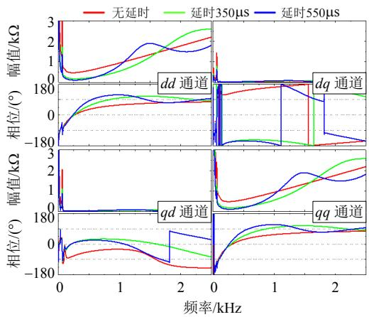  
图2 延时大小对阻抗矩阵的影响   
Fig. 2 Influence of delay time on impedance matrix

和 $_ { q d }$ 阻抗在频率大于 200Hz 以上的高频段幅值很小。另外，在没有延时的情况下，当频率大于 250Hz以上时，dd 通道和 $q q$ 通道的阻抗基本与频率呈现线性关系且相位一直小于 $9 0 ^ { \circ }$ ，说明无延时情况下，柔直换流站高频基本是电感特性。然而，考虑延时之后，阻抗幅值与频率之间不再是线性关系，相位在某些频段范围内超过 $9 0 ^ { \circ }$ ，从而存在负电阻特性；延时越大，相位超过 $9 0 ^ { \circ }$ 的频率向低频方向移动且相位最大值增大，说明系统存在延时之后柔直的输出阻抗存在具有多个“负电阻电感”特性的高频段。

# 3.3 锁相环参数对阻抗矩阵的影响

图 3 为不同 PLL 参数对阻抗矩阵的影响，其中积分系数是比例系数的 10 倍，延时550s、有功功率 0.5pu、无功功率为零。由图可知，PLL 参数影响dd通道低频段的幅值和相位，当频率大于150Hz以后基本没有影响，仍然存在“负电阻电感”特性的频带；PLL 参数也影响 $d q$ 通道和 qd 通道的低频段阻抗特性，高频段影响较小；PLL 参数不仅影响$q q$ 通道的低频段特性，更影响高频段特性。当 MMC运行于整流状态时，锁相环参数增大的同时降低了$q q$ 通道高频幅值特性，且相位特性逐向正电阻范围变化，有利于提高稳定性。

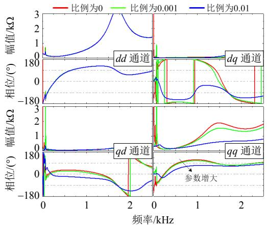  
图3 锁相环参数对阻抗矩阵的影响  
Fig. 3 Influence of PLL's parameters on impedance matrix

# 3.4 运行功率对阻抗矩阵的影响

柔直在运行过程中控制系统参数和主电路参数基本不会变化，此时运行功率的变化很有可能改变 MMC 的运行特性，为分析运行功率对阻抗矩阵的影响，图4 给出了不同运行功率情况下柔直输出阻抗矩阵特性曲线，其中无功功率均为零。

图4显示了柔直功率的变化对其阻抗特性具有非常大的影响。在 dd 通道中有功功率为1pu(逆变)

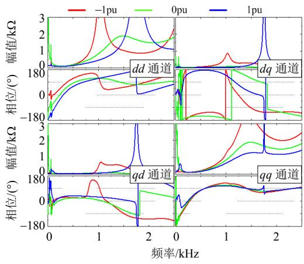  
图4 运行功率对阻抗矩阵的影响  
Fig. 4 Influence of power on impedance matrix

时阻抗幅值约在 1.03kHz 处存在极大值，随着功率向整流状态变化极大值点向高频移动；另一方面，相位特性在逆变状态下的负电阻频率范围向低频移动。当频率小于 1.5kHz 时，阻抗的 dq 和 qd 通道在逆变状态下呈现较大的变化，说明 MMC 的 d轴和 q 轴之间的影响较大。功率运行点的变化对MMC的 qq通道阻抗幅值在高频段影响较大，随着功率向整流状态变化，当频率小于 1.5kHz 时幅值呈现降低的趋势；在相位特性影响方面 MMC在小于100Hz的低频段范围和在0.6~1.4kHz高频段范围内，MMC 运行于逆变状态呈现的电阻特性弱于运行于整流状态的电阻特性。

# 3.5 电压前馈环节对阻抗矩阵的影响

MMC 电流内环控制器中的电压前馈是为了抑制电网扰动带来的不利影响，当考虑延时后电压前馈环节对柔直阻抗的影响非常大，图 5 为不同功率下柔直的输出阻抗特性，滤波器为一阶低通。

图 5(a)中有功功率为1pu 时，dd 通道直接电压前馈时的阻尼特性在 800Hz 以下时强于有滤波器和无前馈通道时的阻尼特性；而 qq 通道由于延

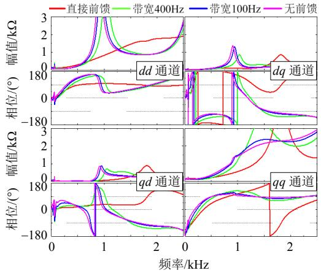  
(a) 有功功率为1pu

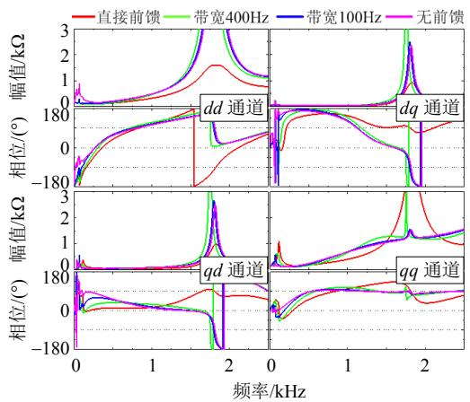  
(b) 有功功率为 1pu  
图5 电压前馈对阻抗矩阵的影响  
Fig. 5 Influence of voltage feed-forward on impedance matrix

时的存在使得 0.7~1.8kHz 范围内存在较大的负电阻特性，前馈滤波和无前馈环节情况下将该频率范围内的负电阻特性压缩至更低的频段，此时相当于增大了 0.8~1.8kHz 范围内阻尼特性，降低了 800Hz以下的阻尼特性。

图 5(b)中有功功率为 1pu 时，dd 通道直接电压前馈时的负电阻频率范围小于有滤波或无电压前馈环节的频率范围，但是负电阻特性相对强一些。dq 通道和 qd 通道在低频段幅值非常小，其影响可忽略不计；然而在高频段，虽然阻抗幅值增加，但是相对于 dd通道和 qq 通道来说非常小，其影响也可以忽略不计。然而，图 5(b)所示 qq 通道的情况与图 5(a)类似，只是频率变化范围有一点差别，不再赘述。

以上说明，由于延时存在，电压直接前馈时柔直可能发生上千赫兹的高频振荡；当加入低通滤波器或取消电压前馈时，可能发生几百赫兹的高频振荡。实际工程中为了防止引入上千赫兹的高频振荡，MMC 的极控器往往加入了低通滤波器进行滤波，例如渝鄂工程南通道调试开始期间，在鄂侧出现1.82kHz 的振荡，电压前馈采用 400Hz 带宽的一阶低通滤波器之后振荡消失[13]，本小节理论分析结论支撑了实际工程出现的振荡现象。需要说明的是，本文主要针对重庆侧交流系统进行研究，至于湖北侧的相关现象，作者已经证实，考虑文章篇幅及湖北侧高频振荡容易抑制，本文不再给出相关波形。

# 4 柔直高频振荡特性分析

针对国内外实际柔直工程高频振荡的频率基本在 2kHz 以下，本文研究的频率只到 2kHz。考虑

到本文数学模型是基于 $d q$ 旋转坐标系建立，稳定性判据需采用广义奈奎斯特方法。显然，交流系统阻抗矩阵能单独稳定运行，当连接理想电压源时只要不过分设计控制系统参数，MMC 也能够单独运行。此时，整个柔直系统稳定的充分必要条件是式(19)所表示的回路矩阵满足广义奈奎斯特稳定性判据，即式(19)所描述的 2 个特征根在频率 $( - \infty , + \infty )$ 号内均不包围(1, j0)点。考虑对称性，可研究(0, )内的特性。另外，需要说明的是广义奈奎斯特曲线单个特征根曲线不一定闭合，所有特征根组成的曲线是闭合的[28]。

$$
\boldsymbol {L} = \boldsymbol {Y} _ {\text {m m c}} \boldsymbol {Z} _ {\text {s y s}} \tag {19}
$$

# 4.1 延时对高频振荡特性的影响

第 3 节已经分析了延时对柔直输出阻抗的影响，指出延时越大柔直输出阻抗矩阵的负电阻特性在某段频率范围内越大。图 6 为延时对柔直系统高频振荡特性的影响，其中有功功率和无功功率均为零，电压前馈采用 400Hz 带宽的一阶低通滤波器，其余控制器参数见表 2，线路长度 118km。

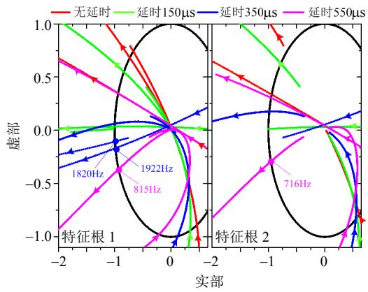  
图 6 延时大小对高频振荡特性的影响  
Fig. 6 Influence of delay time on high-frequency stability

图 6 中左边为特征根 1，右边为特征根 2，在单位圆交点处画圈表示该条曲线在该频率开始顺时针包围(1，j0)点一圈。经研究发现，在这种工况下和控制系统架构及参数时，当延时达到 165s时系统开始失稳，结合柔直站不同延时情况下的阻抗特性和线路特性可知，在 $3 5 0 \mu \mathrm { s }$ 延时下可能发生1850Hz 左右高频振荡，在延时 550s 情况下可能发生 720Hz 左右高频振荡。

# 4.2 运行功率对高频振荡特性的影响

以延时 550us、电压前馈采用 400Hz 的一阶低通滤波器、无功功率为零以及表 2参数为例分析不同有功功率(1pu、0pu、1pu)情况下柔直的高频振

荡特性，如图 7 所示，每个特征根均顺时针包围$( - 1 , \mathrm { j } 0 )$ 。由图可知，不同的运行功率水平下的，2个特征根截止频率也不同，说明柔直不同功率运行水平下发生高频振荡的谐振频率可能不同。在550s 延时，电压前馈采用带宽 400Hz 一阶低通滤波器的情况下，所研究系统在 abc 坐标系下的振荡频率初步预计约在 700~800Hz 范围。

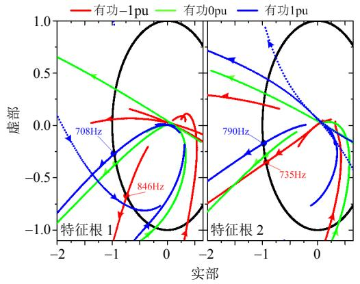  
图 7 运行功率对高频振荡特性的影响  
Fig. 7 Influence of power on high-frequency stability

# 4.3 电压前馈环节对高频振荡特性的影响

本节将研究 550s 延时和有功功率 0.5pu 情况下电压前馈环节对柔直系统高频振荡特性的影响，如图 8 所示。与前文类似，不同前馈电压环节均影响了特征根曲线的截止频率，无电压前馈时候发生高频振荡的谐振频率会更低。

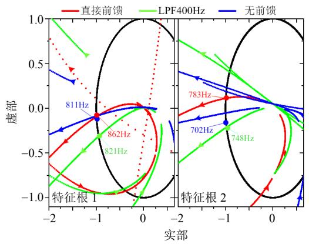  
图8 电压前馈环节对高频振荡特性的影响  
Fig. 8 Influence of voltage feed-forward on stability

# 5 柔直高频振荡抑制策略及验证

无论大功率还是小功率装置，均存在不同时间大小的延时，对于小功率来说，延时大小往往在150s 左右，然而对于高压大容量的柔直系统来说，延时甚至高达 $6 5 0 \mu \mathrm { s }$ 。小功率装置，例如并网逆变器，之所以能较好地解决延时带来的高频振荡问

题，主要有 2 点方面：一是本身延时较小，二是所接入的低压电网或实验室电源阻抗主要呈现阻感特性。柔直工程难以解决高频振荡问题反而与上述2 点相反，即整体延时较大和长线路的分布电容效应。

# 5.1 柔直工程所用的高频振荡抑制策略

柔直输出参考电压绝大部分是由电压前馈环节组成，只有小部分是电流内控制器调节输出。如果延时太大，可能使得某些频段范围内的高频谐波经过前馈之后发生相位反向，形成正反馈，导致高频振荡发生。如果能够在不影响故障穿越性能的前提下，对电压前馈环节进行优化，则可能在一定程度上抑制高频振荡现象。

渝鄂工程南通道湖北侧在 2018 年 12 月 14 日05:55 调试时出现了 1.82kHz 的振荡，之后电压前馈环节采用了 400Hz 一阶低通滤波器，振荡消失。将同样的方案应用在 118km长线路的重庆侧时，振荡依然为 695Hz 左右，其解决方案是采取了一种非线性滤波器[13]，其效应在小信号理论分析时相当于取消了电压前馈环节。这样既在一定程度上解决了高频振荡问题，又降低了故障穿越失败风险。

# 5.2 柔直简化模型阻抗及验证

广义奈奎斯特稳定性判据求解特征根过程引入了开方操作，使得奈奎斯特曲线变得复杂[28]，为此需对模型简化，只考虑电容电压直流分量，则MMC 等效至交流侧的阻抗为

$$
Z _ {\mathrm {e q}} ^ {\prime} \approx \underbrace {R _ {\mathrm {t}} + 0 . 5 R _ {\mathrm {a r m}}} _ {R _ {\mathrm {e q}}} + \underbrace {(L _ {\mathrm {t}} + 0 . 5 L _ {\mathrm {a r m}})} _ {L _ {\mathrm {e q}}} s + \frac {T}{8 C s} \tag {20}
$$

式中 T/(8Cs)为考虑电容电压直流分量之后引入的附加项，若要更加简化也可忽略不计。经过上述简化之后，式(17)可简化为

$$
\begin{array}{l} \boldsymbol {Y} _ {\mathrm {m m c}} ^ {\prime} = \boldsymbol {T} _ {\mathrm {p l}} ^ {- 1} \left(\boldsymbol {E} _ {2 \times 2} + G _ {\mathrm {d e}} \boldsymbol {M} _ {1 1} \boldsymbol {M} _ {8}\right) ^ {- 1} \boldsymbol {N} _ {2} ^ {\prime} \cdot \\ \left(\boldsymbol {T} _ {\mathrm {p} 1} + \boldsymbol {T} _ {\mathrm {p} 2} \boldsymbol {T} _ {\mathrm {P L L}}\right) + \boldsymbol {T} _ {\mathrm {p} 3} \boldsymbol {T} _ {\mathrm {P L L}} \tag {21} \\ \end{array}
$$

其中：

$$
\boldsymbol {N} _ {2} ^ {\prime} = \boldsymbol {M} _ {1 1} - G _ {\mathrm {d e}} \boldsymbol {M} _ {1 1} \boldsymbol {M} _ {7} \tag {22}
$$

$$
\boldsymbol {M} _ {1 1} = \frac {1}{\left(Z _ {\mathrm {e q}} ^ {\prime}\right) ^ {2} + \left(\omega_ {0} L _ {\mathrm {e q}}\right) ^ {2}} \left[ \begin{array}{c c} Z _ {\mathrm {e q}} ^ {\prime} & \omega_ {0} L _ {\mathrm {e q}} \\ - \omega_ {0} L _ {\mathrm {e q}} & Z _ {\mathrm {e q}} ^ {\prime} \end{array} \right] \tag {23}
$$

为了评价简化模型的正确性，图 9给出了柔直站输出阻抗矩阵特性曲线。由图可知，4 种模型的阻抗特性曲线在高频段基本重合，为方便后续进行阻尼控制器参数设计，可采用第4种模型进行分析，

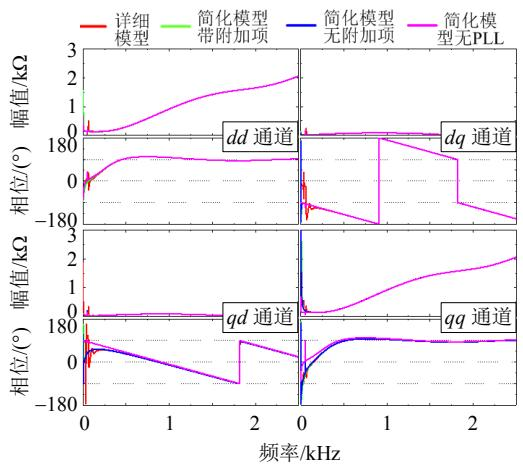  
图 9 简化模型阻抗特性响  
Fig. 9 Impedance matrix characteristics of simplified models

再将所设计的参数加入全功率范围内的详细模型中进行理论分析或电磁暂态仿真验证。

当采用上述简化模型时，可得到柔直最简化模型如图 10 所示，图中电压前馈环节可以是一阶低通滤波器，也可以是渝鄂工程所用的非线性滤波器(理论分析相当于无前馈)，用 Gffw(s)表示。

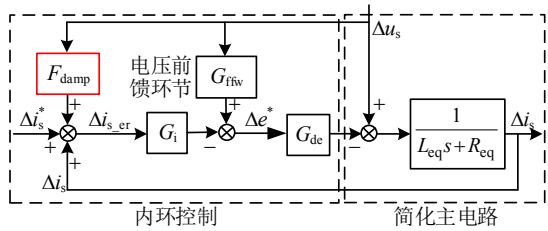  
图10 柔直简化模型及高频振荡阻尼控制器  
Fig. 10 Simplified model of MMC and its damping controller for high-frequency resonance

# 5.3 高频振荡阻尼抑制策略原理

根据阻抗原理[29]，抑制振荡的思路分为2大类，一是使 2 个系统的阻抗幅值没有交点，二是使交点处的相位差小于 180。由于交流线路存在多个阻抗极点，第 1 种思路不可能实现阻抗无交点，因此只能从第 2 个思路着手。

考虑到电压前馈环节在形成柔直参考电压时占据主导地位，本文的高频振荡抑制策略在内环中实现，如图 10 中 $F _ { \mathrm { d a m p } }$ 阻尼控制环节，其表现形式是将前馈的电压瞬时值经过高频振荡阻尼控制器$F _ { \mathrm { d a m p } }$ 之后与参考电流叠加，经电流内环调节之后叠加至参考电压中。图 10 中，考虑阻尼控制器之后简化模型的单输入输出阻抗可表示为

$$
Z _ {\mathrm {m m c}} = \frac {R _ {\mathrm {e q}} + L _ {\mathrm {e q}} s + G _ {\mathrm {i}} \cdot \mathrm {e} ^ {- T _ {\mathrm {d e}} s}}{1 + \left(G _ {\mathrm {i}} F _ {\mathrm {d a m p}} - G _ {\mathrm {f f w}}\right) \cdot \mathrm {e} ^ {- T _ {\mathrm {d e}} s}} \tag {24}
$$

# 5.4 高频振荡阻尼控制器参数设计

当柔直接入点的附近没有其它电力电子装置时，交流系统的相位角度一般在 $\pm 9 0 ^ { \circ }$ 范围内，根据阻抗理论，为了完美地抑制高频振荡，需要使柔直阻抗的相位也在 $\pm 9 0 ^ { \circ }$ 范围内，从而在任何与交流系统的交点处相位必定小于 $1 8 0 ^ { \circ }$ 。然而，该愿景比较理想，因为柔直本身在高频段呈现电感特性，相位一直趋近于 $9 0 ^ { \circ }$ ，这种在高频段呈现“负电阻电感”特性决定了高频振荡阻尼控制器难以使得柔直的阻抗相位被压缩在 $9 0 ^ { \circ }$ 范围内，很容易导致某一段频率仍然具有负电阻特性。因此，高频振荡阻尼控制器设计的思路是将柔直的负电阻频率范围压缩至交流系统的电感特性频率范围内，从而使得交点的频率小于 $1 8 0 ^ { \circ }$ 。本文先假设阻尼控制器是由一个高通滤波器、一个低通滤波器以及增益 $k _ { \mathrm { s } }$ 构成，其表达式为

$$
F _ {\text {d a m p}} = \frac {k _ {\mathrm {s}} s}{s + 2 \pi f _ {\mathrm {H P F}}} \cdot \frac {2 \pi f _ {\mathrm {L P F}}}{s + 2 \pi f _ {\mathrm {L P F}}} \tag {25}
$$

式中 fHPF、fLPF为高通和低通滤波器的带宽频率。先以 $k _ { \mathrm { s } } = 0 . 0 3$ ， $f _ { \mathrm { H P F } } { = } 1 0 0 \mathrm { H z }$ ， $f _ { \mathrm { L P F } } { = } 2 0 0 \mathrm { H z }$ 作为基础值研究单一参数变化时简化模型的阻抗特性。

图 11 为考虑二阶阻尼控制器之后简化模型的阻抗特性曲线，图中左上角 3 个子图为不同电压前馈环节的特性曲线；右上角 3 个子图为低通滤波器带宽从小至大后的特性曲线；左下角 3 个子图为高通滤波器带宽从小至大后的特性曲线；右下角为阻尼控制器增益从小变大后的特性曲线。从该图电压

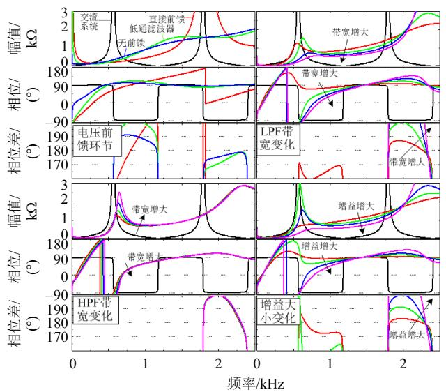  
图 11 简化模型考虑二阶阻尼控制器的阻抗特性  
Fig. 11 Impedance matrix characteristics of simplified model considering two-order damping controller

前馈环节可清晰地知道，直接前馈在 1.8kHz 左右容易发生振荡，一阶低通滤波器和无前馈容易在700Hz 附近发生高频振荡，但是无前馈的相位差小于一阶低通，说明无前馈的稳定性相对较高一点，该方案被渝鄂工程采用。阻尼控制器中的一阶低通带宽增大时，阻抗幅值交点向低频段移动，增大了1.8kHz 附近的相位角，降低了 700Hz 附近的相位角，两者呈现矛盾。阻尼控制器中的一阶高通带宽增大时，阻抗幅值交点频率变化程度不大，1.8kHz附近的相位角基本没有变化，700Hz 附近的相位角增加程度较慢，说明可适当压低高通滤波器的带宽改善 700Hz附近的阻抗。阻尼控制器增益从小到大对阻抗曲线影响较大，增大增益相当于降低了虚拟并联阻抗的幅值，使得柔直阻抗曲线呈现下降趋势；增大增益能降低 700Hz 附近的相位角，然而增大 1.8kHz 附近的相位角，两者呈现矛盾。

从图 11 还可知，加入阻尼控制器几乎不可能在全频段范围将柔直阻抗相位压缩在 $9 0 ^ { \circ }$ 范围内，只是改变了柔直“负电阻”频率的范围，将其往更低的频率方向移动，从而使得幅值交点处的相位差控制在 $1 8 0 ^ { \circ }$ 内。虽然参数的变化对阻抗特性呈现“此消彼长”的现象，但是了解到上述 3 个参数变化对阻抗的影响之后，然而可通过调整参数将柔直的阻抗特性进行优化设计。

从以上可知，采用二阶阻尼控制器的进行参数设计难以做到1.8kHz和700Hz附近相位角的协调，考虑到低通滤波器能较好改善 1.8kHz 附近的相位角度，因此在二阶上面继续增加一个低通滤波器变成三阶形式，如式(26)所示。

$$
F _ {\text {d a m p}} = \frac {k _ {\mathrm {s}} s}{s + 2 \pi f _ {\mathrm {H P F}}} \cdot \frac {2 \pi f _ {\mathrm {L P F 1}}}{s + 2 \pi f _ {\mathrm {L P F 1}}} \cdot \frac {2 \pi f _ {\mathrm {L P F 2}}}{s + 2 \pi f _ {\mathrm {L P F 2}}} \tag {26}
$$

图 12 为不同增益系数下，二阶阻尼控制器和三阶阻尼控制器之间的对比，其中高通滤波器带宽均为 30Hz，低通滤波器分别为 300 和 1000Hz。当增益系数为 0.02 时，二阶阻尼控制器在 1.8kHz 附近相位差达到 $1 9 6 ^ { \circ }$ ，而三阶的可降低至 182。当增益系数为0.01时，二阶阻尼控制器在0.65和1.8kHz附近的相位差达到 $1 8 1 ^ { \circ }$ 和 $1 8 5 ^ { \circ }$ ，而三阶的为 $1 6 4 ^ { \circ }$ 和 177。以上说明了，在二阶的基础上再增加一个低通滤波器能够增加参数调节的灵活性，考虑到柔直阻抗的调整呈现“此消彼长”现象，参数设计的本质是将0.7和1.8kHz附近的阻抗相位角进行协调平衡化处理。

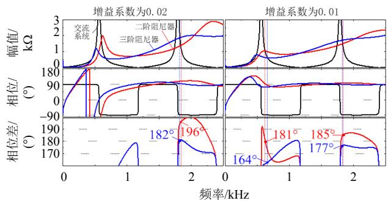  
图12 阻尼控制器性能对比阻抗特性  
Fig. 12 Impedance matrix characteristics comparisons of simplified model between different damping controllers

# 5.5 阻尼控制器电磁暂态仿真验证

简化模型只是给阻尼控制器的参数设计提供了方便，由于没有考虑运行点和 PLL 特性，因此电磁暂态仿真验证需要将其进行考虑，即需要给出MMC 在整个功率范围内的仿真波形。

# 1）情况 1：系统延时失稳仿真。

电磁暂态仿真设置如下：仿真步长 10s，阀控周期 100s，柔直站定功率控制，初始状态下系统只延时测量和执行环节共计 2 个仿真步长，在 0.6s时刻切换至量测 100s 和执行 450s 延时，具体的仿真波形如图 13 所示。由图可知，在 0.6s 之前仿真能稳定运行，当切换至 550s 延时之后，仿真模型不再稳定，功率与电流(电压)开始发散，对 PCC点的 A 相电流从 0.7s 开始进行 FFT 分析，发现高频振荡频率约为 728Hz，与理论分析的频率范围基本一致。

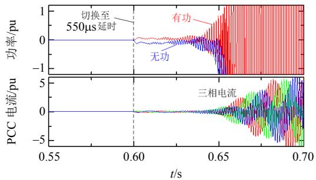  
(a) 时域波形

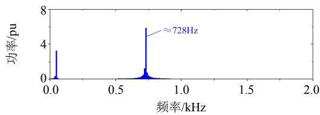  
(b) A 相电流 FFT 分析  
图13 系统延时失稳仿真结果  
Fig. 13 Simulation results of instability due to system delay

# 2）情况 2：柔直站定有功和定无功控制。

对站采用840kV直流电压源模拟，经1/0.01H集中参数连接，仿真模型设置如下：0.6s 切换至550s 延时，0.63s 时刻投入高频振荡阻尼控制器，有功功率从 0.8s 开始以 20pu/s 速率下降至1pu；柔直PCC点A相在t1s发生单相金属接地短路故障，持续 100ms；有功功率在 t  1.3s 上升至 1pu；PCC点A相在t1.6s发生单相金属接地短路故障，持续 100ms；期间无功功率设置为零。

图 14 为相应的电磁暂态仿真波形，从上至下分别是功率波形、交流电压波形、直流电压电流波形。由图可知，当投入高频振荡阻尼控制器之后，原本发散的系统逐渐恢复稳定性运行，并且在整个功率运行范围内以及暂态穿越后均能保持稳定运行，故障穿越期间外环输出限流导致输送的功率降低，故障穿越完成之后恢复原始功率。

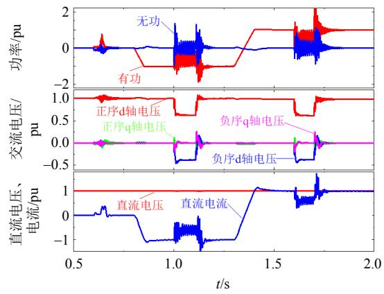  
图 14 高频振荡阻尼控制器性能(功率控制)  
Fig. 14 Performance validation of damping controller for high-frequency resonance suppression (power control)

3）情况 3：柔直站定直流电压和定交流电压控制。

对站定功率控制，仿真模型设置与情况2相同，具体波形见图 15 所示，很明显仿真结果与情况 2类似，只是交流电压和直流电压在系统动态和暂态过程中存在允许范围内的波动。

综上，电磁暂态仿真验证了所提高频振荡阻尼控制策略及其参数设计的有效性和正确性，所提出的阻尼控制策略能在柔直常用功率和电压控制模式以及暂态过程中使其保持稳定运行。

# 6 结论

本文建立了柔直系统的高频数学模型，研究了相关因素对柔直高频阻抗特性的影响，提出了高频

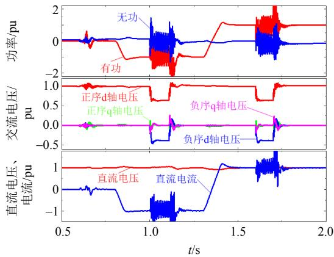  
图 15 高频振荡阻尼控制器性能(电压控制)  
Fig. 15 Performance validation of damping controller for high-frequency resonance suppression (voltage control)

振荡阻尼控制器，并进行了参数设计，结论如下：

1）柔直系统发生高频振荡的机理是换流站在 某一高频范围内呈现“负电阻电感”特性与线路对 应频段内电容效应之间的相互影响导致。   
2）物理层面改善柔直阻抗特性可从降低系统整体链路延时、加装无源滤波器、增大交流系统强度、调整电网运行方式等角度进行考虑。  
3）控制层面改善柔直阻抗可从对柔直站阻抗特性影响较大的电压前馈、锁相环、阻尼控制器等方面进行。  
4）阻尼控制器参数设计的前提是需要以精确知道交流系统的阻抗特性变化范围为基础，改变阻尼控制器参数调整柔直阻抗会呈现“此消彼长”的现象，高频阻抗特性的协调调整相对于低频阻抗特性来说非常敏感。

# 致 谢

感谢国网湖南省电力有限公司科技项目《降低直流接入湖南电网振荡风险的规划关键技术》提供资助。

# 参考文献

[1] 汤广福，罗湘，魏晓光．多端直流输电与直流电网技术[J]．中国电机工程学报，2013，33(10)：8-17  
Tang Guangfu ， Luo Xiang ， Wei XiaoguangMulti-terminal HVDC and DC-grid Technology[J]Proceedings of CSEE，2013，33(10)：8-17(in Chinese)  
[2] 李云丰，汤广福，庞辉，等．直流电网电压控制器的参数计算方法[J]．中国电机工程学报，2016，36(22)：6111-6121  
LI Yunfeng，Tang Guangfu，Pang Hui，et al．Controllerparameters calculating method of DC voltage loop for DCgrid[J] ． Proceedings of the CSEE ， 2016 ， 36(22) ：

6111-6121(in Chinese)   
[3] Li Yunfeng，Tang Guangfu，An Ting，et al．Power compensation control for interconnection of weak power systems by VSC-HVDC[J]．IEEE Transactions on Power Delivery，2017，32(4)：1964-1974   
[4] 安婷，乐波，杨鹏，等．直流电网直流电压等级确定方法[J]．中国电机工程学报，2016，36(11)：2871-2879An Ting，Yue Bo，Yang Peng，et al．A determinationmethod of DC voltage levels for DC grid[J]．Proceedingsof the CSEE，2016，36(11)：2871-2879(in Chinese)  
[5] 温家良，吴锐，彭畅，等．直流电网在中国的应用前景分析[J]．中国电机工程学报，2012，32(13)：7-13Wen Jialiang，Wu Rui，Peng Chang，et al．Analysis of DCgrid projects in China[J]．Proceedings of the CSEE，2012，32(13)：7-13(in Chinese)  
[6] 周孝信，鲁宗相，刘应梅，等．中国未来电网的发展模式和关键技术[J]．中国电机工程学报，2014，34(29)：4999-5008Zhou Xiaoxin，Lu Zongxiang，Liu Yingmei，et alDevelopment models and key technologies of future gridin China[J]．Proceedings of the CSEE，2014，34(29)：4999-5008(in Chinese)  
[7] 宋瑞华，郭剑波，李柏青，等．基于输入导纳的直驱风电次同步振荡机理与特性分析[J]．中国电机工程学报，2017，37(16)：4662-4671  
Song Ruihua，Guo Jianbo，Li Baiqing，et al．Mechanism and characteristics of subsynchronous oscillation in Direct-Drive wind power Generation system based on Input admittance analysis[J]．Proceedings of the CSEE， 2017，37(16)：4662-4671(in Chinese)   
[8] Lyu Jing ， Cai Xu ， Amin Mohammad ， et alSub-synchronous oscillation mechanism and itssuppression in MMC-Based HVDC connected windfarms[J]．IET Generation Transmission & Distribution，2018，12(4)：1021-1102  
[9] Wen Bo，Boroyevich D，Burgos R，et al．Analysis of DQ small-signal impedance of grid-tied inverters[J]．IEEE Transactions on Power Electronics，2016，31(1)：675-687   
[10] Lyu Jing，Cai Xu，Molinas Marta．Frequency domain stability analysis of MMC-Based HVDC for wind farm integration[J]．IEEE Journal of Emerging and Selected Topics in Power Electronics，2016，4(1)：141-151   
[11] 李云丰，汤广福，贺之渊，等．MMC型直流输电系统阻尼控制策略研究[J]．中国电机工程学报，2016，36(20)：5492-5503  
Li Yunfeng，Tang Guangfu，He Zhiyuan，et al．Damping control strategy research for MMC based HVDC system[J]．Proceedings of the CSEE，2016，36(20)： 5492-5503(in Chinese)   
[12] Zou Changyue，Rao Hong，Xu Shukai，et al．Analysis of resonance between a VSC-HVDC converter and the AC grid[J]．IEEE Transactions on Power Electronics，2018，

33(12)：10157-11016  
[13] 国家电网有限公司特高压建设部．渝鄂直流背靠背联网工程南通道 OLT 试验高频谐波问题研究报告[R]．2018：1-21．  
[14] Buchhagen C，Rauscher C，Menze A，et al．BorWin1-first experiences with harmonic interactions in converter dominated grids[C]//International ETG congress，Bonn， 2015：1-7   
[15] 尹聪琦，谢小荣，刘辉，等．柔性直流输电系统振荡现象分析与控制方法综述[J]．电网技术，2018，42(4)：1117-1123  
Yin Congqi，Xie Xiaorong，Liu Hui，et al．Analysis andcontrol of the oscillation phenomenon in VSC-HVDCtransmission system[J]．Power System Technology，2018，42(4)：1117-1123(in Chinese)  
[16] 李探，赵成勇，Aniruddha G．MMC-HVDC 内部谐波模态识别及其稳定性分析[J]．中国电机工程学报，2017，37(8)：2185-2196  
Li Tan，Zhao Chengyong，Aniruddha G．Identification andstability analysis of the internal harmonic modes of theMMC-HVDC system[J]．Proceedings of the CSEE，2017，37(8)：2185-2196(in Chinese)  
[17] 李探，Gole A．M，赵成勇．考虑内部动态特性的模块化多电平换流器小信号模型[J]．中国电机工程学报，2016，36(11)：2890-2899  
Li Tan，Gole A．M，Zhao Chengyong．Small-signal model of the modular multilevel converter considering the internal dynamics[J]．Proceedings of the CSEE，2016， 36(11)：2890-2899(in Chinese)   
[18] Sun Jian，Liu Hanchao．Sequence impedance modeling of modular multilevel converters[J] ． IEEE Journal of Emerging and Selected Topics in Power Electronics， 2017，5(4)：1427-1443   
[19] 吕敬，蔡旭，张占奎，等．海上风电场经MMC-HVDC并网的阻抗建模及稳定性分析[J]．中国电机工程学报，2016，36(14)：3771-3781  
Lü Jing，Cai Xu，Zhang Zhankui，et al．Impedance modeling and stability analysis of MMC-based HVDC for offshore wind farms[J]．Proceedings of the CSEE，2016， 36(14)：3771-3781(in Chinese)   
[20] 吕敬，蔡旭．风电场柔性直流并网系统镇定器的频域分析与设计[J]．中国电机工程学报，2018，38(14)：4074-4085  
Lü Jing，Cai Xu．Frequency-domain analysis and design of stabilization controllers for wind farm integration through VSC-HVDC system[J]．Proceedings of the CSEE，2018， 38(14)：4074-4085(in Chinese)   
[21] Sun Jian．Impedance based stability criterion for grid connected inverters[J] ． IEEE Transactions on Power Electronics，2011，26(11)：3075-3078   
[22] 吴恒，阮新波，杨东升．弱电网条件下锁相环对 LCL型并网逆变器稳定性的影响研究及锁相环参数设计[J]中国电机工程学报，2014，34(30)：5259-5268

Wu Heng，Ruan Xinbo，Yang Dongsheng．Research on the stability problem caused by phase-locked loop for LCL-type grid-connected inverter in weak grid condition[J]．Proceedings of the CSEE，2014，34(30)： 5259-5268(in Chinese)   
[23] 曾正，赵荣祥，吕志鹏，等．光伏并网逆变器的阻抗重塑与谐波谐振抑制[J]．中国电机工程学报，2014，34(27)：4547-4558  
Zeng Zheng，Zhao Rongxiang，Lv Zhipeng，et al Impedance reshaping of grid-tied inverters to damp the series and parallel harmonic resonance of photovoltaic systems[J]．Proceedings of the CSEE，2014，34(27)： 4547-4558(in Chinese)   
[24] Wang Xiongfei，Li Yunwei，Blaabjerg F．et al．Virtual impedance based control for voltage source and current source converters[J] ． IEEE Transactions on Power Electronics，2015，30(12)：7019-7037   
[25] Pan Donghua，Ruan Xinbo，Bao Chenlei，et al．Capacitor current feedback active damping with reduced computation delay for improving robustness of LCL type grid connected inverter[J]．IEEE Transactions on Power Electronics，2014，29(7)：3414-3427   
[26] Li Yunfeng，Tang Guangfu，Ge Jun，et al．Modeling and damping control of modular multilevel converter based DC grid[J]．IEEE Transactions on Power Systems，2018， 33(1)：723-735   
[27] Song Yujiao，Claes B．Nyquist stability analysis of an AC grid connected VSC-HVDC system using a distributed parameter DC cable model[J]．IEEE Transactions on Power Delivery，2016，31(2)：898-907   
[28] 高黛陵，吴麒．多变量频率域控制理论[M]．北京：清华大学出版社，1987：137-160  
[29] Cespedes M，，Sun Jian．Impedance modeling and analysisof Grid gonnected voltage source converters[J]．IEEETransactions on Power Electronics ， 2014 ， 29(3) ：1254-1261

  
郭贤珊

收稿日期：2019-03-19。

作者简介：

郭贤珊(1972)，男，教授级高级工程师，研究方向为高压直流输电技术与直流工程建设管理等，xianshan-guo@sgcc.com.cn；

刘泽洪(1961)，男，教授级高级工程师，博士生导师，研究方向为高压直流输电技术等，zehong-liu@sgcc.com.cn；

* 通信作者：李云丰(1988)，男，博士，研究方向为柔性直流输电技术、电网运行与规划技术，252415270@qq.com；

卢亚军(1982)，男，高级工程师，研究方向为高压直流工程成套设计及仿真分析。

(责任编辑 吕鲜艳)

# Characteristic Analysis of High-frequency Resonance of Flexible High Voltage Direct Current and Research on Its Damping Control Strategy

GUO Xianshan1 , Liu Zehong1 , LI Yunfeng2 , LU Yajun3

(1. State Grid Corporation of China; 2. State Grid Hunan Electric Power Company Limited Economic & Technical Research

Institute; 3. State Grid Economic and Technological Research Institute CO. LTD.)

KEY WORDS: flexible high voltage direct current; modular multilevel convert (MMC); impedance model; high-frequency resonance; damping control; voltage feed forward

Time delay is the inherent feature of MMC-based HVDC transmission system which makes the output impedance of MMC presented “negative resistance and inductance” characteristics in high frequency ranges. Those characteristics may easily cause high-frequency resonant instability interacting with the capacitance feature of long AC lines. The studied system is shown in Fig. 1.

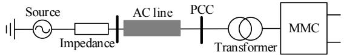  
Fig. 1 Main circuit diagram of HVDC system

Therefore, the model of MMC considering the dynamics of PLL is shown in Fig. 2. The admittance of MMC can be expressed as:

$$
\boldsymbol {Y} _ {\mathrm {m m c}} = \boldsymbol {T} _ {\mathrm {p 1}} ^ {- 1} \left(\boldsymbol {E} _ {2 \times 2} - \boldsymbol {N} _ {1} \boldsymbol {M} _ {8}\right) ^ {- 1} \boldsymbol {N} _ {2} \left(\boldsymbol {T} _ {\mathrm {p 1}} + \boldsymbol {T} _ {\mathrm {p 2}} \boldsymbol {T} _ {\mathrm {P L L}}\right) + \boldsymbol {T} _ {\mathrm {p 3}} \boldsymbol {T} _ {\mathrm {P L L}} (1)
$$

where

$$
\left\{ \begin{array}{l} \boldsymbol {N} _ {1} = \boldsymbol {M} _ {1} + \boldsymbol {M} _ {2} \boldsymbol {M} _ {1 0} \left(\boldsymbol {E} _ {2 \times 2} - \boldsymbol {M} _ {5} \boldsymbol {M} _ {1 0}\right) ^ {- 1} \boldsymbol {M} _ {4} \\ \boldsymbol {N} _ {2} = \boldsymbol {N} _ {1} \boldsymbol {M} _ {7} + \boldsymbol {M} _ {2} \boldsymbol {M} _ {1 0} \left(\boldsymbol {E} _ {2 \times 2} - \boldsymbol {M} _ {5} \boldsymbol {M} _ {1 0}\right) ^ {- 1} \boldsymbol {M} _ {6} + \boldsymbol {M} _ {3} \end{array} \right. \tag {2}
$$

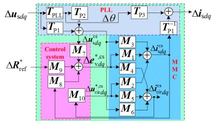  
Fig. 2 Diagram of MMC using transfer function matrix

To suppress the high-frequency resonance, a damping control strategy with paralleled impedance performance is proposed and is shown in Fig. 3. The damping controller can be expressed as:

$$
F _ {\text {d a m p}} = \frac {k _ {\mathrm {s}} s}{s + 2 \pi f _ {\mathrm {H P F}}} \cdot \frac {2 \pi f _ {\mathrm {L P F} 1}}{s + 2 \pi f _ {\mathrm {L P F} 1}} \cdot \frac {2 \pi f _ {\mathrm {L P F} 2}}{s + 2 \pi f _ {\mathrm {L P F} 2}} \tag {3}
$$

where $k _ { \mathrm { s } }$ is the gain; $f _ { \mathrm { L P F } }$ is the bandwidth of low pass filter $; f _ { \mathrm { H P F } }$ is the bandwidth of high pass filter.

The output impedance of simplified model can be expressed as:

$$
Z _ {\mathrm {m m c}} = \frac {R _ {\mathrm {e q}} + L _ {\mathrm {e q}} s + G _ {\mathrm {i}} \cdot \mathrm {e} ^ {- T _ {\mathrm {d e}} s}}{1 + \left(G _ {\mathrm {i}} F _ {\mathrm {d a m p}} - G _ {\mathrm {f f w}}\right) \cdot \mathrm {e} ^ {- T _ {\mathrm {d e}} s}} \tag {4}
$$

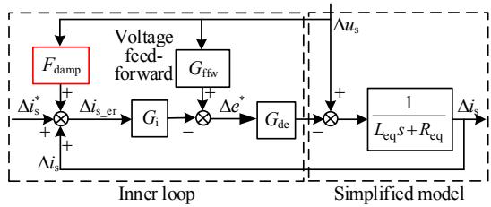  
Fig. 3 Simplified model of MMC and its damping controller for high-frequency resonance

To test the damping control, the simulation is set as follows.

1) The time delay is set as 550s at 0.6s;   
2) The controller is enabled at 0.63s;   
3) Active power is set as 1pu with decreasing slope 20pu/s at 0.8s;   
4) A single phase grounding fault occurs at 1s and lasts 100ms;   
5) Active power is set as 1pu with increasing slope 20pu/s at 1.3s;   
6) A single phase grounding fault occurs at 1.6s and lasts 100ms.

The performance of the proposed damping control method is plotted in Fig. 4 which shows that it has a very good damping control effect on system performance although the system is under instability. The system can be operated well in all allowable power ranges.

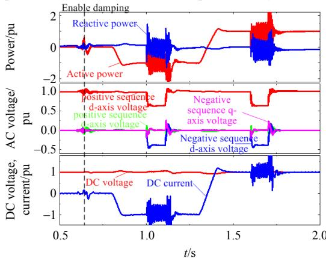  
Fig. 4 Performance validation of damping controller for high-frequency resonance suppression (AC voltage and DC voltage control)