# Combining Detailed Equivalent Model With Switching-Function-Based Average Value Model for Fast and Accurate Simulation of MMCs

Xuekun Meng, Student Member, IEEE, Jintao Han , Student Member, IEEE, Joel Pfannschmidt , Student Member, IEEE, Liwei Wang , Member, IEEE, Wei Li , Member, IEEE, Fei Zhang , Member, IEEE, and Jean Belanger, Senior Member, IEEE

Abstract—Modeling and simulation play a vital role in the design and testing of modular multilevel converter (MMC) high voltage direct current (HVDC) systems. Detailed equivalent model (DEM) and switching-function-based average value model (SFB-AVM) are two major types of accurate and efficient models to represent the dynamic response of the MMCs. However, the DEM and the SFB-AVM possess unique benefits depending on the purpose of the simulation studies. The DEM provides a detailed representation of submodule (SM) switching events and individual capacitor ripples. The SFB-AVM provides faster simulation speed by using arm equivalent capacitance. Combining both models in a universal arm equivalent circuit gives the users the choice of selecting the most appropriate modeling method during dynamic simulation. This paper proposes a universal modeling framework combining the DEM with the SFB-AVM which allows the DEM and the SFB-AVM smoothly switch from one to the other during dynamic simulation. The proposed SFB-AVM can accurately represent the MMCs with different SM types. The proposed models are validated in offline and real-time simulation studies which demonstrate the improved simulation speeds of the proposed SFB-AVM over the DEM especially for large numbers of SMs.

Index Terms—Average value model, electromagnetic transient (EMT) simulation, HVDC, modular multilevel converter, real-time simulation, switching function.

# I. INTRODUCTION

M ODULAR multilevel converter high voltage direct cur-rent (MMC-HVDC) technology has been widely used rent (MMC-HVDC) technology has been widely used for the offshore renewable energy integration and regional AC grid connections [1], [2]. As an MMC-HVDC integrates a large number of submodules (SMs), each SM can be inserted or

Manuscript received April 7, 2019; revised August 4, 2019; accepted September 2, 2019. Date of publication October 2, 2019; date of current version February 19, 2020. This work was supported by Natural Sciences and Engineering Research Council (NSERC) of Canada. Paper no.-TEC-00398-2019.R1 (Corresponding author: Liwei Wang.)

X. Meng, J. Han, J. Pfannschmidt, and L. Wang are with the School of Engineering, The University of British Columbia Okanagan, Kelowna, V1V 1V7 BC, Canada (e-mail: xuekun.meng@hotmail.com; williamhan1993@gmail.com; joelpfannschmidt@gmail.com; liwei.wang@ubc.ca).

W. Li, F. Zhang, and J. Belanger are with the OPAL-RT Technologies, Montreal H3K 1G6, Quebec, Canada (e-mail: wei.li@opal-rt.com; fei.zhang@opalrt.com; jean.belanger@opal-rt.com).

Color versions of one or more of the figures in this article are available online at http://ieeexplore.ieee.org.

Digital Object Identifier 10.1109/TEC.2019.2944352

bypassed to create nearly perfect sinusoidal voltage waveforms at the point of common couplings (PCCs). Other benefits of MMC-HVDC are the reduced switching frequency and losses, eliminating the use of harmonic filters, independent control of active and reactive power, and enhancement of the weak AC grid connections [3]. By 2018, more than ten projects have been commissioned using MMC-HVDC [4]. It is foreseen that the MMC-HVDC will become the backbone of long distance power transmission systems in the near future for large-scale renewable energy integration [5]. However, the existing half-bridge (HB) MMC technology is vulnerable to DC-side short-circuit faults [6], [7]. Therefore, it is crucial for the MMC-HVDC to provide DC-side fault blocking ability in practical applications such as overhead-line transmission. To address this issue, recent research works have focused on developing alternative SM topologies, e.g., full-bridge (FB) SM [8], [9], clamped-double (CD) SM [10], [11] and mixed half- and full-bridge bridge (MB) SM [12], [13] to improve the DC-side fault blocking capability of the MMCs.

For dynamic simulation studies, the MMCs are modeled in electro-magnetic transient (EMT) type solvers [14] using microsecond time steps in order to accurately account for the fast and massive switching events in the SMs. Detailed semiconductor-switching-based MMC models can be formulated for a massive number of the SMs and are solved in a large conduction matrix in discrete-time domain. However, each switching operation within a SM will cause re-factorization of the conductance matrix leading to inefficient simulation for the MMCs.

Detailed equivalent models (DEMs) of the MMC are proposed in [15]–[19] to reduce the number of electrical nodes in a converter arm. The size of the conduction matrix and the overall simulation burden of the MMC are significantly reduced. The DEMs proposed in [17]–[19] can represent the converter blocking mode operation which further improves the simulation accuracy and model applicability. In [19], a multi-rate DEM is proposed for CPU- and FPGA-based real-time simulation in which a converter arm is represented by two anti-parallel diodes and controlled voltage sources simulated in CPUs. The controlled voltage sources are calculated from the capacitor voltages and gating signals of individual SMs simulated in FPGAs.

In order to achieve fast simulation speed of the MMCs, average value models (AVMs) are developed in [20]–[23]. The AVM represents the MMCs using AC- and DC-side Thevenin equivalent circuits which take values from the converter outer-loop controls (e.g., P-Q or Vdc-Q controls) and the inner-loop current controls. The AVMs proposed in [22] and [23] can represent converter blocking operations such as converter energization and a DC-side pole-to-pole fault. These AVMs are suitable for large-scale power system studies. However, the converter arm dynamics (e.g., arm currents and SM capacitor voltages) are not represented in the AVMs leading to less accurate simulations compared to the DEM.

Switching-function-based (SFB) AVMs are proposed in [21], [24], and [25]. The concept of SFB-AVM is to represent the arm dynamics of an MMC using the arm equivalent capacitance and the switching or insertion index of the SMs in one arm. The assumption of the SFB-AVM is that the capacitor voltages of the individual SMs are balanced (or equal). This assumption is usually valid due to the voltage balancing control (VBC) and the arm circulating current suppression control (CCSC) in an MMC. The VBC and CCSC keep the individual SM capacitor voltage ripples close to the average capacitor voltage ripple. The use of the SFB-AVMs [21], [24], [25] significantly improves the simulation efficiency, compared to the DEM. However, the SFB-AVMs in [21], [24], [25] focused on the modeling of HBSM-MMC, whereas a generalized switching-function-based (GSFB-) AVMs for other SM types are not addressed.

This paper proposes a GSFB-AVM for the MMCs with different SM types, e.g., HB, FB, CD, and MB SMs. The converter blocking, e.g., converter energization [26], [27], and de-blocking operations can be represented by the proposed GSFB-AVM. There are some cases in which the DEM is more preferable than the GSFB-AVM, e.g., in the real-time hardware-in-the-loop (HIL) simulation for testing MMC insulated-gate bipolar transistors (IGBTs) gating control [28] and the development of new MMC modulation and VBC strategies [29], [30]. A combined model (CM) of the DEM and GSFB-AVM is proposed, which can switch between the DEM and the GSFB-AVM during the dynamic simulation to deliver high simulation accuracy and efficiency. The overall contributions of this paper are summarized as follows:

1) The proposed GSFB-AVM is implemented using a unified arm equivalent circuit model. It can represent the converter arms with different SMs using controlled voltage sources calculated from the arm equivalent capacitor voltage and the arm insertion index.   
2) A combined model of the DEM and the GSFB-AVM is proposed to represent the MMCs with different SM types. The data exchange method between the DEM and the GSFB-AVM is proposed to enable smooth switching between the two models during dynamic simulation.   
3) The conduction and switching losses of the IGBTs and the diodes in the MMCs with different SM types are accurately represented.   
4) The proposed GSFB-AVM is validated in offline and realtime simulations using 2-, 4- and 11-terminal HVDC systems. The real-time simulation results demonstrate that the

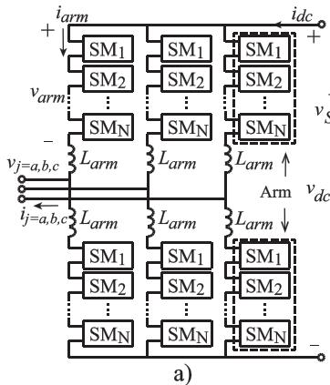

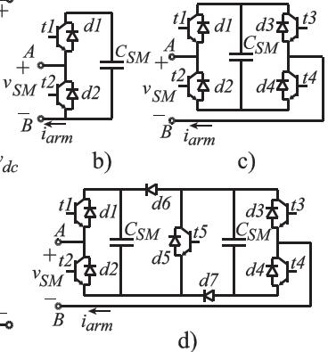  
Fig. 1. MMC configuration. (a) Circuit diagram. (b) HBSM. (c) FBSM. (d) CDSM.

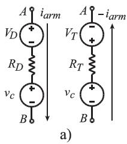

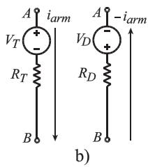

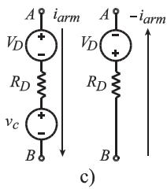  
Fig. 2. HBSM output voltages based on arm current directions and SM operation modes. (a) Inserted. (b) Bypassed. (c) Blocked.

proposed GSFB-AVM achieves the CPU time of 9.45 µs for simulating one MMC station with 4800 SMs while the DEM requires 51.59 µs for one MMC station with 480 SMs. Moreover, the simulation speed of the GSFB-AVM is independent of the number of SMs in the MMC.

# II. THE PROPOSED GENERALIZED DEM

The MMC circuit topology is shown in Fig. 1 in which one converter arm or a half phase consists of N number of SMs connected in series. A SM is a two-terminal power electronic building block including storage capacitors and semiconductor switches. Figs. 1(b)−(d) show the typical SM configurations of HB, FB and CD SMs. An HBSM and a FBSM can be used simultaneously in one converter arm, known as an MBSM for the advantages of DC pole-to-pole fault blocking and reduced semiconductor losses. The output voltage of each SM depends on the semiconductor conduction states. By controlling the IGBT gating signals, a SM can operate in inserted, bypassed, or blocked mode.

The on-state characteristics of the semiconductor switches (i.e., IGBTs and anti-parallel diodes) can be modeled by piece-wise linear functions [31], [32] using saturation voltages $( V _ { T } , V _ { D } )$ and on-state resistances $( R _ { T } , R _ { D } )$ . Without loss of generality, an HBSM is used to illustrate the SM output voltage as shown in Fig. 2. The SM output voltage, including the SM capacitor voltage vc and semiconductor on-state voltage drop, can be determined based on the direction of the arm current and SM operating mode as illustrated in Fig. 2. The SM output

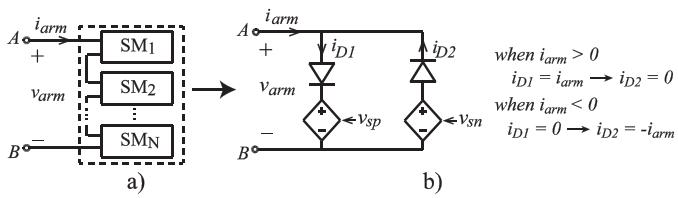  
Fig. 3. One MMC arm. (a) Cascaded SMs. (b) UAM.

voltage in the inserted mode is shown in Fig. 2(a). In this case, the upper-leg diode d1 in Fig. 1(b) conducts the positive arm current, whereas the upper-leg IGBT t1 in Fig. 1(b) conducts the negative arm current. Fig. 2(b) and (c) show the SM output voltages when the SM is in bypassed and blocked modes. The analysis is similar to Fig. 2(a) for the inserted mode and is not discussed in detail due to space limitation.

An MMC arm output voltage can be derived based on the summation of the SM output voltages as

$$
v _ {a r m} = \sum_ {i = 1} ^ {N} v _ {S M} ^ {i} \tag {1}
$$

where i indicates the SM index; N is the total number of SMs in an arm; $v _ { S M } ^ { i }$ is the SM output voltage. An MMC arm can be modeled by unified arm module (UAM) [19] consisting of a pair of anti-paralel diodes and two controlled voltage sources as shown in Fig. 3. The use of the anti-parallel diodes can automatically identify the arm current directions so that the arm output voltage $v _ { a r m }$ can be represented using the corresponding diode currents $i _ { D 1 }$ and $i _ { D 2 }$ . The arm voltage is modeled by one of the two controlled voltage sources $( v _ { s p } , v _ { s n } )$ based on the positive or negative arm current. The calculations of $v _ { s p }$ and $v _ { s n }$ are performed using the SM insertion indices, the SM capacitor voltages, and the arm current.

The differential equation of a SM capacitor can be discretized using a numerical integration method. In this paper, the explicit integration method (i.e., Forward Euler method) is applied. The SM capacitor voltage is calculated in the discrete time domain as

$$
v _ {c} ^ {i} (t + \Delta t) = v _ {c} ^ {i} (t) + \Delta t (i _ {D 1} (t) - i _ {D 2} (t)) \frac {s _ {i}}{C _ {S M} ^ {i}} \tag {2}
$$

where $s _ { i }$ is the switching index (i.e., 0 or 1) of the ith SM; $C _ { S M } ^ { i }$ is the SM capacitance; $v _ { c } ^ { i } ( t )$ is the SM capacitor historical voltage; $\Delta t$ is the simulation time step.

In converter de-blocking mode, based on Fig. 2(a) and (b), the voltage sources $v _ { s p }$ and $v _ { s n }$ can be calculated as

$$
\begin{array}{l} v _ {s p} = \sum_ {i = 1} ^ {N} \left(s _ {i} \left(v _ {c} ^ {i} (t + \Delta t)\right) + s _ {i} \left(V _ {D} + i _ {D 1} (t) R _ {D}\right) \right. \\ + \bar {s} _ {i} \left(V _ {T} + i _ {D 1} (t) R _ {T}\right)) \tag {3} \\ \end{array}
$$

$$
\begin{array}{l} v _ {s n} = \sum_ {i = 1} ^ {N} \left(s _ {i} \left(v _ {c} ^ {i} (t + \Delta t)\right) + s _ {i} (- V _ {T} - i _ {D 2} (t) R _ {T}) \right. \\ + \bar {s} _ {i} (- V _ {D} - i _ {D 2} (t) R _ {D})) \tag {4} \\ \end{array}
$$

where $\bar { s } _ { i }$ is the negation of the switching index $s _ { i }$

The instantaneous conduction losses due to the on-state resistances, $p _ { l o s s , r } .$ , and the saturation voltages, $p _ { l o s s , v } ,$ , of the IGBTs and the diodes can be calculated as

$$
p _ {\text {l o s s}, r} = \sum_ {i = 1} ^ {N} s _ {i} \left(i _ {D 1} ^ {2} R _ {D} + i _ {D 2} ^ {2} R _ {T}\right) + \bar {s} _ {i} \left(i _ {D 1} ^ {2} R _ {T} + i _ {D 2} ^ {2} R _ {D}\right) \tag {5}
$$

$$
p _ {\text {l o s s}, v} = \sum_ {i = 1} ^ {N} s _ {i} \left(i _ {D 1} V _ {D} + i _ {D 2} V _ {T}\right) + \bar {s} _ {i} \left(i _ {D 1} V _ {T} + i _ {D 2} V _ {D}\right) \tag {6}
$$

In converter blocking mode, all the IGBTs are blocked. The SM capacitors in the HBSMs are inserted through the freewheeling diodes when the arm current is positive as shown in Fig. 2(c). The SM capacitor voltage under blocking mode is calculated as

$$
v _ {c} ^ {i} (t + \Delta t) = v _ {c} ^ {i} (t) + \Delta t i _ {D 1} (t) \frac {1}{C _ {S M} ^ {i}} \tag {7}
$$

The voltage sources $v _ { s p }$ and $v _ { s n }$ are expressed as

$$
v _ {s p} = \sum_ {i = 1} ^ {N} \left(v _ {c} ^ {i} (t + \Delta t) + V _ {D} + i _ {D 1} (t) R _ {D}\right) \tag {8}
$$

$$
v _ {s n} = \sum_ {i = 1} ^ {N} \left(- V _ {D} - i _ {D 2} (t) R _ {D}\right) \tag {9}
$$

The UAM in Fig. 3 can be used to represent the MMCs with other SM types such as FB, CD SMs which leads to the generalized DEM. The derivation of the voltage sources $v _ { s p }$ and $v _ { s n }$ for the MMCs with other SM types is very similar to that of the HBSM-MMC and are not included in the paper.

# III. THE PROPOSED GSFB-AVM

The proposed GSFB-AVM represents the dynamic behaviors of the MMCs using arm equivalent capacitors. Assuming the SM capacitances in each arm are identical, the arm equivalent capacitance can be represented as

$$
C _ {a r m} ^ {e q} = \frac {1}{\sum_ {i = 1} ^ {N} \frac {1}{C _ {S M}}} = \frac {C _ {S M}}{N} \tag {10}
$$

where $C _ { S M }$ is the SM capatance.

The switching function or insertion index of a converter arm can be represented by the number of SMs inserted over the total number of SMs in the arm, i.e., N , as

$$
s _ {n} = \frac {1}{N} \sum_ {i = 1} ^ {N} s _ {i} \tag {11}
$$

The proposed GSFB-AVM is derived in this section based on the UAM circuit proposed in Fig. 3(b). It will be shown in the section that the proposed GSFB-AVM can represent the MMCs with different SM types.

# A. GSFB-AVM for HBSM-MMC

The proposed GSFB-AVM is derived for the HBSM-MMC in this subsection. Assuming the SM capacitor voltages are

balanced (or equal), the summation of the SM capacitor voltages in (2) can be expressed as

$$
v _ {c} ^ {a v g} (t + \Delta t) = v _ {c} ^ {a v g} (t) + \Delta t \left(i _ {D 1} (t) - i _ {D 2} (t)\right) \sum_ {i = 1} ^ {N} \left(\frac {s _ {i}}{C _ {S M}}\right) \tag {12}
$$

By substituting the arm equivalent capacitance and switching function index, i.e., (10) and (11), into (12), the average summation capacitor voltage can be expressed as

$$
v _ {c} ^ {a v g} (t + \Delta t) = v _ {c} ^ {a v g} (t) + \Delta t \left(i _ {D 1} (t) - i _ {D 2} (t)\right) \frac {s _ {n}}{C _ {\text {a r m}} ^ {e q}} \tag {13}
$$

The voltage sources in the UAM can also be derived as

$$
\begin{array}{l} v _ {s p} ^ {a v g} = s _ {n} \left(v _ {c} ^ {a v g} (t + \Delta t)\right) + N s _ {n} \left(V _ {D} + i _ {D 1} (t) R _ {D}\right) \\ + N \left(1 - s _ {n}\right) \left(V _ {T} + i _ {D 1} (t) R _ {T}\right) \tag {14} \\ \end{array}
$$

$$
\begin{array}{l} v _ {s n} ^ {a v g} = s _ {n} \left(v _ {c} ^ {a v g} (t + \Delta t)\right) + N s _ {n} (- V _ {T} - i _ {D 2} (t) R _ {T}) \\ + N \left(1 - s _ {n}\right) \left(- V _ {D} - i _ {D 2} (t) R _ {D}\right) \tag {15} \\ \end{array}
$$

It is noted that only a portion of $v _ { c } ^ { a v g }$ appears in the voltage sources (14) and (15) based on the arm insertion index $s _ { n }$ . The instantaneous conduction losses can be derived as

$$
\begin{array}{l} p _ {l o s s, r} ^ {A V M} = N s _ {n} \left(i _ {D 1} ^ {2} R _ {D} + i _ {D 2} ^ {2} R _ {T}\right) \\ + N \left(1 - s _ {n}\right) \left(i _ {D 1} ^ {2} R _ {T} + i _ {D 2} ^ {2} R _ {D}\right) \tag {16} \\ \end{array}
$$

$$
\begin{array}{l} p _ {l o s s, v} ^ {A V M} = N s _ {n} \left(i _ {D 1} V _ {D} + i _ {D 2} V _ {T}\right) \\ + N \left(1 - s _ {n}\right) \left(i _ {D 1} V _ {T} + i _ {D 2} V _ {D}\right) \tag {17} \\ \end{array}
$$

In converter blocking mode, the switching function $s _ { n }$ is not applicable for (13)−(15). In this case, the dynamics of the arm equivalent capacitors depend on the SM topologies. The SMs with the same topologies will have identical capacitor dynamic behavior. Applying (10) and (11) to (7)−(9), the voltage sources can be derived as

$$
\begin{array}{l} v _ {c} ^ {a v g} (t + \Delta t) = v _ {c} ^ {a v g} (t) + \Delta t i _ {D 1} (t) \frac {1}{C _ {a r m} ^ {e q}} (18) \\ v _ {s p} ^ {\mathrm {a v g}} = v _ {c} ^ {\mathrm {a v g}} (t + \Delta t) + N \left(V _ {D} + i _ {D 1} (t) R _ {D}\right) (19) \\ v _ {s n} ^ {\text {a v g}} = N \left(- V _ {D} - i _ {D 2} (t) R _ {D}\right) (20) \\ \end{array}
$$

It is noted in (18) that the arm equivalent capacitor of the HBSMs will be charged by the positive arm current and bypassed by the negative arm current.

# B. GSFB-AVM for MMCs With Different SMs

In this subsection, the GSFB-AVM for the MMCs with different SMs is derived under de-blocking and blocking modes. In de-blocking mode, the FBSM- and CDSM-MMCs typically operate like the HBSM-MMC [6]. In blocking mode, the operations of the FBSM- and CDSM-MMCs are different from the HBSM-MMC due to the diode positions of the FB and CD SMs. When the arm current is positive, the capacitors of the FB and CD SMs are inserted like the HBSM. When the arm current is

TABLE I SEMICONDUCTOR VOLTAGE DROPS IN GSFB-AVM   

<table><tr><td></td><td>HBSM-MMC</td><td>FBSM-MMC</td><td>CDSM-MMC</td></tr><tr><td>v1</td><td>VD+iD1RD</td><td>2(VD+iD1RD)</td><td>1/2(3VD+3iD1RD)</td></tr><tr><td>v2</td><td>VT+iD1RT</td><td>VT+VD+iD1(RT+RD)</td><td>1/2(2VT+VD+iD1(2RT+RD))</td></tr><tr><td>v3</td><td>-(VT+iD2RT)</td><td>-2(VT+iD2RT)</td><td>-1/2(3VT+3iD2RT)</td></tr><tr><td>v4</td><td>-(VD+iD2RD)</td><td>-(VT+VD+iD2RT+RD)</td><td>-1/2(VT+2VD+iD2RT+RD)</td></tr><tr><td>v5</td><td>VD+iD1RD</td><td>2(VD+iD1RD)</td><td>3/2(VD+iD1RD)</td></tr><tr><td>v6</td><td>-(VD+iD2RD)</td><td>-2(VD+iD2RD)</td><td>-3/2(VD+iD2RD)</td></tr></table>

negative, the capacitors of FB and CD SMs are inserted in the opposite position in an arm. In addition, the two capacitors in a CDSM are charged by half of the arm current since the two capacitors are connected in parallel.

The average summation capacitor voltages (13) and (18) can be generalized for the MMCs with different SMs as

$$
\begin{array}{l} v _ {c} ^ {a v g} (t + \Delta t) = v _ {c} ^ {a v g} (t) \\ + \left(\bar {b} s _ {n} + b\right) \left(i _ {D 1} (t) - m i _ {D 2} (t)\right) \frac {\Delta t}{C _ {a r m} ^ {e q}} \tag {21} \\ \end{array}
$$

where the converter operation index b and the SM index m depend on blocking/de-blocking mode and SM types as

$$
\left\{ \begin{array}{l} b = 0, \bar {b} = 1 \text {f o r d e b l o c k i n g m o d e} \\ b = 1, \bar {b} = 0 \text {f o r b l o c k i n g m o d e} \end{array} \right. \tag {22}
$$

$$
\left\{ \begin{array}{l} m = 1 \text {a n y S M s , i n d e b l o c k i n g m o d e} \\ m = 0 \quad H B S M \\ m = - 1 \quad F B S M \\ m = - 1 / 2 C D S M \end{array} \right\} \text {i n b l o c k i n g m o d e} \tag {23}
$$

The converter arm equivalent output voltages for positive and negative arm currents are given as

$$
v _ {s p} ^ {a v g} = (\bar {b} s _ {n} + b) v _ {c} ^ {a v g} + v _ {s p, l o s s} \tag {24}
$$

$$
v _ {s n} ^ {\text {a v g}} = \left(\bar {b} s _ {n} + b m\right) v _ {c} ^ {\text {a v g}} + v _ {s n, \text {l o s s}} \tag {25}
$$

where the conduction-loss-related voltage drops in the positive and negative current paths are expressed as

$$
v _ {s p, l o s s} = \bar {b} \left(N s _ {n} v _ {1} + N \left(1 - s _ {n}\right) v _ {2}\right) + b N v _ {5} \tag {26}
$$

$$
v _ {s n, l o s s} = \bar {b} \left(N s _ {n} v _ {3} + N \left(1 - s _ {n}\right) v _ {4}\right) + b N v _ {6} \tag {27}
$$

In (26) and (27), the semiconductor on-state voltage drops, v1, v2, v3, v4, v5, and $v _ { 6 }$ are summarized in Table I for different SM types. It is noted that, for the MBSM-MMC, the equivalent capacitor voltage in (21) have two separate equations based on the numbers of HB and FB SMs $( N _ { H B }$ and $N _ { F B } )$ in an arm to accurately account for the different capacitor dynamics in HB and FB SMs.

# IV. SEMICONDUCTOR LOSS MODEL FOR GSFB-AVM

This section describes the modeling of semiconductor loss in the DEM and the proposed GSFB-AVM. The semiconductor loss is composed of the conduction loss and switching loss. The conduction loss depends on the semiconductor V-I on-state characteristic and the instantaneous current flowing through the semiconductor. A device datasheet normally specifies the on-state characteristic curves at room temperature (25°) and the worst case (125°). Depending on a manufacturer’s converter design guideline, the interpolated on-state characteristic between $2 5 ^ { \circ }$ and $1 2 5 ^ { \circ }$ can be used for conduction loss calculation. The nonlinear on-state characteristics are usually represented by piece-wise linear characteristic to simplify the loss calculation. In this paper, the slope resistance $( R _ { T } \ \mathrm { o r } \ R _ { D } )$ , the saturation voltage $( V _ { T } \ \mathrm { o r } \ V _ { D } )$ , as well as the simulated instantaneous converter arm currents by the DEM and the proposed AVM are used for the conduction loss calculation [31], [32].

Switching transitions of the IGBTs and diodes result in switching losses. There are mainly two types of switching loss calculation methods available in the literature, i.e., detailed simulation-based methods [33]–[35] and analytical loss calculation methods [36]–[39]. In the detailed simulation-based methods, the EMT-type simulation tools are used to generate the instantaneous semiconductor currents and voltages before and after switching transients. These voltage and currents are then used to calculate the switching energies per pulse [32]. The exact switching-loss calculation requires the count of the switching transitions and the values of switching energy per switching event. The IGBT turn-on, turn-off energies $( E _ { o n } , E _ { o f f } )$ and the diode reverse recovery energy $\left( E _ { r e c } \right)$ can be obtained from a semiconductor datasheet. In the manuscript, the DEM calculates the switching losses based on the detailed SM switching currents, the SM DC-link voltages, and the individual SM switching events. The analytical switching loss calculation methods are reported in [36]–[39] for the MMCs. The analytical loss calculation method of the MMC was originally proposed in [36]. In the analytical loss calculation method, the instantaneous switching currents and voltages are not required which simplifies the switching loss calculation. Since, the GSFB-AVM does not represent individual SMs, meaning the exact switching counts are not available in the GSFB-AVM. Therefore, the analytical switching loss calculation method [36] is used for the proposed GSFB-AVM. Assuming the switching events are uniformly distributed over each fundamental frequency cycle, the switching loss for the GSFB-AVM is estimated as [36]

$$
P _ {\text {l o s s}, \text {s w}} = 6 N \frac {f _ {\text {S M}} \left(E _ {\text {o n}} + E _ {\text {o f f}} + E _ {\text {r e c}}\right) V _ {\text {c , r a t e d}}}{V _ {\text {r e f}} I _ {\text {r e f}}} \left| \bar {I} _ {\text {a r m}} \right| \tag {28}
$$

where the $V _ { r e f }$ and $I _ { r e f }$ are the reference voltage and current for the switching energy; $f _ { S M }$ is the estimated switching frequency for each SM; $V _ { c , r a t e d }$ is the rated value of SM capacitor voltage; and $| \bar { I } _ { a r m } |$ is the average of the absolute value of an arm current. It is noted that the number of SMs $N = V _ { d c } / V _ { c , r a t e d }$ . The switching loss can be expressed in (29) using the DC-side current

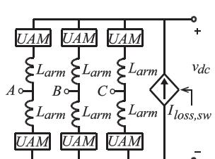  
a）)

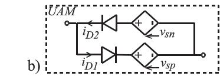

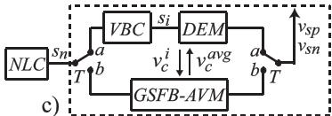  
Fig. 4. CM circuit configuration. (a) Arm equivalent circuit. (b) UAM. (c) Combined DEM and GSFB-AVM block.

source shown in Fig. 4(a).

$$
I _ {\text {l o s s}, \text {s w}} = 6 \frac {f _ {P} \left(E _ {\text {o n}} + E _ {\text {o f f}} + E _ {\text {r e c}}\right)}{V _ {\text {r e f}} I _ {\text {r e f}}} | \bar {I} _ {\text {a r m}} | \tag {29}
$$

# V. COMBINING DEM AND GSFB-AVM

In the DEM, the insertion status of a SM is determined by its switching function generated from the VBC, which sorts the SM capacitor voltages in an arm and issues SM switching signals to balance the SM capacitor voltages. In the GSFB-AVM, the SM capacitor voltages are assumed balanced (or equal) which enables the use of the arm equivalent capacitors to speed up dynamic simulation. Although the GSFB-AVM can accurately simulate the dynamic behaviors of an MMC, it does not model the individual SM capacitor voltage ripples.

It is noted from Sections II and III that the DEM and the GSFB-AVM utilize the same arm equivalent circuit, i.e., UAM, in Fig. 3(b), but different calculation methods for the controlled voltage sources $v _ { s p }$ and $v _ { s n }$ . Therefore, a CM of the DEM and the GSFB-AVM is proposed and is shown in Fig. 4. In the CM, each MMC arm is represented by the UAM with its controlled voltage source calculated from either the DEM or the GSFB-AVM calculation block.

In the proposed CM framework, the DEM and the GSFB-AVM can be conveniently switched between one another during the dynamic simulation. The model switching is established by the CM calculation block in Fig. 4(c). When the switch T is triggered to a, the calculation block is performed by the DEM. When the switch T is triggered to b, the calculation block is carried out by the GSFB-AVM. The data transfer between the two models is achieved by updating the historical voltages of the SM capacitors as

$$
\text {G S F B} - \text {A V M} \rightarrow \text {D E M}: v _ {c} ^ {i} (t) = \frac {v _ {c} ^ {\text {a v g}} (t)}{N} \tag {30}
$$

$$
\mathrm {D E M} \rightarrow \mathrm {G S F B} - \mathrm {A V M}: v _ {c} ^ {\text {a v g}} (t) = \sum_ {i = 1} ^ {N} v _ {c} ^ {i} (t) \tag {31}
$$

where $v _ { c } ^ { i }$ is the ith SM capacitor voltage at the time instant t and $v _ { c } ^ { a v g }$ is the summation of the SM capacitor voltages in an arm. The calculations of $v _ { c } ^ { i }$ and $v _ { c } ^ { a v g }$ are given in (2) and (21) from Sections II and III, respectively.

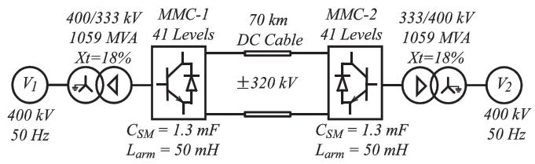  
Fig. 5. Two-terminal MMC HVDC system [21].

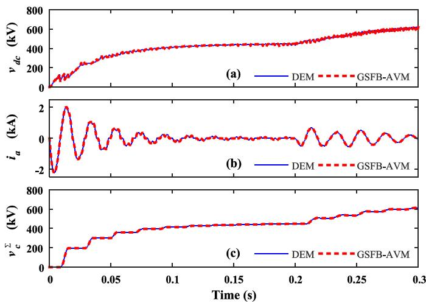  
Fig. 6. HBSM-MMC energizing. (a) DC voltages. (b) Phase-A currents. (c) Phase-A upper-arm sum of the SM capacitor voltages.

It is noted that the VBC and the individual SM capacitor voltage calculations can be avoided when the CM is in the GSFB-AVM mode. It greatly improves the MMC simulation efficiency. When the individual SM capacitor voltage ripples and the VBC are the focus of simulation studies, the DEM mode can be activated in the CM which offers high modeling accuracy and flexibility.

# VI. SIMULATION STUDIES

The proposed GSFB-AVM and the DEM are implemented in Matlab/Simulink 2014b and RT-LAB 11.3.6 for a two-terminal 41-level monopole MMC HVDC system [21] as shown in Fig. 5. The system parameters are indicated in Fig. 5, and the controller parameters are listed in the Appendix. A 100 Ω charging resistor is used at the secondary side of each transformer to limit any inrush current. The simulation time step for the GSFB-AVM and the DEM is $2 0 \mu \mathrm { s }$ . The standard MMC controllers, including inner-loop current and outer-loop power controllers, and CCSC are implemented in the GSFB-AVM and the DEM. The VBC controller maintaining the voltage balancing of the SM capacitors is implemented for the DEM.

# A. Simulation Results of GSFB-AVM for HBSM-MMC

This subsection validates the accuracy of the proposed GSFB-AVM for the HBSM-MMC systems (MMC-1 and MMC-2 in Fig. 5). Due to space limitation, only the transient responses of MMC-1 are included in Fig. 6.

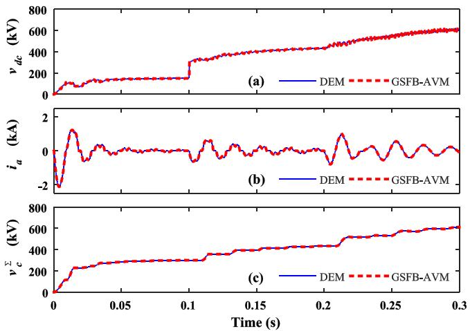  
Fig. 7. CDSM-MMC energizing. (a) DC voltages. (b) Phase-A currents. (c) Phase-A upper-arm sum of the SM capacitor voltages.

Initially, all IGBT gates are blocked, and the converters are energized from the AC grid. The capacitors in the HBSMs are charged by the positive arm currents and are bypassed by the negative arm currents. The DC-side voltage $v _ { d c }$ gradually rises to the AC line-to-line voltage level. At 0.2 s, the converters are de-blocked to regulate $v _ { d c }$ to the rated value. Then, the charging resistor is bypassed. It is observed from Fig. 6 that the results obtained by the proposed GSFB-AVM match well with those of the DEM. It is noted that the Phase-A current $i _ { a }$ in Fig. 6(b) is defined in Fig. 1(a) as the AC terminal current $i _ { j }$ where $j = a , b , c$ .

# B. Simulation Results of GSFB-AVM for CDSM-MMC

In this subsection, the proposed GSFB-AVM is used to simulate the CDSM-MMC systems (MMC-1 and MMC-2 in Fig. 5). The verification is performed for the converter operations under blocking and de-blocking modes in three cases: converter energizing, power transfer, and DC-side pole-to-pole fault.

1) Converter Energizing: The converter energizing transients of the CDSM-MMC simulated by the GSFB-AVM and the DEM are shown in Fig. 7. The energizing procedure is similar to that of the HBSM-MMC, except that the capacitors in the CDSMs are initially charged in parallel or series connection depending on the arm current directions. At 0.1 s, the IGBT switch $t 5$ in the CDSM in Fig. 1(d) is turned on so that all CDSMs are charged in a similar behavior as the HBSMs, where the SM capacitors are inserted by the positive arm currents. All gate pulses are enabled and the converters are de-blocked at 0.2 s. Fig. 7 shows that the proposed GSFB-AVM can accurately represent the behavior of the CDSM-MMC compared to the DEM.   
2) Converter Power Transfer: In converter de-blocking mode, all CDSMs operate similarly to the HBSMs. The real power is regulated to 1 GW from 0.7 s as shown in Fig. 8(a). Hence, the DC current increases from zero to the rated value (Fig. 8(b)) which results in higher SM capacitor voltage ripples as shown in Fig. 8(c). It is noted in Fig. 8 that the proposed

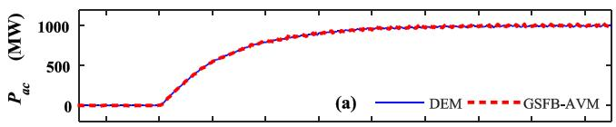

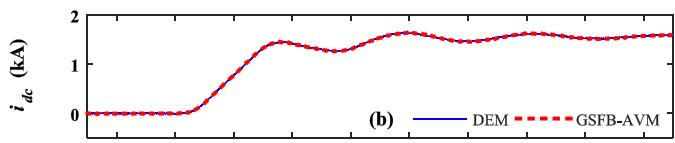

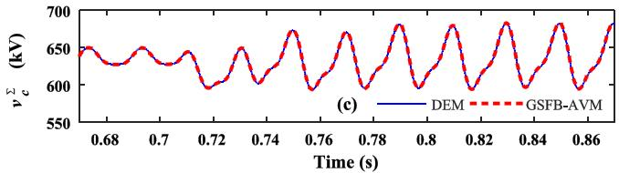  
Fig. 8. CDSM-MMC de-blocking. (a) Converter AC-side active powers. (b) DC currents. (c) Phase-A upper-arm sum of the SM capacitor voltages.

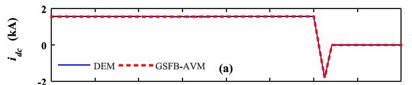

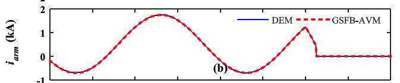

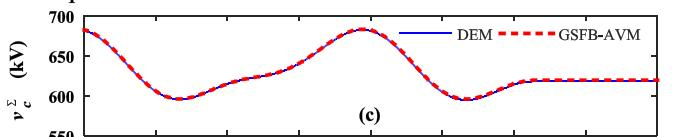

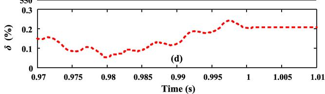  
Fig. 9. CDSM-MMC DC pole-to-pole fault. (a) DC currents. (b) Phase-A upper-arm currents. (c) Phase-A upper-arm sum of the SM capacitor voltages. (d) Relative error of upper-arm SM total capacitor voltage of the GSFB-AVM compared to the DEM.

GSFB-AVM can accurately represent the power transfer transient for the CDSM-MMC. The relative error of the sum of the SM capacitor voltages for the proposed GSFB-AVM is less than 0.4%, compared to the DEM.

3) DC-side Pole-to-pole Fault: Following the real power transfer, a DC pole-to-pole fault is applied in the middle of the DC cable at 1 s. An instant drop of the DC current at 1 s can be observed in Fig. 9(a). The IGBT gate pulses are blocked at 400 µs later to avoid the over current damage in the IGBTs. The CDSM-MMC offers DC pole-to-pole fault blocking ability compared to the HBSM-MMC. The SM capacitors of the CDSMs are inserted by the SM diodes and impose counter-reacting arm voltages to the AC voltages so that the AC fault currents are reduced to zero. As shown in Fig. 9(a) and (b), the DC and the arm currents are forced to zero within a short time period after the CDSM-MMC

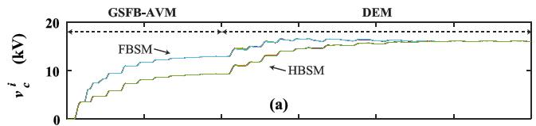

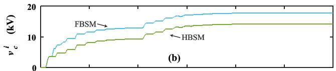

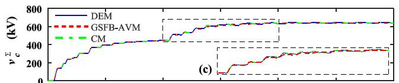

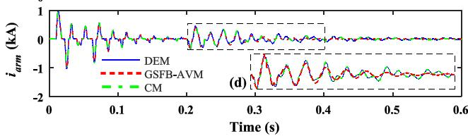  
Fig. 10. MBSM-MMC energizing, Phase-A upper arm. (a) SM capacitor voltages of the CM. (b) SM capacitor voltages for GSFB-AVM. (c) Sum of the SM capacitor voltages. (d) Arm currents.

is blocked. The sum of the SM capacitor voltages stay constant after the converter is blocked as shown in Fig. 9(c). It is observed from Fig. 9 that the proposed GSFB-AVM produces nearly identical responses compared to the DEM. Fig. 9(d) shows that the relative error of the upper-arm SM total capacitor voltage of the GSFB-AVM is less than 0.3% compared to the DEM.

# C. Simulation Results of Combined Model

The proposed CM of the GSFB-AVM and the DEM is evaluated using the same test system in Fig. 5. The MBSM-MMC is used in the case study, which includes 50% HBSMs and 50% FBSMs in each converter arm. The simulation results obtained by the CM is compared to those of the DEM and the GSFB-AVM to verify its modeling accuracy.

1) Converter Energizing: The energizing process of the MBSM-MMC is presented in Fig. 10. The converter is initially blocked. The AC-side breaker is closed at 0.01 s. The FBSMs are charged faster than the HBSMs by the AC grid in the blocking mode due to the bidirectional current charging capability of the FBSMs. The soft-charging method [27] is used to reduce the inrush currents of the MBSM-MMC before entering to the de-blocking mode. From 0.2 s, the converter is de-blocked. The sorting algorithm from the VBC regulates the capacitor voltages of the HBSMs and FBSMs to the same rated value.

The individual SM capacitor voltages produced by the CM are shown in Fig. 10(a). The CM is initially executed in the GSFB-AVM mode. Two equivalent capacitors are used in an arm to represent the HBSMs and FBSMs, respectively. At 0.2 s, the CM is switched to the DEM mode, when the VBC starts operating.

Fig. 10(b) shows the individual SM capacitor voltages, when the GSFB-AVM is used for the entire converter energizing

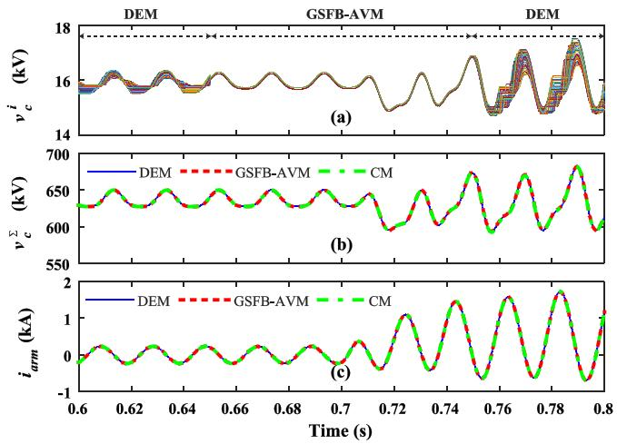  
Fig. 11. MBSM-MMC de-blocking, Phase-A upper arm. (a) SM capacitor voltages in CM. (b) Sum of the SM capacitor voltages. (c) Arm currents.

simulation. The proposed GSFB-AVM uses two separate arm equivalent capacitors to represent the HB and FB SMs, respectively, in each arm. Therefore, the SM capacitor voltages $v _ { c } ^ { i }$ in Fig. 10(b) diverge after the converter energizing transient dies out. However, the DEM predicts the correct response as shown in Fig. 10(a) since the SM capacitor VBC is implemented (as shown in Fig. 4) in the DEM to balance the individual SM capacitor voltages of the HB and FB SMs all together. The unbalanced HB and FB SM voltages in the proposed GSFB-AVM lead to slightly inaccurate simulation results for the proposed GSFB-AVM as shown in Figs. 10(c) and (d). It is also observed from Fig. 10(c) and (d) that the simulation results obtained by the CM is identical to those of the DEM. Therefore, the CM can be used to switch between the GSFB-AVM and DEM modes to achieve improved simulation efficiency.

2) Converter Power Transfer: The CM is also verified using power transfer study as shown in Fig. 11. The CM simulation is first executed in the DEM mode. At 0.65 s, the simulation is switched to the GSFB-AVM mode. At 0.7 s, the reference of the real power is set to 1 GW. The real power transfer results in an increase in the SM capacitor voltage ripples. At 0.75 s, the CM simulation is switched back to the DEM mode. The VBC of the DEM starts regulating the capacitor voltages. The comparisons of the simulation results are shown in Figs. 11(b) and (c). Both the GSFB-AVM and the CM have demonstrated a good accuracy with less than 0.4% difference when comparing to DEM. For the CM operating in the DEM mode, the influence of the VBC on the capacitor voltages of the individual SMs can be investigated.   
3) DC-side Pole-to-pole Fault Ride-through: The MBSM-MMC has the advantage of the DC-side pole-to-pole fault blocking compared to the HBSM-MMC. The DC-side fault ride-through behavior of the MBSM-MMC is simulated by the DEM, the proposed GSFB-AVM, and the proposed CM as shown in Fig. 12. MMC-1 is originally operated in rectifier mode with the power reference of 1 GW. At 1 s, a pole-to-pole fault is applied in the middle of the DC cable. Therefore, the DC current and AC power experienced an instant drop in Fig. 12. After the fault current is detected, the converters are blocked at 1.0004 s. The FBSM capacitor voltages keep increasing until

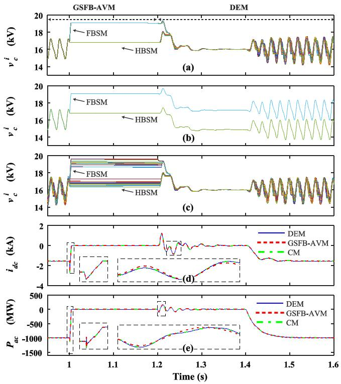  
Fig. 12. MBSM-MMC DC fault ride-through, Phase-A upper arm. (a) SM capacitor voltages in CM. (b) SM capacitor voltages in GSFB-AVM. (c) SM capacitor voltages in DEM. (d) DC currents. (e) Converter active powers.

the fault current is suppressed. Meanwhile, the HBSM capacitors are naturally bypassed by the fault current. It is assumed that the DC fault is cleared at 1.1 s and the converters are de-blocked at 1.2 s. The DC voltage is then regulated to the pre-fault rated value by the converter DC voltage control. The real power transfer is restored to the pre-fault value from 1.4 s.

Fig. 12(a) shows the individual capacitor voltages produced by the CM. The CM was originally in GSFB-AVM mode until 1.2 s, when it was switched into DEM mode. The VBC in the DEM can balance the capacitor voltages of the HB and FB SMs as shown in Fig. 12(a). Figs. 12(b) and (c) show the individual capacitor voltages produced by the GSFB-AVM and the DEM. It is observed from Figs. 12(a)−(c) that, when the DC pole-to-pole fault is suppressed by the FBSMs of the MBSM-MMC, the capacitor voltages of the FBSMs and HBSMs will be notably different due to the different blocking behaviors of the FB and HB SMs. When the GSFB-AVM is used, the capacitor voltages of the FBSMs and HBSMs diverge during the post-fault recovery, as shown in Fig. 12(b). If the capacitor voltages of the FBSMs and HBSMs simulated by the GSFB-AVM are not treated properly at post-fault, the capacitor voltage may have the risk of further divergence upon another DC fault. On the contrary, the DEM provides the accurate simulation results of the capacitor voltages of the FBSMs and HBSMs during the post-fault recovery. Although, one can manually average the equivalent SM capacitor voltages of the FBSMs and HBSMs during post-fault steady state in Fig. 12(b), the timing of the averaging action is yet unknown and the transients of the FBSM and HBSM capacitor voltage balancing at post-fault will be missing. Therefore, the DEM can be used to obtain the correct

TABLE II SEMICONDUCTOR DATA [40]   

<table><tr><td colspan="2">Conduction Loss
Semiconductor Parameter</td><td colspan="2">Switching Loss
Semiconductor Parameter</td></tr><tr><td>RT,IGBT</td><td>1.21 mΩ</td><td>Eon,IGBT</td><td>11 J</td></tr><tr><td>RD,diode</td><td>1.07 mΩ</td><td>Eoff,IGBT</td><td>10.5 J</td></tr><tr><td>VT,IGBT</td><td>1.82 V</td><td>Erec,diode</td><td>2.8 J</td></tr><tr><td>VD,diode</td><td>2.27 V</td><td>Vref</td><td>2.8kV</td></tr><tr><td></td><td></td><td>Iref</td><td>1.8kA</td></tr></table>

TABLE III SEMICONDUCTOR LOSSES OF MMCS WITH DIFFERENT SMS   

<table><tr><td>Converter Type</td><td colspan="3">GSFB-AVM</td><td colspan="3">DEM</td></tr><tr><td>MMC Type</td><td>HBSM</td><td>FBSM</td><td>CDSM</td><td>HBSM</td><td>FBSM</td><td>CDSM</td></tr><tr><td>\( P_{loss,r} \) (MW)</td><td>1.76</td><td>3.40</td><td>2.59</td><td>1.76</td><td>3.41</td><td>2.60</td></tr><tr><td>\( P_{loss,v} \) (MW)</td><td>2.30</td><td>4.99</td><td>3.63</td><td>2.29</td><td>4.98</td><td>3.63</td></tr><tr><td>\( P_{loss,sw} \) (MW)</td><td>2.45</td><td>2.45</td><td>2.45</td><td>2.47</td><td>2.47</td><td>2.47</td></tr><tr><td>\( P_{loss,tot} \) (MW)</td><td>6.51</td><td>10.84</td><td>8.67</td><td>6.52</td><td>10.86</td><td>8.70</td></tr></table>

SM capacitor voltages of the MBSM-MMC at the post-fault steady state. The DEM can be switched to the GSFB-AVM after the capacitor voltages are balanced to achieve improved simulation efficiency for off-line simulation.

# D. Semiconductor Loss Modeling Results

This subsection presents the converter semiconductor loss modeling results. One converter terminal from the test system in Fig. 5 is operated under inverter mode with unity power factor. The converter semiconductor data are listed in Table II. Since the SM capacitor voltage in the case study is 16 kV, the semiconductor data is rescaled by 16 $\mathrm { k V } / V _ { r e f }$ to match the SM voltage in the test system. The losses for the MMCs with different SMs are shown in Table III.

The conduction losses $P _ { l o s s , r }$ and $P _ { l o s s , v }$ for both the DEM and the GSFB-AVM are derived based on the average of the instantaneous power losses presented in Sections II and III. The FBSM- and CDSM-MMCs have shown higher conduction losses compared to the HBSM-MMC. The higher conduction loss is due to the increased numbers of semiconductors used in the FBSMs and the CDSMs. The conduction loss results have shown excellent agreement between the DEM and the GSFB-AVM. Small loss value difference is observed due to the minor difference of the arm currents in the DEM and the GSFB-AVM.

The switching loss, $P _ { l o s s , s w } $ , for the DEM is calculated based on the average of the total instantaneous switching losses of all the SMs. The $P _ { l o s s , s w }$ for the GSFB-AVM is derived based on the analytical approach as shown in (28). The average of the absolute-value arm current in each cycle is measured from the simulation as $| \bar { I } _ { u a } | = 8 8 3 \mathrm { ~ A ~ }$ . The average SM switching frequency for the GSFB-AVM is assumed to be $f _ { P } = 1 5 0 \mathrm { H z } ,$ which is consistent with the average SM switching frequency of the DEM. The results in Table III have demonstrated the proposed loss modeling method can accurately represent the semiconductor losses for the MMCs with different SM types.

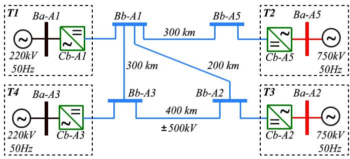  
Fig. 13. Four-terminal MMC HVDC system [41], [42].

TABLE IV CPU EXECUTION TIMES OF TWO-TERMINAL MONOPOLE SYSTEM   

<table><tr><td>Case</td><td colspan="3">Case 1
240 SMs per station</td><td colspan="3">Case 2
240 SMs per station</td></tr><tr><td>CPU
Model</td><td>CPU 1
T1
DEM</td><td>CPU 2
T2
DEM</td><td>CPU 3
T1-T2
CNTLR</td><td>CPU 1
T1
AVM</td><td>CPU 2
T2
AVM</td><td>CPU 3
T1-T2
CNTLR</td></tr><tr><td>CPU
Time</td><td>25.05μs</td><td>24.45μs</td><td>29.12μs</td><td>5.27μs</td><td>5.30μs</td><td>3.97μs</td></tr><tr><td>CPU
Usage</td><td>71.58%</td><td>69.87%</td><td>83.19%</td><td>15.06%</td><td>15.15%</td><td>11.34%</td></tr></table>

# E. Real-Time Simulation Study

In this subsection, both the DEM and the proposed GSFB-AVM are implemented in OPAL-RT OP5700 real-time simulator using RT-LAB version 11.3.6 to verify their computational performances in the real-time simulation environment. The twoterminal monopole system, shown in Fig. 5, and a four-terminal bipolar system from CIGRE working group B4-72, shown in Fig. 13, are used to demonstrate the improved computational performance of the proposed GSFB-AVM over the DEM. The system and control parameters of the four-terminal bipolar system can be found in [41] and [42]. The test systems are divided into individual converter terminals and their controllers, and are dispatched to different CPU cores to achieve parallel processing in real time. Four case studies are performed using the time step of 35 µs. Real-time simulation is achieved if CPU execution time is within the specified simulation time step.

The CPU times measured in the two-terminal monopole system are presented in Table IV. The CPU time of each simulation configuration is the mean value of the CPU time for every simulation time step. Converters 1 and 2 are assigned to CPUs 1 and 2 while the controllers for both converters are assigned to CPU 3. In Table IV, $^ { 6 6 } \mathrm { T } ^ { 9 }$ represents a converter terminal; “CNTLR” represents the controllers of the converters. Two case studies are established based on the DEM and the GSFB-AVM, respectively. Both the DEM and the GSFB-AVM have achieved real-time simulation. But the GSFB-AVM has demonstrated a simulation speedup factor of 24.45µs = 4.6 compared to that of $\frac { 2 4 . 4 5 \mu s } { 5 . 3 \mu s } = 4 . 6$ 5.3µs the DEM. The use of the proposed GSFB-AVM also leads to a faster simulation speed for the controllers (29.12 µs in Case 1 vs. 3.97 µs in Case 2) due to the fact that the use of VBC control in the DEM requires significant computational resources while the GSFB-AVM avoids the VBC by assuming balanced SM capacitor voltages.

TABLE V CPU EXECUTION TIMES OF FOUR-TERMINAL BIPOLAR SYSTEM   

<table><tr><td>Case</td><td colspan="3">Case 3480 SMs per station</td><td colspan="3">Case 44800 SMs per station</td></tr><tr><td>CPU Model</td><td>CPU 1T1-T3AVM</td><td>CPU 2T4DEM</td><td>CPU 3T1-T4CNTLR</td><td>CPU 1T1-T3AVM</td><td>CPU 2T4AVM</td><td>CPU 3T1-T4CNTLR</td></tr><tr><td>CPU Time</td><td>32.23μs</td><td>51.59μs</td><td>39.63μs</td><td>32.20μs</td><td>9.45μs</td><td>10.85μs</td></tr><tr><td>CPU Usage</td><td>92.11%</td><td>100%</td><td>100%</td><td>92.34%</td><td>27.25%</td><td>31.80%</td></tr></table>

Table V demonstrates the CPU time and usage of the fourterminal bipolar system simulated using the GSFB-AVM and/or DEM. The converters of T1 to T3 are modeled using the GSFB-AVM and are assigned to CPU 1 in both cases. The converter in T4 is modeled using the DEM and the GSFB-AVM in Cases 3 and 4, respectively. The controllers are simulated in CPU 3 in both cases. It is observed from Table V that the CPU times in CPUs 2 and 3 of Case 3 is larger than the simulation time step of 35 µs which means a real-time simulation is not achieved. Compared to Case 1, the number of SMs in CPU 2 is doubled due to the use of bipolar system in Case 3 which increases simulation time in the DEM. However, the use of the GSFB-AVM achieves real-time simulation for the three converters T1-T3 simulated in CPU 1 of Case 3. The increase in CPU time of CPU 1 in Case 3, compared to that of Cases 2, is due to the increased number of the converters simulated in CPU 1 (three bipolar converters in Case 3 vs. 1 monopole converter in Case 1). In Case 4, the numbers of SMs per converter station in the converters T1 to T4 are increased from 480 to 4800 and all four converters are simulated using the GSFB-AVM. It is observed in Table V that the CPU times remain the same for CPU 1 in Cases 3 and 4. That is, the increase in SM numbers in the GSFB-AVM does not affect the CPU time since one converter arm can be represented by a lumped-parameter equivalent circuit in Fig. 4(b). It is also noted that the use of the GSFB-AVM for the converter T4 in CPU 2 of Case 4 has improved the simulation speed over 5 times (9.45 µs in Case 4 vs. 51.59 µs in Case 3) which is consistent with the results of the two terminal test system in Cases 1 and 2.

It is noted that the proposed CM is not implemented for the real-time simulation study. When the CM operates in DEM mode, the required CPU usage or computational resource of the CM will be determined by the DEM which represents the bottle neck of the CM for real-time simulation. Therefore, the CM is not intended to improve the real-time simulation performance of the MMCs. On the other hand, the CM would find its applications in the off-line simulations to achieve the fastest simulation speed with good numerical accuracy.

# F. Simulation Performance With CIGRE B4-57 Test System

This subsection verifies the accuracy and off-line simulation speed performance for the proposed GSFB-AVM using CIGRE B4-57 DC grid test system [43], [44]. The test system interconnects the onshore AC network with offshore wind turbines through a meshed DC grid that includes three DC systems (DCS). As shown in Fig. 14, DCS1 and DCS2 use symmetrical

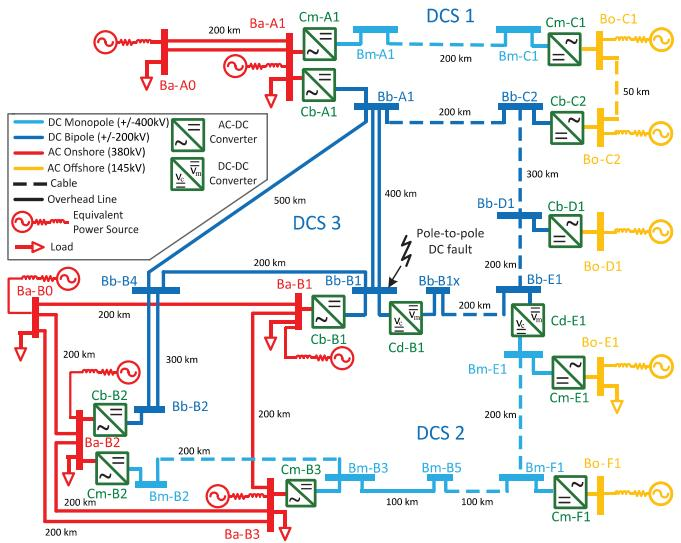  
Fig. 14. CIGRE B4-57 DC grid test system [43], [44].

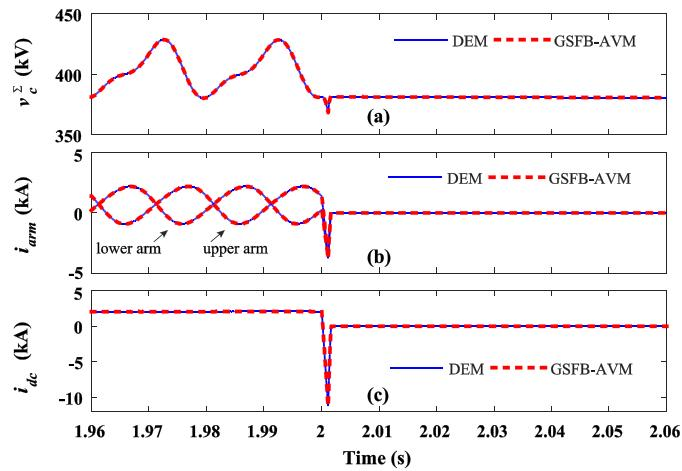  
Fig. 15. Converter Cb-B1 upper FBSM-MMC. (a) Phase-A upper-arm total SM capacitor voltages. (b) Phase-A arm currents. (c) DC currents.

monopole MMC converters. DCS3 consists of bipolar MMC converters. There are 16 individual MMCs (6 monopole MMC converters and 5 bipolar MMC converters) in the three DC systems considering one bipolar station has two MMCs. The converters in the test system operate in different control modes, including P/Vdc/droop control, Q/Vac, and island controls. The complete list of the control and system parameters can be found in [43]. Since this paper focuses on MMC modeling, the AC networks and the wind turbines are modeled using equivalent voltage sources. The VBC controller, similar to [21] and [43], is used in the DEM while the proposed GSFB-AVM doesn’t require the VBC control. The case study is developed using Matlab/Simulink 2014b and RT-LAB 11.3.6 and is based on the FBSM-MMC with 200 SMs per arm which provides DCside pole-to-pole fault blocking. Due to space limitation, the waveforms from a few selected converters are presented in this paper. Other converters have similar behaviors to the selected converters.

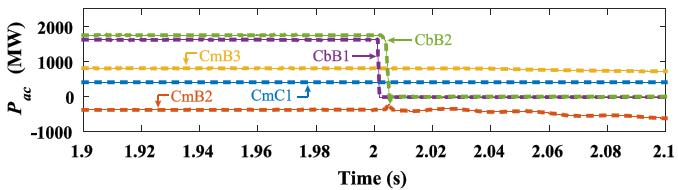  
Fig. 16. Converter active powers injected into AC grid. Results presented using the DEM (line) and the GSFB-AVM (dash).

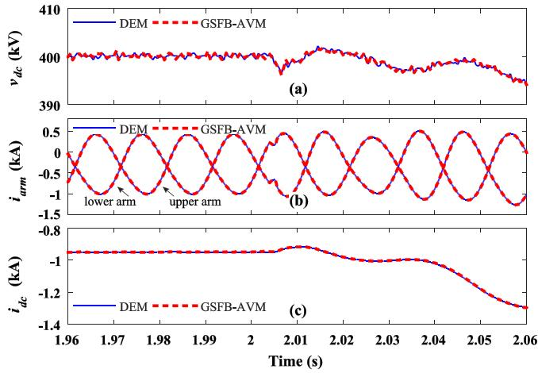  
Fig. 17. Converter Cm-B2 FBSM-MMC. (a) DC voltages. (b) Phase-A arm currents. (c) DC currents.

1) DC-side Pole-to-Pole Fault: As shown in Fig. 15, all converters initially operate in steady state. A DC pole-to-pole fault occurs at 2 s at the terminal Bb-B1, shown in Fig. 14. Fig. 15 shows the transient behavior of the converter Cb-B1, the closest converter to the fault location. When the DC fault occurs, the discharging of the SM capacitors cause the arm currents and the DC current drop dramatically. The overcurrent protection is activated to block the converter at 2.00115 s. The capacitors of the FBSMs are then inserted to provide counter-reacting voltage to eliminate the faulty current. The transient responses produced by the proposed GSFB-AVM demonstrate good agreement with those of the DEM.

The converter Cb-B2 and other converters in DCS3 are also blocked based on their overcurrent protection controls. The influence of the DC fault is reduced for the converters located further away from the fault. The active powers of the converters Cb-B1 and Cb-B2 drop to zero as shown in Fig. 16. The converter Cm-C1, located in DC1, is almost not impacted by the DC fault at Bb-B1 since it is not directly connected to the other DCSs. Unlike DCS1, the converters in DCS2 are affected but still remain in de-blocking mode after the DC fault occurs. The converters Cm-B2 and Cm-B3 are in PV droop control mode. As the DC voltage decreases in DCS2 due to the DC fault in Bb-B1, the converters Cm-B2 and Cm-B3 tend to gradually inject more active power into the DC grid, as presented in Fig. 16. Fig. 17 shows the transient behavior of the MMC Cm-B2, where the DC voltage drops and the arm and DC currents increase before the converter reaches to its overcurrent limit. Additional protection

TABLE VI EXECUTION TIMES OF THE PROPOSED GSFB-AVM VS. DEM   

<table><tr><td rowspan="3">Number of SMs per Arm</td><td colspan="6">Run Time (s)</td></tr><tr><td colspan="2">Cm-A1 (1 MMC)</td><td colspan="2">DCS 1 (2 MMCs)</td><td colspan="2">Full CIGRE B4-57 (16 MMCs)</td></tr><tr><td>GSFB-AVM</td><td>DEM</td><td>GSFB-AVM</td><td>DEM</td><td>GSFB-AVM</td><td>DEM</td></tr><tr><td>50</td><td>3.5</td><td>6.4</td><td>7.7</td><td>12.9</td><td>140.9</td><td>200.6</td></tr><tr><td>100</td><td>3.6</td><td>9.6</td><td>7.7</td><td>20.4</td><td>140.3</td><td>250.0</td></tr><tr><td>200</td><td>3.6</td><td>18.6</td><td>7.8</td><td>38.5</td><td>140.2</td><td>403.6</td></tr><tr><td>400</td><td>3.5</td><td>37.7</td><td>7.7</td><td>76.4</td><td>140.7</td><td>687.8</td></tr></table>

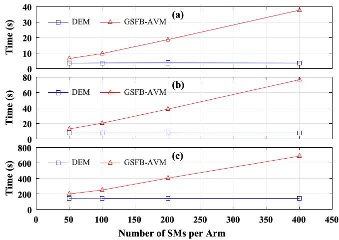  
Fig. 18. Simulation execution times for CIGRE B4-57 test system. (a) Cm-A1 (1 MMC). (b) DCS 1 (2 MMCs). (c) Full CIGRE B4-57 (16 MMCs).

actions are required to restore the normal operation of DCS2 [43], which is beyond the scope of the paper.

2) Speed Performance for 1-second Simulation: The off-line simulation speed performance of the DEM and the proposed GSFB-AVM is evaluated in this subsection. A 1- second simulation study of the CIGRE B4-57 DC grid test system is performed under 2.8 GHz Intel core i5-7440 HQ with 8 GB RAM under Microsoft Windows 10 operating system and the time step of 50 µs. Different numbers of MMCs and SMs per arm are used in the simulation studies to represent different complexities of the test systems. The simulation execution times using the proposed GSFB-AVM and the DEM are summarized in Table VI. The simulation execution times vs. the numbers of SMs per arm in Table VI are also plotted in Fig. 18 to demonstrate the modeling efficiencies of the proposed GSFB-AVM and the DEM.

It is shown in Table VI that the DEM requires longer simulation execution times as the numbers of SMs per arm increase. Fig. 18 indicates that the simulation times are approximately proportional to the numbers of SMs per arm, i.e., the complexity of the test systems. However, the proposed GSFB-AVM uses the same amount of execution time regardless of the number of SMs per arm due to the use of arm equivalent capacitors. It is also noted that the linear relationship of the simulation execution time vs. the number of SMs per arm is only approximate due to the simulation overheads caused by the other grid components such

as AC/DC transmission lines, cables, and DC-DC converters. The benefits using the proposed GSFB-AVM over the DEM will be even pronounced for larger and more complicated DC grid test system.

# VII. CONCLUSION

This paper proposed a new MMC modeling method, which combines the DEM with the GSFB-AVM for the accurate and efficient simulation of the MMC. The proposed model is based on a universal modeling structure, which enables smooth model switching between the DEM and the GSFB-AVM. The proposed model can accurately represent the MMCs with different types of SMs and the corresponding converter conduction and switching losses. A two-terminal MMC HVDC system is used to verify the proposed models for various transient operations including converter energization, real power control, and DC pole-topole fault. The proposed GSFB-AVM is also implemented in a commercial real-time simulator to evaluate its improvement in simulation efficiency over the DEM. Four- and eleven-terminal DC grid studies have shown that the CPU time of the proposed GSFB-AVM is not affected by the numbers of SMs in a converter arm which is desirable for large-scale multi-terminal DC grid studies.

# APPENDIX

Controller parameters for two-terminal 41-level monopole MMC HVDC system (same for the two MMCs): The controllers are divide into the outer control loop, the inner current control loop, and the CCSC loop. The outer control loop for PQ controlled converter generates the current reference signals as $\begin{array} { r } { i _ { d r e f } = \frac { 2 } { 3 \hat { V } _ { s } } P _ { r e f } } \end{array}$ 23Vˆs Pref and iqref = 3Vs $\begin{array} { r } { i _ { q r e f } = - \frac { 2 } { 3 \hat { V } _ { s } } Q _ { r e f } } \end{array}$ . The transfer functions of the inner loop current controller is 104 + 7200/s, and the CCSC is $4 1 6 + 5 . 7 6 \times 1 0 ^ { 4 } / \mathrm { s }$ . It is noticed that the DC voltage controlled converter employs transfer function 10000 + 6000/s to regulate the DC-side voltage.

# REFERENCES

[1] A. Lesnicar and R. Marquardt, “An innovative modular multilevel converter topology suitable for a wide power range,” in Proc. IEEE PowerTech Conf., 2003, pp. 6 pp, vol. 3.   
[2] N. Flourentzou, V. G. Agelidis, and G. D. Demetriades, “VSC-based HVDC power transmission systems: An overview,” IEEE Trans. Power Electron., vol. 24, no. 3, pp. 592–602, 2009.   
[3] G. P. Adam, S. J. Finney, K. H. Ahmed, and B. W. Williams, “Modular multilevel converter modeling for power system studies,” in Proc. Power Eng., Energy Elect. Drives Conf., 2013, pp. 1538–1542.   
[4] F. Martinez-Rodrigo, D. Ramirez, A. Rey-Boue, S. De Pablo, and L. Herrero-de Lucas, “Modular multilevel converters: Control and applications,” Energies, vol. 10, no. 11, p. 1709, 2017.   
[5] J. Beerten, O. Gomis-Bellmunt, X. Guillaud, J. Rimez, A. Van Der Meer, and D. Van Hertem, “Modeling and control of HVDC grids: A key challenge for the future power system,” in Proc. Power Systems Comp. Conf., 2014, pp. 1–21.   
[6] A. Nami, J. Liang, F. Dijkhuizen, and G. D. Demetriades, “Modular multilevel converters for HVDC applications: Review on converter cells and functionalities,” IEEE Trans. Power Electron., vol. 30, no. 1, pp. 18–36, Jan. 2015.   
[7] S. Debnath, J. Qin, and B. Bahrani, “Operation, control, and applications of the modular multilevel converter: A review,” IEEE Trans. Power Electron., vol. 30, no. 1, pp. 37–53, Jan. 2015.

[8] M. Glinka and R. Marquardt, “A new AC/AC-multilevel converter family applied to a single-phase converter,” in Proc. Power Electron. Drive Syst. Conf., 2003, pp. 16–23.   
[9] G. P. Adam and B. W. Williams, “Half-and full-bridge modular multilevel converter models for simulations of full-scale HVDC links and multiterminal DC grids,” J. Emerg. Sel. Top. Power Electron., vol. 2, no. 4, pp. 1089–1108, 2014.   
[10] R. Marquardt, “Modular multilevel converter: An universal concept for HVDC-networks and extended DC-bus-applications,” in Proc. Int. Power Electron. Conf., 2010, pp. 502–507.   
[11] R. Marquardt, “Modular multilevel converter topologies with DCshort circuit current limitation,” in Proc. Power Electron. Conf., 2011, pp. 1425–1431.   
[12] R. Zeng, L. Xu, L. Yao, and B. W. Williams, “Design and operation of a hybrid modular multilevel converter,” IEEE Trans. Power Electron., vol. 30, no. 3, pp. 1137–1146, Mar. 2015.   
[13] G. P. Adam, K. H. Ahmed, and B. W. Williams, “Mixed cells modular multilevel converter,” in Proc. Int. Symp. Ind. Electron. Conf., pp. 1390–1395, 2014.   
[14] H. Dommel, “Digital computer solution of electromagnetic transients in single-and multiphase networks,” IEEE Trans. Power Appar. Syst., vol. PAS-88, no. 4, pp. 388–399, Apr. 1969.   
[15] U. N. Gnanarathna, A. M. Gole, and R. P. Jayasinghe, “Efficient modeling of modular multilevel HVDC converters (MMC) on electromagnetic transient simulation programs,” IEEE Trans. Power Del., vol. 26, no. 1, pp. 316–324, Jan. 2011.   
[16] P. Le-Huy, P. Giroux, and J. Soumagne, “Real-time simulation of modular multilevel converters for network integration studies,” in Proc. Power System Transients Conf., 2011, pp. 14–17.   
[17] F. B. Ajaei and R. Iravani, “Enhanced equivalent model of the modular multilevel converter,” IEEE Trans. Power Del., vol. 30, no. 2, pp. 666–673, Apr. 2015.   
[18] N. Ahmed et al., “Efficient modeling of an MMC-Based multiterminal DC system employing hybrid HVDC breakers,” IEEE Trans. Power Del., vol. 30, no. 4, pp. 1792–1801, Aug. 2015.   
[19] W. Li and J. Bélanger, “An equivalent circuit method for modelling and simulation of modular multilevel converters in real-time HIL test bench,” IEEE Trans. Power Del., vol. 31, no. 5, pp. 2401–2409, Oct. 2016.   
[20] J. Peralta, H. Saad, S. Dennetière, J. Mahseredjian, and S. Nguefeu, “Detailed and averaged models for a 401-level MMC–HVDC system,” IEEE Trans. Power Del., vol. 27, no. 3, pp. 1501–1508, Jul. 2012.   
[21] H. Saad et al., “Modular multilevel converter models for electromagnetic transients,” IEEE Trans. Power Del., vol. 29, no. 3, pp. 1481–1489, 2014.   
[22] J. Xu, A. M. Gole, and C. Zhao, “The use of averaged-value model of modular multilevel converter in DC grid,” IEEE Trans. Power Del., vol. 30, no. 2, pp. 519–528, Apr. 2015.   
[23] A. Beddard, C. Sheridan, M. Barnes, and T. Green, “Improved accuracy average value models of modular multilevel converters,” IEEE Trans. Power Del., vol. 31, no. 5, pp. 2260–2269, Oct. 2016.   
[24] N. Ahmed, L. Angquist, S. Norrga, A. Antonopoulos, L. Harnefors, and H. P. Nee, “A computationally efficient continuous model for the modular multilevel converter,” IEEE J. Emerg. Sel. Topics Power Electron., vol. 2, no. 4, pp. 1139–1148, Dec. 2014.   
[25] O. Venjakob, S. Kubera, P. A. Forsyth, and T. L. Maguire, “Setup and performance of the real-time simulator used for hardware-in-loop-tests of a VSC-based HVDC scheme for offshore applications,” in Proc. Power Systems Transients Conf., 2013, pp. 18–20.   
[26] R. Zeng, L. Xu, L. Yao, and D. J. Morrow, “Precharging and DC fault ride-through of hybrid MMC-Based HVDC systems,” IEEE Trans. Power Del., vol. 30, no. 3, pp. 1298–1306, Jun. 2015.   
[27] L. Zhang, J. Qin, X. Wu, S. Debnath, and M. Saeedifard, “A generalized precharging strategy for soft startup process of the modular multilevel converter-based HVDC systems,” IEEE Trans. Ind. Appl., vol. 53, no. 6, pp. 5645–5657, Nov.-Dec. 2017.   
[28] W. Li, L. A. Grégoire, and J. Bélanger, “A modular multilevel converter pulse generation and capacitor voltage balance method optimized for FPGA implementation,” IEEE Trans. Ind. Electron., vol. 62, no. 5, pp. 2859–2867, May 2015.   
[29] M. Saeedifard and R. Iravani, “Dynamic performance of a modular multilevel back-to-back HVDC system,” IEEE Trans. Power Del., vol. 25, no. 4, pp. 2903–2912, Oct. 2010.   
[30] E. Solas, G. Abad, J. A. Barrena, S. Aurtenetxea, A. Cárcar, and L. Zaj, “Modular multilevel converter with different submodule concepts – Part I: Capacitor voltage balancing method,” IEEE Trans. Ind. Electron., vol. 60, no. 10, pp. 4525–4535, Oct. 2013.

[31] S. Rohner, S. Bernet, M. Hiller, and R. Sommer, “Modulation, losses, and semiconductor requirements of modular multilevel converters,” IEEE Trans. Ind. Electron., vol. 57, no. 8, pp. 2633–2642, Aug. 2010.   
[32] ABB semiconductor application notes 5SYA 2053-04, “Applying IGBTs,” Sep. 2013.   
[33] X. Shi, S. Filizadeh, and D. A. Jacobson, “Loss evaluation for the hybrid cascaded MMC under different voltage-regulation methods,” IEEE Trans. Ener. Conv., vol. 33, no. 3, pp. 1487–1498, Sep. 2018.   
[34] A. D. Rajapakse, A. M. Gole, and R. P. Jayasinghe, “An improved representation of FACTS controller semiconductor losses in EMTP type programs using accurate loss-power injection into network solution,” IEEE Trans. Power Del., vol. 24, no. 1, pp. 381–389, Dec. 2008.   
[35] A. D. Rajapakse, A. M. Gole, and P. L.Wilson, “Electromagnetic transients simulation models for accurate representation of switching losses and thermal performance in power electronic systems,” IEEE Trans. Pow. Del., vol. 20, no. 1, pp. 319–327, Feb. 2005.   
[36] S. Allebrod, R. Hamerski, and R. Marquardt, “New transformerless, scalable modular multilevel converters for HVDC-transmission,” in Proc. the 39th IEEE Annu. Power Electron. Specialists Conf., Greece, Jun. 2008.   
[37] P. S. Jones and C. C. Davidson, “Calculation of power losses for MMC based VSC HVDC stations,” in Proc. 15th Eur. Conf. Power Electron. Appl., Lille, France, 2013, pp. 1–10.   
[38] J. Li, X. Zhao, Q. Song, H. Rao, S. Xu, and M. Chen, “Loss calculation method and loss characteristic analysis of MMC based VSC-HVDC system,” in Proc. IEEE Int. Symp. Ind. Electron., Taipei, Taiwan, 2013, pp. 1–6.   
[39] S. Rodrigues, A. Papadopoulos, E. Kontos, T. Todorcevic, and P. Bauer, “Steady-state loss model of half-bridge modular multilevel converters,” IEEE Trans. Ind. Appl., vol. 52, no. 3, pp. 2415–2425, May 2016.   
[40] IXYS, Westcode IGBT Type T1800GB45A datasheet, Nov. 2014.   
[41] C. Li, C. Zhao, J. Xu, Y. Ji, F. Zhang, and T. An, “A pole-to-pole shortcircuit fault current calculation method for DC grids,” IEEE Trans. Power Syst., vol. 32, no. 6, pp. 4943–4953, 2017.   
[42] T. An, C. Han, Y. Wu, and G. Tang, “HVDC grid test models for different application scenarios and load flow studies,” J. Mod. Power Syst. Clean Energy., vol. 5, no. 2, pp. 262–274, 2017.   
[43] T. K. Vrana, S. Dennetière, J. Jardini, Y. Yang, and H. Saad, “The CIGRE B4 DC grid test system,” Electra, vol. 270, pp. 1–12, 2013.   
[44] Z. Shen and V. Dinavahi, “Comprehensive electromagnetic transient simulation of AC/DC grid with multiple converter topologies and hybrid modeling schemes,” IEEE Power Energy Technol. Syst. J., vol. 4, no. 3, pp. 1–1, Sep. 2017.

Joel A. Pfannschmidt received the B.A.Sc degree in electrical engineering from the School of Engineering, University of British Columbia Okanagan, Kelowna, Canada, in 2019.

He is currently working toward the M.A.Sc degree in electrical engineering with the University of British Columbia Okanagan. His current research interests include HVdc, real-time simulation, and converter topologies.

  
distributed generation.

Liwei Wang (S’04–M’10) received the Ph.D. degree in electrical and computer engineering from the University of British Columbia, Vancouver, BC, Canada, in 2010. In August 2010, he joined the ABB Corporate Research Center, Västerås, Sweden, as a Scientist and then as a Senior Scientist. In July 2014, he joined the School of Engineering, the University of British Columbia, Kelowna, BC, Canada, as an Assistant Professor. His research interests include power system modeling and simulation, electrical machines and drives, utility power electronics applications and

Wei Li (M’06) received the B.Eng. degree from Zhejiang University, China, the M.Eng. degree from the National University of Singapore, and the Ph.D. degree from McGill University, Canada. He is a Senior Power System Simulation Specialist with Opal-RT Technologies, Montréal. His fields of interest are in power electronics, renewable energy, and distributed generation. His current research focuses mainly on real-time simulation and controls of modular multilevel converter HVdc systems and FACTS devices.

Xuekun Meng (S’15) received the B.Sc. degree in electrical engineering from the University of British Columbia, Kelowna, Canada, in 2015, and he is currently working toward the Ph.D. degree in electric power engineering. His current research interests include power system transient simulation, modeling, control, and real-time simulation of modular-multilevel-converter-based high-voltage direct current transmission system.

Jintao Han (S’17) received the B.Eng. degree in 2015 from the Xi’an University of Science and Technology, China, and the M.Eng. degree in 2017 from the University of Windsor, Canada. Currently, he is working toward the Ph.D. degree in electrical engineering with the School of Engineering, University of British Columbia Okanagan Campus, Canada. His research interests include modular multilevel converter, hybrid cascaded multilevel converter, and numerically efficient model development.

Fei Zhang (M’12) received the B.S. and M.S. degrees in electrical engineering from Tsinghua University, Beijing, China, in 2009 and 2012, respectively, and the Ph.D. degree in electrical engineering from McGill University, Montreal, Canada, in 2018. Since 2018, he has been a Specialist in modeling and electrical simulation with Opal-RT Technologies, Montreal, Canada. His research interests include modular multilevel converters, power electronic transformers, and predictive control.

Jean Bélanger (M’87) received the B.Sc. degree in electrical engineering from Laval University, Québec City, QC, Canada, in 1971 and the M.Sc. degree from the École Polytechnique de Montréal, QC, Canada.

Prior to co-founding Opal-RT in 1997, he worked at Hydro Quebec for 25 years, where he was one of the main Design Engineers of the 765-kV James Bay transmission system and the real-time simulator used to design this very large transmission system. In 1978, he led the commercialization of Hydro-Quebec’s simulation services around the world, designing and pro-

moting Hydro-Quebec’s electric network simulators. Since 1997, he has been the CEO and CTO of OPAL-RT Technologies developing real-time simulators for the power, automotive and aerospace industries as well as to perform R&D works in universities and R&D centers around the worlds. Over the course of his distinguished career, he has actively participated in, and served at numerous committees of ACE (Association Canadienne de l’Électricité), CIGRE (Conférence Internationale des Grands Réseaux Électriques) and IEEE.