# An enhanced K-means two-step clustering method for dynamic equivalent modeling of DFIG wind farms based on LVRT characteristics

Junhua Xu * , Jiyuan Shen , Xinyu You , Chunwei Wang , Bin Liu

School of Electrical Engineering, Guangxi University, located in Nanning, China

# A R T I C L E I N F O

Keywords:

DFIG wind farms

Dynamic equivalent modeling

LVRT characteristics

Two-step clustering

Enhanced k-means clustering

# A B S T R A C T

To enhance the accuracy of dynamic equivalent models for wind farms utilizing doubly-fed induction generators (DFIGs), an enhanced k-means two-step clustering method for dynamic equivalent modeling of DFIG wind farms based on low-voltage ride-through (LVRT) characteristics is proposed in this study. First, the entire turbine fleet is divided into two categories based on their active power output and LVRT response: those exhibiting clustering characteristics and those that do not. For the latter, an enhanced k-means algorithm is applied. This approach optimizes initial center selection through probabilistic selection, improves search efficiency by utilizing a (K-Dimensional Tree) KD tree (reducing data search time by approximately 75% compared to traditional k-means), and determines the ideal cluster count using the Davies-Bouldin Index (DBI). The method overcomes the limitations of existing algorithms that require manual specification of initial centers and cluster numbers. Simulation results demonstrate that the equivalent model accurately corresponds to the detailed model during faults. Notably, the simulation time is reduced by about 90% while maintaining high precision, providing an efficient and accurate modeling approach for power system stability analysis with high wind power penetration.

# 1. Introduction

The large-scale integration of renewable energy into the power grid poses severe challenges to system stability and reliability [1]. The intermittency and volatility of wind power further complicate the analysis of system dynamic behavior [2]. Against this backdrop, the DFIG has been widely adopted due to its excellent performance [3], and its dynamic response during LVRT is critical for system stability analysis.

Dynamic simulation of large wind farms is computationally intensive [4], necessitating dynamic equivalent modeling to balance accuracy and efficiency [5]. Equivalent modeling methods include single-machine and multi-machine approaches [6,7]. The former cannot reflect turbine-specific dynamics arising from geographical and equipment variations [8–10], making the latter the main research focus.

While energy system optimization has advanced in areas like distributed coordination [11], multi-stage techno-economic modeling [12], demand response privacy [13], bidding systems [14], robust optimization [15], risk management [16], stochastic frameworks [17], decentralized self-healing [18], and storage-response synergy [19,20], these efforts focus on system-level and market challenges, whereas the core task of accurately aggregating unit-level dynamic

responses–essential for wind farm equivalent modeling–remains a distinct, unresolved technical problem. Thus, while adjacent fields provide valuable context, they emphasize the need for domain-specific innovations.

As a mainstream equivalent modeling approach, clustering still faces challenges. Early methods reduced computational load [21], quantified turbine contributions [22], incorporated kinetic energy [23], or used fuzzy C-means for output characteristics [24]. Despite these advances, two key limitations remain: dependence on subjective parameters and neglect of LVRT analysis, reducing model reliability during faults.

To integrate LVRT characteristics, Crowbar-based binary models were developed [25,26], yet their oversimplified "switch" behavior reduced accuracy. Later three-step methods [27,28] offered improvements but still assumed uniform LVRT responses across turbines, overlooking output-dependent variations. Although [29] analyzed LVRT control strategies’ impact on output and compared results with extensive field data, the absence of quantitative clustering indices hindered effective clustering.

Thus, a clear gap remains for a clustering method that incorporates LVRT characteristics for equivalent modeling during faults. To address this gap, this paper proposes an improved LVRT-based k-means two-step

clustering method, with these key contributions: (1) a novel two-step framework pre-classifying units by active power and LVRT response; (2) an automated algorithm integrating K-Means++ initialization, KDtrees (75% faster search), and DBI for optimal cluster count; and (3) a high-fidelity model replicating detailed dynamics (>98% accuracy), reducing simulation time by 90%, and outperforming existing methods.

The paper is structured as follows: Section 2 analyzes DFIG LVRT response; Section 3 details clustering method; Section 4 presents case tests; Section 5 concludes and outlines future work.

# 2. LVRT response characteristics of DFIGs

# 2.1. DFIG topology and response characteristics

The typical topology of a DFIG is depicted in Fig. 1 [30]. The stator windings are directly connected to the electrical grid, while the rotor windings are linked via a back-to-back converter. The rotor-side converter (RSC) utilizes a vector control approach oriented to the stator flux, and the grid-side converter (GSC) uses a control strategy based on grid voltage orientation.

During operation, the GSC ensures the stability of the DC-link voltage, while the RSC manages the regulation of power output.

As shown in Fig. 2, the RSC uses a dual-loop control structure with outer power and inner rotor current loops. The outer power loop operates in two modes: steady-state control and fault ride-through control, which are selected based on the terminal voltage $U _ { s 1 }$ . When the LVRT detection signal (LF) triggers $( L F = 1 )$ , the control system switches from steady-state $( L F = 0 )$ to LVRT mode. The control output from the outer power loop functions as the reference values $( i _ { r d } ^ { * } , i _ { r q } ^ { * } )$ for the inner rotor dand q-axis current loop control, thereby regulating the power output of the DFIG [31]. Key references includeP∗ (stator active power), $i _ { d 1 } / i _ { q 1 }$ (steady-state ${ \mathsf { d } } / { \mathsf { q } }$ -axis currents), and $| i _ { d 2 } / i _ { q 2 } ( \mathrm { L V R T } \quad \mathrm { d / q } .$ -axis currents).

During steady-state operation, neglecting the zero-sequence component, the voltage and magnetic flux linkage equations of the DFIG in the d- and q-axis coordinate system are derived by decoupling the coefficient matrix through coordinate transformation [31]:

$$
\left\{ \begin{array}{l} u _ {s d} = R _ {s} i _ {s d} + p \psi_ {s d} - \omega_ {1} \psi_ {s q} \\ u _ {s q} = R _ {s} i _ {s q} + p \psi_ {s q} + \omega_ {1} \psi_ {s d} \\ u _ {r d} = R _ {r} i _ {r d} + p \psi_ {r d} - S _ {1} \psi_ {r q} \\ u _ {r q} = R _ {r} i _ {r q} + p \psi_ {r q} + S _ {1} \psi_ {r d} \end{array} \right. \tag {1}
$$

$$
\left\{ \begin{array}{l} \psi_ {s d} = L _ {s} i _ {s d} + L _ {m} i _ {r d} \\ \psi_ {s q} = L _ {s} i _ {s q} + L _ {m} i _ {r q} \\ \psi_ {r d} = L _ {m} i _ {s d} + L _ {r} i _ {r d} \\ \psi_ {r q} = L _ {m} i _ {s q} + L _ {r} i _ {r q} \end{array} \right. \tag {2}
$$

whereu andu are the stator d- and q-axis voltages;u andu are the rotor d- and q-axis voltages;isdandisqare the stator d- and q-axis current ${ \ s } ; i _ { r d } { \sf a n d } i _ { r q } { \sf a r e }$ the rotor d- and q-axis currents; $\mu _ { s d } \mathbf { a n d } \psi _ { s q } \hat { \mathbf { \alpha } }$ are the stator d- and q-axis flux linkages;ψ $\boldsymbol { r } _ { r d } \mathbf { a n d } \psi _ { r q } \mathbf { a r e }$ the rotor d- and q-axis flux linkages;R andR are the stator and rotor resistances;ω is the synchronous speed;S is the slip;pis the differential operator;L andL are the stator and rotor inductances; and $L _ { m } \mathrm { i } s$ the mutual inductance.

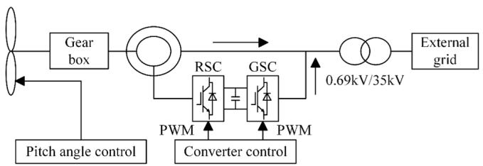  
Fig. 1. DFIG topology.

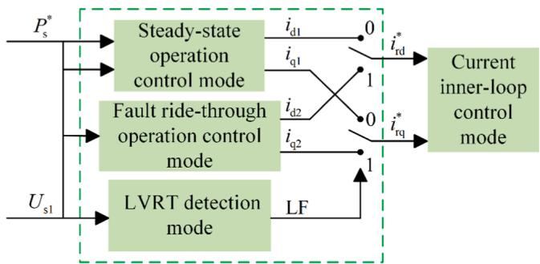  
Fig. 2. Control diagram of RSC.

By aligning the d-axis with the stator flux linkage direction, the expressions for stator active and reactive power can be derived:

$$
\left\{ \begin{array}{l} P _ {s} = \frac {3 L _ {m}}{2 L _ {s}} \omega_ {1} \psi_ {s} i _ {r q} \\ Q _ {s} = \frac {3 L _ {m} \omega_ {1} \psi_ {s}}{2 L _ {s}} \left(i _ {r d} - \frac {\psi_ {s}}{L _ {m}}\right) \end{array} \right. \tag {3}
$$

As indicated by $\operatorname { E q . } \left( 3 \right) ,$ the vector control strategy oriented toward the stator flux achieves decoupling of active and reactive power in the DFIG.

Furthermore, wind farms are required to provide dynamic reactive power support during fault conditions [32]. The dynamic reactive currentI must respond to fluctuations in voltage levels at the Point of Common Coupling (PCC) and satisfy [33]:

$$
\left\{ \begin{array}{l} I _ {Q} = K _ {1} \left(0. 9 - U _ {s 1}\right) I _ {N} \\ 0. 2 p. u. \leq U _ {s 1} \leq 0. 9 p. u. \end{array} \right. \tag {4}
$$

Where $\cdot I _ { N } \mathbf { i }$ s the rated turbine current; and $K _ { 1 } \mathrm { i } s$ the reactive current support coefficient (typically 1.5–3 per grid codes).

Therefore, during turbine faults, the benchmark values for the rotor current d-axis componen $\dot { \tau } _ { r d } ^ { * }$ and reactive power outpu $. Q _ { f a u l t }$ tare given by:

$$
\left\{ \begin{array}{l} i _ {r d} ^ {*} = \frac {\psi_ {s d}}{L _ {m}} + \frac {L _ {s}}{L _ {m}} \left[ K _ {1} \left(0. 9 - U _ {s 1}\right) I _ {N} \right] \\ Q _ {\text {f a u l t}} = U _ {s 1} K _ {1} \left(0. 9 - U _ {s 1}\right) I _ {N} \end{array} \right. \tag {5}
$$

To enhance LVRT voltage support, the RSC’s control prioritizes reactive power by constraining rotor currents, preventing overcurrent while supplying the required reactive power. The q-axis current reference $i _ { r q } ^ { * }$ and active power $P _ { f a u l t }$ are calculated as follows [34].

$$
\left\{ \begin{array}{l} i _ {r q} ^ {*} = \min  \left\{\left[ K _ {p p r} \left(P _ {s. f a u l t} ^ {*} - P _ {s}\right) + K _ {i p r} \int \left(P _ {s. f a u l t} ^ {*} - P _ {s}\right) d t, \sqrt {i _ {r . l i m} ^ {2} - \left(i _ {r d} ^ {*}\right) ^ {2}} \right] \right\} \\ P _ {f a u l t} = \min  \left(P _ {0}, \frac {3 L _ {m}}{2 L _ {s}} \omega_ {1} \psi_ {s} \sqrt {i _ {r . l i m} ^ {2} - \left(i _ {r d} ^ {*}\right) ^ {2}}\right) \end{array} \right. \tag {6}
$$

Where, $K _ { p p }$ rand $\lfloor K _ { i p \iota }$ rrepresent the proportional and integral coefficients of the rotor-side PI controller, respectively;P∗s $f a u l t ^ { \mathbf { i } s }$ the active power reference value during the fault period; $P _ { 0 } \mathrm { i } s$ the output active power before the fault; andi is the current limit value of the RSC.

# 2.2. DFIG LVRT active power characteristics analysis

Due to varying wind speeds, the LVRT dynamic responses of wind turbines differ [27]. To investigate these characteristics of a DFIG under varying output power conditions, a detailed electromagnetic transient (EMT) model of a 2.25-MW DFIG was built in PSCAD/EMTDC (v4.6.2). The characteristics of the induction machine and converter controls involved are listed in Table 1.

This study proposes a two-step clustering method. First, wind tur-

Table 1 Induction machine and converter control parameters.   

<table><tr><td>Component</td><td>Parameter</td><td>Description</td><td>Value (Unit)</td></tr><tr><td rowspan="8">Induction machine</td><td>S</td><td>Rated power</td><td>2.25(MW)</td></tr><tr><td>UN</td><td>Rated voltage</td><td>690(V)</td></tr><tr><td>H</td><td>Inertia constant</td><td>78(Kg*m2)</td></tr><tr><td>Rs</td><td>Stator resistance</td><td>0.022(p.u.)</td></tr><tr><td>Rr</td><td>Rotor resistance</td><td>0.026(p.u.)</td></tr><tr><td>Ls</td><td>Stator inductance</td><td>0.177(p.u.)</td></tr><tr><td>Lr</td><td>Rotor inductance</td><td>0.116(p.u.)</td></tr><tr><td>Lm</td><td>Magnetizing inductance</td><td>4.68(p.u.)</td></tr><tr><td rowspan="7">Converter control</td><td>Kpqr,Kipr</td><td>Active power control (PI) in RSC</td><td>2,0.02</td></tr><tr><td>Kpqr,Kiqr</td><td>Reactive power control (PI) in RSC</td><td>2,0.05</td></tr><tr><td>Kprr,KiIr</td><td>Current control (PI) in RSC</td><td>2,0.025</td></tr><tr><td>Kpug,Kiug</td><td>DC voltage control (PI) in GSC</td><td>2,0.01</td></tr><tr><td>Kplg,KIlg</td><td>Current control (PI) in GSC</td><td>2,0.01</td></tr><tr><td>Kppll,Kipll</td><td>PLL control (PI)</td><td>500,2000</td></tr><tr><td>ir_lim</td><td>current limit value of the RSC</td><td>1.6(p.u.)</td></tr><tr><td rowspan="3">Crowbar protection parameters</td><td>RCrowbar</td><td>Crowbar resistor</td><td>0.25(p.u.)</td></tr><tr><td>ICrowbar_on</td><td>Activation current threshold</td><td>1.5(p.u.)</td></tr><tr><td>VCrowbar_off</td><td>Deactivation voltage threshold</td><td>0.9(p.u.)</td></tr></table>

bines are classified based on their real-time active power output (P) according to the presence or absence of "clustering characteristics" $( \mathrm { i . e . } ,$ , highly similar active power responses during LVRT). The definitive power thresholds derived from Fig. 3 are as follows: start-up area $_ { ( \mathsf { A } - \mathsf { B } , P }$ $< 0 . 0 7 2 p . u . )$ , MPPT area $( \mathrm { B } { \mathrm { - C } } , 0 . 0 7 2 p . u . \leq P < 0 . 9 1 p . u . )$ , constant speed area $( \mathrm { C - D } , 0 . 9 1 p . u . \le P < 1 . 0 p . u . )$ , and constant power area $\left( \mathrm { D - E } , P \right) =$ 1.0p.u.).

Units operating in areas A-B, C-D, and D-E exhibit high intra-zone similarity in their response curve shape, dip depth, and recovery trajectory and are therefore grouped as possessing clustering characteristics. In contrast, units in the MPPT area (B-C) exhibit greater active power fluctuations due to rotational speed adjustments forCptracking and are thus separated for subsequent secondary clustering.

Fig. 3 shows the wind speed $( V _ { w } )$ , active power (P), and wind power coefficient $( C _ { p } )$ curves of the DFIG, which form the basis for the aforementioned thresholds. The method was validated by simulating a threephase voltage dip (0.2 p.u., 625 ms). The dynamic response of active power at the PCC (Fig. 4) confirmed significant distinctions between operational areas: high similarity within zones A-B, C-D, and D-E, and greater variability within the MPPT zone (B-C). These observed distinctions serve as the basis for the first-step clustering.

# 3. Two-step clustering-based equivalent modeling method

# 3.1. Workflow of the two-step clustering-based equivalent modeling method

Given the significant differences in LVRT active power responses

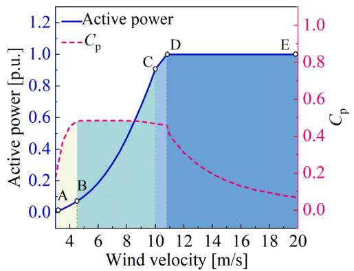  
Fig. 3. Wind speed vs. active power vs. $C _ { \mathrm { p } }$ curves.

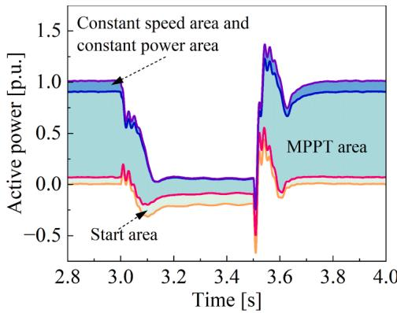  
Fig. 4. Dynamic response of active power at PCC.

across operational zones, this paper proposes an enhanced k-means twostep clustering method for dynamic equivalent modeling of DFIG wind farms based on LVRT characteristics.

As shown in Fig. 5. First, by establishing an electromagnetic transient (EMT) simulation model of a single DFIG, the dynamic response properties of each wind turbine generator during LVRT under varying output conditions. Second, based on real-time output, wind turbines are categorized into clusterable and unclusterable groups. Subsequently, an enhanced k-means clustering algorithm is adopted to perform secondary clustering on units with unclusterable characteristics, thereby obtaining equivalent machines for the entire wind farm. Finally, LVRT fault simulations validate the equivalent model through quantitative error analysis.

# 3.2. Selection of clustering criteria for secondary clustering

Active power output is a key indicator for evaluating wind turbine performance, not only directly reflects power generation efficiency but also indirectly indicates critical operational parameters such as terminal voltage and current, thereby enabling effective assessment of unit characteristics across different operating areas. Wind speed determines the mechanical input power; given the spatial heterogeneity of wind speeds within actual wind farms, employing turbine-specific wind speeds as clustering indices better represents operational contexts. TheCpvalue critically determines mechanical capture efficiency and aerodynamic performance. Fig. 3 shows that identicalCpvalues may correspond to different wind speeds, while similar wind speeds may yield distinc $\cdot C _ { p } \mathrm { . }$ values. Therefore, considering their interaction improves operational state identification.

In summary, active power outputP, wind speed $. V _ { w } ,$ and wind power coefficientC are chosen as clustering indices.

# 3.3. Secondary clustering using enhanced K-means algorithm

The conventional k-means algorithm divides a datasetTintoKclusters, each represented by a center. It seeks to minimize the Within-Cluster Sum of Squares (WCSS), Which is the total squared distance from each point to its cluster centroid [35].

$$
W C S S = \sum_ {i = 1} ^ {K} \sum_ {x \in C _ {i}} \| x - \mu_ {i} \| ^ {2} \tag {7}
$$

WhereCiis the data points of the i-th cluster (representing a cluster grouping),xis a point $\mathrm { i n } C _ { i } , \mu _ { i }$ is the centroid ofCi(typically the mean of its points), and‖ $x - \mu _ { i } \| \mathbf { i s }$ the Euclidean distance fromxtoμi.

Although this algorithm offers advantages such as computational efficiency and broad applicability, its random initialization of cluster centroids and predefined cluster number tends to converge to local optima. For this purpose, this paper introduces an enhanced k-means

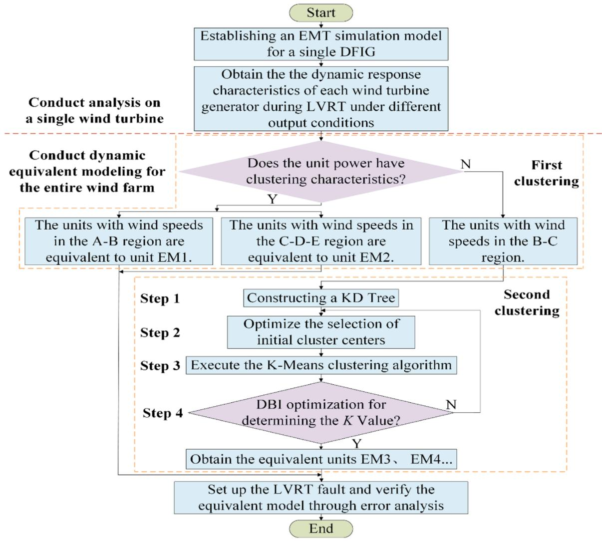  
Fig. 5. Wind farm equivalent modeling flowchart.

algorithm. It improves the accuracy in identifying the initial positions of centroids through probabilistic selection, employs a KD-tree index for efficient retrieval of high-dimensional data [36], and minimizes the DBI to optimize the ratio of intra-cluster dispersion to inter-cluster separation [37]. The detailed procedure is as follows:

Step 1. KD-tree Construction. For a dataset comprisingadata points andDclustering features (represented as ana × Dmatrix), compute the variance along each dimension. Select the splitting axis as the dimension with maximum variance. The variance formula is:

$$
V a r \left(X _ {d}\right) = \frac {1}{a - 1} \sum_ {i = 1} ^ {a} \left(v _ {d i} - \mu_ {d}\right) ^ {2} \tag {8}
$$

Where,Xdis the dataset along the d-th dimension,d ∈ $\{ 1 , 2 , \cdots , D \} ; \nu _ { d i }$ denotes the value of the i-th data point in the d-th dimension; andμ is the mean value of the d-th dimension.

Sort data points according to the current splitting axis. Select the median point as the current node, assign all points smaller than the median to the left subtree, and points greater than or equal to it to the right subtree. Then, update the splitting axis to the next dimension.

Determine the next splitting axis and update it. The dimension indexd∗for the next splitting axis is calculated as follows:

$$
d ^ {*} = \operatorname {a r g m a x} _ {d} \operatorname {V a r} \left(X _ {d}\right) \tag {9}
$$

Whereargmax denotes the value of d that maximizes the objective

function among all possible dimensions.

Recursively apply Step 1 to the left and right subtrees until the number of nodes in each subtree is less than or equal to a predefined threshold (set to 5 in this study). During subsequent distance calculations between data points and cluster centroids, the KD-tree efficiently identifies relevant points, thereby reducing redundant computations and improving the overall clustering efficiency.

Step 2. The computational complexity of the assignment phase in traditional K-means isO(a⋅K⋅D),Ddenotes the data dimensionality, (in this studyD = 3). To enhance efficiency, the proposed algorithm utilizes the constructed KD-tree to accelerate the assignment step: each cluster centroid serves as a query point to perform a nearest neighbor search on the KD-tree built from all data points. This search locates the nearest subset of data points through recursive comparison and backtracking, enabling batch assignment.

This optimization reduces the average complexity of this phase toO(a⋅log(a)⋅D). This reduction is achieved because a single search in a balanced KD-tree has a complexity ofO(loga), and this operation is performed once for each of theKcentroids. Given thatK << ain wind farm scenarios, it follows thatO(a⋅loga)≪O(a⋅K), thereby significantly improving the computational efficiency of large-scale clustering. Tests reveal that the proposed method consumes only 25.1% of the runtime of traditional methods per iteration.

Step 3. Given the number of clustersK $, K \in \{ 2 , 3 , \cdots , a \}$ , the initial

centroids are selected according to the k-means++ algorithm [38]. The procedure begins by randomly selecting one data point from the dataset as the first centroidc1. For each data pointxnot yet chosen as a centroidx $\in \{ 1 , 2 , \cdots , a \}$ , compute its minimum Euclidean distance $D _ { ( x ) } \mathrm { t } 0$ the existing centroids using the KD-tree avoid redundant calculations and improve initialization efficiency:

$$
D _ {(x)} = \sqrt {\sum_ {d = 1} ^ {D} \left(x _ {d} - c _ {i d}\right) ^ {2}} \tag {10}
$$

Wherex and $. c _ { i d } \hat { \epsilon }$ re the values of data pointxand centroidc in the d-th dimension, respectively.

Based on the computed minimum distances, sequentially calculate the selection probabilityP(x)for each data not yet chosen as a centroid to be selected as the next centroid:

$$
P _ {(x)} = \frac {D _ {(x)} ^ {2}}{\sum_ {y \in T \backslash t} D _ {(y)} ^ {2}} \tag {11}
$$

Whereydenotes the set of data points not yet selected as centroids;T\t represents the remaining dataset after removing all selected centroids from the complete dataset.

Stochastically sample the next centroid based on point probabilities. Repeat the centroid selection process from Step 3 untilKcentroids have been selected.

Step 4. Perform k-means clustering using theKcentroids from Step 3. Each iteration assigns data points to their nearest centroid to form clusters for the current iteration. Let the i-th cluster beCi, containingn data points. Represent the data as ann × 3matri $x _ { i } ,$ where each column corresponds to a clustering feature and each row represents a data point:

$$
\boldsymbol {x} _ {i} = \left[ \begin{array}{c c c} P _ {1} & V _ {w 1} & C _ {p 1} \\ P _ {2} & V _ {w 2} & C _ {p 2} \\ \vdots & \vdots & \vdots \\ P _ {n _ {i}} & V _ {w n _ {i}} & C _ {p n _ {i}} \end{array} \right] \tag {12}
$$

By integrating Eq. (7) and Eq. (12), the objective function can be rewritten as:

$$
W C S S = \sum_ {i = 1} ^ {K} t r \left(\boldsymbol {x} _ {i} \left(I - \frac {1}{n _ {i}} 1 1 ^ {T}\right) \boldsymbol {x} _ {i} ^ {T}\right) \tag {13}
$$

WhereIdenotes the3 × 3identity matrix, and1represents the all-ones vector.

This objective function is employed in each iteration of the k-means algorithm to assess cluster tightness and guide the updating of cluster centroids.

Step 5. Introduce the DBI to determine the selection ofKvalues. The formula for its calculation is presented below:

$$
\left\{ \begin{array}{l} S _ {i} = \frac {1}{\left| C _ {i} \right|} \sum_ {x \in C _ {i}} \| x - \mu_ {i} \| \\ S _ {j} = \frac {1}{\left| C _ {j} \right|} \sum_ {x \in C _ {j}} \| x - \mu_ {j} \| \\ D B I = \frac {1}{K} \sum_ {i = 1} ^ {K} \max  _ {j \neq i} \frac {S _ {i} + S _ {j}}{\left\| \mu_ {i} - \mu_ {j} \right\|} \end{array} \right. \tag {14}
$$

whereSiandSjdenote the intra-cluster dispersion of the i-th and j-th clusters, respectively; |Ci|and|Cj|represent the number of data points in the i-th and j-th clusters;μ andμ are the centroids of the i-th and j-th clusters;‖ $x - \mu _ { i } |$ ‖and‖ $x - \mu _ { j }$ ‖indicate the Euclidean distances from data pointxin the cluster to centroid $s \mu _ { i } { \mathrm { a n d } } \mu _ { j } ,$ respectively.

For each candidateK, repeat Steps 3–5. Select theKcorresponding to the minimum DBI value as the optimal cluster count $( \mathrm { i . e . , }$ , the secondary clustering number), thereby establishing the final cluster partition.

# 3.4. Equivalent parameter calculation and error analysis

# 3.4.1. Equivalent parameter calculation

In wind farm equivalent modeling using the proposed method, the voltage equations, state equations, and control parameters of the equivalent generating unit remain consistent with those of an individual unit prior to equivalence. For clusters, the equivalent parameter calculation formulas for asynchronous generators and step-up transformers are as follows:

$$
\left\{ \begin{array}{l} S _ {e q} = N S, \quad P _ {e q} = \sum_ {i = 1} ^ {N} P _ {i} = N P, \quad Q _ {e q} = \sum_ {i = 1} ^ {N} Q _ {i} = N Q \\ X _ {\mathrm {m} - \mathrm {e q}} = \frac {X _ {m}}{N}, \quad X _ {\mathrm {s} - \mathrm {e q}} = \frac {X _ {s}}{N}, \quad X _ {\mathrm {r} - \mathrm {e q}} = \frac {X _ {r}}{N} \\ R _ {\mathrm {s} - \mathrm {e q}} = \frac {R _ {s}}{N}, \quad R _ {\mathrm {r} - \mathrm {e q}} = \frac {R _ {r}}{N}, \quad C _ {e q} = N C, \quad S _ {T - e q} = N S _ {T}, \quad Z _ {T - e q} = \frac {Z _ {T}}{N} \end{array} \right. \tag {15}
$$

WhereNis the number of units before equivalence;S,P,Qare capacity, active, and reactive power $J { \cdot } X _ { m } , X _ { S } , X _ { I }$ rare magnetizing, stator leakage, and rotor leakage reactance;R andR are stator and rotor resistance;Cis DClink capacitance;STis generator terminal transformer capacity;ZTis generator terminal transformer impedance. and the subscript eq denotes equivalent parameters of the corresponding variables.

According to the equivalent line loss model, the equivalent impedance $\scriptstyle { \mathcal { Z } } _ { e q u } \mathbf { o f }$ the collector circuit is given by:

$$
Z _ {e q u} = \sum_ {i = 1} ^ {n} \frac {i ^ {2} Z _ {i}}{n ^ {2}} \tag {16}
$$

Wherenis the total quantity of segments in the collector circuit before equivalence;Zirepresents the impedance value of the corresponding segment.

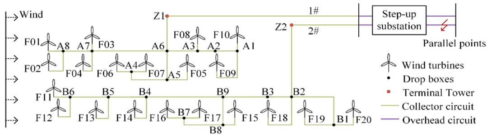  
Fig. 6. Wind farm topology diagram.

# 3.4.2. error analysis

In order to assess the accuracy of the proposed multi-machine equivalent method, the root mean square error (RMSE) metricEis defined against detailed model simulations as:

$$
E = \sqrt {\frac {1}{m} \sum_ {i = 1} ^ {m} \left(\frac {A _ {i} - A _ {e q i}}{A _ {i}}\right) ^ {2}} \tag {17}
$$

Wheremis the number of sampling points;Aiand $A _ { e q i } \mathsf { a r e }$ the electrical quantities from the detailed model and equivalent model, respectively.

# 4. Case study analysis

# 4.1. Case study description

Fig. 6 shows the topological structure of a wind farm located in South China.

The wind farm comprises 20 DFIG wind turbines (2.25 MW, 0.69 kV each). The unit-related parameters are listed in Table 1. Each output is stepped up to 35 kV via a pad-mounted transformer and fed into collector lines. Power is aggregated at the substation’s low-voltage bus and supplied to the grid through a 35/220 kV main transformer.

# 4.2. Validation of enhanced K–means algorithm effectiveness

Three variables–wind speed ${ \cal { V } } _ { w } ,$ active powerP, and wind power coefficient $C _ { \mathrm { p } }$ –serves as clustering features. Using the methodology illustrated in Fig. 5, clustering is performed on the wind farm units, with initial states provided in Table 2.

For units on the same collector circuit in Table 2, wind speeds are calculated using the Jensen wake model [39], which assumes no mutual interference between collector lines. The wind speed at a downwind unit located at a distanceXalong the wind direction is:

$$
V _ {(X)} = V _ {0} \left[ 1 - \sqrt {1 - \frac {C _ {T} \partial X}{2 r _ {0} ^ {2}}} \right] \tag {18}
$$

WhereV0is the original wind speed $( 3 - \mathrm { ~ - ~ } 1 3 \mathrm { m } / s ) ;$ ; the thrust coefficientC is 0.8; the wake decay coefficient∂is $0 . 0 7 5 ;$ andr = 38m indicates the blade radius of the generating unit.

According to Eq. (14), the case ofK = 1is typically excluded. As indicated by Eq. $( 7 ) ,$ , asKapproaches the true value, the clustering results align with the actual data distribution; the reduction in intra-cluster distance plateaus; and the WCSS curve slope changes significantly.

Table 2 Initial states of clustering features for wind turbine generating units.   

<table><tr><td>Unit number</td><td>Wind speed(m/s)</td><td>Active power(p.u.)</td><td>Cp</td></tr><tr><td>F01</td><td>11.5226</td><td>1.0003</td><td>0.3543</td></tr><tr><td>F02</td><td>9.2892</td><td>0.7403</td><td>0.4757</td></tr><tr><td>F03</td><td>10.9013</td><td>1.0003</td><td>0.4299</td></tr><tr><td>F04</td><td>8.9095</td><td>0.6573</td><td>0.4795</td></tr><tr><td>F05</td><td>6.1815</td><td>0.2087</td><td>0.4829</td></tr><tr><td>F06</td><td>5.3492</td><td>0.1307</td><td>0.4829</td></tr><tr><td>F07</td><td>7.3914</td><td>0.3685</td><td>0.4829</td></tr><tr><td>F08</td><td>6.7169</td><td>0.2729</td><td>0.4829</td></tr><tr><td>F09</td><td>4.8557</td><td>0.0947</td><td>0.4823</td></tr><tr><td>F10</td><td>3.1311</td><td>0.0103</td><td>0.2277</td></tr><tr><td>F11</td><td>5.0432</td><td>0.1076</td><td>0.4829</td></tr><tr><td>F12</td><td>6.7976</td><td>0.2837</td><td>0.4829</td></tr><tr><td>F13</td><td>4.941</td><td>0.1002</td><td>0.4825</td></tr><tr><td>F14</td><td>7.6755</td><td>0.4157</td><td>0.4829</td></tr><tr><td>F15</td><td>5.1966</td><td>0.1192</td><td>0.4829</td></tr><tr><td>F16</td><td>5.1652</td><td>0.1168</td><td>0.4829</td></tr><tr><td>F17</td><td>6.8345</td><td>0.2888</td><td>0.4829</td></tr><tr><td>F18</td><td>12.3556</td><td>1.0003</td><td>0.2864</td></tr><tr><td>F19</td><td>10.9942</td><td>1.0003</td><td>0.4052</td></tr><tr><td>F20</td><td>3.3125</td><td>0.0164</td><td>0.299</td></tr></table>

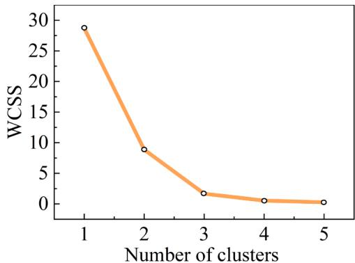  
Fig. 7. Variation trend of WCSS under different cluster counts.

Fig. 7 shows that atK = 2, the WCSS decline slows markedly, indicating that the true cluster count is approximately 2. Meanwhile, Fig. 8 demonstrates thatK = 2achieves the lowest DBI, indicating an optimal equilibrium between the compactness within clusters and the separation between clusters. This further validates the rationality of dividing generating units with wind speeds in the B–C area (MPPT area) into two clusters.

To evaluate the validity of the proposed equivalent modeling approach (Method A), the detailed model serves as the benchmark. Comparisons include Existing k-means clustering (Method B), the fuzzy C-means algorithm from [24] (Method C), and single-unit equivalent modeling (Method D), all applied to cluster units under the states listed in Table 2. The clustering results for Methods A to C are presented in Table 3.

As shown in Table 3, the clustering results of the three equivalent methods exhibit notable differences. Although all methods consistently identify the core cluster EM2 (containing F01, F03, F18, F19), significant distinctions exist in the grouping of the remaining units.

Method A demonstrates clear physical interpretability: EM1 exclusively comprises low-wind-speed units F10 and F20, while EM3 aggregates most units operating in the MPPT region, reflecting its ability to achieve consistent clustering based on operational conditions.In contrast, Method B and Method C exhibit obvious shortcomings. Method B shows undesirable fragmentation, such as dispersing functionally similar units F10 and F20 into EM3 and EM4. Although Method C correctly clusters some MPPT units (e.g., F05, F08, etc.), its EM3 grouping omits several other similar units (such as F06 and F09), indicating deficiencies in clustering sensitivity and completeness.

In summary, Method A significantly outperforms the other methods by delivering more compact, consistent, and interpretable clustering results, thereby laying a foundation for constructing higher-fidelity equivalent models.

To validate Method A, corresponding models were developed in PSCAD/EMTDC (v4.6.2) based on the clustering results presented in

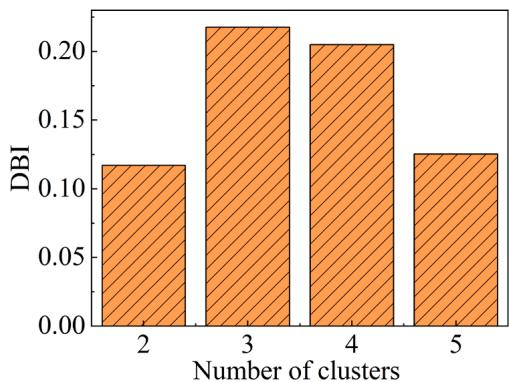  
Fig. 8. Comparison of DBI values across different cluster counts.

Table 3. A three-phase voltage dip at the PCC to 0.2 p.u. was simulated with a fault duration of 625 ms. Using the detailed model as the benchmark, the error was calculated via Eq. (17). The average wind speed was obtained from Table 2, and the total output power of the wind farm was derived ${ \mathsf { a s p } } _ { W F } = 0$ .3969p.u.using Fig. 3. Fig. 9 presents dynamic responses and errors of voltage, active power, and reactive power during the fault for all models. The model derived using Method A is

Table 3 Clustering results by different methods.   

<table><tr><td colspan="2">Method A</td><td colspan="2">Method B</td><td colspan="2">Method C</td></tr><tr><td>Equivalent unit</td><td>Unit number</td><td>Equivalent unit</td><td>Unit number</td><td>Equivalent unit</td><td>Unit number</td></tr><tr><td>EM1</td><td>F10,F20</td><td>EM1</td><td>F05,F07, F08,F12 F14,F17</td><td>EM1</td><td>F02,F04, F07,F14</td></tr><tr><td>EM2</td><td>F01,F03, F18,F19</td><td>EM2</td><td>F01,F03, F18,F19</td><td>EM2</td><td>F01,F03, F18,F19</td></tr><tr><td>EM3</td><td>F05,F06, F08,F09 F11,F12, F13,F15 F16,F17</td><td>EM3</td><td>F02,F04</td><td>EM3</td><td>F05,F08, F12,F17</td></tr><tr><td>EM4</td><td>F02,F04, F07,F14</td><td>EM4</td><td>F06,F09, F10,F11 F13,F15, F16,F20</td><td>EM4</td><td>F06,F09, F10,F11 F13,F15, F16,F20</td></tr></table>

referred to as Model $\mathbf { A } ,$ with other equivalent models named accordingly.

As illustrated in Table $^ { 3 , }$ the clustering outcomes from Methods B and C are highly similar, leading to nearly identical simulation outputs for Models B and C in Fig. 9. Fig. 9.(a), 9(b), and 9(d) show that all equivalent models closely match the detailed model in voltage and active power accuracy during the fault simulation, particularly before fault initiation and after clearance, with Model A achieving the highest precision. Further analysis of Fig. 9. (c) and 9 (d) reveals that Model A reduces the reactive power error by an average of 2.65% compared to Models B, C, and D during both steady-state and transient processes, exhibiting significantly enhanced agreement with the detailed model. In summary, compared to existing methods, Method A not only achieves higher accuracy but also significantly reduces the simulation time (as evidenced in Table 4), demonstrating strong practical engineering utility.

Table 4 Comparison of simulation time among different models.   

<table><tr><td>Equivalent model</td><td>Detailed Model</td><td>Model A</td><td>Model B</td><td>Model C</td><td>Model D</td></tr><tr><td>Simulation Time/S</td><td>5850</td><td>560</td><td>635</td><td>621</td><td>110</td></tr></table>

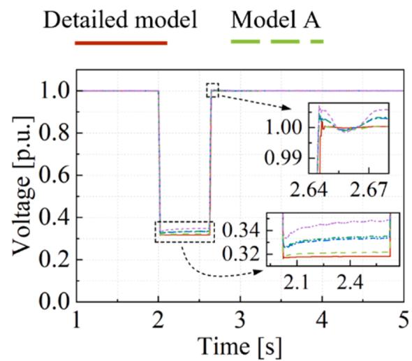

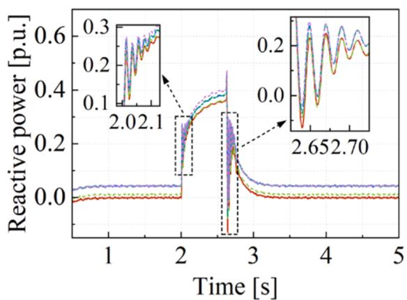  
(a)   
（c）

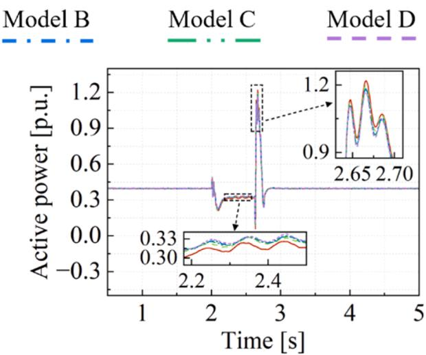

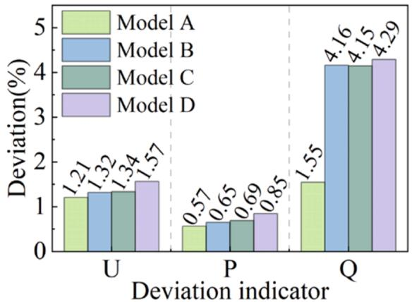  
(b)   
(d）  
Fig. 9. Comparison of dynamic responses between the detailed model and the proposed equivalent model during a low-voltage fault; (a) Voltage at the PCC; (b) Active power output; (c) Reactive power output; (d) Deviation between the detailed and equivalent models.

# 5. Contribution and conclusion

This study proposes an enhanced k-means two-step clustering method for dynamic equivalent modeling of DFIG wind farms based on LVRT characteristics to improve DFIG wind farm equivalent modeling. Key contributions include: First, a novel clustering framework incorporating LVRT dynamics improves accuracy in stability scenarios, marking a shift from static to dynamic clustering. Second, an automated algorithm integrates K-Means++ initialization, KD-tree (75% faster search), and DBI for optimal clusters, eliminating subjective parameter selection and improving reproducibility. Third, a high-fidelity model replicates detailed dynamics during LVRT with >98% accuracy and 90% faster simulation, balancing precision and efficiency for high wind penetration power system analysis.

Based on these contributions, this study constructed a wind farm model with 20 DFIG units and used a detailed Electromagnetic Transient (EMT) model as a benchmark to compare and validate against three alternative methods. The results confirm that the proposed equivalent model maintains high consistency with the detailed benchmark during LVRT transient processes, offering an efficient and reliable solution for stability analysis in power systems with high wind energy integration. However, it should be noted that this study is primarily based on simulation validation. Although the adopted simulation tools and models are well-recognized in the field, physical prototype experimentation will be prioritized in future work to further validate the effectiveness of the proposed equivalent modeling method in real-world environments and explore its potential for practical engineering applications.

# CRediT authorship contribution statement

Junhua Xu: Supervision, Methodology, Conceptualization. Jiyuan Shen: Writing – review & editing, Writing – original draft. Xinyu You: Supervision. Chunwei Wang: Supervision. Bin Liu: Supervision.

# Declaration of competing interest

The authors declare the following financial interests/personal relationships which may be considered as potential competing interests:

Jiyuan shen reports financial support was provided by Innovation Project of Guangxi Graduate Education(YCSW2025107). If there are other authors, they declare that they have no known competing financial interests or personal relationships that could have appeared to influence the work reported in this paper.

# Data availability

Data will be made available on request.

# References

[1] Q. Liu, D. Jin, Exploration on the application of new energy in power system thermal energy and power conversion, Proc. Int. Conf. Energy Eng. Power Syst. (EEPS) (2023) 453–456.   
[2] Y. Wang, Q. Hu, L. Li, A.M. Foley, D. Srinivasan, Approaches to wind power curve modeling: a review and discussion, Renew. Sustain. Energy Rev. 116 (2019) 109422.   
[3] P. Hu, Y. Li, Y. Yu, F. Blaabjerg, Inertia estimation of renewable-energy-dominated power system, Renew. Sustain. Energy Rev. 183 (2023) 113481.   
[4] J. Zou, C. Peng, Y. Yan, H. Zheng, Y. Li, A survey of dynamic equivalent modeling for wind farm, Renew. Sustain. Energy Rev. 40 (2014) 956–963.   
[5] C.R. Schmidlin Jr, F.K.d.A. Lima, F.G. Nogueira, C.G.C. Branco, F.L. Tofoli, Reduced-order modeling approach for wind energy conversion systems based on the doubly-fed induction generator, Electr. Power Syst. Res. 192 (2021) 106963.   
[6] B. Shao, S. Zhao, B. Gao, Y. Yang, F. Blaabjerg, Adequacy of the single-generator equivalent model for stability analysis in wind farms with VSC-HVDC systems, IEEE Trans. Energy Convers. 36 (2) (2021) 907–918.   
[7] S.G. Varzaneh, M. Abedi, G.B. Gharehpetian, A new simplified model for assessment of power variation of DFIG-based wind farm participating in frequency control system, Electr. Power Syst. Res. 148 (2017) 220–229.

[8] D. Li, C. Shen, Y. Liu, Y. Chen, S. Huang, A dynamic equivalent method for PMSG-WTG based wind farms considering wind speeds and fault severities, IEEE Trans. Power Syst. 39 (2) (2024) 3738–3751.   
[9] J. Brochu, C. Larose, R. Gagnon, Validation of single-and multiple-machine equivalents for modeling wind power plants, IEEE Trans. Energy Convers. 26 (2) (2011) 532–541.   
[10] Y. Zhang, E. Muljadi, D. Kosterev, M. Singh, Wind power plant model validation using synchrophasor measurements at the point of interconnection, IEEE Trans. Sustain. Energy 6 (3) (2015) 984–992.   
[11] S.A. Mansouri, E. Nematbakhsh, A. Ramos, M. Tostado-V´eliz, J.A. Aguado, J. Aghaei, A robust ADMM-enabled optimization framework for decentralized coordination of microgrids, IEEE Trans. Ind. Inf. 21 (2) (2025) 1479–1488.   
[12] S.F. Dai, S.A. Mansouri, S.J. Huang, Y.Z. Alharthi, Y.F. Wu, L. Bagherzadeh, A multi-stage techno-economic model for harnessing flexibility from IoT-enabled appliances and smart charging systems: developing a competitive local flexibility market using Stackelberg game theory, Appl. Energy 373 (2024) 123868.   
[13] S.A. Mansouri, A. Ramos, J.P.C. Avila,´ J. García-Gonzalez,´ J.A. Aguado, A DSO driven privacy-preserving mechanism for managing power exchanges in Australian networks, IEEE Trans. Ind. Inf. (2025) 1–11.   
[14] S.A. Mansouri, E. Nematbakhsh, A. Ramos, J.P.C. Avila,´ J. García-Gonz´alez, A. R. Jordehi, Bi-level mechanism for decentralized coordination of internet data centers and energy communities in local congestion management markets, in: Proceedings of the 2023 IEEE International Conference on Energy Technologies for Future Grids (ETFG), 2023.   
[15] S.A. Mansouri, M.S. Javadi, A robust optimisation framework in composite generation and transmission expansion planning considering inherent uncertainties, J. Exp. Theor. Artif. Intell. 29 (4) (2017) 717–730.   
[16] S.A. Mansouri, E. Nematbakhsh, A.R. Jordehi, M. Tostado-V´eliz, F. Jurado, Z. Leonowicz, A risk-based bi-level bidding system to manage day-ahead electricity market and scheduling of interconnected microgrids in the presence of smart homes, in: Proceedings of the 2022 IEEE International Conference on Environment and Electrical Engineering and 2022 IEEE Industrial and Commercial Power Systems Europe (EEEIC /I&CPS Europe), Prague, Czech Republic, 2022.   
[17] S.A. Mansouri, S. Maroufi, A. Ahmarinejad, A tri-layer stochastic framework to manage electricity market within a smart community in the presence of energy storage systems, J. Energy Storage 71 (2023) 108130.   
[18] J. Chen, W.Y. Gu, Y.Z. Alharthi, S.J. Huang, S.A. Mansouri, A decentralized framework for self-healing in hydrogen-integrated energy systems, Energy 331 (2025) 137033.   
[19] M. Tostado-V´eliz, A.R. Jordehi, H.M. Hasanien, N. Khosravi, S.A. Mansouri, F. Jurado, On different collective storage schemes in energy communities with internal market, J. Energy Storage 75 (2024) 109699.   
[20] S.A. Mansouri, A. Ahmarinejad, M.S. Javadi, A.E. Nezhad, M. Shafie-Khah, J.P. S. Catalao, ˜ Demand response role for enhancing the flexibility of local energy systems, Eds., in: G. Graditi, M. Di Somma (Eds.), Distributed Energy Resources in Local Integrated Energy Systems, Elsevier, 2021, pp. 279–313.   
[21] J. Han, S. Miao, Y. Li, H. Yin, D. Zhang, W. Yang, Q. Tu, Improved equivalent method for large-scale wind farms using incremental clustering and key parameters optimization, IEEE Access 8 (2020) 172006–172020.   
[22] N. Shabanikia, A.A. Nia, A. Tabesh, S.A. Khajehoddin, Weighted dynamic aggregation modeling of induction machine–based wind farms, IEEE Trans. Sustain. Energy 12 (3) (2021) 1604–1614.   
[23] Z. Wenzhe, B. Jing, Z. Ningyu, Z. Qian, L. Jiankun, Dynamic clustering equivalence of wind farms considering complex terrain, in: Proc Int Conf Sens, Diagn, Prognostics, Control (SDPC), 2018, pp. 790–795.   
[24] J. Zou, C. Peng, H. Xu, Y. Yan, A fuzzy clustering algorithm-based dynamic equivalent modeling method for wind farm with DFIG, IEEE Trans. Energy Convers. 30 (4) (2015) 1329–1337.   
[25] Y. Gao, Y. Jin, P. Ju, Q. Zhou, Dynamic equivalence of wind farm composed of double fed induction generators considering operation characteristic of crowbar, Power Syst. Technol. 39 (3) (2015) 628–633.   
[26] Y. Jin, P. Ju, X. Pan, Analysis on controller aggregation method for equivalent modeling of DFIG-based wind farm, Autom. Electr. Power Syst. 38 (3) (2014) 19–24.   
[27] A.P. Gupta, A. Mitra, A. Mohapatra, S.N. Singh, A multi-machine equivalent model of a wind farm considering LVRT characteristic and wake effect, IEEE Trans. Sustain. Energy 13 (3) (2022) 1396–1407.   
[28] S. Lin, W. Yao, Y. Xiong, Z. Shi, Y. Zhao, X. Ai, J. Wen, Three-stage dynamic equivalent modeling approach for wind farm using accurate crowbar status identification and voltage differences among wind turbines, Electr. Power Syst. Res. 228 (2024) 110091.   
[29] W. Li, P. Chao, X. Liang, J. Ma, D. Xu, X. Jin, A practical equivalent method for DFIG wind farms, IEEE Trans. Sustain. Energy 9 (2) (2018) 610–620.   
[30] X. Deng, L. Wu, X. Wang, H. Gong, R. Li, J. Jia, Transient modeling and stability analysis of DFIG under different power control mode, Electr. Power Syst. Res. 242 (2025) 111449.   
[31] Z. Wu, J. Pei, Y. Li, Multi-machine equivalent method for DFIG–based wind farm based on power characteristic of low voltage ride–through, Autom. Electr. Power Syst. 46 (19) (2022) 95–103.   
[32] M. Atallah, A. Mezouar, L.M. Fernandez-Ramírez,´ K. Belgacem, Y. Saidi, M. A. Benmahdjoub, B. Brahmi, Supervisory control of reactive power in wind farms with doubly fed induction generator-based wind turbines for voltage regulation and power losses reduction, Electr. Power Syst. Res. 228 (2024) 110059.   
[33] GB/T 19963.1-2021: Technical Specification For Connecting Wind Farm To Power System Part 1: On Shore Wind Power, Standards Press of China, Beijing, 2021.

[34] P. Chao, W. Li, X. Jin, J. Qi, X. Chang, An active power response based practical equivalent method for DFIG wind farms, Proc. Chin. Soc. Electr. Eng. 38 (6) (2018) 1639–1646.   
[35] M. Mehrjoo, M.J. Jozani, M. Pawlak, B. Bagen, A multilevel modeling approach towards wind farm aggregated power curve, IEEE Trans. Sustain. Energy 12 (4) (2021) 2230–2237.   
[36] Y. Cao, X.J. Zhang, B.H. Duan, W.J. Zhao, H.Z. Wang, An improved method to build the KD tree based on presorted results, Proc. IEEE Int. Conf. Softw. Eng. Serv. Sci. (ICSESS) (2020) 71–75.

[37] Y.A. Wijaya, D.A. Kurniady, E. Setyanto, W.S. Tarihoran, D. Rusmana, R. Rahim, Davies Bouldin Index algorithm for optimizing clustering case studies mapping school facilities, TEM J. (2021) 1099–1103.   
[38] S. Vassilvitskii, K-means++: Algorithms, Analyses, Experiments, Stanford University, 2007. Ph.D. dissertation.   
[39] P. Zhang, H. Liu, G. Zhang, J. Yin, C. Chen, L. Li, Study on wake numerical simulation based on improved Jensen model, Acta Energ. Sol. Sin. 44 (6) (2023) 509–513.