# Assessment of the transmission line theory in the modeling of multiconductor underground cable systems for transient analysis using a full-wave FDTD method

Naiara Duarte a,* , Alberto De Conti b , Rafael Alipio a,1 , Farhad Rachidi a

a Electromagnetic Compatibility Laboratory, Swiss Federal Institute of Technology in Lausanne (EPFL), 1015, Switzerland   
b Department of Electrical Engineering, Universidade Federal de Minas Gerais (UFMG), 31270-901, Brazil

# A R T I C L E I N F O

Keywords:

Electromagnetic transients

Ground-return admittance

Ground-return impedance

Transmission line theory

Underground cable systems

# A B S T R A C T

In this paper, a rigorous and independent validation of two different approaches for calculating the groundreturn impedance and admittance of multiconductor underground cable systems using the transmission line theory is carried out. Furthermore, analyses are performed to evaluate the accuracy of a closed-form approximation for the calculation of the ground-return admittance of underground cable systems. The validations are based on the full-wave finite-difference time-domain (FDTD) method and consider the calculation of transients on flat and trefoil underground cable arrangements for different excitation types. Short cable lengths of 50 m and 100 m and soil resistivities of up to 1000 Ωm are considered. The results demonstrate the validity of the transmission line theory for the calculation of fast transients (with risetimes as low as 0.2 µs) on underground cables provided the ground-return parameters are rigorously determined, with the advantage of presenting much greater efficiency and easiness to implement in electromagnetic transient simulators compared to the full-wave FDTD method. Lastly, it is shown that the ground-return admittance approximation, despite its simplicity, leads to results comparable to those obtained through more complete formulations for the calculation of transients in underground cables, but more efficiently and without significant loss of accuracy.

# 1. Introduction

THERE has been a renewed interest in the search for more accurate models for the simulation of electromagnetic transients in underground cables using the transmission line theory, including a more rigorous calculation of the ground-return parameters [1]. It has been shown, for example, that neglecting the ground-return admittance leads to inaccurate results in the simulation of high-frequency transients, especially for high-resistivity soils [1–5]. However, most electromagnetic transient (EMT)-type simulators still neglect this parameter in the calculation of the per-unit-length cable parameters [6]. This may compromise the accuracy of insulation coordination studies, especially in case of short cable sections used in grid-connected renewable energy sources and hybrid overhead/underground line systems [7,8], which present natural frequencies reaching hundreds of kHz and beyond.

Different approaches have been proposed to calculate the ground-

return parameters of underground cables [5,9–13]. Recent contributions include the formulations of Papadopoulos et al. [5] and Xue et al. [13], which were derived based on a quasi-TEM approximation of the modal equation resulting from the application of the Hertz potentials to solve the problem of a buried dielectric-coated wire. The overall consistency of these formulations has been confirmed via comparisons with existing expressions [1,5,13,14] or frequency-domain studies taking as reference full-wave electromagnetic models [15,16]. However, their validity for the simulation of transients on multiconductor underground cable systems has not been fully demonstrated.

A first attempt to provide a rigorous and independent validation of the expressions proposed by Papadopoulos et al. [5] and Xue et al. [13] for the calculation of transients in underground cables was carried out by the authors in [17] using the full-wave finite-difference time-domain (FDTD) method. Nevertheless, only the case of a single underground cable was considered. Here, the analysis presented in [17] is extended to

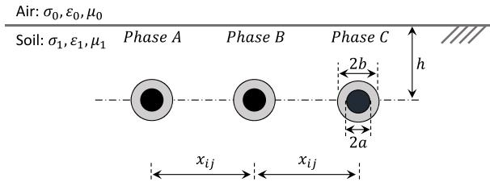  
(a)

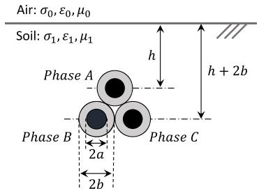  
(b)

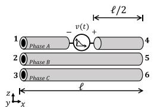  
Fig. 1. Cable system configurations: (a) flat and (b) trefoil.   
(a)

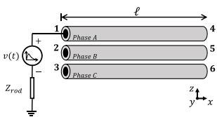  
(b)   
Fig. 2. (a) Longitudinal and (b) lateral excitations.

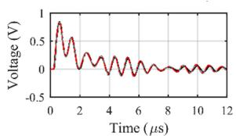

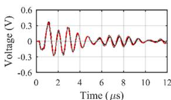

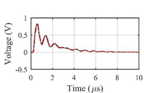

Fig. 3. Voltage waveforms calculated at the receiving ends of phases A (left) and C (right) considering a cable length of 50 m, soil resistivities (a) 200 Ωm and (b) 1000 Ωm and longitudinal excitation for a horizontal configuration.   
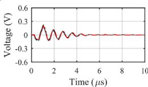  
-FDTD Papadopoulos et al.-.- Xuc etal.-.-.-YApproximation

verify the accuracy of both equations for the calculation of electromagnetic transients in a three-phase underground cable system using the transmission line theory. In order to complement the analyses involving the transmission line theory, an assessment of the validity of the approach proposed in [14] for calculating the ground-return admittance of underground cable systems is performed as an alternative to simplify the calculation of the per-unit-length cable parameters without loss of accuracy. Once again, a full-wave FDTD model is taken as reference to provide a rigorous framework for the model validation. This analysis is of paramount importance not only for providing an independent validation of both expressions, but for confirming the need of a complete change of paradigm in the calculation of ground-return parameters of

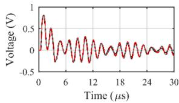

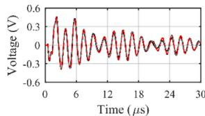

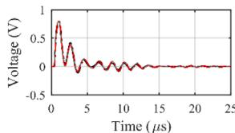

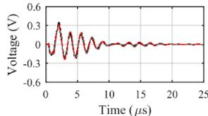  
FDTD Papadopoulos et al. -- Xuc et ai.-.-.- $\mathbf { \boldsymbol { r } } _ { \mathrm { ~ g ~ } }$ Approximation

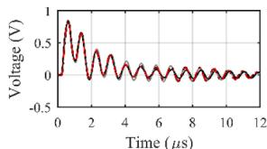  
Fig. 4. Voltage waveforms calculated at the receiving ends of phases A (left) and C (right) considering a cable length of 100 m, soil resistivities (a) 200 Ωm and (b) 1000 Ωm and longitudinal excitation for a horizontal configuration.

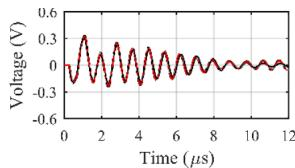

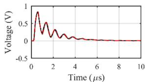

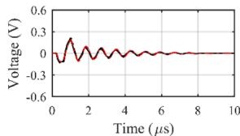  
FDTD Papadopouloset al. - Xuc et al.-.-. $\mathbf { \boldsymbol { r } } _ { \mathrm { ~ g ~ } }$ Approximation

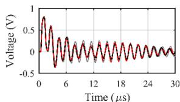  
Fig. 5. Voltage waveforms calculated at the receiving ends of phases A (left) and C (right) considering a cable length of 50 m, soil resistivities (a) 200 Ωm and (b) 1000 Ωm and longitudinal excitation for a trefoil configuration.

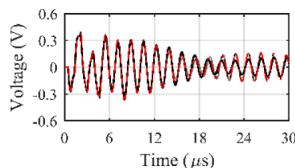  
(a)

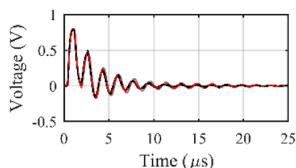

Fig. 6. Voltage waveforms calculated at the receiving ends of phases A (left) and C (right) considering a cable length of 100 m, soil resistivities (a) 200 Ωm and (b) 1000 Ωm and longitudinal excitation for a trefoil configuration.   
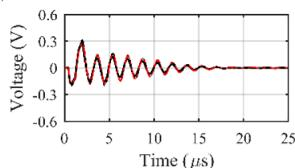  
FDTD $\mathbf { \boldsymbol { r } } _ { \mathrm { ~ g ~ } }$ Appoximation

underground cable models available in EMT-type simulators.

This paper is organized as follows. Section 2 presents the three-phase cable configurations considered in the analysis and introduces the simulated cases. The per-unit-length cable parameter calculation is presented in Section 3. The solution methods based on the full-wave FDTD method and the transmission line theory are described in brief

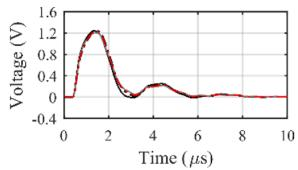

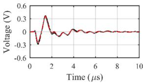

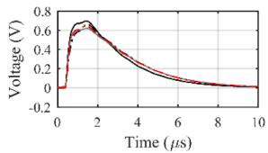  
(a)

(b)   
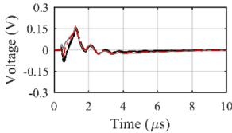  
-FDTD Papadopoulos et al. $\mathbf { \boldsymbol { r } } _ { \mathrm { ~ g ~ } }$ Approximation

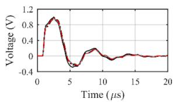  
Fig. 7. Voltage waveforms calculated at the receiving ends of phases A (left) and C (right) considering cable a length of 50 m, soil resistivities (a) 200 Ωm and (b) 1000 Ωm and lateral excitation for a horizontal configuration.

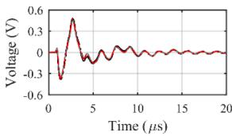  
(a)

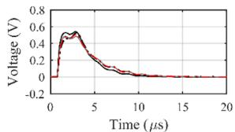

(b)   
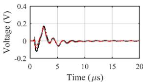  
-FDTD Papadopoulos et al.-..- Xuc et al.--- $\mathbf { \boldsymbol { r } } _ { \mathrm { ~ g ~ } }$ Approximation

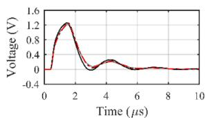  
Fig. 8. Voltage waveforms calculated at the receiving ends of phases A (left) and C (right) considering cable a length of 100 m, soil resistivities (a) 200 Ωm and (b) 1000 Ωm and lateral excitation for a horizontal configuration.

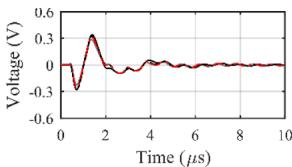

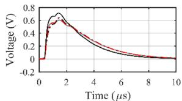

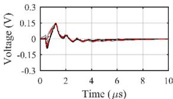  
FDTD $\mathbf { \boldsymbol { r } } _ { \mathrm { ~ g ~ } }$

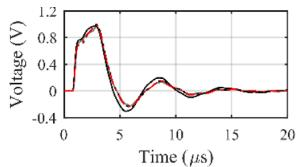  
Fig. 9. Voltage waveforms calculated at the receiving ends of phases A (left) and C (right) considering a cable length of 50 m, soil resistivities (a) 200 Ωm and (b) 1000 Ωm and lateral excitation for a trefoil configuration.

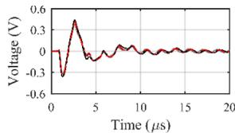

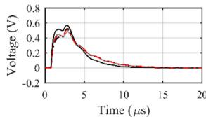

Fig. 10. Voltage waveforms calculated at the receiving ends of phases A (left) and C (right) considering a cable length of 100 m, soil resistivities (a) 200 Ωm and (b) 1000 Ωm and lateral excitation for a trefoil configuration.   
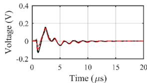  
-FDTD Papadopoulos et al.-.--Xuc et al.-.-.-YApproximation

(b)

in Section 4. Results and analysis are presented in Section 5, followed by conclusions in Section 6.

# 2. Simulated cases

To investigate the validity of the expressions of Papadopoulos et al. [5] and Xue et al. [13] for the calculation of ground-return admittance in the simulation of transients on multiconductor underground cable systems using transmission line theory, and to check the accuracy of the simplified expression proposed by Duarte et al. [14], the flat and trefoil configurations shown in Fig. 1 are considered [18]. To single out the influence of the ground-return parameters on the resulting transient waveforms, each cable was reduced to a solid core surrounded by a dielectric layer for simplicity. The extension of the results to more realistic internal cable structures is straightforward and can be performed with the formulation proposed in [19].

Each cable core has a radius a = 2.3 cm and a resistivity $\rho _ { c } = 1 . 7 \times$ $1 0 ^ { - 8 } \Omega \mathrm { m } ;$ the insulating layer has an external radius $b = 1 0$ cm and a dielectric constant , where $\varepsilon _ { r i n } = 3 . 5$ is the relative permittivity of the insulation and $\varepsilon _ { 0 } = 8 . 8 5 \times 1 0 ^ { - 1 2 }$ F/m is the vacuum permittivity; the burial depth is h = 1 m; the separation between adjacent cables is $x _ { i j } =$ 30 cm, and the total cable length l is varied from 50 m to 100 m to investigate short sections often found in renewable energy parks [20]. The soil has a conductivity $\sigma _ { 1 } , \mathrm { a }$ permittivity $\varepsilon _ { 1 } = \varepsilon _ { r 1 } \varepsilon _ { 0 } ,$ , and a permeability $\mu _ { 1 }$ , where $\varepsilon _ { r 1 } = 1 0$ and $\mu _ { 1 } = \mu _ { 0 } = 4 \pi \times 1 0 ^ { - 7 } \mathrm { H / m }$ . The air conductivity is $\sigma _ { 0 } = 0$ .

Two different types of excitations were considered, namely a longitudinal excitation with an ideal voltage source placed at the midpoint of the cable $( x = \ell / 2 ) ;$ , as shown in Fig. 2(a), and a lateral excitation with an ideal voltage source positioned at the sending end of the cable $( x =$ $^ { 0 ) , }$ as shown in Fig. 2(b). The longitudinal excitation was previously used in [17], following the scenario simulated by Theethayi et al. in [4]. It can represent, for example, the coupling of an external electromagnetic field with the cable [3]. The lateral excitation can represent the effect of a switching or lightning transient overvoltage.

# 3. Per-unit-length cable parameter calculation

For simulating the three-phase cable systems shown in Fig. 1 using the transmission line theory, the per-unit-length impedance Z and admittance Y matrices are calculated using (1) and (2), respectively,

$$
\mathbf {Z} = \mathbf {Z} _ {i} + \mathbf {Z} _ {e} + \mathbf {Z} _ {g} \tag {1}
$$

$$
\boldsymbol {Y} = j \omega \boldsymbol {P} ^ {- 1} \tag {2}
$$

where

$$
P = P _ {e} + P _ {g} \tag {3}
$$

Matrix Z in (1) is the sum of the internal impedance $\mathbf { Z } _ { i } ,$ , the external impedance ${ \bf Z } _ { e } = j \omega { \cal L } _ { \mathrm { ~ ~ } }$ , and the ground-return impedance $Z _ { g }$ [4]. The elements of the diagonal matrix $\mathbf { Z } _ { i }$ are given by [21]

$$
Z _ {i _ {i i}} = \frac {\rho_ {c} \sqrt {j \omega \mu_ {0} / \rho_ {c}}}{2 \pi a} \frac {I _ {0} \left(\sqrt {j \omega \mu_ {0} / \rho_ {c}} a\right)}{I _ {1} \left(\sqrt {j \omega \mu_ {0} / \rho_ {c}} a\right)} \tag {4}
$$

where $I _ { 0 }$ and are modified Bessel functions of the first kind. The elements of $\mathbf { Z } _ { e }$ , which is also diagonal, are given by [21]

$$
L _ {i i} = \frac {\mu_ {0}}{2 \pi} \ln \left(\frac {b}{a}\right) \tag {5}
$$

Finally, the elements of $\mathbf { Z } _ { g }$ are calculated with the expressions of Papadopoulos et al. [5], Xue et al. [13] or with Sunde’s equation [22].

In (2) and $( 3 ) , P$ is the potential coefficients matrix. It corresponds to the sum of the external diagonal matrix $P _ { e } { _ { i } }$ , whose elements are given by [4]

$$
P _ {e _ {i i}} = \frac {\ln (\frac {b}{a})}{2 \pi \varepsilon_ {i n}} \tag {6}
$$

and the ground-return potential coefficient matrix $P _ { g } { \mathrm { : } }$ whose elements are calculated with the expressions proposed by Papadopoulos et al. [5] or Xue et al. [13], or in terms of the ground-return admittance approximation $Y _ { \mathbf { g } }$ derived by Duarte et al. [14] from Vance’s formula [10] as

$$
\boldsymbol {P} _ {\mathrm {g}} = j \omega \boldsymbol {Y} _ {\mathrm {g}} ^ {- 1} \tag {7}
$$

$$
Y _ {g} = \gamma_ {g} ^ {2} Z _ {g} ^ {- 1} \tag {8}
$$

where $\mathbf { Z _ { g } }$ is given by Sunde’s expression [22] and $\eta _ { g } ^ { 2 }$ is a diagonal matrix whose elements are equal to $\gamma _ { g i i } ^ { ~ 2 } = j \omega \mu _ { 0 } [ \sigma _ { 1 } + j \omega \varepsilon _ { 1 } ]$ .

# 4. Solution methods

# 4.1. FDTD full-wave method

The modeling of each cable of Fig. 1 using the FDTD method is the same as in [17]. Each cable core is represented as a thin wire [23] with radius $a = 2 3$ mm embedded in a rectangular prism with cells of cross-sectional area of 0.1 m x 0.1 m, relative permittivity $\varepsilon _ { r i n } = 3 . 5$ , and permeability $\mu _ { 0 } ,$ whose electromagnetic properties correspond to those of the cable insulation. For the lateral excitation shown in Fig. 2(b), the reference terminal of the source was connected to a grounding rod, modeled as a vertical thin wire with a radius of 23 mm and a length of 5 m. This was necessary because in the simulations with the transmission line theory the lateral voltage source must be either referred to the remote earth potential or connected to a grounded element. However, to connect the negative terminal of the voltage source to a remote point with zero potential using the FDTD method, a long wire should be extended from the source terminal to the absorbing layer. Since this condition would interfere in the simulations and would be difficult to reproduce with the transmission line theory, the use of a grounding rod of finite length was seen as a compromise. In addition to being a more realistic condition, the grounding rod can be easily included in the transmission line theory modeling through its input impedance, which represents the voltage/current ratio in the frequency domain. The working volume is divided in Yee cells whose electromagnetic properties correspond to the air in the upper half-space, with zero conductivity,

vacuum permittivity, and vacuum permeability, and to the soil in the lower half-space. The working volume is surrounded by an absorbing boundary modeled with perfectly matched convolutional layers [24]. To reduce the computational burden, non-uniform cells are considered as in [17]. To simulate cable lengths of 50 m and $1 0 0 \mathrm { m } ,$ the working volumes are of 200 m x 380 m x 160 m and 400 m x 380 m x 160 m, respectively. The cable voltages are obtained by integrating the electric field along a linear path in the y direction from a point 188 m below the ground, where the electromagnetic fields are negligible in the investigated conditions, to the wire surface. The FDTD code was developed by the authors and implemented in MATLAB. It was validated in [17] for both bare and insulated underground conductors.

# 4.2. Transmission line theory solution

To simulate the cases shown in Fig. 2 using the transmission line theory, a technique based on the nodal admittance matrix Y is used. The nodal admittance matrix is determined by [21]

$$
\overline {{\mathbf {Y}}} = \left[ \begin{array}{l l} \mathbf {Y} _ {1 1} & \mathbf {Y} _ {1 2} \\ \mathbf {Y} _ {2 1} & \mathbf {Y} _ {2 2} \end{array} \right] \tag {9}
$$

where $Y _ { 1 1 } = \quad Y _ { 2 2 } = \quad Y _ { c } ( 1 + \quad A ^ { 2 } ) ( 1 - A ^ { 2 } ) ^ { - 1 } , \quad Y _ { 1 2 } = \quad Y _ { 2 1 } = \quad -$ $2 Y _ { c } \ A ( 1 - A ^ { 2 } ) ^ { - 1 }$ , 1 is the identity matrix, $Y _ { c } = \pmb { Z } ^ { - 1 } \sqrt { \pmb { Z } \pmb { Y } }$ and A = exp( − $\ell \sqrt { \mathbf { Z } Y } )$ . The nodal admittance matrix is obtained from the exact solution of telegrapher’s equations in the frequency-domain. It relates voltages V and currents I at the cable ends as

$$
\boldsymbol {I} = \overline {{\mathbf {Y}}} \boldsymbol {V} \tag {10}
$$

where, for a single cable segment, V and I are vectors, Y has size 2n $\times 2 n$ , and n is the number of conductors.

All the calculations are performed in the frequency-domain and the transient responses are obtained with the numerical Laplace transform [25]. In the simulations with excitation at the end of the cable, the frequency-dependent input impedance $Z _ { r o d } ( s )$ of the grounding rod, connected to the reference terminal of the excitation source as shown in Fig. 2(b), is first computed using an accurate electromagnetic model [26] in the frequency range from dc to 10 MHz. Then, a pole-residue model of the calculated $Z _ { r o d } ( s )$ of the form (11) is obtained using the vector fitting technique [27,28]. Finally, the grounding rod input impedance is included into the nodal admittance matrix through its fitted pole-residue model. In (11), k and p are, respectively, the residues and poles, N is the order of the approximation and D is a real scalar. In the Appendix, the values of the poles and residues of the grounding rod model, as well as their frequency responses, are presented.

$$
Z _ {r o d} (s = j \omega) = \sum_ {m = 1} ^ {N} \frac {k _ {i}}{s - p _ {i}} + D \tag {11}
$$

# 5. Results and analysis

Two sets of analyzes are carried out. The first considers the horizontal arrangement shown in Fig. 1(a) for longitudinal and lateral excitations as illustrated in Fig. 2. The second analysis involves the trefoil arrangement shown in Fig. 1(b) and the same excitations previously mentioned. In both cases, the applied voltage corresponds to a normalized impulse waveform with an amplitude of 1 V, a risetime of $0 . 2 \mu \mathrm { s } ,$ , and a time-to-half value of 1.83 µs. This waveform was chosen to cover a wide frequency range for a more consistent evaluation of the transmission line formulations. For the modeling of the voltage source, a single Heidler function

$$
v (t) = \left(V _ {0} / \eta\right) e ^ {- t / \tau_ {2}} \left\{\left(t / \tau_ {1}\right) ^ {n} / \left[ 1 + \left(t / \tau_ {1}\right) ^ {n} \right] \right\} \tag {12}
$$

with $V _ { 0 } / \eta = 1 . 3 9 \mathrm { V } , \tau _ { 1 } = 0 . 1 3 8 \mu \mathrm { s } , \tau _ { 2 } = 1 . 8 \mu \mathrm { s } ,$ , and n = 2 is considered.

Two different soil resistivities are assumed, namely 200 Ωm and 1000 Ωm. The latter corresponds to the upper limit recommended for the equations of Xue et al. [13], also used by Papadopoulos et al. [5]. The calculations were performed with either the full-wave FDTD method or the solution of the transmission line equations considering the expressions of Xue et al. [13] and Papadopoulos et al. [5], and the extension of Vance’s approximation proposed in [14] with Sunde’s formulation [22] for determining the ground-return parameters.

For the longitudinal excitation, the voltage source is inserted at the midpoint of phase A as shown in Fig. 2(a). The sending and receiving ends of phases A, B and C were both left open. The voltages were calculated at the receiving ends of phases A and C (nodes 4 and 6, respectively). The results are shown in Figs. 3–6 for total cable lengths of 50 m and 100 m.

For the lateral excitation, the voltage source is inserted between the grounding rod and the sending end of phase A (node 1), while the sending ends of the remaining cables and all receiving ends were left open. Once again, the voltages were calculated at the receiving ends of phases A and C (nodes 4 and 6, respectively) for total cable lengths of 50 m and 100 m. The obtained results are shown in Figs. 7–10.

The induced voltages at the receiving end of phase B were also calculated for the horizontal and trefoil configurations. Although not shown, the obtained results are similar to those presented for phase C and confirm the generality of the analyses performed with the formulations of Papadopoulos et al. [5], Xue et al. [13], and Duarte et al. [14].

As shown in Figs. 3–6, which refer to the longitudinal excitation, a good agreement is observed between the voltage waveforms calculated with the transmission line approach and the full-wave FDTD method regardless of the formulation considered for determining the groundreturn parameters. This demonstrates that, for this type of excitation, the transmission line theory is sufficiently accurate even for the simulation of short cable sections, for which in principle a transverse electromagnetic (TEM) field structure should not be strictly valid. This is possibly motivated by the symmetry of the problem, which favors the formation of a quasi-TEM structure. Interestingly, the good agreement between the different approaches is observed even for a poorly conducting soil with a1000-Ωm resistivity, and for the voltages induced in the neighboring cables. These results, which are for the first time available in the literature, demonstrate the accuracy of the proposed transmission line formulations for calculating the ground-return parameters of multiconductor underground cable systems, particularly the mutual coupling effects. They are also in line with the analysis presented [17], which was restricted to a single cable.

For the lateral excitation, whose results are shown in Figs. 7–10, the agreement between the calculated voltage waveforms is also generally good, although greater deviations are observed at early times between the transmission line theory and the full-wave FDTD method for the 1000-Ωm soil. Such deviations are more significant for the 50-m long cable, as shown in Figs. 7(b) and 9(b) for the horizontal and trefoil arrangements, respectively. This suggests that, for the lateral excitation, the combination of short cable lengths and high-resistivity soils creates a non-TEM field structure in which case the accuracy of the transmission line theory is slightly reduced [17]. Another possible source of inaccuracy in the lateral excitation case is the lack of electrical coupling between the vertical grounding rod and the cable in the simulations performed with the transmission line theory. In any case, the deviations observed for the lateral excitation are considered acceptable given the huge difference in the computer resources required for performing the simulations with the transmission line theory and the full-wave FDTD model. As an example, considering the scenario shown in Fig. 3(b), the simulation time for the full-wave FDTD method is of approximately 60 h, whereas the corresponding simulation with transmission line theory, including the evaluation of the improper integrals of the extended transmission line approaches [5,13], requires only few seconds in a computer with 128-GB memory and 2.9 GHz Intel Core I9–7920X processor. For the 200-Ωm soil, a good agreement between the calculated

voltage waveforms is noted in all scenarios, regardless of cable arrangement and length, which possibly stems from the fact that for low resistivity soils, the effect of the ground-return admittance is less significant [17].

A remarkable feature of the results shown in Figs. 3-10 is the good agreement verified between the curves calculated with the approach proposed by Duarte et al. in [14], which is based on the extension of Vance’s formula [10] to multiconductor cable systems, and the FDTD method, especially for the induced voltages. The major advantage of this approach is that, similarly as with the closed-form approximations proposed in [29], the calculation of the improper integrals required in the equations proposed by Xue et al. [13] and Papadopoulos et al. [5] for determining the ground-return impedance is completely avoided. Also, it must be noted that the performed validation is not restricted to 50-m or 100-m long cables. For longer cables, the frequency content is reduced, and an even better agreement is expected between the transmission line theory and the full-wave FDTD method.

# 6. Conclusions

A rigorous and independent validation of the extended transmission line approaches proposed by Papadopoulos et al. [5] and Xue et al. [13] for the transient analysis of multiconductor underground cable systems is presented in this paper. The validity of the closed-form approximation proposed by Duarte et al. [14] for calculating the ground-return admittance of underground cable arrangements is also shown.

It is demonstrated that both methodologies lead to voltage waveforms in good agreement with those predicted by a rigorous full-wave FDTD model for different types of excitations and arrangements, short cable lengths of 50 m and 100 m, and soil resistivities of up to 1000 Ωm. This agreement is expected to be even further if the proximity effect is included. It is also demonstrated that the approximation proposed by Duarte et al. [14] is sufficiently accurate for characterizing the ground-return admittance of underground cable systems.

By generalizing the conclusions drawn in [17] for a single dielectric-coated cable, the obtained results show that the transmission line theory can be used to simulate transients on underground cable systems with an accuracy that is at least comparable to that of a full-wave FDTD model, with the advantage of presenting much greater computational efficiency and of being more easily implemented in EMT-like simulation programs for the simulation of complex electrical systems.

# CRediT authorship contribution statement

Naiara Duarte: Conceptualization, Methodology, Software, Validation, Formal analysis, Investigation, Writing – original draft, Writing – review & editing, Visualization. Alberto De Conti: Conceptualization, Methodology, Formal analysis, Investigation, Writing – original draft, Writing – review & editing, Visualization, Supervision. Rafael Alipio: Conceptualization, Methodology, Validation, Formal analysis, Investigation, Writing – review & editing, Supervision. Farhad Rachidi: Formal analysis, Writing – review & editing, Supervision.

# Declaration of Competing Interest

The authors declare that they have no known competing financial interests or personal relationships that could have appeared to influence the work reported in this paper.

# Data availability

The authors are unable or have chosen not to specify which data has been used.

# Acknowledgment

This work was supported in part by Conselho Nacional de Desenvolvimento Científico e Tecnologico ´ (CNPq) under Grants 306006/ 2019–7, 314849/2021–1 and 406177/2021–0, in part by Fundaçao ˜ de Amparo a ` Pesquisa do Estado de Minas Gerais (FAPEMIG) under Grants TEC-PPM-00280–17 and APQ-01081–21, in part by Federal Commission for Scholarships for Foreign Students for the Swiss Government Excellence Scholarship (ESKAS No. 2022 0.0099), and in part by Swiss National Science Foundation (SNSF) under Grant TMPFP2_209700.

# Appendix

The poles and residues of the grounding rod model used in the simulations with a lateral excitation are presented in Table 1 for soil resistivities of 200 Ωm and 1000 Ωm, respectively. The corresponding grounding impedances are shown in Fig. 11.

Table 1 Rational model of the grounding rod.   

<table><tr><td rowspan="2">N</td><td colspan="2">200 Ωm</td><td colspan="2">1000 Ωm</td></tr><tr><td>pi</td><td>ki</td><td>pi</td><td>ki</td></tr><tr><td>1</td><td>-7.3003 × 104</td><td>5.5391 × 104</td><td>-7.0563 × 105</td><td>3.9665 × 106</td></tr><tr><td>2</td><td>-1.0001 × 106</td><td>5.5391 × 106</td><td>-1.1014 × 107</td><td>2.0393 × 109</td></tr><tr><td>3</td><td>-6.2766 × 106</td><td>1.7528 × 107</td><td>-1.7410 × 108</td><td>-2.2391 × 1010</td></tr><tr><td>4</td><td>-2.6299 × 107</td><td>7.1241 × 108+</td><td>-9.6987 × 106+</td><td>1.7663 × 109+</td></tr><tr><td></td><td>+ j4.0852 × 107</td><td>j7.1241 × 108</td><td>j7.1241 × 107</td><td>j3.6174 × 107</td></tr><tr><td>5</td><td>-2.6299 × 107</td><td>5.9170 × 108-</td><td>-9.6987 × 106-</td><td>1.7663 × 109-</td></tr><tr><td></td><td>-j4.0852 × 107</td><td>j7.1241 × 108</td><td>j5.3780 × 107</td><td>j3.6174 × 107</td></tr></table>

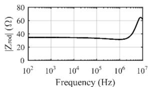  
(a)

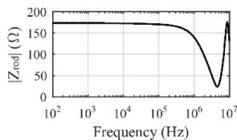  
(b)   
Fig. 11. Grounding rod impedance for (a) 200 Ωm and (b) 1000 Ωm soil resistivities.

# References

[1] N. Theethayi, R. Thottappillil, M. Paolone, C. Nucci, F. Rachidi, External impedance and admittance of buried horizontal wires for transient studies using transmission line analysis, IEEE Trans. Dielectr. Electr. Insul. 14 (3) (Jun. 2007) 751–761, https://doi.org/10.1109/TDEI.2007.369540.   
[2] N. Theethayi, Ph.D. Thesis, Uppsala University, 2005.   
[3] E. Petrache, F. Rachidi, M. Paolone, C.A. Nucci, V. Rakov, M. Uman, Lightning induced disturbances in buried cables—part I: theory, IEEE Trans. Electromagn. Compat. 47 (3) (Aug. 2005) 498–508, https://doi.org/10.1109/ TEMC.2005.853161.   
[4] N. Theethayi, Y. Baba, F. Rachidi, R. Thottappillil, On the choice between transmission line equations and full-wave Maxwell’s equations for transient analysis of buried wires, IEEE Trans. Electromagn. Compat. 50 (2) (May 2008) 347-357,https://doi.0rg/10.1109/TEMC.2008.919040.   
[5] T.A. Papadopoulos, D.A. Tsiamitros, G.K. Papagiannis, Impedances and admittances of underground cables for the homogeneous earth case, IEEE Trans.

Power Deliv. 25 (2) (Apr. 2010) 961–969, https://doi.org/10.1109/ TPWRD.2009.2034797.   
[6] H.W. Dommel, Electromagnetic Transients Program Reference manual: EMTP Theory Book, BPA, Portland, OR, USA, 1986.   
[7] R. Alipio, H. Xue, A. Ametani, An accurate analysis of lightning overvoltages in mixed overhead-cable lines, Electr. Power Syst. Res. 194 (May 2021), 107052, https://doi.org/10.1016/j.epsr.2021.107052.   
[8] R. Alipio, A. De Conti, N. Duarte, M.T. Correia de Barros, Bare versus insulated conductors for improving the lightning response of interconnected wind turbine grounding systems, Electr. Power Syst. Res. 197 (Aug. 2021), 107320, https://doi. org/10.1016/j.epsr.2021.107320.   
[9] J.R. Wait, Electromagnetic wave propagation along a buried insulated wire, Can. J. Phys. 50 (20) (Oct. 1972) 2402–2409, https://doi.org/10.1139/p72-318.   
[10] E.F. Vance, Coupling to Shielded Cables, Wiley, 1978.   
[11] G.E. Bridges, Transient plane wave coupling to bare and insulated cables buried in a lossy half-space, IEEE Trans. Electromagn. Compat. 37 (1) (1995) 62–70.   
[12] A.P.C. Magalhaes, M.T.C. de Barros, A.C.S. Lima, Earth return admittance effect on underground cable system modeling, IEEE Trans. Power Deliv. 33 (2) (Apr. 2018) 662–670, https://doi.org/10.1109/TPWRD.2017.2741600.   
[13] H. Xue, A. Ametani, J. Mahseredjian, I. Kocar, Generalized formulation of earthreturn impedance/admittance and surge analysis on underground cables, IEEE Trans. Power Deliv. 33 (6) (Dec. 2018) 2654–2663, https://doi.org/10.1109/ TPWRD.2018.2796089.   
[14] N. Duarte, A. De Conti, R. Alipio, Extension of Vance’s closed-form approximation to calculate the ground admittance of multiconductor underground cable systems, Electr. Power Syst. Res. 196 (Jul. 2021), 107252, https://doi.org/10.1016/j. epsr.2021.107252.   
[15] H. Xue, A. Ametani, K. Yamamoto, Theoretical and NEC calculations of electromagnetic fields generated from a multi-phase underground cable, IEEE Trans. Power Deliv. 36 (3) (Jun. 2021) 1270–1280, https://doi.org/10.1109/ TPWRD.2020.3005521.   
[16] H. Xue, A. Ametani, K. Yamamoto, A study on external electromagnetic characteristics of underground cables with consideration of terminations, IEEE Trans. Power Deliv. 36 (5) (Oct. 2021) 3255–3265, https://doi.org/10.1109/ TPWRD.2020.3037335.   
[17] N.F. Duarte, A. De Conti, R. Alipio, Assessment of ground-return impedance and admittance equations for the transient analysis of underground cables using a fullwave FDTD method, IEEE Trans. Power Deliv. (2021), https://doi.org/10.1109/ TPWRD.2021.3131415, 1–1.   
[18] CIGRE WG B1.07, Statistics of AC underground cables in power networks, Tech. Brochure 338. December 2007.   
[19] A. Ametani, A general formulation of impedance and admittance of cables, IEEE Trans. Power App. Syst. PAS-99 (3) (1980) 902–910.   
[20] IEC 61400: Wind energy generation systems – Part 24: lightning protection. 2019.   
[21] J.A. Martinez-Velasco, Power System Transients: Parameter Determination, CRC Press, 2010.   
[22] E.D. Sunde, Earth Conduction Effects in Transmission Systems, Dover Publications, New York, 1968.   
[23] Y. Baba, N. Nagaoka, A. Ametani, Modeling of thin wires in a lossy medium for FDTD simulations, IEEE Trans. Electromagn. Compat. 47 (1) (Feb. 2005) 54–60, https://doi.org/10.1109/TEMC.2004.842115.   
[24] J.A. Roden, S.D. Gedney, Convolution PML (CPML): an efficient FDTD implementation of the CFS-PML for arbitrary media, Microw. Opt. Technol. Lett. 27 (5) (Dec. 2000) 334–339, https://doi.org/10.1002/1098-2760(20001205)27: 5<334::AID− MOP14>3.0.CO;2-A.   
[25] P. Moreno, A. Ramirez, Implementation of the numerical Laplace transform: a review task force on frequency domain methods for EMT studies, working group on modeling and analysis of system transients using digital simulation, general systems subcommittee, IEEE power engineering, IEEE Trans. Power Deliv. 23 (4) (Oct. 2008) 2599–2609, https://doi.org/10.1109/TPWRD.2008.923404.   
[26] S. Visacro, A. Soares, HEM: a model for simulation of lightning-related engineering problems, IEEE Trans. Power Deliv. 20 (2) (Apr. 2005) 1206–1208, https://doi. org/10.1109/TPWRD.2004.839743.   
[27] B. Gustavsen, A. Semlyen, Rational approximation of frequency domain responses by vector fitting, IEEE Trans. Power Deliv. 14 (3) (Jul. 1999) 1052–1061, https:// doi.org/10.1109/61.772353.   
[28] A. De Conti, R. Alipio, Single-port equivalent circuit representation of grounding systems based on impedance fitting, IEEE Trans. Electromagn. Compat. 61 (5) (Oct. 2019) 1683–1685, https://doi.org/10.1109/TEMC.2018.2870730.   
[29] A. De Conti, N. Duarte, and R. Alipio, “Closed-form expressions for the calculation of the ground-return impedance and admittance of underground cables,” paper submitted to IEEE Transactions on Power Delivery, pp. 1–8, 2023.