# A waveform-dependence lightning impulse corona model in PSCAD/EMTDC for investigating surge propagation on transmission lines

Yudong Jiang, Fuchang Lin, Hua Li ∗

School of Electrical and Electronic Engineering, Huazhong University of Science and Technology, 1037 Luoyu Road, Wuhan, 430074, Hubei, China

# A R T I C L E I N F O

Keywords:

Corona

Waveform-dependence

Critical volume method

Lightning impulse

Electromagnetic transient program

# A B S T R A C T

This paper proposes a waveform-dependence lightning impulse corona model and develops it in PSCAD/EMTDC. The model computes corona initiation delay time by the critical volume method and considers the ionization relaxation process in corona space charge generation. Thus, the model can calculate corona capacitance and charge caused by the various waveform lightning impulses. A simple algorithm is proposed to avoid iteration in the solution process to apply the model to electromagnetic transient program for lightning overvoltage analysis. The accuracy of the model is verified by comparing the simulation results with measurement results available in the literature. Based on this model, we investigate the effect of the waveform on the attenuation and deformation of lightning impulse propagation on transmission lines. The results indicate that as the propagation distance increases, the attenuation rate of the voltage peak gradually slows down, and the front time linearly increases with distance. As the front and tail time decreases, the attenuation and deformation of lightning impulses caused by corona become more severe.

# 1. Introduction

Corona is a primary source of attenuation and deformation of lightning surge propagation on transmission lines [1–4]. The dissipation of energy caused by the corona reduces the amplitude and front time of lightning surges, which are essential parameters for the insulation coordination of substations [5]. Therefore, accurately evaluating the corona effect on the lightning surge is crucial for the lightning protection design of electrical equipment.

When the electric field near the conductor’s surface exceeds the critical value, corona discharge occurs, and air ionization generates space charges in the vicinity of the conductor [6–9]. Thus, the corona effect is equivalent to an increase in the capacitance of the transmission line and is usually simulated by the capacitance in transient analysis. The corona capacitance calculation has been widely studied. Some researchers have proposed several mathematical functions of corona capacitance to approximate the experimental charge–voltage (??-?? ) curves [10,11]. However, these approaches require experimental results from field tests, which are always challenging. Tai et al. proposed a simplified mathematical, physical model to calculate corona space charge and capacitance based on the assumption of the distribution of corona space charge, which has the advantage of applying to lines without experimental results [12]. To reproduce the experimental ??- ?? curves for various waveform lightning impulses, Li et al. proposed it is necessary to consider the time delay in corona formation [13].

However, in this model, the value of the delay time is a constant, which contradicts the phenomenon that the corona initiation delay is related to the waveform [14,15]. Correia et al. believe that the corona discharge’s streamer development and ionization process should also be considered to obtain the waveform-dependence of the lightning impulse corona [16].

In addition, although electromagnetic transient programs are widely used for transient simulation of lightning overvoltage due to their robust line models and excellent accuracy, it is difficult to establish the corona model in electromagnetic transient programs due to the nonlinearity of corona capacitance. Motoyama et al. simulate the nonlinearity of corona capacitors through three parallel linear capacitances [17]. Anane et al. proposed that a nonlinear corona capacitor model can be developed using the type-94 component in ATP-EMTP, but this requires many iterations in the program and does not apply to other electromagnetic transient programs [18,19]. Pereira and Tavares developed a voltage-dependent line model under the corona effect in Matlab software. However, the line model cannot be modified in most electromagnetic transient programs [20,21].

This paper proposes a waveform-dependence lightning impulse corona model and develops it in PSCAD/EMTDC by a simple algorithm to investigate the effect of the waveform on the attenuation and deformation of lightning impulse propagation on transmission lines

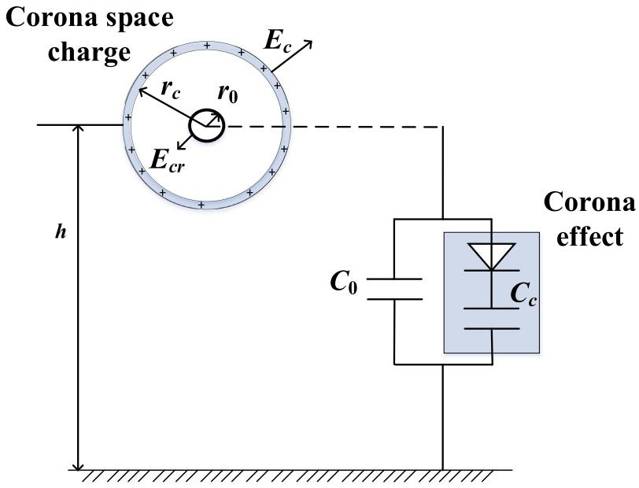  
Fig. 1. The two-dimensional distribution of corona space charges and corona branch.

caused by corona. The model can be applied to the lightning surge of various waveforms by considering the corona initiation delay time and the ionization relaxation process in corona space charge generation.

# 2. Corona model

# 2.1. Lightning impulse corona inception voltage

When the electric field on a conductor surface reaches the minimum corona inception field $E _ { \mathrm { m i n } } ,$ a delay time is required to produce a seed electron and start the corona discharge. This delay time is statistically distributed and cannot be ignored under impulse voltage [22].

The probability $P \left( t \right)$ of having at least one impulse corona inception within time ?? is given as

$$
P (t) = 1 - \exp \left[ - \int_ {t _ {0}} ^ {t} R (t) d t \right] \tag {1}
$$

where $t _ { 0 }$ is the moment when the conductor surface electric field reaches the minimum corona inception field $E _ { \operatorname* { m i n } } , \ R \left( t \right)$ is the rate of electron detachment which can be expressed as

$$
R (t) = \int_ {V _ {c r} (t)} \frac {n ^ {-}}{\tau_ {d} (r , t)} d r \tag {2}
$$

where $V _ { c r } \left( t \right)$ is the critical volume, $n ^ { - }$ is the negative ion density, and $\tau _ { d } \left( r , t \right)$ is the mean negative ion lifetime. $\tau _ { d ( r , t ) }$ varies with the electric field ?? and can be expressed as [23,24]

$$
\tau_ {d} (r, t) = A \exp \left(\frac {B}{E (r , t)}\right) \tag {3}
$$

where ?? and ?? are related to absolute humidity ??

Based on the definition of critical avalanche growth, the inner boundary $r _ { i n }$ of the $V _ { c r } \left( t \right)$ can be obtained by the following expression

$$
\exp \left[ \int_ {r _ {0}} ^ {r _ {i n (t)}} \lambda (r, t) d r \right] = N _ {c r} \tag {4}
$$

where $r _ { 0 }$ is the conductor radius, ?????? is the critical avalanche number, and ?? is the ionization coefficient, which can be estimated by absolute humidity [24]. The outer boundary $r _ { o u t }$ of the $V _ { c t }$ ?? (??) can be calculated by $\lambda = 0 .$ . The minimum corona inception field $E _ { \mathrm { m i n } }$ can be calculated by the Peek formula [25]

$$
E _ {\min } = 3 1 m \delta \left(1 + \frac {0 . 3 0 8}{\sqrt {\delta r _ {0}}}\right) \tag {5}
$$

where ?? is the roughness factor of the conductor surface and ?? is the relative density.

For universality, this paper uses the lightning impulse corona initial voltage of the conductor when the probability of corona initiation is 50%.

The relationship between the impulse corona inception field $E _ { c r }$ and the initial voltage $U _ { c r }$ for the conductor-above-ground configuration can be expressed as [26]

$$
U _ {c r} = E _ {c r} r _ {0} \left(\frac {2 h - r _ {0}}{2 h}\right) \ln \left(\frac {2 h - r _ {0}}{r _ {0}}\right) \tag {6}
$$

where ℎ is the conductor height.

For the coaxial configuration, the following formula is used [15]

$$
U _ {c r} = E _ {c r} r _ {0} \ln \frac {r _ {b}}{r _ {0}} \tag {7}
$$

where $r _ { 0 }$ and $r _ { b }$ are inner and outer radius of the coaxial cylindrical conductors.

# 2.2. Lightning impulse corona capacitance

Fig. 1 shows the two-dimensional distribution of corona space charges, all deposited on an outer thin shell. The electric field on a conductor surface maintains a constant impulse corona inception field $E _ { c r } .$ . The field at the outer thin shell takes the value of $E _ { c } ,$ , which is $1 . 8 \times 1 0 ^ { 6 } \ \mathrm { V / m }$ for negative polarity corona and $4 \times 1 0 ^ { 5 } \ \mathrm { V / m }$ for positive [12]. The corona effect can be simulated by parallel corona branches, including corona capacitance $C _ { c }$ and diode. Corona capacitance represents the effective capacitance corresponding to the increase of corona space charge, and the diode causes the corona branch to disconnect when the conductor voltage drops.

When the conductor voltage ?? is known, the corona radius $r _ { c }$ for two configurations can be obtained by solving the two following expressions based on the Newton–Raphson method.

For the conductor-above-ground configuration [26]:

$$
\begin{array}{l} U (t) = r _ {0} \left[ E _ {c r} - \frac {E _ {c} r _ {c} (t) (2 h - r _ {c} (t))}{2 h (2 h - r _ {0})} \right] \ln \left[ \frac {r _ {c} (t)}{r _ {0}} \right] + \tag {8} \\ E _ {c} r _ {c} (t) \left[ \frac {2 h - r _ {c} (t)}{2 h} \right] \ln \left[ \frac {2 h - r _ {0}}{r _ {c} (t)} \right] \\ \end{array}
$$

For the coaxial configuration [12]:

$$
U (t) = E _ {c r} r _ {0} \ln \left(\frac {r _ {c}}{r _ {0}}\right) + E _ {c} r _ {c} \ln \left(\frac {r _ {b}}{r _ {c}}\right) \tag {9}
$$

The steady-state linear density of space charge $Q _ { c \_ s t e a d y }$ is given by

$$
Q _ {c, \text {s t e a d y}} (t) = 2 \pi \varepsilon_ {0} E _ {c} r _ {c} (t) - Q _ {0} (t) \tag {10}
$$

where $\varepsilon _ { 0 }$ is the air permittivity and $Q _ { 0 }$ is the linear density of charge at the conductor; the latter can be expressed as Eq. (11) for the conductor above-ground configuration and as Eq. (12) for the coaxial configuration respectively:

$$
Q _ {0} (t) = \frac {2 \pi \varepsilon_ {0} U (t)}{\ln \left(\frac {2 h - r _ {0}}{r _ {0}}\right)} \tag {11}
$$

$$
Q _ {0} (t) = \frac {2 \pi \varepsilon_ {0} U (t)}{\ln \left(\frac {r _ {b}}{r _ {0}}\right)} \tag {12}
$$

Considering the ionization relaxation process, the corona linear density of space charge $Q _ { c }$ under impulse can be expressed as

$$
Q _ {c} (t) = Q _ {c - \text {s t e a d y}} (t) - \left[ Q _ {c - \text {s t e a d y}} (t) - Q _ {c} (t - \Delta t) \right] e ^ {\frac {- \Delta t}{\tau_ {i}}}. \tag {13}
$$

where ???? is the simulation step size, $\tau _ { i }$ is the ionization relaxation time which can be calculated by

$$
\tau_ {i} = \frac {\varepsilon_ {0}}{\sigma_ {c}} \tag {14}
$$

where $\sigma _ { c }$ is the conductivity of the ionization region, which is 15μS/m

Then, corona capacitance $C _ { c }$ is given by

$$
C _ {c} (t) = \frac {Q _ {c} (t) - Q _ {c} (t - \Delta t)}{U (t) - U (t - \Delta t)} \tag {15}
$$

# 3. Algorithm

As shown in Fig. 2, ?? and ?? are the nodes at both ends of $C _ { c } ( t ) ,$ , $i _ { k m } ( t )$ is the current flowing from node ?? to node $m ,$ and $U _ { k m ( t ) }$ is the voltage between the two ends of $C _ { c } ( t )$ . The relationship between $U _ { k m ( t ) }$ and $i _ { k m } ( t )$ can be represented by

$$
U _ {k m} (t) = U _ {k m} (t - \Delta t) + \int_ {t - \Delta t} ^ {t} \frac {i _ {k m} (t)}{C _ {c} (t)} d t \tag {16}
$$

By trapezoidal integration method, Eq. (16) can be rewritten as

$$
U _ {k m} (t) - U _ {k m} (t - \Delta t) = \frac {\Delta t}{2} \left[ \frac {i _ {k m} (t)}{C _ {c} (t)} + \frac {i _ {k m} (t - \Delta t)}{C _ {c} (t - \Delta t)} \right] \tag {17}
$$

By substitution, Eq. (17) can be easily rewritten as

$$
i _ {k m} (t) = \frac {2 C _ {c} (t)}{\Delta t} U _ {k m} (t) + I _ {c} (t - \Delta t) \tag {18}
$$

$$
I _ {c} (t - \Delta t) = - \frac {2 C _ {c} (t)}{\Delta t} U _ {k m} (t - \Delta t) - \frac {C _ {c} (t)}{C _ {c} (t - \Delta t)} i _ {k m} (t - \Delta t) \tag {19}
$$

where $i _ { k m } \left( t - \Delta t \right)$ in Eq. (19) can be obtained by changing ?? in Eq. (18) to $( t - \Delta t )$ ). Then

$$
\left\{ \begin{array}{l} i _ {k m} (t) = \frac {2 C _ {c} (t)}{\Delta t} U _ {k m} (t) + I _ {c} (t - \Delta t) \\ I _ {c} (t - \Delta t) = - \frac {4 C _ {c} (t)}{\Delta t} U _ {k m} (t - \Delta t) - \frac {C _ {c} (t)}{C _ {c} (t - \Delta t)} I _ {c} (t - 2 \Delta t) \end{array} \right. \tag {20}
$$

Through Eq. (20), a transient equivalent circuit of corona capacitance composed of current source and resistance can be established as shown in Fig. 2. $R _ { c } ( t )$ is given by

$$
R _ {c} (t) = \frac {\Delta t}{2 C _ {c} (t)} \tag {21}
$$

In EMT-type programs, the node voltages of the equivalent network are treated as an unknown quantity and solved by the nodal equations. However, it can be seen from Fig. 2 that the electromagnetic transient equivalent network of the corona capacitance is dependent on its voltage, which is unknown before the network is solved. Therefore, when calculating electromagnetic transient equivalent networks containing corona capacitance, the calculation process inevitably requires iteration, affecting the speed and stability. For the research on the lightning

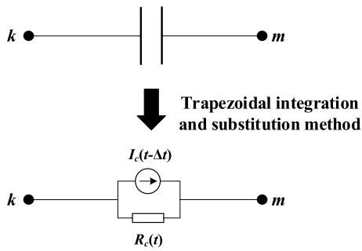  
Fig. 2. Equivalent network of corona capacitance.

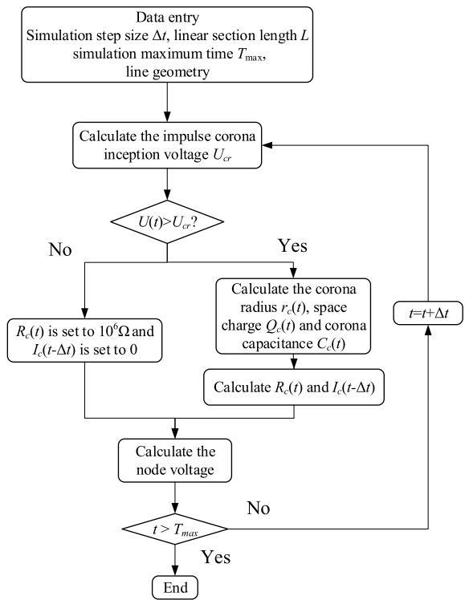  
Fig. 3. Equivalent network containing corona capacitance calculation flowchart.

surges, the corona capacitance $C _ { c } ( t )$ at time ?? can be approximately equal to $C _ { c } ( t - \Delta t )$ due to the small simulation step size. So that the resistance and current source values in the equivalent network of the corona capacitance in Fig. 2 can be replaced by $R _ { c } ( t - \Delta t )$ and $I _ { c } ( t { - } 2 \Delta t )$ .

The solving procedure of an equivalent network containing corona capacitance in PSCAD/EMTDC is described in the flow chart shown in Fig. 3. When the conductor voltage does not reach the impulse corona inception voltage, $R _ { c } ( t )$ is set to $1 0 ^ { 6 } \ \Omega ,$ , which is equivalent to disconnecting corona branch. The transmission line is subdivided into linear sections, and the shunt corona branch is placed at each junction node. The linear section length ?? is 15 m, and the simulation step size ???? is $1 0 ^ { - 9 }$ s.

# 4. Results

# 4.1. Verification

Fig. 4 shows the $Q – V$ curve from calculated results based on the waveform-related impulse corona model. The delay time increases the corona inception voltage, which reduces the corona charge and capacitance. The ionization relaxation process slows down the rate of initial corona charge increase and slightly reduces the maximum corona charge.

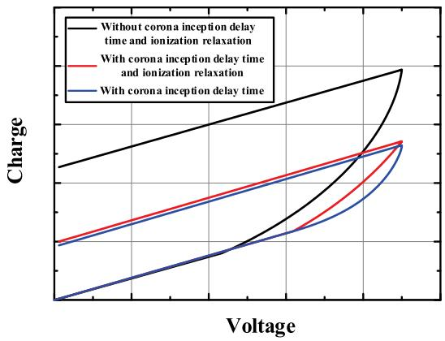  
Fig. 4. The effect of corona initiation delay time and ionization relaxation.

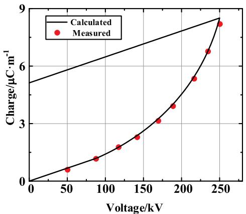  
Fig. 5. Comparison between measured and calculated ??-?? curves for the coaxial configuration.

For the coaxial configuration, the impulse voltage of 250 kV and 120/2200 μs is applied to the conductor. The inner and outer radii of the coaxial cylindrical conductors are 0.475 and 29.05 cm, respectively. Fig. 5 shows excellent agreement between the model results and the measured results reported in Ref. [12].

For the conductor-above-ground configuration, the impulse voltage of 2.5/60 μs is applied to the conductor. The conductor radius is 1.524 cm, the height was calculated from the radius, and the geometric capacitance value was obtained from the measured $Q – V$ curves. Fig. 6 shows the satisfactory consistency between the calculated and measured results under various peak voltages; the measured results were reported in Ref. [25]. In addition, as shown in Fig. 6, the corona inception voltage increases with the peak of impulse voltage. The discrepancy between the calculated and the measured results may be due to the statistical distribution of delay time, which disperses the corona initiation voltage.

As shown in Fig. 7, Wagner applied the impulse voltage of 1.28 MV peak value and $1 . 3 / 6 . 2 ~ \mu \mathrm { s }$ to the sending end of the steel-reinforced aluminum (ACSR) conductor with a radius of 2.54 cm and an average height of 18.89 m [27]. The end of the line is equipped with a matching resistor to simulate an infinite-length line without reflection. The voltage waveform is measured along the line through a voltage divider.

The simulation and measured results are shown in Fig. 8, showing good consistency. The attenuation of positive polarity surge propagation on the transmission line caused by corona is more significant than negative.

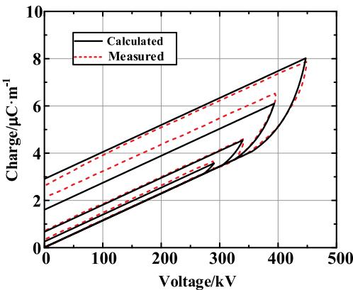  
Fig. 6. Comparison between measured and calculated $Q { \cdot } V$ curves for the conductor-above-ground configuration.

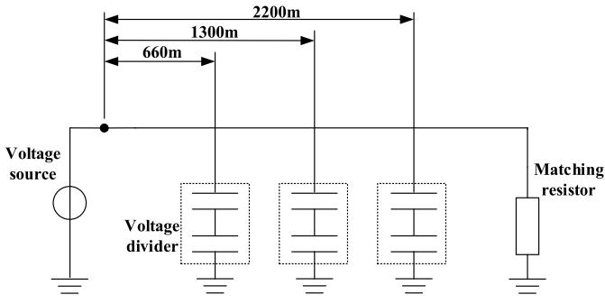  
Fig. 7. Test layout.

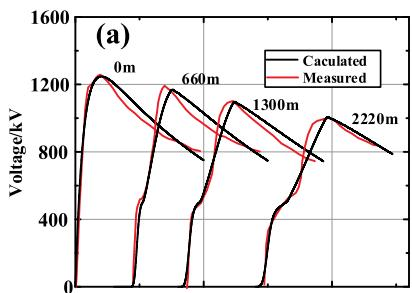

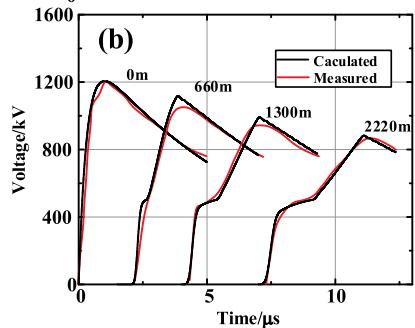  
Fig. 8. Comparison between measured and calculated surge propagation. (a) Negative polarity. (b) Positive polarity.

# 4.2. Effect of the waveform

To investigate the effect of the voltage surge waveform on the attenuation by corona, we apply impulse voltage of 3.83/75, 0.43/40, and 3.83/40 μs to the typical 110 kV single-circuit AC transmission line shown in Fig. 9 with the conductor LGJ-150. The overhead transmission line is simulated by Frequency Dependent (Phase) which is a distributed

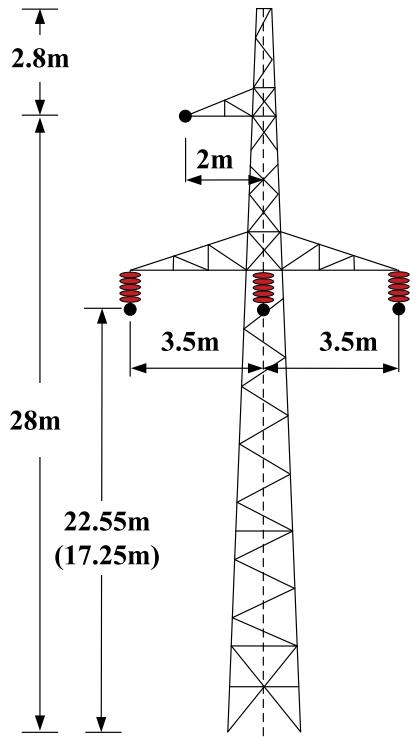

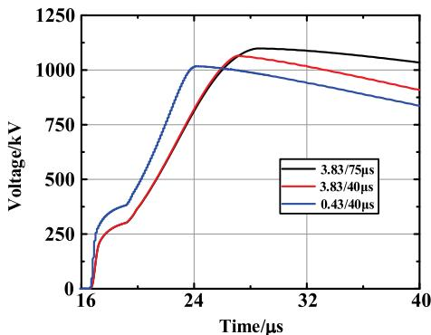  
Fig. 9. Tower configuration of 110 kV transmission line, with brackets indicating the central height of the span.   
Fig. 10. Attenuation and deformation of surges under different waveforms.

parameters model and can represent with good accuracy the frequencydependence of line parameters model [28]. The soil resistivity is 100 Ω m.

Among the three surge waveforms, 3.83/75 and 0.43/40 μs are typical waveforms for the first and subsequent lightning current strike. The peak value of impulse voltage is set to 1200 kV, the typical critical flashover voltage of the 110 kV line, and the polarity is negative.

The waveform of lightning surge propagating 5 km on the transmission line is shown in Fig. 10. Although higher corona initiation voltage reduces corona capacitance, reducing the front time leads to a more significant attenuation of lightning surge propagation on transmission lines due to the earlier time to disconnect the corona branch. In addition, the shorter tail time of the surge also results in the earlier time without corona space charge generation and corona branch disconnecting, which means more obvious attenuation. Therefore, the impulse voltage of 0.43/40 μs has the maximum attenuation. The attenuation speed of lightning surge caused by subsequent return strikes is higher than the first.

Fig. 11 shows the variation of the surge’s peak value and front time with propagation distance. It can be seen that the voltage peak

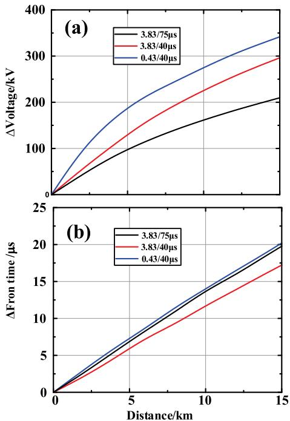  
Fig. 11. The lightning surge peak value and front time vary with distance under different waveforms.

attenuation increases with lower front and tail time. This is because corona space charges stopped being generated at an earlier time. As distance increases, the speed of lightning surge peak value attenuation gradually decreases. For the deformation of the front of the surge caused by the corona, reducing both the front and tail time increases the deformation, but the effect of reducing the tail time is more significant. The front time rises linearly with distance during the lightning impulse propagating on the transmission line. When the propagation distance is 15 km and the peak value is 1200 kV, the impulse voltage of 3.83/75, 0.43/40, and 3.83/40 μs are attenuated by 209.2, 341.2, and 296.3 kV, respectively. And the front time increases 19.7, 20.2, and 17.2 μs, respectively.

# 5. Conclusion

In summary, a waveform-dependence lightning impulse corona model with corona inception delay time and ionization relaxation is proposed in this paper. The model is used to investigate the attenuation and deformation of surge propagation on transmission lines caused by corona under different waveform impulse voltages by developing it in PSCAD/EMTDC utilizing a simple algorithm. The corona initial delay causes a higher corona initiation voltage for impulse surges with higher steepness, reducing corona charge and capacitance. The ionization relaxation process slows down the rate of initial corona charge increase and slightly reduces the maximum corona charge. The model is validated by comparing its results with the ??-?? curves and impulse voltage along the transmission line measured in the literature.

For the attenuation of the voltage peak caused by the corona, although lowering the front time increases the corona initiation voltage and reduces the corona charge, similar to reducing the tail time, the voltage peak attenuation still increases due to the earlier time without corona space charge generation. The rate of voltage peak attenuation gradually decreases with the increase in propagation distance of the lightning impulse propagation on the transmission line. For the deformation of the front of the surge caused by the corona, reducing both the front and tail time increases the deformation, but the effect of reducing the tail time is more significant. The front time rises linearly with

distance during the lightning impulse propagating on the transmission line. When the propagation distance is 15 km and the peak value is 1200 kV, the impulse voltage of 3.83/75, 0.43/40, and 3.83/40 μs are attenuated by 209.2, 341.2, and 296.3 kV, respectively. And the front time increases 19.7, 20.2, and 17.2 μs, respectively.

# CRediT authorship contribution statement

Yudong Jiang: Writing – review & editing, Writing – original draft, Visualization, Validation, Supervision, Software, Resources, Project administration, Methodology, Investigation, Data curation, Conceptualization. Fuchang Lin: Funding acquisition, Formal analysis, Data curation, Conceptualization. Hua Li: Investigation, Funding acquisition, Formal analysis, Data curation, Conceptualization.

# Declaration of competing interest

The authors declare that they have no known competing financial interests or personal relationships that could have appeared to influence the work reported in this paper.

# Data availability

Data will be made available on request.

# References

[1] C.F. Wagner, B.L. Lloyd, Effects of corona on traveling waves, Electr. Eng. 74 (12) (1955) 1071.   
[2] Jinliang He, Xiao Zhang, Pengcheng Yang, Shuiming Chen, Rong Zeng, Attenuation and deformation characteristics of lightning impulse corona traveling along bundled transmission lines, Electr. Power Syst. Res. 118 (2015) 29–36.   
[3] Fengnyu Xiao, Bo Zhang, Transient overvoltage on HVDC overhead transmission lines with background DC space charges and impulse corona, IEEE Trans. Power Deliv. 36 (5) (2020) 2921–2928.   
[4] Tran Huu Thang, Yoshihiro Baba, Naoto Nagaoka, Akihiro Ametani, Naoki Itamoto, Vladimir A Rakov, FDTD simulation of direct lightning strike to a phase conductor: Influence of corona on transient voltages at the tower, Electr. Power Syst. Res. 123 (2015) 128–136.   
[5] A. Ametani, T. Kawamura, A method of a lightning surge analysis recommended in Japan using EMTP, IEEE Trans. Power Deliv. 20 (2) (2005) 867–875.   
[6] Mazen Abdel-Salam, E. Keith Stanek, Mathematical-physical model of corona from surges on high-voltage lines, IEEE Trans. Ind. Appl. (3) (1987) 481–489.   
[7] Adam Semlyca, Huang Wei-Gang, Corona modelling for the calculation of transients on transmission lines, IEEE Trans. Power Deliv. 1 (3) (1986) 228–239.   
[8] Taku Noda, Naoko Nose, Naoto Nagaoka, Akihiro Ametani, A wave-front-time dependent corona model for transmission-line surge calculations, Electr. Eng. Japan 129 (1) (1999) 29–38.

[9] Xiaoqing Zhang, Yongzheng Zhang, Experimental investigation and modeling of corona characteristics under lightning impulses, J. Electrost. 90 (2017) 85–90.   
[10] M. Mihailescu-Suliciu, I. Suliciu, A rate type constitutive equation for the description of the corona effect, IEEE Trans. Power Appar. Syst. (8) (1981) 3681–3685.   
[11] T.J. Gallagher, I.M. Dudurych, Model of corona for an EMTP study of surge propagation along HV transmission lines, IEE Proc., Gener. Transm. Distrib. 151 (1) (2004) 61–66.   
[12] M.A. AI-Tai, H.S.B. Elayyan, D.M. German, A. Haddad, N. Harid, R.T. Waters, The simulation of surge corona on transmission lines, IEEE Trans. PWRD 4 (2) (1989) 1360–1368.   
[13] Xiao-rong Li, O.P. Malik, et al., A practical mathematical model of corona for calculation of transients on transmission lines, IEEE Power Eng. Rev. 9 (4) (1989) 75.   
[14] Evanthia I. Bousiou, Pantelis N. Mikropoulos, Inception characteristics of surge corona on line conductors, IEEE Trans. Dielectr. Electr. Insul. (2023).   
[15] N. Harid, R.T. Waters, Statistical study of impulse corona inception parameters on line conductors, IEE Proc. A 138 (3) (1991) 161–168.   
[16] Celia De Jesus, M.T. Correia De Barros, Modelling of corona dynamics for surge propagation studies, IEEE Trans. Power Deliv. 9 (3) (1994) 1564–1569.   
[17] Hideki Motoyama, Akihiro Ametani, Development of a linear model for corona wave deformation, Electr. Eng. Japan 107 (2) (1987).   
[18] Zahira Anane, Abdelhafid Bayadi, Kejie Huang, Distortion phenomena on transmission lines using corona modeling ATP/EMTP, IEEE Trans. Dielectr. Electr. Insul. 25 (2) (2018) 383–389.   
[19] Zahira Anane, Abdelhafid Bayadi, Noureddine Harid, A dynamic corona model for EMTP computation of multiple and non-standard impulses on transmission lines using a type-94 circuit component, Electr. Power Syst. Res. 163 (2018) 133–139.   
[20] Thassio Matias Pereira, Maria Cristina Tavares, Development of a voltagedependent line model to represent the corona effect in electromagnetic transient program, IEEE Trans. Power Deliv. 36 (2) (2020) 731–739.   
[21] Thassio Matias Pereira, Maria Cristina Tavares, A new approach to represent the corona effect and frequency-dependent transmission line models in EMT-type programs, IEEE Trans. Power Deliv. 37 (6) (2022) 4711–4720.   
[22] N.L. Allen, G. Berger, D. Dring, R. Hahn, Effects of humidity on corona inception in a diverging electric field, IEE Proc. A (Phys. Sci. Meas. Instrum. Manag. Educ. Rev.) 128 (8) (1981) 565–570.   
[23] Ivo Gallimberti, The mechanism of the long spark formation, Le J. de Physique Colloques 40 (C7) (1979) C7–193.   
[24] Gildas Hartmann, Theoretical evaluation of Peek’s law, IEEE Trans. Ind. Appl. (6) (1984) 1647–1651.   
[25] P. Sarma Maruvada, Helene Menemenlis, Ryszard Malewski, Corona characteristics of conductor bundles under impulse voltages, IEEE Trans. Power Appar. Syst. 96 (1) (1977) 102–115.   
[26] L. Ganesan, M. Joy Thomas, Studies on the influence of corona on overvoltage surges, Electr. Power Syst. Res. 53 (2) (2000) 97–103.   
[27] C.F. Wagner, I.W. Gross, B.L. Lloyd, High-voltage impulse tests on transmission lines [includes discussion], Trans. Am. Inst. Electr. Eng. Part III Power Appar. Syst. 73 (2) (1954) 196–210.   
[28] Atef Morched, Bjorn Gustavsen, Manoocher Tartibi, A universal model for accurate calculation of electromagnetic transients on overhead lines and underground cables, IEEE Trans. Power Deliv. 14 (3) (1999) 1032–1038.