Received 26 January 2025, accepted 18 February 2025, date of publication 20 February 2025, date of current version 3 March 2025.

Digital Object Identifier 10.1109/ACCESS.2025.3544109

# RESEARCH ARTICLE

# A New Model of Trapped Charge Sources in Switching Transient Studies in the Presence of Shunt Reactors

MOHSEN AKAFI-MOBARAKEH 1 , REZA SHARIATINASAB 1, (Senior Member, IEEE), PIERLUIGI SIANO 2,3, (Senior Member, IEEE), BEHROOZ VAHIDI 4, (Senior Member, IEEE), AND HAMID REZA NAJAFI1

1Department of Electrical and Computer Engineering, University of Birjand, Birjand 9717434765, Iran   
2Department of Management and Innovation Systems, University of Salerno, 84084 Fisciano, Italy   
3Department of Power Systems, National University of Science and Technology POLITEHNICA Bucharest, 060042, Bucharest, Romania   
4Department of Electrical Engineering, Amirkabir University of Technology (Tehran Polytechnic), Tehran 1591634311, Iran

Corresponding author: Pierluigi Siano (psiano@unisa.it)

The work of Pierluigi Siano was supported in part by the Ministry of Research, Innovation and Digitalization under Project PNRR-C9-I8-760090/23.05.2023 CF30/14.11.2022.


ABSTRACT Insulation coordination studies are of great importance in power grid reliability. In this paper, a new method is proposed for modeling trapped charge sources (TCS) in switching transient studies. The TCS is used to take into account the voltage stored in line capacitors during reclosing operation after fault occurrence. The proposed model is designed based on the active filter concept, thus overcoming the limitations of conventional TCS for simulating transient states in EMTP/ATPDraw. Given the natural frequencies of a transmission line to which the proposed TCS (PTCS) is connected, it injects the appropriate frequencies and eliminates voltage oscillations which limit the use of TCS. To verify the efficiency of the PTCS, it is implemented in a real system with a shunt reactor, and the results are then compared with field measurements. A comparison of the results shows that the PTCS eliminates the voltage oscillations in the simulation before closing and provides a smooth voltage with the desired amplitude. Using the proposed model, the maximum line switching overvoltage is correctly calculated; this, in turn, results in a more accurate transmission line insulation design, which is technically and economically beneficial.


INDEX TERMS Insulation coordination, trapped charge sources, EMTP/ATPDraw, shunt reactor.

# I. INTRODUCTION

One of the major reasons behind the transmission line reliability reduction and transmission line outage, especially for voltage levels above 345 kV, is the insulation failure due to switching overvoltages [1]. Therefore, the network insulation should be designed such that the stresses caused by overvoltages are less than the allowable value. For this purpose, the amplitude and location of the maximum switching overvoltage in a transmission line should be identified. Moreover, by running transient state simulations and regarding economic considerations, a proper method should be used to reduce the associated costs [2]. In the

The associate editor coordinating the review of this manuscript and D approving it for publication was Sarasij Das

insulation design stage, the designer should consider the worst case that may involve an open end-of-line and the trapped charge voltage. In other words, the line has to be disconnected from the feeding substation after a blackout and re-energized after a short time under no-load conditions. In [2], insulation coordination was investigated by considering switching overvoltages. In this reference, the uncertainty in the insulator response against switching overvoltage stresses was assumed to be Gaussian. Then, the statistical distribution of the maximum overvoltage stress of circuit breaker (CB) closing, caused by both the closing point uncertainty and the trapped charge, was obtained from simulation or field data. Consequently, the insulation risk of failure was calculated from the intersection of insulation stress and strength curves.

In [3] and [4], switching stresses and the resulting risk were calculated using the ANFIS neural network. In the simulations in [4], the TCS in the phases was modeled using three DC voltage sources in series with an impedance, according to [5]. In [6], the insulation coordination of the transmission line against overvoltages simultaneously driven by lightning and switching was investigated. In this study, the default ATP trapped charge model was employed, and no shunt compensation reactor was considered.

In the past, shunt reactors were employed to reduce transient overvoltages [7], but with the development of zinc oxide surge arresters, this application of shunt reactors was abandoned [8]. However, today, shunt reactors are used for steady-state voltage control [9]. Therefore, during low-load or no-load periods, the reactors are normally connected to the lines and should be considered in the transmission line energization studies [10]. In [11] and [12], studies on shunt reactors focus on transient states followed by energization and de-energization of the reactors. Although the presence of shunt reactors has an important effect on switching overvoltages, no accurate method has so far been proposed to model the worst-case switching in a line equipped with these devices. Indeed, the recorded field data have generally been considered sufficient (see [13] and [14]), and the installation of shunt reactors has been ignored in some studies ( [15] and [16]).

The purpose of this paper is to present a new model for TCS during line reclosing by using an active frequency filter. Furthermore, the PTCS does not have the limitations of conventional TCS in the presence of shunt reactors while the transient states are simulated by EMTP/ATPDraw. The results of the proposed model are in good agreement with the field measurements and show that this model can eliminate the oscillations due to the trapped charge modeling in the calculation of switching stresses. The main novel contributions of this paper are summarized as follows:

- Development of a new trapped charge source that can be utilized for transmission line switching studies without the limitations of existing end-line reactors and without disturbing oscillations at the start of the simulation.   
- Enabling statistical switching simulations for insulation coordination studies under worst-case overvoltage scenarios in the presence of end-line reactors.   
- Incorporation of end-line reactors and trapped load simulation capabilities using the ‘‘model’’ feature of the software, which enhances accuracy and usability for real-world applications.   
- Facilitation of transient overvoltage studies during reclosing operations in the presence of end-line reactors.

Table 1 comparing the proposed method with other related works is provided below to highlight the distinct advantages of this study:

# II. SYSTEM UNDER STUDY

For simulation, the case study is a real 400 kV power grid in southern Iran, according to the single-line diagram

TABLE 1. Comparison with related works.   

<table><tr><td>Feature</td><td>Trapped charge source for unrestricted reactor use</td><td>Statistical switching for worst-case scenarios</td><td>Integration of reactor and trapped load simulation</td><td>Transient overvoltage studies during reclosing</td></tr><tr><td>Proposed Method</td><td>✓</td><td>✓</td><td>✓</td><td>✓</td></tr><tr><td>[4]</td><td>X</td><td>✓</td><td>X</td><td>✓</td></tr><tr><td>[10]</td><td>X</td><td>X</td><td>✓</td><td>X</td></tr><tr><td>[11]</td><td>X</td><td>X</td><td>X</td><td>✓</td></tr></table>

TABLE 2. Equivalent grid impedance seen by receiving substations in the line under study [15].   

<table><tr><td>Station</td><td>KM284</td><td>KM285</td></tr><tr><td>X+(Ω)</td><td>32.96</td><td>14.4</td></tr><tr><td>R+(Ω)</td><td>2.88</td><td>0.96</td></tr><tr><td>X0(Ω)</td><td>88.65</td><td>32.32</td></tr><tr><td>R0(Ω)</td><td>30.4</td><td>7.52</td></tr></table>

in Figure 1 [15]. Switching operation is performed on the transmission line SA913, as shown in Figure 2, by using the Electro-Magnetic Transients Program/Alternative Transients Program (EMTP/ATP). A 121 MVAr shunt reactor is installed at the end of the transmission line with a loss of 15%. The capacity of the reactor is equal to 75% of the reactive power passing through the line under no-load condition.

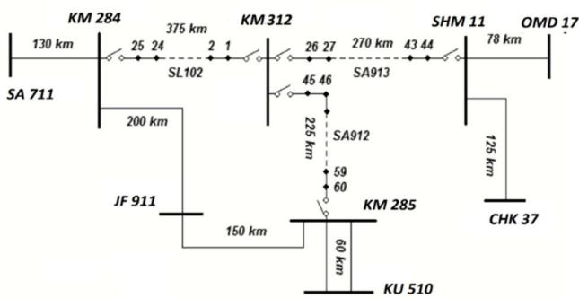  
FIGURE 1. Single-line diagram of the southern grid [5].

The feeding substation at the sending end of line KM312 is connected to receiving substations KM284 and KM285 through lines SL102 and SA912, respectively. For modeling the back impedance of KM284 and KM285 substations, the Thevenin equivalent impedance is used, which is obtained from short-circuit calculations (Table 2).

The statistic switch, STAT, is used [17], and the source that models the trapped charge is connected to point B after switching (Figure 2). Transmission lines are modeled using J-Marti’s frequency-dependent method [18].

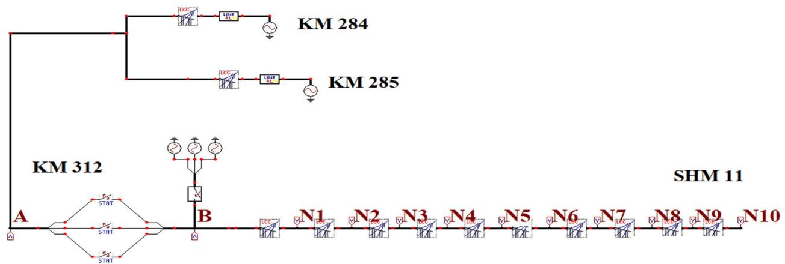  
FIGURE 2. The line under study (SA913) in EMTP/ATPDraw.

# III. SWITCHING IN TRANSMISSION LINES

When a transmission line is energized, the voltage reaches the end of the line as a propagating wave and is then reflected. The reflected wave travels toward the source and then moves back to the end of the line after reflection [19]. The original voltage and successive reflections produce an overvoltage. Depending on the conditions, the overvoltage may have an amplitude of up to three times the source voltage amplitude, at the end of the line [1]. The higher the voltage difference across the CB contacts at closing, the larger the voltage amplitude at the end of the line. In insulation coordination problems, the worst-case conditions must be considered for voltage stresses. One of these critical conditions occurs when a CB is reclosed after fault occurrence.

When the transmission line is disconnected from the feeding substation, the line voltage will not be zero due to the stray capacitance, and this voltage is equal to the source voltage at the instant of closing. If the opening occurs when the source instantaneous voltage is at its maximum, the trapped charge is maximum.

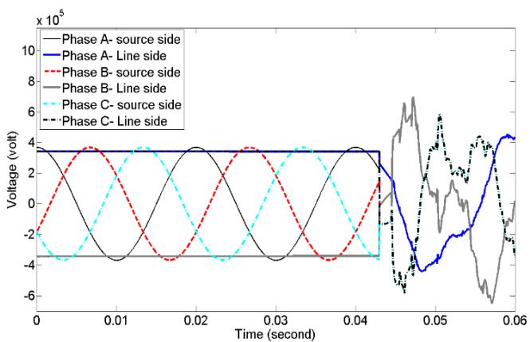  
FIGURE 3. Transient line to ground voltage of line and source side when three phases are closed without shunt compensator (trapped charge included).

Another cause of trapped charge is an unsymmetrical fault occurrence that will result in the charge remaining in the

healthy phases. Figure 3 shows the transient voltage between CB contacts in the worst case without the presence of the shunt reactor. The smooth lines represent the DC voltages of the TCS before closing. These voltages are modeled by the default TCS in ATP. The trapped charge voltages for the worst-case overvoltages are selected to be 1, −1, and 1 p.u. [5]. These values provide the worst-case inter-phase voltage induction before closing. Therefore, it is desired that the voltage difference across the contacts becomes about 2 p.u. before closing.

When a shunt reactor is used at the end of the line, the frequency response of the network is disturbed because the natural frequency of the reactor inductance is added to the system. Figure 4 shows the transient line to ground voltage of the CB contacts after adding the reactor. The transient line to ground voltage of the CB contacts in the presence of a shunt reactor and without trapped charge is shown in Figure 5.

By comparing Figures 3 and 5, it can be seen that, except for the resonance overvoltages, the shunt reactor reduces the switching overvoltages as expected.

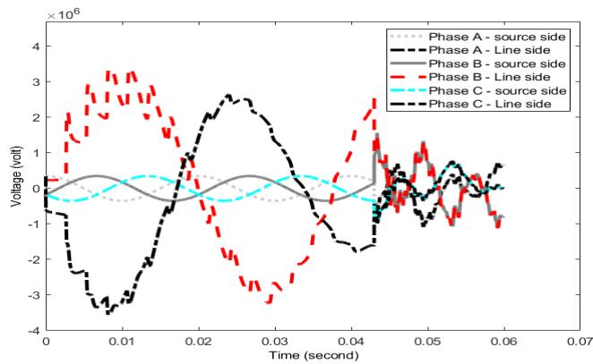  
FIGURE 4. The transient line to ground voltage of breaker contacts when three phases are closed in the presence of a shunt compensator at the end of the line (trapped charge included).

Therefore, the results in Figure 4 are incorrect. Because not only the presence of the reactor does not reduce the

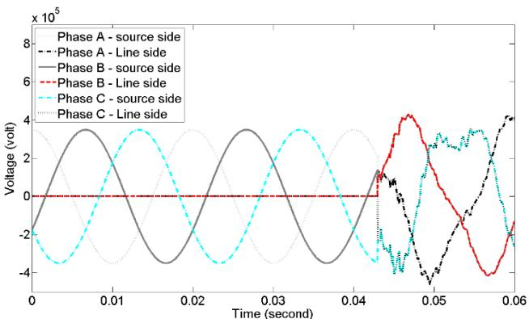  
FIGURE 5. The transient line to ground voltage of breaker contacts when three phases are closed in the presence of a shunt compensator (trapped charge not included).

overvoltages, but also at the first moment, an overvoltage of about a few megavolts is generated at the end of the line. Consequently, it can be concluded that the modeling of TCS by the default ATP model is inaccurate.

Another approach for modeling the TCS is to use three DC voltage sources in series with an inductive-resistive impedance and three corresponding CBs at the sending end of the line [5]. Using this method causes the shunt reactor to resonate with the stray capacitance and generate a large overvoltage before line energization; thus, this is also not an appropriate solution. To cope with the mentioned issues, a new method is proposed in this article to take account of the trapped charge.

The process of opening the main switch and re-closing it after a short time is a simple approach that can be used in transient state simulation to account for the trapped charge. However, this approach is not suitable for statistical switching with a large number of simulations (e.g., 400 simulations [20]). In statistical switching, a constant DC voltage is chosen on the line side with an opposite polarity with respect to the source side at a time near the closing instant. In this case, the closing instants of the main switch can be described by a statistical distribution [17]. Therefore, in the insulation design, surge arrester placement on the transmission line requires numerous simulations for each surge arrester installation. This technique has two drawbacks. First, the opening and closing times cannot be adjusted for all states of the simulation. Second, this technique does not provide the exact overvoltages at the worst-case switching conditions, so proper insulation coordination cannot be achieved.

# IV. PROPOSED METHOD

# A. METHOD THEORY

To model transient overvoltages in long transmission lines, EMTP/ATPDraw uses the J-Marti model, which includes high-frequency transmission line losses. The J-Marti model is implemented in the software using the LCC routine.

As shown in Figure 6, consider a transmission line between nodes k and m.

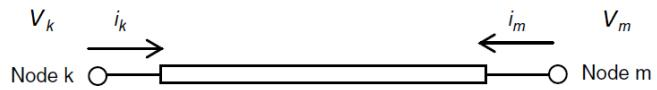  
FIGURE 6. Transmission line between two nodes k and m.

In the frequency domain, the voltage and current of the transmission line at the ends are equal to [21]:

$$
V _ {k} (\omega) = \cosh [ \gamma (\omega) l ] V _ {m} (\omega) - Z _ {c} (\omega) \sinh [ \gamma (\omega) l ] I _ {m} (\omega) \tag {1}
$$

and

$$
I _ {k} (\omega) = \frac {1}{Z _ {c} (\omega)} \sinh [ \gamma (\omega) l ] V _ {m} (\omega) - \cosh [ \gamma (\omega) l ] I _ {m} (\omega) \tag {2}
$$

where $Z _ { c } ( \omega )$ and $\gamma ( \omega )$ are, respectively, the wave impedance and the transmission line propagation constant given as follows:

$$
Z _ {c} (\omega) = \sqrt {Z ^ {\prime} (\omega) . Y ^ {\prime} (\omega)} \tag {3}
$$

$$
\gamma (\omega) = \sqrt {\frac {Z ^ {\prime} (\omega)}{Y ^ {\prime} (\omega)}} \tag {4}
$$

where $Z ^ { \prime } ( \omega )$ and $Y ^ { \prime } ( \omega )$ are, respectively, the series impedance and parallel admittance of the transmission line. The J-Marti frequency-dependent equivalent circuit for the transmission line is shown in Figure 7.

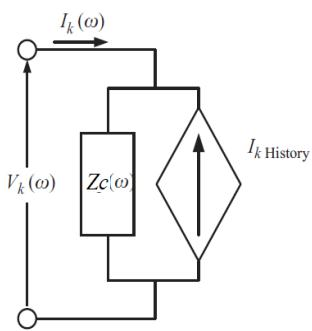

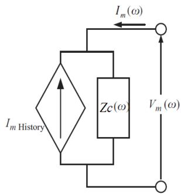  
FIGURE 7. Equivalent circuit of transmission line in J-Marti model.

In Figure 7, $I _ { k H i s t o r y }$ and $I _ { m H i s t o r y }$ are determined by the following equations:

$$
I _ {k H i s t o r y} = A (\omega) \left(V _ {m} (\omega) + Z _ {c} (\omega) I _ {m} (\omega)\right) \tag {5}
$$

$$
I _ {m H i s t o r y} = A (\omega) \left(V _ {k} (\omega) + Z _ {c} (\omega) I _ {k} (\omega)\right) \tag {6}
$$

where $Z _ { c } ( \omega )$ and $A ( \omega )$ are, respectively, the wave impedance and weight function in the frequency domain. Since continuous integration is not possible by computer-aided discrete methods, a trapezoidal technique is employed in EMTP.

Therefore, the integral of the operator is transformed into the following form [22]:

$$
\Delta S = \int_ {t - \Delta t} ^ {t} f (t) d t = \frac {\Delta t}{2} (f (t) + f (t - \Delta t)) \tag {7}
$$

where $\Delta t$ is the simulation time step, and $f ( t )$ can be either the inductor current or the capacitor voltage. EMTP uses curve fitting methods to calculate the integrals in the Fourier transform of $Z _ { c } ( \omega )$ and $A ( \omega )$ . Thus, $Z _ { c } ( \omega )$ and $A ( \omega )$ in the Laplace domain are given as [9]:

$$
Z _ {c} (s) = \frac {N (s)}{D (s)} = H \frac {(s + z _ {1}) (s + z _ {2}) \dots (s + z _ {n 1})}{(s + p _ {1}) (s + p _ {2}) \dots (s + p _ {n 2})} \tag {8}
$$

$$
A (s) = e ^ {- s \tau} \frac {(s + z _ {1}) (s + z _ {2}) \dots (s + z _ {n})}{(s + p _ {1}) (s + p _ {2}) \dots (s + p _ {m})} \tag {9}
$$

where τ is the time step of the simulation. In the line under study (line SA913 in Figure 2), the orders of $Z _ { c } ( s )$ and $A ( s )$ are obtained according to Table 3.

TABLE 3. Order of ${ z } _ { c }$ (s) and A(s) for three phases in LCC Routine of ATP/EMTP.   

<table><tr><td>Order of fitted transfer function</td><td>A(s)</td><td>Zc(s)</td></tr><tr><td>Phase A</td><td>21</td><td>16</td></tr><tr><td>Phase B</td><td>12</td><td>12</td></tr><tr><td>Phase C</td><td>16</td><td>20</td></tr></table>

Figures 8 and 9 show, respectively, the fitted $Z _ { c } ( s )$ and A(s) amplitude-phase diagrams.

The frequency responses, shown in Figures 8 and 9, are fitted using the method presented in [23]. Fitting the frequency response simplifies the simulation of transmission line transients.

According to Table 3, the order of polynomials, and therefore, the coefficients A(s) and $Z _ { \mathrm { c } } ( \mathrm { s } )$ are different. The obtained frequency ranges and responses are shown in Figures 8 and 9. From the point of view of signal and system analyses, filters are a special type of linear time-invariant components that pass some frequencies and reject others by varying the zero/pole configuration of the system [24]. Therefore, PTCS with such a function is a filter. Therefore, the zeros and poles of the transmission line have to be identified. Then, according to the frequency response, the poles of PTCS have to be arranged in a way that the oscillations by the line poles and the shunt reactor (before CB closing) do not appear in the line side voltage.

The PTCSs are modeled by obtaining a given smooth voltage at the line side [18]. This source should generate voltage by injecting an electrical charge into the line disconnected from the source. The required electrical charge is provided by current injection. When a shunt reactor is installed at the end of the line, the natural frequencies of the reactor and line stray capacitance cause oscillating frequency components in the voltage of PTCS, and their amplitude exceeds the source amplitude.

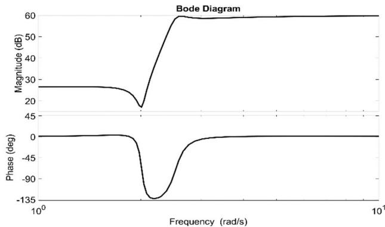  
FIGURE 8. Fitted $\pmb { \mathrm { z } } _ { \mathsf { c } } ( \pmb { \mathsf { s } } )$ amplitude-phase diagram.

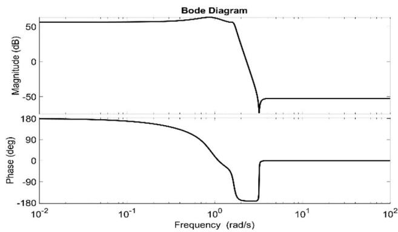  
FIGURE 9. Fitted A(s) amplitude-phase diagram.

The trapped charge voltage amplitude in the line must be at most equal to the voltage peak of the source from which the line is disconnected. Therefore, a current source must be considered for injecting current; this current source filters the natural frequency components of the line and reactor and generates a constant voltage before CB closing.

Suppose a smooth voltage amplitude of $V _ { 0 }$ at point k (Figure 7). The amplitude of $V _ { 0 }$ depends on the instantaneous voltage of the line just before opening, which, in the worst case, can be equal to one per unit with opposite polarity at the other pole of CB connected to the substation. Accordingly, in the Laplace domain:

$$
V _ {k} (s) = \frac {V _ {0}}{s} \tag {10}
$$

If

$$
V _ {m} (s) = - (R + L s) I _ {m} (s) \tag {11}
$$

where $I _ { m } ( s )$ is the current $i _ { m } ( t )$ in the Laplace domain, as shown in Figure 7; R and L are, respectively, the resistance and inductance of the shunt reactor.

To satisfy the condition of Eq. (10), the current delivered by the PTCS is obtained from the circuit laws in the Laplace domain. By applying Ohm’s law to node k, the following

equation is derived:

$$
\frac {V _ {0}}{s} = Z _ {c} (s). \left[ I _ {s} (s) + I _ {k H i s t o r y} \right] \tag {12}
$$

where $I _ { s } ( s )$ is the PTCS to eliminate voltage oscillations. After simplification and using (5) and (6) in the circuit of Figure 7, the following equation is obtained:

$$
I _ {s} (s) = \frac {V _ {0}}{s \left[ 1 + A ^ {2} (s) . F (s) . Z _ {c} (s) \right]} \left[ \frac {1}{Z _ {c} (s)} - A ^ {2} (s). F (s) \right] \tag {13}
$$

where

$$
F (s) = \frac {- 2 Z _ {c} ^ {2} (s)}{R + L s + Z _ {c} (s)} + Z _ {c} (s) \tag {14}
$$

Consequently, the transfer function of the PTCS is derived using Eq. (13).

# B. IMPLEMENTATION OF PTCS

To implement the PTCS, $I _ { s } ( s )$ , the programming block MODEL is employed as shown in Figure 10.

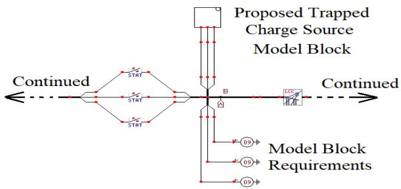  
FIGURE 10. Implementation of the PTCS.

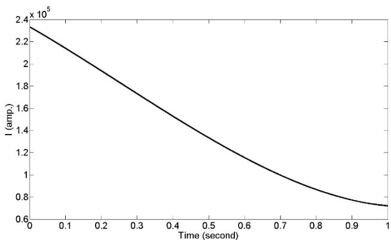  
FIGURE 11. Time values of TCS of phase A (IsA(t)). $\begin{array} { r } { \mathbf { \mathbb { \Lambda } } ( \mathbf { \mathbb { I } } _ { \mathsf { S A ( t ) } } ) . } \end{array}$

Therefore, the default interface type 60 in ATP is used to connect the MODEL command to the transmission line [17]. The three sources in Figure 10 are substituted for the TCS in Figure 2. The order of the numerator and denominator of the proposed source is high for modeling the trapped charge, so the limitations of ATP prevent inserting these high orders into the MODEL environment. To resolve this issue, the authors suggest first approximating the transfer function

of Eq. (13) in the time domain using MATLAB, and then, applying the time values $I _ { s }$ to MODEL in ATP.

Figure 11 shows the time values of the PTCS for phase A. The sampling frequency is chosen 100 kHz to be exactly equal to the simulation time step in ATP, i.e., 10 microseconds. Since MODEL has a limited capability to read samples, first, only 43000 samples are transferred to MODEL.

The line under study with the trapped charge modeling in the proposed method is implemented as follows:

1) The transmission line under study has to be implemented as explained in Section II.   
2) Routine LCC is executed and the polynomial coefficients A(s) and $Z _ { c } ( s )$ are extracted from the LCC routine file in EMTP.   
3) By inserting the polynomials obtained in the previous step into Eqs. (13) and (14), the transfer function that models the TCS is derived.

Due to the limited memory allocated to MODEL in EMTP, first, 43,000 samples are transferred to EMTP and the final statistical switching simulation is executed. The flowchart of the proposed method is shown in Figure 12.

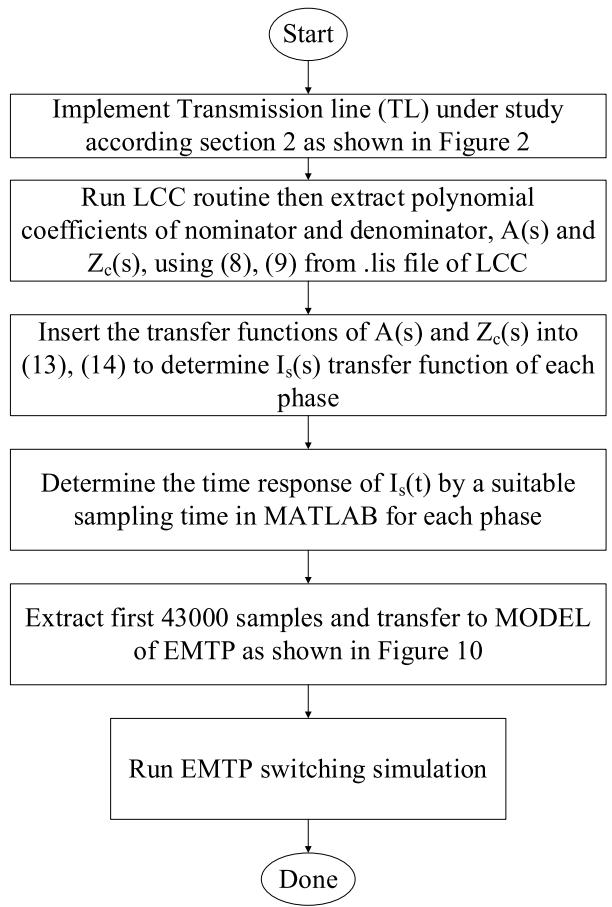  
FIGURE 12. Flowchart of proposed trapped charge sources in switching transient studies in the presence of shunt reactors.

The MODEL script of PTCS is shown in Figure 13. The MODEL block is a built-in programming feature of

ATP software that effectively processes the required inputs, performs the necessary analysis, and outputs the results to the transient simulation at each time step. As shown in Figure 13, the programming used in this block is an advanced version of FORTRAN.

In accordance with FORTRAN rules, constants are defined at the beginning. Based on the principles of trapped charge implementation in ATP, PTCS must inject the trapped charge current into the transmission line before the CB closes and the substation voltage is applied. Therefore, the instantaneous values of 43,000 samples, extracted from MATLAB, are defined in the variable Ista is shown in Figure 13. The first and 43,000th samples are visible in the script diagram. Due to display space limitations, the notation ‘‘/// 43000’s sample imported from MATLAB’’ replaces the remaining 42,998 samples.

Figure 11 illustrates the time-domain values of $I _ { s A } ( t )$ for phase A. Similarly, the variables Istb and Istc are defined for the other phases, and their values are utilized in the simulation.

As shown in Figure 13, additional variables are defined to transfer the calculated values to the output terminals of the MODEL. Furthermore, a conditional statement is implemented to handle the moment when the trapped charge is removed, and the main CB is closed.

```txt
MODEL ProposedMethod  
CONST Ista[0..42999] {val: [0, 6.803916641e-001, 6.803862537e-001, // First sample imported from MATLAB for Phase A // 43000 Samples for Phase A  
6.694821520e-001, // 43000's sample imported from MATLAB for Phase A}  
CONST Istb[0..2000] {val: [0, 6.803916641e-001, 6.803862537e-001, // First sample imported from MATLAB for Phase B // 43000 Samples for Phase B  
6.694821520e-001, // 43000's sample imported from MATLAB for Phase B}  
CONST Istc[0..2000] {val: [0, 3.419993428e+005, 9.887767373e-001, // First sample imported from MATLAB for Phase C // 43000 Samples for Phase C  
9.126184399e-001, // 43000's sample imported from MATLAB for Phase C}  
VAR x,Io1,Io2,Io3  
OUTPUT Io1  
IOu2  
IOu3  
HISTORY x {dflt:0}  
EXEC  
x:=1  
x:=t/timestep  
if x<43000  
then  
IOu1:=Ista[x]  
IOu2:=Istb[x]  
IOu3:=Istc[x]  
else  
IOu1:=0  
IOu2:=0  
IOu3:=0  
endif  
ENDEXEC  
ENDMODEL 
```

FIGURE 13. Proposed ATP/MODEL script.

The validity of the simulation results in the presence of a shunt reactor can be tested by using wave propagation rules. According to these rules, the voltage at each point depends on

the amplitude of the propagating wave, as well as the wave impedance before and after the point under study.

$$
V _ {T L} (t) = V _ {t r p} - \left(V _ {t r p} - V _ {T L 0}\right) \cos (\omega t) \tag {15}
$$

where $V _ { t r p }$ is trapped charge, $V _ { T L 0 }$ is the initial fluctuating voltage.

The frequency of voltage fluctuations is equal to the natural frequency of the RLC circuit as follows:

$$
\omega = 1 / \sqrt {L C} \tag {16}
$$

where L and C denote, respectively, the equivalent inductance and capacitance of the transmission line seen from the substation.

Actually, according to (15), overvoltage depends on the presence of the reactor and the wave impedance of the line. As a rule of thumb, the difference in overvoltages in the presence and absence of the reactor is small. This is because when the end of the line is open, the impedance is infinite with a maximum overvoltage of 2 p.u.; in the presence of the reactor, the overvoltage can be less; however, the overvoltages due to power frequency are added to this overvoltage.

# V. SIMULATION RESULT

The TCS is modeled using the proposed method, and the transient line to ground voltage of CB contacts for three phases is shown in Figure 14.

As can be observed, unlike Figure 4, the amplitude of switching stresses in this case is in the range of Figure 3. In Figure 3, a shunt reactor is installed at the end of the line. There is little difference between the overvoltage amplitudes in Figures. 3 and 13. In Figure 14, the trapped charge voltage is smooth before the CB closing. This is because, according to (10) to (14), the frequency spectrum of the PTCS has been determined so that the line voltage is smooth before closing.

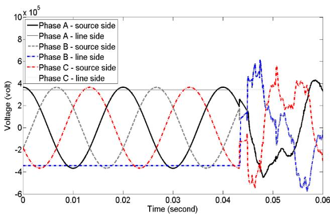  
FIGURE 14. Transient voltage in the presence of the PTCS and reactor.

Figure 15 shows the overvoltage profile at points $\Nu _ { 1 }$ to $\mathrm { N } _ { 1 0 }$ as shown in Figure 2. In this figure, the reactor with 75% compensation is modeled using the PTCS.

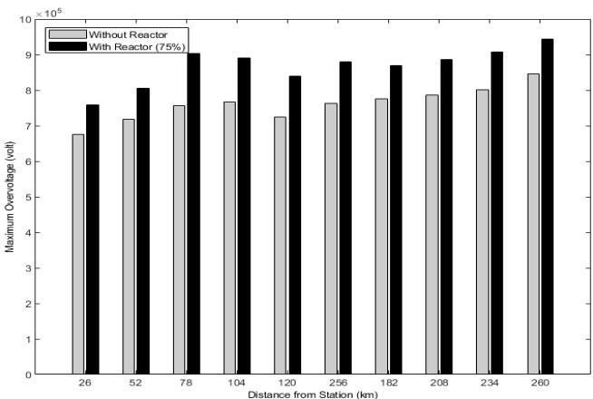  
FIGURE 15. Effect of the presence of reactor on maximum overvoltage profile with 75% compensation.

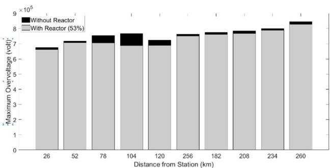  
FIGURE 16. Effect of the presence of reactor on maximum overvoltage profile with 53% compensation.

As shown in Figure 15, the values of overvoltages are slightly higher in the presence of a shunt reactor due to the power frequency overvoltages. To reduce power frequency overvoltages, the optimal reactor capacity needs to be implemented. For example, if the compensator capacity is reduced to 53%, the maximum overvoltage profile is obtained as shown in Figure 16. In this case, not only the reactor does not increase the overvoltages but also it improves them by 2%.

Therefore, bi-objective optimization is required to simultaneously improve transient and steady-state overvoltages. The designer can determine the significant factors of transient and steady-state compensations.

The statistical switching is performed using the proposed trapped charge source in accordance with the principles presented in [17] to compare the results of the present study with those of [25]. The mean values of overvoltages with and without the reactor are 1.573 and 1.632 per unit, respectively. The 2.05 times standard deviations are 0.976 and 1.899, which are in good agreement with the practical measurements [25]. Moreover, it can be seen that the proposed trapped charge source simulates the worst overvoltage condition.

To verify the efficiency of the proposed method, the simulation results of the proposed method are compared with the results of transient voltage measurement at the

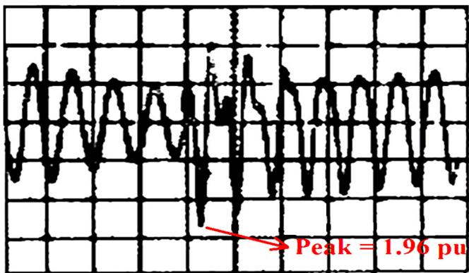  
FIGURE 17. Measured transient wave using oscillogram at Lakeville station [11].

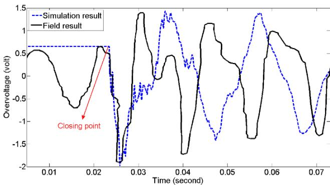  
FIGURE 18. Comparison of simulation results with field data.

station for a 765-kV transmission line [13]. The field measurements have been performed for re-energizing a 330-mile transmission line fed by Lakeville station and opened at Kammer station (Figure 17). A 300 MVAr reactor is installed at one end of the line, and a 350-ohm closing resistor is used to suppress the overvoltages.

According to Figure 17, the measured maximum overvoltage is 1.96 p.u. The transmission line under study is implemented in EMTP, and the PTCS injects current using the proposed method. Figure 18 compares the simulation results with the extracted field data.

As shown in Figure 18, the proposed method determines a maximum overvoltage of 2 p.u. The data are interpolated from Figure 17. However, field measurements, with a slight difference (about 2%), show 1.96 p.u. In addition, the PTCS has a value of 0.645 p.u., which is exactly equal to the instantaneous voltage before closing at the station. The oscillation patterns of the real and simulated voltages are similar. The difference can be attributed to the simulation requirements such as the fitting of the wave impedance of the line.

# VI. CONCLUSION

In this paper, a new TCS model was proposed. The proposed model was designed to generate a smooth voltage on the

transmission line before the CB closing. The sets of zeros and poles of the proposed source were based on the frequency content of the transmission line connected to the source. Zeros and poles arrangement of PTCS may cause resonant overvoltage oscillations. The proposed model acts as an active filter and, while eliminating the oscillations, does not have the limitations of the conventional TCS in the closing simulation of a transmission line connected to a shunt reactor. To implement the proposed model, the coefficients of the transfer function were derived using the LCC subroutine, a built-in feature of EMTP/ATP. Given the high order of the transfer function, time-domain samples were computed externally and imported into the MODEL environment in ATP. This intermediate step ensured accurate implementation while addressing software limitations To verify the effectiveness of the proposed method, the simulation results were compared with field data. The proposed model was able to determine the switching overvoltages with a slight error in the presence of a shunt reactor.

# REFERENCES

[1] J. Das, Transients in Electrical Systems. New York, NY, USA: McGraw-Hill, 2010.   
[2] A. R. Hileman, ‘‘Insulation coordination for power systems,’’ IEEE Power Eng. Rev., vol. 19, no. 9, p. 43, Sep. 1999.   
[3] R. Shariatinasab, J. G. Safar, and M. A. Mobarakeh, ‘‘Development of an adaptive neural-fuzzy inference system based metamodel for estimating lightning related failures in polluted environments,’’ IET Sci., Meas. Technol., vol. 8, no. 4, pp. 187–195, Jul. 2014.   
[4] R. Shariatinasab, M. A. Mobarakeh, and M. Farshad, ‘‘Estimation of switching overvoltages on transmission lines using neurofuzzy method,’’ Intell. Syst. Electr. Eng., vol. 3, no. 3, pp. 55–66, Nov. 2012.   
[5] S. Hosseinian, M. Abedi, and B. Vahidi, ‘‘Digital computer studies of random switching of Iranian standard 400 kV lines,’’ in Proc. 3rd Int. Conf. Properties Appl. Dielectr. Mater., 1991, pp. 542–545.   
[6] R. Shariatinasab, B. Vahidi, S. H. Hosseinian, and A. Ametani, ‘‘Probabilistic evaluation of optimal location of surge arresters on EHV and UHV networks due to switching and lightning surges,’’ IEEE Trans. Power Del., vol. 24, no. 4, pp. 1903–1911, Oct. 2009.   
[7] A. Clerici, G. Ruckstuhl, and A. Vian, ‘‘Influence of shunt reactors on switching surges,’’ IEEE Trans. Power App. Syst., vols. PAS–89, no. 8, pp. 1727–1736, Nov. 1970.   
[8] R. Shariatinasab, J. Ghayur Safar, and H. Falaghi, ‘‘Optimisation of arrester location in risk assessment in distribution network,’’ IET Gener., Transmiss. Distrib., vol. 8, no. 1, pp. 151–159, Jan. 2014.   
[9] J. J. Grainger and W. D. Stevenson, Power System Analysis. NJ, USA: McGraw-Hill, 2003.   
[10] L. Prikler, G. Bán, and G. Bánfai, ‘‘EMTP models for simulation of shunt reactor switching transients,’’ Int. J. Electr. Power Energy Syst., vol. 19, no. 4, pp. 235–240, May 1997.   
[11] X. Luo, C. Huang, Y. Jiang, and S. Guo, ‘‘An adaptive three-phase reclosure scheme for shunt reactor-compensated transmission lines based on the change of current spectrum,’’ Electr. Power Syst. Res., vol. 158, pp. 184–194, May 2018.   
[12] S. Bojić, B. Babić, and I. Uglešić, ‘‘Comparative research into transients by switching of high voltage shunt reactor,’’ Electr. Power Syst. Res., vol. 162, pp. 74–82, Sep. 2018.   
[13] A. Hauspurg, G. S. Vassell, G. I. Stillman, J. H. Charkow, and J. C. Haahr, ‘‘Overvoltages on the AEP 765-kV system,’’ IEEE Trans. Power App. Syst., vols. PAS–88, no. 9, pp. 1329–1342, Sep. 1969.   
[14] W. G. Cigre, ‘‘Switching overvoltages in EHV and UHV systems with special reference to closing and reclosing transmission lines,’’ Electra, vol. 30, pp. 70–122, Jun. 1973.

[15] R. Shariatinasab, B. Vahidi, S. H. Hosseinian, and A. Ametani, ‘‘Optimization of surge arrester’s location on EHV and UHV power networks using simulation optimization method,’’ IEEJ Trans. Power Energy, vol. 128, no. 12, pp. 1465–1472, 2008.   
[16] F. Deyhim and R. Ghanizdeh, ‘‘Insulation risk assessment of controlled switching considering pre-strike voltage and line trapped charge,’’ IET Sci., Meas. Technol., vol. 13, no. 2, pp. 139–148, Mar. 2019.   
[17] H. Høidalen, L. Prikler, and J. Hall, ‘‘ATPDraw-graphical preprocessor to ATP, windows version,’’ in Proc. Int. Conf. Power Syst. Transients, 1999, pp. 20–24.   
[18] J. R. Marti, ‘‘Accurate modelling of frequency-dependent transmission lines in electromagnetic transient simulations,’’ IEEE Trans. Power App. Syst., vols. PAS–101, no. 1, pp. 147–157, Jan. 1982.   
[19] A. Greenwood, Electrical Transients in Power Systems. Hoboken, NJ, USA: Wiley, 1991.   
[20] H. Khalilnezhad, M. Popov, L. van der Sluis, J. A. Bos, and A. Ametani, ‘‘Statistical analysis of energization overvoltages in EHV hybrid OHL– cable systems,’’ IEEE Trans. Power Del., vol. 33, no. 6, pp. 2765–2775, Dec. 2018.   
[21] L. F. Woodruff, Principles of Electric Power Transmission. Hoboken, NJ, USA: Wiley, 1938.   
[22] E. Haginomori, T. Koshiduka, J. Arai, and H. Ikeda, Power System Transient Analysis: Theory and Practice Using Simulation Programs (ATP-EMTP). Hoboken, NJ, USA: Wiley, 2016, doi: 10.1002/9781118737491.   
[23] B. Gustavsen and A. Semlyen, ‘‘Rational approximation of frequency domain responses by vector fitting,’’ IEEE Trans. Power Del., vol. 14, no. 3, pp. 1052–1061, Jul. 1999, doi: 10.1109/61.772353.   
[24] A. V. Oppenheim and R. W. Shaffer, Discrete-Time Signal Processing. Upper Saddle River, NJ, USA: Prentice-Hall, 1989.   
[25] Insulation Co-ordination—Part 2: Application Guide, Standard 60071-2: 1996, Int. Electrotechnical Commission, 1996.


MOHSEN AKAFI-MOBARAKEH received the M.S. degree in electrical engineering from the University of Birjand, Birjand, Iran, in 2013, where he is currently pursuing the Ph.D. degree. He has been involved in several national and industrial projects, including smart grid development, insulation coordination, and electric vehicle integration. His research interests include insulation coordination of lightning and switching overvoltages, and statistical and AI-based modeling.


REZA SHARIATINASAB (Senior Member, IEEE) received the B.S. degree in electrical engineering from the Ferdowsi University of Mashhad, Mashhad, Iran, in 2000, and the M.Sc. and Ph.D. degrees in electrical engineering from the Amirkabir University of Technology (Tehran Polytechnique), Tehran, Iran, in 2003 and 2009, respectively. In September 2007, he was a Visiting Scientist with Doshisha University, Kyoto, Japan. In 2009, he joined the Electrical and Computer

Engineering Department, University of Birjand, Birjand, Iran, where he is currently a Professor of Electrical Engineering. His current research interests include high voltage engineering, lightning and switching transients, and electromagnetic compatibility.


PIERLUIGI SIANO (Senior Member, IEEE) received the M.Sc. degree in electronic engineering and the Ph.D. degree in information and electrical engineering from the University of Salerno, Salerno, Italy, in 2001 and 2006, respectively. He is currently a Full Professor of electrical power systems and the Scientific Director of the Smart Grids and Smart Cities Laboratory, Department of Management and Innovation Systems, University of Salerno. His research interests include demand

response, energy management, the integration of distributed energy resources in smart grids, electricity markets, and the planning and management of power systems. In these research fields, he has co-authored more than 800 articles, including more than 400 international journals that received in Scopus more than 22 000 citations with an H-index of 71. Since 2019, he has been awarded as a Highly Cited Researcher in Engineering by the Web of Science Group. He has been the Chair of the IES TC on Smart Grids. He is an Editor of the Power & Energy Society Section of IEEE ACCESS, IEEE TRANSACTIONS ON POWER SYSTEMS, IEEE TRANSACTIONS ON INDUSTRIAL INFORMATICS, IEEE TRANSACTIONS ON INDUSTRIAL ELECTRONICS, and IEEE SYSTEMS JOURNAL.


HAMID REZA NAJAFI received the B.Eng. and M.Eng. degrees from the Ferdowsi University of Mashhad, Iran, in 1981 and 1991, respectively, and the Ph.D. degree from Iran University of Science and Technology (IUST), Iran, in 2004. He has been a Lecturer at the Faculty of Engineering, University of Birjand, Iran, since 1993. He is currently a Professor with the Electrical Power Engineering Department, University of Birjand. His research interests include power system modeling, HVdc

and FACTS, reliability of power systems, distributed generation, application of ANN, and fuzzy systems in power systems.


BEHROOZ VAHIDI (Senior Member, IEEE) was born in Abadan, Iran. He received the B.S. degree in electrical engineering from the Sharif University of Technology, Tehran, Iran, in 1980, the M.S. degree in electrical engineering from the Amirkabir University of Technology, Tehran, in 1989, and the Ph.D. degree in electrical engineering from The University of Manchester Institute of Science and Technology, U.K., in 1997. From 1980 to 1986, he worked in industry as a

Chief Engineer in the field of high voltage. Since 1989, he has been with the Department of Electrical Engineering, Amirkabir University of Technology, where he is currently a Professor. He has authored or co-authored more than 550 papers, and 17 books or book chapters on high-voltage engineering and power systems. His main research interests include high voltage, electrical insulation, power system transients, lightning protection, and pulsed-power technology. He was selected as a Distinguished Researcher of Iran by the Ministry of Higher Education of Iran, in 2011, and Iranian Association of Electrical and Electronics Engineers, in 2012.