# 柔性直流输电系统高频稳定性分析及抑制策略(一)：稳定性分析

李云丰1，贺之渊 2，庞辉2，阳岳希2，季柯2，黄伟颖3

(1．长沙理工大学电气与信息工程学院，湖南省 长沙市 410114；

2．先进输电技术国家重点实验室(全球能源互联网研究院有限公司)，北京市 昌平区 102200；

3．可再生能源电力技术湖南省重点实验室(长沙理工大学)，湖南省 长沙市 410114)

# High Frequency Stability Analysis and Suppression Strategy of MMC-HVDC Systems (Part I): Stability Analysis

LI Yunfeng1, HE Zhiyuan2, PANG Hui2, YANG Yuexi2, JI Ke2, HUANG Weiying3

(1. School of Electrical & Information Engineering (Changsha University of Science and Technology), Changsha 410114,

Hunan Province, China; 2. State Key Laboratory of Advanced Power Transmission Technology (Global Energy Interconnection

Research Institute Co., Ltd.), Changping District, Beijing 102200, China; 3. Laboratory of Renewable Energy Electric-Technology of Hunan Province (Changsha University of Science and Technology), Changsha 410114, Hunan Province, China)

ABSTRACT: The phenomena of high frequency resonances caused by large time delay in flexible MMC-HVDC systems have appeared in practical projects. To explore the mechanism of high frequency resonance and its key influencing factors, the high frequency state space mathematical models of MMC and AC system were established. Firstly, the model of MMC integrated the internal dynamic process, outer and inner loop, phase-locked loop, circulating current suppression and Pade approximation of large time delay, etc. The general state space model of AC system was established, in which the high frequency characteristics of AC transmission line were simulated by using the multiple  models. Secondly, the key influencing factors such as inner loop, time delay, voltage feed forward channel, phase-locked loop, steady-state operation point, AC line length, equivalent capacitance contributing to the high frequency resonance were identified by the participation factor analysis method. Finally, the root locus method was used to study how the above factors affect the high-frequency stability of the system, and the related links were verified by electromagnetic transient simulation models.

KEY WORDS: flexible high voltage direct current; modular multilevel convert (MMC); state-space model; high-frequency

resonance; stability analysis; root locus; participation factors

摘要：柔性直流输电系统因大链路延时导致的高频振荡现象已经在实际工程出现。为探究高频振荡的机理及关键影响因素，该文首先从换流站和交流系统 2 个方面分别建立高频状态空间数学模型，换流站模型聚集 MMC 内部动态过程、控制内外环、锁相环、环流抑制及 Pade 函数模拟的大链路延时环节，交流系统则是建立以多个  模型来模拟线路分布式参数特性的通用状态空间模型；其次，采用参与因子分析方法辨识出内环环节、延时大小、电压前馈、锁相环、稳态运行点、交流线路长度、线路电容等因素是导致高频振荡的关键影响环节；最后，以根轨迹方法为研究手段，阐述上述环节及其参数如何影响系统高频稳定性，并对相关环节进行电磁暂态仿真验证。

关键词：柔性直流输电；模块化多电平换流器；状态空间模型；高频振荡；稳定性分析；根轨迹；参与因子

# 0 引言

基于模块化多电平换流器(modular multilevelconverter ， MMC) 的 柔 性 直 流 输 电 (flexible highvoltage direct current，HVDC)是新一代输电技术，具有可控性好、低次谐波含量低、增压扩容方便、适应于海上风电接入等优势，近 10年来得到快速发展[1-3]。目前，国内在建和规划的柔性直流工程以 500kV 交流主网接入，换流站的最大容量已经达到 800 万 kW[4]。工程的安全稳定运行对交流骨干

网架的影响也越来越深刻，若柔性直流换流站因某些扰动(如高频振荡)导致闭锁，由此产生的功率盈余/缺额将对接入的交流电网产生严重冲击[5-9]。

柔性直流换流站与交流系统之间的高频振荡问题已在国内的鲁西工程和渝鄂工程中实际发生。2017年4月，鲁西工程因接入的交流系统故障只有单回线路运行，导致广西电网 500kV 母线出现1270Hz 的高频振荡，使得换流站闭锁[6-7]。2018 年12 月，渝鄂工程南通道施州换流站调试期间，在换流站解锁升直流电压过程中，湖北侧出现了约1.8kHz 的高频振荡，该高频振荡解决方案是在电压前馈环节加入 400Hz的低通滤波器。然而，同样的方案应用于重庆侧时则失效，在不同时间段分别出现了 660Hz和700Hz左右的高频振荡，由于高频振荡并未有消除的迹象，一段时间后，阀侧电流高频谐波保护动作，换流站闭锁跳闸[5]。因此，研究柔性直流输电系统的高频振荡机理及其关键影响因素具有科学和工程意义。

柔性直流输电系统在大电网互联、新能源接入、城市供电等应用场景下的振荡问题属于小干扰稳定性范畴[9-10]。该领域的研究方法主要是基于状态空间法和阻抗法，闭环系统在全频带范围内是否具有负实部的特征根，或非负阻尼特性直接决定了其稳定性[11-13]。随着这类问题研究的深入，控制系统中的锁相环(phase-locked loop，PLL)、外环及内环、环流抑制控制器(circulating current suppressioncontroller，CCSC)、控制模式、风电场输送功率及交流电网阻抗对稳定性的影响机理也逐渐被揭示[14-16]。文献[17-20]针对风电场接入柔性直流换流站的应用场景，以谐波状态空间法和阻抗法建立了多种理论分析模型，分析了引起次同步振荡问题的关键因素，并通过优化控制系统架构、控制器参数和增加附加控制策略等手段抑制系统振荡。文献[21-22]针对张北直流电网稳定性问题，基于换流站简化模型，建立闭环系统传递函数模型，研究低频谐振振荡的关键影响因素，提出了功率前馈和桥臂串联虚拟阻抗的阻尼控制策略。然而，这些研究绝大部分没有考虑柔性直流换流站采样、传输、计算、执行等链路延时环节的影响，所得结论可能最适用于百 Hz 以下的低频段，对于高频稳定性的影响研究还需进一步揭示。

针对高频稳定性的研究，在两电平换流器采用LC/LCL 滤波器的并网稳定性研究上，已有相关文

献对考虑延时环节的影响进行大量研究，分析了延时环节和控制系统参数如何影响高频振荡的机理[23-25]。然而，这类电力电子装置的链路延时一般小于 200s，其模拟往往是一阶或二阶，相较于550s 链路延时的柔性直流输电系统来说，二阶模型难以精确模拟高频特性，所得结论可能不具有普遍性。关于柔性直流输电系统高频振荡问题，仅有少量文献开展了相关研究。文献[6-7]基于两电平模型和阻抗法研究了鲁西工程高频振荡的影响因素和抑制策略，起到了一定的抑制效果，并未从交流系统和换流站精细化模型方面进行建模，理论深度还需进一步提升。文献[8]针对渝鄂工程高频振荡问题，以 dq 阻抗法建立了交流系统和换流站的数学模型，分析了关键因素对高频振荡的影响，然而这些影响仅仅局限于定性描述，没有做到定量描述。所采用的广义奈奎斯特判据是基于2个特征值实部与虚部相对于角频率的参数方程，通过判断曲线围绕(1，j0)进行稳定性判定，由于实部和虚部没有体现具体角频率信息，在判断谐振频率时，较为繁琐且曲线变化较为复杂。状态空间建模方法是通过求解系统的特征根直接判定稳定性和谐振频率，同时也能采用参与变量方法定量识别关键影响因素及其影响程度，有利于实现高阶模型的可靠降阶。

综上，本文以柔性直流工程高频振荡问题为切入点，从换流站控制系统、高精度延时和交流线路模拟等环节出发，建立表征系统全部动态特性的状态空间模型，通过求解特征根及参与因子分析，辨识引起高频振荡的关键因素及其参与程度。采用根轨迹方法，研究这些因素影响高频稳定性的规律，从规划、设计、建设、运行等方面，为实际工程规避和抑制高频振荡提供理论基础。

# 1 换流站数学模型及验证

渝鄂工程接入系统示意图如图1所示，换流站经换流变接入公共耦合点 (poin t of commoncoupling，PCC)，再经交流线路与电网互联[5]。MMC结构如图2所示，其框图可等效为如图3所示电路。交流系统和MMC之间经过交流电压和交流电流耦合，直流侧与其它换流站经直流电压和直流

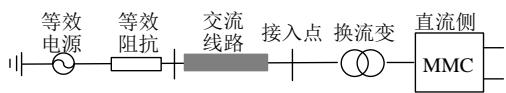  
图 1 柔直系统主电路示意图  
Fig. 1 Main circuit diagram of HVDC system

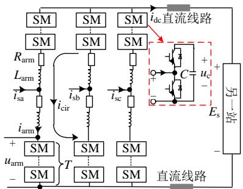  
图 2 MMC主电路

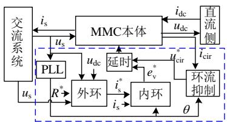  
Fig. 2 Main circuit diagram of MMC   
图 3 柔性直流输电系统框图  
Fig. 3 Diagram of MMC-HVDC

电流耦合。MMC 控制系统主要由 PLL、外环、内环、CCSC及延时等主要环节构成，本节将对各部分进行建模。

# 1.1 建模所用映射关系

MMC的建模一般是在abc自然坐标系或 $d q$ 坐标系上进行，2 个坐标系之间的转换通过派克变换实现。本文基于 $d q$ 坐标系进行建模，且 $q$ 轴超前 $d$ 轴 $9 0 ~ \%$ 。为更加方便地推导出 MMC 在 $d q$ 坐标系下的数学模型，本文采用映射概念。假设 $\pmb { x } _ { \mathrm { a b c 1 } }$ 和 $\pmb { y } _ { \mathrm { a b c l } }$ 为 2 个正序基波量，两者在 $d q$ 坐标系上可以表示为 $\scriptstyle { \pmb { x } } _ { d q 1 } = { \pmb { x } } _ { d 1 }$ j $x _ { q 1 }$ 及 ${ \bf y } _ { d q 1 } { = } { \bf y } _ { d 1 } { + } { \bf j } { y } _ { q 1 }$ ，下标含有 $" d "$ 或“ $\cdot _ { q } \cdot \cdot$ 表示 d 轴或 $q$ 轴分量，则三相物理量 $x _ { \mathrm { a b c 1 } }$ 和 $\pmb { y } _ { \mathrm { a b c l } }$ 相乘之后表现为直流分量中叠加了二倍频负序分量，经过严格的数学推导，定义映射 1 为

$$
f _ {1}: \boldsymbol {x} _ {\mathrm {a b c} 1} \cdot \boldsymbol {y} _ {\mathrm {a b c} 1} \Rightarrow \left\{\operatorname {R e} \left(\frac {\boldsymbol {x} _ {d q 1} \cdot \bar {\boldsymbol {y}} _ {d q 1}}{2}\right), 0, \frac {\bar {\boldsymbol {x}} _ {d q 1} \cdot \bar {\boldsymbol {y}} _ {d q 1}}{2} \right\} \tag {1}
$$

式中：{}中物理量依次为直流、基波和二倍频； $\mathrm { R e } ( \ )$ 为取实部；上标“”表示共轭量。

若 $\mathtt { y } _ { \mathrm { a b c } 2 }$ 表示二倍频负序分量，经过二倍频 $d q$ 坐标变换之后，可以表示为 ${ \bf y } _ { d q 2 } { = } { \bf y } _ { d 2 } { + } { \bf j } { \bf y } _ { q 2 }$ ，则定义映射 2为

$$
f _ {2}: \boldsymbol {x} _ {\mathrm {a b c} 1} \cdot \boldsymbol {y} _ {\mathrm {a b c} 2} \Rightarrow \{0, \frac {\bar {\boldsymbol {x}} _ {d q 1} \cdot \bar {\boldsymbol {y}} _ {d q 2}}{2}, 0 \} \tag {2}
$$

若 $\pmb { x } _ { \mathrm { a b c 2 } }$ 为二倍频负序分量，定义映射 3 为

$$
f _ {3}: \boldsymbol {x} _ {\mathrm {a b c} 2} \cdot \boldsymbol {y} _ {\mathrm {a b c} 2} \Rightarrow \left\{\operatorname {R e} \left(\frac {\boldsymbol {x} _ {d q 2} \cdot \bar {\boldsymbol {y}} _ {d q 2}}{2}, 0, 0 \right\} \right. \tag {3}
$$

以上3个映射构成MMC建模的理论基础。

# 1.2 换流站本体数学模型

假设功率参考方向为交流注入直流为正、桥臂

电流对电容充电为正、直流电流流出为正。采用子模块平均开关函数 $s _ { \mathrm { w } }$ 进行建模，则对于单个子模块电容电压 $u _ { \mathrm { c } }$ 和桥臂输出电压 $u _ { \mathrm { a r m } }$ 存在如下关系：

$$
C \frac {\mathrm {d} u _ {\mathrm {c}}}{\mathrm {d} t} = C \frac {\mathrm {d} \left(u _ {\mathrm {c} - \mathrm {d c}} + u _ {\mathrm {c} - \mathrm {a c} 1} + u _ {\mathrm {c} - \mathrm {a c} 2}\right)}{\mathrm {d} t} = s _ {\mathrm {w}} i _ {\mathrm {a r m}} \tag {4}
$$

$$
u _ {\mathrm {a r m}} = u _ {\mathrm {a r m} \cdot \mathrm {d c}} + u _ {\mathrm {a r m} \cdot \mathrm {a c l}} + u _ {\mathrm {a r m} \cdot \mathrm {a c 2}} = T s _ {\mathrm {w}} u _ {\mathrm {c}} \tag {5}
$$

式中：下标“dc”、“ac1”、“ac2”分别为对应物理量的直流、基波和二倍频分量；C为子模块电容，T 为考虑冗余子模块后的总数； $i _ { \mathrm { a r m } }$ 为桥臂电流。

根据 MMC运行原理可知，每相上下桥臂子模块电容电压和桥臂调制波中直流分量相等、基波分量幅值相等相位相反、二倍频幅值相等相位同相，以下桥臂为例进行分析，则有：

$$
C \frac {\mathrm {d} u _ {\mathrm {c}}}{\mathrm {d} t} = \left(\frac {1}{2} + \frac {e _ {\mathrm {v j}} ^ {*}}{u _ {\mathrm {d c}}} + \frac {u _ {\mathrm {c i r j}} ^ {*}}{u _ {\mathrm {d c}}}\right) \left(- \frac {i _ {\mathrm {d c}}}{3} + \frac {i _ {\mathrm {s j}}}{2} + i _ {\mathrm {c i r j}}\right) \tag {6}
$$

式中： $u _ { \mathrm { d c } }$ 、 $i _ { \mathrm { d c } }$ 分别为直流电压和直流电流； $i _ { \mathrm { s } j }$ 为 ${ j ( j = \mathbf { a } }$ 、b、c)相电流； $i _ { \mathrm { c i r } j }$ 为 j 相环流； $e _ { \mathrm { ~ v ~ } { j } } ^ { * }$ 、 $u ^ { * } { \mathrm { c i r } } j$ 分别为控制系统输出的基波和二倍频电压的参考值。

子模块电容电压直流分量的动态方程为

$$
\frac {\mathrm {d} u _ {\mathrm {c} - \mathrm {d c} 0}}{\mathrm {d} t} = - \frac {i _ {\mathrm {d c}}}{6 C} + \frac {e _ {\mathrm {v d}} ^ {*} i _ {\mathrm {s d}}}{4 C u _ {\mathrm {d c}}} + \frac {e _ {\mathrm {v q}} ^ {*} i _ {\mathrm {s q}}}{4 C u _ {\mathrm {d c}}} + \frac {u _ {\mathrm {c i r d}} ^ {*} i _ {\mathrm {c i r d}}}{2 C u _ {\mathrm {d c}}} + \frac {u _ {\mathrm {c i r q}} ^ {*} i _ {\mathrm {c i r q}}}{2 C u _ {\mathrm {d c}}} (7)
$$

同理，电容电压基波分量的动态方程为：

$$
\begin{array}{l} \frac {\mathrm {d} u _ {\mathrm {c} \text {a c l} d}}{\mathrm {d} t} = \omega u _ {\mathrm {c} \text {a c l} q} + \frac {i _ {\mathrm {s d}}}{4 C} - \frac {i _ {\mathrm {d c}} e _ {\mathrm {v d}} ^ {*}}{3 C u _ {\mathrm {d c}}} + \frac {u _ {\mathrm {c i r d}} ^ {*} i _ {\mathrm {s d}}}{4 C u _ {\mathrm {d c}}} - \\ \frac {u _ {\text {c i r q}} ^ {*} i _ {\text {s q}}}{4 C u _ {\mathrm {d c}}} + \frac {e _ {\mathrm {v d}} ^ {*} i _ {\text {c i r d}}}{2 C u _ {\mathrm {d c}}} - \frac {e _ {\mathrm {v q}} ^ {*} i _ {\text {c i r q}}}{2 C u _ {\mathrm {d c}}} \tag {8} \\ \end{array}
$$

$$
\begin{array}{l} \frac {\mathrm {d} u _ {\mathrm {c} \text {a c} 1 q}}{\mathrm {d} t} = - \omega u _ {\mathrm {c} \text {a c} 1 d} + \frac {i _ {\mathrm {s q}}}{4 C} - \frac {i _ {\mathrm {d c}} e _ {\mathrm {v q}} ^ {*}}{3 C u _ {\mathrm {d c}}} - \frac {u _ {\mathrm {c i r d}} ^ {*} i _ {\mathrm {s q}}}{4 C u _ {\mathrm {d c}}} - \\ \frac {u _ {\text {c i r q}} ^ {*} i _ {\text {s d}}}{4 C u _ {\mathrm {d c}}} - \frac {e _ {\mathrm {v d}} ^ {*} i _ {\text {c i r q}}}{2 C u _ {\mathrm {d c}}} - \frac {e _ {\mathrm {v q}} ^ {*} i _ {\text {c i r d}}}{2 C u _ {\mathrm {d c}}} \tag {9} \\ \end{array}
$$

电容电压二倍频分量的动态方程为：

$$
\begin{array}{l} \frac {\mathrm {d} u _ {\mathrm {c} \text {a c} 2 d}}{\mathrm {d} t} = - 2 \omega u _ {\mathrm {c} \text {a c} 2 q} + \frac {i _ {\mathrm {c i r d}}}{2 C} - \frac {i _ {\mathrm {d c}} u _ {\mathrm {c i r d}} ^ {*}}{3 C u _ {\mathrm {d c}}} + \frac {e _ {\mathrm {v d}} ^ {*} i _ {\mathrm {s d}}}{4 C u _ {\mathrm {d c}}} - \frac {e _ {\mathrm {v q}} ^ {*} i _ {\mathrm {s q}}}{4 C u _ {\mathrm {d c}}} (10) \\ \frac {\mathrm {d} u _ {\mathrm {c} _ {-} \mathrm {a c} 2 q}}{\mathrm {d} t} = 2 \omega u _ {\mathrm {c} _ {-} \mathrm {a c} 2 d} + \frac {i _ {\mathrm {c i r q}}}{2 C} - \frac {i _ {\mathrm {d c}} u _ {\mathrm {c i r q}} ^ {*}}{3 C u _ {\mathrm {d c}}} - \frac {e _ {\mathrm {v d}} ^ {*} i _ {\mathrm {s q}}}{4 C u _ {\mathrm {d c}}} - \frac {e _ {\mathrm {v q}} ^ {*} i _ {\mathrm {s d}}}{4 C u _ {\mathrm {d c}}} (11) \\ \end{array}
$$

MMC内部二倍频环流的动态方程为

$$
\begin{array}{l} \frac {\mathrm {d} i _ {\text {c i r d}}}{\mathrm {d} t} = - 2 \omega i _ {\text {c i r q}} - \frac {R _ {\text {a r m}}}{L _ {\text {a r m}}} i _ {\text {c i r d}} - \frac {T u _ {\text {c} - \mathrm {d c} 0} u _ {\text {c i r d}} ^ {*}}{L _ {\text {a r m}} u _ {\mathrm {d c}}} - \\ \frac {T u _ {\mathrm {c} _ {\mathrm {a c} 2 d}}}{2 L _ {\mathrm {a r m}}} - \frac {T u _ {\mathrm {c} _ {\mathrm {a c} 1 d}} e _ {\mathrm {v d}} ^ {*}}{2 L _ {\mathrm {a r m}} u _ {\mathrm {d c}}} + \frac {T u _ {\mathrm {c} _ {\mathrm {a c} 1 q}} e _ {\mathrm {v q}} ^ {*}}{2 L _ {\mathrm {a r m}} u _ {\mathrm {d c}}} \tag {12} \\ \end{array}
$$

$$
\begin{array}{l} \frac {\mathrm {d} i _ {\text {c i r q}}}{\mathrm {d} t} = 2 \omega i _ {\text {c i r d}} - \frac {R _ {\text {a r m}}}{L _ {\text {a r m}}} i _ {\text {c i r q}} - \frac {T u _ {\text {c} - \text {d c} 0} u _ {\text {c i r q}} ^ {*}}{L _ {\text {a r m}} u _ {\text {d c}}} - \\ \frac {T u _ {\mathrm {c} _ {\text {a c}} 2 q}}{2 L _ {\text {a r m}}} + \frac {T u _ {\mathrm {c} _ {\text {a c} 1 d}} e _ {\mathrm {v} q} ^ {*}}{2 L _ {\text {a r m}} u _ {\mathrm {d c}}} + \frac {T u _ {\mathrm {c} _ {\text {a c} 1 q}} e _ {\mathrm {v d}} ^ {*}}{2 L _ {\text {a r m}} u _ {\mathrm {d c}}} \tag {13} \\ \end{array}
$$

MMC交流侧电流动态方程为

$$
\begin{array}{l} \frac {\mathrm {d} i _ {\mathrm {s d}}}{\mathrm {d} t} = \omega i _ {\mathrm {s q}} - \frac {R _ {\mathrm {e q}} i _ {\mathrm {s d}}}{L _ {\mathrm {e q}}} + \frac {u _ {\mathrm {s d}}}{L _ {\mathrm {e q}}} - \frac {T u _ {\mathrm {c} - \mathrm {d c} 0} e _ {\mathrm {v d}} ^ {*}}{L _ {\mathrm {e q}} u _ {\mathrm {d c}}} - \frac {T u _ {\mathrm {c} - \mathrm {a c} 1 d} u _ {\mathrm {c i r d}} ^ {*}}{2 L _ {\mathrm {e q}} u _ {\mathrm {d c}}} - \\ \frac {T u _ {\mathrm {c} \text {a c} 1 d}}{2 L _ {\mathrm {e q}}} + \frac {T u _ {\mathrm {c} \text {a c} 1 q} u _ {\mathrm {c i r q}} ^ {*}}{2 L _ {\mathrm {e q}} u _ {\mathrm {d c}}} - \frac {T u _ {\mathrm {c} \text {a c} 2 d} e _ {\mathrm {v d}} ^ {*}}{2 L _ {\mathrm {e q}} u _ {\mathrm {d c}}} + \frac {T u _ {\mathrm {c} \text {a c} 2 q} e _ {\mathrm {v q}} ^ {*}}{2 L _ {\mathrm {e q}} u _ {\mathrm {d c}}} \tag {14} \\ \end{array}
$$

$$
\begin{array}{l} \frac {\mathrm {d} i _ {\mathrm {s q}}}{\mathrm {d} t} = - \omega i _ {\mathrm {s d}} - \frac {R _ {\mathrm {e q}} i _ {\mathrm {s q}}}{L _ {\mathrm {e q}}} + \frac {u _ {\mathrm {s q}}}{L _ {\mathrm {e q}}} - \frac {T u _ {\mathrm {c} _ {\mathrm {d c 0}}} e _ {\mathrm {v q}} ^ {*}}{L _ {\mathrm {e q}} u _ {\mathrm {d c}}} + \frac {T u _ {\mathrm {c} _ {\mathrm {a c l} d}} u _ {\mathrm {c i r q}} ^ {*}}{2 L _ {\mathrm {e q}} u _ {\mathrm {d c}}} - \\ \frac {T u _ {\mathrm {c} - \mathrm {a c} 1 q}}{2 L _ {\mathrm {e q}}} + \frac {T u _ {\mathrm {c} - \mathrm {a c} 1 q} u _ {\mathrm {c i r d}} ^ {*}}{2 L _ {\mathrm {e q}} u _ {\mathrm {d c}}} + \frac {T u _ {\mathrm {c} - \mathrm {a c} 2 d} e _ {\mathrm {v q}} ^ {*}}{2 L _ {\mathrm {e q}} u _ {\mathrm {d c}}} + \frac {T u _ {\mathrm {c} - \mathrm {a c} 2 q} e _ {\mathrm {v d}} ^ {*}}{2 L _ {\mathrm {e q}} u _ {\mathrm {d c}}} \tag {15} \\ \end{array}
$$

MMC直流侧动态方程为

$$
\left\{ \begin{array}{l} \frac {\mathrm {d} u _ {\mathrm {d c}}}{\mathrm {d} t} = \frac {2 i _ {\mathrm {d c}}}{C _ {\mathrm {d c} \_ \text {l i n e}}} - \frac {2 i _ {\mathrm {d c} \_ \text {l i n e}}}{C _ {\mathrm {d c} \_ \text {l i n e}}} \\ \frac {\mathrm {d} i _ {\mathrm {d c} \_ \text {l i n e}}}{\mathrm {d} t} = \frac {u _ {\mathrm {d c}}}{L _ {\mathrm {d c} \_ \text {l i n e}}} - \frac {R _ {\mathrm {d c} \_ \text {l i n e}}}{L _ {\mathrm {d c} \_ \text {l i n e}}} \cdot i _ {\text {l i n e}} - \frac {E _ {\mathrm {s}}}{L _ {\mathrm {d c} \_ \text {l i n e}}} \end{array} \right. \tag {16}
$$

式(7)—(16)中：下标含有 $" d "$ 或 $" q "$ 为相应物理量在其各自坐标系下的d轴或 $q$ 轴分量； $i _ { \mathrm { c i r } }$ 为环流；$i _ { \mathrm { s } }$ 为交流电流； $u _ { \mathrm { s } }$ 为 PCC 点电压； $R _ { \mathrm { e q } } { = } R _ { \mathrm { t } } { + } R _ { \mathrm { a r m } } / 2 .$ 、$L _ { \mathrm { e q } } { = } L _ { \mathrm { t } } { + } L _ { \mathrm { a r m } } / 2$ 分别为MMC交流侧等效电阻和电感；$R _ { \mathrm { t } } .$ 、 $L _ { \mathrm { t } }$ 分别为换流变的电阻和漏感， $R _ { \mathrm { a r m } } \setminus L _ { \mathrm { a r m } }$ 分别为桥臂等效电阻和电感； $C _ { \mathrm { d c \_ l i n e } }$ 、 $R _ { \mathrm { d c \_ l i n e } } ,$ 、 $L _ { \mathrm { d c \_ l i n e } }$ 分别为直流线路的等效电容、电阻和电感； $E _ { \mathrm { s } }$ 为对站直流电压。

将式(7)—(16)线性化，并选取主电路(maincircuit)的状态变量为 $\scriptstyle x _ { \mathrm { m c } } = [ u _ { \mathrm { d c } } ,$ , uc_dc0, uc_ac1d, uc_ac1q,$u _ { { \mathrm { c } } _ { - } \mathrm { a c } 2 d } , u _ { { \mathrm { c } } _ { - } \mathrm { a c } 2 q } , i _ { \mathrm { d c } } , i _ { \mathrm { d c } } \mathrm { _ { - } l i n e } , i _ { \mathrm { s } d } , i _ { \mathrm { s } q } , i _ { \mathrm { c i r } d } , i _ { \mathrm { c i r } q } ] ^ { \mathrm { T } } ;$ ；控制变量为 umc1[usd, usq]T、umc2[e*vd, $e _ { \mathrm { ~ v } q } ^ { * } ] ^ { \mathrm { T } }$ 、 $\pmb { u } _ { \mathrm { m c } 3 } { = } [ u _ { \mathrm { \ c i r } d } ^ { \ast } ,$ $u _ { \mathrm { \ c i r } q } ^ { * } ] ^ { \mathrm { T } }$ 、umc4[Es ]T；输出变量为 $y _ { \mathrm { m c l } } { = } [ i _ { \mathrm { s } d } , ~ i _ { \mathrm { s } q } ] ^ { \mathrm { T } }$ 、$\scriptstyle y _ { \mathrm { m c 2 } } = [ i _ { \mathrm { c i r d } } , \ i _ { \mathrm { c i r q } } ] ^ { \mathrm { T } }$ 、 ${ \bf y } _ { \mathrm { m c } 3 } { = } u _ { \mathrm { d c } }$ ，忽略系统频率和对站直流电压变化，则MMC主电路的状态空间表达式为

$$
\left\{ \begin{array}{c} \Delta \dot {\boldsymbol {x}} _ {\mathrm {m c}} = \boldsymbol {A} _ {\mathrm {m c}} \cdot \Delta \boldsymbol {x} _ {\mathrm {m c}} + \boldsymbol {B} _ {\mathrm {m c} 1} \cdot \Delta \boldsymbol {u} _ {\mathrm {m c} 1} + \boldsymbol {B} _ {\mathrm {m c} 2} \cdot \Delta \boldsymbol {u} _ {\mathrm {m c} 2} + \\ \boldsymbol {B} _ {\mathrm {m c} 3} \cdot \Delta \boldsymbol {u} _ {\mathrm {m c} 3} + \boldsymbol {B} _ {\mathrm {m c} 4} \cdot \Delta \boldsymbol {u} _ {\mathrm {m c} 4} \\ \Delta \boldsymbol {y} _ {\mathrm {m c} 1} = \boldsymbol {C} _ {\mathrm {m c} 1} \cdot \Delta \boldsymbol {x} _ {\mathrm {m c}} \\ \Delta \boldsymbol {y} _ {\mathrm {m c} 2} = \boldsymbol {C} _ {\mathrm {m c} 2} \cdot \Delta \boldsymbol {x} _ {\mathrm {m c}} \\ \Delta \boldsymbol {y} _ {\mathrm {m c} 3} = \boldsymbol {C} _ {\mathrm {m c} 3} \cdot \Delta \boldsymbol {x} _ {\mathrm {m c}} \end{array} \right. \tag {17}
$$

式中： $^ { 6 6 } \Delta ^ { \prime \prime }$ 表示小信号符号，该状态空间模型适用于任何 $d q$ 坐标系； $A _ { \mathrm { m c } }$ 、 ${ \pmb B } _ { \mathrm { m c l } }$ 、 ${ \pmb B } _ { \mathrm { m c } 2 }$ 、 ${ \pmb { B } } _ { \mathrm { m c } 3 }$ 、 ${ \pmb { B } } _ { \mathrm { m c 4 } }$ 、$C _ { \mathrm { m c 1 } } . C _ { \mathrm { m c 2 } }$ 及 $C _ { \mathrm { m c } 3 }$ 可通过对式(7)—(16)线性化得到。

# 1.3 MMC 控制系统模型

# 1.3.1 PLL 模型

为建立更加精确化系统模型，本文考虑锁相环的动态特性影响。柔性直流系统有 2个 $d q$ 坐标系：电气系统坐标系、PLL 实现定向的控制系统 $d q$ 坐标系[22]。本文将电气系统坐标系定向于电源电压$\pmb { u } _ { \mathrm { g } }$ 方向，此时，电源电压在电气系统坐标系下的小信号为零；控制系统坐标系定向于 PCC 电压 $\pmb { u } _ { \mathrm { s } }$ 方向，相关物理量用上标 $^ { 6 6 } \mathrm { c s } ^ { \prime \prime }$ 表示，两者的关系如图 4所示，其中，δ 为PCC 电压相对于电源电压的相位差，grid_d和 grid_q定向于理想电压源的 $d$ 轴和 $q$ 轴。

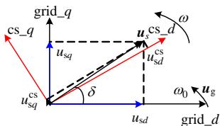  
(a) 坐标角度关系

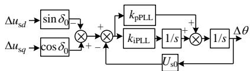  
(b) PLL传递函数  
图 4 锁相环闭环模型  
Fig. 4 Closed-loop model of PLL

由图 4(a)可见，将电气系统 $d q$ 坐标系下 PCC电压变换至控制系统 $d q$ 坐标系下电压，可表示为

$$
\left[ \begin{array}{l} \Delta u _ {\mathrm {s d}} ^ {\mathrm {c s}} \\ \Delta u _ {\mathrm {s q}} ^ {\mathrm {c s}} \end{array} \right] = \boldsymbol {T} _ {\mathrm {p l}} \cdot \left[ \begin{array}{l} \Delta u _ {\mathrm {s d}} \\ \Delta u _ {\mathrm {s q}} \end{array} \right] + \boldsymbol {T} _ {\mathrm {p 2}} \cdot \Delta \theta \tag {18}
$$

其中：

$$
\left\{ \begin{array}{l} \boldsymbol {T} _ {\mathrm {p} 1} = \left[ \begin{array}{c c} \cos \theta_ {0} & \sin \theta_ {0} \\ - \sin \theta_ {0} & \cos \theta_ {0} \end{array} \right] _ {2 \times 2} \\ \boldsymbol {T} _ {\mathrm {p} 2} = \left[ \begin{array}{c} U _ {\mathrm {s} q 0} \cos \theta_ {0} - U _ {\mathrm {s} d 0} \sin \theta_ {0} \\ - U _ {\mathrm {s} d 0} \cos \theta_ {0} - U _ {\mathrm {s} q 0} \sin \theta_ {0} \end{array} \right] _ {2 \times 1} \end{array} \right. \tag {19}
$$

稳态时 $ { \theta _ { 0 } } \mathrm { { = } }  { \delta _ { 0 } }$ ， $U _ { \mathrm { s } d 0 } .$ 、 $U _ { \mathrm { s } q 0 }$ 分别为电气系统 $d q$ 坐标系下PCC点在d 轴和q轴电压的稳态分量。在控制系统 $d q$ 坐标系下，交流电流变换至电气系统 $d q$ 坐标系下交流电流的表达式为

$$
\left[ \begin{array}{l} \Delta i _ {\mathrm {s d}} \\ \Delta i _ {\mathrm {s q}} \end{array} \right] = \boldsymbol {T} _ {\mathrm {p 1}} ^ {- 1} \cdot \left[ \begin{array}{l} \Delta i _ {\mathrm {s d}} ^ {\mathrm {c s}} \\ \Delta i _ {\mathrm {s q}} ^ {\mathrm {c s}} \end{array} \right] + \boldsymbol {T} _ {\mathrm {p 3}} \cdot \Delta \theta \tag {20}
$$

式中 $\pmb { T } _ { \mathrm { P 3 } } \mathrm { = } [ - I _ { \mathrm { s } q 0 } , I _ { \mathrm { s } d 0 } ] ^ { \mathrm { T } }$ 。

式(18)—(20)共同组成电气系统 $d q$ 坐标系与控制系统 $d q$ 坐标系的接口。根据式(18)可得 PLL 模型，如图 4(b)所示。选取状态变量 $\scriptstyle \pmb { x } _ { \mathrm { p l l } } = [ x _ { \mathrm { p l l 1 } } , x _ { \mathrm { p l l 2 } } ] ^ { \mathrm { T } }$ ，

其中， $x _ { \mathrm { p l l } 1 }$ 为 PLL 控制器积分环节的变量， $x _ { \mathrm { p l l } 2 }$ 为PLL 输出环节的变量 $( \Delta x _ { \mathrm { p l l } 2 } { = } \Delta \theta )$ ；控制变量 $\pmb { u } _ { \mathrm { p l l } } = [ u _ { \mathrm { s } d } ,$ $\boldsymbol { u } _ { \mathrm { s } q } \mathrm { J } ^ { \mathrm { T } }$ ；输出变量 $\scriptstyle y _ { \mathrm { p l l } } = \Delta x _ { \mathrm { p l l } 2 }$ 。可得 PLL 状态空间模型：

$$
\left\{ \begin{array}{l} \Delta \dot {\boldsymbol {x}} _ {\mathrm {p l l}} = \boldsymbol {A} _ {\mathrm {p l l}} \cdot \Delta \boldsymbol {x} _ {\mathrm {p l l}} + \boldsymbol {B} _ {\mathrm {p l l}} \cdot \Delta \boldsymbol {u} _ {\mathrm {p l l}} \\ \Delta \boldsymbol {y} _ {\mathrm {p l l}} = \boldsymbol {C} _ {\mathrm {p l l}} \cdot \Delta \boldsymbol {x} _ {\mathrm {p l l}} \end{array} \right. \tag {21}
$$

式中： $A _ { \mathrm { p l l } } = [ 0 , - k _ { \mathrm { i P L L } } U _ { \mathrm { s 0 } } ; 1 , - k _ { \mathrm { p P L L } } U _ { \mathrm { s 0 } } ] ; B _ { \mathrm { p l l } } = [ - k _ { \mathrm { i P L L } } \sin$ $\theta _ { 0 } , - k _ { \mathrm { i } \mathrm { P L L } } \cos \theta _ { 0 } ; - k _ { \mathrm { p P L L } } \sin \theta _ { 0 } , - k _ { \mathrm { p P L L } } \cos \theta _ { 0 } ] ; \ C _ { \mathrm { p l l } } = [ 0 , 1 ] ;$ $U _ { \mathrm { s 0 } }$ 为 PCC 点相电压稳态幅值； $k _ { \mathrm { p P L L } } , ~ k _ { \mathrm { i P L L } }$ 分别为PLL控制器的比例与积分系数。

需要说明的是，式(17)在本文中将应用于控制系统的 $d q$ 坐标系下，其电压和电流等物理量均需加上标 $^ { 6 6 } \mathrm { c s } ^ { \prime \prime }$ 。

# 1.3.2 外环(outer loop)控制器模型

当前柔直工程普遍采用的是定功率或定电压控制模式，因此，本文对虚拟同步机及下垂控制不予建模。本文选择 2 种控制模式进行建模：1）定有功和定无功控制模式；2）定交流电压和定直流电压控制模式。其中，定功率控制模式采用直接功率控制方式。综上，可得采用第 1 种控制模式时外环控制器的状态空间模型：

$$
\left\{ \begin{array}{l} \Delta \dot {\boldsymbol {x}} _ {\mathrm {o l}} = \boldsymbol {A} _ {\mathrm {o l}} \Delta \boldsymbol {x} _ {\mathrm {o l}} + \boldsymbol {B} _ {\mathrm {o l 1}} \Delta \boldsymbol {u} _ {\mathrm {o l 1}} + \boldsymbol {B} _ {\mathrm {o l 2}} \Delta \boldsymbol {u} _ {\mathrm {o l 2}} + \boldsymbol {B} _ {\mathrm {o l 3}} \Delta \boldsymbol {u} _ {\mathrm {o l 3}} \\ \Delta \boldsymbol {y} _ {\mathrm {o l}} = \boldsymbol {C} _ {\mathrm {o l}} \Delta \boldsymbol {x} _ {\mathrm {o l}} + \boldsymbol {D} _ {\mathrm {o l 1}} \Delta \boldsymbol {u} _ {\mathrm {o l 1}} + \boldsymbol {D} _ {\mathrm {o l 2}} \Delta \boldsymbol {u} _ {\mathrm {o l 2}} + \boldsymbol {D} _ {\mathrm {o l 3}} \Delta \boldsymbol {u} _ {\mathrm {o l 3}} \\ = \mathbf {0} \quad = \mathbf {0} \end{array} \right. \tag {22}
$$

式中：状态变量 $\scriptstyle \pmb { x } _ { \mathrm { o l } } = { \boldsymbol { x } } _ { \mathrm { u s } d \_ \mathrm { f i l } }$ 为外环电压输入环节一阶低通滤波器的输出值，该低通滤波器的截止角频率为 $\omega _ { \mathrm { f i l \_ u a c } } ;$ ；控制变量 $\pmb { u } _ { \mathrm { o l l } } = \boldsymbol { u } _ { \mathrm { d c } } \setminus \pmb { u } _ { \mathrm { o l 2 } } = [ \boldsymbol { u } _ { \mathrm { s } d } ^ { \mathrm { c s } } , \boldsymbol { u } _ { \mathrm { s } q } ^ { \mathrm { c s } } ] ^ { \mathrm { T } } \setminus \pmb { u } _ { \mathrm { o l 3 } } =$ $[ P ^ { * } , Q ^ { * } ] ^ { \mathrm { T } }$ ；输出变量 $\mathbf { y } _ { \mathrm { { o l } } } \mathrm { { = } } [ i _ { \mathrm { s } d } ^ { \mathrm { { * } , \mathrm { c s } } } , i _ { \mathrm { s } q } ^ { \mathrm { { * } , \mathrm { c s } ~ \mathrm { { * } } } } ] ^ { \mathrm { T } } \mathrm { { ; } } ~ A _ { \mathrm { { o l } } } \mathrm { { = } } \mathrm { { - } } \omega _ { \mathrm { { f i l } } \_ \mathrm { { u a c } } } \mathrm { { ; } }$ ；

$B _ { \mathrm { o l 2 } } { = } 0 ; B _ { \mathrm { o l 2 } } { = } [ \omega _ { \mathrm { f i l \_ u a c } } , 0 ] ; B _ { \mathrm { o l 3 } } { = } 0 ; C _ { \mathrm { o l } } { = } [ - 2 P ^ { * } / ( 3 U ^ { 2 } \mathrm { _ s } 0 )$ ，$2 Q ^ { * } / ( 3 U _ { \mathrm { s 0 } } ^ { 2 } ) ] ^ { \mathrm { T } } ; \ D _ { \mathrm { o l 3 } } = [ ( 2 / ( 3 U _ { \mathrm { s 0 } } ) , \ 0 ; \ 0 - 2 / ( 3 U _ { \mathrm { s 0 } } ) ] ; \ P ^ { * }$ 和Q*为有功和无功参考值。

当考虑第2种定直流电压和交流电压控制模式时，外环控制器的状态空间模型与第 1种相同，不同的是矩阵元素。此时，状态变量 $\scriptstyle { \pmb { x } } _ { 0 } = [ x _ { \mathrm { u d c \_ f i l } } , x _ { \mathrm { u d c } } ,$ ,$x _ { \mathrm { u s } d \_ f i l } , \ x _ { \mathrm { u a c } } \mathrm { ] ^ { T } , } x _ { \mathrm { u d c \_ f i l } }$ 为外环直流电压输入环节一阶低通滤波器的输出值，该低通滤波器的截止角频率为 $\omega _ { \mathrm { f i l \_ u d c } } , \enspace \boldsymbol { x } _ { \mathrm { u d c } } \cdot \textit { x } _ { \mathrm { u a c } }$ 分别为直流电压和交流电压控制器的积分环节状态变量；控制变量 $\scriptstyle { \pmb { u } } _ { 0 } 1 1 = { \pmb { u } } _ { \mathrm { d c } } .$ 、$\pmb { u } _ { \mathrm { o l 2 } } \mathrm { = } [ \ u _ { \mathrm { s } d } ^ { \mathrm { c s } } \ , \ u _ { \mathrm { s } q } ^ { \mathrm { c s } } ] ^ { \mathrm { T } } \cdot \ u _ { \mathrm { o l 3 } } \mathrm { = } [ \boldsymbol { U } ^ { \ast } \mathrm { d c } , \ \boldsymbol { U } ^ { \ast } \mathrm { s } ] ^ { \mathrm { T } }$ 。其余矩阵：

$$
A _ {\mathrm {o l}} = \left[ - \omega_ {\text {f i l} \_ \mathrm {u d c}}, 0, 0, 0; - k _ {\mathrm {i d c}}, 0, 0, 0; 0, 0, - \omega_ {\text {f i l} \_ \mathrm {u a c}}, 0; 0, \right.
$$

$$
0, - k _ {\mathrm {i a c}}, 0 ]; \quad B _ {\mathrm {o l l}} = [ \omega_ {\mathrm {f i l} _ {\mathrm {u d c}}}, 0, 0, 0 ] ^ {\mathrm {T}}; \quad B _ {\mathrm {o} 2} = [ 0, 0; 0, 0;
$$

$$
\omega_ {\text {f i l} _ {\text {u a c}}}, 0; 0, 0 ]; \quad B _ {o 3} = [ 0, 0; k _ {\text {i d c}}, 0; 0, 0; 0, k _ {\text {i a c}} ];
$$

$$
C _ {\mathrm {o l}} = \left[ - k _ {\mathrm {p d c}}, 1, 0, 0; 0, 0, - k _ {\mathrm {p a c}}, 1 \right]; D _ {\mathrm {o} 3} = \left[ k _ {\mathrm {p d c}}, 0; 0, k _ {\mathrm {p a c}} \right];
$$

$k _ { \mathrm { p d c } } , ~ k _ { \mathrm { i d c } }$ 分别为直流电压控制器的比例与积分系数； $k _ { \mathrm { p a c } } \setminus k _ { \mathrm { i a c } }$ 分别为交流电压控制器的比例与积分系数。

# 1.3.3 电流内环(current loop)控制器模型

电流内环采用常规的控制方式，其中，电压前馈环节的一阶低通滤波器截止角频率为 $w _ { \mathrm { f f w \_ u a c } } ,$ ，则电流内环控制器的状态空间模型为

$$
\left\{ \begin{array}{l} \Delta \dot {\boldsymbol {x}} _ {\mathrm {c l}} = \boldsymbol {A} _ {\mathrm {c l}} \Delta \boldsymbol {x} _ {\mathrm {c l}} + \boldsymbol {B} _ {\mathrm {c l} 1} \Delta \boldsymbol {u} _ {\mathrm {c l} 1} + \boldsymbol {B} _ {\mathrm {c l} 2} \Delta \boldsymbol {u} _ {\mathrm {c l} 2} + \boldsymbol {B} _ {\mathrm {c l} 3} \Delta \boldsymbol {u} _ {\mathrm {c l} 3} \\ \Delta \boldsymbol {y} _ {\mathrm {c l}} = \boldsymbol {C} _ {\mathrm {c l}} \Delta \boldsymbol {x} _ {\mathrm {c l}} + \boldsymbol {D} _ {\mathrm {c l} 1} \Delta \boldsymbol {u} _ {\mathrm {c l} 1} + \boldsymbol {D} _ {\mathrm {c l} 2} \Delta \boldsymbol {u} _ {\mathrm {c l} 2} + \boldsymbol {D} _ {\mathrm {c l} 3} \Delta \boldsymbol {u} _ {\mathrm {c l} 3} \\ = \mathbf {0} \end{array} \right. \tag {23}
$$

式中：状态变量 $\scriptstyle x _ { \mathrm { o l } } = [ x _ { \mathrm { f f w \_ u s } d } , x _ { \mathrm { f f w \_ u s } q } , x _ { \mathrm { i s } d } , x _ { \mathrm { i s } q } ] ^ { \mathrm { T } }$ ，前 2个状态变量为前馈环节一阶低通滤波器的输出值，后2个状态变量为d轴和q轴电流控制器积分环节状态变量； $\pmb { u } _ { \mathrm { c l l } } = [ \ : i _ { s d } ^ { * , \mathrm { c s } }$ ,  *,cssqi ]T ； $\pmb { u } _ { \mathrm { c l 2 } } { = } [ \ : i _ { \mathrm { s } d } ^ { \mathrm { c s } } \ : , \ : \ : i _ { \mathrm { s } q } ^ { \mathrm { c s } } \ : ] ^ { \mathrm { T } }$ ；$\boldsymbol { u } _ { \mathrm { c l 3 } } = [ u _ { s d } ^ { \mathrm { c s } } , u _ { \mathrm { s } q } ^ { \mathrm { c s } } ] ^ { \mathrm { T } } ; A _ { \mathrm { c l } } = [ - \omega _ { \mathrm { f f w \_ u a c } } , 0 , 0 , 0 ; 0 , - \omega _ { \mathrm { f f w \_ u a c } } , 0 , $ ,$0 ; 0 , 0 , 0 , 0 ; 0 , 0 , 0 , 0 ] ; ~ B _ { \mathrm { c l i } } = [ 0 , 0 ; 0 , 0 ; k _ { \mathrm { i i } } , 0 ; 0 , k _ { \mathrm { i i } } ] ;$ ；$B _ { \mathrm { c l 2 } } = [ 0 , 0 ; 0 , 0 ; - k _ { \mathrm { i i } } , 0 ; 0 , - k _ { \mathrm { i i } } ] ; B _ { \mathrm { c l 3 } } = [ \omega _ { \mathrm { f f w \_ u a c } } , 0 ; 0 , 0 ] .$ ,$\omega _ { \mathrm { f f w } _ { - } \mathrm { u a c } } ; ~ 0 , ~ 0 ; ~ 0 , ~ 0 ] ; ~ C _ { \mathrm { c l } } = [ 1 , ~ 0 , ~ - 1 , ~ 0 ; ~ 0 , ~ 1 , ~ 0 , ~ - 1 ] ;$ $D _ { \mathrm { c l l } } = [ - k _ { \mathrm { p i } } , \ 0 ; \ 0 , \ - k _ { \mathrm { p i } } ] ; \ D _ { \mathrm { c l 2 } } = [ k _ { \mathrm { p i } } , \ \omega L _ { \mathrm { e q } } ; \ - \omega L _ { \mathrm { e q } } , \ k _ { \mathrm { p i } } ] ;$ ；$D _ { \mathrm { c l 3 } } \mathrm { = } \{ \omega _ { \mathrm { f f w _ { \mathrm { - } } u a c } } , 0 ; 0 , \omega _ { \mathrm { f f w _ { \mathrm { - } } u a c } } ; 0 , 0 ; 0 , 0 ] ; k _ { \mathrm { p i } } , k _ { \mathrm { i i } }$ 分别为电流控制器的比例和积分系数

# 1.3.4 环流抑制控制器模型

在二倍频负序 $d q$ 坐标系中，采用常规控制策略实现环流抑制，选取状态变量 $\pmb { x } _ { \mathrm { c i r } } { = } [ x _ { \mathrm { i c i r } d } , x _ { \mathrm { i c i r } q } ] ^ { \mathrm { T } }$ ，控制变量 $\pmb { u } _ { \mathrm { c i r } } = [ \ : i _ { \mathrm { c i r } d } ^ { \mathrm { c s } } \ : , \ : i _ { \mathrm { c i r } q } ^ { \mathrm { c s } } \ : ] ^ { \mathrm { T } }$ ，输出变量 $\scriptstyle y _ { \mathrm { c i r } } = \left[ u _ { \mathrm { c i r } d } ^ { * , \mathrm { c s } } \right.$ ,$u _ { \mathrm { c i r } q } ^ { * , \mathrm { c s } } ] ^ { \mathrm { T } }$ ，则环流抑制控制器的状态空间模型为

$$
\left\{ \begin{array}{l} \Delta \dot {\boldsymbol {x}} _ {\text {c i r}} = \boldsymbol {A} _ {\text {c i r}} \cdot \Delta \boldsymbol {x} _ {\text {c i r}} + \boldsymbol {B} _ {\text {c i r}} \cdot \Delta \boldsymbol {u} _ {\text {c i r}} \\ \Delta \boldsymbol {y} _ {\text {c i r}} = \boldsymbol {C} _ {\text {c i r}} \cdot \Delta \boldsymbol {x} _ {\text {c i r}} + \boldsymbol {D} _ {\text {c i r}} \cdot \Delta \boldsymbol {u} _ {\text {c i r}} \end{array} \right. \tag {24}
$$

式中： $A _ { \mathrm { c i r } } = [ 0 , 0 ; 0 , 0 ] ; B _ { \mathrm { c i r } } = [ k _ { \mathrm { i c i r } } , 0 ; 0 , k _ { \mathrm { i c i r } } ] ; C _ { \mathrm { c i r } } = [ 1 , 0 ;$ ;0, 1]； $D _ { \mathrm { c i r } } \mathrm { = } [ k _ { \mathrm { p c i r } } , - 2 \omega L _ { \mathrm { a r m } } ; 2 \omega L _ { \mathrm { a r m } } , k _ { \mathrm { p c i r } } ] ; k _ { \mathrm { p c i r } } \times k _ { \mathrm { i c i r } }$ 分别为环流抑制控制器的比例与积分系数。

# 1.3.5 大链路延时的Pade等效模型

链路延时 $T _ { \mathrm { d e } }$ 在 s 域的表达式为 $\mathrm { e x p } ( - T _ { \mathrm { d e } } \ s )$ ，其为 1 个无理函数，为建立柔性直流系统的整体闭环状态空间模型，需要准确模拟链路延时环节。传统小功率两电平换流器所采用的一阶或二阶线性化模型，在延时小于 $2 0 0 \mu \mathrm { s }$ 且频率小于1kHz时，能实现准确模拟，然而在频率 2kHz 且大链路延时情况下则难以实现模拟。渝鄂工程南通道换流站整体的链路延时约为 $5 5 0 \mu \mathrm { s }$ ，且换流站需检测2kHz范围内的谐波。为解决大链路延时的模拟问题，可采用高阶的 Pade 函数[26]，则链路延时 $\mathrm { e x p } ( - T _ { \mathrm { d e } } \ s )$

可估计为

$$
\mathrm {e} ^ {- T _ {\mathrm {d e}} s} \approx \frac {c _ {0} + \dots + c _ {i} \left(T _ {\mathrm {d e}} s\right) ^ {i} + \dots + c _ {n} \left(T _ {\mathrm {d e}} s\right) ^ {n}}{d _ {0} + \dots + d _ {i} \left(T _ {\mathrm {d e}} s\right) ^ {i} + \dots + d _ {n} \left(T _ {\mathrm {d e}} s\right) ^ {n}} \tag {25}
$$

其中，

$$
\left\{ \begin{array}{l} c _ {i} = (- 1) ^ {i} \frac {(2 n - i) ! \cdot n !}{(n - i) ! \cdot i !}, i = 0, 1, \dots .., n \\ d _ {i} = | c _ {i} | \end{array} \right. \tag {26}
$$

可得链路延时的n阶状态空间模型：

$$
\left\{ \begin{array}{l} \Delta \dot {\boldsymbol {x}} _ {\mathrm {d e}} = \boldsymbol {A} _ {\mathrm {d e}} \cdot \Delta \boldsymbol {x} _ {\mathrm {d e}} + \boldsymbol {B} _ {\mathrm {d e}} \cdot \Delta \boldsymbol {u} _ {\mathrm {d e}} \\ \Delta \boldsymbol {y} _ {\mathrm {d e}} = \boldsymbol {C} _ {\mathrm {d e}} \cdot \Delta \boldsymbol {x} _ {\mathrm {d e}} + D _ {\mathrm {d e}} \cdot \Delta \boldsymbol {u} _ {\mathrm {d e}} \end{array} \right. \tag {27}
$$

由于延时需要使用4次，因此，可以将输入量$U _ { \mathrm { d e } }$ 表示为集合 $\{ e _ { \mathrm { v } d } ^ { \ast , \mathrm { c s } } , e _ { \mathrm { v } q } ^ { \ast , \mathrm { c s } } , u _ { \mathrm { c i r } d } ^ { \ast , \mathrm { c s } } , u _ { \mathrm { c i r } q } ^ { \ast , \mathrm { c s } } \} ; X _ { \mathrm { d e } } { = } [ x _ { \mathrm { d e } _ { - } 1 } ,$ *,cs *,cs$\ldots , x _ { \mathrm { d e } \_ i } , . . . , x _ { \mathrm { d e } \_ n } ] ^ { \mathrm { T } }$ 为 $U _ { \mathrm { d e } }$ 取上面4个任一输入量时对应的状态变量； $D _ { \mathrm { d e } } { = } c _ { \mathrm { n } } / d _ { \mathrm { n } }$ ，其余矩阵为：

$$
\boldsymbol {A} _ {\mathrm {d e}} = \left[ \begin{array}{c c c c c} 0 & 1 & \dots & 0 & 0 \\ 0 & 0 & \dots & 0 & 0 \\ \dots & \dots & \dots & \dots & \dots \\ 0 & 0 & \dots & 0 & 1 \\ - \frac {d _ {0}}{d _ {n} T _ {\mathrm {d e}} ^ {n}} & - \frac {d _ {1}}{d _ {n} T _ {\mathrm {d e}} ^ {n - 1}} & \dots & - \frac {d _ {n - 2}}{d _ {n} T _ {\mathrm {d e}} ^ {2}} & - \frac {d _ {n - 1}}{d _ {n} T _ {\mathrm {d e}}} \end{array} \right] \tag {28}
$$

$$
\boldsymbol {B} _ {\mathrm {d e}} = [ 0, \dots , 0, \dots , 0, \frac {T _ {\mathrm {d e}} ^ {- n}}{d _ {n}} ] ^ {\mathrm {T}} \tag {29}
$$

$$
C _ {\mathrm {d e}} (i) = \left(d _ {n} \cdot c _ {i - 1} - c _ {n} \cdot d _ {i - 1}\right) T _ {\mathrm {d e}} ^ {i - 1} / d _ {n} (i = 1, 2, \dots , n) \tag {30}
$$

为确定 Pade 函数的阶数，6 阶和 8 阶在延时$5 5 0 \mu \mathrm { s }$ 且频率在2.5kHz范围内的响应曲线如图5所示，可以看出，在2.0kHz范围内时，6阶模拟和8阶模拟的误差基本小于 0.005，但是为更好地模拟纯延时环节，以及分析是否存在更高频率的稳定性问题，本文采用 8阶Pade函数进行模拟。实际上，8 阶 Pade 模型在延时 $5 5 0 \mu \mathrm { s }$ 的情况下，能够在3.2kHz 范围内使得实部和虚部的绝对误差值小于2%，本文后续稳定性分析不稳定特征根的谐振频率超过该范围时，可能存在较大误差，其变化轨迹仅

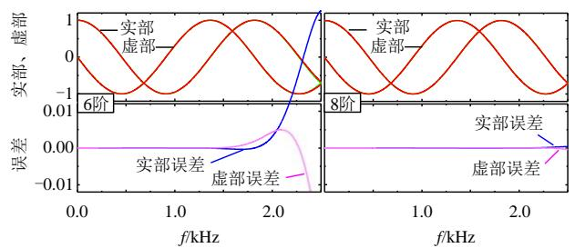  
图 5 Pade模拟误差分析  
Fig. 5 Error analysis of Pade approximation

供参考。

# 1.4 考虑延时的MMC 状态空间模型

整理各个环节的状态空间矩阵，可得：

$$
\Delta \dot {\boldsymbol {x}} _ {\mathrm {m c}} = (\boldsymbol {A} _ {\mathrm {m c}} + \boldsymbol {B} _ {\mathrm {m c} 2} \boldsymbol {D} _ {\mathrm {D E}} \boldsymbol {D} _ {\mathrm {c l} 2} \boldsymbol {C} _ {\mathrm {m c} 1} + \boldsymbol {B} _ {\mathrm {m c} 3} \boldsymbol {D} _ {\mathrm {D E}} \boldsymbol {D} _ {\mathrm {c i r}} \boldsymbol {C} _ {\mathrm {m c} 2}) \cdot
$$

$$
\Delta \boldsymbol {x} _ {\mathrm {m c}} + \boldsymbol {B} _ {\mathrm {m c} 1} \boldsymbol {T} _ {\mathrm {p} 2} \boldsymbol {C} _ {\mathrm {p l l}} \cdot \Delta \boldsymbol {x} _ {\mathrm {p l l}} + \boldsymbol {B} _ {\mathrm {m c} 2} \boldsymbol {D} _ {\mathrm {D E}} \boldsymbol {D} _ {\mathrm {c l l}} \boldsymbol {C} _ {\mathrm {o t}}.
$$

$$
\Delta \boldsymbol {x} _ {\mathrm {o l}} + \boldsymbol {B} _ {\mathrm {m c 2}} \boldsymbol {D} _ {\mathrm {D E}} \boldsymbol {C} _ {\mathrm {c l}} \cdot \Delta \boldsymbol {x} _ {\mathrm {c l}} + \boldsymbol {B} _ {\mathrm {m c 3}} \boldsymbol {D} _ {\mathrm {D E}} \boldsymbol {C} _ {\mathrm {c i r}} \cdot \Delta \boldsymbol {x} _ {\mathrm {c i r}} +
$$

$$
\boldsymbol {B} _ {\mathrm {m c 2}} \boldsymbol {C} _ {\mathrm {D E}} \cdot \Delta \boldsymbol {x} _ {\text {e v d q} _ {-} \text {d e}} + \boldsymbol {B} _ {\mathrm {m c 3}} \boldsymbol {C} _ {\mathrm {D E}} \cdot \Delta \boldsymbol {x} _ {\text {c i r d q} _ {-} \text {d e}} +
$$

$$
\boldsymbol {B} _ {\mathrm {m c} 1} \boldsymbol {T} _ {\mathrm {p} 1} \cdot \Delta \boldsymbol {u} _ {\mathrm {s d} q} + \boldsymbol {B} _ {\mathrm {m c} 2} \boldsymbol {D} _ {\mathrm {D E}} \boldsymbol {D} _ {\mathrm {c l} 1} \boldsymbol {D} _ {\mathrm {o l} 3} \cdot \Delta \boldsymbol {R} ^ {*} \tag {31}
$$

$$
\Delta \dot {\boldsymbol {x}} _ {\mathrm {p l l}} = \boldsymbol {A} _ {\mathrm {p l l}} \cdot \Delta \boldsymbol {x} _ {\mathrm {p l l}} + \boldsymbol {B} _ {\mathrm {p l l}} \cdot \Delta \boldsymbol {u} _ {\mathrm {s d q}} \tag {32}
$$

$$
\Delta \dot {\boldsymbol {x}} _ {\mathrm {o l}} = \boldsymbol {B} _ {\mathrm {o l 1}} \boldsymbol {C} _ {\mathrm {m c 3}} \cdot \Delta \boldsymbol {x} _ {\mathrm {m c}} + \boldsymbol {B} _ {\mathrm {o l 2}} \boldsymbol {T} _ {\mathrm {p 2}} \boldsymbol {C} _ {\mathrm {p l l}} \cdot \Delta \boldsymbol {x} _ {\mathrm {p l l}} +
$$

$$
\boldsymbol {A} _ {\mathrm {o l}} \cdot \Delta \boldsymbol {x} _ {\mathrm {o l}} + \boldsymbol {B} _ {\mathrm {o l} 2} \boldsymbol {T} _ {\mathrm {p} 1} \cdot \Delta \boldsymbol {u} _ {\mathrm {s d q}} + \boldsymbol {B} _ {\mathrm {o l} 3} \cdot \Delta \boldsymbol {R} ^ {*} \tag {33}
$$

$$
\Delta \dot {\mathbf {x}} _ {\mathrm {c l}} = \boldsymbol {B} _ {\mathrm {c l 2}} \boldsymbol {C} _ {\mathrm {m c} 1} \cdot \Delta \boldsymbol {x} _ {\mathrm {m c}} + \boldsymbol {B} _ {\mathrm {c l 3}} \boldsymbol {T} _ {\mathrm {p 2}} \boldsymbol {C} _ {\mathrm {p l l}} \cdot \Delta \boldsymbol {x} _ {\mathrm {p l l}} + \boldsymbol {B} _ {\mathrm {c l 1}} \boldsymbol {C} _ {\mathrm {o l}}.
$$

$$
\Delta \boldsymbol {x} _ {\mathrm {o l}} + \boldsymbol {A} _ {\mathrm {c l}} \cdot \Delta \boldsymbol {x} _ {\mathrm {c l}} + \boldsymbol {B} _ {\mathrm {c l 3}} \boldsymbol {T} _ {\mathrm {p l}} \cdot \Delta \boldsymbol {u} _ {\mathrm {s d q}} + \boldsymbol {B} _ {\mathrm {c l 1}} \boldsymbol {D} _ {\mathrm {o l 3}} \cdot \Delta \boldsymbol {R} ^ {*} \tag {34}
$$

$$
\Delta \dot {\mathbf {x}} _ {\text {c i r}} = \boldsymbol {B} _ {\text {c i r}} \boldsymbol {C} _ {\mathrm {m c} 2} \cdot \Delta \boldsymbol {x} _ {\mathrm {m c}} + \boldsymbol {A} _ {\text {c i r}} \cdot \Delta \boldsymbol {x} _ {\text {c i r}} \tag {35}
$$

$$
\Delta \dot {\boldsymbol {x}} _ {\mathrm {e v d q} _ {\mathrm {d e}}} = \boldsymbol {B} _ {\mathrm {D E}} \boldsymbol {D} _ {\mathrm {c l 2}} \boldsymbol {C} _ {\mathrm {m c l}} \cdot \Delta \boldsymbol {x} _ {\mathrm {m c}} + \boldsymbol {B} _ {\mathrm {D E}} \boldsymbol {C} _ {\mathrm {c l}} \cdot \Delta \boldsymbol {x} _ {\mathrm {c l}} +
$$

$$
\boldsymbol {B} _ {\mathrm {D E}} \boldsymbol {D} _ {\mathrm {c l l}} \boldsymbol {C} _ {\mathrm {o l}} \cdot \Delta \boldsymbol {x} _ {\mathrm {o l}} + \boldsymbol {A} _ {\mathrm {D E}} \cdot \Delta \boldsymbol {x} _ {\text {e v d q} _ {\text {d e}}} +
$$

$$
\boldsymbol {B} _ {\mathrm {D E}} \boldsymbol {D} _ {\mathrm {c l 1}} \boldsymbol {D} _ {\mathrm {o l 3}} \cdot \Delta \boldsymbol {R} ^ {*} \tag {36}
$$

$$
\Delta \dot {\mathbf {x}} _ {\text {c i r d} q \_ \text {d e}} = \boldsymbol {B} _ {\mathrm {D E}} \boldsymbol {D} _ {\text {c i r}} \boldsymbol {C} _ {\text {m c 2}} \cdot \Delta \boldsymbol {x} _ {\text {m c}} + \boldsymbol {A} _ {\mathrm {D E}} \cdot \Delta \boldsymbol {x} _ {\text {c i r d} q \_ \text {d e}} +
$$

$$
\boldsymbol {B} _ {\mathrm {D E}} \boldsymbol {C} _ {\mathrm {c i r}} \cdot \Delta \boldsymbol {x} _ {\mathrm {c i r}} \tag {37}
$$

式 (31)—(37) 中 ： $\scriptstyle { \pmb { u } } _ { \mathrm { s } d q } = [ { \boldsymbol { u } } _ { \mathrm { s } d } ,$ $\boldsymbol { u } _ { \mathrm { s } q } \mathrm { J } ^ { \mathrm { T } }$ ； $\pmb { R } ^ { * } { = } [ P ^ { * } ( U ^ { * } \mathrm { d } \mathrm { c } )$ ,$Q ^ { * } ( U ^ { * } \mathrm { s } ) ] ^ { \mathrm { T } } \} \ x _ { \mathrm { e v } d q _ { - } \mathrm { d e } \setminus } \ x _ { \mathrm { c i r } d q _ { - } \mathrm { d e } }$ 分别为延时环节的状态变量； $A _ { \mathrm { D E } } { = } [ A _ { \mathrm { d e } } ,$ , 0; 0, Ade]； $\pmb { B } _ { \mathrm { D E } } { = } [ \pmb { B } _ { \mathrm { d e } } , \ \mathbf { 0 } ; \ \mathbf { 0 } , \ \pmb { B } _ { \mathrm { d e } } ]$ ；

$$
C _ {\mathrm {D E}} = \left[ C _ {\mathrm {d e}}, 0; 0, C _ {\mathrm {d e}} \right]; D _ {\mathrm {D E}} = \left[ D _ {\mathrm {d e}}, 0; 0, D _ {\mathrm {d e}} \right] 。
$$

同理，可得交流电流 ${ \Delta } i _ { \mathrm { s } d q } { = } [ \Delta i _ { \mathrm { s } d } , ~ \Delta i _ { \mathrm { s } q } ] ^ { \mathrm { T } }$ 的表达式为

$$
\Delta \dot {\boldsymbol {i}} _ {\mathrm {s d} q} = \boldsymbol {T} _ {\mathrm {p} 1} ^ {- 1} \boldsymbol {C} _ {\mathrm {m c} 1} \cdot \Delta \boldsymbol {x} _ {\mathrm {m c}} + \boldsymbol {T} _ {\mathrm {p} 3} \boldsymbol {C} _ {\mathrm {p l l}} \cdot \Delta \boldsymbol {x} _ {\mathrm {p l l}} \tag {38}
$$

选取 MMC 本体及其控制系统的状态变量$\begin{array} { r } { \pmb { x } _ { \mathrm { m m c } } = [ \pmb { x } _ { \mathrm { m c } } ; \pmb { x } _ { \mathrm { p l l } } ; \pmb { x } _ { \mathrm { o l } } ; \pmb { x } _ { \mathrm { c l } } ; \pmb { x } _ { \mathrm { c i r } } ; \pmb { x } _ { \mathrm { e v } d q _ { - } \mathrm { d e } } ; \pmb { x } _ { \mathrm { c i r } d q _ { - } \mathrm { d e } } ] ; } \end{array}$ ；控制变量 ummc1[usd, usq]T、 $\scriptstyle { \pmb u } _ { \mathrm { m m c 2 } } = { \pmb R } ^ { * }$ ；输出变量 $y _ { \mathrm { { m m c } } } = [ i _ { \mathrm { { s } } d } ,$ ,$i _ { \mathrm { s } q } \mathrm { J ^ { T } } .$ 。可得考虑控制过程和延时之后且变换至电气系统 $d q$ 坐标系下MMC 的状态空间矩阵：

$$
\left\{ \begin{array}{l} \Delta \dot {\mathbf {x}} _ {\mathrm {m m c}} = \mathbf {A} _ {\mathrm {m m c}} \Delta \mathbf {x} _ {\mathrm {m m c}} + \mathbf {B} _ {\mathrm {m m c} 1} \Delta \mathbf {u} _ {\mathrm {m m c} 1} + \mathbf {B} _ {\mathrm {m m c} 2} \Delta \mathbf {R} ^ {*} \\ \Delta \mathbf {y} _ {\mathrm {m m c}} = [ \Delta i _ {\mathrm {s d}}; \Delta i _ {\mathrm {s q}} ] = \mathbf {C} _ {\mathrm {m m c}} \cdot \Delta \mathbf {x} _ {\mathrm {m m c}} \end{array} \right. \tag {39}
$$

式(39)为 1 个 53 阶(定功率控制)或 56 阶(定电压控制)的模型。

# 1.5 考虑延时的换流站线性化模型验证

为验证所建立MMC线性化模型的正确性，在MATLAB仿真系统中搭建电磁暂态仿真模型，系统主电路参数和控制系统参数如表 1、2 所示。

初始有功 0.5pu，无功为 0pu，在 0.8s 时，有

表 1 换流站主电路参数  
Table 1 Main circuit parameters of station   
表 2 MMC控制器主要参数  

<table><tr><td>项目</td><td>取值</td><td>项目</td><td>参数值</td></tr><tr><td>交流电压/kV</td><td>525</td><td>额定功率/MW</td><td>1250</td></tr><tr><td>直流电压/kV</td><td>840</td><td>子模块电容/mF</td><td>11</td></tr><tr><td>桥臂子模块数/个</td><td>500/540</td><td>桥臂阻/感</td><td>0.1Ω/140mH</td></tr><tr><td>换流变阻抗/pu</td><td>0.14</td><td>换流变变比</td><td>525/435</td></tr></table>

Table 2 Main controllers' parameters of MMC   

<table><tr><td>控制器</td><td>取值</td><td>控制器</td><td>取值</td></tr><tr><td>交流电压kp</td><td>0.004</td><td>交流电压ki</td><td>0.1</td></tr><tr><td>直流电压kp</td><td>0.027</td><td>直流电压ki</td><td>0.67</td></tr><tr><td>电流内环kp</td><td>137</td><td>电流内环ki</td><td>4120</td></tr><tr><td>环流抑制kp</td><td>100</td><td>环流抑制器ki</td><td>2000</td></tr><tr><td>锁相环kp</td><td>0.001</td><td>锁相环ki</td><td>0.01</td></tr></table>

功参考值阶跃至 0.55pu，考虑 550s 延时，对折算至阀侧的电磁暂态模型和线性化模型计算波形进行对比，如图6所示，从上至下分别为d轴电流(kA)、q 轴电流(A)、A相下桥臂电容电压平均值(kV)。由图 6可知，线性化模型计算曲线基本从中间穿过电磁暂态模型仿真曲线，验证所建 MMC 线性化模型的正确性。

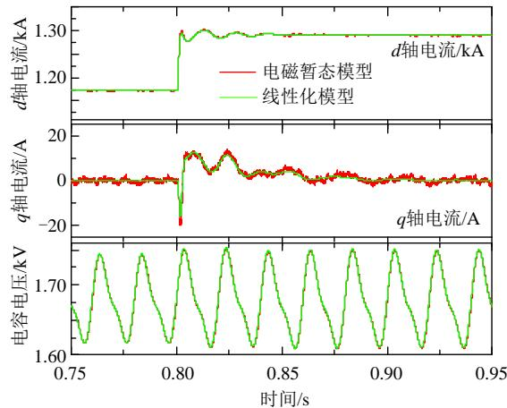  
图 6 考虑延时的 MMC线性化模型验证  
Fig. 6 Linearized model validation of MMC with time delay

# 2 交流系统状态空间模型

柔性直流工程的高频振荡特性与所连接的交流系统及线路长度有很大的关联，需要对其进行准确模拟。以渝鄂工程南通道接入重庆侧为例，所连接的交流线路长度约为118km，交流线路采用双回4LGJ500/45型号的架空线，单回线路单位长度实测等效参数为：r0.0147/km、l0.8047mH/km、$c { = } 0 . 0 1 4 3 5 4 \mu \mathrm { F / k m }$ 。考虑单个或少量个集中参数模型难以准确模拟长交流线路的分布式参数模型，因

此，需要采用多个集中参数模型进行模拟。为建模方便，线路另一端的交流系统等值阻抗用 $R _ { \mathrm { g } }$ 和 $L _ { \mathrm { g } }$ 模拟，线路长度为 Llength，采用 $N _ { \mathrm { n u m } }$ 个模型进行模拟，则交流系统的等效模型如图 7所示。

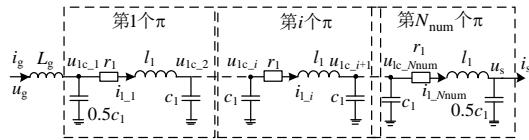  
图 7 交流系统等效模型  
Fig. 7 Equivalent model of AC system

图7中： ${ \mathrm { : } } u _ { \mathrm { g } }$ 为电源电压；交流线路的第i(i1, $2 , . . . ,$ ,$N _ { \mathrm { n u m } } )$ 个模型的节点电压和电流分别为 $u _ { \mathrm { l c } \_ i }$ 和 $i _ { \mathrm { l } \_ { i } }$ 电阻 $r _ { 1 } { = } L _ { \mathrm { l e n g t h } } ~ r / N _ { \mathrm { n u m } }$ 、电感 $l _ { 1 } { = } L _ { \mathrm { l e n g t h } } ~ { \ell } / N _ { \mathrm { n u m } }$ 、电容$c _ { 1 } { = } L _ { \mathrm { l e n g t h } } ~ c / N _ { \mathrm { n u m } } \circ$ 。考虑电磁暂态模型较多，本文不再赘述。在以电源电压矢量 $\pmb { u } _ { \mathrm { g } }$ 为定向的电气系统$d q$ 坐标系下，则 $\Delta u _ { \mathrm { g } d } { = } 0$ 且 $\Delta u _ { \mathrm g q } { = } 0$ 。可选取状态变量$\pmb { x } _ { \mathrm { g r i d } } = [ ( u _ { 1 \mathrm { c } d _ { - } 1 } , \ u _ { 1 \mathrm { c } q _ { - } 1 } , \ i _ { 1 d _ { - } 1 } , \ i _ { 1 q _ { - } 1 } ) , \ \dots , ( u _ { 1 \mathrm { c } d _ { - } i } , \ u _ { 1 \mathrm { c } q _ { - } i } , \ i _ { 1 d _ { - } i } , \ i _ { 1 q _ { - } 1 } ) ]$ $i _ { 1 q _ { - } i } ) , ~ . . . , ~ ( u _ { \mathrm { l c } d \_ { N n u m } } , ~ u _ { \mathrm { l c } q \_ N n u m } , ~ i _ { 1 d \_ N n u m } , ~ i _ { 1 q \_ N n u m } ) , ~ ( u _ { \mathrm { s } d } , ~ u _ { \mathrm { s } q } ,$ $i _ { \mathrm { g } d } , i _ { \mathrm { g } q } ) ] ^ { \mathrm { T } }$ ；控制变量 $\boldsymbol { \mathbf { \mathit { u } } } _ { \mathrm { g r i d } } { = } [ i _ { \mathrm { s } d } , i _ { \mathrm { s } q } ] ^ { \mathrm { T } } ;$ ；输出变量 $y _ { \mathrm { g r i d } } { = } [ u _ { \mathrm { s } d } ,$ $u _ { \mathrm { s } q } \mathrm { J } ^ { \mathrm { T } } .$ 。可得交流系统在自身电气系统 $d q$ 坐标系下的状态空间模型为

$$
\left\{ \begin{array}{l} \Delta \dot {\boldsymbol {x}} _ {\text {g r i d}} = \boldsymbol {A} _ {\text {g r i d}} \cdot \Delta \boldsymbol {x} _ {\text {g r i d}} + \boldsymbol {B} _ {\text {g r i d}} \cdot \Delta \boldsymbol {u} _ {\text {g r i d}} \\ \Delta \boldsymbol {y} _ {\text {g r i d}} = \boldsymbol {C} _ {\text {g r i d}} \cdot \Delta \boldsymbol {x} _ {\text {g r i d}} + \boldsymbol {D} _ {\text {g r i d}} \cdot \Delta \boldsymbol {u} _ {\text {g r i d}} \\ = 0 \end{array} \right. \tag {40}
$$

式(40)所示交流等效系统的状态空间模型阶数为 $4 N _ { \mathrm { n u m } } { + } 4$ 。多个集中参数等效模型在 2.5kHz左右能够准备模拟交流线路阻抗幅值和相位特性，如果以相位发生改变的频率相对误差不超过 1%为基准[21]，则至少需要13个模型，为更加准确模拟高频特性，本文采用20 个模型模拟交流线路特性，交流系统阶数为84。

# 3 换流站控制系统对高频稳定性的影响

在 1—2 节中，分别建立考虑控制系统及其延时在内的MMC线性化数学模型和交流等效系统的数学模型。本节将利用2个状态空间模型的输入与输出关系建立整个柔性直流输电系统的整体状态空间模型，根据式(39)—(40)可得整个闭环系统的状态空间模型：

$$
\boldsymbol {A} _ {\text {s y s}} = \left[ \begin{array}{c c} \boldsymbol {A} _ {\text {m m c}} & \boldsymbol {B} _ {\text {m m c 1}} \boldsymbol {C} _ {\text {g r i d}} \\ \boldsymbol {B} _ {\text {g r i d}} \boldsymbol {C} _ {\text {m m c}} & \boldsymbol {A} _ {\text {g r i d}} \end{array} \right] \tag {41}
$$

由式(41)构成的整个柔性直流输电系统是 1 个$4 N _ { \mathrm { n u m } } { + } 5 7$ 阶或 $4 N _ { \mathrm { n u m } } { + } 6 0$ 阶的模型，当 $N _ { \mathrm { n u m } } { = } 2 0$ 时，整个闭环系统的阶数达到137 阶或 140阶。

考虑到外环带宽较低，功率控制模式和交流电压控制模式对高频稳定性的影响较小，本文以功率控制模式为例，定量辨识各个影响环节对高频振荡的参与程度。在有功功率为0.5pu 情况下，线性化整个系统，其中，外环控制器的一阶低通滤波器截止频率为 20Hz，电压前馈通道的截止频率为 400Hz。

本文是基于正序 $d q$ 坐标系建立的状态空间模型，如果系统在 abc 坐标系下存在正负序的谐振且频率为 $f _ { \mathrm { h } }$ ，则在本文模型中将存在谐振频率为$f _ { \mathrm { h } } { - } 5 0$ 和 $f _ { \mathrm { h } } { + } 5 0$ 的不稳定特征根。相反地，如果本文建立的理论模型中存在虚部为 $f _ { \mathrm { h 1 } }$ 和 $f _ { \mathrm { h } 2 }$ 的不稳定特征根，且这 2 对不稳定特征根的虚部相差在100Hz 附近，则可认为 abc 坐标系下的谐振频率为$( f _ { \mathrm { h 1 } } { + } f _ { \mathrm { h 2 } } ) / 2$ 。

当有功为 0.5pu 时，系统有 2 对不稳定特征根为 $\lambda _ { 1 1 3 , 1 1 4 = 2 0 9 . 7 \pm \mathrm { j } 5 0 7 4 . 3 }$ 和 $\lambda _ { 1 1 5 , 1 1 6 } { = } 1 7 0 . 6 { \pm } \mathrm { j } 4 4 7 2 . 2 $ ，经计算可得谐振频率约为 759.6Hz。当有功为0.5pu时，有 2 对不稳定特征根为 $\lambda _ { 1 1 3 , 1 1 4 } { = } 2 1 6 . 5 { \pm } { \mathrm { j } } 5 0 1 5 . 1$ 和 $\lambda _ { 1 1 5 , 1 1 6 } { = } 1 6 7 . 3 { \pm } \mathrm { j } 4 4 0 2 . 7$ ，此时，谐振频率约为$7 4 9 . 5 \mathrm { H z } _ { \mathrm { \Theta } }$ 。引起实部值较大的原因是由于 MMC输出阻抗在谐振频率处的相位较大导致，如果能够降低MMC 输出阻抗的相位大小，就能降低不稳定特征根实部值的大小。

对上述的不稳定特征根进行参与变量和参与因子分析(归一为最大值)，MMC 主要参与变量如表 3所示，参与变量的参与因子如图 8 所示。由表中 3可知，d轴和q轴电流、d轴和 q轴延时环节的前4个变量、电压前馈通道滤波器、锁相环输出值及外环电压低通滤波器对不稳定特征根贡献较大，环流抑制控制器及其延时环节基本没有贡献。由图8可

表 3 功率控制模式下 MMC的主要参与变量  
Table 3 Main participation variables of MMC under power-controlled mode   

<table><tr><td>有功功率/pu</td><td>不稳定根</td><td>MMC主要参与变量</td></tr><tr><td rowspan="2">0.5</td><td>λ113,114</td><td>isq, isd, evq_de1, evd_de1, evq_de2, evd_de2, xffw_q, xffw_d, evq_de3, θ, evd_de3, evq_de4, evd_de4, xfil_ac</td></tr><tr><td>λ115,116</td><td>isd, evd_de1, isq, evq_de1, evd_de2, evq_de2, xffw_d, xffw_q, θ, evd_de3, evq_de3, evd_de4, evq_de4, xfil_ac</td></tr><tr><td rowspan="2">-0.5</td><td>λ113,114</td><td>isd, isq, evd_de1, evq_de1, evd_de2, evq_de2, xffw_d, xffw_q, evd_de3, evq_de3, θ, evd_de4, evq_de4, xfil_ac</td></tr><tr><td>λ115,116</td><td>isq, evq_de1, isd, evd_de1, evq_de2, evd_de2, xffw_q, xffw_d, θ, evq_de3, evd_de3, evq_de4, evd_de4, xfil_ac</td></tr></table>

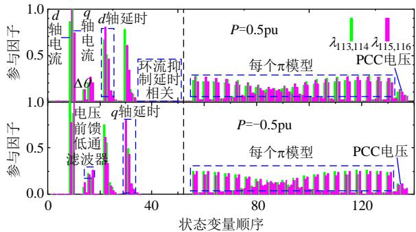  
图 8 功率控制模式下的参与因子  
Fig. 8 Participation factors of power-controlled mode

以看出，交流系统线路中各个模型对不稳定特征根的贡献程度相差不大。

综上可知，柔性直流输电系统高频振荡的主要影响环节为：电流内环、延时环节、电压前馈环节及锁相环。CCSC 对高频稳定性的影响较小，功率大小能在较小的范围内影响高频振荡频率。另外，由于系统存在 2对不稳定特征根，且两者的谐振频率差在 100Hz左右，说明柔性直流输电系统的高频振荡分量可能存在正序和负序 2种分量，且谐振频率为 2对不稳定特征根频率之和的 1/2。

功率控制模式下设定有功参考值为 0.5pu，无功功率为 0pu，延时在 $\scriptstyle t = 0 . 4 s$ 切换至 550us，具体的时域仿真波形和频域 FFT 分析如图 9所示。当延时切换之后，系统发生高频振荡现象，对其A 相电流进行 FFT 分析可知，谐振频率约为 759Hz， $\varXi$ 理论分析的 759.6Hz一致，从而验证理论模型构建的正确性。

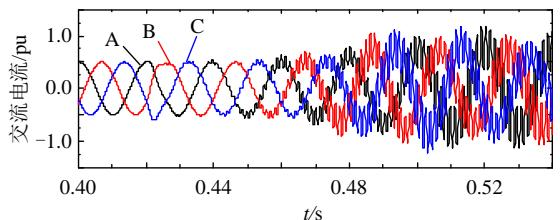  
(a) 时域波形

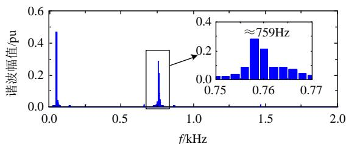  
(b) A相电流频域FFT分析  
图 9 三相电流仿真结果  
Fig. 9 Simulation results of AC current

# 3.1 内环带宽对稳定性的影响

根据高频不稳定特征根参与因子的分析结果，本节将分析电流内环带宽大小如何影响高频振荡，

模型设置如下：功率控制模式下，有功功率为0.5pu，无功功率为 0pu，内环带宽由 500rad/s 增加至3000rad/s，系统特征根轨迹如图 10 所示。渝鄂工程南通道换流站只监测 2kHz 内的谐波，同时工程经验表明，更高次的谐波相对容易滤除，因此，图 10 中只给出感兴趣的频率范围(更高频率无不稳定特征根)，考虑对称性也只给出正虚部。

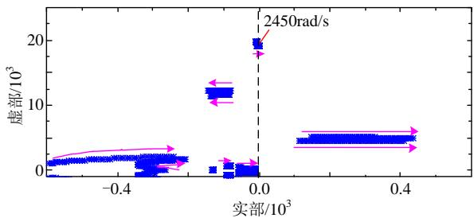  
图 10 电流环带宽对高频稳定性的影响  
Fig. 10 Influence of current loop bandwidth on high frequency stability

由图10可知，即使是电流环带宽只有500rad/s，系统仍可能不能稳定运行。另外，随着电流环带宽的增大，系统的 2 对不稳定特征根111, 112 和113, 114快速向右移动，进一步恶化稳定特性；当带宽大于2450rad/s 时，系统出现第 3 对不稳定特征根97, 98，对应谐振频率约为3kHz。可以看出，过大的电流环带宽将恶化系统运行稳定性，降低电流环的带宽可以相对增强稳定性，但是过低的电流环带宽可能导致系统在交流系统故障和功率紧急控制等大扰动情况下，不能较好地跟踪参考值，很有可能导致系统暂态失稳使得换流站闭锁。

# 3.2 延时大小对稳定性的影响

根据参与因子分析出的高频振荡关键影响因素，本节将研究延时大小如何影响高频稳定性，模型设置如下：功率控制模式下，有功功率为0.5pu，无功功率为 0pu，延时从 10s 以 10s 的步长增加至 600s，系统特征根轨迹如图 11所示。

由图 11 可知，不稳定特征根会因延时大小不同在不同的椭圆范围内做循环移动，如当延时在160~390s 范围内，可能存在谐振频率为 1930Hz

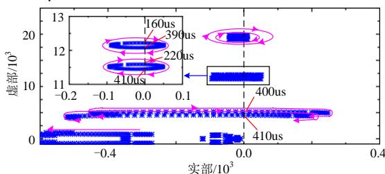  
图 11 延时大小对高频稳定性的影响  
Fig. 11 Influence of time delay on high frequency stability

的振荡，该振荡频率相对 760Hz 附近内的谐振频率更加容易抑制。当延时大于400s时，出现760Hz左右振荡，同样这2对不稳定特征呈现椭圆变化趋势。由 6对不稳定特征根可知，谐振频率越大，椭圆长轴越短，实部越小，也越容易抑制。

参与因子分析表明，CCSC 及其延时环节基本不影响高频稳定性，为验证该结论，电磁暂态仿真设置如下：有功功率为 0.5pu，无功功率为 0pu，所有采样测量环节的延时保持不变，去掉电流内环输出环节的执行延时，只保留 CCSC 的执行延时，延时在 t0.74s 执行，仿真波形如图 12 所示。当延时切换时功率存在扰动，随后进入稳态，至仿真时间 2s 结束，延时切换之后功率未发生高频振荡，可以看出，CCSC 环节基本不影响交流系统高频振荡。

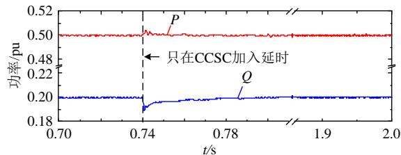  
图 12 只在 CCSC加入延时的仿真波形  
Fig. 12 Simulation results only with CCSC considering time delay

# 3.3 电压前馈对稳定性的影响

本节分析电压前馈一阶低通滤波器带宽对高频稳定性的影响，模型设置如下：功率控制模式下，有功为 0pu，无功为 0pu，一阶低通滤波器带宽从0Hz(相当于无前馈)变化至 5000Hz(类似于直接前馈)，具体的根轨迹如图13(a)所示。

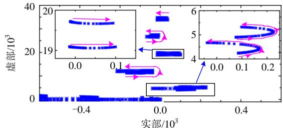

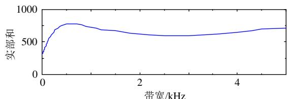  
(a) 根轨迹   
(b)所有不稳定特征根实部和  
图 13 电压前馈低通滤波器带宽对高频稳定性的影响  
Fig. 13 Influence of low pass filter's bandwidth of voltage feed forward on high frequency stability

由图 13(a)可知，振荡频率在 760Hz 左右的特征根随着电压前馈低通滤波器带宽的增大先向右移动再向左移动，然而振荡频率在 3000Hz 的特征根会一直从左向右进入右半平面。所有不稳定特征根实部之和随着带宽变化的曲线如图 13(b)所示，在带宽小于 500Hz的范围内，带宽越小则实部和越小，相对稳定性则更好，可认为当带宽为 0时，即没有电压前馈，系统的稳定性是最高的。此时，系统不稳定特征根为 76.0j4899.7 和 85.3j4239.9，对应振荡频率约为 727.1Hz，该环节也是渝鄂工程抑制高频振荡时所修改的地方。

# 3.4 PLL 对稳定性的影响

PLL 通过锁定 PCC 点电压相位向控制系统提供同步角度，同时实现电压和电流的正反向变换，其动态特性将在一定程度上影响 MMC 运行性能。在新能源并联领域已有大量文献研究 PLL 对低频段逆变器的影响，但是对高频段的影响如何少有文献研究。本节将在整流和逆变2种状态下，研究PLL参数如何影响高频运行稳定性。模型设置如下：有功功率0.5pu，无功功率 $0 . 2 \mathrm { p u } ;$ ；积分系数为 10 倍比例系数(实际上积分系数对高频稳定性的影响非常小)，比例系数从0增加至0.01，具体的根轨迹如图 14所示。

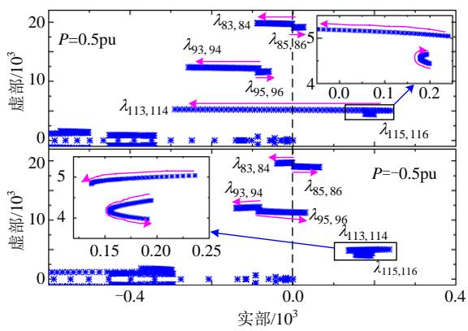  
图 14 PLL 对高频稳定性的影响  
Fig. 14 Influence of PLL on high frequency stability

整流状态下，初期有4对不稳定特征根，即 $\lambda _ { 8 3 , }$ 84、85, 86、113, 114、115, 116。随着参数的增大， $\lambda _ { 8 3 , 8 4 }$ 和 $\lambda _ { 1 1 3 , 1 1 4 }$ 快速向左移动进入左半平面， $\lambda _ { 8 5 , 8 6 }$ 则向右移动， $\lambda _ { 1 1 5 , ~ 1 1 6 }$ 先向左移动再向右移动，但始终在右半平面，说明整流状态下，适当增加PLL参数可在一定程度上提高系统运行性能，但是PLL参数也不宜增大太大，否则可能导致更高频率的振荡问题。

逆变状态下，初期有3对不稳定特征根，即 $\lambda _ { 8 5 , }$ $8 6 \setminus \ \lambda _ { 1 1 3 , 1 1 4 , \ } \setminus \lambda _ { 1 1 5 , 1 1 6 \circ }$ 。随着 PLL 参数的增大， $\lambda _ { 8 5 , }$ 86

右移动， $\lambda _ { 8 3 , ~ 8 4 } , ~ \lambda _ { 9 3 , ~ 9 4 }$ 和 $\lambda _ { 1 1 3 , ~ 1 1 4 }$ 向左移动，115, 116先向左移动再向右移动。当比例系数大于 0.0026时，系统出现新的不稳定特征根 $\lambda 9 5 , 9 6$ ，说明逆变状态下增加PLL参数可能恶化系统运行特性。

在上述2 种运行工况下，这些不稳定特征中，谐振频率为 760Hz 左右的特征根是系统的主导不稳定根。为分析不同无功状态下和PLL积分系数对稳定性的影响，表 4给出有功功率为 0.5pu情况下，谐振频率为 760Hz左右的不稳定特性根。由表4 可知，PLL积分系数对高频稳定性的影响较小，MMC发出容性无功功率可在一定程度上提升运行稳定性。

表 4 不同无功功率和 PLL参数下的不稳定特征根  
Table 4 Unstable eigenvalues under different reactive power and PLL's parameters   

<table><tr><td>Q/pu</td><td>kpPLL=0.001, kiPLL=0.01</td><td>kpPLL=0.001, kiPLL=0.1</td></tr><tr><td>0.2</td><td>202.7±j5076, 189.7±j4474</td><td>203.2±j5077, 190.3±j4474</td></tr><tr><td>-0.2</td><td>221.0±j5073, 157.3±j4469</td><td>220.6±j5073, 157.9±j4470</td></tr></table>

# 3.5 CCSC 对稳定性的影响

参与因子分析表明，CCSC 控制器及其延时环节的相关变量基本为零，说明对高频稳定性的影响很小，本节将给出不同运行功率和不同控制器参数下谐振频率为 760Hz左右的不稳定特征根，具体如表 5所示。由表5 可知，即使是在同一个运行工况下，CCSC 的参数变化很大也不会导致 2 对不稳定特征根有较大的变化，与参与因子分析情况一致。

表 5 不同无功功率和 PLL参数下的不稳定特征根  
Table 5 Unstable eigenvalues under different reactive power and PLL's parameters   

<table><tr><td>P、Q/pu</td><td>kpcir=10, kicir=200</td><td>kpcir=200, kicir=4000</td></tr><tr><td>0.5, 0.2</td><td>202.7±j5076, 189.7±j4474</td><td>202.7±j5076, 189.7±j4474</td></tr><tr><td>0.5, -0.2</td><td>221.0±j5073, 157.3±j4469</td><td>221.1±j5073, 157.4±j4469</td></tr><tr><td>-0.5, 0.2</td><td>209.2±j5015, 186.8±j4403</td><td>209.2±j5015, 186.7±j4403</td></tr><tr><td>-0.5, -0.2</td><td>228.1±j5015, 153.8±j4402</td><td>228.2±j5015, 153.9±j4402</td></tr></table>

本节采用参与因子和根轨迹方法，重点分析MMC 控制系统相关环节对高频稳定性的影响，结果表明，该系统可能存在 760Hz、1900Hz 及 3100Hz左右的振荡问题，其中，以 760Hz左右的振荡问题较为突出，对高频振荡的抑制可从内环、电压前馈及降低延时等方面开展，改变环流抑制控制器参数难以影响高频振荡特性。

# 4 交流系统对高频稳定性的影响

柔性直流输电系统的高频振荡是由换流站和

交流系统共同产生，在第3节中已经分析控制系统相关环节和参数对高频稳定性的影响，本节将从交流系统角度分析相关参数如何影响高频稳定性。

# 4.1 电网阻抗对稳定性的影响

柔性直流输电系统所接入的交流系统存在多种运行方式，其中，交流系统电磁环网的开/合环运行对等效阻抗 $Z _ { \mathrm { g } } { = } R _ { \mathrm { g } } { + } L _ { \mathrm { g } } s$ 有较大的影响。本节将忽略等效电阻 $R _ { \mathrm { g } }$ 的影响，并改变等效电感 $L _ { \mathrm { g } }$ 的大小研究系统的高频振荡特性，其中， $L _ { \mathrm { g } }$ 从 1mH 到100mH 变化(对应短路比从7.3变化至3.6)。换流站采 用功 率控制 模式 ，功 率参 考值均 为 0pu，$k _ { \mathrm { p P L L } } { = } 0 . 0 1$ ， $k _ { \mathrm { i P L L } } { = } 0 . 1$ ，系统的根轨迹如图 15所示。

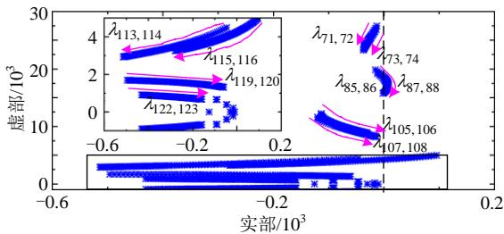  
图 15 电网阻抗对高频稳定性的影响  
Fig. 15 Influence of   
grid impedance on high frequency stability

由图 15 可知，随着电网阻抗的增大，几乎所有特征根的振荡频率均降低； $\lambda _ { 8 5 , 8 6 }$ 从左半平面进入右半平面之后，再进入左半平面， $\lambda _ { 8 7 , 8 8 }$ 进入右半平面之后，没有进入左半平面；113, 114和 $\lambda _ { 1 1 5 , 1 1 6 }$ 从右半平面快速向进入左半平面。另外，可预见继续随着 $L _ { \mathrm { g } }$ 的增大， $\lambda _ { 1 1 9 , 1 2 0 }$ 和 $\lambda _ { 1 2 2 , 1 2 3 }$ 将从左半平面进入右半平面，成为系统的主导不稳定特征根。

需要说明的是，在 $L _ { \mathrm { g } } { = } 1 0 0 \mathrm { m H }$ 时(对应短路比约为 3.6)，系统只有 1 对不稳定特征根87, 883.53j16374(对应谐振频率约为 2606Hz)。由于 $\mathcal { \lambda } _ { 8 7 , 8 8 }$ 与特征根85, 861.76j15752(对应频率 2507Hz)存在耦合作用，因此，对应时域的谐振频率约为 2556Hz左右。

为验证上述现象，设置电磁暂态仿真如下：MMC为功率控制模式，有功功率为 0.5pu，无功功率为 0，延时在 $t { = } 0 . 4 2 s$ 切换至 $5 5 0 \mu \mathrm { s }$ ，具体的仿真结果如图 16所示。可以看出，当延时切换至 $5 5 0 \mu \mathrm { s }$ 后，系统经过大约0.5s才开始出现高频谐振分量，取A相电流1.5~2s的数据进行FFT分析，由图16(b)可知，电磁暂态仿真得到的谐振频率约为 2562Hz，与理论分析的 2556Hz 相差较小，相对误差小于0.24%。

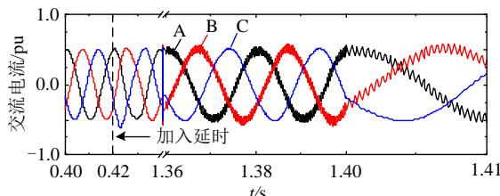

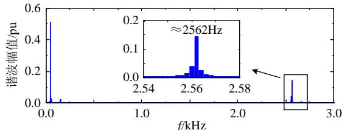  
(a) 时域波形  
(b) A电流频域FFT分析  
图 16 电网阻抗为 100mH 的仿真结果  
Fig. 16 Simulation results of $\scriptstyle L _ { \mathrm { { g } } = 1 0 0 \mathrm { { m H } } }$

# 4.2 线路参数对稳定性的影响

交流线路既有架空线也有电力电缆，不同交流线路及型号对应着不同的线路参数，架空线电感大于电力电缆的电感，而电力电缆的电容大于架空线电容。为分析不同交流线路对高频稳定性的影响，本节将研究不同交流线路情况下的根轨迹，其中,线路单位等效电感和电容之间应满足光速限制条件，本文取光速为 29.4 万 km/s。模型设置如下：MMC 为功率控制模式，有功和无功功率均为 0，单位等效电感假设从 0.02mH 到 2mH 之间变化，具体的根轨迹如图 17 所示。可以看出，当等效电感较小时，系统没有不稳定特征根，当单位等效电感大于 0.15mH 后，系统出现 1 对不稳定特征根$\lambda _ { 1 1 3 , 1 1 4 }$ ，且2对根是整个系统的主导不稳定根，随着等效电感增大(等效电容降低)，当等效电感大于0.19mH/km 后，继续出现新的不稳定特征根 $\lambda _ { 1 1 5 , 1 1 6 } ;$ 后续逐渐出现 $\lambda _ { 7 1 , 7 2 }$ 、73, 74、85, 86、87, 88 等不稳定特征根。电磁暂态仿真结果表明，电磁暂态模型稳定性强于理论分析模型，这些更高频率的不稳定特征根是由于理论模型电网等效电阻设置为零所导致的结果，实际工程中调试结果表明，2kHz 以上的高频振荡并未发生。

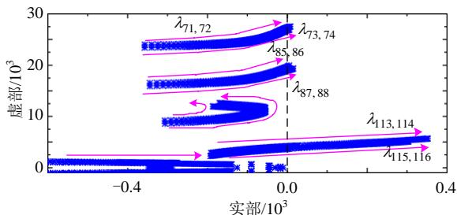  
图 17 交流线路参数对高频稳定性的影响  
Fig. 17 Influence of AC line parameters on stability

假设交流线路只有电阻和电感参数，没有分布电容参数，同时，令电网阻抗 $L _ { \mathrm { g } }$ 为 200mH(对应短路比约为 2.38)，功率控制模式下有功功率为 0.5pu，无功功率为0.2pu，向交流系统提供电压支撑，延时在 t0.74s时刻投入，具体的仿真波形如图 18 所示。由图 18 可知，只有在延时切换至 550s 时刻出现功率扰动，切换之后没有发生高频振荡现象，说明线路分布式电容是交流系统产生高频振荡的关键因素。这是因为换流站在高频段由于换流变和1/2 的桥臂电感构成阻抗特性，易与交流线路分布式电容耦合造成高频振荡，而不易与线路电感耦合造成振荡。

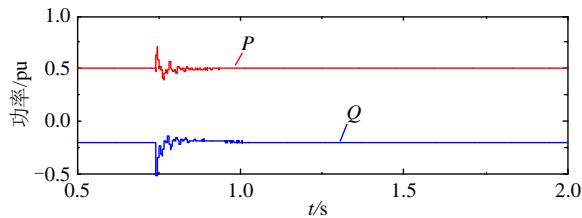  
图 18 交流线路参数没有电容的仿真结果  
Fig. 18 Simulation results of AC line without capacitance4.3 线路长度对稳定性的影响

柔直换流站接入交流系统的线路从几千米到百千米长度不等，本节分析不同交流线路长度对高频稳定性的影响，功率设置同 4.2 节，具体的根轨迹如图 19 所示。需要注意的是，系统有 6 对稳定特征根会随着线路长度增加在左半平面和右半平面来回摆动，且所有的谐振频率越来越低，且正实部越来越大。可以看出，柔性直流输电系统的高频振荡频率与接入的线路长度有很大关系；线路越长，则发生高频振荡的可能性增大，且潜在的振荡频率越低。

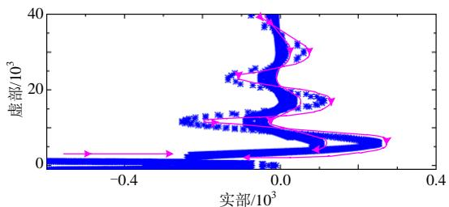  
图 19 交流线路长度对高频稳定性的影响  
Fig. 19 Influence of   
AC line length on high frequency stability

# 4.4 并联回数对稳定性的影响

渝鄂工程南通道渝侧实际是双回 500kV 线路接入，通过调整运行方式，既可以单回运行也可以双回运行，本节分析不同功率情况下单/双回的不稳定特征根，结果如表 6所示。可以看出，在本文主

表 6 单/双回线路的不稳定特征根  
Table 6 Unstable eigenvalues of single/double AC line   

<table><tr><td>P、Q/pu</td><td>单回线路</td><td>双回线路</td></tr><tr><td>0.5, 0.2</td><td>202.7±j5076, 189.7±j4474</td><td>113.2±j4699, 96.7±j4083</td></tr><tr><td>0.5,-0.2</td><td>221.0±j5073, 157.3±j4469</td><td>124.9±j4696, 75.8±j4080</td></tr><tr><td>-0.5, 0.2</td><td>209.2±j5015, 186.8±j4403</td><td>114.3±j4660, 93.5±j4037</td></tr><tr><td>-0.5,-0.2</td><td>228.1±j5015,153.8±j4402</td><td>126.4±j4659, 72.3±j4036</td></tr></table>

电路参数和经典控制系统下，双回线路运行时的稳定性相对大于单回线路运行时的稳定性，且谐振频率由 759Hz 左右降低为 699Hz 左右。

在 P0.5pu 和 Q0.2pu 的情况下，进行双回交流线路电磁暂态仿真，延时在t0.42s切换至550s，具体的仿真结果如图 20 所示。仿真结果表明，延时切换之后，系统发生高频振荡失稳现象，A相电流 FFT 分析表明谐振频率约为 700Hz，与理论分析的 699Hz基本一致。

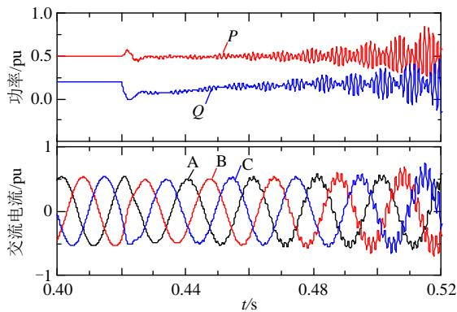

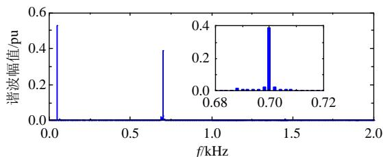  
(a)时域波形  
(b) A电流频域FFT分析  
图 20 双回交流线路的仿真结果  
Fig. 20 Simulation results of double AC lines

# 5 结论

本文建立考虑大链路延时的柔性直流输电系统状态空间模型，采用参与因子和根轨迹法研究高频稳定性的机理及关键影响因素，指出高频振荡是由交流系统和换流站共同作用产生，任一一方改变相关特性均可能影响其稳定性，得到结论如下：

1）MMC电流内环带宽、链路延时、电压前馈 环节、PLL和功率运行点是影响高频振荡的关键因 素，CCSC 对高频振荡的影响较小。降低电流环带

宽、链路延时、电压前馈低通滤波器带宽及整流运行工况能提升高频阻尼特性。

2）交流系统运行方式改变引起的电网阻抗改变、线路长度、分布式电容及单/双回线路均会影响高频稳定性，其中，交流系统由分布式电容呈现的容性特性与换流站的阻感特性容易使系统发生高频振荡，换流站应尽量接入短交流线路的电网以降低高频振荡风险。  
3）基于根轨迹变化规律，系统可能存在不同频率的高频振荡现象，至于运行方式改变引起的电网阻抗变化、单/双回线路运行情况、线路型号等因素在工程规划和设计前期是否会导致高频振荡需要综合考虑。  
4）高频振荡的抑制可以从交流系统、换流站控制系统及综合 2种情况进行研究，关于高频振荡抑制方案及其参数设计将在下一部分进行详细研究。

# 参考文献

[1] 汤广福，罗湘，魏晓光．多端直流输电与直流电网技术[J]．中国电机工程学报，2013，33(10)：8-17  
TANG Guangfu ， LUO Xiang ， WEI XiaoguangMulti-terminal HVDC and DC-grid technology[J]Proceedings of CSEE，2013，33(10)：8-17(in Chinese)  
[2] 郭贤珊，李云丰，谢欣涛，等．直驱风电场经柔直并网诱发的次同步振荡特性[J]．中国电机工程学报，2020，40(4)：1149-1160  
GUO Xianshan ，LI Yunfeng ，XIE Xintao ，et alSub-synchronous oscillation characteristics caused byPMSG-based wind plant farm integrated via flexibleHVDC system[J]．Proceedings of the CSEE，2020，40(4)：1149-1160 (in Chinese)  
[3] 冯俊杰，邹常跃，杨双飞，等．针对中高频谐振问题的柔性直流输电系统阻抗精确建模与特性分析[J]．中国电机工程学报，2020，40(15)：4805-4819  
FENG Junjie，ZOU Changyue，YANG Shuangfei，et al Accurate impedance modeling and characteristic analysis of VSC-HVDC system for mid- and high-frequency resonance problems[J]．Proceedings of the CSEE，2020， 40(15)：4805-4819 (in Chinese)   
[4] GUO Xianshan ， LI Yunfeng ， MEI Nian ， et alPre-charging strategy with damping control of isolatedstation connected to the modular multilevel converterbased DC grid[J] ． IET Generation ， Transmission&Distribution，2019，13(2)：316-326  
[5] 国家电网有限公司特高压建设部．渝鄂直流背靠背联网工程南通道OLT试验高频谐波问题研究报告[R]．2018：1-21．

State Grid Corporation of China．Research report on high frequency harmonics in OLT test of south corridor of YuE Back-to-Back HVDC Networking Project[R] ．2018 ： 1-21(in Chinese)   
[6] ZOU Changyue，RAO Hong，XU Shukai，et al．Analysis of resonance between a VSC-HVDC converter and the AC grid[J]．IEEE Transactions on Power Electronics，2018， 33(12)：10157-10168   
[7] ZHANG Ye，HONG Chao，TU Liang，et al．Research on High-frequency resonance mechanism and active harmonic suppression strategy of power systems with power electronics[C]//2018 International Conference on Power System Technology．Guangzhou：CSG Electric Power Research，2018：2350-2356   
[8] 郭贤珊，刘泽洪，李云丰，等．柔性直流输电系统高频振荡特性分析及抑制策略研究[J]．中国电机工程学报，2020，40(1)：19-29  
GUO Xianshan，LIU Zehong，LI Yunfeng，et al Characteristic analysis of high-frequency resonance of flexible high voltage direct current and research on its damping control strategy[J]．Proceedings of the CSEE， 2020，40(1)：19-29(in Chinese)   
[9] 尹聪琦，谢小荣，刘辉，等．柔性直流输电系统振荡现象分析与控制方法综述[J]．电网技术，2018，42(4)：1117-1123  
YIN Congqi，XIE Xiaorong，LIU Hui，et al．Analysis andcontrol of the oscillation phenomenon in VSC-HVDCtransmission system[J]．Power System Technology，2018，42(4)：1117-1123(in Chinese)  
[10] 李探，赵成勇，GOLE A M．MMC-HVDC 内部谐波模态识别及其稳定性分析[J]．中国电机工程学报，2017，37(8)：2185-2195  
LI Tan，ZHAO Chengyong，GOLE A M．Identificationand stability analysis of the internal harmonic modes ofthe MMC-HVDC system[J]．Proceedings of the CSEE，2017，37(8)：2185-2195(in Chinese)  
[11] HARNEFORS L，FINGER R，WANG Xiongfei，et al VSC input-admittance modeling and analysis above the nyquist frequency for Passivity-Based stability assessment[J] ． IEEE Transactions on Industrial Electronics，2017，64(8)：6362-6370   
[12] WANG Xiongfei，BLAABJERG F．Harmonic stability inpower Electronic-Based power systems ： concept ，modeling，and analysis[J]．IEEE Transactions on SmartGrid，2019，10(3)：2858-2870  
[13] SUN Jian，LIU Hanchao．Sequence impedance modeling of modular multilevel converters[J] ．IEEE Journal of Emerging and Selected Topics in Power Electronics， 2017，5(4)：1427-1443   
[14] 宋瑞华，郭剑波，李柏青，等．基于输入导纳的直驱风

电次同步振荡机理与特性分析[J]．中国电机工程学报，2017，37(16)：4662-4670  
SONG Ruihua ， GUO Jianbo ， LI Baiqing ， et alMechanism and characteristics of subsynchronousoscillation in Direct-Drive wind power Generation systembased on Input-Admittance analysis[J]．Proceedings of theCSEE，2017，37(16)：4662-4670(in Chinese)  
[15] LYU Jing，CAI Xu，MOLINAS M．Frequency domain stability analysis of MMC-Based HVDC for wind farm integration[J]．IEEE Journal of Emerging and Selected Topics in Power Electronics，2016，4(1)：141-151   
[16] 王旭斌，杜文娟，王海风．直驱风电并网系统中锁相环引起次同步振荡的开环模式谐振机理分析[J]．中国电机工程学报，2018，38(7)：1935-1950  
WANG Xubin ， DU Wenjuan ， WANG Haifeng ． Mechanism analysis of Open-loop modal resonance on subsynchronous oscillations caused by PLL in power systems with integrated PMSGs[J]．Proceedings of the CSEE，2018，38(7)：1935-1950(in Chinese)   
[17] 伍文华，陈燕东，罗安，等．海岛 VSC-HVDC 输电系统直流阻抗建模、振荡分析与抑制方法[J]．中国电机工程学报，2018，38(15)：4359-4368  
WU Wenhua，CHEN Yandong，LUO An，et al．DC impedance modeling，oscillation analysis and suppression method for VSC-HVDC system in the field of islands power supply[J]．Proceedings of the CSEE，2018，38(15)： 4359-4368(in Chinese)   
[18] LYU Jing，CAI Xu，AMIN M，et al．Sub-synchronousoscillation mechanism and its suppression in MMC-BasedHVDC connected wind farms[J] ． IET Generation ，Transmission & Distribution，2018，12(4)：1021-1029  
[19] LYU Jing，CAI Xu，MOLINAS M．Optimal design of controller parameters for improving the stability of MMC-HVDC for wind farm integration[J]．IEEE Journal of Emerging and Selected Topics in Power Electronics， 2018，6(1)：40-53   
[20] LYU Jing，ZHANG Xin，CAI Xu，et al．Harmonic State-Space based Small-Signal impedance modeling of a modular multilevel converter with consideration of internal harmonic dynamics[J]．IEEE Transactions on Power Electronics，2019，34(3)：2134-2148   
[21] 李云丰，汤广福，吴亚楠，等．直流电网建模分析与阻尼控制研究[J]．中国电机工程学报，2017，37(12)：3372-3382  
LI Yunfeng，TANG Guangfu，WU Yanan，et alModeling，analysis and damping control of DC grid[J]Proceedings of the CSEE，2017，37(12)：3372-3382(inChinese)  
[22] LI Yunfeng，TANG Guangfu，GE Jun，et al．Modeling and damping control of modular multilevel converter

based DC grid[J]．IEEE Transactions on Power Systems， 2018，33(1)：723-735   
[23] PAN Donghua，RUAN Xinbo，BAO Chenlei，et al Capacitor-current-feedback active damping with reduced computation delay for improving robustness of LCL-type grid-connected inverter[J]．IEEE Transactions on Power Electronics，2014，29(7)：3414-3427   
[24] YANG Dongsheng，RUAN Xinbo，WU Heng．Impedance shaping of the Grid-Connected inverter with LCL filter to improve its adaptability to the weak grid condition[J] IEEE Transactions on Power Electronics，2014，29(11)： 5795-5805   
[25] 吴恒，阮新波，杨东升．弱电网条件下锁相环对 LCL型并网逆变器稳定性的影响研究及锁相环参数设计[J]中国电机工程学报，2014，34(30)：5259-5268  
WU Heng，RUAN Xinbo，YANG Dongsheng．Research on the stability caused by Phase-locked loop for LCL-type Grid-connected inverter in weak grid condition[J] Proceedings of the CSEE，2014，34(30)：5259-5268(in Chinese)   
[26] 陈锦洲，陈磊，陈亦平，等．基于 Pade 近似的电力系统频率振荡模式延时轨迹分析[J]．电力系统自动化，2019，43(14)：120-125  
CHEN Jinzhou，CHEN Lei，CHEN Yiping，et al Trajectory analysis of time delay for frequency oscillation mode of power system based on Pade approximation[J] Automation of Electric Power Systems，2019，43(14)： 120-125(in Chinese)

  
李云丰

在线出版日期：2021-01-20。

收稿日期：2020-03-18。

作者简介：

李云丰(1988)，男，博士，讲师&高级工程师，研究方向为柔性直流输电技术、新能源发电与储能技术、铁路供电系统电能 质 量 治 理 ， liyunfeng@csust.edu.cn ，252415270@qq.com；

贺之渊(1977)，男，博士，教授级高级工程师，博士生导师，研究方向为直流输电和直流电网系统设计与装备研发；

庞辉(1980)，男，博士，教授级高级工程师，研究方向为直流输电和直流电网系统设计与装备研发；

阳岳希(1988)，女，硕士，高级工程师，研究方向为柔性直流输电工程成套设计；

季柯(1992)，男，博士研究生，研究方向为柔性直流输电技术。

(编辑 刘雪莹)

# High Frequency Stability Analysis and Suppression Strategy of MMC-HVDC Systems (Part I): Stability Analysis

Li Yunfeng1, He Zhiyuan2, Pang Hui2, Yang Yuexi2, Ji Ke2, Huang WeiYing3

(1. Changsha University of Science and Technology;

2. State Key Laboratory of Advanced Power Transmission Technology (Global Energy Interconnection Research Institute Co., Ltd.);   
3. Laboratory of Renewable Energy Electric-Technology of Hunan Province (Changsha University of Science and Technology))

KEY WORDS: flexible high voltage direct current; modular multilevel convert (MMC); state-space model; high-frequency resonance; stability analysis; root locus; participation factors

The phenomena of high frequency resonances caused by large time delay in flexible MMC-HVDC systems have appeared in practical projects. To explore the mechanism of high frequency resonance and its key influencing factors, the high frequency state space mathematical models of MMC and AC system are established. The studied system is plotted in Fig. 1.

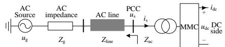  
Fig. 1 Main circuit diagram of the studied system

The state-space model of MMC system considering control processes can be expressed as

$$
\left\{ \begin{array}{l} \Delta \dot {\boldsymbol {x}} _ {\mathrm {m m c}} = \boldsymbol {A} _ {\mathrm {m m c}} \Delta \boldsymbol {x} _ {\mathrm {m m c}} + \boldsymbol {B} _ {\mathrm {m m c} 1} \Delta \boldsymbol {u} _ {\mathrm {m m c} 1} + \boldsymbol {B} _ {\mathrm {m m c} 2} \Delta \boldsymbol {R} ^ {*} \\ \Delta \boldsymbol {y} _ {\mathrm {m m c}} = \boldsymbol {C} _ {\mathrm {m m c}} \cdot \Delta \boldsymbol {x} _ {\mathrm {m m c}} \end{array} \right. \tag {1}
$$

where, $\scriptstyle \pmb { x } _ { \mathrm { m m c } } = [ \pmb { x } _ { \mathrm { m c } } ; \ \pmb { x } _ { \mathrm { p l l } } ;$ xol; xcl; xcir; xevdq_de; xcirdq_de], ${ \pmb u } _ { \mathrm { m m c l } } = [ u _ { s d } , u _ { s q } ] ^ { \mathrm { T } } , { \pmb u } _ { \mathrm { m m c 2 } } = { \pmb R } ^ { * } = [ { \pmb P } ^ { * } , { \pmb Q } ^ { * } ] ^ { \mathrm { T } } , { \pmb y } _ { \mathrm { m m c } } = [ i _ { s d } , i _ { s q } ] ^ { \mathrm { T } }$ . The state-space model of AC system can be expressed as

$$
\left\{ \begin{array}{l} \Delta \dot {\boldsymbol {x}} _ {\text {g r i d}} = \boldsymbol {A} _ {\text {g r i d}} \cdot \Delta \boldsymbol {x} _ {\text {g r i d}} + \boldsymbol {B} _ {\text {g r i d}} \cdot \Delta \boldsymbol {u} _ {\text {g r i d}} \\ \Delta \boldsymbol {y} _ {\text {g r i d}} = \boldsymbol {C} _ {\text {g r i d}} \cdot \Delta \boldsymbol {x} _ {\text {g r i d}} \end{array} \right. \tag {2}
$$

Combining Eq. (1) with Eq. (2), the system matrix $A _ { \mathrm { s y s } }$ of the integrated MMC-HVDC system can be expressed as

$$
\boldsymbol {A} _ {\text {s y s}} = \left[ \begin{array}{c c} \boldsymbol {A} _ {\text {m m c}} & \boldsymbol {B} _ {\text {m m c l}} \boldsymbol {C} _ {\text {g r i d}} \\ \boldsymbol {B} _ {\text {g r i d}} \boldsymbol {C} _ {\text {m m c}} & \boldsymbol {A} _ {\text {g r i d}} \end{array} \right] \tag {3}
$$

The order of the integrated model is $4 N _ { \mathrm { n u m } } { + } 5 7$ . The validation of linearized model is shown in Fig. 2.

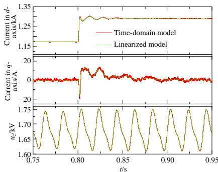  
Fig. 2 Validation of MMC considering time delay

There are two unstable roots $\lambda _ { 1 1 3 , 1 1 4 } { = } 2 1 0 { \pm } \mathrm { j } 5 0 7 4$ and $\lambda _ { 1 1 5 , 1 1 6 = 1 7 0 \pm \mathrm { j } 4 4 7 2 }$ under P0.5pu $( \lambda _ { 1 1 3 , 1 1 4 } = 2 1 7 \pm$

j5015 and $\lambda _ { 1 1 5 , 1 1 6 = 1 6 7 \pm \mathrm { j } 4 4 0 3 }$ under $P { = } { \mathrm { - } } 0 . 5 \mathrm { p u } )$ . The modal participation factor analyses of two cases are shown in Fig. 3, which indicates that the key influencing parts causing HFR are as follows: current controller, time delay, voltage feed-forward loop, and PLL. The outer loop, internal variables of MMC have a slight influence. The CCSC almost has no influence because the participation factors are very close to zero. The variables of AC line almost have the same participation factors.

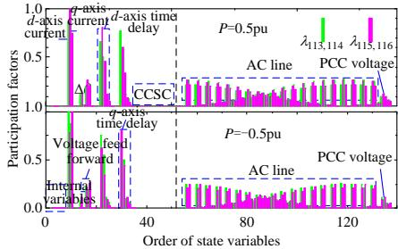  
Fig. 3 Participation factors causing HFRs

Time domain simulation results settings: P0.5pu and Q0pu, time delay switches to 550us at t0.4s. The time domain simulation waveforms and frequency domain FFT analysis are shown in Fig 4. There is a high frequency resonance occurred in the system after time delay switched to 550us. The FFT analysis shows that the resonant frequency is about 759Hz. It is consistent with the theoretical analysis of 759.6Hz. The correctness of the theoretical model is validated.

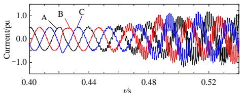  
(a) Waveforms of time domain simulation

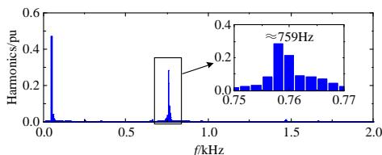  
(b) FFT of phase A current   
Fig. 4 Simulation results of AC current