# Including Magnetic Saturation in Voltage-Behind-Reactance Induction Machine Model for EMTP-Type Solution

Liwei Wang, Student Member, IEEE, and Juri Jatskevich, Senior Member, IEEE

Abstract—A voltage-behind-reactance (VBR) machine model has been recently proposed for the electro-magnetic transient programs (EMTP)-type simulation programs. The VBR model greatly improves numerical accuracy and efficiency compared with the traditional and phase-domain (PD) models. This paper extends the previous research and presents an approach to include magnetic saturation into the VBR induction machine model. The presented method takes into account the axes static and dynamic cross saturation, whereas the nonlinear magnetic characteristic is represented using a piecewise-linear method that is suitable for the EMTP solution approach. Case studies verify the new saturable VBR model and show that it has improved numerical stability and accuracy even at large time steps.

Index Terms—Electro-magnetic transient programs (EMTP), induction machine, magnetic saturation, piecewise-linear approximation, voltage-behind-reactance model.

# I. INTRODUCTION

R EPRESENTING magnetic saturation in induction ma-chine models greatly improves the modeling accuracy for chine models greatly improves the modeling accuracy for both steady states and transients. Depending on the modeling fidelity and applications, various models and approaches have been proposed to represent the machine magnetic saturation. To depict very fine geometrical/structural details and material characteristics, finite element (FE) models [1] and magnetic equivalent circuit (MEC) models [2], [3] are often used. For system studies, numerous induction machine models have been proposed to represent main magnetizing flux path saturation [4]–[7], leakage flux path saturation [8], [9], the deep-bar effects [10], [11], etc. Higher-order models capable of predicting the magnetic saturation and machine-inverter interaction at high switching frequency have been proposed in [12] and [13].

Manuscript received September 10, 2008; revised June 24, 2009. First published November 24, 2009; current version published April 21, 2010. This work was supported in part by the Natural Sciences and Engineering Research Council (NSERC) of Canada under the Discovery Grant, and in part by the Educational Grant from British Columbia Transmission Corporation and BC Hydro. Paper no. TPWRS-00744-2008.

The authors are with the Department of Electrical and Computer Engineering, University of British Columbia, Vancouver, BC V6T 1Z4, Canada (e-mail: liweiw@ece.ubc.ca; jurij@ece.ubc.ca).

Color versions of one or more of the figures in this paper are available online at http://ieeexplore.ieee.org.

Digital Object Identifier 10.1109/TPWRS.2009.2032659

The electro-magnetic transient programs (EMTP) [14] are often used for studying power systems transients, wherein the classical full-order machine models are typically considered sufficient [15], [16]. In the EMTP community, the magnetic saturation phenomena have also been included in various machine models [17]–[21] and software packages [22]–[25]. Examples of saturable models include the ATP’s universal machine model [17] and MicroTran model Type 50 [18]. Other commonly-used EMTP software packages such as PSCAD/EMTDC [22] and EMTP-RV [24] also include saturable models of induction machine.

These programs typically use built-in models and permit saturation of the main magnetizing flux and sometimes even leakage fluxes. In EMTP, the nonlinear magnetic saturation characteristic is often represented using a piecewise-linear approximation. Based upon this approach, a very efficient non-iterative solution of the machine-network equations may be achieved.

The model formulations commonly used with the EMTP solution approach include the [26]–[28] or the phase-domain (PD) [29], [30] models. Recently, the so-called voltage-behind-reactance (VBR) models have been proposed in [31]–[34]. The VBR models provide many desirable properties, e.g., direct model interface with the external network, greatly improved numerical accuracy and simulation efficiency. Interested reader will find discussions and studies revealing the properties of VBR models in [31]–[35] and the references therein. Inspired by advantageous properties of the magnetically linear induction machine VBR model [34], this paper is focused on formulating a saturable VBR model for the EMTP-type solution. Here, we extend the previous work and make the following contributions.

• The proposed approach is derived to include the axes static and dynamic cross-saturation phenomenon based on the saturation of the main magnetizing flux, which is typically adequate for most power systems studies with induction machines. If required, the saturation can be readily extended to include the leakage flux if such refinement is necessary.   
• The piecewise-linear approach is utilized to include the magnetic saturation characteristic into the VBR model. However, the method can include arbitrary number of piecewise-linear segments as to approach the smooth saturation characteristic with any desirable accuracy.   
• The new model is compared with several established models to verify its correctness and demonstrate its numerical advantages such as accuracy and CPU time.

# II. MAGNETICALLY LINEAR MACHINE MODELS

To facilitate the derivation of the new model and for the purpose of completeness, the magnetically linear and VBR models are briefly reviewed in this section. The mechanical subsystem for all models is represented by the following:

$$
p \theta_ {r} = \omega_ {r} \tag {1}
$$

$$
p \omega_ {r} = \frac {P}{2 J} (T _ {e} - T _ {m}). \tag {2}
$$

Here, operator $p = d / d t ;$ the rotor position and speed are denoted by $\theta _ { r }$ and $\omega _ { r } .$ , respectively; the number of magnetic poles is $P ;$ and the rotor inertia is . The developed electromagnetic torque and the mechanical load torque are denoted by $T _ { e }$ and $T _ { m } .$ , respectively. The electromagnetic torque $T _ { e }$ is expressed directly in terms of mutual flux linkages and stator currents as

$$
T _ {e} = \frac {3 P}{4} \left(\lambda_ {m d} i _ {q s} - \lambda_ {m q} i _ {d s}\right). \tag {3}
$$

# A. The Model

The voltage equations of the induction machine model in arbitrary reference frame (ARF) are represented as [15]

$$
v _ {q s} = r _ {s} i _ {q s} + \omega \lambda_ {d s} + p \lambda_ {q s} \tag {4}
$$

$$
v _ {d s} = r _ {s} i _ {d s} - \omega \lambda_ {q s} + p \lambda_ {d s} \tag {5}
$$

$$
v _ {0 s} = r _ {s} i _ {0 s} + p \lambda_ {0 s} \tag {6}
$$

$$
0 = r _ {r} i _ {q r} + \left(\omega - \omega_ {r}\right) \lambda_ {d r} + p \lambda_ {q r} \tag {7}
$$

$$
0 = r _ {r} i _ {d r} - \left(\omega - \omega_ {r}\right) \lambda_ {q r} + p \lambda_ {d r} \tag {8}
$$

$$
0 = r _ {r} i _ {0 r} + p \lambda_ {0 r} \tag {9}
$$

where is the reference frame speed.

The flux linkage equations of the stator and rotor windings are expressed as

$$
\lambda_ {q s} = L _ {l s} i _ {q s} + \lambda_ {m q} \tag {10}
$$

$$
\lambda_ {d s} = L _ {l s} i _ {d s} + \lambda_ {m d} \tag {11}
$$

$$
\lambda_ {0 s} = L _ {l s} i _ {0 s} \tag {12}
$$

$$
\lambda_ {q r} = L _ {l r} i _ {q r} + \lambda_ {m q} \tag {13}
$$

$$
\lambda_ {d r} = L _ {l r} i _ {d r} + \lambda_ {m d} \tag {14}
$$

$$
\lambda_ {0 r} = L _ {l r} i _ {0 r} \tag {15}
$$

where

$$
\lambda_ {m q} = L _ {m} i _ {m q} = L _ {m} \left(i _ {q s} + i _ {q r}\right) \tag {16}
$$

$$
\lambda_ {m d} = L _ {m} i _ {m d} = L _ {m} \left(i _ {d s} + i _ {d r}\right) \tag {17}
$$

where $L _ { m }$ is the unsaturated magnetizing inductance or the steady-state saturated magnetizing inductance obtained from the equivalent air-gap line $\mathrm { ( i . e . , } L _ { m } = \lambda _ { m } / i _ { m } \mathrm { ) } ,$ .

# B. Voltage-Behind-Reactance Model

As shown in [32], several VBR formulations may be derived for the induction machine resulting in slightly different -branches to represent the required configuration of the stator winding. Without loss of generality, the second VBR formulation (see [32, Section IV-B]) is utilized in the paper where the resulting -branches have magnetic coupling only. The corresponding stator voltage equation is given as

$$
\mathbf {v} _ {a b c s} = \mathbf {r} _ {s} \mathbf {i} _ {a b c s} + \mathbf {L} _ {a b c} ^ {\prime \prime} p \mathbf {i} _ {a b c s} + \mathbf {v} _ {a b c} ^ {\prime \prime} \tag {18}
$$

where

$$
\mathbf {r} _ {s} = \operatorname {d i a g} \left[ r _ {s}, r _ {s}, r _ {s} \right] \tag {19}
$$

and

$$
\mathbf {L} _ {a b c} ^ {\prime \prime} = \left[ \begin{array}{l l l} L _ {S} & L _ {M} & L _ {M} \\ L _ {M} & L _ {S} & L _ {M} \\ L _ {M} & L _ {M} & L _ {S} \end{array} \right]. \tag {20}
$$

Here, the entries of inductance matrix (20) are defined as

$$
L _ {S} = L _ {l s} + L _ {a} \tag {21}
$$

$$
L _ {M} = - \frac {L _ {a}}{2} \tag {22}
$$

$$
L _ {a} = \frac {2}{3} L _ {m} ^ {\prime \prime} \tag {23}
$$

$$
L _ {m} ^ {\prime \prime} = \left(\frac {1}{L _ {m}} + \frac {1}{L _ {l r}}\right) ^ {- 1}. \tag {24}
$$

The so-called subtransient voltages ${ \bf v } _ { a b c } ^ { \prime \prime }$ in (18) are defined as follows:

$$
\mathbf {v} _ {a b c} ^ {\prime \prime} = \mathbf {K} _ {s} ^ {- 1} \left[ \begin{array}{l l l} v _ {q} ^ {\prime \prime} & v _ {d} ^ {\prime \prime} & 0 \end{array} \right] ^ {T} \tag {25}
$$

where

$$
\mathbf {K} _ {s} ^ {- 1} = \left[ \begin{array}{c c c} \cos \theta & \sin \theta & 1 \\ \cos \left(\theta - \frac {2 \pi}{3}\right) & \sin \left(\theta - \frac {2 \pi}{3}\right) & 1 \\ \cos \left(\theta + \frac {2 \pi}{3}\right) & \sin \left(\theta + \frac {2 \pi}{3}\right) & 1 \end{array} \right] \tag {26}
$$

and

$$
v _ {q} ^ {\prime \prime} = \omega_ {r} \frac {L _ {m} ^ {\prime \prime}}{L _ {l r}} \lambda_ {d r} + \frac {L _ {m} ^ {\prime \prime} r _ {r}}{L _ {l r} ^ {2}} \left(\frac {L _ {m} ^ {\prime \prime}}{L _ {l r}} - 1\right) \lambda_ {q r} + \frac {L _ {m} ^ {\prime \prime} {} ^ {2} r _ {r}}{L _ {l r} ^ {2}} i _ {q s} \tag {27}
$$

$$
v _ {d} ^ {\prime \prime} = - \omega_ {r} \frac {L _ {m} ^ {\prime \prime}}{L _ {l r}} \lambda_ {q r} + \frac {L _ {m} ^ {\prime \prime} r _ {r}}{L _ {l r} ^ {2}} \left(\frac {L _ {m} ^ {\prime \prime}}{L _ {l r}} - 1\right) \lambda_ {d r} + \frac {L _ {m} ^ {\prime \prime} {} ^ {2} r _ {r}}{L _ {l r} ^ {2}} i _ {d s}. (2 8)
$$

The rotor state equations are expressed in terms of rotor flux linkages and stator currents as

$$
p \lambda_ {q r} = - \frac {r _ {r}}{L _ {l r}} \left(\lambda_ {q r} - \lambda_ {m q}\right) - (\omega - \omega_ {r}) \lambda_ {d r} \tag {29}
$$

$$
p \lambda_ {d r} = - \frac {r _ {r}}{L _ {l r}} (\lambda_ {d r} - \lambda_ {m d}) + (\omega - \omega_ {r}) \lambda_ {q r} \tag {30}
$$

where

$$
\begin{array}{l} \lambda_ {m q} = L _ {m} ^ {\prime \prime} \left(i _ {q s} + \frac {\lambda_ {q r}}{L _ {l r}}\right) (31) \\ \lambda_ {m d} = L _ {m} ^ {\prime \prime} \left(i _ {d s} + \frac {\lambda_ {d r}}{L _ {l r}}\right). (32) \\ \end{array}
$$

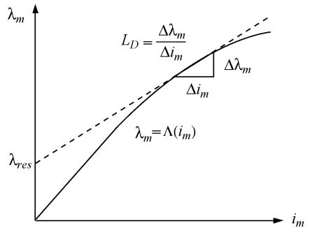  
Fig. 1. Piecewise-linear representation of magnetic saturation.

# III. REPRESENTATION OF MAGNETIC SATURATION

For the purpose of this paper, the magnetic saturations of main flux path and leakage flux path are treated independently. This is a common practice for modeling saturation of induction machines in both state variable approach [6], [7] and EMTP approach [17], [18], [22]–[24]. For simplicity and without loss of generality, only the main flux saturation is discussed here and represented in the VBR model. The stator and rotor leakage flux saturation can be easily included using the same general approach described in the paper.

For state variable modeling languages, the flux correction methods [5], [8], [15], and the generalized flux space vector method [6], [7] are often utilized to represent the saturation of the main flux. In the first method, the classical model is used with the stator and rotor flux linkages as the state variables. Magnetic saturation is taken into account by correcting the main flux of the otherwise magnetically linear model. In the second method, the generalized flux space vector and the magnetizing current space vector are defined as linear combinations of the machine flux linkages or currents [6], [7]. To complete the saturable model, a saturation-dependent equivalent inductance or its reciprocal is derived in terms of the selected state variables.

However, in the nodal analysis (or modified nodal analysis) languages such as EMTP, the magnetic saturation is usually implemented using a piecewise-linear representation of the nonlinear magnetic characteristic [19], [21]–[24]. The advantages of such approach include the following: 1) the simplicity and structure of the magnetically linear machine model is partly preserved; 2) the iterative solution of saturation function with the machine-network equations can be avoided; 3) the piecewise-linear saturated magnetizing inductances, the nodal conductance matrix (the G matrix), and many other coefficient matrices in the discretized machine equations may be pre-calculated outside of the main time-step loop which may further improve the simulation efficiency.

The saturation may be represented by nonlinear functions such as high order polynomials [29] or arctangent functions [36] that may be fitted into the measured saturation data. Here, the main flux saturation is represented by a nonlinear monotonic function in terms of the total magnetizing current $i _ { m }$ as

Calculating the partial derivative of (33) with respect to the magnetizing current $i _ { m }$ , the so-called dynamic inductance [6] or incremental inductance [12] is obtained as

$$
L = \frac {\partial \lambda_ {m}}{\partial i _ {m}}. \tag {34}
$$

The partial differential equation (34) is then discretized into the difference equation using a numerical integration rule as

$$
L _ {D} = \frac {\Delta \lambda_ {m}}{\Delta i _ {m}}. \tag {35}
$$

For the EMTP solution, the nonlinear magnetizing inductance in (34) may be well approximated by $L _ { D }$ within a very small range $\Delta i _ { m }$ as shown in Fig. 1. The saturation function (33) is then represented by the following linear characteristic as

$$
\lambda_ {m} (t) = L _ {D} i _ {m} (t) + \lambda_ {r e s} \tag {36}
$$

where $\lambda _ { r e s }$ is the residual flux.

Induction machines usually have round isotropic rotor. Therefore, the main flux linkage vector $\lambda _ { m }$ is assumed to be aligned with the magnetizing current vector $i _ { m }$ as shown in Fig. 2. The flux linkages $\lambda _ { m q }$ and $\lambda _ { m d }$ are the projections of the main flux linkage $\lambda _ { m }$ onto the and axes, respectively, as shown in Fig. 3. These projections may be expressed in terms of incremental magnetizing inductances and residual fluxes as follows:

$$
\lambda_ {m q} = L _ {D} i _ {m q} + \lambda_ {r e s q} \tag {37}
$$

$$
\lambda_ {m d} = L _ {D} i _ {m d} + \lambda_ {r e s d} \tag {38}
$$

where

$$
\lambda_ {\text {r e s q}} = \lambda_ {\text {r e s}} \cos \phi \tag {39}
$$

$$
\lambda_ {m} = \lambda \left(i _ {m}\right). \tag {33}
$$

$$
\lambda_ {r e s d} = \lambda_ {r e s} \sin \phi . \tag {40}
$$

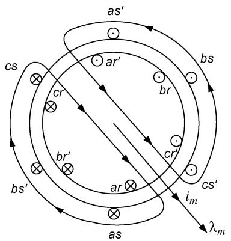  
Fig. 2. Main magnetizing flux in isotropic round-rotor induction machine.

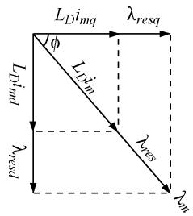  
Fig. 3. The - projections of the magnetizing fluxes and currents.

Therefore, the main flux $\lambda _ { m }$ and the total magnetizing current $i _ { m }$ may be expressed in terms of their the axes components as

$$
\lambda_ {m} = \sqrt {\lambda_ {m q} ^ {2} + \lambda_ {m d} ^ {2}} \tag {41}
$$

$$
i _ {m} = \sqrt {i _ {m q} ^ {2} + i _ {m d} ^ {2}}. \tag {42}
$$

This method captures the so-called cross saturation effect [4], [6], [7] which consists of magnetic coupling between and axes due to the presence of magnetic saturation.

# IV. VOLTAGE-BEHIND-REACTANCE FORMULATION INCLUDING MAGNETIC SATURATION

Based on the approach described in Section III, the saturable VBR model can be derived from the model using a similar procedure as in [32]. In particular, the and axes magnetizing flux linkages (37) and (38) are expressed in terms of stator currents and rotor flux linkages as

where

$$
L _ {D} ^ {\prime \prime} = \left(\frac {1}{L _ {D}} + \frac {1}{L _ {l r}}\right) ^ {- 1}. \tag {45}
$$

Substituting (43) and (44) into (10) and (11), respectively, the stator flux linkages are expressed as

$$
\lambda_ {q s} = L ^ {\prime \prime} i _ {q s} + \lambda_ {q} ^ {\prime \prime} \tag {46}
$$

$$
\lambda_ {d s} = L ^ {\prime \prime} i _ {d s} + \lambda_ {d} ^ {\prime \prime} \tag {47}
$$

where

$$
L ^ {\prime \prime} = L _ {l s} + L _ {D} ^ {\prime \prime} \tag {48}
$$

and

$$
\lambda_ {q} ^ {\prime \prime} = \frac {L _ {D} ^ {\prime \prime}}{L _ {l r}} \lambda_ {q r} + \frac {L _ {D} ^ {\prime \prime}}{L _ {D}} \lambda_ {r e s q} \tag {49}
$$

$$
\lambda_ {d} ^ {\prime \prime} = \frac {L _ {D} ^ {\prime \prime}}{L _ {l r}} \lambda_ {d r} + \frac {L _ {D} ^ {\prime \prime}}{L _ {D}} \lambda_ {r e s d}. \tag {50}
$$

Then, substituting (46) and (47) into (4) and (5), respectively, the stator voltage equations can be rewritten as

$$
v _ {q s} = r _ {s} i _ {q s} + \omega L ^ {\prime \prime} i _ {d s} + p L ^ {\prime \prime} i _ {q s} + \omega \lambda_ {d} ^ {\prime \prime} + p \lambda_ {q} ^ {\prime \prime} \tag {51}
$$

$$
v _ {d s} = r _ {s} i _ {d s} - \omega L ^ {\prime \prime} i _ {q s} + p L ^ {\prime \prime} i _ {d s} - \omega \lambda_ {q} ^ {\prime \prime} + p \lambda_ {d} ^ {\prime \prime}. (5 2)
$$

The term $p \lambda _ { q } ^ { \prime \prime }$ in (51) is calculated by taking the derivatives of (49) as

$$
p \lambda_ {q} ^ {\prime \prime} = \frac {L _ {D} ^ {\prime \prime}}{L _ {l r}} p \lambda_ {q r} + \frac {L _ {D} ^ {\prime \prime}}{L _ {D}} p \lambda_ {r e s q}. \tag {53}
$$

In (53), $p \lambda _ { q r }$ is eliminated by using the rotor voltage equation (7). The term $p \lambda _ { r e s q }$ is derived by calculating the derivative of (39). These algebraic manipulations result in the following:

$$
\begin{array}{l} p \lambda_ {q} ^ {\prime \prime} = \frac {L _ {D} ^ {\prime \prime} r _ {r}}{L _ {l r} ^ {2}} \left(\frac {L _ {D} ^ {\prime \prime}}{L _ {l r}} - 1\right) \lambda_ {q r} + \frac {L _ {D} ^ {\prime \prime} {} ^ {2} r _ {r}}{L _ {l r} ^ {2}} i _ {q s} + \frac {L _ {D} ^ {\prime \prime} {} ^ {2} r _ {r}}{L _ {l r} ^ {2} L _ {D}} \lambda_ {r e s q} \\ - \frac {L _ {D} ^ {\prime \prime}}{L _ {l r}} (\omega - \omega_ {r}) \lambda_ {d r} - \frac {L _ {D} ^ {\prime \prime}}{L _ {D}} \lambda_ {r e s d} \frac {d \phi}{d t}. (5 4) \\ \end{array}
$$

A similar process is applied to the axis which gives

$$
\begin{array}{l} \lambda_ {m q} = L _ {D} ^ {\prime \prime} \left(i _ {q s} + \frac {\lambda_ {q r}}{L _ {l r}}\right) + \frac {L _ {D} ^ {\prime \prime}}{L _ {D}} \lambda_ {r e s q} (43) \\ \lambda_ {m d} = L _ {D} ^ {\prime \prime} \left(i _ {d s} + \frac {\lambda_ {d r}}{L _ {l r}}\right) + \frac {L _ {D} ^ {\prime \prime}}{L _ {D}} \lambda_ {r e s d} (44) \\ \end{array}
$$

$$
\begin{array}{l} p \lambda_ {d} ^ {\prime \prime} = \frac {L _ {D} ^ {\prime \prime} r _ {r}}{L _ {l r} ^ {2}} \left(\frac {L _ {D} ^ {\prime \prime}}{L _ {l r}} - 1\right) \lambda_ {d r} + \frac {L _ {D} ^ {\prime \prime 2} r _ {r}}{L _ {l r} ^ {2}} i _ {d s} + \frac {L _ {D} ^ {\prime \prime 2} r _ {r}}{L _ {l r} ^ {2} L _ {D}} \lambda_ {r e s d} \\ + \frac {L _ {D} ^ {\prime \prime}}{L _ {l r}} (\omega - \omega_ {r}) \lambda_ {q r} + \frac {L _ {D} ^ {\prime \prime}}{L _ {D}} \lambda_ {r e s q} \frac {d \phi}{d t}. \tag {55} \\ \end{array}
$$

The stator voltage equations are then reformulated by substituting (54) and (55) into (51) and (52), respectively, as

$$
v _ {q s} = r _ {s} i _ {q s} + \omega L ^ {\prime \prime} i _ {d s} + p L ^ {\prime \prime} i _ {q s} + v _ {q s a t} ^ {\prime \prime} \tag {56}
$$

$$
v _ {d s} = r _ {s} i _ {d s} - \omega L ^ {\prime \prime} i _ {q s} + p L ^ {\prime \prime} i _ {d s} + v _ {d s a t} ^ {\prime \prime} \tag {57}
$$

where

$$
\begin{array}{l} v _ {q s a t} ^ {\prime \prime} = \omega_ {r} \frac {L _ {D} ^ {\prime \prime}}{L _ {l r}} \lambda_ {d r} + \frac {L _ {D} ^ {\prime \prime} r _ {r}}{L _ {l r} ^ {2}} \left(\frac {L _ {D} ^ {\prime \prime}}{L _ {l r}} - 1\right) \lambda_ {q r} + \frac {L _ {D} ^ {\prime \prime 2} r _ {r}}{L _ {l r} ^ {2}} i _ {q s} \\ + \frac {L _ {D} ^ {\prime \prime}}{L _ {l r} ^ {2} L _ {D}} \lambda_ {r e s q} + (\omega - \omega_ {\phi}) \frac {L _ {D} ^ {\prime \prime}}{L _ {D}} \lambda_ {r e s d} \tag {58} \\ \end{array}
$$

$$
\begin{array}{l} v _ {d s a t} ^ {\prime \prime} = - \omega_ {r} \frac {L _ {D} ^ {\prime \prime}}{L _ {l r}} \lambda_ {q r} + \frac {L _ {D} ^ {\prime \prime} r _ {r}}{L _ {l r} ^ {2}} \left(\frac {L _ {D} ^ {\prime \prime}}{L _ {l r}} - 1\right) \lambda_ {d r} + \frac {L _ {D} ^ {\prime \prime} {} ^ {2} r _ {r}}{L _ {l r} ^ {2}} i _ {d s} \\ + \frac {L _ {D} ^ {\prime \prime} {} ^ {2} r _ {r}}{L _ {l r} ^ {2} L _ {D}} \lambda_ {r e s d} - (\omega - \omega_ {\phi}) \frac {L _ {D} ^ {\prime \prime}}{L _ {D}} \lambda_ {r e s q} \tag {59} \\ \end{array}
$$

with

$$
\omega_ {\phi} = \frac {d \phi}{d t}. \tag {60}
$$

The stator voltage equations of the VBR model are obtained by transforming (56) and (57) back to coordinates. The result has the following form:

$$
\mathbf {v} _ {a b c s} = \mathbf {r} _ {s} \mathbf {i} _ {a b c s} + \mathbf {I} _ {a b c s a t} ^ {\prime \prime} p _ {\mathbf {i} _ {a b c s}} + \mathbf {v} _ {a b c s a t} ^ {\prime \prime} \tag {61}
$$

where

$$
\mathbf {L} _ {a b c s a t} ^ {\prime \prime} = \left[ \begin{array}{l l l} L _ {S s a t} & L _ {M s a t} & L _ {M s a t} \\ L _ {M s a t} & L _ {S s a t} & L _ {M s a t} \\ L _ {M s a t} & L _ {M s a t} & L _ {S s a t} \end{array} \right] \tag {62}
$$

with

$$
L _ {S s a t} = L _ {l s} + L _ {a s a t} \tag {63}
$$

$$
L _ {M s a t} = - \frac {L _ {a s a t}}{2} \tag {64}
$$

$$
L _ {a s a t} = \frac {2}{3} L _ {D} ^ {\prime \prime} \tag {65}
$$

and

$$
\mathbf {v} _ {a b c s a t} ^ {\prime \prime} = \mathbf {K} _ {s} ^ {- 1} \left[ \begin{array}{l l l} v _ {q s a t} ^ {\prime \prime} & v _ {d s a t} ^ {\prime \prime} & 0 \end{array} \right] ^ {T}. \tag {66}
$$

Finally, the stator voltage equations (61), the rotor voltage equations (29), (30) along with the magnetizing flux linkages given by (43), (44), the back emf (58), (59), (66) and the mechanical equations (1)–(3) define the new VBR model that includes saturation.

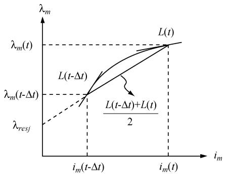  
Fig. 4. Implementation of piecewise-linear saturation using implicit trapezoidal rule.

# V. MODEL IMPLEMENTATION IN EMTP

The implementation of saturable VBR model for the EMTPtype solution parallels that of magnetically linear model [34]. In particular, it involves discretization of the machine differential equations and the interfacing of the machine model with the external network. For this purpose, the nonlinear magnetic saturation characteristic (34) is discretized using the implicit trapezoidal rule as

$$
\frac {L (t) + L (t - \Delta t)}{2} = \frac {\lambda_ {m} (t) - \lambda_ {m} (t - \Delta t)}{i _ {m} (t) - i _ {m} (t - \Delta t)}. \tag {67}
$$

The discretization of nonlinear magnetic saturation characteristic and the formulation of the linear magnetic relationship are shown in Fig. 4. Furthermore, based on (67), the piecewise-linear saturation representation is formulated at the time point as

$$
\lambda_ {m} (t) = L _ {D j} i _ {m} (t) + \lambda_ {r e s j} \tag {68}
$$

where

$$
L _ {D j} = \frac {L (t) + L (t - \Delta t)}{2} \tag {69}
$$

and

$$
\lambda_ {r e s j} = \lambda_ {m} (t - \Delta t) - L _ {D j} i _ {m} (t - \Delta t). \tag {70}
$$

The subscript $j$ in (68)–(70) represents an arbitrary machine operation point corresponding to the discretized time point . Here, $L _ { D j }$ represents the averaged magnetizing inductance at a given time step and is assumed constant within one time step $\Delta t .$ . The residual flux $\lambda _ { r e s j }$ represents the contribution of the history terms $\lambda _ { m } ( t - \Delta t )$ and $i _ { m } ( t - \Delta t )$ .

It is noted that the equivalent magnetizing inductance $L _ { D j }$ in (69) is not known due to the unknown dynamic inductance $L ( t )$ . Therefore, a linear prediction of the main flux linkage $\lambda _ { m } ( t )$ is used to calculate $L ( t )$ in (34). Finally, the nonlinear magnetic saturation function (33) is approximated by a finite number of

pieces of the linear magnetic characteristic (68), provided the time step is sufficiently small.

Next step is to discretize the equations for electrical subsystem considering the piecewise-linear saturation. In particular, the stator voltage equation (61) is discretized using implicit trapezoidal rule resulting in the following:

$$
\mathbf {v} _ {a b c s} (t) = \left(\mathbf {r} _ {s} + \frac {2}{\Delta t} \mathbf {L} _ {a b c s a t} ^ {\prime \prime}\right) \mathbf {i} _ {a b c s} (t) + \mathbf {v} _ {a b c s a t} ^ {\prime \prime} (t) + \mathbf {e} _ {s h} (t) \tag {71}
$$

where

$$
\begin{array}{l} \mathbf {e} _ {s h} (t) = \left(\mathbf {r} _ {s} - \frac {2}{\Delta t} \mathbf {L} _ {a b c s a t} ^ {\prime \prime}\right) \mathbf {i} _ {a b c s} (t - \Delta t) + \mathbf {v} _ {a b c s a t} ^ {\prime \prime} (t - \Delta t) \\ - \mathbf {v} _ {a b c s} (t - \Delta t). \tag {72} \\ \end{array}
$$

Substituting the magnetizing flux linkages (43), (44) into rotor state equations (29), (30), and discretizing the resulting differential equations gives

$$
\begin{array}{l} \pmb {\lambda} _ {q d r} (t) = \mathbf {E i} _ {q d s} (t) + \mathbf {E i} _ {q d s} (t - \Delta t) + \mathbf {F} \pmb {\lambda} _ {q d r} (t - \Delta t) \\ + \mathbf {D} \boldsymbol {\lambda} _ {r e s j q d} (t) \tag {73} \\ \end{array}
$$

where the matrices , and are defined in Appendix A.

Furthermore, note that $\lambda _ { r e s j } ( t )$ is known as it is defined by (70). In order to calculate $\lambda _ { r e s j q d } ( t )$ in (73), the residual flux $\pmb { \lambda } _ { r e s j } ( t )$ is projected along the axes as shown in Fig. 3. The flux angle between $\lambda _ { m q }$ and $\lambda _ { m }$ is also required. Discretizing (60) using implicit trapezoidal rule, we obtain

$$
\phi (t) = \phi (t - \Delta t) + \frac {\Delta t}{2} (\omega_ {\phi} (t) + \omega_ {\phi} (t - \Delta t)) \tag {74}
$$

where the rotating speed $\omega _ { \phi } ( t )$ of the flux angle is predicted by the linear extrapolation.

By substituting (73) into (58) and (59), the subtransient voltages are expressed as

$$
\mathbf {v} _ {q d s a t} ^ {\prime \prime} (t) = \mathbf {H i} _ {q d s} (t) + \mathbf {h} _ {q d r} (t) \tag {75}
$$

where

$$
\mathbf {h} _ {q d r} (t) = \mathbf {M} \mathbf {i} _ {q d s} (t - \Delta t) + \mathbf {N} \boldsymbol {\lambda} _ {q d r} (t - \Delta t) + \mathbf {P} \boldsymbol {\lambda} _ {r e s j q d} (t). \tag {76}
$$

Here, the coefficient matrices , , and are given in Appendix A. It is noted that all the coefficient matrices in (A1)–(A7) have a similarly desirable structure with many repeated entries. For example, the matrix can be expressed as

$$
\mathbf {H} = \left[ \begin{array}{l l} h _ {1} & h _ {2} \\ - h _ {2} & h _ {1} \end{array} \right]. \tag {77}
$$

This convenient property is used to achieve fast calculation of these coefficient matrices.

The subtransient voltages sv" $\mathbf { v } _ { q d j } ^ { \prime \prime }$ are transformed back to coordinates by (26) as

$$
\mathbf {v} _ {a b c s a t} ^ {\prime \prime} (t) = \mathbf {K i} _ {a b c s} (t) + \mathbf {e} _ {r} (t) \qquad (7 8)
$$

where

$$
\mathbf {K} = \left[ \begin{array}{l l l} k _ {1} & k _ {2} & k _ {3} \\ k _ {3} & k _ {1} & k _ {2} \\ k _ {2} & k _ {3} & k _ {1} \end{array} \right] \tag {79}
$$

with

$$
k _ {1} = \frac {2}{3} h _ {1}, k _ {2} = - \frac {1}{3} h _ {1} - \frac {\sqrt {3}}{3} h _ {2}, k _ {3} = - \frac {1}{3} h _ {1} + \frac {\sqrt {3}}{3} h _ {2}
$$

and

$$
\mathbf {e} _ {r} (t) = \mathbf {K} _ {s} ^ {- 1} \left[ \begin{array}{c} \mathbf {h} _ {q d r} (t) \\ 0 \end{array} \right]. \tag {80}
$$

The quasi-symmetrical property of in (75) and (77) results in the simplified matrix in (79). In particular, the trigonometric functions introduced by and ${ \bf K } _ { s } ^ { - 1 }$ are eliminated from (79) resulting in simple and fast calculation of . In this way, the numerical efficiency of the proposed saturable VBR model is further improved by utilizing the symmetrical/structural properties of all matrices.

Substituting subtransient voltages (78) into stator voltage equations (71), the saturable VBR machine model is integrated into the external network as

$$
\mathbf {v} _ {a b c s} (t) = \mathbf {R} _ {e q} (t) \mathbf {i} _ {a b c s} (t) + \mathbf {e} _ {h} (t) \qquad \qquad (8 1)
$$

where

$$
\mathbf {R} _ {e q} ^ {v b r} (t) = \mathbf {r} _ {s} + \frac {2}{\Delta t} \mathbf {L} _ {a b c s a t} ^ {\prime \prime} + \mathbf {K} \tag {82}
$$

and

$$
\mathbf {e} _ {h} (t) = \mathbf {e} _ {r} (t) + \mathbf {e} _ {s h} (t). \tag {83}
$$

The machine mechanical equations (1), (2) are also discretized using implicit trapezoidal rule. These equations can be found in [34] and are not included here due to space limitation.

# VI. CASE STUDIES

To demonstrate the effectiveness of the proposed model, a single induction machine infinite bus system is used here for the case studies. The induction machine parameters and the nonlinear saturation characteristic are summarized in Appendix B.

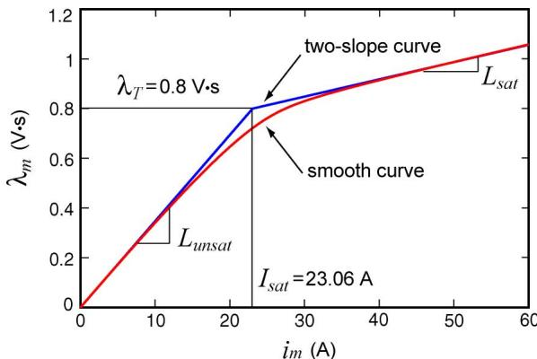  
Fig. 5. Saturation function approximation using two-slope and smooth curves.

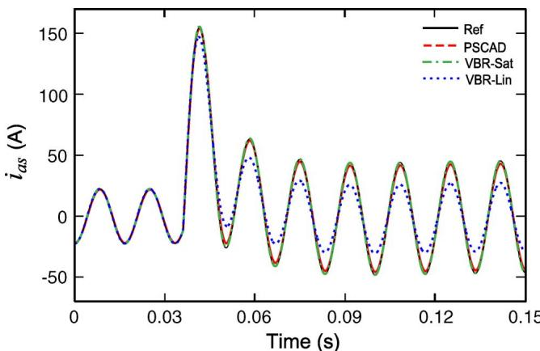  
Fig. 6. Currents $i _ { a s }$ predicted by various models using time-step of 50 $\mu \mathrm { s }$ .

Here we used the same 50-HP induction machine as was used in [34]. Both saturable and magnetically linear VBR models were implemented using the non-iterative method [34] for EMTPtype solutions. To benchmark the proposed model, a built-in saturable machine model of PSCAD/EMTDC is also used. In addition, a saturable machine model based on the state variable approach using Levi’s formulation [6] was implemented in Matlab/Simulink. It is noted that there are several models derived according to Levi’s generalized flux vector approach [6]. Without loss of generality, the stator-current stator-flux model is utilized in this paper where the state variables are $i _ { d s } , i _ { q s } ,$ ds and $\psi _ { q s }$ as documented in [6, Section III-A]. This model was solved using the fourth-order Runge–Kutta method with a very small time step of 1 to obtain very accurate numerical solutions. These solutions were used as a reference for the purpose of comparison.

In general, one may consider many case studies that can be used to demonstrate the machine saturation phenomenon. For example, stepping up the machine’s terminal voltage is a good choice for study as in this case the saturation can be made well pronounced. This type of study is therefore considered here. Thus, it is assumed that the induction machine is initially operating in no-load steady state. At 0.036 s, the stator terminal voltages are stepped up from 80% to 100% of the rated value (from 0.8 to 1.0 pu). Similar case studies have been also used in [37] and [38] for investigating synchronous machine saturation and are considered very appropriate and informative. Other

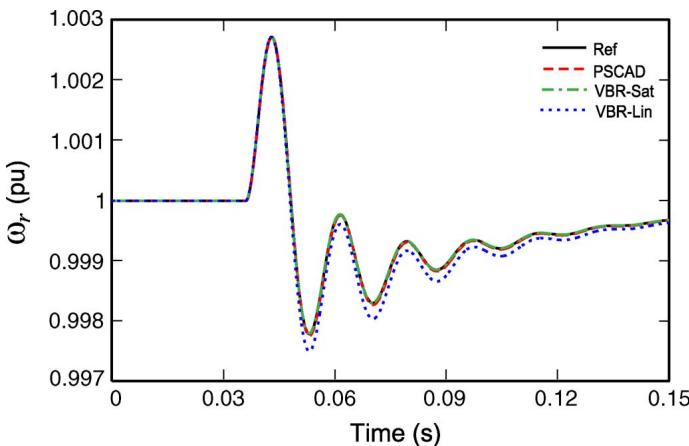  
Fig. 7. Speeds  predicted by various models using time-step of $5 0 \mu \mathrm { s }$

studies, such as variation of load that influences the patterns of main and leakage fluxes may also be used. However, those are not included here due to space limitation.

Since most EMTP languages allow only small and finite number of slopes to define the magnetic saturation, the two-slope piecewise-linear method and the smooth saturation characteristic with arctangent function representation [36] were used to validate the proposed model. The corresponding magnetizing curves are shown in Fig. 5. Here, the values of unsaturated and saturated inductances define the two slopes, respectively. The corresponding saturation parameters are summarized in Appendix B. The details of the arctangent function representation can be found in [36] and are also included in Appendix C for completeness.

# A. Model Verification for Two-Slope Saturation Curve

To verify the new model, a typical time step of 50 is used for the three models, i.e., the saturable and linear VBR models and the saturable model in PSCAD/EMTDC. Without loss of generality, two-slope piecewise linear saturation representation is utilized here since the saturable machine model in PSCAD/ EMTDC permits only few pieces of linear magnetic characteristics. However, the two-slope magnetic characteristic is also convenient to compare the linear and saturable models as the same initial operating point may be established when the applied voltages are only 80%.

From Figs. 6–8, it may be seen that the proposed saturable VBR model predicted responses that are visually identical to those of the model of PSCAD/EMTDC and the reference solution produced by model [6]. The difference between the saturable and magnetically-linear VBR models is also pronounced. In particular, prior to the voltage increase, all models operate in magnetically linear region. Stepping up the stator voltages at 0.036 s increases the main flux $\lambda _ { m }$ and therefore drives the machine magnetizing path into saturation. As shown in Fig. 6, the saturable models predict slightly higher stator current following the voltage increase. The transients observed in speed and electromagnetic torque are shown in Figs. 7 and 8, respectively, where the differences between the linear and saturable models are visible but much less pronounced. Fig. 9 shows the

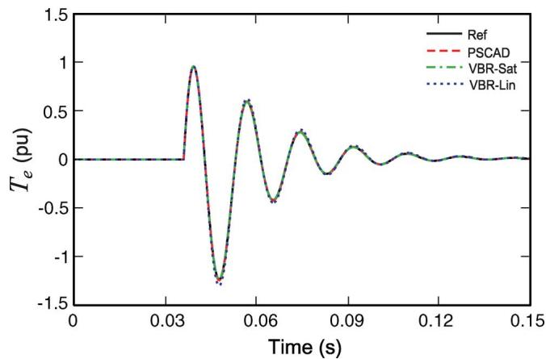  
Fig. 8. Electromagnetic torques $T _ { e }$ predicted by various models using timestep of 50 -.

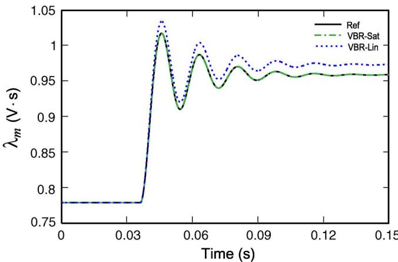  
Fig. 9. Flux linkages $\lambda _ { m }$ predicted by various models using time-step of 50 $\mu \mathbf { S } .$ .

predicted main flux $\lambda _ { m }$ , where one can clearly see that the saturable models show a smaller flux increase as compared to the magnetically-linear model. Such results are expected and they verify the proposed saturable VBR induction machine model.

# B. Model Accuracy for Large Time Step

To investigate the numerical accuracy and robustness of the proposed model, the same case studies are conducted using a much larger time step of 1 ms. To avoid possible errors due to transitioning between the curve pieces, a smooth saturation curve shown in Fig. 5 is used here. It is noted that the proposed modeling approach is very general in the sense that any appropriate function may be used to represent the saturation curve. Without loss of generality, the arctangent function method [36] was applied to represent the magnetic saturation characteristic for the proposed saturable VBR model and the reference model [6]. However, the studies with PSCAD/EMTDC are not included here due to the fact that its model does not support such representation of the saturation curve.

The corresponding simulation results are plotted in Figs. 10–13, where it is seen that the proposed saturable VBR model with the time step of 1 ms still produces quite accurate response compared with the reference solution and that of the small time step of $5 0 ~ \mu \mathrm { s } .$ . This study validates the

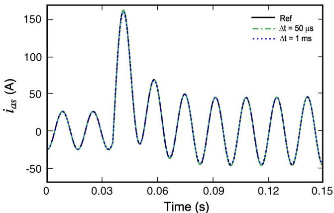  
Fig. 10. Stator currents $i _ { a s }$ predicted by saturable VBR models.

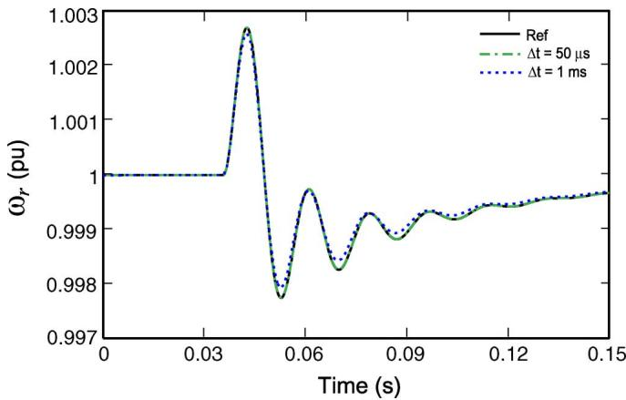  
Fig. 11. Rotor speeds  predicted by saturable VBR models.

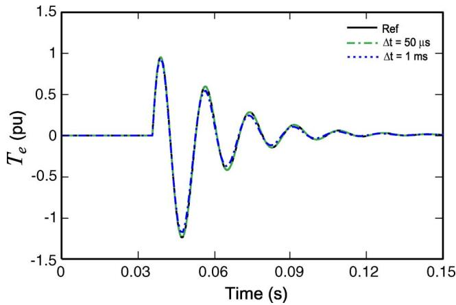  
Fig. 12. Electromagnetic torques  predicted by saturable VBR models.

assumptions made in deriving the discretized VBR model with saturation characteristic as described in Section V.

# C. Computational Efficiency

Since the interfacing of machine model with the EMTP external network requires prediction of mechanical variables, the model implementation may be realized with or without the iterations on the predicted variables as explained in [34]. Although such iterations may increase the simulation accuracy, they also require additional computational resources, i.e., CPU time. It is therefore desirable that the model itself provides sufficient

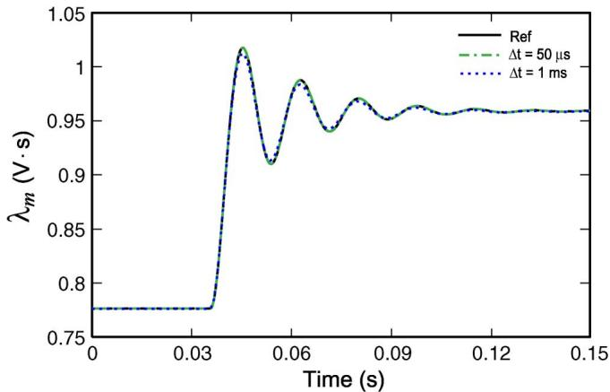  
Fig. 13. Main flux linkages $\lambda _ { m }$ predicted by saturable VBR models.

numerical accuracy so that the external iterations are not necessary. The non-iterative VBR machine model is advantageous since it greatly improves the overall simulation efficiency compared with the iterative PD model [30], [34].

The method for saturation representation also influences the simulation speed. For the finite and possibly small number of linear pieces of saturation function, the machine parameters and matrices for each given slope in the saturation characteristic may be pre-calculated outside of the major time-stepping loop of the simulation. Because of that, the saturable VBR model with a piecewise-linear saturation could be made very efficient and almost as fast as the magnetically linear VBR model [34]. This approach was considered in Section IV-A, wherein the two-slope saturation curve was utilized.

However, to represent the smooth saturation curve, the dynamic inductance $L ( t )$ is updated each time step. Thus, the coefficients and matrices are required to be recalculated inside the major time-stepping loop. This definitely requires more computational resources and must be implemented with great care. To maximize the simulation efficiency and speed, the following measures were taken: First, all constants introduced by the machine parameters that are needed inside the major time-stepping loop are pre-calculated. Similarly, the symmetrical coefficients/matrices (A1)–(A7) that appear in the discretized model [e.g., see (77), (79)] are carefully re-used; Second, the efficient implementation of trigonometric functions as explained in [34] is applied. Such efforts significantly reduce the required calculations and greatly improve the simulation speed.

The saturable and magnetically-linear VBR models were implemented using ANSI C language. The studies were conducted on a PC with a Pentium-4 2.66-GHz processor and 512 MB of RAM. Since the choice of the reference frame slightly affects the matrices (A1)–(A7), both rotor reference frame (RRF) and stationary reference frame (SRF) have been considered. Interested reader can find detailed discussion on the reference frame choice and its effect on the numerical calculations required by the magnetically-linear VBR models in [34]. The CPU times required by each model to complete a single time step are summarized in Table I. It is shown here that the saturable VBR models with smooth curve saturation require more CPU time. In particular, the SRF results in the fastest implementation as

TABLE I COMPARISON OF CPU TIMES PER TIME STEP   

<table><tr><td>Models</td><td>CPU Times</td></tr><tr><td>Linear VBR RRF</td><td>2.2μs</td></tr><tr><td>Linear VBR SRF</td><td>1.6μs</td></tr><tr><td>Saturable VBR RRF</td><td>3.43μs</td></tr><tr><td>Saturable VBR SRF</td><td>3.12μs</td></tr></table>

many trigonometric function evaluations become constants. In this case, the saturable VBR model takes 3.12 , which is about two times of the respective linear model. The RRF requires few more calculations resulting in the saturable VBR model taking $3 . 4 3 \mu \mathrm { s } .$ . However, the overall CPU times of 3.43 and 3.12 per time-step are still very desirable for typical EMTP applications and represent an improvement over the established PD model as was earlier shown in [34].

# VII. DISCUSSION

# A. Saturation Representation

As documented in [6], [39], and [40], depending on the selection of state variables and the formulation of generalized flux space vector, the saturable machine models may be placed into one of three categories: 1) those that require the time derivative of the generalized inductance, i.e., $d \Lambda / d t ; 2 )$ those that require the time derivative of the inverse of the generalized inductance, i.e., $d ( 1 / \Lambda ) / d t ; 3 )$ other models including the model with the winding flux linkages as state variables.

For the model with flux linkage as the state variables, the cross saturation is implicitly included in static and dynamic sense. However, for the saturable models of types 1) and 2), the cross-saturation appears in two parts [39], [40]. The first one is called “steady-state cross saturation” where the cross saturation is represented as the dependence of the steady-state axes magnetizing inductances on the magnetizing current in both axes [39]. The second part is called “dynamic cross saturation” which describes the dynamic magnetic coupling between the and axes and is represented by the nonzero terms in the machine system matrix when the machine state-space equations are formulated [39], [40].

It is noted that the dynamic cross saturation depends not only on the steady-state magnetizing inductance $L _ { m }$ but also on the dynamic inductance . Moreover, it is shown in [39] that omission of “dynamic cross-saturation” will lead to noticeable errors for the type 1) models during transients. However, for the type 2) models, the “dynamic cross-saturation” may be ignored without loss of model accuracy.

The reference model used in this paper is stator-current stator-flux model with the state variables $i _ { d s } , i _ { q s } ,$ and $\psi _ { q s }$ as documented in [6, Section III-A]. This is a $\bar { d } ( 1 / \Lambda ) / d t$ type 2) model, and it has been implemented without approximations to include both steady-state and dynamic cross-saturation. Therefore, although different in formulation of the state equations, these saturable models of types 1)–3) are all equivalent in continuous time domain (if implemented correctly with all terms included), i.e., the cross saturation phenomenon is fully accounted for in all models in steady state as well as transients.

The proposed saturable VBR machine model uses stator currents and rotor fluxes as the independent variables and is equivalent to other saturable models of types 1)–3). This model includes steady state and dynamic coupling between the and axes. The instantaneous saturation level/point is tracked with respect to the instantaneous magnetizing current, i.e., the dynamic inductance is always used at any operating point on the nonlinear saturation curve. For example, in order to omit the dynamic cross saturation for the models of types 1) and 2), one may assume that the dynamic inductance is equal to the steady-state saturation inductance $L _ { m }$ [39], [40]. No such assumptions have been used in the proposed VBR model. Although for EMTP solution a piecewise-linear approximation of the nonlinear magnetic characteristic has been used, it is done in discrete-time domain, and if the integration time step is sufficiently small, all these models will give identical results. The case studies of stepping up machine terminal voltages clearly demonstrate that the proposed saturable VBR model is convergent to the correct solution for both transients and steady states.

As noted in Section VI, the reference model [6] is a state-space machine model which was implemented in Matlab/Simulink and solved by the fourth-order Range–Kutta ODE solver with the only purpose to provide a reference trajectory solution. The proposed saturable VBR model is implemented using implicit trapezoidal rule as required by EMTP algorithm and application, which is also essential to this paper. Because of that, a direct comparison of efficiency and accuracy between the proposed VBR and the reference model was not considered (even though the reference model [6] may also use large time step of 1 ms and produce reasonably accurate simulation results when it is implemented by itself using state variable approach). It is important to keep in mind that when a machine model is implemented in EMTP-type software, it must be interfaced with the external network which is represented in physical variables and coordinates. Such interface may and will deteriorate the model accuracy and numerical stability for large time steps as has been shown in [32]–[35]. At the same time, the proposed VBR model has a direct interface of the stator circuit into the external network, which improves the accuracy and numerical stability compared with other EMTP-type models. Moreover, as demonstrated in Figs. 10–13, the proposed saturable VBR model, while correctly including the effect of saturation, also well preserves the numerical accuracy and stability even at fairly large time step.

Another interesting point is that depending on selection of state variables and generalized flux space vector, one can derive several saturable models [6], [39], [40], which are algebraically equivalent (if all terms are included). In linear time invariant (LTI) systems, the change of state variables generally does not affect the system’s eigenvalues, and therefore results in a new system that is otherwise equivalent in continuous- and discrete-time domains [41]. However, this is not the case for the machine models that are nonlinear due to the changing speed and effect of saturation. It is therefore reasonable to expect that among the saturable models of types 1)–3), there are some that are better than others. For example, it has been shown in [31], [32, Table II], and [33, Table III] that selecting flux linkages

as the state variable generally results in better scaled eigenvalues (for both continuous and discretized models) which subsequently improves numerical properties (accuracy). Although it would be very interesting and insightful to further evaluate the numerical properties of comparable state-variable-based saturable models of types 1)–3), such investigations may be considered outside of this manuscript.

# B. Comparison With PSCAD

To demonstrate the improved numerical accuracy of the new saturable VBR model over the traditional model available in PSCAD, the no-load startup transient study under nominal applied voltages (1 pu) has been conducted using time step of 1 ms. The advantage of using this particular transient study over a load-change and/or short-circuit study is that it represents a large-signal electromechanical disturbance which spans the entire speed range (from zero to nominal). For this very reason, the start-up transient studies are often considered in the literature (e.g., see [18], [29], [30]) for analysis and comparison of models. The piecewise-linear saturation curve of Fig. 5 has been utilized here again in all models for consistency since the PSCAD does not support representation of the saturation curve using the smooth arctangent function.

The results of this study are shown in Figs. 14–16, where the responses of the PSCAD and the VBR models are compared with the reference solution. Due to limited space, only the stator current $i _ { a s }$ is shown here, whereas other variables demonstrate a similar trend. For clarity, the magnified plots of the current during transient and steady state are shown in Figs. 15 and 16, respectively. As Figs. 14–16 demonstrate, the proposed saturable VBR model offers superior accuracy throughout the transient study, whereas the PSCAD model visibly deviates from the reference solution and predicts lower steady state current. This observation is consistent with the accuracy comparison and analysis of the magnetically linear machine models presented in [34]. Interested reader will find more detailed case studies and analysis in [34] that explain and demonstrate the benefit of using the proposed VBR model. As has been stated earlier, the proposed model has the advantage of direct interface with the external circuit-network, which results in improved numerical accuracy apart from other benefits.

# C. Scope and Application of the Proposed VBR Model

The proposed VBR model belongs to the class of the so-called general-purpose machine models which are based on classical assumptions. Implementations and hardware verifications of such general-purpose models have been done for both state-space and EMTP-type saturable machine models [6], [7], [17]. These and similar models are widely used for power systems studies and transient simulations, where the level of detail of such models is generally assumed sufficient. It is therefore appropriate to use several well established (similar in complexity) models to verify the proposed VBR model. In particular, the reference model considered here has been validated experimentally in [6]. Since the reference model has been shown to be in excellent agreement with the measurements, and since the proposed VBR model given here is in excellent agreement with the reference model, it follows that the model

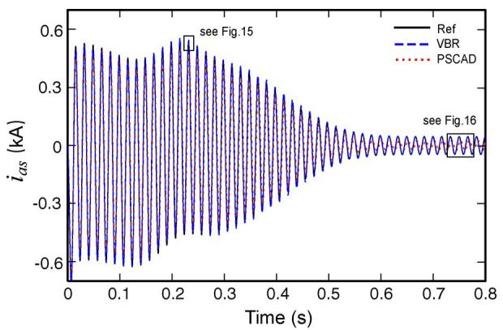  
Fig. 14. Stator currents during start-up transient as predicted by various models using time step of 1 ms.

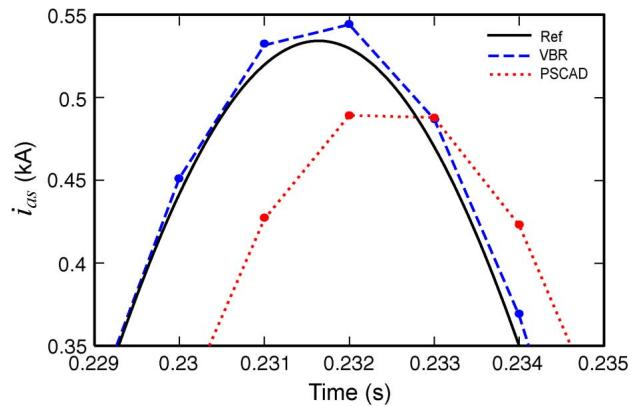  
Fig. 15. Magnified plot of transient stator currents from Fig. 14.

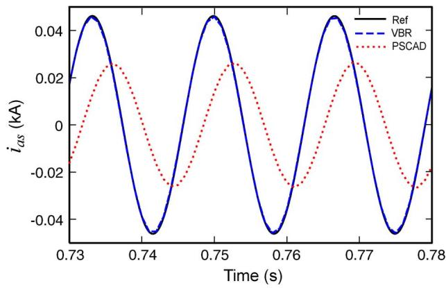  
Fig. 16. Magnified plot of steady-state stator currents from Fig. 14.

of this paper can be regarded as experimentally validated by proxy.

Whenever there is a need to model a particular machine/hardware more accurately, one may look for more detailed models that would be appropriate for the level of fidelity required. As is often the case, the FE models [1] or MEC models [2], [3] will offer ability to represent fine structural and/or material details. There are also other more sophisticated higher-order models, such as [12] and [13] for example, which are known to have better accuracy in representing secondary phenomena

including cross coupling and saturation of leakage fluxes, distributed rotor-circuit effect for capturing machine-converter interaction, etc. Models such as [12] and [13], for which we have very high regards and respect, are superior to the general purpose model considered here in terms of matching with the actual hardware. However, this fidelity comes at a price of increased model order and complexity, which is not always justified and/or needed for the power systems studies and applications.

However, the original contribution of this paper is focused on the saturable VBR model for the EMTP solution, which is, to the best of our knowledge, has not been done before. Due to its structural and numerical advantages, the proposed model may find its application in simulation packages and tools widely used in the power industry. In the future, the proposed VBR model formulation may be extended to accommodate more sophisticated modeling features similar to that in [12] and [13]. However, those topics are beyond the scope of this paper and will deserve a dedicated publication.

# VIII. CONCLUSION

This paper extends the previous work and presents an approach for including magnetic saturation in the voltage-behindreactance induction machine model for EMTP. The saturation of the main magnetizing flux is incorporated into the new model such that the axes cross saturation is properly included in steady state as well as transients (steady state and dynamic cross saturation).

The piecewise-linear modeling technique is utilized to represent the nonlinear magnetic saturation characteristic. However, the method can include arbitrary number of piecewise-linear segments as to approximate the smooth saturation characteristic with any desirable accuracy. At the same time, if desired, the smooth saturation characteristic can be specified as well, in which case the resulting inductances (and the model parameters) are recalculated at each time step. Recalculating the inductances/parameters at each time step increases the computational overhead of the machine model itself by a factor 1.5 to 2 times, depending on the reference frame considered (see Table I). However, the demonstrated CPU times per step for the proposed saturable VBR model still represents an improvement over the comparable existing EMTP-type machine models.

The benefit of the proposed modeling approach is that a noniterative and direct interface of the machine model with the external network can be achieved. Computer studies demonstrate that the proposed saturable VBR model in addition of being very efficient also preserves good numerical accuracy and stability even at large time steps. This is also an improvement over many established EMTP-type machine models.

# APPENDIX A

$$
\mathbf {E} = \left[ \begin{array}{c c} 2 - \Delta t b _ {1} & - \Delta t b _ {2} \\ \Delta t b _ {2} & 2 - \Delta t b _ {1} \end{array} \right] ^ {- 1} \left[ \begin{array}{c c} \Delta t b _ {3} & 0 \\ 0 & \Delta t b _ {3} \end{array} \right] \tag {A1}
$$

$$
\mathbf {F} = \left[ \begin{array}{c c} 2 - \Delta t b _ {1} & - \Delta t b _ {2} \\ \Delta t b _ {2} & 2 - \Delta t b _ {1} \end{array} \right] ^ {- 1}
$$

$$
\times \left[ \begin{array}{c c} 2 + \Delta t b _ {1} & \Delta t b _ {2} \\ - \Delta t b _ {2} & 2 + \Delta t b _ {1} \end{array} \right] \tag {A2}
$$

$$
\mathbf {D} = \left[ \begin{array}{c c} 2 - \Delta t b _ {1} & - \Delta t b _ {2} \\ \Delta t b _ {2} & 2 - \Delta t b _ {1} \end{array} \right] ^ {- 1} \left[ \begin{array}{c c} 2 \Delta t b _ {4} & 0 \\ 0 & 2 \Delta t b _ {4} \end{array} \right] \quad \tag {A3}
$$

$$
b _ {1} = - \frac {r _ {r}}{L _ {l r}} \left(1 - \frac {L _ {D j} ^ {\prime \prime}}{L _ {l r}}\right), b _ {2} = - (\omega - \omega_ {r}), b _ {3} = \frac {r _ {r} L _ {D j} ^ {\prime \prime}}{L _ {l r}}
$$

$$
\mathbf {M} = \left[ \begin{array}{l l} c _ {1} & c _ {2} \\ - c _ {2} & c _ {1} \end{array} \right] \mathbf {E} \tag {A4}
$$

$$
\mathbf {N} = \left[ \begin{array}{l l} c _ {1} & c _ {2} \\ - c _ {2} & c _ {1} \end{array} \right] \mathbf {F} \tag {A5}
$$

$$
\mathbf {P} = \left[ \begin{array}{l l} c _ {1} & c _ {2} \\ - c _ {2} & c _ {1} \end{array} \right] \mathbf {D} + \left[ \begin{array}{l l} c _ {4} & c _ {5} \\ - c _ {5} & c _ {4} \end{array} \right] \tag {A6}
$$

$$
\mathbf {H} = \mathbf {M} + \left[ \begin{array}{c c} c _ {3} & 0 \\ 0 & c _ {3} \end{array} \right]
$$

$$
c _ {1} = \frac {L _ {D j} ^ {\prime \prime} r _ {r}}{L _ {l r} ^ {2}} \left(\frac {L _ {D j} ^ {\prime \prime}}{L _ {l r}} - 1\right), c _ {2} = \frac {\omega_ {r} L _ {D j} ^ {\prime \prime}}{L _ {l r}}, c _ {3} = \frac {L _ {D j} ^ {\prime \prime} {} ^ {2} r _ {r}}{L _ {l r} ^ {2}}
$$

$$
c _ {4} = \frac {L _ {D j} ^ {\prime \prime} {} ^ {2} r _ {r}}{L _ {l r} ^ {2} L _ {D j}}, c _ {5} = (\omega - \omega_ {\phi}) \frac {L _ {D j} ^ {\prime \prime}}{L _ {D j}}. \tag {A7}
$$

# APPENDIX B

Induction machine parameters [15]: 50HP, 460 V, 4 poles,1705 rpm, $J = 1 . 6 6 2 \mathrm { k g } \cdot \mathrm { m } ^ { 2 } , T _ { b } = 1 9 7 . 8 \mathrm { N m } , r _ { s } = 0 . 0 8 7 \Omega$ ,$r _ { r } = 0 . 2 2 8 \Omega , X _ { l s } = 0 . 3 0 2 \Omega , X _ { l r } = 0 . 3 0 2 \Omega , X _ { M } = 1 3 . 0 8 \Omega$ .

Saturation data for the arctangent-function representation:

$$
\lambda_ {T} = 0. 8 2 \mathrm {V} \cdot \mathrm {s}, \tau_ {T} = 2 0 (1 / \mathrm {V} \cdot \mathrm {s}), M _ {a} = 8 8. 9 5 (1 / \mathrm {H})
$$

$$
M _ {d} = 6 2. 7 5 (1 / \mathrm {H}).
$$

Saturation data for the two-slope piecewise-linear representation:

$$
I _ {s a t} = 2 3. 0 6 \mathrm {A}, L _ {u n s a t} = 0. 0 3 4 7 \mathrm {H}, L _ {s a t} = 0. 0 0 6 9 \mathrm {H}.
$$

# APPENDIX C

The arctangent function is used to represent the nonlinear magnetic saturation characteristic as [36]:

$$
\begin{array}{l} i _ {m} (\lambda_ {m}) = \frac {2 M _ {d}}{\pi} \left[ (\lambda_ {m} - \lambda_ {T}) \arctan (\tau_ {T} (\lambda_ {m} - \lambda_ {T})) \right. \\ \left. - \lambda_ {T} \arctan \left(\tau_ {T} \lambda_ {T}\right) \right] \\ + \frac {M _ {d}}{\pi \tau_ {T}} \left[ \ln \big (1 + \tau_ {T} ^ {2} \lambda_ {T} ^ {2} \big) - \ln \big (1 + \tau_ {T} ^ {2} (\lambda_ {m} - \lambda_ {T}) ^ {2} \big) \right] \\ + M _ {a} \lambda_ {m}. \tag {C1} \\ \end{array}
$$

The slope of the nonlinear magnetic saturation characteristic (C1) or the inverse of the dynamic inductance is given as

$$
\frac {\partial i _ {m} (\lambda_ {m})}{\partial \lambda_ {m}} = \frac {2}{\pi} M _ {d} \arctan [ \tau_ {T} (\lambda_ {m} - \lambda_ {T}) ] + M _ {a} \qquad \mathrm {(C 2)}
$$

where $M _ { d }$ and $M _ { a }$ are related to the initial and final slopes $M _ { i }$ and $M _ { f }$ of (C2) by

$$
M _ {d} = \frac {M _ {f} - M _ {i}}{2} \tag {C3}
$$

$$
M _ {a} = \frac {M _ {f} + M _ {i}}{2}. \tag {C4}
$$

In (C1) and $( \mathrm { C } 2 ) , \tau _ { T }$ and $\lambda _ { T }$ define the tightness of the transition from initial slope to final slope and the point of transition, respectively.

# ACKNOWLEDGMENT

The authors would like to thank the anonymous reviewers of this paper for their enthusiasm and diligence, and for their inspiring comments that contributed to discussions in Sections VI and VII.

# REFERENCES

[1] S. J. Salon, Finite Element Analysis of Electrical Machines. Norwell, MA: Kluwer, 1995.   
[2] G. R. Slemon, “An equivalent circuit approach to analysis of synchronous machines with saliency and saturation,” IEEE Trans. Energy Convers., vol. 5, no. 3, pp. 538–545, Sep. 1990.   
[3] S. D. Sudhoff, B. T. Kuhn, K. A. Corzine, and B. T. Branecky, “Magnetic equivalent circuit modeling of induction motors,” IEEE Trans. Energy Convers., vol. 22, no. 2, pp. 259–270, Jun. 2007.   
[4] J. E. Brown, K. P. Kovacs, and P. Vas, “A method of including the effects of main flux path saturation in the generalized equations of AC machines,” IEEE Trans. Power App. Syst., vol. PAS-102, pp. 96–103, Jan. 1983.   
[5] J. O. Ojo, A. Consoli, and T. A. Lipo, “An improved model of saturated induction machines,” IEEE Trans. Ind. Appl., vol. 26, pp. 212–221, Mar./Apr. 1990.   
[6] E. Levi, “A unified approach to main flux saturation modeling in D-Q axis models of induction machines,” IEEE Trans. Energy Convers., vol. 10, no. 3, pp. 455–461, Sep. 1995.   
[7] E. Levi, “Main flux saturation modeling in double-cage and deep-bar induction machines,” IEEE Trans. Energy Convers., vol. 11, no. 2, pp. 205–311, Jun. 1996.   
[8] T. A. Lipo and A. Consoli, “Modeling of induction motors with saturable leakage reactances,” IEEE Trans. Ind. Appl., vol. IA-20, pp. 180–189, Jan./Feb. 1984.   
[9] H. M. Jabr and N. C. Kar, “Starting performance of saturated induction motors,” in Proc. IEEE Power Eng. Soc. General Meeting, Jun. 24–28, 2007, pp. 1–7.   
[10] W. Levy, C. F. Landy, and M. D. McCulloch, “Improved models for the simulation of deep bar induction motors,” IEEE Trans. Energy Convers., vol. 5, no. 2, pp. 393–400, Jun. 1990.   
[11] A. C. Smith, R. C. Healey, and S. Williamson, “A transient induction motor model including saturation and deep bar effect,” IEEE Trans. Energy Convers., vol. 11, no. 1, pp. 8–15, Mar. 1995.   
[12] S. D. Sudhoff, D. C. Aliprantis, B. T. Kuhn, and P. L. Chapman, “An induction machine model for predicting inverter-machine interaction,” IEEE Trans. Energy Convers., vol. 17, no. 2, pp. 203–210, Jun. 2002.   
[13] D. C. Aliprantis, S. D. Sudhoff, and B. T. Kuhn, “A synchronous machine model with saturation and arbitrary rotor network representation,” IEEE Trans. Energy Convers., vol. 20, no. 3, pp. 584–594, Sep. 2005.   
[14] H. W. Dommel, EMTP Theory Book. Vancouver, BC, Canada: MicroTran Power System Analysis Corp., May 1992.   
[15] P. C. Krause, O. Wasynczuk, and S. D. Sudhoff, Analysis of Electric Machine, 2nd ed. Piscataway, NJ: IEEE Press, 2002.   
[16] P. Kundur, Power System Stability and Control. New York: McGraw-Hill, 1994.   
[17] G. J. Rogers and D. Shirmohammadi, “Induction machine modeling for electromagnetic transient program,” IEEE Trans. Energy Convers., vol. EC-2, no. 4, pp. 622–628, Dec. 1987.

[18] R. Hung and H. W. Dommel, “Synchronous machine models for simulation of induction motor transients,” IEEE Trans. Power Syst., vol. 11, no. 2, pp. 833–838, May 1996.   
[19] V. Brandwajn, “Representation of magnetic saturation in the synchronous machine model in an electro-magnetic transients program,” IEEE Trans. Power App. Syst., vol. PAS-99, no. 5, pp. 1996–2002, Sep./Oct. 1980.   
[20] N. J. Bacalao, P. de Arizon, and R. O. Sanche L, “A model for the synchronous machine using frequency response measurements,” IEEE Trans. Power Syst., vol. 10, no. 1, pp. 457–46, Feb. 1995.   
[21] J. R. Marti and K. W. Louie, “A phase-domain synchronous generator model including saturation effects,” IEEE Trans. Power Syst., vol. 12, no. 1, pp. 222–229, Feb. 1997.   
[22] “PSCAD/EMTDC V4.0 On-Line Help,” Manitoba HVDC Research Centre and RTDS Technologies Inc., 2005.   
[23] “MicroTran Reference Manual,” MicroTran Power System Analysis Corp., Vancouver, BC, Canada, 1997. [Online]. Available: http://www. microtran.com.   
[24] Electromagnetic Transient Program, EMTP-RV, CEA Technologies Inc., 2007. [Online]. Available: http://www.emtp.com.   
[25] Alternative Transients Programs, ATP-EMTP, ATP User Group, 2007. [Online]. Available: http://www.emtp.org.   
[26] V. Brandwajn, “Synchronous generator models for the analysis of electromagnetic transients,” Ph.D. dissertation, Univ. British Columbia, Vancouver, BC, Canada, 1977.   
[27] H. K. Lauw and W. S. Meyer, “Universal machine modeling for the representation of rotating electrical machinery in an electromagnetic transients program,” IEEE Trans. Power App. Syst., vol. PAS-101, pp. 1342–1351, 1982.   
[28] A. M. Gole, R. W. Menzies, H. M. Turanli, and D. A. Woodford, “Improved interfacing of electrical machine models to electromagnetic transients programs,” IEEE Trans. Power App. Syst., vol. PAS-103, pp. 2446–2451, 1984.   
[29] J. R. Marti and T. O. Myers, “Phase-domain induction motor model for power system simulators,” in Proc. IEEE Conf. Communications, Power, and Computing, May 1995, vol. 2, pp. 276–282.   
[30] R. Takahashi, J. Tamura, Y. Tada, and A. Kurita, “Derivation of phase-domain model of an induction generator in terms of instantaneous values,” in Proc. IEEE Power Eng. Soc. Winter Meeting, Jan. 23-27, 2000, vol. 1, pp. 359–364.   
[31] S. D. Pekarek, O. Wasynczuk, and H. J. Hegner, “An efficient and accurate model for the simulation and analysis of synchronous machine/converter systems,” IEEE Trans. Energy Convers., vol. 1, no. 1, pp. 42–48, Mar. 1998.   
[32] L. Wang, J. Jatskevich, and S. Pekarek, “Modeling of induction machines using a voltage-behind-reactance formulation,” IEEE Trans. Energy Convers., vol. 23, no. 2, pp. 382–392, Jun. 2008.   
[33] L. Wang and J. Jatskevich, “A voltage-behind-reactance synchronous machine model for the EMTP-type solution,” IEEE Trans. Power Syst., vol. 21, no. 4, pp. 1539–1549, Nov. 2006.   
[34] L. Wang, J. Jatskevich, C. Wang, and P. Li, “A voltage-behind-reactance induction machine model for the EMTP-type solution,” IEEE Trans. Power Syst., vol. 23, no. 3, pp. 1226–1238, Aug. 2008.   
[35] L. Wang, J. Jatskevich, and H. W. Dommel, “Reexamination of synchronous machine modeling techniques for electromagnetic transient simulations,” IEEE Trans. Power Syst., vol. 22, no. 3, pp. 1221–1230, Aug. 2007.

[36] K. A. Corzine, B. T. Kuhn, S. D. Sudhoff, and H. J. Hegner, “An improved method for incorporating magnetic saturation in the q-d synchronous machine model,” IEEE Trans. Energy Convers., vol. 13, no. 3, pp. 270–275, Sep. 1998.   
[37] E. Levi, “Saturation modeling in D-Q axis models of salient pole synchronous machines,” IEEE Trans. Energy Convers., vol. 14, no. 1, pp. 44–50, Mar. 1999.   
[38] E. Levi, “State-space d-q axis models of saturated salient pole synchronous machines,” Proc. Inst. Elect. Eng., Elect. Power Appl., vol. 145, no. 3, pp. 206–216, May 1998.   
[39] E. Levi, “Impact of cross-saturation on accuracy of saturated induction machine models,” IEEE Trans. Energy Convers., vol. 12, no. 3, pp. 211–216, Sep. 1997.   
[40] E. Levi and V. A. Levi, “Impact of dynamic cross-saturation on accuracy of saturated synchronous machine models,” IEEE Trans. Energy Convers., vol. 15, no. 2, pp. 224–230, Sep. 1997.   
[41] R. A. DeCarlo, Linear Systems: A State Variable Approach With Numerical Implementation. Englewood Cliffs, NJ: Prentice-Hall, 1989, p. 457.

Liwei Wang (S’04) received the M.S. degree in electrical engineering from Tianjin University, Tianjin, China, in 2004. He is currently pursuing the Ph.D. degree in electrical and computer engineering at the University of British Columbia, Vancouver, BC, Canada.

His research interests include power system modeling and simulation, electromagnetic transients, electrical machine and drives, and power electronic systems.

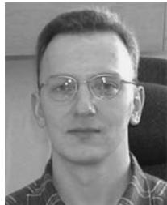

Juri Jatskevich (S’97–M’99–SM’07) received the M.S.E.E. and the Ph.D. degrees in electrical engineering from Purdue University, West Lafayette, IN, in 1997 and 1999, respectively.

Since 2002, he has been a faculty member at the University of British Columbia, Vancouver, BC, Canada, where he is now an Associate Professor of electrical and computer engineering. His research interests include electrical machines, power electronic systems, average-value modeling, and simulation of power systems transients.

Dr. Jatskevich is presently a Chair of the IEEE CAS Power Systems and Power Electronic Circuits Technical Committee, an Editor of the IEEE TRANSACTIONS ON ENERGY CONVERSION, an Editor of the IEEE POWER ENGINEERING LETTERS, and an Associate Editor of the IEEE TRANSACTIONS ON POWER ELECTRONICS. He is also chairing the IEEE Task Force on Dynamic Average Modeling, under Working Group on Modelling and Analysis of System Transients Using Digital Programs.