# Electromechanical transient modelling and application of modular multilevel converter with embedded energy storage

Zheyang Yu Zheren Zhang Zheng Xu

College of Electric Engineering, Zhejiang University, Hangzhou, Zhejiang Province, China

# Correspondence

Zheren Zhang, No. 38 Zheda Road, Hangzhou 310027, Zhejiang Province, China. Email: 3071001296zhang@zju.edu.cn

# Abstract

This paper studies the electromechanical transient modelling techniques of the modified modular multilevel converter (MMC), named active MMC, which is equipped with embedded energy storage in submodules. Firstly, the mathematical model of the active MMC and its equivalent circuits at the AC and DC sides are established. Then, the control scheme of active MMC that focus on the cooperation of the MMC converter and the energy storage submodules is illustrated. The proposed electromechanical transient model are implemented on PSS/E and compared with the electromagnetic transient model on PSCAD in a two terminal active MMC sytem; the results of the active MMC system under AC and DC fault prove the validity of the proposed model. Lastly, stability studies of the practical system are carried out, and the simulation results prove the improvement by the application of the active MMC on the rotor angle stability and frequency stability.

# 1 INTRODUCTION

The long geographical distance between the energy base and large load center is a common scenario in a modern power grid, which needs the bulk power transmission over a long distance. For instance, the Chinese power grid takes a west to east power transmission stratagem to solve the problem that energy resources are mainly distributed in the west while the load centers are located in the east. Facing the requirement of carbon neutralization in China [1], the demand for long-distance bulk power transmission power will keep increasing because of the abundant renewable energy sources in the Western China.

The high voltage direct current (HVDC) transmission is an effective way to achieve long-distance bulk power transmission due to its high economy and reliability. With the development of the power electronics technology, the modular multilevel converter-based high voltage direct current (MMC-HVDC) has been applied in practical projects such as the Wudongde project and the Zhangbei project. The MMC-HVDC has shown great potential thanks to its superior performance compared with the line-commutated converter-based HVDC (LCC-HVDC) [2, 3]. The MMC-HVDC is also regarded as the grid shock absorber because of its excellent fault ride through capability and operation characteristics compared with the conventional

LCC-HVDC. However, there exists an active power coupling between the AC and the DC sides of the MMC-HVDC, since the MMC-HVDC is incapable of storing energy extensively. Thus, the power disturbance caused by fault will affect both the connected AC systems and the MMC-HVDC: (1) The fault occuring in one AC grid may transmit to another AC grid through the MMC-HVDC system even though these AC grids are asynchronous [4]; (2) The fault occurs in MMC-HVDC, such as the DC line fault will certainly influence the connected AC system [5–7]. To make full use of the grid shock absorber function of MMC-HVDC, a new MMC-HVDC which achieves a greater degree of AC/DC system decoupling is needed.

Nowadays, the energy storage system has been widely concerned for its flexible output power adjustment capability [8–10]. Due to the modularity and scalability of MMC system, it is a natural idea to integrate energy storage into MMC system. The topology, modelling, modulation and control system of MMC with embedded energy storage have been extensively studied. The most commonly used topology is a bi-directional DC-DC converter to integrate the energy storage system (ESS) to the MMC submodule (SM) for the purpose of satisfying the incompatibility of the voltage of SM capacitor with batteries (ultra-capacitors) and avoiding the influence of fluctuation voltage of SM capacitor [11–14]. The DC-DC converter is mostly

This is an open access article under the terms of the Creative Commons Attribution License, which permits use, distribution and reproduction in any medium, provided the original work is properly cited.

© 2021 The Authors. IET Generation, Transmission & Distribution published by John Wiley & Sons Ltd on behalf of The Institution of Engineering and Technology

controlled by an internal current controller, together with an outer-loop controller [15–17]. Other additional controllers are studied in [18–20], such as state-of-charge (SOC) controller, the DC power suppression controller, the harmonic currents controller etc. The application of MMC with embedded energy storage in medium-voltage electric drive as well as direct and indirect grid interfaces are discussed in [21–23].

Compared with the conventional MMC, the energy storage system embedded in the MMC can provide extra power to the system. Thus, the MMC with embedded energy storage, which is named active MMC due to its active power compensation ability, can realize a greater degree decoupling of the AC/DC system. It can be foreseen that the active MMC is a promising technology in future practical projects [24]. However, the application scenarios of the active MMC-HVDC system in the transmission network has not been fully studied.

In the purpose of researching the stability of large AC/DC system containing the active MMC-HVDC system, the active MMC model suitable for electromechanical transient simulation is necessary. The established simulation models of MMC with embedded energy system are mainly electromagnetic transient models which focus on the feasibility and reliability of the active MMC system. However, there are few researches on the electromechanical transient modelling of the active MMC. To tackle this issue, the electromechanical transient model of the active MMC is developed, which can be easily extended to multiterminal HVDC (MTDC). The contributions of this paper are summarized as follows:

1. The electro-mechanical model of the active MMC is derived and developed, where an additional current source on the DC side is derived to simulate the dynamic response of the embedded energy storage system in the active MMC.   
2. The application scenarios of the active MMC are discussed from the aspects of power system transient stability. The improvement of the rotor angle stability and the frequency stability is validated by the simulation results of the practical systems.

The outline of this paper is as follows: Section 2 introduces the topology and controller of the active MMC. Section 3 describes the electromechanical transient model of the active MMC. The validation of the proposed model is tested by comparison with the detailed equivalent model (DEM) build in PSCAD/EMTDC in Section 4. In Section 5, the application scenarios of the active MMC are discussed and the simulation based on practical system proves the stability improvement brought by the active MMC. The conclusions are given in Section 6.

# 2 TOPOLOGY AND CONTROLLER OF THE ACTIVE MMC

# 2.1 Topology of the active MMC

The structure of the active MMC is shown in Figure 1. The converter consists of six arms; each arm is formed by a series con-

nection of $N _ { \mathrm { s m } }$ -cascaded SMs with embedded energy storage and one arm reactor L. The upper and lower arms in the same leg comprise a phase unit. $u _ { r j } \ ( r = \mathrm { p } , \mathrm { n } ,$ , represents the upper and lower arms; $j = { \mathfrak { a } } ,$ b, c, represents three phases) is the voltage of cascade SMs. $i _ { r j }$ is the current of each arm. $U _ { d c }$ and $i _ { d c }$ represent voltage and current of the DC side. $L _ { P }$ is the arm reactance, and $R _ { P }$ is the equivalent resistance indicating the equivalent power losses of the MMC. Bus v is the MMC AC side output point. PCC stands for the point of common coupling.

The topology of the active MMC has been through full discussion [11, 12, 19]. As shown in Figure 1b, a half-bridge SM is adopted in the topology of the active MMC. Compared with the conventional MMC, the SM capacitor is connected with the energy storage system by a DC/DC converter in order to match the voltages of the SM capacitor and the energy storage system. The topology of the ESS and the DC/DC converter is shown in Figure 1c. A bi-directional boost DC-DC converter is adopted in each ESSM for its low cost and mature control technique [12]. The energy storage system is formed by the series and parallel connection of energy storage units; the series and parallel number is determined by the voltage and the energy requirement of the energy storage system.

# 2.2 Control scheme of the active MMC

The controller of the active MMC consists of the MMC controller and the EES controller. The MMC controller can include the inner current controller and the power controller, which is the same as with the conventional MMC. The structure of an MMC with inner current controller is shown in Figure 2.

The power controller consists of the d-axis power controller and q-axis power controller according to their control target. The active power controller and reactive power controller are decoupled by adopting the vector control. The d-axis power controller is realized by regulating $i _ { s d r e f }$ of the inner current controller, and the q-axis power controller is realized by regulating $i _ { s q r e f }$ correspondingly. The target of the d-axis power controller can be controlling the active power or the DC voltage; the target of the q-axis power controller can be controlling the reactive power or the AC voltage. One target of the d-axis power controller and q-axis power controller is chosen in the meantime. The structure of the power controller is fully described in [24].

The controller of the ESS is composed of the outer controller and the current controller. The control scheme of the embedded ESS has already been discussed in [7, 15, 25], where different control objectives are adopted in specific control schemes for different fault types. When the fault occurs at the AC side, the current of ESS $i _ { e s }$ is controlled to maintain the voltage of the DC side as constant, and thus the DC side system will not be affected. When the fault occurs at the DC side, the active power injecting into the AC system of the MMC convert is controlled, and AC power transmission will not be affected. A firstorder inertia link is adopted to equivalent the current controller, considering the fast-dynamic response speed of the current controller. The structure of ESS controller is shown in Figure 3.

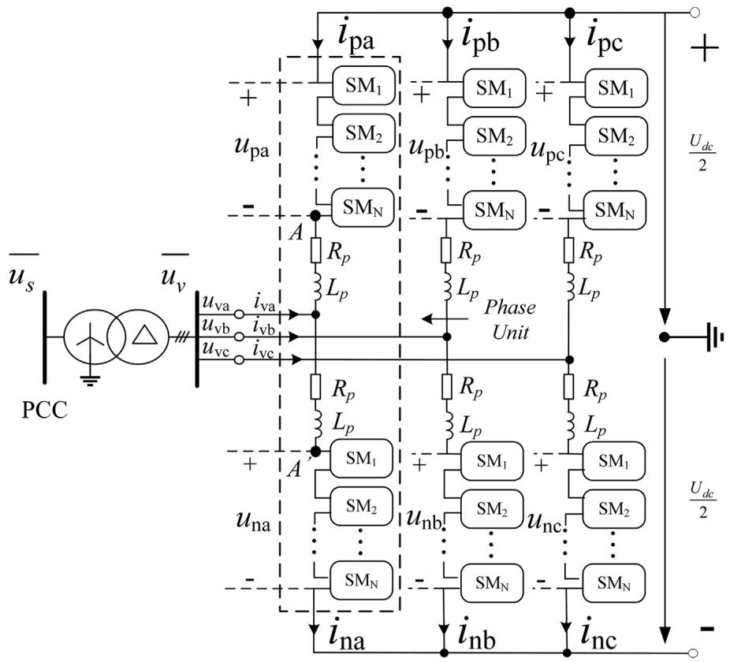  
(a)Topology of the Active MMC

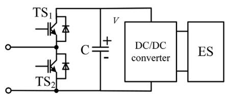  
(b)Topology of the Active MMC submodule

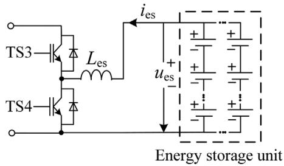  
(c) Topology with the bidirectional boost converter

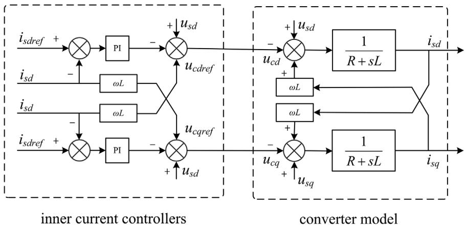  
FIGURE 1 Structure of active MMC   
FIGURE 2 Structure of an MMC with current vector controllers

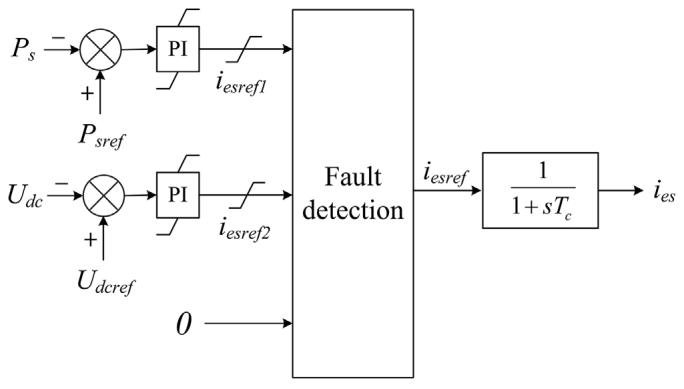  
FIGURE 3 Structure of the ESS controller

After the DC fault, DC circuit breakers (DCCBs) are supposed to trip the faulted DC line. If some critical DC lines are disconnected, some MMCs may not be capable of transmitting the same active power as before the DC fault. On this occasion, the ESS will be put into service in order to keep the power exchange between the active MMC and the AC system. For the active MMC whose DC voltage can be regulated by itself or other MMCs, the power control mode of the active MMC can be unchanged; the active power vacancy/surplus should be compensated by the ESS, and the outer controller of ESS regulates the active power. For the MMC whose DC voltage cannot be maintained, the power control mode of the active MMC should be changed into the DC voltage control mode, and the outer controller of ESS regulates the active power, in order to regulate the output active power of the active MMC.

# 3 MODELLING OF THE ACTIVE MMC

The electromechanical transient model of conventional MMC has been fully researched [26–28]. It consists of the AC side model that cooperates to the algebraic equations describing the network side and the DC side model that describes the dynamic characteristic of the MMC system. The electromechanical transient model of the active MMC is derived from the conventional MMC that is similarly composed of the AC side and the DC side models.

# 3.1 AC side of active-MMC electromechanical transient model

Considering the AC voltage and the AC current distribution characteristics in the active MMC [26], the fundamental frequency equivalent circuit of active MMC interfacing the AC network is shown in Figure 4, which is just the same as the conventional MMC.

Here in Figure 4, $L _ { t }$ and R are the reactance and resistance of the converter transformer. The active-MMC AC side electromechanical transient model can be described in Thevenin equivalent circuit or Norton equivalent circuit, corresponding to the electromechanical simulation software. On the software

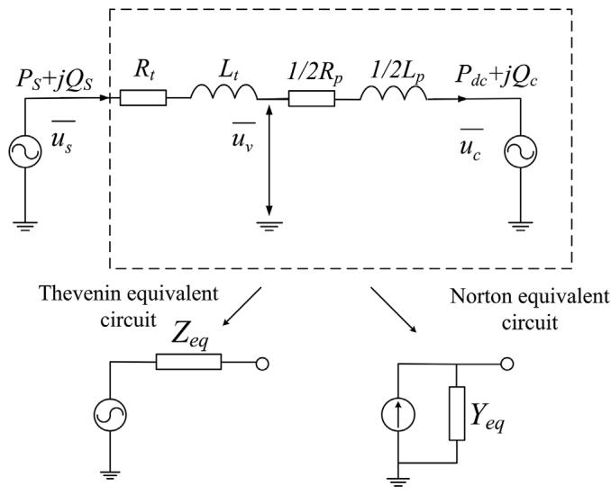  
FIGURE 4 Equivalent model of the MMC on the AC side

PSS/E, the Norton equivalent circuit is adopted to descript electrical components in the algebraic equation of the AC network. The injecting currents $i _ { s d }$ and $i _ { s q }$ are calculated by the injection power of the MMC converter and the voltage of PCC:

$$
i _ {s d} = \frac {P _ {s}}{u _ {s d}} \tag {1}
$$

$$
i _ {s q} = \frac {Q _ {s}}{u _ {s q}} \tag {2}
$$

It should be noted that the injecting current expressed in the rotary coordinate system should be transformed to stationary coordinate system coordinating to the network algebraic equation.

# 3.2 DC side of active-MMC electromechanical transient model

In the electromechanical transient model, the DC side of the MMC system is equivalent to a concentrated capacitance $C _ { e q }$ with regard to the SM capacitors. The value of $C _ { e q }$ can be calculated as in (3):

$$
C _ {e q} = \frac {6}{N _ {S M}} C _ {S M}. \tag {3}
$$

where $C _ { S M }$ is the SM capacitor.

The energy storage in the submodule is equivalent to a controlled current source. The DC line is represented as the “Π” type RLC circuit. The active MMC is equivalent to a concentrated capacitance and two current sources. When a multi-terminal MMC-MTDC system is formed by several MMCs connected by DC transmission lines, the MTDC circuit of MMC-MTDC is shown by Figure 5.

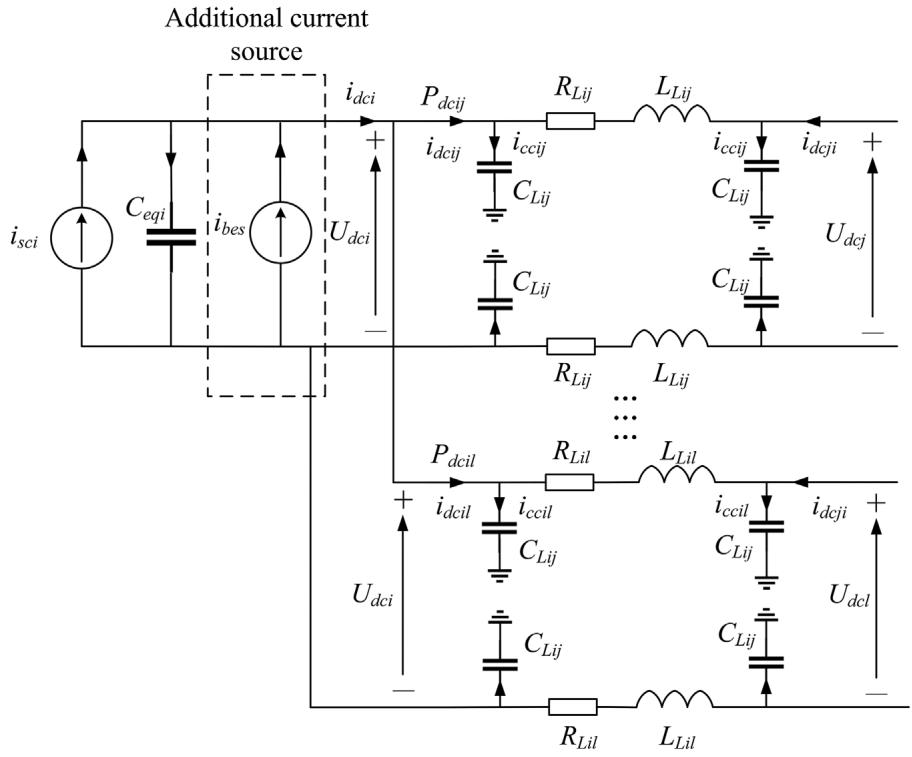  
FIGURE 5 Equivalent DC side circuit of a single MMC

The value of the current source $\dot { 1 } _ { s c i }$ of the MMC in the DC side is calculated by the active power relationship between the AC side and the DC side of the converter:

$$
i _ {s c i} = \frac {P _ {d c i}}{U _ {d c i}} = \frac {P _ {s i} - \mathrm {i} _ {s i} ^ {2} R _ {e q}}{U _ {d c i}} \tag {4}
$$

where

$$
P _ {s i} = \frac {3}{2} \left(u _ {s d i} i _ {s d i} + u _ {s q i} i _ {s q i}\right) \tag {5}
$$

$$
i _ {s i} = \sqrt {\frac {3}{2} \left(i _ {s d i} ^ {2} + i _ {s q i} ^ {2}\right)} \tag {6}
$$

$\mathrm { R } _ { e q }$ is the sum of the converter transformer resistance and half of the MMC equivalent resistance. When a multi-terminal MMC-MTDC system is formed by several MMCs connected by DC transmission lines, the MTDC circuit of MMC-MTDC is shown by Figure 6.

The joint nodes, referring to nodes which are not connected directly to converters, are added for the flexibility of the DC side modelling. And when a short-circuit DC fault occurs, a DC fault node and a grounding branch formed by a grounding resistance and a grounding inductance are added to the DC network as shown in Figure 6. The incidence matrix will be regenerated according to the MTDC circuit topology which is changed by the action of DC circuit breaker, short-circuit branches tripping, outage and reclosure of DC line [27, 29].

The MTDC circuit of MMC-MTDC is described in discretetime state-space equation from nodal matrix formulation, and solved by numerical integral approach which is introduced in

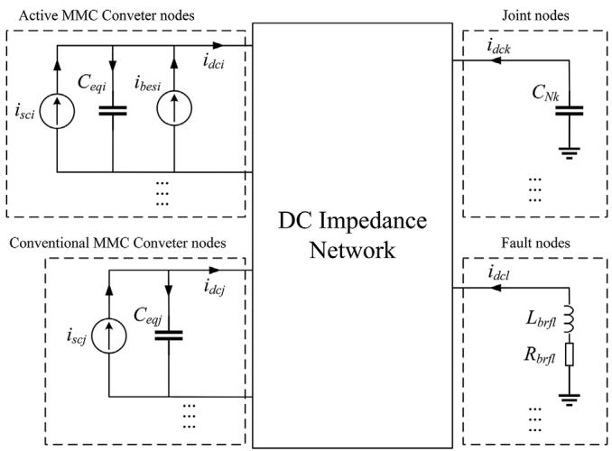  
FIGURE 6 MTDC circuit of MMC-MTDC

detail in [17]. So far, the model and its computing method of the DC side of the active MMC are given.

# 3.3 Complete active-MMC electromechanical transient model

Combining the AC side and the DC side of the electromechanical transient model of the active MMC, the complete electromechanical model of the active MMC system is shown in Figure 7. The value of the voltage of the DC side of the MMC will influence the AC side power injection of the MMC if DC voltage control is adopted, and the DC side injecting current of the MMC $i _ { s c i }$ is calculated by the AC side power injection. The

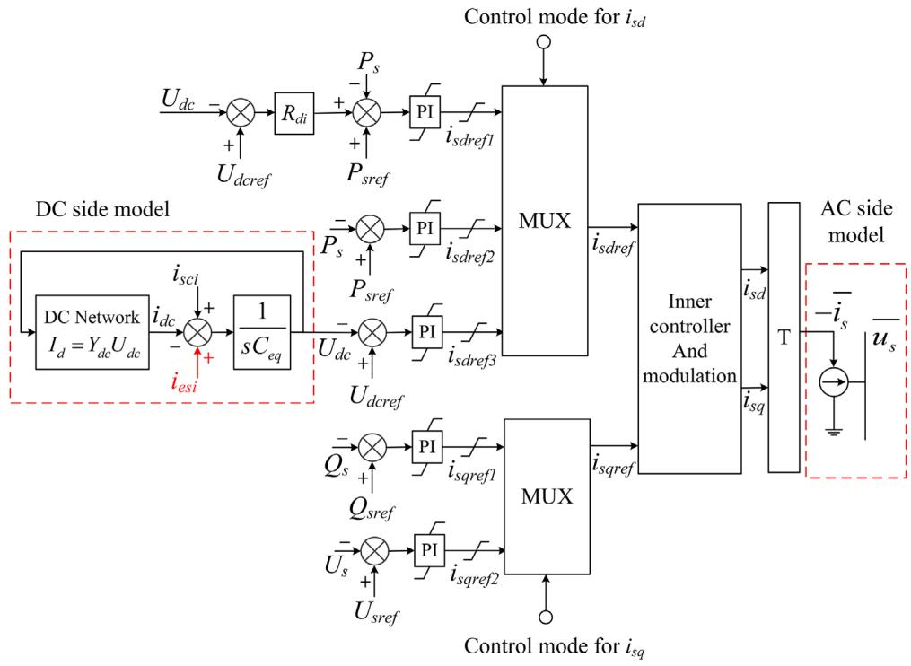  
FIGURE 7 Electro-mechanical model of the active MMC

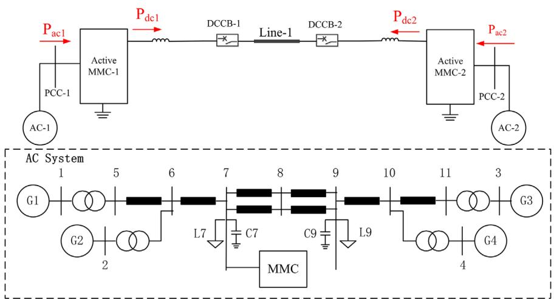  
FIGURE 8 Test system based on two-terminal MMC-HVDC

compensation power of the ESS is equivalent to an additional current $i _ { e s i } ,$ , which acts on the DC side model of the active MMC. By controlling the additional curren $\mathsf { t } i _ { e s i } ,$ the dynamic responses of the active MMC in different situations are simulated.

# 4 MODEL VALIDATION AND SIMULATIONS

This section will verify the validity of the active MMC electromechanical transient simulation model by a two-terminal MMC system (Figure 8) and study the improvement of the stability brought by the active MMC system. In the test system,

two four-machine AC systems are connected by a two-terminal MMC-HVDC which is formed by the conventional MMC or the active MMC. Two DCCBs are used to clear the DC fault. AC-1 is the sending-end AC system and AC-2 is the receiving-end AC system. The MMC converter connects bus 7 in each AC system. The parameters of the test system are shown in Tables 1 and 2.

The main circuit parameters of MMC mainly include the arm reactor, the number of the cascaded submodules (SMs) and the SM capacitor. The number of the cascaded SMs is determined by dividing the MMC-rated DC voltage by the SM-rated voltage. In practical projects, the SM-rated voltage is usually chosen as about half of the IGBT-rated voltage. The selection of the arm reactor and the SM capacitor has been discussed in [30], where

TABLE 1 Main parameters of active MMC station   

<table><tr><td>Item</td><td>Values</td></tr><tr><td>AC system rated voltage</td><td>220 kV</td></tr><tr><td>Transformer ratio</td><td>220 kV/210 kV</td></tr><tr><td>Transformer rated capacity</td><td>480 MVA</td></tr><tr><td>Transformer leakage inductance</td><td>0.1 pu</td></tr><tr><td>Rated DC voltage</td><td>400 kV</td></tr><tr><td>MMC rated capacity</td><td>400 MVA</td></tr><tr><td>Arm reactor</td><td>76 mH</td></tr><tr><td>SM rated voltage</td><td>1.6 kV</td></tr><tr><td>Number of SMs per arm</td><td>250</td></tr><tr><td>SM capacitor</td><td>8334 μF</td></tr><tr><td>Smoothing reactor</td><td>100 mH</td></tr><tr><td>Rated voltage of battery bank</td><td>1 kV</td></tr><tr><td>Rated current of battery bank</td><td>0.34 kA</td></tr><tr><td>DC-DC converter inductance</td><td>6 mH</td></tr><tr><td>DC-DC converter switching frequency</td><td>750 Hz</td></tr><tr><td>Rated capacity of battery</td><td>2350 mAh</td></tr><tr><td>Rated voltage of battery</td><td>3.7 V</td></tr><tr><td>Maximum continuous discharging current of battery</td><td>10 A</td></tr><tr><td>Ohmic resistance of battery</td><td>0.061 Ω</td></tr><tr><td>Polarization resistance of battery</td><td>0.021 Ω</td></tr><tr><td>Polarization capacitance of battery</td><td>1990 F</td></tr><tr><td>Number of batteries in parallel</td><td>34</td></tr><tr><td>Number of batteries in series</td><td>270</td></tr></table>

TABLE 2 Main parameters of DC transmission line   

<table><tr><td>Item</td><td>Values</td></tr><tr><td>DC reactor Ldc</td><td>100 mH</td></tr><tr><td>DC line length</td><td>100 km</td></tr><tr><td>DC line resistance</td><td>0.0114 Ω/km</td></tr><tr><td>DC line inductance</td><td>0.9356 mH/km</td></tr><tr><td>DC line capacitance</td><td>0.0123 μF/km</td></tr></table>

the recommended equivalent capacity discharging time constant and the phase unit series resonance frequency are selected as 40 ms and 50 Hz. In this case, the battery bank is selected as the energy storage unit. The first-order resistor-capacitor model is used as the equivalent circuit model of lithium-ion batteries and the parameters of each battery can be referred to in [25]. Since the rated voltage (3.7 V) and the maximum continuous discharging current (10 A) are far less than those of the battery bank, a number of series- and parallel-connected batteries are needed. The simulations were conducted on a Microsoft Windows 10 platform with a 3.60 GHz Intel Core i7-7700 CPU, 16.0 GB of RAM.

The validity of the conventional MMC electromechanical transient simulation model has been proved in [26–28]. Since

the steady characteristics of the active MMC are almost the same with the conventional MMC, the main focus of this article is the dynamic responses of active MMC during fault. Both PSCAD/EMTDC and PSS/E are used to simulate the AC fault and the DC fault. Figures 9 and 10 show the dynamic responses of the active power, the DC voltage, the DC current, the active power of ESS and the rotor angle of G1 in the sending-end and the receiving-end AC systems. For a 10 s simulation of the test system, the PSCAD takes 32 s whereas the PSS/E takes 125 ms, a speedup over 250 times faster. The speedup will be more significant for a large-scale power system.

# 4.1 AC fault

When the system runs to 2.0 s, a three-phase short-circuit fault is applied to bus 2 in AC-1 and cleared 0.1 s later. From the simulation results in Figure 9a–c, it can be seen that the voltage drop at PCC blocks the power exchange between the MMC and the AC system. However, due to the compensation power proved by the ESS (Figure 9b), the DC voltage of the active MMC is controlled and unchanged (Figure 9e,f). Thus, the active power transmission of the MMC on the other side is not affected, unlike the conventional MMC which has to reduce the active power to maintain the DC voltage (Figure 9d).

The generator rotor angle in AC system in Figure 9i,j illustrates the benefit of the active MMC system more obviously. Compared with the conventional MMC, the fault in AC-1 has little influence on AC-2 due to the active power compensation ability of the active MMC. The swing range of rotor angle in AC-2 is much slighter when the active MMC is applied (Figure 9j). It is noted that the results of electromechanical transient simulation on PSS/E are almost the same as that of electromagnetic transient simulation on PSCAD, and the validity of the proposed electromechanical transient model of the active MMC is verified.

The dynamic responses of the AC/DC system reveal the advantage of the active MMC. If asynchronous AC systems are connected by the conventional MMC system, the AC fault can happen in any of these AC systems and will cause power imbalance of the DC system.The imbalanced power must be compensated by MMC converters which connect the other AC system. Thus, the fault happening in any of the AC systems will influence the stable operation of the other AC systems. By contrast, when asynchronous AC systems are connected by the active MMC, the imbalanced power of the DC system caused by AC fault will be compensated by ESS. Thus, the fault happening in any of the AC systems will not affect the DC system and the other AC systems, which is the ability of the active MMC to block the influence of AC fault to the DC system.

# 4.2 DC fault

In order to study the improvement brought by the active MMC under the DC fault, a temporary line-to-ground fault is simulated in the middle of Line-1. The fault is applied at t = 0.5 s and

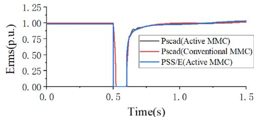  
(a)

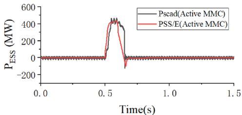  
(b)

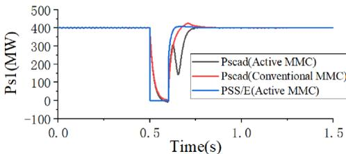

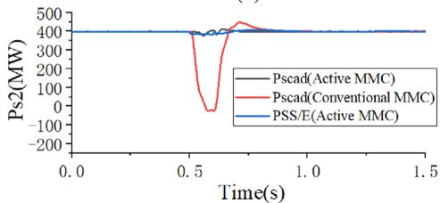

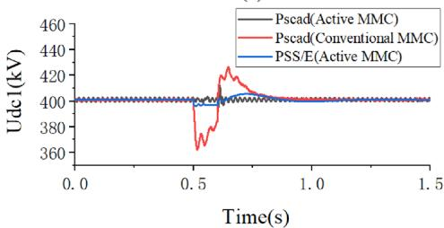  
(c)

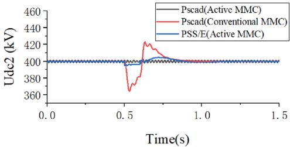  
(d)

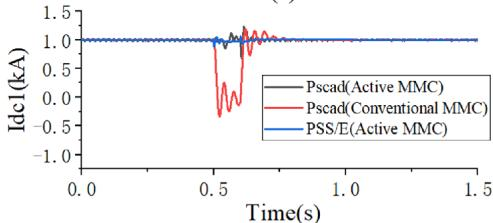  
(e)

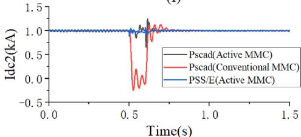  
(f)

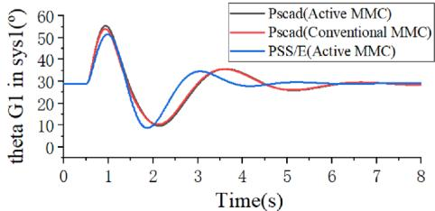  
(g）

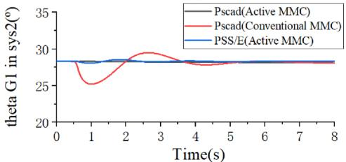  
(h)   
  
i   
FIGURE 9 Dynamic responses of the MMC/active MMC under the AC fault. (a) AC voltage of MMC1 converter bus. (b) Active power of ESS in MMC1. (c) Active power of MMC1. (d) Active power of MMC2. (e) DC voltage of MMC1. (f) DC voltage of MMC2. (g) DC current of MMC1. (h) DC current of MMC2. (i) Relative rotor angle of G1 in AC system1. (j) Relative rotor angle of G1 in AC system2

lasts for 100 ms. ${ \mathrm { A t ~ } } t = 0 . 5 0 3 { \mathrm { ~ s } } ,$ the main breakers of DCCB-1 and DCCB-2 open. Then at t = 0.820 s, the fault is cleared and the insulation is restored. At the same time, DCCB-1 and DCCB-2 are reclosed. The simulation results are depicted in Figure 10.

If the DC system is formed by the conventional MMCs, the active power transmission in the DC line will be blocked after the DC fault. Then, the power exchange between the MMC converter and the AC system is reduced to zero rapidly, which influences the operation of the connecting AC system (Figure 10a,b).

It shows that the DC system fault can affect the operation of the connected AC system (Figure 10i,j). By contrast, if the DC system is formed by the active MMC, the unbalanced active power should be compensated by the ESS (Figure 10c,d). Thus, the power exchange between the AC system and the MMC maintains the same after the DC fault. From Figure 10i,j, the rotor angle of generator G1 in AC-1 and AC-2 shows the stability improvement brought by the active MMC directly. If the active MMC is adopted, the swing range of the generator rotor angles in two AC systems are much slighter compared with when the

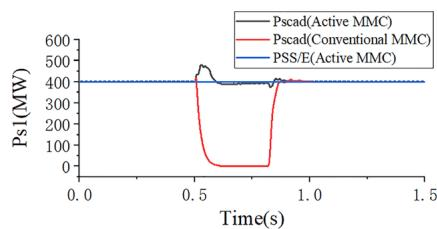  
FIGURE 10 Dynamic responses of the MMC/active MMC under the DC fault. (a) Active power of MMC1. (b) Active power of MMC2. (c) Active power of ESS in MMC1. (d) Active power of ESS in MMC2. (e) DC voltage of MMC1. (f) DC voltage of MMC2. (g) DC current of MMC1. (h) DC current of MMC2. (i) Relative rotor angle of G1 in AC system1. (j) Relative rotor angle of G1 in AC system2   
(a)

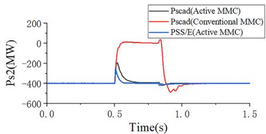  
(b)

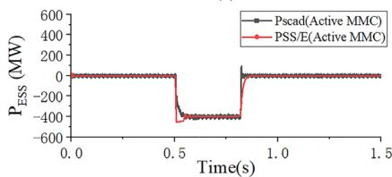  
(c)

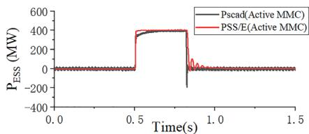  
(d)

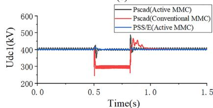  
(e)

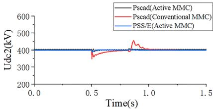  
(f)

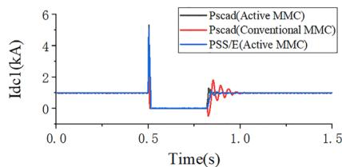  
（g)

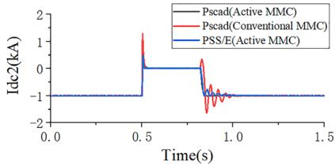  
(h)

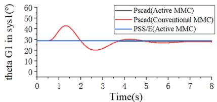  
i

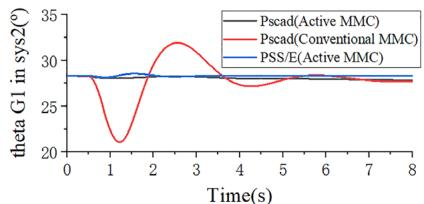  
i

conventional MMC is adopted. Thus, the fault happening in the DC system will not affect the MMC connecting AC systems, which illustrates the ability of active MMC converters to block the influence of DC fault to the AC system.

Also, the consistency of the electromechanical transient simulation results from PSS/E with the electromagnetic transient simulation results from PSCAD proves the validation of the electromechanical transient model of the active MMC.

# 5 APPLICATION SCENARIOS OF THE ACTIVE MMC

This section will give two typical application scenarios of the active MMC based on the simulation of the large-scale power system. The rotor angle stability, voltage stability and frequency stability are three major stability problems in the power system stability analysis. The main improvement of the active MMC is its active power compensation ability to realize a greater

degree of AC/DC system decoupling. Thus, the system instability caused by the active power imbalance is considered as the possible application scenario of the active MMC application. However, the voltage stability, which is closely related to the reactive power, has limited improvement after the application of the active MMC. In this section, two application scenarios, the instability elimination of the AC/DC hybrid transmission system and frequency dynamic response improvement after the DC permanent fault, are used to illustrate the improvement of the rotor angle stability and frequency stability brought by the active MMC application, respectively.

# 5.1 Performance improvement in AC/DC hybrid transmission system

The AC/DC hybrid transmission system is a typical form of power system nowadays, whose interregional power transmission is realized by AC transmission line and DC transmission

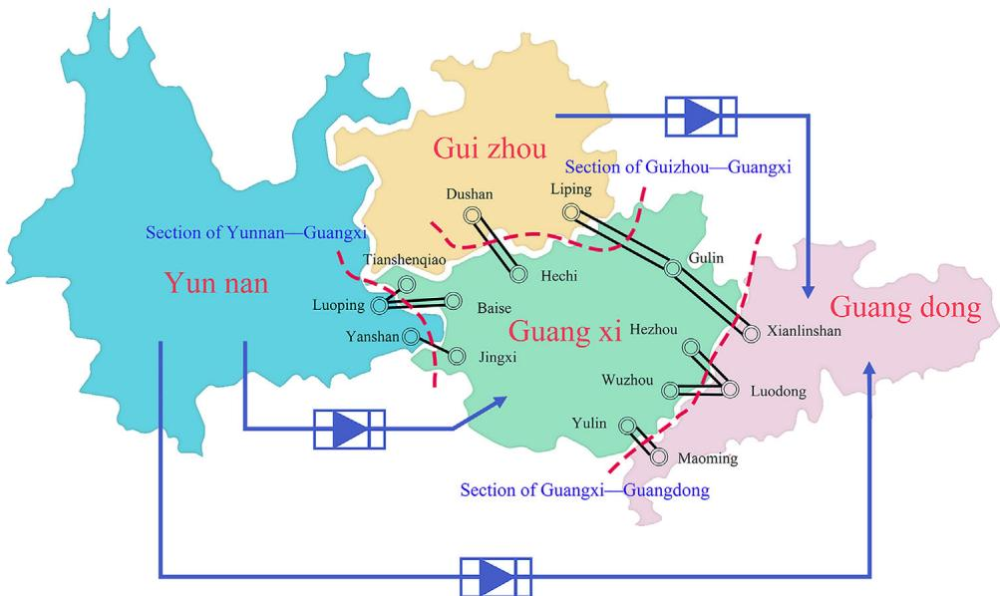  
FIGURE 11 Four provinces synchronous interconnection planing scheme of China Southern Power Grid in 2030

line together. The interaction between the DC system and the AC system will affect the stability of the AC/DC hybrid transmission system seriously. Transmitting electric power from the same sending-end system to the same receiving-end system is common for AC transmission corridors and DC transmission corridors in the AC/DC hybrid transmission system. If the DC system is blocked due to fault, the transmission power of the DC transmission corridor will transfer to the AC transmission corridors, which aggravates the power flow of the AC transmission corridors. If the power flow of the AC transmission line exceeds allowable value, the system will lose stability. However, if the active MMC is adopted to form the DC system, the transmission power of the DC system will not transfer to the AC transmission corridors after the DC fault and will be compensated by the ESS of the active MMC converter.

Figure 11 shows a planning scheme of 2030 China Southern Power Grid which is a four-province synchronous interconnection scheme containing Yunnan, Guizhou, Guangxi and Guangdong. It is a typical AC/DC hybrid transmission system and the across-regional transmission power is carried by seven DC transimission lines and 16 AC tranmission lines. Three AC sections among four provinces, Yunnan— Guangxi, Guizhou—Guangxi and Guangxi—Guangdong are shown in Figure 11. Yunguang DC transmission line is the largest capacity transmission line among the DC transmission lines from Yunnan province to Guangzhou province. Thus, the block of Yunguang DC transmission line will bring a large amount of power transfer to Yunnan—Guangxi and Guangxi— Guangdong AC section due to the connection relationship geographically.

To study the improvement brought by the active MMC, dynamic responses of the AC/DC hybrid transmission system after DC permanent fault are compared between the Yunguang DC constructed by the active MMC and the conventional MMC.

The DC transmission line opens at t = 1.5 s, the dynamic responses of the four provinces’ synchronous interconnection system are demonstrated in Figure 12.

From Figure 12, it can be found if the Yunguang DC system is the conventional MMC system, the opening of Yunguang DC transmission line causes the loss of the transmission power on the DC transmission line (Figure 12a,c), leading to power abundance in the sending-end system and power deficiency in the receiving-end system. Thus, the power flow of the cross-province AC transmission lines increases (Figure 12e). The transferred power from the Yunguang DC transmission line to AC transmission corridors results in the increase of the rotor angle deviation between the sending-end system and the receiving-end system (Figure 12g), which are Yunnan and Guangdong typically in this simulation case. When the deviation exceeds allowable value, the rotor angle instability occurs (Figure 12e,g). If the active MMC is adopted to construct the Yunguang DC transmission system, the power imbalance brought by the opening of the DC transmission line is compensated by the ESS of the active MMC converter (Figure 12b,d). Thus, the injection power of the active MMC converter remains basically unchanged (Figure 12b) and the AC system is almost uninfluenced by the opening of the Yunguang DC transmission line (Figure 12f,h). The instability of the AC/DC hybrid transmission system is avoided by the application of active MMC, which is a typical rotor angle instability caused by the excessive rotor angle difference between generators. After the detection of DC permanent fault, the power-flows of the AC transmission lines should be decreased, which is realized by the control of the output power of generators in the sending- and receiving-end system. The process will be finished in the time scale from 10 s to 2–3 min. Thus, a minute-level rated power compensation ability is required for the active MMC in this scenario.

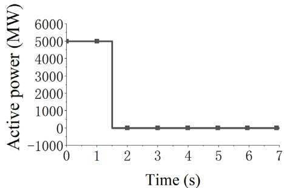

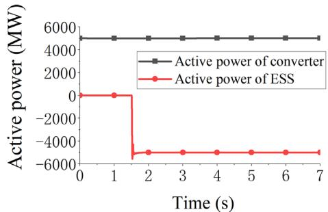

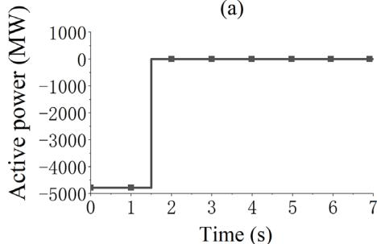

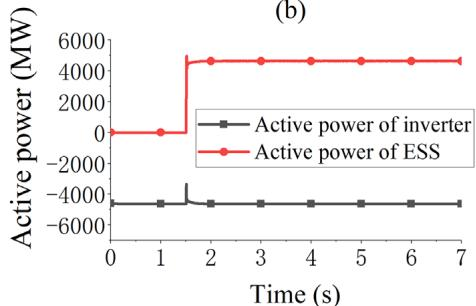

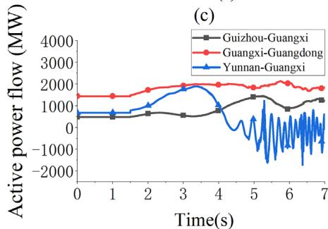

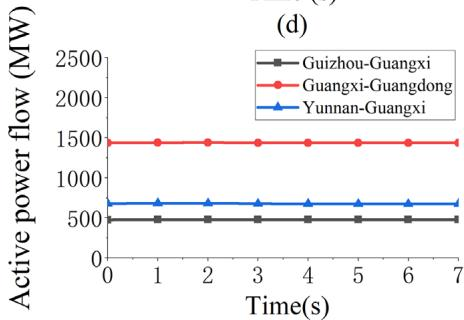

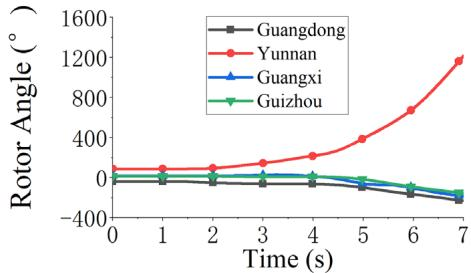  
(e)   
(g)

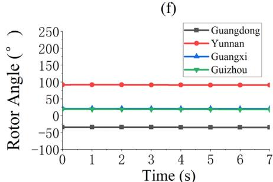  
(h)   
FIGURE 12 Dynamic responses of four provinces synchronous interconnecting system. (a) Active power of conventional MMC rectifier. (b) Active power of active MMC rectifier and rectifier ESS. (c) Active power of conventional MMC inverter. (d) Active power of active MMC inverter and inverter ESS. (e) Active power flow of the AC transmission line among provinces when conventional MMC system adopted. (f) Active power flow of the AC transmission line among provinces when active MMC system adopted. (g) Typical rotor angles in four provinces when conventional MMC system adopted. (d) Typical rotor angles in four provinces when active MMC system adopted

# 5.2 Auxiliary frequency control

Based on the simulation results in Section 3, the active MMC can block the influence of the temporary fault which occurs on the other side system of the MMC converter. However, due to the limited power capacity of the ESS, the ESS is unable to compensate the power imbalance permanently. For instance, if the DC transmission line in a two-terminal DC system opens permanently due to line fault, the power imbalances in both ends’ converters are permanent. The exchange power in the converters

will reduce to zero ultimately and affect the operation of the AC system. However, due to the power control ability of the active MMC, the process of the power reduction of the converter can be controlled. As a contrast, the active power of the conventional MMC will drop to zero suddenly because of the block of the MMC converter which results in a huge power imbalance of the AC system.

In order to reduce the impact brought by the power reduction of the active MMC, the power of the ESS is controlled to realize ladder decrease. The process of the power reduction is

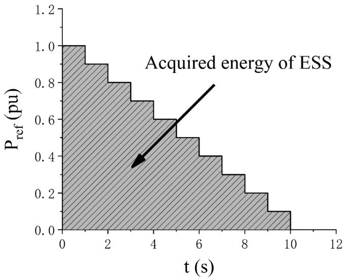  
FIGURE 13 Control scheme of the ESS in active MMC converter

shown schematically in Figure 13. The reference power of the ESS is stepped down from rated power to zero evenly in 10 s. The output energy of the ESS is calculated by the shadow area in Figure 13. The method to calculate the maximum time of the energy storage device maintaining rated power supply is given in [25]. Based on the parameters of the battery bank listed in Table 1, the battery bank is able to provide full-rate power compensation for nearly 10 min. Thus, the second level control strategy belonging to the primary frequency regulation category is practicable for the active MMC converter. We have used a simple stepped down power reduction control to illustrate the benefit brought by the application of the active MMC. If the control scheme of active MMC is coordinated with the secondary frequency regulation, a minute-level rated power compensation ability will be required for the active MMC. It can be found that a minute-level rated power compensation ability is expected for the active MMC to deal with the DC permanent fault. The lithium battery is more suitable for the active MMC compared with the ultra-capacitor for its strong energy storage ability.

The simulation case is still based on the practical system data. Due to the exceeding standard of short-circuit current, the critical interaction between AC and DC system and the lacking of risk control capability of large area blackout brought by the excessive AC grid size, the Guangdong power grid has a plan to divide the synchronous power grid into two asynchronous power grids. As shown in Figure 14, two back-to-back converter stations are used to cut off the AC electrical connection of the Guangdong power grid. A smaller synchronous grid size reduces the short-circuit current, and the fault that happens in one AC system will not influence the operation of the DC converter in the other asynchronous AC system. However, the separation of the Guangdong power grid will reduce the inertia of the power grid, especially for the eastern Guangdong power grid which is separated from the main southern grid. Four DC converters are infeed in the Eastern Guangdong power grid after the separation. The conventional DC converter will block immediately when the corresponding DC transmis-

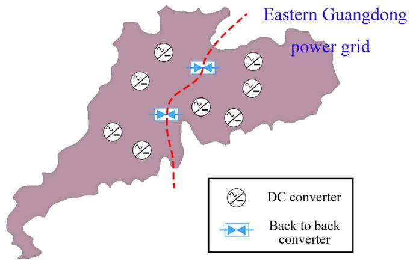  
FIGURE 14 Two back-to-back converter stations in Guangdong power grid

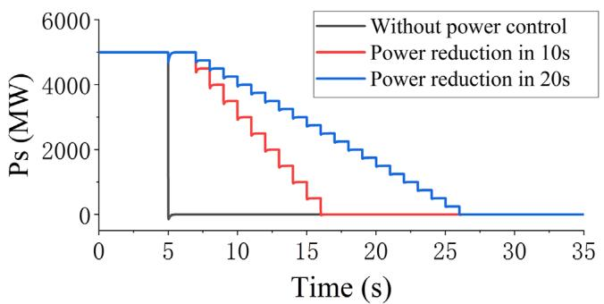  
(a)

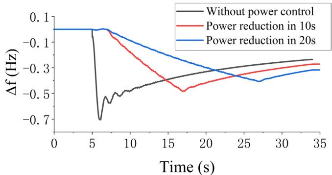  
(b)   
FIGURE 15 Dynamic responses of the MMC/active MMC under DC fault. (a) Active power of converters under different control schemes. (b) Frequency deviations of eastern Guangdong power grid under different MMC control schemes

sion line opens permanently after the DC fault, leading to a significant power imbalance in the Eastern Guangdong power grid. If the active MMC is adopted, the influence of power imbalance brought by DC permanent fault is reduced due to its ability of controlling the process of power reduction.

Figure 15 shows the dynamic response of the injection power of the DC converter and the frequency deviation of the Eastern Guangdong power grid. Responses of the system under two power control schemes of the active MMC are compared with the response without active MMC connecting, and the capacity

of the DC converter is 5000 MW. The reference value of the ESS drops evenly per second from rated value to zero during different times, which are 10 and 20 s in simulation. Figure 15a shows the power injection of the MMC converter. Because of the power control ability of the active MMC, the power injection of the MMC converter is controlled according to the set power reduction plan. Due to the same power adjustment step, a longer adjustment time leads to a smaller power adjustment value, and brings a slighter influence to the AC system. The frequency deviations of the Eastern Guangdong power grid under different MMC control schemes are shown in Figure 15b. The changing rate of frequency deviation and the maximum frequency deviation of Eastern Guangdong power grid are reduced due to the process of power reduction in a longer time period.

If active MMC is not adopted, the maximum frequency deviation of Eastern Guangdong power grid is close to 0.8 Hz, which is near the load shedding frequency in the security control strategy of many power grid operators. If the inertia of the AC system and the ability of the primary frequency regulation is further reduced because of replacement of traditional generator by the renewable energy generator, the employment of the auxiliary frequency control ability of active MMC will be needed to prevent the triggering of the low frequency load shedding and improve the frequency stability. And as shown in Figure 15b, the maximum frequency deviation of Eastern Guangdong power grid is pretty close to the final frequency deviation when the process of power reduction of the converter is controlled in 20 s. And a smoother frequency deviation curve of Eastern Guangdong power grid, in which the overshoot of the frequency deviation is non-existent, will be expected with a longer adjustment time of the active MMC. Furthermore, if the active MMC adopts the control scheme cooperated with the secondary frequency regulation of the generators in the Eastern Guangdong power grid, the frequency of the Eastern Guangdong power grid may not be influenced.

The active power compensation ability of the active MMC can not only reduce the instantaneous impact of the permanent DC fault on AC system, but also give an adjustment time for AC system to deal with the influence brought by DC fault. Such an ability is important for a low inertia AC system with a high proportion of DC power infeed which will occur in the future due to the trend of the replacement of the traditional generators by renewable energy generators and the task of long distance transregional transportation of energy.

# 6 CONCLUSION

This paper examines the electromechanical transient model of active MMC-MTDC. The following conclusions can be drawn:

1. The main features of the model are: (1) A current source is used to simulate the transient response of the imbedded ESS in the active MMC converter; (2) The control target of the current source is set according to the fault type.

2. The model is implemented on PSS/E and is compared with the accurate electromagnetic transient models of active MMC on PSCAD. The consistency of simulation results between electromechanical transient model and electromagnetic transient model validates the accuracy of the proposed model. During the validation, the advantage of the active MMC, which realizes a greater degree of AC/DC system decoupling, is also revealed.   
3. Two stability studies based on practical system are performed in order to study the typical application scenarios of the active MMC in the transmission network. The results demonstrate that the application of the active MMC improves the rotor angle stability and the frequency stability of the system.

The active MMC realizes a greater degree decoupling of the AC/DC system compared with the conventional MMC. Such an ability may be required in future power grids with high proportion power electronic devices integrating. Much more work concerning the technical and the economical aspects of the practical project of active MMC remains to be done, such as the energy storage component optimization of the active MMC, and the electromagnetic transient modelling and simulation of the active MMC in islanded AC system.

# DATA AVAILABILITY STATEMENT

The data that support the findings of this study are available on request from the corresponding author. The data are not publicly available due to privacy or ethical restrictions.

# ORCID

Zheren Zhang https://orcid.org/0000-0003-2962-0230

Zheng Xu https://orcid.org/0000-0003-1283-6238

# REFERENCES

1. Tang, W., Wu, P., Zhang, Y., Cao, X.: Analysis on the current situation and development trend of China’s electrification level and electric energy substitution under the background of carbon neutral. IOP Conf. Ser.: Earth Environ. Sci. 661(1), 012–019 (2021)   
2. Guan, M., et al.: The frequency regulation scheme of interconnected grids with VSC-HVDC links. IEEE Trans. Power Syst. 32(2), 864–872 (2017)   
3. Debnath, S., Qin, J., Bahrani, B., Saeedifard, M., Barbosa, P.: Operation, control, and applications of the modular multilevel converter: a review. IEEE Trans. Power Electron. 30(1), 37–53 (2015)   
4. Ajaei, F.B., Iravani, R.: Dynamic interactions of the MMC-HVDC grid and its host AC system due to AC-side disturbances. IEEE Trans. Power Delivery. 31(3), 1289–1298 (2016)   
5. Tang, G., Xu, Z., Zhou, Y.: Impacts of three MMC-HVDC configurations on AC system stability under DC line faults. IEEE Trans. Power Syst. 29(6), 3030–3040 (2014)   
6. Haleem, N.M., Rajapakse, A.D., Gole, A.M., Fernando, I.T.: Investigation of fault ride-through capability of hybrid VSC-LCC multi-terminal HVDC transmission systems. IEEE Trans. Power Delivery. 34(1), 241–250 (2019)   
7. Shahriari, E., Gruson, F., Vermeersch, P., Delarue, P., Colas, F., Guillaud, X.: A novel DC fault ride through control methodology for hybrid modular multilevel converters in HVDC systems. IEEE Trans. Power Delivery. 35(6), 2831–2840 (2020)   
8. Xu, X., Bishop, M., Donna, O., Chen, H.: Application and modeling of battery energy storage in power systems. CSEE J. Power Energy Syst. 2(3), 82–90 (2016)

9. Farhadi, M., Mohammed, O.: Energy storage technologies for high-power applications. IEEE Trans. Ind. Appl. 52(3), 1953–1961 (2016)   
10. Sun, Y., Li, Z., Shahidehpour, M., Ai, B.: Battery-based energy storage transportation for enhancing power system economics and security. IEEE Trans. Smart Grid. 6(5), 2395–2402 (2015)   
11. Vasiladiotis, M., Rufer, A.: Analysis and control of modular multilevel converters with integrated battery energy storage. IEEE Trans. Power Electron. 30(1), 163–175 (2015)   
12. Herath, N., Filizadeh, S., Toulabi, M.S.: Modeling of a modular multilevel converter with embedded energy storage for electromagnetic transient simulations. IEEE Trans. Energy Convers. 34(4), 2096–2105 (2019)   
13. Judge, P.D., Green, T.C.: Modular multilevel converter with partially rated integrated energy storage suitable for frequency support and ancillary service provision. IEEE Trans. Power Delivery. 34(1), 208–219 (2019)   
14. Kong, Z., Huang, X., Wang, Z., Xiong, J., Zhang, K.: Active power decoupling for submodules of a modular multilevel converter. IEEE Trans. Power Electron. 33(1), 125–136 (2018)   
15. Chen, Q., Li, R., Cai, X.: Analysis and fault control of hybrid modular multilevel converter with integrated battery energy storage system.IEEE Trans. Emerg. Sel. Topics Power Electron. 5(1), 64–78 (2017)   
16. Xiao, Y., Peng, L.: A novel fault ride-through strategy based on capacitor energy storage inside MMC. IEEE Trans. Power Electron. 35(8), 7960– 7971 (2020)   
17. Hollman, J.A., Marti, J.R.: Step-by-step eigenvalue analysis with EMTP discrete-time solutions. IEEE Trans. Power Syst. 25(3), 1220–1231 (2010)   
18. Soong, T., Lehn, P.W.: Internal power flow of a modular multilevel converter with distributed energy resources. IEEE Trans. Emerg. Sel. Topics Power Electron. 2(4), 1127–1138 (2014)   
19. Zhang, L., Tang, Y., Yang, S., Gao, F.: Decoupled power control for a modular-multilevel-converter-based hybrid AC–DC grid integrated with hybrid energy storage. IEEE Trans. Ind. Electron. 66(4), 2926–2934 (2019)   
20. Song, S., Liu, J., Ouyang, S., Chen, X.: Submodule voltage fluctuation elimination in modular multilevel converter with integrated super capacitor energy storage system. In: 2017 IEEE 3rd International Future Energy Electronics Conference and ECCE Asia (IFEEC 2017 - ECCE Asia), pp. 1960–1964. Kaohsiung, Taiwan (2017)   
21. Guo, P., et al.: Analysis and control of modular multilevel converter with split energy storage for railway traction power conditioner. IEEE Trans. Power Electron. 35(2), 1239–1255 (2020)   
22. Li, Z., Yang, X., Tao, H., Zheng, T.Q., You, X., Kobrle, P.: Improved modular multilevel converter with symmetrical integrated super capaci-

tor energy storage system for electrical energy router application. In: 2019 IEEE Energy Conversion Congress and Exposition (ECCE), pp. 5365– 5372. Baltimore, MD, United states (2019)   
23. Long, W., Liu, N., Wang, K., Xu, X., Zheng, Z., Li, Y.: A modular multilevel converter with integrated composite energy storage for ship MVDC electric propulsion system. In: 2020 IEEE 9th International Power Electronics and Motion Control Conference (IPEMC2020-ECCE Asia), pp. 824–829. Nanjing, China (2020)   
24. Xiao, L., Xu, Z., An, T., Bian, Z.: Improved analytical model for the study of steady state performance of droop-controlled VSC-MTDC systems. IEEE Trans. Power Syst. 32(3), 2083–2093 (2017)   
25. Xu, Y., Zhang, Z., Wang, G., Xu, Z.: Modular multilevel converter with embedded energy storage for bidirectional fault isolation. IEEE Trans. Power Delivery. (2021). https://doi.org/10.1109/TPWRD.2021.3054022   
26. Liu, S., Xu, Z., Hua, W., Tang, G., Xue, Y.: Electromechanical transient modeling of modular multilevel converter based multi-terminal HVDC systems. IEEE Trans. Power Syst. 29(1), 72–83 (2014)   
27. Xiao, L., Xu, Z., Xiao, H., Zhang, Z., Wang, G., Xu, Y.: Electro-mechanical transient modeling of MMC-based multi-terminal HVDC system with DC faults considered. Int. J. Electr. Power Energy Syst. 113, 1002–1013 (2019)   
28. Guide for the development of models for HVDC converters in a HVDC grid. CIGRE WG B4-57, CIGRE Tech Brochure TB.6042014 (2014). https://e-cigre.org/publication/604-guide-for-the-developmentof-models-for-hvdc-converters-in-a-hvdc-grid   
29. Chaudhuri, N.R., Majumder, R., Chaudhuri, B., Pan, J.: Stability analysis of VSC MTDC grids connected to multimachine AC systems. IEEE Trans. Power Delivery. 26(4), 2774–2784 (2011)   
30. Xu, Z., Xiao, H., Zhang, Z.: Selection methods of main circuit parameters for modular multilevel converters. IET Renew. Power Gener. 10(6), 788– 797 (2016)

How to cite this article: Yu, Z., Zhang, Z., Xu, Z.: Electromechanical transient modelling and application of modular multilevel converter with embedded energy storage. IET Gener. Transm. Distrib. 16, 123–136 (2022). https://doi.org/10.1049/gtd2.12282