# Electromagnetic disturbances in gas-insulated substations and VFT calculations

Akihiro Ametani ∗, Haoyan Xue, Masashi Natsui, Jean Mahseredjian

Ecole Polytechnique Montreal, Quebec H3C 3A7, Canada

# a r t i c l e i n f o

Article history:

Received 17 October 2017

Received in revised form 18 February 2018

Accepted 19 February 2018

Available online 22 March 2018

Keywords:

VFT

GIS

Electromagnetic disturbance

High frequency

EMTP

FDTD

# a b s t r a c t

This paper is focused on the oscillating frequencies of very-fast transients (VFTs) generated by disconnector and circuit breaker operations in gas-insulated substations (GISs) related to electromagnetic disturbances (EMDs). Test results of the VFT amplitudes and oscillating frequencies are summarized, and the measured results have shown that there is no significant difference of the frequencies in the high-voltage main circuits and the low-voltage control circuits in the GISs. Modeling of GIS elements for VFT simulations by EMT-type software are explained, and simulation examples are demonstrated in comparison with test results. Also, FDTD (finite-difference time-domain) computations are performed, and the calculated results are compared with EMTP simulation results. If proper modeling is adopted, EMTP and FDTD results show a reasonable agreement.

© 2018 Elsevier B.V. All rights reserved.

# 1. Introduction

It is well-known that lightning strikes to a transmission tower nearby a substation and switching operations in a gas-insulated substation (GIS) produce high frequency surges. The dominant frequency components involved in the lightning surge are, in general, lower than 1 MHz. The switching surges due to disconnector (DS) or circuit breaker (CB) operation in the GIS contain the frequency components from some MHz up to more than 100 MHz, and are called “very fast transient (VFT)” or “very fast transient over-voltage (VFTO)” [1–3]. To investigate the VTF, a number of field and laboratory tests have been carried out [4–24]. Also, computer simulations of the VFT were performed, and modeling methods were investigated [25–31]. The measured and simulation results show that the VFT over-voltage reaches even 4 pu which becomes very important especially in a ultra-high-voltage (UHV) system because of a comparatively lower insulation level [1–3,19–21]. Various methods to damp the over-voltage have been proposed and the effectiveness are shown [7,12,23]. However, the oscillating frequency of the VFT is not much affected by the methods.

It has been pointed out that the high frequency components of the VFT are a main cause of electromagnetic disturbances (EMDs) in GIS control circuits [10,12,14–18,22,32–35].

This paper is focused on VFTs from the viewpoint of electromagnetic disturbances (EMDs). In Section 2, the voltage amplitudes and oscillating frequencies of the VFTs are summarized based on field and laboratory tests described in [4–24]. The measured results are categorized in the high-voltage main circuit of GISs, in the metallic enclosures and in the low-voltage control circuits. Section 3 explains modeling of GIS elements for VFT simulations by existing transmission line (TL) approaches, i.e. EMT-type software [36–39]. Then, calculated examples are demonstrated including a comparison with test results. In Section 4, an FDTD (finite-difference time-domain method [40,41]) computation is performed, and computed results are compared with EMTP results. Section 5 summarizes the investigated results in this paper.

# 2. Frequencies

Table 1 summarizes the measured results of the amplitudes and frequencies of VFTs. In the table, references, the rated voltage of GISs, VFT frequency and amplitude are shown. In (a) and (b), the amplitude is given by pu (per unit), while in (c) it is given by a peak-to-peak voltage.

It is observed in Table 1(a) that the VFT frequencies in UHV GISs are lower than those in lower voltage GISs except those given by Ref. [19]. Only few references show measured results of the VFT voltages and frequencies on the metallic enclosure (duct, tank or pipe) of the GISs. The measured voltages range from 0.1 to 0.7 pu in Table 1(b), because the pipe voltage is determined by mutual surge

Table 1 Summary of measured frequency and amplitude of VFTOs in GIS.   

<table><tr><td>Ref. no</td><td>[5,6,13]</td><td>[10]</td><td>[23]</td><td>[24]</td><td>[12]</td></tr><tr><td colspan="6">(a) High-voltage main circuit</td></tr><tr><td>Rated [kV]</td><td>500/550</td><td>550</td><td>500</td><td>500</td><td>110/800</td></tr><tr><td>Frequency [MHz]</td><td>1-140</td><td>10-50</td><td>8-100</td><td>5-60</td><td>5-25</td></tr><tr><td>Voltage [pu]</td><td>1.2-3.0</td><td>2.7</td><td>-</td><td>-</td><td>1.2-1.7</td></tr><tr><td>Ref. no</td><td>[7]</td><td>[19]</td><td>[20]</td><td>[21]</td><td>-</td></tr><tr><td>Rated [kV]</td><td>UHV</td><td>1100</td><td>1100</td><td>1100</td><td>-</td></tr><tr><td>Frequency [MHz]</td><td>1-5</td><td>2-31</td><td>0.25-2</td><td>8-118</td><td>-</td></tr><tr><td>Voltage [pu]</td><td>2.4-3.0</td><td>1.35</td><td>1.05-1.62</td><td>1.82-2.19</td><td>-</td></tr><tr><td>Ref. no</td><td>[5]</td><td>[10]</td><td></td><td></td><td></td></tr><tr><td colspan="6">(b) Metallic enclosure (duct, tank or pipe)</td></tr><tr><td>Rated voltage [kV]</td><td>500</td><td>550</td><td></td><td></td><td></td></tr><tr><td>Frequency [MHz]</td><td>2.5-10</td><td>2-50</td><td></td><td></td><td></td></tr><tr><td>Voltage [pu]</td><td>0.1</td><td>0.1-0.7</td><td></td><td></td><td></td></tr><tr><td colspan="6">(c) Low-voltage control circuit, Ref [16] (13 GISs/58 test cases)</td></tr><tr><td>Rated [kV]</td><td colspan="3">66/77</td><td colspan="2">275</td></tr><tr><td>Circuit</td><td>CT</td><td>VT</td><td>Control</td><td>CT</td><td>VT</td></tr><tr><td>Frequency [MHz]</td><td>45-55</td><td>8</td><td>8-55</td><td>5-70</td><td>10-20</td></tr><tr><td>Peak to peak voltage [V]</td><td>20-600</td><td>20-120</td><td>10-100</td><td>80-700</td><td>10-600</td></tr><tr><td>Rated [kV]</td><td colspan="3">500/550</td><td>1000</td><td>66-1000</td></tr><tr><td>Circuit</td><td>CT</td><td>VT</td><td>Control</td><td>VT</td><td>DC source</td></tr><tr><td>Frequency [MHz]</td><td>5-15</td><td>10-18</td><td>1-10</td><td>40-80</td><td>2-45</td></tr><tr><td>Peak to peak voltage [V]</td><td>100-240</td><td>10-200</td><td>10-100</td><td>60-450</td><td>80-700</td></tr></table>

impedance $Z _ { o m }$ between the core and the pipe and core current $I _ { c } ,$ i.e. $V _ { p } { = } Z _ { o m } I _ { c } ,$ and is dependent on the pipe grounding.

It should be noted that the frequency components in the pipe voltages are not much different from those in the core voltages in the same gas-insulated bus (GIB) [5,10].

Table 1(c) shows the peak-to-peak voltages and frequencies measured at the CT (measuring current transformer) secondary circuits, VT (measuring voltage transformer and capacitive voltage transformer = CVT) secondary circuits, digital/electronic control circuits and DC source circuits for the control circuits collected from 13 GISs in Japan [16]. Altogether 58 test cases are collected. The voltages range from 10 to 700 V with the frequencies from 1 to 80 MHz. It is observed that the VFT frequencies measured in the low-voltage circuits in Table 1(c) are lower than those measured in the high-voltage circuits in Table 1(a) and (b). The lower frequency components are estimated to be caused by wave deformation, not necessarily attenuation, along control cables with the length of more than 50 m connecting the CTs and VTs and the control circuits [16,30]. However, the frequencies up to 80 MHz are observed. The high frequency components have resulted in malfunctions of control circuits, EMDs, which occasionally caused system operation troubles [16–18].

In summary, Table 1 has made clear the significance of VFTs, not only for the insulation coordination of GISs especially in a UHV system [1–3] but also for EMDs due to malfunctions of low-voltage control circuits in GISs [32–35].

# 3. Modeling and EMTP calculations

This chapter first describes modeling of various elements/components of a GIS for VFT simulations by EMT-type software based on a transmission line (TL) approach [36–39]. Then, simulation examples are demonstrated including a comparison with measured VFT voltages.

# 3.1. Modeling of GIS elements/components

Ref. [25] describes the basic concepts for modeling GIS elements for VFT simulations by EMT-type software. Ref. [26] summarizes modeling methods of various elements/components involved in

the GIS. Ref. [27] gives the values of equivalent capacitances of GIS spacers, bus open-end, CT, VT etc., and surge impedances of DS, CB, a bushing and an XLPE cable. Ref. [28] shows modeling of GIBs connected to a main bus, pipe grounding with arresters, etc. Ref. [29] explains modeling of mutual coupling between an overhead control cable and a grounding mesh in a substation. Ref. [30] shows modeling of a VT connected to the control cable and mutual coupling between the control cable and the GIB. Ref. [31] describes a detailed model of a CT.

Summarizing the above references and the authors’ experiences, the following remarks are made for VFT simulations by EMTP.

(1) For VFT frequencies are very high, the earth is assumed as perfectly conducting $( \rho _ { e } = 0 )$ or an Al plate can be assumed as the earth as often adopted in a laboratory test. In a very high frequency region, the coaxial mode is completed within the pipe and the pipe conductor becomes a complete shield. Thus, the earth effect is hardly observed in measured and simulation results. The fact has indicated that no frequency-dependent model of a conductor is necessary in an EMTP simulation. Further, only a core conductor with the coaxial propagation mode parameters is enough to perform a VFT simulation by EMTP, especially when both ends of a pipe are grounded.

(2) Pipe grounding has to be carefully considered. The waveform of a pipe voltage is affected by the grounding very much, although the core voltage is less influenced.

(3) A branched GIB (branch) causes a high frequency oscillation and a resultant surge waveform becomes very oscillatory. However, a measured waveform is entirely dependent on the sampling time (highest frequency) of an oscilloscope used for the measurement. If necessary, a branch can be represented by capacitance $C _ { b } \left[ 4 2 \right]$ ].

$$
C _ {b} = 1 / \left(z _ {o c} c _ {c}\right) [ \mathrm {F} / \mathrm {m} ] \tag {1}
$$

where $z _ { o c } \mathrm { : }$ coaxial mode surge impedance, $c _ { c } .$ velocity.

(4) A charged GIB involves a dc voltage component which cannot be handled by EMTP. The dc voltage is represented by a low frequency ac voltage.   
(5) The length of a lead wire connecting a source and a GIB core and grounding a GIB pipe is comparatively large for the GIB

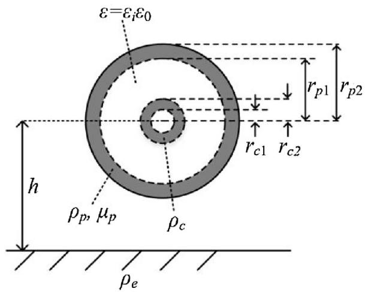

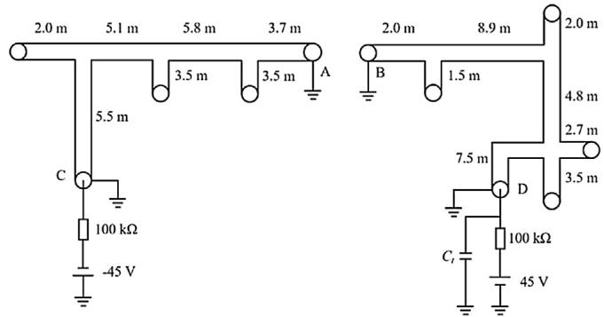  
Fig. 1. GIB cross-section.

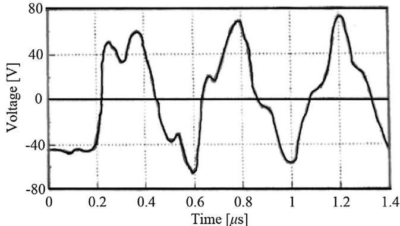  
Fig. 2. Test circuit of a proto-type GIB: h = 1 m, $r _ { c 1 } = 5 .$ .5 cm, $r _ { c 2 } = 7 . 0 \mathrm { c m } ,$ , rp1 = 34.05 cm, rp2 = 34.5 cm, -c = -p = 2.8 × 10−8 m, $\mu _ { p } = \mu _ { 0 }$ .   
(a)No C

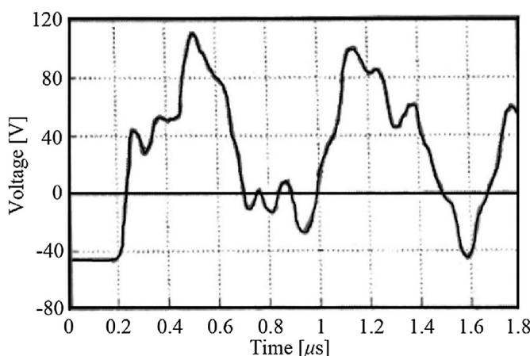  
$( \mathrm { b } ) C _ { t } = 5 \mathrm { n F }$   
Fig. 3. Test results of node C voltage.

  
(a) Cu plate

  
(b） $\rho _ { e } = 1 0 0 \Omega \mathrm { m }$   
Fig. 4. Node C voltage of test circuit with branches and no $C _ { t } ,$ WB model.

length is short. Therefore, the lead wire has to be modeled as a distributed-parameter line, i.e. CP (constant parameter) line model of EMTP. In most cases, the lead wire is vertical, and its surge impedance can be evaluated approximately in the following equation [38].

$$
Z _ {o v} = 6 0 \left[ \ln \left(\frac {h}{r}\right) - 1 \right] \tag {2}
$$

where h: lead wire height = length, r: radius.

(6) If VFTs in a GIS main circuit including metallic enclosures are concerned, a CT and a VT can be represented by an equivalent capacitance [26,27]. When VTs in a GIS control circuit for an EMD study are concerned, the CT and VT are to be modeled in details [30,31]. Also a control cable should be modeled as accurately as possible, because wave deformation along the cable influences significantly to the calculated VFT current and voltage at the entrance of the control circuit.   
(7) To analyze a VFT on an overhead control cable due to mutual coupling between a grounding mesh, the mesh voltage cannot be assumed zero [29].

# 3.2. Proto-type GIS

# 3.2.1. Test circuit

Fig. 1 illustrates the cross-section of a GIB which is the same as that of all the GIBs investigated in this paper. The height and radii depend on the voltage class and manufacturers. Fig. 2 shows the test circuit of a proto-type GIB [4,42]. The GIB was set at height h = 1 m above a Cu plate. Both ends of the pipe (nodes A, B, C and D) are grounded. Because of a proto-type test, a plastic-made cylinder with the length of about 0.7 m and the relative permittivity of 6 was installed at every 1–2 m of the GIB. It has been shown in [4] that an equivalent permittivity of the GIB is 2.3. Ct is an equivalent capacitance of a transformer connected to node D. The left side (node A to node C) of the bus is charged by 45 V and the right (B–D) is charged by +45 V. Node A is short-circuited to node B at t = 0.

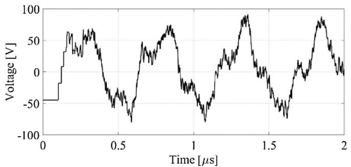  
Fig. 5. Node C voltage of test circuit with branches and no $C _ { t } ,$ , CP model.

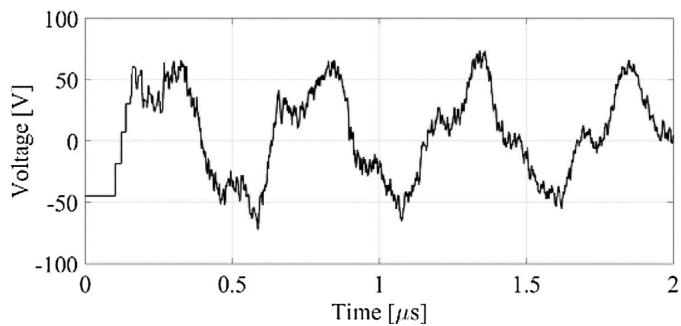  
Fig. 6. Node C voltage of single-phase (core only), CP model.

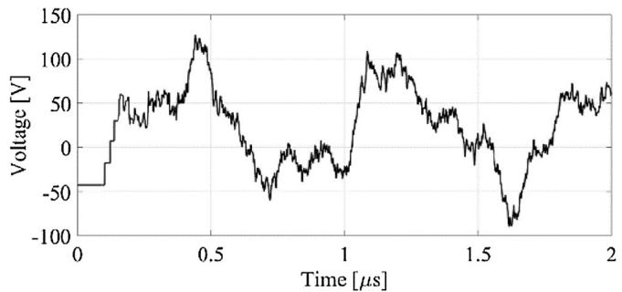

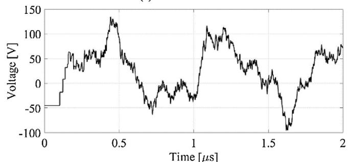  
(a) WB model

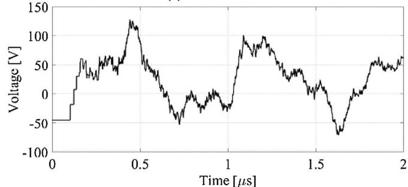  
(b) CP model   
(c) Single-phase (core only), CP model   
Fig. 7. Node C voltage of test circuit with branches and Ct = 5 nF.

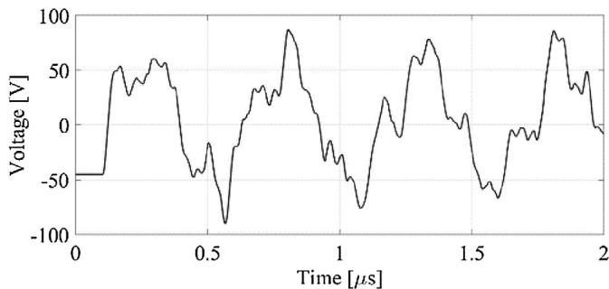

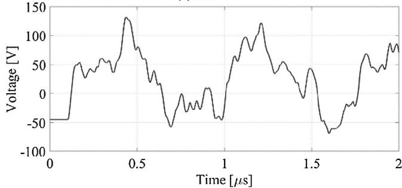  
（a)NoC  
$( \mathrm { b } ) C _ { t } = 5 \mathrm { n F }$

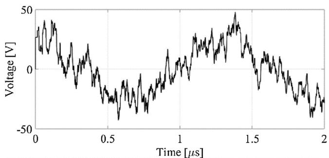  
Fig. 8. Node C voltage with equivalent capacitances of the branches in the test circuit in Fig. 2.

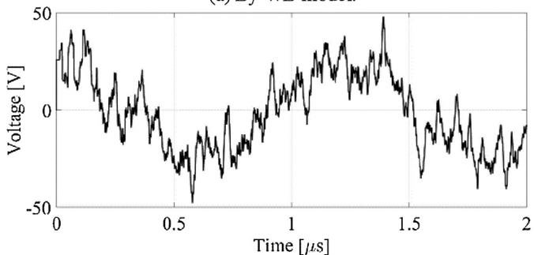  
(a)By WB model.   
(b)By CP model.   
Fig. 9. Pipe voltage at node A in the open-circuited case with $C _ { t } = 5$ nF.

# 3.2.2. Test circuit

Fig. 3 shows the test results measured by an analog oscilloscope for (a) no $C _ { t } ,$ and $\left( \mathbf { b } \right) C _ { t } = 5 \mathbf { n } \mathsf { F } .$ .

# 3.2.3. EMTP simulation results

Fig. 4 shows simulation results of core voltage $V _ { c }$ at node C by EMTP frequency-dependent line model (Wide-Band = WB model [39]) in the case of no $C _ { t }$ for (a) Cu plate and (b) earth with the resistivity $\rho _ { e } = 1 0 0$ m. The voltages in (a) and (b) are almost identical, and thus it is confirmed that the earth resistivity causes only minor effect on the VFT.

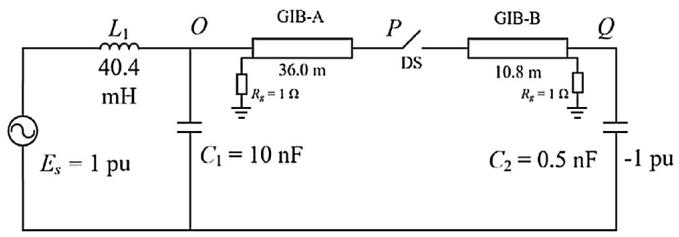  
Fig. 10. Model circuit of a UHV GIS: h = 1.5 m, rc1 = 13.5 cm, rc2 = 15 cm, $r _ { p 1 } = 7 6 \mathrm { c m } ,$ , $r _ { p 2 } = 7 7 \mathrm { c m } , \rho _ { c } = 1 . 8 \times 1 0 ^ { - 8 } \Omega \mathrm { m } , \rho _ { p } = 1 . 5 \times 1 0 ^ { - 7 } \Omega \mathrm { m } , \mu _ { p } = 1 0 0 \mu _ { 0 } .$

Fig. 5 shows $V _ { c }$ calculated by a CP line model (2 MHz) with $\rho _ { e } = 1 0 0 \Omega \mathrm { m } .$ . Fig. 6 is $V _ { c }$ calculated by a single-phase (coaxial mode) CP line model. Again, no significant difference is observed between the voltage $V _ { c }$ wave-forms in Figs. 4–6. Thus, note (1) in Section 3.1 is confirmed.

Fig. 7 shows simulation results of core voltage $V _ { c }$ at node C by (a) WB model, (b) CP model, and (c) singlephase CP model in the case of $C _ { t } = 5 \mathrm { n F }$ for the earth $\rho _ { e } = 1 0 0 \Omega \mathrm { m }$ . Because of $C _ { t } ,$ the oscillating frequency becomes lower than that in the case of no $C _ { t }$ in Figs. 4–6. No noticeable difference is observed between the three line models.

Fig. 8 shows $V _ { c }$ when the branched buses in Fig. 2 are represented by an equivalent capacitance $C _ { b } = 8 1$ pF/m evaluated by (1) with equivalent relative permittivity $\varepsilon _ { r } = 2 . 3$ considering spacers in the GIB. Fig. 8(a) is for no $C _ { t } ,$ , and (b) for $C _ { t } = 5$ nF by WB and CP models. Because of the almost identical results, only the results by the CP model are shown in the figure. It is observed that the waveforms in Fig. 8 agree better than those in Figs. 4–7 with the test results in Fig. 3, because of no higher frequency component in Figs. 3 and 8. However, the reason for no high frequency component in the test results are due to the oscilloscope used in the measurements in 1970s, i.e. the highest frequency which could be measured by the oscilloscope was less than some ten MHz.

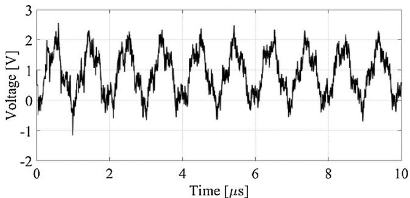

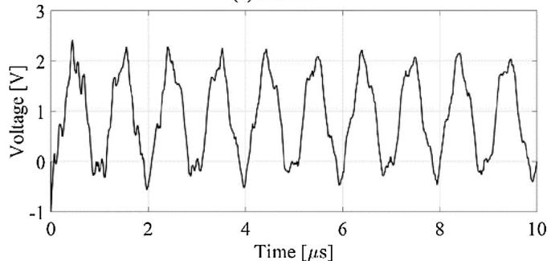  
(a)Node P   
  
Fig. 11. EMTP simulation results of core voltages at nodes P and Q.

# 3.2.4. Pipe voltage $\mathsf { V } _ { 2 \mathsf { p } }$

Fig. 9 shows the pipe voltage at node A in Fig. 2 when the pipe is open-circuited at nodes A and B. (a) is by WB model of EMTP-RV [39] and (b) by CP model. No significant difference between (a) and (b) is observed up to t = 1 -s. Then the peak value of a spikelike voltage is more damped in (a) due to the frequency-dependent effect of the impedance. It is clear that the pipe voltage is more oscillatory than the core voltage in Fig. 7.

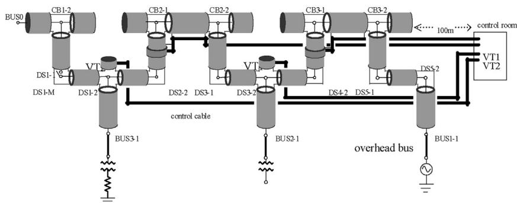  
(a)A model circuit of a 50okV GIS.

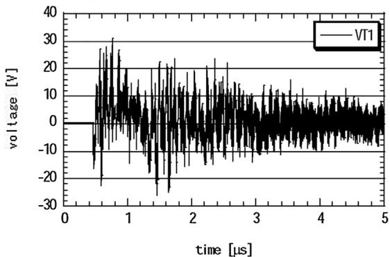  
(b) DS3 operation with CB2 open.   
Fig. 12. Transferred surges at a control cable remote end: $h = 1 \textrm { m } , r _ { c 1 } = 0 , r _ { c 2 } = 1 2 . 5 \times \mathrm { m } , r _ { p 1 } = 4 6 \times \mathrm { m } , r _ { p 2 } = 4 8 \times \mathrm { m } , \rho _ { c } = 1 . 8 \times 1 0 ^ { - 8 } \Omega \mathrm { m } , \rho _ { p } = 3 . 7 8 \times 1 0 ^ { - 8 } \Omega \mathrm { m } , \mu _ { p } = \mu _ { 0 } .$

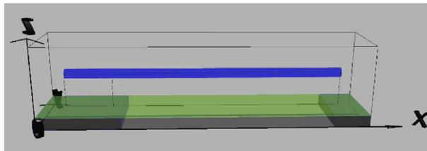  
Fig. 13. FDTD model circuit of a part of GIBs in the GIS in Fig. 12(a) [41].

# 3.3. UHV GIS

A test circuit of a UHV GIS [7] is illustrated in Fig. 10, and EMTP simulation results of DS switching surges at nodes P and Q are shown in Fig. 11 calculated by CP line model (1 MHz). The EMTP results in Fig. 11 are quite similar to those shown in Fig. 5(a) and (b) in [7].

This reference [7] and also [6,10] discuss the influence of arc resistance. It is stated that the polarity of the arc affects the VFT overvoltage. In [7], a UHV disconnector with a resistor is developed and tested. In such a disconnector, the influence of the arc becomes not clear.

# 3.4. Induced voltage to control cable via VT

Fig. 12(a) illustrates a 500 kV GIS in Japan [30]. The length of each gas-insulated bus (GIB) ranges from 1 m to 5 m. The distance from Bus 1-1 to Bus 3-1 is about 30 m. Many control cables of length about 100 m run along GIBs, and VTs and CTs are connected between the buses and cables. The metallic sheaths of the control cables are grounded through 10  at both ends, and the core is connected to the sheath at the remote end by 10 k. The cables for VT1 and VT2 are parallel to gas-insulated buses DS4 and CB3. The cable for VT2 is also parallel to DS2 and CB2.

Fig. 12(b) shows a simulation result of a transferred VFT at the remote end of a control cable when DS3 is closed with opencircuited CB2. The induced voltage is nearly proportional to the length of the control cable parallel to the GIB. The waveforms involve oscillating frequencies from 2 MHz to 20 MHz which agree with those in Table 1(c). The simulation result shows a qualitative agreement with a measured result in the GIS, although the measured one is not available for publication.

# 4. FDTD analysis

Numerical electromagnetic analysis (NEA) methods are becoming more and more powerful for analyzing various phenomena associated with both TEM and non-TEM modes of wave propagation [40]. Among various NEA methods, FDTD in time domain is most widely used for transient analysis.

One of the advantages of FDTD is easy computation of a three dimensional transient. For example, a GIB in the 500 kV GIS in Fig. 12(a) can be represented three-dimensionally as it is. Then a transient due to DS or CB switching operation in a threedimensional field can be easily performed, although the required memory and CPU time are very large. An example of a GIB model circuit for a transient computation by FDTD is illustrated in Fig. 13.

The total length of the GIB is 12 m, and the pipe is grounded through 2  resistance at the position of 2 m from the sending end and at the receiving end. A source voltage of 408 kV is applied to the sending end, the left-hand side of the model circuit. The earth resistivity is 100 m.

The FDTD computed and EMTP simulation results are shown in Fig. 14. A reasonable agreement between the FDTD and EMTP results is observed, although the former is less oscillatory than the

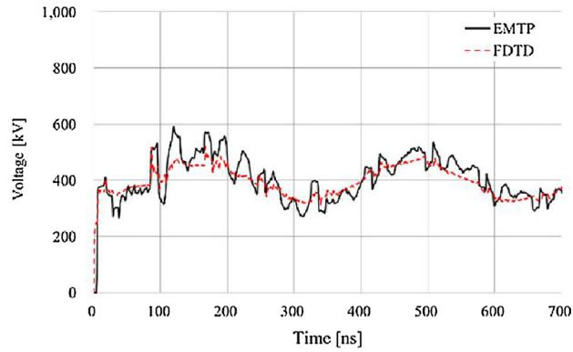  
(a) Sending-end core

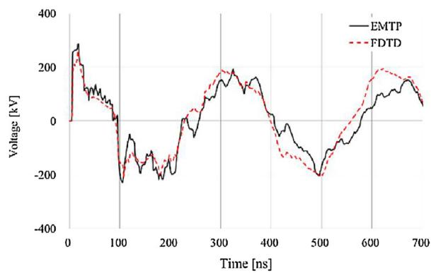

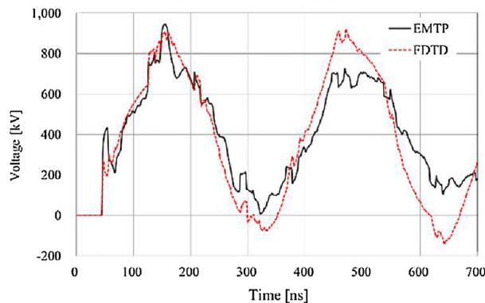  
(b) Sending-end pipe

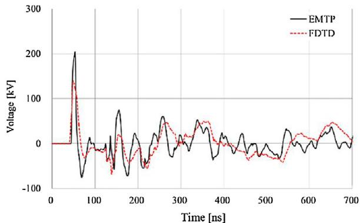  
(c) Receiving-end core   
(d) Receiving-end pipe   
Fig. 14. Switching surges on a GIB in Fig. 13 calculated by FDTD [41] and EMTP [39].

latter. The reason for this looks radiation losses in the FDTD computation which cannot be considered in the EMTP simulation. Also, the CP line representation of the vertical lead wires for the source and pipe grounding in the EMTP produces more oscillation than the FDTD, while the frequency dependence of the vertical lead wires is included automatically in the FDTD computation.

# 5. Conclusions

This paper has summarized field test results of VFTs measured in GISs considering electromagnetic disturbances in GIS control circuits which occasionally result in power system operation failures. Also modeling of GIS elements for VFT simulations by EMT-type software is explained, and simulation results are compared with test results. Further, a three-dimensional VFT computation is performed by FDTD in comparison with EMTP simulation results. Based on the investigations, the following remarks are made clear.

(1) The oscillating frequencies of VFTs generated by disconnector and circuit breaker operations in GISs range from 1 MHz up to 140 MHz in GIS high-voltage circuits, and from 2 MHz to 80 MHz in low-voltage control circuits.   
(2) The VFT over-voltages in the test results range from 1.7 pu to 3.0 pu in the GIS main circuits, and from 0.1 pu to 0.7 pu in the metal enclosures (pipe or tank). In the low-voltage control circuits, 20–700 V are observed in the field test results.   
(3) In EMTP simulations of the VFT, both frequency-dependent WB model and constant-parameter CP model show a reasonable agreement with the test results, because the VFT frequency is very high and the earth resistivity causes only a minor influence. The pipe grounding and lead wires have to be carefully represented.   
(4) When the VFT in a control cable is simulated, a VT and a CT are to be modeled in details, and mutual coupling between the cable and grounding mesh of the GIS is to be considered because the mesh voltage cannot be assumed zero.   
(5) FDTD computed results agree rather well with those by EMTP, although the EMTP results are more oscillatory. The reason for this might be the effect of radiation losses which are automatically included in the FDTD computation. A main disadvantage of the FDTD is a large amount of computer resources.

# References

[1] IEC 60071-1 Insulation Co-ordination Part 1, Definitions, Principles and Rules, 2006.   
[2] IEC TR60071-4 Insulation Co-ordination Part 4, Computational Guide to Insulation Co-Ordination and Modeling of Electrical Networks, 2004, Jun   
[3] CIGRE WG D1.03, Very Fast Transient Overvoltages (VFTO) in gas-insulated substations, CIGRE TB-519, 2012.   
[4] A. Ametani, Surge propagation characteristics on a gas-insulated cables, IEEJ Trans. B-1-1 (8) (1981) 491–497.   
[5] H. Murase, I. Oshima, H. Aoyagi, I. Miwa, Measurement of transient voltages induced by disconnect switch operation, IEEE Trans. Power Appar. Syst. PAS-104 (1985) 157–165.   
[6] S. Ogawa, E. Haginomori, S. Nishiwaki, T. Yoshida, K. Terasaka, Estimation of restriking transient overvoltage on disconnecting switch for GIS, IEEE Trans. Power Delivery 1 (1986) 95–102.   
[7] J. Ozawa, T. Yamagiwa, M. Hosokawa, S. Takeuchi, H. Kozawa, Suppression of fast transient overvoltage during gas disconnector switching in GIS, IEEE Trans. Power Delivery 1 (1986) 194–201.   
[8] S.A. Boggs, F.Y. Chu, N. Fujimoto (Eds.), Gas-Insulated Substations, Technology and Practice, Pergamon Press, New York, 1986.   
[9] K. Nojima, S. Nishiwaki, H. Okubo, S. Yanabu, Measurement of surge current and voltage waveforms using optical-transmission techniques, Proc. IEE 134 (1987) 415–422.   
[10] IEEJ WG for GIS Induced Voltages, Surge phenomena induced to low-voltage circuits in gas-insulated substations, IEEJ Technical Report, No. 273 (June 1988) (in Japanese).   
[11] N. Fujimoto, S. Boggs, Characteristics of GIS disconnector-induced short rise time transients incident on externally connected power system components, IEEE Trans. Power Delivery 3 (1988) 961–970.

[12] J. Meppelink, K.J. Diederich, K. Feser, W.R. Pfaff, Very fast transients in GIS, IEEE Trans. Power Delivery 4 (1989) 223–233.   
[13] S. Yanabu, H. Murase, H. Aoyagi, H. Okubo, Y. Kawaguchi, Estimation of fast transient overvoltage in gas-insulated substation, IEEE Trans. Power Delivery 4 (1990) 1822–1875.   
[14] C.M. Wiggins, D.E. Thomas, F.S. Nickel, T.M. Salas, S.E. Wright, Transient electromagnetic interference in substations, IEEE Trans. Power Delivery 9 (1994) 1869–1884.   
[15] S. Nishiwaki, K. Nojima, S. Tatara, M. Kosakada, N. Tanabe, S. Yanabu, Electromagnetic interference with electronic apparatus by switching surges in GIS-cable system, IEEE Trans. Power Delivery 10 (1995) 739–746.   
[16] Working Group of Surges in Protection and Control Systems, Technology of countermeasures against surges in protection and control systems in Japanese utilities, Rep. Electr. Technol. Res. Assoc. 57 (3) (2001), 198 pages, ISSN: 0285-5208 (in Japanese).   
[17] T. Matsumoto, Y. Kurosawa, M. Usui, K. Yamashita, T. Tanaka, Experience of numerical protective relays operating an environment with high-frequency switching surge in Japan, IEEE Trans. Power Delivery 20 (January (1)) (2006) 88–93.   
[18] A. Ametani, H. Motoyama, K. Ohkawara, H. Yamakawa, N. Suga, Electromagnetic disturbances of control circuits in power stations and substations experimented in Japan, Inst. Eng. Tech. Proc. Gen. Trans. Distrib. 3 (2009) 801–815.   
[19] J. Smajic, W. Holaus, J. Kostovic, U. Riechert, 3D full-Maxwell simulations of very fast transients in GIS, IEEE Trans. Magn. 47 (2011) 1514–1517.   
[20] C. Li, J. He, J. Hu, R. Zeng, J. Yuan, Switching transient of 1000-kV UHV system considering detailed substation structure, IEEE Trans. Power Delivery 27 (2012) 112–122.   
[21] G. Yue, W. Liu, W. Chen, Y. Guan, Z. Li, Development of full frequency bandwidth measurement of VFTO in UHV GIS, IEEE Trans. Power Delivery 28 (2013) 2550–2557.   
[22] CIGRE WG C4.208, EMC within power plants and substations, CIGRE TB-535, 2013.   
[23] S. Burow, U. Straumann, W. Kohler, S. Tenbohlen, New methods of damping very fast transient overvoltages in Gas-Insulated Switchgear, IEEE Trans. Power Delivery 29 (2014) 2332–2339.   
[24] J.G.R. Filho, J.A. Teixeira Jr., M.R. Sans, M.L.B. Martinez, Very fast transient overvoltage waveshapes in a 500-kV gas insulated switchgear setup, IEEE Trans. Power Delivery 32 (2016) 17–23.   
[25] Z. Haznadar, S. Carsimamovic, R. Mahmutcehajic, More accurate modeling of gas-insulatedsubstation components in digital simulations of very fast electromagnetic transients, IEEE Trans. Power Delivery 7 (1992) 434–441.   
[26] D. Povh, H. Scmitt, O. Volker, R. Witzmann, Modeling and analysis guidelines for very fast transients, IEEE Trans. Power Delivery 11 (1996) 2028–2035.   
[27] A. Ametani, N. Nagaoka, N. Mori, K. Shimizu, Switching overvoltages on a pipe in a gas-insulated substations, IPST’97/Seatle Proceedings (1997, June) 286–291.   
[28] M.M. Rao, M.J. Thomas, B.P. Singh, Frequency characteristics of very-fast transient currents in a 245 kV GIS, IEEE Trans. Power Delivery 20 (2005) 2450–2457.   
[29] A. Ametani, N. Taki, D. Miyazaki, N. Nagaoka, S. Okabe:, Lightning surges on a control cable incoming through a grounding lead, IEEJ Trans. PE 127 (January (1)) (2007) 267–275.   
[30] A. Ametani, T. Goto, N. Nagaoka, H. Omura, Induced surge characteristics on a control cable in a gas-insulated substation due because of switching operation, IEEJ Trans. PE 127 (2007) 1306–1312.   
[31] K. Nishimura, A. Ametani, N. Nagaoka, Y. Baba, Modeling of a current transformer for electromagnetic transient simulation in a power station, CIGRE SC C4 2009 Kushiro Colloquim, Paper S7-7 (2009, June).   
[32] IEC 61000-1 Electromagnetic Compatibility (EMC) Part 1, General, 1992.   
[33] IEC 61000-4-12: Electromagnetic immunity standard for testing and measurement techniques, Oscillatory waves immunity test, 1998.   
[34] IEEE Guide for Surge Voltages in Low-Voltage AC Power Circuits, ANSI/IEEE C62.41 (1980).   
[35] Japanese Electro-technical Commission, JEC-0103-2004. Test voltage for low-voltage control circuits in power stations and substations, IEE Jpn. (2004) (in Japanese).   
[36] H.W. Dommel, EMTP Theory Book, Bonneville Power Administration, 1992.   
[37] A. Ametani (Ed.), Numerical Analysis of Power System Transients and Dynamics, IET, Power and Energy Series 78, London, 2015.   
[38] A. Ametani, N. Nagaoka, Y. Baba, T. Ohno, Power System Transients, CRC Press, New York, 2013.   
[39] J. Mahseredjian, S. Dennetière, L. Dubé, B. Khodabakhchian, L. Gérin-Lajoie:, On a new approach for the simulation of transients in power systems, Electr. Power Syst. Res. 77 (September (11)) (2007) 1514–1520.   
[40] CIGRE WG C4.501, Guideline for Numerical Electromagnetic Analysis Method and Its Application to Surge Phenomena, CIGRE TB-543, 2013, June.   
[41] Central Research Institute of Electric Power Industries, Virtual Surge Test Lab (VSTL), 2013 http://criepi.denken.or.jp/.   
[42] N. Nagaoka, Transient Analysis of Cable Systems by Means of a Frequency-Transform Method, Ph.D. Thesis, Doshisha University, 1992, May.

Akihiro Ametani received the Ph.D. degree in power system transients from the University of Manchester, Institute of Science and Technology (UMIST), Manchester, U.K., in 1973. He was with the UMIST from 1971 to 1974, and Bonneville Power Administration, Portland, OR, and developed an Electromagnetic Transients Pro-

gram for Summers 1976 to 1981. He has been a Professor with Doshisha University, Kyoto, Japan, since 1985 and was a professor at the Chatholic University of Leaven, Leuven, Belgium, in 1988. He was the Director of the Institute of Science and Engineering from 1996 to 1998, and Dean of Library and Computer/Information Center, Doshisha niversity, from 1998 to 2001. He was a Vice-President of The Institute of Electrical Engineers of Japan in 2003 and 2004. Dr. Ametani is a Chartered Engineer in the U.K., a Fellow of IET, and a Distinguished member of CIGRE. He received the D.Sc. degree (higher degree in U.K.) from the University of Manchester in 2010.

Haoyan Xue was born in China. He received the B. Eng. of Electrical Engineering and Its Automation from Hunan University, China in 2010. He completed the M. Sc. of Electrical Engineering at Delft University of Technology, the Netherlands in 2012. From 2013 to 2015 he was employed by State Grid Corporation of China (SGCC) in Yinchuan. Co, where he worked on protections, relays and SCADA systems of sub-

stations. Since the beginning of 2015, he has been with the Department of Electrical Engineering, École Polytechnique de Montréal, Canada, where he is pursuing Ph.D. of Electrical Engineering now.

Masashi Natsui received the B.Eng. and M.Eng. degrees from Waseda University, Japan in 2008 and 2010, respectively. He is currently pursuing Ph.D. degree in Polytechnique Montréal, Canada from 2016. His current research focuses on lightning disturbances in distribution networks caused by non-vertical lightning.

Jean Mahseredjian received the Ph.D. degree from Polytechnique Montréal, Canada, in 1991. From 1987 to 2004, he was with IREQ (Hydro-Québec) working on research and development activities related to the simulation and analysis of electromagnetic transients. In December 2004, he joined the Faculty of Electrical Engineering at Polytechnique Montreal.