# Compact scheme challenges in EMT-Type simulations

M. Jafari Matehkolaei a,* , B. Bruned b , J. Mahseredjian a , A. Masoom c , I. Kocar D

a Polytechnique Montreal, Canada   
b RTE, Jonage, France   
c Hydro Quebec Research Institute, Canada

# A R T I C L E I N F O

Keywords:

Compact scheme

Discontinuity treatment

Electromagnetic transient simulation

Nonlinearity

Numerical integration methods

Trapezoidal integration

# A B S T R A C T

This paper investigates the potential of using the compact scheme (CS) integration method for Electromagnetic Transient simulation of power systems due to its high accuracy. It focuses on the challenges encountered with CS at discontinuity instants. Initially, the accurate response of the components at discontinuities and the impact of iterations at slope changes of nonlinear devices are elaborated. Afterward, the performance of CS at discontinuities is investigated. This work demonstrates that CS produces abnormal results at discontinuity instants. Consequently, a new method is proposed to overcome these issues. The formulation of network equations discretized with CS in the modified augmented nodal analysis (MANA) framework is then elaborated and compared to sparse Tableau formulations. Case studies are presented to validate the performance of the proposed discontinuity treatment method.

# 1. Introduction

POWER system operators mostly count on conventional system simulation models, also known as phasor-domain transient (PDT) models, for the reliable operation of their system. PDT models have demonstrated acceptable speed and performance for traditional stability studies. However, these models have a low frequency bandwidth, and are incapable of maintaining simulation accuracy as the number of inverter-based resources (IBR) and power electronic converters increases in modern power systems [1]. Conversely, electromagnetic transient (EMT) simulation tools are gaining more global attention as they address the problems associated with PDT models and offer a comprehensive insight into the details of all the parameters. However, EMT simulation tools are normally slower than PDT simulation tools due to the complexity and nonlinearity of the models involved. Therefore, it is needed to explore new strategies for enhancing the performance of EMT simulation tools [2,3].

Numerical integration methods are the core of every EMT simulation, utilized to discretize the differential equations associated with the dynamics of the system models [4]. In [5], a brief comparison of some numerical integration methods used for the EMT simulation of power systems is presented. The performance of numerical integration methods in terms of accuracy, stability, and computational burden plays a crucial

role in determining the overall performance of the associated EMT simulation [4,6]. Adopting an integration method with high accuracy can potentially enhance the simulation speed due to the possibility of leveraging large simulation time-steps. Therefore, this paper explores the potential of using compact scheme (CS) [7,8] as an integration method for EMT simulations due to its stated higher accuracy compared to the widely used trapezoidal rule (TR). Compact scheme accounts for the first derivative values that can improve simulation accuracy.

Discontinuities refer to switching events and slope changes of nonlinear elements which bring challenges in EMT-type simulation tools. Unlike L-stable methods like Backward Euler (BE), A-stable methods (like TR) produce fictitious oscillations at discontinuities, necessitating additional measures to address this issue. A comprehensive analysis of various discontinuity treatment methods is presented in [9].

In this paper, the real behavior of parameters at discontinuities is investigated with their physical equations and compared with the TR, BE and CS responses. Additionally, the impact of iterations at slope changes of piecewise linear elements, on the accuracy of the simulation results will be analyzed. It is demonstrated that CS encounters limitations at discontinuity instants and further actions must be adopted. Consequently, a combined CS with BE (CS_BE) method is proposed to solve the CS issues at discontinuities. Furthermore, this paper elaborates on the procedure for formulating network equations discretized with CS in

Modified-Augmented-Nodal-Analysis (MANA) [6]. Consequently, a comparison of simulation performance between MANA and Sparse Tableau Approach (STA) usage in [10] is provided. All the test cases are coded in Julia programming language to ensure consistent testing benchmarks. The KLU solver [11] is used for solving the linear systems and the results are validated with EMTP® [6].

This paper is organized as follows. Section II presents an analysis of circuit real behavior at discontinuity instants, along with a comparison to the performance of TR, BE and the combined TR and BE methods (TR_BE) used at discontinuities. The CS and its formulation in MANA are covered in Section III. Section IV presents new approaches for handling CS discontinuity instants. Simulation results of various test cases are presented in section V, and finally, section VI concludes the paper.

# 2. Analysis of discontinuity instants

This section explores the actual behavior of parameters at discontinuities and explains the causes of impulsive outcomes and spikes using the physical equations of the components. Additionally, the real responses at discontinuity are compared with responses attained from TR or BE integration methods.

# 2.1. Switching events

The response of an ideal inductor over a switching event is investigated in this section. This analysis can be expanded for the capacitors and other components described with ordinary differential equations:

$$
\frac {d x}{d t} = f (x, t) \tag {1}
$$

The differential equation describing an ideal inductor is:

$$
v _ {L} = L \frac {d i _ {L}}{d t} = L \lim  _ {\Delta t \rightarrow 0} \frac {i _ {t} - i _ {t - \Delta t}}{\Delta t} \tag {2}
$$

From (2), it is evident that if the inductor current is forced to change abruptly over a very short period, which could happen due to ideal switching conditions, the inductor voltage will exhibit an impulse or spike. The shorter the variation period, the bigger the spike amplitude. In other words, a sudden change in the state variable causes the dependent variable to exhibit a spike for components described by differential equations. For comparison with ideal cases, the right side of (2) is considered. If the inductor current undergoes a sudden change between time-points t and t − Δt as Δt approaches zero, the voltage will exhibit a scaled Dirac delta function (also known as impulse function) in ideal cases. The Dirac delta function, denoted as $\delta ( t ) _ { : }$ , represents an ideal spike with an infinite amplitude.

BE is a first-order method described with:

$$
x _ {k + 1} = x _ {k} + \Delta t f _ {k + 1} \tag {3}
$$

where Δt is the simulation time-step, and x is the state variable. Discretization of (2) with BE leads to:

$$
i _ {k + 1} = i _ {k} + \frac {\Delta t}{L} v _ {k + 1} \tag {4}
$$

If the current at the time-point k + 1 is forced to zero, $i _ { k + 1 } = 0 ;$ , with the switch opening, the voltage at the time-point k +1 experiences a spike with an amplitude of:

$$
v _ {k + 1} = - \frac {L}{\Delta t} i _ {k} \tag {5}
$$

This spike normally has a high amplitude which is expected since $i _ { k }$ is divided by a small value of Δt. For all the following time-points, the value of i will be zero $( i _ { k } = 0 )$ resulting into $\nu _ { k + 1 } = 0$ . The BE method reproduces the true behavior of an inductor during switching instants, producing a voltage spike corresponding to the current variation level.

TR has second-order accuracy and is described with:

$$
x _ {k + 1} = x _ {k} + \frac {\Delta t}{2} \left(f _ {k + 1} + f _ {k}\right) \tag {6}
$$

With TR, the discretized equation of inductor in (2) is:

$$
i _ {k + 1} = i _ {k} + \frac {\Delta t}{2 L} \left(v _ {k + 1} + v _ {k}\right) \tag {7}
$$

If the inductor current is suddenly forced to zero due to switching $( i _ { k + 1 } = 0 )$ , the voltage of the inductor at the time-point exactly after opening the switch is calculated as:

$$
\nu_ {k + 1} = - \frac {2 L}{\Delta t} i _ {k} - \nu_ {k} \tag {8}
$$

For the following time-points,ik is zero. Therefore, the voltage of the inductor is $\nu _ { k + 1 } = - \nu _ { k }$ . At any following time-points, the voltage will be the opposite of the preceding time-point voltage. This shows that TR produces numerical oscillations after switching instants, necessitating adoption of a proper discontinuity treatment strategy. Switching to two halved time-step BE at discontinuity instants is a strategy adopted in [6] that guarantees a correct simulation that is compatible with the true response of ideal elements, except in some particular cases where numerical oscillations may still occur at much lower amplitudes [9]. This method is called TR_BE in this paper and it is based on [12–14] (also called CDA). Some methods propose using interpolation to handle oscillations that occur after discontinuities as presented in [15]. Detailed analysis of the performance of different discontinuity treatment methods is presented in [9] and [16].

# 3. Slope changes in nonlinear devices

The Newton’s method entails applying iterations after crossing segment thresholds in piecewise linearized nonlinear devices, to update the operating segment. This approach ensures the correct segments are employed at each simulation time-point. For further analysis, the nonlinear characteristic with two piecewise linear segments illustrated in Fig. 1 is considered. Each segment is characterized with:

$$
y = a x + y _ {0} \tag {9}
$$

where α is the slope and $y _ { 0 }$ is the intersection of the line with y-axis. If, after calculating the results at point B’, a crossing of the segment threshold is detected, the operating segment is updated and the parameters are recalculated with another iteration to reach the correct (sample case, the actual position may vary and even jump several segments) position, point B. The subsequent time-point, point C, is also simulated on the correct segment and operating point. Therefore, iterations are essential to ensure movement along the correct characteristic in piecewise nonlinear devices. If iterations are not performed and the segment is updated only for the next time-point, the calculated value at point B’ becomes invalid, as it does not lie on the actual characteristic of the nonlinear element. Moreover, transitioning from point B’ to point C

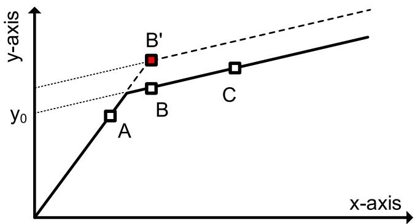  
Fig. 1. Characteristics of the typical nonlinear device with two slope segments.

results in non-homogeneous outcomes and introduces numerical issues. These concepts are further explored in the simulation section.

Slope changes of nonlinear devices can produce spikes when using TR, BE or TR_BE integration methods. The number of linearized segments and the simulation time-step are influential factors.

# 4. Analysis of the CS integration method

# 4.1. Accuracy analysis

In [8], it is proposed to use CS for the EMT simulation of power systems due to its high accuracy and stability. The CS [7] is described with:

$$
x _ {k + 1} = x _ {k} + \frac {\Delta t}{2} \left(f _ {k + 1} + f _ {k}\right) - \frac {\Delta t ^ {2}}{1 2} \left(\frac {d f _ {k + 1}}{d t} - \frac {d f _ {k}}{d t}\right) \tag {10}
$$

For evaluating the accuracy of CS, its Local Truncation Error (LTE) is calculated noticing that the primary terms of CS in (10) are identical to those of the TR. Consequently, the full Taylor’s series expansion of the TR is considered:

$$
x _ {k + 1} = x _ {k} + \frac {\Delta t}{2} \left(\frac {d x _ {k + 1}}{d t} + \frac {d x _ {k}}{d t}\right) - \frac {\Delta t ^ {3}}{1 2} \frac {d ^ {3} x _ {k}}{d t ^ {3}} - \frac {\Delta t ^ {4}}{2 4} \frac {d ^ {4} x _ {k}}{d t ^ {4}} - \frac {\Delta t ^ {5}}{8 0} \frac {d ^ {5} x _ {k}}{d t ^ {5}} + \dots \tag {11}
$$

By manipulating the Taylor’s series expansion in (12) and combining it with (11), the discretization equation of the CS in (10) can be obtained.

$$
x _ {k + 1} = x _ {k} + \frac {\Delta t}{1 !} \frac {d x _ {k}}{d t} + \frac {\Delta t ^ {2}}{2 !} \frac {d ^ {2} x _ {k}}{d t ^ {2}} + \frac {\Delta t ^ {3}}{3 !} \frac {d ^ {3} x _ {k}}{d t ^ {3}} + \dots \tag {12}
$$

Multiplying the second derivative of the entire equation in (12) by $\Delta t ^ { 2 } / 1 2$ and adding the resulting equation to (11) yields the discretization equation of CS, as shown in (13). This equation indicates that CS has a fifth-order LTE, confirming the integration method’s fourth-order accuracy.

$$
x _ {k + 1} = x _ {k} + \frac {\Delta t}{2} \left(\frac {d x _ {k + 1}}{d t} + \frac {d x _ {k}}{d t}\right) - \frac {\Delta t ^ {2}}{1 2} \left(\frac {d ^ {2} x _ {k + 1}}{d t ^ {2}} - \frac {d ^ {2} x _ {k}}{d t ^ {2}}\right) + \frac {\Delta t ^ {5}}{7 2 0} \frac {d ^ {3} x (\varepsilon)}{d t ^ {3}} \tag {13}
$$

# 4.2. Formulation strategy

After applying discretization with an integration method, the network is normally expressed by a set of algebraic equations represented by:

$$
A _ {t} x _ {t} = b _ {t} \tag {14}
$$

where $A _ { t }$ is the Jacobian matrix of the simulated grid,x is the vector of unknown variables and bt is the vector of known variables. This equation is solved at each time-point t during an EMT simulation. From (10), it is observed that the first derivative of the dependent variable f must be readily available when using CS. In [8], the network equations are formulated with STA, leveraging the calculation of the first derivatives of all branch currents and voltages. The general format of formulation required for CS is [8]:

$$
\left[ \begin{array}{l l} A _ {C S, 1 1} & A _ {C S, 1 2} \\ A _ {C S, 2 1} & A _ {C S, 2 2} \end{array} \right] \left[ \begin{array}{l} x _ {t} \\ x ^ {\prime} _ {t} \end{array} \right] = \left[ \begin{array}{l} b _ {t} \\ b ^ {\prime} _ {t} \end{array} \right] \tag {15}
$$

From (15), it is noticed that two sets of equations are required when using CS: one for computing the grid values and another for determining their first derivatives. $A _ { C S , 1 1 }$ is identical to the matrix used in TR formulation. $A _ { C S , 2 2 }$ contains the coefficients required for computing the first derivative values, while A and $A _ { C S , 2 1 }$ connect the two sets of equations. The STA described in [8,10] can be detailed by:

$$
\left[ \begin{array}{c c c c c} \mathbf {0} _ {n \times n} & \hat {\boldsymbol {A}} & \mathbf {0} _ {n \times b} & \mathbf {0} _ {n \times n} & \mathbf {0} _ {n \times b} \\ \hat {\boldsymbol {A}} ^ {T} & \mathbf {0} _ {b \times b} & - I _ {b \times b} & \mathbf {0} _ {b \times n} & \mathbf {0} _ {b \times b} \\ \mathbf {0} _ {b \times n} & \boldsymbol {B} _ {1} & \boldsymbol {B} _ {2} & \mathbf {0} _ {b \times n} & \boldsymbol {B} _ {3} \\ \hline \mathbf {0} _ {n \times n} & \mathbf {0} _ {n \times b} & \mathbf {0} _ {n \times b} & \mathbf {0} _ {n \times n} & \hat {\boldsymbol {A}} \\ \mathbf {0} _ {b \times n} & \mathbf {0} _ {b \times b} & \mathbf {0} _ {b \times b} & \hat {\boldsymbol {A}} ^ {T} & \mathbf {0} _ {b \times b} \\ \mathbf {0} _ {b \times n} & \boldsymbol {B} _ {5} & \boldsymbol {B} _ {6} & \mathbf {0} _ {b \times n} & \boldsymbol {B} _ {7} \\ & & & & \boldsymbol {B} _ {8} \end{array} \right] \left[ \begin{array}{l} u \\ i \\ v \\ \overline {{u ^ {\prime}}} \\ i ^ {\prime} \\ v ^ {\prime} \end{array} \right] = \left[ \begin{array}{l} \mathbf {0} \\ \mathbf {0} \\ s \\ \frac {\mathbf {s}}{\mathbf {0}} \\ \mathbf {0} \\ s ^ {\prime} \end{array} \right] \tag {16}
$$

where $\widehat { A }$ is the node vs branch incidence matrix and I is the identity matrix. u, i, and v represent the node voltage, branch current, and branch voltage vectors, and consequently, u’, i’, and v’ are their first derivatives, respectively. n is the number of nodes and b is the number of branches. KCL equations in the first row of (16) are the core of STA formulation for computing grid values, stating that the sum of all the currents entering a node should be zero:

$$
\hat {A} i = 0 \tag {17}
$$

Another set of KCL equations exists in the fourth row which is the core for calculating the first derivatives of currents:

$$
\widehat {A} i ^ {\prime} = 0 \tag {18}
$$

The second row of (16) is a simple KVL relating branch voltages to node voltages. The third and sixth rows of (16) express the voltagecurrent relations of the elements.

Using CS for discretizing the inductor equation [8]:

$$
i _ {k + 1} = i _ {k} + \frac {\Delta t}{2 L} \left(v _ {k + 1} + v _ {k}\right) - \frac {\Delta t ^ {2}}{1 2 L} \left(v _ {k + 1} ^ {\prime} - v _ {k} ^ {\prime}\right), \tag {19}
$$

and discretizing the capacitor equation with CS yields [8]:

$$
i _ {k + 1} = - i _ {k} + \frac {2 C}{\Delta t} \left(v _ {k + 1} - v _ {k}\right) + \frac {\Delta t}{6} \left(i _ {k + 1} ^ {\prime} - i _ {k} ^ {\prime}\right) \tag {20}
$$

The diagonal coefficients required for (16) are presented in Table 1 with the ii subscript. It should be noted that the first derivative of the inductor current is directly computed from its voltage based on (2). A similar approach is used for the capacitors, and the first derivative of the capacitor voltage is directly calculated from its current in (16).

The computational burden of an EMT simulation is largely related to the numerical methods used for the formulation and solution of the network equations. The primary advantage of STA is the direct access it provides to all parameters. However, despite its sparsity, this matrix is much larger than in the case of nodal analysis-based matrices. An extra set of equations for the first derivative of the parameters, like STA, can also be considered in MANA [6]. Additionally, inductors and capacitors can be incorporated into the augmented section of the MANA formulation for direct access to current values. The general structure of the MANA with CS becomes:

Table 1 Diagonal coefficients and vectors, sparse tableau approach (STA).   

<table><tr><td>coefficients</td><td>inductors</td><td>capacitors</td><td>resistors</td></tr><tr><td>B1,ii</td><td>1</td><td>1</td><td>1</td></tr><tr><td>B2,ii</td><td>GL=Δt/2L</td><td>GC=2C/Δt</td><td>GR=1/R</td></tr><tr><td>B3,ii</td><td>0</td><td>RCT=Δt/6</td><td>0</td></tr><tr><td>B4,ii</td><td>GLT=Δt2/12L</td><td>0</td><td>0</td></tr><tr><td>B5,ii</td><td>0</td><td>1</td><td>0</td></tr><tr><td>B6,ii</td><td>1/L</td><td>0</td><td>0</td></tr><tr><td>B7,ii</td><td>-1</td><td>0</td><td>-1</td></tr><tr><td>B8,ii</td><td>0</td><td>-C</td><td>GR=1/R</td></tr><tr><td>si</td><td>GLv_k+GLTv&#x27;_k+i_k</td><td>-Gc v_k - RCT i&#x27;_k - i_k</td><td>0</td></tr><tr><td>si&#x27;</td><td>0</td><td>0</td><td>0</td></tr></table>

$$
\left[ \begin{array}{c c c c c} \mathbf {Y} _ {n \times n} & \mathbf {A} _ {c} & \hat {\mathbf {A}} _ {L C} & \mathbf {0} & \mathbf {0} \\ \mathbf {A} _ {r} & \mathbf {A} _ {d} & \mathbf {0} & \mathbf {0} & \mathbf {0} \\ \hat {\mathbf {A}} _ {L C} ^ {T} & \mathbf {0} & \mathbf {R} _ {L C} & \mathbf {B} _ {1} & \mathbf {0} \\ \hline \mathbf {0} & \mathbf {0} & \mathbf {0} & \mathbf {Y} _ {n \times n} & \mathbf {A} _ {c} \\ \mathbf {0} & \mathbf {0} & \mathbf {0} & \mathbf {A} _ {r} & \mathbf {A} _ {d} \\ \mathbf {B} _ {3} & \mathbf {0} & \mathbf {B} _ {4} & \mathbf {B} _ {5} & \mathbf {0} \\ \end{array} \right] \left[ \begin{array}{l} v _ {n} \\ i _ {\text {a u g}} \\ \frac {\boldsymbol {i} _ {\boldsymbol {L C}} ^ {\prime}}{v _ {n} ^ {\prime}} \\ i _ {\text {a u g}} ^ {\prime} \\ i _ {\boldsymbol {L C}} ^ {\prime} \end{array} \right] = \left[ \begin{array}{l} I _ {n} \\ V _ {b} \\ h _ {\boldsymbol {L C}} \\ I _ {n} ^ {\prime} \\ V _ {b} ^ {\prime} \\ \mathbf {0} \end{array} \right] \tag {21}
$$

where Y is the classical nodal admittance matrix. $A _ { r } , A _ { c }$ and $A _ { d }$ refer to the augmented part of MANA in [6]. $\widehat { A } _ { L C }$ is the nodes vs inductor and capacitor branches incidence matrix. The details of the coefficients are provided in Table 2.

From (13), and noting that the first terms of CS are identical to TR, it can be inferred that the improved accuracy of CS stems from considering the second derivative of the state variable. As shown in (15), these derivative values are computed from an additional set of equations, and their accuracy plays a pivotal role in improving the overall precision of CS. However, there are limitations in calculating the first derivative values for some component models in EMT-type simulation. Examples include controlled current and voltage sources, distributed parameter transmission lines, synchronous machines, etc. Therefore, implementing the CS as the main integration method in a commercial EMT-type simulation tool brings significant challenges. Furthermore, it is observed from (15) that CS introduces additional complexity and computational burden compared to the commonly used TR. Although CS offers better accuracy, it does not necessarily result in faster simulation speeds when using larger time-steps. In other words, TR with smaller time-steps may yield comparable simulation speed and accuracy to CS due to the latter’s increased computational demands. Complete analysis on this matter entails rigorous testing with practical cases.

# 4.3. Performance at discontinuities

For investigating CS performance at discontinuities, an ideal inductor is considered. If the inductor current is abruptly forced to zero $( i _ { k + 1 } = 0 )$ due to switch opening, the KCL equations in (18) force the first derivative of the inductor current to zero $( i _ { k + 1 } ^ { \prime } = 0 )$ . As explained, the first derivative of inductor current in CS is directly calculated from inductor voltage with (2). Consequently, forcing the first derivative of the inductor current to zero will force the inductor voltage to zero, $\nu _ { k + 1 }$ ${ \it \Omega } = 0 .$ The absence of spikes in the inductor voltage is solely due to the specific formulation used in $\mathbf { C } { \mathbf { } } S ,$ which links the inductor voltage to the first derivative of the inductor current. This does not align with the true behavior of an ideal inductor as discussed in section II. However, this formulation causes a spike in the first derivative of the inductor voltage. According to (19), the first derivative of inductor voltage after opening the switch will be:

$$
\mathcal {V} _ {k + 1} ^ {\prime} = \frac {1 2 L}{\Delta t ^ {2}} \mathbf {i} _ {p} + \frac {6}{\Delta t} \mathcal {V} _ {p} + \mathcal {V} _ {p} ^ {\prime} \tag {22}
$$

where $i _ { p } , \nu _ { p } ,$ and $\nu _ { p } ^ { \prime }$ represent the inductor current, voltage, and the first derivative of the voltage at the time-point just before the switch opens. The inductor voltage and current will remain zero for all the proceeding

Table 2 Diagonal coefficients and vectors, MANA formulation.   

<table><tr><td>coefficients</td><td>inductors</td><td>capacitors</td></tr><tr><td>RLC,ii</td><td>RL = -2L/Δt</td><td>RC = -Δt/2C</td></tr><tr><td>B1,ii</td><td>RLT = -Δt/6</td><td>0</td></tr><tr><td>B2,ii</td><td>0</td><td>RCT = Δt2/12C</td></tr><tr><td>B3,ii</td><td>1</td><td>0</td></tr><tr><td>B4,ii</td><td>0</td><td>1</td></tr><tr><td>B5,ii</td><td>0</td><td>- C</td></tr><tr><td>B6,ii</td><td>- L</td><td>0</td></tr><tr><td>hLC,i</td><td>RLik + RLTv&#x27;k - vk</td><td>RCik + RCTi&#x27;k + vk</td></tr></table>

time-points. Consequently, the first derivative of inductor voltage will preserve the large value computed from (22). Therefore:

$$
\mathcal {V} _ {k + 1} ^ {\prime} = \mathcal {V} _ {k} ^ {\prime} \tag {23}
$$

The issue arises when the switch is reclosed. The inductor current will abruptly jump after the switch reclosure. This can be inferred by substituting the historical value of $\nu _ { k + 1 } ^ { \prime }$ in (22) into (19). This leads to an inductor current:

$$
i _ {k + 1} = i _ {p} + i _ {k} + \frac {\Delta t}{2 L} \left(v _ {k + 1} + v _ {k} + v _ {p}\right) - \frac {\Delta t ^ {2}}{1 2 L} \left(v _ {k + 1} ^ {\prime} + v _ {p} ^ {\prime}\right) \tag {24}
$$

It can be inferred from (24) that the term $i _ { p }$ impacts the initial condition and introduces an error when the switch is reclosed. Test cases are presented in the simulation section for further analysis of CS performance at discontinuity moments. It is observed from (23) that the history elements $\nu _ { k } ^ { \prime }$ preserves the imposed error at discontinuity moments, unless it is set to zero after discontinuities. However, this can cause numerical problems during simulation. Based on previous discussions, it is necessary to adopt strategies to address this issue. The next section proposes a new discontinuity treatment method for CS.

# 5. Combined CS and BE method for discontinuity treatment of CS (CS_BE)

In this section, combining CS and BE is proposed to address the discontinuity moments when employing CS. The performance of the proposed method is validated in the simulation section.

This method is adopted from the discontinuity treatment approach used in [12,13]. It is noticeable that switching to halved time-step BE will preserve the $A _ { C S , 1 1 }$ part of (15), eliminating the need for additional reformulation. As stated in section II, two consecutive halved time-step BE can effectively handle the discontinuity moments. Normal simulation with CS continues after the two-halved time-step BE. For initializing CS after the two halved time-step BE, it is required that the history elements of $\nu _ { k } ^ { \prime }$ for the case of inductor and $i _ { k }$ for the case of capacitor be set to zero since these values are not available and are not calculated with BE. This method is referred to as CS_BE in this paper.

# 6. Test cases

This section presents test cases to examine the performance of integration methods during discontinuities. Additionally, the effectiveness of the proposed CS_BE discontinuity treatment method is verified.

# 6.1. Test Case 1: CS performance at discontinuities

Fig. 2 shows a series R-L circuit used to analyze CS performance during switching moments and to validate the proposed CS_BE method for handling discontinuities. Fig. 3(a) illustrates that CS yields inaccurate results following discontinuity events. The switch is opened at t = 20 ms and reclosed at $t = 5 0$ ms. The reference waveform is found from the TR_BE method with $\Delta t = 5 0 \mu s$ . After the switch reclosure, the inductor current exhibits a sharp jump. This issue is resolved by the proposed CS_BE method, where the inductor current rises gradually after the switch reclosure. Fig. 3(b) shows that the inductor voltage remains zero during the entire simulation with CS. However, as shown in Fig. 3

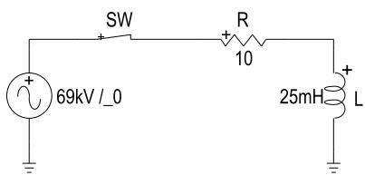  
Fig. 2. Schematic of the simulated series RL circuit.

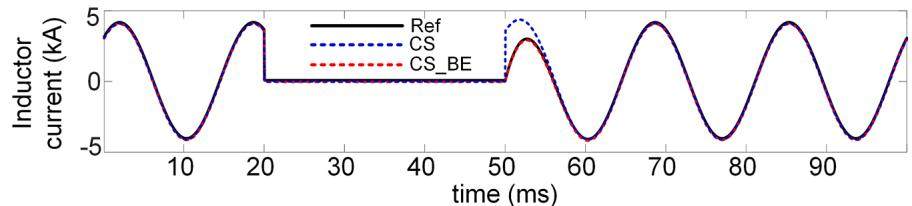

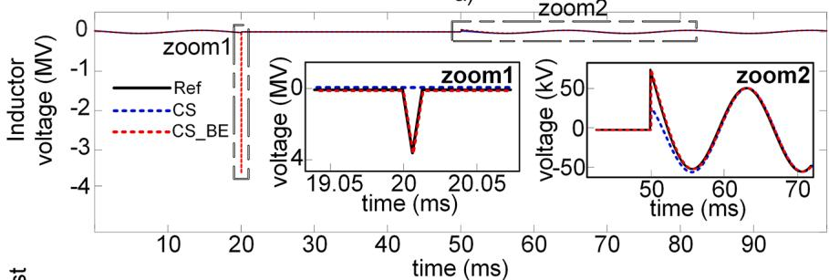

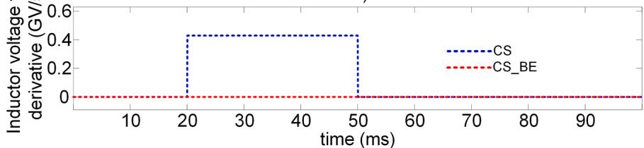  
  
c   
Fig. 3. CS performance at discontinuities (a) inductor current, (b) inductor voltage, (c) the first derivative of the inductor voltage.

(c), the first derivative of the inductor voltage shows a sudden increase and preserves this value while the switch is open. This leads to a jump in the inductor current when the switch is reclosed, which should have increased gradually from zero. According to the explanations provided in section II, the inductor voltage experiences a spike at switch opening time due to using BE in the CS_BE method which correctly aligns with the component’s accurate response.

# 6.2. Test case 2: CS_BE performance at slope changes

This test case investigates the impact of slope changes of piecewise linearized nonlinear components on the performance of the CS_BE method. Fig. 4 shows a circuit with a nonlinear inductor that can be a typical representation of the magnetization circuit of a transformer. The characteristics of the nonlinear inductor are presented in Table 3. Fig. 5 (a) shows the nonlinear inductor flux which determines the operating segment of the nonlinear inductor.

The reference waveform is found from the simulation with TR and 1 µs time-step. As shown in Fig. 5 and Fig. 6(a), the nonlinear inductor flux is correctly simulated with 500 µs time-step using TR, BE, and CS due to iterations. Despite the correct simulation with TR, BE and CS, switching to two halved time-step BE in TR_BE and CS_BE causes deviation from the reference waveform at large time-steps, as shown in Fig. 5 and Fig. 6. These deviations become noticeable at large time-steps, while the

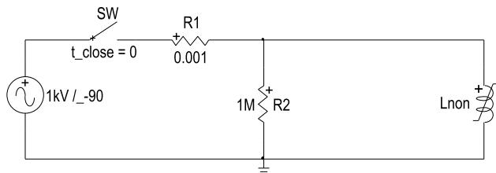  
Fig. 4. Test case with nonlinear inductor.

Table 3   
Characteristics of the nonlinear inductor.   

<table><tr><td>Current (A)</td><td>21.3</td><td>57.2</td><td>99.8</td><td>154.6</td><td>236.9</td><td>420.8</td><td>1601.7</td></tr><tr><td>Flux (Wb)</td><td>2.49</td><td>2.62</td><td>2.74</td><td>2.81</td><td>2.88</td><td>2.96</td><td>3.26</td></tr></table>

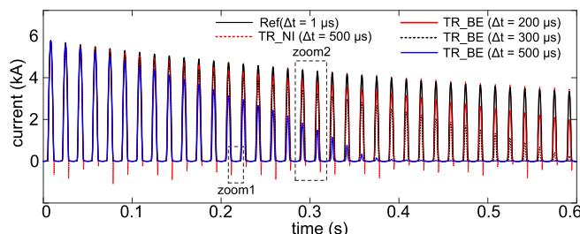

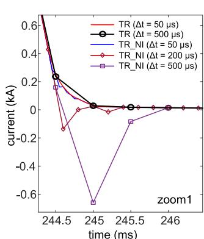  
b）

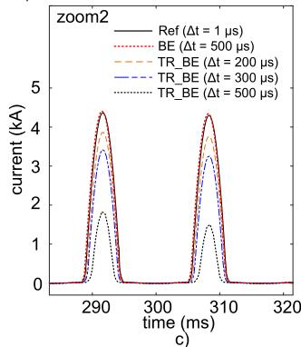  
Fig. 5. Test case with nonlinear inductor with TR, BE, and TR_BE (a) nonlinear inductor current (b) impact of iteration (c) zoom of the current.

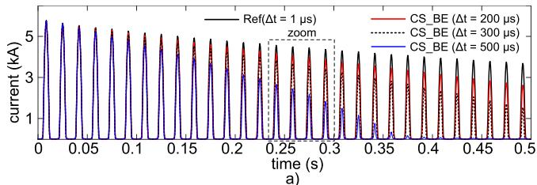

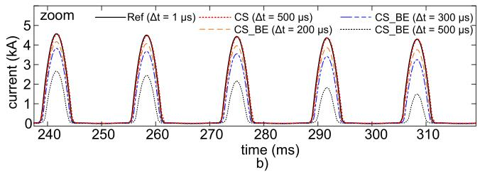  
Fig. 6. Test case with nonlinear inductor with CS and CS_BE (a) nonlinear inductor current (b) zoom of the current.

performance of the CS_BE and TR_BE methods remains acceptable for the time-steps below 100 µs. It is observed from Fig. 5(a) and (b) that numerical problems and spikes appear at slope change instants if the iterations are not performed, and slope changes are applied at the next

time-point after detection of passing a segment threshold. This method, when the TR integration method, is used is referred to as TR_NI in this paper.

# 6.3. Test Case 3: Speed and accuracy investigation

This test case investigates the computational burden and the simulation accuracy of CS for the modified WECC 240-bus system [17] in Fig. 7. For this test case, all the generation units (PVs and synchronous machines) are substituted with ideal voltage sources. The parameters of the associated voltage sources are derived from the load-flow solution performed in EMTP® [6]. The modified WECC 240-bus grid contains 1479 nodes, 165 voltage sources, 1548 RLC components, 366 transformers, 6 switches, and 320 three-phase PI transmission lines. For introducing nonlinearity to the modified WECC 240-bus system, nonlinear inductances with the characteristics presented in Table 4 and locations shown in Fig. 7 are added, to model transformer magnetization. For further analysis, a three-phase fault with a resistance of 0.5 Ω is

Table 4 Characteristics of the nonlinear inductor.   

<table><tr><td>current (pu)</td><td>0.002</td><td>0.01</td><td>0.025</td><td>0.05</td><td>0.1</td><td>2</td></tr><tr><td>flux (pu)</td><td>1</td><td>1.075</td><td>1.15</td><td>1.2</td><td>1.23</td><td>1.72</td></tr></table>

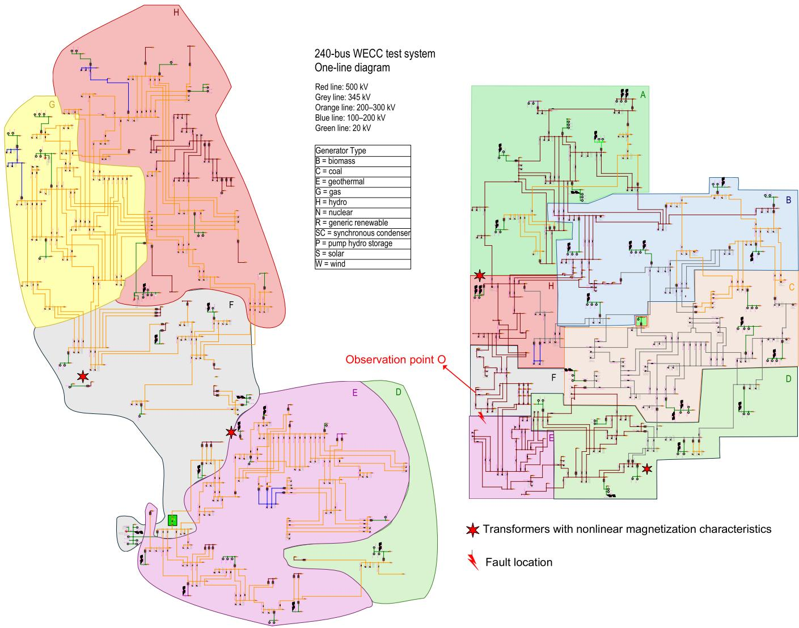  
Fig. 7. Schematic of WECC 240-bus system in EMTP®.

imposed on the location shown in Fig. 7 and the voltage of the point (bus) O near the fault location is observed. Simulation results with the time-step of $\Delta t = 1 5 0 \mu s$ are presented in Fig. 8. The reference waveform is obtained with TR with $\Delta t = 5 0 \mu s .$ . It can be observed from Fig. 8(b) and (c) that TR causes a phase shift for the case of high frequencies and large simulation time-steps. However, CS closely aligns with the reference waveform, as anticipated due to its high-order accuracy. It can be concluded that CS yields more accurate simulation results with large time-steps especially when high-frequency oscillations exist.

Table V presents the simulation times for the modified WECC 240- bus system over a 10 s duration. The comparison between CS and TR reveals that CS is slower than TR, as anticipated. This is due to the need to solve two sets of equations in CS, which introduces additional computational overhead. The extra computational burden of CS can also be inferred by noticing the size and the number of nonzero elements of the network matrix as shown in Table V, which are higher compared to the case of TR. Simulation time comparison between CS and CS_BE shows that the proposed CS_BE method does not add considerable computational burden to the simulation. Based on the simulation speeds in Table V and simulation accuracy in Fig. 8, it can be inferred that TR with 50 µs time-step yields better simulation speed with comparable accuracy compared to CS with 150 µs time-step for this test case due to the latter’s added computational burden. Two formulation methods are applied in this test case: MANA and STA. It is observed that, with both CS and TR, the MANA formulation delivers better performance with faster simulation times.

# 7. Conclusion

This paper investigates the potential of using CS numerical integration method for EMT simulation of power systems. This method enables adopting larger time-steps in some applications for yielding improved simulation speed. The higher accuracy of CS is achieved at the expense of increased computational burden due to the calculation of the derivatives. Despite leveraging from high accuracy, it is demonstrated that CS can produce inaccurate results at discontinuities which require additional measures. Consequently, combining CS with BE (CS_BE) is proposed for solving CS issues at discontinuities. Furthermore, the procedure for formulating grid equations discretized with CS in MANA instead of STA is elaborated and a comparison between simulation performances indicates the superiority of the MANA-based CS approach.

It is also concluded that the reduced accuracy of the classic trapezoidal integration method at large time-steps, can be corrected by simply reducing its time-step to achieve the same accuracy as the CS with large time-steps. Consequently, the trapezoidal method remains a better solution since it delivers much better computational performance even when its time-step is reduced. As explained in the paper, another limiting aspect for selecting the CS method is related to more complicated models, such as distributed parameter transmission lines.

# CRediT authorship contribution statement

M. Jafari Matehkolaei: Writing – review & editing, Writing – original draft, Visualization, Validation, Software, Project administration, Methodology, Investigation, Formal analysis, Data curation, Conceptualization. B. Bruned: Writing – review & editing, Writing – original draft, Visualization, Validation, Supervision. J. Mahseredjian: Methodology, Validation, Supervision, Software, Resources, Project administration, Writing – review & editing, Writing – original draft, Visualization. A. Masoom: Writing – review & editing. I. Kocar: Writing – review & editing.

# Declaration of competing interest

The authors declare that they have no known competing financial interests or personal relationships that could have appeared to influence

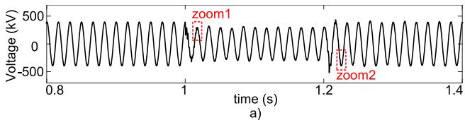

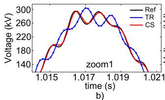

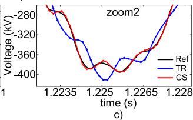  
Fig. 8. The phase-a voltage of the observation point O during the fault.

Table 5 Simulation results for WECC 240-bus system.   

<table><tr><td rowspan="2" colspan="2">Integration method</td><td colspan="2">Computing time (s)</td><td rowspan="2">Matrix size</td><td rowspan="2">nonzero element numbers</td></tr><tr><td>Δt=50 μs</td><td>Δt=150 μs</td></tr><tr><td rowspan="4">MANA</td><td>TR</td><td>96.25</td><td>39.04</td><td>2082 × 2082</td><td>10323</td></tr><tr><td>TR_BE</td><td>98.12</td><td>43.05</td><td>2082 × 2082</td><td>10323</td></tr><tr><td>CS</td><td>420.74</td><td>190.06</td><td>12198 × 12198</td><td>78261</td></tr><tr><td>CS_BE</td><td>437.31</td><td>198.4</td><td>12198 × 12198</td><td>78261</td></tr><tr><td rowspan="4">STA</td><td>TR</td><td>165.96</td><td>84.8</td><td>11202 × 11202</td><td>33861</td></tr><tr><td>TR_BE</td><td>168.01</td><td>92.6</td><td>11202 × 11202</td><td>33861</td></tr><tr><td>CS</td><td>564.05</td><td>288.7</td><td>22404 × 22404</td><td>79242</td></tr><tr><td>CS_BE</td><td>565.29</td><td>305.73</td><td>22404 × 22404</td><td>79242</td></tr></table>

the work reported in this paper.

# Data availability

Data will be made available on request.

# References

[1] J. Mahseredjian, V. Dinavahi, J.A. Martinez, Simulation tools for electromagnetic transients in power systems: overview and challenges, IEEE Trans. Power Deliv. 24 (3) (July 2009) 1657–1669, https://doi.org/10.1109/TPWRD.2008.2008480.   
[2] J. Mahseredjian, M. Naidjate, M. Ouafi, J.A.O. Wilches, Electromagnetic Transients Simulation Program: A unified simulation environment for power system engineers, IEEE Electrif. Mag. 11 (4) (Dec. 2023) 69–78, https://doi.org/10.1109/ MELE.2023.3320511.   
[3] R. Hassani, J. Mahseredjian, T. Tshibungu, U. Karaagac, Evaluation of time-domain and phasor-domain methods for power system transients, Electr. Power Syst. Res. 212 (Nov. 2022), https://doi.org/10.1016/j.epsr.2022.108335.   
[4] L.W. Nagel, SPICE2: A Computer Program to Simulate Semiconductor Circuits, Electronics research laboratory, University of California, 1975.   
[5] X. Fu, S. Mouhamadou Seye, J. Mahseredjian, M. Cai, C. Dufour, A comparison of numerical integration methods and discontinuity treatment for EMT simulations, in: 2018 Power Systems Computation Conference (PSCC), Dublin, Ireland, 2018, pp. 1–7, https://doi.org/10.23919/PSCC.2018.8442452.   
[6] J. Mahseredjian, S. Denneti`ere, L. Dub´e, B. Khodabakhchian, L. G´erin-Lajoie, On a new approach for the simulation of transients in power systems, Electr. Power Syst. Res. 77 (11) (Sep. 2007) 1514–1520, https://doi.org/10.1016/j.epsr.2006.08.027.   
[7] S.K. Lele, Compact finite difference schemes with spectral-like resolution, J. Comput. Phys. 103 (1) (Nov. 1992) 16–42.   
[8] Y. Tanaka, Y. Baba, Study of a numerical integration method using the compact scheme for electromagnetic transient simulations, Electr. Power Syst. Res. 223 (Oct. 2023), https://doi.org/10.1016/j.epsr.2023.109666.   
[9] W. Nzale, J. Mahseredjian, X. Fu, I. Kocar, C. Dufour, Improving numerical accuracy in time-domain simulation for power electronics circuits, IEEE Open Access J. Power Energy 8 (2021) 157–165, https://doi.org/10.1109/ OAJPE.2021.3072369.

[10] G. Hachtel, R. Brayton, F. Gustavson, The sparse tableau approach to network analysis and design, IEEE Trans. Circuit Theory 18 (1) (January 1971) 101–113, https://doi.org/10.1109/TCT.1971.1083223.   
[11] T.A. Davis, E.P. Natarajan, Algorithm 907: KLU, a direct sparse solver for circuit simulation problems, ACM Trans. Math. Soft. 37 (3) (Sep. 2010) 36, 1-36:17.   
[12] B. Kulicke, Simulations programm NETOMAC: differenzleitwertverfahren bei kontinuierlichen und diskontinuierlichen systemen (Simulation program NETOMAC: Difference conductance method for continuous and discontinuous systems), Siemens Forshungs- Entwicklungsberichte 10 (5) (1981) 299–302.   
[13] J. Marti, J. Lin, Suppression of numerical oscillations in the EMTP, IEEe Trans. Power. Syst. 4 (2) (1989) 739–746, https://doi.org/10.1109/59.19384.

[14] J. Lin, J.R. Marti, Implementation of the CDA procedure in the EMTP, IEEe Trans. Power. Syst. 5 (2) (May 1990) 394–402, https://doi.org/10.1109/59.54545.   
[15] P. Kuffel, K. Kent, G. Irwin, The implementation an effectiveness of linear interpolation within digital simulation, in: Proc. IPST 1995, 1995, pp. 499–504.   
[16] J. Tant, J. Driesen, On the numerical accuracy of electromagnetic transient simulation with power electronics, IEEE Trans. Power Deliv. 33 (5) (Oct. 2018) 2492–2501, https://doi.org/10.1109/TPWRD.2018.2797259.   
[17] M. Xiong, B. Wang, D. Vaidhynathan, J. Maack, M.J. Reynolds, A. Hoke, K. Sun, J. Tan, ParaEMT: an open source, parallelizable, and HPC-compatible EMT simulator for large-scale IBR-rich power grids, IEEE Trans. Power Deliv. 39 (2) (April 2024) 911–921, https://doi.org/10.1109/TPWRD.2023.3342715.