# Assessment of the accuracy of the modal-domain line models with real and frequency-independent transformation matrix for electromagnetic transient simulation in lines with underbuilt cables

Lucas A. Rezende a , Naiara Duarte b , Rafael Alipio b,c,* , Alberto De Conti d

a Graduate Program of Electrical Engineering (PPGEL), Federal Center of Technological Education of Minas Gerais (CEFET-MG), Belo Horizonte, Brazil   
b EMC Laboratory, Swiss Federal Inst. Of Technology (EPFL), Lausanne, Switzerland   
c Department of Electrical Engineering, Federal Center of Technological Education of Minas Gerais (CEFET-MG), Belo Horizonte, Brazil   
d Department of Electrical Engineering, Federal University of Minas Gerais (UFMG), Belo Horizonte, Brazil

# A R T I C L E I N F O

Keywords:

Transmission line modeling

Electromagnetic transients

Transmission lines with underbuilt wires

Modal-domain models

Phase-domain models

# A B S T R A C T

This paper investigates the potential inaccuracies associated with using a modal-domain model featuring a real and frequency-independent transformation matrix in simulating electromagnetic transients on power overhead lines equipped with underbuilt wires. Three transmission line configurations are examined: one without underbuilt wires, one with a single underbuilt wire, and another with two underbuilt wires. Comparisons between the simulated voltages computed using the modal-domain approach and a more accurate phase-domain model as a reference reveal that the modal-domain approach leads to inaccuracies in the simulated voltages. These inaccuracies intensify with an increase in the number of underbuilt wires and the soil resistivity. Differences of up to approximately 24 % in the peak values of the simulated voltages were observed, considering the transmission line geometry analyzed in this study. Based on these findings, it is recommended that for simulating transients in overhead lines with installed underbuilt wires, phase-domain models, such as the Universal Line Model, should be employed.

# 1. Introduction

Lightning remains a significant concern in the operation of overhead transmission lines and is the primary cause of outages in transmission lines (TLs) with voltage levels up to 500 kV [1]. Typically, to maintain the outage rate of the TL within acceptable levels, power utilities implement standard methods for improving the lightning performance, such as reducing the tower-foot grounding resistance. In regions characterized by intense lightning activity and unfavorable soil resistivity conditions, special methods are often employed [2]. These methods aim to avoid the need for installing surge arresters in parallel with the line insulator strings, which can be an expensive solution. One such method is the use of underbuilt ground wires [3–5]. These wires are installed below the phase conductors on towers, particularly in regions with high-resistivity soils or in those experiencing unusually frequent flashovers. These underbuilt wires mitigate overvoltages across line insulators by diverting a portion of the lightning current to adjacent towers and by enhancing the coupling between the shield wires and the

# phase conductors.

In assessing the lightning performance of TLs, Electromagnetic Transients (EMT) programs are widely used. In most studies dealing with the lightning performance of transmission lines (e.g., [6–8]), the line is often modeled using Marti’s model, also known as fdLine model, which is a modal-domain model based on a real and frequencyindependent matrix for converting from phase to modal domain quantities [9]. However, while this model yields accurate results for TLs with a low degree of conductor asymmetry, it can lead to inaccuracies when analyzing TLs with underbuilt wires. This is because underbuilt wires introduce asymmetry in the geometric arrangement of the line conductors, leading to a greater imbalance in the per-unit-length impedance and admittance matrices. Although there are models that overcome the limitations of the fdLine model, such as the Universal Line Model (ULM) [10], the fdLine model continues to be the most popular for analyzing line transients in EMT-type programs. This popularity is likely due to two main reasons. First, the fdLine model provides an accurate solution for transients on both single-circuit and double-circuit overhead

transmission lines in most practical cases—excluding those with underbuilt wires [11]. Second, its numerical stability, which ensures stable simulations [12].

The main objective of this paper is to investigate the possible inaccuracies associated with the use of a modal-domain model with a real and frequency-independent transformation matrix in the simulation of electromagnetic transients on power overhead lines with the presence of underbuilt wires. This paper builds upon the work presented in [13] at the GROUND & 10th LPE 2023 Conference, expanding upon the previously presented results from two main perspectives. First, it extends the frequency domain results from [13] to include soils with higher resistivity, which are precisely the scenarios where the use of underbuilt wires is typically considered, and also incorporates the frequency dependence of the soil electrical parameters [14]. Second, this work broadens the scope to the time domain, comparing simulated transient voltages on a line with underbuilt wires using both modal- and phase-domain approaches for modeling the transmission line. The primary contribution of this paper is to demonstrate that the widely-used fdLine model, available in most EMT-type programs, may lead to inaccurate estimates of transient overvoltages in TLs with underbuilt wires. These inaccuracies are primarily attributed to the asymmetry introduced by these additional wires.

This paper is organized as follows. Section 2 presents the simulated transmission line geometry. Section 3 details the formulation used to calculate the line parameters. In Section 4, we describe the two methods used to model the transmission line, specifically focusing on the phasedomain approach and the modal-domain approach. Results comparing the simulated voltages in a transmission line with one or two underbuilt wires installed, as computed using both the phase-domain and modaldomain approaches, are presented in Sections 5 and $^ { 6 , }$ covering the frequency and time domains, respectively. Finally, Section 7 provides a summary of the main findings of the paper.

# 2. Simulated transmission line

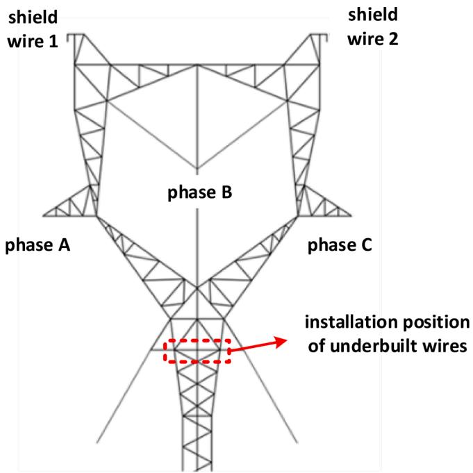  
Fig. 1 depicts the tower design of a typical guyed tower used in Brazilian 500-kV lines. This tower acts as a benchmark for the line geometry investigated in this paper. It is equipped with four conductors for each phase, each having an equivalent radius of 3.75 cm and a DC   
Fig. 1. Line geometry simulated in this paper, corresponding to a typical guyed tower used in Brazilian 500-kV lines.

resistance of 0.0711 Ω/km per conductor. Additionally, it features two $3 / 8 ^ { \prime \prime }$ EHS shield wires with a radius of 0.457 cm and a DC resistance of 3.81 Ω/km. The spatial coordinates of the conductors are provided in Table I. Assuming a standard 550 m span, the phase conductors have a sag of 24.34 m, while the shield wires have a sag of 20.95 m.

In order to assess the accuracy of using a modal-domain approach with a real and frequency-independent transformation matrix to simulate a TL with underbuilt wires, three configurations are examined: a transmission line without underbuilt wires, one with a single underbuilt wire, and another with two underbuilt wires. The geometric coordinates of the underbuilt wires for these installation scenarios are provided in Table II. It is assumed that the underbuilt wires have the same sag as the shield wires.

# 3. Calculation of transmission line parameters

Fig. 2 illustrates an overhead line with infinitely extending conductors, denoted as i and j. These conductors are positioned at a uniform average height [12], with hi and hj representing their respective heights, each having a radius r. The surrounding environment consists of two distinct media. Medium 1 corresponds to air, which is characterized by the vacuum permittivity (ε0), permeability $\begin{array} { r } { ( \mu _ { 0 } ) , } \end{array}$ , and conductivity $( \sigma _ { 0 } =$ 0). Medium 2 represents the ground, which is characterized by the vacuum permeability $( \mu _ { g } = \mu _ { 0 } ) ,$ , permittivity $( \varepsilon _ { g } ) ,$ and conductivity $( \sigma _ { g } ) .$ . The propagation constant for each medium is expressed as $\gamma _ { k } =$ $\sqrt { j \omega \mu _ { k } ( \sigma _ { k } + j \omega \varepsilon _ { k } ) }$ , where k = 0 corresponds to air and $k = g$ corresponds to the ground.

Considering a multi-conductor transmission line (MTL) system that comprises n conductors plus a ground reference conductor, the voltage and current in the frequency domain are governed by the equations [15]

$$
\frac {d ^ {2}}{d z ^ {2}} \mathbf {V} (z) = \mathbf {Z Y V} (z) \tag {1}
$$

$$
\frac {d ^ {2}}{d z ^ {2}} \boldsymbol {I} (z) = \boldsymbol {Y Z I} (z) \tag {2}
$$

where V and I are $n \times \textbf { 1 }$ column vectors containing, respectively, the n phasor line voltages and currents, and Z and Y are the n × n per-unitlength (pul) impedance and admittance matrices, as given respectively by (3) and (4).

$$
\mathbf {Z} = \mathbf {Z} _ {i} + j \omega \mathbf {L} + \mathbf {Z} _ {g} \tag {3}
$$

$$
\boldsymbol {Y} = j \omega \boldsymbol {C} \tag {4}
$$

The internal pul impedance matrix Z associated with the magnetic field within the overhead conductors was calculated using Bessel functions [16]. The external pul inductance matrix L accounts for the magnetic field outside the line conductors, in air. $z _ { g }$ is the pul ground-return impedance matrix, including the effects of the magnetic field penetrating the earth. Lastly, C represents the pul capacitance matrix, accounting for the electric field outside the line conductors. In (4), the ground admittance contribution is omitted, which is generally a valid assumption for studies involving overhead lines and lightning [17,18].

The inductance and capacitance matrices are computed as $\begin{array} { r } { { \pmb L } = \frac { \mu _ { 0 } } { 2 \pi } { \pmb M } } \end{array}$ and $\pmb { C } = 2 \pi \varepsilon _ { 0 } \pmb { M } ^ { - 1 }$ 1, where the elements of the matrix M are given by:

Table I Geometric coordinates of the phase conductors and shield wires, taking as reference the tower geometry of Fig. 1.   

<table><tr><td>Conductor</td><td>x (m)</td><td>y (m)</td></tr><tr><td>Phase A</td><td>-7.5</td><td>37.5</td></tr><tr><td>Phase B</td><td>0</td><td>44.624</td></tr><tr><td>Phase C</td><td>7.5</td><td>37.5</td></tr><tr><td>Shield wire 1</td><td>-6.3</td><td>51.4</td></tr><tr><td>Shield wire 2</td><td>6.3</td><td>51.4</td></tr></table>

Table II Geometric coordinates of the underbuilt wires, considering the assumed installation configurations, taking as reference the tower geometry of Fig. 1.   

<table><tr><td></td><td>Conductor</td><td>x (m)</td><td>y (m)</td></tr><tr><td>Configuration 1</td><td>Underbuilt wire</td><td>0</td><td>33</td></tr><tr><td>Configuration 2</td><td>Underbuilt wire 1</td><td>-0.7</td><td>33</td></tr><tr><td></td><td>Underbuilt wire 2</td><td>0.7</td><td>33</td></tr></table>

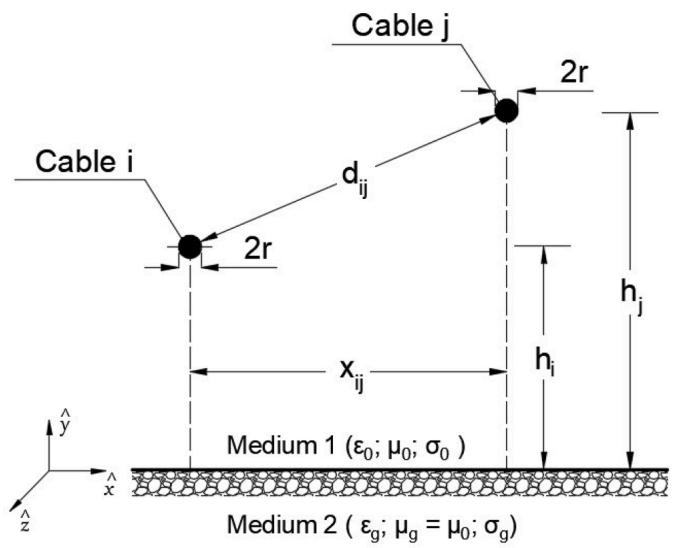  
Fig. 2. Configuration of the conductors of an overhead multiconductor transmission line (MTL).

$$
M _ {i i} = \ln \left(\frac {2 h _ {i}}{r}\right) M _ {i j} = \ln \left(\frac {D _ {i j}}{d _ {i j}}\right) \tag {5}
$$

with $D _ { i j } = \sqrt { \mathcal { k } _ { i j } ^ { 2 } + x _ { i j } ^ { 2 } } , \mathcal { k } _ { i j } = h _ { i } + h _ { j }$ and $d _ { i j } \in x _ { i j }$ j are the distances indicated in $\mathrm { F i g . ~ 2 }$ .

In this study, the computation of the ground-return impedance matrix is based on Sunde’s formulas. The expressions for the self and mutual impedances are outlined as follows [19]:

$$
Z _ {g i i} = \frac {j \omega \mu_ {0}}{\pi} \int_ {0} ^ {\infty} \frac {e ^ {- 2 h _ {i} \lambda}}{\sqrt {\lambda^ {2} + \gamma_ {g} ^ {2}} + \lambda} d \lambda \tag {6}
$$

$$
Z _ {g i j} = \frac {j \omega \mu_ {0}}{\pi} \int_ {0} ^ {\infty} \frac {e ^ {- \lambda_ {i j} \lambda}}{\sqrt {\lambda^ {2} + \gamma_ {g} ^ {2}} + \lambda} \cos x _ {i j} \lambda d \lambda \tag {7}
$$

It is worth noting that under the low-frequency approximation $( \sigma _ { g } \gg \omega \varepsilon _ { g } ) _ { : }$ , Eqs. (6) and (7) reduce to Carson’s equations [20]. These equations, while applicable for lightning studies, represent a specific case of the more comprehensive formulas developed by Pettersson [21] and Nakagawa [22]. For studies in the MHz range and beyond, the equations developed by Pettersson and Nakagawa are particularly recommended [23].

# 4. Solution methods to the MTL equations

# 4.1. Phase-domain model

In this study, the method for solving the MTL equations in the phasedomain utilizes a 2n × 2n nodal admittance matrix given by [15]

$$
\mathbf {Y} _ {n =} \left[ \begin{array}{c c} \mathbf {Y} _ {c} \left(1 _ {n} + \mathbf {A} ^ {2}\right) \left(1 _ {n} - \mathbf {A} ^ {2}\right) ^ {- 1} & - 2 \mathbf {Y} _ {c} \mathbf {A} \left(1 _ {n} - \mathbf {A} ^ {2}\right) ^ {- 1} \\ - 2 \mathbf {Y} _ {c} \mathbf {A} \left(1 _ {n} - \mathbf {A} ^ {2}\right) ^ {- 1} & \mathbf {Y} _ {c} \left(1 _ {n} + \mathbf {A} ^ {2}\right) \left(1 _ {n} - \mathbf {A} ^ {2}\right) ^ {- 1} \end{array} \right] \tag {8}
$$

where $1 _ { n }$ denotes the $n \times n$ identity matrix, $\mathbf { Y } _ { c }$ represents the $n \times n$ characteristic admittance and A is the $n \times n$ propagation matrix. These are determined as follows:

$$
\boldsymbol {Y} _ {c} = \boldsymbol {Z} ^ {- 1} \sqrt {\boldsymbol {Z Y}} \tag {9}
$$

$$
\boldsymbol {A} = \exp \left(- \ell \sqrt {\mathbf {Z Y}}\right) \tag {10}
$$

where l is the length of the line.

The nodal admittance matrix represents a two-port model of a transmission line. Derived from the exact solution in the frequency domain of the telegrapher’s equations, it describes the relationship between voltages and currents at either end of the line for a specified frequency, i.e.

$$
\boldsymbol {I} _ {n} = \boldsymbol {Y} _ {n} \boldsymbol {V} _ {n} \tag {11}
$$

where ${ \pmb V } _ { \pmb n }$ is the 2n $\times \_ 1$ column vector of the nodal voltage phasors and $I _ { n }$ is the $2 n \times \ 1$ column vector containing the phasors of the externally injected currents. Both ${ \pmb V } _ { \pmb n }$ and $I _ { n }$ are expressed in phase-domain quantities.

In the phase-domain solution approach, the terminal conditions, which include the driving sources and terminal impedances, are readily integrated into the solution. The sources are incorporated into the vector $I _ { n } ;$ it is important to note that both current and voltage sources can be implemented through conversions between Thevenin/Norton equivalent circuits. The terminal impedances are directly included in the matrix $\mathbf { { { Y } } _ { n } } ,$ following the same assembling rules as the bus admittance matrix in power systems.

# 4.2. Modal-domain model

Eqs. (1) and (2) are said to be coupled because the products ZY and YZ are full matrices. This implies that the differential equations describing the voltage and current in conductor k of the MTL depend not only on the voltage and current in conductor k itself, but also on the voltages and currents in all remaining conductors of the line. To address this problem, the MTL can be decoupled and expressed as a system of n separate equations, representing n single-phase lines with ground return. The resulting equations are said to be written in the modal domain. The conversion from phase-domain quantities to modal-domain quantities is achieved through a transformation matrix, known as the modal transformation matrix, which is generally complex and frequencydependent. In the modal domain, the equations describing the modal voltages and currents are scalar equations that can be easily solved. The relation between the phase-domain and modal-domain quantities is given by [15]:

$$
\boldsymbol {V} (\mathbf {z}) = \boldsymbol {T} _ {\boldsymbol {V}} \boldsymbol {V} _ {m} (\mathbf {z}) \tag {12}
$$

$$
\boldsymbol {I} (\mathbf {z}) = \boldsymbol {T} _ {I} \boldsymbol {I} _ {m} (\mathbf {z}) \tag {13}
$$

where the $\scriptstyle { T _ { V } }$ and $\pmb { T } _ { I }$ are $n \times n$ complex transformation matrices that define the change of variables between phasor line voltages and currents in the phase domain, V(z) and $\pmb { I } ( z )$ , to the corresponding phasors in the modal domain, $V _ { m } ( z )$ and $I _ { m } ( z )$ . By substituting (12) and (13) into the second-order MTL Eqs. (1) and (2), we obtain:

$$
\frac {d ^ {2}}{d z ^ {2}} \boldsymbol {V} _ {m} (z) = \boldsymbol {T} _ {\boldsymbol {V}} ^ {- 1} \boldsymbol {Z} \boldsymbol {Y} \boldsymbol {T} _ {\boldsymbol {V}} \boldsymbol {V} _ {m} (z) \tag {14}
$$

$$
\frac {d ^ {2}}{d z ^ {2}} \boldsymbol {I} _ {m} (z) = \boldsymbol {T} _ {I} ^ {- 1} \boldsymbol {Y Z T} _ {I} \boldsymbol {I} _ {m} (z) \tag {15}
$$

The matrices $\pmb { T } _ { \pmb { V } }$ and $\pmb { T } _ { I }$ must simultaneously diagonalize the products ZY and YZ for the second-order Eqs. (14) and (15) to be decoupled. This problem can be addresses by using classic eigenvalue/eigenvector theory [24], from which one obtains:

$$
\boldsymbol {T} _ {V} ^ {- 1} \boldsymbol {Z Y T} _ {V} = \lambda \tag {16}
$$

$$
\boldsymbol {T} _ {I} ^ {- 1} \boldsymbol {Y Z T} _ {I} = \lambda \tag {17}
$$

where λ is a diagonal matrix containing the eigenvalues of ZY and/or YZ, which are identical. The square root of λ is also a diagonal matrix and is referred to as the matrix of modal propagation constants, i.e.:

$$
\gamma_ {m} = \sqrt {\lambda} = \left[ \begin{array}{c c c c} \gamma_ {1} & 0 & \dots & 0 \\ 0 & \gamma_ {2} & \ddots & \vdots \\ \vdots & \ddots & \ddots & 0 \\ 0 & \dots & 0 & \gamma_ {n} \end{array} \right] \tag {18}
$$

Finally, considering the previous developments, the equations governing the modal voltages and currents in (14) and (15) are decoupled and have the following scalar solution for each mode:

$$
V _ {m} (z) = V _ {m} ^ {+} e ^ {- \gamma_ {m} z} + V _ {m} ^ {-} e ^ {+ \gamma_ {m} z} \tag {19}
$$

$$
I _ {m} (\mathbb {z}) = I _ {m} ^ {+} e ^ {- \gamma_ {m} z} + I _ {m} ^ {-} e ^ {+ \gamma_ {m} z} \tag {20}
$$

where the complex-valued constants $V _ { m } ^ { + } , V _ { m } ^ { - } , I _ { m } ^ { + }$ and $I _ { m } ^ { - }$ are determined according to the line terminal conditions at $z = 0$ and $z = \ell .$ . Actually, only one pair of constants is determined $( V _ { m } ^ { + }$ and $V _ { m } ^ { - }$ or I + and $I _ { m } ^ { - } )$ and the other pair is computed via the so-called modal characteristic impedance [15]. Once the modal voltages and currents are determined, they can be transformed back to the phase-domain quantities via (12) and (13), respectively.

Upon converting the modal voltages and currents back to phase quantities, the terminal conditions, which are always defined in terms of phase quantities, are incorporated. In this study, this was accomplished by employing a generalized Thevenin equivalent of the simulated network, as detailed in [15]. It is important to note that in implementing the modal-domain solution method, complex frequency-dependent transformation matrices were considered. To prevent artificial mode switching, the Newton-Raphson scheme proposed in [25] was adopted, ensuring that the sum of squares of the eigenvector in the first column equals 1. This comprehensive implementation allows for the evaluation of the assumption of using a real and constant (frequency-independent) transformation matrix, the foundation of the widely-used fdLine model in time-domain electromagnetic transients simulators [9]. More details regarding the computational implementation and validation of both the phase- and modal-domain approaches can be found in [13].

# 5. Frequency-Domain results

# 5.1. Tested cases

This section presents a comparison of the results obtained from electromagnetic transient simulations in the frequency domain using both the phase-domain and modal-domain solution methods. In the modal-domain approach, a constant, real transformation matrix computed at a frequency of 10 kHz was used. The comparisons focus on three different configurations: one without underbuilt wires, one with a single underbuilt wire, and one with two underbuilt wires.

For the evaluation, we consider a 550-meter-long line section, assuming four distinct soil DC resistivities $( \rho _ { 0 } ) \colon 2 0 0 \Omega \mathrm { m }$ , 1000 Ωm, 5000 Ωm, and 10,000 Ωm. The higher resistivity soils aim to simulate real transmission line scenarios where underbuilt wires are often utilized. Unless stated otherwise, the results obtained in the paper assume frequency-dependent soil conductivity and permittivity according to the Alipio-Visacro model, given, respectively, by (21) and (22) [14,26]:

$$
\sigma_ {g} (f) = \sigma_ {0} \left\{1 + 4. 7 \times 1 0 ^ {- 6} \times \sigma_ {0} ^ {- 0. 7 3} \times f ^ {0. 5 4} \right\} \tag {21}
$$

$$
\varepsilon_ {g} (f) = 9. 5 \varepsilon_ {0} \times 1 0 ^ {4} \times \sigma_ {0} ^ {0. 2 7} \times f ^ {- 0. 4 6} + 1 2 \varepsilon_ {0} \tag {22}
$$

where f is the frequency in Hz and $\begin{array} { r } { \sigma _ { 0 } = \frac { 1 } { \rho _ { 0 } } } \end{array}$ is the soil DC conductivity.

In all simulations, a 1-kV time-harmonic voltage source is applied to the sending end of shield wire 1. The ends of the shield wires and underbuilt wires, if present, are grounded through 10-Ω lumped resistances. Additionally, the phase conductors are approximately matched at both ends with a lumped resistance of 430 Ω.

When a lightning discharge strikes the tower or the shield wires of a transmission line, the resulting surge voltage at each line insulator string is determined by the difference between the voltage at the tower crossarm and the voltage induced on the phase conductor from the shield wires. Considering this, the results primarily focus on the induced voltage at the receiving end of phase C. However, similar qualitative results were obtained for the other phases.

Lastly, two metrics are employed to compare the results obtained from the two solution methods. The first metric is the relative error computed for each frequency, as given by the following equation:

$$
E (\%) = \left[ \frac {V _ {\text {mod}} (\omega) - V _ {\text {ph}} (\omega)}{V _ {\text {ph}} (\omega)} \right] \times 100 \tag{23}
$$

where $V _ { m o d } ( \omega )$ and $V _ { p h } ( \omega )$ represent the magnitudes of the voltage phasors calculated at the angular frequency ω using the modal-domain and phase-domain solution methods, respectively. The relative error E(%) provides a measure of the discrepancy between the two methods at each frequency.

To assess the performance of the modal-domain solution method within a specific frequency range of interest, and using the phasedomain method as a reference, the normalized root-mean-square error (NRMSE) is calculated as a percentage using the equation:

$$
N R M S E = \frac {1 0 0}{\max  \left[ \left| V _ {p h} (\omega) \right| \right]} \sqrt {\sum_ {k = 1} ^ {N _ {s}} \frac {\left[ V _ {\operatorname {m o d}} \left(\omega_ {k}\right) - V _ {p h} \left(\omega_ {k}\right) \right] ^ {2}}{N _ {s}}} \tag {24}
$$

where $N _ { s }$ corresponds to the number of frequency samples taken within the frequency range of interest.

# 5.2. Simulated results

Fig. 3(a) illustrates the induced voltage at the receiving end of phase C within a frequency range spanning from 1 kHz to 1 MHz for the case without underbuilt wires. The voltages are computed using both the phase-domain (PD) and modal-domain (MD) solution methods, assuming a soil resistivity of 5000 Ωm. Fig. 3(b) shows the calculated relative error within the same frequency range. For the sake of simplicity, these results assume constant soil resistivity and a dielectric constant equal to 10.

The results indicate that the differences between the voltages derived from the two distinct solution methods are relatively minor at lower frequencies. However, these differences become increasingly pronounced above approximately 100 kHz, with the most substantial differences observed at resonance peaks.

Further simulations, as depicted in Figs. 4 and 5, demonstrate similar trends in configurations with one and two underbuilt wires, respectively. In line with the observations for the configuration without underbuilt wires, the differences between the voltages calculated via the two methods remain minimal at lower frequencies but exhibit a progressive increase beyond 100 kHz. Notably, in configurations with underbuilt wires, the error magnitude is more pronounced, particularly with two underbuilt wires. This trend suggests that the inclusion of underbuilt wires leads to a deterioration in the performance of the modal-domain approach when assuming a constant and real transformation matrix. Similar qualitative results are obtained when the soil parameters are assumed to be frequency dependent.

Similar results were obtained for the other three soil resistivity values, namely 200 Ωm, 1000 Ωm and 10,000 Ωm, and considering the

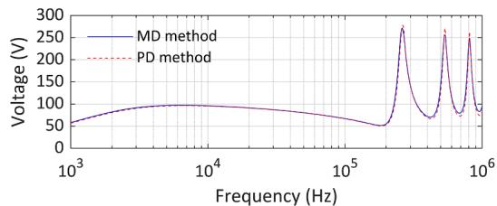  
(a)

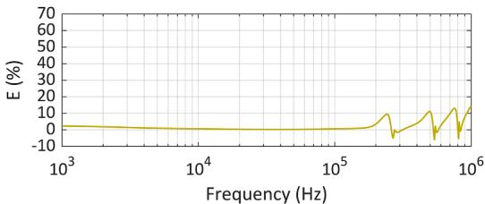  
(b)

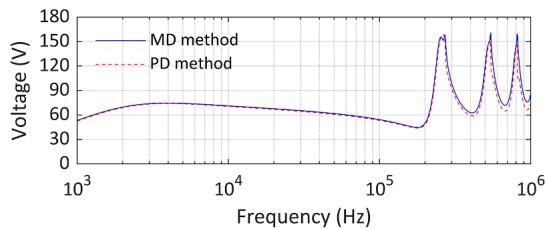  
Fig. 3. (a) Induced voltage at the receiving end of phase C for the case without underbuilt wires, computed via the modal- and phase-domain solution methods. (b) Relative error of the modal-domain solution method for the case without underbuilt wires. Constant soil resistivity of 5000 Ωm and dielectric constant equal to 10.   
(a)

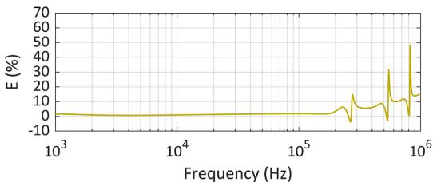  
(b)

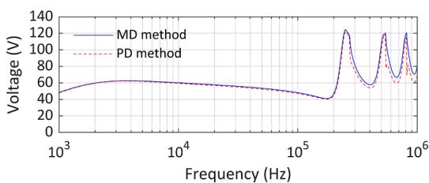  
Fig. 4. Same as in Fig. 3, but for the TL configuration with one underbuilt wire.

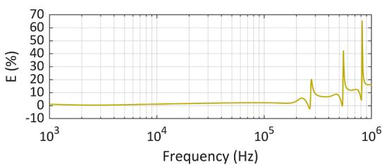  
(b)   
Fig. 5. Same as in Fig. 3, but for the TL configuration with two underbuilt wires.

frequency dependence of the soil electrical parameters. The outcomes of these assessments are summarized in Tables III and IV, which present the computed values of the NRMSE for the three tested TL configurations, and assuming constant soil parameters (C-S) and frequency-dependent soil parameters (FD-S). These evaluations specifically considered frequency samples ranging from 1 kHz to 1 MHz (Table III) and from 100 kHz to 1 MHz (Table IV), and the soil DC resistivities of 200 Ωm, 1000 Ωm, 5000 Ωm, and 10,000 Ωm. The results clearly demonstrate that the NRMSE values increase with the inclusion of underbuilt wires and are more significant for higher resistivity soils. Furthermore, it is noteworthy that the NRMSE values are considerably higher within the frequency range of 100 kHz to 1 MHz. This frequency range is particularly relevant as the frequency components associated with the wavefront of lightning overvoltages are typically concentrated within this frequency range (100 kHz to 1 MHz). Interestingly, a slight increase in the NRMSE values is observed for the lines with underbuilt wires installed when the frequency dependence of the soil parameters is considered. From this

point forward, all results exclusively assume frequency-dependent soil electrical parameters.

# 6. Time-domain results

As indicated in the results of Tables III and IV, the errors in the computed voltages using the modal-domain approach with a real and constant transformation matrix tend to increase with the addition of underbuilt wires and are more pronounced in cases of high-resistivity soils. Although the percentage differences are not substantial, small differences in the waveforms of lightning transient overvoltages impinging upon the line insulators might have a noticeable impact on the TL outage rate, as shown in [27]. To assess the differences between the transient voltages obtained using both the phase-domain and modal-domain solution methods, we initially obtained results similar to those illustrated in Figs. 4(a), and 5(a) for the range of soil resistivities analyzed. Subsequently, the transient voltages in response to the

Table III   
NRMSE associated with the modal-domain solution method, considering the three tested TL configurations, computed in the frequency range between 1 kHz and 1 MHz.   

<table><tr><td rowspan="3">Configuration</td><td colspan="8">Soil resistivity (Ωm)</td></tr><tr><td colspan="2">200</td><td colspan="2">1000</td><td colspan="2">5000</td><td colspan="2">10,000</td></tr><tr><td>C-S</td><td>FD-S</td><td>C-S</td><td>FD-S</td><td>C-S</td><td>FD-S</td><td>C-S</td><td>FD-S</td></tr><tr><td>w/o underbuilt wires</td><td>0.76</td><td>0.74</td><td>1.09</td><td>0.97</td><td>1.32</td><td>1.15</td><td>1.39</td><td>1.21</td></tr><tr><td>1 underbuilt wire</td><td>1.78</td><td>1.87</td><td>2.44</td><td>2.58</td><td>2.97</td><td>3.02</td><td>3.12</td><td>3.14</td></tr><tr><td>2 underbuilt wires</td><td>2.33</td><td>2.49</td><td>3.10</td><td>3.35</td><td>3.72</td><td>3.95</td><td>3.97</td><td>4.10</td></tr></table>

Table IV NRMSE associated with the modal-domain solution method, considering the three tested TL configurations, computed in the frequency range between 100 kHz and 1 MHz.   

<table><tr><td rowspan="3">Configuration</td><td colspan="8">Soil resistivity (Ωm)</td></tr><tr><td colspan="2">200</td><td colspan="2">1000</td><td colspan="2">5000</td><td colspan="2">10,000</td></tr><tr><td>C-S</td><td>FD-S</td><td>C-S</td><td>FD-S</td><td>C-S</td><td>FD-S</td><td>C-S</td><td>FD-S</td></tr><tr><td>w/o underbuilt wires</td><td>1.25</td><td>1.20</td><td>1.84</td><td>1.61</td><td>2.24</td><td>1.92</td><td>2.36</td><td>2.03</td></tr><tr><td>1 underbuilt wire</td><td>3.01</td><td>3.15</td><td>4.15</td><td>4.38</td><td>5.10</td><td>5.15</td><td>5.32</td><td>5.35</td></tr><tr><td>2 underbuilt wires</td><td>3.93</td><td>4.18</td><td>5.22</td><td>5.69</td><td>6.36</td><td>6.73</td><td>6.80</td><td>7.00</td></tr></table>

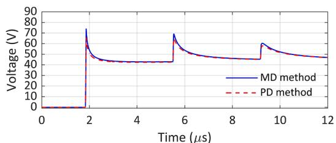  
(a)

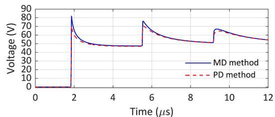

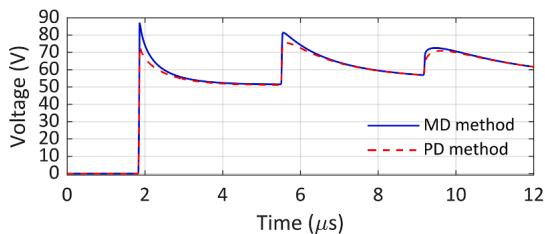  
（c）

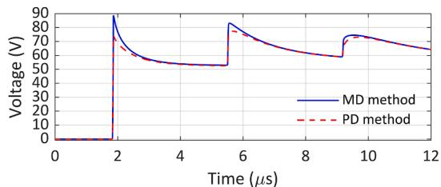  
(d)   
Fig. 6. Transient voltages at the receiving end of phase C for the TL configuration with one underbuilt wire in response to the application of a 1-kV step voltage at the sending end of shield wire 1 and soil resistivities of (a) 200 Ωm, (b) 1000 Ωm, (c) 5000 Ωm, and (d) 10,000 Ωm.

application of a step voltage of 1 kV to the sending end of shield wire 1 were obtained using the numerical Laplace transform [28]. The results are presented in Figs. 6 and 7, respectively, for the configurations with one and two underbuilt wires. In all simulations, the soil electrical parameters were assumed to be frequency-dependent according to the Alipio-Visacro model [14].

It is observed that the use of the modal-domain approach leads to non-negligible errors in the simulated transient voltages in the transmission line configurations with the presence of underbuilt wires. These errors are more noticeable for high-resistivity soils. In the TL

configuration with one underbuilt wire, the maximum differences at the voltage wavefront are in the order of 13.1 %, 16.9 %, 19.4 %, and 20.2 %, for soil resistivities of 200 Ωm, 1000 Ωm, 5000 Ωm, and 10,000 Ωm, respectively. Similarly, for the configuration with two underbuilt wires and the same resistivities, the maximum differences are in the order of 15.3 %, 19.7 %, 22.8 %, and 23.8 %, respectively. Finally, considering simulations of the case without underbuilt wires, not included in the paper, the differences between the peak values of the simulated voltages using the two modeling approaches were not greater than 5 %, which is reasonably within the uncertainties associated with the calculation of

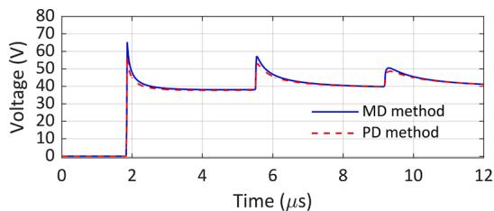

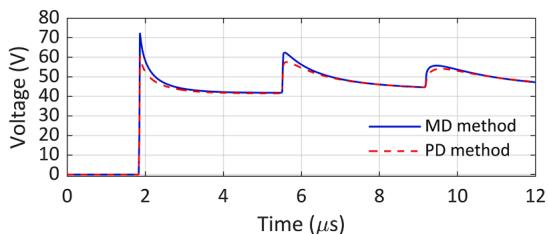  
(b)

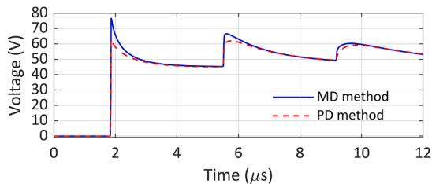

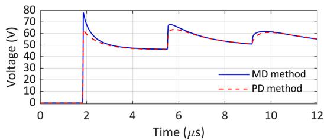  
(d)   
Fig. 7. Same as in Fig. 6, but for the TL configuration with two underbuilt wires.

lightning performance of transmission lines.

The obtained results suggest that for an accurate analysis of the impact of installing underbuilt wires on the lightning performance of transmission lines, it is advisable to refrain from using the popular modal-domain approach with a constant and real transformation matrix to model the transmission line. This is particularly relevant considering that the errors in the voltages computed using the modal-domain approach are exacerbated for soils of higher resistivity, which is often the scenario where the installation of underbuilt wires would be considered in practice. The observed differences in the peak values of the voltages computed using the two methods, as well as the differences in the waveforms, could be key factors in assessing the hazardous po tential of the resultant overvoltages due to a lightning strike and in determining the probability of insulation breakdown.

# 7. Summary and conclusions

This paper assessed the inaccuracies associated with the use of a modal-domain model with a real and frequency-independent transformation matrix in simulating electromagnetic transients on power overhead lines with underbuilt wires installed. It was shown that, due to the asymmetry introduced by the underbuilt wires, the traditional modal-domain model leads to inaccuracies in the simulated voltages, when compared to an accurate phase-domain approach. Notably, the errors increase with higher soil resistivity, with observed differences of up to about 24 % in the peak values of the simulated voltages, considering the transmission line geometry analyzed in this study. In light of these findings, it is recommended that for transient analysis in overhead lines with underbuilt wires using EMT-type programs, the Universal Line Model (ULM) should be preferred over the fdLine model, which is still commonly used in assessing lightning overvoltages in TLs. This recommendation is particularly crucial for engineering applications involving complex line configurations, where the choice of the modeling tool can have a substantial impact on the accuracy of the results. The nonnegligible discrepancies identified in this study underscore the importance of selecting appropriate modeling tools in engineering practice, especially in scenarios involving complex configurations such as underbuilt wires. The recommendation on the use of the ULM in simulations using EMT-type programs is also extended to lines with high asymmetrical arrangements of conductors.

Finally, it is worth mentioning that in simulations of lightning overvoltages in transmission lines due to direct strikes using EMT-type platforms, each component is often modeled separately, namely, the transmission line itself (line conductors), the tower, and the grounding system. The focus of this work was on assessing the accuracy of the transmission line model. Looking ahead, in future work, the impact of the line model will be further assessed in the computation of transmission line outages due to lightning, considering the whole system, i.e., including the tower and grounding system.

# CRediT authorship contribution statement

Lucas A. Rezende: Writing – original draft, Validation, Software, Methodology, Investigation, Formal analysis, Conceptualization. Naiara Duarte: Writing – review & editing, Supervision, Methodology, Investigation, Formal analysis, Conceptualization. Rafael Alipio: Writing – review & editing, Writing – original draft, Visualization, Validation, Supervision, Software, Resources, Project administration, Methodology, Investigation, Funding acquisition, Formal analysis, Data curation, Conceptualization. Alberto De Conti: Writing – review & editing, Methodology, Conceptualization.

# Declaration of competing interest

The authors declare that they have no known competing financial interests or personal relationships that could have appeared to influence

the work reported in this paper.

# Data availability

Data will be made available on request.

# Acknowledgements

This work was supported in part by the Federal Center of Technological Education of Minas Gerais (scholarship provided to Lucas A. Rezende) and by the Swiss National Science Foundation (SNSF), grant number TMPFP2_209700, and the Conselho Nacional de Desenvolvimento Científico e Tecnologico ´ (CNPq), grant number 314849/2021-1.

# References

[1] Working Group C4.23, “CIGRE TB 839: Procedures for Estimating the Lightning Performance of Transmission Lines – New Aspects,” Paris, 2021.   
[2] IEEE Std 1243-1997, “IEEE Guide for Improving the Lightning Performance of Transmission Lines,” New York, 1997.   
[3] S. Visacro, F.H. Silveira, A. De Conti, The use of underbuilt wires to improve the lightning performance of transmission lines, IEEE Trans. Power Deliv. 27 (1) (2012) 205–213, https://doi.org/10.1109/TPWRD.2011.2168546.   
[4] R. Araneo, A. Andreotti, J. Brandao Faria, S. Celozzi, D. Assante, L. Verolino, Utilization of underbuilt shield wires to improve the lightning performance of overhead distribution lines hit by direct strokes, IEEE Trans. Power Deliv. 35 (4) (2020) 1656–1666, https://doi.org/10.1109/TPWRD.2019.2949505.   
[5] F.A.M. Rizk, Novel solution to back flashovers on high voltage transmission lines: the embedded ground conductor, IEEE Trans. Power Deliv. 37 (6) (2022) 5345–5355, https://doi.org/10.1109/TPWRD.2022.3176137.   
[6] M.R. Alemi, K. Sheshyekani, Wide-band modeling of tower-footing grounding systems for the evaluation of lightning performance of transmission lines, IEEE Trans. Electromagn. Compat. 57 (6) (2015) 1627–1636, https://doi.org/10.1109/ TEMC.2015.2453512.   
[7] Z.G. Datsios, P.N. Mikropoulos, T.E. Tsovilis, Closed-form expressions for the estimation of the minimum backflashover current of overhead transmission lines, IEEE Trans. Power Deliv. 36 (2) (2021) 522–532, https://doi.org/10.1109/ TPWRD.2020.2984423.   
[8] D. Conceiç˜ao, R. Alipio, I.J.S. Lopes, W. Chisholm, A comprehensive analysis on the influence of the adopted cumulative peak current distribution in the assessment of overhead lines lightning performance, Energies 16 (15) (2023) 5836, https://doi. org/10.3390/en16155836.   
[9] J. Marti, Accurate modelling of frequency-dependent transmission lines in electromagnetic transient simulations, IEEE Trans. Power Appar. Syst. PAS-101 (1) (1982) 147–157, https://doi.org/10.1109/TPAS.1982.317332.   
[10] A. Morched, B. Gustavsen, M. Tartibi, A universal model for accurate calculation of electromagnetic transients on overhead lines and underground cables, IEEE Trans. Power Deliv. 14 (3) (1999) 1032–1038, https://doi.org/10.1109/61.772350.   
[11] A. Tavighi, J.R. Martí, J.A.G. Robles, Comparison of the fdLine and ULM Frequency Dependent EMTP Line Models with a Reference Laplace Solution, in: International Conference on Power Systems Transients (IPST2015), 2015, pp. 1–8.   
[12] H.W. Dommel, Electromagnetic Transients Program. Reference Manual (EMTP Theory Book), Bonneville Power Administration, Portland, 1986.   
[13] L.A. Rezende, R. Alipio, N. Duarte, A. De Conti, A.C.S. de Lima, Accuracy assessment of line models based on real and frequency-independent transformation matrix for transient analysis in overhead lines with installed underbuilt ground wires, in: GROUND 2023 & 10th LPE – International Conference on Grounding & Lightning Physics and Effects, 2023, pp. 262–266.   
[14] R. Alipio, S. Visacro, Modeling the Frequency Dependence of Electrical Parameters of Soil, IEEE Trans. Electromagn. Compat. 56 (5) (2014) 1163–1171, https://doi. org/10.1109/TEMC.2014.2313977.   
[15] C.R. Paul, Analysis of Multiconductor Transmission Lines, 2nd ed., John Wiley & Sons, Inc., 2008.   
[16] J.A. Martinez-Velasco, Power System Transients: Parameter Determination, CRC Press, 2010.   
[17] A. De Conti, M.P.S. Emídio, Extension of a modal-domain transmission line model to include frequency-dependent ground parameters, Electr. Power Syst. Res. 138 (2016) 120–130, https://doi.org/10.1016/j.epsr.2016.02.032.   
[18] F.A. Diniz, R.S. Alípio, R.A.R. de Moura, Assessment of the Influence of Ground Admittance Correction and Frequency Dependence of Electrical Parameters of Ground of Simulation of Electromagnetic Transients in Overhead Lines, J. Control. Autom. Electr. Syst. 33 (3) (2022) 1066–1080, https://doi.org/10.1007/s40313- 021-00849-z.   
[19] E.D. Sunde, Earth Conduction Effects in Transmission Systems, Dover Publications, New York, 1968.   
[20] J.R. Carson, Wave propagation in overhead wires with ground return, Bell Syst. Tech. J. 5 (1926) 539–554.   
[21] P. Pettersson, Propagation of waves on a wire above a lossy ground-different formulations with approximations, IEEE Trans. Power Deliv. 14 (3) (1999) 1173–1180, https://doi.org/10.1109/61.772389.

[22] M. Nakagawa, Admittance correction effects of a single overhead line, IEEE Trans. Power Appar. Syst. PAS-100 (3) (1981) 1154–1161, https://doi.org/10.1109/ TPAS.1981.316582.   
[23] G.S. Lima, A. De Conti, Bottom-up single-wire power line communication channel modeling considering dispersive soil characteristics, Electr. Power Syst. Res. 165 (2018) 35–44, https://doi.org/10.1016/j.epsr.2018.08.015. Dec.   
[24] C.R. Paul, Decoupling the multiconductor transmission line equations, IEEE Trans. Microw. Theory Tech. 44 (8) (1996) 1429–1440, https://doi.org/10.1109/ 22.536026.   
[25] L.M. Wedepohl, H.V. Nguyen, Frequency-dependent transformation matrices for untransposed transmission lines using newton-raphson method, IEEE Trans. Power Syst. 11 (3) (1996) 1538–1546, https://doi.org/10.1109/59.535695.

[26] Working Group C4.33, Impact of Soil-Parameter Frequency Dependence On the Response of Grounding Electrodes and On the Lightning Performance of Electrical Systems (WG C4.3), CIGRE, 2019.   
[27] R. Alipio, A. De Conti, N. Duarte, F. Rachidi, Influence of a lossy ground on the lightning performance of overhead transmission lines, Electr. Power Syst. Res. 214 (2023) 108951, https://doi.org/10.1016/j.epsr.2022.108951.   
[28] P. Moreno, A. Ramirez, Implementation of the numerical laplace transform: a review task force on frequency domain methods for emt studies, working group on modeling and analysis of system transients using digital simulation, general systems subcommittee, IEEE power engineering, IEEE Trans. Power Deliv. 23 (4) (2008) 2599–2609, https://doi.org/10.1109/TPWRD.2008.923404.