# 适用于交直流混联电网的CH-MMC电磁暂态快速仿真模型

苟 鑫，卢继平，刘加林，石家炜，李 政

（重庆大学 输配电装备及系统安全与新技术国家重点实验室，重庆 ）

摘要：针对交直流混联电网中半桥和全桥子模块混合型模块化多电平换流器（ - ）详细模型存在电磁暂态仿真计算量大、耗时长等问题，提出一种基于子模块电容电量均分的 - 快速仿真模型。依次分析了半桥和全桥子模块的正常运行和闭锁状态等效电路，基于半桥和全桥阀段在不同状态下投入和闭锁的子模块数推导出半桥和全桥阀段的等效电路以及 - 快速仿真模型；在该模型基础上提出一种阀段间均压控制策略并实现三段式充电启动过程，进而梳理了该模型的阀级控制流程。在 ／ 中与详细模型进行对比，验证了所提 - 快速仿真模型的正确性和快速性。

关键词：交直流混联电网；混合型模块化多电平换流器；电容电量均分；电磁暂态快速仿真模型；阀段间均压；充电启动；暂态分析

中图分类号：TM 721.3

文献标志码：A

DOI：10.16081／j.epae.201909029

# 0 引言

模块化多电平换流器（MMC）具有功率器件开关频率低、电压和功率扩展性好、输出波形质量高、允许冗余及容错运行等突出优势［1⁃2］ ，已成为柔性直流输电、中高压电能变换、新能源发电并网等领域中最具有前景的拓扑之一，并已经逐步实现工程应用［3⁃5］ 。

目前已投运的柔性直流输电工程中MMC普遍采用半桥子模块（ ）结构［6］ 。当换流器直流侧发生短路故障时， 内部与 反并联的二极管可以为故障电流提供通路，从而无法通过换流器自身闭锁切断故障电流；而超高速大容量直流断路器的制造技术尚不成熟，价格过高，工程上只能利用交流断流器切断故障电流。但交流断路器动作速度较慢，系统恢复时间较长，不利于交直流混联电网的安全稳定运行。在由长距离架空线连接的双端或多端 工程中，直流侧短路故障时有发生，因此采用具有直流故障自清除能力的 拓扑尤为重要。基于 和全桥子模块（ ）的混合型模块化多电平换流器 - （ -）兼具 的经济性和 的故障电流阻断能力，具有广阔的发展前景［7］ 。

随着柔性直流输电工程电压等级和系统容量的

提升，单个桥臂内串联的子模块数量也不断增加。例如鲁西背靠背异步联网工程（额定电压 ，传输容量 ）［8］ 和张北四端柔性直流输电工程（额定电压 ，传输容量 ）［8］ ，换流器单个桥臂内串联子模块均超过400个，双端所需子模块共超过4000个。数量如此庞大的子模块和功率开关器件极大地增加了 - 系统电磁暂态仿真的复杂度，为控制与保护系统的研发、测试、仿真等带来巨大挑战，这一问题将在基于的多端交直流混联电网中更加凸显。

近年来，针对 电磁暂态快速仿真模型的研究已取得一定的进展。文献［］将子模块中半导体器件简化为可变电阻，进而将MMC转化为两端口戴维南等效模型；文献［ ］在文献［］的基础上假设器件的关断电阻无穷大，并与高效排序均压算法相结合，进一步简化 的复杂度，在保证仿真精度的前提下极大地提高了仿真速度。文献［ ］将钳位双子模块（ ）分为闭锁和正常运行 种状态进行建模，本质上仍为戴维南等效。以上模型都需要采用封装和复杂的等效，限制了其建模的可扩展性和便利性。文献［ ］通过消去子模块内部节点的方法获得降阶的诺顿或戴维南等效电路，在精确仿真系统内外部动态特性的同时，大幅提高了电磁暂态模型的仿真速度，并且对于任意结构的单端口和双端口子模块构成的 具有很强的通用性。文献［ ］将 系统对应的大规模节点导纳矩阵划分成便于求解的低阶矩阵，得到 的等效加速模型。文献［ ］提出了一种连续模型，能够准确地对闭锁状态进行仿真。文献［ ］对 桥臂进行局部优化，子模块间仍为直接串联，可以精确地仿

真全部子模块电容的充、放电过程。以上模型虽然在一定程度上提高了MMC的仿真速度，但是随着仿真规模的增大，计算效率逐渐下降，对CH-MMC的适用性有待验证。

鉴于此，本文提出一种适用于大规模交直流混联电网的 - 电磁暂态快速仿真模型。首先根据 和 的等效电路推导半桥和全桥阀段的等效电路以及 - 的快速仿真模型；然后在该模型基础上提出一种阀段间均压控制策略并实现三段式充电启动过程，进而梳理了CH-MMC快速仿真模型的阀级控制流程；最后通过仿真分析，验证了本文所提模型的正确性和快速性。

# 1 基于HBSM和FBSM的CH-MMC

# 1.1 CH-MMC拓扑结构

基于 和 的 - 主电路拓扑如图 1 所示。图中， $u _ { \mathrm { v } j } \cdot i _ { \mathrm { v } j } ( j { = } \mathrm { a } , \mathrm { b } , \mathrm { c } )$ 分别为换流器交流侧的相电压和相电流 $\mathsf { \Omega } : u _ { \mathrm { p } j } \setminus u _ { \mathrm { n } j }$ 分别为上、下桥臂电压；$i _ { \mathrm { p } j } \setminus i _ { \mathrm { n } j }$ 分别为上、下桥臂的电流 $\ ; u _ { \mathrm { d c } } \mathrm { , } i _ { \mathrm { d c } }$ 分别为直流母线电压和电流；O为零电位参考点。 - 包含个桥臂，每个桥臂由 $N _ { \mathrm { H B } }$ 个 HBSM、 $N _ { \mathrm { { F B } } }$ 个 FBSM、1 个电抗器 $L _ { \mathrm { a r m } }$ 和 个桥臂等效损耗电阻 $R _ { \mathrm { a r m } }$ 串联而成。桥臂内的HBSM和FBSM分别构成HBSM阀段和FB⁃阀段。每个 由 $( \mathrm { { V } } _ { \mathrm { { T 1 } } } , \mathrm { { V } } _ { \mathrm { { T 2 } } } )$ 、二极管$( \mathrm { { V } _ { D 1 } , \mathrm { { V } _ { D 2 } ) } }$ 及电容 $C _ { \mathrm { H B } }$ 组成；每个FBSM由IGBT（ $\mathrm { \Delta V _ { r 1 } - }$ $\mathrm { V } _ { \mathrm { T 4 } } )$ 、二极管 $( \mathrm { { V _ { D 1 } - V _ { D 4 } } ) }$ ）及电容 $C _ { \mathrm { F B } }$ 组成。

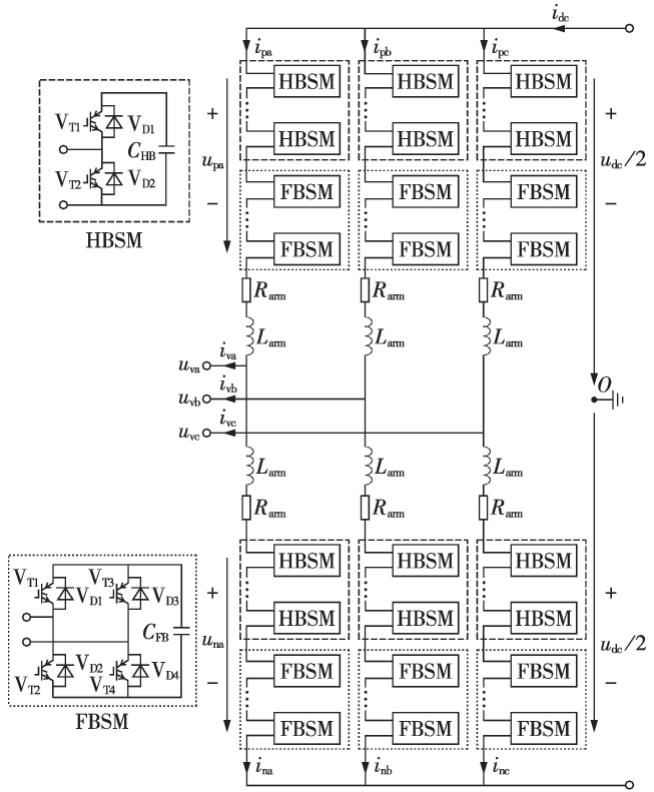  
图1 CH-MMC和子模块拓扑  
Fig.1 Topology of CH-MMC and submodules

# - 的 比例定义

设CH-MMC每个桥臂中的子模块总数为N。定义η为CH-MMC的FBSM比例，则有：

$$
\eta = \frac {N _ {\mathrm {F B}}}{N _ {\mathrm {H B}} + N _ {\mathrm {F B}}} \tag {1}
$$

正常运行时，CH-MMC与纯半桥MMC的特性几乎一致，但由于部分采用 ，因而在直流侧发生故障时能够快速阻断故障电流，且η越大，故障电流阻断能力越高。

# 2 CH-MMC快速仿真模型的实现

在实际工程中， 桥臂内子模块电容电压的不平衡程度较小，而且 和二极管的断态电阻一般远大于通态电阻。因此，本文做以下 点假设：

（） 和二极管等功率开关器件的断态电阻无穷大，相当于开路；  
（） 阀段和 阀段内部子模块的电容电压在均压策略控制下达到完全均衡，即阀段内部子模块的电容电压完全相同。

- 桥臂包含 阀段和 阀段个部分，故本节首先从子模块等效电路出发推导两阀段的等效电路，然后将两阀段的等效电路互相配合构成 - 等效模型，后续电路等效与模型推导均基于上述假设展开。

# 2.1 HBSM与FBSM等效电路

# 2.1.1 正常运行

- 正常运行时， 存在投入和切除种工作状态， 存在正投入、负投入和切除 种工作状态。为了简化调制过程，FBSM一般仅工作在正投入和切除 种状态。图 和图 分别为正常运行时 和 的工作状态与等效电路，虚线表示桥臂电流在子模块内部的流通路径。

切除状态的 如图 （）所示，无论桥臂电流是流入还是流出，都不会对子模块电容充放电，电容电压几乎没有变化；而且 $\mathrm { V } _ { \mathrm { T } 2 }$ 和 $\mathrm { V } _ { \mathrm { D } 2 }$ 的通态电阻极小， 相当于被旁路，所以正常运行时可不考虑切除状态的 。投入状态的 如图 （）所示， $\mathrm { V } _ { \mathrm { T 1 } }$ 仅具有正向导通和反向阻断作用，可等效为二极管，用 $\mathrm { V } _ { \mathrm { p r 1 } }$ 表示。由于桥臂电流对子模块电容

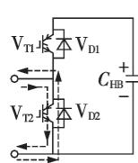  
(a)切除状态

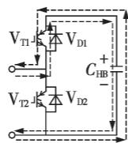  
(b)投人状态

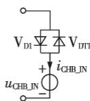  
(c)投入状态HBSM等效电路   
图2 正常运行时HBSM工作状态与等效电路  
Fig.2 Operating state and equivalent circuit of HBSM in normal operation

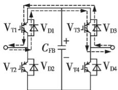  
(a)切除状态(上通道)

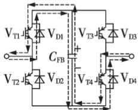  
(c)正投入状态

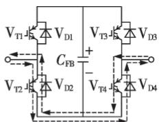  
(b)切除状态(下通道)

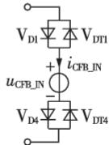  
(d)正投入状态FBSM等效电路   
图3 正常运行时FBSM工作状态与等效电路  
Fig.3 Operating state and equivalent circuit of FBSM in normal operation

的充放电作用，电容电压会不断变化，故电容 $C _ { \mathrm { H B } }$ 可等效为受控电压源，投入状态的HBSM等效电路如图 （）所示。

切除状态的FBSM如图3（a）和图3（b）所示，子模块内部电流存在 条流通路径，图 （）为上通道$\mathrm { ( V _ { D 1 } \mathrm { \Omega } \to V _ { T 3 } }$ 和 $\mathrm { \Delta V _ { D 3 } \mathrm {  V _ { T 1 } } } )$ ，图3（b）为下通道 $\mathrm { ( } \mathrm { V } _ { \mathrm { T } 2 } {  } \mathrm { V } _ { \mathrm { D } 4 }$ 和$\mathrm { V } _ { \mathrm { T 4 } } {  } \mathrm { V } _ { \mathrm { D } 2 } )$ ，为保证功率器件的开关次数平衡，上、下通道需要交替导通。切除状态的 电容电压不会变化，可只考虑正投入状态的FBSM，如图3（c）所示，其中 $\mathrm { V } _ { \mathrm { T 1 } }$ 和 $\mathrm { V } _ { \mathrm { T 4 } }$ 均相当于二极管，分别用 $\mathrm { V } _ { \mathrm { p r 1 } }$ 和$\mathrm { V } _ { \mathrm { D T 4 } }$ 表示。正投入状态的 等效电路如图 （）所示。

设t时刻流入 和 内部电容的电流分别为 $i _ { \mathrm { C H B \_ I N } } ( t )$ 和 $i _ { \mathrm { C F B \_ I N } } ( t )$ ，则在 $\Delta t$ 时间段内桥臂所有 和 电容的电荷增量分别为：

$$
\begin{array}{l} \Delta Q _ {\mathrm {H B} - \mathrm {I N}} (t) = \int_ {t} ^ {t + \Delta t} N _ {\mathrm {H B} - \mathrm {I N}} (\tau) i _ {\mathrm {C H B} - \mathrm {I N}} (\tau) \mathrm {d} \tau (2) \\ \Delta Q _ {\mathrm {F B} \text {I N}} (t) = \int_ {t} ^ {t + \Delta t} N _ {\mathrm {F B} \text {I N}} (\tau) i _ {\mathrm {C F B} \text {I N}} (\tau) \mathrm {d} \tau (3) \\ \end{array}
$$

其中， $N _ { \mathrm { H B \_ I N } }$ 和 $N _ { \mathrm { F B \_ I N } }$ 分别为正常运行时HBSM阀段和阀段内级联的子模块数。

根据假设（），在阀段内部均压策略的控制下，子模块频繁投入与切除，使电荷增量被均匀地分配到各电容上，则在 t时间段内 阀段和阀段单个电容的电压增量分别为：

$$
\Delta u _ {\mathrm {C H B} _ {\mathrm {I N}}} (t) = \frac {\Delta Q _ {\mathrm {H B} _ {\mathrm {I N}}} (t)}{N _ {\mathrm {H B}} C _ {\mathrm {H B}}} \tag {4}
$$

$$
\Delta u _ {\mathrm {C F B} _ {-} \mathrm {I N}} (t) = \frac {\Delta Q _ {\mathrm {F B} _ {-} \mathrm {I N}} (t)}{N _ {\mathrm {F B}} C _ {\mathrm {F B}}} \tag {5}
$$

则正常运行时 和 电容电压分别为：

$$
\begin{array}{l} u _ {\mathrm {C H B} _ {\mathrm {I N}}} (t) = \frac {1}{N _ {\mathrm {H B}} C _ {\mathrm {H B}}} \int_ {0} ^ {t} N _ {\mathrm {H B} _ {\mathrm {I N}}} (\tau) i _ {\mathrm {C H B} _ {\mathrm {I N}}} (\tau) \mathrm {d} \tau (6) \\ u _ {\mathrm {C F B} _ {\mathrm {I N}}} (t) = \frac {1}{N _ {\mathrm {F B}} C _ {\mathrm {F B}}} \int_ {0} ^ {t} N _ {\mathrm {F B} _ {\mathrm {I N}}} (\tau) i _ {\mathrm {C F B} _ {\mathrm {I N}}} (\tau) \mathrm {d} \tau (7) \\ \end{array}
$$

# 非正常运行

CH-MMC在发生故障或充电启动等非正常运行时，桥臂中的子模块将处于闭锁状态。图 和图 分别给出了非正常运行时HBSM和FBSM的闭锁状态与等效电路。

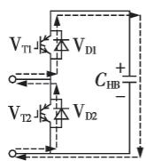  
(a)闭锁状态

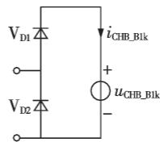  
(b)闭锁状态HBSM等效电路  
图4 非正常运行时HBSM闭锁状态与等效电路

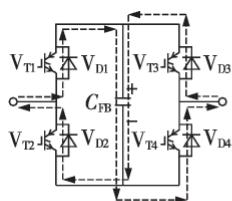  
Fig.4 Blocking state and equivalent circuit of HBSM in abnormal operation   
(a)闭锁状态

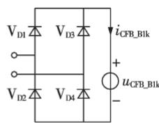  
(b)闭锁状态FBSM等效电路  
图5 非正常运行时FBSM闭锁工作状态与等效电路  
Fig.5 Blocking state and equivalent circuit of FBSM in abnormal operation

闭锁状态的HBSM如图4（a）所示， $\mathrm { V } _ { \mathrm { T 1 } }$ 和 $\mathrm { V } _ { \mathrm { T } 2 }$ 均关断，桥臂电流只能经二极管流通，而且仅有流入子模块的桥臂电流对电容充电，而流出子模块的桥臂电流直接通过二极管 $\mathrm { V } _ { \mathrm { D } 2 }$ 回流，不会改变电容电压。闭锁状态的 等效电路如图 （）所示。

闭锁状态的FBSM如图5（a）所示， $\mathrm { V _ { T 1 } - V _ { T 4 } }$ 均关断，桥臂电流只能经二极管流通，而且不论桥臂电流方向如何都会对电容充电。闭锁状态的 等效电路如图 （）所示。

类比正常运行时的推导过程，可得闭锁状态下和 电容电压分别为：

$$
u _ {\mathrm {C H B} \_ \mathrm {B l k}} (t) = \frac {1}{N _ {\mathrm {H B}} C _ {\mathrm {H B}}} \int_ {0} ^ {t} N _ {\mathrm {H B} \_ \mathrm {B l k}} (\tau) i _ {\mathrm {C H B} \_ \mathrm {B l k}} (\tau) \mathrm {d} \tau \tag {8}
$$

$$
u _ {\mathrm {C F B} \text {B l k}} (t) = \frac {1}{N _ {\mathrm {F B}} C _ {\mathrm {F B}}} \int_ {0} ^ {t} N _ {\mathrm {F B} \text {B l k}} (\tau) i _ {\mathrm {C F B} \text {B l k}} (\tau) \mathrm {d} \tau \tag {9}
$$

其中， $N _ { \mathrm { H B \_ B l k } }$ 和 $N _ { \mathrm { F B \_ B l k } }$ 分别为桥臂闭锁时的 HBSM 个数和 FBSM 个数； $i _ { \mathrm { C H B \_ B l k } }$ 和 $i _ { \mathrm { C F B \_ B l k } }$ 分别为闭锁状态下流入HBSM和FBSM内部电容的电流。

CH-MMC 实际运行时， $N _ { \mathrm { H B \_ I N } }$ 和 $N _ { \mathrm { H B \_ B l k \setminus } } N _ { \mathrm { F B \_ I N } }$ 和$N _ { \mathrm { F B \_ B l k } }$ 的具体取值如表1所示。对HBSM阀段而言，正常运行时 $N _ { \mathrm { H B \_ B l k } } { = } 0$ 而 $N _ { \mathrm { H B \_ I N } }$ 在区间 $[ 0 , N _ { \mathrm { H B } } ]$ 内变化；闭锁时 $N _ { \mathrm { H B \_ I N } } { = } 0$ 而 $N _ { \mathrm { H B \_ B l k } } { = } N _ { \mathrm { H B } }$ 。即 $N _ { \mathrm { H B \_ I N } }$ 和 $N _ { \mathrm { H B \_ B l k } }$ 中必然有 个等于 ，并且对 阀段可以得到类似结论。因此，综合考虑正常运行和闭锁状态的和 电容电压可分别表示为：

$$
\begin{array}{l} u _ {\mathrm {C H B}} (t) = u _ {\mathrm {C H B} _ {\mathrm {I N}}} (t) + u _ {\mathrm {C H B} _ {\mathrm {B l k}}} (t) = \frac {1}{N _ {\mathrm {H B}} C _ {\mathrm {H B}}} \times \\ \int_ {0} ^ {t} \left(N _ {\mathrm {H B} _ {-} \mathrm {I N}} (\tau) i _ {\mathrm {C H B} _ {-} \mathrm {I N}} (\tau) + N _ {\mathrm {H B} _ {-} \mathrm {B l k}} (\tau) i _ {\mathrm {C H B} _ {-} \mathrm {B l k}} (\tau)\right) \mathrm {d} \tau \tag {10} \\ \end{array}
$$

$$
\begin{array}{l} u _ {\mathrm {C F B}} (t) = u _ {\mathrm {C F B} _ {\mathrm {I N}}} (t) + u _ {\mathrm {C F B} _ {\mathrm {B l k}}} (t) = \frac {1}{N _ {\mathrm {F B}} C _ {\mathrm {F B}}} \times \\ \int_ {0} ^ {t} \left(N _ {\mathrm {F B} _ {-} \mathrm {I N}} (\tau) i _ {\mathrm {C F B} _ {-} \mathrm {I N}} (\tau) + N _ {\mathrm {F B} _ {-} \mathrm {B l k}} (\tau) i _ {\mathrm {C F B} _ {-} \mathrm {B l k}} (\tau)\right) \mathrm {d} \tau \tag {11} \\ \end{array}
$$

表1 不同状态下的级联子模块数  
Table 1 Number of cascaded submodules in different states   

<table><tr><td rowspan="2">状态</td><td colspan="2">HBSM阀段</td><td colspan="2">FBSM阀段</td></tr><tr><td>\(N_{\text{HB\_IN}}\)</td><td>\(N_{\text{HB\_Blk}}\)</td><td>\(N_{\text{FB\_IN}}\)</td><td>\(N_{\text{FB\_Blk}}\)</td></tr><tr><td>正常运行</td><td>[0,NHB]</td><td>0</td><td>[0,NFB]</td><td>0</td></tr><tr><td>闭锁</td><td>0</td><td>\(N_{\text{HB}}\)</td><td>0</td><td>\(N_{\text{FB}}\)</td></tr></table>

# 阀段与 阀段等效电路

在任一时刻， 阀段和 阀段内部实际级联的子模块总具有相同的工作状态，因此可用单个子模块的等效电路对应阀段的等效电路。阀段受控电压源可由阀段内全部实际级联子模块的受控电压源叠加，阀段通态电阻等于阀段内全部实际级联子模块通态电阻之和。

阀段在正常运行与闭锁时的等效电路如图 6 所示。图中， $u _ { \mathrm { H B \_ I N } }$ 和 $u _ { \mathrm { H B \_ B l k } }$ 分别为 HBSM 阀段在正常运行与闭锁状态下的等效电压： $R _ { \mathrm { H B 1 } }$ 和 $R _ { \mathrm { H B } 2 }$ 、$R _ { \mathrm { H B 1 } } ^ { ' }$ 和 $R _ { \mathrm { H B } 2 } ^ { ' }$ 分别为 HBSM 阀段在正常运行与闭锁状态下的通态电阻，具体计算表达式见式（ ）—（ ）。

$$
\left\{ \begin{array}{l} u _ {\mathrm {H B} _ {\mathrm {I N}}} (t) = N _ {\mathrm {H B} _ {\mathrm {I N}}} u _ {\mathrm {C H B}} (t) \\ u _ {\mathrm {H B} _ {\mathrm {B l k}}} (t) = N _ {\mathrm {H B} _ {\mathrm {B l k}}} u _ {\mathrm {C H B}} (t) \end{array} \right. \tag {12}
$$

$$
\left\{ \begin{array}{l} R _ {\mathrm {H B 1}} = N _ {\mathrm {H B} _ {\mathrm {I N}}} R _ {\mathrm {D}} + \left(N _ {\mathrm {H B}} - N _ {\mathrm {H B} _ {\mathrm {I N}}}\right) R _ {\mathrm {T}} \\ R _ {\mathrm {H B 2}} = N _ {\mathrm {H B} _ {\mathrm {I N}}} R _ {\mathrm {T}} + \left(N _ {\mathrm {H B}} - N _ {\mathrm {H B} _ {\mathrm {I N}}}\right) R _ {\mathrm {D}} \end{array} \right. \tag {13}
$$

$$
R _ {\mathrm {H B 1}} ^ {\prime} = R _ {\mathrm {H B 2}} ^ {\prime} = N _ {\mathrm {H B \_ B l k}} R _ {\mathrm {D}} \tag {14}
$$

其中， $R _ { \mathrm { T } }$ 和 $R _ { \mathrm { D } }$ 分别为 和二极管的通态电阻。

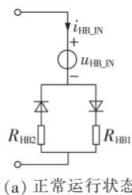

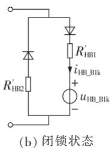  
图6 HBSM阀段等效电路  
Fig.6 Equivalent circuit of HBSM valve segment

阀段在正常运行与闭锁时的等效电路如图7所示。图中， $u _ { \mathrm { F B \_ I N } }$ 和 $u _ { \mathrm { F B \_ B l k } }$ 分别为FBSM阀段在正常运行与闭锁状态下的等效电压； $| R _ { \mathrm { F B 1 } }$ 和 $R _ { \mathrm { F B } 2 } \setminus R _ { \mathrm { F B } 1 } ^ { ' }$

和 $R _ { \mathrm { F B } 2 } ^ { \prime }$ 分别为 FBSM 阀段在正常运行与闭锁状态下的通态电阻，具体计算表达式见式（15）—（17）。

$$
\left\{ \begin{array}{l} u _ {\mathrm {F B} _ {- \mathrm {I N}}} (t) = N _ {\mathrm {F B} _ {- \mathrm {I N}}} u _ {\mathrm {C F B}} (t) \\ u _ {\mathrm {F B} _ {- \mathrm {B l k}}} (t) = N _ {\mathrm {F B} _ {- \mathrm {B l k}}} u _ {\mathrm {C F B}} (t) \end{array} \right. \tag {15}
$$

$$
\left\{ \begin{array}{l} R _ {\mathrm {F B 1}} = \left(N _ {\mathrm {F B}} + N _ {\mathrm {F B} _ {-} \mathrm {I N}}\right) R _ {\mathrm {D}} + \left(N _ {\mathrm {F B}} - N _ {\mathrm {F B} _ {-} \mathrm {I N}}\right) R _ {\mathrm {T}} \\ R _ {\mathrm {F B 2}} = \left(N _ {\mathrm {F B}} + N _ {\mathrm {F B} _ {-} \mathrm {I N}}\right) R _ {\mathrm {T}} + \left(N _ {\mathrm {F B}} - N _ {\mathrm {F B} _ {-} \mathrm {I N}}\right) R _ {\mathrm {D}} \end{array} \right. \tag {16}
$$

$$
R _ {\mathrm {F B 1}} ^ {\prime} = R _ {\mathrm {F B 2}} ^ {\prime} = 2 N _ {\mathrm {F B _ {B L}}} R _ {\mathrm {D}} \tag {17}
$$

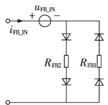  
(a)正常运行状态

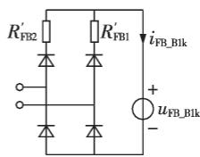  
(b)闭锁状态   
图7 FBSM阀段等效电路  
Fig.7 Equivalent circuit of FBSM valve segment

# 2.3 CH-MMC快速仿真模型

为模拟桥臂在任何时刻的状态，需要分别建立阀段和 阀段的全状态等效模型。根据前文分析可知，正常运行（包括子模块投入和切除）和闭锁是 种互斥的工作状态，因此可以直接将阀段正常运行等效电路和闭锁等效电路串联形成阀段全状态等效模型，任何时刻只有一个等效电路工作，另一个等效电路处于短路状态。但这种做法会使得全状态等效模型比较冗杂，不够简化。为提高模型中元件的复用率，将 种互斥工作状态下的等效电路进一步融合，即可得到 - 的快速仿真模型，如图 所示。图中 阀段和 阀段的受控电压源控制信号分别由式（ ）和式（ ）给出，等效通态电阻 $R _ { \mathrm { H B \_ E q } i }$ 和 $R _ { \mathrm { F B \_ E q } i } ( i = 1 , 2 )$ 分别由式（18）和式

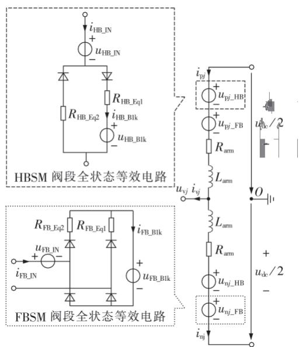  
图8 CH-MMC快速仿真模型  
Fig.8 Efficient simulation model of CH-MMC

（19）给出。

$$
R _ {\mathrm {H B} - \mathrm {E q i}} = \left\{ \begin{array}{l l} R _ {\mathrm {H B i}} & \text {正 常 运 行} \\ R _ {\mathrm {H B i}} ^ {\prime} & \text {闭 锁 状 态} \end{array} \quad i = 1, 2 \right. \tag {18}
$$

$$
R _ {\mathrm {F B} \_ \text {E q i}} = \left\{ \begin{array}{l l} R _ {\mathrm {F B i}} & \text {正 常 运 行} \\ R _ {\mathrm {F B i}} ^ {\prime} & \text {闭 锁 状 态} \end{array} \quad i = 1, 2 \right. \tag {19}
$$

# 3 CH-MMC快速仿真模型控制策略

# 阀级控制

- 快速仿真模型的控制策略与详细模型相比基本相同，仅在阀级控制上存在差异。CH-快速仿真模型阀级控制流程如附录 中图所示，主要包括阀段间均压控制和等效受控电压源控制信号生成2个关键部分。

# 阀段间均压控制

- 内部同时存在 阀段和 阀段。因此，在详细模型的均压控制中，除考虑阀段内部子模块电容电压均衡外，还须保证各阀段间的电容电压相对均衡。根据假设（）， - 快速仿真模型不存在阀段内部子模块电容均压问题，仅需保证阀段间电容电压的基本均衡。

因此，提出一种适用于本文 - 快速仿真模型的阀段间均压控制策略，具体原理如下：比较HBSM阀段和FBSM阀段子模块电压 $u _ { \mathrm { C H B } }$ 和 $u _ { \mathrm { C F B } }$ 的大小，并参考桥臂电流 $i _ { \mathrm { a r m } }$ 的方向，将调制环节给出的本控制周期单支桥臂应投入的总子模块数 $N _ { \mathrm { o n } }$ 分配到HBSM阀段和FBSM阀段，同时满足各阀段自身子模块总数的限制。该策略详细原理与运行流程如附录 中图 上部虚线框中所示。

# 3.1.2 等效受控电压源控制信号生成

均压控制环节已经给出各阀段在每一控制周期应投入或闭锁的子模块个数，再采集 - 快速仿真模型中电流 $i _ { \mathrm { H B \_ I N } }$ 和 $i _ { \mathrm { H B \_ B l k } } \setminus i _ { \mathrm { F B \_ I N } }$ 和 $i _ { \mathrm { F B \_ B l k } }$ 的数值并输入控制信号生成模块，即可得到 - 快速仿真模型中各等效受控电压源的控制信号，如附录中图 下部虚线框中所示。

# 充电启动控制

与纯半桥 不同， - 在充电启动阶段子模块触发电路存在自取能失败的问题，为此文献［ ］将 - 充电过程分为以下 个子阶段。

（1）不控充电阶段：所有HBSM和FBSM闭锁。  
（）半控充电阶段 ：所有 切除，所有SM闭锁。  
（）半控充电阶段 ：所有 半闭锁，所有闭锁。

若考虑所有 和 解锁后的充电过程，还应补充第 个阶段：全控充电阶段。该充电策略的具体实施条件和方法可参考文献［ ］，在此不再

赘述。充电过程中，FBSM除了切除、正投入和闭锁3种状态外，还存在半闭锁状态。本文虽然没有给出FBSM的半闭锁状态，但可用闭锁和切除2种状态并结合桥臂电流 $i _ { \mathrm { a r m } }$ 的方向来等效，即：

$$
\mathrm {F H S M} \text {半 闭 锁} \Leftrightarrow \left\{ \begin{array}{l l} \mathrm {F H S M} \text {闭 锁} & i _ {\mathrm {a r m}} \geqslant 0 \\ \mathrm {F H S M} \text {切 除} & i _ {\mathrm {a r m}} <   0 \end{array} \right.
$$

# 4 仿真验证

在MTALB／Simulink中分别搭建基于详细模型和本文所提快速模型的 电平双端 - 系统，具体结构如附录 中图 所示。文献［ ］表明当与 构成 - 时，桥臂中的 比例不能低于 。因此，不妨设图 所给 -桥臂中 和 各 个。两端换流器均采用矢量控制，整流侧为定直流电压和无功功率方式，逆变侧为定有功功率和无功功率方式，仿真系统主要参数如附录 中表 所示。

# 充电启动控制

基于上述仿真系统，对整流侧CH-MMC 进行充电启动控制，并将文献［ ］中的充电策略分别应用到 - 详细模型和快速仿真模型，附录 中图（）、 （）分别给出了详细模型和快速模型的子模块电容电压和充电电流波形。

时合交流进线开关，开始不控充电，稳态时电压约为 电压的一半； 时进入半控充电阶段 ， 电压快速上升， 电压基本保持不变，当HBSM电压上升至FBSM电压时（大约为），半控充电阶段 结束，进入半控充电阶段 ；在半控充电阶段2，2种子模块的电压基本相等且再次缓慢上升，并在 时切除限流电阻； 时解锁全部子模块，进入全控充电阶段，子模块电压逐渐上升到额定电压水平。

可以看出，种模型的子模块电容电压变化曲线除维数上的差异外，其他变化规律基本完全相同；而且 种模型的交流侧 $\mathrm { P C C } _ { 1 }$ 处充电电流基本相同，整个充电过程充电电流都不超过 ，不存在太大的冲击电流。

# 恒定功率运行

设整流侧换流器 - 的直流电压为kV、无功功率为 100 Mvar，逆变侧换流器 CH-MMC的有功功率为 、无功功率为 。详细模型和快速仿真模型的恒定功率运行仿真结果对比如附录 中图 所示，图中灰色曲线和黑色曲线分别表示详细模型和快速仿真模型各电气量，并用下标 和 区分。

图 分别从 - 交流侧出口三相电压和电流、直流侧电压和电流， $\mathrm { C H - M M C } _ { 2 }$ 交流侧输出有功和无功功率、 相上桥臂子模块电容电压、 相上

下桥臂电流多个方面展示了详细模型和快速仿真模型的稳态运行特性。通过对比可以发现，快速仿真模型能够按给定的控制参数平稳运行，并且除子模块电容电压维数外，各电气量变化曲线与详细模型仿真结果基本一致。

# 4.3 故障及恢复过程

设两侧换流器的初始工况与上述恒定功率运行阶段相同，运行至 t=5.1 s时，发生暂时性（持续时间50 ms）直流双极短路故障，故障点位于架空线中点，短路电阻为 ；考虑故障识别以及通信延时，故障后1 ms两侧换流器闭锁；t=5.2 s时解锁CH-MMC恢复直流电压；t 时解锁 - 并逐渐恢复传输功率，功率变化率分别为 P／ t ／ ，$\mathrm { d } Q / \mathrm { d } t { = } 1 0 0 0 \mathrm { M v a r } / \mathrm { s } _ { \odot }$ 。详细模型和快速模型的故障及恢复过程仿真结果对比如附录A中图A5所示，同样图中灰色曲线和黑色曲线分别表示详细模型和快速模型各电气量，并用下标 和 区分。

由图A5可知，CH-MMC 交流侧输出电压和电流在故障期间发生畸变，换流器闭锁期间交流电流基本为 ；直流侧电压骤降而直流电流迅速上升至原来的 倍，换流器闭锁后短路电流很快衰减为$0 { ; } \mathrm { C H - M M C } _ { 2 }$ 输出有功和无功功率解锁后开始上升，并逐渐恢复到故障前水平； 相上桥臂 电容电压在闭锁后基本不变，而 电容在闭锁后被短暂充电，随后维持电压基本恒定，解锁后所有子模块电压逐渐均衡； 相上、下桥臂电流故障后同样发生畸变，闭锁期间基本为0。对比2种模型的各电气量变化曲线可知，快速仿真模型子模块电容电压曲线基本位于详细模型子模块电容电压曲线簇的中部，吻合度较高；而 种模型的其他各电气量变化曲线基本重合，误差较小。

# 仿真提速效果

为进一步研究本文所提 - 快速仿真模型对实际仿真速度的提升效果，在不改变仿真系统控制参数和桥臂子模块比例的前提下，更改桥臂内总的子模块数，并与详细模型仿真结果对比。仿真平台硬件参数为：处理器 Intel Corei5-8400@2.80 GHz，内存 。软件参数为：操作系统（ ），仿真软件 。采用定步长（ ）方式逐次仿真，记录 种模型进行 电磁暂态仿真实际所用时间，结果见附录 中图 。

由图 可知，详细模型仿真实际用时随桥臂子模块数的增加而急剧上升，近似成二次函数关系。当桥臂含有 个子模块时，仿真 的实际用时为（约 ），对于更高电平数的换流器，仿真实际耗时将更加严重，甚至会因内存开销过大而无法继续进行。同时可以看到，快速仿真模型仿真实际用时约 ，并且随着子模块数增加，

实际用时增加的趋势基本可以忽略。

# 5 结论

（1）针对半桥-全桥型CH-MMC电磁暂态仿真复杂度较高的问题，以HBSM与FBSM等效电路和子模块电容电量均分为出发点，导出HBSM和FBSM阀段等效电路以及 - 快速仿真模型。  
（）在该快速仿真模型基础上提出一种阀段间均压控制策略，阀段间电容电压得到有效均衡；同时实现了三段式充电过程，子模块电容电压可成功上升到额定值。  
（）分别从充电启动控制、恒定功率运行、故障及恢复过程和仿真提速效果 4 个角度对比展示了CH-MMC详细模型与快速仿真模型的仿真特性，结果表明后者具有较高的准确性且仿真速度较快，在不考虑 - 子模块离散性时，可应用于大规模交直流混联电网仿真中。

附录见本刊网络版（http：∥www.epae.cn）。

# 参考文献：

［1］ DEKKA A，WU B，FUENTES R L. Evolution of topologies，modeling，control schemes，and applications of modular mul-tilevel converters［J］. IEEE Journal of Emerging and SelectedTopics in Power Electronics，2017，5（4）：1631-1656.  
［ ］王宇，刘崇茹，李庚银 基于 的模块化多电平换流器实时仿真建模与硬件在环实验［］ 中国电机工程学报， ，（ ）： -  
WANG Yu,LIU Chongru,LI Gengyin.FPGA-based real-timemodeling of modular multilevel converters and hardware-in-- ［］ ， ，（ ）：3912-3920.  
［ ］管敏渊，徐政 型柔性直流输电系统无源网络供电的直接电压控制［J］. 电力自动化设备，2012，32（12）：1-5.  
GUAN Minyuan，XU Zheng. Direct voltage control of MMCbased VSC-HVDC system for passive networks［J］. Electric Power Automation Equipment，2012，32（12）：1-5.   
［ ］林环城，王志新 基于模型预测控制的模块化多电平变流器桥臂能量控制策略［］ 电力自动化设备， ，（）： -  
LIN Huancheng，WANG Zhixin. Arm energy control strategy of modular multilevel converter based on model predictive control［J］. Electric Power Automation Equipment，2018，38（4）： 44-51.   
［ ］辛业春，王威儒，李国庆，等 基于桥臂电流直接控制的模块化多电平换流器控制策略［］ 电力自动化设备， ， （ ）：115-120.  
XIN Yechun,WANG Weiru,LI Guoqing,et al. Control strategy of modular multilevel converter based on arm current di⁃ rect control[J]．Electric Power Automation Equipment,2018, （ ）： -   
［ ］阳莉汶，江伟，王渝红，等 具有直流故障阻断能力的电容嵌位子模块拓扑及其特性[I]．电力自动化设备，2017,37（12)：172-177.  
YANG Liwen,JIANG Wei,WANG Yuhong,et al. Capacitorembedded submodule topology with DC fault blocking capability and its characteristics［J］. Electric Power Automation Equipment,2017,37(12):172-177.

［ ］龚文明，朱喆，黄润鸿，等 半桥-全桥混合型柔性直流输电系统实时仿真技术研究［］ 南方电网技术， ，（ ）： -GONG Wenming，ZHU Zhe，HUANG Runhong，et al. Researchon real-time simulation technology of a half and full bridgehybrid MMC-HVDC system［J］. Southern Power System Tech⁃， ，（ ）： -  
［8］郭贤珊，周杨，梅念，等. 张北柔直电网的构建与特性分析［J］.电网技术， ，（ ）： -GUO Xianshan，ZHOU Yang，MEI Nian，et al. Construction andcharacteristic analysis of Zhangbei flexible DC grid［J］. Power， ，（ ）： -  
［9］GNANARATHNA U N，GOLE A M，JAYASINGHE R P. Effi-cient modeling of Modular Multilevel HVDC Converters(MMC)on electromagnetic transient simulation programs［J］. IEEETransactions on Power Delivery，2011，26（1）：316-324．  
［ ］许建中，赵成勇， ．模块化多电平换流器戴维南等效整体建模方法［］．中国电机工程学报， ，（）： -1929．XU Jianzhong，ZHAO Chengyong，GOLE A M. Research on theThévenin’s equivalent based integral modelling method ofthe modular multilevel converter［J］. Proceedings of the CSEE，2015，35（8）：1919-1929  
［11］徐东旭，刘崇茹，王洁聪，等 . 钳位双子模块型 MMC 的电磁暂态等效模型［］ 电网技术， ，（ ）： -XU Dongxu，LIU Chongru，WANG Jiecong，et al. Equivalentelectromagnetic transient model of CDSM-MMC［J］. Power Sys-， ，（ ）： -  
［ ］赵禹辰，徐义良，赵成勇，等 单端口子模块 电磁暂态通用等效建模方法［］ 中国电机工程学报， ，（ ）： -4667.ZHAO Yucheng,XU Yiliang,ZHAO Chengyong,et al. Genera-lized ElectroMagnetic Transien（t EMT） equivalent modeling ofMMCs with arbitrary single-port sub-module structures［J］. Pro-ceedings of the CSEE，2018，38（16）：4658-4667.  
［ ］徐义良，赵成勇，赵禹辰，等 双端口子模块 电磁暂态通用等效建模方法［］ 中国电机工程学报， ，（ ）： -6090.XU Yiliang，ZHAO Chengyong，ZHAO Yuchen，et al. Genera-

lized ElectroMagnetic Transient（EMT） equivalent modeling of MMCs with arbitrary two-port sub-module structures［J］. Pro⁃ ceedings of the CSEE,2018,38(20):6079-6090.   
［14］ XU J，ZHAO C，LIU W，et al. Accelerated model of modularmultilevel converters in PSCAD／EMTDC［J］. IEEE Tran-sactions on Power Delivery，2013，28（1）：129-136.  
［15］ AHMED N，ANGQUIST L，NORRGA S，et al. A computationally efficient continuous model for the modular multilevel converter［J］. IEEE Journal of Emerging and Selected Topics in Power Electronics,2014,2(4):1139-1148.   
［ ］管敏渊，徐政 模块化多电平换流器的快速电磁暂态仿真方法［］ 电力自动化设备， ，（）： -GUAN Minyuan，XU Zheng． Fast electro-magnetic transientsimulation method for modular multilevel converter［J］. Elec⁃tric Power Automation Equipment,2012,32(6):36-40.  
［ ］丁久东，卢宇，董云龙，等 半桥和全桥子模块混合型换流器的充电策略［］ 电力系统自动化， ，（）： -DING Jiudong，LU Yu，DONG Yunlong，et al. Charging strate⁃gies for hybrid converters based on half-bridge sub-moduleand full-bridge sub-module[J]．Automation of Electric PowerSystems，2018，42（7）：71-75.  
[18]XU J Z,ZHAO P H,ZHAO C Y.Reliability analysis andredundancy configuration of MMC with hybrid submoduletopologies［J］. IEEE Transactions on Power Electronics，2015，（）： -

# 作者简介：

  
苟 鑫

苟 鑫（ —），男，四川广元人，硕士研究生，主要研究方向为新能源发电并网、柔性直流输电技术（E-mail：gouxinmail@163.com）；

卢继平（ —），男，北京人，教授，博士研究生导师，主要研究方向为电力系统继电保护（E-mail：lujiping@cqu.edu.cn）；

刘加林（ —），男，河北石家庄人，

博士研究生，主要研究方向为电力系统暂态稳定（E-mail：liujialin@cqu.edu.cn）。

# Efficient electromagnetic transient simulation model of CH-MMC for AC-DC hybrid grid

GOU Xin，LU Jiping，LIU Jialin，SHI Jiawei，LI Zheng

（State Key Laboratory of Power Transmission Equipment & System Security and New Technology， Chongqing University，Chongqing 400044，China）

Abstract：Aiming at the large-scale and long-time calculation existing in the electromagnetic transient simu⁃ lation for the detailed model of CH-MMC（Cell-Hybrid Modular Multilevel Converter） applied in AC-DC hy⁃ brid grid，an efficient simulation model of CH-MMC based on charge equalization of submodule capacitors is proposed. The equivalent circuits of the half-bridge and full-bridge submodules in normal and blocking states are analyzed respectively. Based on the numbers of half-bridge and full-bridge submodules in normal and blocking states，the equivalent circuits of half-bridge and full-bridge valve segments and the efficient simulation model of CH-MMC are derived. Furthermore，a voltage balancing method is proposed based on the proposed model，and the three-stage charging strategy is realized. Compared with the detailed model based on MATLAB／Simulink，accuracy and efficiency of the proposed model are validated by simulative results.

Key words：AC-DC hybrid grid；cell-hybrid modular multilevel converter；charge equalization of sub-module capacitors；efficient electromagnetic transient simulation model；voltage balancing between valve segments； charging start；transient analysis