# IMPROVED CONTROL SYSTEMS SIMULATION IN THE EMTP THROUGH COMPENSATION

S. Lefebvre (Member) and J. Mahseredjian (Member)

Hydro-Québec, IREQ

Direction Technologie de réseaux

Varennes, Quebec, Canada

ABSTRACT: The control systems, devices and phenomena modelled in TACS, and the electric network modeled in EMTP are solved separately with one-time-step error at the interface. This provides an efficient time-step solution, but there can be numerical stability and accuracy problems associated with the one-time-step error. This paper shows a technique which can eliminate the time delay, without having to use a simultaneous EMTP and TACS solution.

Keywords : EMTP, compensation, power electronics

# 1. INTRODUCTION

TACS is a section of the EMTP which allows the representation of control systems in block-diagram form. It has been used to model the control of converters, FACTS and static VAR devices, excitation systems of synchronous generators, dynamic load characteristics, etc. [1-2]

It is well known that there is a one step time delay between TACS and EMTP variables. There are many cases where such delay do not cause any trouble: fast transients in the network - slow transients in the control system. However, many examples can be created where the time delay results either in numerical instability or wrong results. An example of numerical instability is the simulation of the arc behavior in a circuit breaker (resistance simulation through a current injection), while wrong results will be obtained in some power electronic circuits due to the delay of the trigger orders from TACS.

The information used by EMTP to advance to time $t$ is based on the TACS solution $\mathbf{T}_{\mathrm{out}}$ for time $t - \Delta T$ , where $\Delta T$ is the step size. Based on the network solution $\mathbf{E}_{\mathrm{in}}$ at time $t$ , TACS computes its outputs. This is shown in Figure 1.

The concept of separate EMTP and TACS simulation is the result of preserving solution efficiency, and as much as possible modularity. The TACS solution is simultaneous for linear blocks, and sequential for nonlinear blocks or functions. The TACS equations are sparse but unsymmetrical. There are no iterations during

94 WM 084-4 PWRD A paper recommended and approved by the IEEE Transmission and Distribution Committee of the IEEE Power Engineering Society for presentation at the IEEE/PES 1994 Winter Meeting, New York, New York, January 30 - February 3, 1994. Manuscript submitted July 21, 1993; made available for printing November 29, 1993.

the solution, rather the equations are ordered in such a way as to minimize any time delays that need to be introduced in loops involving nonlinear blocks. When there is freedom, the equations are then ordered to minimize fill-ins during the factorizations. Row Gaussian Elimination is used to solve the equations in the time step loop.

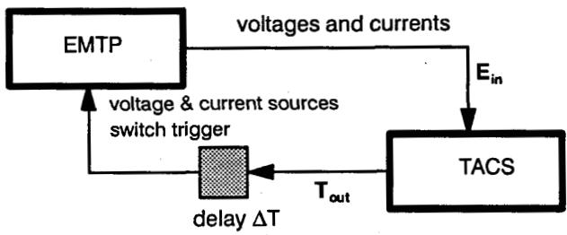  
Figure 1 Solution sequence

TACS outputs to the EMTP may be in fact one or more time steps late because there are internal time delays in the TACS solution. The internal TACS time delays can often be minimized or compensated with proper control modelling. They may affect the accuracy or stability of the TACS solution, but have less impact on the EMTP-TACS interface stability. The one-time-step error at this interface can have a strong impact on the network solution. Selecting a smaller step size may sometimes be sufficient, but no simple general rule can be given to manage time delay errors though. There are even cases where irrespective of the step size, the solution is numerically unstable. This paper then does not concentrate on the internal time delays in TACS, but rather on the EMTP-TACS interface one-time-step error.

The purpose of this paper is to demonstrate the application of the compensation method to eliminate the one-time-step error, without having to have a simultaneous EMTP-TACS solution. This is an extension of the compensation technique used in EMTP for the solution of true nonlinear elements. [3]

# 2. BASIC ALGORITHMS

# EMTP solution

The EMTP is a nodal analysis program based on the fixed time-step trapezoidal integration method. Considering only linear elements, discretized network

0885-8977/94/$04.00 © 1994 IEEE

equations are given by $\mathbf{Y}_n\mathbf{V}_n = \mathbf{I}_n - \mathbf{I}_n$ ,where $\mathbf{Y}_{\mathfrak{n}}$ is the symmetrical nodal admittance matrix, $\mathbf{V}_{\mathfrak{n}}$ is the node to ground voltage vector while $\mathbf{I}_{\mathfrak{n}}$ and $\mathbf{I}_{\mathfrak{n}}$ represents respectively node current injections including current sources and 'past history' terms. For convenience in notation, assume that the impact of known voltage sources is merged with the history terms. The symmetric admittance matrix is triangularized, and the time step solution is obtained, without iteration, with forward-backward substitution. When the computation of the voltages is completed, then all history terms are updated for usage at the next time step.

Before the triangularization, it is important to order the equations in a way that will minimize the fill-ins.

There are relatively few nonlinear elements in the network, and the EMTP uses an efficient scheme for their solution that does not penalize the large linear network solution. The first manner to handle nonlinear elements is to use pseudo-nonlinearities, i.e. assume one time-step delay. This is prone to numerical difficulties. The second manner is to consider true nonlinear elements whose solution is superimposed on the solution of the linear network. This is known as the compensation method, and requires iterations within the nonlinear elements.

# TACS solution

While the non-control equipment is modeled by EMTP devices, TACS is used to model the controls on these devices, or controlled voltage-current sources. A typical example is valves in power electronic circuits which can be directly modeled in the EMTP as switch-components and incorporated into the $\mathbf{Y}_{\mathfrak{n}}$ matrix. The switches close after the anode voltage becomes larger than the cathode voltage, as soon as a firing signal is received from TACS. The switches open as soon as the current goes through zero from a positive value. Re-triangularization is performed whenever there is a topological change in the network.

As for the network, the control systems are a mixture of linear and nonlinear elements, however the proportion of nonlinear elements in TACS is typically much higher in TACS than in EMTP. In order to preserve solution speed, the TACS solution is non iterative but introduces internal TACS time delays to take into account nonlinear components of the control circuit. This is a pseudo-nonlinear representation, but not all nonlinear components require individual time delays though. For example series nonlinearities in a loop do not have cumulative internal time delays, but only one, while some topologies can be solved without time delays[4]. If everything were linear, it would be trivial to obtain a simultaneous solution, but this is not the case in general. Because of the sequencing on nonlinear components,

and because the TACS matrices are unsymmetrical, a time-step delay exists between EMTP and TACS, (Figure 1) such that independent solutions can be carried out. The pseudo-nonlinear non iterative TACS solution has been traditionally preferred over a TACS simultaneous nonlinear formulation.

The TACS matrices are unsymmetrical, triangularization yields two distinct upper and lower matrices. Because there are typically several nonlinearities in a control system, the TACS solution is not as simple as triangularization separate of the time-step loop, and a forward-backward substitution in the time-step loop. As in the EMTP, it is necessary to distinguish linear components (explicitly declared transfer functions) from the nonlinearities. Nonlinearities in TACS context, include supplemental pseudo-FORTRAN expressions which may express a linear relationship between variables.

Before entering the time-step loop, all TACS transfer functions in the s-domain are converted into algebraic difference equations in the time domain through the trapezoidal rule of integration. These equations can be written as $\mathbf{A}\mathbf{X} = \mathbf{b}$ , where $\mathbf{A}$ is nxn and non symmetric, this is shown in Figure 2 (history terms merged on the RHS). Basically, after a simultaneous solution of the linear components is obtained, then, all supplemental devices are sequentially taken into account in a manner that reduces the internal time delays, without iterations.

Figure 2 TACS simultaneous solution of linear components   
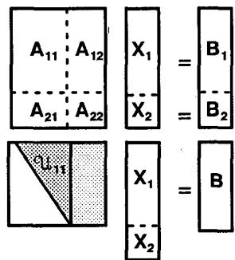  
$\mathbf{X}_1$ : unknown   
$\mathbf{X}_2$ : known sources or variables

Triangularization of the matrix $\mathbf{A}$ is performed once, then at each time step the unknown variables are found by a forward substitution on $\mathbf{B}$ , followed by back-substitution to obtain the state variables $\mathbf{X}$ . The back-substitution process is interrupted, as needed, to update the supplemental variables whenever possible. That is, when TACS does the back-substitution to solve for the output of linear components, then TACS checks the link list for outputs driving supplemental variables or devices. If any, then TACS updates the relevant supplemental variables or devices.

Ordering techniques completely differ from that of EMTP. Loops containing only function blocks are not

sensitive to the ordering. In fact, if there is at most one limiter present, the internal TACS solution is simultaneous. In most cases however, the correct ordering of all TACS variables, except the sources, is crucial for reducing the internal TACS time delays and for getting as accurate results as possible without iterations. It is not simply a matter of reducing the fill-ins. Ordering is thus used to minimize the number of internal TACS time delays (prioritized over fill-ins in the triangularization), to keep the number of operations in the time-step loop as low as possible and, together with sparsity storage, to reduce the size of the memory for storing the triangularized matrices.

# 3. SIMULTANEOUS EMTP-TACS SOLUTION

The strategy has always been to solve EMTP and TACS separately, and with one-time-step delay, as introduced in Figure 1. This delay can create numerical instabilities, as documented in the Applications section. The internal TACS time delays may also create numerical difficulties, but the focus is not on those.

Solving the models represented in TACS simultaneously with the EMTP network is more complicated for models of power system components because the TACS matrices are unsymmetrical and there is a TACS sequential solution of nonlinear components which is closely interleaved with the solution of the linear elements themselves.

Different techniques can eliminate the one-time-step error.

# Predictor-corrector [3]

In solving EMTP for time $t$ , use predicted TACS values for time $t$ . Then use the EMTP solution to correct the TACS output at time $t$ . Repeat until convergence. In principle this is easy to implement, but the convergence characteristics are very dependent on the accuracy of the prediction. Furthermore, the entire EMTP network has to be solved repeatedly at one time step.

# EMTP and TACS equivalents

Assume for simplicity (this restriction is for the sake of clarity only), that TACS needs $\mathbf{E}_{\mathrm{in}}$ from the EMTP, and provides the current $\mathbf{l}_{\mathrm{out}}$ . In the equivalent--approach, the TACS equations are reduced through partial factorization to a factorized set of internal TACS variables $\mathbf{X}$ , and an external set of variables involving the EMTP voltages $\mathbf{E}_{\mathrm{in}}$ ( $\mathbf{X}_2$ in Figure 2) and the TACS-generated currents $\mathbf{l}_{\mathrm{out}}$ . Similarly the EMTP equations are triangularized only in their upper part. This is shown in Figure 3, after factorization (history terms merged in $\mathbf{B}_1$ , $\mathbf{B}_2$ and $\mathbf{B}_3$ ), with $\mathbf{G} = [\mathbf{G}_{11}, \mathbf{G}_{12}]$ .

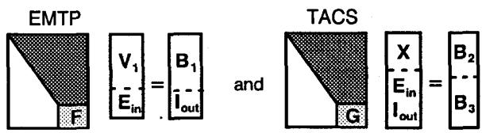  
Figure 3 EMTP-TACS internal-external formulation

The matrices $\mathbf{F}$ and $\mathbf{G}$ represent exact equivalent models involving only the external variables. To obtain a simultaneous EMTP-TACS solution, first solve for the interface variables through the reduced set of equations involving external variables:

$$
\left[ \begin{array}{l l} F & - g \\ G _ {1 1} & G _ {1 2} \end{array} \right] \left[ \begin{array}{l} E _ {\text {i n}} \\ I _ {\text {o u t}} \end{array} \right] = \left[ \begin{array}{l} 0 \\ B _ {3} \end{array} \right] \tag {1}
$$

where $\mathfrak{g}$ is the identity matrix. Next, perform substitution to get the remaining internal EMTP and TACS variables. Then history terms are updated for the next time step. In general, the external variables will not be solved without iterations. Since most control systems are nonlinear, implementation is not trivial since the $\mathbf{G}$ matrix is in general a nonlinear function of $\mathbf{E}_{\mathrm{in}}$ and $\mathbf{l}_{\mathrm{out}}$ , and may not be explicitly available. Furthermore, it is not desirable to impact the TACS ordering linked to the nonlinear TACS components sequencing.

# Compensation

A practical numerical solution technique is obtained with the compensation method, and with minimal modifications to the existing EMTP and TACS algorithms. Assume for simplicity, that all TACS interfaces with EMTP are modelled as equivalent resistance matrices with parallel current sources. Such models do not fit directly into the nodal EMTP equations, rather they are solved by compensation as they are treated as true nonlinearities to eliminate the one-time-step error. Although the representation seem to limit the type of interface with the EMTP, it covers all the existing TACS signals going to EMTP (current source, voltage source, trigger signal) and take into account nonlinearities of the control system. This technique is efficient and general, and does not limit the number of interfaces. This is an extension of the existing EMTP capability of solving true nonlinear elements. It is fully described in the next section.

# 4. EMTP-TACS INTERFACE BASED ON COMPENSATION

# Description of compensation technique

In the TACS compensation-based methods, all interface variables can be essentially simulated as current injections I, which are super-imposed on the linear network after a solution without TACS, or with $\mathbf{T}_{\mathrm{out}}(t - \Delta T)$ has first been found. Figure 4 illustrates the decomposition, where there are P-true nonlinearities in

EMTP between buses k and m (solved by the EMTP compensation) and the Q-TACS interfaces, between busses i and j (solved by the TACS compensation). The TACS interfaces are assumed to be of the form V as the input and I as the output. The nonlinearities can be branches or shunt devices in the network, i.e. they do not have to be connected to ground.

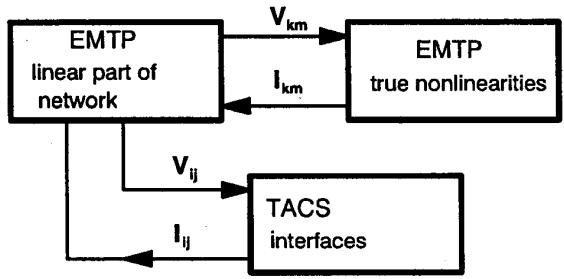  
Figure 4 EMTP-TACS formulation with compensation

The EMTP true nonlinearities and the TACS interfaces are solved separately. To use the superposition principle correctly, it is necessary that the set of buses $k - m$ and $i - j$ be in different sub-networks. In the context of EMTP, this means that these sub-networks must be separated by at least one distributed-parameter line because, then, coupling occurs only through the history terms.

In applying compensation, once the linear network is solved, Thévenin equivalents are used to model the network at the buses where nonlinearities are connected. The equivalent EMTP network is modelled by:

$$
\left[ \begin{array}{l} \mathbf {V} _ {\mathrm {k m}} \\ \mathbf {V} _ {\mathrm {i j}} \end{array} \right] = \left[ \begin{array}{l} \mathbf {E} _ {\mathrm {k m}} \\ \mathbf {E} _ {\mathrm {i j}} \end{array} \right] - \left[ \begin{array}{l l} \mathbf {Z} _ {\mathrm {k m}} & \mathbf {0} \\ \mathbf {0} & \mathbf {Z} _ {\mathrm {i j}} \end{array} \right] \left[ \begin{array}{l} \mathbf {I} _ {\mathrm {k m}} \\ \mathbf {I} _ {\mathrm {i j}} \end{array} \right] \tag {2}
$$

where $\mathsf{E}_{\mathsf{km}}$ and $\mathsf{E}_{\mathsf{ij}}$ are the vectors of Thévenin voltages at buses $k - m$ and $i - j$ ; $\mathsf{Z}_{\mathsf{kj}}$ and $\mathsf{Z}_{\mathsf{ij}}$ are the Thévenin impedance matrices; while $\mathsf{V}_{\mathsf{km}}$ and $\mathsf{V}_{\mathsf{ij}}$ are the updated bus voltages. The Thévenin voltages are simply the bus voltages, without the effect of the currents $\mathsf{I}_{\mathsf{km}}$ and $\mathsf{I}_{\mathsf{ij}}$ . The Thévenin impedance matrices need to be recomputed each time a topological change occurs. There are standard EMTP techniques for computing the Thévenin equivalents.

The PxP matrix $\mathbf{Z}_{\mathrm{km}}$ may have some topological restrictions depending on the type of nonlinear components: some type of nonlinearities are solved separately rather than iteratively with all other nonlinearities. There are no restrictions on the QxQ matrix $\mathbf{Z}_{\mathrm{ij}}$ , i.e. it is a general coupled matrix. Because of the decoupling, attention focuses only on the TACS interfaces.

The Q-TACS interfaces can be modelled with coupled QxQ equations. These equations can be static or dynamic:

$$
\text {s t a t i c}: \quad I _ {i j} = T _ {\text {o u t}} = B (V _ {i j}) V _ {i j} \tag {3}
$$

$$
\text {d y n a m i c}: \quad I _ {i j} = T _ {\text {o u t}} = T _ {\text {o u t}} \left(V _ {i j}, \frac {d V _ {i j}}{d t}\right) \tag {4}
$$

where $\mathbf{T}_{\mathrm{out}}$ refers to the nomenclature of Figure 1. It is assumed that all TACS dynamic interfaces can be discretized through the trapezoidal integration rule, and transformed into a static interface involving an history term:

$$
\text {d y n a m i c}: \quad I _ {i j} = T _ {\text {o u t}} = B (V _ {i j}) V _ {i j} + I _ {h} \tag {5}
$$

Once discretized and cast under the form (5), dynamic and static TACS interfaces can be handled in the same manner. The simplest solution scheme is the Gauss iteration which consists in solving until convergence:

$$
\begin{array}{l} \mathbf {I} _ {i j} ^ {k + 1} = \mathbf {B} (\mathbf {V} _ {i j} ^ {k}) \mathbf {V} _ {i j} ^ {k} + \mathbf {I} _ {h} \\ \mathbf {V} _ {i j} ^ {k + 1} = \mathbf {E} _ {i j} - \mathbf {Z} _ {i j} \mathbf {I} _ {i j} ^ {k + 1} \end{array} \tag {6}
$$

There are cases though where the convergence characteristics of the Gauss iterations may not be good. Since the matrices $\mathbf{B}$ and $\mathbf{Z}_{ij}$ are typically of small dimensions, the amount of computations is not an issue, the following Gauss solution scheme has been adopted as an alternative:

$$
\begin{array}{l} \boxed {V} \\ V _ {i j} ^ {k + 1} = \left[ g + Z _ {i j} B \left(V _ {i j} ^ {k}\right) \right] ^ {- 1} \left[ E _ {i j} - Z _ {i j} I _ {h} \right] \end{array} \tag {8}
$$

$$
\mathrm {I} _ {\mathrm {i j}} = \mathrm {B} \left(\mathrm {V} _ {\mathrm {i j}} ^ {\text {l i t e r a t e d}}\right) \mathrm {V} _ {\mathrm {i j}} ^ {\text {l i t e r a t e d}} + \mathrm {I} _ {\mathrm {h}} \tag {9}
$$

This follows directly from (6)-(7), when the iteration count on the voltage is taken as $k + 1$ in (6), except on $\mathbf{B}$ where it stays at $k$ . The convergence properties of the Gauss scheme (8) are very good. When the $\mathbf{B}$ matrix is constant, one step is sufficient to converge (8). When $\mathbf{B}$ is a nonlinear matrix, iterations are required. A Newton implementation would also be possible, but this would require either the user to provide the differential of the nonlinear elements, or the program to estimate them in some manner. Since the control system generating $\mathbf{B}$ may be quite complex, the Gauss scheme (8) has been preferred. The scheme (6-7) is an alternative.

# Modeling of interaction from TACS to EMTP

Interaction from TACS to EMTP occurs through: TACS defined EMTP slave voltage and current sources (type 60), TACS controlled switches (types 11, 12 and 13), TACS defined EMTP source scaling factor (type 17), and TACS variables used in the simulation of machines (types SM and UM). These are the existing interfaces, as taken from the EMTP rule book[1]. All interactions with the machines are not modified at this time by the compensation-based method. The type 17 source is also excluded. There are no restrictions however for including

these devices; it is rather a matter of convenience at this time. All other interfaces are taken into account as follows.

Slave current source to EMTP: When the current output $\mathbf{I}_{\mathrm{lj}}$ can be cast into the form (3) or (5), the application of compensation is immediate through (6-7) or (8-9). Otherwise compensation is possible by applying (7) based on the TACS computed current $\mathbf{I}_{\mathrm{lj}}$ .

Slave voltage source to EMTP: This is the dual problem. Since the voltage $\mathbf{V}_{\mathrm{ij}}$ is set by TACS, the slave voltage source can be replaced by a current $\mathbf{l}_{\mathrm{ij}}$ given by

$$
\mathbf {I} _ {i j} = \mathbf {Z} _ {i j} ^ {- 1} \left(\mathbf {E} _ {i j} - \mathbf {V} _ {i j}\right) \tag {10}
$$

Compensation is performed by applying (7) based on these TACS computed current $I_{ij}$ . If there are both slave voltage and current sources, which are coupled, and that need to be represented, then an hybrid formulation is feasible. A typical example is as follows:

$$
\left[ \begin{array}{l} I _ {i j 1} \\ V _ {i j 2} \end{array} \right] = \left[ \begin{array}{l l} B _ {1 1} & F _ {1 2} \\ F _ {2 1} & R _ {2 2} \end{array} \right] \left[ \begin{array}{l} V _ {i j 1} \\ I _ {i j 2} \end{array} \right] + \left[ \begin{array}{l} I _ {h 1} \\ V _ {h 2} \end{array} \right] \tag {11}
$$

where history terms for currents and voltages of the two sub-sets are shown. This is converted into a current injection model when it is assumed that the $\mathbb{R}_{22}$ matrix is non singular:

$$
\left[ \begin{array}{l} I _ {i j 1} \\ I _ {i j 2} \end{array} \right] \left[ \begin{array}{l l} H _ {1 1} & H _ {1 2} \\ H _ {2 1} & H _ {2 2} \end{array} \right] \left[ \begin{array}{l} V _ {i j 1} \\ V _ {i j 2} \end{array} \right] + \left[ \begin{array}{l} J _ {h 1} \\ W _ {h 2} \end{array} \right] \tag {12}
$$

$$
\begin{array}{l} H _ {1 1} = B _ {1 1} - F _ {1 2} R _ {2 2} ^ {- 1} F _ {2 1} \quad H _ {1 2} = F _ {1 2} R _ {2 2} ^ {- 1} \\ \mathsf {H} _ {2 1} = - \mathsf {R} _ {2 2} ^ {- 1} \mathsf {F} _ {2 1} \quad \mathsf {H} _ {2 2} = \mathsf {R} _ {2 2} ^ {- 1} \\ J _ {h 1} = I _ {h 1} - F _ {1 2} R _ {2 2} ^ {- 1} V _ {h 2} \quad W _ {h 2} = - R _ {2 2} ^ {- 1} V _ {h 2} \\ \end{array}
$$

Trigger signals: these are used to control the operation of EMTP switches. The easiest way in which to apply compensation for trigger signals is to model the switch in TACS itself, and to interface with the EMTP with the calculated switch current $I_{ij}$ . This yields a simple switch model (ideal valve) with a near zero resistance when in conduction, and a high resistance when blocked. In fact, when simulating converter bridges and power electronic circuits, it is convenient [5] to write separate circuit equations, for example with hybrid analysis instead on nodal analysis, and to interface the circuit with current sources in the EMTP.

Additional interfaces: compensation allows more generality such as branch current injections which are easily handled, as well as components which read voltages at a set of buses but inject current in another set of buses in the same sub-network or not. This last feature is useful to model dependent sources.

Modeling of interaction from EMTP to TACS

Interaction from EMTP to TACS occurs through EMTP defined TACS sources: network node voltages (type 90),

switch currents (type 91), machine variables (type 92), and switch status (type 93). It has been shown above how the various interfaces are modelled. Machine variables have been excluded from the compensation. Network node voltages are implicit in the formulation of compensation. Typically currents injected into EMTP from TACS will depend on bus voltages which are updated through compensation. Switch currents and switch status are readily available when the switches are directly modeled in TACS. Then there is no problem in updating these values at the current time step. A library of switching equipments can be made available in TACS, then it is a simple matter of calling the device of choice.

# 5. IMPLEMENTATION

The algorithm is in fact more complicated than what is shown in the previous section because some TACS variables will generally depend on the inputs from EMTP, say $\mathbf{V}_{ij}$ , and we cannot wait for the next time step before updating them if the one-time-step error must be cancelled. This implies we generally need to iterate the TACS solution, at each time instant, both for the linear and nonlinear components, until convergence at the interface buses.

The flow chart for the revised TACS solution, with compensation for the currents injected into EMTP, is shown in Figure 5. In the dashed box, the final step corresponds to the standard TACS solution. Before entering this, there is a repeat solution on TACS, for this time step, whenever compensation is needed, and until the voltages at the interface buses have converged. Computation of Thévenin voltages and impedance matrix, as well as voltage updating, are performed in a manner very similar to what already exist in the EMTP for the compensation of true nonlinearities. Typically, less than 5 iterations are required for convergence. The starting guess for $\mathbf{V}_{\mathrm{ij}}$ can be taken as the value of $\mathbf{V}_{\mathrm{ij}}$ at the last time step, or the Thévenin voltage at this step, but the former appears to be a better choice.

The repeat solution on TACS is for adjusting the TACS sources (specifically node voltages, type 90) to the value of compensation, and for making all TACS variables consistent with the new node voltages. It is also possible to iterate TACS to reduce the internal TACS delays, but this is not the first purpose.

In Figure 5, all TACS is imposed a repeat solution. As indicated in Figure 3, this is not truly necessary, only part of the TACS equations (matrix $\mathbf{G}$ and all flagged nonlinear components) could be updated at this step. In the repeat solution there is no update of the history terms since the time step is not advanced.

In the implementation, the TACS signals $\mathbf{l}_{ij}$ which need to be compensated may be in many cases computed with standard TACS statements, using any combination of transfer functions, supplemental devices and pseudo

FORTRAN. It is also possible, for more complex cases, to load the user routine describing $\mathbf{l}_{\mathrm{ij}}$ , and the associated history terms. The compensation is performed by specifying appropriate arguments for the interface. An example in the next section will illustrate this. The algorithm has therefore been designed and implemented so that minimal low-level intervention from the user is required.

In the EMTP, the signals $I_{ij}$ which are TACS compensated, are marked as a special true nonlinearity. When these signals do not exist, then the TACS solution is standard, i.e. without compensation nor iterations at the same time step. This preserves solution efficiency.

# 6. APPLICATIONS

It is possible to use the new facilities described in this paper as a solver of user-specified components which interface with the network modelled in EMTP.

The example in Figure 6 shows a numerical instability which is cured by the compensation algorithm in TACS, but which cannot be eliminated by simply reducing the time step. With compensation, the answer is always exact, irrespective of the time step of the simulation. From 0 to $\Delta T$ , the system starts-up, and at $\Delta T$ the response is exact with or without compensation (note that the curve without compensation is scaled down by 10). Without compensation, the numerical instability is clear and growing in amplitude.

The circuit is a simple resistive circuit, part of it is modelled in EMTP, and the rest in TACS, as indicated in the Figure. In TACS, the resistance is modelled as a current injected into EMTP. The reason for the numerical instability is clear when we consider the equivalent simulation equations with the one-time-step error at the interface:

$$
\left[ \begin{array}{l} \mathbf {V} (t) \\ \mathbf {I} (t) \end{array} \right] = \left[ \begin{array}{c c} 0 & - R _ {1} \\ 0 & - R _ {1} / R _ {2} \end{array} \right] \left[ \begin{array}{l} \mathbf {V} (t - \Delta T) \\ \mathbf {I} (t - \Delta T) \end{array} \right] + \left[ \begin{array}{l} 1 \\ 1 / R _ {2} \end{array} \right] \mathbf {u} (t) ^ {(1 3)}
$$

The discrete time system (13) has a pole which is outside the unit circle, and of magnitude $\mathbf{R}_1 / \mathbf{R}_2$ , independent of the step size $\Delta T$ selected. With compensation, the solution exactly matches that obtained by simulating the entire circuit in the EMTP itself.

The next example simulates two R-L circuits in TACS. There is a branch between buses 2-3, and a shunt between buses 3-0 which are modelled in TACS, with compensation. A large resistance is connected in EMTP between buses 2-3. The switch in the circuit is closed at 0.005sec. Figure 7 shows the voltages at buses 2 and 3. Results exactly match those obtained by simulating every component in the EMTP. Of course, it would be a simple matter to simulate the circuit in EMTP directly, but the example demonstrates the flexibility in adding any component in the EMTP, for specific study purposes.

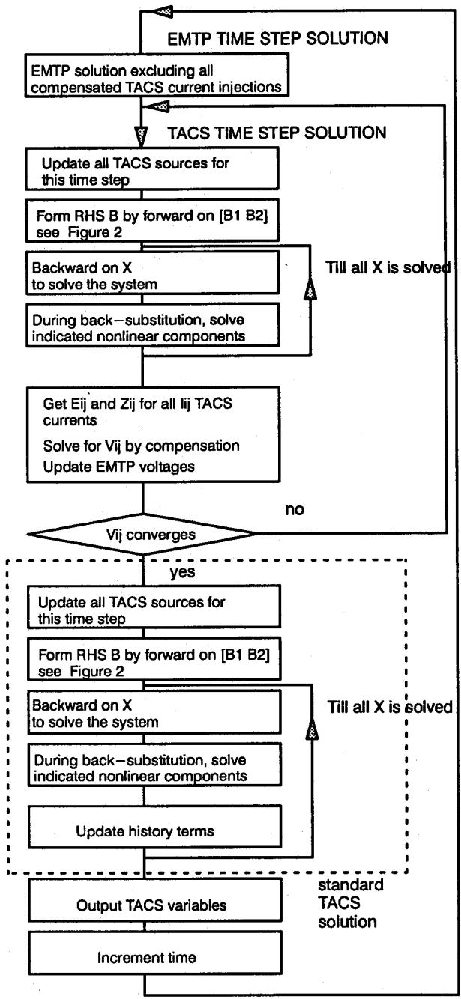  
Figure 5 Flow chart of compensated TACS solution

Next consider a case where a nonlinear three-phase load is simulated in TACS, through compensation. The load is a combination of constant real power and constant impedance load. The simulation result is compared to the standard EMTP simulation with constant impedance load. Figure 8 shows the rms voltages with both types of loads. Naturally this is a low frequency load model, but the impact on the system behavior cannot be neglected. Better load models in the EMTP have the benefit of potentially improving the accuracy of simulations.

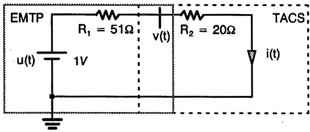

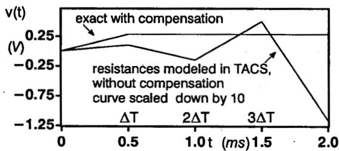  
Figure 6 Circuit unstable without compensation

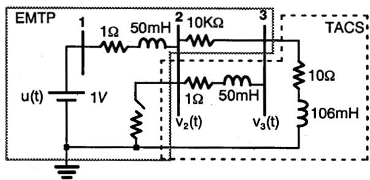

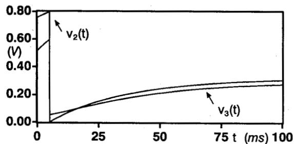  
Figure 7 Two branches, with dynamics, simulated in TACS

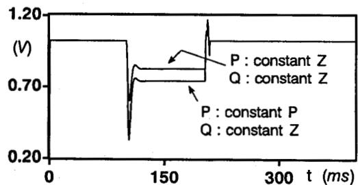  
Figure 8 Nonlinear 3-phase load

The next example illustrates the elimination of time delays in valve firing. In Figure 9, a thyristor valve is simulated with the trigger pulse coming from TACS. The trigger pulse is intentionally long enough to overlap with

the negative commutation voltage period. When the valve is simulated in EMTP, we get the curves marked EMTP, where the valve current starts one time-step after the enabling signal, and where the valve current goes negative for one time-step before extinction. The enabling signal indicates the conduction period: positive trigger pulse and positive current through the valve. In the standard EMTP simulation, the current is delayed not only at ignition, but also at extinction (a small negative current is allowed to flow due to the one-time-step error and the emtp-switch logic). The curves marked TACS illustrate the results when the valve in modeled through compensation in TACS. Current ignition and extinction is simultaneous with the firing pulse. Note that the current is not delayed with respect to the enabling signal.

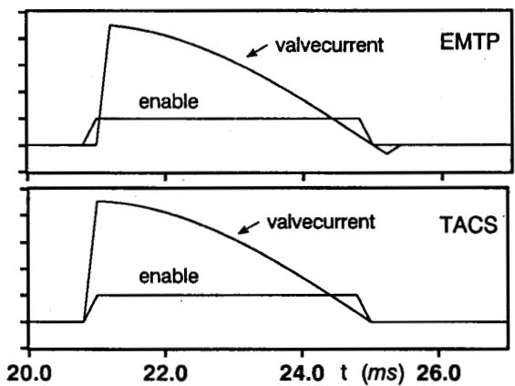  
Figure 9 Thyristor valve without delay

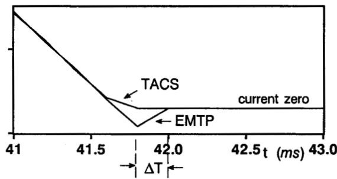  
Figure 10 Distortion in valve current, large step size (current extinction of Figure 9 is zoomed in)

In Figure 9, negative current was not obtained with TACS-compensation because the valve is opened as soon as its current, at the same time step, becomes negative. This feature is the result of being able to iterate on TACS at the same time step. Of course, since the simulation is necessarily time-discretized, and since the current is forced to go to zero at the exact simulation steps, some distortion may be introduced in the valve currents. Figure 10 shows the current extinction when a larger step size is used. The exact instant of current extinction is between two integration steps. It is possible

to linearly interpolate to determine this point. It would imply displacing the time mesh of the simulation in both EMTP and TACS[6]. With TACS-compensation, this is not required, but there are iterations within TACS.

The last example illustrates a case where the one-time-step error of the standard TACS-EMTP has a strong impact on the numerical accuracy, and the ease of use of the program. The circuit shown in Figure 11[7] is difficult for digital simulation because it is subjected to inductor current and capacitor voltage discontinuities. The switch sw is controlled by an external signal with period T and duty cycle d. The R-C circuit across the switch is a snubber, which is not used (because not required) with the TACS-compensation algorithm. In the continuous mode of operation, at the instant the switch sw closes, the diode D is forced to switch off, preventing a sudden capacitor voltage change. Depending on the values of R, L and C, the diode current may switch off before the switch sw closes. In practice the switch and the diode must be perfectly synchronized to get accurate results

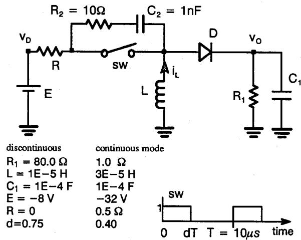  
Figure 11 Buck-boost dc-dc converter

Figure 12 shows the standard EMTP-TACS simulation results are dependent on the time-step. In those simulations, for the continuous mode of operation, the switch is a type-13 TACS-controlled switch, while the diode is a type-11 ideal diode model. Diode ceases operation at time-step after the reclosing of the switch sw. Due to the one-time-step error, the capacitance partially discharges, which results in lower voltages $\mathbf{v}_0$ , dependent on the step size. Even more dramatic results are obtained when $R = 0$ , e.g. with the discontinuous mode data, since then the capacitance voltage instantaneously equals the source voltage. The same simulation is run with TACS-compensation (no snubber used), with the diode and the switch both modelled inside of TACS, and the result, which can be shown to be the exact solution, is insensitive to the time-step.

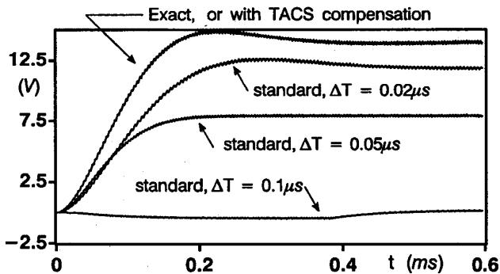  
Figure 12 Voltage $\mathbf{v_0}$ , continuous mode

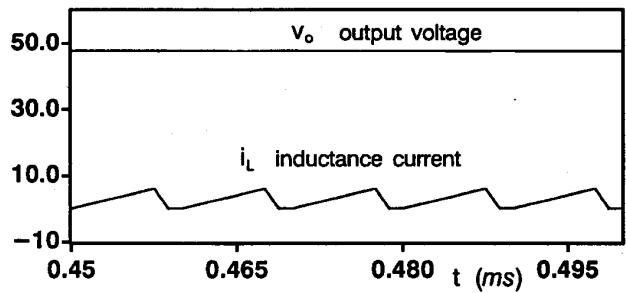  
Figure 13 Discontinuous mode

In the standard simulation, the only way to get a solution less sensitive to the time-step is to replace the diode model with a type-13 switch controlled in opposite phase with the switch sw. When the converter is in discontinuous operation, this is a necessity, otherwise the diode never enters its on-state with the type-11 model. Additional logic is even required to avoid negative diode current (current must be chopped at zero). This type of modeling requires good understanding of the circuit behavior. With the TACS-compensation model, there is no distinction necessary between different modes of operation. Figure 13 illustrates results obtained in this case. It can be demonstrated that these results are exact. The steady-state results illustrate the voltage $\mathbf{v}_0$ obtained and the current through the inductance. This current is typical of the discontinuous mode of operation.

# 7. CONCLUSIONS

This paper has presented and discussed TACS-EMTP limitations related to the one-time-step error at the interface. A new and general algorithm for alleviating the modeling difficulties has been developed and implemented.

With TACS—compensation, and TACS iterations at the same time—step, it has been illustrated that cases previously numerically unstable are stabilized. Furthermore the modeling capabilities, and ease of use, have been extended.

A new method to account for circuits of varying topologies has resulted, including the consideration of valve current chopping due to time-discretization.

The paper has demonstrated that it is possible to use TACS as a model builder and solver. The model solution is interfaced, without error, with the network modelled in EMTP. The model must generate a current injection in the EMTP, and it has been shown that many classes of model fit this. Compensated models, such as for the dc-dc converter circuit, can be constructed rather simply. As shown in the Appendix, this is done in the EMTP-TACS data file and no programming and re-Compilation is required for this specially used program version.

In the implementation, all of TACS is iterated at each time step when TACS compensation is required. The computational burden can be reduced by using a scheme based on eqn(1) and Figure 3. In many cases, since the interface is less prone to errors, the integration time step can be increased thus offsetting the additional requirements of the compensation and iterations.

# REFERENCES

[1] EMTP rule book, EPRI report EL-4541s-CCMP, 2 volumes.   
[2] EMTP Work book IV, EPRI report EL-4651.   
[3] H. W. Dommel, EMTP theory book, 2nd edition, Microtran Power System Analysis Corporation, May 1992.   
[4] M. Ren-ming, 'The challenge of better EMTP TACS variable ordering,' EMTP Newsletter, Vol 4, No 4, pp. 1-6, Aug. 1984.   
[5] J. Mahseredjian, S. Lefebvre., D. Mukhedkar, 'Power converter simulation module connected to the EMTP,' IEEE/PES 1990 Summer Meeting, Minneapolis, Paper 90 SM 454-9 PwRS.   
[6] B. Kulicke, 'Simulation program NETOMAC: difference conductance method for continuous and discontinuous systems,' Siemens Research and Development Reports, Vol 10, No 5, 1981.   
[7] D. Bedrosian, J. Vlach, 'Time-domain analysis of networks with internally controlled switches,' IEEE Trans. on Circuits and Systems, Vol 39, No 3, March 1992.

# BIOGRAPHIES

Serge Lefebvre (M'76) received the BScA and MScA degrees in electrical engineering from École Polytechnique de Montréal in 1976 and 1977 respectively, and a Ph.D. from Purdue University (Indiana) in 1980. He is working at the Research Department of Hydro-Québec since 1981 while being an associate professor at École Polytechnique de Montréal. His research interest are in power system analysis techniques, computer applications, and dc systems. Dr. Lefebvre is Chairman of the IEEE working group "Dynamic performance and modeling of dc systems and power electronics".

Jean Mahseredjian (M'84) received the B.Sc.A., M.Sc.A. and Ph.D. in Electrical Engineering from Ecole Polytechnique de Montréal (Canada) in 1982, 1985 and 1990 respectively. At present he is a researcher at Institut de Recherche d'Hydro-Québec (Canada) and an associate professor at Ecole Polytechnique de Montréal. His research interests are modeling and numerical analysis in power systems and power electronics.

# APPENDIX

The EMTP-TACS data file for the dc-dc converter circuit of Figure 11 is listed below. The switch sw and the diode D are modelled as current injections CNL001 and CNL002 in the EMTP. These are generated by TACS, and the EMTP solution is compensated by a call to the TACS_INTERFACE routine, which is provided. It is simply necessary to specify the number of arguments, and the arguments in the order in which they are declared in the EMTP.

BEGIN NEW DATA CASE

0.10E-6 80.0E-5

10000 010

TACS HYBRID

C control of the emtp switch

11VCONT 0.75

24RAMP 1.0 10.0E-6

88SIG = VCONT .GE. RAMP

77SIG 1.0

11N00002 2.00

00SIGF +SIG

C if SIG > 0, close the switch T1

IF (SIGF .GT. 0.0 ) THEN

BNLsw1 = 100000.

ELSE

BNLsw1 = 0.00001

ENDIF

C next find conduction pattern of diode

00CNLdio +CNL002

IF (CNLdio .GE.0.0) THEN

BNLOU1 = 100000.

ELSE

BNLOU1 = .00001

ENDIF

00BNLswt +BNLsw1

00BNLdio +BNLOU1

C

SUBROUTINE TACS INTERFACE

+N00002 +BNLswt +BNLdio These are the arguments for the

CNL001 CNL002 compensation algorithm

BLANK end of TACS

C NETWORK WITH TACS COMPENSATIONS

VDc PRIMRc 1.E-3

SNUBc SWc 1.E10

.03000

VOC

100.

VOC

80.0

C flag to indicate device with TACS-compensation

C Bus->Bus->Bus->Bus--> codex

C switch

02PRIMRcSWc

7878.

C diode

92SWc VOC

7878

BLANK CARD ENDING BRANCH DATA.

BLANK CARD ENDING SWITCHES

C Source

11VDc -32.0

2

BLANK CARD ENDING SOURCE CARDS.

1

BLANK

BLANK

BLANK