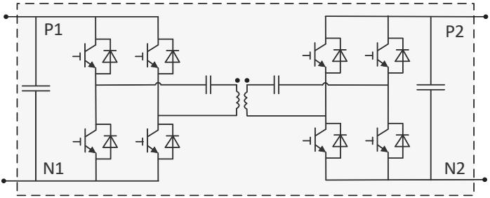
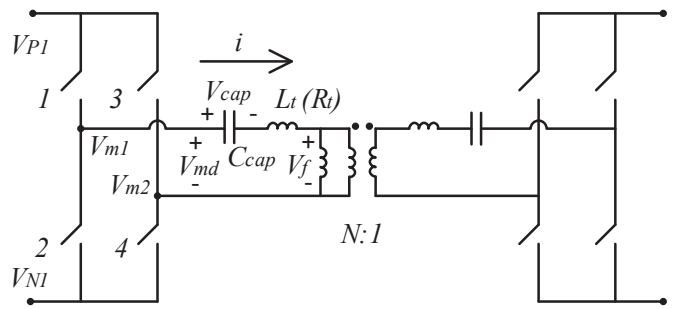
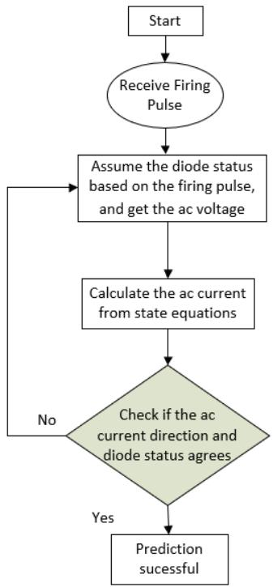
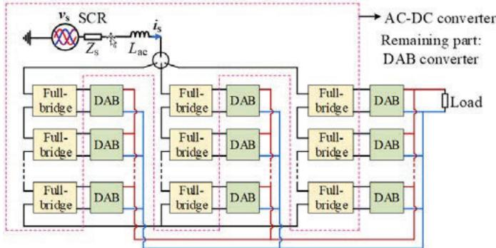
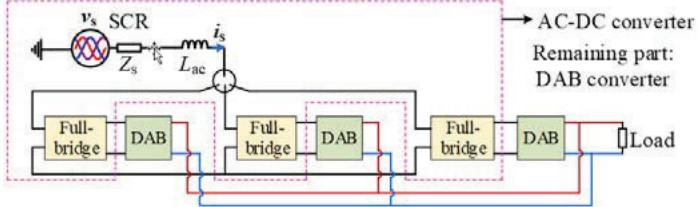
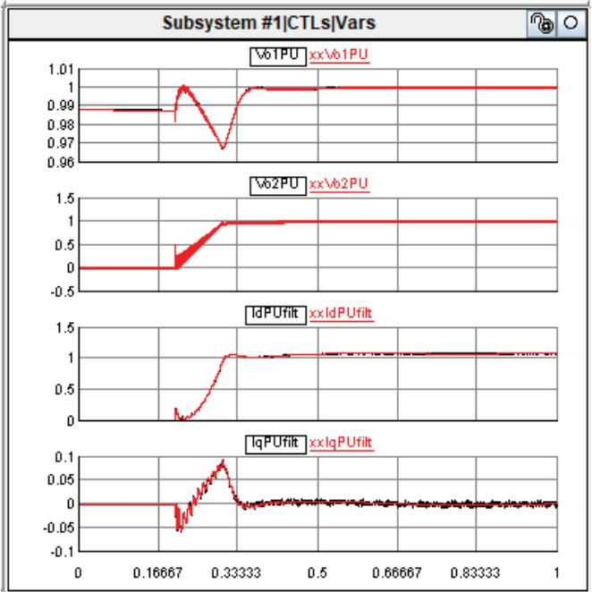
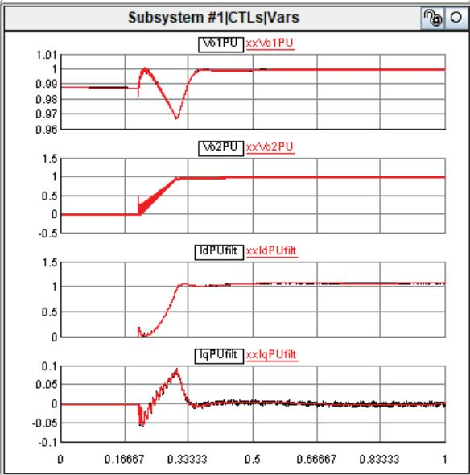
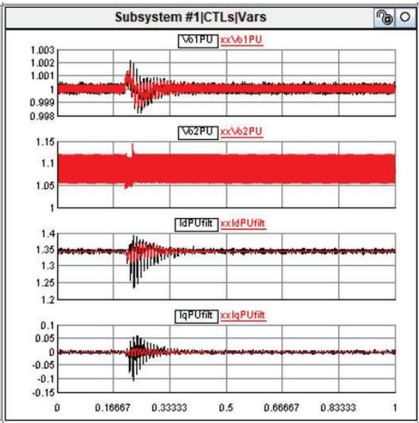
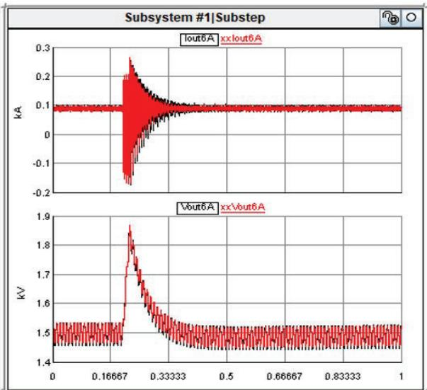

# High Efficiency Modeling of Multi-Layer Cascaded Dual-Active-Bridge (DAB) Units on Real-time Simulator

Yi Qi $^{1}$ , Hui Ding $^{1}$ , Sherry Shi $^{1}$ , Yi Zhang $^{1}$ and Aniruddha Gole $^{2}$

$^{1}$ RTDS Technologies Inc., Winnipeg, Canada

$^{2}$ Department of Electrical and Computer Engineering, University of Manitoba, Winnipeg, Canada

Email: {yi.qi, hui.ding, sherry.shi, yi.zhang}@ametek.com, aniruddha.gole@umanitoba.ca

Abstract—Modeling Dual-Active-Bridge (DAB) topologies in a real time simulator presents challenge due to the high switching frequency and the substantial number of submodules. This requires both the firing pulses' precision and high-speed matrix computation. In this paper, an aggregated model is proposed for a typical Dual-Active-Bridge (DAB) circuit using the state-space circuit approach. It accurately implements the duty cycle of the firing pulses and consequently enhances accuracy. The two H-bridge converters and the ac transformer with the blocking capacitors are consolidated into a single-unit. To address scenarios involving multi-level cascaded DAB units with input series output parallel (ISOP), the multiple single-unit blocks are further packed into an aggregated model. Compared to using single-unit models for the cascaded topology, our developed aggregated model not only conserves electrical nodes, but also the calculation time for history terms, resulting in reduced hardware resources. The simulation timestep can be efficiently reduced, resulting in an outcome of better precise and the capability to model much higher switching frequencies. The proposed aggregated model can be widely applied in the real-time simulation of cascaded DAB topologies, accommodating switching frequency up to $100\mathrm{kHz}$ .

Index Terms-Dual-Active-Bridge (DAB), Electromagnetic Transient (EMT), Universal Converter Model (UCM), real-time simulation.

# I. INTRODUCTION

The modelling and simulation of power electronic circuits pose significant challenges in real-time simulation. On one hand, power electronic switches typically operate at high switching frequencies with rapid dynamic response, leading to current and voltage waveforms that may contain components at much higher frequencies, e.g., up to $100\mathrm{kHz}$ . This necessitates a timestep in the order of 2us [1], which is much smaller than that typically used in power network simulations. On the other hand, the "real-time" requirement enforces a strict constraint, i.e., the calculation for one simulation timestep must be completed within the same timestamp as the real world. Unfortunately, the interpolation technique [2] commonly employed in non-real time simulations to enhance switch firing accuracy, is not suitable for real-time simulations, as it requires a CPU time more than twice as large.

The above problems become even more pronounced dealing with the Dual-Active-Bridge (DAB) topology [3], which is being considered for energy storage and distributed generation as it is modular with low cost [4]. DAB switches can operate at nominal switching frequencies of several

hundred kHz, and the resolution of the firing pulse depends on the timestep since they can only be issued at the start of each timestep. Even when the timestep is as small as $1.0~\mu \mathrm{s}$ , firing inaccuracies can result in a significant amount of dc offset component in the ac transformer current.

The Universal Converter Model (UCM) approach was introduced in [5] to model the power electronic converters with descriptor state space equations. It allows for the consideration of a firing pulse being applied within a timestep. This is often the case with external control hardware, which generates firing pulses with a very fine time resolution. The on/off status of any of the converter's switches does not remain unchanged during the timestep. Instead, an average value over the timestep is taken to accurately replicate switching behaviors. This approach, referred to as "Improved Firing Pulse (IFP)", offers accuracy comparable to the interpolation technique used in off-line EMT simulations. When the DAB topology is simulated using the UCM+IFP technique, it significantly enhances the accuracy of switching actions, even enabling the simulation of a $100\mathrm{kHz}$ switching frequency in a real-time simulator with timesteps as short as 1-2 $\mu$ s. This effectively mitigates the abnormal DC offset introduced by inaccurate firing in a non-UCM model.

However, the maximum size of the network is still constrained by real-time requirements. For example, in the RSCAD substep environment, only 60 nodes are allowed due to the difficulty of matrix factorization in real-time. Each DAB unit comprises four (or six, when dc blocking capacitors are included) electric nodes on the ac side and four on the dc side. Additionally, the timestep cannot be reduced beyond a certain minimum due to the computation burden of the cascaded submodules and network solution. Packing multiple units into one aggregated model [6-7] is necessary to hide electrical nodes as 'internal' and to increase efficiencies.

In this study, the development of DAB models occurs in two distinct stages, aimed at enhancing the capability of real-time simulation. In the original circuit configuration, each DAB unit comprises two H-bridge converters, one AC transformer, and two DC blocking capacitors. In stage I, these individual unit models are consolidated into a single integrated model, with all six AC-side nodes considered as 'internal,' as depicted in Fig. 1.

Moving on to stage II, cascaded-connected DAB units are further condensed into an aggregated model. Only the four DC nodes in the cascaded topology are included in the node

admittance matrix. This model treats all DAB units as identical, meaning that circuit parameters are the same for all units, and they are assumed to receive the same firing pulse. This eliminates the need to perform separate calculations for each unit.

The accuracy and efficiency of the proposed cascaded input-series output-parallel (ISOP) DAB model is validated through comparing the results from the proposed aggregated approach with a detailed simulation of a power electronic transformer (PET) circuit [8]. The front-end ac-dc converters are also aggregated. The simulation results for the proposed aggregated DAB model and aggregated front-end converters are found to be comparable to those obtained using the single-unit model, both in steady-state and transient conditions.

  
Fig. 1. Integrated circuit of the DAB topology and external nodes shown as in dotted square

# II. UNIVERSAL CONVERTER MODELLING FOR SINGLE-UNIT DAB WITH DC BLOCKING CAPACITORS

The circuit configuration of a single-unit DAB is illustrated in Fig. 2, with the inclusion of dc blocking capacitors. These capacitors play a crucial role in mitigating the presence of DC offset components in the AC current, thereby effectively suppressing transformer saturation. In this work, all the components within this configuration are consolidated into an integrated model using the UCM approach. This approach encompasses two key algorithms: valve status prediction and descriptor state space modeling.

  
Fig. 2. Circuit diagram for the status prediction

For each leg, when at least one valve is conducting (i.e., is "ON") in the current timestep, the converter is categorized as 'Deblocked'. Consequently, the statuses of the valves are determined. Conversely, it is considered as in a 'Blocked' mode in which no firing pulse is issued to at least one leg, let us say, leg 'x'. However, one of the diodes in leg 'x' may still be forced to conduct due to the ac current flowing through the transformer (inductor). In this situation, the statuses of the valves should be predicted [9] to ascertain the correct

conducting status, namely "actual firing statuses".

For the left side of the converter in Fig. 2, the state equation can be expressed as follows:

$$
\left\{ \begin{array}{c} L _ {t} \frac {d i}{d t} + R _ {t} i = V _ {m d} \left(V _ {P 1}, V _ {N 1}, S _ {I}\right) - V _ {f} - V _ {c a p} \\ C _ {c a p} \frac {d V _ {c a p}}{d t} = i \end{array} \right. \tag {1}
$$

In this equation, $V_{f}$ is the voltage of the mutual inductance; $V_{md}$ is the voltage difference between two middle points of the legs, i.e., $V_{m1} - V_{m2}$ in Fig. 2. It is a function of the valve status, the positive and negative dc voltages. For instance, if the firing pulse combination of the four switches is '1001' in converter I ("1" meaning "ON" and "0" meaning "OFF"), then $V_{md} = V_{P1} - V_{N1}$ . The predictive algorithm systematically evaluates all possible firing pulse combinations one by one, employing the state equations to 'predict' the current direction flowing through the blocking capacitor, and then cross-checks whether the current direction aligns with the valve conducting direction. The flow chart is shown in the following Fig. 3.

  
Fig. 3. Flow chart of status prediction

Equation set (1) can be represented in a more general form:

$$
\left\{ \begin{array}{l} M \frac {d X}{d t} = A X + B u \\ \mathbf {y} = C X + D u \end{array} \right. \tag {2}
$$

This general form can be readily extended to the status prediction of any arbitrary power electronic topologies. When it applies to the DAB topology in this work, the input $\pmb{u}$ corresponds to $V_{md}(V_p,V_n,S_I)$ , and the state variables $\pmb{X}$ are the ac current and the blocking capacitor voltage.

As discussed above, the switching statuses of the valves are either determined directly from the firing pulse of the 'Deblocked' mode, or from the status prediction [9] for the 'Blocked' mode. Once this information is obtained, the

Descriptor state space (DSS) equations can be formulated to represent the circuit as (3-6).

$$
L \frac {d i}{d t} + R _ {t} i = \left[ m _ {P} V _ {P} + m _ {N} V _ {N} \right] - V _ {c a p} \tag {3}
$$

$$
C _ {c a p} \frac {d V _ {c a p}}{d t} = i \tag {4}
$$

$$
\boldsymbol {I} _ {P} = \boldsymbol {m} _ {P} * \boldsymbol {i} \tag {5}
$$

$$
\boldsymbol {I} _ {N} = \boldsymbol {m} _ {N} * \boldsymbol {i} \tag {6}
$$

Each of the equations (3-6) consists of two equations representing the converters of both sides. The four bold elements $\pmb{i}, \pmb{V}_{cap}, \pmb{I}_P, \pmb{I}_N$ are all 2x1 dimensional vectors for the left side converter variable with subscript '1' and the right side with '2', e.g., $\pmb{i} = [i_1 i_2]^T$ . $\pmb{m}_P$ is a 2x2 diagonal matrix and always equal to $-\pmb{m}_N$ . With IFP, $\pmb{m}_P$ can be calculated from the duty cycles of the firing pulses in the previous time step.

The above equations can be re-organized into the standard form:

$$
\left\{ \begin{array}{l} \mathbf {M} \dot {\mathbf {x}} = \mathbf {A} \mathbf {x} + \mathbf {B} V _ {v e c} \\ I _ {v e c} = \mathbf {C x} + \mathbf {D} V _ {v e c} \end{array} \right. \tag {7}
$$

The state variable vector is $\mathbf{x} = [i_1 i_2 V_{cap1} V_{cap2}]^T$ ; the input scalar is the voltages $V_{vec} = [V_{P1} V_{P2} V_{N1} V_{N2}]^T$ ; the output vector is $I_{vec} = [I_{P1} I_{P2} I_{N1} I_{N2}]^T$ . And the M, A, B, C and D matrices are:

$$
\begin{array}{l} \mathbf {M} = \left[ \begin{array}{c c c c} L _ {t 1} + L _ {m} & L _ {m} & 0 & 0 \\ L _ {m} & L _ {t 2} + L _ {m} & 0 & 0 \\ 0 & 0 & C _ {c a p 1} & 0 \\ 0 & 0 & 0 & C _ {c a p 2} \end{array} \right] \\ \mathbf {A} = \left[ \begin{array}{c c c c} - R _ {\mathrm {t 1}} & 0 & - 1 & 0 \\ 0 & - R _ {\mathrm {t 2}} & 0 & - 1 \\ 1 & 0 & 0 & 0 \\ 0 & 1 & 0 & 0 \end{array} \right] \\ \mathbf {B} = \left[ \begin{array}{c c c c} m _ {P 1} & 0 & - m _ {P 1} & 0 \\ 0 & m _ {P 2} & 0 & - m _ {P 2} \\ 0 & 0 & 0 & 0 \\ 0 & 0 & 0 & 0 \end{array} \right] \\ \mathbf {C} = \mathbf {B} ^ {T}; \mathbf {D} = \mathbf {0} \\ \end{array}
$$

In which, $L_{m}$ is the mutual inductance. Integrating (7) gives $(\alpha + \beta = 1.0$ , and their values are chosen based on the integration method, $z^{-1}$ indicates the discrete domain calculator of previous timestep):

$$
\begin{array}{l} M (x - x z ^ {- 1}) = \Delta t [ A (\alpha x + \beta x z ^ {- 1}) \\ \left. + B \left(\alpha V _ {v e c} + \beta V _ {v e c} z ^ {- 1}\right) \right] \tag {8} \\ \end{array}
$$

And the output is:

$$
\begin{array}{l} \boldsymbol {I} _ {v e c} = \boldsymbol {C} [ \boldsymbol {M} - \boldsymbol {A} \Delta t _ {\alpha} ] ^ {- 1} (\boldsymbol {M} + \boldsymbol {A} \Delta t _ {\beta}) x z ^ {- 1} \\ + \left[ C (M - A \Delta t _ {\alpha}) ^ {- 1} B \Delta t _ {\alpha} + D \right] V _ {v e c} \\ + \left[ C (M - A \Delta t _ {\alpha}) ^ {- 1} B \Delta t _ {\beta} \right] V _ {v e c} z ^ {- 1} \tag {9} \\ \end{array}
$$

In (9), $\Delta t_{\alpha} = \alpha \Delta t$ , and $\Delta t_{\beta} = \beta \Delta t$ . The admittance matrix to be set up to the network admittance matrix is:

$$
\boldsymbol {G} = \boldsymbol {C} (\boldsymbol {M} - \boldsymbol {A} \Delta \boldsymbol {t} _ {\alpha}) ^ {- 1} \boldsymbol {B} \Delta \boldsymbol {t} _ {\alpha} \tag {10}
$$

The history current includes two parts, separately, from the state variables of the previous timestep $xz^{-1}$ , and from the input scalar of the previous timestep $V_{vec}z^{-1}$ that:

$$
I _ {h i s} = J * x z ^ {- 1} + K * V _ {v e c} z ^ {- 1} \tag {11}
$$

In which,

$$
J = C [ M - A \Delta t _ {\alpha} ] ^ {- 1} (M + A \Delta t _ {\beta})
$$

$$
\boldsymbol {K} = \left[ \boldsymbol {C} \left(\boldsymbol {M} - \boldsymbol {A} \Delta t _ {\alpha}\right) ^ {- 1} \boldsymbol {B} \Delta t _ {\beta} \right]
$$

The discretized model of the DAB unit can be implemented into the network solution with the admittance matrix and historical current injection that:

$$
I _ {v e c} = G * V _ {v e c} + I _ {h i s} \tag {12}
$$

From (12), it can be observed that the six ac side nodes have been designated as internal nodes which would not increase the dimension of the ac network matrix. This efficient approach leads to a reduction in the decomposition time of the network admittance matrix as well as the calculation time for historical currents.

# III. AGGREGATING CASCADED DAB AND FRONT-END CONVERTER CIRCUIT

In DAB applications, it is common to employ multiple cascaded-connected DAB units to enhance transfer capability. One representative example [8] is shown in Fig. 4. This system comprises a three-phase ac source in series with the ac impedance, series connected cascaded front-end ac-dc converters ('Full-bridge'), and cascaded DAB units that supply power to a resistive load. The DAB units and the front-end ac-dc converters are interconnected in series on the high voltage (HV) source side and in parallel on the low voltage (LV) load side.

  
Fig. 4. Six-level cascaded DAB case system

In the original simulation library, all elements such as the converter and transformer exist as separate models; with the developed DAB integrated model, the DAB unit is encapsulated as a single entity. To further save the computation resource, this work replaces the cascaded DAB integrated units with a consolidated, aggregated DAB model and the voltages of the DAB units have been ideally balanced. Additionally, the front-end ac-dc converter is substituted with an aggregated model.

# A. Aggregated model of DAB units

In the aggregated model, all the DAB units are taken to be identical, i.e., same circuit parameters and input (improved) firing pulses. Consequently, the voltages and currents in different units are the same. With this uniformity, there's no need to individually calculate each component to obtain history terms and the admittance matrix. Instead, all that required in the code is a straightforward scaling of Equation (12). This approach results in remarkably high computational efficiency. Therefore, regardless of the number of cascaded units, the required computation resources remain constant.

# B. Equivalence of the front-end ac-dc converters

When multiple DAB units are consolidated into an aggregated model, the front-end ac-dc converters are also aggregated into a single ac-dc converter. This is very reasonable since ideally balanced voltages are assumed. With the implementation of UCM converters [1], it is very convenient to transfer the input signals of all converters into an averaged modulation function. Here the numbers of positive / negative / bypassed converters are used as input. For instance, if at a given moment there are $L$ converters to be positively inserted into the phase arm, $M$ converters to be negatively inserted, and $K$ is the total number of converters. Then the remaining $K - L - M$ converters are to be bypassed. Assuming that each dc capacitor's balanced voltage is $V_{\text{each}}$ and the current flowing through the phase arm as $I_{\text{arm}}$ , then the arm voltage and balanced charging current becomes:

$$
V _ {a r m} = V _ {e a c h} * (L - M) \tag {13}
$$

$$
I _ {e a c h} = I _ {a r m} * \frac {L - M}{K} \tag {14}
$$

The state equation of one phase can be given as:

$$
\left(K * L _ {f}\right) * \frac {d I _ {\text {a r m}}}{d t} = V _ {\text {a c}} - \left(K * V _ {\text {e a c h}}\right) * \frac {(L - M)}{K} \tag {15}
$$

$$
\frac {C _ {f}}{K} \frac {d (N * V _ {\text {e a c h}})}{d t} = I _ {\text {a r m}} * \frac {(L - M)}{K} \tag {16}
$$

Equations (15-16) show that the $K$ series connected ac-dc converters are equivalent to one ac-dc converter whose ac inductor $L_{f}$ is increased by K, dc capacitor $C_f$ decreased by K, and the switching function is $(L - M) / K$ . The aggregated ac-dc converter's ac current $I_{arm}$ keeps the same and the dc voltage $V_{each}$ is increased by K. The input of switching function $(L - M) / K$ can be received directly by the UCM models which is one of their significant advantages. If the input is the (improved) firing pulses, values of $L$ and $M$ can be non-integer numbers. This is totally fine as equations (15-16) do not have restrictions on the datatype of $L / M$ at all and similar calculation can be made to obtain the modulation function which can be received by the UCM models.

# C. Aggregated circuit configuration

With the aggregation of the DAB units and front-end ac-dc converters, the circuit configuration is shown as in Fig. 5.

  
Fig. 5. Aggregated DAB case system

# IV. COMPARISON OF RESULT BETWEEN THE DETAILED SYSTEM AND THE AGGREGATED SYSTEM

In this section, the steady-state and transient responses of the systems created using original detailed models as in Fig. 4 ('detailed system') and the aggregated models as illustrated in Fig. 5 ('aggregated system') are compared to validate the modeling approach. First, the hardware requirement of both 'detailed system' and 'aggregated system' is listed in Tab. The simulation platform is RSCAD.

TABLEI COMPUTATION SOURCE REQUIREMENT FOR 'DETAILED SYSTEM' AND 'AGGREGATED SYSTEM'   

<table><tr><td>Parameters</td><td>‘Detailed system’</td><td>‘Aggregat e d system’</td></tr><tr><td>Hardware requirement</td><td>1 CPU core</td><td>1 CPU core</td></tr><tr><td>Minimum Timestep</td><td>9.7us</td><td>2.5us</td></tr><tr><td>Electric nodes number (Max 60 in a Substep core)</td><td>59</td><td>14</td></tr></table>

The waveforms in the start-up procedure and step change transients are compared for the two methods. Fig. 6 shows the start-up procedure where, at time 0.2s, all the converters are deblocked by issuing the firing pulses. Four waveforms are presented in the figures, namely the balanced dc voltage of the front-end ac-dc converter (Vo1pu), the dc voltage of the load (Vo2pu), and the d- (Idpufilt) and q- (Iqpufilt) domain ac current flowing from the ac source to converters. The black lines are the results of 'detailed system' and the red lines depict those of the 'aggregated system', where the signal names include prefix 'xx'. All these waveforms have been filtered and transformed to per-unit values during the measuring process.

  
Fig. 6. Starting up transient waveforms (Vo1PU, Vo2PU, IdPUfilt, IqPUfilt)

Fig. 7 shows the transient step change of the load voltage reference value from 1.0 pu to 1.1 pu. Both Figs. 6-7 present the same results in system level behaviors.

Testing the fault behavior of a single DAB unit requires two aggregated models within the simulation in the 'aggregated system'. Aggregated model 1 simulates the five normally operating units and aggregated model 2 emulates the one to-be-faulted unit. Additionally, a voltage balancing controller is necessary to balance the dc voltages between the two aggregated models (inside the aggregated model, the voltages are ideally balanced). The 'aggregated system' remains unchanged from the previous experiments. The fault is triggered by the loss of all the firing pulses for a period of 0.02 second in the to-be-faulted unit and the result comparison is

shown in Figs. 8-9. The dc current of the front-end ac-dc converter (Iout6A) and the dc voltage in the faulted unit (Vout6A) are also presented here in actual values. As can be observed, the waveforms agree closely, validating the proposed aggregation approach.

  
Fig. 7. Starting up transient waveforms (Vo1PU, Vo2PU, IdPUfilt, IqPUfilt)

  
Fig. 8. Fault transient waveforms (Vo1PU, Vo2PU, IdPUfilt, IqPUfilt)

# V. CONCLUSIONS

Utilizing the UCM approach, an integrated model for DAB topology was developed in real-time simulation environment. To further enhance the simulation capability for cascaded topology, an aggregated model was created to represent multiple cascaded DAB units. In addition, the front-end ac-dc converters are aggregated into a single converter. In the validation phase, the simulation results between the detailed system and the aggregated system were compared, both at the system level and the DAB unit level transients. The following observations were made from the real-time simulations:

1. The single-unit DAB model based on the UCM approach saves on the number of electrical nodes in

the real-time simulator thereby permitting the use of much smaller time-steps.

2. The use of aggregated DAB and aggregated front-end AC-DC converter models to represent the cascaded DAB circuit effectively reduces the computational burden while maintaining the same level of accuracy.   
3. The aggregated modeling approach can simulate fault behavior by employing two aggregated models: one for the normally operating units and the other for the faulty unit. The faulty unit can include a flexible number of submodules, such as 2 or 3. Importantly, the aggregated model can generally maintain a similar behavior in the system level.

  
Fig. 9. Fault transient waveforms (Iout6A, Vout6A)

# REFERENCES

[1] Trevor Maguire and James Giesbrecht, Small time-step (<2uSec) VSC model for the real time digital simulator, Proceeding of IPST 2005, Montreal Canada, June 2005.   
[2] A. M. Gole, I. T. Fernando, G. D. Irwin, O. B. Nayak, Modeling of power electronic apparatus: additional interpolation issues. IPST 1997, Seattle United Status, June 1997.   
[3] M. N. Kheraluwala, R. W. Gascoigne, D. M. Divan and E. D. Baumann, "Performance characterization of a high-power dual active bridge DC-to-DC converter," in IEEE Transactions on Industry Applications, vol. 28, no. 6, pp. 1294-1301, Nov.-Dec. 1992, doi: 10.1109/28.175280.   
[4] B. Zhao, Q. Song, W. Liu and Y. Sun, "Overview of Dual-Active-Bridge Isolated Bidirectional DC-DC Converter for High-Frequency-Link Power-Conversion System," IEEE TRANSACTIONS ON POWER ELECTRONICS, pp. 4091-4106, 2014.   
[5] Hui Ding, Universal Converters Model manual. RTDS users' manual. 2021.   
[6] U. N. Gnanarathna, A. M. Gole and R. P. Jayasinghe, "Efficient Modeling of Modular Multilevel HVDC Converters (MMC) on Electromagnetic Transient Simulation Programs," in IEEE Transactions on Power Delivery, vol. 26, no. 1, pp. 316-324, Jan. 2011   
[7] J. Xu, Y. Zhao, C. Zhao and H. Ding, "Unified High-Speed EMT Equivalent and Implementation Method of MMCs With Single-Port Submodules," in IEEE Transactions on Power Delivery, vol. 34, no. 1, pp. 42-52, Feb. 2019, doi: 10.1109/TPWRD.2018.2875073.   
[7] Sherry Shi, Simulation of DC-DC transformer using RTDS. RTDS users' manual, Nov 2019.   
[8]Trevor Maguire, Sumek Elimban,Ehsan Tare,Yi Zhang,Predicting Switch ON/OFF Statuses in Real Time Electromagnetic Transients Simulations with Voltage Source Converters. 2018 2nd IEEE Conference on Energy Internet and Energy System Integration (EI2), Oct 2018.