# Modelica-based simulation of electromagnetic transients using Dynaωo: Current status and perspectives

A. Masoom a,* , A. Guironnet c , A.A. Zeghaida b , T. Ould-Bachir b , J. Mahseredjian a

a Department of Electrical Engineering, Polytechnique Montr´eal, Canada   
b Department of Computer and Software Engineering, Polytechnique Montr´eal, Canada   
c R&D Department, R´eseau de Transport d’Electricit´e (RTE), Paris, France

# A R T I C L E I N F O

Keywords:

Modelica

Electromagnetic Transient

Equation-based modeling

Acausal modeling

C++

Declarative modeling

Dynaωo

# A B S T R A C T

This paper presents the current status, the open challenges, and perspectives for Modelica-based simulation of Electromagnetic Transient (EMT) using Dynaωo environment. The simulation efficiency in native Modelica environments requires improvements for larger-scale systems, as they have been primarily developed and used for complex but small problems. This paper investigates the use of Dynaωo, an open-source hybrid C++/Modelica tool originally developed for large-scale electromechanical transient studies, for electromagnetic transient simulations. It demonstrates that its approach manages to bring improvements in terms of performances while keeping the flexibility, accuracy, and robustness of full Modelica tools, but that there is still room for further improvements.

# 1. Introduction

POWER system electromagnetic transient (EMT) modeling contains a set of components that can be described mathematically by Ordinary Differential Equations (ODE) along with algebraic equations. Synchro nous machines, power transformers, surge arresters, or power controllers can be effectively modeled using an evolving set of differentialalgebraic equations (DAEs) containing discrete variables.

Modelica is an object-oriented declarative equation-based and opensource language to conveniently model the dynamic behavior of complex physical systems. Modelica is an acausal language, meaning modeling relies on equations instead of assignment statements, where the input-output causality is fixed. As a result, the programmer is not forced to handle the data flow of the solution. Equations are declarative and express relations between expressions; therefore, the equality operator used in the equations defines mathematical equality between the left and right sides of an expression. Modelica language makes modeling physical systems easier and more intuitive. In Modelica, models are described through the implicit DAEs, either created in an equation-based way for physical parts or using a block diagram approach for control parts [1]. This system is then transformed into an

explicit ODE form by a Modelica tool, such as OpenModelica [2] or Dymola [3]; then, solved using a freely-selected numerical method. Power system modeling with Modelica allows working at higher abstraction levels than with classical simulation tools whose codes are based on imperative languages, e.g. Fortran or C++.

Modelica has begun to gain interest in the power system community with two European projects: PEGASE [4] and iTesla [5]. These projects, alongside other national or international initiatives coming both from the power system and the Modelica communities, have ended up in the development of several libraries: iPSL [6], OpenIPSL [7], or PowerGrids [8] for phasor-domain simulation. Regarding EMT-type simulations, the first effort in this direction has been done in [9], where Constant Parameter (CP) and Wideband (WB) transmission line models have been implemented and validated against EMTP [10]. The precision obtained with Modelica models and tools is perfect, but the simulation run-time is not satisfactory. Modelica has many built-in functions and constructs covering a vast range of EMT-modeling needs.

Many techniques have been proposed over the years to accelerate the simulation speed in Modelica simulators such as using FPGA [11], solver manipulation [12], DAE-mode compilation, power system specific solvers [13], or efficient Jacobian calculation. Despite these efforts and

large improvements, the performance of full Modelica simulators remains a barrier for industrial applications and large-scale systems.

A hybrid C++/Modelica solution called Dynaωo [14, 15] was proposed for simulation in the phasor domain to bypass the limitations encountered with full Modelica tools while ensuring the advantages of an equation-based approach. Dynaωo is an open-source simulation package primarily designed by RTE for short- and long-term stability analysis. It aims at providing a transparent, flexible, interoperable, and robust simulation tool that could ease collaboration and cooperation in the power system community. This method enables to improve the performances to similar levels to domain-specific simulation tools for phasor domain simulations [15].

The contribution of this paper is to draw the status of Modelica-based EMT simulations using Dynaωo, the open challenges, and the perspectives. It presents the extension already done to the method and illustrates with different test cases the results obtained in terms of performances and accuracy.

The remainder of this paper is structured as follows: Section II presents the approach used in Dynaωo, the different models and solvers natively available, and the improvements and remaining challenges associated with EMT simulations. The results and case studies are presented and discussed in Section III

# 2. A hybrid Cþþ/Modelica approach

This section will first introduce Dynaωo’s main principles and architecture, then present the native models and solvers, and finally explain the modifications brought for EMT simulations and the potential next steps.

# 2.1. Generic principles and architecture

The overall goal of Dynaωo approach is to bypass the limitations of full native Modelica tools for large-scale simulations while keeping the advantages provided by the Modelica approach (i.e. transparency, flexibility, interoperability, robustness, and accuracy). It can also be summed up in two main principles that are central to the approach design and architecture: using Modelica language as much as possible for modeling of complex elements and sticking to a strict separation between model and solver sides while managing to preserve acceptable performances for industrial use.

To properly understand the design and architecture choices of Dynaωo, it is necessary to recall some characteristics of both the Modelica language and native full Modelica tools. Modelica has been historically developed for complex but rather small physical problems. As such, the language does not support vectors, but only tables. Connectivity or graph analysis is difficult and costly to conduct in a pure Modelica approach. Backup solutions using external programming languages, such as C or Fortran, exist but are quite difficult to connect and integrate into Modelica models. Native generic Modelica tools do both compiling and simulation at run-time. When going to large systems, the compile-time (consisting of different steps such as flattening, sorting, and eventually causalizing the equations – depending on the compiling mode ODE/DAE) becomes too costly for large-scale simulations. Besides, one should also keep in mind that compiling must be redone even if only parameters are modified. Finally, the generated codes provided by native Modelica compilers remain less efficient and less optimized than manually written codes in a classical programming language. To avoid some of these limitations, Dynaωo uses a hybrid C++/Modelica approach for modeling and a unique method enabling to compile before run-time partial Modelica models.

Fig. 1 depicts the structure of Dynaωo. A model can be either directly written in C++ or Modelica. In Dynaωo, the Modelica model of a component is not squared – not as many equations as variables – and cannot be compiled alone by a Modelica compiler. The cunning point in Dynaωo is to temporarily create a square model using fictitious

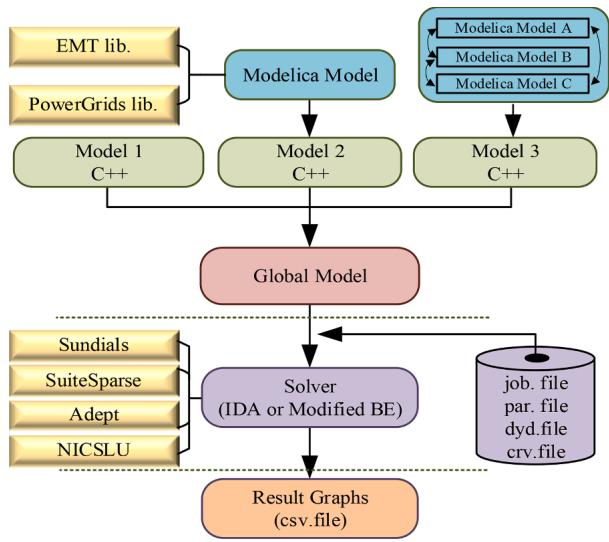  
Fig. 1. Dynaωo structure and exchanges between solvers and models.

equations for pending connections (typically currents), to be able to compile the models and then to remove these fictitious equations from the model structure, once compiled. It allows compiling models one by one to end up with pre-compiled libraries that are only instantiated at run-time. Moreover, each of these libraries can be used as many times as needed with different parameter values. Once compiled by the Open-Modelica compiler, the models are post-processed by Python scripts to provide the same methods and to have a single formalism for both C++ and Modelica models. The origin of the model is thus completely transparent for the rest of the tool and the solvers.

Solvers are decoupled from models in Dynaωo: new models can be introduced without further modifications in the solvers and new solvers can be tested and used without requiring any action on existing models. Moreover, it is easy and straightforward to compare numerical strategies and to observe and analyze the impacts on the results and performances as the modeling side is unchanged. Solvers and models only exchange a finite set of information needed for solving the system. The modeling part notably exposes the following methods to the solving part:

1 the residual functions $\mathbf { f } ( t , y , y ^ { ' } )$ which are the system equations evaluated at each time step   
2 the Jacobian matrix $\mathbf { J } ( t , y , y ^ { \prime } )$ used for the time-step numerical resolution.   
3 the root functions $\mathbf { g } ( t , y , y ^ { \prime } )$ which are used to detect instants of discrete variable changes or mode changes (i.e., a change in the form of an equation from $f _ { 1 }$ to $f _ { 2 }$ , such as a limitation).   
4 the mode functions that give the form of an equation at a time t (between $f _ { 1 }$ and $f _ { 2 } ,$ for example).

# 2.2. Native models and solvers

Dynaωo contains a set of models and solvers, natively available for any user. The provided models consist of phasor and simplified models but no EMT model is natively distributed with the tool.

Regarding solvers, any solver can be integrated, as long as it contains a few common methods such as initializing the problem, solving $\mathbf { i t } ,$ or reinitializing it. Currently, two solvers are included in Dynaωo. The first one is the Backward Euler integrator with a variable time-step strategy [16], specifically designed for long-term voltage stability simulation. The nonlinear algebraic equations resulted from the discretization of the equations are solved using Krylov Inexact Newton SOLver, KINSOL [17]. This solver is not accurate for fast transient simulations.

The second solver is a variable time-step, variable order DAE system solver called IDA [18]; a part of the SUNDIALS suite [19]. The

integration method in IDA relies on an approximation of the derivative using the $k ^ { t h }$ order backward differentiation formula (BDF) method given by the multi-step formula (1):

$$
\sum_ {j = 0} ^ {k} \alpha_ {n, j} y _ {n - j} = h _ {n} \dot {y} _ {n} \tag {1}
$$

where $y _ { n }$ and ${ \dot { y } } _ { n }$ are the computed approximations to $y ( t _ { n } )$ and ${ \dot { y } } ( t _ { n } )$ , respectively, and the step size is $h _ { n } = t _ { n } - t _ { n - 1 }$ . The coefficients $\alpha _ { n , j }$ are uniquely determined by the order k, and the history of the step sizes. On every step, it chooses the order k and step size to control local errors according to user tolerances (relative and absolute): k can, in theory, be chosen between 1 and 5 but is limited to 1 or 2 in Dynaωo to preserve the A-stability property. Two different LU factorization algorithms, i.e. KLU [20] and NICSLU [21] are coupled with the algebraic solvers. Both have proven [22] efficiency.

Regarding event handling, the IDA has been augmented to include a root-finding feature while integrating the initial value problem. The scheme is based on checking for sign changes of a set of user-defined functions, $g _ { i } ( t , y , \dot { y } )$ , over each time step taken. This scheme yields a high precision at cost of time [18].

# 2.3. Modifications, open questions, and remaining challenges for EMT simulations

To run EMT simulations with Dynaωo, it is necessary to do some modifications in the simulation codes. After adding the EMT library, it is required to enrich the range of Modelica structures in the tool: indeed, some keywords such as “delay” or some Modelica functions were not yet properly handled by the tool. Once done, a few adjustments have also to be done on the simulation structure and the numerical solver as well: default values have to be adapted to EMT-type simulations e.g., time step minimal values, strategy to reinitialize the solver after an event, or output management. These different changes enable us to compile a large part of the library and at this stage, no barrier, related to the use and support of the Modelica language, is identified that could compromise the long-term development of the approach.

Nevertheless, there are still open issues that will need further investigation and research to make definitive statements.

# 3. Simulation results

Three case studies have been used to validate the behavior of Dynaωo, enriched by the modifications presented in the last section, in terms of accuracy and performances. The obtained results and the simulation time are compared with the reference software EMTP–with the Trapezoidal and Backward Euler (BE) method–and a native opensource Modelica tool – OpenModelica. Code generation and simulations were carried out on a laptop with Intel Core i7-6820HQ 2.7 GHz 4 cores -CPU with HT; 62 GB DDR4 main memory; running on Fedora 29 and using OpenModelica 1.14.1 and Dynaωo 1.2. The simulations are performed without initialization.

# 3.1. Case 1: Capacitor bank switching

The schematic for a capacitor bank switching in a 230 kV substation sketched in OpenModelica using an EMT library is presented in Fig. 2. This case exhibits both low and high natural frequencies. It aims at studying how well the solution method performs for stiff DAE systems.

The two breakers in Fig. 2 are initially open. CB1 is closed at t=20 ms, which introduces high-frequency transient oscillations. CB1 is then opened at t=125 ms and recloses at t=175 ms. The capacitor C2 is energized at t=225 ms. The simulation interval is 500 ms with a timestep of 10 µs.

Fig. 3.a superimposes the voltage curves at C1 from Dynaωo and EMTP for the first 300 ms. Close-up views of reclosing of CB1 and closing of CB2 are given in Fig. 3.b-d. It is observed that Dynaωo results match

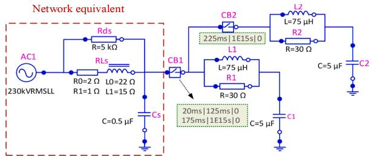  
Fig. 2. Test circuit 1; 2-step back-to-back capacitor banks sketched in OpenModelica.

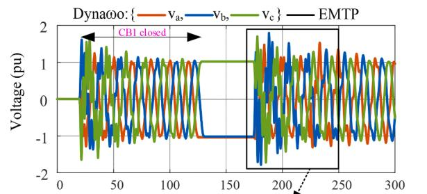

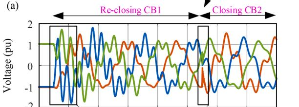

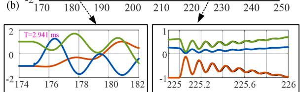  
（C） Time (ms) (d）   
Fig. 3. (a): Voltage waveforms on C1; Dynaωo solver: IDA, $\Delta t _ { m a x } = 1 0 \mu \mathrm { s } ,$ Tol=1e-6; EMTP solver: Trapezoidal/BE, $\Delta t = 1 0 \ \mu \mathrm { s } .$ . (b): Zoom-in view of voltage curves after reclosing of CB1. (c): Low-frequency oscillations of 340 Hz. (d): High-frequency oscillations of 8220 Hz due to energization C2.

perfectly the EMTP during transients. At each switching, two transient events are observable: low frequency and high-frequency oscillations. For example, energizing C1 causes oscillations with frequencies of 27.26 kHz and 340 Hz (see Fig. 3.c) respectively. At the instant of closing of CB2, the fast transient is 8220 Hz whereas the slower transient is 246 Hz as observed in Fig. 3.d and Fig. 3.b, respectively. No numerical instability e.g. numerical oscillations are identified during the simulation.

TABLE I presents the performances obtained for Dynaωo and Open-Modelica when using the IDA solver with the following parameters: initial time-step and maximum time-step is 10 µs, relative and absolute accuracy are $^ { 1 \mathrm { e } - 6 , }$ and the maximum order is 2. One should also note that IDA has been modified in Dynaωo to introduce a minimum step size: its value is set to 1e-10 s in our case. Results are compared with EMTP performance obtained with a fixed time-step of 10 µs. The simulations

TABLE I CASE STUDY 1: PERFORMANCE COMPARISON   

<table><tr><td rowspan="2">Simulator</td><td rowspan="2">Dynaoo</td><td colspan="2">OpenModelica</td><td rowspan="2">Total (C+S+AP)</td><td rowspan="2">EMTP</td></tr><tr><td>Comp.</td><td>Sim.</td></tr><tr><td>CPU-time(s)</td><td>2.34</td><td>1.59</td><td>2.11</td><td>4.21</td><td>0.5</td></tr></table>

have been run 5 times and the average computing time is extracted. It shows that the simulation time in both Modelica-based tools is similar, which is logical as the solver properties and the models used are identical. OpenModelica performs a bit better on the pure solving aspects: one possible explanation is the handling of the Jacobian calculation; in Dynaωo, the Jacobian is evaluated using automatic differentiation while it is directly available in the OpenModelica environment. Nevertheless, when adding front-end and back-end times and especially the compilation time, Dynaωo becomes 1.79 times faster than OpenModelica.

TABLE II presents the characteristics of the simulations carried out in Dynaωo and OpenModelica, especially the number of time steps solved, the number of Jacobian evaluations, and the number of residual equations: it confirms that the overall behavior of IDA in OpenModelica and Dynaωo is the same, even if small differences appear due to the precision chosen for event detection and the equation simplifications in both tools.

To further evaluate the possibilities of the simulation tool, the simulations have been relaunched with different sets of parameters. Performances and accuracy sensitivity of results for different tolerances with IDA have been assessed. TABLE III shows the performance aspects while Fig. 4.a focuses on accuracy. This figure depicts the highfrequency oscillations of voltage phase-a on C1 during energizing C2. The number of time points, $n _ { \Delta t } ,$ for different solvers is compared in Fig. 4.b. It is observed in the IDA curves, the number of time points varies depending on the rate of changes on the curve, and tolerance; e.g. $n _ { \Delta t , r e d } > n _ { \Delta t , g r e e n } > n _ { \Delta t , b l u e }$ and also $n _ { \Delta t , a } > n _ { \Delta t , b } .$ The IDA solver with the tolerance of 1e-6 yields the closest results to EMTP with a time-step of 1 µs whose CPU-time is 3.94 s. Thus, user-defined precision is a pivotal and determining parameter for selecting the step size.

# 3.2. Case 2: Switching of a parallel transmission line

Fig. 5 shows a network equivalent (coupled-RL) feeding a balanced three-phase PQ load of 500 MW and 100 MVAR at 400 kV through two identical parallel lines.

The breaker BR1 is initially open and closes at t=0 s. TLM1 and TLM2 are constant-parameter (CP) line models. In normal conditions, the line breakers are closed. L1 represents a shunt compensator. The load is connected to Bus BOR at t=100 ms. A phase-a-to ground fault with a resistance of 1 Ω is applied to the TML2 at t=200 ms. As soon as the fault is detected by the protection relays (not simulated here), an opening command is sent to the breakers BRm2 and BRk2 at t=300 ms. Then, the fault is cleared at t=350 ms and finally, the line breakers are reclosed at 430 ms. The simulation time and time-step are set to 500 ms and $5 ~ { \mu } s$ respectively.

This scenario aims at validating the accuracy of the delay operator developed in Dynaωo and stability of the solver over discontinuities imposed by several state events.

Fig. 6 depicts the voltage waveforms at the m-end of TLM2. The black curves represent EMTP results. It is observed that both curves are in excellent agreement.

Fig. 7.a illustrates the current waveforms passing through the m-end of TLM2. Fig. 7.b zoom in the transients after disconnecting the line. It shows the impact of traveling waves in phase-a and repeats nearly at each 2τ. The current continues oscillating and decreasing- due to the resistances of line and fault-until the SW is opened. Fig. 7.c shows the transients at the instant of re-energizing TLM2. One can observe that the results match the EMTP curves fully.

Similarly to the Case 1; TABLE IV reports the performances obtained

TABLE II CASE STUDY 1: IDA BEHAVIOR DURING SIMULATION   

<table><tr><td>Simulator</td><td>DynaωO</td><td>OpenModelica</td><td>EMTP</td></tr><tr><td>No. of time steps</td><td>90818</td><td>119749</td><td>50008</td></tr><tr><td>J evaluations</td><td>2963</td><td>2963</td><td>-</td></tr><tr><td>F evaluations</td><td>121481</td><td>135394</td><td>-</td></tr></table>

TABLE III PERFORMANCES FOR DIFFERENT SOLVING STRATEGIES   

<table><tr><td>Solver</td><td>CPU-time (s)</td><td>Gain (compared to IDA, tolerance = 1e-6)</td></tr><tr><td>IDA (tol. = 1e-6)</td><td>2.34</td><td>1</td></tr><tr><td>IDA (tol. = 1e-5)</td><td>1.43</td><td>1.63</td></tr><tr><td>IDA (tol. = 1e-4)</td><td>1.02</td><td>2.29</td></tr></table>

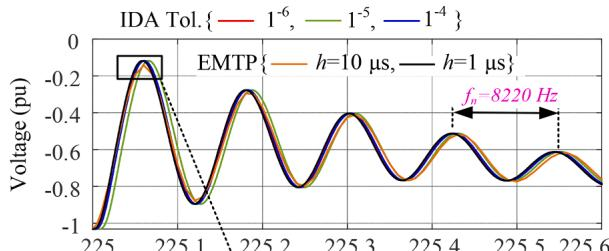

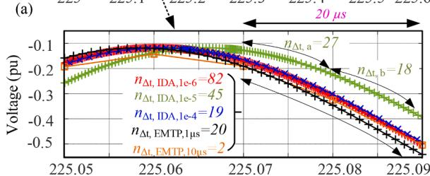  
(b) Time (ms)

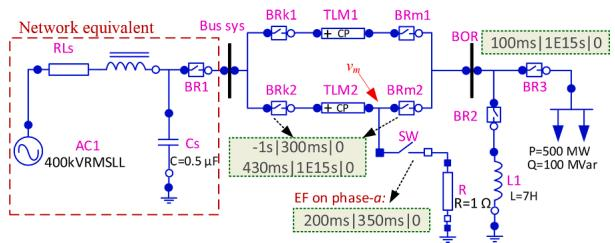  
Fig. 4. (a): Voltage waveforms on C1, phase-a at the instant of C2 energization, Dynaωo solver: IDA with different tolerances; EMTP solver: Trapezoidal/BE, Δt = 1 and 10 μs. (b): Comparison of the number of time points within 20 µs.   
Fig. 5. Test circuit 2; switching of parallel transmission lines (CP model).

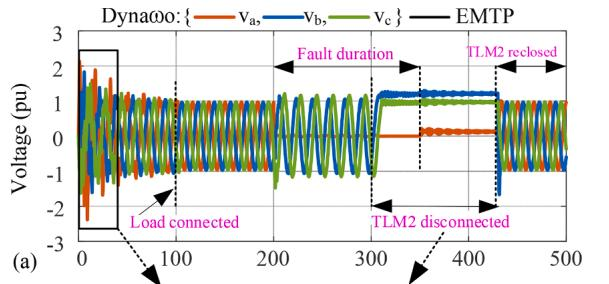

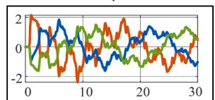  
(b)

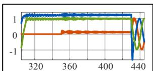  
Time (ms)   
（c）  
Fig. 6. (a): Voltage waveforms at the m-end of TLM2; Dynaωo solver: IDA, $\Delta t _ { m a x } = 5 \mu s _ { ; }$ , Tol=1e-6; EMTP solver: Trapezoidal/BE, Δt = 5 μs. (b): The close-up view of the energization of the line. (c): The zoom-in view of voltage at the m-end of TLM2 when disconnected from both sides.

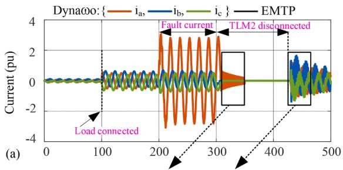

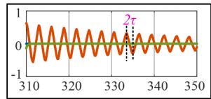  
(b)

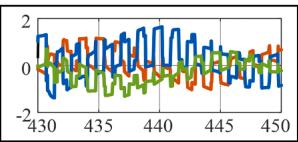  
Time (ms)   
Fig. 7. (a): Current waveforms at the m-end of TLM2. (b): The zoom-in view of current at the m-end of TLM2 after disconnecting the line. (c): The zoom-in view of current at the m-end of TLM2 at the instant of energizing of line.

TABLE IV CASE STUDY 2: PERFORMANCE COMPARISON   

<table><tr><td rowspan="2">Simulator</td><td rowspan="2">Dynaωo</td><td colspan="2">OpenModelica</td><td rowspan="2">Total (C+S+AP)</td><td rowspan="2">EMTP</td></tr><tr><td>Comp.</td><td>Sim.</td></tr><tr><td>CPU-time (s)</td><td>18.74</td><td>5.31</td><td>13.6</td><td>19.46</td><td>1.6</td></tr></table>

for Dynaωo and OpenModelica when using the IDA solver with the following parameters: initial time-step and maximum time-step is 5 µs, relative and absolute accuracy are 1e-6 and the maximum order is 2. The same network is simulated with EMTP with the time-step of 5 µs. One can see that Dynaωo presents an overall better performance of simulations compared to OpenModelica. In this case, the use of a variable timestep solver and the number of Jacobian evaluations, 16,042, are the most penalizing points. It is noted that $n _ { \Delta t , \ D y n a \omega o } = 2 0 9 _ { ; }$ 871 and $n _ { \Delta t , E M T P } = 1 0 0 , 0 1 0$ .

# 3.3. Case 3: Nonlinear circuit of surge arrester

This case study aims to examine the behavior of Dynaωo for the simulation of nonlinear components during very fast transients. The solution of nonlinear systems is accomplished with Newton iterations in Dynaωo and EMTP solvers.

Fig. 8 shows the frequency-dependent model proposed by the IEEE W.G. 3.4.11 [23] for surge arrester modeling. The model represents the arrester as two highly nonlinear resistors, ZnO1 and ZnO2, separated by an R-L filter. For slow front surges, the R-L filter is negligible; thus, ZnO1 and ZnO2 are effectively connected in parallel. For fast-front surges, the impedance of this filter becomes more important and causes a current distribution between the two nonlinear branches.

EMT modeling of surge arrester is complicated owing to the exponential segment nonlinearity. Arrester current, i is related to the

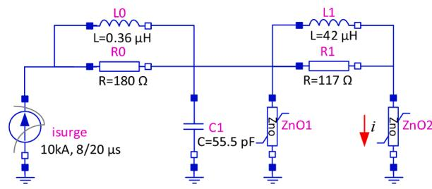  
Fig. 8. Test circuit 3; modeling of an Ohio-Brass ZnO Arrester for a 330 kV Network, MCOV=209 kV, d=1.8 m, n=1.

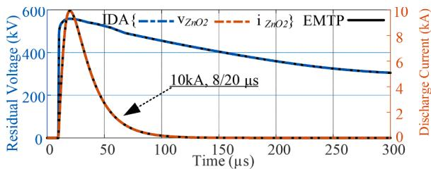  
Fig. 9. Residual voltage and discharge current curves in ZnO2. Dynaωo solver: IDA, Δt = 10ns, Tol=1e-6; EMTP: Trapezoidal/BE, Δt = 10ns.

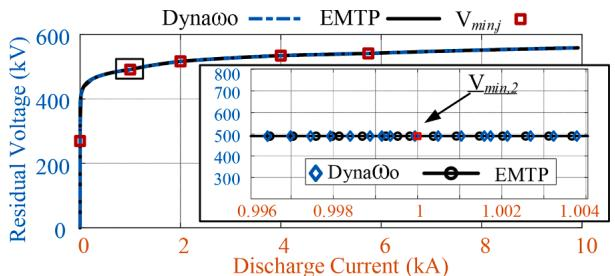  
Fig. 10. Voltage vs. current curve of ZnO2; Zoom-in view: comparison of solution points in the nonlinear segment 2.

TABLE V CASE STUDY 3: PERFORMANCE COMPARISON   

<table><tr><td rowspan="2">Simulator</td><td rowspan="2">Dynaωo</td><td colspan="2">OpenModelica</td><td rowspan="2">Total (C+S+AP)</td><td rowspan="2">EMTP</td></tr><tr><td>Comp.</td><td>Sim.</td></tr><tr><td>CPU-time (s)</td><td>0.19</td><td>0.02</td><td>0.15</td><td>0.17</td><td>0.17</td></tr></table>

voltage, $\nu _ { k m } ,$ , on fitting with exponential segments defined by:

$$
i _ {k m} = p _ {j} \left(\frac {v _ {k m}}{V _ {\text {r e f}}}\right) ^ {q _ {j}} \tag {2}
$$

where j is the segment number starting at the voltage $V _ { m i n _ { i } } ;$ , multiplier pj and exponent qj are coefficients defined for each $V _ { m i n _ { j } }$ and $V _ { r e f }$ is the arrester reference voltage. The first segment is assumed linear. The lightning current is modeled by a function given by:

$$
i (t) = i _ {m} \left[ e ^ {\alpha t} - e ^ {\beta t} \right] \tag {3}
$$

The current source generates a 10 kA, 8/20 µs lightning surge.

Simulation is run for 300 µs with $\Delta t _ { m a x } = 1 0 \ n s , \ T o l = 1 0 ^ { - 6 }$ in Dynaωo and Δt = 10 ns in EMTP. Fig. 9 illustrates the voltage and current waveforms of ZnO2 compared with EMTP. The graphs are fully superimposed. Fig. 10 shows the solution points on the non-linear characteristic curve of ZnO2. The solution points are not superimposed but are on the same slope. The solutions always remain on the actual nonlinear segments, no overshooting is observed. There are no numerical oscillations and instability. The simulation time for different simulators is presented in TABLE V. IDA solves the system with the total number of 31 790 solution points while in a fixed-step solver, e.g. Trapezoidal/BE $n _ { \Delta t } = 3 0 , 0 1 9$ .

# 4. Conclusions

Modelica is a powerful modeling language for power system simulation based on describing the models by implicit DAEs. This paper contributed a hybrid approach to EMT simulations using Modelica and C++. The new approach contributes to improving the run-time of EMTtype simulation in Modelica.

The method is based on modern concepts of programming such as declarative, equation-based, object-oriented paradigms, where all unified in Modelica. The improved approach has been validated in terms of accuracy and solution speed using EMTP. The results show that the obtained performance is better in comparison with pure Modelica tools, e.g. OpenModelica. The obtained results for all three cases also confirm the numerical stability of IDA for stiff systems, particularly including components with nonlinear characteristics.

The advantages of Dynaωo are not in numerical performance when compared to EMTP, but in high-level modeling capabilities. It is shown, however, that performance improvements are possible and further research is being conducted in this aspect.

As future work, the Dynaωo library and structures will be extended to cover other EMT-type models, e.g. WB model, synchronous machine, and control systems.

# CRediT authorship contribution statement

A. Masoom: Conceptualization, Methodology, Writing – original draft, Software, Investigation, Validation. A. Guironnet: Software, Validation, Writing – original draft, Investigation, Formal analysis. A.A. Zeghaida: Software, Data curtion, Resources. T. Ould-Bachir: Supervision, Writing – review & editing. J. Mahseredjian: Supervision, Project administration, Funding acquisition, Writing – review & editing.

# Declaration of Competing Interest

The authors declare that they have no known competing financial interests or personal relationships that could have appeared to influence the work reported in this paper.

# References

[1] P. Fritzson, Principles of Object-Oriented Modelling and Simulation with Modelica 3.3: a Cyber-Physical Approach, John Wiley & Sons, 2014.   
[2] P. Fritzson, et al., The OpenModelica integrated environment for modeling, simulation, and model-based development, Model. Identificat. Control 41 (4) (2020) 241–295.   
[3] Dymola, Dynamic Modeling Laboratory. [Online]. Available: http://www.3ds.com.   
[4] PEGASE: Pan European Grid Advanced Simulation and state Estimation, [Online]. Available: https://cordis.europa.eu/project/id/211407.   
[5] iTesla: Innovative Tools for Electrical System Security within Large Area, [Online]. Available: https://cordis.europa.eu/project/id/283012.

[6] L. Vanfretti T. Rabuzin, M. Baudette, and M. Murad, “iTesla Power Systems Library (iPSL): a Modelica library for phasor time-domain simulations”, SoftwareX, 18 May 2016.   
[7] M. Baudette, M. Castro, T. Rabuzin, J. Lavenius, T. Bogodorova, L. Vanfretti, OpenIPSL: open-instance power system library — Update 1.5 to “iTesla Power Systems Library (iPSL): a Modelica library for phasor time-domain simulations”, SoftwareX 7 (2018) 34–36. January–June.   
[8] A. Bartolini, F. Casella, A. Guironnet, Towards pan-european power grid Modelling in Modelica: design principles and a prototype for a reference power system library. Proc. 2019 International Modelica Conf., Linkoping ¨ University Electronic Press, Regensburg, Germany, 2019. March 4–6, 2019Feb 1 (No. 157).   
[9] A. Masoom, T. Ould-Bachir, J. Mahseredjian, A. Guironnet, N. Ding, Simulation of electromagnetic transients with Modelica, accuracy and performance assessment for transmission line models, Electric Power Syst. Res. 189 (2020), 106799.   
[10] J. Mahseredjian, S. Denneti`ere, L. Dub´e, B. Khodabakhchian, L. G´erin-Lajoie, On a new approach for the simulation of transients in power systems, Electric Power Syst. Res. 77 (11) (2007) 1514–1520.   
[11] H. Lundkvist, A. Yngve, Accelerated simulation of modelica models using an FPGAbased approach. Master thesis, Dept. of Electrical Engineering, Linkoping ¨ University, 2018.   
[12] P. Gibert, P. Panciatici, R. Losseau, A. Guironnet, D. Tromeur-Dervout and J. Erhel, "Speedup of EMT simulations by using an integration scheme enriched with a predictive Fourier coefficients estimator," In Proc. 2018 IEEE PES Innovative Smart Grid Technologies Conf. Europe (ISGT-Europe), Sarajevo, 2018, pp. 1-6.   
[13] W. Braun, F. Casella and B. Bachmann, “Solving large-scale modelica models: new approaches and experimental results using OpenModelica,” in Proc. 2017 International Modelica Conference, Prague, Czech Republic, May 15-15, 2017.   
[14] Dynaωo, open-source simulator for power systems, [Online]. Available: https: //dynawo.github.io/.   
[15] A. Guironnet, M. Saugier, S. Petitrenaud, F. Xavier, and P. Panciatici, “Towards an open-source solution using Modelica for time-domain simulation of power systems,” in Proc. 2018 IEEE PES Innovative Smart Grid Technologies Conf. Europe (ISGT-Europe), Sarajevo, 2018.   
[16] D. Fabozzi and T. Van Cutsem, "Simplified time-domain simulation of detailed long-term dynamic models," in Proc. 2009 IEEE Power & Energy Society General Meeting, Calgary, AB, 2009, pp. 1-8.   
[17] A. G. Taylor, A. C. Hindmarsh, “User documentation for KINSOL, a nonlinear solver for sequential and parallel computers.” Lawrence Livermore National Lab., CA (United States); 1998 Jul 1.   
[18] A.C. Hindmarsh, P.N. Brown, K.E. Grant, S.L. Lee, R. Serban, D.E. Shumaker, C. S. Woodward, Sundials: Suite of nonlinear and differential/algebraic equation solvers, ACM Trans. Math. Softw. 31 (3) (2005) 363–396.   
[19] SUNDIALS: Suite of Nonlinear and Differential/Algebraic Equation Solvers. [Online]. Available: https://computing.llnl.gov/projects/sundials.   
[20] T.A. Davis, E. Palamadai Natarajan, Algorithm 907: KLU, A direct sparse solver for circuit simulation problems, ACM Trans. Math. Softw. 37 (3) (2010), 36:1–36: 17Sep.   
[21] X. Chen, Y. Wang, H. Yang, NICSLU: An adaptive sparse matrix solver for parallel circuit simulation, IEEE Trans. Comput.-Aided Des. Integrat. Circuit. Syst. 32 (2) (2013) 261–274.   
[22] L. Razik, L. Schumacher, A. Monti, A. Guironnet and G. Bureau, "A comparative analysis of LU decomposition methods for power system simulations," in 2019 IEEE Milan PowerTech, Milan, Italy, pp. 1-6.   
[23] IEEE Working Group 3.4.11, Modeling of metal oxide surge arresters, IEEE Trans. Power Del. 7 (1) (1992) 302–309. Jan.