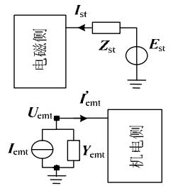
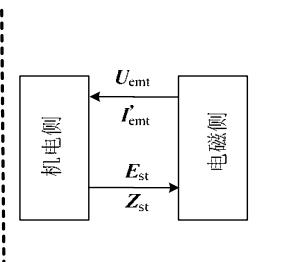
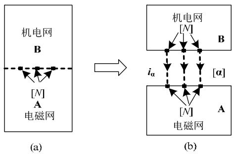
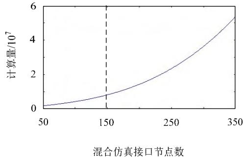
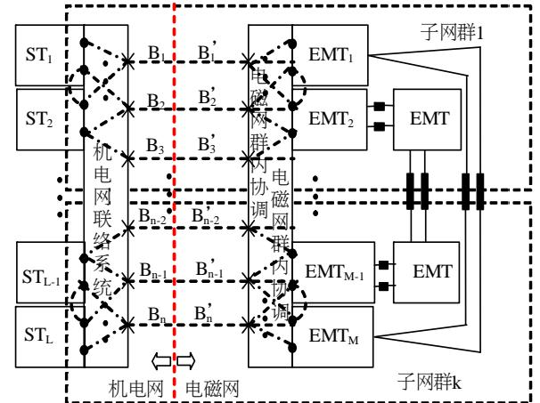
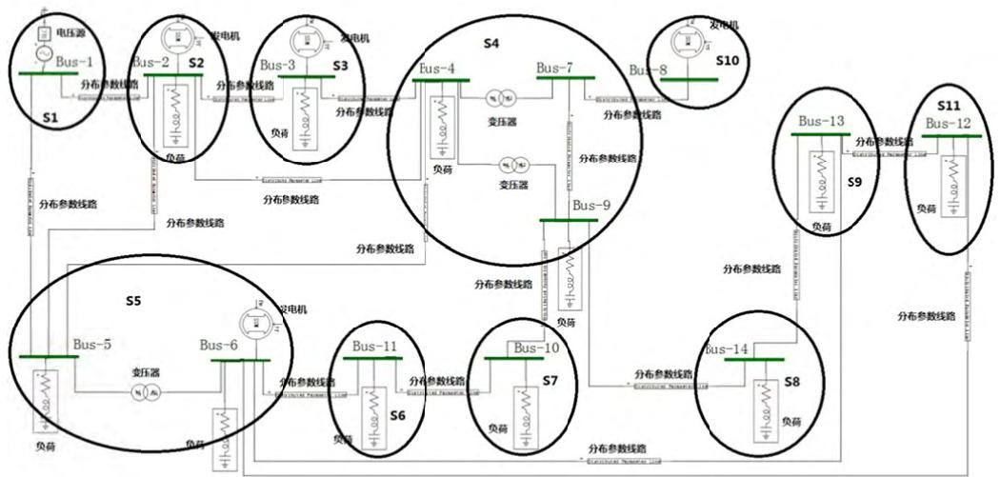
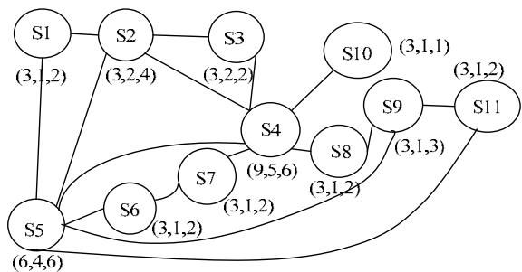
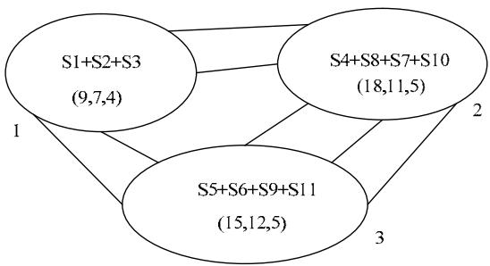
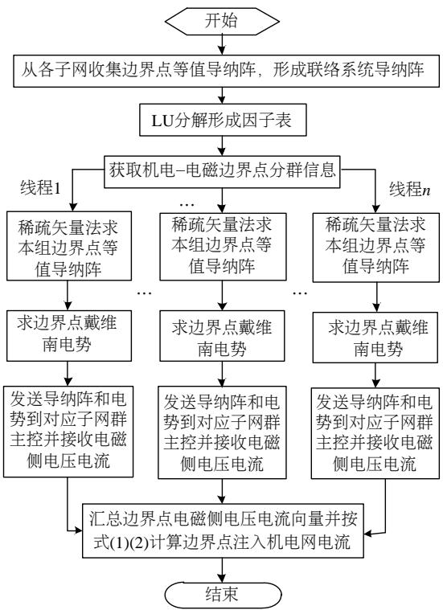
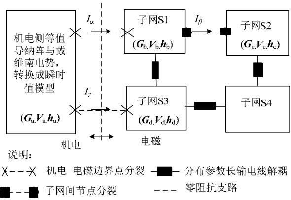

# 电力系统机电–电磁混合仿真边界解耦算法研究

徐得超 1 ，张星 1 ，何飞 2 ，穆清 1 ，金一丁 2 ，李亚楼 1 ，郭袅 3 ，祖光鑫

（1．电网安全与节能国家重点实验室(中国电力科学研究院有限公司)，北京市 海淀区 100192；

2．国家电力调度控制中心，北京市 西城区 100031；

3．黑龙江省电力科学研究院，黑龙江省 哈尔滨市 150030）

# Research on Power System Electromechanical-electromagnetic Hybrid Simulation Algorithm Based on Boundary Decoupling

XU Dechao1 , ZHANG Xing1 , HE Fei2 , MU Qing1 , JIN Yiding2 , LI Yalou1 , GUO Niao3 , ZU Guangxin3

(1. State Key Laboratory of Power Grid Safety and Energy Conservation (China Electric Power Research Institute),

Haidian District, Beijing 100192, China; 2. National Power Dispatching and Control Center, Xicheng District, Beijing 100031,

China;3. Heilongjiang Electric Power Research Institute, Harbin 150030, Heilongjiang Province, China)

ABSTRACT1 : An electromechanical-electromagnetic hybrid simulation algorithm based on boundary nodes grouping and decoupling is proposed. First UHV AC/DC backbone network is divided into electromagnetic network, and the other networks will be decoupled at the boundary nodes by group as electromechanical network. Then electromagnetic network is divided into many connected subnets by distributed parameter decoupling long transmission lines. Furthermore, according to constraint of the designated number of subnets, the heuristic rules are used for subnets merging and homogenizing, and based on the decoupling initial state of electromechanical network, the scheme of grouping boundary nodes is formed. So the subnet groups at electromechanical side are completely decoupled, and the subnet groups at electromagnetic side are only connected by decoupling long transmission lines. Finally, the parallel methods of the main control at electromechanical and electromagnetic sides are proposed based on this scheme. The theoretical derivation and simulation of the algorithm shows that the algorithm can improve the efficiency of the hybrid simulation with a large number of boundary nodes greatly.

KEY WORDS: hybrid simulation; parallel computing; network partition; electromechanical transients; electromagnetic transients

摘要：提出了一种基于边界点分群解耦的机电–电磁混合仿真算法。算法首先将特高压交直流电网划分为电磁网，实现

机电暂态网络在边界点处分组解耦；然后在电磁侧首先按照分布参数长传输线解耦将网络划分为多个连通子网，并按指定分网个数约束利用启发式规则进行子网合并和均匀化处理；接着以机电网解耦初始状态为基础形成子网群。子网群间机电侧完全解耦，电磁侧仅通过分布参数长传输线相连；最后在此分网方案基础上，提出机电侧主控进程并行化处理方法和电磁侧子网群主控进程并行算法。算法理论推导与仿真表明，文中算法能大幅提高交直流混联背景下含大量机电–电磁边界点混合仿真时计算效率。

关键词：混合仿真；并行计算；网络分割；机电暂态；电磁暂态

DOI：10.13335/j.1000-3673.pst.2018.1807

# 0 引言

我国已建成特高压交直流混联、送受端电网紧密耦合，电力电子化和电网一体化特征显著的特大型电力系统，特高压交直流骨干网络成为影响电网安全稳定运行的关键因素，客观上要求提供准确高效的仿真方法，适应电网规划与运行控制需要。

传统以研究机电暂态过程为主的大电网分析和仿真方法，已不能准确描述当前及未来电网的物理特性；以电网局部或者设备级电磁暂态建模仿真无法开展联网背景下大电网分析，研究交直流间、直流间的耦合特性。亟需开发支持大规模电磁暂态仿真功能的机电–电磁混合仿真功能。

自 1981 年 Heffernan 提出机电–电磁混合仿真思想以来[1]，混合仿真功能研究已取得大量的研究成果[2-15]。在接口电路模型选择设计方面，由于机电暂态网络一般是有源系统，电磁侧计算时一般采用戴维南等值电路替代，而在机电侧计算时电磁网

模型则有多种选择替代形式，如恒阻抗、恒电流、恒功率以及基于诺顿等值电路模型等。在接口电路数据交换时序方面，有串行交互和并行交互两种思路，串行交互由于在仿真过程中机电和电磁相互等待而仿真效率较低，但精度较高；而并行交互机电和电磁两侧并行计算，但电磁网考虑的机电网等值电势存在一个机电暂态时步的延时，精度受到影响。

目前机电–电磁混合仿真还存在若干瓶颈性问题，影响了混合仿真计算效率与精度。一方面，接口边界点数目严重影响仿真分析效率，目前仅适用于小规模电网电磁暂态建模。在混合仿真过程中，接口处的计算量尤其是电磁侧接口处的计算量随边界点数呈高次非线性增长，是影响机电–电磁混合仿真效率的关键因素。另一方面，接口位置的选择严重影响仿真精度。混合仿真机电侧采用相量模型，电磁侧采用瞬时值模型。相量模型采用基频相量有效值，基于三相对称、工频正弦波假设条件，并采用相量线性方程式描述。因此客观上对接口位置也提出了上述假设条件的限制。在波形畸变严重、谐波成份多、电压剧烈变化的接口位置，混合仿真精度受到影响。

由于机电网电路模型采用戴维南等值电路、电磁网采用诺顿等值电路模型的混合仿真接口方法具有较为广泛的实用性，本文针对该接口电路模型开展提高接口仿真效率的研究，解决含有大量电磁暂态模型边界点情况下混合仿真效率问题。其主要思路是通过选择合适的网络分割方式以及并行计算模式，实现混合仿真接口计算分群解耦，解决混合仿真接口计算量集中，并行效率较低的问题，从而实现含大规模电磁暂态网络的混合仿真。

# 现有混合仿真接口算法瓶颈分析

以电力系统全数字仿真装置(advanced digitalpower system simulation，ADPSS)机电–电磁混合仿真算法为例进行分析[6]。机电网等值为戴维南等值电路，而电磁网等值为诺顿等值电路。电路模型和数据交换示意图如图 1中 1(a)和 1(b)。其中： $ { \boldsymbol { E } } _ { \mathrm { s t } }$ 与$\mathbf { \vec { Z } } _ { \mathrm { s t } }$ 分别是机电网边界节点处戴维南等值电势和等值阻抗， $\pmb { Y } _ { \mathrm { s t } }$ 是 $\mathbf { Z } _ { \mathrm { s t } }$ 对应的等值导纳； $\pmb { I } _ { \mathrm { e m t } }$ 与 $\pmb { Y } _ { \mathrm { e m t } }$ 分别是电磁网边界节点处诺顿等值电流和等值导纳，$U _ { \mathrm { e m t } }$ 与 ${ \pmb I } _ { \mathrm { e m t } } ^ { \prime }$ 分别是边界节点处电压与注入电流。机电侧初始化完成后，可计算得到 $\mathbf { Z } _ { \mathrm { s t } }$ 和 $\pmb { Y } _ { \mathrm { e m t } }$ ，在机电仿真步长处，机电侧给电磁侧发送 $ { \boldsymbol { E } } _ { \mathrm { s t } }$ ，当网络拓扑发送变化时，还需要重新计算并发送 $\mathbf { \delta Z _ { \mathrm { s t } } }$ 。同时，机电侧从电磁侧接收边界节点电压 $U _ { \mathrm { e m t } }$ 与注入电流

  
(a)ADPSS混合仿真电路模型

  
(b)ADPSS混合仿真数据交换  
图 1 ADPSS 混合仿真接口模型  
Fig. 1 Hybrid simulation interface model of ADPSS

${ \pmb I } _ { \mathrm { e m t } } ^ { \prime }$ ，则当前步节点诺顿等值注入电流 $\pmb { I } _ { \mathrm { e m t } }$ 和机电侧在机电网联络系统总的注入电流 ${ \cal I } _ { \mathrm { t o t a l } }$ 分别是：

$$
\boldsymbol {I} _ {\text {e m t}} = \boldsymbol {I} _ {\text {e m t}} ^ {\prime} + \boldsymbol {Y} _ {\text {e m t}} \boldsymbol {U} _ {\text {e m t}} \tag {1}
$$

$$
\boldsymbol {I} _ {\text {t o t a l}} = \boldsymbol {I} _ {\text {e m t}} + \boldsymbol {Y} _ {\text {s t}} \boldsymbol {E} _ {\text {s t}} \tag {2}
$$

机电侧因为混合仿真额外增加的计算量可按如下方法估计。设 N 机电–电磁边界节点数目，n是机电暂态并行计算联络系统节点总数(n>N)。于是一个机电步长内最大计算量为：2 次维数为 3n 的联络系统阵 LU 分解；3N 次维数为 3n 右端项为单位向量的稀疏线性方程组求解；1 次维数为 3n 的稀疏线性方程组求解；式(1)(2)求解。据文献[7]，稀疏矩阵 LU 分解计算复杂度为 O(n+flops)，前代回代计算复杂度为 O(flops)。其中 $f l o p s$ 表示浮点运算次数，是和矩阵稀疏性有关的而又无法避免的浮点运算。则机电侧计算复杂度估计为：

$$
f _ {s t} (N, n) \approx 2 \cdot O (3 n + f l o p s) + (3 N + 3) \cdot O (f l o p s) (3)
$$

由式(3)可知，混合仿真机电侧计算量与 N 和n 均有关，和 N 成正比，比例系数和机电联络系统阵的一次稀疏前代回代计算量有关。

再估算下电磁侧计算量。ADPSS采用节点分裂法撕裂边界节点求解混合仿真接口电路。如图 2，A 是电磁网，B 是机电网。 $\mathbf { { { Y } _ { A } } }$ 和 $Y _ { \mathrm { B } }$ 分别是 A 和 B的节点电导矩阵； $\pmb { h } _ { \mathrm { A } }$ 和 $\pmb { h } _ { \mathrm { B } }$ 分别是 A和 B 的等值电流源。撕裂边界节点间虚线流过电流 $i _ { \alpha }$ ，维数为边界点个数 N。经推导，求解电流 $i _ { \alpha }$ 的公式如式(4)。

$$
\left(\boldsymbol {p} ^ {\mathrm {T}} \boldsymbol {Y} _ {\mathrm {A}} ^ {- 1} \boldsymbol {p} + \boldsymbol {Y} _ {\mathrm {B}} ^ {- 1}\right) \boldsymbol {i} _ {\alpha} = \boldsymbol {Y} _ {\mathrm {B}} ^ {- 1} \boldsymbol {h} _ {\mathrm {B}} - \boldsymbol {p} ^ {\mathrm {T}} \boldsymbol {Y} _ {\mathrm {A}} ^ {- 1} \boldsymbol {h} _ {\mathrm {A}} \tag {4}
$$

式中 $\pmb { p }$ 是关联矩阵，表示 $i _ { \alpha }$ 和电磁网 A边界节点的关联关系，其元素值不是 0 就是 1。一旦电流 $\dot { \iota } _ { \mathfrak { a } }$ 获得，电磁网 A所有注入电流已知，因此电磁网可解。求取电流向量 $i _ { \mathrm { a } }$ 是求解电磁网的关键，占据电磁侧大部分混合仿真接口计算量。

基于上述原理，电磁侧混合仿真接口计算量如下式的计算：

$$
\boldsymbol {E} _ {\mathrm {A B C}} = \boldsymbol {T E} _ {\mathrm {s t}} \tag {5}
$$

$$
\boldsymbol {Z} _ {\mathrm {A B C}} = \boldsymbol {T} \boldsymbol {Z} _ {\mathrm {s t}} \boldsymbol {T} ^ {- 1} = \boldsymbol {R} _ {\mathrm {s t}} + \mathrm {j} \omega L _ {\mathrm {s t}} \tag {6}
$$

  
图2 ADPSS 混合仿真接口节点分裂法求解示意图  
Fig. 2 A schematic diagram of the node splitting method in ADPSS

$$
\boldsymbol {I} _ {\mathrm {A B C}} = \boldsymbol {Z} _ {\mathrm {A B C}} ^ {- 1} \boldsymbol {E} _ {\mathrm {A B C}} = \boldsymbol {I} _ {\mathrm {A B C}} ^ {\mathrm {R}} + \mathrm {j} \boldsymbol {I} _ {\mathrm {A B C}} ^ {\mathrm {I}} \tag {7}
$$

$$
\boldsymbol {G} _ {\mathrm {s t}} = \left[ \boldsymbol {R} _ {\mathrm {s t}} + \frac {2 L _ {\mathrm {s t}}}{\Delta t (1 + \alpha)} \right] ^ {- 1} \tag {8}
$$

$$
\begin{array}{l} h _ {\mathrm {s t}} (t - \Delta t) = \frac {\Delta t (1 - \alpha)}{\Delta t R _ {\mathrm {s t}} (1 + \alpha) + 2 L _ {\mathrm {s t}}} \boldsymbol {u} (t - \Delta t) + \\ \frac {2 L _ {\mathrm {s t}} - \Delta t R _ {\mathrm {s t}} (1 - \alpha)}{2 L _ {\mathrm {s t}} + \Delta t R _ {\mathrm {s t}} (1 - \alpha)} \mathbf {i} ^ {\prime} (t - \Delta t) \tag {9} \\ \end{array}
$$

$$
i _ {\mathrm {s t}} (t) = \sqrt {\frac {2}{3}} \left[ I _ {\mathrm {A B C}} ^ {\mathrm {R}} \cos \left(\omega_ {0} t\right) - I _ {\mathrm {A B C}} ^ {\mathrm {I}} \sin \left(\omega_ {0} t\right) \right] \tag {10}
$$

这里 $\mathbf { { \pmb T } } = \left[ \begin{array} { c c c } { 1 } & { 1 } & { 1 } \\ { \mathbf { a } ^ { 2 } } & { \mathbf { a } } & { 1 } \\ { \mathbf { a } } & { \mathbf { a } ^ { 2 } } & { 1 } \end{array} \right] , \mathbf { a } = \mathbf { e } ^ { \mathrm { j } 1 2 0 ^ { \circ } }$ 2a j120 , a e     (11)

式(8)(9)中的 α 是隐式梯形积分法中的阻尼因子，其值介于 0 和1 之间。 $\Delta t$ 是电磁暂态积分步长，典型值是 $5 0 \mu \mathrm { s } \textrm { } ^ { \circ } \omega _ { 0 }$ 是参考角频率。i是流过 R-L 串联支路的电流，u 是边界点电压。式(8)中 $\mathbf { G } _ { \mathrm { s t } }$ 与式(4)中$Y _ { \mathrm { B } }$ 对应， $\operatorname { \overline { { x } } } ( 9 )$ 和(10)中 $\pmb { h } _ { \mathrm { s t } }$ 和 $i _ { \mathrm { s t } }$ 之和与 $\operatorname { \overline { { x } } } \mathrm { ( 4 ) }$ 中的 $\pmb { h } _ { \mathrm { B } }$ 对应。

根据式(4)—(10)，可以粗略估算电磁侧混合仿真接口计算量。同样，设N 是混合仿真边界节点数，m 是与边界节点直接相连的电磁子网单相节点数(m>3N)。式(4)中需要完成 $\pmb { p } ^ { \mathrm { T } } \pmb { Y } _ { \mathrm { A } } ^ { - 1 } \pmb { p }$ , ${ \pmb Y } _ { \mathbf { B } } ^ { - 1 }$ , ${ Y } _ { \mathrm { B } } ^ { - 1 } { h } _ { \mathrm { B } }$ 和$\pmb { p } ^ { \mathrm { T } } \pmb { Y } _ { \mathrm { A } } ^ { - 1 } \pmb { h } _ { \mathrm { A } }$ 这些矩阵的运算，此外还需要完成式(5)—(10)，详细的计算需求有：1 次维数为 m的 $\mathbf { { { Y } _ { A } } }$ 矩阵的 LU 分解； $\pmb { p } ^ { \mathrm { T } } \pmb { Y } _ { \mathrm { A } } ^ { - 1 } \pmb { p }$ 计算，需要求出 $\mathbf { { { Y } _ { A } } }$ 逆矩阵与边界点关联行列的元素，是 3N 次以右端项为单位向量的维数为 m 的稀疏矢量求解； $Y _ { \mathrm { B } } ^ { - }$ 1 的计算对应式(6)和式(8)的计算，是维数为3N的满阵求逆运算；${ Y } _ { \mathrm { B } } ^ { - 1 } { h } _ { \mathrm { B } }$ 是矩阵与向量相乘，计算量较小； $\pmb { p } ^ { \mathrm { T } } \pmb { Y } _ { \mathrm { A } } ^ { - 1 } \pmb { h } _ { \mathrm { A } }$ 的最大计算量不超过一次维数为 m的前代回代计算。与机电侧类似，混合仿真接口处电磁侧计算复杂度近似可估算为：

$$
\begin{array}{l} f _ {\mathrm {e m t}} (N, m) \approx O \left(N ^ {3}\right) + (3 N + 2) \cdot O (f l o p s) + \\ O (m + f l o p s) \tag {12} \\ \end{array}
$$

上式中第 2 项中前代回代计算或者矩阵乘与矩阵

维数有关，或者等于边界点数 3N 维，或者是关联电磁子网单相节点数 m。本文此处忽略其差异。由式(12)可知，混合仿真接口处电磁侧的计算量和 $N ^ { 3 }$ 成正比。

以最坏情况 $\mathbf { { { Y } _ { A } } }$ 为满阵来粗略统计下电磁侧混合仿真接口计算量。根据 LU 分解和前代回代满阵情况下计算复杂度[8]，式(12)写成

$$
f _ {\text {e m t}} (N, m) \approx N ^ {3} + (3 N + 2) \cdot \left(m ^ {2} + m\right) + \frac {m ^ {3}}{3} \tag {13}
$$

设 m=100，则 $f _ { \mathrm { e m t } }$ 和 N 的关系曲线如图 3 所示。

  
图3 电磁侧边界计算量与边界点个数N 的关系曲线  
Fig. 3 Relationship between the computation of electromagnetic side boundary and the number of boundary nodes N

由图 3 可知，但 N 大于 150 以后，电磁测计算量非线性加快增长。这说明提高混合仿真接口效率的关键是改善电磁侧接口计算效率。为达到这一目标，需要对影响接口矩阵维数 3N 的边界点解耦分组，采用并行计算提高效率；同时需要进一步减少与边界点直接相连电磁子网的规模 m，即在允许情况下分更多的电磁网。

# 2 基于边界点分群解耦的机电–电磁混合仿真算法

# 2.1 算法结构

如前所述，可以通过对边界点分组和减少与边界点直接相连的电磁子网的规模来提高机电–电磁混合仿真接口的效率。通过选择一个合适的机电–电磁分割方法，可以做到在电磁网移除后，机电网在边界节点处按组解耦。也就是说，移除电磁网后，机电网的每组边界节点各自形成电气孤岛，彼此无任何电气联系。电磁侧则通过分布参数长输电线路相连。因此，所有的机电–电磁边界节点被分组而并行，组内边界点数显著减少则有利于降维。而在电磁侧，我们还可以选择合适的分网算法划分为更多的电磁子网，从而减少每个子网规模，特别是与边界点直接相连的子网。以上两种手段可以显著减少式(3)和式(12)的计算量。算法结构示意图如图 4。

图4 本文文算法结构示意意图  
Fig. 4 Scchematic diagrram of algorithhm structure inn thiis paper   
  
机电电边界点分电磁分裂 非机电边界点分 子网群耦合关电磁分裂 群边界关系 ST机电网网分布参数输电线解数长解耦 机电边界点分电磁分裂 同一节节点 EMT电磁磁网

# 2.2 机电–电磁边界节点点分群降维

500 kVV 以上的特高高压交直流电电网是影响电电力系统动态特特性、决定电网运行稳定性性的关键因素素，要求仿真准准确。与机电暂态模型仿真真相比，电磁磁暂态模型仿真真具有很高的精度，可以较较为准确地仿仿真电力电子类类设备的动态特性。本文将将特高压交直直流主网划分为为电磁网模型，一方面满足足了仿真精度度需求，更为重重要的是，主网划分为电磁磁网后，作为为机电网的更低低电压等级的电网将形成多个电气孤岛岛，满足了从机机电–电磁边界界点解耦的要要求。

移除电电磁网后，需需要以指定的的机电–电磁边边界点为约束，对机电网进行网络划分，使之满足机机电暂态并行仿仿真效率要求，同时给定边边界点的分组组信息。步骤简简述如下：

1）对机机电网进行连连通性分析，确定多个电电气

孤岛岛并编号，以以及确定机电电–电磁分网网边界点的电电气孤孤岛号。

2）采用优优化边界表法法[11]，对机电电网进行网络络分割割，得到所有有机电暂态子子网和机电联联络系统。  
3）将机电电–电磁分网边边界点加入到机电联络络系统统。  
4）取机电––电磁分网边边界点的电气气孤岛号为初初始群群号，送给电电磁网继续进进行分网。此此时，每个机机电––电磁分网边边界点均有对对应的群号，不同群间机机电暂暂态网络在机机电侧完全拓拓扑解耦。

# 2.3 减少电磁子子网节点规模模

由于分布参参数长输电线线解耦模型在并行计算算方面面的天然优势势，首先采用用长输电线解解耦法对电磁磁网分分网，然后综综合考虑子网网规模和分网网个数限制进进行子子网合并处理理。对于子网网规模过大而而影响实时仿仿真实实时性的子网网，则结合节节点分裂法进进一步分网，以均均衡每个进程程计算量。

以下用一个个小规模电网网说明本文所述电磁分分网方方法。图 5 是是 IEEE 14节节点电网单线线图示意图。图中中共有 14个三相节点(如如 bus 字样)，4 台发电机，1 个个无穷大电压压源，3 个变压压器以及若干干个 RLC 模拟负负荷。电磁网网自动分网关关键步骤如下下：

1）根据 2..2 节所给的机机电–电磁分分网边界点的的初始始群号，建立立同一群号边边界点之间的的虚拟拓扑支支路。。这些虚拟拓拓扑支路采用用集中参数三三相传输线模模型，仅用于电磁磁网分网，不不参与仿真计计算。  
2）建立全全网拓扑图，并确定满足足长输电线解解耦条条件的线路。如图 5所示示，假设各分分布参数线路路均满满足长输电线线解耦条件，即电磁波由由线路一端到到达另另一端所需的的时间必须大大于仿真步长长。即：

$$
\tau = l / v = l \sqrt {l _ {0} c _ {0}} \geq T \tag {14}
$$

  
图5 IEEE 114 节点电网电电磁暂态单线图  
Fig. 5  Electromagneetic transient ssingle line diaggram of IEEE 114 nodes powerer system

式中：T 是仿真步长；v 是沿线电磁波传播速度；l 是输电线长度； $l _ { 0 }$ ， $c _ { 0 }$ 是单位长度电感和对地电容。当 T=50 s 时，由此可计算线路长度必须大于15 km。  
3）从图 5 中移除所有确定的长输电线解耦线路，采用深度优先搜索或者宽度优先搜索执行一次全网遍历，得到多个连通子图。如图 5 中所示$s 1 , s 2 , \cdots , s 1 1 ~ \circ$ 对每个连通子图，如果长输电线解耦线路属于子图内部元件，则还原该长输电线路的连接。  
4）计算量平衡处理。将多个连同子图的电磁全网描述成连通子图–长输电线的拓扑图，即连通子图是点，分布参数长输电线为边的拓扑图。对于每个连通子图，用子图内单相节点数描述子网规模。对图5中IEEE14节点图，处理后形成如图 $6 ( \mathrm { a } ) ~ ^ { \circ }$

  
(a)子图-长线路拓扑示意图

  
(b)三分网方案示意图  
图6 电磁网分网示意图  
Fig. 6 Schematic diagram of electromagnetic network partition

图 6(a)中，圆圈 O表示移除长传输线后的连通子图，它们之间的连接线表示长传输线。在每个连通子图下方 3 个数字分别表示为(单相节点数 $N _ { \mathrm { s u b } }$ ，子网内元件数 $N _ { \mathrm { c o m p } }$ ，相连长传输线数 $N _ { \mathrm { d s u b } } )$ ，其中单相节点数、元件数目描述了求解子网网络方程的计算量，而相连长传输线数(即连通子图的度)则描述了仿真过程中通信量大小。

对于并行仿真计算来说，计算效率实际上由计算最耗时的子网决定。要提高子网仿真效率，需要其包含的单相节点数和元件数尽可能的少，同时需要与邻近子网通信最少。因此，自动分网的最优化目标函数可以描述为：

$$
t = \min  _ {j \in (1, m)} \left(\max  _ {i \in (1, n)} \left(t _ {i} \left(N _ {\mathrm {s u b}}, N _ {\mathrm {c o m p}}\right) + t _ {i} \left(N _ {\mathrm {d s u b}}\right)\right)\right) \tag {15}
$$

上式(15)中，n 是分网数目，m是所有分网方案数目， $t _ { i } ( N _ { \mathrm { s u b } } , \ N _ { \mathrm { c o m p } } )$ 是子网 i 计算耗时，是节点数$N _ { \mathrm { s u b } }$ 和元件数 $N _ { \mathrm { { c o m p } } }$ 的函数 $^ \circ t _ { i } ( N _ { \mathrm { d s u b } } )$ 是子网 i 与其他子网交换长传输线解耦节点信息的通信耗时，是子网 i 相连长传输线数 $N _ { \mathrm { d s u b } }$ 的函数。自动分网的目标就是在所有的分网方案组合中，查找计算最耗时和通信最耗时值最小的方案。这是一个组合优化问题，当电网规模较大时组合“爆炸”，求解十分耗时。为此，本文采用启发式规则确定分网方案，虽然不能保证方案最优，但却尽可能追求每个子网计算量均衡并较小。具体关键计算环节如下：

a）根据每个子图的 $N _ { \mathrm { s u b } } { + } N _ { \mathrm { c o m p } }$ 值由大到小排列，为描述方便，设其编号分别为 $l _ { 1 } , l _ { 2 } , \cdots , l _ { n } , \cdots , l _ { k }$ ，$k { > } n$ 。  
b）按照分网目标数 n，取前 n 个子图作为分网初始方案。  
c）对子网 $n { + } 1 , \cdots , k _ { \cdot }$ ，根据如图 6(a)的拓扑图，按顺序检查其是否是子图 n 邻近连通子图，如果是子图 n+m，n<m<k，合并子图 n 和 n+m，编号为 $n ,$ ，并恢复子图间的长传输线解耦元件为子图n内部元件，更新子图 n 参数 $N _ { \mathrm { s u b } }$ ， $N _ { \mathrm { { c o m p } } }$ 以及 $N _ { \mathrm { d s u b } }$ ，更新图 $6 ( \mathrm { a } ) $ 连通子图拓扑图。  
d）转到 a），更新子图队列，继续合并子图，直至新产生的子图 n 不再有邻近连通子图为止。  
e）如果子图 n 后面还有没有处理的子图，则取子图 n1，采用子图 n相同的策略进行子图合并，如此反复至所有子网处理完毕，最后剩下的 n个子网即分网方案，连接边即确定的长传输线解耦线路。

在上述子网计算均衡处理过程中，通过对长输电解耦线路的恢复操作，即不再将其作为子网间联络线，有助于减少子网间的通信量。假设最终要求分为 3 个子网，即 $n { = } 3$ ，通过上述步骤处理，将形成如图 6(b)的电磁子网划分方案。

最后，对形成的电磁子网进行计算量实时性评估与分网调整。首先对电磁子网计算量进行实时性评估，评估依据设为：

$$
t = f \left(N _ {\text {s u b}}, N _ {\text {c o m p}}\right) <   k T \tag {16}
$$

式中 $N _ { \mathrm { s u b } }$ ， $N _ { \mathrm { { c o m p } } }$ 含义如式(15)，f 是和 $N _ { \mathrm { s u b } }$ 和 $N _ { \mathrm { c o m p } }$ 有关的函数，需要综合考虑元件模型描述、数值积分算法、计算机单核主频等因素，需在一定计算环境下测试确定，T 是电磁暂态仿真步长，k 是考虑通信等因素在内的系数，一般小于 1.0。

然后对不满足上式的电磁子网，采用节点分裂 法进一步分网，缩小子网规模，提高并行效率。

# 2.4 构建子网群分网方案

机电分网和电磁分网确定后，对机电–电磁边界节点和电磁子网进行分组，划分电磁暂态计算子网群。划分后的最终机电–电磁分群解耦子网群如图 4 所示，具体实施技术步骤如下：

1）机电–电磁网边界节点子网群号初始值取自2.2 节所生成的边界节点群号。  
2）如果采用节点分裂法后形成的电磁暂态子网关联多个机电–电磁分网边界节点，这些边界节点群号设置为它们中间最小的群号。  
3）如果电磁网中的某个电磁暂态子网关联多个不同群号的机电–电磁分网边界节点，则保留最小群号，其他与该子网关联的边界点群号修改为该最小群号。  
4）如果某一群号的机电–电磁分网边界节点关联多个电磁子网，而且这些电磁子网仅关联这一个群号，则这些电磁暂态子网组成一个电磁暂态计算子网群。

# 2.5 机电侧主控分组并行算法

本文针对机电–电磁混合仿真接口分群解耦的特点，在主控进程内按群分组，以群为单位开辟多线程，并行化计算各群机电侧等值阻抗矩阵和戴维南电势，同时每个线程建立与电磁子网群主控进程的一对一连接，交换如图 1 所示接口数据，最后汇总边界点电磁侧电压电流向量并按式(1)(2)计算边界点注入机电网电流，完成混合仿真接口处计算。本文以机电侧发生拓扑变化产生最大计算量为例说明本文的计算过程。如图 7 所示。

与现有 ADPSS 混合仿真机电侧主控算法[9-10]相比，本文算法最大的不同是将原有一个进程内求取所有混合仿真端口的计算与通信按照群号分派到多个线程，并行求解同一群号的端口等值导纳阵和端口戴维南电势，并发送到电磁侧各子网群主控进程。这种并行求解的理论依据是同一群号边界点相关联的机电网之间没有任何电气联系，因此各群机电接口解耦。

# 2.6 电磁侧主控算法

ADPSS中，混合仿真联络系统包括所有机电–电磁混合仿真边界节点和电磁网节点分裂节点，这些节点的和决定了联络系统计算矩阵维数，并且这些节点必须均在同一个电磁子网内，即电磁网并行计算主控进程内[2-4]。

本文采用如图 4 所示的边界节点分群解耦算

  
图7 机电侧主控进程最大计算情况下多线程计算流程  
Fig. 7 Flow chart of multithreading calculation under the maximum computation of main control process at electromechanical side

法，耦合的混合仿真边界节点和节点分裂节点均限制在同一个子网群内，所以接口计算矩阵规模和电磁子网规模都得以减小，而且在同一子网群内，边界节点可能分散到不同的电磁子网，这些电磁子网既可以是长输电线解耦边界电磁子网，又可以带有节点分裂边界母线接口。如图 8，三个零电阻支路集对应电流分别为 $I _ { \mathrm { { a } } } , I _ { \mathrm { { \beta } } }$ 和 $I _ { \gamma } ,$ ，各子网对应的等值电导矩阵、历史电流源以及端口电压如图 8 所示。这种情况下，不仅子网群间长输电线解耦，而且子网群内部各子网也因为长输电线而解耦。因此长输电线路相互解耦可以忽略。如果能够解得零电阻支路中的电流 $I _ { \mathrm { { a } } } , I _ { \mathrm { { \beta } } }$ 和 $I _ { \gamma } { _ { \frac { 3 } { 2 } } }$ ，则各子网能够独立并行求解。

  
图 8 电磁子网群主控进程混合仿真关系示意  
Fig. 8 Schematic diagram of hybrid simulation for master process of electromagnetic subnet group

图中： $G _ { \mathrm { a } }$ 是由式(8)计算得到的机电侧等值电导矩阵； $\pmb { h } _ { \mathrm { a } }$ 是由式(9)和式(10)计算得到的等值历史电流源； $V _ { \mathrm { a } }$ 是边界点电压，其他矩阵类推。由于机电网发电机正负阻抗不相等； $G _ { \mathrm { a } }$ 可能是不对称矩阵。

根据上图关系，可以推导出式(17)：

$$
\left[ \begin{array}{c c c c c c} \boldsymbol {G} _ {\mathrm {a}} & & & & \boldsymbol {P} _ {\mathrm {a b}} & 0 & \boldsymbol {P} _ {\mathrm {a d}} \\ & \boldsymbol {G} _ {\mathrm {b}} & & & - \boldsymbol {P} _ {\mathrm {b a}} & \boldsymbol {P} _ {\mathrm {b c}} & 0 \\ & & \boldsymbol {G} _ {\mathrm {c}} & & 0 & - \boldsymbol {P} _ {\mathrm {c b}} & 0 \\ & & & \boldsymbol {G} _ {\mathrm {d}} & 0 & 0 & - \boldsymbol {P} _ {\mathrm {d a}} \\ \boldsymbol {P} _ {\mathrm {a b}} ^ {\mathrm {T}} & - \boldsymbol {P} _ {\mathrm {b a}} ^ {\mathrm {T}} & 0 & 0 & 0 \\ \boldsymbol {P} _ {\mathrm {a d}} ^ {\mathrm {T}} & 0 & 0 & - \boldsymbol {P} _ {\mathrm {d a}} ^ {\mathrm {T}} & & 0 \\ 0 & \boldsymbol {P} _ {\mathrm {b c}} ^ {\mathrm {T}} & - \boldsymbol {P} _ {\mathrm {c b}} ^ {\mathrm {T}} & 0 & & 0 \end{array} \right] \left[ \begin{array}{l} \boldsymbol {V} _ {\mathrm {a}} \\ \boldsymbol {V} _ {\mathrm {b}} \\ \boldsymbol {V} _ {\mathrm {c}} \\ \boldsymbol {V} _ {\mathrm {d}} \\ \boldsymbol {I} _ {\alpha} \\ \boldsymbol {I} _ {\beta} \\ \boldsymbol {I} _ {\gamma} \end{array} \right] = \left[ \begin{array}{l} \boldsymbol {h} _ {\mathrm {a}} \\ \boldsymbol {h} _ {\mathrm {b}} \\ \boldsymbol {h} _ {\mathrm {c}} \\ \boldsymbol {h} _ {\mathrm {d}} \\ 0 \\ 0 \\ 0 \end{array} \right] \tag {17}
$$

式中， $P _ { \mathrm { { a b } } } .$ , $P _ { \mathrm { a d } } ,$ $\pmb { P } _ { \mathrm { b a } }$ , $P _ { \mathrm { b c } } ,$ $P _ { \mathrm { c t } }$ , $P _ { \mathrm { d a } }$ 为各子网边界节点与零电阻支路电流的关联关系，元素已知，非 0 即 1。消去电压向量 $V _ { \mathbf { a } }$ , $V _ { \mathbf { b } } ,$ , $V _ { \mathbf { c } }$ 和 $V _ { \mathbf { d } }$ 并整理后可形成式(18)。

$$
\begin{array}{l} \left[ \begin{array}{c c c} \boldsymbol {P} _ {\mathrm {b a}} ^ {\mathrm {T}} \boldsymbol {G} _ {\mathrm {b}} ^ {- 1} \boldsymbol {P} _ {\mathrm {b a}} + \boldsymbol {P} _ {\mathrm {a b}} ^ {\mathrm {T}} \boldsymbol {G} _ {\mathrm {a}} ^ {- 1} \boldsymbol {P} _ {\mathrm {a b}} & - \boldsymbol {P} _ {\mathrm {b a}} ^ {\mathrm {T}} \boldsymbol {G} _ {\mathrm {b}} ^ {- 1} \boldsymbol {P} _ {\mathrm {b c}} & \boldsymbol {P} _ {\mathrm {a b}} ^ {\mathrm {T}} \boldsymbol {G} _ {\mathrm {a}} ^ {- 1} \boldsymbol {P} _ {\mathrm {a d}} \\ \boldsymbol {P} _ {\mathrm {a d}} ^ {T} \boldsymbol {G} _ {\mathrm {a}} ^ {- 1} \boldsymbol {P} _ {\mathrm {a b}} & 0 & \boldsymbol {P} _ {\mathrm {a d}} ^ {\mathrm {T}} \boldsymbol {G} _ {\mathrm {a}} ^ {- 1} \boldsymbol {P} _ {\mathrm {a d}} + \boldsymbol {P} _ {\mathrm {d a}} ^ {\mathrm {T}} \boldsymbol {G} _ {\mathrm {d}} ^ {- 1} \boldsymbol {P} _ {\mathrm {d a}} \\ \boldsymbol {P} _ {\mathrm {b c}} ^ {\mathrm {T}} \boldsymbol {G} _ {\mathrm {b}} ^ {- 1} \boldsymbol {P} _ {\mathrm {b a}} & - \boldsymbol {P} _ {\mathrm {b c}} ^ {\mathrm {T}} \boldsymbol {G} _ {\mathrm {b}} ^ {- 1} \boldsymbol {P} _ {\mathrm {b c}} - \boldsymbol {P} _ {\mathrm {c b}} ^ {\mathrm {T}} \boldsymbol {G} _ {\mathrm {c}} ^ {- 1} \boldsymbol {P} _ {\mathrm {c b}} & 0 \end{array} \right]. \\ \left[ \begin{array}{l} I _ {\alpha} \\ I _ {\beta} \\ I _ {\gamma} \end{array} \right] = \left[ \begin{array}{l} P _ {\mathrm {a b}} ^ {\mathrm {T}} G _ {\mathrm {a}} ^ {- 1} h _ {\mathrm {a}} - P _ {\mathrm {b a}} ^ {\mathrm {T}} G _ {\mathrm {b}} ^ {- 1} h _ {\mathrm {b}} \\ P _ {\mathrm {a d}} ^ {\mathrm {T}} G _ {\mathrm {a}} ^ {- 1} h _ {\mathrm {a}} - P _ {\mathrm {d a}} ^ {\mathrm {T}} G _ {\mathrm {d}} ^ {- 1} h _ {\mathrm {d}} \\ P _ {\mathrm {c b}} ^ {\mathrm {T}} G _ {\mathrm {c}} ^ {- 1} h _ {\mathrm {c}} - P _ {\mathrm {b c}} ^ {\mathrm {T}} G _ {\mathrm {b}} ^ {- 1} h _ {\mathrm {b}} \end{array} \right] \tag {18} \\ \end{array}
$$

求解式(18)，可得零电阻支路中电流 $I _ { \mathrm { { a } } } , I _ { \mathrm { { \beta } } }$ 和 $I _ { \gamma }$ ，然后分别代入各电磁子网网络方程式，可求得各子网节点电压。

需要说明的是，式(18)左侧系数矩阵在节点分裂法应用边界点较多的情况下一般是满阵。本文构建的描述案例分网拓扑较为简单，导致系数矩阵中出现两个零矩阵。另外，机电侧送给电磁经转化为瞬时值模型的电导阵 $G _ { \mathrm { a } }$ 可能因为机电侧发电机正负序阻抗不相等而不对称，而其他电磁子网形成的电导阵是对称的，这个特点将导致应用稀疏矢量法[12]有所区别。

由于采用了分群解耦的方法，各个子网群形成的式(18)的维数很小，而且可以以子网群为单位并行求解，因此式(18)计算量相应不大。而且，系数矩阵(除 $G _ { \mathrm { a } }$ 外)和右端项的元素值均可以在各电磁子网中并行计算，因此效率能进一步提高。

# 3 实验分析

需要强调的是，与 ADPSS 现有混合仿真算法相比，本文算法对计算精度的改善是通过扩大电磁模型仿真规模实现的。从原理上看，本文算法并没

有提高混合仿真的计算稳定性，但分群解耦策略能明显提高仿真效率。下面对不同分群解耦选择进行实验分析，案例采用某 40000 节点级实际电网进行验证。案例规模信息如下：电网含 41703 节点，其中电磁网含 16 条高压直流输电系统，单相节点共计 9691 个，机电–电磁接口三相节点 176 个，仿真过程共 5 s。采用英特尔至强 E7-8891V3 处理器、主频 2.8 GHz 高性能服务器 1 台，实时 Windriver操作系统，最高支持 316 线程并行计算。实验结果如表 1 所示。

表 1 不同分群解耦方案计算效率结果  
Tab. 1 Results of computing efficiency of different grouping and decoupling schemes   

<table><tr><td>序号</td><td>机电 子网数</td><td>电磁 子网数</td><td>边界点 分组数</td><td>最大子网群 (边界节点数)</td><td>计算 时间/s</td></tr><tr><td>1</td><td>1</td><td>1</td><td>1</td><td>176</td><td>14520.3</td></tr><tr><td>2</td><td>8</td><td>30</td><td>1</td><td>176</td><td>149.168</td></tr><tr><td>3</td><td>8</td><td>50</td><td>4</td><td>167</td><td>140.803</td></tr><tr><td>4</td><td>8</td><td>100</td><td>18</td><td>78</td><td>46.781</td></tr><tr><td>5</td><td>8</td><td>150</td><td>30</td><td>35</td><td>30.941</td></tr><tr><td>6</td><td>8</td><td>200</td><td>31</td><td>63</td><td>39.086</td></tr><tr><td>7</td><td>8</td><td>250</td><td>38</td><td>22</td><td>29.813</td></tr></table>

从表 1 仿真效率结果来看，边界点分组解耦显著提高了仿真效率。方案 7 和方案 1 相比，效率提高约 487 倍。此外，总体仿真效率不仅受电磁分网个数影响，更受到最大子网群边界节点数的制约。例如表 1 中方案 5 和方案 6。尽管方案 6 划分了200 个电磁子网，但由于最大子网群边界点(63)显著大于方案 5的(35)，其计算效率反而有所下降。

# 4 结论

本文在现有 ADPSS 混合仿真功能基础上，提出一种基于边界点分组，提高大规模交直流混联电网仿真精度的机电–电磁混合仿真算法。经过上文分析和推导，得出如下结论：

1）将特高压交直流电网采用电磁暂态建模，扩大了电磁暂态建模范围，有助于提高仿真精度；将机电–电磁边界点进行节点解耦分组，并将边界点和电磁子网划分为子网群进行并行计算，有助于提高仿真效率。  
2）提高机电–电磁混合仿真效率的2个关键是：将边界点分组解耦并划分为子网群，进行并行计算可消去混合仿真边界处效率低的瓶颈；通过电磁网自动分网技术均匀化电磁子网计算量，并减小与边界点直接相连的电磁网规模可加速电磁网计算速度进而提高混合仿真效率。

算法理论推导与案例仿真表明，本文算法能显

著提高现有交直流耦合电网含有大量机电–电磁边界点混合仿真时计算效率，进一步提升现有 ADPSS机电–电磁混合仿真能力。但最大子网群边界节点数目成为影响机电–电磁混合仿真效率的关键因素，后续应在机电–电磁边界点分组的均匀性方面进一步挖掘并行计算效率。

# 参考文献

[1] Heffernan M D，Turner K S，Arrillaga J，et al．Computation of AC-DCsystem disturbance[J]．IEEE Transactions on Power Apparatus &Systems，1981，100(11)：4341-4363  
[2] 岳程燕，田芳，周孝信，等．电力系统电磁暂态-机电暂态混合仿真接口原理[J]．电网技术，2006，30(1)：23-27  
Yue Chengyan，Tian Fang，Zhou Xiaoxin，et al．Principle of interfacesfor hybrid simulation of power system electromagnetic-electromechanical transient process[J]．Power System Technology，2006，30(1)：23-27(in Chinese)  
[3] 岳程燕，田芳，周孝信，等．电力系统电磁暂态-机电暂态混合仿真接口实现[J]．电网技术，2006，30(4)：6-9  
Yue Chengyan，Tian Fang，Zhou Xiaoxin，et al．Implemention of interfaces for hybrid simulation of power system electromagneticelectromechanical transient process[J]．Power System Technology， 2006，30(4)：6-9(in Chinese)   
[4] 岳程燕．电力系统电磁暂态与机电暂态混合实时仿真的研究[D]．北京：中国电力科学研究院，2004．  
[5] 柳勇军．电力系统机电暂态和电磁暂态混合仿真技术的研究[D]．北京：清华大学，2006  
[6] 中国电力科学研究院．电力系统全数字仿真装置用户手册V 2.0：概述[M]．北京：中国电力科学研究院，2011  
[7] Davis T A．Fundamentals of algorithms：direct methods for sparse linear systems[M]．Philadelphia：SIAM Society for Industrial and Applied Mathematics，2006．   
[8] William H，Teukolsky Saul A，Vetterling W T，et al．Numerical recipes in C++ the art of scientific computing second edition[M]．Beijing： Publishing House of Electronics Industry，2003   
[9] 李亚楼，周孝信，吴中习．基于PC 机群的电力系统机电暂态仿真并行算法[J]．电网技术，2003，27(11)：6-12  
Li Yalou，Zhou Xiaoxin，Wu Zhongxi．Personal computer cluster based parallel algorithms for power system electromechanical transient stability simulation[J]．Power System Technology，2003， 27(11)：6-12(in Chinese)

[10] 李亚楼，周孝信，吴中习．一种可用于大型电力系统数字仿真的复杂故障并行计算方法[J]．中国电机工程学报，2003，23(12)：1-5Li Yalou，Zhou Xiaoxin，Wu Zhongxi．A parallel complex faultcomputation algorithm for large-scale power system digital simulation[J]．Proceedings of the CSEE，2003，23(12)：1-5(in Chinese)  
[11] 李亚楼．大规模电力系统机电暂态实时仿真算法及软件的研究[D]．北京：中国电力科学研究院，2003  
[12] 张伯明，陈寿孙，严正．高等电力网络分析[M]．北京：清华大学出版社，2007．  
[13] 蔡普成，向往，彭红英，等. 基于 ADPSS 的含背靠背 MMC-HVDC系统的交直流电网机电-电磁混合仿真研究[J]. 电网技术，2018，42(12)：3888-3894．  
Cai Pucheng ， Xiang Wang ， Peng Hongying ， et al ． Hybridelectromechanical-electromagnetic simulation of AC/DC power gridwith back-to-back MMC-HVDC system based on ADPSS[J]．PowerSystem Technology，2018，42(12)：3888-3894(in Chinese)  
[14] 董鹏，朱艺颖，郭强，等．基于HYPERSIM的直流输电系统数模混合仿真接口技术研究[J]．电网技术，2018，42(12)：3895-3902Dong Peng，Zhu Yiying，Guo Qiang，et al．Hybrid digital-analogsimulation interface technology for HVDC system based onHYPERSIM[J] ． Power System Technology ， 2018 ， 42(12) ：3895-3902(in Chinese)  
[15] 陈亮，黄强，贾萌萌，等．基于柔性直流互联的交直流混合配电网建模与仿真分析[J]．电网技术，2018，42(5)：1410-1416  
Chen Liang，Huang Qiang，Jia Mengmeng，et al．Modeling and simulation analysis of hybrid AC/DC distribution network based on flexible DC interconnection[J]．Power System Technology，2018， 42(5)：1410-1416(in Chinese)

  
徐得超

收稿日期：2018-08-01。

作者简介：

徐得超(1975)，男，硕士，通信作者，教授级高级工程师，研究方向为电力系统数字仿真，E-mail：xdc@epri. sgcc.com.cn；

张星(1982)，男，博士，教授级高级工程师，研究方向为电力系统数字仿真，E-mail：zhangxing@epri.sgcc.com.cn；

穆清(1983)，男，博士，高级工程师，研究方向为电力系统数字仿真，E-mail：muqing@epri.sgcc.com.cn。

（责任编辑 王晔）