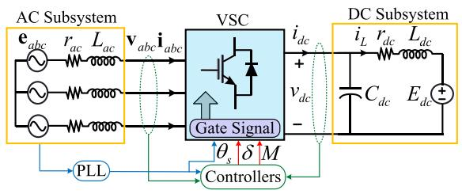
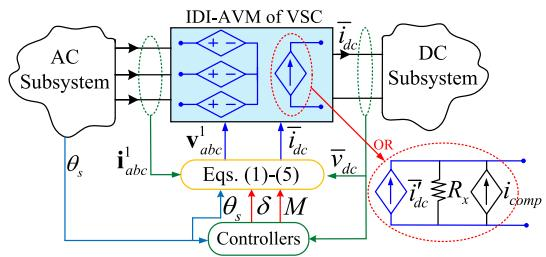
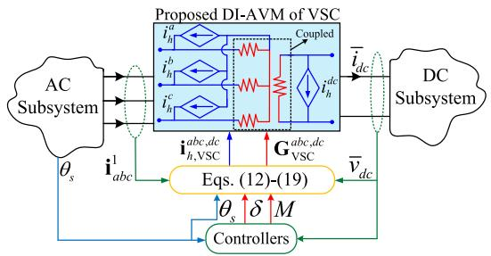
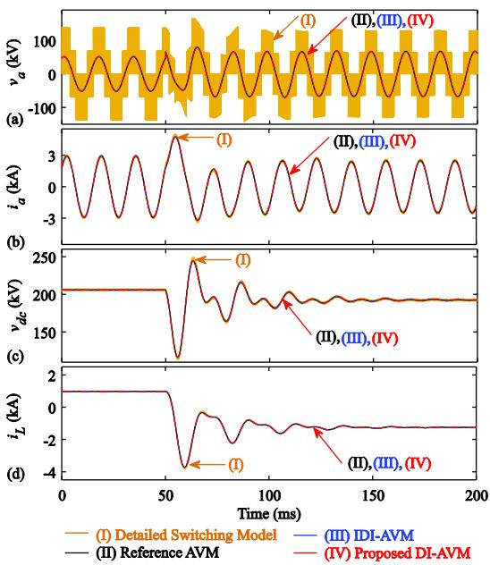
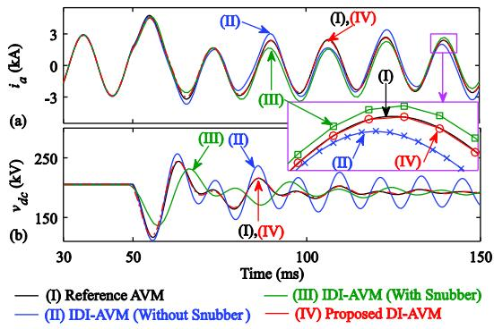
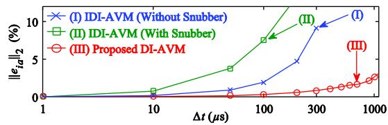

# Average-Value Model for Voltage-Source Converters With Direct Interfacing in EMTP-Type Solution

Seyyedmilad Ebrahimi , Member, IEEE, and Juri Jatskevich , Fellow, IEEE

Abstract—Average-value models (AVMs) of high-frequency switching voltage-source converters (VSCs) are indispensable for fast/efficient simulation of VSC-based power systems. However, in EMT/EMTP-type programs large simulation time-steps cannot be utilized with conventional non-iterative interfacings of AVMs due to numerical inaccuracy/instability as a result of a one-time-step interfacing delay. In this letter, a directly-interfaced AVM has been developed for the VSCs which eliminates the interfacing delay and allows large time-steps. This is achieved by formulating the AVM in the nodal form that is solved simultaneously with the overall network nodal equations. The new proposed model is demonstrated to outperform the existing AVMs of VSCs in terms of accuracy at fairly large time steps.

Index Terms—Average-value model, direct interfacing, HVDC, interfacing, nodal, simulation, VSC.

# I. INTRODUCTION

OLTAGE-SOURCE converters (VSCs) are utilized in a broad range of applications, e.g., HVDC Light systems [1], FACTS devices, wind generation, aircraft and vehicle power systems, etc. The offline and real-time electromagnetic transient (EMT) and EMTP-type programs that are indispensable for system studies are now being pushed to their limits. Numerical techniques that enable using large time-step sizes for simulations of VSC-based networks and better utilization of the available simulation hardware are becoming particularly important. Efforts are made to allow larger time-steps in offline/real-time simulations, e.g., superstep in RTDS NovaCor [2], etc.

Due to the high-frequency switching, the discrete detailed models of the VSCs require small time steps for numerical stability/accuracy and are thus not suitable for large-scale simulations. Alternatively, the average-value models (AVMs) [3] of VSCs have been utilized for such studies, wherein the details of switching are neglected (averaged out) to facilitate faster simulations by allowing larger time-steps. The AVMs are continuous and independent of the switching frequency; and are valid for dynamics only slower than the switching frequency [3] beyond which the averaging assumptions that are used in their derivations may no longer be valid.

Manuscript received 17 June 2022; revised 22 September 2022; accepted 24 October 2022. Date of publication 7 November 2022; date of current version 22 August 2023. This work was supported by the Natural Science and Engineering Research Council (NSERC) of Canada under the Collaborative Research and Development Grant. Paper no. PESL-00167-2022. (Corresponding author: Juri Jatskevich.)

The authors are with the Electrical and Computer Engineering Department, The University of British Columbia, Vancouver, BC V6T 1Z4, Canada (e-mail: ebrahimi@ece.ubc.ca; jurij@ece.ubc.ca).

Color versions of one or more figures in this article are available at https://doi.org/10.1109/TEC.2022.3220085.

Digital Object Identifier 10.1109/TEC.2022.3220085

  
Fig. 1. A generic VSC-based ac–dc system.

In many EMTP-type programs, e.g., PSCAD, the AVMs of VSCs can be readily implemented using controlled voltage/current sources that are interfaced with external circuits [3]. This type of non-iterative interface with the nodal approach requires a time-step delay between the external network solution and the controlled sources (and is referred to as indirect interfacing). This delay can cause numerical inaccuracy/instability at large time-steps and inevitably limits the advantage of AVMs in system-level simulations of VSC-based networks.

Recently, direct interfacing has been developed for AVMs of the line-commutated converters (i.e., diode or thyristorcontrolled rectifiers) in EMTP-type programs [4]. This letter develops and presents the direct interfacing of the AVMs of the widely-utilized VSCs. This is done by formulating the VSC AVM equations according to the EMTP non-iterative approach, wherein the discretized conductance matrix and controlled history terms naturally depend on the previous time-step (thus removing any artificial time-step delays). The AVM sub-matrices are then incorporated into the overall network nodal equation and solved simultaneously with the external networks, allowing large time-steps, as verified by the presented computer studies.

It is noted the directly interfaced AVM developed in this letter would be valid for both rectifier and inverter modes of operation of the VSCs. Also, the proposed model is based on the analytical AVM [3] (as opposed to [4], which requires numerically-extracted lookup tables).

# II. FORMULATION AND INTERFACING OF AVMS FOR VSCS

For the purpose of this letter, it is assumed that the ac subsystem connected to the VSC is modeled as a Thévenin equivalent circuit shown in Fig. 1. Therein, the equivalent sources are specified by voltages ${ \bf e } _ { a b c }$ and angle $\theta _ { s }$ which can be typically identified by a PLL-type grid synchronization. The VSC outputs the ac voltages $\mathbf { v } _ { a b c }$ (with respect to the neutral point of the Thévenin sources) whose fundamental frequency components are shifted from $\theta _ { s }$ by the angle δ, and their amplitude is specified by the modulation index M. The variables M and δ can be either set manually or calculated by the power/current controllers.

To formulate the AVM, the ac variables are transformed to a rotating qd reference frame using Park’s transformation matrix

  
Fig. 2. Implementation of the conventional IDI-AVM of VSCs in EMTP-type programs using controlled voltage/current sources at the interface.

${ \bf K } ( \theta _ { s } ) [ 4 ]$ . Next, the average values of the dc variables $( \mathrm { i } . \mathrm { e } . , \bar { v } _ { d c }$ and $i _ { d c } )$ are related to the average values of the transformed ac variables $( \mathrm { i } . \mathrm { e } . , \bar { \mathbf { v } } _ { q d }$ and $\ { \overline { { \mathbf { i } } } } _ { q d }$ in qd coordinates, which correspond to the fundamental frequency components $\mathbf { v } _ { a b c } ^ { 1 }$ and $\mathbf { i } _ { a b c } ^ { 1 }$ in abc coordinates, respectively).

# A. Indirect Interfacing of AVMs

To implement the AVM [3], the VSC switches are replaced with controlled voltage/current sources, as depicted in Fig. 2. Therein, the interfacing ac voltage sources $\mathbf { v } _ { a b c } ^ { 1 }$ v1abc can be expressed in terms of the dc-side voltage $\bar { v } _ { d c }$ as [3]

$$
\begin{array}{l} \mathbf {v} _ {a b c} ^ {1} = \left[ \begin{array}{c c c} v _ {a} ^ {1} & v _ {b} ^ {1} & v _ {c} ^ {1} \end{array} \right] ^ {T} = [ \mathbf {K} (\theta_ {s}) ] ^ {- 1} \bar {\mathbf {v}} _ {q d}, \\ \bar {\mathbf {v}} _ {q d} = \left[ \begin{array}{l} \bar {v} _ {q} \\ \bar {v} _ {d} \end{array} \right] = \frac {1}{2} M \left[ \begin{array}{l} \cos (\delta) \\ \sin (\delta) \end{array} \right] \bar {v} _ {d c}. \tag {1} \\ \end{array}
$$

Also, the interfacing dc current source is expressed in terms of the ac-side currents $\mathbf { \bar { i } } _ { a b c } ^ { 1 }$ (or $\ { \overline { { \mathbf { i } } } } _ { q d }$ equivalently) as [3]

$$
\bar {i ^ {\prime}} _ {d c} = \frac {3}{4} M \cos (\varphi) \left\| \overline {{\mathbf {i}}} _ {q d} \right\|,
$$

$$
\overline {{\mathbf {i}}} _ {q d} = \left[ \begin{array}{c} \bar {i} _ {q} \\ \bar {i} _ {d} \end{array} \right] = \left[ \mathbf {K} \left(\theta_ {s}\right) \right] \left[ \begin{array}{l l l} i _ {a} ^ {1} & i _ {b} ^ {1} & i _ {c} ^ {1} \end{array} \right] ^ {T}, \tag {2}
$$

where $\varphi$ is the power factor angle of VSC and is calculated as

$$
\varphi = \tan^ {- 1} \left(\bar {i} _ {d} / \bar {i} _ {q}\right) - \delta . \tag {3}
$$

The ac currents and the dc voltage are computed by the ac and dc subsystems, respectively; and their values are used to control the interfacing sources. To improve the dc-side interface and provide numerical damping, a snubber resistor $R _ { x }$ can be used to establish the dc voltage as [4]

$$
\bar {v} _ {d c} = R _ {x} \left(\bar {i} _ {d c} ^ {\prime} + i _ {c o m p} - \bar {i} _ {d c}\right), \tag {4}
$$

where the source $i _ { c o m p }$ for compensation is computed as

$$
i _ {c o m p} (t) = \bar {v} _ {d c} (t - \Delta t) / R _ {x}. \tag {5}
$$

In EMTP-type programs, the interfacing output variables at the current time-step $\bar { [ \mathbf { i } . e . , \mathbf { v } _ { a b c } ^ { 1 } ( t ) }$ and $\bar { i } _ { d c } ( t )$ in Fig. 2] are calculated based on the values of the input variables from the previous time-step [i.e., $\bar { v } _ { d c } ( t - \Delta t )$ and $\mathbf { i } _ { a b c } ^ { 1 } ( t - \Delta t ) ]$ using (1)–(3). This one-time-step delay in the so-called indirect-interfacing method may cause errors and/or lead to instability in numerical solutions at larger time-step sizes Δt [4].

# B. Proposed Direct Interfacing of AVMs

In the proposed method, the AVM of VSC is reformulated in the nodal form $( \mathrm { i . e . , G \cdot V = I } )$ . This allows merging the VSC nodal equations into the overall network nodal matrices so that the AVM equations can be solved together with the rest of the system without the time-step delay. For this purpose, first, the

AVM formulations are written in qd coordinates as

$$
\left[ \begin{array}{l} \overline {{\mathbf {v}}} _ {q d} \\ \bar {v} _ {d c} \end{array} \right] = \mathbf {Z} _ {\mathrm {V S C}} ^ {q d, d c} \left[ \begin{array}{l} \underline {{\mathbf {i}}} _ {q d} \\ \bar {i} _ {d c} \end{array} \right] + \mathbf {e} _ {h, \mathrm {V S C}} ^ {q d, d c}, \tag {6}
$$

$$
\mathbf {e} _ {h, \mathrm {V S C}} ^ {q d, d c} = \left[ \begin{array}{l l} \mathbf {e} _ {h} ^ {q d} & e _ {h} ^ {d c} \end{array} \right] ^ {T}, \mathbf {e} _ {h} ^ {q d} = \left[ \begin{array}{l l} e _ {h} ^ {q} & e _ {h} ^ {d} \end{array} \right] ^ {T}. \tag {7}
$$

To obtain the impedance matrix ${ \mathbf { Z } } _ { \mathrm { V S C } } ^ { q d , d c }$ and history terms $\mathbf { e } _ { h , \mathrm { V S C } } ^ { q d , d c }$ in $( 6 ) ,$ the formulations (1)–(5) are rewritten to express the voltages in terms of currents as

$$
\left\{ \begin{array}{l} \bar {v} _ {q} (t) = \frac {1}{2} M R _ {x} \cos (\delta) \left(\frac {3}{4} M \sqrt {\left(\bar {i} _ {q} (t)\right) ^ {2} + \left(\bar {i} _ {d} (t)\right) ^ {2}} \cos (\varphi) \right. \\ \left. \quad + i _ {c o m p} - \bar {i} _ {d c}\right) \\ \bar {v} _ {d} (t) = \frac {1}{2} M R _ {x} \sin (\delta) \left(\frac {3}{4} M \sqrt {\left(\bar {i} _ {q} (t)\right) ^ {2} + \left(\bar {i} _ {d} (t)\right) ^ {2}} \cos (\varphi) \right. . \\ \left. \quad + i _ {c o m p} - \bar {i} _ {d c}\right) \\ \bar {v} _ {d c} (t) = R _ {x} \left(\frac {3}{4} M \sqrt {\left(\bar {i} _ {q} (t)\right) ^ {2} + \left(\bar {i} _ {d} (t)\right) ^ {2}} \cos (\varphi) + i _ {c o m p} - \bar {i} _ {d c}\right) \end{array} \right. \tag {8}
$$

After manipulations using trigonometric identities [4], (8) can be written in the form of (6) where the impedance matrix ${ \mathbf { Z } } _ { \mathrm { V S C } } ^ { q d , d c }$ yields

$$
\begin{array}{l} \mathbf {Z} _ {\mathrm {V S C}} ^ {q d, d c} = \left[ \begin{array}{c c} \mathbf {Z} _ {q d} & \mathbf {Z} _ {q d, d c} \\ - \mathbf {\bar {Z}} _ {d c, q d} & - \bar {Z} _ {d c, d c} \end{array} \right] \\ = \left[ \begin{array}{c c c} \frac {3}{8} M ^ {2} R _ {x} \cos^ {2} (\delta) & \frac {3}{1 6} M ^ {2} R _ {x} \sin (2 \delta) & \frac {- 1}{2} M R _ {x} \cos (\delta) \\ \frac {3}{1 6} M ^ {2} R _ {x} \sin (2 \delta) & \frac {3}{8} M ^ {2} R _ {x} \sin^ {2} (\delta) & \frac {- 1}{2} M R _ {x} \sin (\delta) \\ \dots & \dots & \dots \\ \frac {3}{4} M R _ {x} \cos (\delta) & \frac {3}{4} M R _ {x} \sin (\delta) & - R _ {x} \end{array} \right]. \tag {9} \\ \end{array}
$$

Also, the history terms are calculated as

$$
\mathbf {e} _ {h} ^ {q d} = \frac {1}{2} M \left[ \begin{array}{l} \cos (\delta) \\ \sin (\delta) \end{array} \right] \bar {v} _ {d c} (t - \Delta t), e _ {h} ^ {d c} = \bar {v} _ {d c} (t - \Delta t). \tag {10}
$$

Then, the $_ { q d }$ variables in (6) are transformed to the abc coordinates to obtain the terminal variables of the VSC as

$$
\left[ \begin{array}{c} \mathbf {v} _ {a b c} ^ {1} \\ \bar {v} _ {d c} \end{array} \right] = \mathbf {Z} _ {\mathrm {V S C}} ^ {a b c, d c} \left[ \begin{array}{c} \mathbf {i} _ {\frac {1}{a b c}} \\ \bar {i} _ {d c} \end{array} \right] + \mathbf {e} _ {h, \mathrm {V S C}} ^ {a b c, d c}. \tag {11}
$$

In (11), the impedance matrix is formed as

$$
\mathbf {Z} _ {\mathrm {V S C}} ^ {a b c, d c} = \left[ - \begin{array}{c c c} - & \mathbf {Z} _ {a b c} & \\ - & \bar {\mathbf {Z}} _ {d c, a b c} & - \end{array} - \begin{array}{c c c} & \mathbf {Z} _ {a b c, d c} \\ - & \bar {\mathbf {Z}} _ {d c, d c} & \end{array} - \right], \tag {12}
$$

where its entries are calculated as (13) shown at the bottom of the next page, and

$$
\begin{array}{l} \mathbf {Z} _ {a b c, d c} = \left[ \mathbf {K} \left(\theta_ {s}\right) \right] ^ {- 1} \mathbf {Z} _ {q d, d c} \\ = \frac {- 1}{2} M R _ {x} \left[ \begin{array}{l} \cos (\theta_ {s} - \delta) \\ \cos (\theta_ {s} - \delta - 2 \pi / 3) \\ \cos (\theta_ {s} - \delta + 2 \pi / 3) \end{array} \right], \tag {14} \\ \end{array}
$$

$$
\begin{array}{l} \mathbf {Z} _ {d c, a b c} = \frac {2}{3} [ \mathbf {K} (\theta_ {s}) ] ^ {- 1} \mathbf {Z} _ {d c, q d} \\ = \frac {- 1}{2} M R _ {x} \left[ \begin{array}{l} \cos (\theta_ {s} - \delta) \\ \cos (\theta_ {s} - \delta - 2 \pi / 3) \\ \cos (\theta_ {s} - \delta + 2 \pi / 3) \end{array} \right] ^ {T}. \tag {15} \\ \end{array}
$$

Also, the vector of history terms in (11) is defined as

$$
\mathbf {e} _ {h, \mathrm {V S C}} ^ {a b c, d c} = \left[ \begin{array}{l l} \mathbf {e} _ {h} ^ {a b c} & e _ {h} ^ {d c} \end{array} \right] ^ {T}, \quad \mathbf {e} _ {h} ^ {a b c} = \left[ \begin{array}{l l l} e _ {h} ^ {a} & e _ {h} ^ {b} & e _ {h} ^ {c} \end{array} \right] ^ {T}, \tag {16}
$$

  
Fig. 3. Implementation of the proposed DI-AVM of VSCs in EMTP-type programs using conductance matrix and history sources.

and is obtained as

$$
\begin{array}{l} \mathbf {e} _ {h} ^ {a b c} = \left[ \mathbf {K} (\theta_ {s}) \right] ^ {- 1} \mathbf {e} _ {h} ^ {q d} \\ = \frac {1}{2} M \left[ \begin{array}{c} \cos (\theta_ {s} - \delta) \\ \cos (\theta_ {s} - \delta - 2 \pi / 3) \\ \cos (\theta_ {s} - \delta + 2 \pi / 3) \end{array} \right] \bar {v} _ {d c} (t - \Delta t). \tag {17} \\ \end{array}
$$

It is noted that (11) can be written in the form of G  V = I using the conductance matrix and history currents as

$$
\mathbf {G} _ {\mathrm {V S C}} ^ {a b c, d c} \left[ \begin{array}{c} \mathbf {v} _ {a b c} ^ {1} \\ \bar {v} _ {d c} \end{array} \right] = \left(\left[ \begin{array}{c} \mathbf {i} _ {a b c} ^ {1} \\ \bar {i} _ {d c} \end{array} \right] + \mathbf {i} _ {h, \mathrm {V S C}} ^ {a b c, d c}\right), \tag {18}
$$

where

$$
\mathbf {G} _ {\mathrm {V S C}} ^ {a b c, d c} = \left[ \mathbf {Z} _ {\mathrm {V S C}} ^ {a b c, d c} \right] ^ {- 1},
$$

$$
\mathbf {i} _ {h, \mathrm {V S C}} ^ {a b c, d c} = \left[ \mathbf {G} _ {\mathrm {V S C}} ^ {a b c, d c} \right] \mathbf {e} _ {h, \mathrm {V S C}} ^ {a b c, d c} = \left[ \begin{array}{l l l l} i _ {h} ^ {a} & i _ {h} ^ {b} & i _ {h} ^ {c} & i _ {h} ^ {d c} \end{array} \right] ^ {T}. \tag {19}
$$

With this technique, the AVM of VSC can be implemented using a conductance matrix and history current sources whose values are calculated using the VSC inputs $( \mathrm { i } . \mathrm { e } . , \theta _ { s } , \delta$ , and M) based on (12)–(19), as shown in Fig. 3.

It is noted that the values of the interfacing sources in Fig. 3 naturally depend on the value of the input variable $\bar { v } _ { d c }$ from the previous time-step [see (10), (17)]. Therefore, the proposed interfacing method does not need an extra time-step delay.

It is also worth mentioning that the history terms in (6) [i.e., $\mathbf { e } _ { h , \mathrm { V S C } } ^ { q d , d c } ]$ are functions of $\bar { v } _ { d c } ( t - \Delta t )$ [as seen in (10)] and carry the effect of the compensating source $i _ { c o m p }$ into the nodal equations. If one assumes that $i _ { c o m p } = 0$ and re-derives (8), the term $\mathbf { e } _ { h , \mathrm { V S C } } ^ { q d , d c }$ would yield zero. Therefore, it is possible to model/formulate the DI-AVM of VSCs without the history term eqd,dch,VSC, and express (6) using only the impedance matrix. This $\mathbf { e } _ { h , \mathrm { V S C } } ^ { q d , d c }$ would be equivalent to disconnecting the compensating source $i _ { c o m p }$ in Fig. 2; thus, the snubber $R _ { x }$ would not be compensated. This would result in steady-state error in the solution of $\bar { v } _ { d c }$ and $\bar { i } _ { d c }$ (and consequently in the ac-side voltages and currents). The amount of error would depend on the value of the snubber, where a larger $R _ { x }$ would result in a smaller error [5].

  
Fig. 4. Transient of system variables when the power angle and modulation index of VSC change at t = 50 ms as obtained by the subject models for: (a) VSC phase a voltage with respect to the neutral point of the Thévenin sources, (b) phase a current, (c) dc voltage, (d) dc line current.

# III. PERFORMANCE VERIFICATION

Here, the numerical performance of the proposed directlyinterfaced AVM (DI-AVM) of the VSCs is verified against their conventional indirectly-interfaced AVM (IDI-AVM). For studies, the ac–dc system in Fig. 1 is considered which may represent either the rectifier or inverter side of an HVDC Light system [1]. The system parameters are given in the Appendix.

The IDI–AVM and DI–AVM have been established according to Figs. 2 and 3, respectively. The Reference AVM solution is obtained using the IDI-AVM with a time-step of 0.1 μs. The detailed switching model of the system has also been implemented for verification. The VSC is considered to have a conventional two-level topology, and its switching frequency is assumed to be 1620 Hz (consistent with [1]) with a sinusoidal pulse-width-modulation (SPWM) strategy [6].

Initially, the system is in a steady state defined by $\delta = - 2 5 ^ { \circ }$ and $M = 0 . 5 .$ , and the VSC operates as a rectifier transferring 200 MW from the ac to the dc subsystem. Then, at t = 50 ms, the angle δ is stepped to $2 5 ^ { \circ }$ and the modulation index to $M = 0 . 7 ,$ so that the VSC operates as an inverter, now transferring 240 MW from the dc to the ac subsystem.

The transient response of the system variables is depicted in Fig. 4, where the two IDI– and DI–AVMs are run with $\Delta t = 1 0$ μs. As seen, with such small time-step both interfacing methods provide consistent results as the reference solution. It is also verified that the AVMs predict the average values (of dc) and

$$
\begin{array}{l} \mathbf {Z} _ {a b c} = [ \mathbf {K} (\theta_ {s}) ] ^ {- 1} \mathbf {Z} _ {q d} [ \mathbf {K} (\theta_ {s}) ] = \frac {1}{8} M ^ {2} R _ {x} \left\{\left[ \begin{array}{c c c} 1 & - 0. 5 & - 0. 5 \\ - 0. 5 & 1 & - 0. 5 \\ - 0. 5 & - 0. 5 & 1 \end{array} \right] \right. \\ + \dots \left[ \begin{array}{c c c} \cos \left(2 \theta_ {s} - 2 \delta\right) & \cos \left(2 \theta_ {s} - 2 \delta - 2 \pi / 3\right) & \cos \left(2 \theta_ {s} - 2 \delta + 2 \pi / 3\right) \\ \cos \left(2 \theta_ {s} - 2 \delta - 2 \pi / 3\right) & \cos \left(2 \theta_ {s} - 2 \delta + 2 \pi / 3\right) & \cos \left(2 \theta_ {s} - 2 \delta\right) \\ \cos \left(2 \theta_ {s} - 2 \delta + 2 \pi / 3\right) & \cos \left(2 \theta_ {s} - 2 \delta\right) & \cos \left(2 \theta_ {s} - 2 \delta - 2 \pi / 3\right) \end{array} \right] \Bigg \} \tag {13} \\ \end{array}
$$

  
Fig. 5. Transient of the ac current and dc voltage shown in Fig. 4 as obtained by the subject models with different time-steps: model (I) run at 0.1 $\mu \mathrm { s } ,$ , model (II) run at 400 $\mu \mathrm { s } ,$ and model (III), (IV) run at 1000 $\mu \mathbf { S } .$ .

  
Fig. 6. The 2-norm error for the solution of the ac current produced by the subject models at different time-steps.

TABLE I ORDER OF MAXIMUM POSSIBLE TIME-STEPS FOR SIMULATIONS WITH DIFFERENT MODELS OF THE TWO SUBJECT CONVERTER TYPES   

<table><tr><td>Converter Type/Model</td><td>Without Switching Interpolations</td><td>With Switching Interpolations</td></tr><tr><td>Switching Models of VSCs</td><td>Δt&lt;0.01 μs</td><td>Δt~20-50 μs</td></tr><tr><td>Switching Models of LCCs</td><td>Δt&lt;0.5 μs</td><td>Δt~100-150 μs</td></tr><tr><td>IDI-AVMs of VSCs and LCCs</td><td>Δt~200-250 μs</td><td>No interpolation needed</td></tr><tr><td>DI-AVMs of VSCs and LCCs</td><td>Δt~1000-2000 μs</td><td>No interpolation needed</td></tr></table>

fundamental components (of ac) variables accurately compared to the detailed switching model.

Fig. 5 shows the results for the ac current and the dc voltage obtained by the IDI-AVM run with $\Delta t = 4 0 0 ~ \mu \mathrm { s }$ (labeled II) and the proposed DI-AVM (labeled IV) with $\Delta t = 1 0 0 0 \mu \mathrm { s }$ . As seen, the IDI-AVM becomes inaccurate/unstable with medium time-steps while the DI-AVM remains stable and is very accurate compared to the reference solution even at large time-steps. It is also noted that the IDI-AVM can be made numerically more stable at larger time-steps using a compensated snubber (here $R _ { x }$ = 10 Ω), which comes at the cost of inaccuracy in transients, as illustrated in Fig. 5 (labeled III, run with $\Delta t = 1 0 0 0 \mu \mathrm { s } )$ ). Thus, selection of a snubber resistor for the IDI-AVM is a compromise between accuracy and the largest allowable time-step.

The 2-norm error of the ac current is shown in Fig. 6 for different interfacing methods over a wide range of time-step sizes. As seen, without a snubber, the IDI-AVM cannot run at large time-steps; and using the snubber, it produces a large error. Meanwhile, the proposed DI-AVM allows very large time-steps while providing acceptable accuracy.

To give the reader an idea of the benefits achieved by the proposed model and the previous model [4], Table I gives a summary of the order of the maximum possible (usable) timesteps for simulations of the LCC- and the VSC-based systems

with different models of the converters. The data in this table has been established based on the converter systems presented in this letter and in [4]. As seen in Table I, the usable time-step size for the switching models depend very much on enabling or disabling the interpolations (for locating the exact switching moments and/or chatter removal [7]); and without interpolations, the simulation time-steps should be extremely small. Many simulation programs also use special snubber circuits that are built-in around switching devices/elements to help achieve simulations with less restrictive time-step sizes. However, both the IDI-AVMs and DI-AVMs do not require interpolations (since they are continuous models) and can run with considerably larger time-steps. Because of their non-switching property, these models would be especially beneficial for real-time simulations where models without the need for interpolations are preferable. It is also seen in Table I that the switching models of the VSCs generally require smaller time-steps compared to the LCCs. Therefore, developing the proposed DI-AVM for the VSCs may be computationally more gainful than for the LCCs [4].

# IV. CONCLUSION

Average-value models of VSCs are implemented using controlled voltage/current sources and their conventional interface in EMTP-type programs requires a one-time-step delay. This creates numerical inaccuracy and/or instability at large timesteps. In this letter, a directly-interfaced AVM has been proposed for the VSCs that avoids the interfacing time-step delay and allows large time-steps while being numerically stable and accurate. This has been achieved by formulating the AVM in the nodal form using history terms and a conductance matrix, which are solved together with the overall network. The proposed DI-AVM can be useful for offline/real-time simulation of VSC-based (e.g., HVDC Light) systems.

# APPENDIX

# System Parameters:

$$
\begin{array}{l} | \mathbf {e} _ {a b c} | _ {l i n e} ^ {r m s} = 1 0 0 \mathrm {k V}, f _ {e} = 6 0 \mathrm {H z}, r _ {a c} = 1. 5 \Omega , L _ {a c} = 3 7. 1 4 \mathrm {m H}, \\ r _ {d c} = 5. 9 9 \Omega , L _ {d c} = 8 4 \mathrm {m H}, C _ {d c} = 7 4. 2 5 \mu \mathrm {F}, E _ {d c} = 2 0 0 \mathrm {k V}. \end{array}
$$

# REFERENCES

[1] S. Li, T. A. Haskew, and L. Xu, “Control of HVDC light system using conventional and direct current vector control approaches,” IEEE Trans. Power Electron., vol. 25, no. 12, pp. 3106–3118, Dec. 2010.   
[2] RTDS Technologies Applications, Superstep, 2022. [Online]. Available: https://knowledge.rtds.com/hc/en-us/articles/360034827413-Superstep   
[3] S. Chiniforoosh et al., “Definitions and applications of dynamic average models for analysis of power systems,” IEEE Trans. Power Del., vol. 25, no. 4, pp. 2655–2669, Oct. 2010.   
[4] S. Ebrahimi, H. Atighechi, S. Chiniforoosh, and J. Jatskevich, “Direct interfacing of parametric average-value models of AC–DC converters for nodal analysis-based solution,” IEEE Trans. Energy Convers., early access, May 23, 2022, doi: 10.1109/TEC.2022.3177131.   
[5] S. Ebrahimi, N. Amiri, and J. Jatskevich, “Interfacing of parametric average-value models of LCR systems in fixed-time-step real-time EMT simulations,” IEEE Trans. Energy Convers., vol. 35, no. 4, pp. 1985–1988, Dec. 2020.   
[6] B. Wu and M. Narimani, “Two-level voltage source inverter,” in High-Power Converters and AC Drives, 2nd ed. Piscataway, NJ, USA: Wiley-IEEE Press, 2017, ch. 6, pp. 95–117.   
[7] EMTDC User’s Guide v4.6, “Chapter 4: Advanced features, chatter detection and removal,” 2018. [Online]. Available: https://www.pscad.com/ knowledge-base/article/163