# Neutral conductor current in three-phase networks with compact fluorescent lamps

J. Cunill a, L. Sainz b,∗, J.J. Mesas b

a Department of Electrical Engineering, EPSEM-UPC, Av. de las Bases 61-73, 08240 Manresa, Spain

b Department of Electrical Engineering, ETSEIB-UPC, Av. Diagonal 647, 08028 Barcelona, Spain

# a r t i c l e i n f o

Article history:

Received 21 September 2012

Received in revised form 8 March 2013

Accepted 9 May 2013

Available online 7 June 2013

Keywords:

Compact fluorescent lamps

Power system harmonics

Least-squares algorithms

# a b s t r a c t

In this paper, expressions of the neutral conductor current in three-phase networks with compact fluorescent lamps (CFLs) are obtained from a CFL “black-box” model proposed in the literature. These expressions allow studying and performing a sensitivity analysis of the impact of CFLs on neutral current. The influence of CFL model parameters, as well as supply voltage unbalance, number of CFLs per phase and different types of CFLs per phase, on the neutral current is also investigated. The obtained results are validated with measurements and PSCAD/EMTDC simulations.

© 2013 Elsevier B.V. All rights reserved.

# 1. Introduction

CFLs are used increasingly because of their low energy consumption and long average useful life compared to traditional incandescent bulbs. However, the former are linear time-variant electrical loads and the current waveform they absorb is extremely distorted (far removed from the sinusoidal form). Although they are small-power single-phase loads (<25 W), they can be an important source of harmonics because a large number of them can be connected to the same bus, causing problems in installations and affecting voltage waveform quality [1,2]. One of these problems is the harmonic current flow in the neutral conductor [3–5]. In balanced three-phase systems, the first- and fifth-order harmonics in the phase currents (k = 1, 7, . . . and k = 5, 11, . . ., respectively) are a positive sequence system and a negative sequence system, respectively, while the third-order harmonics $( k = 3 , 9 , \ldots )$ are a zero sequence system. In this situation, only the third-order harmonic currents flow into the neutral conductor and are three times as high as the corresponding harmonics in phase currents. System unbalances such as supply voltage unbalance and load unbalance cause the loss of positive and negative sequence symmetry in the first- and fifth-order harmonics. Hence, the sum of these harmonics in the neutral conductor is now not zero. This can increase the rms value of the neutral conductor current. Studies on this harmonic problem require CFL models to calculate the harmonic currents

injected into the installation [1,6–9]. In [1], the Norton equivalents are used to characterize the CFL harmonic currents. In [6,7], the concept of tensor analysis with phase dependency is introduced to consider the harmonic interaction of the supply voltage in CFL harmonic currents. In [8], the CFL study is based on the CFL equivalent circuit. In [9], external CFL behaviour is modelled paying particular attention to the current waveform absorbed as a “black-box” function of the voltage applied.

This paper studies the impact of CFLs and three-phase unbalances on the neutral conductor current. Section 2 presents the CFL model used in the neutral conductor current study, which is based on the “black-box” model in [9]. In Section 3, the expression of the neutral conductor current is determined based on the above model, and the influence of CFL parameters on the neutral current is studied. Analytical expressions to determine the impact of supply voltage unbalance, different number of converters per phase and converters with different parameters per phase on the neutral conductor current are provided in Sections 4–6. Moreover, this influence is analyzed using the previous expressions. Section 7 gives an overview of the simplifications of the study. In Section 8, the obtained results are validated with four experimental tests and PSCAD/EMTDC simulations.

# 2. Compact fluorescent lamp modelling

# 2.1. CFL electronic ballast and current waveform

The typical circuit of the CFL electronic ballast is composed of a diode bridge with an ac resistance and a DC-smoothing capacitor that feeds the tube inverter [6–8]. The inverter and tube can

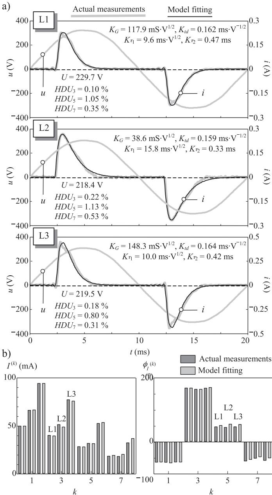  
Fig. 1. Measured and simulated voltage and ac currents of CFLs: (a)waveforms and (b) harmonic spectra.

be modelled as a resistor to investigate the harmonics of the ac input current i because the inverter usually runs at 10–40 kHz and appears as a constant load for the dc busbar [6], [7]. According to the compromise between CFL current harmonic distortion, cost, life time and power-factor control, CFLs can be divided into four main CFL electronic ballast categories: Simple CFL ballast circuit, passive filtering circuit, valley-fill circuit and active filtering circuit. These circuits are associated with the four categories of the CFL ac current harmonic spectra: poor, average, good and excellent, respectively [1,6,7]. The discussion between manufacturers and electricity companies focuses on the choice between CFL acceptable power quality and cost. That is why the second and third CFL categories are the most common. The CFL model presented here corresponds to the “poor-average” CFL category.

Fig. 1 shows the typical ac current waveforms of the “pooraverage” CFL category and their harmonic spectra. They were measured using the CFLs L1P 11W (L1), L2P 14W (L2) and L4P 20W (L3) in [9] fed with the non-sinusoidal supply voltages in the figure.

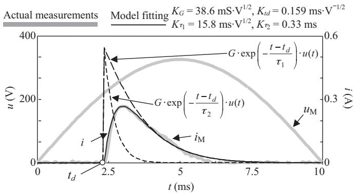  
Fig. 2. Example of the CFL L2 analytical model fitting.

The current phase angles ${ \varphi _ { I } } ^ { ( k ) }$ are referred to the phase angle of the fundamental supply voltage. The CFL current measurements reveal that

• Half-wave symmetry can be considered to characterize the CFL ac currents.   
• The ac current waveforms have a very pronounced peak, which starts with a delay from the zero-crossing of the supply voltage.   
• Steep and gentle slopes occur in the ac current rising and falling edges, respectively.

# 2.2. CFL analytical model

According to the above observations and considering the sinusoidal supply voltage $u ( t ) = { \sqrt { 2 U \sin ( \omega _ { 1 } t + \varphi ) } }$ , the CFL current waveform can be determined as follows [9]:

$$
i (t) = g (t) \cdot u (t) = G \cdot h \left(t - t _ {d}\right) \cdot u (t), \tag {1}
$$

where the function $h ( t - t _ { d } )$ is represented by a double-exponential function:

$$
\begin{array}{l} h (t) = h _ {1} \left(t - n \frac {T}{2}\right), \quad n = \left\lfloor \frac {t}{T / 2} \right\rfloor , \\ h _ {1} (t) = \left\{ \begin{array}{l l} \exp \left(- \frac {t}{\tau_ {1}}\right) - \exp \left(- \frac {t}{\tau_ {2}}\right) & 0 <   t <   \frac {T}{2} \\ 0 & t <   0 \text {o r} t > \frac {T}{2} \end{array} , \right. \tag {2} \\ \end{array}
$$

where $T = 2 \pi / \omega _ { 1 }$ is the period of voltage and current waveforms and

$$
G = \frac {K _ {G}}{\sqrt {U}}, \quad t _ {d} = K _ {t d} \sqrt {U}, \quad \tau_ {1} = \frac {K _ {\tau 1}}{\sqrt {U}}, \quad \tau_ {2} = K _ {\tau 2}. \tag {3}
$$

In the present paper, the relationships (3) between the current function parameters $G , t _ { d } , \tau _ { 1 }$ and $\tau _ { 2 }$ and the voltage rms value in [9] are introduced in the model directly by using the parameters $K _ { G } , K _ { t d } , K _ { \tau 1 }$ and $K _ { \tau 2 }$ . In this way, an equivalent but more comprehensive way of characterizing the current waveform than the model in [9] can be proposed. It must be noted that since CFLs are time-variant devices, they are characterized by the timevariant conductance g(t), which is the reason for their non-linear behaviour. Based on the typical values $U = 2 3 0 \vee , G ( \mathrm { m } S ) = ( 1 . . \ 1 0 )$ , $t _ { d } ( \mathrm { m s } ) = ( 1 . 5 . , 3 . 5 )$ , $\tau _ { 1 } ( \mathrm { m s } ) = ( 0 . 6 . 1 . 5 )$ and $\tau _ { 2 } ( \mathrm { m s } ) = ( 0 \dots 0 . 5 ) \ [ 9 ]$ , the parameter ranges $K _ { G } ( \mathrm { m S } { \cdot } V ^ { 1 / 2 } ) = ( 1 5 . . 1 5 1 . 7 ) , K _ { t d } ($ (ms $V ^ { - 1 / 2 } ) = ( 0 . 0 9 9 .$ . 0.23), $K _ { \tau 1 } ( \mathrm { m s } . V ^ { 1 / 2 } ) = ( 1 0 . 6 . , 2 2 . 7 )$ and $K _ { \tau 2 } ( \mathrm { m s } ) = ( 0 . . 0 . 5 )$ are considered in the study. Fig. 2 illustrates the model fitting to the ac current of the CFL L2 in Fig. 1. The supply voltage is also plotted as a reference. It is worth noting that

• Parameter G is the scale factor of the conductance.   
• Parameter $t _ { d }$ is the time delay at the start of the conduction period.   
• Parameters $\tau _ { 2 }$ and $\tau _ { 1 }$ are the time constants of the rising and falling edges.

It must be mentioned that there are also CFLs with current waveforms different from those in Fig. 1. Multi-exponential “black-box” models, [10], are an interesting alternative to be considered in further studies to characterize these current waveforms. The choice between the double- or multi-exponential model should find a compromise between simplicity and accuracy in CFL current waveform representation.

Once the ac current waveform is characterized, the harmonic ac currents injected by CFLs can be analytically obtained from the complex Fourier series of the ac current expression (1):

$$
\begin{array}{l} \underline {{I}} ^ {(k)} (G, t _ {d}, \tau_ {1}, \tau_ {2}, U, \varphi) = \frac {1}{\sqrt {2}} \frac {2}{\pi} \int_ {0} ^ {\pi} i (\omega_ {1} t) e ^ {- j k \omega_ {1} t} d (\omega_ {1} t) \\ = \frac {j \omega_ {1}}{\pi} G \{\underline {{b}} _ {+ 1} ^ {(k)} (\cdot) - \underline {{b}} _ {- 1} ^ {(k)} (\cdot) \} U e ^ {j k \varphi} \\ = \frac {j \omega_ {1}}{\pi} G \underline {{b}} ^ {(k)} (\cdot) \underline {{U}} ^ {(k)} = \frac {j \omega_ {1}}{\pi} \underline {{G}} ^ {(k)} (\cdot) \underline {{U}} ^ {(k)} \\ = I ^ {(k)} (\cdot) \angle \varphi_ {I} ^ {(k)} (\cdot) \quad (k \geq 1), \tag {4} \\ \end{array}
$$

where

$$
\underline {{b}} _ {\xi} ^ {(k)} \left(t _ {d}, \tau_ {1}, \tau_ {2}\right) = \left\{\frac {\tau_ {1}}{\underline {{c}} _ {1 \xi} (\cdot)} - \frac {\tau_ {2}}{\underline {{c}} _ {2 \xi} (\cdot)} \right\} e ^ {- j d _ {\xi} (\cdot)} \quad (\xi = + 1, - 1), \tag {5}
$$

and

$$
\underline {{c}} _ {\eta \xi} (k, \tau_ {\eta}) = 1 + j (k + \xi) \omega_ {1} \tau_ {\eta} \quad (\eta = 1, 2), \quad d _ {\xi} (k, t _ {d}) = (k + \xi) \omega_ {1} t _ {d}. \tag {6}
$$

It can be noted that $\underline { { U } } ^ { ( k ) }$ in (4) is not the harmonics of the supply voltage u, which is considered sinusoidal. In this case, the superscript (k) only indicates that phase angles of the supply voltage phasor $\underline { { U } } = U \angle \varphi$ are affected by the variable k, i.e., ${ \underline { { U } } } ^ { ( k ) } = { \bar { U } } \angle k \varphi$ .

The complex number $\underline { { b } } ^ { ( k ) }$ in (4) can also be written in Cartesian form as follows:

$$
\begin{array}{l} \underline {{b}} ^ {(k)} \left(t _ {d}, \tau_ {1}, \tau_ {2}\right) = b _ {r} ^ {(k)} (\cdot) + j b _ {i m} ^ {(k)} (\cdot) = \left\{b _ {r, + 1} ^ {(k)} (\cdot) - b _ {r, - 1} ^ {(k)} (\cdot) \right\} + j \left\{b _ {i m, + 1} ^ {(k)} (\cdot) - b _ {i m, - 1} ^ {(k)} (\cdot) \right\}, \\ b _ {p, \xi} ^ {(k)} \left(t _ {d}, \tau_ {1}, \tau_ {2}\right) = \frac {\tau_ {1}}{\left| \underline {{\mathcal {L}}} _ {1 , \xi} (\cdot) \right|} f _ {p 1, \xi} (\cdot) - \frac {\tau_ {2}}{\left| \underline {{\mathcal {L}}} _ {2 , \xi} (\cdot) \right|} f _ {p 2, \xi} (\cdot) (p = r, i m, \xi = + 1, - 1) \tag {7} \\ \end{array}
$$

where

$$
f _ {r \eta , \xi} (k, t _ {d}, \tau_ {\eta}) = \cos \left\{d _ {\xi} (\cdot) + \tan^ {- 1} ((k + \xi) \tau_ {\eta} \omega_ {1}) \right\},
$$

$$
f _ {i m \eta , \xi} (k, t _ {d}, \tau_ {\eta}) = \sin \left\{d _ {\xi} (\cdot) + \tan^ {- 1} \left(\left(k + \xi\right) \tau_ {\eta} \omega_ {1}\right) \right\} \quad (\eta = 1, \quad 2). \tag {8}
$$

The following definitions:

$$
\begin{array}{l} b ^ {2} = \sum_ {k = 1, 3, 5, \dots} \left\{b ^ {(k)} \right\} ^ {2} = \sum_ {k = 1, 3, 5, \dots} \left\{\left(b _ {r} ^ {(k)}\right) ^ {2} + \left(b _ {i m} ^ {(k)}\right) ^ {2} \right\}, \\ b _ {p - n g} ^ {2} = \sum_ {k = 1, 5, 7, \dots} \left\{b ^ {(k)} \right\} ^ {2} = \sum_ {k = 1, 5, 7, \dots} \left\{\left(b _ {r} ^ {(k)}\right) ^ {2} + \left(b _ {i m} ^ {(k)}\right) ^ {2} \right\}, \tag {9} \\ b _ {z} ^ {2} = \sum_ {k = 3, 9, \dots} \left\{b ^ {(k)} \right\} ^ {2} = \sum_ {k = 3, 9, \dots} \left\{\left(b _ {r} ^ {(k)}\right) ^ {2} + \left(b _ {i m} ^ {(k)}\right) ^ {2} \right\}, \\ \end{array}
$$

will be useful for the neutral conductor current study in the next sections. It has been numerically verified that the ratios $b _ { z } / b$ and $b _ { p - n g } / b$ depend mainly on the parameter $\tau _ { 1 }$ . Smaller $\tau _ { 1 }$ values $( \mathrm { i . e . } ,$ , larger ac current pulse widths) lead to higher the $b _ { z } / b$ ratios and

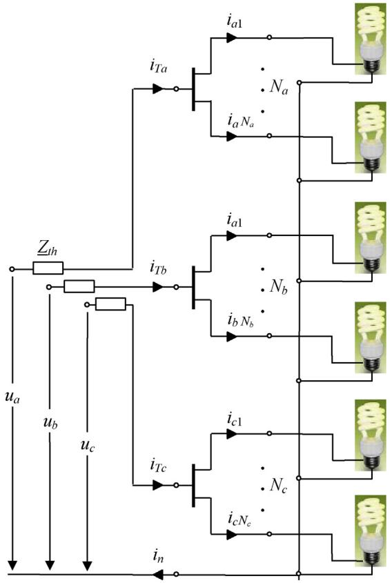  
Fig. 3. Studied three-phase system.

lower $b _ { p - n g } / b$ ratios. Although the influence of $t _ { d }$ and $\tau _ { 2 }$ is small, longer time delays $t _ { d } ,$ , result in higher $b _ { z } / b$ ratios and lower $b _ { p - n g } / b$ ratios, and smaller $\tau _ { 2 }$ values (i.e., steeper rising slopes of the ac current pulse) lead to higher $b _ { z } / b$ ratios and lower $b _ { p - n g } / b$ ratios.

As an example of the model fitting, Fig. 1 shows the ac current waveforms and harmonic spectra of the three CFLs in Section 2.1 obtained from the proposed model. Note that, although the sinusoidal supply voltage approach is a limitation of the model because actual supply voltages are generally non-sinusoidal and harmonic voltages affect CFL behaviour [6,7], typical distortion levels in power systems (below 2–3%) do not affect this behaviour significantly and the model provides acceptable results (see Fig. 1).

# 3. Neutral conductor current calculation

Considering that the CFLs share a “stiff” bus $( \underline { { Z } } _ { t h } = 0 ) ,$ , the threephase system shown in Fig. 3 is studied to calculate its neutral conductor current as

$$
i _ {n} (t) = \sum_ {f = a, b, c} i _ {T f} (t) = \sum_ {f = a, b, c m = 1} \sum_ {f = a, b, c m = 1} ^ {N _ {f}} i _ {f m} (t). \tag {10}
$$

where subscript T denotes the total current of each phase $( \mathrm { i . e . , }$ , the sum of the currents consumed by all the $N _ { f }$ CFLs connected at each phase f).

The system allows the influence of the following unbalances on the neutral conductor current to be considered:

• Supply voltage unbalance: Arbitrary voltages can be considered independently for each phase of the system,

$$
\begin{array}{l} u _ {a} (\theta) = \sqrt {2} U _ {a} \cos \left(\omega_ {1} t + \varphi_ {a}\right), \quad u _ {b} (\theta) = \sqrt {2} U _ {b} \cos \left(\omega_ {1} t + \varphi_ {b}\right), \\ u _ {c} (\theta) = \sqrt {2} U _ {c} \cos \left(\omega_ {1} t + \varphi_ {c}\right), \tag {11} \\ \end{array}
$$

and their corresponding phasors are $\underline { { U } } _ { a } = U _ { a } \angle \varphi _ { a } , \underline { { U } } _ { b } = U _ { b } \angle \varphi _ { b }$ and $\underline { { U } } _ { c } = U _ { c } \ : \angle \varphi _ { c } .$ .

• CFL number per phase: Each phase is loaded with a variable number of $\mathrm { C F L S } ( N _ { a } , N _ { b }$ and $N _ { c } )$ .   
• Different CFLs per phase: The CFLs per phase can have different parameters $K _ { G , f m } , K _ { t d , f m } , K _ { \tau 1 , f m }$ and $K _ { \tau 2 , f m } \ ( f = a , b ,$ c and $m = 1$ to $N _ { f } ) .$ .

Thus, considering (4), the phase harmonic currents can be calculated as

$$
\underline {{I}} _ {T f} ^ {(k)} = \sum_ {m = 1} ^ {N _ {f}} I _ {f m} ^ {(k)} = \frac {\dot {j} \omega_ {1}}{\pi} \left(\sum_ {m = 1} ^ {N _ {f}} G _ {f m} ^ {(k)}\right) \underline {{U}} _ {f} ^ {(k)} \quad (k \geq 1, \quad f = a, b, c), \tag {12}
$$

and, considering that the neutral conductor current is the sum of the phase currents (10), its harmonic currents can be calculated as

$$
\underline {{I}} _ {n} ^ {(k)} = \sum_ {f = a, b, c} \underline {{I}} _ {T f} ^ {(k)} = \frac {\dot {j} \omega_ {1}}{\pi} \sum_ {f = a, b, c} \left(\sum_ {m = 1} ^ {N _ {f}} G _ {f m} ^ {(k)}\right) \underline {{U}} _ {f} ^ {(k)} \quad (k \geq 1). \tag {13}
$$

From the above results, the following expressions are calculated:

$$
I _ {n} = \sqrt {\sum_ {k} \left(I _ {n} ^ {(k)}\right) ^ {2}}, \quad I _ {T f} = \sqrt {\sum_ {k} \left(I _ {T f} ^ {(k)}\right) ^ {2}} (f = a, b, c),
$$

$$
r i _ {n k} = \frac {I _ {n} ^ {(k)}}{\left(I _ {T a} ^ {(k)} + I _ {T b} ^ {(k)} + I _ {T c} ^ {(k)}\right) / 3}, \quad r i _ {n} = \frac {I _ {n}}{\left(I _ {T a} + I _ {T b} + I _ {T c}\right) / 3}, \tag {14}
$$

where $I _ { n } , I _ { T a } , I _ { T b }$ and $I _ { T c }$ are the rms values of the neutral conductor and the phase currents, $r i _ { n k }$ is the ratio of the neutral conductor harmonic current rms values to the average of the phase harmonic current rms values, and $\dot { n _ { n } }$ is the ratio of the neutral conductor current rms value to the average of the phase current rms values.

In balanced conditions, $\underline { { U } } _ { a } = U \angle \varphi , \ : \underline { { U } } _ { b } = \underline { { a } } ^ { 2 } \underline { { U } } _ { a }$ and $\underline { { U } } _ { C } = \underline { { a } } \underline { { U } } _ { a }$ with $\underline { { a } } = e ^ { j 2 \pi / 3 } , N _ { a } = N _ { b } = N _ { c } = N$ and $K _ { G , f m } = K _ { G } , K _ { t d , f m } = K _ { t d } , K _ { \tau 1 , f m } = K _ { \tau 1 }$ and $K _ { \tau 2 , f m } = K _ { \tau 2 }$ for $f = a , b ,$ c and $m = 1$ to $N _ { f } .$ . Thus, the parameters $G , t _ { d } ,$ $\tau _ { 1 }$ and $\tau _ { 2 } \left( 3 \right)$ are the same for all the CFLs and this is true for $\underline { { c } } _ { \eta \xi }$ and $d _ { \xi } ~ ( 6 )$ , and therefore for $\underline { { b } } ^ { ( k ) } \left( 7 \right)$ and $\underline { { G } } ^ { ( k ) } = G { \cdot } \underline { { b } } ^ { ( k ) } \ ( 4 )$ . Considering the above conditions, the phase harmonic currents, (12), and the neutral conductor harmonic currents, (13), can be written as

$$
\underline {{I}} _ {T a} ^ {(k)} = N \frac {\dot {j} \omega_ {1}}{\pi} \underline {{G}} ^ {(k)} U e ^ {j k \varphi}, \quad \underline {{I}} _ {T b} ^ {(k)} = N \frac {\dot {j} \omega_ {1}}{\pi} \underline {{G}} ^ {(k)} U e ^ {j k (\varphi - 2 \pi / 3)} = e ^ {- j k 2 \pi / 3} \underline {{I}} _ {T a} ^ {(k)},
$$

$$
\underline {{I}} _ {T c} ^ {(k)} = N \frac {\dot {j} \omega_ {1}}{\pi} \underline {{G}} ^ {(k)} U e ^ {j k (\varphi + 2 \pi / 3)} = e ^ {j k 2 \pi / 3} \underline {{I}} _ {T a} ^ {(k)},
$$

$$
\underline {{I}} _ {n} ^ {(k)} = (1 + e ^ {- j k 2 \pi / 3} + e ^ {j k 2 \pi / 3}) \underline {{I}} _ {T a} ^ {(k)} \quad (k \geq 1) \tag {15}
$$

The ratios $r i _ { n k }$ and $r \dot { \iota } _ { n } \left( 1 4 \right)$ are written as

$$
r i _ {n k} = 0 (k = 1, 5, 7, \dots), \quad r i _ {n k} = 3 (k = 3, 9, \dots), \quad r i _ {n} = \frac {3 b _ {z}}{b}. \tag {16}
$$

It must be noted that the ratio $\boldsymbol { r } \boldsymbol { i } _ { n }$ depends on the CFL (in particular, it depends linearly on the ratio $b _ { z } / b )$ . Thus, considering the influence of the parameters on the ratio $b _ { z } / b$ (Section 2.2), CFLs with long time delays at the start of the conduction period, steep ac current pulse rising slope and wide ac current pulse (i.e., large $t _ { d }$ values and small $\tau _ { 1 }$ and  values) lead to the greatest $r i _ { n }$ values. As an example, $r i _ { n } = 1 . 7 3$ for $t _ { d } = 3 . 5 \mathrm { m s } , \tau _ { 1 } = 0 . 6$ ms and $\tau _ { 2 } \approx 0$ and ri = 1.40 for t = 1.5 ms, $\tau _ { 1 } = 1 . 5$ 5 ms and $\tau _ { 2 } \approx 0 . 5 \mathrm { m s }$ .

In unbalanced conditions, (15) and (16) are modified. Thus, the influence of supply voltage unbalance, the number of CFLs per phase and the different CFLs per phase (considering that CFLs of the

same phase have the same parameters) is studied independently for each type of unbalance in the next sections.

# 4. Study of the supply voltage unbalance

If only the supply voltage unbalance is considered $( \underline { { { U } } } _ { a } = U _ { a } \ : \angle \varphi _ { a } ,$ $\underline { { U } } _ { b } = U _ { b } \ : \angle \varphi _ { b }$ and $\underline { { U } } _ { c } = U _ { c } \ : \angle \varphi _ { c } )$ , there is the same number of CFLs per phase $( N _ { a } = N _ { b } = N _ { c } = N )$ and all the CFLs have the same parameters $( K _ { G , f m } = K _ { G } , K _ { t d , f m } = K _ { t d } , K _ { \tau 1 , f m } = K _ { \tau 1 }$ and $K _ { \tau 2 , f m } = K _ { \tau 2 }$ for $f = a , b ,$ c and $m = 1$ to $N _ { f } ) .$ .

In the above situation, the parameters $G , t _ { d } , \tau _ { 1 }$ and $\tau _ { 2 } \ ( 3 )$ are different for the CFLs of different phases and this is true for $\underline { { c } } _ { \eta \xi }$ and $d _ { \xi } ~ ( 6 )$ , and therefore for $\underline { { b } } ^ { ( k ) } \left( 7 \right)$ and $\underline { { G } } ^ { ( k ) } = G { \cdot } \underline { { b } } ^ { ( k ) } \ ( 4 )$ . Considering the above conditions, the phase harmonic currents, (12), and the neutral conductor harmonic currents, (13), can be written as

$$
\underline {{I}} _ {T f} ^ {(k)} = N \underline {{I}} _ {f} ^ {(k)} = N \frac {\dot {j} \omega_ {1}}{\pi} I _ {g f} ^ {(k)} = N \frac {\dot {j} \omega_ {1}}{\pi} \underline {{G}} _ {f} ^ {(k)} \underline {{U}} _ {f} ^ {(k)},
$$

$$
\underline {{I}} _ {n} ^ {(k)} = N \frac {\dot {J} \omega_ {1}}{\pi} \sum_ {f = a, b, c} \underline {{G}} _ {f} ^ {(k)} \underline {{U}} _ {f} ^ {(k)} \quad (f = a, b, c, k \geq 1). \tag {17}
$$

The ratios $r i _ { n k }$ and $r i _ { n } ( 1 4 )$ are written as

$$
r i _ {n k} = 3 \frac {\left| I _ {g a} ^ {(k)} + I _ {g b} ^ {(k)} + I _ {g c} ^ {(k)} \right|}{I _ {g a} ^ {(k)} + I _ {g b} ^ {(k)} + I _ {g c} ^ {(k)}}, \quad r i _ {n} = 3 \frac {\sqrt {\sum_ {k} \left| I _ {g a} ^ {(k)} + I _ {g b} ^ {(k)} + I _ {g c} ^ {(k)} \right| ^ {2}}}{I _ {g a} + I _ {g b} + I _ {g c}}, \tag {18}
$$

where

$$
I _ {\mathrm {g f}} = \sqrt {\sum_ {k} \left(I _ {\mathrm {g f}} ^ {(k)}\right) ^ {2}} = \sqrt {\sum_ {k} | I _ {\mathrm {g f}} ^ {(k)} | ^ {2}} = \sqrt {\sum_ {k} | \underline {{G}} _ {f} ^ {(k)} \underline {{U}} _ {f} ^ {(k)} | ^ {2}} \quad (f = a, b, c). \tag {19}
$$

Considering that unbalanced three-phase voltages can be related to a set of three voltages named zero-, positiveand negative-sequence components $( \underline { { U } } _ { z } = U _ { z } \angle \varphi _ { z } , \underline { { U } } _ { p } = U _ { p } \angle \varphi _ { p }$ and $\underline { { U } } _ { n g } = U _ { n g } \ : \angle \varphi _ { n g } )$ by applying the Fortescue transformation

$$
\left[ \begin{array}{l} \underline {{U}} _ {a} \\ \underline {{U}} _ {b} \\ \underline {{U}} _ {c} \end{array} \right] = \left[ \begin{array}{l l l} 1 & 1 & 1 \\ 1 & \underline {{a}} ^ {2} & \underline {{a}} \\ 1 & \underline {{a}} & \underline {{a}} ^ {2} \end{array} \right] \left[ \begin{array}{l} \underline {{U}} _ {z} \\ \underline {{U}} _ {p} \\ \underline {{U}} _ {n g} \end{array} \right] \quad (\underline {{a}} = e ^ {j 2 \pi / 3}), \tag {20}
$$

they can be related to the voltage unbalance factors $\underline { { m } } _ { n g } = \underline { { U } } _ { n g } / \underline { { U } } _ { p } = m _ { n g } \angle \mu _ { n g }$ and $\underline { m } _ { z } = \underline { U _ { z } } / \underline { U _ { p } } = m _ { z } \angle \mu _ { z }$ as follows:

$$
\begin{array}{l} \underline {{U}} _ {a} = \underline {{U}} _ {z} + \underline {{U}} _ {p} + \underline {{U}} _ {n g} = (\underline {{m}} _ {z} + 1 + \underline {{m}} _ {n g}) \underline {{U}} _ {p} = \underline {{F}} _ {a} \underline {{U}} _ {p} \\ \underline {{U}} _ {b} = \underline {{U}} _ {z} + \underline {{a}} ^ {2} \underline {{U}} _ {p} + \underline {{a}} U _ {n g} = \underline {{a}} ^ {2} (\underline {{a m}} _ {z} + 1 + \underline {{a}} ^ {2} \underline {{m}} _ {n g}) \underline {{U}} _ {p} = \underline {{F}} _ {b} \underline {{U}} _ {p} \tag {21} \\ \underline {{U}} _ {c} = \underline {{U}} _ {z} + \underline {{a}} \underline {{U}} _ {p} + \underline {{a}} ^ {2} \underline {{U}} _ {n g} = \underline {{a}} (\underline {{a}} ^ {2} \underline {{m}} _ {z} + 1 + \underline {{a m}} _ {n g}) \underline {{U}} _ {p} = \underline {{F}} _ {c} \underline {{U}} _ {p} \\ (\underline {{U}} _ {p} = U _ {p} \angle \varphi_ {p}, \quad \underline {{E}} _ {f} = F _ {f} \angle \varphi_ {f} f = a, b, c), \\ \end{array}
$$

and (18) can be rewritten as a function of the unbalance factors,

$$
r i _ {n k} = 3 \frac {\left| \sum_ {f = a , b , c} \underline {{G}} _ {f} ^ {(k)} \underline {{F}} _ {f} ^ {(k)} \right|}{\sum_ {f = a , b , c} | \underline {{G}} _ {f} ^ {(k)} \underline {{F}} _ {f} ^ {(k)} |}, \quad r i _ {n} = 3 \frac {\sqrt {\sum_ {k} \left| \sum_ {f = a , b , c} \underline {{G}} _ {f} ^ {(k)} \underline {{F}} _ {f} ^ {(k)} \right| ^ {2}}}{\sum_ {f = a , b , c} \sqrt {\sum_ {k} | \underline {{G}} _ {f} ^ {(k)} \underline {{F}} _ {f} ^ {(k)} | ^ {2}}}. \tag {22}
$$

where the superscript (k) in $\underline { { F } } _ { f } ( k )$ ) only indicates that the phase angles of $\underline { { F } } _ { f }$ are affected by the variable $k \left( \mathrm { i . e . , } \underline { { { F } } } _ { f } { ^ { ( k ) } } = F _ { f } \angle k { \cdot \varphi _ { f } } \right)$ . Considering that standards restrict the magnitude of the unbalance factors to be less than $2 - 3 \% ( m _ { n g } < 2 - 3 \%$ and $m _ { z } < 2 - 3 \% )$ , the magnitude of $\underline { { F } } _ { f }$ for $f = a , b$ , c is approximately equal to one, i.e., $| \underline { { F } } _ { f } | = F _ { f } \approx 1$ , and therefore $F _ { a } + F _ { b } + F _ { c } \approx 3$ .

It must be noted that the ratios $r i _ { n k }$ and $r i _ { n }$ depend on the unbalance and the CFL current parameters $( \mathrm { i } . \mathrm { e } . , \ \underline { { { F } } } _ { f } ^ { \bar { ( k ) } }$ and $\underline { { G } } \mathnormal { f } ^ { ( k ) }$ , respectively). Thus, although results are not shown for space reasons, this dependence was numerically analyzed from (22) considering the typical unbalance and CFL parameter values. The following conclusions can be drawn from the study:

•Both ratios depend mainly on the unbalance and, with regard to the CFL parameters, only the parameter $\tau _ { 1 }$ has a significant influence on the ratio rin (small $\tau _ { 1 }$ values, i.e., wide ac current pulses, increase $r \dot { \iota } _ { n }$ values).

•The unbalance in the power supply increases the first- and fifthorder harmonics of the neutral conductor current and decreases the third-order harmonics in comparison with the balanced situation. This is because the power supply unbalance causes the loss of positive and negative sequence symmetry in the first- and fifthorder harmonics of the phase currents and of zero symmetry in the third-order harmonics. Therefore, the sum of the first- and fifthorder harmonics of the phase currents is not zero and the sum of the third-order harmonics is less than the sum of their amplitudes.

•The above changes in the neutral conductor harmonic currents when the supply voltage is unbalanced are the smallest for the fundamental and the third order harmonics. The rms value of the neutral conductor current is also slightly affected by the supply voltage unbalance.

As an example, considering $\mu _ { n g } = \mu _ { z } = 0 ^ { \circ }$ ◦, G = 5 mS, $t _ { d } = 2 . 5$ ms, $\tau _ { 1 } = 0 . 6$ and 1.5 ms and $\tau _ { 2 } = 0 . 2 5$ ms, the ratios $r i _ { n k }$ and $r \dot { \iota } _ { n }$ have approximately the following values: $r i _ { n k = 1 , 3 , \mathrm { a n d } 9 } \approx 0 . 0 3 , 2 . 9 9$ and 2.94 and $r i _ { n } \approx 1 . 7 \left( \tau _ { 1 } = 0 . 6 \right)$ and $1 . 4 7 \left( \tau _ { 1 } = 1 . 5 \right)$ for $m _ { n g } = 0 \ \mathrm { t o }$ 3% and $m _ { z } = 0$ to 3%, and $r i _ { n k = 5 \mathrm { a n d } 7 } \approx 0 . 0 5$ to 0.2 for $m _ { n g } = 0$ to 3% and $m _ { z } = 0$ to 3%.

# 5. Study of the number of CFLs per phase

If only the number of CFLs per phase is considered $( N _ { a } , N _ { b } , N _ { c } ) ,$ the three-phase voltages are balanced $( \underline { { U } } _ { a } = U \mathcal { L } \varphi , \ : \underline { { U } } _ { b } = \underline { { a } } ^ { 2 } \underline { { U } } _ { a }$ and $\underline { { U _ { c } } } = \underline { { a } } U _ { a }$ with $a = e ^ { j 2 \pi / 3 } )$ and the CFLs have the same parameters $( K _ { G , f m } = K _ { G } , K _ { t d , f m } = K _ { t d } , K _ { \tau 1 , f m } = K _ { \tau 1 }$ and $K _ { \tau 2 , f m } = K _ { \tau 2 }$ for $f = a , b ,$ c and $m = 1$ to Nf). In this situation, the parameters G, td, 1 and $\tau _ { 2 } \ ( 3 )$ are the same for all the CFLs, and this is true for $\underline { { c } } _ { \eta \xi }$ and $d _ { \xi } \left( 6 \right)$ , and therefore for $\underline { { b } } ^ { ( k ) } \left( 7 \right)$ and $\underline { { G } } ^ { ( k ) } = G { \cdot } \underline { { b } } ^ { ( k ) } \left( 4 \right)$ .

Considering the above conditions, the phase harmonic currents, (12), and the neutral conductor harmonic currents, (13), can be written as

$$
\underline {{I}} _ {T a} ^ {(k)} = N _ {a} \frac {\dot {j} \omega_ {1}}{\pi} \underline {{G}} ^ {(k)} U e ^ {j k \varphi}, \quad \underline {{I}} _ {T b} ^ {(k)} = N _ {b} \frac {\dot {j} \omega_ {1}}{\pi} \underline {{G}} ^ {(k)} U e ^ {j k (\varphi - 2 \pi / 3)},
$$

$$
\underline {{I}} _ {T c} ^ {(k)} = N _ {c} \frac {\dot {j} \omega_ {1}}{\pi} \underline {{G}} ^ {(k)} U e ^ {i k (\varphi + 2 \pi / 3)},
$$

$$
\underline {{I}} _ {n} ^ {(k)} = \left(N _ {a} + e ^ {- j k 2 \pi / 3} N _ {b} + e ^ {j k 2 \pi / 3} N _ {c}\right) \frac {\dot {j} \omega_ {1}}{\pi} \underline {{G}} ^ {(k)} U e ^ {j k \varphi}, \tag {23}
$$

which can be classified into the following sets of harmonics:

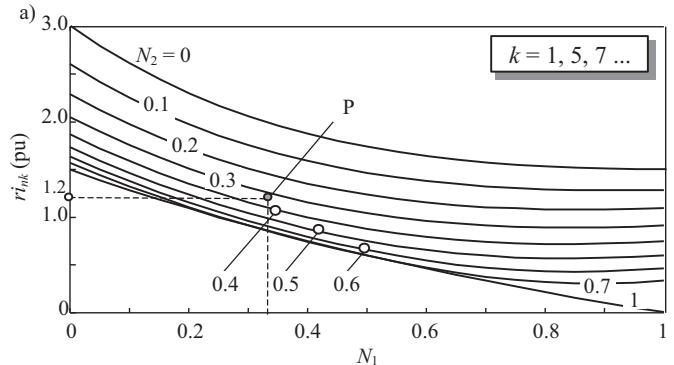

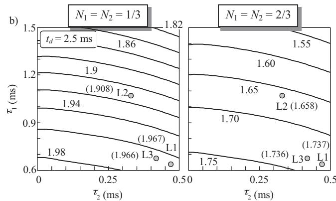  
Fig. 4. Influence of the number of CFLs per phase on the neutral conductor current: (a) ratio $\boldsymbol { r } \boldsymbol { i } _ { n k }$ for k =(1, 5, 7) and (b) ratio ri .

the ratios $r i _ { n k }$ and $r i _ { n } , ( 1 4 ) ,$ , are written as

$$
r i _ {n k} = \left\{ \begin{array}{c c} 3 \frac {\left(N _ {a} ^ {2} + N _ {b} ^ {2} + N _ {c} ^ {2} - N _ {a} N _ {b} - N _ {a} N _ {c} - N _ {b} N _ {c}\right) ^ {1 / 2}}{N _ {a} + N _ {b} + N _ {c}} & k = 1, 5, 7, \dots \\ 3 & k = 3, 9, \dots \end{array} \right. \tag {26}
$$

$$
r i _ {n} = 3 \frac {\left(\left(N _ {a} ^ {2} + N _ {b} ^ {2} + N _ {c} ^ {2} - N _ {a} N _ {b} - N _ {a} N _ {c} - N _ {b} N _ {c}\right) b _ {p - n g} ^ {2} + \left(N _ {a} + N _ {b} + N _ {c}\right) ^ {2} b _ {z} ^ {2}\right) ^ {1 / 2}}{\left(\left(N _ {a} + N _ {b} + N _ {c}\right) b\right)}
$$

The ratios of (26) can also be expressed as

$$
r i _ {n k} = 3 \frac {\left(1 + N _ {1} ^ {2} + N _ {2} ^ {2} - N _ {1} - N _ {2} - N _ {1} N _ {2}\right) ^ {1 / 2}}{1 + N _ {1} + N _ {2}} \quad k = 1, 5, 7, \dots \tag {27}
$$

$$
r i _ {n} = \frac {3}{b} \left(\frac {1 + N _ {1} ^ {2} + N _ {2} ^ {2} - N _ {1} - N _ {2} - N _ {1} N _ {2}}{(1 + N _ {1} + N _ {2}) ^ {2}} b _ {p - n g} ^ {2} + b _ {z} ^ {2}\right) ^ {1 / 2},
$$

where $N _ { 1 }$ and $N _ { 2 }$ are the ratios of the minimum number of CFLs per phase to the maximum number of CFLs per phase $( \boldsymbol { \mathrm { e . g . } } \mathrm { i f } N _ { a } = 4$ , $N _ { b } = 6$ and $N _ { c } = 2 ,$ , the ratios are $N _ { 1 } = 4 / 6$ and $N _ { 2 } = 2 / 6 )$ . It can be noted that the range of the ratios $N _ { 1 }$ and $N _ { 2 }$ is 0 to 1.

Fig. 4 shows the influence of the number of CFLs per phase on the neutral conductor current. The ratios $r i _ { n k }$ with $k = 1 , 5 , 7 , \dots$ . are valid for any CFL because they depend on the number of CFLs per phase only (i.e., only depend on $N _ { 1 }$ and $N _ { 2 } )$ . The ratio $\boldsymbol { r } \boldsymbol { i } _ { n }$ depends on the number of CFLs and their ratios $b _ { z } / b$ and $b _ { p - n g } / b$ in Section 2.2, which, in turn, depend on the CFL parameters $t _ { d } , \tau _ { 1 }$ and $\tau _ { 2 }$ . Thus, the

$$
\underline {{I}} _ {T a} ^ {(k)} = N _ {a} \underline {{I}} ^ {(k)}, \quad \underline {{I}} _ {T b} ^ {(k)} = \underline {{a}} ^ {2} N _ {b} \underline {{I}} ^ {(k)}, \quad \underline {{I}} _ {T c} ^ {(k)} = \underline {{a}} N _ {c} \underline {{I}} ^ {(k)}, \quad \underline {{I}} _ {n} ^ {(k)} = (N _ {a} + \underline {{a}} ^ {2} N _ {b} + \underline {{a}} N _ {c}) \underline {{I}} ^ {(k)} \quad k = 1, 7, \dots .
$$

$$
\underline {{I}} _ {T a} ^ {(k)} = N _ {a} \underline {{I}} _ {-} ^ {(k)}, \quad \underline {{I}} _ {T b} ^ {(k)} = N _ {b} \underline {{I}} _ {-} ^ {(k)}, \quad \underline {{I}} _ {T c} ^ {(k)} = N _ {c} \underline {{I}} _ {-} ^ {(k)}, \quad \underline {{I}} _ {n} ^ {(k)} = \left(N _ {a} + N _ {b} + N _ {c}\right) \underline {{I}} _ {-} ^ {(k)} \quad k = 3, 9, \dots \tag {24}
$$

$$
\underline {{I}} _ {T a} ^ {(k)} = N _ {a} \underline {{I}} ^ {(k)}, \quad \underline {{I}} _ {T b} ^ {(k)} = \underline {{a}} N _ {b} \underline {{I}} ^ {(k)}, \quad \underline {{I}} _ {T c} ^ {(k)} = \underline {{a}} ^ {2} N _ {c} \underline {{I}} ^ {(k)}, \quad \underline {{I}} _ {n} ^ {(k)} = (N _ {a} + \underline {{a}} N _ {b} + \underline {{a}} ^ {2} N _ {c}) \underline {{I}} ^ {(k)} \quad k = 5, 1 1, \dots .
$$

where $\underline { { I } } ^ { ( k ) }$ is the harmonic current consumed by any CFL (4).

Thus, given that

$$
\begin{array}{l} \left| N _ {a} + \underline {{a}} ^ {2} N _ {b} + \underline {{a}} N _ {c} \right| ^ {2} = \left| N _ {a} + \underline {{a}} N _ {b} + \underline {{a}} ^ {2} N _ {c} \right| ^ {2} \\ = N _ {a} ^ {2} + N _ {b} ^ {2} + N _ {c} ^ {2} - N _ {a} N _ {b} - N _ {a} N _ {c} - N _ {b} N _ {c}, \tag {25} \\ \end{array}
$$

ratio rin is plotted for a specific number of CFLs (i.e., $N _ { 1 } = N _ { 2 } = 1 / 3$ and $N _ { 1 } = N _ { 2 } = 2 / 3 )$ with $t _ { d } = 2 . 5$ ms and the typical range of parameters $\tau _ { 1 }$ and $\tau _ { 2 } .$ . From these figures, it can be noted that

•For a different number of CFLs per phase, $N _ { 1 } \neq 1$ and $N _ { 2 } \neq 1$ , the first- and fifth-order harmonics of the neutral conductor current increase with increasing the load unbalance (i.e., the difference

between the number of CFLs per phase). The third-order harmonics of the neutral conductor currents do not depend on the number of CFLs per phase and are always three times the average value of the phase harmonic currents (26).

•The number of CFLs per phase has a great influence on the rms value of the neutral conductor current. This rms value increases with increasing the load unbalance (i.e., the difference between the number of CFLs per phase) and is equal to 3 when $N _ { 1 } = N _ { 2 } = 0 \ { \mathrm { ( i . e . } }$ ., only CFLs connected in one phase).

From (26), it can be noted that the conclusions about the neutral conductor harmonic currents can be extended to any CFL per phase because the ratio $r i _ { n k }$ depends on the number of CFLs per phase only. On the other hand, the conclusions about the rms value of the neutral conductor current are only valid for the analyzed CFLs because the ratio $r i _ { n }$ depends on the ratios $b _ { z } / b$ and $b _ { p - n g } / b$ and the number of CFLs per phase. As an example, the values of the ratio $r i _ { n }$ for the three CFLs in Fig. 1 are also placed in Fig. 4(b) considering a number of CFLs per phase which corresponds to $N _ { 1 } = N _ { 2 } = 1 / 3$ and $N _ { 1 } = N _ { 2 } = 2 / 3$ . In this example, the values of the CFL parameter $t _ { d }$ are not exactly 2.5 ms (i.e., $t _ { d } = 2 . 4 6 , 2 . 3 5$ and 2.43 for L1, L2 and L3, respectively).

# 6. Study of the different CFLs per phase

If only the difference between the parameters of each set of CFLs is considered $( K _ { G , f m } = K _ { G , f } , K _ { t d , f m } = K _ { t d , f } , K _ { \tau 1 , f m } = K _ { \tau 1 , f }$ and $K _ { \tau 2 , f m } = K _ { \tau 2 , f }$ for $f = a , b , \iota$ c and m = 1 to Nf), the three-phase voltages are balanced $( \underline { { U } } _ { a } = U \mathcal { L } \varphi , \underline { { U } } _ { b } = \underline { { a } } ^ { 2 } \underline { { U } } _ { a }$ and $\underline { { U _ { c } } } = \underline { { a } } U _ { c }$ a with $\underline { { a } } = e ^ { j 2 \pi / 3 } )$ and there is the same number of CFLs per phase $( N _ { a } = N _ { b } = N _ { c } = N ) .$ In this situation, the parameters $G , t _ { d } , \tau _ { 1 }$ and $\tau _ { 2 } \left( 3 \right) ,$ are different for the CFLs of the different phases, and this is true for $\underline { { c } } _ { \eta \xi }$ and $d _ { \xi } \left( 6 \right)$ , and therefore for $\underline { { b } } ^ { ( k ) } \left( 7 \right)$ and ${ \underline { { G } } } ^ { ( k ) } = G { \cdot } { \underline { { b } } } ^ { ( k ) } \left( 4 \right)$ .

Considering the above conditions, the phase harmonic currents, (12), and the neutral conductor harmonic currents, (13), can be written as

$$
\underline {{I}} _ {T a} ^ {(k)} = N \frac {\dot {j} \omega_ {1}}{\pi} \underline {{G}} _ {a} ^ {(k)} \underline {{U}} _ {a} ^ {(k)} = N \frac {\dot {j} \omega_ {1}}{\pi} \underline {{G}} _ {a} ^ {(k)} \underline {{U}} _ {a} ^ {(k)},
$$

$$
\underline {{I}} _ {T b} ^ {(k)} = N \frac {\mathrm {j} \omega_ {1}}{\pi} \underline {{G}} _ {b} ^ {(k)} \underline {{U}} _ {b} ^ {(k)} = N \frac {\mathrm {j} \omega_ {1}}{\pi} \underline {{G}} _ {b} ^ {(k)} e ^ {- j k 2 \pi / 3} \underline {{U}} _ {a} ^ {(k)}, \tag {28}
$$

$$
\underline {{I}} _ {T c} ^ {(k)} = N \frac {\dot {j} \omega_ {1}}{\pi} \underline {{G}} _ {c} ^ {(k)} \underline {{U}} _ {c} ^ {(k)} = N \frac {\dot {j} \omega_ {1}}{\pi} \underline {{G}} _ {c} ^ {(k)} e ^ {j k 2 \pi / 3} \underline {{U}} _ {a} ^ {(k)},
$$

$$
\underline {{I}} _ {n} ^ {(k)} = N \frac {\dot {j} \omega_ {1}}{\pi} (\underline {{G}} _ {a} ^ {(k)} + e ^ {- j k 2 \pi / 3} \underline {{G}} _ {b} ^ {(k)} + e ^ {j k 2 \pi / 3} \underline {{G}} _ {c} ^ {(k)}) \underline {{U}} _ {a} ^ {(k)},
$$

which can be classified into the following sets of harmonics:

$$
\underline {{I}} _ {T a} ^ {(k)} = \underline {{G}} _ {a} ^ {(k)} \underline {{U}} _ {N} ^ {(k)}, \quad \underline {{I}} _ {T b} ^ {(k)} = \underline {{a}} ^ {2} \underline {{G}} _ {b} ^ {(k)} \underline {{U}} _ {N} ^ {(k)}, \quad \underline {{I}} _ {T c} ^ {(k)} = \underline {{a}} \underline {{G}} _ {c} ^ {(k)} \underline {{U}} _ {N} ^ {(k)}
$$

$$
I _ {n} ^ {(k)} = \left(G _ {a} ^ {(k)} + a ^ {2} G _ {b} ^ {(k)} + a G _ {c} ^ {(k)}\right) U _ {N} ^ {(k)} \quad k = 1, 7, \dots
$$

$$
\underline {{I}} _ {T a} ^ {(k)} = \underline {{G}} _ {a} ^ {(\bar {k})} \underline {{U}} _ {N} ^ {(k)}, \quad \underline {{I}} _ {T b} ^ {(k)} = \underline {{G}} _ {b} ^ {(\bar {k})} \underline {{U}} _ {N} ^ {(\bar {k})}, \quad \underline {{I}} _ {T c} ^ {(k)} = \underline {{G}} _ {c} ^ {(k)} \underline {{U}} _ {N} ^ {(k)} \tag {29}
$$

$$
I _ {n} ^ {(k)} = \left(\underline {{G}} _ {a} ^ {(k)} + \underline {{G}} _ {b} ^ {(k)} + \underline {{G}} _ {c} ^ {(k)}\right) \underline {{U}} _ {N} ^ {(k)} \quad k = 3, 9, \dots .
$$

$$
\underline {{I}} _ {T a} ^ {(k)} = \underline {{G}} _ {a} ^ {(k)} \underline {{U}} _ {N} ^ {(k)}, \quad \underline {{I}} _ {T b} ^ {(k)} = \underline {{a}} G _ {b} ^ {(k)} \underline {{U}} _ {N} ^ {(k)}, \quad \underline {{I}} _ {T c} ^ {(k)} = \underline {{a}} ^ {2} G _ {c} ^ {(k)} \underline {{U}} _ {N} ^ {(k)}
$$

$$
I _ {n} ^ {(k)} = \left(\underline {{G}} _ {a} ^ {(k)} + \underline {{a}} \underline {{G}} _ {b} ^ {(k)} + \underline {{a}} ^ {2} \underline {{G}} _ {c} ^ {(k)}\right) \underline {{U}} _ {N} ^ {(k)} \quad k = 5, 1 1, \dots .
$$

where

$$
\underline {{U}} _ {N} ^ {(k)} = N \frac {\dot {j} \omega_ {1}}{\pi} \underline {{U}} _ {a} ^ {(k)}. \tag {30}
$$

The ratios $r i _ { n k }$ and $r \dot { \iota } _ { n } \left( 1 4 \right)$ are written as

$$
r i _ {n k} = 3 \frac {\left| \underline {{G}} _ {a} ^ {(k)} + \underline {{G}} _ {b} ^ {(k)} + \underline {{G}} _ {c} ^ {(k)} \right|}{\left| \underline {{G}} _ {a} ^ {(k)} \right| + \left| \underline {{G}} _ {b} ^ {(k)} \right| + \left| \underline {{G}} _ {c} ^ {(k)} \right|}, \quad r i _ {n} = 3 \frac {\sqrt {\sum_ {k} \left| \underline {{G}} _ {a} ^ {(k)} + \underline {{G}} _ {b} ^ {(k)} + \underline {{G}} _ {c} ^ {(k)} \right| ^ {2}}}{\left| \underline {{G}} _ {a} \right| + \left| \underline {{G}} _ {b} \right| + \left| \underline {{G}} _ {c} \right|}, \tag {31}
$$

where

$$
| \underline {{G}} _ {f} | = \sqrt {\sum_ {k} | \underline {{G}} _ {f} ^ {(k)} | ^ {2}} = \sqrt {G _ {f} ^ {2} \sum_ {k} | \underline {{b}} _ {f} ^ {(k)} | ^ {2}} (f = a, b, c). \tag {32}
$$

From (31), it must be noted that the ratios depend on the CFLs connected to the different phases $( \mathrm { i . e . }$ , depend on the parameters $G _ { f } ,$ $t _ { d , f } , \tau _ { 1 , f }$ and $\tau _ { 2 , f } \mathrm { f o r } f \mathrm { = } a , b , c ) .$ Thus, the many existing combinations of the parameters involved in the study preclude any numerical or graphical study that draws general conclusions about the influence of the different CFLs per phase on the neutral conductor current.

# 7. On the diversity and attenuation effects in the analytical study

Diversity and attenuation effects can be important factors in predicting the harmonic currents injected by non-linear loads sharing the same bus. The analytical study of the previous sections does not consider these effects. The scope of this simplification is analyzed in the present section.

The diversity effect means that the net harmonic current injected by different non-linear loads connected to the same bus can be reduced in comparison to that obtained from the arithmetical sum of the non-linear load contributes. This is due to dispersion in the harmonic current phase angles of all non-linear loads, which can result in harmonic cancellation between their currents. Although this phenomenon could be studied with the CFL model in Section 2.2, the diversity effect between the CFL harmonic currents of the same phase cannot be considered in the analytical study of the previous sections because CFLs with the same parameters load each phase. With this assumption it is possible to simplify the study $( \mathrm { i } . \mathrm { e } . , i _ { T f } = N _ { f } . i _ { f }$ with $f = a , b , c )$ without losing much accuracy in the results because it was numerically verified that this effect is not significant for CFLs with different parameters, especially for low-order harmonics. This is so because it is difficult to obtain the counterphase situation with the CFL harmonic currents, and therefore they are not usually cancelled [4,6].

The attenuation effect occurs when several CFLs share a common source impedance, $\underline { { Z } } _ { t h } = R _ { t h } + j X _ { t h } \approx j X _ { t h }$ . In this situation, the number of CFLs connected to the common bus affects the shape of the CFL supply voltage and influences the harmonic currents injected by the CFLs by reducing their magnitudes [4]. In the analytical study, the CFLs share $\textsf { a } ^ { \prime \prime } { \mathsf { s t i f f } } ^ { \prime \prime }$ bus (Fig. 3), i.e., the source impedance is not considered $( \underline { { Z } } _ { t h } \approx j X _ { t h } = 0 )$ , and in principle, this does not allow the attenuation effect to be considered. Nevertheless, the obtained results can be considered acceptable because, as mentioned in Section 2.2, the influence of harmonic voltages is not significant for the usual distortion levels in power systems (below 2–3%) and the model provides acceptable results.

# 8. Tests

To validate the accuracy of the analytical study in the previous sections, four tests were performed with the CFLs L1P 11W (L1), L2P 14W (L2) and L4P 20W (L3) in [9] to compare the experimental measurements and the PSCAD/EMTDC simulations against the “black-box” model analytically computed currents. These tests were made in the four-wire three-phase system fed with sinusoidal supply voltages of Fig. 3.

# 8.1. Experimental tests

In the experimental tests, the CFLs were fed from a 6 KVA, 0–240 V continuously variable voltage auto transformer (varivolt), and a YOKOGAWA DL 708 E digital scope with a 20 kHz sampling

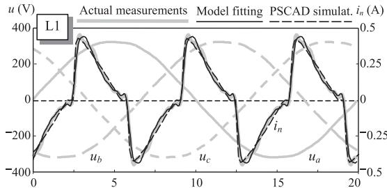  
  
t(ms)

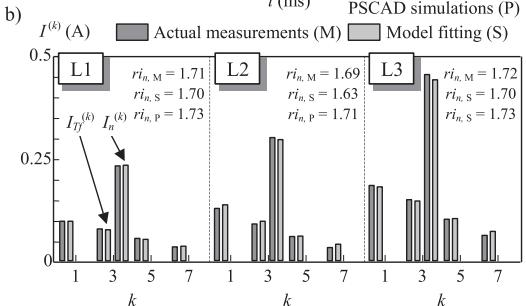

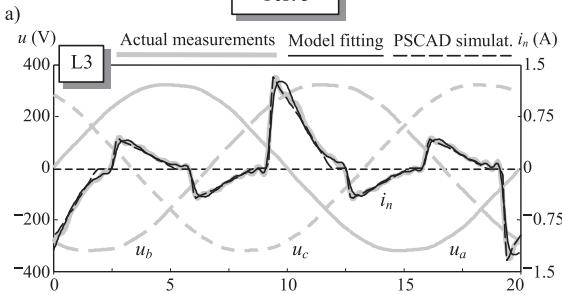  
Test 3

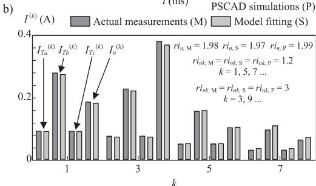  
t(ms)

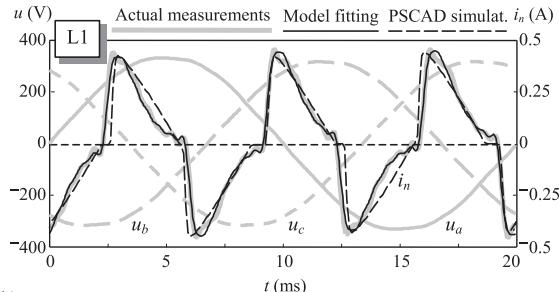  
a)   
Test 2

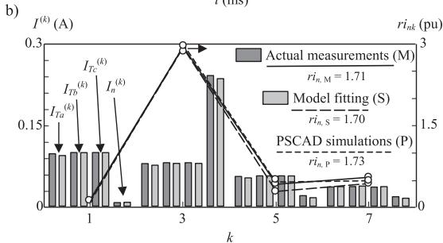  
Test 4

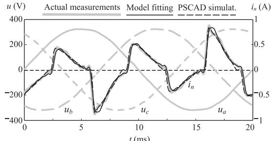  
a)

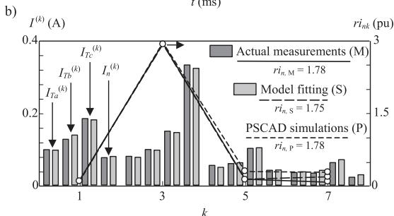  
Fig. 5. Results of tests: (a) waveforms and (b) harmonic spectra.

frequency was used to measure the voltage and ac current waveforms.

• Test 1 (balanced conditions):

- Three-phase supply voltages: $\underline { { U } } _ { a } = 2 3 0 \angle 0 ^ { \circ } \vee , \underline { { U } } _ { b } = \underline { { a } } ^ { 2 } \underline { { U } } _ { a }$ and $\underline { { U } } _ { C } = \underline { { a } } \underline { { U } } _ { a }$ .   
- Number of CFLs per phase: $N _ { a } = N _ { b } = N _ { c } = 2 .$   
- CFLs: The same CFLs in all the phases (L1, L2 or L3 corresponding to test 1a, test 1b or test 1c, respectively).

The results are shown in Fig. 5 where only test 1a waveforms are plotted (similar results are obtained for tests 1b and 1c waveforms). It must be noted that the ratio $r i _ { n }$ of test 1b is slightly smaller than the others because $K _ { \tau 1 }$ of L2 is bigger than $K _ { \tau 1 }$ of L1 and L3 (i.e., the L2 current pulse is slightly narrower than the L1 and L3 current pulses).

• Test 2 (supply voltage unbalance):

- Three-phase supply voltages: Up = 230 ∠ 0◦ V, $\underline { m } _ { n g } = \underline { m } _ { z } = 0 . 0 3 \angle 6 0 ^ { \circ } ( 2 1 ) .$   
- Number of CFLs per phase: $N _ { a } = N _ { b } = N _ { c } = 2 .$   
- CFLs: L1 in all the phases.

The results are shown in Fig. 5. It should be pointed out that the rms values of the fifth and seventh harmonic currents (i.e., the ratios $r i _ { n 5 }$ and $r i _ { n 7 } )$ are the most affected with respect to the balanced case. Similar results are obtained for CFLs L2 and L3.

• Test 3 (different number of CFLs per phase):

- Three-phase supply voltages: $U _ { a } = 2 3 0 \angle 0 ^ { \circ } \forall , U _ { b } = \underline { { a } } ^ { 2 } \underline { { U } } _ { a }$ and $\underline { { { U } } } _ { C } = \underline { { { a } } } \underline { { { U } } } _ { a } .$ .   
- Number of CFLs per phase: $N _ { a } = 1 , N _ { b } = 3 , N _ { c } = 1$ .   
- CFLs: L3 in all the phases.

The results are shown in Fig. 5. Comparing the results with the balanced conditions, the great influence of the number of CFLs per phase on the rms value of the first- and fifth-order harmonics (ratios $r i _ { n k }$ with $k = 1 , 5 , . . . )$ and on the rms value of the neutral conduction current $\left( \operatorname { r a t i o } { r i _ { n } } \right)$ is observed. The values of the ratios $r i _ { n k } ( k = 1 , 5 . . )$ are independent of the CFL and are labelled as point P in $\mathrm { F i g . } 4 ( \mathsf { a } ) .$ . The value of the ratio rin depends on the CFL and is labelled as point L3 in Fig. 4(b). Similar results are obtained for CFLs L1 and L2.

• Test 4 (different CFLs per phase):

- Three-phase supply voltages: $\underline { { U } } _ { a } = 2 3 0 \angle 0 ^ { \circ } \vee , \underline { { U } } _ { b } = \underline { { a } } ^ { 2 } \underline { { U } } _ { a }$ and $\underline { { U } } _ { c } = \underline { { a } } \underline { { U } } _ { a }$ .   
- Number of CFLs per phase: $N _ { a } = N _ { b } = N _ { c } = 2 .$ .   
- CFLs: L1 in phase a, L2 in phase b and L3 in phase c.

The results are shown in Fig. 5. It must be noted that the CFL unbalance slightly affects on the neutral conductor current. Nevertheless, this conclusion is only valid for the considered test because all the ratios depend on the CFL parameters and there are many possible unbalance situations.

Note that the theoretical results agree closely with the experimental results. Thus, if the CFL model parameters are known, the analytical expressions obtained in the previous sections are a good tool to study the neutral conductor current.

# 8.2. Simulation tests

The above section results were also validated by programming a custom toolbox with the CFL equivalent circuit model proposed in [6,7] in the PSCAD/EMTDC software package [11] and simulating the four-wire three-phase systems in the four tests. The equivalent circuit is composed of a diode bridge with an ac input resistance R and a dc smoothing capacitor C that feeds the inverter and the CFL tube, which can be modelled as an equivalent resistance $R _ { D } .$ The electrical parameters of the L1, L2 and L3 lamps were estimated by fitting the measured and simulated current waveforms [6–8],

• L1 lamp: R = 37.9 
, C = 2.95 F and $R _ { D } = 7 8 7 2 \Omega$   
• L2 lamp: R = 53.1 
, C = 3.71 F and $R _ { D } = 5 8 5 3 \Omega$ .   
• L3 lamp: R = 13.5 
, C = 5.93 F and $R _ { D } = 4 7 8 4 \Omega$ .

The simulation results, shown in Fig. 5, agree closely with the results in the previous section.

# 9. Conclusion

The present paper analyzes the neutral conductor current in four-wire three-phase systems with CFLs from the doubleexponential “black-box” model proposed in [9]. Novel analytical expressions depending on supply voltage unbalance, number of CFLs per phase and different CFLs per phase are provided to calculate the neutral conductor current. Moreover, these expressions allow analyzing the influence of CFL parameters and previous unbalance factors on the neutral current. Two main conclusions

are obtained, the CFL current pulse waveform has an impact on the neutral current (larger widths and steeper slopes of the pulse lead to higher neutral currents) and the influence of the number of CFLs per phase on this current does not depend on the CFL parameters. The diversity and attenuation effects are not considered in the study. However, the obtained results are acceptable since the above effects have little impact on this study. It is difficult to obtain counterphase situation with the CFL harmonic currents and the influence of harmonic voltages is not significant for the usual distortion levels in power systems (below 2%). The theoretical expressions analytically obtained were validated with measurements and PSCAD/EMTDC software simulations.

# References

[1] N.R. Watson, T.L. Scott, S.J.J. Hirsch, Implications for distribution networks of high penetration of compact fluorescent lamps, IEEE Transactions on Power Delivery 24 (3) (2009) 1521–1528.   
[2] G.A. Vokas, I.F. Gonos, F.N. Korovesis, F.V. Topalis, Influence of compact fluorescent lamps on the power quality of weak low-voltage networks supplied by autonomous photovoltaic stations, in: Proceedings IEEE Porto Power Technology, 2001, pp. 1–5.   
[3] J. Desmet, I. Sweertvaegher, G. Vanalme, K. Stockman, R. Belmans, Analysis of the neutral conductor current in a three-phase supplied network with nonlinear single-phase loads, IEEE Transactions on Industry Applications 39 (3) (2003) 587–593.   
[4] T.M. Gruzs, A survey of neutral currents in three-phase computer power systems, IEEE Transactions on Industry Applications 26 (4) (1990) 719–725.   
[5] A.-C. Liew, Excessive neutral currents in three-phase fluorescent lighting circuits, IEEE Transactions on Industry Applications 25 (4) (1989) 776–782.   
[6] Z. Wei, N.R. Watson, L.P. Frater, Modelling of compact fluorescent lamps, in: 13th IEEE International Conference on Harmonics and Quality of Power (ICHQP 2008), 2008, pp. 1–6.   
[7] Z. Wei, Compact fluorescent lamps phase dependency modelling and harmonic assessment of their widespread use in distribution systems, University of Canterbury, New Zealand, 2009 (ME thesis).   
[8] J. Yong, L. Chen, A.B. Nassif, W. Xu, A frequency-domain harmonic model for compact fluorescent lamps, IEEE Transactions on Power Delivery 25 (2) (2010) 1182–1189.   
[9] J. Cunill-Solà, M. Salichs, Study and characterization of waveforms from low-watt (<25 W) compact fluorescent lamps with electronic ballasts, IEEE Transactions on Power Delivery 22 (4) (2007) 2305–2311.   
[10] K. Holmströn, J. Petersson, A review of the parameter estimation problem of fitting positive exponential sums to empirical data, Applied Mathematics and Computation 126 (2002) 31–61.   
[11] PSCAD/EMTDC, User’s Manual Guide, Manitoba HVDC Research Centre, 2004, Version 4.

Jordi Cunill was born in Sant Julià de Cerdanyola (Barcelona), Spain, in 1962. He received the B.S. degree in industrial engineering from the Universitat Politècnica de Catalunya, Barcelona, Spain, in 2001. Since 1988, he has been with the Electrical Engineering Department of the UPC in Manresa (Barcelona), where he is currently a Full Professor. His research interests are in the areas of power system harmonics, electrical machines, discharge lamp modelling and power systems quality.

Luis Sainz was born in Barcelona, Spain, in 1965. He received his BS degree in Industrial Engineering and his Ph.D. degree in Industrial Engineering from UPC-Barcelona, Spain, in 1990 and 1995 respectively. Since 1991, he has been a Professor at the Department of Electrical Engineering of the UPC. His research interest lies in the areas of power quality.

Juan José Mesas was born in Barcelona (Spain) in 1974. He received his BS degree in industrial engineering from his M.Res. and Ph.D. degrees in electrical engineering from UPC-Barcelona, Spain, in 2003, 2006 and 2010, respectively. Since 2011 he has been a professor at the Department of Electrical Engineering of the UPC. His research interest lies in the areas of power system harmonics, numerical methods and optimization.