# EMTP Model of a Bidirectional Multilevel Solid State Transformer for Distribution System Studies

Francisco González, and Jacinto Martin-Arnedo, Salvador Alepuz, and Juan A. Martinez, Senior Member, IEEE

Abstract—This paper presents a model for a MV/LV bidirectional solid state transformer (SST) for distribution system studies. A multilevel converter configuration is used in the MV side for voltage and current harmonic reduction. The model has been implemented in the ATP version of the EMTP. Several case studies have been carried out in order to evaluate the behavior of the SST model under different operating conditions and test the impact on the power quality.

Index Terms—Bidirectional power electronics converter, distribution system, dual active bridge converter, EMTP, modeling, multilevel topology, power quality, pulse width modulation (PWM), solid state transformer.

# I. INTRODUCTION

HE conventional iron-and-copper transformer has been, and still is, the traditional link between end-users and the distribution network. However, the solid state-transformer (SST) is foreseen as a potential replacement of the conventional transformer and a fundamental component of the future smart grid. Compared to the conventional transformer, the SST offers reduced size and weight, and significant enhancements in power quality performance [1]-[3].

A realistic configuration for the MV side of the SST, assuming Si-based technologies are used, must consider multilevel converters [4], some of them based on a modular structure [5].

A MV/LV SST model using a three-level converter for its MV side converter is presented here. The goal is to develop a custom-made SST model for EMTP (ElectroMagnetic Transient Program) implementation [6]. The approach followed in this work is to obtain an encapsulated model that could be easily used in distribution system studies for which an EMTP-like tool was applied. This model will be the base for a future modular structure; see for instance [5].

The document is organized as follows. The configuration of the proposed bidirectional SST and the switching strategies are presented in Section II. The transformer model has been implemented in the ATP version of the EMTP. Section III presents the system used in this work for testing the behavior of the bidirectional SST, and several simulation results that

verify the validity of the proposed model and confirm the enhanced behavior of the SST in comparison to the conventional transformer. Main conclusions and future development are discussed in Section IV.

# II. SOLID STATE TRANSFORMER CONFIGURATION AND SWITCHING STRATEGIES

# A. System description

The bidirectional SST includes three parts: a high-voltage stage, an isolation stage, and a low-voltage stage [7]. Fig. 1 shows the configuration.

The input voltage at power frequency is first converted into dc voltage by the HV-side three-phase pulse width modulated (PWM) Neutral Point Clamped (NPC) converter [8] working as rectifier, see Fig. 1a.

The isolation stage is implemented by means of a dual active bridge dc-dc converter, see Fig 1b. This stage consists of three series-connected subsystems: A dc-to-staircase voltage waveform, a high-frequency transformer and a square wave-to-dc converter.

The HV-side converter shown in Fig. 1b has been implemented with two three-level NPC legs in an H-bridge, similar to an inverter [4], which converts the HV dc voltage into a high-frequency five-level staircase voltage waveform applied to the primary of the high-frequency transformer [9].

In the secondary side, the H-bridge has a conventional square wave voltage waveform with 50% duty cycle, converting the transformed high-frequency square voltage waveform into a LV dc voltage by the LV-side converter.

Finally, the LV-side three-phase PWM dc/ac converter shown in Fig. 1c works as inverter and provides the output power-frequency ac waveform to LV loads.

When the power flow comes from the secondary side, in case it operates in generation mode, the transformer behavior is similar to that described above. Basically, input and output stages swap functions, so the converters, the respective switching strategies and control methods must be properly designed to work under bidirectional power flow conditions.

# B. Switching strategies and control description

A simple but very effective strategy, the voltage oriented control (VOC), with feedforward of the negative-sequence grid voltage [10] has been applied in this work for the NPC converter shown in Fig. 1a). A sequence separation method is applied to the grid voltages. The positive-sequence grid voltage is used to obtain the grid angle for synchronization

purposes by means of phase-locked loop (PLL) [11]. The negative-sequence grid voltage is fed-forward to the switching strategy to be generated at the converter terminals. Therefore, no negative sequence voltage is seen by the inductive filter and only positive-sequence currents flow between the grid and the converter, even in presence of asymmetrical grid disturbances. This control scheme ensures unity power factor condition at the input terminal in an average sense, and no ripple in the input active power.

DC-link neutral point voltage balance is achieved by means of a virtual space vector modulation (SVM) switching strategy and a tailored voltage balancing control [12], used in the NPC converter. With this approach, there is no need to include in the model some information about the dc-link neutral point.

The amount and direction of the active power flow between primary and secondary is mainly regulated by the phase-shift ϕ (angle between transformer input and output voltages generated by the dual active bridges) [9]. This power flow is limited mainly by the transformer inductance. The dcdc converter makes the power flow to go towards the end-user side when voltage at the primary side of the transformer leads

voltage at the secondary side. Power flows towards the distribution network when the voltage at the secondary side leads the voltage at the primary side. The absolute value of this reference phase-shift angle ϕ is limited to π/2 irrespectively of the sense in which power flows. The analysis of the shape for the five level staircase voltage waveform generated by the HV-side bridge [9] is beyond the scope of this work.

The low-voltage side front-end converter includes a fourth leg for neutral currents, an inductor for filtering currents and a capacitor bank for filtering voltages. According to the configuration shown in Fig. 1c, the LV-side converter may be connected to load and/or generation, and it is responsible for controlling the voltage (waveform and value) seen by load/ generation. In addition, the three-phase four-wire converter allows connecting single- and three-phase loads and/or generators.

A PWM switching strategy [13] has been used in the LVside converter. The main task of LV-side converter controllers is to achieve positive-sequence capacitor voltages (i.e., to have balanced voltages at capacitor terminals) with stable frequency and voltage, independently of the load/generation and the

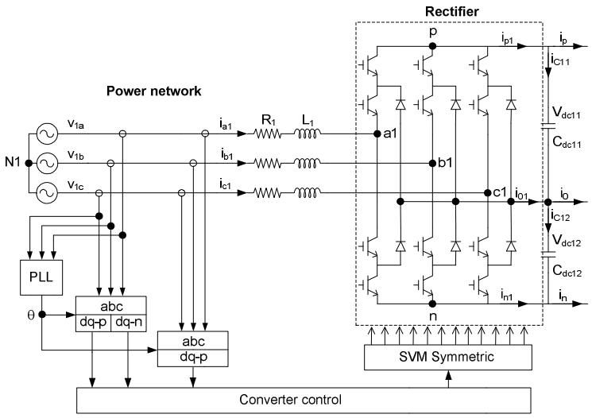  
a) High-voltage side configuration and control

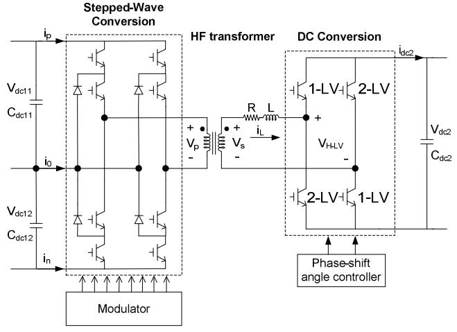

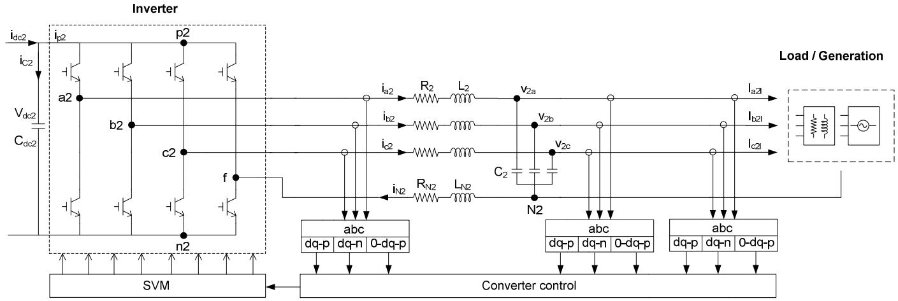  
b) Isolation stage configuration and control   
c) Low-voltage side configuration and control   
Fig. 1. Bidirectional SST implementation and control strategies.

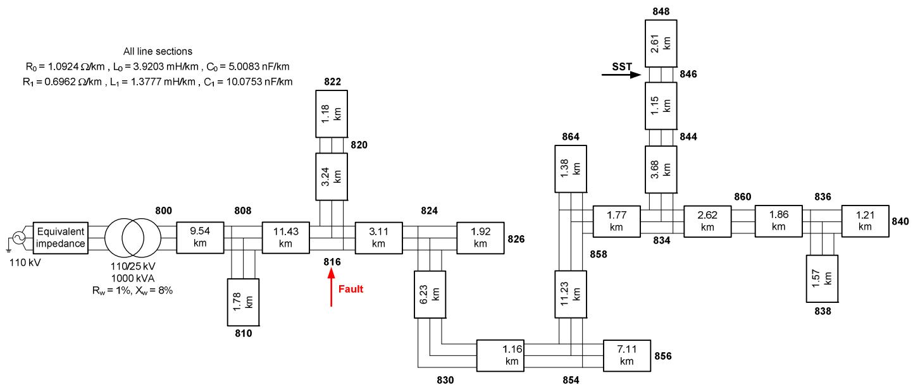  
Fig. 2. Diagram of the test system.

balanced/unbalanced currents. Each positive-, negative- and zero-sequence has its respective controller. Negative- and zero-sequence capacitor voltage references are set to zero to cancel these components at the filter capacitor terminals at all time, even in presence of unbalanced load/generation currents. The positive sequence voltage controller regulates the filter capacitor voltages.

# III. TESTING THE PERFORMANCE OF THE SST MODEL

# A. Test System

Rated values of primary and secondary SST voltages are respectively 25 kV and 400 V. Table I presents the main parameters used in this study. The high-frequency transformer is represented as an ideal transformer in series with its shortcircuit impedance (whose values in Table I are referred to its secondary side). The test system model developed for this work is a 50 Hz small overhead distribution system. The configuration, per unit length parameters and line section lengths are shown in Fig. 2; see [14]. Notice that the figure

TABLE I SST MAIN PARAMETERS.   

<table><tr><td>Parameter</td><td>Value</td></tr><tr><td>Primary side filter resistance (R1)</td><td>0.5 Ω</td></tr><tr><td>Primary side filter inductance (L1)</td><td>200 mH</td></tr><tr><td>DC link capacitance (Cdc11, Cdc12)</td><td>5000 μF</td></tr><tr><td>DC link capacitance (Cdc2)</td><td>2200 μF</td></tr><tr><td>Secondary side filter resistance (R2)</td><td>1 Ω</td></tr><tr><td>Secondary side filter inductance (L2)</td><td>6 mH</td></tr><tr><td>Secondary side filter capacitance (C2)</td><td>470 μF</td></tr><tr><td>Neutral resistance (Rn)</td><td>0.5 Ω</td></tr><tr><td>Neutral inductance (Ln)</td><td>1 mH</td></tr><tr><td>Rectifier/Inverter switching frequency</td><td>10 kHz</td></tr><tr><td>Transformer operating frequency</td><td>1 kHz</td></tr><tr><td>Transformer short-circuit resistance</td><td>0.1 Ω</td></tr><tr><td>Transformer leakage inductance</td><td>1 mH</td></tr></table>

does not show loads and all line sections have the same per unit length parameters. The figure also shows the node to which the SST is connected and the fault location considered in one case study. The SST model has been implemented in ATP and encapsulated as custom-made model; users do only have to connect MV and LV terminals to the distribution system model and specify SST parameters, as in Table I.

# B. Case Studies

(i) Some case studies have been carried out to illustrate the performance of the new SST model. The main results are analyzed below. Figs. 3 through 6 show some plots from the case studied in this work. A load unbalance at the secondary side of the SST is caused by an increase of the impedance in one branch of the load during a short interval. Fig. 3 shows that secondary current unbalance is barely propagated to primary currents, becoming stable once the load is balanced again. On the other hand, voltages at both sides remain constant.   
(ii) A power flow reversal is caused by the presence of both load and generation at the secondary side. Fig. 4 shows that the load initially exceeds the generation, but during a short period this situation is reversed. This case illustrates one of the main advantages of the SST, its capability to quickly reverse the power flow.   
(iii) A voltage sag at the primary side is caused by a shortcircuit in the MV network (see Fig. 2). The simulation results related to this case (see Fig. 5) prove clearly that the voltage unbalance that occurs in the primary side of the SST is not propagated to the secondary side, where the phase voltages and currents remain constant and balanced.   
(iv) The secondary overcurrent is firstly caused by an increase of the current in all three phases during a short interval, followed by a sudden decrease of the current

below its initial steady-state value, see Fig. 6. The secondary overcurrents do not provoke any secondary voltage drop, and the disturbance is seen from the primary side as a load increase. This can be easily understood from analyzing secondary voltage and current waveforms shown in Fig. 6.

# C. Discussion

The results derived from the above case studies illustrate different capabilities of the SST controller; for instance, it can maintain constant and balanced phase voltages at the secondary side irrespectively of the LV currents, or achieve a fast recovery of the system variables to its previous values during the post-transient period.

Several other features (not shown in the plots presented here) have been analyzed; they basically confirm that the new multilevel model can reproduce the same performance that was achieved with other previous models; see references [7] and [14]. In a few words, this SST model can avoid the propagation of some power quality disturbances and events from one side to the each other, can run as a reactive power compensator or allow a bidirectional power flow between the MV- and LV-side systems.

Considering the present status of Si-based semiconductors, the multilevel configuration like that analyzed in this work could be only used for a much lower voltage level at the MV side. Even a multilevel configuration based on present SiC semiconductors would need a higher number of levels than that assumed here [15], [16]; see, for instance, the SiC-based prototypes presented in [17] and [18].

The model presented in this work can be used in distribution system studies for which an EMTP-like tool is applied; however, a more realistic approach could consider a modular approach based on the single-phase version of the model presented in this work; see [5], [17], [19] and [20].

# IV. CONCLUSION

This paper has summarized the behavior of a multilevel bidirectional SST under several dynamic and unbalanced situations. Intermediate capacitors provide stage decoupling, and prevent disturbance at one side from propagating to the other side (e.g., secondary load immunity is achieved in front of dynamic unbalanced situations at the input side). The results have shown that the bidirectional SST incorporates several advanced capabilities (e.g., fast voltage and power flow control, reactive power compensation, harmonic current filtering) that support its feasibility as a fundamental component of the future smart grid.

# V. ACKNOWLEDGEMENT

This work is being supported by the project SST, within the KIC InnoEnergy consortium, and by the Spanish Ministerio de Economía y Competitividad under the Grant DPI2012-31580.

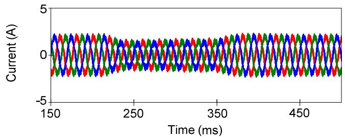

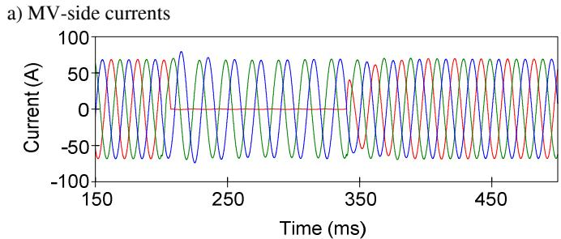

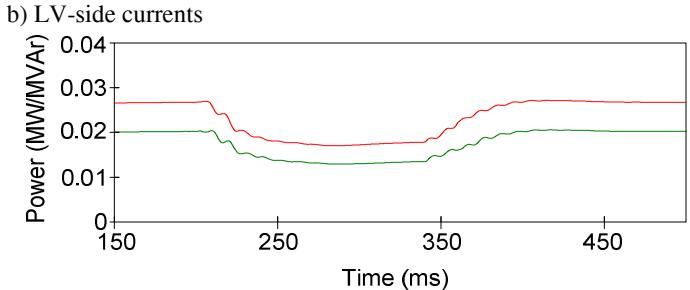  
c) LV-side active and reactive power

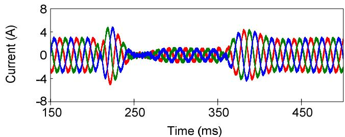  
Fig. 3. Simulation results: Current unbalance at the secondary side.

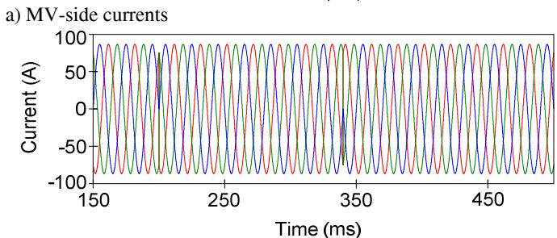

Fig. 4. Simulation results: Power flow reversal.   
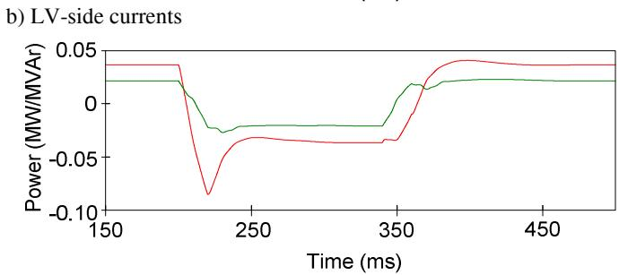  
c) LV-side active and reactive power

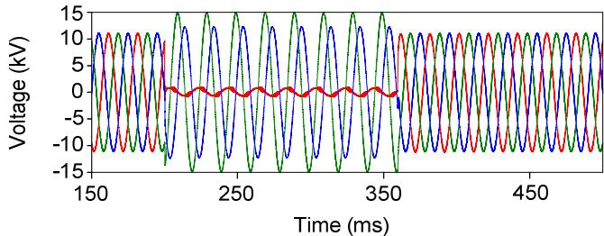

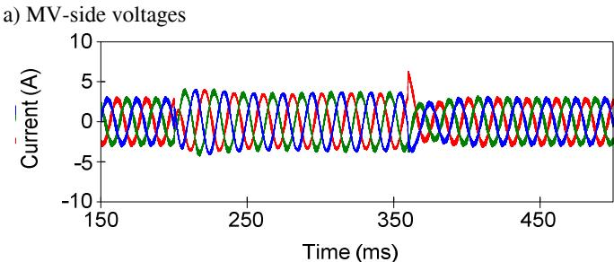

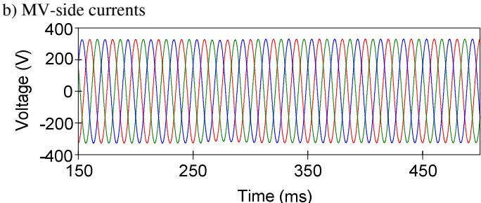  
c) LV-side voltages

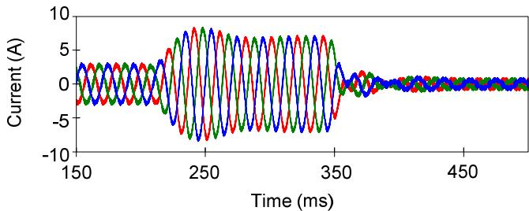  
Fig. 5. Simulation results: Voltage sag at the primary side.

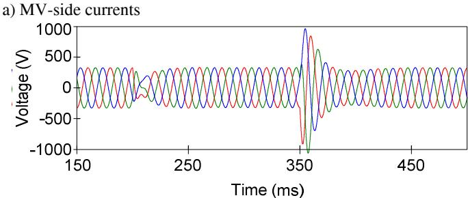

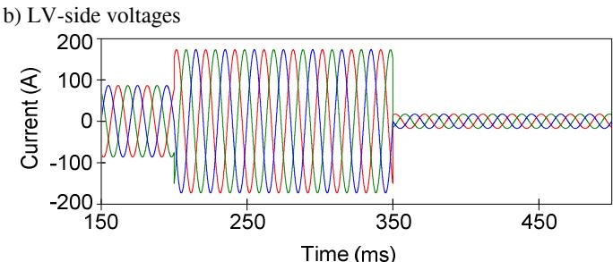  
c) LV-side currents   
Fig. 6. Simulation results: Overcurrent at the secondary side.

# VI. REFERENCES

[1] M. Kang, P.N. Enjeti, and I.J. Pitel, “Analysis and design of electronic transformers for electric power distribution system,” IEEE Trans. on Power Electronics, vol. 14, no. 6, pp. 1133–1141, November 1999.   
[2] D. Wang, C.X. Mao, J.M. Lu, S. Fan, and F. Peng, “Theory and application of distribution electronic power transformer,” Electric Power Systems Research, vol. 77, no. 3, pp. 219-226, 2007.   
[3] A.J. Visser, J.H.R. Enslin, and H. du T. Mouton, “Transformer series sag compensation with a cascaded multilevel inverter,” IEEE Trans. on Industrial Electronics, vol. 49, no. 4, pp. 824–831, August 2002.   
[4] S. Kouro, M. Malinowski, K. Gopakumar, J. Pou, L. G. Franquelo, B. Wu, J. Rodriguez, M. A. Pérez, and J. I. Leon, “Recent advances and industrial applications of multilevel converters,” IEEE Trans. on Industrial Electronics, vol. 57, no. 8, pp. 2553–2580, Aug. 2010.   
[5] J.E. Huber and J.W. Kolar, “Volume/Weight/Cost comparison of a 1 MVA 10 kV/400 V solid-state against a conventional low-frequency distribution transformer,” IEEE Energy Conversion Congress and Exposition, Pittsburgh, September 2014.   
[6] H.W. Dommel, EMTP Theory Book, Bonneville Power Admin., Portland, OR: August 1986.   
[7] S. Alepuz, F. González-Molina, J. Martin-Arnedo, and J.A. Martinez-Velasco, “Development and testing of a bidirectional distribution electronic power transformer model,” Electric Power Systems Research, vol. 107, pp. 230-239, February 2014.   
[8] J. Rodriguez, S. Bernet, P. K. Steimer, and I.E. Lizama, “A survey on neutral-point-clamped inverters,” IEEE Trans. on Industrial Electronics, vol. 57, no. 7, pp. 2219-2230, Jul. 2010.   
[9] M.A. Moonem and H. Krishnaswami, “Analysis and control of multilevel dual active bridge DC-DC converter,” IEEE Energy Conversion Congress and Exposition, Raleigh, September 2012.   
[10] D. Lee and J. Jang, “Output voltage control of PWM inverters for standalone wind power generation systems using feedback linearization,” 14th Industry Applications Conference, October 2005.   
[11] J. Dai, D. Xu, and B. Wu, “A novel control scheme for current-sourceconverter-based PMSG wind energy conversion systems,” IEEE Trans. on Power Electronics, vol. 24, no. 4, pp. 963–972, April 2009.   
[12] S. Busquets-Monge, “A novel pulse width modulation for the comprehensive neutral-point voltage control in the three-level threephase neutral point-clamped dc-ac converter,” Ph.D. Dissertation, Univ. Politecnica de Catalunya, Barcelona, Spain, February 2006.   
[13] M.A. Perales, M.M. Prats, R. Portillo, J.L. Mora, J.I. Leon, and L.G. Franquelo, “Three-dimensional space vector modulation in abc coordinates for four-leg voltage source converters,” IEEE Power Electronics Letters, vol. 99, no. 4, pp. 104–109, Dec. 2003.   
[14] J.A. Martinez-Velasco, S. Alepuz, F. González-Molina, J. Martin-Arnedo, “Dynamic average modeling of a bidirectional solid state transformer for feasibility studies and real-time implementation,” Electric Power Systems Research, Vol. 117, pp. 143-153, November 2014.   
[15] B. Backlund and E. Carroll, Voltage ratings of high power semiconductors, ABB Semiconductors, August 2006.   
[16] J.E. Huber and J.W. Kolar, “Optimum number of cascaded cells for high-power medium-voltage multilevel converters,” IEEE Energy Conversion Congress and Exposition, Denver, September 2013.   
[17] EPRI Report, Development of a New Multilevel Converter-Based Intelligent Universal Transformer: Design Analysis, EPRI, Palo Alto, CA: 2004. 1002159.   
[18] F. Wang, G. Wang, A. Huang, W.S. Yu and X. Ni, “A 3.6kV high performance solid state transformer based on 13kV SiC MOSFET,” 5th IEEE Int. Symp. on Power Electronics for Distributed Generation Systems (PEDG), Galway, June 2014.   
[19] X. She, X. Yu, F. Wang, and A.Q. Huang, “Design and Demonstration of a 3.6-kV–120-V/10-kVA Solid-State Transformer for Smart Grid Application,” IEEE Trans. on Power Electronics, vol. 29, no. 8, pp. 3982-3996, August 2014.   
[20] Y. Liu, A. Escobar-Mejía, C. Farnell, Y. Zhang, J.C. Balda, and H.A. Mantooth, “Modular multilevel converter with high-frequency transformers for interfacing hybrid DC and AC microgrid systems,” 5th IEEE Int. Symp. on Power Electronics for Distributed Generation Systems (PEDG), Galway, June 2014.