# A Component-Level Modeling and Fine-Grained Simulation Method for Renewable Energy Power Systems Suitable for GPU Architecture

Qiguo Wang, Jin Xu, Member, IEEE, Keyou Wang, Member, IEEE, Guojie Li, Senior Member, IEEE, Jianqi Zhou and Junichi Arai, Senior Member, IEEE

Abstract—The detailed modeling of renewable energy power stations captures the full impedance characteristics of the system but significantly increases the scale of electromagnetic transient (EMT) simulations. Parallel computing is essential to enhance the simulation efficiency, but it requires algorithms that are specifically designed to leverage the architecture of high-performance hardware. This paper proposes the generalized latency insertion method (GLIM) to establish component-level models for renewable energy power systems. GLIM extends its applicability to complex equipment incompatible with the constraints of the traditional latency insertion method (LIM) by introducing controlled sources. In this way, the simulation of complex power systems can be transformed into the solution of massive GLIM basic topologies. Then, according to the multi-thread parallel and optimized storage techniques, GLIM conducts fine-grained simulations on graphics processing units (GPUs), significantly improving the solving efficiency. In the case study, a renewable energy power system with large-scale wind farm integration is used to demonstrate the effectiveness of GLIM on a GeForce RTX 3060 laptop GPU. The simulation accuracy of GLIM is verified through comparison with PSCAD, and the simulation efficiency is verified by changing the scale of wind farms.

Index Terms—Component-level modeling, Fine-grained simulation, Renewable energy power systems, Graphics processor unit.

# I. INTRODUCTION

ITH the increasing access capacity of renewable energies,W the proportion of power electronic devices in the power grid has significantly increased, and the multi-mode oscillation caused by the interaction between multiple control links has gradually become prominent [1]. Relevant studies have shown

This work was supported in part by the National Key Research and Development Program of China (No. 2022YFE0105200) and in part by the project of State Grid Zhejiang Electric Power Co., LTD., Jiaxing power supply company (5211JX230004). (Corresponding author: Jin Xu).

Q. Wang, J. Xu (e-mail: xujin20506@sjtu.edu.cn), K. Wang and G. Li are with the Key Laboratory of Control of Power Transmission and Conversion, Ministry of Education, and Shanghai Non-Carbon Energy Conversion and Utilization Institute, Shanghai Jiao Tong University, Shanghai 200240, China.

J. Zhou is with the State Grid Jiaxing Power Supply Company, Jiaxing, China (e-mail: zhoucity@vip.sina.com).

J. Arai is with Kogakuin University of Technology & Engineering, Tokyo 163-8677, Japan (e-mail: arai@cc.kogakuin.ac.jp).

that the simplified model of power electronic equipment based on port characteristics [2], [3] will ignore some higher harmonics [4], and the equivalent model of renewable energy power stations based on aggregation [5], [6] has significant differences in impedance characteristics compared with the original system [7]. Therefore, it is necessary to conduct detailed modeling and electromagnetic transient (EMT) simulations of renewable energy power stations to ensure the stable operation of power systems.

The EMT modeling methods can be broadly divided into two main categories: the state-space model and the companion circuit model. The state-space model is solved by the state variable method (SVM) [8], which can accurately capture the dynamics of nonlinear devices but has lower simulation efficiency due to the iterative steps involved in the solution process. The companion circuit model is often combined with the nodal analysis method (NAM) for solving [9], the core of which is to establish the nodal voltage equation of the network. It avoids iteration within a single simulation step but has limitations when handling complex dynamics and nonlinear behaviors. Additionally, some scholars have proposed improvements based on these two methods. The state-space nodal method [10] combines the advantages of both SVM and NAM, which is suitable for multi-port circuits and complex power systems. The modified nodal analysis [11] and extended modified nodal analysis [12] methods address the challenges posed by voltage source branches and current-dependent circuits in traditional NAM. All of these methods can use high-performance computing platforms to improve the solution efficiency. However, NAM does not require considering the independence of interconnected branches when forming network equations compared to SVM, making it simple and effective in programming. As a result, NAM is the mainstream approach for algorithm optimization and parallel processing.

Considering that the node admittance matrix formed by the NAM is extremely sparse [13], scholars began to focus on the parallel solution of large-scale sparse linear equations using GPU. Some researchers have reconstructed parallel algorithms adapted to GPU architecture based on traditional LU decomposition algorithms. The Crout algorithm realizes parallel solutions by reducing the dependency on element computation [14]. Left-looking LU decomposition ensures the efficiency of solving matrices with different sparsity by using

the sparsity index [15]. Right-looking LU decomposition can complete the update of all elements at the bottom right of the located column in a single loop, which has a higher parallelism advantage [16], [17]. All the above methods have been applied in the simulation of power systems [18], and a good acceleration effect has been achieved. Although these methods reduce the solving complexity, their solving efficiency is still related to the number of non-zero elements in the node admittance matrix, and the unpredictability of sparse construction seriously affects the single instruction multiple thread execution and access efficiency of GPU cores [19].

In addition to the above mathematical optimization methods, large-scale systems can be decomposed into multiple subsystems for parallel solutions according to the physical characteristics of the topology. The Diakoptics [20] method proposed by Kron shows that the system tearing method can be a combination of equations and topology. Subsequently, relevant scholars further developed it as the multi-area Thevenin equivalence [21], [22], node splitting method [23], [24], and compensation method [25], [26]. These methods introduce serial steps to solve the correlation current, so they need to consider the equilibrium optimization of the scale of the subsystem and the scale of the correlation equation. For renewable energy sources, such as wind power, which are relatively independent of the main grid, they can be separated from the main grid by introducing delay [27], and then each wind turbine generator (WTG) can be solved in parallel, but the solution complexity of a single WTG is still high [7]. In addition, the control part of the wind power converter is independent of the main circuit and can also be solved by different GPU threads [28]. On this basis, relevant scholars further introduced computational boundaries to carry out fine-grained reconstruction of the WTG system to realize parallel solutions with each equipment as the basic unit [29]. However, the solution characteristics and complexity of diverse equipment are not uniform, and the irregularity of the basic parallel unit will affect the execution and access efficiency of GPU multithreading. Therefore, it is necessary to establish a unified fine-grained model of various equipment in renewable energy power systems to give full play to the advantages of GPU resources.

The latency insertion method (LIM) commonly used in large-scale integrated circuit design has been applied to power systems due to its high parallelism. Some scholars have applied it to the strongly coupled transmission line [30], the three-phase coupled transmission line [31], and the power electronic systems [32]. However, because its topology requires that the node must contain a capacitor and the branch must contain an inductor [33], its application in renewable energy power systems needs to be further explored.

In this work, inspired by LIM, a component-level modeling and fine-grained simulation method suitable for GPU architecture is proposed to meet the efficiency requirements of fine simulation of renewable energy power systems. The proposed method has the following contributions:

1) A unified modeling framework with high parallelism of renewable energy power systems is constructed based on the

generalized latency insertion method (GLIM), which includes the equipment that cannot be directly expressed as the basic topological form of LIM. The proposed method breaks the topological constraints of LIM and can be applied to the simulation of complex power systems.

2) The model constructed by GLIM takes the three-phase node and three-phase branch as the basic parallel unit, and its time complexity is linear, which is more in line with the characteristics of the massive computing units of GPU. When combined with GPU, its simulation efficiency will not change significantly with the system scale, and this feature of GLIM can better meet the growing demand for renewable energy.

The paper is organized as follows: Section II introduces the unified component-level modeling of renewable energy power systems based on GLIM. Section III elaborates on the design of the fine-grained parallel algorithm based on GPU. The simulation case and results are given in Section IV, and Section V presents the conclusions.

# II. UNIFIED COMPONENT-LEVEL MODELING OF RENEWABLE ENERGY POWER SYSTEMS BASED ON GLIM

# A. Basic theory of GLIM

GLIM replaces the voltage/current source in two basic topologies of LIM with the controlled voltage/current source, making it suitable for renewable energy power systems containing multiple types of equipment. The node topology and branch topology of GLIM are shown in Fig. 1.

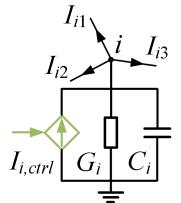

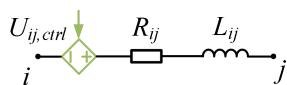  
(b)   
Fig. 1. Two basic topologies of GLIM. (a) node topology; (b) branch topology.

The circuit equations of the above topologies of GLIM are listed separately. The difference equations can be obtained by using the leap-frog method [34], which is a difference scheme where the voltage and current are alternately solved in half a step, as shown in (1) and (2). The leap-frog scheme has second-order precision, which samples the voltage field and the current field in a staggered way, and the staggered sampling yields a marching-on-in-time algorithm [35]. In the subsequent sections, unless explicitly stated otherwise, the leap-frog method is also used for discretization.

$$
U _ {i} ^ {n + 1 / 2} = \left(\frac {C _ {i}}{\Delta t} + G _ {i}\right) ^ {- 1} \frac {C _ {i}}{\Delta t} U _ {i} ^ {n - 1 / 2} + \left(\frac {C _ {i}}{\Delta t} + G _ {i}\right) ^ {- 1} \left(- \sum_ {k = 1} ^ {M} I _ {i k} ^ {n} + I _ {i c t r l} ^ {n}\right) (1)
$$

$$
I _ {i j} ^ {n + 1} = \left(\frac {L _ {i j}}{\Delta t}\right) ^ {- 1} \left(\frac {L _ {i j}}{\Delta t} - R _ {i j}\right) I _ {i j} ^ {n} + \left(\frac {L _ {i j}}{\Delta t}\right) ^ {- 1} \left(U _ {i} ^ {n + 1 / 2} - U _ {j} ^ {n + 1 / 2} + U _ {i j, c t r l} ^ {n + 1 / 2}\right) (2)
$$

where Δt is the simulation step size; superscript n represents the current simulation step; superscript n+1/2 means to advance half a time step based on the current simulation step, and the meaning of $n { - } 1 / 2$ and n+1 can refer to n+1/2; $U _ { i , \thinspace } U _ { j , \thinspace } I _ { i j }$ are the voltage of node $i ,$ the voltage of node $j ,$ and the current of

branch ij respectively; $I _ { i , c t r l } , \ U _ { i j , c t r l }$ are the controlled current source of node i and the controlled voltage source of branch $i j$ respectively; M is the set of all nodes adjacent to node i, and the definition of $I _ { i k }$ is similar to that of $I _ { i j } ; ~ C _ { i } , ~ G _ { i }$ are the ground capacitance and admittance of node i respectively; $L _ { i j } , R _ { i j }$ are the inductance and resistance of branch ij respectively.

It can be found from (1) that the node voltage of the next simulation step is only related to the node voltage, branch current, and controlled current source of the current simulation step, so the voltage solving of each node does not depend on the voltages of other nodes of the next simulation step, which means that the voltage solving of each node is independent of each other. The same is true for the current solving of each branch according to (2) after solving the node voltage of the next simulation step. Therefore, GLIM is a component-level modeling method with the individual node and branch as the basic unit.

# B. Unified component-level modeling of renewable energy power systems based on GLIM

Wind power generation and photovoltaic power generation are important directions for the development of renewable energy power systems. The grid-connected wind power generation unit shown in Fig. 2 is taken as an example to illustrate the applicability of GLIM in the component-level modeling of renewable energy power systems.

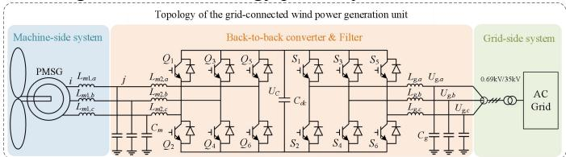  
Fig. 2. Topology of the grid-connected wind power generation unit.

# 1) Grid-side system

The grid-side system mainly conducts GLIM modeling for transmission lines, transformers, loads, and synchronous generators.

Firstly, the transmission lines can be directly expressed as a combination of two basic topologies of GLIM according to the π model. The controlled sources of nodes and branches for transmission lines are 0, and they are defined as ordinary nodes and ordinary branches of GLIM. To improve the solving efficiency of transmission network with a large number of nodes and branches, (1)-(2) can be written in matrix form as follows:

$$
\left(\frac {\boldsymbol {C}}{\Delta t} + \boldsymbol {G}\right) \boldsymbol {U} _ {n} ^ {n + 1 / 2} = \frac {\boldsymbol {C}}{\Delta t} \boldsymbol {U} _ {n} ^ {n - 1 / 2} - \boldsymbol {M} _ {\text {G L I M}} \boldsymbol {I} _ {b} ^ {n} \tag {3}
$$

$$
\left(\frac {\boldsymbol {L}}{\Delta t}\right) \boldsymbol {I} _ {b} ^ {n + 1} = \left(\frac {\boldsymbol {L}}{\Delta t} - \boldsymbol {R}\right) \boldsymbol {I} _ {b} ^ {n} + \boldsymbol {M} _ {\text {G L I M}} ^ {\mathrm {T}} \boldsymbol {U} _ {n} ^ {n + 1 / 2} \tag {4}
$$

where C, G, R, and L are coefficient matrices composed of the capacitance, the admittance of each node and the resistance, the inductance of each branch respectively, and they are block diagonal matrices when the coupling is considered and diagonal matrices when the coupling is not considered; $U _ { n }$ and Ib are vectors of node voltages and branch currents respectively; $M _ { G L I M }$ is the transformation matrix, which is used to calculate

the injection current of nodes and voltage difference of branches, and its definition is as follows: a) When the current of branch p flows from node $i , M _ { G L I M } ( i , p ) { = } 1 ; \mathrm { b } )$ When the current of branch p flows in from node $i , M _ { G L I M } ( i , p ) { = } { - } 1 ; \mathrm { c } )$ When the current of branch $p$ is independent of node $i , M _ { G L I M } ( i , p ) { = } 0 ;$

Secondly, the transformer is equivalent by its leakage reactance and a lossless ideal transformer, which can be expressed as an ordinary branch.

Thirdly, the load adopts the constant impedance model, which also corresponds to an ordinary branch. The distinction lies in that one end of the branch is grounded, and the node voltage of the ground point is directly set to 0.

Finally, the generators are replaced by ideal voltage sources. The value of the controlled source of the branch where the generator is located is the value of the ideal voltage source.

Fig. 3 shows the GLIM model of the grid-side system, and renewable energy power stations can connect to the grid from different locations.

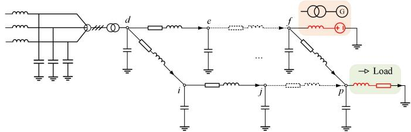  
Fig. 3. GLIM Modeling of the grid-side system.

# 2) Machine-side system

The machine-side system primarily consists of the permanent magnet synchronous generator (PMSG) and its series inductors. Due to the absence of grounding capacitance at the PMSG outlet, direct application of LIM for modeling is not feasible. However, GLIM can build a component-level model of the combination of PMSG and its series inductor, and the detailed modeling process is described below.

# a) Electrical equations

The voltage and flux linkage equation of PMSG in the dq coordinate system is shown in (5), and the voltage equation of the outlet inductor in the abc coordinate system is shown in (6). The combination of PMSG and its series inductor is referred to as PMSG-L.

$$
\left\{ \begin{array}{l} u _ {i, d} = R _ {s} i _ {i j, d} + p \psi_ {d} - \omega \psi_ {q} \\ u _ {i, q} = R _ {s} i _ {i j, q} + p \psi_ {q} + \omega \psi_ {d} \\ \psi_ {d} = L _ {d} i _ {i j, d} + \psi_ {f} \\ \psi_ {q} = L _ {q} i _ {i j, q} \end{array} \right. \tag {5}
$$

$$
\left\{ \begin{array}{l} u _ {i, a} - u _ {j, a} = L _ {m 1, a} p i _ {i j, a} \\ u _ {i, b} - u _ {j, b} = L _ {m 1, b} p i _ {i j, b} \\ u _ {i, c} - u _ {j, c} = L _ {m 1, c} p i _ {i j, c} \end{array} \right. \tag {6}
$$

where $p$ is the differential operator; Rs is the resistance of the stator; Lm1 is the series inductance; u, i, ψ, ω, and L are the voltage, current, flux linkage, rotor speed and inductance respectively; ψf is the flux amplitude of the armature winding generated by the permanent magnet pole; subscripts $i , j ,$ and $i j$ represent node i, node $j ,$ and branch ij respectively; subscripts d

and q represent the d, q axis components of the variables respectively; subscripts $a , b ,$ , and c represent phase a, phase $b ,$ and phase c respectively.

After discretization, the output current expression can be obtained as (7). The detailed derivation process is shown in Appendix A.

$$
\begin{array}{l} \left(\frac {A _ {P M S G - L}}{\Delta t}\right) I _ {i j} ^ {n + 1} = \left(\frac {A _ {P M S G - L}}{\Delta t} - B _ {P M S G - L}\right) I _ {i j} ^ {n} \tag {7} \\ + \left(\boldsymbol {C} _ {\text {P M S G - L}} \boldsymbol {U} _ {j} ^ {n + 1 / 2} + \boldsymbol {U} _ {\text {P M S G - L , c t r l}} ^ {n + 1 / 2}\right) \\ \end{array}
$$

where $I _ { i j }$ is a vector composed of the output currents; $U _ { j }$ is a vector composed of the terminal voltage of the series inductor; UPMSG-L,ctrl is a vector composed of controlled voltage sources; APMSG-L, BPMSG-L, and CPMSG-L are the coefficient matrices.

The expression of the controlled voltage source $U _ { P M S G - L , c t r l } ^ { n + 1 / 2 }$ of PMSG-L is shown in Appendix A, and its value is related to the generator speed, the inductance, and the flux amplitude of the armature winding generated by the permanent magnet pole.

# b) Mechanical equations

There is a coordinate transformation operation in (7), and the value of the controlled voltage source is related to the generator speed, causing the current solution to be related to the variables of the rotor. The rotor motion equations of PMSG are shown below:

$$
\left\{ \begin{array}{l} J p \omega = T _ {m} - T _ {e} - K _ {D} \omega \\ p \theta = \omega \end{array} \right. \tag {8}
$$

where $T _ { m }$ is the mechanical torque; $T _ { e }$ is the electromagnetic torque; θ is the mechanical angular displacement of the rotor; J is the moment of inertia; $K _ { D }$ is the mechanical damping coefficient.

The discretization equation is as follows:

$$
\left\{ \begin{array}{l} \omega^ {n + 1 / 2} = \frac {J}{J + K _ {D} \Delta t} \omega^ {n - 1 / 2} + \frac {\Delta t}{J + K _ {D} \Delta t} \left(T _ {m} ^ {n} - T _ {e} ^ {n}\right) \\ \theta^ {n + 1} = \theta^ {n} + \Delta t \omega^ {n + 1 / 2} \end{array} \right. \tag {9}
$$

c) GLIM model of PMSG-L

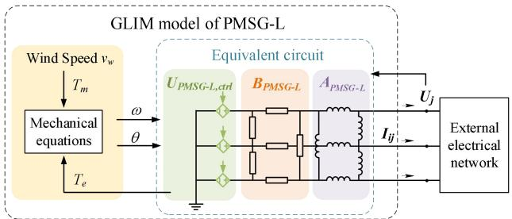  
Fig. 4. GLIM model of PMSG and its series inductor.

The above (7) and (9) together constitute the GLIM model of PMSG-L, which is shown in Fig. 4. The variables not specially marked in Fig. 4 are the variables of the current simulation step, and the variables in the following figures of the paper are the same unless otherwise specified. After solving the terminal voltages and the controlled voltage sources of the current simulation step, the solution of the output current of PMSG-L is only related to the current of the previous simulation step according to (7), so it is a component-level model with the three-phase branch as the basic unit.

It can be found that the form of the GLIM model of the PMSG-L is consistent with (4). The difference is that the coefficient matrices of the GLIM model are non-diagonal time-varying matrices due to the introduction of coordinate transformation, and the controlled voltage source vector is also time-varying. Therefore, GLIM can transform the generator described by differential equations into a three-phase branch containing controlled voltage sources for solution.

# 3) Back-to-back converter and filter

Due to the direct current circuit of the back-to-back (BTB) converter does not contain ground nodes, LIM is unable to be directly applied in the modeling of the BTB converter. However, GLIM can use phase-to-phase controlled sources to characterize the coupling relationship between the DC side and AC side to realize the component-level modeling of the BTB converter.

# a) Electrical equations

In the converter topology shown in Fig. 2, the GLIM modeling process of the machine-side converter and the grid-side converter is similar after using the DC capacitor decoupled the BTB converter. Therefore, the GLIM model is derived by taking the grid-side converter as an example. The voltage and current equations can be written as (10) according to switching states, and the switch adopts the resistance model with the switching function.

$$
\left\{ \begin{array}{c} C _ {d c} p U _ {C} = \frac {R _ {2}}{R _ {1} + R _ {2}} I _ {g, a} + \frac {R _ {4}}{R _ {3} + R _ {4}} I _ {g, b} + \frac {R _ {6}}{R _ {5} + R _ {6}} I _ {g, c} \\ - \frac {U _ {C}}{R _ {1} + R _ {2}} - \frac {U _ {C}}{R _ {3} + R _ {4}} - \frac {U _ {C}}{R _ {5} + R _ {6}} + I _ {m} \\ U _ {g, a} - U _ {g, b} = L _ {g, a} p I _ {g, a} - L _ {g, b} p I _ {g, b} + \frac {R _ {3}}{R _ {3} + R _ {4}} U _ {C} \\ - \frac {R _ {1}}{R _ {1} + R _ {2}} U _ {C} + \frac {R _ {1} R _ {2}}{R _ {1} + R _ {2}} I _ {g, a} - \frac {R _ {3} R _ {4}}{R _ {3} + R _ {4}} I _ {g, b} \\ U _ {g, b} - U _ {g, c} = L _ {g, b} p I _ {g, b} - L _ {g, c} p I _ {g, c} + \frac {R _ {5}}{R _ {5} + R _ {6}} U _ {C} \\ - \frac {R _ {3}}{R _ {3} + R _ {4}} U _ {C} + \frac {R _ {3} R _ {4}}{R _ {3} + R _ {4}} I _ {g, b} - \frac {R _ {5} R _ {6}}{R _ {5} + R _ {6}} I _ {g, c} \\ U _ {g, c} - U _ {g, a} = L _ {g, c} p I _ {g, c} - L _ {g, a} p I _ {g, a} + \frac {R _ {1}}{R _ {1} + R _ {2}} U _ {C} \\ - \frac {R _ {5}}{R _ {5} + R _ {6}} U _ {C} + \frac {R _ {5} R _ {6}}{R _ {5} + R _ {6}} I _ {g, c} - \frac {R _ {1} R _ {2}}{R _ {1} + R _ {2}} I _ {g, a} \end{array} \right. \tag {10}
$$

where $U _ { g }$ is the voltage of the filter capacitor; $I _ { g }$ is the current on the filter inductor; $L _ { g }$ is the value of the filter inductor; $U _ { C }$ is the voltage of the DC capacitor; Im is the equivalent current of the machine side converter, and its derivation process is similar to that of the grid side converter; $R _ { n }$ represents the resistance of the switch under different switching states, which is defined as follows:

$$
R _ {n} = S _ {n} R _ {\text {o n}} + \left(1 - S _ {n}\right) R _ {\text {o f f}} \tag {11}
$$

where n=1, 2, 3, 4, 5, 6; When the switch is on, $S _ { n } { = } 1$ , and $R _ { o n }$ represents the on-resistance; When the switch is off, $S _ { n } { = } 0$ and

$R _ { o f f }$ represents the off-resistance.

The following expression can be obtained after discretization and sorting, and the detailed derivation is shown in Appendix B.

$$
\left(\frac {C _ {d c}}{\Delta t} + M _ {1} \left(S _ {n}\right)\right) U _ {C} ^ {n + 1 / 2} = \frac {C _ {d c}}{\Delta t} U _ {C} ^ {n - 1 / 2} + \left(I _ {m} ^ {n} + \boldsymbol {M} _ {2} \left(S _ {n}\right) \boldsymbol {I} _ {\mathbf {g}} ^ {n}\right) \tag {12}
$$

$$
\left(\frac {\boldsymbol {A} _ {\boldsymbol {g}}}{\Delta t}\right) \boldsymbol {I} _ {\boldsymbol {g}} ^ {n + 1} = \left(\frac {\boldsymbol {A} _ {\boldsymbol {g}}}{\Delta t} - \boldsymbol {M} _ {3} \left(S _ {n}\right)\right) \boldsymbol {I} _ {\boldsymbol {g}} ^ {n} + \left(\boldsymbol {T} \boldsymbol {U} _ {\boldsymbol {g}} ^ {n + 1 / 2} - \boldsymbol {M} _ {4} \left(S _ {n}\right) U _ {C} ^ {n + 1 / 2}\right) (1 3)
$$

where $\begin{array} { r } { I _ { g } \mathrm { = } [ I _ { g , a } \ I _ { g , b } \ I _ { g , c } ] ^ { T } ; \ U _ { g } \mathrm { = } [ U _ { g , a } \ U _ { g , b } \ U _ { g , c } ] ^ { T } ; \ M _ { 1 } ( S _ { n } ) , \ M _ { 2 } ( S _ { n } ) } \end{array}$ , $M _ { 3 } ( S _ { n } )$ , and $M _ { 4 } ( S _ { n } )$ are the coefficient, vector, matrix and vector that are composed of switching action resistors respectively, which are related to the switch states; $A _ { g }$ is the coefficient matrix, which is related to the inductances; T is the transformation matrix. Their definitions are shown in Appendix B. In the above equations, $M _ { 2 } \left( S _ { n } \right) I _ { g } ^ { n }$ and $- M _ { 4 } \big ( S _ { n } \big ) U _ { C } ^ { n + 1 / 2 }$ correspond to the controlled current source and the controlled voltage source respectively.

The GLIM model of the circuit part of the converter is shown in (12)-(13), which can capture the characteristics of switches in different states. The difference between (13) and (7) is that its controlled sources are related to the switching action resistances determined by the switch states. Additionally, there are transformation matrices between phase-to-phase and three-phase in the GLIM model due to the voltage of the DC capacitor being equivalent to the AC side in the form of phase-to-phase coupling.

The simulation of power systems with large-scale renewable energy integration primarily focuses on grid-connected stability and wide-band oscillation, and local events such as blocking have less impact on system-level dynamic behaviors. In this scenario, (12)-(13) can consider only the normal operating states of the switches. $R _ { o n }$ is further set to 0, and $R _ { o f f }$ is considered infinite. Consequently, the GLIM model of the circuit part of the converter can be rewritten as follows:

$$
\frac {C _ {d c}}{\Delta t} U _ {C} ^ {n + 1 / 2} = \frac {C _ {d c}}{\Delta t} U _ {C} ^ {n - 1 / 2} + \left(I _ {m} ^ {n} + \boldsymbol {M} _ {2} ^ {\prime} \left(S _ {n}\right) \boldsymbol {I} _ {g} ^ {n}\right) \tag {14}
$$

$$
\left(\frac {\boldsymbol {A} _ {\boldsymbol {g}}}{\Delta t}\right) \boldsymbol {I} _ {\boldsymbol {g}} ^ {n + 1} = \left(\frac {\boldsymbol {A} _ {\boldsymbol {g}}}{\Delta t} - \boldsymbol {M} _ {3} ^ {\prime} \left(S _ {n}\right)\right) \boldsymbol {I} _ {\boldsymbol {g}} ^ {n} + \left(\boldsymbol {T} \boldsymbol {U} _ {\boldsymbol {g}} ^ {n + 1 / 2} - \boldsymbol {M} _ {4} ^ {\prime} \left(S _ {n}\right) U _ {C} ^ {n + 1 / 2}\right) (1 5)
$$

$\mathrm { w h e r e } ~ M _ { 2 } ^ { ^ { \prime } } ( S _ { n } ) { } = \left[ S _ { 1 } \quad S _ { 3 } \quad S _ { 5 } \right] , ~ M _ { 4 } ^ { ^ { \prime } } ( S _ { n } ) { } = \left[ S _ { 1 } \quad S _ { 3 } \quad S _ { 5 } \right] ^ { \mathrm { T } } ,$

$$
\boldsymbol {M} _ {\mathfrak {z}} ^ {\prime} \left(S _ {n}\right) = \left[ \begin{array}{c c c} 0 & 0 & 0 \\ 0 & 0 & 0 \\ 1 & 1 & 1 \end{array} \right].
$$

The above two GLIM models can be selected according to simulation scenarios and requirements.

# b) Control system equations

The controlled sources mentioned above are related to the switch states. Switching signals can be obtained through the control system, and Fig. 5 shows the control diagram of the grid-side converter. The output of the control system forms modulated waves after a coordinate transformation, and then the switching signals are obtained by comparing them with the carrier waves.

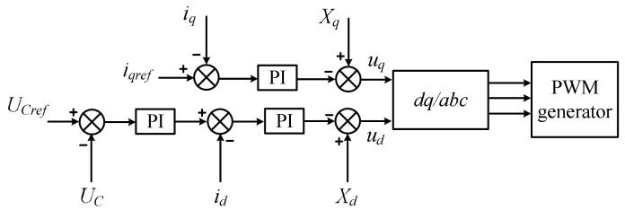  
Fig. 5. Control system of the grid side converter.

The mathematical model of the above control system can be obtained according to Fig. 5. The discretization process is similar to that in (9), which is simply described by the f function.

$$
\boldsymbol {S} ^ {n} = f \left(U _ {C} ^ {n - 1 / 2}, i _ {d} ^ {n}, i _ {q} ^ {n}\right) \tag {16}
$$

where S is the vector composed of switch states; ud, $u _ { q }$ are the outputs of the control system; $U _ { C , i _ { q } }$ are the sampled values of the voltage of the DC capacitor and the q axis components of the converter current respectively; subscript ref represents the reference value; $X _ { d } , X _ { q }$ are the coupling compensation of the d axis and q axis of the converter respectively.

# c) GLIM model of BTB converter and filter

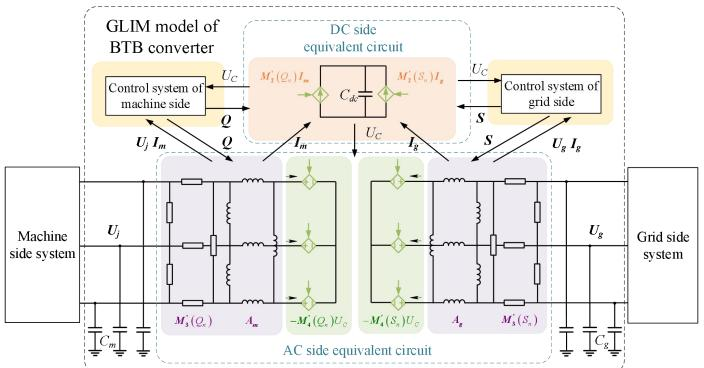  
Fig. 6. GLIM model of the back-to-back converter and filter.

The above (14)-(16) together constitute the GLIM model of the grid-side converter, and the GLIM model of the machine-side converter is similar to it. Fig. 6 shows the complete GLIM model of the BTB converter, and the solution of the DC side equivalent circuit and AC side equivalent circuit corresponds to the node topology and branch topology of GLIM, respectively. After solving the voltages of the DC capacitor and the filter capacitor of the current simulation step, the solution of the current of the machine-side branch and the grid-side branch is only related to the branch current of the previous simulation step. Therefore, the GLIM model of the BTB converter and filter is also a component-level model with the three-phase branch and the DC node as the basic unit.

It can be found from the above GLIM modeling process that the complex equipment in renewable energy power systems can be equivalent to the combination form of controlled source and impedance according to its mathematical model, and their solution equations have the same form as the solution equations of transmission lines. Therefore, GLIM can realize the unified component-level modeling of renewable energy power systems with the three-phase node and three-phase branch as the basic unit.

# III. DESIGN OF THE FINE-GRAINED PARALLEL ALGORITHM BASED ON GPU

# A. Solution process

Under the GLIM modeling framework, the simulation of renewable energy power systems with wind farm access can be converted into a massive repetitive solution process with the three-phase node and three-phase branch as the basic unit. These nodes/branches include controlled source nodes/branches and ordinary nodes/branches, as shown in Fig. 7. The solution of each three-phase node and each three-phase branch is independent, so the GLIM model has the characteristics of the fine-grained parallel solution.

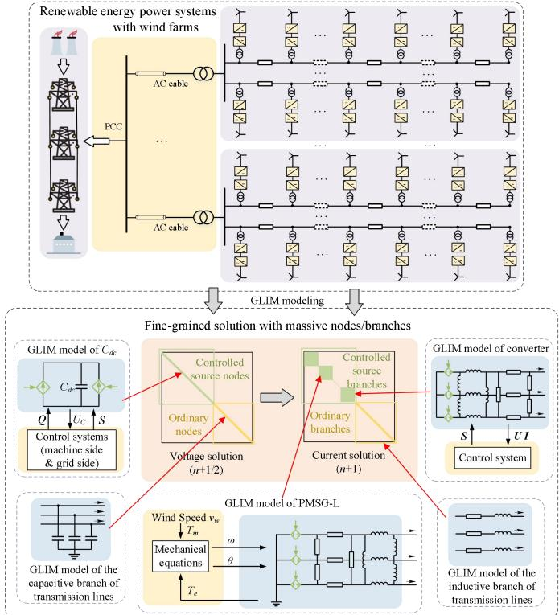  
Fig. 7. GLIM model of renewable energy power systems with wind farm access.

Therefore, the solution process of renewable energy power systems based on the GLIM model mainly includes solving node voltages, solving branch currents, and solving controlled sources, which is shown in Fig. 8. The solution of node voltages includes solving the voltages of the ordinary nodes and the controlled source nodes. The solution of branch currents includes solving the currents of the ordinary branches and the controlled source branches. The solution of controlled sources includes solving controlled voltage sources and controlled current sources. The solution of each three-phase node is independent of each other and can be solved in parallel using the multi-threaded architecture of GPU. The solution of each three-phase branch and each three-phase controlled source is the same as nodes, and the detailed parallel solution will be explained in the next section.

When solving controlled sources related to the switch states, considering that different time scales are acceptable for modulation waves with power frequency change and switching signals with high-frequency change, the simulation step size of tens of microseconds is used to solve the control process of

generating modulated waves, and the simulation step size of microseconds is used to solve the process of generating switching signals and the electrical part. Specifically, when the simulation time reaches an integer multiple of the control step size $\Delta t _ { c t r l } ,$ the complete control process is executed to generate switching signals. Otherwise, the switching signals are directly generated by comparing the modulated waves obtained in the previous control simulation step with the carrier at the current moment. The process of data interaction between the control system and the electrical system is shown in Fig 9.

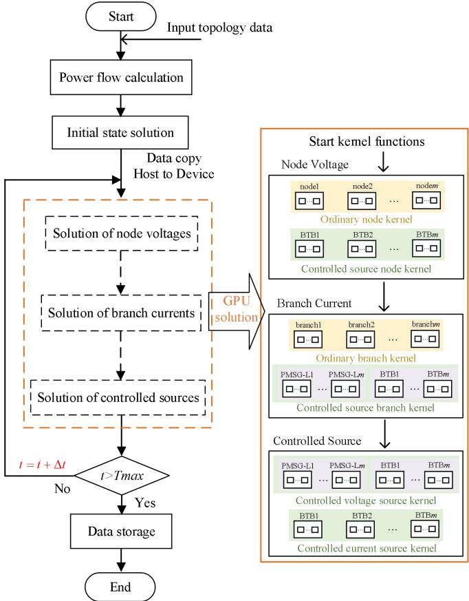

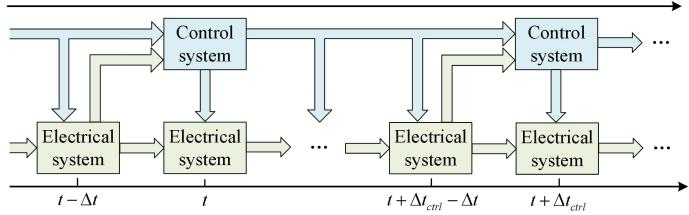  
Fig. 8. Solution process of renewable energy power systems.   
Fig. 9. Data interaction between the control system and the electrical system.

# B. Parallel design

# 1) Parallel solution of electrical equations

The solution of the electrical part involves the calculation of node voltages and branch currents, and the corresponding equations can be organized into a block diagonal form under the unified modeling framework of GLIM. Given that the voltage solution shares similarities with the current solution, Fig. 10 illustrates the parallel solution process of electrical equations based on branch currents. Fig. 10 first shows the current solution form consists of (4), (7), and (15), which includes coupled three-phase branches with 3-order coefficient

matrices, such as controlled source branches, and uncoupled three-phase branches with 3-order diagonal coefficient matrices, such as ordinary branches. The GPU-based parallel solution process is described as follows, which is also shown in Fig. 10:

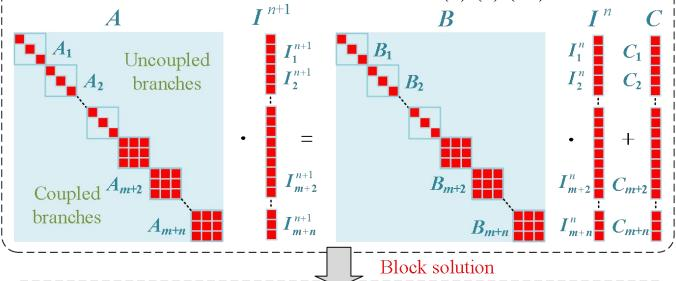  
Current solution form consists of(4) (7) (15)

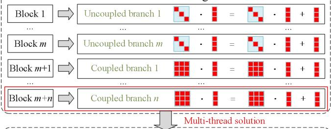  
Parallel solution between diagonal blocks

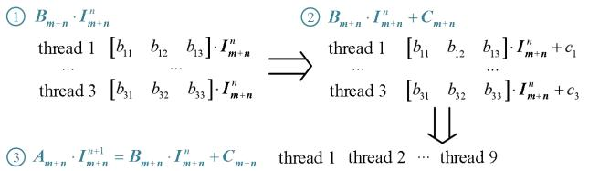  
Parallel solution of calculation processes for each diagonal block

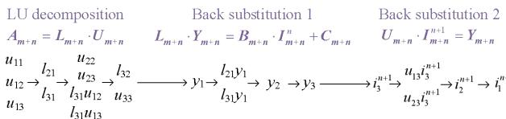  
Fig. 10. Parallel solution process.

a) Parallel solution between diagonal blocks. The calculation of each diagonal block is independent of each other, which can be divided into the parallel solution of a large number of 3-order matrices with the three-phase branch as the basic unit. The corresponding number of blocks can be developed in GPU to execute the solution of these 3-order matrices in parallel.   
b) Parallel solution of calculation processes for each diagonal block. The calculation process of the 3-order equation involves two parts: the first part is solving the vector on the right-hand side, which includes matrix-vector multiplication and vector addition; the second part is solving the linear equations. The parallel solution for each step is explained as follows, using the coupled three-phase branch as an example:   
① Matrix-vector multiplication. Each thread accesses one row of the matrix, multiplies it with the corresponding element of the vector, and adds up the result.   
② Vector addition. Each thread executes the addition for the corresponding elements of the vectors.   
③ Solve the linear equations based on the direct trigonometric decomposition. During LU decomposition, each thread handles the element elimination steps for its corresponding row and column. During back substitution, each

thread executes the calculation process related to the element that has been solved.

In the above solution processes, shared memory is applied to store the matrices, vectors, and intermediate variables, reducing the delay of global memory access. Additionally, the parallel solution of the uncoupled three-phase branch follows a similar process. The number of threads and the computational load of each thread are different from the coupled three-phase branch due to the simplicity of the equations.

# 2) Parallel solution of controlled sources

The solution of controlled sources has distinct independence characteristics between equipment. Each thread can execute the calculation of variables related to controlled sources for one piece of equipment. For instance, the solutions of control systems between different converters are independent, and the switch states that determine their controlled source values can be solved in parallel. The difference with the solution of the electrical part is that the solution of the control system usually contains a lot of logical judgments, which require optimization strategies to mitigate their impact on the solution efficiency.

a) Reduce warp divergence. Ensure that threads within the same warp follow the same execution path as much as possible. For example, some warps are assigned to solve the grid-side control system, while others handle the machine-side control system. Additionally, built-in mathematical functions and loop unrolling are used to reduce conditional judgments and branching operations.   
b) Use optimization techniques to hide the impact of warp divergence. Use shared memory to reduce the wait time for global memory access. Necessary computations can continue while waiting for branch execution by storing frequently accessed data in shared memory, thus hiding the overhead caused by divergent threads through efficient data access.

# IV. CASE STUDY

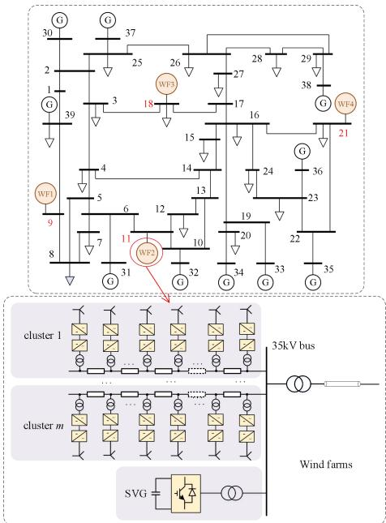  
A. Verification of algorithm accuracy   
Fig. 11. Renewable energy power systems with multiple wind farms access.

The renewable energy power system with multiple wind farms (WF) access shown in Fig. 11 is taken as an example to illustrate the simulation accuracy of the GLIM method. Four wind farms (48 WTGs, each wind farm including 12 WTGs) are connected to different buses on the grid-side system, and each wind farm has a static var generator (SVG). The model parameters for simulation are shown in Appendix C.

# 1) Performance of GLIM under a three-phase-to-ground fault

The step size is set to 2 μs, and the total simulation time is set to 3 s. At 2s, a three-phase grounding short-circuit fault occurred at bus 9, lasting for 40ms. The test program based on the GLIM framework is designed and compared with the detailed model (DM) built by PSCAD to verify its simulation accuracy. GLIM algorithm is implemented in the Visual Studio integrated development environment using C++ and Cuda programming. The simulation results are shown in Fig. 12, respectively.

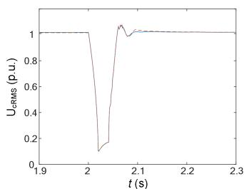

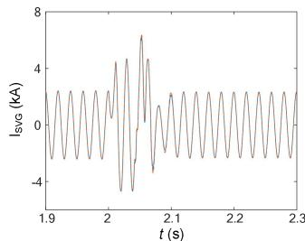  
(b)

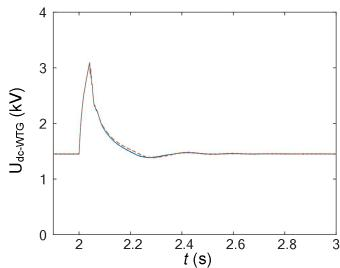

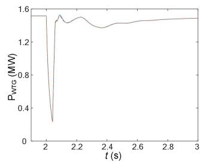

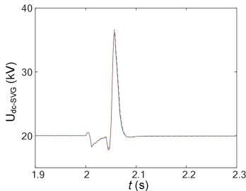  
  
DM GLIM   
Fig. 12. Simulation comparisons among DM and GLIM. (a) RMS voltage of 35kV bus of WF1. (b) Phase-a current of SVG in WF1. (c) DC voltage of WTG1 in WF1. (d) Output active power of WTG1 in WF1. (e) DC voltage of SVG in WF1.

The relative error values between GLIM and DM are shown in TABLE I. It can be found that the simulation errors of GLIM are within a reasonable range.

TABLE I RELATIVE ERRORS BETWEEN GLIM AND DM   

<table><tr><td>Variables</td><td>UcRMS</td><td>ISVG</td><td>Udc-WTG</td><td>PWTG</td><td>Udc-SVG</td></tr><tr><td>Relative error/%</td><td>1.43</td><td>4.82</td><td>2.78</td><td>1.61</td><td>3.73</td></tr></table>

# 2) Performance of GLIM in the case of LVRT

To further substantiate the effectiveness of GLIM, a chopper protection circuit is added to the DC side [36]. The brake resistance can consume excessive energy on the DC side and realize the low voltage ride through (LVRT) of the WTG. After introducing the chopper circuit, the GLIM model corresponding to the DC side only needs to add a parallel conductance controlled by the switching state, which also satisfies the node topology and is not detailed here. The simulation is still carried out in the fault scenario of 1), and the total simulation time is set to 4 s and the fault lasts for 0.2 s. The simulation results and the relative error values are shown in Fig. 13. It can be found that the simulation results of GLIM are basically consistent with those of DM.

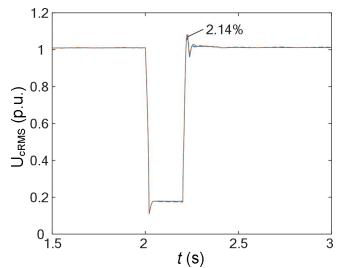  
(a)

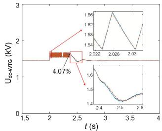

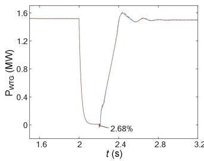  
(c)

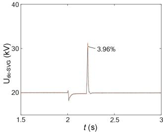  
  
DM GLIM   
Fig. 13. Simulation comparisons among DM and GLIM. (a) RMS voltage of 35kV bus of WF1. (b) DC voltage of WTG1 in WF1. (c) Output active power of WTG1 in WF1. (d) DC voltage of SVG in WF1.

# B. Verification of algorithm ef iciency

To better illustrate the efficiency of the algorithm in the simulation of large-scale wind farms, the grid-side system is represented by a voltage source, and the simulation efficiency of GLIM is verified by changing the number of WTGs in the wind farms. TABLE II shows the simulation time of GLIM based on CPU and GPU, and the simulation time of NAM based on GPU. Platform speedup ratio (PSR) represents the acceleration effect of GLIM solved by GPU compared with CPU, and method speedup ratio (MSR) represents the efficiency improvement of GLIM solved by GPU compared with NAM. NAM algorithm is also implemented in the Visual Studio integrated development environment using C++ and Cuda programming. The simulation time is 1 s, and the step size of the control system is $5 0 \mu \mathbf { s }$ . The step size of NAM is 2 μs, and the GPU is used to accelerate the solution of the node voltage equation and the control system; the step size of GLIM is 2 μs, and the GPU uses the method in Section III to accelerate the solution process. The parameters of the hardware platform are listed in Appendix D.

TABLE II TIME CONSUMPTION WITH DIFFERENT NUMBERS OF WTG   

<table><tr><td>WTG number</td><td>GLIM/s (GPU)</td><td>GLIM/s (CPU)</td><td>NAM/s (GPU)</td><td>PSR</td><td>MSR</td></tr><tr><td>5</td><td>82.418</td><td>220.452</td><td>173.227</td><td>2.675</td><td>2.102</td></tr><tr><td>50</td><td>90.524</td><td>6073.768</td><td>4387.634</td><td>67.096</td><td>48.469</td></tr><tr><td>100</td><td>101.025</td><td>12549.736</td><td>8124.538</td><td>124.224</td><td>80.421</td></tr><tr><td>150</td><td>111.793</td><td>19498.143</td><td>12362.125</td><td>174.413</td><td>110.581</td></tr><tr><td>200</td><td>122.286</td><td>26078.287</td><td>17356.744</td><td>213.257</td><td>141.936</td></tr></table>

It can be found that the simulation time of GLIM solved by CPU approximately shows a linear increase trend, and the acceleration effect of GLIM combined with GPU is more significant than that of NAM. When the scale of wind farms increases, the simulation time of GLIM has no significant change, and the reason for the slight change is that the cost of creating threads increases due to the growth in the number of threads required for simulation. With the further increase of the scale, the improvement of simulation efficiency will be more obvious. It should be noted that the simulation efficiency of NAM solved by GPU may be further improved through algorithm optimization or the growth of the step size, but there is still a definite gap compared with GLIM solved by GPU.

# V. CONCLUSION

This paper proposes a component-level modeling and fine-grained simulation method for renewable energy power systems suitable for GPU architecture, which leverages GLIM to build a highly parallel and unified modeling framework that transforms system simulation into the solution of massive nodes, branches, and controlled sources. It can fully combine the advantages of GPU computing resources to achieve efficient simulation. In the case study, the renewable energy power system with wind farm integration is used to verify the accuracy of GLIM by comparing it with the detailed model built by PSCAD, and the advantages of GLIM in simulation efficiency are verified by changing the scales of wind farms. It is important to note that GLIM solves with a microsecond-level simulation step size, so it is not appropriate to simulate the system that does not pay attention to the dynamic process at the switching level. It excels in the simulation of large-scale power systems that require detailed modeling of renewable energy power stations, such as wide-band oscillation analysis scenarios. How to analyze the numerical stability and increasing the simulation step size of GLIM is an important direction for future research.

# APPENDIX

Appendix A

Substitute the flux equation of PMSG into the voltage equation, and arrange (5)-(6) into matrix form:

$$
\boldsymbol {U} _ {i, d q} = \boldsymbol {A} _ {1} p \boldsymbol {I} _ {i j, d q} + \boldsymbol {A} _ {2} \boldsymbol {I} _ {i j, d q} + \boldsymbol {A} _ {3} \tag {A1}
$$

$$
\boldsymbol {U} _ {i} - \boldsymbol {U} _ {j} = \boldsymbol {L} _ {m 1} p \boldsymbol {I} _ {i j} \tag {A2}
$$

$\begin{array} { r } { \mathrm { w h e r e ~ } U _ { i , d q } = \left[ u _ { i , d } \quad u _ { i , q } \right] ^ { T } , I _ { i j , d q } = \left[ i _ { i j , d } \quad i _ { i j , q } \right] ^ { T } , } \end{array}$

$$
\boldsymbol {U} _ {i} = \left[ \begin{array}{c c c} u _ {i, a} & u _ {i, b} & u _ {i, c} \end{array} \right] ^ {T}, \boldsymbol {U} _ {j} = \left[ \begin{array}{c c c} u _ {j, a} & u _ {j, b} & u _ {j, c} \end{array} \right] ^ {T},
$$

$$
\boldsymbol {I} _ {i j} = \left[ \begin{array}{c c c} i _ {i j, a} & i _ {i j, b} & i _ {i j, c} \end{array} \right] ^ {T}, \boldsymbol {A} _ {3} = \left[ \begin{array}{c c} 0 & \omega \psi_ {f} \end{array} \right] ^ {T},
$$

$$
\boldsymbol {A} _ {1} = \left[ \begin{array}{c c} L _ {d} & 0 \\ 0 & L _ {q} \end{array} \right], \boldsymbol {A} _ {2} = \left[ \begin{array}{c c} 0 & R _ {s} - \omega L _ {q} \\ R _ {s} + \omega L _ {d} & 0 \end{array} \right],
$$

$$
\boldsymbol {L} _ {m 1} = \left[ \begin{array}{c c c} L _ {m 1, a} & & \\ & L _ {m 1, b} & \\ & & L _ {m 1, c} \end{array} \right].
$$

The equations after discretization can be obtained:

$$
\boldsymbol {U} _ {i, d q} ^ {n + 1 / 2} = \frac {\boldsymbol {A} _ {1}}{\Delta t} \left(\boldsymbol {I} _ {i j, d q} ^ {n + 1} - \boldsymbol {I} _ {i j, d q} ^ {n}\right) + \boldsymbol {A} _ {2} \boldsymbol {I} _ {i j, d q} ^ {n} + \boldsymbol {A} _ {3} \tag {A3}
$$

$$
\boldsymbol {U} _ {i} ^ {n + 1 / 2} - \boldsymbol {U} _ {j} ^ {n + 1 / 2} = \boldsymbol {L} _ {m 1} \frac {\boldsymbol {I} _ {i j} ^ {n + 1} - \boldsymbol {I} _ {i j} ^ {n}}{\Delta t} \tag {A4}
$$

Park transformation matrix P is introduced to (A3):

$$
\boldsymbol {P} _ {1} ^ {n + 1 / 2} \boldsymbol {U} _ {i} ^ {n + 1 / 2} = \frac {\boldsymbol {A} _ {1}}{\Delta t} \left(\boldsymbol {P} _ {1} ^ {n + 1} \boldsymbol {I} _ {i j} ^ {n + 1} - \boldsymbol {P} _ {1} ^ {n} \boldsymbol {I} _ {i j} ^ {n}\right) + \boldsymbol {A} _ {2} \boldsymbol {P} _ {1} ^ {n} \boldsymbol {I} _ {i j} ^ {n} + \boldsymbol {A} _ {3} \tag {A5}
$$

$$
\boldsymbol {P} _ {1} ^ {n + 1} = \boldsymbol {P} ^ {n + 1} (1: 2, \cdot) \tag {A6}
$$

$P ^ { n + 1 / 2 }$ can be obtained according to the estimated value of the rotor angle $\theta ^ { n + 1 / 2 }$ , and its expression is as follows:

$$
\theta^ {n + 1 / 2} = \theta^ {n} + \frac {\Delta t}{2} \omega^ {n + 1 / 2} \tag {A7}
$$

The expression of the coefficient matrices and the controlled voltage sources in (7) can be obtained by solving (A4) and (A5) simultaneously:

$$
\left\{ \begin{array}{l} A _ {P M S G - L} = \Delta t I _ {3 \times 3} - P _ {2} ^ {n + 1} \left(\frac {A _ {1}}{\Delta t}\right) ^ {- 1} P _ {1} ^ {n + 1 / 2} L _ {m 1} \\ B _ {P M S G - L} = I _ {3 \times 3} - P _ {2} ^ {n + 1} \left(\frac {A _ {1}}{\Delta t}\right) ^ {- 1} \left(\frac {A _ {1}}{\Delta t} - A _ {2}\right) P _ {1} ^ {n} \\ C _ {P M S G - L} = P _ {2} ^ {n + 1} \left(\frac {A _ {1}}{\Delta t}\right) ^ {- 1} P _ {1} ^ {n + 1 / 2} \\ U _ {P M S G - L, c t r l} ^ {n + 1 / 2} = - P _ {2} ^ {n + 1} \left(\frac {A _ {1}}{\Delta t}\right) ^ {- 1} A _ {3} \end{array} \right. \tag {A8}
$$

$$
\boldsymbol {P} _ {2} ^ {n + 1} = \left(\boldsymbol {P} ^ {n + 1}\right) ^ {- 1} (:, 1: 2) \tag {A9}
$$

Appendix B

The equations after discretization are as follows:

$$
\left\{ \begin{array}{l} \left(\frac {C _ {d c}}{\Delta t} + \frac {1}{R _ {1} + R _ {2}} + \frac {1}{R _ {3} + R _ {4}} + \frac {1}{R _ {5} + R _ {6}}\right) U _ {C} ^ {n + 1 / 2} = \frac {C _ {d c}}{\Delta t} U _ {C} ^ {n - 1 / 2} + I _ {m} ^ {n} \\ \quad + \frac {R _ {2}}{R _ {1} + R _ {2}} I _ {g, a} ^ {n} + \frac {R _ {4}}{R _ {3} + R _ {4}} I _ {g, b} ^ {n} + \frac {R _ {6}}{R _ {5} + R _ {6}} I _ {g, c} ^ {n} \\ \frac {L _ {g , a}}{\Delta t} I _ {g, a} ^ {n + 1} - \frac {L _ {g , b}}{\Delta t} I _ {g, b} ^ {n + 1} = U _ {g, a} ^ {n + 1 / 2} - U _ {g, b} ^ {n + 1 / 2} + \left(\frac {R _ {1}}{R _ {1} + R _ {2}} - \frac {R _ {3}}{R _ {3} + R _ {4}}\right) U _ {C} ^ {n + 1 / 2} \\ \quad + \left(\frac {L _ {g , a}}{\Delta t} - \frac {R _ {1} R _ {2}}{R _ {1} + R _ {2}}\right) I _ {g, a} ^ {n} - \left(\frac {L _ {g , b}}{\Delta t} - \frac {R _ {3} R _ {4}}{R _ {3} + R _ {4}}\right) I _ {g, b} ^ {n} \\ \frac {L _ {g , b}}{\Delta t} I _ {g, b} ^ {n + 1} - \frac {L _ {g , c}}{\Delta t} I _ {g, c} ^ {n + 1} = U _ {g, b} ^ {n + 1 / 2} - U _ {g, c} ^ {n + 1 / 2} + \left(\frac {R _ {3}}{R _ {3} + R _ {4}} - \frac {R _ {5}}{R _ {5} + R _ {6}}\right) U _ {C} ^ {n + 1 / 2} \\ \quad + \left(\frac {L _ {g , b}}{\Delta t} - \frac {R _ {3} R _ {4}}{R _ {3} + R _ {4}}\right) I _ {g, b} ^ {n} - \left(\frac {L _ {g , c}}{\Delta t} - \frac {R _ {5} R _ {6}}{R _ {5} + R _ {6}}\right) I _ {g, c} ^ {n} \\ I _ {g, a} ^ {n + 1} + I _ {g, b} ^ {n + 1} + I _ {g, c} ^ {n + 1} = 0 \end{array} \right. \tag {B1}
$$

Organize (B1) into the following matrix form:

$$
\begin{array}{l} \left(\frac {C _ {d c}}{\Delta t} + M _ {1} \left(S _ {n}\right)\right) U _ {C} ^ {n + 1 / 2} = \frac {C _ {d c}}{\Delta t} U _ {C} ^ {n - 1 / 2} + \left(I _ {m} ^ {n} + M _ {2} \left(S _ {n}\right) I _ {\mathbf {g}} ^ {n}\right) (\mathrm {B} 2) \\ \left(\frac {\boldsymbol {A} _ {\boldsymbol {g}}}{\Delta t}\right) \boldsymbol {I} _ {\boldsymbol {g}} ^ {n + 1} = \left(\frac {\boldsymbol {A} _ {\boldsymbol {g}}}{\Delta t} - \boldsymbol {M} _ {3} \left(S _ {n}\right)\right) \boldsymbol {I} _ {\boldsymbol {g}} ^ {n} + \left(\boldsymbol {T U} _ {\boldsymbol {g}} ^ {n + 1 / 2} - \boldsymbol {M} _ {4} \left(S _ {n}\right) U _ {C} ^ {n + 1 / 2}\right) (\mathrm {B} 3) \\ \end{array}
$$

where $M _ { 1 } { \left( S _ { n } \right) } = \frac { 1 } { R _ { 1 } + R _ { 2 } } + \frac { 1 } { R _ { 3 } + R _ { 4 } } + \frac { 1 } { R _ { 5 } + R _ { 6 } }$

$$
\begin{array}{l} \boldsymbol {M} _ {2} \left(S _ {n}\right) = \left[ \begin{array}{c c c} R _ {2} & R _ {4} & R _ {6} \\ \hline R _ {1} + R _ {2} & R _ {3} + R _ {4} & R _ {5} + R _ {6} \end{array} \right], \\ \boldsymbol {M} _ {3} \left(S _ {n}\right) = \left[ \begin{array}{c c c} \frac {R _ {1} R _ {2}}{R _ {1} + R _ {2}} & - \frac {R _ {3} R _ {4}}{R _ {3} + R _ {4}} & 0 \\ \frac {R _ {5} R _ {6}}{R _ {5} + R _ {6}} & \frac {R _ {3} R _ {4}}{R _ {3} + R _ {4}} + \frac {R _ {5} R _ {6}}{R _ {5} + R _ {6}} & 0 \\ 1 & 1 & 1 \end{array} \right], \\ \end{array}
$$

$$
\begin{array}{l} \boldsymbol {M} _ {4} \left(S _ {n}\right) = \left[ \begin{array}{l l l} \frac {R _ {3}}{R _ {3} + R _ {4}} - \frac {R _ {1}}{R _ {1} + R _ {2}} & \frac {R _ {5}}{R _ {5} + R _ {6}} & \frac {R _ {3}}{R _ {3} + R _ {4}} \\ \hline \end{array} \right] ^ {\mathrm {T}}, \\ \boldsymbol {A} _ {\boldsymbol {g}} = \left[ \begin{array}{c c c} L _ {g, a} & - L _ {g, b} & 0 \\ L _ {g, c} & L _ {g, b} + L _ {g, c} & 0 \\ \Delta t & \Delta t & \Delta t \end{array} \right], \boldsymbol {T} = \left[ \begin{array}{c c c} 1 & - 1 & 0 \\ 0 & 1 & - 1 \\ 0 & 0 & 0 \end{array} \right]. \\ \end{array}
$$

Appendix C

TABLE CI MODEL PARAMETERS   

<table><tr><td>Device</td><td>Parameter</td><td>Value</td></tr><tr><td rowspan="8">PMSG</td><td>Rated voltage</td><td>0.69kV</td></tr><tr><td>Rated capacity</td><td>1.5MVA</td></tr><tr><td>Stator resistance</td><td>0.01p.u.</td></tr><tr><td>Stator leakage reactance</td><td>0.1p.u.</td></tr><tr><td>Stator d-axis inductance</td><td>0.4p.u.</td></tr><tr><td>Stator q-axis inductance</td><td>0.5p.u.</td></tr><tr><td>Inertial time constant</td><td>7s</td></tr><tr><td>Switching frequency</td><td>5kHz</td></tr><tr><td rowspan="2">BTB converter</td><td>Rated DC bus voltage</td><td>1.5kV</td></tr><tr><td>DC bus capacitor</td><td>20mF</td></tr><tr><td rowspan="2">Filter</td><td>Inductance</td><td>2mH</td></tr><tr><td>Capacitance</td><td>200μF</td></tr><tr><td>Transformer</td><td>Leakage inductance</td><td>0.05p.u.</td></tr><tr><td rowspan="3">Short transmission lines</td><td>Resistance</td><td>3×10-4Ω·m-1</td></tr><tr><td>Inductive reactance</td><td>1.5×10-4Ω·m-1</td></tr><tr><td>Capacitive reactance</td><td>26MΩ·m</td></tr><tr><td rowspan="2">SVG</td><td>DC voltage</td><td>20kV</td></tr><tr><td>DC capacitor</td><td>20mF</td></tr></table>

Appendix D.

TABLE DI PARAMETERS OF THE HARDWARE PLATFORM   

<table><tr><td colspan="2">CPU</td><td colspan="2">GPU</td></tr><tr><td colspan="2">Inter(R) Core (TM) 
i7-12700H</td><td colspan="2">GeForce RTX 3060 Laptop GPU</td></tr><tr><td>Cores</td><td>14</td><td>CUDA cores</td><td>3840</td></tr><tr><td>Clock Speed</td><td>2.4GHz</td><td>VRAM</td><td>6GB</td></tr><tr><td>Highest turbo</td><td>4.7GHz</td><td>Memory clock</td><td>1750MHz</td></tr><tr><td>L2 cache</td><td>11.5M</td><td>Memory bandwidth</td><td>336GB/s</td></tr><tr><td>L3 cache</td><td>24M</td><td>Float-point performance</td><td>8.76 TFLOPs</td></tr></table>

# REFERENCES

[1] N. Ma, X. Xie, Y. Sun, Y. Zhang, Y. Li and P. Liu, "Wide-area monitoring and analysis of wide-band oscillation in new-type power systems," 2022 China International Conference on Electricity Distribution (CICED), Changsha, China, pp. 345-349, 2022.   
[2] S. Ebrahimi et al., "Average-value model for voltage-source converters with direct interfacing in EMTP-type solution," IEEE Trans. Energy Convers., vol. 38, no. 3, pp. 2231-2234, 2023.   
[3] U. C. Nwaneto and A. M. Knight, "Dynamic phasor-based modeling and simulation of a single-phase diode-bridge rectifier," IEEE Trans. Power Electron., vol. 38, no. 4, pp. 4921-4936, April 2023.   
[4] J. Xu, K. Wang and G. Li, "Review of real-time simulation of power electronic devices and power systems integrated with power electronic devices," Automation of Electric Power Systems, vol. 46, no. 10, pp. 3-17, 2022.   
[5] N. Shabanikia, A. A. Nia, A. Tabesh and S. A. Khajehoddin, "Weighted dynamic aggregation modeling of induction machine-based wind farms," IEEE Trans. Sustain. Energy, vol. 12, no. 3, pp. 1604-1614, July 2021.   
[6] A. P. Gupta, A. Mitra, A. Mohapatra and S. N. Singh, "A multi-machine equivalent model of a wind farm considering LVRT characteristic and wake effect," IEEE Trans. Sustain. Energy, vol. 13, no. 3, pp. 1396-1407, July 2022.   
[7] C. Guo, "Fidelity evaluation of aggregate equivalent model for wind farms oscillation research," Yinchuan, China. Apr. 20, 2023. [Online]. Available: https://mp. weixin. qq. com/s/DbFvf3-KOhbhRxotxXpvZg.   
[8] T. Iyer, "Circuit theory," Tata McGraw-Hill Education, 1985.   
[9] H. W. Dommel, "EMTP theory book," Portland: Bonneville Power Administration, 1986.   
[10] C. Dufour, J. Mahseredjian and J. Belanger, "A combined state-space nodal method for the simulation of power system transients," IEEE Trans. Power Deliv., vol. 26, no. 2, pp. 928-935, 2011.   
[11] C. W. Ho, A. E. Ruehli and P. A. Brennan, "The modified nodal approach to network analysis," IEEE Trans. Circuits & Syst., vol. 22, no. 6, pp. 504-509, 1975.   
[12] J. Mahseredjian, S. Dennetière, L. Dubé, et al., "On a new approach for the simulation of transients in power systems," Electric Power Systems Research, vol. 77, no. 11, pp. 1514-1520, 2007.   
[13] A. Abusalah, O. Saad, J. Mahseredjian, U. Karaagac and I. Kocar, "Accelerated sparse matrix-based computation of electromagnetic transients," IEEE OP. AC. J. Pow. Ene., vol. 7, pp. 13-21, 2020.   
[14] S. Yao, M. Han and S. Zhang, " Research on electromagnetic transient parallel simulation based on GPU," Advanced Technology of Electrical Engineering and Energy, vol. 38, nol. 1, pp: 10-16, Nov. 2018.   
[15] X. Chen, Y. Wang and H. Yang, "A fast parallel sparse solver for SPICE-based circuit simulators," 2015 Design, Automation & Test in Europe Conference & Exhibition (DATE), Grenoble, France, 2015, pp. 205-210.   
[16] W. K. Lee, R. Achar and M. S. Nakhla, "Dynamic GPU parallel sparse LU factorization for fast circuit simulation," IEEE Trans. VLSI Syst., vol. 26, no. 11, pp. 2518-2529, Nov. 2018.   
[17] S. Peng and S. Tan, "GLU3.0: Fast GPU-based parallel sparse LU factorization for circuit simulation," IEEE Design & Test, vol. 37, no. 3, pp. 78-90, June 2020.   
[18] R. Gnanavignesh and U. J. Shenoy, "GPU-accelerated sparse LU factorization for power system simulation," 2019 IEEE PES Innovative Smart Grid Technologies Europe (ISGT-Europe), Bucharest, Romania, 2019, pp. 1-5.   
[19] V. Dinavahi and N. Lin, "Parallel dynamic and transient simulation of large-scale power systems: A high performance computing solution," Springer International Publishing, Germany, 2022. [Online]. Available: https://www.scopus.com/inward/record.uri?eid=2-s2.0-85140857485&d oi=10.1007%2f978-3-030-86782-9&partnerID=40&md5=cf94a2b34fc0 5d9479b90cb5305e75b5.   
[20] G. Kron, "Diakoptics-piecewise solutions of large systems," Elect. J., London, UK, 1963, pp. 158–162.   
[21] J. R. Marti, L. R. Linares, J. Calvino, H. W. Dommel and J. Lin, "OVNI: an object approach to real-time power system simulators," POWERCON '98. 1998 International Conference on Power System Technology Proceedings (Cat. No.98EX151), Beijing, China, 1998, pp. 977-981 vol.2.

[22] J. Han, Y. Dong, S. Miao et al., "Multi-rate electromagnetic transient parallel simulation method of power system based on MATE," High Voltage Technology, vol. 45, no. 6, pp. 1857-1865, 2019.   
[23] C. Yue, X. Zhou and R. Li, "Node-splitting approach used for network partition and parallel processing in electromagnetic transient simulation," 2004 International Conference on Power System Technology, 2004. PowerCon 2004., Singapore, 2004, pp. 425-430.   
[24] Q. Mu, J. Liang, X. Zhou, G. Li and X. Zhang, "A node splitting interface algorithm for multi-rate parallel simulation of DC grids," CSEE J. Power Energy Syst., vol. 4, no. 3, pp. 388-397, September 2018.   
[25] B. Bruned, S. Dennetière, J. Michel, M. Schudel, J. Mahseredjian and N. Bracikowski, "Compensation method for parallel real-time EMT studies," Elect. Power Syst. Res., vol. 198, Sep. 2021, Art. no. 107341.   
[26] B. Bruned, J. Mahseredjian, S. Dennetière, J. Michel, M. Schudel and N. Bracikowski, "Compensation method for parallel and iterative real-time simulation of electromagnetic transients," IEEE Trans. Power Deliv., vol. 38, no. 4, pp. 2302-2310, Aug. 2023.   
[27] J. Xu, K. Wang, P. Wu and G. Li, "FPGA-based sub-microsecond-level real-time simulation for microgrids with a network-decoupled algorithm," IEEE Trans. Power Deliv., vol. 35, no. 2, pp. 987-998, April 2020.   
[28] Y. Song, S. Huang, Y. Chen et al., "Parallel algorithm for transient simulation of control system based on directed graph layer and its GPU implementation," Automation of Electric Power Systems, vol. 40, no. 12, pp. 137-143, 2016.   
[29] N. Lin, S. Cao and V. Dinavahi, "Adaptive heterogeneous transient analysis of wind farm integrated comprehensive AC/DC grids," IEEE Trans. Energy Convers., vol. 36, no. 3, pp. 2370-2379, Sept. 2021.   
[30] T. Sekine and H. Asai, "Block latency insertion method (Block-LIM) for fast transient simulation of tightly coupled transmission lines," 2009 IEEE International Symposium on Electromagnetic Compatibility, Austin, TX, USA, 2009, pp. 253-257.   
[31] W. Chen，J. Xu，K. Wang，et al., "Fine-grained parallel electromagnetic transient simulation of three-phase transmission network based on block latency insertion method," Proceedings of the CSEE, vol. 42, no. 7, pp. 2577-2588, 2022.   
[32] M. Milton and A. Benigni, "Latency insertion method based real-time simulation of power electronic systems," IEEE Trans. Power Electron., vol. 33, no. 8, pp. 7166-7177, Aug. 2018.   
[33] S. N. Lalgudi and M. Swaminathan, "Analytical stability condition of the latency insertion method for nonuniform GLC circuits," IEEE Trans. Circuits-II., vol. 55, no. 9, pp. 937-941, Sept. 2008.   
[34] A. Taflove, "Computational electrodynamics: The finite-difference time-domain method," Boston, MA, USA: Artech House, 1995.   
[35] J. Alvarez, L. D. Angulo, M. R. Cabello, A. R. Bretones and S. G. Garcia, "An analysis of the leap-frog discontinuous galerkin method for Maxwell's equations," IEEE Trans. Microw. Theory, vol. 62, no. 2, pp. 197-207, Feb. 2014.   
[36] Z. Feng, G. Sun, D. Teng, et al., "Reviews of LVRT technology for D-PMSG," Electric Power Engineering Technology, vol. 40, no. 2, pp. 75-85, 2021.

  
Qiguo Wang received the B.S. degree in electrical engineering from University of Electronic Science and Technology of China, Chengdu, China, in 2019. He is currently working toward the Ph.D. degree in the Department of Electrical Engineering, Shanghai Jiao Tong University, Shanghai, China. His research interests include electromagnetic transient simulation of power systems, high performance computing, and wide-band oscillation.

  
Jin Xu received the B.S. degree in electrical engineering from Sichuan University, Chengdu, China, in 2013, and the Ph.D. degree from Shanghai Jiao Tong University, Shanghai, China, in 2019. He is currently an assistant professor at Shanghai Jiao Tong University. His research interests include power system stability analysis, power electronic modeling, and real-time simulation.

  
Keyou Wang (S’05-M’09) received the B.S. and M.S. degrees in electrical engineering from Shanghai Jiao Tong University, Shanghai, China, in 2001 and 2004, respectively, and the Ph.D. degree from the Missouri S&T (formerly University of Missouri-Rolla) in 2008. He is currently a Professor and Vice Department Chair of Electrical Engineering at Shanghai Jiao Tong University. His research interests include power system dynamic and stability, renewable energy

  
integration, and converter dominated power systems.   
Guojie Li (M’09–SM’12) received the B.S. and M.S. degrees in electrical engineering from Tsinghua University, Beijing, China, in 1989 and 1993, respectively, and the Ph.D. degree in electrical engineering from Nanyang Technological University, Singapore, in 1999. He is currently a Professor with the Department of Electrical Engineering, Shanghai Jiao Tong University, Shanghai, China. His research   
interests include power system analysis and control, renewable energy and microgrid.

  
Jianqi Zhou received the B.S. degree. He is a senior engineer. His research interests include smart grid, electromagnetic transient simulation, distribution network planning, etc.

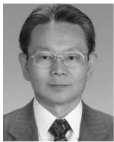  
Junichi Arai (SM’93) received the B.S. and M.S. degrees in electrical engineering from Waseda University, Tokyo, Japan, in 1970 and 1972, respectively, and the Doctoral degree from Tokyo Metropolitan University, Hachioji, Japan, in 1995. After he worked with Toshiba from 1972 to 2006, he was a Professor at the Electrical Engineering Department, Kogakuin University, Tokyo, where he is currently an Emeritus Professor. His research interests   
include control of power systems, microgrids, and application of power electronics systems.