# Study of a numerical integration method using the compact scheme for electromagnetic transient simulations

Yohei Tanaka a,* , Yoshihiro Baba b

a Grid and Communication Technology Division, Grid Innovation Research Laboratory, Central Research Institute of Electric Power Industry, Kanagawa 240-0196, Japan   
b Graduate School of Science and Engineering, Doshisha University, Kyotanabe, Kyoto 610-0394, Japan

# A R T I C L E I N F O

Keywords:

Circuit equation

Compact scheme

Electromagnetic Transient analysis

Integration method

SPARSE Tableau approach

Stability

# A B S T R A C T

This paper proposes a one-stage and oscillation free numerical integration method using the compact scheme for electromagnetic transient simulations. Since the compact scheme becomes L-stable at a moment when a circuit suddenly changes to a stiff system, the method is capable of suppressing the spurious numerical oscillations. Moreover, the compact scheme, which is a one-stage method, does not produce spurious spikes due to nonlinear elements. The compact scheme is compared with the trapezoidal method, the two-stage diagonally implicit Runge-Kutta (2S-DIRK) and the trapezoidal method with the second order backward difference formula (TR-BDF2). It follows from the comparison that the compact scheme does not produce the spurious numerical oscillations and spikes.

# 1. Introduction

Electromagnetic transients (EMT) simulations have been used for the studies of abnormal voltage/current, power quality, and so on. Recently, EMT simulations have become increasingly important in the dynamic analysis of power systems including many fast-speed-switching power electronics devices [1,2].

In the EMT simulation, a numerical integration method is required to obtain the time solution of a circuit system including inductors and capacitors. The trapezoidal method has been used for many EMT simulation programs such as electromagnetic transients analysis program (EMTP) [1–3] and PSCAD [4], since the method has a second order accuracy and is A-stable in spite of its simple calculation principle. However, the trapezoidal method produces spurious numerical oscillations due to sudden changes of inductor currents or capacitor voltages.

To solve this problem or to eliminate spurious oscillations, the critical damping adjustment (CDA) method has been introduced [5,6]. In the CDA, the backward Euler method is employed at a moment of sudden changes of inductor currents or capacitor voltages. Since the backward Euler method is L-stable, numerical oscillation is not sustained. PSCAD uses the interpolation method [4] to suppress the numerical oscillations. In the method, the linear interpolation is used for determining the time when the current or voltage is suddenly changed.

Conventional and latest methods for suppressing numerical oscillations are reviewed and discussed in [2]. However, since the detection of a sudden change of currents or voltages not always feasible, it is not guaranteed that the numerical oscillation is suppressed with CDA or the interpolation method [7,8].

To cope with the problem of these techniques, the application of the two-stage diagonally implicit Runge-Kutta (2S-DIRK) or the trapezoidal method with the second order backward difference formula (TR-BDF2) to EMT simulations have been proposed [7,9]. The 2S-DIRK and TR-BDF2 have a second-order accuracy and are L-stable. Unlike the trapezoidal method, it is mathematically guaranteed that the 2S-DIRK and TR-BDF2 never produce spurious numerical oscillations. Thus, no detection of the events which can lead to numerical oscillations is required. However, since the 2S-DIRK and TR-BDF2 are two-stage methods, which calculate a solution at the present time step from the values obtained in the previous and intermediate steps, spurious spikes can be generated because of nonlinear elements contained in a circuit system [7]. Thus, a one-stage integration method, which can suppress the numerical oscillations, is desired.

This paper proposes a one-stage and oscillation free numerical integration method using the compact scheme [10] for EMT simulations. At first, the fundamental of the compact scheme is described, and the formulas of the compact scheme of inductors and capacitors for both

linear and nonlinear cases are derived. Then, it is shown that the compact scheme can suppress numerical oscillations due to switching events, sudden changes of voltage and current source values and changes of the operating points of nonlinear components. Finally, some simulation cases computed using the compact scheme are compared with those computed using CDA, the trapezoidal method, 2S-DIRK and TR-BDF2.

# 2. Compact scheme

# 2.1. Integration of a differential equation by compact scheme

The compact scheme proposed by Lele [10] is a finite difference method. The scheme is characterized by handling not only discretized function values but also their derivatives. The compact scheme has been frequently used in numerical calculations for solving Navier-Stokes equations [11,12].

Consider the differential equation

$$
\frac {d y}{d t} = f (t, y) \tag {1}
$$

where f is a function of time t and variable y. Application of the compact scheme to dy/dt of (1) yields the following expression:

$$
\begin{array}{l} y _ {n} = y _ {n - 1} + h \alpha y _ {n} ^ {\prime} + h (1 - \alpha) y _ {n - 1} ^ {\prime} \\ + h ^ {2} \left(\frac {1}{6} - \frac {\alpha}{2}\right) y _ {n} ^ {*} + h ^ {2} \left(\frac {1}{3} - \frac {\alpha}{2}\right) y _ {n - 1} ^ {*} \tag {2} \\ \end{array}
$$

where $y _ { n }$ and $y _ { n - 1 }$ are the values at time steps $t = t _ { n }$ and $t = t _ { n - 1 }$ 1, respectively. $. \boldsymbol { y }$ and $y ^ { ' }$ represent the first and second derivative values of y with respect to time t, respectively. h is the time step size, and α is a constant which gives the fourth-order accuracy ${ \mathrm { i f } } \alpha = 0 . 5 ,$ and the thirdorder accuracy if $\alpha > 0 . 5 .$ . Substituting (1) into (2), we obtain

$$
\begin{array}{l} y _ {n} = y _ {n - 1} + h \alpha f (t _ {n}, y _ {n}) + h (1 - \alpha) f (t _ {n - 1}, y _ {n - 1}) \\ + h ^ {2} \left(\frac {1}{6} - \frac {\alpha}{2}\right) f ^ {\prime} \left(t _ {n}, y _ {n}\right) + h ^ {2} \left(\frac {1}{3} - \frac {\alpha}{2}\right) f ^ {\prime} \left(t _ {n - 1}, y _ {n - 1}\right) \tag {3} \\ \end{array}
$$

where $f$ represents the first derivative value of f with respect to time t. When $\alpha = 0 . 5 ,$ , (3) is written as

$$
\begin{array}{l} y _ {n} = y _ {n - 1} + \frac {h}{2} [ f (t _ {n}, y _ {n}) + f (t _ {n - 1}, y _ {n - 1}) ] \tag {4} \\ - \frac {h ^ {2}}{1 2} \left[ f ^ {\prime} \left(t _ {n}, y _ {n}\right) - f ^ {\prime} \left(t _ {n - 1}, y _ {n - 1}\right) \right]. \\ \end{array}
$$

Eq. (3) and (4) are classified as a one-stage method like the trapezoidal method. In this paper, we formulate passive elements such as linear inductors and capacitors on the basis of the fourth-order formulation expressed by (4).

# 2.2. Linear inductors

The relation between the current i and the voltage v of a linear inductor is given by

$$
\frac {d i}{d t} = \frac {1}{L} v. \tag {5}
$$

Using the compact scheme from the previous time step $t = t _ { n - 1 }$ to the present time step $t = t _ { n } ,$ the approximation formula of (5) is given by

$$
i _ {n} = i _ {n - 1} + \frac {h}{2 L} \left(v _ {n} + v _ {n - 1}\right) - \frac {h ^ {2}}{1 2 L} \left(v _ {n} ^ {\prime} - v _ {n - 1} ^ {\prime}\right) \tag {6}
$$

where $\nu ^ { ' }$ represents the first derivative value of v with respect to time t. Eq. (6) yields the equivalent circuit shown in Fig. 1. In Fig. 1, $G _ { L T }$ is the coefficient which relates the derivative value of the voltage to the

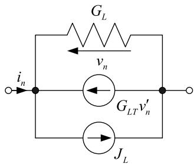  
Fig. 1. Equivalent circuit of a linear or a nonlinear inductor based on the approximation of the compact scheme.

current. $G _ { L } , G _ { L T }$ and $J _ { L }$ are given by

$$
G _ {L} = \frac {h}{2 L}
$$

$$
G _ {L T} = \frac {h ^ {2}}{1 2 L} \tag {7}
$$

$$
J _ {L} = G _ {L} v _ {n - 1} + G _ {L T} v _ {n - 1} ^ {\prime} + i _ {n - 1}.
$$

# 2.3. Linear capacitors

The relation between the current i and the voltage v of a linear capacitor is given by

$$
\frac {d v}{d t} = \frac {i}{C}. \tag {8}
$$

Using the compact scheme from the previous time step $t = t _ { n - 1 }$ to the present time step $t = t _ { n } ,$ the approximation formula of (8) is given by

$$
v _ {n} = v _ {n - 1} + \frac {h}{2 C} \left(i _ {n} + i _ {n - 1}\right) - \frac {h ^ {2}}{1 2 C} \left(i _ {n} ^ {\prime} - i _ {n - 1} ^ {\prime}\right) \tag {9}
$$

where i′ represents the first derivative value of i with respect to time t. Eq. (9) yields the equivalent circuit shown in Fig. 2. In Fig. 2, $R _ { C T }$ is the coefficient which relates the current to its derivative value. $G _ { C } , R _ { C T }$ and $J _ { C }$ are given by

$$
G _ {C} = \frac {2 C}{h}
$$

$$
R _ {C T} = \frac {h}{6} \tag {10}
$$

$$
J _ {C} = - G _ {C} v _ {n - 1} - R _ {C T} i _ {n - 1} ^ {\prime} - i _ {n - 1}.
$$

# 2.4. Nonlinear inductors

The characteristics of a nonlinear inductor are expressed by

$$
\frac {d \phi}{d t} = v, \quad \phi = \phi (i) \tag {11}
$$

where v and i are the voltage and the current of the nonlinear inductor,

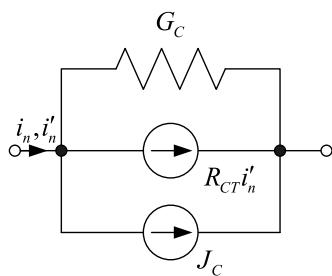  
Fig. 2. Equivalent circuit of a linear or a nonlinear capacitor based on the approximation of the compact scheme.

respectively. ϕ is the magnetic flux, which is nonlinearly dependent on current. If the nonlinear current-flux curve is linearized as shown in Fig. $^ { 3 , }$ we obtain

$$
\phi = l i + \phi_ {0} \tag {12}
$$

where l and $\phi _ { 0 }$ are the slope and the intercept at an operating point, respectively. Using the compact scheme from the previous time step $t =$ $t _ { n - 1 }$ to the present time step $t = t _ { n } ,$ the approximation formula of (11) is given by

$$
i _ {n} = \frac {\phi_ {n - 1} - \phi_ {0 , n}}{l _ {n}} + \frac {h}{2 l _ {n}} \left(v _ {n} + v _ {n - 1}\right) - \frac {h ^ {2}}{1 2 l _ {n}} \left(v _ {n} ^ {\prime} - v _ {n - 1} ^ {\prime}\right) \tag {13}
$$

where

$$
\phi_ {n - 1} = l _ {n - 1} i _ {n - 1} + \phi_ {0, n - 1.} \tag {14}
$$

Eq. (13) is also expressed by the equivalent circuit shown in Fig. 1. $G _ { L } ,$ GLT and $J _ { L }$ are given by

$$
G _ {L} = \frac {h}{2 l _ {n}}
$$

$$
G _ {L T} = \frac {h ^ {2}}{1 2 l _ {n}} \tag {15}
$$

$$
J _ {L} = G _ {L} v _ {n - 1} + G _ {L T} v _ {n - 1} ^ {\prime} + \frac {\phi_ {n - 1} - \phi_ {0 , n}}{l _ {n}}.
$$

# 2.5. Non-linear capacitors

The characteristics of a nonlinear capacitor are expressed by

$$
\frac {d q}{d t} = i, \quad q = q (v) \tag {16}
$$

where v and i are the voltage and the current of the nonlinear capacitor, respectively. q is the charge stored in the nonlinear capacitor. If the voltage-charge curve is linearized as shown in Fig. 4, we obtain

$$
q = c v + q _ {0} \tag {17}
$$

where c and $q _ { 0 }$ are the slope and the intercept at an operating point, respectively. Using the compact scheme from the previous time step $t =$ $t _ { n - 1 }$ to the present time step $t = t _ { n } ,$ the approximation formula of (16) is given by

$$
v _ {n} = \frac {q _ {n - 1} - q _ {0 , n}}{c _ {n}} + \frac {h}{2 c _ {n}} \left(i _ {n} + i _ {n - 1}\right) - \frac {h ^ {2}}{1 2 c _ {n}} \left(i _ {n} ^ {\prime} - i _ {n - 1} ^ {\prime}\right) \tag {18}
$$

where

$$
q _ {n - 1} = c _ {n - 1} v _ {n - 1} + q _ {0, n - 1}. \tag {19}
$$

$\operatorname { E q . }$ (18) is also expressed by the equivalent circuit shown in Fig. 2. $G _ { C } ,$ $R _ { { C T } }$ and JC are given by

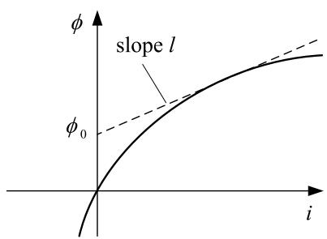  
Fig. 3. Linearization of nonlinear inductance.

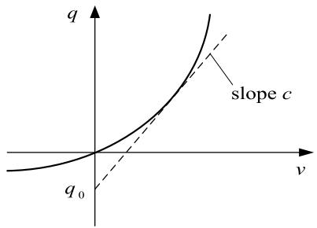  
Fig. 4. Linearization of nonlinear capacitance.

$$
G _ {C} = \frac {2 c _ {n}}{h}
$$

$$
R _ {C T} = \frac {h}{6} \tag {20}
$$

$$
J _ {C} = - R _ {C T} i _ {n - 1} ^ {\prime} - \frac {2 (q _ {n - 1} - q _ {0 , n})}{h} - i _ {n - 1}.
$$

# 2.6. Non-linear resistors

The characteristic of a nonlinear resistor is given by

$$
i = f (v) \tag {21}
$$

where v and i are the voltage and the current of the nonlinear resistor, respectively. f is a nonlinear function of voltage. If the voltage-current curve is linearized as shown in Fig. 5, we obtain

$$
f (v) = g v + i _ {0} \tag {22}
$$

where g and $i _ { 0 }$ are the slope and the intercept at an operating point, respectively. Substituting (22) into (21), we obtain

$$
i = g v + i _ {0}. \tag {23}
$$

Since the values of $g$ and $i _ { 0 }$ are changed depending on the operating point, g and $i _ { 0 }$ can be expressed by functions of time. Thus, the time derivative of (23) is given by

$$
\dot {i} = g \nu^ {\prime} + g ^ {\prime} \nu + i _ {0} ^ {\prime}. \tag {24}
$$

The finite difference expression of (24) can be given by

$$
i _ {n} ^ {\prime} = g _ {n} v _ {n} ^ {\prime} + \frac {g _ {n} - g _ {n - 1}}{h} v _ {n - 1} + \frac {i _ {0 , n} - i _ {0 , n - 1}}{h}. \tag {25}
$$

# 3. Formulation of the circuit equations

In this section, we consider a circuit which has $N _ { n }$ nodes and $N _ { b }$ branches. In this paper, the circuit equations based on the compact scheme are formulated by Sparse Tableau Approach [13]. The formulation is expressed by

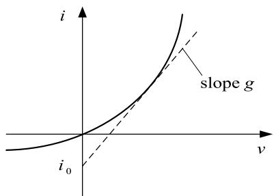  
Fig. 5. Linearization of nonlinear resistance.

$$
\left[ \begin{array}{c c c c c c} 0 & A ^ {T} & 0 & 0 & 0 & 0 \\ A & 0 & - I & 0 & 0 & 0 \\ 0 & B _ {1} & - B _ {2} & 0 & - B _ {3} & B _ {4} \\ 0 & 0 & 0 & 0 & A ^ {T} & 0 \\ 0 & 0 & 0 & A & 0 & - I \\ 0 & B _ {5} & - B _ {6} & 0 & B _ {7} & - B _ {8} \end{array} \right] \left[ \begin{array}{l} u \\ i \\ v \\ u ^ {\prime} \\ i ^ {\prime} \\ v ^ {\prime} \end{array} \right] = \left[ \begin{array}{l} 0 \\ 0 \\ s \\ 0 \\ 0 \\ s ^ {\prime} \end{array} \right] \tag {26}
$$

where u is the vector of node voltages of size $N _ { n } .$ . i and v are the vectors of branch currents and voltages of size $N _ { b } ,$ respectively. $u ,$ i′ and $\nu ^ { ' }$ are the time derivatives of u, i and v, respectively. s is the vector of size $N _ { b }$ whose elements are expressed by values of current and voltage sources. s′ is the vector of size $N _ { b }$ whose elements are expressed by the time derivative values of voltage and current sources except for those shown in Figs. 1 and $2 , A$ is the branch versus node incidence matrix of size $N _ { b }$ by $N _ { n } ,$ , which is derived from Kirchhoff’s voltage and current laws. The relationship is given by

$$
A u - I v = 0 \tag {27}
$$

where I is the unit matrix of size $N _ { b }$ by $N _ { b } .$ Differentiating (27) yields the following relationship between u′ and v′ :

$$
A u ^ {\prime} - I v ^ {\prime} = 0. \tag {28}
$$

$B _ { 1 } , B _ { 2 } , B _ { 3 } , B _ { 4 } , B _ { 5 } , B _ { 6 } , B _ { 7 }$ and $B _ { 8 }$ in (26) are matrices of size $N _ { b }$ by $N _ { b } ,$ which are determined by the relationship between the branch voltage and current. They are given as follows:

If the kth $( k { = } 1 , 2 , . . . , N _ { b } )$ branch is a linear inductor, we obtain the followings from (5) and (7).

$$
B _ {1 k k} = 1, \quad B _ {2 k k} = G _ {L}, \quad B _ {4 k k} = G _ {L T}, \quad s _ {k} = J _ {L} \tag {29}
$$

$$
B _ {6 k k} = \frac {1}{L}, B _ {7 k k} = 1. \tag {30}
$$

If the kth branch is a linear capacitor, we obtain the followings from (8) and (10).

$$
B _ {1 k k} = 1, \quad B _ {2 k k} = G _ {C}, \quad B _ {3 k k} = R _ {C T}, \quad s _ {k} = J _ {C} \tag {31}
$$

$$
B _ {5 k k} = 1, \quad B _ {8 k k} = C. \tag {32}
$$

If the kth branch is a linear resistor, we obtain the followings from the relations $i _ { k } - G { \nu } _ { k } = 0 , i _ { k } - G { \nu } _ { k } ^ { \top } = 0$ .

$$
B _ {1 k k} = 1, \quad B _ {2 k k} = G, \quad B _ {7 k k} = 1, \quad B _ {8 k k} = G \tag {33}
$$

where G is conductance of the resistor.

If the kth branch is a voltage source $E ,$ we obtain the following relations:

$$
B _ {2 k k} = 1, \quad s _ {k} = - E, \quad B _ {8 k k} = 1, \quad s _ {k} ^ {\prime} = - E ^ {\prime} \tag {34}
$$

where $E ^ { ' }$ is the time derivative value of E.

If the kth branch is a current source $J ,$ we obtain the following relations:

$$
B _ {1 k k} = 1, \quad s _ {k} = J, \quad B _ {7 k k} = 1, \quad s _ {k} ^ {\prime} = J ^ {\prime} \tag {35}
$$

where $\scriptstyle { j }$ is the time derivative value of J.

A similar expression can be used when the branch is a nonlinear element.

# 4. Stability and stiff decay

The stability of a numerical integration method can be examined using the eigenvalue λ of the test equation [14] as follows:

$$
\frac {d x}{d t} = \lambda x, \operatorname {R e} (\lambda) <   0. \tag {36}
$$

If the solution of (36) obtained using an integration method satisfies the following condition:

$$
\left| \frac {x _ {n}}{x _ {n - 1}} \right| \leq 1 \tag {37}
$$

for the entire left half plane $z { = } h ,$ , the method is said to be A-stable. If an A-stable method satisfies $\vert x _ { n } / x _ { n - 1 } \vert  0$ with $R e ( \lambda )  - \infty ,$ the method is said to be L-stable. The trapezoidal method is A-stable, and methods 2S-DIRK and TR-BDF2 are L-stable. Since the trapezoidal method satisfies $x _ { n } / x _ { n - 1 } \to - 1$ with Re $\begin{array} { r } { ( \lambda )  - \infty , } \end{array}$ , it produces the sustained numerical oscillation if one of the circuits to be solved is a stiff system whose time constant approaches zero. On the other hand, 2S-DIRK and TR-BDF2, which are L-stable, produce no numerical oscillations even if one of the time constants is zero.

Applying the compact scheme to (36), we obtain

$$
x _ {n} = x _ {n - 1} + \frac {h \lambda}{2} \left(x _ {n} + x _ {n - 1}\right) - \frac {h ^ {2} \lambda}{1 2} \left(x _ {n} ^ {\prime} - x _ {n - 1} ^ {\prime}\right). \tag {38}
$$

Substituting the relation $x ^ { ' } =$ λx into (38) yields the solutions of (36) as follows:

$$
\left| \frac {x _ {n}}{x _ {n - 1}} \right| = \left| \frac {1 + \frac {h \lambda}{2} + \frac {(h \lambda) ^ {2}}{1 2}}{1 - \frac {h \lambda}{2} + \frac {(h \lambda) ^ {2}}{1 2}} \right| \leq 1 \tag {39}
$$

$$
\left| \frac {x _ {n} ^ {\prime}}{x _ {n - 1} ^ {\prime}} \right| = \left| \frac {1 + \frac {h \lambda}{2} + \frac {(h \lambda) ^ {2}}{1 2}}{1 - \frac {h \lambda}{2} + \frac {(h \lambda) ^ {2}}{1 2}} \right| \leq 1. \tag {40}
$$

It appears from (39) and (40) that the compact scheme is A-stable. When $R e ( \lambda )  - \infty ,$ ,

$$
\frac {x _ {n}}{x _ {n - 1}} \rightarrow 1, \quad \frac {x _ {n}}{x _ {n - 1} ^ {\prime}} \rightarrow 1. \tag {41}
$$

Therefore, the compact scheme is not L-stable, and the numerical error is sustained if one of the time constants approaches zero. However, the compact scheme becomes L-stable at a moment when a circuit suddenly changes to a stiff system. If λ changes from $\lambda _ { 1 } \mathrm { t } 0 \lambda _ { 2 } ( | \lambda _ { 1 } | < < | \lambda _ { 2 } | )$ at the time step $t = t _ { n }$ shown in Fig. 6, the time derivative of λx at the time step $t = t _ { n }$ can be expressed by

$$
\left. (\lambda x) ^ {\prime} \right| _ {t = t _ {n}} = \lambda_ {2} x _ {n} ^ {\prime} + \lambda_ {2} ^ {\prime} x _ {n - 1} \tag {42}
$$

where

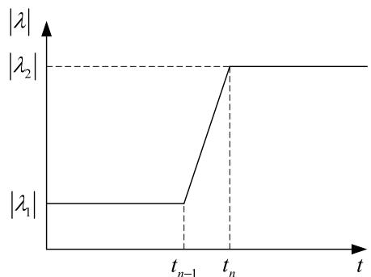  
Fig. 6. Time variation of λ.

$$
\lambda_ {2} ^ {\prime} = \frac {\lambda_ {2} - \lambda_ {1}}{h}. \tag {43}
$$

Using (42) and (43), the solutions of (36) are given by

$$
\frac {x _ {n}}{x _ {n - 1}} = \frac {1 + \frac {h \lambda_ {1}}{2} + \frac {(h \lambda_ {1}) ^ {2}}{1 2} - \frac {h ^ {2} \lambda_ {2} ^ {\prime}}{1 2}}{1 - \frac {h \lambda_ {2}}{2} + \frac {(h \lambda_ {3}) ^ {2}}{1 2}} \tag {44}
$$

$$
\frac {x _ {n + 1} ^ {\prime}}{x _ {n} ^ {\prime}} = \frac {1 + \frac {h _ {1} \lambda_ {2}}{2} + \frac {h ^ {2} \lambda_ {2}}{1 2} \left(A \lambda_ {2} ^ {\prime} + \lambda_ {2}\right)}{1 - \frac {h \lambda_ {2}}{2} + \frac {(h \lambda_ {2}) ^ {2}}{1 2}} \tag {45}
$$

where

$$
A = \frac {1 - \frac {h \lambda_ {2}}{2} + \frac {\left(h \lambda_ {2}\right) ^ {2}}{1 2}}{\lambda_ {2} \left(1 + \frac {h _ {1} \lambda_ {1}}{2} + \frac {h ^ {2} \lambda_ {1} ^ {2}}{1 2} - \frac {h ^ {2} \lambda_ {2} ^ {\prime}}{1 2}\right)}. \tag {46}
$$

When Re $( \lambda _ { 2 } )  - \infty ,$ ,

$$
\frac {x _ {n}}{x _ {n - 1}} \rightarrow 0, \quad \frac {x _ {n + 1} ^ {\prime}}{x _ {n} ^ {\prime}} \rightarrow 0. \tag {47}
$$

x and $x ^ { ' }$ approach zero at the time step $t = t _ { n }$ and $t = t _ { n + 1 }$ , respectively. Thus, the compact scheme becomes L-stable at a moment when a circuit suddenly changes to a stiff system owing to switching events, sudden changes of voltage and current source values and changes of the operating points of nonlinear components.

# 5. Verification

# 5.1. Series R-L circuit

Fig. 7 shows a series R-L circuit connected with a step voltage source and a switch. The switch is opened at t= 2 ms. The on-resistance and offresistance are set to 1 mΩ and 1 MΩ, respectively. The time step size is set to 0.1 ms. Since the time constant becomes smaller than the time step size after the switch is opened, stiff decay properties of the compact scheme can be verified. Fig. 8 shows waveforms of voltage $V _ { R L }$ computed using the compact scheme, CDA and the trapezoidal method. The CDA solutions are obtained using EMTP [15]. The trapezoidal method produces the sustained numerical oscillation due to the sudden change of the inductor current. On the other hand, the spike voltages computed using the compact scheme and CDA decay to zero, since these methods become L-stable at the moment when the switch is opened.

# 5.2. Half-wave rectifier circuit

Fig. 9 shows a half-wave rectifier circuit. The diode D is represented with a nonlinear resistor with on-resistance of 1 mΩ and off-resistance of 1 MΩ. Note that the off-resistance is selected in order not to cause any ill conditions. In this paper, the Newton-Raphson iteration algorithm is used for convergence at each time step in the simulations for the test cases including non-linear elements. The time step size is set to 0.1 ms.

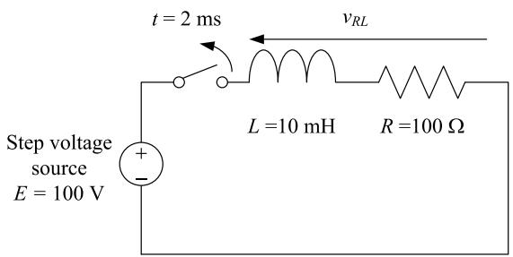  
Fig. 7. Series R-L circuit connected with a step voltage source and a switch.

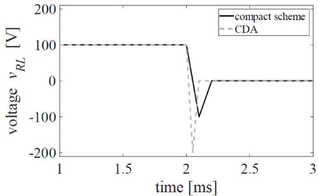  
(a) Compact scheme and CDA.

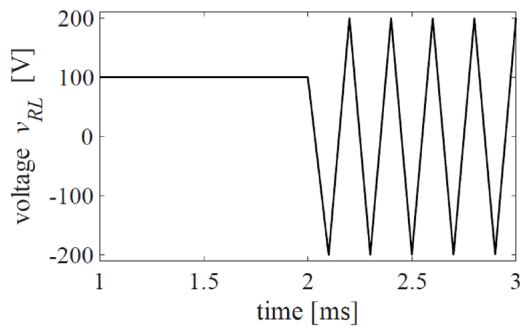  
(b) Trapezoidal method.

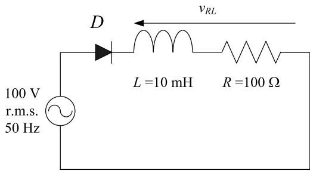  
Fig. 8. Voltage waveforms computed using the compact scheme, CDA and the trapezoidal method for the series R-L circuit.   
Fig. 9. Half-wave rectifier circuit.

Fig. 10 shows waveforms of voltage V computed using the compact scheme, CDA and the trapezoidal method. The trapezoidal method produces the sustained numerical oscillation when the inverse voltage is applied to the diode. On the other hand, the compact scheme and CDA produce no spurious sustained oscillations.

# 5.3. Circuit with a nonlinear inductor [7]

Fig. 11 shows an equivalent circuit for calculating inrush currents. The linear resistor R and inductor L represent a transmission line, and the nonlinear inductor represents a transformer. Fig. 12 shows the piecewise linear approximated nonlinear current-flux characteristic $\mathrm { L } _ { \mathrm { N } L } .$ The time step size is set to 0.05 ms. Figs. 13 and 14 show waveforms of current and voltage computed using the compact scheme, CDA, 2S-DIRK and TR-BDF2, respectively. Waveforms of current computed using these four methods are almost identical. Since 2S-DIRK and TR-BDF2 are twostage methods, however, spurious spike voltages are superposed in the voltage waveforms computed using these methods. In the CDA simulation, the numerical oscillation is suppressed, but the spurious spikes are superposed. Note that the spurious spikes are not observed in the waveforms computed using the backward Euler method with a time step

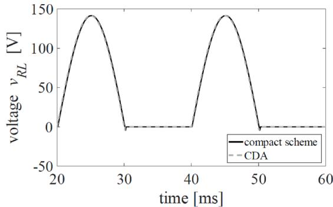  
(a) Compact scheme and CDA.

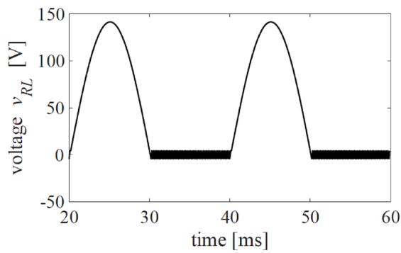  
(b) Trapezoidal method.   
Fig. 10. Voltage waveforms computed using the compact scheme, CDA and the trapezoidal method for the half-wave rectifier circuit.

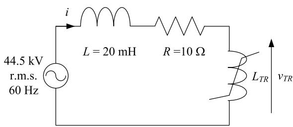  
Fig. 11. Equivalent circuit for calculating inrush currents in a 77 kV system.

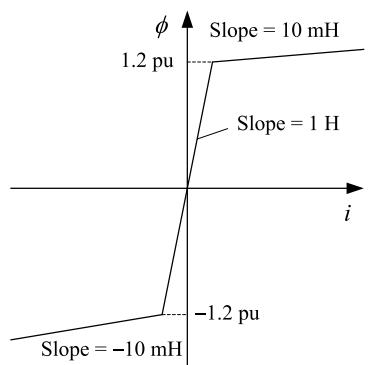  
Fig. 12. Piecewise linear approximated nonlinear current-flux characteristic.

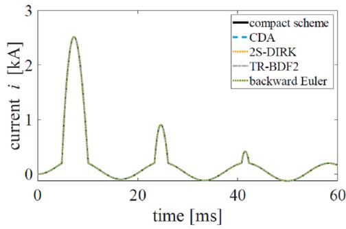  
Fig. 13. Current waveforms computed using the compact scheme, CDA, 2S-DIRK, TR-BDF2 and backward Euler method for the equivalent circuit for analyzing inrush currents.

size of 1 ns as shown in Figs. 13 and 14(a). The backward Euler solutions are obtained using EMTP. On the other hand, the compact scheme yields no such spike voltage.

# 5.4. Series R-L-C circuit

Fig. 15 shows a series R-L-C circuit connected with a step voltage source. The time step size is set to 0.2 ms, which is not sufficiently small compared to the resonance period of the circuit. The exact solution of the current i flowing in the circuit shown in Fig. 15 is given by

$$
i (t) = E \frac {C \left(\alpha^ {2} + \omega^ {2}\right)}{\omega} e ^ {- \alpha t} \sin \omega t \tag {48}
$$

where

$$
\alpha = \frac {R}{2 L}, \omega = \sqrt {\frac {1}{L C} - \alpha^ {2}}. \tag {49}
$$

Fig. 16 shows waveforms of current computed using the compact scheme, CDA, the trapezoidal method, 2S-DIRK and TR-BDF2. The waveforms computed using CDA, the trapezoidal method, 2S-DIRK and TR-BDF2 differ from the waveform obtained using the exact solution. On the other hand, the waveform computed using the compact scheme agrees well with the waveform obtained using the exact solution.

Since the number of non-zero elements of the matrix of a circuit equation of the compact scheme is approximately twice the number of those of the trapezoidal method, 2S-DIRK and TR-BDF2, the compact scheme is twice as computationally expensive as those methods. Since 2S-DIRK and TR-BDF2 are two-stage methods, however, the circuit equations must be solved twice to obtain the solution at the present time step. As a result, the computation time of the compact scheme is almost the same as or similar to that of 2S-DIRK or TR-BDF2.

# 5.5. DC-DC converter

Fig. 17 shows a pulse width modulation (PWM)-controlled DC-DC converter circuit. The simulation circuit includes insulated gate bipolar transistor (IGBT)s. The diode is represented with a nonlinear resistor. The on-resistance and off-resistance of the diode are set to 1 mΩ and 1 MΩ. Note that the off-resistance is selected in order not to cause any ill conditions. The switching frequency is set to 10 kHz. The time step size Δt is set to 20 μs for the compact scheme simulation and is set to 5 μs or 10 μs for the CDA simulation. In this section, the simulation using the backward Euler method with a time step of 1 ns is defined as the accurate reference solution. The backward Euler solutions are obtained using EMTP. Fig. 18 shows waveforms of voltage computed using the compact scheme and CDA. The absolute error is the deviation between each result and the reference solution. The error of the compact scheme with Δt= 20 μs is smaller than that of CDA with Δt= 10 μs and almost equal to that of CDA with Δt= 5 μs. Although the compact scheme is

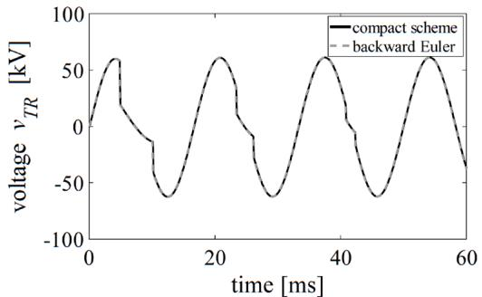

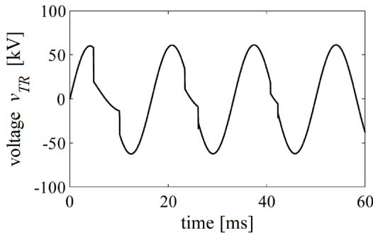  
(a) Voltage waveforms $V _ { T R }$ computed using the compact scheme and backward Euler method.

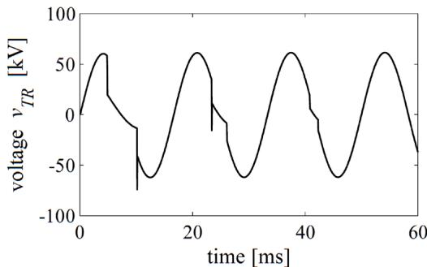  
(b) Voltage waveform $V _ { T R }$ computed using CDA.

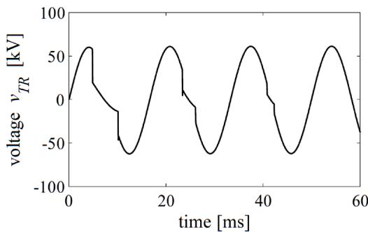  
(c) Voltage waveform Vr computed using 2S-DIRK.   
(d) Voltage waveform $V _ { T R }$ computed using TR-BDF2.   
Fig. 14. Voltage waveforms computed using the compact scheme, CDA, 2S-DIRK, TR-BDF2 and backward Euler method for the equivalent circuit for analyzing inrush currents.

approximately twice as computationally expensive as CDA to obtain the value of the present time step, a time step size larger than that of CDA can be used in the simulations using the compact scheme. In the latter case, the total computational time using the compact scheme is smaller than that of CDA.

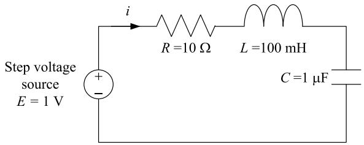  
Fig. 15. Series R-L-C circuit connected with a step voltage source.

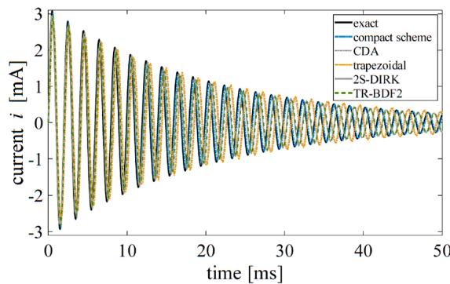  
(a) Waveforms in a time range from O to 50 ms.

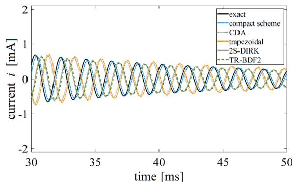  
(b) Waveforms in a time range from 30 to 50 ms.

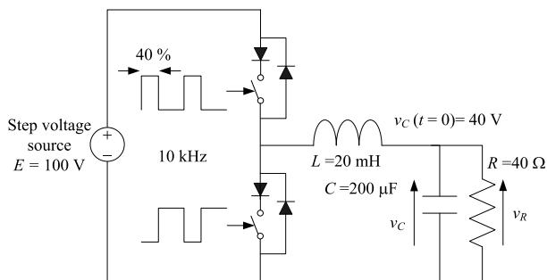  
Fig. 16. Current waveforms computed using the compact scheme, CDA, the trapezoidal method, 2S-DIRK and TR-BDF2 for the series R-L-C circuit.   
Fig. 17. PWM- controlled DC-DC converter circuit.

# 6. Conclusion

This paper has proposed a one-stage and oscillation free numerical integration method using the compact scheme for EMT simulations. Since the compact scheme becomes L-stable at a moment when a circuit suddenly changes to a stiff system, the method is capable of suppressing spurious numerical oscillations. Moreover, the compact scheme does not

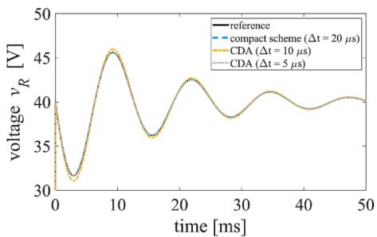  
(a) Waveforms computed using the compact scheme and CDA.

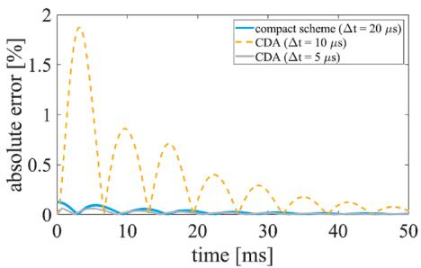  
(b) Deviation between each computed waveform and the reference solution.   
Fig. 18. Voltage waveforms computed using the compact scheme and CDA for the DC-DC converter circuit.

produce spurious spikes due to nonlinear elements. The compact scheme has been compared with CDA, the trapezoidal method, 2S-DIRK and TR-BDF2. It follows from the comparison that the compact scheme does not produce the numerical oscillations and spikes and the accuracy of the method is better than CDA, the trapezoidal method, 2S-DIRK and TR-BDF2. The computation time or speed of the compact scheme has not been discussed in this paper, which will need to be examined against large complex test cases in comparison with representative existing methods.

# CRediT authorship contribution statement

Yohei Tanaka: Conceptualization, Methodology, Writing – original draft. Yoshihiro Baba: Writing – review & editing.

# Declaration of Competing Interest

The authors declare that they have no known competing financial interests or personal relationships that could have appeared to influence the work reported in this paper.

# Data availability

The authors do not have permission to share data.

# References

[1] J. Mahseredjian, V. Dinavahi, J.A. M.artinez, ‘Simulation tools for electromagnetic transients in power systems: overview and challenges, IEEE Trans. Power Del. 24 (3) (Jul. 2009) 1657–1669.   
[2] W. Nzale, J. Mahseredjian, X. Fu, Kocar I, C. Dufour, Improving numerical accuracy in time-domain simulation for power electronics circuits, IEEE Open Access J. Power Energy 8 (2021) 157–165.   
[3] J. Mahseredjian, S. Dennetiere, L. Dube, B. Kodabakhchuan, L. Gerin-Lajoie, On a new approach for the simulation of transients in power systems, in: Proc. IPST 2005 (Int. conf. Power Syst. Transients), Paper # 05-139, 2005. Montreal, Canada.   
[4] P. Kuffel, K. Kent, G. Irwin, The implementation and effectiveness of linear interpolation within digital simulation, in: Proc. IPST 1995 (Int. conf. Power Syst. Transients), 1995, pp. 499–504. Lisbon, Portugal.   
[5] J.R. M.arti, J. Lin, Suppression of numerical oscillations in the EMTP power systems, IEEE Trans. Power Syst. 4 (2) (1989) 739–747.   
[6] J. Lin, J.R. M.arti, Implementation of the CDA procedure in the EMTP, IEEE Trans. Power Syst. 5 (2) (1990) 394–402.   
[7] T. Noda, K. Takenaka, T. Inoue, Numerical integration by the 2-stage diagonally implicit Runge-Kutta method for electromagnetic transient simulations, IEEE Trans. Power Deliv. 24 (1) (2009) 390–399.   
[8] T. Noda, T. Kikuma, R. Yonezawa, Supplementary techniques for 2S-DIRK-based EMT simulations,, Electric Power Syst. Res. 115 (2014) 87–93.   
[9] J. Tant, J. Driesen, On the numerical accuracy of electromagnetic transient simulation with power electronics, IEEE Trans. Power Deliv. 33 (5) (2018) 2492–2501.   
[10] S.K. L.ele, Compact finite difference schemes with spectral-like resolution, J. Comput. Phys. 103 (1) (1992) 16–42.   
[11] H.L. Meitz, H.F. Fasel, A compact-difference scheme for the Navier–Stokes equations in vorticity–velocity formulation, J. Comput. Phys. 157 (1) (2000) 371–403.   
[12] J.M.C. Pereira, M.H. Kobayashi, J.C.F. Pereira, A fourth-order-accurate finite volume compact method for the incompressible Navier–Stokes solutions, J. Comput. Phys. 167 (1) (2001) 217–243.   
[13] G. Hachtel, R. Brayton, F. Gustavson, The Sparse Tableau approach to network analysis and design, IEEE Trans. Circuit Theory 18 (1) (1971) 101–113. Jan.   
[14] J.C. B.utcher, Numerical Methods for Ordinary Differential Equations, John Wiley & Sons, Ltd, 2008.   
[15] EMTP User Manual [Online]. Available: https://www.emtp.com/.